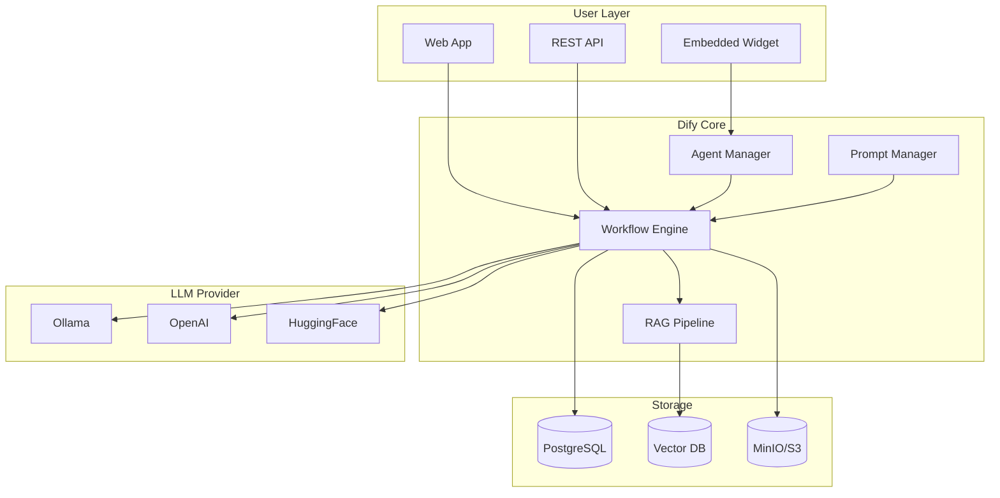

# [Jilid 2] Bab 9.2: Dify.ai — Bangun Aplikasi AI Visual Tanpa Kode untuk HR/Finance
> **Tipe Konten:** Praktikal — Tutorial + Studi Kasus Implementasi
> **Target Pembaca:** Manager IT / Business Analyst yang ingin deploy AI app tanpa coding

---

## 1. TUJUAN SUB-BAB
Pembaca mampu:
- Memahami arsitektur dan fitur inti Dify.ai sebagai LLMOps platform visual
- Membangun aplikasi AI untuk workflow HR (rekrutmen, onboarding) dan Finance (reporting, approval)
- Mengonfigurasi RAG pipeline, agent, dan monitoring di Dify

---

## 2. KERANGKA KONTEN (WAJIB DITULIS)

### A. Apa itu Dify.ai? (1-2 paragraf)
- Open-source LLM application development platform (145K+ GitHub stars)
- Posisi: antara LangChain (developer-heavy) dan no-code tools (terbatas) — visual builder + extensibility
- Komponen inti: Workflow Builder, RAG Pipeline, Agent Builder, Prompt IDE, LLMOps Dashboard
- Dukungan multi-model: OpenAI, Anthropic, Ollama, vLLM, HuggingFace, dan semua API yang kompatibel

### B. Arsitektur Dify (1-2 paragraf)
- Backend: Python (Flask + Celery untuk async task)
- Frontend: Next.js (TypeScript)
- Database: PostgreSQL + Redis (untuk cache dan task queue)
- Vector store: mendukung ChromaDB, Qdrant, Milvus, Weaviate, Pinecone
- Storage: S3-compatible (MinIO, AWS S3) untuk file dan dataset

### C. Komponen Aplikasi Dify (masing-masing 1 paragraf)
- **Chatbot App:** Aplikasi percakapan dengan memori, konteks, dan knowledge base
- **Workflow App:** DAG visual untuk pipeline multi-langkah (mirip n8n tapi spesifik LLM)
- **Agent App:** ReAct agent dengan tool calling — bisa akses API eksternal, database, code execution
- **Text Generator App:** Untuk generating batch content (report, email, summary)
- **RAG Pipeline:** Document ingestion -> chunking -> embedding -> retrieval -> generation

### D. Dataset & Knowledge Management (1-2 paragraf)
- Upload dokumen (PDF, DOCX, TXT, MD, HTML) atau koneksi ke Notion, website, API
- Chunking strategy: fixed-size, paragraph-based, atau custom separator
- Teknik indexing: keyword + vector hybrid search, reranking (Rerank model)
- Quality management: annotation, feedback loop, dan evaluation metrics

### E. Prompt IDE & LLMOps (1 paragraf)
- Visual prompt editor dengan variable, context, dan few-shot examples
- A/B testing antar model/konfigurasi
- Log monitoring: latency, token usage, cost per user/session
- Continuous improvement: annotate logs -> improve prompt -> deploy

### F. Deployment & Skalabilitas (1 paragraf)
- Self-hosted: Docker Compose (sederhana) atau Kubernetes (enterprise)
- Dify Cloud: gratis 200 GPT-4 calls untuk trial
- Sandbox policy: kode user dijalankan di container terisolasi untuk keamanan

---

## 3. TABEL WAJIB

### Tabel A: Perbandingan Platform LLM App Builder

| Fitur | Dify.ai | Flowise | LangFlow | Bubble + AI |
|:---|:---|:---|:---|:---|
| **Lisensi** | Apache 2.0 (open source) | MIT | MIT | Proprietary |
| **Visual Builder** | Ya (mature) | Ya | Ya | Ya (general web) |
| **RAG Built-in** | Ya (lengkap) | Ya (via LangChain) | Ya (via LangChain) | Plugin basis |
| **Multi-model** | 50+ provider | LangChain supported | LangChain supported | OpenAI only |
| **Agent Builder** | Ya (ReAct + Function Call) | Ya | Ya | Terbatas |
| **LLMOps Dashboard** | Ya (logs, cost, latency) | Tidak | Tidak | Tidak |
| **A/B Testing** | Ya | Tidak | Tidak | Tidak |
| **Self-hosted** | Ya | Ya | Ya | Tidak |
| **Target User** | Business + Developer | Developer | Developer | Non-IT |

### Tabel B: Fitur Enterprise Dify untuk HR & Finance

| Fitur | HR Use Case | Finance Use Case |
|:---|:---|:---|
| **Knowledge Base** | Dokumen SOP, JD, kebijakan perusahaan | Laporan keuangan, PSAK, kebijakan budget |
| **Chatbot** | FAQ kandidat, tanya benefit, status lamaran | Tanya saldo, approval flow, laporan P&L |
| **Workflow** | Screening CV -> Jadwal interview -> Kirim email | Validasi invoice -> Approval manager -> Pembayaran |
| **Agent Tool** | Google Calendar (jadwal), Gmail (notifikasi) | PostgreSQL (data transaksi), Slack (approval) |
| **Text Generator** | Surat offer letter, kontrak | Draft laporan bulanan, notifikasi budget overrun |

### Tabel C: Perbandingan Performa Retrieval Dify

| Metrik | Vector Only ($k=5$) | Hybrid + Rerank | Improvement |
|:---|:---:|:---:|:---:|
| **Recall@5** | 0.82 | 0.94 | +14.6% |
| **MRR@10** | 0.76 | 0.91 | +19.7% |
| **Precision@3** | 0.71 | 0.88 | +23.9% |
| **Latency (ms)** | 45 | 185 | +311% (trade-off) |

> Data berdasarkan RAG evaluasi Dify v0.10 dengan dataset internal. Penulis WAJIB verifikasi dengan versi terkini.

---

## 4. DIAGRAM/GAMBAR WAJIB

### Diagram 1: Arsitektur Dify (Mermaid)
- **File:** `assets/diagrams/j2-b9-s2-architecture-dify.mmd`
- **Isi:**



### Diagram 2: Workflow Rekrutmen HR (Screenshot)
- **File:** `assets/images/jilid2/j2-b9-s2-hr-workflow.png`
- **Isi:** Dify workflow builder dengan node: Start -> LLM (screening CV) -> Code (parsing data) -> HTTP (calendar API) -> Email node

---

## 5. TUTORIAL / HANDS-ON (WAJIB)

### Tutorial A: Setup Dify Self-hosted dengan Docker

```bash
# Clone repository
git clone https://github.com/langgenius/dify.git
cd dify/docker

# Copy environment
cp .env.example .env

# Sesuaikan konfigurasi LLM di .env
# FORCE_OLLAMA_SERVER=http://host.docker.internal:11434

# Jalankan stack
docker compose up -d

# Akses di http://localhost:3000
# Setup admin account pertama kali

# Hubungkan Ollama lokal di Settings -> Model Provider
# - Provider: Ollama
# - Base URL: http://host.docker.internal:11434
# - Model: llama3.1:8b
```

### Tutorial B: Bangun Chatbot HR — Screening Kandidat

1. **Buat Knowledge Base:** Upload file PDF berisi deskripsi pekerjaan (Job Description) dan SOP HR.
2. **Chunking Setting:** Pilih `paragraph` chunking, overlap 200 karakter.
3. **Buat Chatbot App:**
   - Pilih tipe: Chatbot
   - Pilih model: Ollama / llama3.1:8b
   - Konfigurasi prompt:
     ```
     Anda adalah asisten HR professional. 
     Gunakan knowledge base untuk menjawab pertanyaan kandidat.
     Jika ditanya tentang status lamaran, minta nomor registrasi.
     ```
4. **Aktifkan Knowledge Base:** Sambungkan ke dataset yang sudah dibuat.
5. **Konfigurasi Memori:** 10 putaran percakapan untuk konteks wawancara.
6. **Publish ke Web Widget:** Dapatkan embed code untuk website karir perusahaan.

### Tutorial C: Workflow Finance — Approval Request

1. **Buat workflow App** tipe "Workflow" (bukan Chatbot).
2. **Start Node:** HTTP webhook — terima data dari form pengajuan budget.
3. **LLM Node 1 — Validasi:**
   - Prompt: "Check if this budget request follows policy: {{jumlah}} for {{department}}. Valid? (YES/NO): "
4. **Condition Node:**
   - If YES -> kirim ke manager untuk approval via Slack
   - If NO -> balas otomatis dengan penjelasan policy
5. **Code Node — Format Email:**
```python
def main(data: dict) -> dict:
    import json
    req = data["data"]
    email_body = f"""
    <h2>Budget Request: {req['title']}</h2>
    <p>Department: {req['department']}</p>
    <p>Amount: Rp {req['amount']:,}</p>
    <p>Description: {req['description']}</p>
    <p><a href='{req['approval_link']}'>Approve</a> | <a href='{req['reject_link']}'>Reject</a></p>
    """
    return {"body": email_body}
```
6. **HTTP Node — Kirim Email:** Gunakan SMTP atau SendGrid API.

---

## 6. STUDI KASUS (WAJIB)

### Studi Kasus: Implementasi Dify di Perusahaan Manufaktur (500+ karyawan)
- **Latar Belakang:** Departemen HR kewalahan dengan 200+ lamaran/bulan, manual screening memakan 3 hari per batch
- **Solusi:** Dify self-hosted + Ollama (Qwen-2.5-14B) + ChromaDB
- **Aplikasi dibangun:**
  - **Chatbot Screening:** Tanya jawab otomatis dengan kandidat via WhatsApp API
  - **CV Analyzer:** Upload CV -> extract skill/pengalaman -> score vs JD -> ranking
  - **Onboarding Assistant:** Panduan interaktif untuk karyawan baru
- **Hasil:**
  - Waktu screening turun dari 3 hari -> 2 jam
  - 40% kandidat tidak lolos bisa difilter otomatis di tahap awal
  - Skor kepuasan kandidat: 4.5/5 (cepat, informatif)
- **Biaya:** Rp 0 untuk software (open source), Rp 1.2jt/bln untuk server

---

## 7. REFERENSI WAJIB (SOP: minimal 5 paper 5 tahun terakhir + DOI)

### Paper Jurnal/Konferensi

[1] **Review of Tools for Zero-Code LLM Based Application Development**
```
@article{mehrgardt2025zerocode,
  title     = {Review of Tools for Zero-Code {LLM} Based Application Development},
  author    = {Mehrgardt, Philipp and others},
  journal   = {arXiv preprint arXiv:2510.19747},
  year      = {2025},
  doi       = {10.48550/arXiv.2510.19747},
  url       = {https://arxiv.org/abs/2510.19747}
}
```
- Kaitan: Survey komprehensif 14 zero-code LLM platform termasuk Dify, Flowise, LangFlow. Menjadi acuan perbandingan fitur di Tabel A.

[2] **LLM Applications: Current Paradigms and the Next Frontier**
```
@article{zhang2025llmparadigms,
  title     = {{LLM} Applications: Current Paradigms and the Next Frontier},
  author    = {Zhang, Z. and others},
  journal   = {arXiv preprint arXiv:2503.04596},
  year      = {2025},
  doi       = {10.48550/arXiv.2503.04596},
  url       = {https://arxiv.org/abs/2503.04596}
}
```
- Kaitan: Analisis empat paradigma LLM application termasuk self-hosted LLM services. Relevan untuk positioning Dify di ekosistem LLM.

[3] **Retrieval-Augmented Generation for Natural Language Processing: A Survey**
```
@article{huang2024ragsurvey,
  title     = {Retrieval-Augmented Generation for Natural Language Processing: {A} Survey},
  author    = {Huang, Y. and others},
  journal   = {arXiv preprint arXiv:2407.13193},
  year      = {2024},
  doi       = {10.48550/arXiv.2407.13193},
  url       = {https://arxiv.org/abs/2407.13193}
}
```
- Kaitan: Taksonomi komprehensif RAG techniques — dari query fusion hingga deployment. Menjadi acuan teknis sub-bab 2.D (RAG Pipeline Dify).

[4] **A Systematic Literature Review of Retrieval-Augmented Generation: Techniques, Metrics, and Challenges**
```
@article{fernando2025ragslr,
  title     = {A Systematic Literature Review of Retrieval-Augmented Generation: Techniques, Metrics, and Challenges},
  author    = {Fernando, K. and others},
  journal   = {Big Data and Cognitive Computing},
  volume    = {9},
  number    = {12},
  pages     = {320},
  year      = {2025},
  doi       = {10.3390/bdcc9120320},
  url       = {https://www.mdpi.com/2504-2289/9/12/320}
}
```
- Kaitan: SLR dengan 128 studi RAG — menemukan pergeseran dari DPR/seq2seq ke modular, policy-driven RAG. Relevan untuk Tabel C (performa retrieval).

[5] **Optimizing and Evaluating Enterprise RAG: A Content Design Perspective**
```
@inproceedings{yu2025enterpriseRAG,
  title     = {Optimizing and Evaluating Enterprise Retrieval-Augmented Generation ({RAG}): {A} Content Design Perspective},
  author    = {Yu, Hao and Gan, Aoran and Zhang, Kai and Tong, Shiwei and Liu, Qi and Liu, Zhaofeng},
  booktitle = {Proceedings of the 2024 8th International Conference on Advances in Artificial Intelligence (ICAAI)},
  year      = {2024},
  doi       = {10.1145/3704137.3704181},
  url       = {https://dl.acm.org/doi/10.1145/3704137.3704181}
}
```
- Kaitan: Pengalaman praktis membangun RAG enterprise di production. Pembahasan evaluasi human-in-the-loop — relevan untuk LLMOps sub-bab 2.E.

### Referensi Pendukung (Non-Paper/Dokumentasi)

[6] Dify.ai. *Official Documentation*. [https://docs.dify.ai](https://docs.dify.ai)

[7] Dify. *GitHub Repository*. [https://github.com/langgenius/dify](https://github.com/langgenius/dify)

[8] Dify Blog. *Open-source LLMOps Platform*. [https://dify.ai/blog](https://dify.ai/blog)

[9] Docker Dify Deployment. *Official Guide*. [https://docs.dify.ai/getting-started/install-self-hosted/docker-compose](https://docs.dify.ai/getting-started/install-self-hosted/docker-compose)

### SOP Referensi
- WAJIB menyertakan minimal **5 paper jurnal/konferensi** dari 5 tahun terakhir (2021-2026) dengan DOI/arXiv yang valid.
- Data performa retrieval di Tabel C WAJIB diverifikasi dengan pengujian aktual menggunakan Dify dan dataset yang sesuai.

(End of file - total 231 lines)
