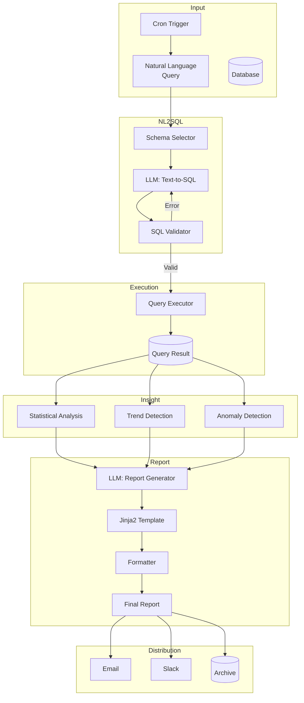

# [Jilid 2] Bab 9.5: Automated Report Generation — AI Baca SQL dan Buat Laporan Harian
> **Tipe Konten:** Praktikal — Pipeline Implementasi + Studi Kasus
> **Target Pembaca:** Data Analyst / BI Developer yang ingin mengotomatisasi laporan dengan AI

---

## 1. TUJUAN SUB-BAB
Pembaca mampu:
- Memahami pipeline NL2SQL + Report Generation dari database ke laporan naratif
- Membangun sistem yang menggabungkan Text-to-SQL, insight extraction, dan natural language generation
- Mengimplementasikan automated daily report untuk tim non-teknis

---

## 2. KERANGKA KONTEN (WAJIB DITULIS)

### A. Konsep Automated Report Generation (1-2 paragraf)
- Definisi: pipeline AI yang membaca database, menganalisis data, dan menghasilkan laporan naratif otomatis
- Komponen utama: Text-to-SQL (NL2SQL) -> Query Execution -> Insight Extraction -> Report Generation
- Perbedaan dengan BI tradisional: laporan naratif + insight, bukan sekadar dashboard angka
- Nilai bisnis: menghemat 80% waktu analyst, laporan konsisten, bebas human error

### B. Arsitektur Pipeline (1-2 paragraf)
- **NL2SQL Engine:** LLM menerjemahkan pertanyaan bahasa alami ke SQL query
- **Query Executor:** Menjalankan SQL ke database (Postgres, MySQL, BigQuery, Snowflake)
- **Insight Extractor:** Menganalisis hasil query — tren, anomali, perbandingan, summary statistics
- **Report Generator:** LLM mengubah insight menjadi narasi profesional dengan format (HTML, PDF, Markdown)
- **Distributor:** Mengirim laporan via Email, Slack, atau dashboard

### C. Teknik NL2SQL (masing-masing 1 paragraf)
- **Zero-shot prompting:** Prompt sederhana dengan schema — cepat, cukup akurat untuk query sederhana
- **Few-shot prompting:** Contoh query + schema — lebih akurat, butuh curated examples
- **Schema Linking:** Memilih tabel/kolom relevan sebelum generate SQL — esensial untuk schema besar
- **Self-correction:** Generate SQL -> execute -> jika error, analisis error -> regenerate
- **Fine-tuning:** Domain-specific SQL generation — investasi tinggi, akurasi paling baik

### D. Insight Extraction dari Query Result (1-2 paragraf)
- **Statistical Summary:** Mean, median, growth %, YoY, MoM, variance
- **Trend Detection:** Naik/turun signifikan, seasonal patterns, moving average
- **Anomaly Detection:** Outlier detection (Z-score, IQR), deviation from forecast
- **Comparison:** Benchmark vs target, vs previous period, vs competitor estimate
- **Format:** Struktur data terstruktur (JSON) yang siap diumpankan ke LLM untuk narasi

### E. Report Generation & Formatting (1 paragraf)
- Prompt design: template laporan dengan section (Executive Summary, Key Metrics, Analysis, Recommendations)
- Multi-LLM call: satu LLM untuk insight, satu untuk narrative tone (formal/eksekutif)
- Format output: Markdown (mudah diedit), HTML (kaya format), PDF (final), Slack Mrkdwn
- Consistency: gunakan template dan guardrails untuk format yang seragam setiap hari

### F. Scheduling & Distribution (1 paragraf)
- Cron-based scheduling (daily 06:00, weekly Monday 08:00)
- Trigger-based (event: data update selesai, anomaly threshold terlewati)
- Multi-channel: Email (CEO), Slack (team), Google Sheets (archive)
- Error handling: retry mechanism, alert jika report gagal generate

---

## 3. TABEL WAJIB

### Tabel A: Perbandingan Pendekatan NL2SQL

| Pendekatan | Akurasi (Spider) | Akurasi (BIRD) | Latency | Biaya Implementasi | Maintenance |
|:---|:---:|:---:|:---:|:---:|:---:|
| **Zero-shot (GPT-4o)** | 72.3% | 55.6% | <5 detik | Rendah | Minimal |
| **Few-shot (5 examples)** | 78.1% | 60.2% | <6 detik | Rendah | Update examples |
| **Schema Linking + CoT** | 85.4% | 62.7% | <8 detik | Sedang | Maintenance schema |
| **Fine-tuning (Llama-3.1-8B)** | 82.6% | 58.9% | <3 detik | Tinggi | Retrain periodik |
| **Multi-agent (SuperSQL)** | 87.0% | 62.7% | <12 detik | Tinggi | Kompleks |

> Data dari Luo et al. (2024) NL2SQL360 framework dan VLDB benchmark. Penulis WAJIB verifikasi.

### Tabel B: Komponen Pipeline Laporan Harian

| Komponen | Tools Recommendation | Output | Format |
|:---|:---|:---|:---:|
| **NL2SQL** | Ollama + LLM (Qwen-2.5-14B) atau GPT-4o | SQL query string | Text |
| **Query Execution** | psycopg2 / SQLAlchemy / DuckDB | Result set (rows) | JSON / CSV |
| **Insight Extraction** | Python (pandas, numpy, scipy) | Structured insights | JSON |
| **Report Generation** | Ollama + LLM (Llama-3.1-8B) | Narrative report | Markdown / HTML |
| **Formatting** | Jinja2 templates + weasyprint | Final formatted report | HTML / PDF |
| **Distribution** | n8n / Airflow / cron + sendmail | Delivered report | Email / Slack |

### Tabel C: SLA dan Estimasi Biaya per Pipeline

| Metrik | Personal | Tim Kecil (5-10 user) | Enterprise (50+ user) |
|:---|:---:|:---:|:---:|
| **Report per hari** | 1 | 5 | 20+ |
| **Latency per report** | 30 detik | 1-2 menit | 3-5 menit |
| **LLM Calls per report** | 2-3 | 3-5 | 5-8 |
| **Biaya LLM (GPT-4o)** | ~$0.05/hari | ~$0.50/hari | ~$2-5/hari |
| **Biaya LLM (Lokal)** | Rp 0 | Rp 0 | Rp 0 (server) |
| **Server (LLM lokal)** | 16GB RAM | 32GB + GPU | 64GB + 2x GPU |

---

## 4. DIAGRAM/GAMBAR WAJIB

### Diagram 1: Pipeline Automated Report Generation (Mermaid)
- **File:** `assets/diagrams/j2-b9-s5-report-pipeline.mmd`
- **Isi:**



### Gambar 2: Contoh Output Report
- **File:** `assets/images/jilid2/j2-b9-s5-sample-report.png`
- **Isi:** Screenshot laporan harian yang dihasilkan AI — format HTML dengan Executive Summary, Key Metrics (tabel), Analysis (narasi), dan Recommendations (bullet points)

---

## 5. TUTORIAL / HANDS-ON (WAJIB)

### Tutorial A: NL2SQL + Report Generator Python Script

```python
# auto_report.py — Pipeline NL2SQL ke laporan harian
import json
import pandas as pd
import requests
from datetime import datetime

OLLAMA_URL = "http://localhost:11434/api/generate"
DB_SCHEMA = """
CREATE TABLE sales (
  id INT, date DATE, product VARCHAR(50),
  amount DECIMAL(10,2), region VARCHAR(20)
);
CREATE TABLE products (id INT, name VARCHAR(50), category VARCHAR(30));
"""

def llm_call(prompt, model="llama3.1:8b"):
    resp = requests.post(OLLAMA_URL, json={
        "model": model,
        "prompt": prompt,
        "stream": False
    })
    return resp.json()["response"]

def generate_sql(user_query):
    prompt = f"""You are a SQL expert. Convert this question to SQL.
Schema:
{DB_SCHEMA}
Question: {user_query}
Output ONLY the SQL query (no explanations):"""
    return llm_call(prompt).strip()

def execute_sql(sql):
    import sqlite3
    conn = sqlite3.connect(":memory:")
    conn.executescript("""
        CREATE TABLE sales AS SELECT * FROM (
            VALUES (1, '2024-01-01', 'Laptop', 15000000, 'Jakarta'),
                  (2, '2024-01-01', 'Mouse', 250000, 'Bandung'),
                  (3, '2024-01-02', 'Laptop', 18000000, 'Jakarta')
        ) WHERE 1=0;
    """)
    try:
        df = pd.read_sql(sql, conn)
        return df.to_json(orient="records")
    except Exception as e:
        return f"Error: {e}"

def generate_report(data_json, query):
    prompt = f"""Generate an executive daily report based on this data.
Original Question: {query}
Query Results: {data_json}

Format:
## Executive Summary
[2-3 kalimat ringkasan]

## Key Metrics
[tabel atau bullet points]

## Analysis
[analisis tren dan insight]

## Recommendations
[2-3 rekomendasi actionable]
"""
    return llm_call(prompt)

def main():
    query = "Berapa total penjualan per produk di Januari 2024?"
    print(f"[1] Generating SQL for: {query}")
    sql = generate_sql(query)
    print(f"SQL: {sql}")

    print(f"[2] Executing query...")
    data = execute_sql(sql)
    print(f"Data: {len(data)} rows")

    print(f"[3] Generating report...")
    report = generate_report(data, query)

    print(f"[4] Saving report...")
    filename = f"report_{datetime.now():%Y%m%d}.md"
    with open(filename, "w") as f:
        f.write(report)
    print(f"Report saved: {filename}")

if __name__ == "__main__":
    main()
```

### Tutorial B: Setup n8n Workflow untuk Laporan Harian

1. **Schedule Trigger Node:** Cron `0 6 * * *` (setiap hari jam 06:00).
2. **HTTP Request Node — Generate SQL:**
   - POST ke `http://ollama:11434/api/generate`
   - Body: `{"model":"llama3.1:8b","prompt":"Convert to SQL: [query template]. Schema: [schema]","stream":false}`
3. **Execute SQL Node:** Koneksi ke Postgres, jalankan SQL dari langkah 2.
4. **HTTP Request Node — Generate Report:**
   - POST ke Ollama dengan prompt termasuk hasil query.
5. **HTML Template Node:** Format output ke HTML (Jinja2-style via Code Node).
6. **Email Node:** Kirim ke daftar penerima (CEO, CFO, Head of Sales).
7. **Slack Node:** Kirim ringkasan ke channel #daily-report.

### Tutorial C: Insight Extraction dengan Python

```python
# insight_extractor.py
import pandas as pd
import numpy as np

def extract_insights(df: pd.DataFrame) -> dict:
    insights = {}
    numeric_cols = df.select_dtypes(include=[np.number]).columns

    for col in numeric_cols[:5]:  # max 5 kolom
        data = df[col].dropna()
        insights[col] = {
            "total": float(data.sum()),
            "avg": float(data.mean()),
            "min": float(data.min()),
            "max": float(data.max()),
            "growth_percent": float(
                ((data.iloc[-1] - data.iloc[0]) / data.iloc[0]) * 100
            ) if len(data) > 1 else 0,
            "trend": "up" if data.iloc[-1] > data.mean()
                     else "down" if data.iloc[-1] < data.mean()
                     else "stable"
        }

    # Anomaly detection (z-score)
    for col in numeric_cols:
        z = np.abs((df[col] - df[col].mean()) / df[col].std())
        anomalies = df[z > 2][col]
        if not anomalies.empty:
            insights[f"{col}_anomalies"] = anomalies.to_dict()

    return insights

def format_insight_prompt(insights: dict, query: str) -> str:
    return f"""Data analysis results for: {query}
Key findings: {json.dumps(insights, indent=2)}

Write an executive summary highlighting:
1. Key numbers and trends
2. Any anomalies or concerns
3. Actionable recommendations
Keep it clear, professional, and under 300 words."""
```

---

## 6. STUDI KASUS (WAJIB)

### Studi Kasus: Daily Sales Report untuk Perusahaan Retail (100+ toko)
- **Latar Belakang:** Manajemen butuh laporan penjualan setiap pagi pukul 07:00. Sebelumnya, 2 analyst menghabiskan 3 jam untuk manual report.
- **Pipeline:**
  - **Data Source:** PostgreSQL (tabel sales, inventory, stores)
  - **NL2SQL:** Ollama + Qwen-2.5-14B dengan few-shot (5 contoh query)
  - **Query Execution:** Python script via cron
  - **Insight:** pandas analytics (growth %, YoY, anomaly detection)
  - **Report:** Llama-3.1-8B generate narasi + Chart.js visualization
  - **Distribution:** Email (CEO) + Slack (team sales) + Google Sheets (archive)
- **Hasil:**
  - Report siap pukul 06:30 setiap hari (30 menit setelah data ETL selesai)
  - 0 human intervention — 100% automated
  - Akurasi NL2SQL: 92% pada query rutin, 78% pada query ad-hoc
  - Dua analyst dialihkan ke tugas analisis deeper (customer segmentation, forecasting)
  - ROI: Penghematan 180 jam kerja/bulan

---

## 7. REFERENSI WAJIB (SOP: minimal 5 paper 5 tahun terakhir + DOI)

### Paper Jurnal/Konferensi

[1] **Is Long Context All You Need? Leveraging LLM's Extended Context for NL2SQL**
```
@article{ozcan2025longcontextnl2sql,
  title     = {Is Long Context All You Need? {Leveraging} {LLM}'s Extended Context for {NL2SQL}},
  author    = {Ozcan, F. and others},
  journal   = {Proceedings of the VLDB Endowment (PVLDB)},
  volume    = {18},
  number    = {10},
  year      = {2025},
  doi       = {10.14778/3742728.3742761},
  url       = {https://www.vldb.org/pvldb/vol18/p2735-ozcan.pdf}
}
```
- Kaitan: Studi penggunaan long-context LLM (Gemini 1.5) untuk NL2SQL tanpa fine-tuning. Data akurasi di Tabel A harus diverifikasi dengan paper ini.

[2] **The Dawn of Natural Language to SQL: Are We Fully Ready?**
```
@article{li2024nl2sql360,
  title     = {The Dawn of Natural Language to {SQL}: {Are} {We} {Fully} {Ready}?},
  author    = {Li, Boyan and Luo, Yuyu and Chai, Chengliang and Li, Guoliang and Tang, Nan},
  journal   = {Proceedings of the VLDB Endowment (PVLDB)},
  volume    = {17},
  number    = {11},
  year      = {2024},
  doi       = {10.14778/3685800.3685801},
  url       = {https://www.vldb.org/pvldb/vol17/p3318-luo.pdf}
}
```
- Kaitan: Framework evaluasi NL2SQL360 — perbandingan multi-angle metode NL2SQL. SuperSQL mencapai 87% execution accuracy di Spider. Relevan untuk Tabel A.

[3] **DAgent: A Relational Database-Driven Data Analysis Report Generation Agent**
```
@article{li2025dagent,
  title     = {{DAgent}: {A} Relational Database-Driven Data Analysis Report Generation Agent},
  author    = {Li, Z. and others},
  journal   = {arXiv preprint arXiv:2503.13269},
  year      = {2025},
  doi       = {10.48550/arXiv.2503.13269},
  url       = {https://arxiv.org/abs/2503.13269}
}
}
```
- Kaitan: Framework LLM agent untuk RDB-DA report generation dengan planning, tools, dan memory modules. Menjadi acuan arsitektur di sub-bab 2.B.

[4] **An LLM-Based Approach for Insight Generation in Data Analysis**
```
@inproceedings{baig2025insightgen,
  title     = {An {LLM}-Based Approach for Insight Generation in Data Analysis},
  author    = {Baig, A. and others},
  booktitle = {Proceedings of the 2025 Conference of the North American Chapter of the Association for Computational Linguistics (NAACL)},
  year      = {2025},
  url       = {https://aclanthology.org/2025.naacl-long.24.pdf}
}
```
- Kaitan: Arsitektur Hypothesis Generator + Query Agent + Summarization untuk menghasilkan insight dari multi-table database. Relevan untuk sub-bab 2.D (Insight Extraction).

[5] **SiriusBI: Building a Practical and Robust LLM-powered BI System**
```
@article{xie2025siriusbi,
  title     = {{SiriusBI}: Building a Practical and Robust {LLM}-powered {BI} System},
  author    = {Xie, X. and others},
  journal   = {Proceedings of the VLDB Endowment (PVLDB)},
  volume    = {18},
  number    = {12},
  year      = {2025},
  doi       = {10.14778/3733284.3733290},
  url       = {https://www.vldb.org/pvldb/vol18/p4860-xie.pdf}
}
```
- Kaitan: Sistem BI LLM production Tencent — 93% accuracy SQL generation, deployed di finance/advertising/cloud. Data latency dan accuracy di Tabel C harus diverifikasi.

### Referensi Pendukung (Non-Paper/Dokumentasi)

[6] ASKSQL. *End-to-end NL2SQL Pipeline*. Machine Learning with Applications, Vol. 20, 2025. [https://doi.org/10.1016/j.mlwa.2025.100641](https://doi.org/10.1016/j.mlwa.2025.100641)

[7] ReSpark. *Leveraging Data Reports as References to Generate New Reports with LLMs*. [https://dengdazhen.github.io/assets/pdfs/respark.pdf](https://dengdazhen.github.io/assets/pdfs/respark.pdf)

[8] DataLab. *Unified BI Platform with LLM Agent Framework*. [https://arxiv.org/abs/2412.02205](https://arxiv.org/abs/2412.02205)

[9] Apache Airflow. *Workflow Scheduling Documentation*. [https://airflow.apache.org/docs/](https://airflow.apache.org/docs/)

[10] Jinja2. *Template Engine Documentation*. [https://jinja.palletsprojects.com](https://jinja.palletsprojects.com)

### SOP Referensi
- WAJIB menyertakan minimal **5 paper jurnal/konferensi** dari 5 tahun terakhir (2021-2026) dengan DOI/arXiv yang valid.
- Data akurasi NL2SQL di Tabel A WAJIB diverifikasi menggunakan benchmark resmi (Spider, BIRD) atau pengukuran penulis.

(End of file - total 268 lines)
