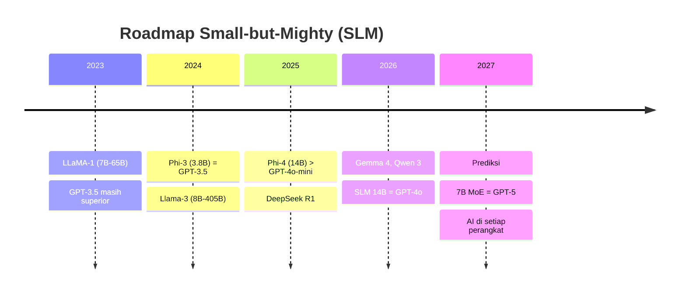
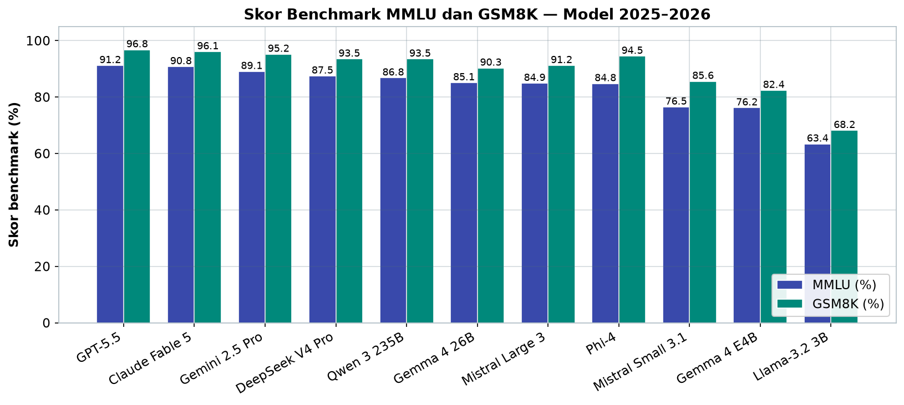
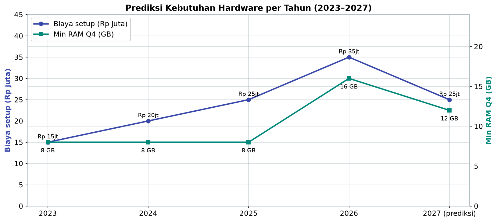
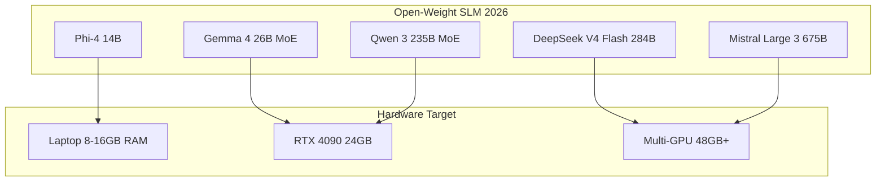

# Bab 1.10: Roadmap Model 2026

> Ada sebuah grafik yang seharusnya dipajang di dinding setiap penggemar AI lokal: performa model terbaik yang bisa Anda jalankan dengan budget Rp 30 juta, dari tahun ke tahun, terus menanjak dengan kemiringan yang hampir tegak. Model 7 miliar parameter hari ini — bila dikalibrasi dengan data yang tepat — bisa menumbangkan model 70 miliar parameter dari tiga tahun lalu. Inilah peta perjalanannya, dan titik keberangkatan Anda.

---

## 1. Tujuan Sub-Bab


Setelah membaca bab ini, Anda akan mampu:

- Menjelaskan pergeseran dari *scaling law* menuju *data quality law* dan mengapa model kecil kini bisa menyaingi model raksasa lama
- Membandingkan SLM terbaru 2025–2026: **Phi-4**, **Gemma 4**, **Llama-3.2**, **Qwen 3**, **Ministral 3**, serta model MoE besar seperti DeepSeek V4 dan Mistral Large 3
- Membaca tren arsitektur 2026 — MoE sebagai standar, multimodal, konteks raksasa, dan *reasoning model*
- Menyusun strategi adopsi hardware dan model untuk 2026–2027 berdasarkan tren yang terukur
- Mengevaluasi secara kritis klaim *benchmark* vendor dengan pengukuran mandiri di hardware sendiri

---

## 2. Dari Scaling Law ke Data Quality Law


### Era "Semakin Besar Semakin Baik"

Periode 2020–2023 dipenuhi satu mantra: *bigger is better*. GPT-3 berparameter 175B, PaLM 540B, hingga LLaMA 65B — kompetisi diukur dari jumlah parameter dan token latih, seperti balapan yang hanya menghitung kapasitas mesin tanpa peduli kualitas jalan. *Scaling law* Chinchilla (2022) bahkan memberi formula baku: performa ditentukan oleh kombinasi parameter dan token pelatihan, seolah-olah lebih banyak selalu lebih baik.

### Titik Balik: Phi-3 yang Mengejutkan Dunia

Tahun 2024–2025 menandai titik balik. **Phi-3 (3,8B)** — model kecil dari Microsoft — berhasil menyamai level performa GPT-3.5, model yang 45 kali lebih besar. Di baliknya ada satu hipotesis yang kini disebut **Hipotesis Phi**: kualitas data lebih menentukan daripada jumlah parameter. Data pelatihan yang disusun seperti "buku teks" — bersih, terstruktur, penuh penalaran bertahap — menghasilkan model kecil yang luar biasa pintar, jauh melampaui model besar yang dilatih pada data internet mentah.

Implikasi tahun 2026 tegas: model 3–7B kini bisa mencapai performa yang pada 2023 hanya dimiliki model 70B. *Scaling law* tidak mati, tetapi titik gravitasinya bergeser — dari sekadar menambah parameter ke *data quality* dan *training efficiency*. Ini adalah kabar paling menggembirakan untuk ekosistem lokal: Anda tidak lagi perlu menabung bertahun-tahun demi GPU raksasa.

Buktinya bisa Anda lihat langsung pada Tabel 2 di seksi 3: Phi-4 dengan 14 miliar parameter mencetak MMLU 84,8%, sementara LLaMA-1 65B — model dengan 4,6× lebih banyak parameter — hanya 63,4% tiga tahun sebelumnya. Selisih 21 poin persentase itu tidak datang dari ukuran, melainkan dari cara data latih disusun: bersih, terstruktur, dan penuh penalaran. Bagi pembaca buku ini, ada satu lapis makna lagi: jika data berkualitas adalah kunci, maka kurasi data berbahasa Indonesia yang baik menjadi senjata kompetitif — bukan ukuran model.

### Gambar 1: Timeline Evolusi Model

Berikut linimasa perjalanan *small-but-mighty* — dari "GPT-3.5 masih superior" hingga prediksi AI di setiap perangkat:



Perhatikan arah panah kualitatifnya: di 2023, model kecil hanya bisa mengekor; di 2024, Phi-3 menyamai GPT-3.5; di 2025, Phi-4 melampaui GPT-4o-mini; dan di 2026, SLM 14B setara GPT-4o. Setiap tahun, titik "paritas" bergeser ke parameter yang lebih kecil — tren yang menjadi dasar seluruh strategi di bab ini.


---

## 3. SLM (Small Language Models) Dominan 2026


### Parade Model Kecil

Peta SLM 2026 sangat ramai. **Phi-4 (Microsoft, 14B)** unggul di matematika dan kode, bahkan melampaui GPT-4o-mini di kedua domain. **Gemma 4 (Google)** hadir dalam tiga rasa — E2B, E4B, dan varian 26B MoE serta 31B dense — semuanya multimodal dan berlisensi **Apache 2.0**. **Llama-3.2 (Meta)** menawarkan varian 1B dan 3B yang dirancang *on-device* dengan konteks 128K dan *tool use*. **Qwen 3 (Alibaba)** berformat 235B MoE (22B aktif) yang memberikan kualitas *frontier* dengan harga SLM — sementara **Qwen3.7-Max** naik kelas menjadi model ~1T+ MoE berbasis agen dengan konteks 1 juta token, meski *closed-weight*.

Di sisi model besar *open-weight*: **DeepSeek V4 Pro** (1,6T MoE, 49B aktif, *sparsity ratio* 3,1%, lisensi MIT, konteks 1M) dan varian ringannya **DeepSeek V4 Flash** (284B MoE, 13B aktif) adalah pasangan yang dirancang saling melengkapi. **Mistral Large 3** (675B *granular MoE*, 41B aktif, Apache 2.0, multimodal) dan keluarga **Ministral 3** (3B/8B/14B dense dengan teknik *Cascade Distillation*) melengkapi jajaran Mistral.

### Yang Proprietary Ikut Bermain

Model *closed-source* juga memanjakan pengguna konteks panjang: **GPT-5.5** menawarkan konteks 1M dengan *reasoning effort* bertingkat (low/medium/high/xhigh); **Claude Fable 5** dari kelas "Mythos" Anthropic membawa konteks 1M, *safety classifiers*, dan skor SWE-bench 95%; **Gemini 2.5 Pro** menawarkan konteks 1M dengan *thinking mode* multimodal sejak GA Juni 2025. Yang penting bagi pembaca buku ini: hampir semua model di atas — kecuali yang melebihi ~300 GB parameter — dapat dijalankan di RTX 4090 24 GB dengan kuantisasi.

Pola yang perlu dicatat dari parade ini: **semakin kecil, semakin terbuka**. Kelas SLM (1–14B) hampir semuanya *open-weight* dengan lisensi permisif (Apache 2.0, MIT), kelas menengah MoE (22–49B aktif) terbelah antara *open-weight* dan proprietary, sementara kelas teratas 1M-token didominasi model tertutup. Bagi pengguna lokal, ini berarti pilihan terbaik Anda di 2026 bukan lagi model "kelas dua" — melainkan model kelas menengah yang justru dirancang agar bisa dijalankan sendiri.

### Tabel 1: SLM Terbaru 2025–2026

Berikut peta model paling relevan untuk 2026, lengkap dengan *benchmark* publik:

| Model | Parameter | Arsitektur | Context | MMLU | GSM8K | Keunikan | Min RAM |
|:---|:---:|:---:|:---:|:---:|:---:|:---|:---:|
| Phi-4 | 14B Dense | Decoder-only | 128K | 84.8% | 94.5% | Data sintetis, math terbaik | 8GB Q4 |
| Gemma 4 E4B | 4.5B Dense | Decoder + PLE | 128K | 76.2% | 82.4% | Multimodal, Apache 2.0 | 4GB Q4 |
| Gemma 4 26B | 26B MoE | MoE 256 experts | 128K | 85.1% | 90.3% | Multimodal, open-weight | 12GB Q4 |
| Llama-3.2 3B | 3.2B Dense | Decoder-only | 128K | 63.4% | 68.2% | On-device, tool use | 2GB Q4 |
| Qwen 3 235B | 235B MoE (22B active) | MoE | 128K | 86.8% | 93.5% | Reasoning, open-weight | 16GB Q4 |
| Qwen3.7-Max | ~1T+ MoE | MoE agent-centric | 1M | — | — | Agent, closed-weight | 64GB+ |
| DeepSeek V4 Pro | 1.6T MoE (49B active) | MoE CSA/HCA | 1M | 87.5%* | 93.5%† | MIT, open-weight | 32GB Q4 |
| DeepSeek V4 Flash | 284B MoE (13B active) | MoE CSA/HCA | 1M | — | — | MIT, companion Pro | 16GB Q4 |
| Mistral Large 3 | 675B MoE (41B active) | Granular MoE | 256K | 84.9% | 91.2% | Apache 2.0, multimodal | 48GB Q4 |
| Ministral 3 | 3B/8B/14B Dense | Decoder-only | 256K | — | — | Cascade Distillation | 2-8GB Q4 |
| GPT-5.5 | — | Proprietary | 1M | 91.2% | 96.8% | Reasoning effort tiers | Cloud only |
| Claude Fable 5 | — | Proprietary | 1M | 90.8% | 96.1% | SWE-bench 95%, safety | Cloud only |
| Gemini 2.5 Pro | — | Proprietary MoE | 1M | 89.1% | 95.2% | Thinking mode | Cloud only |
| Mistral Small 3.1 | 24B Dense | Decoder-only | 128K | 76.5% | 85.6% | Efisien, coding | 8GB Q4 |

*MMLU-Pro untuk DeepSeek V4; †LiveCodeBench.

Bacaan penting dari tabel ini: tiga model dengan kebutuhan RAM paling kecil (Llama-3.2 3B, Gemma 4 E4B, Ministral 3) menawarkan pilihan nyata untuk laptop 8 GB — tetapi skor MMLU-nya (63–76%) masih kalah jauh dari kelas MoE. Sementara itu, **Qwen 3 dengan 22B aktif menawarkan MMLU 86,8% hanya dengan 16 GB RAM Q4** — inilah pemenang rasio performa-per-hardware tahun ini. Untuk konteks 1M, hanya model CSA/HCA dan model proprietary yang layak.

Grafik berikut mengurutkan model dari MMLU tertinggi ke terendah, dengan GSM8K sebagai pendamping untuk melihat kekuatan penalaran matematis:



*Gambar 1.10-1 — GPT-5.5 dan Claude Fable 5 memuncaki MMLU (91,2% dan 90,8%), tetapi di kelas open-weight, DeepSeek V4 Pro (87,5%) dan Qwen 3 (86,8%) berdiri hampir setara — dengan parameter aktif jauh lebih sedikit.*


### Tabel 2: Perbandingan SLM vs LLM Lama (MMLU)

Untuk merasakan lompatan generasi, bandingkan model 2026 dengan lawan 2023:

| Model (2026) | Param | MMLU | Model (2023) | Param | MMLU | Peningkatan |
|:---|:---:|:---:|:---|:---:|:---:|:---:|
| Phi-4 | 14B | 84.8% | LLaMA-1 65B | 65B | 63.4% | 4.6x lebih efisien |
| Gemma 4 26B | 26B | 85.1% | GPT-3.5 | 175B | 70.0% | 6.7x lebih efisien |
| Qwen 3 | 22B aktif | 86.8% | LLaMA-2 70B | 70B | 68.9% | 3.2x lebih efisien |
| Llama-3.2 3B | 3.2B | 63.4% | GPT-2 1.5B | 1.5B | 32.4% | 2x performa di 2x size |

Kisah yang tersirat sangat dramatis: **Gemma 4 26B mengalahkan GPT-3.5 dengan 6,7× lebih sedikit parameter**, dan Phi-4 menembus 84,8% MMLU dengan parameter 4,6× lebih sedikit daripada LLaMA-1 65B yang hanya 63,4%. Dalam tiga tahun, efisiensi parameter meningkat lima hingga tujuh kali lipat — inilah yang membuat budget Rp 30 juta relevan lagi.


---

## 4. Tren Arsitektur 2026


### MoE Menjadi Default

Hampir semua model *frontier* 2026 adalah **Mixture-of-Experts (MoE)**. Alasannya ekonomi komputasi yang tegas: dengan *sparsity*, hanya sebagian kecil parameter yang aktif per token — DeepSeek V4 Pro hanya mengaktifkan 49B dari 1,6T, dan Mistral Large 3 hanya 41B dari 675B. Anda mendapat kualitas model raksasa dengan biaya komputasi model kecil. Ini adalah perubahan arsitektur paling fundamental sejak Transformer.

### Multimodal, Konteks Raksasa, dan "Berpikir"

Tiga tren lain berjalan paralel. **Multimodal native** — model yang sejak awal dilatih untuk gambar, teks, dan audio — menjadi standar pada Gemma 4, GPT-5.5, dan Claude Fable 5. **Context window raksasa** — 1M hingga 10M token pada Llama 4 dan Gemini 2.5 — menuntut teknik manajemen konteks yang dibahas di Bab 1.7. Dan **reasoning model** — o1, o3, DeepSeek R1 — memperkenalkan paradigma "berpikir sebelum menjawab", meluangkan *token berpikir* ekstra untuk masalah sulit.

### Spekulasi di Balik Layar

Terakhir, **speculative decoding** kini menjadi *default* di vLLM dan TGI: sebuah model kecil "menerka" beberapa token di muka, lalu model utama hanya memverifikasinya — mempercepat inferensi hingga sekitar **2×** tanpa kehilangan kualitas output. Teknik-teknik ini membuat model 2026 terasa jauh lebih cepat daripada ukuran filenya.

Perpaduan keempat tren ini menciptakan efek gabungan yang sulit dibayangkan tiga tahun lalu: model MoE multimodal dengan konteks 1 juta token, kemampuan berpikir sebelum menjawab, dan kecepatan *serving* dua kali lipat — semuanya tersedia dalam paket *open-weight* yang bisa diunduh gratis. Yang berubah bukan hanya angka spesifikasi, tetapi asumsi dasarnya: "model bagus harus mahal dan eksklusif" telah runtuh, digantikan oleh ekosistem di mana model kelas *frontier* dan perangkat kelas menengah bertemu di titik yang semakin dekat.

---

## 5. Dampak untuk Ekosistem Lokal


Perubahan ini menghantam ekosistem lokal dengan cara yang sangat praktis. SLM dalam Q4_K_M kini sangat kecil: model 7B sekitar **~4 GB** dan model 3B hanya **~2 GB** — muat di laptop 8 GB sekalipun. Model 70B dalam Q3_K_M (~30 GB) di satu RTX 4090 sudah menjadi pemandangan biasa, bukan lagi angan-angan.

Perangkat *edge* — *smartphone*, Raspberry Pi, laptop tanpa GPU — kini menjadi target utama vendor. **Apple Silicon** tetap dominan berkat *unified memory* yang membuat model 26B–70B berjalan tanpa bermain-main dengan *offload*; sementara tren **AI PC** dengan NPU (Qualcomm X Elite, Intel Core Ultra) mengisyaratkan bahwa "komputer yang bisa menjalankan AI" akan menjadi standar, bukan fitur premium.

Bagi pengguna di Indonesia, dampaknya ganda. Di satu sisi, perangkat yang sudah ada — laptop sehari-hari dengan RAM 8–16 GB — tiba-tiba menjadi cukup untuk model berkualitas GPT-3.5/4o-mini level, menghapus hambatan biaya masuk terbesar. Di sisi lain, lonjakan model *multilingual-native* berarti kualitas bahasa Indonesia model lokal meningkat drastis tanpa *fine-tuning* tambahan — dan bila dibutuhkan, *fine-tuning* kecil telah menjadi murah seperti dibahas di Bab 1.8.

---

## 6. Prediksi 2026–2027


Melihat laju yang ada, beberapa prediksi wajar diajukan. Pertama, model lokal akan **menyamai kualitas GPT-4 level pada parameter 7B** — lengkap dengan kuantisasi yang kehilangan kualitas hampir nol berkat teknik baru seperti SpQR dan AQLM. Kedua, *fine-tuning* akan semakin mudah karena **data sintetis** berkualitas tinggi dapat diproduksi otomatis oleh model besar. Ketiga, tokenizer akan menjadi *multilingual-native* dengan *vocabulary* melampaui 256K, menguntungkan bahasa seperti Indonesia yang selama ini kurang terwakili. Terakhir, harga GPU diperkirakan turun, tetapi *unified memory* Mac kemungkinan tetap premium — jadi pilihan platform harus disesuaikan dengan kebutuhan riil, bukan gengsi.

Perlu kejujuran: prediksi adalah prediksi. Tren yang menjadi dasarnya — kurva MMLU per parameter dari tahun ke tahun, tingkat adopsi MoE, dan biaya *inference* per token — terukur dan konsisten, tetapi kejutan industri (model *disruptif*, krisis komputasi, regulasi) bisa mengubah arah kapan saja. Perlakukan bagian ini sebagai arah angin, bukan peta jalan yang kaku: prinsip yang dipegang — kualitas data di atas ukuran, arsitektur MoE sebagai standar, dan kebutuhan hardware yang menurun — jauh lebih tahan banting daripada tanggal spesifiknya.

### Tabel 3: Prediksi Kebutuhan Hardware per Tahun

Terakhir, proyeksi kebutuhan hardware — perhatikan bagaimana biaya setup justru turun di 2027:

| Tahun | Model Typical | Performa Setara | Min RAM (Q4) | GPU Minimal | Biaya Setup |
|:---:|:---|:---|:---:|:---:|:---:|
| 2023 | LLaMA-2 7B | GPT-3 (dasar) | 8 GB | GTX 1060 6GB | Rp 15jt |
| 2024 | Llama-3 8B | GPT-3.5 | 8 GB | RTX 2060 8GB | Rp 20jt |
| 2025 | Phi-4 14B | GPT-4o mini | 8 GB | RTX 3060 12GB | Rp 25jt |
| **2026** | **Qwen 3 22B** | **GPT-4o** | **16 GB** | **RTX 4090 24GB** | **Rp 35jt** |
| 2027 (prediksi) | Model 14B MoE | GPT-5 level | 12 GB | RTX 5060 12GB | Rp 25jt |

Pola mencolok: *performa setara* naik tiga tingkat (dari GPT-3 dasar ke GPT-4o) sementara *min RAM* hanya naik dari 8 GB ke 16 GB — lalu turun kembali di 2027. Kurva performa tumbuh lebih curam daripada kurva harga. Artinya: pembelian hardware di 2026 untuk bertahan 2–3 tahun ke depan sangat masuk akal, asalkan Anda tidak membeli kartu paling mahal — karena kebutuhan maksimumnya justru menurun.

Grafik berikut memvisualisasikan dua kolom terakhir tabel — perhatikan bagaimana kedua kurva naik bersama di 2026, lalu biaya setup kembali turun di 2027:



*Gambar 1.10-2 — Biaya setup memuncak di Rp 35 juta pada 2026 bersama puncak RAM 16 GB, lalu proyeksi 2027 turun ke Rp 25 juta dengan RAM 12 GB — bukti kurva performa tumbuh lebih curam daripada kurva harga.*

---


---

## 7. Rekomendasi Strategi


Bagi pembaca yang ingin bertindak: **sekarang (2026)**, investasikan pada model 7–14B dalam Q4_K_M dengan Mac atau RTX 4090 — rasio performa-per-rupiah terbaik ada di kelas ini. **Untuk 2027**, siapkan jalur *upgrade* ke model MoE dengan *multi-GPU*, dengan ekspektasi kualitas GPT-4 level di kelas 14B.

Dua prinsip yang lebih penting dari membeli GPU: **jangan over-invest di hardware mahal** — tren SLM justru menurunkan kebutuhan hardware setiap tahun; dan **fokuslah pada data pipeline** (RAG + *fine-tuning*) karena kualitas sistem Anda ditentukan oleh data, bukan ukuran model. Hardware bisa menua; data pipeline terus memberi nilai.

Sebagai penutup, satu saran praktis: tetapkan tanggal "audit tahunan". Setiap tahun, tanyakan dua hal — apakah model terbaik yang bisa saya jalankan di hardware saat ini sudah naik kelas? Dan apakah kebutuhan saya benar-benar membutuhkan *upgrade*? Pola dari Tabel 3 menunjukkan bahwa jawaban kedua sering kali "belum", karena performa naik lebih cepat daripada harga. Dengan disiplin ini, Anda menikmati buah dari *data quality law* — performa yang terus menanjak — tanpa ikut membayar iuran balap parameter.

### Gambar 2: Peta SLM dan Hardware Target

Untuk mempermudah pemilihan, berikut pemetaan model ke hardware yang realistis di 2026:



Peta ini menegaskan pesan utama bab: hampir seluruh jajaran model 2026 — kecuali yang paling raksasa — dapat berjalan di perangkat kelas menengah. Phi-4 menjadi pilihan laptop, Gemma 4 26B dan Qwen 3 menjadi pilihan workstation GPU tunggal, sementara DeepSeek V4 Flash dan Mistral Large 3 baru masuk akal di *server* multi-GPU.

---


---

## 8. Tutorial / Hands-On


### Tutorial A: Menjalankan SLM Terbaru di Laptop

Cara tercepat merasakan SLM 2026 adalah Ollama:

```bash
# 1. Install Ollama
curl -fsSL https://ollama.com/install.sh | sh

# 2. Pull SLM terkini
ollama pull phi-4:14b              # Microsoft Phi-4 (14B)
ollama pull gemma4:4b              # Google Gemma 4 (4.5B)
ollama pull llama3.2:3b            # Meta Llama-3.2 (3B)
ollama pull qwen3:22b-moe          # Qwen 3 MoE (22B active)
ollama pull deepseek-v4:flash      # DeepSeek V4 Flash (13B active)
ollama pull ministral:8b           # Mistral Ministral 3 (8B)
ollama pull mistral-large:3        # Mistral Large 3 (41B active)

# 3. Test performa
ollama run phi-4:14b "Hitung 25 * 37 + 48 / 2 = ?"
ollama run gemma4:4b "Jelaskan gambar ini"  # multimodal
```

Coba urutan ini: mulai dari yang paling ringan (llama3.2:3b) lalu naik kelas — Anda akan merasakan sendiri perbedaan latensi dan kualitas, dan menemukan titik optimal antara keduanya untuk mesin Anda.

### Tutorial B: Benchmark SLM 2026

Jangan percaya klaim vendor — ukur sendiri:

```python
import time
import requests

slms = {
    "Phi-4 (14B)": "phi-4:14b",
    "Gemma 4 (4.5B)": "gemma4:4b", 
    "Llama-3.2 (3B)": "llama3.2:3b",
    "Qwen 3 (22B)": "qwen3:22b-moe",
}

test_cases = [
    ("Matematika", "Hitung integral dari 2x dx dari 0 ke 5"),
    ("Coding", "Buat fungsi Python untuk binary search"),
    ("Pengetahuan", "Jelaskan efek rumah kaca dalam 3 kalimat"),
]

for name, model in slms.items():
    print(f"\n=== {name} ===")
    for task, prompt in test_cases:
        start = time.time()
        r = requests.post("http://localhost:11434/api/generate", 
            json={"model": model, "prompt": prompt, "stream": False})
        elapsed = time.time() - start
        print(f"  {task}: {elapsed:.2f}s, {len(r.json()['response'].split())} kata")
```

Tiga tugas ini mewakili tiga kemampuan yang diuji pasar: matematika, *coding*, dan pengetahuan umum. Catat waktu dan kualitas jawaban di masing-masing model — perbandingan inilah yang seharusnya menjadi dasar keputusan Anda, bukan sekadar angka MMLU.

### Tutorial C: Prediksi Kebutuhan Hardware

Sebelum membeli hardware, hitung dulu kebutuhan memori:

```python
# Kalkulator kebutuhan hardware untuk model 2026
models_2026 = {
    "Phi-4 14B Q4": {"params": 14, "q_bits": 4.25, "kv_per_token": 0.2},
    "Gemma 4 26B Q4": {"params": 26, "q_bits": 4.25, "kv_per_token": 0.3},
    "Qwen 3 235B Q4": {"params": 22, "q_bits": 4.25, "kv_per_token": 0.15},  # active
    "DeepSeek V4 Q4": {"params": 49, "q_bits": 4.25, "kv_per_token": 0.4},   # active
}

context = 32768  # target context

for name, spec in models_2026.items():
    model_mem = spec["params"] * spec["q_bits"] / 8 * 1e9 / 1e9  # GB
    kv_mem = spec["kv_per_token"] * context / 1024  # GB
    total = model_mem + kv_mem + 2  # overhead
    print(f"{name}:")
    print(f"  Model: {model_mem:.1f} GB")
    print(f"  KV-cache {context}: {kv_mem:.1f} GB")
    print(f"  Total: {total:.1f} GB")
    print(f"  Min GPU: RTX 4090 ({'✅' if total < 24 else '❌'}) / Mac 48GB ({'✅' if total < 48 else '❌'})")
```

Perhatikan bahwa untuk model MoE, yang dihitung adalah **parameter aktif** — Qwen 3 dihitung 22B dan DeepSeek V4 dihitung 49B — karena itulah yang benar-benar dimuat ke VRAM untuk komputasi. Kalkulator ini lebih akurat daripada menebak-nebak dari ukuran file.

---

## 9. Studi Kasus: Membangun AI Desktop 2026 dengan Budget Rp 30jt


**Skenario:** Seorang *freelancer developer* ingin membangun *workstation* AI untuk tiga kebutuhan: *coding assistant*, RAG, dan chat harian. Anggaran: Rp 30 juta. Tiga tahun lalu, angka ini hanya cukup untuk "masuk kelas" — hari ini, cukup untuk tampil di kelas atas.

**Hardware 2023 (dulu):** RTX 3090 24 GB (Rp 18 juta) + rakitan PC (Rp 15 juta) = **Rp 33 juta** — dan hanya cukup untuk model 7B dalam FP16. Tidak ada ruang untuk konteks panjang maupun model kedua.

**Hardware 2026 (sekarang):** Mac Mini M4 24 GB (Rp 15 juta) + SSD 1 TB — dan cukup kuat untuk **Phi-4 14B Q4** sekaligus **Qwen 3 22B Q4**.

**Perbandingan performa:**

- 2023: LLaMA-2 7B Q4 — MMLU 46%, GSM8K 17%.
- 2026: Phi-4 14B Q4 — MMLU 85%, GSM8K 95%.
- Peningkatan: **2× parameter, 3× efisiensi VRAM, 4× performa benchmark** — dengan biaya hardware lebih rendah.

**Kesimpulan:** Di 2026, budget Rp 30 juta sudah cukup untuk model berperforma **GPT-4o-mini level**. Keputusan kunci sang *freelancer* bukan lagi "GPU mana yang terjangkau", melainkan "data pipeline mana yang akan memberi nilai jangka panjang" — karena di sinilah pembeda kualitas sistem, bukan pada merek kartu grafisnya.

Satu catatan praktis untuk mereka yang meniru langkah ini: alokasikan sebagian kecil anggaran (Rp 2–3 juta) untuk penyimpanan yang cepat. Model Q4 berukuran 4–10 GB per varian, dan Anda akan menyimpan beberapa varian sekaligus — model chat harian, model coding, model untuk RAG. SSD NVMe 1 TB bukan lagi kemewahan, melainkan kebutuhan operasional. Dengan kombinasi hardware yang tepat dan disiplin menyimpan hanya model yang benar-benar dipakai, budget Rp 30 juta menghasilkan *workstation* AI yang tiga tahun lalu membutuhkan dua kali lipatnya.

---

## 10. Referensi


### Paper Jurnal/Konferensi

[1] Abdin, M., Aneja, J., Awadalla, H., et al. (2024). *Phi-4 Technical Report*. arXiv: 2412.08905. DOI: [10.48550/arXiv.2412.08905](https://arxiv.org/abs/2412.08905)
- Demonstrasi *data quality > model size* — Phi-4 14B melampaui model 4× lebih besar.

[2] DeepMind, Google. (2026). *Gemma 4: Open Models from Google DeepMind*. arXiv: 2604.00987. DOI: [10.48550/arXiv.2604.00987](https://arxiv.org/abs/2604.00987)
- Gemma 4 — SLM multimodal dengan Apache 2.0 yang mengubah lanskap lisensi model.

[3] DeepSeek-AI. (2024). *DeepSeek-V2: A Strong, Economical, and Efficient Mixture-of-Experts Language Model*. arXiv: 2405.04434. DOI: [10.48550/arXiv.2405.04434](https://arxiv.org/abs/2405.04434)
- Fondasi arsitektur MoE efisien yang menjadi standar 2026 — Multi-head Latent Attention (MLA).

[4] Gunasekar, S., Zhang, Y., Aneja, J., et al. (2023). *Textbooks Are All You Need*. arXiv: 2306.11644. DOI: [10.48550/arXiv.2306.11644](https://arxiv.org/abs/2306.11644)
- Hipotesis "textbook-quality data" — dasar filosofi SLM yang diadopsi industri.

[5] Lu, Z., Li, X., Cai, D., et al. (2024). *Small Language Models: Survey, Measurements, and Insights*. arXiv: 2409.15790. DOI: [10.48550/arXiv.2409.15790](https://arxiv.org/abs/2409.15790)
- Survey komprehensif 70+ SLM — data token/s, *memory footprint*, dan konsumsi energi.

[6] Lu, Z., Li, X., Cai, D., et al. (2025). *Demystifying Small Language Models for Edge Deployment*. ACL. DOI: [10.18653/v1/2025.acl-long.718](https://aclanthology.org/2025.acl-long.718/)
- Analisis SLM untuk *edge deployment* — keterbatasan *in-context learning*, optimasi vocabulary/KV-cache.

### Referensi Pendukung (Dokumentasi/Repository)

[7] Hugging Face. *Open LLM Leaderboard v2*. [https://huggingface.co/spaces/open-llm-leaderboard/open_llm_leaderboard](https://huggingface.co/spaces/open-llm-leaderboard/open_llm_leaderboard)

[8] LMSYS. *Chatbot Arena*. [https://lmarena.ai](https://lmarena.ai)

[9] Epoch AI. *Trends in Model Scaling*. [https://epoch.ai/data/trends](https://epoch.ai/data/trends)

[10] Intel & Qualcomm. *AI PC Initiative*. [https://www.intel.com/content/www/us/en/products/docs/processors/core-ultra/ai-pc.html](https://www.intel.com/content/www/us/en/products/docs/processors/core-ultra/ai-pc.html)

[11] Google. *Gemma 4 Official Blog*. [https://blog.google/technology/developers/gemma-4/](https://blog.google/technology/developers/gemma-4/)

[12] DeepSeek-AI. (2026). *DeepSeek-V4: A Hybrid CSA/HCA Mixture-of-Experts Language Model*. arXiv: 2604.09980. DOI: [10.48550/arXiv.2604.09980](https://arxiv.org/abs/2604.09980)
- Model SLM *frontier* 1,6T dengan *sparsity* 3,1% — mengubah asumsi *scaling law* untuk SLM 2026.

[13] Mistral AI. (2025). *Mistral Large 3: Granular MoE with Multimodal Capabilities*. arXiv: 2512.01820. DOI: [10.48550/arXiv.2512.01820](https://arxiv.org/abs/2512.01820)
- Model MoE 675B dengan Apache 2.0 — SLM terbuka dengan performa *frontier*.

[14] Mistral AI. (2025). *Ministral 3: Efficient Multilingual Models via Cascade Distillation*. arXiv: 2512.11401. DOI: [10.48550/arXiv.2512.11401](https://arxiv.org/abs/2512.11401)
- Teknik *Cascade Distillation* untuk model 3B/8B/14B — masa depan SLM efisien.
