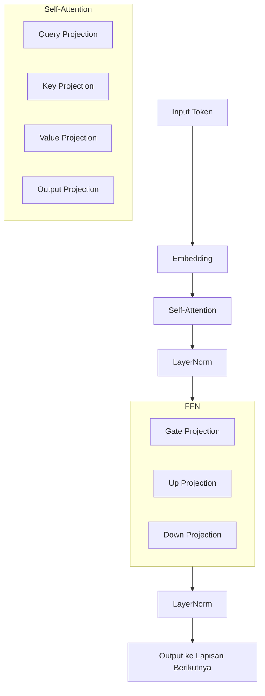

# Bab 1.2: Anatomi Model (Weights & Biases)

> Apa yang sebenarnya ada di dalam file model 7B, 14B, atau 70B yang Anda unduh? Bukan sihir — tetapi miliaran angka floating-point yang tersusun dalam matriks raksasa, hasil dari triliunan operasi matematika selama pelatihan.

---

## 1. Tujuan Sub-Bab

Setelah membaca bab ini, Anda akan mampu:

- Menjelaskan apa itu parameter, weight, bias, dan tensor dalam konteks LLM
- Menghitung jumlah parameter model berdasarkan konfigurasi lapisan yang diberikan
- Membandingkan trade-off antara jumlah parameter, kebutuhan VRAM, kecepatan inferensi, dan kualitas output
- Memilih ukuran model yang tepat berdasarkan infrastruktur dan kebutuhan tugas

---

## 2. Apa Itu Parameter?

### Parameter sebagai Unit Pengetahuan

Setiap model bahasa besar — mulai dari GPT-2 yang mungil hingga DeepSeek V4 Pro yang raksasa — pada dasarnya adalah kumpulan angka. Angka-angka ini disebut **parameter**, dan masing-masing menyimpan satu unit "pengetahuan" kecil yang diperoleh model selama proses pre-training. Dalam model 8B, terdapat 8 miliar angka individual. Dalam DeepSeek V4 Pro, angkanya mencapai 1,6 triliun. Seluruh kemampuan model — mulai dari memahami grammar hingga menjawab pertanyaan fisika kuantum — terkodekan dalam pola miliaran angka ini.

Parameter tidak disimpan sebagai angka yang berdiri sendiri. Mereka diorganisasikan ke dalam struktur bernama **tensor** — matriks multidimensi yang menjadi unit dasar komputasi di GPU. Satu lapisan attention, misalnya, menyimpan empat matriks besar (Query, Key, Value, Output), masing-masing berdimensi `d_model × d_model`. Untuk Llama-3 8B dengan d_model 4096, satu matriks proyeksi saja sudah berisi 16,7 juta angka. Tensor-tensor inilah yang menyebabkan file model berukuran puluhan gigabyte — setiap angka FP16 memakan 2 byte, dan ada miliaran angka di dalamnya.

### Presisi Numerik dan Dampaknya

Satu parameter dapat disimpan dalam berbagai tingkat presisi. FP32 (32-bit) menggunakan 4 byte per parameter dan memberikan presisi tertinggi. FP16 (16-bit) menggunakan 2 byte — cukup untuk sebagian besar kebutuhan inferensi. INT8 (8-bit) menggunakan 1 byte, dan INT4 (4-bit) hanya 0,5 byte. Setiap langkah ke bawah dalam presisi mengompres ukuran model hingga setengahnya: model 8B FP16 sebesar 16 GB dapat ditekan menjadi hanya 4 GB dalam INT4. Namun, presisi yang lebih rendah berarti informasi yang hilang — setiap parameter hanya menyimpan perkiraan dari nilai aslinya, bukan nilai eksaknya.

Pemilihan presisi bukan hanya soal ukuran file. Parameter tidak hanya disimpan di disk — mereka dimuat ke VRAM dan dioperasikan secara matriks selama inferensi. Bandwidth memori GPU — seberapa cepat data bisa dipindahkan dari VRAM ke unit komputasi — menjadi faktor penentu kecepatan. Model INT4 tidak hanya memakan lebih sedikit VRAM, tetapi juga bisa diproses lebih cepat karena lebih sedikit data yang perlu ditransfer per langkah komputasi.

### Analogi dengan Otak Manusia

Perbandingan yang sering muncul adalah antara parameter LLM dan sinapsis otak. Otak manusia memiliki sekitar 100 triliun sinapsis — koneksi antar neuron yang menyimpan memori dan pengetahuan. Model 70B dengan 70 miliar parameter kalah jumlah tiga kali lipat. Namun, perbandingan ini menyesatkan jika dibawa terlalu jauh. Sinapsis biologis bekerja secara paralel, analog, dan plastis — mereka berubah seiring waktu. Parameter LLM bersifat digital, deterministik, dan statis setelah training selesai. "Pengetahuan" dalam LLM tidak tersimpan di satu parameter tertentu, melainkan dalam pola interaksi antar parameter di seluruh jaringan.

Istilah "weight" (bobot) dan "bias" berasal dari jaringan saraf tradisional. Weight menentukan kekuatan koneksi antara dua neuron — seberapa besar pengaruh output satu neuron terhadap neuron berikutnya. Bias memungkinkan sebuah neuron tetap aktif bahkan ketika semua inputnya nol. Dalam LLM modern, bias sudah jarang digunakan di lapisan dalam: Llama-3 8B misalnya hanya memiliki bias di LayerNorm, tidak di proyeksi attention maupun FFN. Parameter model modern hampir seluruhnya adalah weight.

---

## 3. Arsitektur Satu Lapisan Transformer

### Aliran Data dalam Satu Lapisan

Satu lapisan Transformer terdiri dari dua sub-blok utama: **Self-Attention** dan **Feed-Forward Network (FFN)**, dengan residual connection dan layer normalization yang mengapit keduanya. Data mengalir dalam urutan yang presisi: input masuk, melewati LayerNorm, memasuki blok Attention, hasilnya ditambahkan ke input asli (residual connection), kemudian melewati LayerNorm lagi, memasuki FFN, dan hasilnya kembali ditambahkan ke input sebelum lapisan berikutnya. Urutan ini bukan kebetulan — ini adalah hasil penelitian bertahun-tahun untuk menstabilkan training model yang sangat dalam.

Aliran ini diulang sebanyak L kali — 32 kali untuk Llama-3 8B, 80 kali untuk Llama-3 70B. Setiap lapisan memiliki parameter sendiri yang independen; tidak ada parameter yang dibagi antar lapisan. Artinya, model 70B tidak hanya memiliki lapisan yang lebih lebar, tetapi juga jauh lebih dalam — 80 lapisan berarti ada 80 kali kesempatan untuk memproses dan mentransformasi representasi token.

### Self-Attention: Jantung Pemahaman Konteks

Self-Attention menggunakan empat matriks proyeksi linear: **Query (Q)** , **Key (K)** , **Value (V)** , dan **Output (O)** . Masing-masing adalah matriks berdimensi `d_model × d_model`. Setiap token memancarkan Q yang "bertanya" token mana yang relevan; semua token lain menyediakan K sebagai "jawaban" — skor attention dihitung sebagai dot product Q·K, menghasilkan matriks sekuens × sekuens yang menunjukkan seberapa kuat setiap token harus memperhatikan token lainnya. V membawa konten aktual yang akan diambil, dan O menggabungkan hasil attention kembali ke dimensi asli.

Pada arsitektur **Grouped Query Attention (GQA)** , jumlah head KV lebih sedikit dari head Q. Llama-3 8B memiliki 32 Q-head tetapi hanya 8 KV-head. Ini mengurangi parameter proyeksi K dan V hingga 75% tanpa penurunan kualitas yang signifikan — karena informasi yang sama (hubungan antar token) tidak memerlukan sebanyak itu head terpisah untuk direpresentasikan. GQA adalah inovasi yang diperkenalkan oleh Mistral 7B pada September 2023 dan kemudian diadopsi oleh semua model modern.

### Feed-Forward Network: Penyimpan Pengetahuan

FFN menggunakan tiga proyeksi linear: **gate_proj** , **up_proj** , dan **down_proj** — masing-masing berdimensi `d_model × ffn_dim`. Dua proyeksi pertama (gate dan up) memproyeksikan representasi token ke dimensi yang jauh lebih tinggi — biasanya 3,5 hingga 4 kali d_model. Untuk Llama-3 8B, d_model=4096 diproyeksikan ke ffn_dim=14336. Hasil gate dan up dikalikan secara element-wise dengan aktivasi SwiGLU, menciptakan ruang fitur yang kaya di mana pengetahuan faktual dapat disimpan. Proyeksi ketiga (down) memampatkan kembali ke d_model agar bisa diproses oleh lapisan berikutnya.

Tiga proyeksi ini adalah penyumbang parameter terbesar dalam model. Pada Llama-3 8B, 64,7% dari seluruh parameter berada di FFN. FFN adalah tempat model menyimpan fakta: penelitian Meng et al. (2022) dalam "Locating and Editing Factual Associations in GPT" menunjukkan bahwa neuron tertentu di lapisan FFN aktif saat menjawab pertanyaan faktual — misalnya, neuron tertentu aktif saat model memproses "Ibu kota Indonesia adalah..." dan outputnya mengarah ke "Jakarta".

### Komponen Pendukung yang Krusial

**LayerNorm** dan **Rotary Position Embedding (RoPE)** adalah komponen kecil tetapi esensial. LayerNorm menormalisasi distribusi aktivasi per token — memastikan mean mendekati 0 dan variance mendekati 1 — menggunakan dua parameter skalar (weight dan bias) per dimensi, total 2 × d_model per lapisan. Tanpa normalisasi ini, nilai aktivasi akan meledak atau menghilang secara eksponensial di lapisan dalam. RoPE adalah fungsi deterministik yang mengkodekan posisi token ke dalam vektor Q dan K — tanpa parameter yang dipelajari. RoPE memungkinkan model membedakan "kucing mengejar tikus" dari "tikus mengejar kucing" hanya berdasarkan posisi token.

**Residual connection** (skip connection) tidak memiliki parameter sama sekali — mereka hanya menjumlahkan input sub-blok dengan output-nya. Mekanisme yang tampak sederhana ini memungkinkan gradien mengalir langsung ke lapisan awal saat backpropagation, mengatasi masalah vanishing gradient yang membuat training model dengan lebih dari 30 lapisan praktis mustahil sebelum residual connection diperkenalkan. Tanpa residual connection, Transformer sedalam 80 lapisan seperti Llama-3 70B tidak akan bisa dilatih.

---

## 4. Perhitungan Parameter per Ukuran Model

### Membongkar Llama-3 8B

Llama-3 8B memiliki 32 lapisan, d_model=4096, FFN=14336, 32 head dengan GQA (8 KV head), dan vocabulary 128K. Total parameter: sekitar 8,03 miliar. Mari kita hitung dari komponen terkecil:

- **Embedding:** vocab × d_model = 128.000 × 4096 = 524 juta parameter. Setiap token ID dipetakan ke vektor 4096 dimensi.
- **Attention per layer:** Dengan GQA, proyeksi Q dan O penuh (4096²), tetapi K dan V hanya (8/32) × 4096². Total per layer: (2 + 2×0,25) × 4096² ≈ 65,5 juta. × 32 layer = 2,1 miliar.
- **FFN per layer:** 3 × d_model × ffn_dim = 3 × 4096 × 14336 ≈ 176 juta per layer. × 32 layer = 5,2 miliar.
- **LayerNorm:** 2 × d_model × L = 2 × 4096 × 32 = 262.144 — dapat diabaikan.

### Mengapa Mistral 7B Lebih Kecil dari Llama-3 8B?

Mistral 7B memiliki konfigurasi lapisan yang identik dengan Llama-3 8B: 32 lapis, d_model=4096, FFN=14336. Namun total parameternya hanya 7,24 miliar — sekitar 800 juta lebih kecil. Perbedaannya ada di dua tempat. Pertama, Mistral menggunakan GQA penuh: semua 8 head adalah KV head, tanpa head penuh. Kedua, vocabulary Mistral hanya 32K token — seperempat dari Llama-3. Ukuran embedding Mistral hanya 32K × 4096 = 131M, sementara Llama-3 memiliki 524M. Inilah alasan utama mengapa dua model dengan arsitektur identik memiliki ukuran berbeda: vocabulary yang lebih besar membutuhkan lebih banyak parameter embedding.

### Mengapa 70B Jauh Lebih Besar dari 8B?

Llama-3 70B: 80 lapis, d_model=8192, FFN=28672, 64 head dengan GQA (8 KV head), vocab 128K → ~70,6B parameter. Perhatikan pola skalanya: d_model naik 2× (4096 → 8192), jumlah lapisan naik 2,5× (32 → 80), tetapi total parameter melonjak ~9× (8B → 70B). Mengapa?

Parameter attention dan FFN tumbuh secara **kuadratik** terhadap d_model. Attention `∝ d²` per lapisan, FFN `∝ d × ffn_dim` per lapisan. Ketika d_model digandakan, parameter per lapisan naik 4×. Ketika jumlah lapisan juga naik, efeknya berlipat ganda. Embedding, sebaliknya, tumbuh linier (vocab × d_model) — sehingga proporsi embedding mengecil dari 6,5% pada 8B menjadi hanya 1,5% pada 70B. Distribusi parameter bergeser dari embedding-dominan ke FFN-dominan.

### Model MoE: Parameter Raksasa, Komputasi Minimal

DeepSeek V4 Pro memiliki 1,6 triliun parameter total tetapi hanya 49 miliar aktif per token. Arsitektur Mixture-of-Experts (MoE) yang digunakan memiliki 256 expert dalam FFN — setiap token hanya mengaktifkan 2 expert. Rumus parameter MoE: `P_total = P_dense + n_experts × P_expert_per_layer × L`. Parameter aktif hanya `P_dense + n_aktif × P_expert_per_layer × L`.

Embedding (vocab × d_model = 128K × 8192 ≈ 1 miliar) dan attention tetap di-load penuh. Hanya expert FFN yang bisa di-*route* secara selektif. Inilah keajaiban MoE: model ini memberikan kualitas setara model 1,6T dengan kecepatan dan VRAM setara model 49B — karena hanya 49B parameter yang perlu dikomputasi per token. Semua parameter (1,6T) harus tetap di-load ke VRAM, tetapi hanya 49B yang aktif digunakan dalam setiap langkah.

### Rumus Universal

Untuk model dense (non-MoE), rumus umum menghitung parameter adalah:

```
P = V·d + L·(4·d² + 3·d·ffn + 2·d)
```

Di mana V = vocab size, d = d_model, ffn = ffn_dim, L = jumlah lapisan. Komponen: V·d untuk embedding, 4·d² untuk attention (Q, K, V, O dengan asumsi head penuh — jika GQA, koefisien ini berubah), 3·d·ffn untuk FFN (gate, up, down), dan 2·d untuk LayerNorm. Rumus ini memberikan estimasi dalam 1-2% dari parameter aktual. Deviasi kecil berasal dari bias (jika ada), pembulatan dimensi head, dan tied embedding (jika bobot embedding dan output layer digabung).

---

## 5. Peran Setiap Komponen

### Embedding Layer: Gerbang Masuk

Embedding layer memetakan setiap token ID — integer dari 0 hingga vocab_size-1 — menjadi vektor kontinu berdimensi d_model. Secara teknis, ini adalah operasi lookup table: token ID 5.000 mengambil baris ke-5.000 dari matriks embedding `vocab_size × d_model`. Vektor yang dihasilkan bukan sekadar representasi acak — melalui training, embedding membentuk ruang semantik di mana token dengan makna serupa memiliki vektor yang berdekatan. "Mobil" dan "motor" akan berada di area yang sama, sementara "mobil" dan "presiden" akan berjauhan.

Embedding layer menyerap sekitar 5-8% dari total parameter pada model 8B dengan vocabulary besar. Persentase ini mengecil pada model yang lebih besar — hanya sekitar 1% pada Llama-3 405B — karena attention dan FFN tumbuh lebih cepat. Model dengan vocabulary sangat besar seperti Qwen2.5 (152K token) memiliki proporsi embedding yang lebih tinggi.

### Self-Attention: Pemahaman Konteks

Self-Attention adalah komponen yang membuat Transformer memahami hubungan antar token. Setiap token mengeluarkan Query (Q) yang "bertanya" token mana dalam urutan yang relevan. Semua token lain menyediakan Key (K) sebagai "jawaban" — semakin tinggi dot product Q·K, semakin relevan token tersebut. Value (V) membawa konten aktual yang akan diambil dari token yang relevan.

Dalam kalimat "Dia mengambil buku itu dan membacanya dengan saksama", attention menghubungkan "Dia" dengan subjek yang disebutkan sebelumnya dan "-nya" dengan "buku". Tanpa attention, model hanya melihat setiap token dalam isolasi — tidak ada cara untuk mengetahui kata ganti merujuk kepada siapa. Semakin panjang konteks, semakin penting peran attention. Mekanisme inilah yang memungkinkan model modern memahami dokumen sepanjang 1 juta token.

### FFN: Penyimpan Fakta

FFN adalah tempat model menyimpan pengetahuan faktualnya. Berbeda dengan attention yang bersifat dinamis (bergantung pada konteks input), FFN bersifat statis — neuron yang sama akan aktif untuk fakta yang sama terlepas dari konteks di sekitarnya. Setiap lapisan FFN terdiri dari 3 proyeksi linear dengan aktivasi SwiGLU: gate_proj dan up_proj memperluas representasi ke dimensi tinggi (menciptakan ruang fitur yang kaya), lalu down_proj memampatkannya kembali.

FFN menyumbang 60-70% total parameter pada model dense. Saat Anda melakukan kuantisasi model, prioritas pertama harus menjaga presisi FFN — karena di sinilah fakta disimpan. Kuantisasi agresif pada FFN akan lebih terasa dampaknya pada tugas yang membutuhkan pengetahuan faktual dibanding tugas yang hanya membutuhkan pemahaman konteks.

### Output Layer dan Komponen Pendukung

Output layer (LM head) memetakan vektor output lapisan terakhir ke distribusi probabilitas atas seluruh vocabulary. Secara dimensi, ini adalah matriks `d_model × vocab_size` — transpose dari embedding layer. Banyak model modern (Llama-3, Mistral, Qwen) menggunakan **tied embedding** — bobot embedding layer dan output layer adalah matriks yang sama, tidak ada parameter tambahan. Ini menghemat vocab × d_model parameter tanpa mengorbankan kualitas, karena kedua matriks memetakan antara ruang semantik yang sama.

LayerNorm dan RoPE adalah komponen non-linear yang tidak menyimpan pengetahuan faktual tetapi esensial. LayerNorm menormalkan distribusi aktivasi per token, mencegah nilai meledak atau menghilang. RoPE memungkinkan model membedakan urutan token. Kedua komponen ini menyumbang kurang dari 3% total parameter, tetapi tanpanya, model tidak akan berfungsi.

---

## 6. Distribusi Parameter: Komponen Terbesar hingga Terkecil

### FFN: Penguasa Parameter

FFN mendominasi dengan 60-70% dari total parameter pada model dense. Pada Llama-3 8B, FFN = 5,2B dari 8,03B total (64,7%). Pada Llama-3 70B, proporsi naik menjadi ~68% karena embedding hanya menyumbang ~1,5B dari 70,6B. Alasan dominasi ini sederhana: FFN memiliki tiga matriks besar per lapisan, dan dimensi intermediate (ffn_dim) biasanya 3,5-4× d_model. Ini berarti satu lapisan FFN menyimpan lebih banyak parameter daripada satu lapisan attention — dan ada puluhan lapisan seperti ini.

Implikasi praktisnya: saat mengkuantisasi model, prioritas pertama adalah menjaga presisi FFN. Jika Anda harus memilih antara mengkuantisasi attention ke INT4 dan FFN ke INT8 versus sebaliknya, pilih yang pertama — FFN yang lebih presisi akan mempertahankan lebih banyak pengetahuan faktual.

### Attention dan GQA

Attention menyumbang 25-30% parameter. Pada Llama-3 8B, attention = 2,1B parameter (26,2%). GQA mengurangi proyeksi K dan V secara signifikan — tanpa GQA, attention akan menjadi ~2,8B (35%). Perbandingan: Mistral 7B (semua head GQA) memiliki attention ~1,8B (25%), sementara LLaMA-1 7B (tanpa GQA) memiliki attention ~2,3B (32%). Penghematan GQA semakin terlihat pada model dengan banyak head — Llama-3 70B menghemat sekitar 4B parameter berkat GQA.

### Embedding, LayerNorm, dan MoE

Embedding berkisar 5-10% pada model kecil dan di bawah 2% pada model besar: Llama-3 8B: 524M (6,5%), Llama-3 70B: 1,05B (1,5%), Llama-3 405B: ~2,1B (0,5%). Persentase mengecil karena embedding tumbuh linier sementara komponen lain tumbuh kuadratik. Model dengan vocabulary besar memiliki proporsi embedding lebih tinggi.

LayerNorm + RoPE hanya ~2-3% — pada Llama-3 8B, LayerNorm hanya 262K parameter — dapat diabaikan secara numerik tetapi tidak secara fungsional.

Pada arsitektur MoE seperti DeepSeek V4 Pro (1,6T total, 49B aktif), distribusi bergeser: FFN shared + expert routing ~45%, expert FFN (256 expert, 2 aktif per token) ~50%, attention + embedding ~5%. Inilah mengapa MoE bisa memberikan kualitas model besar dengan kecepatan dan VRAM jauh lebih kecil.

---

## 7. Dampak Jumlah Parameter pada Inferensi

### Kebutuhan VRAM

VRAM minimum ditentukan oleh: `total_parameter × bytes_per_parameter + KV_cache + overhead`. Model 8B dalam FP16 membutuhkan 16 GB VRAM untuk parameter — dengan KV cache untuk konteks 4K (~1 GB) dan overhead CUDA (~0,5 GB), total ~18 GB. GPU kelas konsumen seperti RTX 3090 (24 GB) masih sanggup.

Dalam INT4 (Q4_K_M), parameter 8B hanya ~5 GB, sehingga total VRAM ~7 GB — muat di GPU 8 GB seperti RTX 3070. Model 70B FP16 (140 GB) tidak muat di GPU konsumen mana pun. Tetapi 70B Q4 (42 GB) bisa dijalankan di 2× RTX 4090 (48 GB total) atau di Mac Studio M2 Ultra (192 GB unified memory).

### Dampak Kuantisasi pada Kualitas

Kuantisasi mengurangi presisi parameter dan secara linear mengurangi VRAM, tetapi juga menurunkan kualitas output. Penurunan tidak seragam: tugas reasoning dan matematika lebih terpengaruh daripada chat sederhana atau summarization. Benchmark menunjukkan Q4_K_M mempertahankan 97-99% kualitas FP16 pada MMLU untuk model 7-8B, dan 98-99,5% untuk model 70B+. Model yang lebih besar lebih toleran terhadap kuantisasi karena redundansi parameter yang lebih tinggi. Q2 (2-bit) umumnya tidak direkomendasikan untuk tugas serius karena degradasi di atas 10%.

### Kecepatan Inferensi

Kecepatan inferensi adalah fungsi dari parameter aktif, bandwidth memori GPU, dan arsitektur. Model 8B FP16 di RTX 4090 (bandwidth ~1000 GB/s): `1000 GB/s / (8B × 2B) ≈ 62 token/detik`. Pada Q4 (5 GB): `1000/5 ≈ 200 token/detik`.

Model 70B Q4 (42 GB) di 2× RTX 4090: bandwidth efektif ~1800 GB/s — kecepatan `1800/42 ≈ 43 token/detik`. Namun kecepatan ini terbatas oleh interconnect PCIe antar GPU — bandwidth PCIe Gen 4 x16 (32 GB/s) menjadi bottleneck saat model harus membagi tensor antar GPU.

Model MoE seperti DeepSeek V4 Flash (284B total, 13B aktif) memiliki kecepatan setara model 13B karena hanya parameter aktif yang dikomputasi. Semua 284B parameter tetap harus di-load ke VRAM, tetapi setiap token hanya mengaktifkan 13B — memberikan kualitas model besar dengan kecepatan model menengah.

### Trade-Off Kualitas vs Parameter

Hubungan antara ukuran parameter dan kualitas tidak linear. Model 7B (MMLU ~65%) ke 70B (MMLU ~85%) — peningkatan 10× parameter hanya memberi tambahan +20 poin persentase. Efek diminishing returns semakin terasa di skala atas: dari 405B ke 1,6T hanya +2-3 poin.

Untuk tugas sederhana seperti chat ringan, ekstraksi teks, dan summarization, model 7-8B sudah memadai. Untuk reasoning kompleks, coding, dan analisis ilmiah, model 30-70B memberikan peningkatan signifikan. Di atas 70B, peningkatan hanya terlihat pada tugas yang sangat menuntut — matematika tingkat PhD, kontes coding, dan analisis multimodal yang mendalam.

### Panduan Praktis Memilih Ukuran Model

Pertimbangan memilih ukuran model: (1) Infrastruktur — VRAM GPU menentukan presisi dan ukuran maksimum; (2) Latensi — model lebih besar lebih lambat; (3) Kompleksitas tugas — jangan gunakan 70B untuk tugas yang bisa dikerjakan 8B; (4) Total biaya kepemilikan — 8B di GPU tunggal vs 70B di multi-GPU (5-10× biaya hardware).

Strategi optimal: deploy model kecil (7-8B) untuk 80% beban kerja harian, dan route tugas kompleks ke model besar (70B) yang di-host terpisah. Ini menghemat biaya hardware hingga 70% tanpa mengorbankan kualitas untuk tugas yang membutuhkannya.

---

## 8. Tabel Referensi

### Tabel 1: Perbandingan Anatomi Model Populer

| Model | Lapisan | d_model | FFN dim | Head | GQA | Total Param | Embedding % |
|:---|:---:|:---:|:---:|:---:|:---:|:---:|:---:|
| Llama-3 8B | 32 | 4096 | 14336 | 32 | Ya (8 KV) | 8.03B | ~5% |
| Mistral 7B | 32 | 4096 | 14336 | 32 | Ya (8 KV) | 7.24B | ~5% |
| Qwen 2.5 7B | 28 | 4096 | 11008 | 28 | Ya | 7.61B | ~8% |
| Llama-3 70B | 80 | 8192 | 28672 | 64 | Ya (8 KV) | 70.6B | ~2% |
| DeepSeek V2 | 60 | 7168 | 2048 (MoE) | 56 | Ya | 236B | ~1% |
| DeepSeek V4 Pro | 84* | 8192 | 4096 (MoE-256) | 64 | Ya | 1.6T (49B aktif) | ~0.5% |
| Mistral Large 3 | 56* | 7168 | 3072 (granular MoE) | 48 | Ya | 675B (41B aktif) | ~1% |
| Gemma 2 9B | 42 | 3584 | 14336 | 16 | Ya | 9.2B | ~4% |

*Tanda * menandakan konfigurasi internal — detail arsitektur penuh hanya dirilis oleh vendor.*

### Tabel 2: Kebutuhan Memori per Ukuran Model

| Presisi | Bytes/Param | 1.5B | 7B | 8B | 13B | 49B* | 70B | 405B | 675B* |
|:---|:---:|:---:|:---:|:---:|:---:|:---:|:---:|:---:|:---:|
| FP32 | 4 | 6 GB | 28 GB | 32 GB | 52 GB | 196 GB | 280 GB | 1.6 TB | 2.7 TB |
| FP16 | 2 | 3 GB | 14 GB | 16 GB | 26 GB | 98 GB | 140 GB | 810 GB | 1.35 TB |
| INT8 (Q8_0) | 1 | 1.5 GB | 7 GB | 8 GB | 13 GB | 49 GB | 70 GB | 405 GB | 675 GB |
| INT4 (Q4_K_M) | ~0.5 | 0.8 GB | 3.8 GB | 4.2 GB | 6.5 GB | 25 GB | 38 GB | 220 GB | 340 GB |

*Parameter aktif untuk model MoE. Semua expert harus tetap di-load ke VRAM meskipun hanya sebagian yang aktif per token.*

### Tabel 3: Distribusi Parameter per Komponen (Llama-3 8B)

| Komponen | Jumlah Parameter | Persentase |
|:---|:---:|:---:|
| Embedding (vocab 128K × 4096) | 524M | 6.5% |
| Attention (QKV + Output per layer × 32) | 2.1B | 26.2% |
| FFN (gate + up + down per layer × 32) | 5.2B | 64.7% |
| LayerNorm + RoPE | 209M | 2.6% |
| **Total** | **8.03B** | **100%** |

---

## 9. Diagram Arsitektur

### Diagram 1: Anatomi Satu Lapisan Transformer

Berikut adalah aliran data dalam satu lapisan Transformer, dari input token hingga output yang siap masuk ke lapisan berikutnya.



### Gambar 2: Visualisasi Tensor Shape

Gambar ini (lihat `assets/images/jilid1/j1-b1-s2-tensor-shapes.png`) menunjukkan dimensi tensor di setiap tahap pemrosesan — dari input dengan bentuk (batch, sequence, d_model) hingga attention scores dan output FFN. Setiap kotak dalam diagram merepresentasikan satu matriks yang harus disimpan di VRAM selama inferensi.

### Gambar 3: Perbandingan Fisik Ukuran Model

Untuk memberikan intuisi tentang skala: model 1,5B (GPT-2) seukuran buku novel (~1,2 GB Q4). Model 7B seukuran ensiklopedia satu jilid (~4,5 GB). Model 70B sebesar rak buku penuh (~42 GB Q4). Model 405B membutuhkan perpustakaan kecil (~220 GB). Dan DeepSeek V4 Pro 1,6T membutuhkan ruang server khusus (~865 GB INT4). Visualisasi ini ada di `assets/images/jilid1/j1-b1-s2-physical-size.png`.

---

## 10. Tutorial / Hands-On

### Tutorial 1: Memeriksa Anatomi Model dengan Python

Cara terbaik untuk memahami parameter model adalah melihatnya langsung. Kode berikut memuat konfigurasi Llama-3 8B dan menghitung parameter secara manual.

```python
from transformers import AutoConfig

# Load konfigurasi model
config = AutoConfig.from_pretrained("meta-llama/Meta-Llama-3-8B")

print(f"Architecture: {config.architectures}")
print(f"Hidden size (d_model): {config.hidden_size}")
print(f"Num layers: {config.num_hidden_layers}")
print(f"FFN intermediate: {config.intermediate_size}")
print(f"Num heads: {config.num_attention_heads}")
print(f"Num KV heads: {config.num_key_value_heads}")
print(f"Vocab size: {config.vocab_size}")
print(f"Max position: {config.max_position_embeddings}")

# Hitung parameter manual
d = config.hidden_size
ffn = config.intermediate_size
L = config.num_hidden_layers
V = config.vocab_size

emb = V * d
attn = L * (4 * d * d)  # Q, K, V, O projections
ffn_params = L * (3 * d * ffn)  # gate, up, down
total = emb + attn + ffn_params

print(f"\nEstimasi parameter: {total/1e9:.2f}B")
print(f"  Embedding: {emb/1e9:.2f}B")
print(f"  Attention: {attn/1e9:.2f}B")
print(f"  FFN: {ffn_params/1e9:.2f}B")
```

Output yang diharapkan akan menunjukkan bahwa parameter terbanyak berada di FFN, diikuti attention, dan sebagian kecil di embedding — sesuai dengan Tabel 3.

### Tutorial 2: Cek Ukuran Model di Local Disk

Untuk melihat secara langsung berapa besar ruang yang digunakan model di sistem Anda:

```bash
# Cek ukuran model FP16 via Ollama
ollama pull llama3.1:8b
ls -lh ~/.ollama/models/blobs/

# Download file GGUF dan periksa metadata
huggingface-cli download bartowski/Meta-Llama-3.1-8B-Instruct-GGUF \
    Meta-Llama-3.1-8B-Instruct-Q4_K_M.gguf

# Lihat metadata GGUF
python -c "
import struct
with open('Meta-Llama-3.1-8B-Instruct-Q4_K_M.gguf', 'rb') as f:
    magic = f.read(4)
    version = struct.unpack('<I', f.read(4))[0]
    n_tensors = struct.unpack('<I', f.read(4))[0]
    print(f'Format: {magic.decode()}, Version: {version}, Tensors: {n_tensors}')
"
```

File GGUF Q4_K_M untuk Llama-3 8B seharusnya berukuran sekitar 4,9 GB — jauh lebih kecil dari 16 GB versi FP16.

### Tutorial 3: Uji Bandwidth NVMe

Kecepatan memuat model ke VRAM dibatasi oleh bandwidth penyimpanan. NVMe Gen 4 memiliki throughput sekitar 5000 MB/s — artinya model 8B FP16 (16 GB) membutuhkan `16000 / 5000 ≈ 3,2 detik` untuk dimuat.

```bash
# Test bandwidth NVMe
dd if=/dev/zero of=/tmp/test bs=1G count=1 oflag=dsync
```

Hasilnya akan menunjukkan kecepatan tulis NVMe Anda. Semakin tinggi, semakin cepat model dapat dimuat ke memori.

---

## 11. Studi Kasus: Memilih Model 7B vs 70B untuk Chatbot Perusahaan

**Skenario:** Sebuah perusahaan dengan 20 karyawan ingin men-deploy chatbot internal untuk membantu menjawab pertanyaan seputar dokumen perusahaan, menulis kode, dan menganalisis kontrak. Mereka membutuhkan respons cepat (di bawah 2 detik) dan akurasi yang memadai. Anggaran hardware terbatas.

**Pilihan A: Model 7-8B (Llama-3 8B atau Qwen2.5 7B)**

- Ukuran: 16 GB FP16 atau hanya 5 GB dalam Q4_K_M
- Kecepatan: ~80 token/detik di RTX 4090 tunggal
- MMLU: ~68% (cukup untuk tanya jawab dokumen internal dan summarization)
- Biaya hardware: Satu GPU RTX 4090 (~Rp 30 juta) atau Mac Studio M2 Ultra
- Kelebihan: Latensi rendah, biaya minimal, mudah di-maintain

**Pilihan B: Model 70B (Llama-3 70B atau Qwen2.5 72B)**

- Ukuran: 140 GB FP16 atau 42 GB Q4_K_M
- Kecepatan: ~15 token/detik di 2× RTX 4090
- MMLU: ~84% (diperlukan untuk analisis kontrak dan coding kompleks)
- Biaya hardware: 2× RTX 4090 + motherboard pendukung (~Rp 70 juta)
- Kelebihan: Akurasi tinggi, mampu reasoning kompleks

**Rekomendasi:** Gunakan model 7-8B untuk 80% kebutuhan harian — tanya jawab dokumen, summarization meeting, dan chat umum. Deploy model 70B secara terpisah untuk tugas spesifik yang membutuhkan reasoning tinggi — analisis kontrak hukum, debugging kode kompleks, dan perencanaan strategis. Strategi ini menghemat biaya hardware hingga 70% dibandingkan jika semua permintaan harus diproses oleh model 70B, tanpa mengorbankan kualitas untuk tugas-tugas yang memang membutuhkannya.

---

## 12. Referensi

### Paper Jurnal/Konferensi

[1] Grattafiori, A., et al. (2024). *The Llama 3 Herd of Models*. arXiv: 2407.21783. DOI: [10.48550/arXiv.2407.21783](https://arxiv.org/abs/2407.21783)
- Sumber data arsitektur Llama-3 8B dan 70B untuk Tabel 1 dan 3.

[2] Touvron, H., et al. (2023). *LLaMA: Open and Efficient Foundation Language Models*. arXiv: 2302.13971. DOI: [10.48550/arXiv.2302.13971](https://arxiv.org/abs/2302.13971)
- Arsitektur LLaMA yang menjadi standar de facto — analisis parameter embedding + attention.

[3] Jiang, A.Q., et al. (2023). *Mistral 7B*. arXiv: 2310.06825. DOI: [10.48550/arXiv.2310.06825](https://arxiv.org/abs/2310.06825)
- Pengenalan GQA (Grouped Query Attention) yang mengurangi parameter KV projection tanpa mengorbankan kualitas.

[4] Chowdhery, A., et al. (2022). *PaLM: Scaling Language Modeling with Pathways*. JMLR, 24. DOI: [10.48550/arXiv.2204.02311](https://arxiv.org/abs/2204.02311)
- Analisis scaling dan efisiensi parameter pada model 540B — relevan untuk diskusi diminishing returns.

[5] Hoffmann, J., et al. (2022). *Training Compute-Optimal Large Language Models*. NeurIPS. DOI: [10.48550/arXiv.2203.15556](https://arxiv.org/abs/2203.15556)
- Chinchilla scaling law — hubungan optimal antara parameter dan token training, menjelaskan mengapa Llama-3 8B dilatih dengan 15T token.

[6] Zhao, W.X., et al. (2023). *A Survey of Large Language Models*. arXiv: 2303.18223. DOI: [10.48550/arXiv.2303.18223](https://arxiv.org/abs/2303.18223)
- Referensi komprehensif tentang anatomi LLM.

[7] DeepSeek-AI. (2026). *DeepSeek-V4: A Hybrid CSA/HCA Mixture-of-Experts Language Model*. arXiv: 2604.09980. DOI: [10.48550/arXiv.2604.09980](https://arxiv.org/abs/2604.09980)
- Arsitektur MoE 1,6T total / 49B aktif, hybrid CSA/HCA attention.

[8] Mistral AI. (2025). *Mistral Large 3: Granular MoE with Multimodal Capabilities*. arXiv: 2512.01820. DOI: [10.48550/arXiv.2512.01820](https://arxiv.org/abs/2512.01820)
- Granular MoE 675B total / 41B aktif, Apache 2.0.

### Referensi Pendukung

[9] Hugging Face. *Model Config dan Parameter Count*. [https://huggingface.co/docs/transformers/model_doc/llama](https://huggingface.co/docs/transformers/model_doc/llama)

[10] EleutherAI. *LLM Parameter Calculator*. [https://blog.eleuther.ai/parameter-counts/](https://blog.eleuther.ai/parameter-counts/)

[11] llama.cpp. *GGUF Format Specification*. [https://github.com/ggerganov/llama.cpp](https://github.com/ggerganov/llama.cpp)

[12] NVIDIA. *GPU Memory Calculator for LLMs*. [https://resources.nvidia.com](https://resources.nvidia.com)
