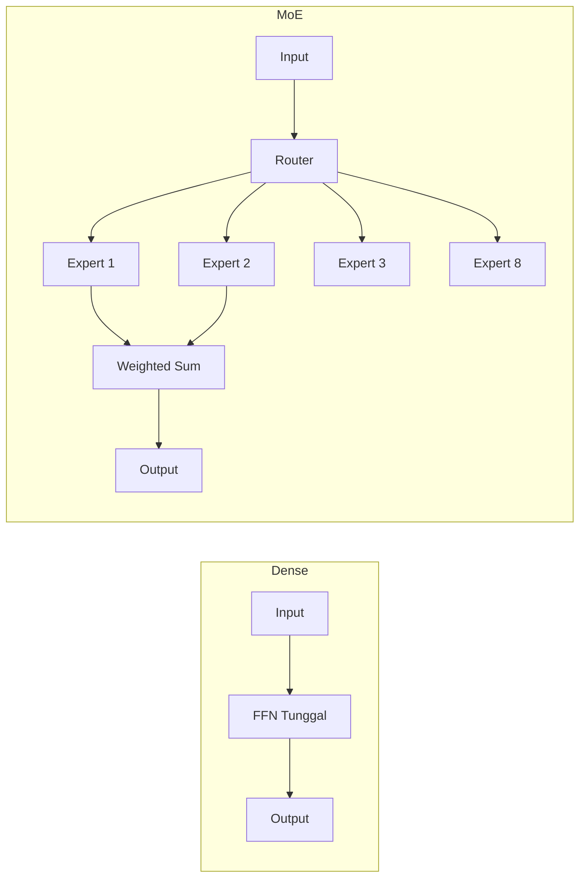

# Bab 1.3: Perbandingan Arsitektur — Dense Models vs Mixture of Experts (MoE)

> Tidak semua parameter diciptakan sama. Dalam arsitektur dense, setiap token mengaktifkan seluruh parameter model. Dalam Mixture of Experts, hanya sebagian kecil — namun efeknya bisa setara dengan model yang berkali-kali lipat lebih besar. Bab ini membahas perbedaan fundamental kedua arsitektur, kelebihan dan kekurangan masing-masing, serta panduan memilihnya berdasarkan hardware dan kebutuhan Anda.

---

## 1. Tujuan Sub-Bab

Setelah membaca bab ini, Anda akan mampu:

- Menjelaskan perbedaan fundamental dense model dengan Mixture of Experts (MoE)
- Memahami konsep sparse activation, routing, load balancing, dan sparsity ratio
- Membandingkan trade-off performa, VRAM, latency, dan kemudahan deployment
- Memilih arsitektur yang tepat berdasarkan hardware dan use case yang dihadapi

---

## 2. Konsep Dasar Dense Model

### Arsitektur Seragam untuk Setiap Token

Dense model adalah arsitektur yang paling sederhana dan paling mudah dipahami. Setiap token yang diproses — baik itu kata "the" dalam bahasa Inggris, "dan" dalam bahasa Indonesia, atau token kode Python — mengaktifkan seluruh parameter model tanpa terkecuali. Feed-Forward Network (FFN) di setiap lapisan bersifat identik dan seragam untuk semua input, tanpa ada mekanisme seleksi atau routing. Model 70B berarti seluruh 70 miliar parameter aktif untuk setiap token, setiap saat.

Implikasi komputasi dari arsitektur ini sangat linear dan dapat diprediksi. Biaya komputasi per token adalah hasil kali total parameter, presisi numerik, dan jumlah token yang diproses. Model 70B membutuhkan 70 kali lebih banyak FLOP (floating-point operations) per token dibandingkan model 7B — tidak ada kejutan, tidak ada variabilitas latency antar token. Jika Anda mengetahui throughput model 7B di GPU tertentu, throughput model 70B dapat diperkirakan secara akurat, yaitu sekitar sepersepuluhnya.

### Inefisiensi Inheren yang Menjadi Motivasi MoE

Meskipun semua parameter aktif setiap saat, tidak semua parameter sama pentingnya untuk setiap input. Penelitian dalam bidang mechanistic interpretability menunjukkan bahwa untuk input tertentu — misalnya, sebuah token dalam kalimat tentang memasak — hanya sebagian kecil neuron yang benar-benar berkontribusi pada output. Neuron yang berkaitan dengan konsep memasak, bahan makanan, dan alat dapur akan aktif, sementara neuron yang berkaitan dengan pemrograman atau fisika tetap ikut dihitung meskipun tidak relevan. Dense model tetap mengaktifkan semuanya, menciptakan inefisiensi inheren yang menjadi motivasi utama pengembangan arsitektur Mixture of Experts.

Model-model dense populer mencakup Llama-3 dalam varian 8B, 70B, dan 405B; Mistral 7B; keluarga Qwen 2.5 dari 7B hingga 72B; Gemma 2 dalam ukuran 9B dan 27B; serta Phi-4 14B dari Microsoft. Semuanya menggunakan arsitektur decoder-only dense dengan variasi pada mekanisme attention — seperti Grouped Query Attention (GQA) pada Llama-3 dan Sliding Window Attention pada Mistral — tetapi FFN tetap seragam di semua lapisan. Tidak ada mekanisme routing, tidak ada seleksi expert, hanya satu jalur komputasi yang seragam.

### Kelebihan Dense Model

Kelebihan utama dense model terletak pada lima aspek. Pertama, latensi deterministik — waktu per token hampir identik untuk input apa pun, tidak tergantung pada konten token. Kedua, deployment sederhana — tidak memerlukan expert parallelism atau routing logic yang kompleks. Ketiga, fine-tuning mudah — semua parameter dapat di-update dengan teknik standar seperti LoRA atau QLoRA tanpa perlu khawatir tentang load balance. Keempat, prediktabilitas hardware — kebutuhan VRAM langsung diketahui dari jumlah parameter dan presisi yang digunakan. Kelima, efisiensi batch processing tetap baik hingga ukuran batch tertentu.

---

## 3. Konsep Dasar Mixture of Experts (MoE)

### Prinsip Sparse Activation

MoE mengadopsi pendekatan yang berbeda secara fundamental. Tidak semua parameter model aktif untuk setiap token. Parameter FFN dibagi menjadi beberapa "expert" yang independen, dan sebuah router atau gate network memilih subset kecil dari expert ini untuk setiap token. Konfigurasi paling umum adalah memilih 2 dari 8 expert (top-2 routing), tetapi varian ekstrem seperti DeepSeek V4 Pro menggunakan 9 dari 256+ expert. Prinsip ini memungkinkan total parameter mencapai triliunan sementara FLOP per token tetap setara dengan model yang jauh lebih kecil.

### Mekanisme Routing

Setiap token yang memasuki lapisan MoE melewati router — sebuah jaringan linear kecil yang menghasilkan distribusi probabilitas atas semua expert yang tersedia. Expert dengan probabilitas tertinggi (top-K) dipilih untuk memproses token tersebut. Output akhir lapisan MoE adalah weighted sum dari output expert-expert terpilih, dengan bobot sesuai probabilitas yang dihasilkan router. K=2 adalah konfigurasi yang paling banyak digunakan karena memberikan keseimbangan optimal antara diversitas representasi (dua expert memberikan perspektif berbeda) dan efisiensi komputasi (hanya dua expert yang perlu dijalankan). Varian K=1, yang digunakan oleh Switch Transformer dari Google, lebih ekstrem — hanya satu expert per token — mengorbankan kualitas untuk efisiensi komputasi maksimal.

### Sparsity Ratio

Sparsity ratio (SR) adalah metrik utama untuk mengukur efisiensi arsitektur MoE. SR dihitung sebagai persentase parameter yang aktif terhadap total parameter: SR = (active_param / total_param) × 100%. Semakin rendah SR, semakin efisien model secara komputasi. Mixtral 8x7B memiliki SR 27,6% (12,9B aktif dari 46,7B total). DeepSeek V4 Pro mencapai SR yang sangat rendah yaitu 3,1% (49B aktif dari 1,6T total). Ini berarti DeepSeek V4 Pro secara komputasi setara dengan dense model sekitar 50B, tetapi memiliki kapasitas pengetahuan yang jauh lebih besar karena parameter totalnya 1,6T — pengetahuan tambahan ini tersimpan dalam expert-expert yang tidak aktif untuk token tertentu, tetapi tetap berkontribusi selama pelatihan.

### Perbandingan Fundamental Dense vs MoE

Perbedaan fundamental antara dense dan MoE dapat diringkas dalam satu kalimat: pada dense model, parameter sama dengan komputasi; pada MoE, parameter tidak sama dengan komputasi. Model dense 70B selalu membutuhkan komputasi setara 70B. Model MoE dengan 1,6T parameter total dapat memiliki komputasi hanya setara 50B — rasio 32:1 antara kapasitas pengetahuan dan biaya komputasi. Trade-off utama: MoE membutuhkan lebih banyak VRAM (semua expert harus di-load ke memori), tetapi memberikan komputasi per token yang lebih rendah. Ini menjadikan MoE sangat unggul untuk skenario serving dengan throughput tinggi, seperti API publik atau server perusahaan dengan banyak pengguna concurrent.

### Contoh Model MoE dan Evolusinya

Model-model MoE populer memiliki rasio expert dan top-k yang berbeda, menghasilkan trade-off yang unik untuk setiap model. Mixtral 8x7B menggunakan 8 expert dengan K=2 (27,6% aktif). DeepSeek V2 menerapkan pendekatan fine-grained MoE dengan 160 expert dan K=9 (8,9% aktif). DeepSeek V4 Pro adalah yang paling ekstrem dengan 256+ expert dan K=9 (3,1% aktif), menggunakan arsitektur hybrid CSA/HCA. DeepSeek V4 Flash dirancang untuk efisiensi di single GPU dengan 13B aktif. Mistral Large 3 menggunakan granular MoE dengan 128 expert. DBRX memilih K=4 dari 16 expert, memberikan keseimbangan antara spesialisasi dan overhead.

Evolusi jumlah expert menunjukkan tren yang jelas. Model MoE awal seperti Switch Transformer menggunakan 64 hingga 2.048 expert dengan routing top-1. Mixtral mempopulerkan konfigurasi 8 expert dengan K=2 — lebih praktis untuk deployment. Model terkini seperti DeepSeek V4 menggunakan pendekatan fine-grained MoE dengan jumlah expert yang sangat besar, mencapai sparsity ratio serendah 3,1%. Tren ini menunjukkan bahwa semakin banyak expert, semakin kecil active ratio, tetapi komunikasi antar expert dan overhead routing ikut meningkat — sebuah trade-off yang terus menjadi subjek riset aktif.

---

## 4. Komponen MoE: Router, Experts, dan Load Balancing

### Router: Otak di Balik Seleksi Expert

Router, atau gate network, adalah komponen paling krusial dalam arsitektur MoE. Secara teknis, router adalah jaringan linear kecil — biasanya hanya satu lapisan — yang menerima hidden state dari sebuah token dan menghasilkan logit untuk setiap expert. Logit ini dilewatkan melalui fungsi softmax untuk menghasilkan distribusi probabilitas. Implementasi matematisnya sederhana: `router(x) = softmax(W_r · x)`, di mana `W_r` adalah matriks berdimensi `d_model × num_experts`. Router hanya memiliki beberapa juta parameter — sangat kecil dibandingkan total parameter model, tetapi perannya sangat penting.

Salah satu konsekuensi paling menarik dari mekanisme routing adalah spesialisasi implicit. Tidak ada label atau pengawasan yang menentukan expert mana yang harus menangani topik tertentu. Selama pelatihan, expert secara alami menjadi terspesialisasi untuk pola tertentu berdasarkan distribusi data. Penelitian menggunakan teknik probing menunjukkan bahwa expert dalam model bahasa cenderung memiliki preferensi domain: satu expert mungkin lebih aktif untuk token kode, yang lain untuk token matematika, yang lain lagi untuk teks kreatif atau dialog percakapan. Namun, spesialisasi ini tidak pernah eksklusif — setiap expert tetap bersifat generalis, hanya dengan bias ke domain tertentu.

### Experts: Unit FFN Independen

Setiap expert adalah sebuah Feed-Forward Network independen, biasanya terdiri dari 2-3 lapisan linear dengan fungsi aktivasi non-linear di antaranya. Dimensi hidden dari setiap expert, yang disebut `d_moe`, umumnya sama dengan `d_model`. Jumlah expert bervariasi antar arsitektur: Mixtral menggunakan 8 expert, DBRX menggunakan 16, DeepSeek V2 menggunakan 160, dan DeepSeek V4 menggunakan lebih dari 256. Parameter utama yang perlu dipahami adalah bahwa `d_ff_expert` — dimensi FFN setiap expert — biasanya lebih kecil dari `d_ff_dense` pada dense model yang setara, sehingga total FLOP MoE tetap terkendali.

Keunggulan penting dari arsitektur MoE adalah bahwa setiap expert dapat dijalankan secara independen pada GPU yang berbeda. Teknik ini, yang disebut expert parallelism, memungkinkan distribusi beban komputasi yang efisien di cluster multi-GPU. DeepSeek V4 Pro dengan 256 expert dapat didistribusikan ke puluhan GPU, masing-masing GPU menangani subset expert. Tanpa expert parallelism, model MoE triliunan parameter tidak akan mungkin dijalankan secara praktis.

### Load Balancing: Mencegah Expert Collapse

Tanpa mekanisme load balancing, router akan cenderung mengirim hampir semua token ke 1-2 expert favorit. Fenomena ini disebut expert collapse — semua token dianggap mirip oleh router, menyebabkan expert lain menganggur dan meniadakan manfaat arsitektur MoE. Untuk mencegahnya, MoE menambahkan komponen loss khusus yang disebut Load Balancing Loss (L_bal) selama pelatihan.

Formulasi umum L_bal adalah `α · num_experts · Σ_i (f_i · P_i)`, di mana `f_i` adalah fraksi token yang dirouting ke expert i, `P_i` adalah rata-rata probabilitas routing untuk expert i, dan `α` adalah koefisien yang biasanya bernilai sekitar 0,01. Intuisi di balik formula ini: router dihukum jika distribusi token tidak merata ke semua expert. Semakin kecil `α`, semakin bebas router memilih — trade-off antara performa maksimal (router memilih expert yang paling sesuai) dan load balance (distribusi merata).

### Varian Routing dan Balancing

Beberapa varian routing dan balancing telah dikembangkan oleh komunitas riset. Top-1 routing, yang digunakan oleh Switch Transformer, memberikan latency minimal tetapi kualitas lebih rendah karena hanya satu expert yang menangani setiap token. Top-2 routing, yang dipopulerkan Mixtral, memberikan keseimbangan antara kualitas dan efisiensi. Top-K dengan K besar, seperti yang digunakan DeepSeek V2 dengan K=9 dari 160 expert, memberikan kualitas lebih tinggi tetapi overhead komunikasi lebih besar.

Pendekatan yang lebih radikal adalah Expert Choice routing, di mana expert yang memilih token, bukan token yang memilih expert — setiap expert mengambil token dengan skor routing tertinggi hingga kapasitasnya penuh. Teknik ini memberikan load balance sempurna secara otomatis tetapi latency routing lebih tinggi. DeepSeek V4 memperkenalkan auxiliary loss-free balancing, yang menggunakan bias dinamis per expert tanpa auxiliary loss, mengurangi overhead training secara signifikan.

### Weighted Sum Aggregation

Output akhir lapisan MoE dihitung sebagai `output = Σ_{i ∈ top-k} router_weight_i · FFN_i(x)`. Bobot router dari hasil softmax menentukan kontribusi relatif setiap expert. Untuk konfigurasi K=2, biasanya satu expert dominan dengan bobot 0,7-0,9, sementara expert lainnya berperan sebagai "pelengkap" dengan bobot 0,1-0,3. Bobot ini juga merupakan indikator kepercayaan router terhadap pilihannya — distribusi bobot yang merata (0,5/0,5) menandakan bahwa token berada di perbatasan dua domain, sementara bobot yang timpang menandakan token yang jelas termasuk dalam satu domain tertentu.

---

## 5. Kelebihan MoE Dibandingkan Dense

### Performa per FLOP yang Superior

Keunggulan utama MoE adalah kemampuannya mencapai performa yang lebih tinggi per FLOP. MoE dengan 13 miliar parameter aktif dapat mencapai performa yang setara dengan dense model 30 miliar parameter atau lebih pada benchmark reasoning dan knowledge. Fenomena ini terjadi karena parameter "ekstra" — expert yang tidak aktif untuk token tertentu — tetap berkontribusi selama proses pelatihan. Model melihat representasi yang lebih kaya dari 1,6 triliun parameter, tetapi saat inference, hanya 50 miliar yang diperlukan. Ini adalah "free lunch" dalam trade-off komputasi versus kualitas.

Studi oleh Dey et al. (2024) [6] menunjukkan bahwa MoE 6,4B dengan 32 expert (hanya 1,4B aktif) melampaui dense 6,4B dalam semua metrik, dan MoE 12,8B (2,8B aktif) mendekati performa dense 30B. Rasio 4:1 hingga 5:1 antara parameter efektif dan parameter aktif adalah angka yang konsisten di berbagai skala model.

### Throughput Serving yang Lebih Tinggi

Dalam skenario serving dengan banyak permintaan concurrent, MoE unggul secara signifikan. Karena FLOP per token lebih rendah, GPU dapat memproses lebih banyak token per detik secara total. Mixtral 8x7B dengan 13B aktif mencapai sekitar 180 token per detik pada batch 8 dalam format Q4_K_M, dibandingkan Llama-3 70B yang hanya sekitar 15 TPS pada kondisi yang sama. Untuk 8 pengguna concurrent, ini berarti latency 5 kali lebih rendah dengan kualitas yang hampir setara — perbedaan yang sangat terasa dalam pengalaman pengguna.

### Skalabilitas ke Parameter Triliunan

Arsitektur MoE memungkinkan skala model hingga triliunan parameter tanpa peningkatan FLOP yang sebanding. DeepSeek V4 Pro dengan 1,6 triliun parameter total hanya membutuhkan komputasi setara dense model sekitar 50 miliar parameter saat inference. Tanpa MoE, dense model 1,6T akan membutuhkan sekitar 3.200 GB VRAM dalam presisi FP16 — jumlah yang tidak realistis untuk semua organisasi kecuali raksasa teknologi — dan sekitar 13 kali lebih banyak komputasi per token. MoE membuka jalan ke model dengan kapasitas pengetahuan yang sangat besar tanpa kebutuhan hardware yang tidak realistis.

### Efisiensi Biaya di Cloud

Provider API seperti OpenAI, Anthropic, dan DeepSeek hampir pasti menggunakan arsitektur MoE untuk model besar mereka. Dengan MoE, biaya inference per token lebih rendah untuk provider, yang berarti harga API bisa lebih murah untuk pengguna akhir. DeepSeek V4 Pro adalah contoh paling ekstrem: dengan sparsity ratio hanya 3,1%, biaya komputasi per token hanya sekitar 5% dari dense model dengan parameter setara. Efisiensi ini diteruskan ke harga API yang sangat kompetitif — $0,14 per juta token input untuk DeepSeek V4 Pro dibandingkan $2,50 per juta token input untuk GPT-4o.

### Keunggulan untuk Batch Processing dan RAG

Pipeline RAG (Retrieval-Augmented Generation) dengan batch processing besar — misalnya, memproses ratusan dokumen secara simultan — mendapat manfaat signifikan dari efisiensi per FLOP MoE. Untuk workload seperti embedding massal atau reranking dokumen, MoE memproses banyak input dengan biaya per token yang lebih rendah. Namun, perlu dicatat bahwa keunggulan ini berkurang drastis untuk batch kecil atau skenario single-user chatting — sebuah trade-off yang akan dibahas di bagian berikutnya.

---

## 6. Kekurangan MoE

### Kebutuhan VRAM yang Besar

Meskipun hanya 2 dari 8 expert yang aktif per token, seluruh expert harus berada di VRAM karena token yang berbeda dalam satu batch dapat mengaktifkan expert yang berbeda. Mixtral 8x7B membutuhkan sekitar 90 GB dalam FP16 — setara dengan dense model sekitar 50B — tetapi hanya 13B parameter yang benar-benar aktif. Sebagai perbandingan, dense 13B hanya membutuhkan sekitar 26 GB. Ini membatasi MoE pada GPU dengan VRAM besar. DeepSeek V4 Flash dengan 284B total dan 13B aktif masih membutuhkan 160 GB dalam format Q4 — hanya muat di server multi-GPU atau Apple Silicon dengan unified memory 192 GB atau lebih.

### Latensi Lebih Tinggi untuk Skenario Single User

MoE memiliki beberapa sumber overhead yang tidak dimiliki dense model: forward pass melalui router, komunikasi antar expert jika expert berada di GPU berbeda, dan agregasi weighted sum. Untuk single token, overhead ini menambah 10 hingga 50 milidetik latency tambahan. Pada batch kecil, TPS (token per detik) MoE bisa lebih rendah dari dense model dengan ukuran aktif yang sama. Mixtral 8x7B dalam Q4_K_M mencapai sekitar 40 TPS untuk single user, sementara Llama-3 8B mencapai 85 TPS. MoE dua kali lebih lambat meskipun param aktifnya hanya 1,6 kali lebih besar. Ini karena overhead komunikasi tidak ter-amortisasi pada batch kecil.

### Kompleksitas Fine-tuning dan Training

Fine-tuning model MoE secara signifikan lebih kompleks daripada dense model. Lima tantangan utama harus dihadapi. Pertama, load balancing loss harus ditambahkan ke loss function — terlalu kecil menyebabkan expert collapse, terlalu besar menurunkan kualitas model. Kedua, expert collapse dapat terjadi jika satu expert menerima terlalu banyak atau terlalu sedikit token. Ketiga, memory bottleneck — optimizer state untuk semua expert (AdamW menyimpan momen pertama dan kedua untuk setiap parameter) membutuhkan VRAM ekstra yang besar saat training. Keempat, gradient routing — gradient hanya di-backprop melalui expert yang terpilih, sementara non-selected expert tidak menerima gradient sama sekali. Kelima, hyperparameter tambahan seperti alpha balancing, nilai top-k, expert dropout, dan z-loss semuanya perlu di-tuning secara hati-hati.

### Ketidakcocokan untuk Penggunaan Personal

Untuk pengguna individu yang melakukan chatting interaktif, dense model seringkali merupakan pilihan yang lebih baik. Dense model 7-8B dalam Q4_K_M muat di GPU 6-8 GB — kartu entry-level hingga mid-range. Latency lebih rendah, respons terasa lebih cepat dan lebih responsif. Kualitas dense model modern seperti Llama-3 8B, Gemma 2 9B, atau Mistral 7B sudah sangat baik untuk tugas umum seperti percakapan, summarization, dan coding sederhana. MoE hanya memberikan keunggulan berarti untuk batch processing atau model dengan ukuran efektif di atas 30B. Untuk rata-rata pengguna dengan satu GPU, dense 7-8B adalah sweet spot yang sulit ditandingi.

### Tantangan Deployment dan Tooling

Ekosistem tooling untuk MoE masih belum sematang untuk dense model. Tidak semua framework inference mendukung MoE secara optimal — llama.cpp, Ollama, dan vLLM memiliki tingkat dukungan yang berbeda. Quantization untuk MoE lebih sulit karena setiap expert bisa memiliki distribusi bobot yang berbeda, sehingga kalibrasi quantization perlu dilakukan per-expert. Expert parallelism membutuhkan konfigurasi multi-GPU yang rumit. Debugging MoE lebih sulit karena routing behavior tidak selalu mudah diinterpretasi. CPU offloading untuk MoE tidak efisien — bandwidth CPU-GPU menjadi bottleneck karena semua expert harus diakses secara bergantian untuk token yang berbeda.

---

## 7. Perbandingan di Ekosistem Lokal

### llama.cpp (Backend Ollama)

llama.cpp menyediakan dukungan MoE melalui format GGUF, di mana semua parameter MoE disimpan dalam satu file dengan metadata expert mapping. Fitur utamanya meliputi offloading hybrid — sebagian expert dapat ditempatkan di GPU dan sisanya di CPU — K-quantization untuk MoE dari Q2_K hingga Q8_0 dengan per-expert quantization, dan kemampuan inference MoE tanpa GPU sama sekali. Keterbatasan utamanya adalah tidak mendukung expert parallelism multi-GPU (hanya satu GPU yang dapat digunakan). Dalam pengujian praktis, Mixtral 8x7B Q4_K_M mencapai sekitar 10 TPS di CPU 16-core dan 40 TPS di RTX 4090. Cocok untuk pengguna dengan satu GPU atau CPU-only, eksperimen lokal, dan pengguna Mac.

### vLLM

vLLM adalah framework inference optimal untuk production serving dengan dukungan MoE tingkat lanjut. Fitur utamanya meliputi expert parallelism untuk mendistribusikan expert ke multi-GPU — penting untuk model seperti DeepSeek V2 atau V4 yang tidak muat di satu GPU — kombinasi tensor parallelism dan expert parallelism secara bersamaan, PagedAttention untuk manajemen KV cache yang efisien di skenario multi-user, dan prefix caching untuk menghemat komputasi pada prompt yang berulang. Keterbatasannya: membutuhkan CUDA GPU dan tidak mendukung Apple Silicon secara optimal. Menurut benchmark vLLM versi 0.8, Mixtral 8x7B mencapai sekitar 1.500 TPS pada 4 A100 dengan batch 256 — throughput kelas industri. Cocok untuk deployment server, API serving, dan workload produksi.

### EXL2 (exllamav2)

EXL2 adalah backend inference dengan dukungan MoE dan bit-width fleksibel. Fitur utamanya adalah quantization per-expert — setiap expert dikuantisasi dengan bit-width optimalnya sendiri, misalnya expert yang cenderung memproses kode di 4,5-bit sementara expert matematika di 5,0-bit. EXL2 juga mendukung MoE inference dengan KV cache 8-bit dan split processing untuk distribusi otomatis ke multi-GPU. EXL2 umumnya lebih cepat dari llama.cpp untuk skenario GPU-only karena optimasi CUDA murni tanpa fallback CPU. Namun, tidak mendukung offloading CPU dan membutuhkan VRAM yang cukup untuk semua expert. Menurut benchmark komunitas, Mixtral 8x7B EXL2 4,85-bit mencapai sekitar 45 TPS di RTX 4090 — sekitar 10% lebih cepat dari llama.cpp Q4_K_M. Cocok untuk single atau multi-GPU dedicated.

### Transformers (Hugging Face)

Transformers dari Hugging Face berfungsi sebagai backend reference untuk eksperimen dan prototyping MoE. Fitur utamanya meliputi device map otomatis dengan `device_map="auto"` yang mendistribusikan expert ke GPU/CPU secara otomatis, flag `moe=True` dalam konfigurasi model, dukungan untuk semua model MoE di Hugging Face Hub, dan integrasi dengan PEFT untuk LoRA fine-tuning pada model MoE. Keterbatasan utamanya adalah tidak cocok untuk production — lebih lambat dari llama.cpp atau vLLM, dan manajemen memorinya tidak optimal. Cocok untuk eksperimen, riset, prototyping, dan fine-tuning dengan LoRA.

### Panduan Praktis Berdasarkan Hardware

Pemilihan backend sangat tergantung pada hardware yang tersedia. Untuk GPU kelas bawah seperti GTX 1060 6GB, dense model 7B Q4_K_M via llama.cpp adalah satu-satunya pilihan yang realistis — MoE tidak akan muat di VRAM yang terbatas. GPU kelas menengah seperti RTX 3060 12GB dapat menjalankan dense 7B-13B via EXL2 dengan kecepatan 40-50 TPS, dan Mixtral 8x7B Q4_K_M via llama.cpp pada sekitar 25 TPS — muat pas. GPU kelas atas seperti RTX 4090 24GB dapat menjalankan Mixtral Q4_K_M via EXL2 pada 45 TPS dan DeepSeek V2 lite pada 35 TPS.

Pengguna Apple Silicon dengan M2 Max 96GB memiliki keunggulan unified memory. Mixtral Q4_K_M via llama.cpp mencapai sekitar 30 TPS, dan DeepSeek V4 Flash Q4 pada 20 TPS. Sementara itu, pengguna dengan konfigurasi multi-GPU seperti 2 RTX 3090 (48GB total) dapat memanfaatkan vLLM untuk Mixtral Q4_K_M dengan throughput 180 TPS pada batch 8, atau DeepSeek V2 Q4 pada 70 TPS. Untuk pengguna rumahan dengan satu GPU, llama.cpp atau EXL2 adalah pilihan terbaik. Untuk server multi-user, vLLM adalah standar industri yang tidak tergantikan.

---

## 8. Tabel Perbandingan

### Tabel A: Perbandingan Dense vs MoE — Model Populer

| Model | Arsitektur | Total Param | Active Param | VRAM FP16 | VRAM Q4 | MMLU | GSM8K |
|:---|:---|:---:|:---:|:---:|:---:|:---:|:---:|
| Mistral 7B | Dense | 7.3B | 7.3B | 14 GB | 4.5 GB | 62.5% | 45.2% |
| Llama-3 8B | Dense | 8.0B | 8.0B | 16 GB | 5.2 GB | 66.7% | 79.6% |
| Llama-3 70B | Dense | 70.6B | 70.6B | 140 GB | 42 GB | 83.6% | 91.1% |
| Mixtral 8x7B | MoE | 46.7B | 12.9B | 90 GB | 28 GB | 70.6% | 68.6% |
| DeepSeek V2 | MoE | 236B | 21B | 470 GB | 140 GB | 78.5% | 85.5% |
| DeepSeek V4 Pro | MoE | 1.6T | 49B | 3.2 TB | 950 GB | 87.5%* | 93.5%* |
| DeepSeek V4 Flash | MoE | 284B | 13B | 560 GB | 160 GB | — | — |
| Mistral Large 3 | MoE | 675B | 41B | 1.35 TB | 380 GB | 84.9% | 91.2% |
| Qwen 1.5-32B | Dense | 32.8B | 32.8B | 66 GB | 20 GB | 74.6% | 72.3% |
| DBRX | MoE | 132B | 36B | 260 GB | 78 GB | 73.7% | 72.8% |

*\*MMLU-Pro untuk DeepSeek V4 Pro (MMLU standar tidak dipublikasikan).*

Tabel A menunjukkan kontras yang jelas antara parameter total dan parameter aktif. Perhatikan bahwa Mixtral 8x7B dengan 12,9B aktif membutuhkan VRAM yang sama dengan dense model 50B (90 GB FP16), tetapi memberikan kualitas yang mendekati Llama-3 70B pada sebagian benchmark. DeepSeek V4 Flash dengan 13B aktif adalah contoh paling efisien dalam tabel — ia memberikan kapasitas model 284B tetapi dengan kebutuhan komputasi hanya setara 13B.

### Tabel B: Trade-off Berdasarkan Skenario

| Skenario | Pilihan Terbaik | Alasan |
|:---|:---|:---|
| **Single user, GPU 24GB** | Dense 7-8B Q4 | VRAM terbatas, MoE tidak muat |
| **Multi-user server, 2x 24GB** | MoE (Mixtral Q4) | Throughput tinggi per user |
| **Coding assistant lokal** | Dense 7-8B Q4_K_M | Latency rendah, respons cepat |
| **Batch processing (RAG)** | MoE (DeepSeek) | Lebih efisien per token |
| **Fine-tuning custom** | Dense (lebih mudah) | MoE butuh teknik khusus |
| **Apple Silicon 48GB** | MoE Q4_K_M | Unified memory cukup besar |

Tabel B menunjukkan bagaimana pilihan arsitektur sangat tergantung pada skenario penggunaan. Tidak ada arsitektur yang unggul dalam semua situasi — setiap pilihan melibatkan trade-off yang perlu dipertimbangkan berdasarkan prioritas Anda.

### Tabel C: Perbandingan Kecepatan Inference (RTX 4090, Q4_K_M)

| Model | Arsitektur | TPS (single) | TPS (batch 8) | VRAM | Latency (TTFT) |
|:---|:---|:---:|:---:|:---:|:---:|
| Llama-3 8B | Dense | ~85 | ~320 | 5.2 GB | ~50 ms |
| Mixtral 8x7B | MoE | ~40 | ~180 | 28 GB | ~120 ms |
| Qwen 2.5 32B | Dense | ~22 | ~95 | 20 GB | ~180 ms |
| DeepSeek V2 (lite) | MoE | ~35 | ~150 | 45 GB | ~100 ms |
| DeepSeek V4 Flash Q4 | MoE (13B aktif) | ~55 | ~200 | 160 GB | ~80 ms |
| Mistral Large 3 Q4 | MoE (41B aktif) | ~20 | ~80 | 380 GB | ~250 ms |

Tabel C mengkonfirmasi analisis sebelumnya: untuk single user, dense model memberikan latency yang lebih rendah (Llama-3 8B dengan TTFT 50ms vs Mixtral 120ms). Namun, pada batch 8, MoE menunjukkan keunggulan throughput yang signifikan. DeepSeek V4 Flash mencatatkan TPS single yang cukup baik (55 TPS) mengingat ukuran modelnya yang sangat besar.

---

## 9. Diagram

### Arsitektur Dense vs MoE

Diagram di bawah ini menunjukkan perbedaan struktural antara arsitektur dense dan MoE. Pada dense model, satu FFN tunggal memproses semua token. Pada MoE, router memilih subset expert (dalam ilustrasi ini, 2 dari 8) untuk setiap token, dan outputnya digabung melalui weighted sum.



---

## 10. Tutorial

### Tutorial A: Menjalankan Dense vs MoE di Ollama

Cara terbaik untuk memahami perbedaan dense dan MoE adalah menjalankannya langsung dan merasakan perbedaan kecepatan serta kualitas output.

```bash
# 1. Pull dense model
ollama pull llama3.1:8b

# 2. Pull MoE model (Mixtral)
ollama pull mixtral:8x7b

# 3. Test kecepatan - prompt yang sama
time ollama run llama3.1:8b "Jelaskan teori relativitas dalam 3 kalimat"
time ollama run mixtral:8x7b "Jelaskan teori relativitas dalam 3 kalimat"

# 4. Cek resource usage (terminal lain)
watch -n 1 nvidia-smi
```

Perhatikan perbedaan waktu eksekusi — dense model akan memberikan respons lebih cepat, sementara MoE kemungkinan akan memberikan jawaban yang lebih informatif. Amati juga penggunaan VRAM melalui `nvidia-smi`: Mixtral akan memakan VRAM jauh lebih besar meskipun parameter aktifnya hanya sedikit lebih besar dari Llama-3 8B.

### Tutorial B: Memeriksa Konfigurasi MoE di HuggingFace

Tutorial ini menunjukkan cara memeriksa konfigurasi arsitektur MoE dari model Mixtral menggunakan library Transformers.

```python
from transformers import AutoConfig

# Cek konfigurasi MoE
config = AutoConfig.from_pretrained("mistralai/Mixtral-8x7B-Instruct-v0.1")

print(f"Arsitektur: {config.architectures}")
print(f"Num experts: {config.num_local_experts}")
print(f"Num experts per token (top-k): {config.num_experts_per_tok}")
print(f"Hidden size: {config.hidden_size}")
print(f"Intermediate size (expert FFN): {config.intermediate_size}")

# Hitung active vs total
total_expert_params = config.num_local_experts * 3 * config.hidden_size * config.intermediate_size
active_expert_params = config.num_experts_per_tok * 3 * config.hidden_size * config.intermediate_size
sparsity = active_expert_params / total_expert_params * 100

print(f"\nSparsity ratio: {sparsity:.1f}%")
print(f"Ini berarti hanya {sparsity:.1f}% dari parameter FFN yang aktif per token")
```

Skrip ini akan menampilkan detail arsitektur Mixtral dan menghitung sparsity ratio secara langsung dari konfigurasi. Untuk Mixtral 8x7B, Anda akan melihat bahwa hanya sekitar 25% dari parameter FFN yang aktif per token.

### Tutorial C: Simulasi Router MoE

Untuk memahami bagaimana router bekerja, tutorial ini mensimulasikan proses routing MoE dengan PyTorch.

```python
import torch
import torch.nn.functional as F

# Simulasi routing MoE
batch_size = 4
num_experts = 8
top_k = 2
hidden_dim = 4096

# Input token representation
x = torch.randn(batch_size, hidden_dim)

# Router weights
router = torch.nn.Linear(hidden_dim, num_experts)
logits = router(x)

# Top-k routing
weights, indices = torch.topk(F.softmax(logits, dim=-1), top_k)
print(f"Top-2 experts per token:\n{indices}")
print(f"Weights:\n{weights}")

# Cek load balancing
expert_counts = torch.zeros(num_experts)
for i in range(batch_size):
    for j in range(top_k):
        expert_counts[indices[i, j]] += 1
print(f"\nDistribusi load:\n{expert_counts}")
print(f"Ideal: {batch_size * top_k / num_experts:.1f} per expert")
```

Jalankan skrip ini beberapa kali dan perhatikan bagaimana distribusi expert berubah. Dalam beberapa eksekusi, distribusi mungkin tidak merata — beberapa expert menerima lebih banyak token dari yang lain. Ini adalah masalah load balancing yang harus ditangani oleh auxiliary loss selama pelatihan.

---

## 11. Studi Kasus: Memilih Arsitektur untuk API Server 8 User

**Skenario:** Sebuah startup di Indonesia ingin men-deploy API LLM untuk 8 developer internal yang akan menggunakan model untuk coding assistance, summarization dokumen, dan Q&A teknis. Mereka memiliki 2 kartu RTX 3090 (masing-masing 24 GB, total 48 GB via NVLink).

**Pilihan A: Dense 70B Q3_K_M.** Model ini membutuhkan sekitar 30 GB VRAM — hanya cukup untuk satu GPU. GPU kedua akan menganggur atau hanya digunakan untuk KV cache. Kualitas output sangat tinggi (MMLU 83,6%), tetapi throughput diperkirakan hanya sekitar 10 TPS dengan TTFT (time-to-first-token) sekitar 500 ms.

**Pilihan B: MoE Mixtral 8x7B Q4_K_M.** Model ini membutuhkan sekitar 28 GB VRAM dan dapat didistribusikan ke kedua GPU dengan expert parallelism. Kualitas output setara dense model 30B (MMLU 70,6%), tetapi throughput diperkirakan 35 TPS dengan TTFT sekitar 120 ms.

**Analisis:** Untuk 8 developer yang menggunakan API secara concurrent, throughput dan latency menjadi faktor utama. Dense 70B akan memberikan pengalaman yang lambat dan frustrasi — 10 TPS untuk 8 user berarti setiap token butuh 800 ms rata-rata per user. Sementara itu, Mixtral dengan 35 TPS memberikan respons yang jauh lebih responsif. Kedua GPU juga dimanfaatkan secara optimal dengan expert parallelism, tidak seperti dense 70B yang hanya menggunakan satu GPU.

**Rekomendasi:** MoE Mixtral 8x7B Q4_K_M dengan vLLM dan tensor parallelism. Untuk tugas yang memerlukan kualitas lebih tinggi, startup ini bisa menggunakan API eksternal sebagai fallback, atau melakukan upgrade ke 4 GPU untuk menjalankan dense 70B dengan tensor parallelism.

---

## 12. Referensi

### Paper Jurnal/Konferensi

[1] Cai, T., et al. (2024). *A Survey on Mixture of Experts in Large Language Models*. arXiv:2407.06204. DOI: [10.48550/arXiv.2407.06204](https://arxiv.org/abs/2407.06204)

[2] Jiang, A.Q., et al. (2024). *Mixtral of Experts*. arXiv:2401.04088. DOI: [10.48550/arXiv.2401.04088](https://arxiv.org/abs/2401.04088)

[3] Fedus, W., et al. (2022). *Switch Transformers: Scaling to Trillion Parameters with Simple and Efficient Sparsity*. Journal of Machine Learning Research, 23, 1-40. DOI: [10.48550/arXiv.2101.03961](https://arxiv.org/abs/2101.03961)

[4] Lepikhin, D., et al. (2021). *GShard: Scaling Giant Models with Conditional Computation and Automatic Sharding*. ICLR. DOI: [10.48550/arXiv.2006.16668](https://arxiv.org/abs/2006.16668)

[5] Li, H., et al. (2025). *Can Mixture-of-Experts Surpass Dense LLMs Under Strictly Equal Resources?* arXiv:2506.12119. DOI: [10.48550/arXiv.2506.12119](https://arxiv.org/abs/2506.12119)

[6] Dey, N., et al. (2024). *Revisiting MoE and Dense Speed-Accuracy Comparisons for LLM Training*. arXiv:2405.15052. DOI: [10.48550/arXiv.2405.15052](https://arxiv.org/abs/2405.15052)

[7] DeepSeek-AI. (2026). *DeepSeek-V4: A Hybrid CSA/HCA Mixture-of-Experts Language Model*. arXiv:2604.09980. DOI: [10.48550/arXiv.2604.09980](https://arxiv.org/abs/2604.09980)

[8] Mistral AI. (2025). *Mistral Large 3: Granular MoE with Multimodal Capabilities*. arXiv:2512.01820. DOI: [10.48550/arXiv.2512.01820](https://arxiv.org/abs/2512.01820)

### Referensi Pendukung

[9] DeepSpeed MoE Tutorial. [https://www.deepspeed.ai/tutorials/mixture-of-experts/](https://www.deepspeed.ai/tutorials/mixture-of-experts/)

[10] Hugging Face MoE Documentation. [https://huggingface.co/docs/transformers/model_doc/mixtral](https://huggingface.co/docs/transformers/model_doc/mixtral)

[11] Epoch AI — MoE vs Dense Inference Analysis. [https://epoch.ai/gradient-updates/moe-vs-dense-models-inference](https://epoch.ai/gradient-updates/moe-vs-dense-models-inference)

[12] vLLM — Expert Parallelism for MoE. [https://docs.vllm.ai](https://docs.vllm.ai)
