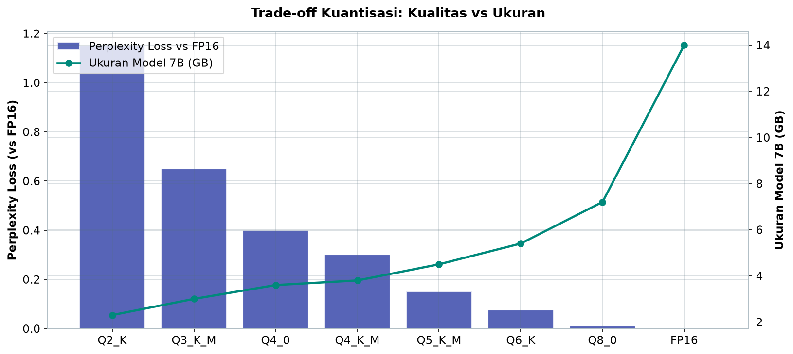
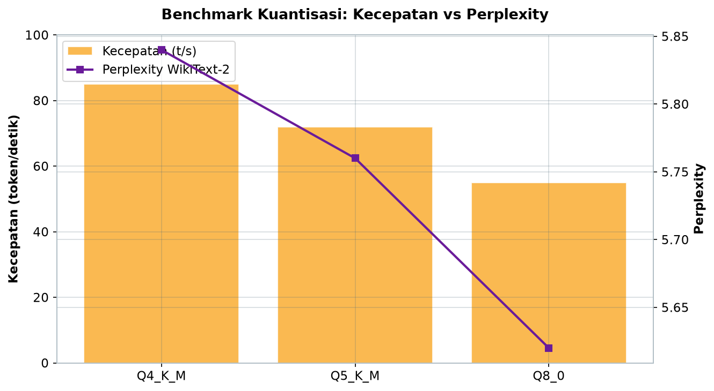
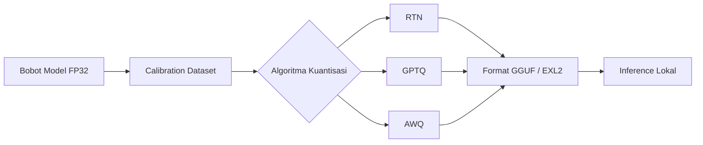
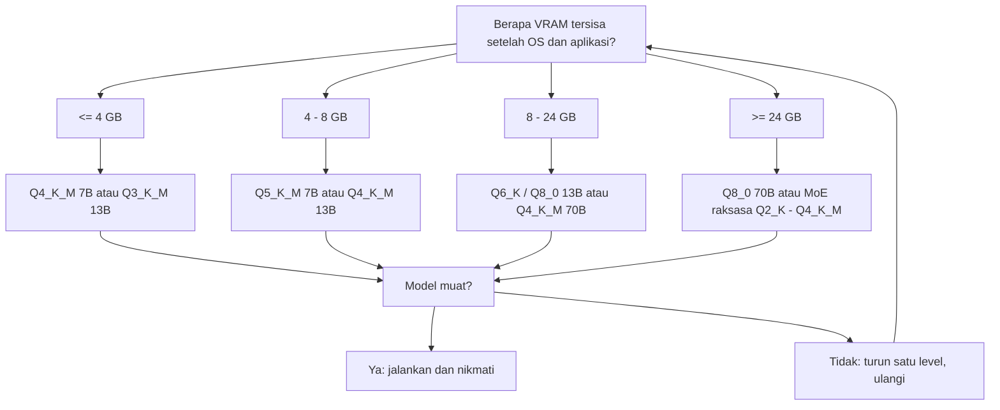

# Bab 1.4: Deep Dive Kuantisasi

> Bayangkan Anda memindahkan seluruh buku ke dalam satu tas ransel: halaman demi halaman dikompres menjadi ukuran mini, tetap bisa dibaca, tetapi ada sedikit detail kertas yang hilang. Itulah esensi kuantisasi — seni mengecilkan model tanpa menghancurkan kecerdasannya. Di bab ini kita akan membuka "dapur" di balik format GGUF, EXL2, dan segala level Q yang selama ini Anda lihat di setiap halaman unduhan model.

---

## 1. Tujuan Sub-Bab

Setelah membaca bab ini, Anda akan mampu:

- Menjelaskan perbedaan teknis antara Q4_K_M, Q5_0, Q8_0, dan FP16 dari sisi *perplexity* versus kecepatan *inference*
- Menganalisis mengapa model 7B bisa muat di 3,8 GB dan model 70B bisa muat di 38 GB tanpa kehilangan nyawanya
- Memilih tingkat kuantisasi yang tepat berdasarkan spesifikasi hardware dan *use case* — dari laptop kantor dengan 4 GB VRAM hingga workstation multi-GPU untuk model raksasa seperti DeepSeek V4 Flash dan Mistral Large 3
- Melakukan konversi model dari Hugging Face ke format GGUF secara mandiri, lalu memverifikasi kualitasnya dengan pengukuran *perplexity*
- Membandingkan ekosistem GGUF dan EXL2 dengan jujur: kelebihan, kekurangan, dan kapan masing-masing layak dipilih

---

## 2. Konsep Dasar: Menekan Jaringan Syaraf ke Dalam Lemari Kecil

Setiap model bahasa adalah gudang angka — miliaran *weight* (bobot) yang menentukan bagaimana model merespons dunia. Di dalam format aslinya, setiap bobot disimpan sebagai angka *floating point* 32-bit (FP32): presisi penuh, rentang luas, tetapi rakus ruang. Lalu muncul pertanyaan sederhana yang mengubah tata letak seluruh ekosistem lokal: *apakah kita benar-benar membutuhkan semua presisi itu?*

**Kuantisasi** adalah jawabannya — proses mereduksi presisi bobot dari FP32 (32-bit) menjadi 16-bit (FP16/BF16), 8-bit (INT8), atau bahkan 4-bit (INT4). Mari kita hitung: sebuah model 7B dalam FP32 membutuhkan sekitar 28 GB. Dengan INT4, kebutuhan turun menjadi sekitar 3,5-4 GB — **8 kali lebih kecil**. Itulah mengapa model yang dulu hanya bisa hidup di pusat data kini bisa berlari di laptop kelas menengah.

Analogi paling pas adalah fotografi: format RAW menyimpan seluruh detail sensor kamera — file besar, bebas kompresi, tetapi memakan kartu memori. Format JPEG mengompres semua itu menjadi pecahan ukurannya; mata manusia nyaris tidak melihat bedanya, tetapi secara matematis ada informasi yang dibuang. Kuantisasi berada di wilayah yang persis sama: model yang terkuantisasi tetap "terlihat" cerdas, tetapi jika Anda mengukur secara mikroskopis — melalui *perplexity* — ada jejak kualitas yang hilang. Pertanyaannya bukan *apakah* ada kehilangan, melainkan *berapa banyak* dan *apakah kita peduli*.

Yang menuai kebingungan di komunitas adalah kata-kata "4-bit" yang terdengar radikal. Namun penting dipahami: pada skala triliunan parameter, perbedaan antara bobot 4-bit dan 16-bit sering kali setara dengan perbedaan antara tinta hitam pekat dan tinta hitam setengah pekat — keduanya tetap terbaca. Bab ini akan memberi Anda alat untuk mengukur sendiri seberapa "terbaca" model Anda setelah ditekan ke setiap level.

Sebelum melangkah lebih jauh, ada satu kalkulasi yang akan menyelamatkan Anda dari banyak kecewa: membedakan **ukuran file** dari **kebutuhan memori saat runtime**. File model Q4_K_M sebesar 3,8 GB adalah *bobot statis* — tetapi saat model berjalan, ia juga membutuhkan *KV-cache* (memori untuk menyimpan perhatian antar token) dan ruang untuk *activations*. Aturan praktisnya: tambahkan 1-2 GB KV-cache untuk konteks pendek, dan jauh lebih banyak jika Anda memakai *context window* panjang. Inilah mengapa tabel "ukuran model" di situs unduhan tidak pernah cukup informatif: pertanyaan sebenarnya bukan "berapa GB file-nya", melainkan "berapa GB yang dibutuhkan mesin *ketika* model bekerja". Kegagalan memahami perbedaan ini adalah penyebab paling umum laptop "tiba-tiba lambat" setelah memasang model baru — bukan karena modelnya besar, tetapi karena RAM sistem sudah dijambret oleh KV-cache tanpa disadari.

---

## 3. Metode Pembulatan Bit: Empat Cabang ke Hasil yang Sama

Tidak semua kuantisasi diciptakan sama. Ada beberapa aliran pemikiran tentang *bagaimana* memetakan angka presisi tinggi ke angka presisi rendah. Mari kita bedah satu per satu.

### Round-to-Nearest (RTN)

Metode paling polos: setiap bobot dibulatkan ke nilai terdekat yang tersedia dalam rentang 4-bit atau 8-bit. **RTN** praktis tanpa komputasi tambahan — satu pass membaca bobot, membulatkannya, selesai. Masalahnya, pembulatan yang tampak tidak berbahaya di level satu bobot bisa "menumpuk" menjadi kesalahan sistematis di level lapisan, terutama pada bobot dengan nilai ekstrem (*outlier*). RTN menjadi dasar banyak konversi cepat, dan untuk 8-bit hasilnya sangat baik; untuk 4-bit ia mulai menunjukkan batasnya.

Mari kita telisik *mengapa* pembulatan sederhana bisa menjadi masalah. Bayangkan sebuah orkestra: setiap musisi boleh menyimpang dari notasi aslinya sepersekian desibel. Satu penyimpangan tidak terdengar; tetapi jika seratus musisi menyimpang ke arah yang sama, hasilnya menjadi dengung yang jelas salah. Hal yang sama terjadi pada jaringan syaraf: *forward pass* model mengalikan ribuan bobot secara berlapis, dan kesalahan pembulatan yang konsisten pada lapisan pertama akan *diamplifikasi* oleh lapisan berikutnya. Karena itu, metode seperti GPTQ dan AWQ muncul bukan untuk mempercantik teori, melainkan untuk mengatasi kesalahan yang sangat nyata ini — dengan memilih pembulatan yang meminimalkan dampak *kumulatif*, bukan kesalahan per-bobot.

### Quantization-Aware Training (QAT)

Berbeda dengan RTN yang bekerja pasca-training, **QAT** membawa simulasi kuantisasi *ke dalam proses training*. Selama *forward pass*, bobot sengaja dibulatkan seolah-olah sudah terkuantisasi, sehingga model belajar beradaptasi dengan "kebisingan" tersebut. Hasilnya adalah model yang secara genetik kebal terhadap efek pembulatan. Harganya: proses training lebih berat dan butuh data tambahan. QAT adalah pilihan ketika kualitas 4-bit *harus* sempurna — misalnya untuk model yang akan dijual ke banyak perangkat.

### GPTQ dan AWQ: Kuantisasi Pasca-Training yang Cerdas

**GPTQ** (*Generalized Post-Training Quantization*) memandang kuantisasi sebagai masalah optimasi. Alih-alih membulatkan bobot secara naif, GPTQ memilih pembulatan per kolom bobot sambil meminimalkan kesalahan kuadrat terhadap output model asli — ia menggunakan informasi *second-order* (Hessian) untuk memperkirakan bobot mana yang paling sensitif terhadap perubahan. Hasilnya, model 4-bit versi GPTQ sering kali melampaui kualitas RTN 4-bit dengan selisih yang mencolok [1].

**AWQ** (*Activation-aware Weight Quantization*) membawa intuisi berbeda: bukan semua bobot sama pentingnya. AWQ menganalisis *activations* — output perantara yang mengalir melalui model — dan menemukan bahwa sebagian kecil bobot (kurang dari 1%) bertanggung jawab atas sebagian besar kualitas model. Bobot "penting" ini dipertahankan dalam presisi lebih tinggi, sementara sisanya ditekan keras [2]. Teknik ini memungkinkan model seperti Qwen3.6-27B dan DeepSeek V4 Flash dijalankan di GPU kelas menengah dengan degradasi yang hampir tak terasa.

### Lapisan Perlakuan: SpQR dan SmoothQuant

Sebelum kita membahas level GGUF, ada dua penemuan yang menjelaskan *mengapa* kuantisasi 4-bit bisa bekerja semulus ini. **SpQR** menemukan bahwa *outlier weights* — bobot dengan magnitudo jauh di atas rata-rata — adalah sumber utama degradasi; jika outlier ini diisolasi dan disimpan dalam presisi tinggi, selebihnya bisa ditekan ke 3-4 bit dengan kerugian yang hampir nol [3]. Sementara itu, **SmoothQuant** menggeser "beban" kuantisasi: alih-alih membiarkan *activations* (yang fluktuasinya liar) jadi sumber kesalahan, distribusi tersebut dihaluskan dan dipindahkan ke bobot, sehingga kuantisasi 8-bit bisa berjalan hampir *lossless* [5]. Kedua temuan ini adalah alasan mengapa Q8_0 dan bahkan Q6_K bisa dianggap "hampir tanpa kerugian" di hampir semua model modern.

### Kuantisasi 4-bit Information-Theoretic: QLoRA dan NF4

Satu lagi nama yang wajib Anda kenal: **QLoRA** memperkenalkan tipe data **NF4** (*NormalFloat 4-bit*) yang dirancang berdasarkan teori informasi — distribusi bobot yang menyerupai kurva normal Gaussian dipecah menjadi 16 level dengan kepadatan mengikuti bentuk kurva, bukan merata [4]. Hasilnya, kuantisasi 4-bit dua kali lebih akurat dalam mengestimasi bobot dibandingkan pembulatan seragam naif. NF4 dan saudara-saudaranya menjadi alasan bahwa LLM 4-bit modern "memalukan" stereotip lama bahwa 4-bit berarti model jadi tumpul.

---

## 4. Level Kuantisasi GGUF: Dari Q2_K hingga Q8_0

GGUF — format milik ekosistem llama.cpp — menyediakan tangga level kuantisasi yang lengkap. Setiap level memberi kompromi berbeda antara ukuran, kecepatan, dan presisi. Mari kita kenali masing-masing, karena di sinilah Anda akan menghabiskan sebagian besar hidup sebagai pengguna model lokal.

**Q2_K** (2,56 bit per bobot) adalah ekstrem: model ditekan hingga sepertiga ukuran Q4_K_M. Untuk model 70B, ukurannya hanya sekitar 23 GB — cukup untuk satu GPU 24 GB. Tapi ada harga yang jelas: *perplexity* naik sekitar 0,8-1,5 poin, dan pada model kecil kualitasnya bisa terasa "patah-patah". Q2_K adalah pilihan terakhir — untuk perangkat yang sangat terbatas.

**Q3_K_M** (3,35 bit) mulai memberi kompromi yang lebih masuk akal: ukuran 7B sekitar 3,0 GB dan 70B sekitar 30 GB, dengan kenaikan *perplexity* 0,5-0,8 poin. Ini adalah level "bertahan hidup" untuk model besar di VRAM sempit.

**Q4_0** (4,00 bit) adalah kuantisasi 4-bit klasik tanpa penyempurnaan struktural — yang dulu populer di era awal llama.cpp. Cepat, sederhana, dan menjadi standar universal versi "economics class".

**Q4_K_M** (4,25 bit) — perhatikan suffix-nya. Huruf **_k** menandakan *k-quants*: kuantisasi heterogen yang menerapkan tingkat presisi berbeda pada bagian model yang berbeda. Bagian sensitif (misalnya layer attention dan output norm) mendapat lebih banyak bit, bagian "biasa" ditekan lebih keras. Huruf **_m** berarti *medium*, berada di antara varian *_s* (*small*) dan varian tanpa suffix — struktur kompromi yang paling seimbang. Q4_K_M menaikkan *perplexity* hanya 0,2-0,4 poin — dan karena itu ia pantas dijuluki **sweet spot** bagi mayoritas pengguna.

**Q5_K_M** (5,06 bit) adalah versi "pertaruhan kualitas": kenaikan *perplexity* hanya 0,1-0,2 poin tetapi membutuhkan VRAM lebih banyak dan kecepatan sedikit lebih rendah. Dipilih ketika Anda punya VRAM berlebih dan ingin mendekati kualitas FP16 tanpa membayar mahal.

**Q6_K** (6,00 bit) berada di wilayah yang hampir *lossless* — kenaikan 0,05-0,1 poin praktis tak terukur oleh indra manusia. Ukurannya mulai besar (7B: 5,4 GB; 70B: 54 GB) sehingga hanya masuk akal jika VRAM Anda lega dan kecepatan bukan prioritas.

**Q8_0** (8,00 bit) adalah puncak tangga kuantisasi: kenaikan *perplexity* hanya sekitar 0,01 poin — setara *lossless* untuk sebagian besar tujuan praktis — dan mampu mempertahankan outlier dengan setia. Ukurannya separuh FP16 (7B: 7,2 GB; 70B: 72 GB). Ini pilihan untuk GPU dengan VRAM 24 GB ke atas yang ingin mendekati model asli tanpa blueprint-nya.

**FP16** (16 bit) bukanlah kuantisasi melainkan titik referensi: model "asli" setengah presisi. Ukuran 7B: 14 GB; 70B: 140 GB. Hampir semua model di HF disimpan dalam format ini sebelum dikonversi, dan semua level kuantisasi diukur terhadap baseline-nya.

Sekilas, sistem penamaan ini tampak seperti kode-kode acak, tetapi ada logikanya: **ks** (*k-quants*) berarti komposisi heterogen berbasis pentingnya blok, sedangkan angka menunjukkan target bit rata-rata. Semakin tinggi angka, semakin besar file, semakin cepat kehabisan VRAM — tetapi semakin dekat Anda ke kecerdasan asli model.

Satu perbandingan yang sering disalahpahami: **Q4_0 vs Q4_K_M**. Keduanya sama-sama "4-bit", tetapi Q4_0 menerapkan presisi seragam ke seluruh bobot, sementara Q4_K_M mengalokasikan bit secara strategis — sedikit lebih banyak untuk bagian yang sensitif terhadap kesalahan (seperti layer *attention* dan *norm*), dan sedikit lebih sedikit untuk bagian yang toleran. Hasilnya Q4_K_M hampir selalu mengalahkan Q4_0 dalam *perplexity* sembari hanya membawa ukuran 0,25 bit lebih besar (4,25 vs 4,00). Inilah contoh paling nyata bahwa kuantisasi bukan sekadar matematika bit, melainkan *kecerdasan dalam mengalokasikan sumber daya* — seperti tukang masak yang menggunakan mentalek terbaiknya hanya pada bumbu utama, bukan pada air rebusan.

---

## 5. EXL2 vs GGUF: Dua Filosofi, Dua Dunia

Di luar GGUF ada saudara tirinya yang lebih eksotis: **EXL2**, format milik *ExLlamaV2*. Perbedaannya fundamental, bukan sekadar pergantian ekstensi file.

**EXL2** dibangun untuk satu tujuan: *throughput* maksimal di GPU NVIDIA. Ia menukar fleksibilitas dengan kecepatan — format ini menggunakan kompresi per-bobot yang dinamis, memanfaatkan setiap bit VRAM secara optimal, dan berjalan *GPU-only* karena ketergantungannya pada kernel CUDA yang dioptimalkan. Jika Anda memiliki GPU kencang dan ingin menyedot token sebanyak mungkin per detik, EXL2 adalah pilihan juara.

**GGUF**, sebaliknya, adalah format universal. Ia mendukung *hybrid inference* (CPU + GPU sekaligus), berjalan *native* di Apple Silicon, ARM, hingga SBC seperti Raspberry Pi, dan menjadi standar de facto di Ollama, LM Studio, dan hampir semua aplikasi desktop. Kekurangannya: kecepatan di GPU murni sedikit di bawah EXL2 karena overhead kompatibilitas.

Pilihan Anda pada akhirnya sederhana: **selalu GGUF** jika ingin fleksibilitas lintas perangkat dan kemudahan konversi; **pertimbangkan EXL2** jika seluruh dunia Anda adalah satu GPU NVIDIA dan Anda mengejar setiap token per detik. Model MoE besar dengan arsitektur eksotis biasanya lebih mudah dijinakkan dalam bentuk GGUF.

Ada satu faktor lagi yang sering luput: velositas *loading*. EXL2 dirancang untuk memuat dan mengalokasikan memori dengan sangat efisien di VRAM — itulah mengapa ia mendapat lima bintang untuk kecepatan *loading* di Tabel 3 — sementara GGUF lebih lambat saat pertama kali dijalankan karena proses *mmap* dan dekompresi yang bergantung platform. Bagi pengguna yang membuka-tutup model sepanjang hari (misalnya berganti-ganti antara model chat dan model coding), perbedaan beberapa detik *startup* ini bisa terasa seperti perbedaan antara angkutan umum yang tepat waktu dan yang "siap-siap telat". Jangan remehkan dimensi ini saat menimbang dua format — throughput tinggi tidak ada artinya jika Anda menghabiskan separuh sesi menunggu model terbangun.

---

## 6. Dampak Kuantisasi pada Output: Perplexity, Kejujuran, dan "Keluguan"

Apa yang sebenarnya terjadi pada *kualitas* model ketika kita menekannya dari FP16 ke Q4_K_M? Ukuran paling standar untuk menjawabnya adalah **perplexity** — sebuah metrik yang mengukur seberapa "terkejut" model terhadap teks: semakin rendah, semakin prediktif model tersebut terhadap bahasa alami.

Untuk model berukuran 7B, perbedaan antara FP16 dan Q4_K_M hanya sekitar **0,1-0,5 poin perplexity** — dan untuk bahasa yang sederhana, selisih 0,2 poin praktis tidak terasa dalam penggunaan sehari-hari [1][3]. Pada Q8_0, perbedaannya hampir nol. Ini kabar baik: sebagian besar distorsi kuantisasi memang terjadi, tetapi berada di wilayah yang jauh dari ambang persepsi manusia.

Bagaimana dengan halusinasi? Jawaban jujurnya: **halusinasi tidak selalu meningkat drastis**, tetapi ada perubahan karakter yang halus. Model terkuantisasi cenderung menjadi lebih "lugu" — replikasi pola yang lebih malas, peluang melompat ke kesimpulan yang salah sedikit lebih besar pada teks bernuansa. Ini bukan karena kuantisasi "merusak" kemampuan berpikir, melainkan karena detail terbaik dari distribusi bobot hilang, dan detail halus itulah yang biasanya menjadi pembeda antara jawaban tepat dan jawaban "hampir tepat". Untuk penggunaan sehari-hari (chat, ringkasan, coding sederhana), efek ini tidak signifikan; untuk tugas yang menuntut presisi ilmiah, selalu validasi dengan evaluasi yang lebih ketat — seperti yang akan kita pelajari di Bab 1.5.

Ada satu peringatan metodologis yang perlu disampaikan jujur: angka *perplexity* di tabel-tabel ini hampir selalu diukur pada **korpus bahasa Inggris** (misalnya WikiText-2). Karena itu, selisih 0,1-0,5 poin tersebut tidak serta-merta berlaku untuk Bahasa Indonesia — tokenizer yang kurang efisien untuk bahasa kita (lihat Bab 1.6) bisa memperbesar kesalahan kuantisasi pada kata-kata berimbuhan yang jarang muncul utuh di *vocabulary* model. Artinya, jika Anda bekerja dengan Bahasa Indonesia, lakukan verifikasi *perplexity* pada korpus Indonesia sendiri alih-alih menyalin patokan internasional. Kuantisasi yang "aman" untuk Inggris belum tentu sama amannya untuk kata-kata seperti "mempertanggungjawabkan" yang dipecah menjadi enam token.

---

## 7. Panduan Pemilihan: Memetakan VRAM Anda ke Level Kuantisasi

Kapan memilih level mana? Aturan praktisnya mengikuti matematika VRAM. Untuk pemilik **4 GB VRAM**: pilih Q4_K_M untuk model 7B, atau turun ke Q3_K_M jika menginginkan model 13B. Dengan **8 GB VRAM**: Q5_K_M untuk 7B nyaman dijalankan, Q4_K_M untuk 13B. Di **24 GB VRAM**, Anda memasuki wilayah mewah: Q8_0 untuk 13B, atau Q4_K_M untuk model 70B. Untuk **Apple Silicon 16 GB**: Q4_K_M untuk model 7B dengan *GPU offload* 100% adalah kombinasi paling seimbang — model muat penuh di memori terpadu, dan sisa memori tetap lega untuk sistem.

Ada satu wilayah baru yang sebelumnya mustahil: model **MoE raksasa**. DeepSeek V4 Flash (284B parameter total) dalam Q2_K hanya berbobot sekitar **90 GB**, dan Mistral Large 3 (675B) sekitar **210 GB** — keduanya hanya feasible di *workstation* multi-GPU atau Mac Studio 192 GB. Di sinilah kuantisasi bukan lagi sekadar penghemat, melainkan *pembuka pintu*: tanpa Q2_K/Q4_K_M, model sekelas ini tidak akan pernah bisa hidup di luar pusat data.

Terakhir, satu catatan tentang **kecepatan dan *memory bandwidth*** — hubungan yang akan dibahas lebih dalam di Bab 2. Dalam *inference* LLM, kecepatan generasi token hampir seluruhnya ditentukan oleh seberapa cepat VRAM bisa "menyuapi" bobot ke prosesor, bukan oleh kecepatan komputasi itu sendiri. Itulah sebabnya Q4_K_M terasa jauh lebih cepat daripada Q8_0 di GPU yang sama: bobot 3,8 GB yang dipindahkan jauh lebih sedikit daripada 7,2 GB per langkah generasi. Konsekuensinya, pilihan kuantisasi bukan hanya keputusan *ruang*, tetapi juga keputusan *kecepatan* — turun satu level kuantisasi sering kali berarti menaikkan puluhan token per detik tanpa mengganti perangkat keras apa pun. Bagi yang ingin mengejar kecepatan tanpa membeli GPU baru, kuantisasi adalah "upgrade gratis" yang paling mudah diambil.

---

## 8. Tabel Wajib

### Tabel 1: Perbandingan Level Kuantisasi GGUF

Berikut peta lengkap tangga kuantisasi GGUF — perhatikan bagaimana ukuran mengecil linier mengikuti bit, sementara *perplexity loss* tidak: ia melonjak drastis hanya di ujung paling ekstrem.

| Level | Bits/Weight | Ukuran Model 7B | Ukuran Model 70B | Perplexity Loss (vs FP16) | Kecepatan Relatif | Rekomendasi |
|:---|:---:|:---:|:---:|:---:|:---:|:---|
| **Q2_K** | 2.56 bit | ~2.3 GB | ~23 GB | +0.8 ~ 1.5 | Cepat | Hanya untuk HW sangat terbatas |
| **Q3_K_M** | 3.35 bit | ~3.0 GB | ~30 GB | +0.5 ~ 0.8 | Sedang | 4GB VRAM, model >=13B |
| **Q4_0** | 4.00 bit | ~3.6 GB | ~36 GB | +0.3 ~ 0.5 | Cepat | Standar universal |
| **Q4_K_M** | 4.25 bit | ~3.8 GB | ~38 GB | +0.2 ~ 0.4 | Sedang | **SWEET SPOT** |
| **Q5_K_M** | 5.06 bit | ~4.5 GB | ~45 GB | +0.1 ~ 0.2 | Lambat | Kualitas maksimal di VRAM cukup |
| **Q6_K** | 6.00 bit | ~5.4 GB | ~54 GB | +0.05 ~ 0.1 | Lambat | Hampir lossless |
| **Q8_0** | 8.00 bit | ~7.2 GB | ~72 GB | ~0.01 | Sangat lambat | Hanya untuk >=24GB VRAM |
| **FP16** | 16.00 bit | ~14 GB | ~140 GB | 0 (baseline) | - | Referensi, tidak praktikal |

*Data bersumber dari benchmark llama.cpp dan Open LLM Leaderboard; angka perplexity diukur pada model Llama-3.1-8B dan dapat sedikit bervariasi antar arsitektur [6][9].*

Fenomena paling menarik dari tabel ini adalah kurva *perplexity loss* yang tidak linear. Dari FP16 ke Q6_K, kerugiannya hanya 0,05-0,1 poin — wilayah "gratis". Dari Q6_K ke Q4_K_M, kerugian merangkak ke 0,2-0,4 — masih sangat wajar. Tetapi dari Q3_K_M ke Q2_K, kerugian melonjak dua kali lipat dari langkah sebelumnya. Artinya: jangan takut pada Q4_K_M (hampir tidak terlihat degradasinya), tetapi waspadalah pada Q2_K — wilayah ini adalah "zona bahaya" di mana model mulai kehilangan sebagian karakternya. Pro dan kontranya jelas: Q4_K_M adalah keseimbangan emas, Q8_0 adalah "asuransi kualitas" bagi yang bisa membayar VRAM, dan Q2_K adalah kartu darurat yang hanya digunakan saat tidak ada pilihan lain.



*Gambar 1.4-1 — kerugian kualitas (batang) melandai di wilayah Q4-Q6 lalu melonjak di Q2; ukuran model (garis) justru turun linier — wilayah "gratis" ada di Q5_Q6.*

### Tabel 2: Trade-off Kecepatan vs Kualitas (7B, RTX 4090)

Jika Tabel 1 menunjukkan peta teori, tabel berikut menunjukkan peta pengalaman nyata — diukur pada model 7B di GPU RTX 4090.

| Kuantisasi | Speed (t/s) | VRAM Used | Perplexity (WikiText-2) |
|:---|:---:|:---:|:---:|
| Q4_K_M | ~85 t/s | ~5.2 GB | 5.84 |
| Q5_K_M | ~72 t/s | ~6.1 GB | 5.76 |
| Q8_0 | ~55 t/s | ~8.5 GB | 5.62 |

Perhatikan tiga angka ini sekaligus: dari Q4_K_M ke Q8_0, *perplexity* hanya membaik 0,22 poin (dari 5,84 ke 5,62) — tetapi kecepatan jatuh dari 85 t/s ke 55 t/s, hampir sepertiga lebih lambat, dan VRAM naik 63%. Ini adalah contoh sempurna *diminishing returns*: Anda membayar kecepatan dan VRAM untuk peningkatan kualitas yang tidak akan pernah Anda rasakan dalam percakapan sehari-hari. Kecuali Anda sedang menulis evaluasi formal atau memproses teks yang sangat sensitif, Q4_K_M tetap menjadi nilai terbaik.



*Gambar 1.4-2 — kecepatan (batang) naik 55% saat beralih ke Q4_K_M, sementara perplexity (garis) nyaris tidak berubah — bukti diminishing returns kualitas.*

### Tabel 3: Perbandingan Tools Konversi

Terakhir, mari kita pilih senjatanya: empat tool utama yang akan menemani perjalanan kuantisasi Anda.

| Fitur | llama.cpp (GGUF) | ExLlamaV2 (EXL2) | AutoGPTQ | AWQ |
|:---|:---|:---|:---|:---|
| **Format Output** | GGUF | EXL2/Safetensors | GPTQ | AWQ |
| **CPU + GPU Hybrid** | Ya | GPU only | GPU only | GPU only |
| **Apple Silicon** | Native | - | - | - |
| **Kecepatan Loading** | *** | ***** | *** | **** |
| **Kemudahan Konversi** | ***** | ** | *** | ** |
| **Best For** | Semua platform | GPU kencang | GPU NVIDIA | GPU NVIDIA |

Yang menonjol: llama.cpp unggul di semua dimensi *kecuali* kecepatan loading, karena ia mengalahkan kompetitor dalam hal fleksibilitas platform — satu-satunya tool yang bekerja di Apple Silicon dan mendukung mode CPU+GPU hybrid secara *native*. ExLlamaV2 adalah pilihan khusus bagi pemilik GPU NVIDIA yang ingin performa paling ekstrem. AutoGPTQ dan AWQ sama-sama terbatas pada GPU NVIDIA, dengan AWQ sebagai penerus yang lebih modern [1][2]. Untuk 95% pengguna, llama.cpp adalah titik awal yang tepat — Anda bisa beralih ke EXL2 nanti jika benar-benar mengejar kecepatan.

---

## 9. Diagram & Visualisasi

### Gambar 1: Pipeline Kuantisasi

Urutan proses dari bobot asli hingga model siap pakai — perhatikan bahwa kalibrasi memegang peran sentral, menghubungkan data asli dengan semua jalur algoritma.



Diagram ini menceritakan satu hal yang sering dilupakan: kuantisasi bukan proses satu arah yang mekanis, melainkan sebuah *pipeline* dengan titik keputusan. Data kalibrasi menentukan seberapa baik algoritma mengenali distribusi bobot yang harus dipertahankan; RTN, GPTQ, dan AWQ kemudian bersaing di titik yang sama — dan semuanya bermuara pada format file yang sama di ujung. Kualitas hasil akhir Anda ditentukan di dua titik: kualitas data kalibrasi, dan pilihan algoritma. Jika satu saja di antaranya asal-asalan, Anda akan melihat "kebocoran" kualitas yang tidak bisa disalahkan pada level kuantisasi.

### Gambar 2: Pohon Keputusan Pemilihan Kuantisasi

Jika Anda sering bingung memilih level, ikuti alur sederhana berikut — mulai dari pertanyaan paling penting: berapa VRAM yang benar-benar tersedia.



Keputusan ini bermuara pada satu lingkaran yang jujur: mulai dari level yang masuk akal untuk VRAM Anda, lalu *ujilah* — jika model muat dan kecepatan terasa nyaman, berhenti. Jangan naik level hanya karena "lebih tinggi lebih baik", sebab seperti yang kita lihat di Tabel 2, harga kecepatan dan VRAM tidak selalu membeli kualitas yang bisa Anda rasakan. Sebaliknya, jika model tidak muat, turun satu level hingga titik di mana kompromi terasa wajar — bukan sampai titik di mana model kehilangan karakter (perhatikan zona Q2_K).

Satu catatan penutup untuk diagram ini: pohon keputusan di atas mengasumsikan satu model dan satu level. Di dunia nyata, *power user* sering mengelola beberapa model sekaligus — misalnya Q4_K_M untuk *chat assistant* harian, Q6_K untuk model coding favorit, dan Q2_K untuk MoE raksasa yang hanya dipakai saat menulis laporan panjang. Menyimpan model dalam beberapa level sekaligus memang memakan penyimpanan, tetapi memberikan fleksibilitas menukar kualitas-kecepatan sesuai mood tugas: cepat dan ringan untuk chat, berat dan teliti untuk pekerjaan serius. Diskusi yang lebih dalam tentang manajemen multi-model akan Anda temukan di bab-bab berikutnya tentang *software* (Bab 3) dan *hardware* (Bab 2).

---

## 10. Praktikum / Hands-On: Konversi dan Verifikasi Model Sendiri

Teori cukup — sekarang giliran Anda menekan tombol. Ikuti tiga tutorial berikut di terminal untuk mengubah model Hugging Face menjadi GGUF, lalu memverifikasi kualitasnya.

### Langkah 1: Konversi Model ke GGUF (llama.cpp)

```bash
# 1. Clone repo llama.cpp
git clone https://github.com/ggerganov/llama.cpp
cd llama.cpp

# 2. Build untuk macOS dengan Apple Silicon (aktifkan Metal)
LLAMA_METAL=1 make -j

# 3. Konversi model HuggingFace ke GGUF FP16 sebagai master
python convert.py ../path-to-model/ \
    --outfile models/model-fp16.gguf \
    --outtype f16
```

### Langkah 2: Kuantisasi ke Level Pilihan

```bash
# Lihat semua opsi level yang tersedia
./quantize --help

# Kuantisasi master FP16 ke Q4_K_M (sweet spot)
./quantize models/model-fp16.gguf \
    models/model-q4_k_m.gguf \
    q4_k_m

# Uji inference cepat: apakah model masih "hidup"?
./main -m models/model-q4_k_m.gguf \
    -p "Saya adalah" -n 128
```

Output `./quantize --help` akan menampilkan seluruh tangga level yang kita bahas di Tabel 1 — dari q2_k hingga q8_0 — ditambah varian seperti q4_0, q5_0, dan q6_k. Gunakan daftar itu sebagai menu; Anda tidak terikat pada satu level. Praktik terbaik: selalu konversi ke FP16 dulu sebagai *master*, lalu turunkan ke beberapa level berbeda, dan bandingkan hasilnya pada prompt yang sama.

### Langkah 3: Unduh Model yang Sudah Terkuantisasi

Tidak semua orang perlu mengkonversi — ribuan model GGUF sudah disiapkan komunitas.

```bash
# Cara termudah: Ollama
ollama pull llama3.1:8b

# Atau langsung dari HuggingFace (repository bartowski / TheBloke)
huggingface-cli download bartowski/Meta-Llama-3.1-8B-Instruct-GGUF \
    Meta-Llama-3.1-8B-Instruct-Q4_K_M.gguf
```

Namun ada satu hal yang perlu Anda ketahui tentang file-file komunitas: **tidak semua hasil kuantisasi dibuat dengan standar yang sama**. Beberapa pembuat memilih *calibration dataset* yang spesifik, sebagian lagi memakai *split* bobot yang berbeda, dan ada yang mengubah *tokenizer* sedikit demi kompatibilitas. Konsekuensinya, dua file "Q4_K_M" dari repo berbeda bisa memiliki *perplexity* yang sedikit berbeda pada iterasi yang sama. Itulah mengapa repository dengan riwayat verifikasi panjang (seperti bartowski dan TheBloke) lebih aman daripada file yang diunggah oleh akun baru: jumlah unduhan dan komentar pengguna adalah semacam "uji halal" yang tidak tertulis. Jika ragu, jalankan *Langkah 4* Anda sendiri pada file tersebut — verifikasi selalu lebih murah daripada penyesalan.

### Langkah 4: Verifikasi Kualitas dengan Perplexity

```bash
# Ukur perplexity model Q4_K_M Anda terhadap korpus teks
./perplexity -m models/model-q4_k_m.gguf \
    -f wiki.test.raw
```

Angka yang keluar bisa dibandingkan dengan Tabel 2: model 7B yang sehat di Q4_K_M seharusnya berada di wilayah 5,8-6,0 pada WikiText-2. Jika angka Anda jauh lebih buruk (misalnya di atas 8), kemungkinan penyebabnya adalah kualitas data kalibrasi saat konversi, bukan level kuantisasinya. Ini adalah cara paling jujur untuk memverifikasi bahwa kompromi yang Anda pilih benar-benar terbayar.

### Langkah 5: Workflow Konversi yang Disarankan

Berdasarkan pengalaman praktisi, ada satu alur yang paling sedikit menyebabkan penyesalan:

```bash
# 1. Konversi master FP16 SEKALI — simpan selamanya sebagai blueprint
python convert.py ../path-to-model/ \
    --outfile models/model-fp16.gguf \
    --outtype f16

# 2. Turunkan beberapa level sekaligus dengan satu perintah per level
./quantize models/model-fp16.gguf models/model-q4_k_m.gguf q4_k_m
./quantize models/model-fp16.gguf models/model-q5_k_m.gguf q5_k_m
./quantize models/model-fp16.gguf models/model-q8_0.gguf  q8_0

# 3. Bandingkan perplexity ketiganya, lalu putuskan dari DATA — bukan dari intuisi
./perplexity -m models/model-q4_k_m.gguf -f wiki.test.raw
./perplexity -m models/model-q5_k_m.gguf -f wiki.test.raw
./perplexity -m models/model-q8_0.gguf  -f wiki.test.raw
```

Pola ini menumbuhkan satu kebiasaan bernilai: **selalu simpan master FP16**. File master adalah satu-satunya "negatif asli" dari model Anda — jika suatu saat ingin mencoba level baru atau format baru (misalnya beralih ke EXL2), Anda tidak perlu mengunduh ulang atau mengkonversi ulang dari sumber, cukup dari master yang sudah bersih. Konversi berkali-kali dari model yang sudah terkuantisasi (misalnya Q8_0 ke Q4_K_M) akan mengakumulasi kesalahan pembulatan — kuantisasi harus dilakukan sekali, dari sumber yang paling murni, bukan secara rantai. Satu kebiasaan kecil ini menyelamatkan Anda dari kelas klasik kesalahan "mengapa ini lebih rusak daripada yang lain?" yang menimpa hampir semua pemula di awal perjalanan.

---

## 11. Studi Kasus: Memilih Kuantisasi untuk MacBook Pro M3 18GB

**Latar:** Budi, seorang developer lepas di Yogyakarta, ingin memakai Llama-3.1-8B-Instruct sebagai *daily coding assistant*. Ia bekerja dari kafe-kafe, sering offline, dan membutuhkan model yang nyaman diajak berdiskusi tentang kode tanpa rasa "kaku". Perangkatnya: MacBook Pro M3 dengan 18 GB *Unified Memory*.

**Batasan:** 18 GB adalah angka yang menipu. macOS sendiri akan mengambil sekitar 6-8 GB untuk sistem dan aplikasi lain (browser, editor, Slack). Artinya, Budi sebenarnya hanya punya ruang nyaman sekitar 10-12 GB untuk model dan semua memorinya. Jika ia memaksakan model yang memakan 14 GB, sistem akan mulai *swap* ke penyimpanan — dan laptopnya akan menjadi slow cooker.

**Analisis pilihan:** Dengan kebutuhan itu, Budi mencoba tiga kandidat. **Q8_0** (7,2 GB + KV-cache) masih muat secara teori, tetapi meninggalkan ruang tipis untuk sistem — dan kecepatan generasinya di bawah Q5_K_M. **Q5_K_M** (4,5 GB + KV-cache sekitar 2-3 GB) memberikan kualitas *perplexity* 5,76 — yang terbaik kedua — tetapi menuntut kompromi: Budi harus rela menutup browser saat model bekerja. **Q4_K_M** (3,8 GB + sekitar 2 GB KV-cache = total sekitar 6 GB) adalah pilihan paling damai: sisa 12 GB tetap lega untuk Chrome, editor, dan sistem.

**Hasil akhir:** Budi memilih **Q4_K_M**. Dengan *GPU offload* 100% (semua layer mengalir ke Metal) dan *keep-alive* LLM aktif, model merespons sekitar 55-60 token/detik — cukup cepat untuk *autocomplete* dan percakapan coding. Kehilangan 0,2 poin *perplexity* dibandingkan Q8_0 tidak pernah ia rasakan dalam penggunaan harian; yang ia rasakan adalah laptop yang tetap dingin dan browser yang tidak pernah mati mendadak.

**Pelajaran:** Kuantisasi bukan kompetisi memilih level "terbaik" di atas kertas — melainkan *negosiasi* antara kualitas, kecepatan, dan ruang yang benar-benar tersisa untuk sistem Anda. Angka 18 GB di brosur tidak sama dengan 18 GB yang bisa Anda pakai. Hitung semua penghuni VRAM Anda sebelum memilih, dan ingat: pilihan terbaik adalah pilihan yang membuat *workflow* Anda lancar, bukan yang membuat skor perplexity Anda terkecil.

---

## 12. Referensi

### Paper Jurnal/Konferensi

[1] Frantar, E., Ashkboos, S., Hoefler, T., & Alistarh, D. (2023). *GPTQ: Accurate Post-Training Quantization for Generative Pre-trained Transformers*. ICLR. DOI: [10.48550/arXiv.2210.17323](https://arxiv.org/abs/2210.17323)

[2] Lin, J., Tang, J., Tang, H., Yang, S., Chen, W.-M., Wang, W.-C., Xiao, G., Dang, X., Gan, C., & Han, S. (2024). *AWQ: Activation-aware Weight Quantization for LLM Compression and Acceleration*. MLSys. DOI: [10.48550/arXiv.2306.00978](https://arxiv.org/abs/2306.00978)

[3] Dettmers, T., Svirschevski, R., Egiazarian, V., Kuznedelev, D., Frantar, E., Ashkboos, S., Borzunov, A., Hoefler, T., & Alistarh, D. (2024). *SpQR: A Sparse-Quantized Representation for Near-Lossless LLM Weight Compression*. ICLR. DOI: [10.48550/arXiv.2306.03078](https://arxiv.org/abs/2306.03078)

[4] Dettmers, T., Pagnoni, A., Holtzman, A., & Zettlemoyer, L. (2023). *QLoRA: Efficient Finetuning of Quantized LLMs*. NeurIPS. DOI: [10.48550/arXiv.2305.14314](https://arxiv.org/abs/2305.14314)

[5] Xiao, G., Lin, J., Seznec, M., Wu, H., Demouth, J., & Han, S. (2023). *SmoothQuant: Accurate and Efficient Post-Training Quantization for Large Language Models*. ICML. DOI: [10.48550/arXiv.2211.10438](https://arxiv.org/abs/2211.10438)

### Referensi Pendukung (Dokumentasi/Repository)

[6] Ggerganov. *llama.cpp — Inference engine untuk GGUF*. [github.com/ggerganov/llama.cpp](https://github.com/ggerganov/llama.cpp)

[7] TheBloke. *GGUF Model Repository — Hugging Face*. [huggingface.co/TheBloke](https://huggingface.co/TheBloke)

[8] LMSYS. *Chatbot Arena Leaderboard*. [lmarena.ai](https://lmarena.ai)

[9] DeepSeek-AI. (2026). *DeepSeek-V4: A Hybrid CSA/HCA Mixture-of-Experts Language Model*. arXiv. DOI: [10.48550/arXiv.2604.09980](https://arxiv.org/abs/2604.09980)

[10] Mistral AI. (2025). *Mistral Large 3: Granular MoE with Multimodal Capabilities*. arXiv. DOI: [10.48550/arXiv.2512.01820](https://arxiv.org/abs/2512.01820)