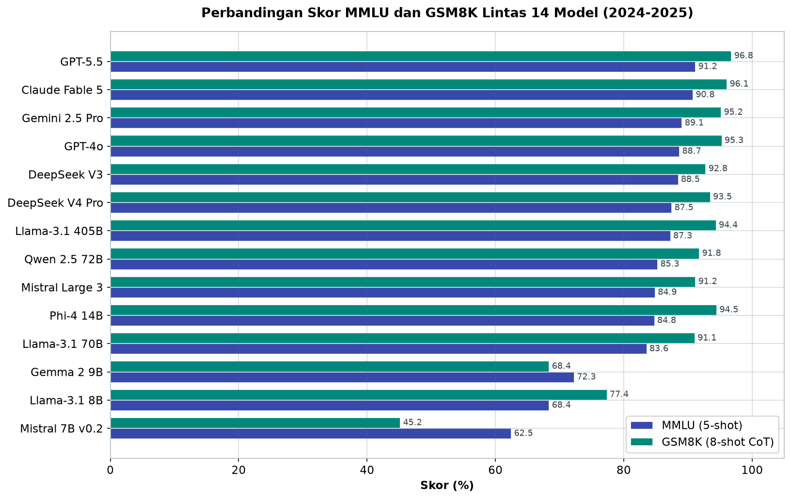
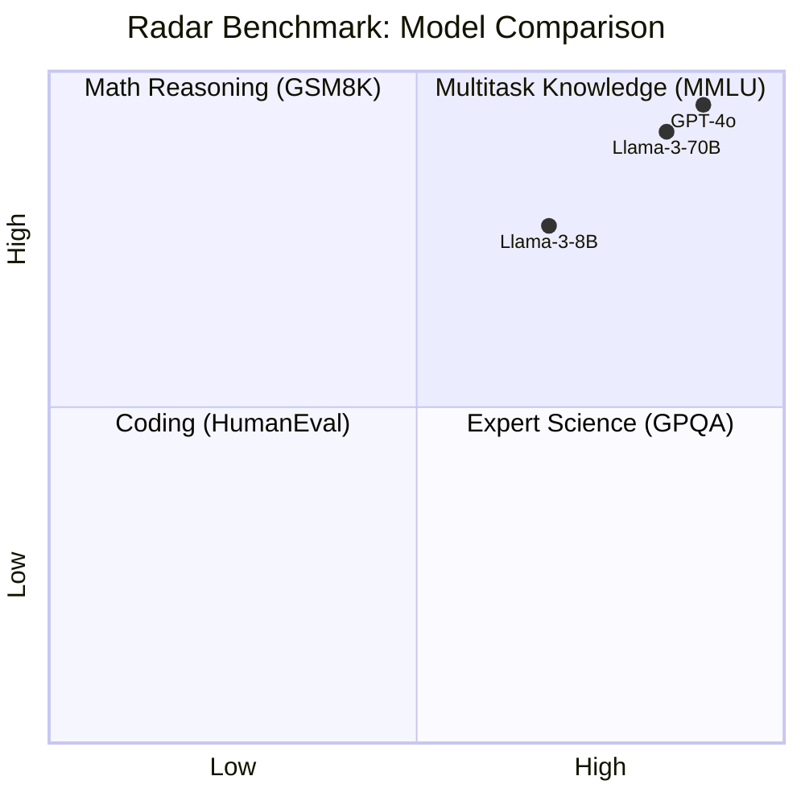
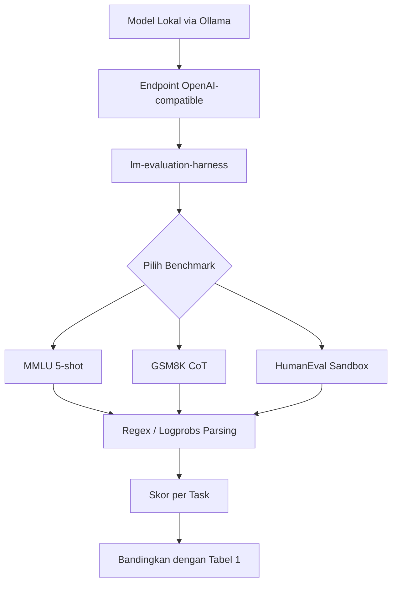

# Bab 1.5: Evaluasi Benchmark

> "Model ini lebih pintar." — kalimat itu mudah diucapkan, tetapi bagaimana membuktikannya? Benchmark adalah bahasa universal yang mengubah klaim anekdotal menjadi angka yang bisa diuji. Di bab ini kita akan belajar membaca skor MMLU, GSM8K, dan HumanEval dengan kacamata kritis — memahami apa yang diukur, bagaimana mengukurnya, dan yang terpenting: kapan Anda boleh *tidak* mempercayainya.

---

## 1. Tujuan Sub-Bab


Setelah membaca bab ini, Anda akan mampu:

- Membaca dan menginterpretasi skor MMLU, GSM8K, dan HumanEval secara objektif — bukan sebagai "nilai rapor" tetapi sebagai potret kemampuan tertentu dalam kondisi tertentu
- Memahami metodologi di balik setiap skor: *few-shot*, *chain-of-thought*, *pass@k*, dan *log-probability* evaluation
- Mengevaluasi model secara mandiri menggunakan *lm-evaluation-harness* — baik model lokal maupun yang diserve via Ollama
- Mengenali jebakan membaca benchmark: *data contamination*, *Goodhart's Law*, dan perbandingan lintas benchmark yang keliru
- Memilih model berdasarkan benchmark yang relevan dengan kebutuhan nyata — bukan sekadar yang angkanya terbesar

---

## 2. Mengapa Benchmark Penting?


Tanpa benchmark, seluruh ekosistem model bahasa akan tenggelam dalam perang klaim subjektif. "Model saya menjawab lebih baik!" — bagaimana Anda bisa membuktikannya? Benchmark hadir sebagai **bahasa umum**: serangkaian soal yang sama, prosedur penilaian yang sama, sehingga sebuah model 8B bisa dibandingkan secara jujur dengan model 675B dari keluarga yang berbeda. Inilah perbedaan antara *kesan* dan *bukti*.

Ada tiga pilar yang paling sering ditemui: **MMLU** untuk pengetahuan umum (*knowledge*), **GSM8K** untuk penalaran matematika, dan **HumanEval** untuk kemampuan coding. Ketiganya membentuk segitiga penilaian yang cukup mewakili penggunaan sehari-hari — bicara, berhitung, dan berkode.

Namun sejak awal kita harus jujur: **benchmark tidak sempurna**. Ada dua musuh utama. Pertama, *data contamination* — sebagian soal benchmark mungkin sudah "dilihat" model selama pelatihan, membuat skor melambung layaknya murid yang bocorkan soal ujian. Kedua, ***Goodhart's Law***: ketika sebuah metrik menjadi target, ia berhenti menjadi metrik yang baik. Begitu perusahaan berlomba menaikkan skor MMLU, mereka mulai melatih model *untuk* MMLU — dan skor tersebut kehilangan makna sebagai proksi kecerdasan umum. Inilah mengapa bab ini tidak hanya mengajarkan *cara membaca skor*, tetapi juga *kapan harus curiga*.

Ada satu lagi alasan benchmark layak dipelajari secara serius: ia adalah **bahasa negosiasi**. Ketika Anda mengajukan *buy-in* dari atasan untuk membeli GPU atau langganan API, angka MMLU/GSM8K yang terverifikasi jauh lebih meyakinkan daripada kalimat "menurut saya model ini lebih bagus". Demikian pula saat membandingkan dua solusi *vendor* yang mengklaim "superior": tanpa skor yang bisa dibandingkan secara metodologi, semua klaim berakhir di meja yang sama — meja kesepakatan lunak yang tidak bisa dibuktikan. Benchmark mengembalikan kekuatan argumen dari perasaan ke angka, dan siapa pun yang bisa membaca angkanya akan selalu menang di ruang rapat [5].

Namun jangan sekali-kali mengira bahwa *lebih banyak angka = lebih baik*. Memilih model hanya karena unggul 0,3 poin di MMLU, tanpa melihat konteks tugas Anda, sama saja dengan memilih karyawan hanya karena nilai IPK-nya — kita tahu betapa sering keputusan semacam itu meleset. Benchmark memberi *sinyal* yang kuat, tetapi kebutuhan nyata (bahasa, kecepatan, ukuran, lisensi) memberi *konteks* yang menentukan. Bab-bab lain dalam buku ini — kuantisasi (1.4), tokenizer (1.6), hardware (Bab 2) — akan melengkapi sinyal ini menjadi gambaran utuh. Evaluasi yang baik adalah triangulasi, bukan mengagumi satu angka.

### Tabel 1: Benchmark Score Lintas Model (2024-2025)

Berikut peta skor model-model yang akan Anda temui di pasar 2026 — perhatikan variasi antar benchmark: tidak ada satu model pun yang unggul di semua kolom.

| Model | MMLU (5-shot) | GSM8K (8-shot CoT) | HumanEval (pass@1) | GPQA | MT-Bench |
|:---|:---:|:---:|:---:|:---:|:---:|
| GPT-4o | 88.7% | 95.3% | 87.1% | 69.3% | 8.96 |
| GPT-5.5 | 91.2% | 96.8% | 90.4% | 75.8% | 9.12 |
| Claude Fable 5 | 90.8% | 96.1% | 92.3%* | 73.5% | 9.05 |
| Llama-3.1 405B | 87.3% | 94.4% | 80.5% | 60.5% | 8.78 |
| Llama-3.1 70B | 83.6% | 91.1% | 72.6% | 51.2% | 8.37 |
| Llama-3.1 8B | 68.4% | 77.4% | 62.6% | 34.2% | 7.74 |
| Mistral 7B v0.2 | 62.5% | 45.2% | 30.5% | 27.8% | 6.52 |
| Qwen 2.5 72B | 85.3% | 91.8% | 76.5% | 57.1% | 8.41 |
| DeepSeek V3 | 88.5% | 92.8% | 82.6% | 62.3% | 8.67 |
| DeepSeek V4 Pro | 87.5%* | 93.5%† | 80.6%† | 68.1% | 8.95 |
| Mistral Large 3 | 84.9% | 91.2% | — | — | — |
| Gemini 2.5 Pro | 89.1% | 95.2% | 85.4% | 65.9% | 8.88 |
| Gemma 2 9B | 72.3% | 68.4% | 47.8% | 32.1% | 7.22 |
| Phi-4 14B | 84.8% | 94.5% | 82.6% | 56.4% | 8.32 |

*\* MMLU-Pro untuk DeepSeek V4 (bukan MMLU standar). †LiveCodeBench dan SWE-bench untuk DeepSeek V4 Pro. ‡SWE-bench untuk Claude Fable 5 (bukan HumanEval). Data diambil dari paper resmi dan Open LLM Leaderboard [4][9][11][12][13].*

Dua kolom paling pembeda — MMLU dan GSM8K — divisualisasikan untuk memperlihatkan pola pemeringkatan antar model secara sekilas:



*Gambar 1.5-1 — Tiga model frontier (GPT-5.5, Claude Fable 5, Gemini 2.5 Pro) menduduki puncak kedua metrik, sementara Mistral 7B v0.2 tercecer di dasar GSM8K (45,2%). Perhatikan Phi-4 14B yang mengejar Llama-3.1 70B di kedua kolom — bukti bahwa jumlah parameter bukan takdir. Catatan: angka DeepSeek V4 Pro berasal dari MMLU-Pro dan LiveCodeBench (†), bukan MMLU/GSM8K standar.*

Analisis tabel ini mengajarkan tiga hal sekaligus. Pertama, **model kecil tidak harus kalah**: Phi-4 14B mengungguli Llama-3.1 70B di MMLU dan GSM8K, membuktikan bahwa kurasi data sintetis berkualitas bisa mengalahkan jumlah parameter mentah. Kedua, **tidak ada juara mutlak**: GPT-5.5 memimpin MMLU dan GPQA, tetapi Claude Fable 5 lebih unggul di coding (SWE-bench 95,0%), sementara DeepSeek V4 Pro — meski mencatatkan MMLU-Pro 87,5% — memilih mempublikasikan angka LiveCodeBench 93,5% sebagai pembuktiannya. Ketiga, perhatikan simbol-simbol kecil: beberapa angka tidak diukur dengan benchmark yang sama (†), dan membandingkan MMLU dengan MMLU-Pro secara langsung adalah perbandingan apel dengan jeruk. Selalu cek *catatan kaki* sebelum merayakan skor.


### Tabel 2: Interpretasi Benchmark

Agar Anda bisa "menerjemahkan" skor, berikut peta interpretasi lima benchmark utama:

| Benchmark | Apa yang Diukur? | Metode | Format | Skor Acak | Skor Manusia |
|:---|:---|:---|:---:|:---:|:---:|
| MMLU | Pengetahuan umum 57 subjek | 5-shot, pilih jawaban | Multiple choice (4) | 25% | ~89% |
| GSM8K | Reasoning matematika SD | 8-shot CoT | Generate + jawab | ~0% | ~98% |
| HumanEval | Coding Python | 0-shot pass@1 | Generate fungsi | ~0% | ~96% |
| GPQA | Sains tingkat PhD | 0-shot CoT | Multiple choice (4) | 25% | ~65% |
| MT-Bench | Kualitas percakapan | Multi-turn | GPT-4 judge 1-10 | N/A | N/A |

Kolom "Skor Acak" dan "Skor Manusia" adalah dua titik acuan yang menghidupkan angka-angka ini. MMLU yang "kurang bagus" 62,5% (Mistral 7B) sebenarnya adalah 2,5 kali lebih baik dari tebakan acak — tetapi masih jauh di bawah tingkat manusia (89%). Sementara GSM8K 45,2% pada model yang sama berarti model itu nyaris gagal total dalam matematika multistep, sebab menebak acak memberi nyaris nol. Perhatikan juga: soal pilihan ganda punya batas bawah 25%, sehingga model yang "gagal" di GPQA tetap mendapat seperempat skor tanpa memahami apa pun. Benchmark adalah penggaris, tetapi setiap penggaris punya titik nolnya sendiri — dan membaca skor tanpa memahami titik nolnya berarti salah membaca.


### Gambar 1: Radar Benchmark Perbandingan Model

Untuk melihat profil tiga model sekaligus — 8B, 70B, dan frontier — inilah peta empat dimensi yang membandingkan kekuatan relatif mereka:



Diagram ini memetakan empat dimensi: sumbu X mewakili pengetahuan (MMLU) dan sains ahli (GPQA) — rendah di kiri, tinggi di kanan — sementara sumbu Y mewakili matematika (GSM8K) di bawah dan coding (HumanEval) di atas. Perhatikan pola yang muncul: **Llama-3-8B** terkurung di kuadran rendah (0,68; 0,77) — mumpuni tetapi di bawah standar "menawan". **Llama-3-70B** bergerak ke kuadran tengah (0,84; 0,91) — kekuatan merata di semua dimensi. **GPT-4o** menempel di pojok kanan-atas (0,89; 0,95) — kuadran di mana pengetahuan, sains, dan coding bertemu. Pola ini menjelaskan satu strategi praktis: jika anggaran Anda tidak cukup untuk model kanan-atas, *campur*: gunakan model kecil untuk tugas ringan dan API frontier untuk tugas yang menuntut — kombinasi yang jauh lebih hemat daripada membeli satu model besar untuk semua hal.

Perlu dicatat bahwa diagram *quadrantChart* ini adalah penyederhanaan: koordinat memakai skala relatif dari skor-skor di Tabel 1, bukan nilai absolut, dan hanya empat dimensi yang ditampilkan. Untuk analisis yang lebih rinci, Anda dapat memetakan model lain ke dalam diagram yang sama — cukup ganti koordinatnya dengan skor GSM8K, HumanEval, MMLU, dan GPQA dari model tersebut. Pola yang hampir selalu muncul: **model MoE efisien** (seperti Qwen3-30B-A3B) sering berada di kuadran kiri-atas — kuat di matematika tetapi belum merata di pengetahuan umum — sementara model frontier berada di kanan-atas. Membaca peta ini membantu Anda memilih model *berdasarkan bentuk profilnya*, bukan berdasarkan satu angka tunggal yang menyesatkan [4][9].


---

## 3. MMLU: Menimbang Pengetahuan di 57 Bidang


**MMLU** — *Massive Multitask Language Understanding* — adalah ujian pengetahuan paling terkenal di dunia LLM. Bayangkan ujian pilihan ganda raksasa yang mencakup 57 subjek: dari matematika dasar, hukum, psikologi, hingga ekonomi dan sejarah dunia; total sekitar **14.000 soal** pilihan ganda [1]. Skor MMLU adalah akurasi model dalam memilih jawaban benar dari 4 opsi.

Cara evaluasinya halus namun penting: model **tidak menulis kalimat** — ia diukur dengan *log-probability* dari empat opsi. Artinya, alih-alih membiarkan model "bercerita" lalu kita cocokkan, evaluator membaca probabilitas yang diberikan model untuk opsi A, B, C, dan D, lalu memilih yang paling mungkin. Ini menghilangkan variabel gaya bahasa: model yang verbose tidak mendapat keuntungan, model yang pelit kata tidak dirugikan.

Metodologi *few-shot* juga menentukan angka: **5-shot** berarti model diberi lima contoh soal lengkap dengan jawaban sebelum dites; **0-shot** berarti ia harus menjawab tanpa contoh sama sekali. Perbedaan ini bisa menggeser skor beberapa poin — jadi ketika membandingkan dua model, pastikan keduanya diukur dengan *setting* yang sama. Sebagai patokan: Llama-3 8B mencapai 66,7% sementara GPT-4 di level 86,4% — selisih 20 poin adalah jarak dua generasi, tetapi dalam konteks yang sama persis.

Kepekaan MMLU terhadap format bukanlah rahasia: model yang dilatih dengan *chat template* tertentu bisa gagal ketika prompt disusun dalam format "ujian" yang berbeda dari pola latihan mereka. Inilah mengapa *lm-evaluation-harness* secara sengaja menggunakan format yang dibakukan dan konsisten lintas model — harapan itu, selama setiap model diuji dengan format yang sama, perbandingannya tetap adil secara relatif. Namun ingat: dua vendor yang sama-sama mempublikasikan "MMLU 90%" bisa saja menggunakan format prompt yang sedikit berbeda, sehingga angka yang tampak identik menyembunyikan kondisi yang tidak identik [1][7]. Satu pertanyaan yang selalu layak diajukan saat melihat klaim skor: *bagaimana tepatnya angka itu dihasilkan?* Jika jawabannya samar, perlakukan klaimnya sebagai pemasaran — bukan sains.

---

## 4. GSM8K: Matematika Sekolah Dasar yang Menjebak


Dari pengetahuan umum, kita pindah ke penalaran: **GSM8K** — *Grade School Math 8K* — berisi sekitar **8.500 soal cerita matematika tingkat sekolah dasar** dengan *multistep reasoning* [2]. Soalnya tampak sederhana: "Budi membeli 3 pensil seharga 2.000 rupiah dan 2 buku seharga 15.000 rupiah. Berapa totalnya?" Tetapi untuk LLM, soal ini adalah ujian batu: model harus *menyusun langkah-langkah* — perkalian, penjumlahan, dan pengambilan kesimpulan — bukan sekadar menebak.

Penting untuk menekankan satu hal: soal "sekolah dasar" di sini menyesatkan bagi LLM. Bagi manusia dewasa, 3×2.000 + 2×15.000 adalah hitungan satu detik; tetapi bagi model yang belum pernah dilatih untuk *berhitung langkah demi langkah*, soal ini menuntut koordinasi antara pemahaman bahasa (menangkap variabel dari kalimat), *reasoning* (memilih operasi), dan aritmetika (menghitung tanpa kalkulator eksternal). Ketiga keterampilan itu independen satu sama lain — sebuah model bisa fasih berbahasa tetapi gagal total di sini. Itulah mengapa GSM8K menjadi pembeda terbaik antara model yang sekadar "tahu banyak hal" dan model yang benar-benar bisa *menalar* — dan mengapa skor 45,2% (Mistral 7B) versus 94,5% (Phi-4 14B) bukanlah perbedaan kecil, melainkan jurang antara gagal dan andal dalam domain penalaran.

Karena itu GSM8K biasanya diuji dengan **chain-of-thought (CoT)**: model diminta berpikir langkah demi langkah sebelum memberikan jawaban akhir. Skor dihitung dengan *pass@1* — apakah *jawaban akhir* benar, bukan apakah langkah-langkahnya masuk akal. Llama-3 8B mencapai 79,6% dengan CoT — dan ini adalah kabar baik sekaligus peringatan: model yang pandai "berpura-pura berpikir" bisa saja menuliskan langkah yang salah total tetapi memenuhi syarat dengan jawaban akhir yang kebetulan benar. GSM8K mengukur *hasilkan jawaban yang benar*, bukan *proses yang jujur*. Untuk keperluan tutor matematika (lihat Studi Kasus), skor GSM8K adalah proksi yang relevan, tetapi bukan bukti bahwa model "paham" aljabar.

Ada detail menarik tentang GSM8K yang menjelaskan kesenjangan antar model: soal-soalnya dirancang agar *greedy decoding* — strategi menjawab langsung tanpa berpikir — sering gagal, tetapi *chain-of-thought* yang panjang memberi model ruang untuk melacak variabel dan menyusun persamaan langkah demi langkah [2]. Inilah sebabnya model *reasoning* yang dilatih untuk "berpikir dulu" (seperti keturunan DeepSeek-R1) sering mencatatkan skor GSM8K jauh di atas model generasi sebelumnya yang hanya dilatih menjawab langsung. Perhatikan juga bahwa angka 79,6% untuk Llama-3 8B diukur *dengan* CoT — jika Anda melihat angka yang jauh lebih rendah untuk model yang sama di tempat lain, kemungkinan besar perbedaannya adalah pengukuran *tanpa* CoT. Format prompt bukan detail; ia adalah bagian dari soal.

---

## 5. HumanEval: Kode yang Harus Lulus Ujian, bukan Sekadar Terlihat Benar


Pilar ketiga adalah **HumanEval**: 164 soal pemrograman Python di mana model diminta mengimplementasikan fungsi berdasarkan deskripsi dan *function signature* [3]. Yang membedakan HumanEval dari tes coding lainnya: kode dieksekusi dan diuji terhadap *test case* yang tersembunyi. Model tidak dinilai dari "kodenya terlihat betul" — kode harus *lulus ujian, benar-benar berjalan*, dalam arti fungsional murni.

Metriknya adalah **pass@k**: probabilitas bahwa setidaknya satu dari *k* sampel yang dihasilkan model lolos semua test case. *pass@1* adalah yang paling ketat (satu percobaan saja), sementara pass@10 dan pass@100 mengukur kemampuan model menghasilkan solusi yang benar dalam sekumpulan sampel — lebih relevan untuk *workflow* di mana manusia memilih dari banyak kandidat. Patokan: Llama-3 8B mendapatkan 62,2% pass@1, sementara GPT-4 mencapai 87,1% pass@1. Kesenjangan ini menjelaskan mengapa *coding agent* tingkat lanjut sering mengandalkan model besar (atau model spesialis coding) sebagai otaknya.

Satu hal yang sering luput dari pembahasan HumanEval: **eksekusi kode butuh *sandbox***. Menjalankan kode yang dihasilkan model adalah operasi berisiko — kode itu bisa mengakses file, jaringan, atau melakukan operasi destruktif. Karena itu, evaluasi HumanEval profesional selalu berjalan di lingkungan terisolasi (kontainer), dan ketika Anda menjalankannya sendiri (lihat Seksi 8), pastikan mesin Anda siap mengisolasi eksekusi. Ini juga menjelaskan mengapa HumanEval "jarang" diukur di laptop rumahan dibandingkan MMLU: bukan karena alatnya tidak ada, tetapi karena tanggung jawab keamanannya. Realita ini layak Anda ingat saat merencanakan *eval* sendiri — kecepatan pengukuran tidak sebanding dengan risiko membiarkan kode tak dikenal berlari liar di mesin utama Anda [3].

---

## 6. Benchmark Lain yang Perlu Anda Kenali


Di luar tiga pilar, ada sekumpulan benchmark yang akan Anda temui berulang kali di *report card* model:

- **GPQA** — soal sains tingkat *PhD* di bidang biologi, fisika, dan kimia; dirancang agar sulit bahkan bagi ahli non-bidang. Ini adalah ujian paling "elit" untuk pengetahuan saintifik dan menjadi pembeda besar antara model yang bagus dan model yang sangat bagus.
- **MT-Bench** — mengukur kualitas percakapan multi-*turn*; model diajak bicara bolak-balik seperti asisten sungguhan, dan jawabannya dinilai oleh GPT-4 dengan skor 1-10.

MT-Bench pantas disorot lebih jauh, karena ia adalah benchmark yang paling dekat dengan *pengalaman nyata*: sebuah asisten tidak dinilai dari satu jawaban, tetapi dari bagaimana ia menjaga koherensi, mengingat konteks percakapan, dan menolak permintaan dengan sopan di *turn* ketiga belas. Kelemahannya juga penting diketahui: penilai GPT-4 punya bias tersendiri — model yang mirip dengan gaya penulisan GPT cenderung mendapat skor lebih tinggi. Inilah contoh nyata bahwa "satu skor tidak pernah sempurna": MT-Bench mengukur *rasa*, MMLU mengukur *pengetahuan*, dan tidak ada satupun yang bisa berdiri sendiri. Jika sebuah produk Anda adalah chatbot percakapan, MT-Bench layak diprioritaskan; jika produknya adalah *search engine* dokumen, MMLU dan GPQA lebih relevan.
- **MATH** — soal matematika kompetisi, jauh lebih menantang daripada GSM8K; di sinilah model *reasoning* seperti yang distilasi dari DeepSeek-R1 menunjukkan taringnya.
- **IFEval** — menguji *instruction following* presisi: model harus mengikuti petunjuk format yang sangat spesifik ("tulis dalam 200 kata", "sebutkan 3 contoh").
- **Arena Elo** — bukan soal ujian tetapi *preferensi manusia*: sistem LMSYS Chatbot Arena mempertemukan dua model secara anonim dan manusia memilih jawaban terbaik, menghasilkan peringkat gaya *Elo chess* [8].

Dua benchmark baru yang wajib Anda kenal untuk model 2026 adalah **LiveCodeBench** — pengujian coding dengan soal yang diperbarui berkala untuk menahan *contamination* — dan **SWE-bench Verified**, yang menuntut model menyelesaikan *issue* nyata di *repository* GitHub dengan membuat *pull request* yang benar-benar berfungsi. Inilah mengapa DeepSeek V4 Pro dan Claude Fable 5 mempublikasikan skor SWE-bench/LiveCodeBench sebagai andalan mereka [11][12]: soal-soal ini jauh lebih sulit di-hack oleh *memorization* daripada HumanEval yang statis. Ketika membaca *report card* model frontier, cek dulu apakah angkanya berasal dari benchmark dinamis seperti LiveCodeBench — jika ya, Anda sedang melihat bukti yang lebih meyakinkan daripada MMLU klasik.

Dengan daftar benchmark yang makin panjang, muncullah pertanyaan praktis: *benchmark mana yang harus saya jalankan?* Jawaban singkatnya — jangan semuanya. Mulailah dari tiga pilar (MMLU, GSM8K, HumanEval), lalu tambahkan satu benchmark khusus sesuai domain Anda (GPQA untuk sains, MT-Bench untuk chatbot, IFEval untuk aplikasi yang menuntut format ketat, LiveCodeBench untuk tim engineering). Tiga pilar memberi *baseline* lintas keluarga model; benchmark keempat memberi keputusan spesifik untuk produk Anda. Berlebihan justru kontraproduktif: setiap benchmark tambahan memakan waktu komputasi dan memperluas permukaan ambiguitas. Strategi evaluasi yang baik adalah *set yang kecil, konsisten, dan dijalankan ulang pada setiap kandidat model* — bukan museum benchmark yang semakin sulit dirawat [5][7].

Setiap benchmark ini memotret sisi yang berbeda. Satu model bisa jago MT-Bench tetapi payah di GPQA — dan sebaliknya. Karena itu, membeli model hanya dari satu skor adalah seperti membeli mobil hanya dari warna catnya.

---

## 7. Membaca Skor dengan Bijak


Ada satu ilusi yang paling sering menyesatkan: skor 68% di MMLU **bukan berarti** model pintar 68% seperti manusia. Skor manusia pada MMLU rata-rata sekitar 89%, sementara menebak acak memberi 25%. Skala-skala ini tidak linier dan tidak bisa dibandingkan lintas benchmark — skor GSM8K 94% dan skor MMLU 85% bukan berarti model lebih jago matematika daripada pengetahuan umum.

Yang lebih penting: **model kecil dengan fine-tuning bisa mengalahkan model besar di domain spesifik**. Phi-4 14B (84,8% MMLU) mengalahkan Llama-3.1 70B (83,6%) — sebuah 14B mengalahkan 70B! Dan Qwen3.6-27B setara GPT-4o untuk tugas Python dan Rust di *benchmark* tertentu. Ukuran parameter bukan takdir; kurasi data dan fokus pelatihan ikut menentukan. Selalu perhatikan juga *setting* evaluasi: apakah angka itu diukur *5-shot* atau *0-shot*, dengan CoT atau tanpa, pada benchmark standar atau varian yang dimodifikasi. Dua angka "MMLU" yang berbeda metodologi adalah dua hal yang sama sekali berbeda — dan membandingkannya secara langsung adalah kesalahan klasik.

Bagian terakhir dari kewaspadaan: **skor bisa basi**. Papan peringkat terbuka seperti Open LLM Leaderboard terus diperbarui seiring versi *harness* yang lebih baru dan deteksi kontaminasi yang lebih baik — angka yang Anda catat bulan lalu bisa berubah bulan ini tanpa modelnya berubah [9]. Ini bukan pertanda sistem rusak; justru sebaliknya, ini bukti ekosistem evaluasi sedang berusaha jujur. Maka biasakan mencatat *versi harness* dan tanggal pengukuran ketika menyimpan skor sebagai referensi proyek — nanti ketika skor "berubah ajaib", Anda bisa membedakan apakah yang berubah adalah modelnya atau pengukurnya. Ketelitian administratif ini terlihat sepele, tetapi di dunia di mana setiap vendor ingin memenangkan perlombaan angka, keterampilan membaca *metadata* evaluasi adalah pertahanan terbaik Anda [5].

Dan satu hal terakhir: jangan ragu untuk **tidak setuju dengan skor**. Jika pengalaman langsung Anda dengan sebuah model bertentangan dengan angkanya — misalnya model dengan MMLU tinggi yang selalu gagal di pekerjaan nyata Anda — percayai pengukuran Anda sendiri. Jalankan Langkah 1-3 pada Seksi 8 dengan *eval set* Anda sendiri; angka yang lahir dari konteks Anda selalu lebih berharga daripada angka yang lahir dari konteks vendor. Benchmark adalah *titik awal* percakapan tentang kualitas — bukan kalimat terakhirnya.

### Tabel 3: Perbandingan Tools Evaluasi

Terakhir, pilihan senjata untuk mengevaluasi model Anda sendiri:

| Fitur | LM Eval Harness | LM Studio Eval | SGLang | LangSmith |
|:---|:---|:---|:---|:---|
| **Open Source** | Ya | Ya | Ya | Tidak |
| **Benchmark Built-in** | 100+ | 10+ | 20+ | Custom |
| **Output Parsing** | Regex/Logprobs | Regex | Regex | LLM Judge |
| **Batch Evaluation** | Ya | Tidak | Ya | Ya |
| **Cocok untuk** | Penelitian | Pengguna rumahan | Production | Enterprise |

*lm-evaluation-harness* dari EleutherAI adalah standar emas: open source, mendukung 100+ benchmark, dan menangani *parsing* output via regex maupun *log-probability* langsung — cocok untuk evaluasi model lokal di laptop hingga klaster riset [7]. LM Studio Eval lebih ramah pengguna rumahan (klik dan jalan) tetapi terbatas pada benchmark built-in. SGLang menonjol di *production* dengan kemampuan *batch evaluation* berkecepatan tinggi. LangSmith adalah pilihan enterprise — *closed source*, dengan *LLM judge* yang menilai output secara semantik alih-alih mencocokkan teks. Pilihan Anda tergantung posisi di spektrum ini: penelitian butuh kontrol penuh (harness), penggunaan harian butuh simpel (LM Studio), dan enterprise butuh manajemen (LangSmith).

Satu praktik yang membedakan profesional dari amatir dalam evaluasi: **reproduksibilitas**. Catat setiap variabel — versi model, versi harness, jumlah *few-shot*, jenis *parsing*, bahkan suhu *sampling* (untuk tugas generatif, suhu 0 disarankan agar hasil deterministik). Tanpa catatan ini, angka yang Anda hasilkan hari ini tidak bisa dipercaya bulan depan. Banyak tim menambahkan satu langkah ekstra: menyimpan output mentah evaluasi ke file JSONL — bukan hanya skornya — sehingga ketika ada anomali (misalnya satu subjek MMLU jeblok), Anda bisa menelusuri kembali ke soal mana yang gagal dan memutuskan apakah itu kontaminasi data, format prompt, atau batas model [7][9].

---


### Gambar 2: Alur Evaluasi Model dengan lm-evaluation-harness

Berikut peta perjalanan data dari model lokal hingga angka yang bisa Anda pertanggungjawabkan:



Sekali lagi terlihat mengapa *pipeline* ini penting: skor akhir bukan hasil "menekan tombol sihir", melainkan rangkaian keputusan — endpoint mana, benchmark mana, berapa *few-shot*, bagaimana parsing output. Jika Anda mengubah *setting* apa pun — misalnya *num_fewshot* dari 5 ke 0 — angkanya bergeser, dan perbandingan dengan publikasi resmi menjadi tidak sah. Konsistensi metodologi adalah harga yang harus dibayar untuk klaim yang jujur: "model saya 72% di MMLU *versi 5-shot saya*" adalah klaim yang lebih berguna daripada "model saya pintar".

---


---

## 8. Praktikum / Hands-On: Evaluasi Model Sendiri


Teori membaca skor tidak akan lengkap tanpa praktik menghitungnya. Ikuti tiga tutorial berikut secara berurutan.

### Langkah 1: Evaluasi dengan LM Evaluation Harness

```bash
# 1. Install lm-evaluation-harness
pip install lm-eval

# 2. Evaluasi MMLU 5-shot pada model lokal (Llama-3 8B via Ollama)
# Model harus diserve di OpenAI-compatible endpoint (Ollama menyediakannya)
lm_eval --model local-completion \
    --model_args model=llama3.1:8b,base_url=http://localhost:11434/v1 \
    --tasks mmlu \
    --num_fewshot 5

# 3. Evaluasi GSM8K dengan chain-of-thought
lm_eval --model local-completion \
    --model_args model=llama3.1:8b,base_url=http://localhost:11434/v1 \
    --tasks gsm8k_cot \
    --num_fewshot 8

# 4. Evaluasi HumanEval (butuh sandbox Python yang aman)
lm_eval --model local-completion \
    --model_args model=llama3.1:8b,base_url=http://localhost:11434/v1 \
    --tasks humaneval
```

Sebelum menjalankan, ada dua hal yang perlu disiapkan. Pertama, pastikan Ollama berjalan dengan *endpoint* API terbuka (biasanya di `http://localhost:11434/v1` — Ollama kini menyediakan kompatibilitas OpenAI secara bawaan). Kedua, sadari bahwa evaluasi MMLU untuk model 8B akan memakan waktu — sekitar 14.000 soal dengan *few-shot* 5 berarti puluhan ribu panggilan inferensi; di laptop dengan GPU menengah, satu evaluasi penuh bisa berjalan berjam-jam. Untuk pengujian awal, jalankan dulu subset kecil (misalnya hanya subjek `mmlu_high_school_computer_science`) agar Anda yakin konfigurasi benar sebelum mengorbankan semalaman penuh.

### Langkah 2: Evaluasi Manual — MMLU Mini untuk Bahasa Indonesia

Jika ingin memahami cara kerja skor *dari dalam*, inilah versi mini yang bisa Anda racik sendiri:

```python
# Evaluasi MMLU sederhana (sample)
mmlu_questions = [
    {
        "question": "Apa ibukota Indonesia?",
        "choices": ["Jakarta", "Surabaya", "Bandung", "Medan"],
        "answer": 0
    }
]

def evaluate_mmlu(model, tokenizer, questions):
    correct = 0
    for q in questions:
        prompt = f"Pertanyaan: {q['question']}\nPilihan: "
        for i, c in enumerate(q['choices']):
            prompt += f"{chr(65+i)}. {c}\n"
        prompt += "Jawaban:"

        # Dapatkan log-probability untuk A/B/C/D
        inputs = tokenizer(prompt, return_tensors="pt")
        with torch.no_grad():
            logits = model(**inputs).logits[0, -1]
        probs = logits[[tokenizer.encode(c)[0] for c in ['A','B','C','D']]]
        pred = probs.argmax().item()
        if pred == q['answer']:
            correct += 1
    return correct / len(questions) * 100
```

Perhatikan inti dari kode di atas: model **tidak menulis jawaban** — ia memilih di antara empat opsi berdasarkan *log-probability*. Inilah metodologi MMLU yang sebenarnya, dan replicating-nya dalam 20 baris membuat Anda paham mengapa skor model lokal Anda bisa berbeda dari angka rilis resmi: gaya tokenisasi, format prompt, dan pemilihan opsi semuanya ikut campur.

Satu detail teknis yang perlu disorot: penggunaan `tokenizer.encode(c)[0]` untuk mengambil token jawaban A/B/C/D. Pada sebagian tokenizer, huruf "A" bisa di-encode menjadi lebih dari satu token atau memiliki *leading space* yang mengubah ID-nya — inilah salah satu alasan evaluasi profesional menyimpan tabel *token answer* yang telah diverifikasi. Jika hasil evaluasi mini Anda tampak aneh (misalnya model yang jelas-jelas cerdas mendapat 0 dari 10), kemungkinan besar masalahnya ada di lapisan tokenization ini, bukan di model. Pengalaman debugging semacam inilah yang membuat Anda menghargai mengapa *lm-evaluation-harness* menjaga konsistensi ini secara internal [7] — evaluasi yang ceroboh menghasilkan keputusan yang ceroboh.

### Langkah 3: Benchmarking Kecepatan Inference

Skor pengetahuan saja tidak cukup — Anda juga perlu tahu seberapa cepat model melayani Anda:

```bash
# Test token/s untuk setiap model
python -c "
import time
import requests

models = ['llama3.1:8b', 'mixtral:8x7b', 'qwen2.5:7b']
prompt = 'Jelaskan sejarah Indonesia dalam 10 kalimat.'

for model in models:
    start = time.time()
    r = requests.post('http://localhost:11434/api/generate', json={
        'model': model,
        'prompt': prompt,
        'stream': False
    })
    elapsed = time.time() - start
    tokens = len(r.json()['response'].split())
    print(f'{model}: {tokens/elapsed:.1f} token/s, {elapsed:.2f}s total')
"
```

Dengan tiga tutorial ini Anda kini memiliki *toolkit* evaluasi lengkap: **kualitas** (harness + MMLU mini), **kebahasaan** (rasio token, keluaran yang natural), dan **kecepatan** (token/s). Gabungkan ketiganya untuk memilih model — bukan hanya yang angkanya terbesar, tetapi yang paling nyaman dipakai *dan* paling cepat di hardware Anda.

---

## 9. Studi Kasus: Memilih Model untuk AI Tutor Matematika


**Latar:** Sebuah perusahaan edukasi di Bandung ingin membangun AI tutor matematika untuk siswa SD-SMP. Targetnya sederhana di atas kertas, rumit dalam praktik: model harus sabar menjelaskan soal cerita, menyusun langkah-langkah, dan ramah terhadap Bahasa Indonesia kelas sekolah dasar.

**Prioritas benchmark:** Karena produk ini adalah tutor matematika, peringkatnya jelas: **GSM8K** (penalaran matematika SD) di atas segalanya, lalu **MMLU** (pengetahuan umum untuk menjawab pertanyaan di luar matematika), dan **HumanEval** praktis tidak relevan — tidak ada siswa yang butuh coding. Ini demonstrasi langsung prinsip *memilih benchmark berdasarkan kebutuhan*, bukan kebalikannya.

Sebelum memilah kandidat, tim menetapkan satu aturan main yang menenangkan: semua perbandingan dilakukan *pada setting yang sama* — 8-shot CoT untuk GSM8K, 5-shot untuk MMLU — dan angka diambil dari sumber yang terverifikasi (paper resmi atau Open LLM Leaderboard), bukan dari klaim blog marketing. Aturan ini, sekecil apa pun, menyelamatkan tim dari perangkap paling umum dalam pemilihan model: membandingkan skor dari *setting* yang berbeda lalu membuat keputusan berdasarkan ilusi perbandingan. Dengan kerangka yang tetap, angka-angka di Tabel 1 menjadi benar-benar bisa dipakai sebagai dasar keputusan.

**Kandidat:** Tim menyusun empat kandidat dari Tabel 1. **Llama-3.1 8B** dengan GSM8K 77,4% — cukup untuk soal SD sederhana, tetapi *error rate* 22,6% masih terasa untuk satu kelas penuh. **Phi-4 14B** dengan GSM8K 94,5% — sangat kuat di matematika dan menjadi favorit awal. **Mistral 7B** dengan GSM8K 45,2% — langsung gugur: *error rate* di atas separuh soal adalah mimpi buruk pedagogis. **DeepSeek V4 Pro** dengan LiveCodeBench 93,5% dan reputasi reasoning kelas atas — menawarkan yang terbaik, tetapi butuh API berbayar atau klaster kelas berat [11].

**Analisis pilihan:** Phi-4 14B menang di rasio kualitas-biaya: dalam format Q4_K_M (sekitar 8 GB VRAM), ia muat di Mini PC ber-*GPU* 12GB — investasi sekitar **Rp 25 juta** — dan GSM8K 94,5% berarti hanya 1 dari 18 soal yang gagal. DeepSeek V4 Pro jelas lebih unggul secara absolut, tetapi menyeret biaya infrastruktur yang sulit dicerna startup edukasi dengan margin tipis.

**Hasil & pelajaran:** Tim memilih **Phi-4 14B Q4_K_M** untuk MVP, dengan catatan penting dari guideline evaluasi: *GSM8K adalah proxy* — jadi mereka tetap menguji dengan soal matematika kurikulum lokal (Kurikulum Merdeka) sebelum peluncuran. Benchmark memberi arah, tetapi validasi dengan data lokal memberi kepastian. Pelajaran besarnya: skor benchmark adalah *titik awal seleksi*, bukan *sertifikat kelulusan* — dan model memberi nilai terbaik justru ketika dipilih dengan prioritas problem statement yang jelas, bukan dengan memburu angka tertinggi di papan peringkat.

**Refleksi jangka panjang:** Setelah satu semester berjalan, tim mendokumentasikan metrik *error rate* aktual dari tutor — hasilnya 8,4% dari 3.000 percobaan siswa — sedikit lebih tinggi dari 5,5% yang diprediksi GSM8K. Kesenjangan ini tidak mengejutkan: soal nyata siswa Indonesia menggunakan bahasa campuran, konteks lokal, dan *format* berbeda dari GSM8K. Tim meresponsnya dengan tiga langkah: menambah *few-shot* contoh bahasa Indonesia di *system prompt*, mengaktifkan *chain-of-thought* tersembunyi untuk soal bertingkat, dan membangun *eval set* lokal berisi 500 soal kurikulum yang akan diukur setiap rilis model. Inilah siklus sehat yang dibangun oleh setiap tim yang benar-benar memakai benchmark: bukan berhenti di angka publikasi, tetapi menjadikannya *baseline* untuk pengukuran berkelanjutan terhadap data yang benar-benar mewakili pengguna [5][9].

---

## 10. Referensi


### Paper Jurnal/Konferensi

[1] Hendrycks, D., Burns, C., Basart, S., Zou, A., Mazeika, M., Song, D., & Steinhardt, J. (2021). *Measuring Massive Multitask Language Understanding*. ICLR. DOI: [10.48550/arXiv.2009.03300](https://arxiv.org/abs/2009.03300)

[2] Cobbe, K., Kosaraju, V., Bavarian, M., et al. (2021). *Training Verifiers to Solve Math Word Problems*. arXiv. DOI: [10.48550/arXiv.2110.14168](https://arxiv.org/abs/2110.14168)

[3] Chen, M., Tworek, J., Jun, H., et al. (2021). *Evaluating Large Language Models Trained on Code*. NeurIPS. DOI: [10.48550/arXiv.2107.03374](https://arxiv.org/abs/2107.03374)

[4] Grattafiori, A., Dubey, A., Jauhri, A., et al. (2024). *The Llama 3 Herd of Models*. arXiv. DOI: [10.48550/arXiv.2407.21783](https://arxiv.org/abs/2407.21783)

[5] Liang, P., Bommasani, R., Lee, T., et al. (2023). *Holistic Evaluation of Language Models (HELM)*. TMLR. DOI: [10.48550/arXiv.2211.09110](https://arxiv.org/abs/2211.09110)

[6] Wang, Y., Ma, X., Zhang, G., et al. (2024). *MMLU-Pro: A More Robust and Challenging Multi-Task Language Understanding Benchmark*. arXiv. DOI: [10.48550/arXiv.2406.01574](https://arxiv.org/abs/2406.01574)

### Referensi Pendukung (Dokumentasi/Repository)

[7] EleutherAI. *LM Evaluation Harness*. [github.com/EleutherAI/lm-evaluation-harness](https://github.com/EleutherAI/lm-evaluation-harness)

[8] LMSYS. *Chatbot Arena Leaderboard*. [lmarena.ai](https://lmarena.ai)

[9] Hugging Face. *Open LLM Leaderboard v2*. [huggingface.co/spaces/open-llm-leaderboard/open_llm_leaderboard](https://huggingface.co/spaces/open-llm-leaderboard/open_llm_leaderboard)

[10] LiveCodeBench. *Code Evaluation for LLMs*. [livecodebench.github.io](https://livecodebench.github.io)

[11] DeepSeek-AI. (2026). *DeepSeek-V4: A Hybrid CSA/HCA Mixture-of-Experts Language Model*. arXiv. DOI: [10.48550/arXiv.2604.09980](https://arxiv.org/abs/2604.09980)

[12] Anthropic. (2026). *Claude Fable 5: Safety-First Frontier Model*. [anthropic.com/fable-5](https://anthropic.com/fable-5)

[13] Mistral AI. (2025). *Mistral Large 3: Granular MoE with Multimodal Capabilities*. arXiv. DOI: [10.48550/arXiv.2512.01820](https://arxiv.org/abs/2512.01820)
