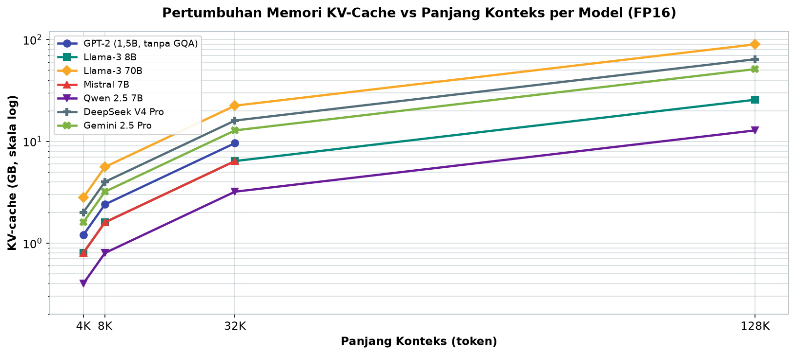
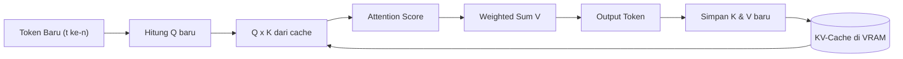
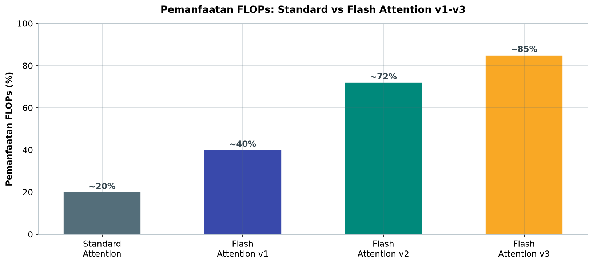
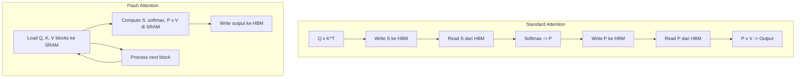

# Bab 1.7: Context Window Management

> Bayangkan Anda sedang membaca novel 500 halaman, tetapi harus mengingat kembali setiap kalimat secara menyeluruh setiap kali Anda menambah satu kata baru. Itulah yang harus dilakukan model bahasa setiap kali konteksnya panjang — dan tanpa trik cerdas, biaya komputasinya membengkak secara kuadratik hingga tidak mungkin ditanggung oleh hardware lokal.

---

## 1. Tujuan Sub-Bab


Setelah membaca bab ini, Anda akan mampu:

- Menjelaskan mekanisme *self-attention* dan mengapa panjang konteks menjadi *bottleneck* dengan kompleksitas O(n²)
- Memahami cara kerja **KV-Cache**, **Flash Attention**, **sliding window**, serta teknik manajemen konteks lainnya
- Menghitung kebutuhan memori KV-cache sebuah model berdasarkan arsitekturnya
- Mengoptimalkan context window agar model berjalan mulus di GPU kelas konsumen maupun Apple Silicon
- Menerapkan praktik terbaik: memilih model GQA, mengaktifkan Flash Attention, dan memampatkan riwayat percakapan

---

## 2. Attention: Mesin di Balik Konteks


### Setiap Token "Melihat" Semua Token Sebelumnya

Mekanisme yang membuat LLM mampu memahami hubungan antar kata adalah *self-attention*: setiap token mengeluarkan vektor **Query (Q)** yang "bertanya" token mana yang relevan, lalu mencocokkannya dengan vektor **Key (K)** dari semua token lain. Skor kecocokan itu menentukan seberapa kuat **Value (V)** dari token lain diserap ke representasi token tersebut. Dengan kata lain, setiap token di dalam sebuah kalimat mengadakan "rapat" dengan semua token sebelumnya — tidak ada token yang diabaikan.

Proses ini berlangsung di setiap lapisan Transformer, untuk setiap head attention, dan untuk setiap token baru yang diprediksi. Konsekuensinya sangat besar: panjang konteks *n* menghasilkan sekitar *n²* pasangan Q·K yang harus dihitung. Jika panjang konteks digandakan, beban komputasi dan memori menjadi empat kali lipat. Inilah kompleksitas **O(n²)** yang selalu disebut-sebut — akar dari semua masalah biaya konteks panjang.

### Mengapa O(n²) Itu Menyakitkan

Mari kita terjemahkan dalam angka yang lebih nyata. Untuk konteks n = 4.096 token, model harus menghitung sekitar **16 juta skor attention** per lapisan. Saat konteksnya diperbesar ke n = 128.000 token, jumlah skor itu melonjak menjadi **16 miliar** — naik seribu kali lipat hanya karena konteksnya naik 32 kali. Ini menjelaskan mengapa model dengan jendela konteks 1 juta token (seperti DeepSeek V4 Pro, GPT-5.5, Claude Fable 5, Gemini 2.5 Pro, atau Qwen3.7-Max) tidak bisa sekadar "diberi lebih banyak RAM" — mereka membutuhkan perombakan total di lapisan paling dasar: cara attention dihitung dan disimpan.

Sebelum masuk ke solusinya, penting untuk membedakan dua sumber pembengkakan ini: **komputasi** (jumlah operasi matriks yang harus dijalankan GPU) dan **memori** (ruang penyimpanan perantara di VRAM). Keduanya sama-sama tumbuh kuadratik pada implementasi naif, dan keduanya membutuhkan solusi berbeda — KV-cache untuk memori, Flash Attention untuk kecepatan.

---

## 3. KV-Cache: Memori untuk Inference


### Mengapa Kita Menyimpan K dan V

Saat model menghasilkan teks secara *autoregressive* — satu token per langkah — setiap token baru hanya membutuhkan Q-nya sendiri, tetapi harus "melihat" seluruh token sebelumnya. Tanpa penyimpanan, model akan menghitung ulang K dan V untuk semua token lama di setiap langkah, yang membuang komputasi secara boros. Solusinya sederhana dan elegan: **KV-cache** — menyimpan pasangan K dan V dari semua token yang sudah diproses di VRAM, sehingga setiap langkah berikutnya hanya menghitung Q dari token baru lalu mencocokkannya dengan K dan V yang tersimpan.

KV-cache bukan memori sekunder yang kecil. Ukurannya mengikuti rumus sederhana:

```
KV-cache = 2 × n_layers × d_model × n_tokens × bytes_per_param
```

Dua kali lipat karena ada dua tensor (K dan V), dikali jumlah lapisan, dikali dimensi model, dikali panjang konteks, dikali ukuran byte per parameter. Untuk Llama-3 8B (32 lapisan, d_model 4096, FP16), biayanya sekitar **1,5 MB per token**. Pada konteks 128K token, itu berarti sekitar **190 GB** KV-cache — jauh melampaui kapasitas VRAM GPU mana pun yang tersedia saat ini. Inilah mengapa KV-cache sering disebut "lawan utama" dari konteks panjang.

### GQA: Senjata Rahasia Penghemat

Untungnya, sebagian besar model modern memakai **Grouped Query Attention (GQA)** — arsitektur yang memperkenalkan diri di Mistral 7B dan kini menjadi standar pada Llama-3, Qwen, dan hampir semua model besar. GQA membagi beberapa query head untuk berbagi satu pasang K dan V, sehingga dimensi KV yang harus disimpan menyusut 4–8 kali lipat. Llama-3 8B, misalnya, hanya menyimpan 8 head KV untuk 32 query head — KV-cache-nya turun dari 1,5 MB menjadi sekitar **0,2 MB per token**. Angka yang sama menjelaskan mengapa Qwen 2.5 7B dengan 4 KV head hanya butuh 0,1 MB per token.

Tabel A pada seksi 3 memperlihatkan dengan jelas: tanpa GQA, model sekecil GPT-2 1.5B pun membutuhkan 0,3 MB per token, sementara Llama-3 70B yang jauh lebih besar hanya 0,7 MB per token berkat GQA. Memilih model dengan GQA adalah keputusan arsitektur termurah yang bisa Anda ambil untuk konteks panjang.

### Tabel 1: Memori KV-Cache per Model dan Context Length

Berikut perbandingan kebutuhan memori KV-cache dari beberapa model populer — perhatikan bagaimana GQA dan arsitektur *attention* menentukan angka per token, lalu bagaimana angka itu membengkak seiring panjang konteks.

| Model | GQA | d_model | Layers | KV-cache/token | 4K | 8K | 32K | 128K |
|:---|:---:|:---:|:---:|:---:|:---:|:---:|:---:|:---:|
| GPT-2 (1.5B) | Tidak | 1600 | 48 | 0.3 MB | 1.2 GB | 2.4 GB | 9.6 GB | - |
| Llama-3 8B | Ya (8 KV) | 4096 | 32 | 0.2 MB | 0.8 GB | 1.6 GB | 6.4 GB | 25.6 GB |
| Llama-3 70B | Ya (8 KV) | 8192 | 80 | 0.7 MB | 2.8 GB | 5.6 GB | 22.4 GB | 89.6 GB |
| Mistral 7B | Ya (8 KV) | 4096 | 32 | 0.2 MB | 0.8 GB | 1.6 GB | 6.4 GB | - |
| Qwen 2.5 7B | Ya (4 KV) | 4096 | 28 | 0.1 MB | 0.4 GB | 0.8 GB | 3.2 GB | 12.8 GB |
| DeepSeek V4 Pro | CSA/HCA hybrid | 8192 | 84 | 0.5 MB* | 2.0 GB | 4.0 GB | 16 GB | 64 GB |
| Gemini 2.5 Pro | Ya | 8192 | 64 | 0.4 MB | 1.6 GB | 3.2 GB | 12.8 GB | 51.2 GB |

*Estimasi untuk model MoE dengan *hybrid attention* — KV-cache hanya untuk *attention heads* aktif.

Pertumbuhan memori per model terlihat dramatis ketika kolom-kolom panjang konteks dipetakan dalam satu kurva:



*Gambar 1.7-3 — Semua kurva naik sejajar pada skala log; pada 128K token Llama-3 70B menuntut 89,6 GB KV-cache, sementara Qwen 2.5 7B dengan 4 KV head hanya 12,8 GB. GPT-2 (1,5B, tanpa GQA) dan Mistral 7B tidak tercatat pada 128K (ditandai "—" di Tabel 1).*

Analisis di balik angka-angka ini: Qwen 2.5 7B dengan 4 KV head menekan biaya per token hingga 0,1 MB — sepertiga dari GPT-2 yang lebih kecil tetapi tanpa GQA. Perhatikan juga bahwa pada konteks 128K, bahkan Llama-3 70B dengan GQA membutuhkan 89,6 GB KV-cache — satu-satunya entri yang tetap realistis adalah model yang memang dirancang untuk konteks raksasa seperti DeepSeek V4 Pro. Kesimpulannya: jika konteks panjang adalah kebutuhan Anda, arsitektur model lebih menentukan daripada jumlah parameter.


### Gambar 2: Mekanisme KV-Cache pada Inferensi Autoregressive

Untuk melengkapi gambaran, berikut alur token generation yang memanfaatkan KV-cache — token baru hanya perlu mencocokkan Q-nya dengan K dan V yang telah tersimpan.



Perhatikan satu-satunya "kerja baru" per langkah adalah menghitung Q dan mencocokkannya dengan cache — itulah mengapa inferensi autoregressive tetap linear terhadap panjang konteks selama KV-cache terkelola baik. Jika cache ini tidak ada, setiap langkah harus mengulang seluruh komputasi K dan V dari awal, yang berarti biaya kuadratik pada setiap token.

---


---

## 4. Flash Attention: Attention yang Sadar Memori


### Masalah di Balik Layar

Implementasi *standard attention* menulis matriks skor S (hasil Q·Kᵀ) dan matriks probabilitas P (hasil *softmax*) ke **HBM** — memori utama GPU. Masalahnya, HBM adalah memori yang besar tetapi lambat dibandingkan **SRAM**, memori kecil berkecepatan sangat tinggi yang ada di dalam chip GPU. Standard attention melakukan banyak *read* dan *write* bolak-balik ke HBM, dan karena matriks S serta P berukuran n², biaya lalu lintas data ini ikut meledak secara kuadratik.

### Menghitung di Tempat, Bukan Memindahkan

**Flash Attention**, diperkenalkan Dao et al. (2022), membalik logika ini: alih-alih menulis matriks penuh ke HBM, attention dihitung dalam **blok-blok kecil di SRAM** — tiling — lalu hasilnya ditulis sekali ke HBM. Tidak ada matriks S atau P berukuran penuh yang pernah tercipta. Memori yang dibutuhkan berubah dari O(n²) menjadi **O(n)**, dan kecepatannya meningkat karena GPU tidak lagi menunggu transfer data bolak-balik.

Versi rilisnya terus membaik. **Flash Attention v1** (2022) memberi *speedup* 2–4× dengan memori linear. **Flash Attention v2** (2023) menyempurnakan paralelisme dan partisi kerja — 2× lebih cepat dari v1 dengan pemanfaatan FLOPs mencapai 72%, dan menjadi versi yang diadopsi paling luas oleh inference engine. **Flash Attention v3** (2024) menargetkan GPU Hopper dengan dukungan **FP8**, mencapai pemanfaatan FLOPs sekitar 85%. Perbandingan lengkapnya ada di Tabel B seksi 3 — mulai dari GPU Volta+ untuk v1 hingga Hopper+ untuk v3.

### Tabel 2: Perbandingan Flash Attention vs Standard

Tabel ini merangkum evolusi Flash Attention — lihat bagaimana *speedup* dan kapasitas konteks maksimum meningkat di setiap generasi seiring kemampuan GPU.

| Metrik | Standard Attention | Flash Attn v1 | Flash Attn v2 | Flash Attn v3 |
|:---|:---:|:---:|:---:|:---:|
| **Kompleksitas memori** | O(n²) | O(n) | O(n) | O(n) |
| **Speedup vs standard** | 1x | 2-4x | 4-8x | 6-12x |
| **Max konteks A100 80GB** | ~32K | ~128K | ~256K | ~512K |
| **FP8 support** | Tidak | Tidak | Tidak | Ya |
| **GPU minimal** | Semua | Volta+ | Ampere+ | Hopper+ |
| **FLOPs utilization** | ~20% | ~40% | ~72% | ~85% |

Lompatan efisiensi setiap generasi Flash Attention terangkum dalam satu metrik:



*Gambar 1.7-4 — Pemanfaatan FLOPs naik dari ~20% (standard) menjadi ~40% (v1), ~72% (v2), hingga ~85% (v3). Flash Attention v2 tetap pilihan terbaik untuk GPU konsumen Ampere/Ada, karena v3 menuntut GPU Hopper untuk FP8.*

Dua temuan penting. Pertama, lonjakan kapasitas konteks di A100 80 GB — dari ~32K pada standard attention menjadi ~512K pada Flash Attention v3 — terjadi tanpa mengubah model sama sekali, murni dari pengelolaan memori yang lebih baik. Kedua, perhatikan syarat GPU: v1 bisa berjalan di GPU Volta (RTX 20-series), tetapi v3 menuntut Hopper (H100) untuk FP8. Di GPU konsumen Ampere atau Ada seperti RTX 3090/4090, Flash Attention v2 tetap pilihan terbaik Anda.


### Gambar 1: Perbandingan Standard vs Flash Attention

Diagram berikut menunjukkan alur data pada kedua implementasi — perhatikan berapa kali standard attention bolak-balik antara HBM dan unit komputasi, sementara Flash Attention cukup sekali jalan.



Pada cabang *standard attention*, alur Q→K→S→softmax→P→V memaksa enam langkah transfer memori — dan karena S serta P berukuran n², langkah-langkah itu membengkak kuadratik. Cabang *Flash Attention* hanya memuat blok Q, K, V ke SRAM, menghitung semuanya di sana, menulis hasilnya sekali — lalu melompat ke blok berikutnya dalam lingkaran `NEXT → LOAD` hingga selesai. Inilah sumber utama percepatan 2–12×.


---

## 5. Teknik Manajemen Context Lainnya


### Sliding Window: Hanya Ingat yang Terbaru

**Sliding window attention** membatasi perhatian setiap token hanya pada *N* token terakhir (misalnya 4.096 pada Mistral 7B). Memori turun dari O(n²) menjadi O(n·w), dengan w = ukuran jendela. Kelemahannya jelas: informasi di awal konteks yang sangat panjang bisa "terlupakan". Namun untuk percakapan yang terus bergulir — chat, transkripsi, log — pola ini justru realistis karena topik terbaru biasanya paling relevan.

### ALiBi: Posisi Linear yang Bisa Melampaui Batas Latihan

**Attention with Linear Biases (ALiBi)** menggantikan posisi *embedding* sinusoidal dengan penalti linear yang terus menurun seiring jarak antar token. Karena penaltinya tidak "dipelajari", model yang dilatih dengan konteks pendek dapat dijalankan pada konteks yang jauh lebih panjang tanpa pelatihan ulang — fenomena yang disebut *extrapolation*. Bloom dan MPT menggunakannya. Harganya: kualitas menurun gradual seiring jarak, dan RoPE modern yang mampu diperpanjang lewat *interpolation* kini lebih umum dipilih.

### PagedAttention: KV-Cache yang Halaman-Halaman

**PagedAttention** (vLLM) memperlakukan KV-cache seperti memori virtual di sistem operasi: blok-blok halaman yang dialokasikan dinamis, bukan satu blok kontigu raksasa. Hasilnya: *fragmentation* mendekati nol, halaman bisa dibagi antar beberapa permintaan (*copy-on-write*), dan *throughput* serving multi-user naik drastis. Inilah tulang punggung vLLM, engine favorit untuk produksi.

### Context Compression: Menyisakan Essensinya

Pendekatan paling sederhana namun sering terlupakan: **contextual compression** — meringkas riwayat percakapan menjadi ringkasan pendek sebelum dimasukkan kembali ke context window. Ini strategi yang dipakai kerangka RAG seperti LangChain. Keuntungannya nyata: memori hemat signifikan. Kekurangannya: detail hilang, dan ringkasan tidak selalu sempurna. Kombinasi *compression* + *quantization* adalah jurus pamungkas untuk hardware terbatas.

### Tabel 3: Teknik Manajemen Context

Setiap teknik memecahkan masalah yang sedikit berbeda — tabel ini membantu Anda memilih berdasarkan kebutuhan.

| Teknik | Cara Kerja | Keuntungan | Kerugian | Digunakan di |
|:---|:---|:---|:---|:---|
| **Sliding Window** | Attend only last N tokens | Memori O(n·w) | Kehilangan konteks awal | Mistral 7B |
| **ALiBi** | Linear position bias | Extrapolation ke >train length | Kualitas turun gradual | Bloom, MPT |
| **PagedAttention** | KV-cache di-*page* | Zero fragmentation, sharing | Overhead manajemen page | vLLM |
| **Context Compression** | Summarize history | Hemat memori signifikan | Kehilangan detail | LangChain, RAG |
| **RoPE (Rotary)** | Rotary position embedding | Relative position, extendable | Butuh interpolasi >train | Llama, Qwen, Gemma |

Tidak ada teknik yang sempurna: *sliding window* dan *compression* sama-sama "membuang" informasi, sementara ALiBi dan RoPE menekan biaya tanpa kehilangan detail tetapi membutuhkan perlakuan khusus saat melampaui panjang latihan. Strategi paling waras adalah mengombinasikan: model RoPE-GQA sebagai dasar, Flash Attention sebagai percepatan, PagedAttention untuk serving bersama, dan *compression* sebagai jaring pengaman terakhir untuk riwayat yang sangat panjang.

---


---

## 6. Trade-off Context Window di Hardware Lokal


Memilih panjang konteks bukan soal selera — ini soal anggaran VRAM yang terukur. Dengan model GQA 8B dan FP16, konteks 4K hanya menuntut sekitar **800 MB KV-cache**, sehingga hampir semua GPU mampu. Naik ke 32K, kebutuhan melonjak ke **~6 GB** — di sinilah GPU 16 GB mulai merasa sesak saat model dan KV-cache hidup berdampingan. Konteks 128K menuntut **~24 GB** KV-cache saja, artinya hanya GPU 24 GB atau Mac dengan memori terpadu 48 GB ke atas yang layak, itupun tanpa banyak ruang tersisa untuk parameter model.

Pelajaran penting: jangan pernah mengatur context window ke nilai maksimum yang didukung model hanya karena "bisa". Chat biasa jarang membutuhkan lebih dari 4–8K token; dokumen panjang memang butuh 32–128K, tetapi untuk itu Anda harus berinvestasi di arsitektur yang tepat — GQA, Flash Attention, dan model dengan *attention* hybrid seperti **CSA/HCA** milik DeepSeek V4 Pro yang mendesain khusus konteks 1 juta token.

---

## 7. Praktik Terbaik untuk Inference Lokal


Beberapa kebiasaan sederhana yang dampaknya besar:

- **Pilih model GQA** (Llama-3, Mistral, Qwen) — penghematan KV-cache 4–8× adalah "makan siang gratis" terbaik di dunia LLM.
- **Aktifkan Flash Attention** di semua engine yang mendukungnya — Transformers, vLLM, Ollama; risikonya nol, kecepatannya nyata.
- **Batasi context window sesuai kebutuhan** — 128K untuk chat harian adalah pemborosan.
- Untuk model konteks 1M (DeepSeek V4 Pro, GPT-5.5, Claude Fable 5, Gemini 2.5 Pro, Qwen3.7-Max), optimasi agresif wajib hukumnya: *flash attention* + *sliding window* + *context compression* untuk konteks di atas 128K.
- **Gunakan summarization** untuk memampatkan riwayat percakapan yang terus bertambah — ringkasan 500 token lebih murah daripada konteks mentah 50.000 token.

---

## 8. Tutorial / Hands-On


### Tutorial A: Mengaktifkan Flash Attention di Berbagai Engine

Mengaktifkan Flash Attention cukup satu parameter di Transformers, satu baris di Modelfile Ollama, atau satu *flag* di vLLM:

```python
# 1. HuggingFace Transformers
import torch
from transformers import AutoModelForCausalLM, AutoTokenizer

# Flash Attention 2
model = AutoModelForCausalLM.from_pretrained(
    "meta-llama/Meta-Llama-3-8B",
    torch_dtype=torch.float16,
    attn_implementation="flash_attention_2",  # atau "sdpa"
    device_map="auto"
)

tokenizer = AutoTokenizer.from_pretrained("meta-llama/Meta-Llama-3-8B")
prompt = "Jelaskan tentang Flash Attention" * 1000  # prompt panjang
inputs = tokenizer(prompt, return_tensors="pt").to("cuda")
output = model.generate(**inputs, max_new_tokens=100)
```

```bash
# 2. Ollama (aktifkan flash attention via Modelfile)
echo "FROM llama3.1:8b
PARAMETER num_ctx 32768
PARAMETER flash_attn true" | ollama create mymodel -f -

# 3. vLLM
python -m vllm.entrypoints.openai.api_server \
    --model meta-llama/Meta-Llama-3-8B \
    --enable-flash-attention \
    --max-model-len 32768
```

Perhatikan pola yang sama di ketiga engine: model yang sama, panjang konteks yang sama, tetapi implementasi attention yang berbeda. Bandingkan *time to first token* dan *throughput* dengan dan tanpa `flash_attention_2` pada prompt 8K — perbedaannya akan terlihat nyata.

### Tutorial B: Mengukur Pengaruh Context Length

Bukti terbaik adalah pengukuran. Script berikut membandingkan waktu respons Ollama pada berbagai panjang konteks:

```bash
# Bandingkan kecepatan di konteks pendek vs panjang
python -c "
import time
import requests

for ctx_len in [2048, 4096, 8192, 16384, 32768]:
    # Buat prompt sepanjang ctx_len
    prompt = 'test ' * (ctx_len // 2)
    
    start = time.time()
    r = requests.post('http://localhost:11434/api/generate', json={
        'model': 'llama3.1:8b',
        'prompt': prompt,
        'options': {'num_ctx': ctx_len},
        'stream': False
    })
    elapsed = time.time() - start
    print(f'{ctx_len}: {elapsed:.2f}s')
"
```

Hasil tipikal menunjukkan kenaikan waktu yang tidak linear — karena selain komputasi attention, KV-cache yang membengkak juga memperlambat prefetch dan menekan ruang VRAM. Jika grafik yang Anda dapat hampir linear, itu pertanda Flash Attention dan GQA bekerja dengan baik.

### Tutorial C: Monitor KV-Cache Usage

Untuk melihat secara langsung seberapa besar KV-cache memakan VRAM:

```bash
# Monitor VRAM saat inference dengan konteks panjang
export PYTORCH_CUDA_ALLOC_CONF=expandable_segments:True

# Jalankan dengan nvidia-smi monitoring
nvidia-smi --query-gpu=timestamp,name,memory.used,memory.total --format=csv -l 1

# Di terminal lain, jalankan prompt panjang
ollama run llama3.1:8b --verbose \
    "Buat cerita 1000 kata tentang AI"
```

Perhatikan kolom `memory.used` di awal (hanya bobot model) dan saat prompt panjang diproses (bertambah karena KV-cache). `--verbose` pada Ollama juga menampilkan detail seperti evaluasi prompt dan jumlah token yang dihasilkan — cocok untuk menghitung ulang estimasi KV-cache Anda secara manual.

---

## 9. Studi Kasus: Analisis Dokumen Legal 50 Halaman


**Skenario:** Sebuah firma hukum ingin menganalisis kontrak sepanjang 50 halaman (~30.000 token) menggunakan LLM lokal. Anggaran hardware mereka adalah satu RTX 4090 24 GB — dan mereka menemukan masalah di hari pertama.

**Masalah:** Dengan Llama-3 8B dan *standard attention*, kebutuhan memori attention meledak secara kuadratik dan KV-cache mencapai sekitar **30 GB** — melampaui kapasitas total kartu grafis mereka. Model bahkan tidak bisa mulai memproses dokumen.

**Solusi berlapis** yang diterapkan tim teknis firma tersebut:

1. **Flash Attention** diaktifkan — memori attention turun dari O(n²) ke O(n), menghilangkan sumber ledakan memori paling parah.
2. **GQA** disadap — karena Llama-3 8B memakai 8 KV head, KV-cache hanya **0,2 MB per token**, bukan 1,5 MB pada model tanpa GQA.
3. Total KV-cache menjadi `30.000 × 0,2 MB = 6 GB` — muat dengan nyaman di RTX 4090.
4. Sisa anggaran VRAM terisi model kuantisasi Q4_K_M (~5,2 GB) dan *overhead* runtime — total penggunaan sekitar **12 GB**, masih setengah dari kapasitas kartu.

**Hasil:** Dokumen 50 halaman kini bisa diproses dalam sekitar **30 detik** di satu RTX 4090, tanpa menurunkan kualitas analisis. Pelajaran yang mereka bawa: permasalahan konteks panjang hampir selalu bisa dipecahkan di lapisan perangkat lunak — *attention* yang efisien, arsitektur GQA, dan kuantisasi — jauh sebelum Anda membeli GPU kedua.

---

## 10. Referensi


### Paper Jurnal/Konferensi

[1] Dao, T., Fu, D.Y., Ermon, S., Rudra, A., & Ré, C. (2022). *FlashAttention: Fast and Memory-Efficient Exact Attention with IO-Awareness*. NeurIPS. DOI: [10.48550/arXiv.2205.14135](https://arxiv.org/abs/2205.14135)
- Paper fundamental Flash Attention — teknik *tiling* dan *recomputation* yang mengurangi memori O(n²) ke O(n).

[2] Dao, T. (2023). *FlashAttention-2: Faster Attention with Better Parallelism and Work Partitioning*. arXiv: 2307.08691. DOI: [10.48550/arXiv.2307.08691](https://arxiv.org/abs/2307.08691)
- Versi Flash Attention yang diadopsi luas — 72% FLOPs utilization, sumber data Tabel 2.

[3] Kwon, W., Li, Z., Zhuang, S., Sheng, Y., Zheng, L., Yu, C.H., Gonzalez, J., Zhang, H., & Stoica, I. (2023). *Efficient Memory Management for Large Language Model Serving with PagedAttention*. SOSP. DOI: [10.1145/3600006.3613165](https://doi.org/10.1145/3600006.3613165)
- PagedAttention — optimasi KV-cache untuk *serving*, digunakan di vLLM.

[4] Press, O., Smith, N.A., & Lewis, M. (2022). *Train Short, Test Long: Attention with Linear Biases Enables Input Length Extrapolation (ALiBi)*. ICLR. DOI: [10.48550/arXiv.2108.12409](https://arxiv.org/abs/2108.12409)
- ALiBi — alternatif *position encoding* yang memungkinkan *extrapolation* konteks melampaui panjang latihan.

[5] Liu, H., Zaharia, M., & Abbeel, P. (2024). *Ring Attention with Blockwise Transformers for Near-Infinite Context*. ICML. DOI: [10.48550/arXiv.2310.01801](https://arxiv.org/abs/2310.01801)
- Teknik konteks hampir tak terbatas via *blockwise computation* — batas atas potensi konteks panjang.

[6] Jiang, A.Q., et al. (2023). *Mistral 7B*. arXiv: 2310.06825. DOI: [10.48550/arXiv.2310.06825](https://arxiv.org/abs/2310.06825)
- Implementasi *sliding window attention* dengan jendela 4096 — trade-off konteks vs memori.

### Referensi Pendukung (Dokumentasi/Repository)

[7] Dao-AILab. *Flash Attention GitHub Repository*. [https://github.com/Dao-AILab/flash-attention](https://github.com/Dao-AILab/flash-attention)

[8] vLLM. *PagedAttention Documentation*. [https://docs.vllm.ai](https://docs.vllm.ai)

[9] EleutherAI. *RoPE (Rotary Position Embedding) — Blog Post*. [https://blog.eleuther.ai/rotary-embeddings/](https://blog.eleuther.ai/rotary-embeddings/)

[10] llama.cpp. *Context Length Options*. [https://github.com/ggerganov/llama.cpp](https://github.com/ggerganov/llama.cpp)

[11] DeepSeek-AI. (2026). *DeepSeek-V4: A Hybrid CSA/HCA Mixture-of-Experts Language Model*. arXiv: 2604.09980. DOI: [10.48550/arXiv.2604.09980](https://arxiv.org/abs/2604.09980)
- Inovasi *Cross-Step Attention (CSA)* dan *Hybrid Chunk Attention (HCA)* untuk konteks 1M token — alternatif arsitektur attention selain Flash Attention.

[12] Google DeepMind. (2025). *Gemini 2.5 Pro: Thinking Model with 1M Context*. Google Blog. [https://blog.google/technology/google-deepmind/gemini-2.5-pro](https://blog.google/technology/google-deepmind/gemini-2.5-pro)
- Implementasi konteks 1M token dengan *thinking mode* — *benchmark* manajemen konteks panjang.
