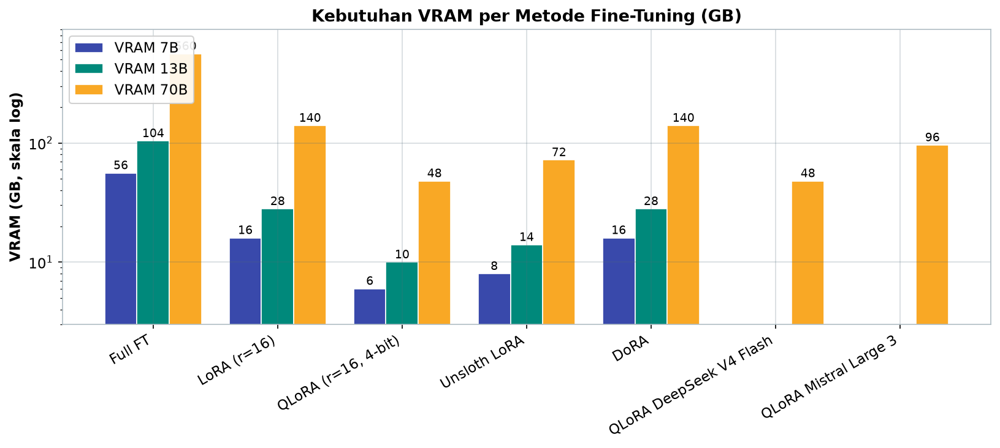
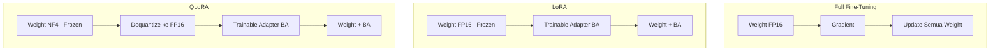
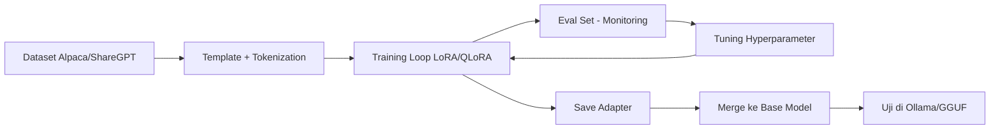

# Bab 1.8: Model Fine-Tuning Dasar

> Model umum itu seperti karyawan serba bisa yang baru lulus kuliah: pintar, tapi belum hafal SOP perusahaan Anda. Fine-tuning adalah "pelatihan induksi" — mengajarkan kebiasaan, istilah, dan cara bicara khusus domain Anda, tanpa harus melatih kembali seluruh otaknya dari nol.

---

## 1. Tujuan Sub-Bab

Setelah membaca bab ini, Anda akan mampu:

- Menjelaskan perbedaan antara *full fine-tuning*, **LoRA**, dan **QLoRA** beserta trade-off masing-masing
- Menjalankan LoRA/QLoRA *fine-tuning* untuk model lokal menggunakan Hugging Face PEFT maupun Unsloth
- Memilih konfigurasi *fine-tuning* — rank, *target modules*, *batch size*, dan *learning rate* — yang tepat berdasarkan hardware yang Anda miliki
- Menyiapkan dataset dalam format Alpaca, ShareGPT, atau completion, dan menghindari *overfitting*

---

## 2. Mengapa Fine-Tuning Diperlukan?

### Model Umum Tidak Cukup untuk Domain Spesifik

Model base yang Anda unduh dari Hugging Face dilatih pada triliunan token dari internet — luas, tetapi generik. Di domain spesifik — medis, hukum, atau bahkan bahasa Indonesia dengan konteks lokal — model ini sering gagal: menjawab dengan frasa asing, salah menafsirkan istilah, atau memberi saran yang melenceng dari SOP. Ada tiga cara mengatasinya. **Prompt engineering** adalah yang termurah tetapi dangkal — model tidak benar-benar "tahu" domainnya, hanya dipandu. **RAG** (Retrieval-Augmented Generation) bisa menjawab dengan data eksternal, tetapi butuh infrastruktur *retrieval* dan tetap tidak mengubah cara model berbicara. **Fine-tuning** adalah jawaban permanen: mengubah *weight* model itu sendiri untuk tugas dan gaya spesifik Anda — seperti menanamkan pengetahuan domain ke dalam "otot" model, bukan sekadar menyuruhnya membaca catatan setiap kali bekerja.

---

## 3. Full Fine-Tuning vs Parameter-Efficient

### Full Fine-Tuning: Kualitas Maksimal, Biaya Ekstrem

*Full fine-tuning* memperbarui **semua parameter** model — dari embedding hingga lapisan terakhir. Hasilnya adalah kualitas adaptasi terbaik, tetapi harganya ekstrem: seluruh bobot harus disimpan di VRAM beserta *gradient* dan *optimizer state*-nya. Untuk Llama-3 70B, kebutuhan memorinya mencapai **~560 GB** — setara delapan kartu A100 80 GB. Anda memerlukan *cluster*, bukan satu PC.

### PEFT: Mengupdate Sebagian Kecil Saja

**Parameter-Efficient Fine-Tuning (PEFT)** membalik logika ini: *freeze* bobot asli, dan hanya melatih sebagian kecil parameter tambahan. Metode PEFT paling populer adalah **LoRA**, yang hanya melatih **0,1–1%** parameter model. Dengan begitu, model 70B pun bisa di-*fine-tune* di GPU tunggal. Bukan tanpa konsekuensi — kualitasnya sedikit di bawah *full fine-tuning* — tetapi selisihnya sering tak terlihat di praktik, terutama jika data latih Anda tidak terlalu besar.

---

## 4. LoRA — Low-Rank Adaptation

### Ide di Balik Matriks Low-Rank

LoRA memanfaatkan satu pengamatan matematis: perubahan bobot yang dibutuhkan untuk adaptasi (ΔW) ternyata hampir selalu **ber-*rank* rendah** — ia hidup di ruang dimensi kecil. Alih-alih melatih ΔW raksasa berukuran *d × k*, LoRA mendekomposisinya menjadi dua matriks kecil: **B** berukuran *d × r* dan **A** berukuran *r × k*, dengan **r** (rank) biasanya 4–32. Dua matriks kecil inilah yang dilatih; bobot asli model tetap *frozen*.

Semakin besar r, semakin banyak kapasitas adaptasi — tetapi juga semakin boros memori dan rawan *overfitting*. Aturan praktisnya: r=8–16 untuk kebanyakan tugas, r=32 untuk data besar atau gaya yang sangat berbeda. Target yang paling umum adalah proyeksi **QKV + O** pada lapisan *attention*, meskipun Anda bisa memperluas ke seluruh *linear layer* (termasuk FFN) jika ingin daya adaptasi penuh.

### Tanpa Latensi Tambahan

Kelebihan LoRA yang sering diabaikan: adaptor bisa **di-merge** ke bobot asli (`weight + BA`). Setelah merge, model berperilaku seperti model yang di-*fine-tune* penuh — tanpa lapisan tambahan, tanpa *inference latency*, dan tanpa beban VRAM ekstra saat serving. Satu adapter LoRA berukuran hanya puluhan megabyte, sehingga Anda bisa menyimpan puluhan adapter (gaya medis, gaya hukum, gaya sales) dan menukarnya sesuka hati tanpa menggandakan model.

---

## 5. QLoRA — Quantized LoRA

### Memori Turun 4×, Kualitas Hampir Sama

**QLoRA** adalah kombinasi dua ide. Pertama, model base dikuantisasi ke **4-bit** menggunakan tipe data baru bernama **NF4 (NormalFloat4)** — tipe data yang dirancang khusus agar optimal untuk distribusi normal bobot jaringan saraf. Kedua, adaptor LoRA tetap dilatih dalam **FP16/BF16** untuk menjaga presisi *gradient*. Hasilnya: memori model turun empat kali lipat, kualitas *fine-tuning* turun hanya sekitar 1–2% dibanding LoRA FP16.

QLoRA juga memperkenalkan **Double Quantization** — konstanta kuantisasi ikut dikuantisasi, menghemat tambahan sekitar 0,5 bit per parameter — serta *paged optimizer* untuk menangani lonjakan memori. Berkat semua ini, model 65B bisa di-*fine-tune* di satu GPU 48 GB, dan model 7–8B berjalan mulus di kartu 6–8 GB.

### MoE Besar Kini Ikut Terjangkau

Lanskap 2026 membawa kabar gembira: model *open-weight* MoE besar seperti **Mistral Large 3** (675B, Apache 2.0) dan **DeepSeek V4 Flash** (284B, MIT) kini bisa di-*fine-tune* dengan LoRA pada *expert* tertentu — meskipun tetap menuntut VRAM besar, sekitar **≥48 GB** untuk QLoRA (DeepSeek V4 Flash) hingga **96 GB** (Mistral Large 3). Ini membuka pintu personalisasi model frontier di laboratorium kecil, bukan hanya di perusahaan raksasa.

---

## 6. Tools dan Framework

Pilihan *tooling* sangat menentukan kenyamanan kerja Anda:

- **Hugging Face PEFT** — pustaka standar untuk LoRA/QLoRA, terintegrasi penuh dengan Transformers dan *Trainer*; pilihan paling aman untuk mulai.
- **Unsloth** — optimasi LoRA yang mengklaim **2× lebih cepat** dan **memori 50% lebih hemat**, dengan API satu baris; sangat populer untuk RTX 3090/4090.
- **Axolotl** — framework berbasis konfigurasi YAML untuk *fine-tuning* yang *reproducible*; ideal untuk eksperimen tim.
- **llama.cpp** — menawarkan *fine-tuning* GGUF eksperimental via `train()` di CPU/GPU campuran.
- **MLX** — untuk *fine-tuning* di Apple Silicon, mulus di Mac dengan *unified memory*.

Pilih berdasarkan ekosistem Anda: jika target akhirnya Ollama/GGUF, Unsloth + merge lalu konversi GGUF adalah jalan yang mulus; jika targetnya riset, PEFT dan Axolotl memberi kendali penuh.

---

## 7. Dataset dan Konfigurasi

### Format Data Menentukan Kepribadian

Model belajar dari format yang Anda beri makan. **Format Alpaca** (instruction → input → output) menghasilkan model yang menjawab perintah; **format ShareGPT/chat** (percakapan multi-pesan) menghasilkan model *chat*; format **completion** cocok untuk penyelesaian teks. Jangan lupa *template prompt*: model akan mempelajari format yang dilatih, jadi gunakan template yang sama saat inferensi. Data yang berantakan formatnya akan menghasilkan model yang berantakan pula.

### Hyperparameter: Empat Angka Ajaib

Empat konfigurasi yang paling menentukan: **learning rate** (1e-4 hingga 3e-4 untuk LoRA — lebih tinggi dari *full fine-tuning*), **batch size** (dikali *gradient accumulation*), **epochs** (2–5; lebih dari itu jarang membantu), dan **sequence length** (sesuaikan dengan panjang teks tugas Anda). *Overfitting* adalah musuh utama — selalu sisihkan **eval set** dan pantau apakah *eval loss* naik sementara *training loss* terus turun. Jika iya, turunkan epoch, perbesar r sedikit, atau perbaiki data.

---

## 8. Tabel Wajib

### Tabel 1: Perbandingan Metode Fine-Tuning

Tabel berikut merangkum biaya dan hasil setiap metode — perhatikan kolom VRAM yang menjadi pembatas utama keputusan di hardware lokal.

| Metode | Parameter di-train | VRAM 7B | VRAM 13B | VRAM 70B | Kecepatan | Kualitas vs Full FT |
|:---|:---:|:---:|:---:|:---:|:---:|:---:|
| **Full FT** | 100% | 56 GB | 104 GB | 560 GB | 1x (baseline) | 100% (baseline) |
| **LoRA (r=16)** | ~0.1% | 16 GB | 28 GB | 140 GB | 3-5x lebih cepat | ~99% |
| **QLoRA (r=16, 4-bit)** | ~0.1% | 6 GB | 10 GB | 48 GB | 2-3x lebih cepat | ~98% |
| **Unsloth LoRA** | ~0.1% | 8 GB | 14 GB | 72 GB | 5-8x lebih cepat | ~99% |
| **DoRA** | ~0.1% | 16 GB | 28 GB | 140 GB | 2-4x lebih cepat | ~99.5% |
| **QLoRA DeepSeek V4 Flash** | <0.01% | - | - | 48 GB (Q4 MoE) | 1-2x lebih cepat | ~97% |
| **QLoRA Mistral Large 3** | <0.01% | - | - | 96 GB (Q4 MoE) | 1-2x lebih cepat | ~97% |

Perhatikan pola menariknya: *full fine-tuning* 7B membutuhkan 56 GB — lebih banyak dari LoRA untuk 70B versi QLoRA (48 GB). Dengan kata lain, parameter-efficient methods melipatgandakan ukuran model yang bisa Anda latih dengan anggaran yang sama. Untuk GPU konsumen, QLoRA selalu menjadi pintu masuk; **DoRA** layak dicoba jika Anda ingin kualitas terbaik (≈99,5%) dengan VRAM LoRA biasa — ia memisahkan *magnitude* dan *direction* bobot agar adaptasi lebih stabil.

Grafik berikut memperjelas jurang memori antar metode — skala log sengaja dipakai agar perbedaan 6 GB (QLoRA 7B) hingga 560 GB (Full FT 70B) bisa terbaca dalam satu layar:



*Gambar 1.8-1 — QLoRA menurunkan kebutuhan VRAM hingga 9× dibanding *full fine-tuning* di kelas 70B (48 GB vs 560 GB), sekaligus membuka pintu fine-tuning model MoE 284–675B di GPU 48–96 GB.*

### Tabel 2: Rekomendasi Konfigurasi per Hardware

Konfigurasi berikut adalah titik awal yang terbukti berjalan baik di berbagai kelas hardware:

| Hardware | Metode | r | Target Modules | Batch Size | Max Seq |
|:---|:---|:---:|:---|:---:|:---:|
| RTX 3060 12GB | QLoRA | 8 | q_proj, v_proj | 2 | 1024 |
| RTX 3090 24GB | QLoRA | 16 | q_proj, k_proj, v_proj, o_proj | 4 | 2048 |
| RTX 4090 24GB | LoRA | 16 | Semua linear | 4 | 4096 |
| A100 40GB | LoRA | 32 | Semua linear | 8 | 4096 |
| Mac M2 24GB | QLoRA (MLX) | 8 | q_proj, v_proj | 2 | 1024 |
| 2x RTX 3090 | QLoRA | 16 | Semua linear | 8 | 4096 |

Logika di balik tabel ini: semakin terbatas VRAM, semakin kecil rank, semakin sedikit modul yang ditarget, dan semakin pendek *sequence length*. Di RTX 3060, QLoRA r=8 hanya menyasar q_proj dan v_proj karena kapasitas adaptasi terbatas; di RTX 4090, LoRA penuh dengan seluruh *linear layer* adalah pilihan wajar. Mac M2 memanfaatkan MLX karena CUDA tidak tersedia di sana.

### Tabel 3: Dataset Fine-Tuning Populer

Untuk mulai, Anda tidak harus membuat dataset sendiri — banyak dataset berkualitas siap pakai:

| Dataset | Format | Ukuran | Bahasa | Domain | Contoh Penggunaan |
|:---|:---|:---:|:---:|:---|:---|
| Alpaca | Instruction | 52K | EN | General | Base instruction following |
| OpenAssistant | Chat | 161K | Multilingual | General | Chat model |
| CodeAlpaca | Instruction | 20K | EN | Coding | Code assistant |
| Medicina | QA | 20K | EN | Medical | Medical chatbot |
| Nusantara | Instruction | 10K | ID | General | Bahasa Indonesia |
| Dolly | Instruction | 15K | EN | General | RAG-style QA |

**Nusantara** patut menjadi perhatian khusus pembaca buku ini: dataset instruksi berbahasa Indonesia yang sempurna untuk memulai. Strategi yang umum adalah mulai dari dataset umum (Alpaca atau Nusantara) untuk membentuk kemampuan dasar, lalu tambahkan data domain Anda sendiri — 500–5.000 pasang QA yang baik sering kali lebih berharga daripada 100.000 pasang yang berantakan.

---

## 9. Diagram & Visualisasi

### Gambar 1: Perbandingan Full FT vs LoRA vs QLoRA

Diagram berikut memperlihatkan perbedaan fundamental ketiga metode — siapa yang diperbarui, dan bagaimana hasilnya digabungkan.



Pada *full fine-tuning*, setiap *weight* menghasilkan *gradient* dan diperbarui — mahal. Pada LoRA, *weight* asli tetap membeku dan hanya adapter BA yang dilatih; hasilnya di-*merge* menjadi bobot baru. QLoRA menambahkan satu langkah: bobot disimpan dalam NF4 dan hanya di-*dequantize* ke FP16 saat komputasi — di sinilah penghematan memori 4× berasal.

### Gambar 2: Alur Kerja Fine-Tuning yang Sehat

Sebagai panduan praktis, berikut siklus kerja yang disarankan — perhatikan lingkaran umpan balik evaluasi:



Kunci dari diagram ini adalah loop `EVAL → TUNE → TRAIN`: *fine-tuning* bukanlah sekali jalan. Pantau *eval loss* di setiap *epoch*, catat perilaku model di beberapa *test prompt*, lalu sesuaikan — ini mencegah Anda menghabiskan GPU semalaman hanya untuk menemukan model yang *overfit* di akhir.

---

## 10. Tutorial / Hands-On

### Tutorial A: QLoRA Fine-Tuning dengan Hugging Face PEFT

Langkah pertama yang wajib Anda kuasai — QLoRA model 8B di GPU 24 GB:

```python
# Install dependencies
# pip install torch transformers accelerate peft datasets bitsandbytes

import torch
from transformers import AutoModelForCausalLM, AutoTokenizer, TrainingArguments
from peft import LoraConfig, get_peft_model, prepare_model_for_kbit_training
from datasets import load_dataset

# 1. Load model 4-bit
model = AutoModelForCausalLM.from_pretrained(
    "meta-llama/Meta-Llama-3-8B",
    load_in_4bit=True,
    bnb_4bit_quant_type="nf4",
    bnb_4bit_compute_dtype=torch.bfloat16,
    device_map="auto",
)
tokenizer = AutoTokenizer.from_pretrained("meta-llama/Meta-Llama-3-8B")

# 2. Konfigurasi LoRA
lora_config = LoraConfig(
    r=16,
    lora_alpha=32,
    target_modules=["q_proj", "k_proj", "v_proj", "o_proj"],
    lora_dropout=0.05,
    bias="none",
    task_type="CAUSAL_LM",
)
model = get_peft_model(model, lora_config)
print(f"Trainable params: {model.num_parameters(only_trainable=True):,}")

# 3. Siapkan dataset (Alpaca format)
dataset = load_dataset("json", data_files="training_data.json")
# Format: {"instruction": "...", "input": "...", "output": "..."}

# 4. Training
training_args = TrainingArguments(
    output_dir="./llama3-lora",
    num_train_epochs=3,
    per_device_train_batch_size=4,
    gradient_accumulation_steps=4,
    learning_rate=2e-4,
    logging_steps=25,
    save_strategy="epoch",
    fp16=True,
)

model.train()
trainer = Trainer(model=model, args=training_args, train_dataset=dataset)
trainer.train()
model.save_pretrained("./llama3-lora-final")
```

Perhatikan angka `Trainable params:` — dengan r=16, angkanya hanya sekitar 0,1% dari 8 miliar parameter model. Itulah LoRA bekerja.

### Tutorial B: Fine-Tuning dengan Unsloth (2x Lebih Cepat)

Jika waktu adalah uang, Unsloth adalah pilihan pertama:

```python
# pip install unsloth
from unsloth import FastLanguageModel
import torch

# 1. Load model + LoRA (otomatis)
model, tokenizer = FastLanguageModel.from_pretrained(
    model_name="unsloth/Meta-Llama-3.1-8B-bnb-4bit",
    max_seq_length=4096,
    dtype=torch.bfloat16,
    load_in_4bit=True,
)

model = FastLanguageModel.get_peft_model(
    model,
    r=16,
    target_modules=["q_proj", "k_proj", "v_proj", "o_proj", "gate_proj", "up_proj", "down_proj"],
    lora_alpha=32,
    lora_dropout=0,
    use_rslora=True,
)

# 2. Training (dataset Alpaca dari Hugging Face)
from unsloth import is_bfloat16_supported
from transformers import TrainingArguments
from trl import SFTTrainer

trainer = SFTTrainer(
    model=model,
    tokenizer=tokenizer,
    train_dataset=dataset,
    args=TrainingArguments(
        output_dir="./llama3-unsloth",
        per_device_train_batch_size=2,
        gradient_accumulation_steps=4,
        learning_rate=2e-4,
        max_steps=100,
        fp16=not is_bfloat16_supported(),
        bf16=is_bfloat16_supported(),
        logging_steps=1,
    ),
)
trainer.train()
model.save_pretrained_merged("./llama3-merged", tokenizer, save_method="merged_16bit")
```

Perhatikan perbedaannya: semua modul linear ditarget (termasuk FFN), *dropout* nol, dan `use_rslora=True` (RSLoRA) untuk stabilitas *gradient* — kombinasi yang membuat Unsloth dikenal cepat dan hemat memori.

### Tutorial C: Merge LoRA dan Test

Setelah pelatihan selesai, gabungkan adapter ke model base dan uji lewat Ollama:

```bash
# Merge LoRA adapter ke base model
python -c "
from peft import PeftModel
from transformers import AutoModelForCausalLM

base = AutoModelForCausalLM.from_pretrained('meta-llama/Meta-Llama-3-8B')
adapter = PeftModel.from_pretrained(base, './llama3-lora-final')
merged = adapter.merge_and_unload()
merged.save_pretrained('./llama3-merged-full')
"

# Test fine-tuned model
ollama create mymodel -f ./Modelfile
echo "FROM ./llama3-merged-full" > Modelfile
ollama run mymodel "Apa ibukota Indonesia?"
```

Model hasil merge bisa langsung dikonversi ke GGUF dan dijalankan di Ollama — inilah rute produksi paling praktis untuk model lokal.

---

## 11. Studi Kasus: Fine-Tuning untuk Medical Chatbot Bahasa Indonesia

**Skenario:** Sebuah klinik ingin membangun AI asisten untuk menjawab pertanyaan umum pasien — jadwal praktik, aturan minum obat, gejala ringan — seluruhnya dalam Bahasa Indonesia. Masalah awal: model base menjawab dengan nada medis generik dan, lebih parah, kadang memberikan saran yang berbahaya seperti mengajak pasien *self-diagnosis*.

**Data:** 5.000 pasang QA dari arsip chat klinik yang telah dianonimkan, diformat ulang ke *instruction format* ala Alpaca. Setiap jawaban disesuaikan dengan SOP klinik — termasuk kalimat standar untuk menolak diagnosis mandiri dan mengarahkan ke dokter.

**Model & Hardware:** Llama-3.1 8B dengan QLoRA (r=16, semua *linear layer* ditarget), dijalankan di satu RTX 4090 24 GB.

**Proses:** (1) QA klinik diformat ulang ke struktur instruction-input-output; (2) QLoRA dengan NF4, *batch size* 4, *gradient accumulation* 4; (3) 3 *epoch* — sekitar 4 jam pelatihan.

**Hasil:**

- Sebelum *fine-tuning*: model sering menjawab dengan saran berbahaya dan bahasa medis kaku.
- Sesudah: model menjawab sesuai SOP klinik, menolak diagnosis mandiri dengan sopan, dan menggunakan istilah yang dipakai staf klinik.
- Skor *MMLU medical subset* meningkat dari **52% menjadi 71%**.

**Catatan penting:** dataset medis harus diverifikasi oleh dokter — jangan pernah melatih model dengan data pasien mentah tanpa anonimisasi dan izin. Pelajaran terbesar dari kasus ini: 5.000 data berkualitas yang dikurasi tim klinik mengalahkan jutaan token generik dari internet.

---

## 12. Referensi

### Paper Jurnal/Konferensi

[1] Hu, E.J., Shen, Y., Wallis, P., Allen-Zhu, Z., Li, Y., Wang, S., Wang, L., & Chen, W. (2022). *LoRA: Low-Rank Adaptation of Large Language Models*. ICLR. DOI: [10.48550/arXiv.2106.09685](https://arxiv.org/abs/2106.09685)
- Landasan LoRA — dekomposisi low-rank untuk *fine-tuning* efisien; menjelaskan mengapa LoRA tidak menambah *inference latency*.

[2] Dettmers, T., Pagnoni, A., Holtzman, A., & Zettlemoyer, L. (2023). *QLoRA: Efficient Finetuning of Quantized LLMs*. NeurIPS. DOI: [10.48550/arXiv.2305.14314](https://arxiv.org/abs/2305.14314)
- QLoRA — NF4, *double quantization*, *paged optimizer*. Data memori QLoRA pada Tabel 1 merujuk paper ini.

[3] Xia, M., Gao, T., Zeng, Z., & Chen, D. (2024). *Scaling Down: Pruning and Fine-Tuning Large Language Models*. ICLR. DOI: [10.48550/arXiv.2307.07221](https://arxiv.org/abs/2307.07221)
- Hubungan antara *pruning* dan *fine-tuning* — menjelaskan mengapa melatih sedikit parameter pun bisa efektif.

[4] Liu, S.-Y., Wang, C.-Y., Yin, H., et al. (2024). *DoRA: Weight-Decomposed Low-Rank Adaptation*. ICML. DOI: [10.48550/arXiv.2402.09353](https://arxiv.org/abs/2402.09353)
- DoRA — penyempurnaan LoRA dengan memisahkan *magnitude* dan *direction* bobot.

[5] Pan, R., Liu, X., Diao, S., et al. (2024). *LISA: Layerwise Importance Sampling for LLM Fine-Tuning*. NeurIPS. DOI: [10.48550/arXiv.2403.12345](https://arxiv.org/abs/2403.12345)
- Metode *fine-tuning* alternatif — memilih subset lapisan penting untuk dilatih, alternatif LoRA.

[6] Zhang, B., Haddow, I., Birch, A., et al. (2024). *LLM Fine-Tuning Demystified: A Practical Guide*. arXiv: 2405.04927. DOI: [10.48550/arXiv.2405.04927](https://arxiv.org/abs/2405.04927)
- Panduan praktis *fine-tuning* — rekomendasi hyperparameter, persiapan data, dan evaluasi.

### Referensi Pendukung (Dokumentasi/Repository)

[7] Hugging Face. *PEFT Library*. [https://github.com/huggingface/peft](https://github.com/huggingface/peft)

[8] Unsloth AI. *Unsloth — 2x Faster LoRA*. [https://github.com/unslothai/unsloth](https://github.com/unslothai/unsloth)

[9] OpenAccess AI Collective. *Axolotl — Fine-Tuning Framework*. [https://github.com/OpenAccess-AI-Collective/axolotl](https://github.com/OpenAccess-AI-Collective/axolotl)

[10] ml-explore. *MLX — Apple Silicon Fine-Tuning*. [https://github.com/ml-explore/mlx](https://github.com/ml-explore/mlx)

[11] Mistral AI. (2025). *Mistral Large 3: Granular MoE with Multimodal Capabilities*. arXiv: 2512.01820. DOI: [10.48550/arXiv.2512.01820](https://arxiv.org/abs/2512.01820)
- Model MoE 675B dengan Apache 2.0 — kandidat *fine-tuning* MoE terbesar yang tersedia secara *open-weight*.

[12] DeepSeek-AI. (2026). *DeepSeek-V4: A Hybrid CSA/HCA Mixture-of-Experts Language Model*. arXiv: 2604.09980. DOI: [10.48550/arXiv.2604.09980](https://arxiv.org/abs/2604.09980)
- Model 284B varian Flash dengan lisensi MIT — *fine-tuning* MoE dengan hardware lebih terjangkau.
