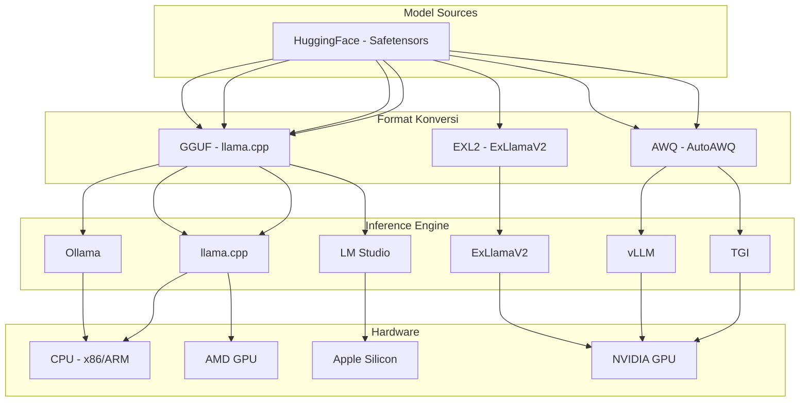
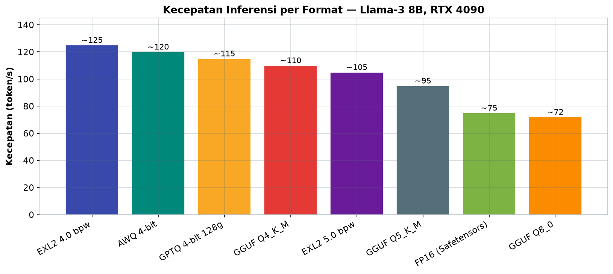
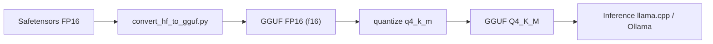

# Bab 1.9: Format File & Ekosistem

> Sebuah LLM sejatinya adalah kumpulan tensor — miliaran angka — yang harus hidup di suatu wadah. Wadah itulah yang menentukan seberapa cepat model dimuat, seberapa keras ia bisa ditekan, dan engine mana yang mau menerimanya. Salah memilih wadah, model 70B terbaik pun hanya akan jadi "kotak yang tidak bisa dibuka".

---

## 1. Tujuan Sub-Bab


Setelah membaca bab ini, Anda akan mampu:

- Menjelaskan perbedaan **Safetensors**, **GGUF**, **EXL2**, **GPTQ**, dan **AWQ** beserta kelebihan serta keterbatasannya
- Memilih format file yang tepat berdasarkan hardware (CPU, NVIDIA, AMD, Apple Silicon) dan *inference engine* yang Anda pakai
- Melakukan konversi antar format secara mandiri — dari Safetensors ke GGUF maupun EXL2
- Membaca hasil *benchmark* perbandingan format dan menerjemahkannya menjadi keputusan praktis

---

## 2. Mengapa Format File Penting?


### Format Menentukan Segalanya — Mulai dari Loading

Model LLM bukan satu file raksasa yang monolitik: ia adalah kumpulan *tensor* (bobot) yang harus disimpan dengan cara tertentu di disk, lalu dimuat ke memori saat inferensi. Format file menentukan tiga hal sekaligus: **kecepatan loading** (apakah bisa langsung di-*map* ke memori atau harus dibaca dan diparsing dulu), **kemudahan kuantisasi** (apakah bit-width bisa diatur per lapisan atau hanya level tetap), dan **kompatibilitas engine** (llama.cpp, ExLlamaV2, vLLM, dan Transformers masing-masing punya format favoritnya). Kesalahan paling umum pemula: mengunduh format yang tidak didukung engine-nya, lalu bertanya-tanya mengapa model "tidak mau jalan".

Ada satu lagi dimensi yang sering disalahpahami: format menentukan **batas kualitas yang bisa Anda capai**. Format dengan kuantisasi seragam (GGUF level tetap, GPTQ) menerapkan kompresi yang sama ke semua lapisan, padahal beberapa lapisan lebih sensitif daripada yang lain. Format dengan kontrol per lapisan (EXL2, AWQ) dapat mengalokasikan bit secara cerdas — dengan *budget* memori yang sama, kualitas yang dihasilkan lebih baik. Memahami dimensi ini mengubah cara Anda membaca tautan "quantized models" di Hugging Face: bukan hanya soal ukuran file, tetapi soal seberapa cerdas file itu mengorbankan presisi.

Terakhir, format adalah **janji jangka panjang**. Model yang Anda simpan dalam GGUF Q4_K_M hari ini bisa dijalankan di Ollama, llama.cpp, atau LM Studio — dan semuanya masih didukung tahun depan. Model dalam format *niche* yang hanya didukung satu engine beta berisiko menjadi "kertas tua" saat engine itu berhenti dikembangkan. Untuk penggunaan pribadi, format dengan ekosistem terbesar adalah investasi paling aman.

### Tabel 1: Perbandingan Format File

Tabel berikut merangkum karakteristik lima format utama dari sudut pandang pengguna lokal:

| Fitur | Safetensors | GGUF | EXL2 | GPTQ | AWQ |
|:---|:---:|:---:|:---:|:---:|:---:|
| **Single file** | Tidak (sharded) | Ya | Tidak (dir) | Ya | Tidak (dir) |
| **Quantization built-in** | Tidak | Ya (Q2-Q8) | Ya (2-8 bpw) | Ya (4-bit) | Ya (4-bit) |
| **CPU inference** | Tidak | Ya | Tidak | Tidak | Tidak |
| **GPU NVIDIA** | Ya | Ya (offload) | Ya (native) | Ya | Ya |
| **Apple Silicon** | Tidak | Ya (Metal) | Tidak | Tidak | Tidak |
| **AMD GPU** | Ya (ROCm) | Ya (Vulkan) | Tidak | Terbatas | Tidak |
| **Memory mapping** | Ya (zero-copy) | Ya (mmap) | Tidak | Tidak | Tidak |
| **Loading speed** | Cepat | Instan | Sedang | Lambat | Cepat |
| **Bit-width kontrol** | FP16/32 | Level tetap | Per-layer | Grup size | Per-layer |

Dua kolom yang paling sering salah dibaca: *single file* dan *memory mapping*. GGUF satu-satunya format dengan keduanya — inilah alasan mengapa model di Ollama bisa berganti dalam hitungan detik. Sementara itu, jika Anda butuh kendali granular per lapisan, hanya EXL2 dan AWQ yang menawarkannya; GGUF dan GPTQ bermain di level tetap yang lebih kaku.


### Gambar 1: Ekosistem Format File

Berikut peta hubungan format → engine → hardware — ikuti jalur yang sesuai kebutuhan Anda:



Hugging Face (Safetensors) adalah sumber tunggal; dari sana jalur bercabang sesuai tujuan. Jalur GGUF melayani hampir semua hardware — CPU, AMD, dan Apple Silicon — sedangkan jalur EXL2 dan AWQ mengerucut ke GPU NVIDIA. Untuk pengguna Mac yang ingin UI lengkap, ikuti jalur `HF → GGUF → LMS → APP`; untuk *serving* produksi, `HF → AWQ → VLLM → NV`.


---

## 3. Safetensors — Standar Hugging Face


### Aman dari Pickle

**Safetensors** adalah format default ekosistem Hugging Face. Kelahirannya menjawab satu masalah keamanan: format lama (`.bin` berbasis *pickle* Python) dapat mengeksekusi kode berbahaya saat model dimuat — sebuah celah yang rawan di-*exploit*. Safetensors menyimpan *tensor* dalam format biner yang *zero-copy* dan aman: tidak ada kode yang dieksekusi, hanya data yang dibaca.

Karena ia murni penyimpanan *tensor*, Safetensors tidak memiliki kompresi atau kuantisasi bawaan — bobot tersimpan dalam presisi penuh **FP16/BF16** (atau FP32). File-nya pun biasanya *sharded*: model besar terpecah menjadi `model-00001-of-00002.safetensors` dan seterusnya, agar proses unduh dan memuat bisa paralel. Safetensors adalah titik awal hampir semua perjalanan — dari sinilah model dikonversi ke format lain, dan ia juga menjadi wadah tempat GPTQ/AWQ menaruh bobot terkuantisasi beserta file konfigurasi tambahan.

---

## 4. GGUF — Ekosistem llama.cpp


### Satu File untuk Segalanya

**GGUF**, dikembangkan oleh Georgi Gerganov bersama ekosistem **llama.cpp**, adalah format yang paling dikenal pengguna lokal. Keunggulan utamanya: **satu file** berisi segalanya — bobot, metadata, dan *tokenizer* — sehingga manajemen model menjadi semudah memindahkan satu file. Dari satu file GGUF FP16, Anda bisa menurunkan berbagai level kuantisasi **Q2_K hingga Q8_0** (Q4_K_M menjadi pilihan paling seimbang), masing-masing dengan nama yang mengkodekan skema kuantisasi bloknya.

Dua fitur teknis yang membuatnya istimewa. Pertama, **memory mapping (mmap)**: model dipetakan langsung dari disk ke memori, sehingga loading terasa *instan* — dan berganti model pun tidak perlu membaca ulang seluruh file. Kedua, portabilitasnya: GGUF berjalan di CPU murni, GPU NVIDIA (CUDA), AMD (Vulkan), hingga Apple Silicon (Metal). Karena itu GGUF menjadi fondasi **Ollama, LM Studio, GPT4All, dan text-generation-webui** — ekosistem terbesar untuk inferensi lokal.

Ada dua trade-off yang perlu Anda sadari. Pertama, kontrol kuantisasinya terbatas pada *level* yang sudah ditentukan (Q2_K hingga Q8_0) — Anda tidak bisa menetapkan bit-width 4,7 per lapisan seperti EXL2. Kedua, meskipun tercepat dalam hal *loading*, GGUF bukan yang tercepat dalam hal *throughput* token di GPU NVIDIA murni: di sana EXL2 dan AWQ masih lebih unggul. Singkatnya: GGUF memenangkan fleksibilitas platform dan kenyamanan pengelolaan; ia kalah tipis dalam kecepatan murni di GPU NVIDIA kelas atas.

### Tabel 3: Benchmark Perbandingan (Llama-3 8B, RTX 4090)

Angka riil pada hardware nyata — Llama-3 8B di RTX 4090:

| Format | Ukuran File | VRAM | TPS | Perplexity (WikiText) | Load Time |
|:---|:---:|:---:|:---:|:---:|:---:|
| FP16 (Safetensors) | 16.0 GB | 16.5 GB | ~75 | 6.20 (baseline) | ~3s |
| GGUF Q4_K_M | 4.9 GB | 5.8 GB | ~110 | 6.38 | <1s (mmap) |
| GGUF Q5_K_M | 5.6 GB | 6.5 GB | ~95 | 6.28 | <1s (mmap) |
| GGUF Q8_0 | 8.5 GB | 9.2 GB | ~72 | 6.22 | <1s (mmap) |
| EXL2 4.0 bpw | 4.5 GB | 5.5 GB | ~125 | 6.35 | ~2s |
| EXL2 5.0 bpw | 5.5 GB | 6.2 GB | ~105 | 6.25 | ~2s |
| AWQ 4-bit | 4.5 GB | 5.5 GB | ~120 | 6.37 | ~3s |
| GPTQ 4-bit 128g | 4.5 GB | 5.5 GB | ~115 | 6.40 | ~5s |

Dua temuan mengejutkan dari tabel ini. Pertama, **EXL2 4.0 bpw adalah yang tercepat (~125 TPS)** sambil mempertahankan *perplexity* hampir sebaik Q5_K_M — kombinasi kecepatan-kualitas yang hanya mungkin berkat bit-width per lapisan. Kedua, FP16 Safetensors justru paling lambat per gigabyte (16 GB harus ditransfer) dan GPTQ paling lambat dimuat (~5s). Jika ukuran file paling kecil yang Anda kejar, EXL2 dan AWQ (4,5 GB) menang tipis atas GGUF Q4_K_M (4,9 GB); jika kecepatan *switching* model yang Anda incar, GGUF tak terkalahkan.

Grafik berikut membacakan kolom TPS secara visual — urutannya menurun dari format tercepat ke terlambat:



*Gambar 1.9-1 — EXL2 4.0 bpw memimpin dengan ~125 token/s, disusul AWQ dan GPTQ; FP16 dan GGUF Q8_0 justru paling lambat karena bobot presisi tinggi harus ditransfer lebih banyak.*

---


### Gambar 2: Alur Konversi Safetensors ke GGUF

Proses konversi yang akan Anda praktikkan di seksi berikutnya, digambarkan ringkas:



Setiap langkah menghasilkan file baru; file FP16 bisa disimpan sebagai "master" untuk menurunkan berbagai level kuantisasi kapan pun Anda mau — itu sebabnya proses konversi selalu dimulai dari model presisi penuh, bukan dari model yang sudah terkuantisasi.

---


---

## 5. EXL2 — Ekosistem ExLlamaV2


### Format Khusus Kecepatan GPU NVIDIA

**EXL2** adalah format native dari **ExLlamaV2**, engine yang dibangun dengan satu tujuan: kecepatan maksimal di GPU NVIDIA. Pembeda utamanya adalah **bit-width fleksibel per lapisan**: Anda bisa mengatur 2,0 hingga 8,0 bit per bobot, dan bahkan menentukan bit-width berbeda untuk lapisan yang berbeda (lapisan "sensitif" diberi bit lebih banyak). Ini berbeda dari GGUF yang level kuantisasinya tetap — dan pada *bit-rate* yang sama, kualitas EXL2 umumnya lebih baik karena sensitivitas tiap lapisan diperhitungkan.

Harganya jelas: EXL2 **hanya berjalan di GPU NVIDIA** — tidak ada *fallback* CPU, tidak ada dukungan AMD maupun Apple Silicon. Ekosistemnya meliputi **ExUI**, **TabbyAPI**, dan text-generation-webui. Jika Anda memiliki RTX 3090/4090 dan mengejar kecepatan token per detik tertinggi, EXL2 adalah kandidat utama.

### Tabel 2: Ekosistem Engine per Format

Kompatibilitas engine adalah ujian kelayakan utama — periksa sebelum mengunduh model:

| Engine | GGUF | EXL2 | AWQ | GPTQ | Safetensors |
|:---|:---:|:---:|:---:|:---:|:---:|
| **Ollama** | Native | - | - | - | - |
| **llama.cpp** | Native | - | - | - | - |
| **LM Studio** | Native | - | - | - | - |
| **GPT4All** | Native | - | - | - | - |
| **ExLlamaV2** | - | Native | - | - | - |
| **vLLM** | - | - | Native | Native | Native |
| **TGI** | - | - | Native | Native | Native |
| **AutoGPTQ** | - | - | - | Native | - |
| **Transformers** | - | - | - | Native | Native |

Pola yang terlihat: ekosistem "lokal & personal" (Ollama, LM Studio, GPT4All) berpihak penuh ke GGUF, sementara ekosistem "produksi & serving" (vLLM, TGI) berpihak ke AWQ/GPTQ/Safetensors. ExLlamaV2 berdiri sendiri dengan EXL2. Jangan mencoba memaksa GPTQ berjalan di Ollama — itu jalan buntu; konversikan saja ke GGUF.


---

## 6. GPTQ / AWQ — Format GPU Lainnya


### Generasi Pertama dan Penyempurnanya

**GPTQ** adalah generasi pertama kuantisasi 4-bit yang dioptimalkan untuk GPU, menggunakan *group size* 128 atau 32 dengan koreksi error berbasis Hessian. **AWQ (Activation-aware Weight Quantization)** datang kemudian dengan gagasan lebih tajam: alih-alih memperlakukan semua bobot setara, ia memperhatikan bobot mana yang paling berpengaruh terhadap *activation* — bobot kritis itu dipertahankan presisinya. Hasilnya, AWQ umumnya berkualitas lebih baik daripada GPTQ pada ukuran yang sama, dan ia menjadi standar kuantisasi di **vLLM** dan **TGI** untuk *serving* produksi.

Keduanya disimpan dalam bentuk **Safetensors + file konfigurasi tambahan** (bukan format file terpisah), dan keduanya didukung oleh vLLM, TGI, dan AutoGPTQ — tetapi **bukan oleh Ollama**. Jika kebutuhan Anda adalah *serving* multi-user dengan vLLM, AWQ adalah pilihan paling masuk akal.

---

## 7. Panduan Pemilihan Format


Keputusan format sebenarnya sederhana jika Anda tanya dulu: di mana model akan berjalan?

- **Pilih GGUF jika:** Anda pengguna Mac, ingin *inference* CPU atau campuran CPU-GPU, atau menginginkan kemudahan Ollama.
- **Pilih EXL2 jika:** Anda punya RTX 3090/4090 dan mengejar kecepatan maksimal dengan bit-width fleksibel.
- **Pilih AWQ jika:** Anda men-deploy vLLM untuk *serving* produksi multi-user.
- **Pilih Safetensors jika:** Anda akan *fine-tuning*, menginginkan presisi penuh, atau hidup di ekosistem Hugging Face.

Kabar baik untuk 2026: model MoE raksasa — **DeepSeek V4 Flash (284B)** dan **Mistral Large 3 (675B)** — kini tersedia dalam format **GGUF dan AWQ** di Hugging Face, didukung kuantisasi komunitas yang memungkinkan model *frontier* berjalan dengan kebutuhan VRAM sekitar 150–280 GB. Era "format tersedia terlambat untuk model besar" sudah berakhir.

Satu catatan penutup: jangan biarkan tabel spesifikasi menggantikan pengalaman langsung. Setiap hardware memiliki karakter unik — *memory bandwidth*, *unified memory*, atau kecepatan NVMe — yang mengubah keseimbangan antar format. Cara paling efektif memilih adalah menguji dua kandidat teratas (misalnya GGUF Q4_K_M vs EXL2 4.0 bpw) pada mesin Anda sendiri dengan prompt nyata dari pekerjaan sehari-hari. Ukur tiga hal: waktu hingga token pertama, kecepatan generasi, dan kualitas jawaban. Tabel *benchmark* memberi arah; pengukuran sendiri memberi kepastian.

---

## 8. Tutorial / Hands-On


### Tutorial A: Konversi Safetensors ke GGUF

Langkah-langkah konversi dari Safetensors menjadi GGUF terkuantisasi:

```bash
# 1. Clone llama.cpp
git clone https://github.com/ggerganov/llama.cpp
cd llama.cpp
make -j4

# 2. Download model dari HuggingFace
pip install huggingface-hub
huggingface-cli download meta-llama/Meta-Llama-3-8B \
    --local-dir ./models/Meta-Llama-3-8B

# 3. Konversi ke FP16 GGUF
python convert_hf_to_gguf.py ./models/Meta-Llama-3-8B \
    --outfile ./models/llama3-8b-f16.gguf \
    --outtype f16

# 4. Quantize ke Q4_K_M
./quantize ./models/llama3-8b-f16.gguf \
    ./models/llama3-8b-q4_k_m.gguf \
    q4_k_m

# 5. Test inference
./main -m ./models/llama3-8b-q4_k_m.gguf \
    -p "Saya adalah AI yang" -n 50 --temp 0.7
```

Perhatikan urutannya: konversi ke FP16 dulu, kuantisasi menyusul. Dengan pola ini, Anda bisa membuat banyak varian kuantisasi (Q5_K_M, Q8_0, dst.) dari satu file FP16 tanpa mengunduh ulang model dari awal.

### Tutorial B: Konversi ke EXL2

Untuk pengguna GPU NVIDIA yang ingin kecepatan maksimal:

```bash
# 1. Install ExLlamaV2
pip install exllamav2

# 2. Convert ke EXL2 4.0 bpw
python -m exllamav2.convert \
    -i ./models/Meta-Llama-3-8B \
    -o ./models/llama3-exl2-4.0bpw \
    -b 4.0

# 3. Convert dengan bit-width berbeda per layer (advanced)
python -m exllamav2.convert \
    -i ./models/Meta-Llama-3-8B \
    -o ./models/llama3-exl2-custom \
    -b 5.0 \
    --measure  # ukur sensitivitas tiap layer dulu
```

*Flag* `--measure` membuat ExLlamaV2 mengukur sensitivitas tiap lapisan dan mengalokasikan bit secara adaptif — lapisan yang sensitif diberi bit lebih banyak, yang "toleran" ditekan. Inilah alasan mengapa EXL2 mampu mempertahankan kualitas pada ukuran file yang kecil.

### Tutorial C: Membandingkan Kualitas Format

Jangan percaya begitu saja pada klaim — ukur sendiri *perplexity* di machine Anda:

```python
# Test perplexity berbagai format
import subprocess

models = {
    "GGUF Q4_K_M": "./models/llama3-8b-q4_k_m.gguf",
    "GGUF Q5_K_M": "./models/llama3-8b-q5_k_m.gguf",
    "GGUF Q8_0": "./models/llama3-8b-q8_0.gguf",
}

for name, path in models.items():
    result = subprocess.run(
        ["./perplexity", "-m", path, "-f", "./wiki.test.raw"],
        capture_output=True, text=True
    )
    # Parse output untuk dapet perplexity score
    print(f"{name}: {result.stdout.split('perplexity: ')[-1].split()[0]}")
```

*Perplexity* yang lebih rendah berarti model lebih "yakin" dalam memprediksi teks — ukuran paling objektif degradasi kuantisasi. Gabungkan hasil ini dengan pengukuran TPS (token per detik) untuk mendapatkan gambaran lengkap trade-off kualitas vs kecepatan di hardware Anda.

---

## 9. Studi Kasus: Memilih Format untuk Mac Mini M4 24GB


**Skenario:** Seorang pengembang ingin menjalankan Llama-3.1 8B dan Mixtral 8x7B di **Mac Mini M4 24GB** sebagai *coding assistant* dan basis RAG. Kebutuhannya: respons cepat, kemampuan berganti model dengan mulus, dan tanpa kerumitan teknis.

**Pilihan yang dievaluasi:**

- **Safetensors:** tidak bisa langsung dipakai — butuh konversi dan tidak terintegrasi dengan engine lokal Mac.
- **GGUF:** native di Ollama dan LM Studio, *mmap* membuat *loading* instan, dioptimalkan untuk Apple Silicon via Metal.
- **EXL2:** tidak mendukung Apple Silicon.
- **AWQ/GPTQ:** juga tidak mendukung Apple Silicon.

**Rekomendasi:** GGUF Q4_K_M untuk Llama-3 8B, dan GGUF Q3_K_M untuk Mixtral 8x7B.

**Alasan:**

- *Single file* → mudah dikelola dan dipindahkan.
- *mmap* → berpindah model cepat tanpa *loading* ulang penuh — penting saat bergantian antara *coding assistant* dan RAG.
- Ollama + Open WebUI → antarmuka lengkap tanpa *setup* rumit.
- Q4_K_M adalah *sweet spot* kualitas/kecepatan di Apple Silicon; Q3_K_M dipilih untuk Mixtral karena model 47B tersebut membutuhkan kompresi lebih agresif agar muat di memori terpadu 24 GB.

**Hasil:** Kedua model berjalan dengan baik — chat responsif, RAG bekerja, dan pengembang tidak pernah menyentuh baris konversi setelah setup awal. Pelajaran: di ekosistem Apple, keputusan format bukanlah "yang terbaik", melainkan "yang didukung" — dan GGUF adalah satu-satunya format yang menjawab semua kebutuhan.

---

## 10. Referensi


### Paper Jurnal/Konferensi

[1] Frantar, E., Ashkboos, S., Hoefler, T., & Alistarh, D. (2023). *GPTQ: Accurate Post-Training Quantization for Generative Pre-trained Transformers*. ICLR. DOI: [10.48550/arXiv.2210.17323](https://arxiv.org/abs/2210.17323)
- Landasan kuantisasi GPTQ — algoritma *layer-wise quantization* yang diadaptasi EXL2 dan AWQ.

[2] Lin, J., Tang, J., Tang, H., et al. (2024). *AWQ: Activation-aware Weight Quantization for LLM Compression and Acceleration*. MLSys. DOI: [10.48550/arXiv.2306.00978](https://arxiv.org/abs/2306.00978)
- AWQ — kuantisasi *activation-aware* yang menjadi standar vLLM; sumber data Tabel 3 dan perbandingan kualitas.

[3] Dettmers, T., Pagnoni, A., Holtzman, A., & Zettlemoyer, L. (2023). *QLoRA: Efficient Finetuning of Quantized LLMs (NF4 Data Type)*. NeurIPS. DOI: [10.48550/arXiv.2305.14314](https://arxiv.org/abs/2305.14314)
- Tipe data NF4 yang memengaruhi desain level kuantisasi di GGUF.

[4] Xiao, G., Lin, J., Seznec, M., et al. (2023). *SmoothQuant: Accurate and Efficient Post-Training Quantization for Large Language Models*. ICML. DOI: [10.48550/arXiv.2211.10438](https://arxiv.org/abs/2211.10438)
- Teknik *smooth quantization* yang memengaruhi AWQ dan desain kuantisasi modern.

[5] Dettmers, T., Svirschevski, R., Egiazarian, V., et al. (2024). *SpQR: A Sparse-Quantized Representation for Near-Lossless LLM Weight Compression*. ICLR. DOI: [10.48550/arXiv.2306.03078](https://arxiv.org/abs/2306.03078)
- Identifikasi *outlier weights* — menjelaskan mengapa bit-width per lapisan (EXL2) lebih baik daripada kuantisasi seragam.

### Referensi Pendukung (Dokumentasi/Repository)

[6] llama.cpp. *GGUF Format Specification*. [https://github.com/ggerganov/llama.cpp](https://github.com/ggerganov/llama.cpp)

[7] turboderp. *ExLlamaV2 — EXL2 Format*. [https://github.com/turboderp/exllamav2](https://github.com/turboderp/exllamav2)

[8] Hugging Face. *Safetensors Documentation*. [https://huggingface.co/docs/safetensors](https://huggingface.co/docs/safetensors)

[9] casper-hansen. *AutoAWQ — AWQ Quantization*. [https://github.com/casper-hansen/AutoAWQ](https://github.com/casper-hansen/AutoAWQ)

[10] Ollama. *Model Library*. [https://ollama.com/library](https://ollama.com/library)

[11] DeepSeek-AI. (2026). *DeepSeek-V4 and DeepSeek-V4 Flash: Open-Weight Models on Hugging Face*. [https://huggingface.co/deepseek-ai](https://huggingface.co/deepseek-ai)
- Model *open-weight* pertama dengan 1,6T parameter di Hugging Face — format Safetensors dan GGUF tersedia.

[12] Mistral AI. (2025). *Mistral Large 3: Apache 2.0 Open-Weight Release on Hugging Face*. [https://huggingface.co/mistralai](https://huggingface.co/mistralai)
- Model 675B parameter dengan lisensi Apache 2.0 — format Safetensors, AWQ, dan GGUF tersedia.
