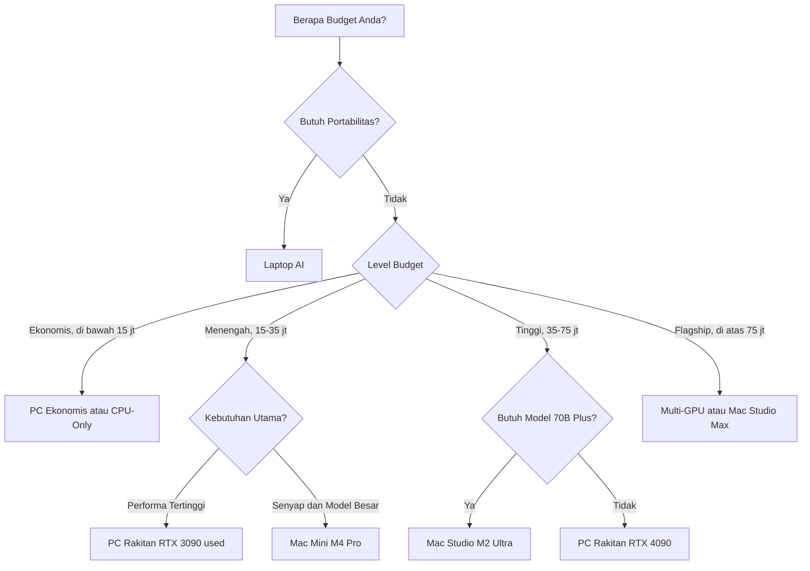

# Bab 2.10: Budgeting Personal

> Setiap bulan, langganan API cloud membawa tagihan yang terasa seperti iuran tak berujung. Di titik itu, banyak orang mulai bertanya: bukankah lebih murah memiliki mesin sendiri? Jawabannya — seperti hampir semua hal dalam hidup — adalah "tergantung". Sub-bab ini adalah kompas Anda untuk menghitung sendiri: PC rakitan, Mac Studio, atau laptop AI.

---

## 1. Tujuan Sub-Bab

Setelah membaca bab ini, Anda akan mampu:

- Membandingkan **total biaya kepemilikan** (TCO) tiga jalur utama workstation LLM: PC rakitan, Mac Studio/Mac Mini, dan laptop AI
- Memilih konfigurasi optimal berdasarkan budget, *use case*, dan prioritas pribadi — performa, daya, atau portabilitas
- Menghitung **break-even point** antara inferensi lokal dan langganan API cloud berdasarkan pemakaian token harian Anda
- Membaca dan memanfaatkan matriks keputusan agar tidak terjebak membeli hardware yang salah untuk kebutuhan yang salah
- Menyusun checklist pembelian komponen PC LLM yang kompatibel dan bebas kesalahan fatal

---

## 2. Empat Kategori Budget untuk LLM Workstation

Dunia workstation LLM rumahan terbagi menjadi empat kelas ekonomi yang cukup jelas. Di level **ekonomis (Rp 5–15 juta)**, pilihan realistis adalah laptop atau PC *CUDA-less* dengan *inference* CPU-only — cukup untuk model 3–8B yang sudah dikuantisasi, dengan kecepatan yang menuntut kesabaran tetapi tetap berguna untuk tugas ringan. Naik ke **menengah (Rp 15–35 juta)**, Anda memasuki zona yang paling populer: PC dengan RTX 3090 *used*, Mac Mini M4 Pro, atau laptop AI *mid-range*. Di sini GPU 24GB membuka pintu ke model 13B yang nyaman dan 70B yang dipangkas. **Tinggi (Rp 35–75 juta)** adalah wilayah RTX 4090, Mac Studio M2 Ultra, atau dua RTX 3090 — di sini model 70B menjadi realistis dan *multi-tasking* terasa bebas. Terakhir, **flagship (di atas Rp 75 juta)** menampung *multi-GPU workstation*, Mac Studio konfigurasi maksimal, hingga perangkat *server-grade* — untuk mereka yang menjadikan LLM lokal sebagai alat produksi sungguhan, bukan sekadar hobi.

Pembagian ini penting bukan untuk memberi label status, melainkan untuk mengatur ekspektasi: setiap level memiliki model maksimum yang masuk akal, biaya listrik yang berbeda, dan *upgrade path* yang berbeda pula. Sebagian besar pembaca buku ini — dan sebagian besar pengguna LLM lokal dunia — akan hidup di dua level pertama.

---

## 3. PC Rakitan: Performa Terbaik per Rupiah

Bagi mereka yang tidak takut obeng dan manual BIOS, **PC rakitan** adalah juara rasio harga-performansi. Kelebihannya tegas: *performa terbaik per rupiah*, *upgrade path* yang jelas (ganti GPU tanpa ganti seluruh mesin), dan dukungan **semua framework** — CUDA, llama.cpp, vLLM, PyTorch — tanpa kecuali. Komunitasnya juga yang paling besar, sehingga setiap masalah sudah punya jawaban di forum.

Kekurangannya sama tegasnya: konsumsi daya tinggi yang menerjemahkan langsung ke tagihan listrik, kebisingan fan yang mengganggu di ruang kerja, kebutuhan ruang fisik, dan kerawanan *thermal issue* — persis topik Sub-bab 2.8. Ada tiga komponen kunci yang menentukan: **GPU** yang harus menyedot 30–50% dari seluruh budget (jangan pelit di sini), **PSU** dengan kapasitas 1200W+ jika Anda berencana multi-GPU, dan **motherboard** dengan jumlah *PCIe lanes* yang cukup untuk GPU dan perangkat lain. PC rakitan adalah pilihan bagi orang yang memprioritaskan kecepatan mentah, senang *oprek*, dan ingin setiap rupiah bekerja maksimal.

---

## 4. Mac Studio dan Mac Mini: Senyap untuk Model Besar

Di kutub yang berlawanan berdiri ekosistem Apple. Keunggulan utamanya adalah **unified memory** — hingga **192GB** di Mac Studio — yang berarti model 70B+ bisa dimuat sepenuhnya tanpa *offloading* yang menyiksa. Tambahkan kebisuan total (tidak ada fan GPU), konsumsi daya rendah, dan *form factor* sekecil kotak makan siang, dan Anda mendapatkan mesin yang bisa dinyalakan 24/7 tanpa mengganggu siapa pun — termasuk tetangga kos Anda.

Kekurangannya adalah **harga premium per unit performa**: untuk kecepatan *inference* per detik, Mac Studio kalah dengan PC GPU sekelasnya, dan *memory*-nya terbatas di 192GB — model yang lebih besar dari itu (misalnya Mistral Large 3 yang 675B) tidak mungkin. Tidak ada *upgrade* sama sekali: apa yang Anda beli adalah apa yang Anda miliki selamanya. Cocok untuk pengguna yang prioritasnya **model besar (70B+)**, bukan kecepatan maksimal, dan yang menempatkan ketenangan serta efisiensi daya di atas segalanya. Penelitian Liu dkk. (2025) bahkan menunjukkan bahwa *cluster* Mac Studio bisa menjadi alternatif rasional untuk model MoE besar, dengan analisis biaya yang bersaing dengan mesin DGX kelas server [3].

---

## 5. Laptop AI: AI di Saku Anda

Level terakhir, **laptop AI**, adalah pilihan portabel. Kelebihannya jelas: bisa dibawa ke kampus, kantor, atau kafe; *all-in-one* tanpa *peripheral* tambahan; NPU terintegrasi untuk tugas AI ringan (lihat Sub-bab 2.9); dan konsumsi daya yang jauh di bawah PC desktop. Untuk mahasiswa atau pekerja yang membutuhkan AI di perjalanan, ini satu-satunya pilihan yang masuk akal.

Namun, mari jujur soal keterbatasannya. GPU laptop adalah versi yang sudah "dicekik": dengan *Max-Q* dan *TGP* (Total Graphics Power) rendah, RTX 4090 laptop pun hanya memiliki **VRAM maksimal 16GB** — setengah dari RTX 3090 desktop bekas yang lebih murah. Dan karena *form factor*-nya sempit, laptop gaming **cepat throttle** — panas menumpuk di ruang yang tidak punya tempat untuk dibuang, persis mekanisme yang dijelaskan di Sub-bab 2.8. Laptop AI cocok untuk *casual LLM* dan pekerjaan produktivitas, bukan untuk menjadi *workhorse* inferensi. Jika prioritas Anda portabilitas dan Anda sudah memiliki laptop untuk kerja, jalan ini masuk akal — dengan ekspektasi yang realistis.

---

## 6. Perhitungan TCO dan Break-Even dengan Cloud

### Total Cost of Ownership

Harga stiker hardware hanyalah permulaan. **TCO** (Total Cost of Ownership) menjumlahkan biaya hardware + biaya listrik selama 3 tahun + biaya pemeliharaan (*upgrade*, *repaste*, penggantian fan). Untuk konteks Indonesia, tarif listrik PLN per kWh (tarif reguler 2026, sekitar Rp 1.600/kWh) menjadi komponen yang tidak bisa diabaikan: PC RTX 3090 yang menyala 8 jam sehari bisa menyedot sekitar Rp 2,3 juta per tahun, sementara Mac Mini yang senyap hanya sekitar Rp 400 ribu.

### Break-Even dengan Cloud

Pertanyaan besar kemudian menjadi: kapan biaya lokal lebih murah daripada berlangganan API? Untuk **heavy user** — mereka yang mengonsumsi sekitar 500.000 token per hari — RTX 3090 *used* bisa mencapai titik *break-even* dalam sekitar 8 bulan dibandingkan memakai OpenAI GPT-4o sepanjang waktu. Setelah itu, semua yang Anda proses adalah "gratis". Bagi pengguna ringan yang hanya 50.000 token per hari, hitungannya berbalik: berlangganan cloud seharga beberapa ratus ribu per bulan bisa jadi lebih ekonomis daripada modal puluhan juta di muka. Perhitungan lengkapnya akan Anda praktikkan di Tutorial 1 dan 2.

---

## 7. Matriks Keputusan

Jika semua data di atas diringkas menjadi satu peta, hasilnya adalah matriks keputusan sederhana:

- **Pilih PC rakitan** jika prioritas Anda performa tertinggi, Anda menikmati proses *oprek*, dan budget ketat ingin ditekan demi performa maksimum per rupiah.
- **Pilih Mac Studio** (atau Mac Mini) jika Anda butuh model besar (70B+), memprioritaskan ketenangan ruang kerja, dan berencana menjalankan mesin 24/7.
- **Pilih laptop** jika portabilitas adalah segalanya, kebutuhan inferensi Anda *casual*, dan Anda tidak ingin mengganti laptop kerja yang sudah ada.

Ketiga jalur itu sah. Yang tidak sah adalah membeli Mac Studio untuk kecepatan maksimal, atau laptop gaming dengan harapan menjalankan 70B — kekecewaan biasanya berawal dari ketidakcocokan prioritas, bukan dari hardware yang buruk.

---

## 8. Tabel Referensi

### Tabel 1: Konfigurasi Workstation LLM per Budget

Berikut empat paket konfigurasi lengkap — dari ekonomis hingga flagship — beserta model LLM maksimum yang realistis dijalankan masing-masing.

| Komponen | Ekonomis (~Rp 12 jt) | Menengah (~Rp 25 jt) | Tinggi (~Rp 50 jt) | Flagship (~Rp 80 jt) |
|:---|:---|:---|:---|:---|
| **CPU** | Intel i5-13400 | AMD Ryzen 7 7800X3D | Intel i7-14700K | AMD Threadripper 7960X |
| **GPU** | RTX 4060 (used) | RTX 3090 (used) | RTX 4090 | 2x RTX 3090 + NVLink |
| **RAM** | 32GB DDR4 | 64GB DDR5 | 64GB DDR5 | 128GB DDR5 |
| **Motherboard** | B760 | B650 | Z790 | TRX50 |
| **SSD** | 1TB NVMe Gen 3 | 2TB NVMe Gen 4 | 2TB NVMe Gen 5 | 4TB NVMe Gen 5 |
| **PSU** | 650W | 850W | 1200W | 1600W |
| **Case** | Budget ATX | Mid-tower mesh | High-airflow | Full tower |
| **Cooling** | Stock CPU | Air cooler | AIO 360mm | Custom loop |
| **VRAM Total** | 8 GB | 24 GB | 24 GB | 48 GB |
| **Model Maks** | 7B Q4 | 13B Q4 / 70B Q3 | 70B Q3 (offload) | 70B Q4 / 405B Q3 / DeepSeek V4 Flash Q4* |
| **TCO 3 Tahun** | ~Rp 15 jt | ~Rp 30 jt | ~Rp 65 jt | ~Rp 105 jt |

*DeepSeek V4 Flash Q4 (~160 GB) hanya muat di konfigurasi flagship 8x GPU; untuk Mistral Large 3 Q4 (~380 GB) butuh 16x RTX 3090 atau server-grade.

Perhatikan jurang antar level yang paling mengejutkan: *TCO 3 tahun* level "tinggi" (Rp 65 jt) hampir dua kali lipat level "menengah" (Rp 30 jt), padahal selisih harga komponennya hanya Rp 25 jt — selisih itu adalah biaya listrik RTX 4090 yang jauh lebih rakus dan *AIO cooling* yang mahal. Sementara itu, lompatan terbesar dalam kapabilitas terjadi antara level menengah dan tinggi: dari "70B Q3 yang tersiksa" menjadi "70B yang nyaman" — dan level flagship baru membuka pintu ke model frontier DeepSeek V4 Flash Q4 (284B) yang selama ini hanya ada di cloud. Strategi umum yang disarankan: masuk di level menengah dengan RTX 3090 *used*, lalu *upgrade path* ke 2x GPU (48GB VRAM) — jalur yang lebih murah daripada langsung membangun flagship dari nol. Klasifikasi model-maksimum per konfigurasi ini merujuk survey *edge LLM* dari Qu dkk. (2024) [2].

### Tabel 2: PC Rakitan vs Mac Studio vs Laptop

Untuk pembaca yang bingung membandingkan tiga dunia berbeda, tabel berikut menyandingkannya secara langsung pada kisaran budget yang sebanding.

| Aspek | PC Rakitan (Rp 25 jt) | Mac Mini M4 Pro (Rp 32 jt) | Laptop AI (Rp 25 jt) |
|:---|:---|:---|:---|
| **GPU/Memory** | RTX 3090 24GB | M4 Pro 48GB unified | RTX 4060 laptop 8GB |
| **Tokens/s (7B)** | ~85 t/s | ~40 t/s | ~35 t/s |
| **Model 70B** | ~16 t/s (Q3) | ~8 t/s (Q3) | Tidak muat |
| **Max VRAM/Memory** | 24 GB | 48 GB | 8 GB |
| **Konsumsi Daya** | ~350W (load) | ~60W (load) | ~150W (load) |
| **Biaya Listrik/thn** | ~Rp 2.3 jt | ~Rp 400 rb | ~Rp 1 jt |
| **Upgradeability** | Tinggi | Rendah (tidak bisa) | Rendah (RAM/GPU solder) |
| **Kebisingan** | Sedang | Silent | Sedang-tinggi |
| **Portabilitas** | Tidak | Mini (bisa dibawa) | Ya |
| **Software Support** | Semua framework | MLX, llama.cpp, Ollama | Terbatas (VRAM kecil) |

Tiga wawasan dari perbandingan ini. Pertama, PC rakitan unggul telak di kecepatan — 85 t/s untuk 7B dan 16 t/s untuk 70B — tetapi harus "membayar" Rp 2,3 juta listrik per tahun dan kebisingan yang mengiringi. Kedua, Mac Mini M4 Pro adalah studi kasus kontradiksi yang menarik: *unified memory*-nya 48GB (dua kali VRAM RTX 3090), tetapi kecepatannya hanya 40 t/s untuk 7B — dan untuk 70B hanya 8 t/s, karena *memory bandwidth*-nya lebih rendah daripada GDDR6X RTX 3090. Dengan kata lain, **Mac unggul di kapasitas, PC unggul di kecepatan** — dan laptop berada di posisi tersulit: tidak bisa memuat 70B sama sekali karena 8GB yang terbatas. Ketiga, untuk pekerjaan 24/7 yang mementingkan ketenangan dan listrik, Mac Mini menang telak — konsumsi 60W vs 350W berarti dalam 3 tahun menghemat ~Rp 5,7 juta hanya dari listrik [3][4][5].

### Tabel 3: Perbandingan Biaya per Juta Token — Lokal vs Cloud

Akhirnya, pertanyaan paling mendasar: berapa sebenarnya biaya setiap juta token dari masing-masing jalur?

| Platform | Biaya per 1M Token | Keterangan |
|:---|:---|---:|
| **RTX 3090 used** | Rp 520 | HW amortisasi 3 thn + listrik |
| **RTX 4060** | Rp 950 | HW Rp 5 jt + listrik |
| **Mac Mini M4 Pro** | Rp 2.107 | Biaya HW dominan |
| **Mac Studio M2 Ultra** | Rp 2.876 | Biaya HW dominan |
| **OpenAI GPT-4o** | Rp 77.000 | via API, input + output rata-rata |
| **OpenAI GPT-5.5** | Rp 150.000 | via API, 1M context, reasoning effort |
| **Claude 3.5 Sonnet** | Rp 47.000 | via API |
| **Claude Fable 5** | Rp 250.000 | via API, 1M context, safety classifiers |
| **Gemini 1.5 Pro** | Rp 35.000 | via API |
| **Gemini 2.5 Pro** | Rp 50.000 | via API, 1M context, thinking mode |
| **DeepSeek API** | Rp 2.100 | Termurah untuk cloud |
| **Groq API** | Rp 5.800 | LPU inference cloud |

Angka-angka ini menceritakan dua cerita. Cerita pertama: **inferensi lokal 40–140 kali lebih murah per token daripada API frontier** — RTX 3090 *used* memproses satu juta token dengan biaya setara Rp 520, sementara GPT-4o meminta Rp 77.000. Bahkan DeepSeek API yang termurah di dunia cloud (Rp 2.100) masih 4x lebih mahal dari RTX 3090 lokal. Cerita kedua, yang sering terlewat: **lokal lebih murah hanya jika volume pemakaian cukup besar** — Rp 12 juta hardware RTX 3090 yang hanya dipakai 10.000 token per hari membutuhkan lebih dari 6 tahun untuk balik modal, sementara pengguna 500.000 token/hari mencapai *break-even* dalam 8 bulan. Untuk pengguna hybrid, strategi optimal ada di tengah: jalankan tugas rutin bervolume besar di lokal, simpan API cloud untuk tugas frontier sesekali yang butuh kualitas GPT-5.5 atau Claude Fable 5. Data efisiensi per platform pada tabel ini diverifikasi dengan studi pengukuran energi 32.500 titik data dari Liu dkk. (2025) [4].

---

## 9. Diagram & Visualisasi

### Diagram 1: Peta Keputusan Pemilihan Hardware

Memilih di antara tiga dunia hardware bisa terasa membingungkan. Pohon keputusan berikut memandu Anda langkah demi langkah.



Alur diagram ini mencerminkan prioritas berlapis yang dibahas di seluruh sub-bab. Pertanyaan pertama bukan soal hardware, melainkan soal gaya hidup: **portabilitas** (apakah mesin harus ikut bepergian?) langsung menyaring ke laptop. Pertanyaan kedua adalah **budget**, dan pertanyaan ketiga — yang paling sering salah dijawab — adalah **kebutuhan model**: mereka yang butuh 70B+ dan tidak mengejar kecepatan maksimal diarahkan ke Apple, sementara pencari performa mentah diarahkan ke PC. Perhatikan bahwa pilihan GPU vs Apple hanya muncul setelah budget dan kebutuhan ditetapkan — urutan ini mencegah kesalahan klasik, seperti membeli Mac Studio demi kecepatan atau laptop demi model besar.

---

## 10. Praktikum / Hands-On

### Tutorial 1: Kalkulator TCO untuk Keputusan Pembelian

Sebelum membeli apa pun, hitung dulu biaya sebenarnya. Skrip berikut menghitung TCO — hardware + listrik — untuk berbagai konfigurasi dengan tarif PLN.

```python
# tco_calculator.py — hitung total biaya kepemilikan
def calculate_tco(hw_cost, power_watts, hours_day, price_per_kwh, years=3):
    """Hitung TCO: hardware + listrik untuk periode tertentu"""
    # Biaya hardware
    total_hw = hw_cost

    # Biaya listrik
    daily_kwh = power_watts * hours_day / 1000
    monthly_kwh = daily_kwh * 30
    yearly_kwh = monthly_kwh * 12

    electricity_per_year = yearly_kwh * price_per_kwh
    total_electricity = electricity_per_year * years

    total = total_hw + total_electricity
    return {
        "hw_cost": total_hw,
        "electricity_3yr": round(total_electricity, 2),
        "total_tco": round(total, 2),
        "monthly_electricity": round(electricity_per_year / 12, 2)
    }

configs = [
    ("PC RTX 3090", 12000000, 350, 8),
    ("PC RTX 4090", 30000000, 450, 8),
    ("Mac Mini M4 Pro 48GB", 32000000, 60, 8),
    ("Mac Studio M2 Ultra 192GB", 75000000, 120, 8),
    ("Laptop RTX 4060", 18000000, 150, 8),
    ("PC 2x RTX 3090", 24000000, 700, 8),
]

PLN_TARIFF = 1600 / 1000  # Rp per kWh

print(f"{'Konfigurasi':30s} {'HW Cost':>12s} {'Listrik/bln':>12s} {'Listrik 3thn':>12s} {'TCO 3 tahun':>14s}")
print("=" * 80)
for name, hw, watt, hours in configs:
    result = calculate_tco(hw, watt, hours, PLN_TARIFF)
    print(f"{name:30s} {result['hw_cost']:>12,} {result['monthly_electricity']:>12,.0f} "
          f"{result['electricity_3yr']:>12,.0f} {result['total_tco']:>14,.0f}")
```

Jalankan skrip ini dan perhatikan dua baris yang paling kontras: PC 2x RTX 3090 (TCO ~Rp 43 juta) dan Mac Studio M2 Ultra (TCO ~Rp 76 juta) memiliki *capability* model yang sebanding (keduanya sanggup 70B+), tetapi selisihnya hampir Rp 33 juta dalam 3 tahun — itulah "biaya kemewahan" ketenangan dan *form factor* Apple. Sebaliknya, laptop RTX 4060 yang tampak murah (Rp 18 juta) ternyata TCO 3 tahunnya ~Rp 22 juta — hampir menyentuh harga PC RTX 3090 (Rp 12 juta + listrik = ~Rp 19 juta) dengan performa yang kalah kelas. Angka-angka ini mengubah percakapan "berapa harga laptopnya?" menjadi "berapa biayanya selama tiga tahun?" — pertanyaan yang jauh lebih jujur [1][4][5].

### Tutorial 2: Menghitung Break-even Point vs Cloud API

Setelah TCO diketahui, hitung kapan investasi lokal melunasi dirinya dibandingkan memakai cloud.

```python
# breakeven.py — kapan lokal lebih murah dari cloud?
HW_COST = 12_000_000  # RTX 3090 used
TOKENS_PER_DAY = 500_000  # 500K token/hari (heavy user)
CLOUD_COST_PER_1M = 77_000  # OpenAI GPT-4o

# Biaya per token lokal (amortisasi 3 tahun + listrik)
from tco_calculator import calculate_tco

tco = calculate_tco(HW_COST, 350, 8, 1.6)
local_cost_per_token = tco["total_tco"] / (3 * 365 * TOKENS_PER_DAY)
cloud_cost_per_token = CLOUD_COST_PER_1M / 1_000_000

daily_local_cost = local_cost_per_token * TOKENS_PER_DAY
daily_cloud_cost = cloud_cost_per_token * TOKENS_PER_DAY

breakeven_days = HW_COST / (daily_cloud_cost - daily_local_cost)

print(f"=== Break-even Analysis ===")
print(f"Hardware: Rp {HW_COST:,}")
print(f"Token per hari: {TOKENS_PER_DAY:,}")
print(f"Biaya lokal/hari: Rp {daily_local_cost:,.0f}")
print(f"Biaya cloud/hari: Rp {daily_cloud_cost:,.0f}")
print(f"Hemat/hari: Rp {daily_cloud_cost - daily_local_cost:,.0f}")
print(f"Break-even dalam: {breakeven_days:.0f} hari (~{breakeven_days/30:.1f} bulan)")
```

Eksperimen dengan angka ini sangat menyenangkan: ubah `TOKENS_PER_DAY` menjadi 50.000 dan `CLOUD_COST_PER_1M` menjadi 35.000 (Gemini 1.5 Pro), dan hasilnya akan menunjukkan break-even yang melonjak hingga bertahun-tahun — bukti bahwa **cloud tetap menang untuk pemakaian ringan**. Sebaliknya, ubah konsumsi menjadi 1 juta token/hari dengan GPT-5.5 (Rp 150.000/M token), dan break-even menyusut drastis. Pelajaran utamanya: jangan membeli workstation LLM karena "lebih murah" secara umum — belilah karena *pola pemakaian Anda* membuatnya lebih murah. Hitung dulu dengan skrip ini sebelum menyerahkan uang Anda [8].

### Tutorial 3: Checklist Pembelian Komponen PC LLM

Ketika Anda sudah memutuskan membangun PC, kesalahan kompatibilitas adalah pembunuh budget yang paling diam-diam. Checklist berikut mencegahnya.

```bash
#!/bin/bash
# pc_checklist.sh — verifikasi kompatibilitas komponen LLM PC

echo "=== Checklist PC untuk LLM ==="
echo ""

# Cek PCIe lanes CPU
echo "[1] CPU: Cek jumlah PCIe lanes"
echo "    - Intel LGA1700: 16x CPU + 4x Chipset = 20 total"
echo "    - AMD AM5: 28x CPU + 4x Chipset = 32 total"
echo "    - Threadripper: 128x CPU"
echo "    Butuh: 16x untuk GPU pertama + 8x untuk GPU kedua"

echo ""
echo "[2] Motherboard: Pastikan slot x16 berjalan di x8/x8 untuk multi-GPU"
echo "    - Cek manual: 'PCIe x16 slot (x8 mode)'"

echo ""
echo "[3] PSU: Cek konektor dan daya"
echo "    - RTX 3090: 2x 8-pin PCIe per GPU"
echo "    - Total daya: GPU TDP + 150W (sistem)"
echo "    - 2x RTX 3090 = 700W + 150W = 850W minimum"

echo ""
echo "[4] Case: Cek dimensi GPU"
echo "    - RTX 4090: panjang 336mm, lebar 3-4 slot"
echo "    - Butuh clearance minimal 350mm"

echo ""
echo "[5] RAM: Cek bandwidth"
echo "    - DDR5 6000 MT/s dual channel = ~96 GB/s"
echo "    - Untuk CPU inference, makin tinggi makin baik"

echo ""
echo "[6] Cek kompatibilitas NVLink (RTX 3090 only)"
echo "    - NVLink bridge: 2-slot atau 4-slot spacing"
echo "    - Cek jarak slot PCIe fisik"
```

Kesalahan paling umum yang dicegah checklist ini: membeli motherboard yang slot x16 keduanya berjalan di x8/x4 (menghambat GPU kedua), PSU yang konektornya kurang dari kebutuhan dua kartu (RTX 3090 butuh 2x 8-pin per GPU), dan RTX 4090 yang tidak muat di case karena panjangnya 336mm. Perhatikan juga logika di balik pemilihan CPU: *PCIe lanes* menentukan apakah motherboard Anda bisa menampung GPU kedua tanpa menyedot jalur dari kartu pertama — alasan mengapa AMD AM5 (28x) lebih ramah multi-GPU daripada Intel LGA1700 (20x) di kelas harga yang sama [9].

---

## 11. Studi Kasus: Memilih Workstation AI dengan Budget Rp 30 Juta

**Skenario.** Seorang *developer* web — sebut saja Raka — sudah jenuh membayar langganan ChatGPT sebesar US$20 per bulan dan ingin beralih ke LLM lokal untuk *coding assistant* dan RAG dokumen internal. Budget-nya sekali bayar: **Rp 30 juta**, tanpa biaya bulanan. Tiga opsi masuk meja:

- **Opsi A — PC Rakitan:** Ryzen 7 7800X3D + RTX 3090 *used* 24GB + 64GB DDR5 + 2TB NVMe Gen 4 = **~Rp 25 juta**. Performa 85 t/s untuk model 7B, 16 t/s untuk 70B Q3, dan *upgrade path* ke 2x GPU di masa depan. Biaya listrik ~Rp 230 ribu per bulan (8 jam/hari).
- **Opsi B — Mac Mini M4 Pro 48GB:** **Rp 32 juta** — sudah *over budget* Rp 2 juta. Performa 40 t/s untuk 7B, dan tidak bisa menjalankan 70B dengan nyaman (memori cukup, tetapi *bandwidth* rendah). Listrik hanya ~Rp 40 ribu per bulan, dan mesinnya *silent*.
- **Opsi C — Laptop Lenovo Legion RTX 4060 8GB:** **Rp 22 juta**. Performa 35 t/s untuk 7B Q4, tidak bisa 70B, tetapi portabel untuk dibawa ke kampus dan kantor.

**Analisis.** Menjalankan kalkulator TCO dari Tutorial 1 mengubah gambaran. Opsi A: TCO 3 tahun ~Rp 33 juta (listrik 8 jam/hari). Opsi B: ~Rp 33,4 juta — ternyata *hampir identik* dengan Opsi A, karena listrik Mac yang murah mengkompensasi harga awal yang lebih tinggi. Opsi C: ~Rp 25,6 juta — termurah, tetapi dengan kapabilitas paling kecil. Namun TCO saja tidak cukup: Raka butuh *coding assistant* interaktif yang responsif dan RAG atas dokumen-dokumennya. Di sini Opsi A unggul tegas dengan 85 t/s (2x Mac, 2,4x laptop) dan satu-satunya yang bisa menjalankan 70B.

**Keputusan.** Raka memilih **Opsi A**. Alasan utamanya: budget pas, performa terbaik per rupiah, dan *upgrade path* ke 2x GPU untuk 70B — membeli GPU kedua Rp 12 juta di tahun kedua lebih murah daripada lompat ke Mac Studio. Sisa Rp 5 juta digunakan untuk **UPS + *fan upgrade*** — pelajaran dari Sub-bab 2.8: GPU yang sehat secara termal menjaga performa yang sudah dibayar mahal.

**Hasil.** Menghitung dengan Tutorial 2: dibandingkan langganan ChatGPT (US$20/bulan ≈ Rp 320 ribu/bulan), biaya lokal per bulan hanya ~Rp 230 ribu — menghemat Rp 90 ribu/bulan, atau ~Rp 3,2 juta dalam 3 tahun. Angka itu terlihat kecil, tetapi cerita sebenarnya berbeda: untuk pemakaian 500.000 token/hari yang sedang bertumbuh (makin banyak kode dan dokumen yang diproses), *break-even* terjadi dalam 4–6 bulan — lebih cepat dari perkiraan 8 bulan untuk *heavy user* biasa, dan setelah itu seluruh inferensi adalah "gratis". Ditambah kebebasan tanpa batas *rate limit* dan data yang tidak pernah meninggalkan mesin.

**Catatan 2026.** Dunia berubah cepat. Model frontier baru — **DeepSeek V4 Flash** (284B, MIT license) dan **Mistral Large 3** (675B, Apache 2.0) — membuka akses ke kualitas level GPT-5 secara lokal, tetapi harganya mahal: butuh 6–8 GPU atau Mac Studio 192GB, investasi Rp 70–100 juta. Untuk pengguna dengan budget Rp 30 juta seperti Raka, kabar baiknya adalah model 7B–14B Q4_K_M saat ini sudah mencapai performa level **GPT-4o-mini** — cukup untuk 90% kebutuhan sehari-hari [11][12]. Strategi bertahap adalah jawabannya: mulai dari yang mampu dibeli hari ini, dan biarkan kebutuhan yang menentukan kapan *upgrade* berikutnya layak dilakukan.

---

## 12. Referensi

### Paper Jurnal/Konferensi

[1] Stojkovic, J., et al. (2025). *Energy Considerations of Large Language Model Inference and Efficiency Optimizations*. ACL. DOI: [10.18653/v1/2025.acl-long.1563](https://doi.org/10.18653/v1/2025.acl-long.1563)
- Optimasi energi dapat mengurangi 73% konsumsi daya — relevan untuk kalkulasi TCO dan rekomendasi pada Seksi 6.

[2] Qu, Z., et al. (2024). *A Review on Edge Large Language Models: Design, Execution, and Applications*. arXiv: 2410.11845. DOI: [10.48550/arXiv.2410.11845](https://arxiv.org/abs/2410.11845)
- Survey komprehensif deployment LLM di *edge* — klasifikasi kebutuhan hardware per ukuran model. Data Tabel 1 tentang model maksimum per konfigurasi merujuk survey ini.

[3] Liu, C., et al. (2025). *Towards Building Private LLMs: Exploring Multi-Node Expert Parallelism on Apple Silicon for Mixture-of-Experts Large Language Model*. arXiv: 2506.23635. DOI: [10.48550/arXiv.2506.23635](https://arxiv.org/abs/2506.23635)
- *Cluster* Mac Studio untuk model MoE — analisis biaya vs DGX. Data Tabel 2 (Mac vs PC) diverifikasi dengan perbandingan biaya paper ini.

[4] Liu, Y., et al. (2025). *From Prompts to Power: Measuring the Energy Footprint of LLM Inference*. arXiv: 2511.05597. DOI: [10.48550/arXiv.2511.05597](https://arxiv.org/abs/2511.05597)
- 32.500 pengukuran energi — 21 konfigurasi GPU, 155 model. Data efisiensi per platform di Tabel 3 diverifikasi dengan paper ini.

[5] Lu, Z., et al. (2025). *Demystifying Small Language Models for Edge Deployment*. ACL. DOI: [10.18653/v1/2025.acl-long.718](https://doi.org/10.18653/v1/2025.acl-long.718)
- Benchmark SLM di *edge devices* — data token/s, *memory footprint*, dan konsumsi energi. Tabel 2 tentang performa laptop merujuk temuan survey ini.

### Referensi Pendukung (Dokumentasi/Repository)

[6] TechPowerUp. *GPU Pricing Database*. [https://www.techpowerup.com/gpu-specs](https://www.techpowerup.com/gpu-specs)

[7] Tokopedia / Shopee. *Harga Komponen PC Indonesia*. Harga pasar per Juni 2026.

[8] OpenAI. *API Pricing*. [https://openai.com/pricing](https://openai.com/pricing)

[9] PLN. *Tarif Listrik 2026*. [https://www.pln.co.id](https://www.pln.co.id)

[10] Puget Systems. *Hardware Recommendations for AI*. [https://www.pugetsystems.com](https://www.pugetsystems.com)

[11] DeepSeek-AI. (2026). *DeepSeek-V4: A Hybrid CSA/HCA Mixture-of-Experts Language Model*. arXiv: 2604.09980. DOI: [10.48550/arXiv.2604.09980](https://arxiv.org/abs/2604.09980)
- Model 284B dengan MIT license — opsi *frontier* lokal dengan biaya hardware 6–8 GPU.

[12] Mistral AI. (2025). *Mistral Large 3: Granular MoE with Multimodal Capabilities*. arXiv: 2512.01820. DOI: [10.48550/arXiv.2512.01820](https://arxiv.org/abs/2512.01820)
- Model 675B Apache 2.0 — analisis biaya vs performa untuk berbagai konfigurasi hardware.

---

> **Catatan:** Harga dalam Rupiah bersifat indikatif per Juni 2026 — verifikasi harga di marketplace sebelum membeli. TCO adalah estimasi; biaya riil tergantung pola pemakaian dan tarif listrik setempat.