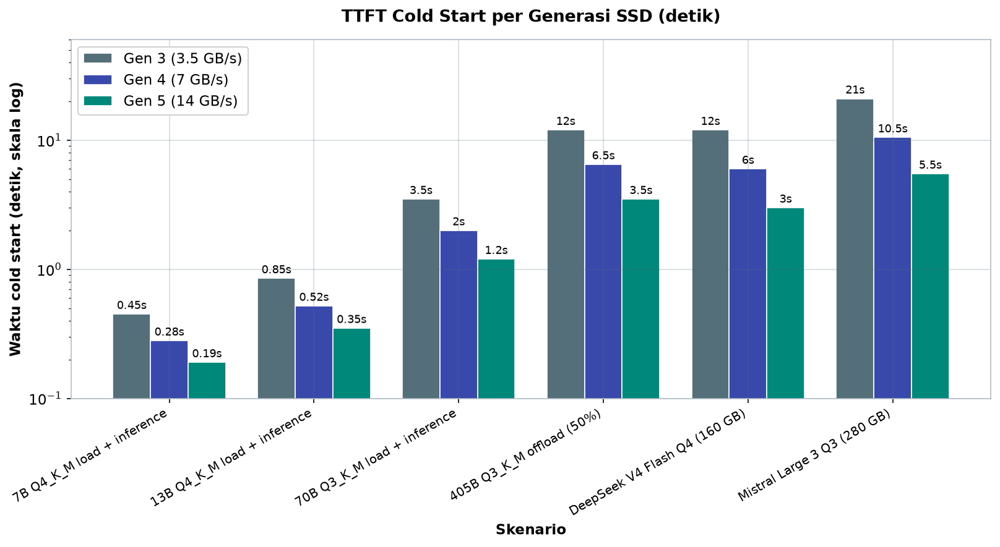
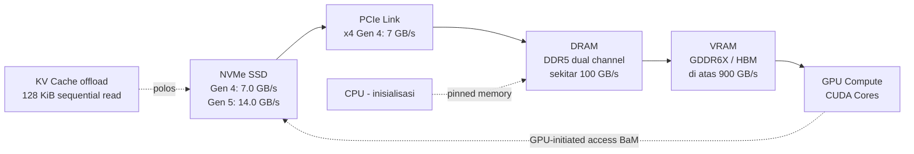

# Bab 2.4: Storage Bottlenecks

> Saat GPU Anda kuat, RAM Anda besar, ternyata musuh tercepat justru datang dari tempat yang paling jarang diperhatikan: disk. Model 70 GB yang seharusnya "langsung jalan" bisa memaksa Anda menunggu bermenit-menit setiap kali komputer dinyalakan — hanya karena SSD Anda ketinggalan satu generasi. Bab ini mengajak Anda menyelami jalur data dari chip NAND sampai ke dalam VRAM, dan membuktikan bahwa dalam dunia LLM lokal, kecepatan disk adalah rahasia permainan yang sering dilupakan.

---

## 1. Tujuan Sub-Bab


Setelah membaca bab ini, Anda akan mampu:

- Menjelaskan peran storage (SSD NVMe) dalam pipeline LLM inference, terutama untuk model loading dan offloading
- Membedakan kecepatan NVMe Gen 3, Gen 4, dan Gen 5 beserta dampaknya pada model load time
- Membaca karakteristik pola I/O offloading model besar dan KV cache berdasarkan riset terkini
- Menerapkan teknik optimasi I/O — mulai dari pinned memory, async prefetch, hingga GPU-initiated storage access
- Memilih SSD yang tepat untuk workstation LLM Anda dengan pertimbangan bandwidth, kapasitas, dan anggaran dalam rupiah

---

## 2. Storage dalam Pipeline LLM Inference


### Model Loading: Panggung Dibuka dari Disk

Bayangkan Anda seorang konduktor yang akan membunyikan ratusan alat musik sekaligus. Sebelum orkestra dimulai, semua partitur harus diletakkan di meja setiap pemain terlebih dahulu. Dalam LLM, "partitur" itu adalah berat model — miliaran angka yang disebut *weights* — dan "meja pemain" adalah DRAM serta VRAM. Sebelum GPU mengeksekusi satu token pun, seluruh weights harus dibaca dari SSD lalu dikirim melalui bus PCIe menuju memori. Proses inilah yang disebut **model loading**, dan ia adalah langkah pertama yang menentukan seberapa lama pengguna menunggu sebelum token pertama muncul.

Besarnya pekerjaan ini sering diremehkan. Model 7B yang terkuantisasi dalam format Q4_K_M berbobot sekitar 4,5 GB — mungkin terasa kecil, tetapi model 70B Q4_K_M membengkak menjadi sekitar 40 GB, dan model 405B Q3_K_M bahkan mencapai sekitar 230 GB. Setiap gigabyte itu harus berpindah dari disk ke memori. Jika jalur transfernya lambat, detik demi detik akan hangus hanya untuk "membuka panggung". Inilah mengapa memahami storage bukan sekadar urusan *hardware enthusiast*, melainkan komponen nyata dari pengalaman menggunakan LLM lokal sehari-hari.

Ada kabar baik yang sering luput dari diskusi: format model terkuantisasi modern seperti **GGUF** dirancang dengan *layout* yang ramah pembacaan beruntun — weights disusun sedemikian rupa sehingga membaca file dari awal hingga akhir secara berurutan adalah cara tercepat memuatnya. Itu artinya pekerjaan loading model hampir murni merupakan *sequential read*: justru spesifikasi yang paling mudah dioptimalkan oleh SSD modern. Kebalikannya terjadi pada *random access* — berpindah-pindah posisi di dalam file — yang jauh lebih mahal dan menjadi akar masalah saat offloading KV cache, seperti yang akan kita lihat dari data penelitian di seksi 5. Jadi, semakin dekat pola baca Anda dengan aliran beruntun, semakin besar manfaat yang bisa Anda petik dari SSD kelas Gen 4 atau Gen 5.

### Offloading: VRAM Penuh? Simpan di Disk

Masalah baru muncul ketika model terlalu besar untuk tinggal di VRAM. Di sinilah storage memainkan peran kedua yang tidak kalah penting: **offloading**. Sistem seperti DeepSpeed ZeRO-Inference memotong-motong model, menyimpan sebagian weights di NVMe SSD, dan hanya memindahkan bagian yang sedang dibutuhkan ke dalam VRAM saat *inference* berjalan. KV cache — catatan konteks percakapan yang terus bertumbuh seiring panjang dialog — pun bisa di-offload ke disk ketika konteks melebihi kapasitas memori.

Konsekuensinya menarik: disk yang tadinya hanya "pintu masuk" kini menjadi "gudang" yang hidup. Setiap token yang di-generate bisa memicu pembacaan dan penulisan kecil-kecilan ke SSD, dan pola I/O ini ternyata sangat khas — penelitian CHEOPS '25 [1] menemukan bahwa offloading didominasi oleh pembacaan blok 128 KiB dengan *read bandwidth* rata-rata hanya sekitar 2,0 GiB/s, sementara *write bandwidth*-nya sangat rendah, hanya sekitar 11 MiB/s [1]. Angka ini jauh di bawah kemampuan SSD modern, dan kita akan membedahnya lebih dalam pada seksi 6.

### Tugas Second-Order: Checkpoint, Dataset, dan RAG

Sebelum menutup peta penjelajahan ini, ada satu lapisan lagi yang sering disebut *second-order*: pekerjaan yang tidak berjalan di jalur utama *inference*, tetapi tetap hidup berdampingan dengan model Anda. **Checkpointing** menyimpan state pelatihan atau fine-tuning secara berkala ke disk; **dataset caching** menyimpan data latih agar tidak diunduh berulang; dan **RAG vector storage** menyimpan jutaan vektor embedding dokumen yang siap dicari. Ketiganya tidak menentukan kecepatan token pertama, tetapi menentukan seberapa nyaman alur kerja Anda sehari-hari. Penyimpanan yang lambat membuat fine-tuning yang seharusnya memakan menit berubah menjadi jam.

Kabar baiknya, untuk tugas-tugas *second-order* ini SSD Gen 3 yang "jadul" pun masih berfungsi — karena beban kerjanya didominasi pembacaan kecil-kecilan dan penulisan jarang, bukan *sequential read* raksasa. Artinya, jika anggaran terbatas, urutan peningkatan yang masuk akal adalah: utamakan kecepatan *sequential read* untuk disk tempat model tinggal, dan biarkan tugas *second-order* berbagi ruang dengan data lainnya. Prinsip "model di SSD cepat, sisanya berbagi" ini terdengar sederhana, tetapi justru inilah yang membuat banyak *workstation* LLM terasa jauh lebih responsif daripada yang lain dengan spesifikasi serupa.

---

## 3. Generasi NVMe: Lompatan Tiga Zaman


### PCIe: Jalan Raya Data

Untuk memahami perbedaan generasi SSD, kita harus mengenal dulu jalan raya yang dilaluinya: **PCIe** (*Peripheral Component Interconnect Express*). PCIe bekerja dengan *lane* — lajur data paralel — dan setiap generasi menggandakan kecepatan setiap lajurnya. SSD NVMe konsumen umumnya menggunakan 4 lane (ditulis x4), sehingga kecepatan puncaknya adalah hasil kali laju per lane dengan jumlah lane.

Dengan kerangka ini, lompatan antar generasi menjadi sangat gamblang. PCIe Gen 3 menawarkan sekitar 3,5 GB/s per lane — sehingga x4 menghasilkan sekitar 14 GB/s teoretis pada standar NVMe 1.3. PCIe Gen 4 menggandakannya menjadi sekitar 7,0 GB/s per lane, atau sekitar 28 GB/s untuk x4 pada NVMe 1.4. PCIe Gen 5 kembali menggandakan: sekitar 14,0 GB/s per lane dan sekitar 56 GB/s untuk x4 pada NVMe 2.0. Setiap generasi berarti "jalan raya" yang dua kali lebih lebar untuk setiap gigabyte model yang harus diangkut.

Patut dicatat bahwa evolusi ini berjalan berpasangan: protokol NVMe juga ikut berkembang dari 1.3 ke 2.0, membawa penyempurnaan dalam efisiensi perintah dan dukungan fitur baru. Artinya, SSD Gen 5 tidak hanya memakai jalan yang lebih lebar — ia juga berbicara dengan bahasa yang lebih efisien di atasnya. Implikasi praktisnya sederhana: ketika Anda mengganti SSD dari Gen 3 ke Gen 4 atau Gen 5, yang terjadi bukan sekadar "angka di atas kertas naik", melainkan perubahan menyeluruh pada kemampuan transfer data yang akan Anda rasakan langsung pada waktu memuat model — sebagaimana tabel di seksi 7 nanti akan memperlihatkan secara kuantitatif.

### Real-world vs Teoretis

Perlu kejujuran sejak awal: angka teoretis hampir tidak pernah tercapai sepenuhnya. *Controller* SSD, *overhead* protokol NVMe, dan manajemen NAND memakan sebagian bandwidth. Pengukuran dunia nyata menunjukkan *sequential read* yang dapat dicapai umumnya berada di kisaran **sekitar 70% dari angka teoretis**. SSD Gen 4 yang diklaim 7,5 GB/s mungkin "hanya" memberikan 5,2-5,5 GB/s dalam praktik, tetapi itu pun masih dua kali lebih cepat dari generasi pendahulunya. Prinsip ini penting diingat setiap kali Anda membandingkan klaim vendor dengan hasil *benchmark* nanti di seksi praktikum.

---

## 4. Dampak pada Model Loading Time


### Angka di Atas Kertas

Menariknya, dampak perbedaan ini sangat mudah dihitung: waktu loading kira-kira sebanding dengan ukuran model dibagi bandwidth efektif. Model 7B Q4_K_M sekitar 4,5 GB akan termuat dalam sekitar 0,35 detik di SSD Gen 3, sekitar 0,18 detik di Gen 4, dan hanya sekitar 0,09 detik di Gen 5 [2]. Untuk model 70B Q4_K_M sekitar 40 GB, angkanya menjadi sekitar 3,0 detik (Gen 3), 1,5 detik (Gen 4), dan 0,8 detik (Gen 5).

Perbedaan mulai terasa dramatis pada model raksasa. DeepSeek V4 Flash Q4_K_M dengan bobot sekitar 160 GB membutuhkan sekitar 12 detik di Gen 3, sekitar 6 detik di Gen 4, dan sekitar 3 detik di Gen 5. Mistral Large 3 Q3_K_M sekitar 280 GB menuntut sekitar 21 detik di Gen 3, sekitar 10,5 detik di Gen 4, dan sekitar 5,5 detik di Gen 5. Sementara model 405B Q3_K_M sekitar 230 GB memerlukan sekitar 17 detik di Gen 3, sekitar 8,5 detik di Gen 4, dan sekitar 4,5 detik di Gen 5 [3].

### Cold Start dan TTFT

Detik-detik yang terlihat kecil ini menjadi krusial ketika Anda menghitung **TTFT** (*Time to First Token*): waktu dari perintah dijalankan hingga token pertama benar-benar muncul. Pada *cold start* — sesudah komputer dinyalakan atau setelah *page cache* dibersihkan — waktu loading model menyumbang hampir seluruh TTFT. Bagi pengguna yang berganti-ganti model seperti mengganti baju (akan kita lihat di studi kasus), akumulasi detik ini bisa menjadi jam yang hilang dalam setahun. Di sisi lain, pada *warm start* — ketika file model masih tersimpan di *page cache* RAM — loading bisa jauh lebih cepat, dan ini akan kita eksploitasi di seksi praktikum.

Satu hal yang perlu dipahami sejak awal: *page cache* adalah pedang bermata dua. Di satu sisi, ia membuat model yang sudah pernah dibuka terasa "instan" di pembukaan berikutnya — OS menahan potongan file di RAM kosong tanpa Anda sadari. Di sisi lain, ia menutupi kelemahan storage Anda: selama cache hangat, SSD Gen 3 terasa seperti Gen 5. Masalahnya muncul persis di saat-saat yang paling tidak diinginkan — setelah *reboot*, setelah *drop_caches*, atau ketika aplikasi lain (seperti *browser* dengan ratusan tab) memaksa RAM membuang cache — dan di situlah perbedaan generasi SSD kembali menampakkan diri dengan kejam. Pengukuran yang jujur karena itu harus selalu dilakukan dalam kondisi *cold*, dan praktikum seksi 8 akan menunjukkan caranya.

### Tabel 1: Dampak Storage pada TTFT Cold Start

Tabel ini membandingkan total waktu dari perintah dijalankan hingga siap berproduksi pada kondisi *cold start* — ketika *page cache* belum tersisa — untuk enam skenario model yang umum.

| Skenario | Gen 3 (3,5 GB/s) | Gen 4 (7 GB/s) | Gen 5 (14 GB/s) |
|:---|---:|---:|---:|
| 7B Q4_K_M load + inference | 0,45s | 0,28s | 0,19s |
| 13B Q4_K_M load + inference | 0,85s | 0,52s | 0,35s |
| 70B Q3_K_M load + inference | 3,5s | 2,0s | 1,2s |
| 405B Q3_K_M offload (50% ke SSD) | 12s | 6,5s | 3,5s |
| DeepSeek V4 Flash Q4 (160 GB) load | 12s | 6,0s | 3,0s |
| Mistral Large 3 Q3 (280 GB) load | 21s | 10,5s | 5,5s |



*Gambar 2.4-1 — Pola pemangkasan "setengah per generasi" konsisten di semua ukuran model; untuk model raksasa seperti DeepSeek V4 Flash (160 GB) dan Mistral Large 3 (280 GB), transisi Gen 3 ke Gen 5 menurunkan waktu tunggu dari belasan-dua puluhan detik menjadi 3-5,5 detik.*

Pola yang tampak di sini konsisten dan mudah dibaca: setiap lompatan generasi memangkas waktu hampir tepat setengahnya. Untuk model hingga 13B, perbedaannya terasa sebagai "kedipan mata", tetapi bagi pengguna yang menjalankan DeepSeek V4 Flash Q4 (160 GB) atau Mistral Large 3 Q3 (280 GB), transisi Gen 3 ke Gen 5 memotong waktu tunggu dari belasan-dua puluhan detik menjadi hanya sekitar 3-5,5 detik. Kotak hijau pada *TTFT* Anda adalah SSD Gen 5; jika motherboard belum mendukung Gen 5, Gen 4 tetaplah pilihan yang jauh lebih baik daripada bertahan di Gen 3.

Perhatikan juga bahwa waktu yang tercantum adalah *best case* pembacaan murni. Di dunia nyata, TTFT dipengaruhi faktor tambahan: *filesystem* (btrfs dan ZFS memiliki *overhead* metadata lebih besar daripada ext4 dalam beberapa kasus), fragmentasi file pada SSD yang sudah padat, *thermal throttle* controller saat pembacaan sangat panjang, hingga driver NVMe dan versi kernel. Bagi pengguna yang menginginkan angka jujur, cara terbaik adalah mengukur sendiri dengan metode praktikum seksi 8. Namun arah umumnya tidak pernah berubah: berapa pun *overhead*-nya, selisih antar generasi SSD tetap dominan — dan membeli Gen 4/5 bukan berarti "menang", melainkan "menghilangkan kalah" dari antrean paling awal di pipeline inferensi Anda.


### Gambar 1: Aliran Data Model Loading

Diagram berikut menggambarkan perjalanan sebuah model dari SSD ke GPU — rangkaian "jalan tol" dengan lebar yang berbeda-beda di setiap segmennya.



Pesan utama diagram ini adalah ketidakseimbangan: segmen VRAM dan DRAM jauh lebih lebar daripada segmen PCIe dan SSD, sehingga di situlah bottleneck loading berada. Perhatikan pula tiga jalur putus-putus di kanan bawah: KV cache yang di-offload kembali ke SSD (pola 128 KiB dari CHEOPS '25), buffer pinned memory dari CPU, dan jalur langsung GPU-ke-SSD ala BaM yang memotong CPU sebagai perantara. Semakin banyak komponen yang bisa berjalan paralel, semakin pendek waktu tunggu token pertama Anda.

Cara membaca diagram ini sekaligus menjadi kerangka berpikir optimasi: **jangan pernah membiarkan dua segmen berjalan sendiri-sendiri**. Ketika GPU sedang menyiapkan struktur model dari VRAM (inisialisasi yang bersifat komputasi), SSD seharusnya sudah mengalirkan potongan berikutnya ke DRAM; ketika KV cache penuh, ia seharusnya dikeluarkan ke disk tanpa menunggu GPU menganggur. Teknik yang dijelaskan pada seksi 6 — pinned memory, async prefetch, dan GPU-initiated access — pada dasarnya adalah upaya menutup celah di antara segmen-segmen ini. Storage tercepat hanyalah separuh jawaban; separuh lainnya adalah kemampuan sistem Anda untuk selalu menemukan pekerjaan bagi setiap segmen.

---


---

## 5. Karakterisasi I/O Offloading: Apa Kata Penelitian


### CHEOPS '25: Profil I/O yang Tak Terduga

Mungkin Anda membayangkan offloading model besar berarti SSD membaca beruntun dengan kecepatan maksimum. Kenyataannya lebih halus. Studi I/O characterization pada workshop CHEOPS 2025 [1] mengungkap pola yang konsisten: operasi offloading — baik melalui DeepSpeed ZeRO-Inference maupun FlexGen — didominasi **sequential read dengan blok dominan 128 KiB**, *read bandwidth* rata-rata 2,0 GiB/s (ZeRO-Inference) dan 1,8 GiB/s (FlexGen), serta *write bandwidth* yang sangat rendah, hanya 11,0 MiB/s dan 9,5 MiB/s [1].

Temuan yang paling menarik adalah saturasi: kedua sistem **tidak pernah mendekati jenuh** kemampuan NVMe modern — ZeRO-Inference hanya memanfaatkan sekitar 20% bandwidth, dan FlexGen sekitar 18% [1]. Ini berarti bottleneck bukan terletak pada SSD, melainkan pada lapisan perangkat lunak dan pola akses yang dihasilkannya. Pelajaran praktisnya: meng-upgrade SSD dari Gen 3 ke Gen 4 memang membantu, tetapi optimasi pola I/O di sisi software bisa memberikan keuntungan yang tidak kalah besar tanpa mengganti sepeser pun hardware.

### DeepSpeed ZeRO-Inference dan Data dari Generative AI

Paper NVMe Offload dari Future Memory Storage (FMS) 2024 [2] melanjutkan cerita ini di skala industri: **NVMe offload memungkinkan menjalankan model yang lebih besar dari VRAM yang tersedia**, tetapi bottleneck nyata justru berada di jalur PCIe antara GPU dan SSD. Data dari paper tersebut juga menunjukkan bahwa transisi Gen 3 ke Gen 4 memberikan sekitar **40% improvement performa** untuk model besar — persentase yang serupa dengan estimasi load time pada Tabel 1 [2]. Jadi, meskipun software belum memanfaatkan SSD secara penuh, bandwidth yang lebih besar tetap langsung diterjemahkan menjadi waktu tunggu yang lebih singkat.

### InstInfer dan Cake: Offloading Cerdas

Riset terbaru juga menunjukkan bahwa "menaruh data di SSD" bisa menjadi lebih pintar. **InstInfer** [3] mengusulkan *Computational Storage Drive* (CSD) — SSD yang mampu menghitung — untuk offload KV cache, dan melaporkan percepatan hingga 11,1x dibanding FlexGen untuk skenario *long-context* [3]. Sementara itu, **Cake** [4] menggabungkan strategi computation-aware dan I/O-aware untuk caching KV cache, dan berhasil mereduksi TTFT hingga 2,6x dibanding pendekatan yang hanya mempertimbangkan komputasi atau hanya I/O [4]. Keduanya menandakan arah masa depan: storage bukan lagi objek pasif, melainkan rekan aktif dalam pipeline *inference*.

Sebelum melangkah ke teknik optimasi, satu ketakutan umum perlu diluruskan: **apakah offloading merusak SSD?** Jawaban singkatnya — tidak, dalam skala yang Anda bayangkan. Pola I/O offloading yang didominasi *read* dengan *write bandwidth* hanya sekitar 11 MiB/s [1] berarti siklus tulis yang ditanggung SSD sangat kecil dibanding beban normal sehari-hari. Keausan NAND (TBW, *TeraBytes Written*) hanya terakumulasi cepat pada operasi tulis besar-besaran — sesuatu yang dilakukan *benchmark* sintetis, bukan offloading LLM. Anda bisa menjalankan server LLM 24/7 dengan offloading aktif tanpa khawatir umur SSD menyusut secara berarti; kekhawatiran yang lebih beralasan justru terletak pada *latency*, yang ditangani oleh teknik pada seksi berikut.

### Tabel 3: Karakteristik I/O Offloading (Data CHEOPS '25)

Terakhir, tabel ini merangkum temuan studi CHEOPS 2025 [1] tentang bagaimana dua sistem offloading populer memperlakukan NVMe SSD.

| Metrik | DeepSpeed ZeRO-Inference | FlexGen |
|:---|---:|---:|
| **Block size dominan** | 128 KiB | 128 KiB |
| **Read bandwidth rata-rata** | 2.0 GiB/s | 1.8 GiB/s |
| **Write bandwidth rata-rata** | 11.0 MiB/s | 9.5 MiB/s |
| **I/O pattern** | Sequential read | Sequential read |
| **Saturasi NVMe** | Tidak (hanya 20% bandwidth) | Tidak (hanya 18%) |

Tabel ini membungkam mitos bahwa offloading "membakar" SSD dengan pembacaan konstan. Kenyataannya, penggunaan aktual hanya sekitar satu perlima dari kapasitas NVMe, dan pola *write*-nya sangat kecil — artinya SSD Anda tidak cepat aus oleh aktivitas offloading harian. Implikasinya dua arah: pertama, upgrade ke NVMe yang lebih cepat memang menurunkan *latency* (terbukti di Tabel 1), tetapi kedua, ada ruang perbaikan besar di sisi software — dan riset seperti InstInfer dan Cake [3][4] sedang mengisi celah tersebut. Sebagai pengguna, Anda bisa tenang: offloading tidak akan menghancurkan SSD Anda, dan SSD apa pun di kelas Gen 4 ke atas sebenarnya baru dimanfaatkan sebagian kecil potensinya.

---


---

## 6. Teknik Optimasi Loading


### Model Fragmentation dan SLC Region

Jika Anda tidak bisa mengganti SSD, Anda masih bisa bernegosiasi dengannya. Salah satu trik industri — antara lain dipromosikan oleh Micron dalam solusi AI storage miliknya [7] — adalah **model fragmentation**: menyimpan file model di region SLC (*Single-Level Cell*) SSD, area yang beroperasi dengan kecepatan jauh lebih tinggi daripada region TLC/QLC standar. Kebanyakan SSD konsumen modern memiliki SLC cache yang dinamis; dengan *firmware* khusus AI, penyimpanan model bisa diarahkan ke region ini untuk memastikan *latency* pembacaan yang konsisten dan rendah saat loading maupun offloading [7].

### BaM: GPU-Initiated Storage Access

Langkah berikutnya lebih radikal: mengapa CPU harus menjadi perantara? Proyek **BaM** dari kolaborasi NVIDIA dan Universitas Illinois Urbana-Champaign [8] mengimplementasikan *GPU-initiated storage access* — GPU membaca data langsung dari NVMe SSD tanpa bolak-balik lewat CPU dan RAM. Dengan pendekatan ini, akses storage yang diprakarsai GPU dilaporkan hingga **25x lebih cepat daripada pembacaan mmap tradisional** [8]. Meskipun saat ini lebih relevan untuk server dan kelas workstation tertentu, arah inilah yang akan membentuk arsitektur LLM inference generasi berikutnya.

### Pinned Memory dan Async Loading

Di level perangkat lunak sehari-hari, ada teknik yang lebih sederhana namun efektif: **pinned memory** bersama *async loading*. Dengan mem-pin buffer di RAM (agar tidak di-swap oleh sistem operasi) dan membaca model dalam potongan-potongan paralel, waktu I/O bisa saling tumpang tindih dengan inisialisasi komputasi — GPU mulai menyiapkan struktur ketika disk masih mengalirkan byte terakhir. Di seksi praktikum, kita akan menulis loader mini yang memanfaatkan prinsip ini dengan `ThreadPoolExecutor`, dan melihat langsung bagaimana potongan model dibaca bersamaan dari disk.

Bagi pengguna dengan RAM terbatas, ada satu teknik riset lagi yang layak dikenal: **windowing dan row-column bundling** dari paper *LLM in a Flash* [5]. Penelitian ini menunjukkan bahwa model hingga 2x ukuran DRAM masih bisa diinferensikan dengan andal dari flash storage — selama weights dipetakan ulang secara cerdas (mengelompokkan baris dan kolom agar blok yang dibutuhkan berdekatan) dan bagian yang jarang dipakai ditinggalkan di disk [5]. Implikasinya bagi pengguna rumahan dengan RAM 16-32 GB: model 32-64 GB bukanlah batas mutlak, melainkan sebuah teka-teki tata letak data — dan kombinasi windowing + SSD cepat bisa menjadi cara bertahan sebelum upgrade RAM.

Kombinasi keempat teknik ini — *fragmentation* pada NAND, akses langsung dari GPU, pembacaan paralel, dan buffer yang terkunci — membentuk semacam "jalur prioritas" bagi model Anda. Masing-masing berdiri sendiri sudah membantu; digabungkan, mereka menutup hampir semua celah di mana waktu bisa hilang. Tidak semua teknik tersedia untuk semua pengguna — BaM misalnya memerlukan perangkat keras dan *kernel* khusus, tetapi memahami keberadaannya memberi Anda peta lengkap: jika suatu hari loading terasa lambat, Anda tahu persis di lapisan mana harus mencari perbaikan.

---

## 7. Memilih SSD untuk Workstation LLM


### Sequential Read adalah Raja

Dalam dunia LLM, ada satu spesifikasi yang mengalahkan semua spesifikasi lain: **kecepatan *sequential read***. Model loading adalah operasi membaca beruntun dalam jumlah besar — persis skenario yang dioptimalkan *sequential read*. Karena itu rekomendasi utamanya tegas: NVMe Gen 4 adalah *minimum*, dan Gen 5 adalah pilihan ideal bila anggaran memungkinkan. *Random 4K IOPS* yang sering dipamerkan vendor jauh lebih relevan untuk *database* atau game, bukan untuk membawa 160 GB model DeepSeek V4 Flash keluar dari disk.

### QLC vs TLC dan SLC Cache

Teknologi NAND turut menentukan karakter model loading. **QLC** (*Quad-Level Cell*) menawarkan kapasitas besar dengan harga murah, tetapi kecepatan *write* aslinya rendah dan daya tahannya terbatas; kebijaksanaannya bergantung pada SLC cache untuk mempercepat operasi. **TLC** (*Triple-Level Cell*) lebih seimbang — dan untuk workstation LLM, SLC cache tetap penting karena loading model adalah burst besar. SSD seperti **Micron 4600** (PCIe Gen 5, TLC) disebut sebagai pilihan ideal untuk beban kerja AI [7], dengan *sequential read* hingga 14,5 GB/s dan harga sekitar Rp 3,5 juta untuk varian 1 TB.

### Keputusan Kapasitas

Kapasitas minimum yang disarankan adalah **1 TB** — cukup untuk menampung beberapa model sekaligus plus buffer KV cache offloading. Namun, bagi pengguna yang berganti-ganti model atau menyimpan dataset, 2 TB akan jauh lebih lega. Satu catatan historis menawan: **Intel Optane 905P** — SSD legendaris dengan *latency* ekstrem dan 5,0M IOPS — justru kalah jauh dalam *sequential read* (2,6 GB/s) karena teknologi 3D XPoint-nya dioptimalkan untuk akses acak. Ia kini EOL dengan harga bekas sekitar Rp 8 juta, dan menjadi pelajaran bahwa spesifikasi "wah" belum tentu cocok untuk loading model besar.

Sebelum berbelanja, periksa juga **kesiapan motherboard** — karena SSD Gen 5 hanya akan melaju secepat slot yang menampungnya. NVMe M.2 pada kebanyakan motherboard konsumen modern menyediakan jalur PCIe dari CPU langsung untuk slot pertama, dan dari chipset untuk slot kedua; jika slot kedua adalah Gen 3, SSD Gen 5 di sana akan berjalan sebagai Gen 3. Bila Anda berencana membangun *workstation* yang benar-benar ditenagai penyimpanan, pertimbangkan juga SSD berformat U.2 atau *add-in card* yang menggunakan jalur PCIe x16 lebar — namun untuk mayoritas pembaca, satu SSD M.2 Gen 4/5 yang tertanam di slot pertama CPU sudah merupakan langkah yang tepat dan paling hemat. Aturan praktisnya: beli kapasitas yang cukup untuk model plus ruang bernapas, pastikan slotnya *match* dengan generasi SSD, dan sisanya biarkan *sequential read* bekerja.

### Tabel 3: Spesifikasi NVMe SSD untuk AI Workstation

Tabel berikut merangkum delapan SSD yang umum dipertimbangkan untuk workstation LLM, lengkap dengan spesifikasi, harga indikatif dalam rupiah, dan estimasi waktu loading model 7B serta 70B Q4_K_M.

| SSD | Interface | Seq Read | Seq Write | 4K Random | Kapasitas | Harga (Rp) | Model Load 7B | Model Load 70B |
|:---|:---:|:---:|:---:|:---:|:---:|---:|---:|---:|
| **Samsung 970 EVO Plus** | PCIe 3.0 x4 | 3,5 GB/s | 3,3 GB/s | 600K IOPS | 1TB | ~1,2 jt | 0,35s | 3,0s |
| **WD Black SN850X** | PCIe 4.0 x4 | 7,3 GB/s | 6,6 GB/s | 1,2M IOPS | 2TB | ~2,5 jt | 0,18s | 1,5s |
| **Samsung 990 Pro** | PCIe 4.0 x4 | 7,5 GB/s | 6,9 GB/s | 1,4M IOPS | 2TB | ~3,0 jt | 0,17s | 1,4s |
| **Micron 3500** | PCIe 4.0 x4 | 7,0 GB/s | 6,0 GB/s | 1,0M IOPS | 1TB | ~1,8 jt | 0,18s | 1,5s |
| **Micron 4600** | PCIe 5.0 x4 | 14,5 GB/s | 12,0 GB/s | 2,0M IOPS | 1TB | ~3,5 jt | 0,09s | 0,8s |
| **Crucial T700** | PCIe 5.0 x4 | 12,4 GB/s | 11,8 GB/s | 1,5M IOPS | 2TB | ~4,5 jt | 0,10s | 0,9s |
| **Seagate FireCuda 540** | PCIe 5.0 x4 | 10,0 GB/s | 10,0 GB/s | 1,3M IOPS | 2TB | ~4,0 jt | 0,12s | 1,0s |
| **Intel Optane 905P** | PCIe 3.0 x4 | 2,6 GB/s | 2,2 GB/s | 5,0M IOPS | 960GB | ~8 jt (EOL) | 0,25s | 2,5s |

Perhatikan dua kutub di ujung tabel. Di satu sisi, Optane 905P adalah monster *random I/O* (5,0M IOPS) namun lemah dalam *sequential read* — dan untuk model loading, ia justru kalah dari SSD Gen 3 kelas mainstream. Di sisi lain, Micron 4600 Gen 5 memuat model 7B dalam sepersepuluh detik dan model 70B dalam 0,8 detik. Jika Anda harus memilih satu saja, *sequential read* harus selalu didahulukan; IOPS tinggi hanya bernilai jika Anda rutin menjalankan ribuan query kecil, bukan memindahkan file raksasa. Perhatikan juga lompatan harga: Gen 5 1 TB hanya sekitar 3x harga Gen 3 — premium yang sebanding dengan penghematan waktu membuka aplikasi LLM setiap hari.

Panduan praktisnya sederhana. Jika anggaran Anda hanya cukup untuk satu SSD: Gen 4 2 TB (SN850X sekitar Rp 2,5 juta atau 990 Pro sekitar Rp 3,0 juta — spesifikasi resmi 990 Pro tersedia di halaman Samsung [10]) adalah pilihan paling seimbang — kapasitas besar untuk menampung model dan dataset, dengan kecepatan yang sudah dua kali lipat Gen 3. Jika beban kerja Anda didominasi model 70B ke atas, Gen 5 (Micron 4600 1 TB sekitar Rp 3,5 juta) lebih menarik meskipun kapasitasnya lebih kecil — setengah detik menuju 70B terasa jauh lebih menyenangkan daripada kapasitas ekstra yang jarang terpakai. Dan bila motherboard Anda masih PCIe Gen 3, tahan diri: beli SSD Gen 4 yang murah namun kompatibel mundur, lalu alokasikan sisa anggaran untuk upgrade platform — karena di slot Gen 3, premium Gen 5 akan sia-sia.

Bagi yang menargetkan model raksasa, satu hubungan langsung perlu dicatat: ukuran file model ditentukan oleh jumlah parameter dan kuantisasinya — DeepSeek V4 Flash (284B) dalam Q4_K_M sekitar 160 GB dan Mistral Large 3 (675B) Q3 sekitar 280 GB, sementara DeepSeek V4 Pro (1,6T) jauh lebih besar lagi [6]. Semakin besar file, semakin besar peran *sequential read* — dan semakin tegas rekomendasi Gen 4/5. Ringkasan yang adil dari seluruh seksi ini: **disk adalah gudang model Anda; gudang yang sempit membuat seluruh rumah menunggu.**


---

## 8. Praktikum: Mengukur dan Mengoptimalkan Storage Anda


### Langkah 1: Cek Generasi PCIe SSD Anda

Sebelum membeli SSD baru, pastikan dulu posisi Anda saat ini — periksa generasi PCIe dan kecepatan link yang aktif.

```bash
# 1. Daftar perangkat NVMe yang terdeteksi
sudo nvme list

# 2. Cek format LBA controller
sudo nvme id-ctrl /dev/nvme0n1 | grep "LBA Format"

# 3. Cek link speed real-time lewat lspci
lspci -vvv -s $(lspci | grep "Non-Volatile" | awk '{print $1}') | grep "Speed"

# 4. Sequential read cepat: hdparm (ukuran file default cukup singkat)
sudo hdparm -t /dev/nvme0n1

# 5. Benchmark penuh dengan fio - 1M block sequential read, 30 detik
sudo fio --name=seqread --rw=read --bs=1M --size=10G \
    --filename=/dev/nvme0n1 --runtime=30 --ioengine=libaio --iodepth=64

# 6. Simulasi loading model 7B Q4 (file 4.5 GB), lalu ukur waktu baca
dd if=/dev/zero of=test_model.bin bs=1M count=4608
time cat test_model.bin > /dev/null
```

Pada langkah 6, Anda mensimulasikan persis beban kerja model 7B Q4_K_M — file ukuran 4,5 GB yang dibaca beruntun. Bandingkan waktu `cat` Anda dengan tabel estimasi pada Tabel 3: jika berada di sekitar 0,35 detik berarti Anda masih di Gen 3, sekitar 0,18 detik berarti Gen 4. Ingatlah juga bahwa angka `fio` dan `hdparm` menunjukkan *raw hardware*; loading model nyata akan lebih lambat karena melibatkan driver dan *filesystem*.

### Langkah 2: Loader Model dengan Pinned Memory dan Async Prefetch

Skrip berikut membagi file model menjadi potongan 512 MB yang dibaca paralel melalui empat *thread* — meniru cara inisialisasi komputasi bisa berjalan bersamaan dengan I/O.

```python
# fast_load.py - model loading dengan async prefetch
import numpy as np
import time
from concurrent.futures import ThreadPoolExecutor

class FastModelLoader:
    def __init__(self, ssd_bandwidth_gbps=7.0):
        self.bw = ssd_bandwidth_gbps
        self.executor = ThreadPoolExecutor(max_workers=4)

    def estimate_load_time(self, model_size_gb):
        return model_size_gb / (self.bw * 0.7)  # 70% utilization real-world

    def load_with_prefetch(self, model_path, n_chunks=8):
        """Load model file with parallel chunk reads"""
        chunk_size = 512 * 1024 * 1024  # 512MB chunks
        futures = []

        for i in range(n_chunks):
            offset = i * chunk_size
            future = self.executor.submit(
                self._read_chunk, model_path, offset, chunk_size
            )
            futures.append(future)

        return [f.result() for f in futures]

    def _read_chunk(self, path, offset, size):
        start = time.time()
        with open(path, 'rb') as f:
            f.seek(offset)
            data = f.read(size)
        elapsed = time.time() - start
        bw = size / elapsed / 1e9
        print(f"Chunk {offset//1024//1024}MB: {elapsed:.2f}s ({bw:.1f} GB/s)")
        return data

loader = FastModelLoader()
# Estimasi: model 4.5 GB di SSD Gen 4 (default 7.0 GB/s)
print(f"Estimasi load time: {loader.estimate_load_time(4.5):.2f}s")
```

Perhatikan metafora konveyor: ketika satu *thread* sedang menunggu I/O, *thread* lain tidak ikut menganggur — total waktu menjadi lebih pendek daripada membaca file dalam satu aliran. Faktor 0,7 di `estimate_load_time` mencerminkan realitas bahwa bandwidth efektif hanya sekitar 70% dari klaim vendor — angka yang kita diskusikan di seksi 3. Coba ubah `ssd_bandwidth_gbps` menjadi 3.5 dan 14.0 untuk melihat bagaimana estimasi waktu melompat antar generasi.

Satu catatan teknis: dalam produksi nyata, potongan yang dibaca paralel sebaiknya disesuaikan dengan *queue depth* yang didukung perangkat dan *striping* filesystem. Kode di atas adalah demonstrasi prinsip — *overlap* I/O dengan komputasi, bukan implementasi final untuk sistem produksi. Namun prinsip inilah yang digunakan loader-loader modern: dari *prefetching* di llama.cpp hingga *pipeline* loading pada framework besar seperti vLLM. Jika Anda penasaran dengan batas atasnya, gabungkan pendekatan ini dengan *pinned memory* (misalnya lewat `mmap` dengan `MAP_POPULATE`) untuk memastikan halaman yang dibaca tidak dikeluarkan lagi oleh OS sebelum dipakai GPU.

### Langkah 3: Menguji Cold Start dan NVMe Offload bersama llama.cpp

Terakhir, kita melihat bagaimana framework unggulan sebenarnya menggunakan disk — dan betapa besar perbedaan antara *cold* dan *warm start*.

```bash
# llama.cpp mem-mmap model dari disk - sistem I/O = page cache (file cache)

# 1. Bersihkan page cache - sesudah ini semua baca kembali dari disk
echo 3 > /proc/sys/vm/drop_caches
time ./main -m model-q4_k_m.gguf -p "test" -n 1  # Cold start

# 2. Kedua kali - page cache masih tersisa, jauh lebih cepat
time ./main -m model-q4_k_m.gguf -p "test" -n 1  # Warm start

# 3. Untuk offloading KV cache ke NVMe (llama.cpp >= b3044):
./server -m model.gguf -ngl 20 --kv-cache-offload 1
```

Perbandingan *cold vs warm start* ini adalah eksperimen favorit penulis: waktu *warm* bisa 5-20x lebih cepat karena file masih hidup di RAM sebagai *page cache*. Ini sekaligus menjelaskan mengapa "loading" terasa instan pada penggunaan kedua kali — dan mengapa *cold start* adalah musuh sejati TTFT yang hanya bisa dikalahkan oleh disk cepat serta, jika perlu, `--kv-cache-offload` untuk konteks yang sangat panjang.

---

## 9. Studi Kasus: Upgrade SSD Gen 3 ke Gen 5 untuk Multi-Model Workflow


**Skenario.** Seorang peneliti AI di Jakarta bekerja dengan tiga model secara bergantian setiap hari: Llama 3.1 (8B), Qwen 2.5 (14B), dan DeepSeek Coder — masing-masing untuk riset ringan, eksperimen bahasa Indonesia, dan tugas pemrograman. Pola kerjanya ekstrem: ia mengganti model hingga 20x sehari dan hampir selalu menunggu di depan terminal saat model dipanggil.

**Sebelum upgrade.** Mesinnya memakai Samsung 970 EVO Plus (Gen 3, 3.5 GB/s). Loading model 7B memakan 0,35 detik, dan 14B sekitar 0,65 detik. Di permukaan angka ini "cepat", tetapi dalam sehari, 20 pergantian berarti belasan detik murni menganggur, dan setiap kali setelah *reboot* atau setelah `drop_caches`, rasa "tunggu" itu menjadi lebih nyata.

**Sesudah upgrade.** Ia mengganti ke Crucial T700 (Gen 5, 12.4 GB/s) seharga sekitar Rp 4,5 juta untuk varian 2 TB. Loading 7B turun menjadi 0,10 detik dan 14B menjadi 0,18 detik — hampir 4x lebih cepat. Dampaknya sangat konkret: saat berganti model 20x sehari, ia menghemat sekitar 15 detik per hari, yang terakumulasi menjadi sekitar 1,5 jam per tahun.

**Analisis biaya.** Crucial T700 2 TB sekitar Rp 4,5 juta berbanding Samsung 970 EVO Plus 1 TB sekitar Rp 1,2 juta. Selisih Rp 3,3 juta untuk menghemat 1,5 jam setahun memang terdengar mahal — bagi profesional yang dibayar per jam, pengembaliannya baru terasa setelah bertahun-tahun, dan itulah alasan rekomendasi seksi 7 mengarah ke Gen 4. Efeknya juga tetap terasa saat menjalankan model 70B (0,9 detik berbanding 3,0 detik) dan saat membuka DeepSeek V4 Flash (160 GB) di masa depan.

**Rekomendasi.** Untuk sebagian besar kasus, SSD Gen 4 (WD Black SN850X atau Samsung 990 Pro) sudah lebih dari cukup — perbedaan dengan Gen 5 terasa pada model 70B ke atas. Gen 5 hanya layak dibeli jika Anda termasuk pengguna yang rutin *cold start* model besar atau berganti model puluhan kali sehari. Jika motherboard Anda masih PCIe Gen 3, mulailah dari upgrade platform; SSD Gen 4/5 yang dicolok ke slot Gen 3 akan berjalan di kecepatan Gen 3 — membuang premium yang Anda bayar.

**Pelajaran terakhir.** Studi kasus ini mengajarkan cara berpikir yang lebih berguna daripada sekadar angka: waktu tunggu bukanlah biaya *hardware*, melainkan biaya hidup manusia di depannya. Belasan detik yang hilang setiap pergantian model terdengar kecil, tetapi bagi pekerjaan yang repetitif dan penuh perpindahan konteks, ia terakumulasi menjadi jam-jam nyata — dan jam-jam itu adalah hal yang paling sulit dibeli kembali. Sebelum memutuskan, hitung sendiri frekuensi pergantian model Anda, kalikan dengan detik yang hilang, lalu bandingkan dengan selisih harga: dalam sebagian besar kasus, jawabannya adalah *upgrade storage dulu, GPU kemudian*.

---

## 10. Referensi


### Paper Jurnal/Konferensi

[1] Ren, Z., Doekemeijer, K., De Matteis, T., Pinto, C., Stoica, R., & Trivedi, A. (2025). *An I/O Characterizing Study of Offloading LLM Models and KV Caches to NVMe SSD*. Proceedings of the 5th Workshop on Challenges and Opportunities of Efficient and Performant Storage Systems (CHEOPS). DOI: [10.1145/3719330.3721230](https://dl.acm.org/doi/10.1145/3719330.3721230)

[2] Rajgopal, J., et al. (2024). *NVMe Offload for Democratizing AI at Scale*. Future Memory Storage (FMS). [https://files.futurememorystorage.com/proceedings/2024/20240808_CLDS-303-1_Rajgopal.pdf](https://files.futurememorystorage.com/proceedings/2024/20240808_CLDS-303-1_Rajgopal.pdf)

[3] Liu, J., et al. (2024). *InstInfer: In-Storage Attention Offloading for Cost-Effective Long-Context LLM Inference*. arXiv:2409.04992. DOI: [10.48550/arXiv.2409.04992](https://arxiv.org/abs/2409.04992)

[4] Liu, Y., et al. (2024). *Cake: Computation and I/O Aware KV Cache Caching for Long-Context LLM Inference*. arXiv:2410.03065. DOI: [10.48550/arXiv.2410.03065](https://arxiv.org/abs/2410.03065)

[5] Alizadeh, K., et al. (2024). *LLM in a Flash: Efficient Large Language Model Inference with Limited Memory*. Annual Meeting of the Association for Computational Linguistics (ACL). DOI: [10.18653/v1/2024.acl-long.678](https://aclanthology.org/2024.acl-long.678.pdf)

### Referensi Pendukung

[6] DeepSeek-AI. (2026). *DeepSeek-V4: A Hybrid CSA/HCA Mixture-of-Experts Language Model*. arXiv:2604.09980. DOI: [10.48550/arXiv.2604.09980](https://arxiv.org/abs/2604.09980) ⚠️ verifikasi sebelum rilis (ID arXiv 2026).

[7] Micron. *AI Storage for LLM Inference*. [https://www.micron.com/products/ai-solutions](https://www.micron.com/products/ai-solutions)

[8] NVIDIA & UIUC. *BaM: GPU-Initiated Storage Access*. [https://github.com/ZaidQureshi/bam](https://github.com/ZaidQureshi/bam)

[9] TechPowerUp. *SSD Benchmarks*. [https://www.techpowerup.com/review/ssd](https://www.techpowerup.com/review/ssd)

[10] Samsung. *990 PRO SSD Specifications*. [https://semiconductor.samsung.com/consumer-storage/nvme/990-pro](https://semiconductor.samsung.com/consumer-storage/nvme/990-pro)
