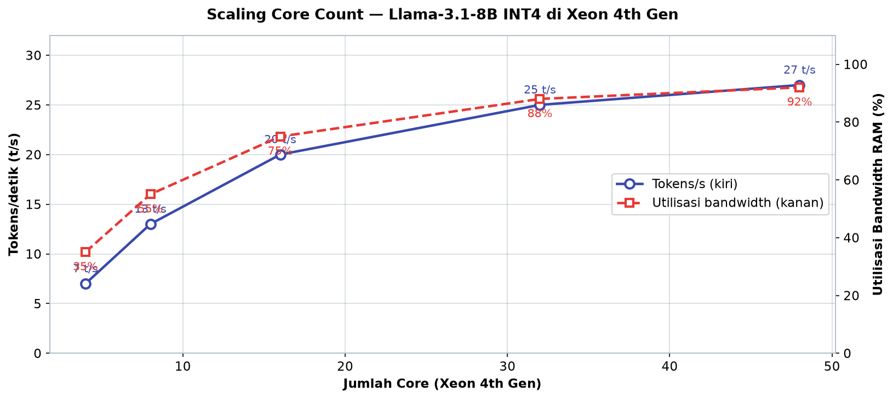
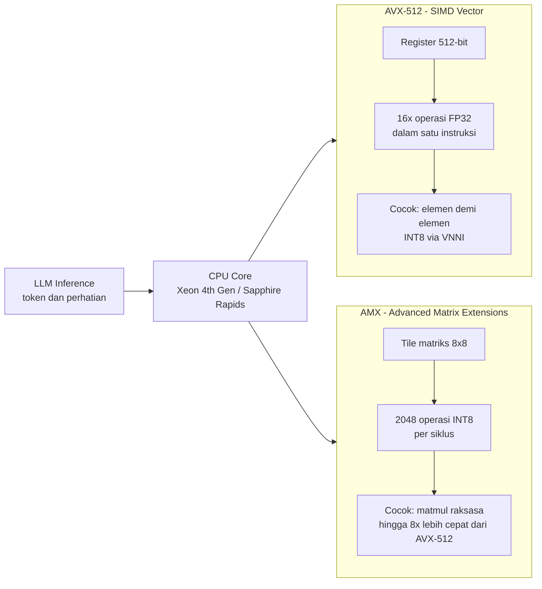

# Bab 2.5: CPU-Only Inference

> Ada kalanya GPU bukan sebuah pilihan: laptop kantor, server malam hari, atau anggaran yang habis untuk hal lain. Namun "tanpa GPU" bukan berarti "tanpa LLM". Dengan instruksi vektor seperti AVX-512 dan AMX di CPU modern, plus RAM DDR5 yang lebar, model 7B hingga 14B tetap bisa berbicara — pelan, tetapi fasih. Bab ini mengupas mengapa CPU lambat namun layak, apa yang membuatnya lebih cepat, dan bagaimana konfigurasi RAM menentukan segalanya — sekaligus menjadi jembatan menuju bab-bab berikutnya yang menuntun Anda ke jalur GPU, multi-GPU, dan akhirnya perhitungan biaya listrik.

---

## 1. Tujuan Sub-Bab


Setelah membaca bab ini, Anda akan mampu:

- Menjelaskan mengapa inferensi LLM di CPU lambat, dan kapan ia tetap menjadi pilihan rasional
- Memahami peran instruksi vektor (AVX-512, AMX, VNNI) dalam mempercepat operasi matriks
- Mengonfigurasi RAM (DDR5, jumlah *channel*, kecepatan) secara optimal untuk CPU inference
- Membandingkan framework CPU inference seperti llama.cpp, IPEX, dan xFasterTransformer
- Membaca dan menafsirkan benchmark token/s pada berbagai generasi CPU

---

## 2. Mengapa CPU Inference Lambat — Tetapi Layak


### Ribuan Core versus Puluhan Core

GPU dan CPU bekerja dengan filsafat yang berlawanan. GPU mendekati operasi matriks — makanan pokok LLM — dengan ribuan core kecil yang bekerja serentak: RTX 4090 memiliki lebih dari 16.000 CUDA core. CPU, bahkan kelas workstation, hanya memiliki puluhan core — Xeon kelas atas sekitar 48 hingga 64 core. Bagi LLM yang setiap lapisnya adalah perkalian matriks raksasa, jumlah jalur paralel ini adalah segalanya. Itulah alasan pertama mengapa inferensi di CPU terasa seperti mengayuh sepeda di samping mobil sport.

Namun perlu keadilan bagi CPU: ia tidak dirancang untuk pekerjaan ini sejak awal. Arsitektur CPU berakar pada *latency* — mengeksekusi satu aliran instruksi secepat mungkin sambil mengubah-ubah tugas secara acak, dari *spreadsheet* ke *browser* ke email — sementara GPU lahir untuk *throughput*: menyelesaikan jutaan operasi seragam. Ketika kita memaksa CPU menjalankan LLM, kita pada dasarnya meminta seorang *polymath* berdiri di jalur produksi pabrik. Ia bisa melakukannya, tetapi bukan itu keahliannya — dan perbedaan keahlian inilah yang menjelaskan angka-angka token/s yang akan Anda lihat sepanjang bab ini.

Namun CPU menyimpan kartu truf yang justru tidak dimiliki kebanyakan GPU: **akses ke RAM raksasa**. GPU diikat oleh VRAM-nya sendiri (8-24 GB untuk kelas konsumen), sementara CPU bisa menjangkau 64 hingga 512 GB DDR5 melalui motherboard. Artinya, model yang mustahil dimuat ke VRAM — seperti Qwen 2.5 (14B) dalam presisi penuh atau bahkan model 70B terkuantisasi — masih bisa dijalankan sepenuhnya di RAM. Inilah alasan kedua: CPU tidak bisa lari kencang, tetapi ia bisa membawa barang yang jauh lebih berat.

### Angka Realitas: Lambat, Tapi Feasible

Sebagaimana diukur komunitas, inferensi CPU-only memberikan sekitar **5-20 token/s untuk model 7B**, dan turun ke **1-3 token/s untuk model 70B** [1][4]. 20 token/s berarti sekitar 900 kata per menit — jauh di bawah kecepatan GPU, tetapi tetap setara mengetik manusia yang sangat cepat. Untuk percakapan interaktif ringan, hal ini terasa nyaman; untuk pemrosesan batch atau *dashboard* multi-user, ia kurang memadai. Di sinilah peta penggunaannya: server yang hanya aktif malam hari, laptop tanpa GPU, dan pengguna dengan *budget* rendah yang tetap ingin merasakan LLM lokal.

Penting juga menetapkan ekspektasi yang jujur sejak awal. Pada kecepatan 5-10 t/s, percakapan terasa seperti *chatting* yang "berpikir lama" sebelum menjawab — masih nyaman untuk asisten yang menjawab paragraf pendek, tetapi kurang ideal untuk *code completion* real-time atau *autocomplete* yang menuntut respons di bawah satu detik. Pada 15-20 t/s (Xeon generasi baru dengan AMX), pengalaman sudah mendekati GPU kelas menengah untuk model 7-8B. Dan di kecepatan 1-3 t/s untuk model 70B, yang realistis hanyalah *offline processing* — biarkan berjalan semalaman untuk meringkas dokumen, bukan berdialog. Menetapkan ekspektasi di awal akan menyelamatkan Anda dari kekecewaan, dan membantu memilih orientasi mesin: *interactive* atau *batch*.

Apa saja beban kerja nyata yang cocok untuk CPU-only? Tiga contoh paling umum: **asisten pribadi ringan** di laptop kantor — menjawab pertanyaan, meringkas email, menulis draf — di mana 8-12 t/s sudah lebih dari cukup untuk satu pengguna; **server batch malam hari** yang menjalankan RAG, *data extraction*, atau *evaluation* ribuan dokumen saat semua orang tidur; dan **uji coba model** — para pengembang yang ingin menguji beberapa arsitektur sebelum memutuskan membeli GPU. Ketiganya berbagi satu sifat: toleran terhadap *latency* tinggi, tetapi sensitif terhadap harga. Di sinilah CPU menunjukkan keunggulan sejatinya: bukan soal siapa tercepat, melainkan siapa yang bisa membawa pulang pekerjaan dengan biaya paling rendah.

Sebelum membaca tiga tabel berikut, ada baiknya menyegarkan satu kerangka: **tabel pertama membandingkan "siapa pelakunya" (CPU), tabel kedua "bagaimana pelakunya bekerja" (kuantisasi), dan tabel ketiga "berapa banyak pelaku yang berguna" (scaling core)**. Ketiganya saling melengkapi — dan temuan dari satu tabel sering menjelaskan keanehan di tabel lain, seperti yang akan kita lihat pada analisis setelah masing-masing tabel.

### Tabel 1: Perbandingan CPU untuk Inferensi LLM

Tabel berikut merangkum tujuh platform perwakilan — dari CPU konsumen hingga workstation — lengkap dengan dukungan SIMD, unit matriks, bandwidth memori, harga indikatif, dan performa token/s untuk model 7B Q4.

| CPU | Microarch | SIMD | Matrix Unit | Max RAM | Memory BW | Cores | Harga (Rp) | Tokens/s 7B Q4 |
|:---|:---:|:---:|:---:|:---:|:---:|:---:|---:|---:|
| **Intel i5-13400** | Raptor Lake | AVX2 | - | DDR5-4800 128GB | ~76 GB/s | 10C/16T | ~3 jt | ~4 t/s |
| **Intel i7-14700K** | Raptor Lake | AVX-512 | - | DDR5-5600 192GB | ~90 GB/s | 20C/28T | ~5 jt | ~6 t/s |
| **AMD Ryzen 9 7950X** | Zen 4 | AVX-512 | - | DDR5-5200 128GB | ~83 GB/s | 16C/32T | ~7 jt | ~5 t/s |
| **Intel Xeon 4th Gen** | Sapphire Rapids | AVX-512 | AMX | DDR5-4800 2TB | ~200 GB/s (quad) | 32C/64T | ~15 jt | ~15 t/s |
| **Intel Xeon 5th Gen** | Emerald Rapids | AVX-512 | AMX | DDR5-5600 2TB | ~250 GB/s (quad) | 48C/96T | ~25 jt | ~20 t/s |
| **AMD Threadripper 7980X** | Zen 4 | AVX-512 | - | DDR5-5200 512GB | ~170 GB/s (quad) | 64C/128T | ~45 jt | ~12 t/s |
| **Apple M4 Pro** | ARM | NEON | AMX | LPDDR5-6400 48GB | ~270 GB/s | 14C | ~25 jt (system) | ~40 t/s |

Baca tabel ini dengan dua poros. Poros pertama: **AMX adalah pembeda utama** — Xeon 4th Gen mencapai 15 t/s meskipun bandwidth-nya (~200 GB/s) hanya sedikit di atas Threadripper (~170 GB/s), justru karena keberadaan unit matriks AMX. Poros kedua: **bandwidth memori mengalahkan jumlah core** — Ryzen 9 7950X (16 core, 83 GB/s) kalah dari i7-14700K (20 core, 90 GB/s) dan jauh dari M4 Pro yang hanya 14 core tetapi menikmati ~270 GB/s serta unit matriks andal berkat LPDDR5-6400. Perhatikan juga nilai per rupiah: Xeon 4th Gen bekas server sekitar Rp 15 juta memberikan 15 t/s — *value* terbaik tabel untuk pengguna serius. Apple M4 Pro, meskipun tercatat sebagai "system" Rp 25 juta, mengalahkan semua CPU x86 dalam token/s — topik yang akan kembali dibahas di Bab 2.7 dari sudut efisiensi energi.

Tabel ini juga mengajarkan cara membaca *spec sheet* dengan skeptis. Lihat Ryzen 9 7950X: 16 core, *clock* tinggi, mendukung AVX-512 — di atas kertas terlihat seperti pilihan terbaik di kelasnya, tetapi kapasitas *bandwidth* ~83 GB/s membuatnya "lapar data". Sementara itu i7-14700K dengan bandwidth ~90 GB/s dan AVX-512 unggul tipis dalam token/s. Bagi pembaca yang sedang memilih CPU bekas di pasaran lokal, urutan yang disarankan: **cari AMX dulu, bandwidth kedua, core ketiga** — aturan yang jarang diungkapkan pada ulasan CPU konsumen yang masih berfokus pada FPS game, bukan token/s.


---

## 3. AVX-512 dan AMX: Akselerasi Matriks di CPU


### AVX-512: Satu Instruksi, Banyak Data

Kunci membuat CPU "tidak sepenuhnya lambat" adalah **instruksi vektor**. AVX-512 (*Advanced Vector Extensions 512-bit*) adalah perpanjangan set instruksi Intel yang memproses 512-bit data dalam satu instruksi — setara **16 operasi FP32 per instruksi**, dibandingkan 4 pada generasi SSE lama. Prinsip ini disebut SIMD (*Single Instruction, Multiple Data*): satu perintah, banyak data sekaligus. Dengan AVX-512, perkalian matriks dalam *attention layer* dipecah menjadi baris demi baris yang diproses paralel, mempercepat bagian komputasi paling dominan dalam inferensi [3].

AVX-512 hadir sejak Skylake-X dan matang di generasi Ice Lake hingga Sapphire Rapids. Ada keluarga kecil di dalamnya yang khusus untuk *inference*: **VNNI** (*Vector Neural Network Instructions*) memperkenalkan *fused multiply-add* untuk INT8 — perkalian dan penjumlahan dalam satu instruksi untuk data 8-bit. Karena *inference* yang terkuantisasi bekerja pada INT8, VNNI secara praktis melipatgandakan kecepatan pemrosesan bilangan bulat [3]. Di CPU modern, memastikan optimasi VNNI aktif adalah "menginjak pedal gas" pertama Anda.

Satu detail penting yang sering membuat orang bingung: **keberadaan AVX-512 di CPU tidak otomatis berarti framework menggunakannya**. Runtime seperti llama.cpp melakukan *dispatch* saat startup — memeriksa set instruksi yang didukung prosesor, lalu memilih kernel yang sesuai (jadi ada kernel AVX2, kernel AVX-512, hingga kernel AMX yang terpisah). Jika build Anda dikompilasi tanpa dukungan AVX-512, CPU yang sehebat apa pun akan tetap berjalan dengan kernel AVX2 yang lebih lambat. Inilah alasan langkah verifikasi `--verbose` di praktikum seksi 8 tidak boleh dilewati: memastikan kode yang benar-benar berjalan adalah kode yang sesuai dengan konfigurasi build Anda — bukan sekadar keyakinan bahwa CPU "mendukungnya".

### AMX: Alat Berat Khusus Matriks

Jika AVX-512 adalah mobil sport, **AMX** (*Advanced Matrix Extensions*) adalah truk pengangkut berton-ton. AMX menambahkan unit matriks *dedicated* di dalam core — beroperasi pada *tile* 8x8 — dan dapat mengeksekusi hingga **2.048 operasi INT8 per siklus** [9]. Untuk *matmul*, inti komputasi semua LLM, AMX dilaporkan hingga **8x lebih cepat daripada AVX-512** di *microarchitecture* Sapphire Rapids [4]. Dialah alasan utama mengapa Xeon generasi ke-4 dan ke-5 menjadi GPU diskrit paling murah yang pernah ada: mereka bukan GPU, tetapi membawa akselerator matriks bawaan.

Membedakan generasi menjadi mudah dengan lensa ini: Ice Lake dan pendahulunya hanya memiliki AVX-512; Sapphire Rapids (Xeon 4th Gen) dan Emerald Rapids (Xeon 5th Gen) menambahkan AMX. Perbedaan inilah yang Anda lihat pada data benchmark — Xeon 4th Gen mencapai sekitar 15 t/s untuk 7B Q4, dan Xeon 5th Gen naik ke sekitar 20 t/s, sementara CPU generasi sebelumnya bertengger di angka yang lebih rendah [1].

Perlu dicatat bahwa AMX bukan fitur *software* yang bisa ditambahkan lewat *update* — ia adalah sirkuit fisik di dalam silikon. CPU generasi lama tidak akan pernah mendapatkan AMX, sehebat apa pun *firmware*-nya. Ini berarti keputusan membeli CPU adalah keputusan satu arah: membeli Xeon Ice Lake hari ini berarti mengunci diri tanpa AMX untuk bertahun-tahun, sedangkan Sapphire Rapids membuka jalan menuju optimasi *inference* yang terus berkembang. Bagi pengguna yang sedang menimbang CPU bekas server, ini adalah pertanyaan pertama yang harus diajukan: *"apakah prosesor ini mendukung AMX?"* — sebelum melihat jumlah core atau harga.

---

## 4. DDR5 vs DDR4: Bandwidth Adalah Segalanya


### Mengapa Memory-Bound?

Inferensi LLM di CPU memiliki karakter unik: ia **memory-bound**, bukan compute-bound. Model harus mengalirkan seluruh weights dari RAM ke core untuk setiap token — dan aliran inilah yang menjadi kemacetan, bukan kemampuan core menghitung. Bandwidth RAM karena itu adalah metrik penentu: menggandakan bandwidth cenderung menggandakan token/s.

Untuk memahami intuisi ini, bayangkan seorang juru masak yang harus mengambil bahan dari lemari es di ujung dapur: sehebat apa pun keterampilannya mengolah, kecepatan hidangannya dibatasi oleh seberapa cepat ia bolak-balik membawa bahan. Di LLM, core adalah juru masak, RAM adalah lemari es, dan *bandwidth* adalah lebar pintu dapurnya. Menambah core tidak akan mempercepat hidangan jika pintunya tetap sama — dan inilah mengapa seluruh pembahasan bab ini bermuara pada satu angka: berapa GB/s yang bisa dialirkan mesin Anda.

DDR5 menawarkan **4800-6400 MT/s**, dan konfigurasi dual channel standar menghasilkan sekitar **100 GB/s**. Pendahulunya, DDR4, bertahan di **3200 MT/s** dengan sekitar **50 GB/s** untuk dual channel — setengahnya. Dalam bahasa token: konfigurasi dual channel DDR5 kurang-lebih menggandakan kecepatan inferensi dibanding DDR4 dengan CPU yang sama [2]. Di kelas workstation, *quad channel* — seperti DDR5-6000 pada Xeon workstation — menawarkan sekitar **192 GB/s**, angka yang sudah menyentuh wilayah GPU kelas entry [4].

Ada perangkap kecil yang layak diwaspadai saat membangun untuk inferensi: **perbedaan antara kapasitas dan bandwidth**. Kapasitas menentukan model apa yang *muat*; bandwidth menentukan seberapa cepat ia *berjalan*. 128 GB DDR5 single *channel* akan memuat model 70B dengan nyaman, tetapi hanya menikmati setengah bandwidth dari konfigurasi 64 GB dual *channel* — dan token/s-nya akan menyedihkan. Urutan prioritas yang benar: *channel* penuh dulu, kecepatan kedua, baru kapasitas. Aturan jempol ini juga menjelaskan mengapa banyak pengguna CPU-only "kecewa" setelah upgrade RAM besar-besaran: mereka menambah kapasitas, bukan lebar jalur — dan token/s tidak bergerak sedikit pun.

Peringatan terakhir untuk penggemar model MoE: **CPU hanya mampu membawa model kecil**. Model MoE raksasa baru — DeepSeek V4 Flash (284B) atau Mistral Large 3 (675B) — membutuhkan *bandwidth* di atas **500 GB/s** hanya untuk menjaga parameter aktifnya tetap mengalir; angka ini jauh melampaui ~250 GB/s Xeon kelas atas sekalipun. Di CPU, model-model itu akan berjalan di kecepatan yang tidak dapat dipakai, atau bahkan gagal berjalan sama sekali. Hal yang sama berlaku untuk model dense 70B+: secara teknis muat di RAM besar, tetapi kecepatan 1-3 t/s membuatnya hanya berguna untuk *batch*. Di sinilah batas jujur teknologi ini — dan pengingat bahwa untuk model raksasa, GPU dengan HBM atau Apple Silicon dengan *unified memory* adalah satu-satunya tuan rumah yang layak.

### Membaca Tabel: Bukan Semua Core Sama

Ada perangkap menarik yang harus diwaspadai: tidak semua CPU "banyak core" itu cepat. Ryzen 9 7950X dengan 16 core hanya mencapai sekitar 5 t/s untuk 7B Q4, sementara i7-14700K dengan 20 core mencapai sekitar 6 t/s — keduanya kalah dari Xeon dengan AMX yang "hanya" 4 t/s lebih banyak jalur bus memori. Core yang banyak pun tetap menganggur jika RAM tidak bisa menyuplai data. Inilah yang akan tampak dengan sangat jelas di tabel scaling core pada seksi 2: menambah core dari 32 ke 48 hanya menaikkan throughput dari 25 ke 27 t/s — *diminishing returns* yang murni disebabkan bottleneck bandwidth.

Saat membandingkan angka-angka ini, perhatikan juga bahwa *bandwidth* yang dikutip tabel adalah angka teoretis maksimum; DDR5 di dunia nyata memberikan sekitar 80-90% dari angka tersebut tergantung *timing* dan *platform*. Dua sistem dengan spesifikasi RAM identik di atas kertas bisa berbeda nyata jika satu menggunakan profil XMP/EXPO dan satunya lagi berjalan di *default* JEDEC — perbedaan yang sering setara 10-20% token/s. Karena itu, jangan pernah mempercayai klaim "saya sudah DDR5" tanpa mengukur; STREAM di praktikum seksi 8 akan menjadi wasit yang adil.

---

## 5. Framework CPU Inference


### llama.cpp: Sang Universal

Saat berbicara CPU-only, nama pertama yang muncul adalah **llama.cpp** — framework yang membawa LLM ke perangkat tanpa GPU. Ia mendukung *backend* CPU dengan AVX2, AVX-512, dan AMX, memanfaatkan *BLAS* (OpenBLAS atau MKL), serta membaca model melalui *mmap* langsung dari disk. Semua format GGUF populer jalan di sini, dari Llama 3.1 (8B) hingga model MoE seperti DeepSeek V4 Flash — meskipun kecepatannya untuk model raksasa akan kita bahas dengan jujur di studi kasus. [8]

### IPEX dan xFasterTransformer: Rute Intel

Bagi pengguna ekosistem PyTorch, **Intel Extension for PyTorch (IPEX)** [6] adalah jalur resmi: ia mengoptimalkan operasi matriks untuk CPU Intel, mendukung teknik *INT4 weight-only quantization*, dan cukup dengan `ipex.optimize(model)` untuk mengaktifkan seluruh optimasi — seperti yang akan kita praktikkan di seksi 8. Sementara itu, **xFasterTransformer** [7] melangkah lebih jauh ke arah *distributed inference*: ia dirancang untuk menjalankan LLM di *cluster* CPU Intel, membagi model lintas banyak mesin. Keduanya menjawab kebutuhan berbeda: satu pengguna individu, satu organisasi.

### Sandwich: Serving Engine Baru

Penelitian terbaru di EuroSys 2025 membawa harapan baru: **Sandwich** [5], sebuah *CPU serving engine* yang melakukan *hardware-centric tuning* — membangun ulang tumpukan *serving* dari bawah dengan memahami karakteristik perangkat keras. Hasilnya dilaporkan mencapai **2,01x throughput** dibanding *baseline*, dievaluasi pada AVX-512 dan ARM NEON [5]. Ini bukti bahwa ruang optimasi CPU masih luas, dan lambatnya CPU hari ini bukanlah takdir permanen.

Yang menarik dari Sandwich dan karya-karya sejenisnya: mereka memperlakukan CPU bukan sebagai "GPU yang gagal", melainkan sebagai perangkat dengan kekuatan uniknya sendiri — *hardware-centric* berarti menyesuaikan *software* dengan karakter CPU, bukan memaksakan pola GPU. Evaluasi pada ARM NEON sekaligus menandakan bahwa masa depan CPU *inference* tidak hanya milik Intel: Apple Silicon, dan prosesor ARM server, membangun jalur optimasi mereka sendiri. Bagi pembaca buku ini, keberadaan riset ini adalah jaminan: investasi pada CPU untuk LLM tidak akan membeku, melainkan terus mendapat suntikan dari dunia riset sistem.

### Memilih Framework: Petunjuk Praktis

Lantas, framework mana yang harus Anda pilih? Jawabannya tergantung pada satu pertanyaan sederhana: *apa yang Anda jalankan, dan untuk siapa?* Jika Anda memakai model GGUF di mesin tunggal — skenario paling umum bagi pembaca buku ini — **llama.cpp** adalah pilihan utama: paling matang, paling cepat untuk ukuran model 7-14B, dan mendukung *mmap* yang berpadu baik dengan pembahasan storage di Bab 2.4. Jika Anda bekerja dengan pipeline PyTorch dan membutuhkan *fine-tuning* ringan atau integrasi dengan ekosistem Hugging Face, **IPEX** menawarkan kenyamanan *one-liner optimization* dengan biaya sedikit fleksibilitas. Dan jika tujuannya adalah melayani banyak pengguna di *cluster* beberapa mesin — kasus yang jarang bagi pengguna rumahan — **xFasterTransformer** adalah arah yang lebih tepat daripada memaksakan llama.cpp pada *multi-node* yang tidak dirancang untuk itu. Pilihan framework adalah bagian dari "sistem" yang Anda bangun; mengubahnya di tengah perjalanan selalu lebih mahal daripada memilih dengan benar sejak awal.

### Tabel 2: Pengaruh Kuantisasi pada CPU Inference

Tabel ini mengukur efek kuantisasi pada Llama 3.1 (8B) yang dijalankan di Xeon 4th Gen — model yang sama, hanya presisinya yang berubah.

| Kuantisasi | Ukuran Model | Tokens/s | Perplexity Loss |
|:---|---:|---:|---:|
| **FP32** | 32 GB | ~4 t/s | 0 (baseline) |
| **FP16** | 16 GB | ~7 t/s | ~0,01 |
| **INT8 (W8A16)** | 8 GB | ~12 t/s | ~0,05 |
| **INT4 (W4A16)** | 4 GB | ~18 t/s | ~0,2 |
| **INT4 (W4A16 + AMX)** | 4 GB | ~25 t/s | ~0,2 |

Tabel ini adalah argumen paling kuat untuk kuantisasi. Dari FP32 ke INT4, *throughput* naik 4,5x (4 → 18 t/s) sementara *perplexity loss* hanya ~0,2 — penurunan kualitas yang hampir tak terasa secara subjektif [1]. Mengaktifkan AMX di atasnya menaikkan lagi ke 25 t/s. Di sisi lain: ukuran model menyusut drastis dari 32 GB ke 4 GB, berarti model yang tadinya butuh 32 GB kini muat di RAM yang lebih kecil — data lengkap yang saling menguatkan. Perlu ditegaskan bahwa *perplexity loss* adalah metrik kualitas global; pada tugas percakapan sehari-hari, perbedaan 0,2 poin praktis tidak terdengar, dan inilah mengapa INT4 menjadi *default* hampir semua pengguna CPU-only.

Perhatikan pola yang lebih halus di balik angka: setiap langkah kuantisasi memberikan lonjakan *throughput* yang semakin mengecil — FP32 ke FP16 menaikkan ~1,75x, FP16 ke INT8 ~1,7x, INT8 ke INT4 ~1,5x — sementara *perplexity loss* semakin membesar. Bentuk kurva ini adalah garis *diminishing returns* khas kuantisasi: keuntungan terbesar justru datang dari langkah yang paling tidak merusak (FP32 → FP16 → INT8), dan langkah terakhir ke INT4 adalah keputusan yang menukar sedikit kualitas untuk kecepatan. Bila model Anda sudah di INT4 dan masih lambat, jalan selanjutnya bukan INT2 yang lebih ekstrem, melainkan *hardware* — atau menerima kenyataan bahwa model itu memang di luar kemampuan mesin Anda.


---

## 6. Benchmark CPU Inference per Generasi


Pola antar generasi dapat dibaca dari data benchmark [1][4]: Skylake (generasi AVX-512 awal) menjadi dasar, Ice Lake memperbaiki eksekusi vektor dan menambah VNNI, Sapphire Rapids menambahkan AMX dengan lonjakan ~8x pada *matmul*, dan Emerald Rapids memoles segalanya dengan lebih banyak core serta bandwidth DDR5-5600 quad channel. Kuantisasi adalah pengali penting di semua generasi: teknik *INT4 weight-only* dapat meningkatkan *throughput* **3-4x** dibanding FP32 tanpa penurunan kualitas yang berarti [1].

Membaca laju antar generasi tidak ubahnya membaca tangga: Skylake adalah anak tangga pertama, Ice Lake anak tangga kedua yang meyakinkan, Sapphire Rapids justru lompatan besar (AMX mengubah cara matriks dikalikan, bukan sekadar lebih cepat), dan Emerald Rapids adalah pijakan terhalus sejauh ini. Yang menarik, lompatan ini tidak selalu bergantung pada *clock* — generasi baru Xeon bahkan sering ber-*clock* lebih rendah demi efisiensi — melainkan pada kemampuan mengeksekusi lebih banyak operasi per siklus dan menyuplai lebih banyak data per detik. Inilah alasan mengapa membeli CPU "tahun lalu" untuk inferensi bisa terasa seperti membeli jalan tol yang belum jadi: spesifikasi inti hampir sama, tetapi akselerator dan *bandwidth* yang berbeda membuat perbedaan besar pada token/s.

Intinya, benchmark memperlihatkan bahwa untuk CPU *inference*, **generasi lebih penting daripada kelas**. Xeon 4th Gen kelas *entry* dengan AMX bisa mengalahkan CPU konsumen kelas atas generasi sebelumnya yang tanpa AMX — yang pada gilirannya menyarankan strategi belanja yang mungkin terbalik dari kebiasaan: untuk workload LLM, membeli CPU satu-dua generasi tertinggal di kelas *workstation* sering lebih masuk akal daripada membeli CPU konsumen terbaru di kelas teratas.

Di sisi konsumen, i5-13400 (10 core, AVX2 saja) menghasilkan sekitar 4 t/s; i7-14700K (20 core, AVX-512) sekitar 6 t/s; dan Ryzen 9 7950X (16 core, AVX-512) sekitar 5 t/s. Di kelas workstation, Xeon 4th Gen mencatat sekitar 15 t/s dan Xeon 5th Gen sekitar 20 t/s untuk 7B Q4 [1]. Angka ini menjadi jangkar ketika Anda membaca tabel perbandingan di seksi 2 — dan ketika memutuskan CPU mana yang layak dibeli.

Perhatikan bagaimana angka-angka ini bercerita tentang *efisiensi per core*. i7-14700K menghasilkan ~6 t/s dari 20 core — sekitar 0,3 t/s per core; Xeon 4th Gen menghasilkan ~15 t/s dari 32 core — sekitar 0,47 t/s per core. Xeon hampir 60% lebih efisien per core, bukan karena core-nya lebih cepat, melainkan karena AMX menggandakan kerja *matmul* per siklus. Ukuran "token per core" semacam ini adalah lensa yang lebih adil untuk membandingkan CPU dari generasi berbeda daripada sekadar melihat *clock* atau jumlah core — dan menjawab mengapa dua CPU dengan harga serupa bisa memiliki performa LLM yang sangat berbeda.

---

## 7. Panduan Memilih CPU untuk Inference


Jika Anda berencana membangun mesin CPU-only untuk LLM, urutkan prioritas berikut. **Pertama**, dukungan AMX — utamakan Intel Sapphire Rapids (Xeon 4th Gen) ke atas; inilah pembeda 2-3x di kelas mainstream-to-workstation. **Kedua**, jumlah core di kisaran **16-32 core** — ini adalah *sweet spot*; melampauinya tidak menambah banyak jika bandwidth RAM sudah jenuh, seperti yang ditunjukkan tabel scaling. **Ketiga**, RAM DDR5 **dual atau quad channel** dengan minimal **64 GB** untuk model 7-14B — dan ingat, bandwidth lebih penting daripada kapasitas untuk kecepatan token. **Alternatif** bagi yang menyukai AMD: **Threadripper** menawarkan banyak *PCIe lanes* dan dukungan *quad channel* DDR5, meskipun tanpa AMX; M4 Pro dari Apple adalah kasus spesial yang akan kita bandingkan di tabel — ARM dengan bandwidth luar biasa (~270 GB/s) yang mencapai sekitar 40 t/s untuk 7B Q4 [1].

Terakhir, satu pertimbangan yang sering dilupakan: **profil beban Anda menentukan kategori CPU yang tepat**. Server yang menjalankan satu model untuk banyak pengguna akan lebih diuntungkan oleh Xeon dengan AMX walau mahal — karena *throughput* agregatlah yang dijual. Laptop atau desktop pribadi yang hanya membutuhkan satu percakapan pada satu waktu cukup ditopang i7 kelas menengah dengan AVX-512 — tidak perlu *workstation* yang boros. Keputusan ini pun berinteraksi dengan Bab 2.7: konsumsi daya CPU yang lebih kecil (misalnya 150W berbanding 350W GPU) berarti biaya listrik bulanan yang jauh lebih ringan, membuat CPU inference makin menarik untuk server yang menyala terus-menerus.

Bagi pengguna laptop — dan ini mungkin mayoritas pembaca — ada satu kabar penenang: hampir semua laptop modern dengan CPU Intel 12th Gen ke atas atau AMD Zen 4 mendukung AVX-512 atau setidaknya AVX2 yang memadai untuk menjalankan model 3-8B di atas RAM 16-32 GB. Kecepatannya mungkin 3-6 t/s — cukup untuk *drafting*, ringkasan, dan percakapan santai di sela perjalanan. Jika laptop Anda Apple Silicon, bab ini tetap berlaku untuk memahami inti teknologinya, tetapi angka token/s Anda akan jauh lebih baik daripada tabel x86 — M4 Pro bahkan menembus 40 t/s untuk 7B Q4 [1], dengan *bandwidth* LPDDR5 yang luar biasa sebagai rahasianya.

Satu saran belanja penutup yang sangat relevan untuk pembaca di Indonesia: pasar **Xeon refurbished** dari server bekas merupakan celah harga yang menarik — server bekas lengkap dengan Xeon 4th Gen dan RAM besar sering ditemukan di kisaran Rp 15 juta, jauh di bawah harga komponen barunya. Sebelum membeli, pastikan tiga hal: prosesor benar-benar generasi Sapphire Rapids (bukan versi lama dengan nama mirip), jumlah modul RAM memastikan semua *channel* terisi, dan *BIOS* mendukung fitur yang dibutuhkan. Server bekas adalah jalan pintas penghematan yang sah — selama Anda membeli dengan mata terbuka, bukan sekadar mengejar label "Xeon".

### Tabel 3: Scaling Core Count vs Tokens/s

Terakhir, tabel ini memperlihatkan apa yang terjadi ketika Xeon 4th Gen menjalankan Llama 3.1 (8B) INT4 dengan jumlah core yang berbeda-beda.

| Core Count | Tokens/s | BW Utilization | Scaling Efficiency |
|:---:|---:|---:|---:|
| 4 | 7 t/s | 35% | - |
| 8 | 13 t/s | 55% | 93% |
| 16 | 20 t/s | 75% | 71% |
| 32 | 25 t/s | 88% | 56% |
| 48 | 27 t/s | 92% | 40% |



*Gambar 2.5-1 — Diminishing returns terlihat jelas: dari 32 ke 48 core hanya bertambah 2 t/s (25→27 t/s) karena RAM sudah jenuh mensuplai data (utilisasi bandwidth 92%); menambah core di atas 32 lebih baik diganti RAM yang lebih cepat.*

Ini adalah kurva *diminishing returns* dalam bentuk angka. Menambah core dari 4 ke 8 hampir sempurna (efisiensi 93%), tetapi dari 32 ke 48 hanya menaikkan 2 t/s dengan efisiensi merosot ke 40% — karena seluruh sistem mulai bergantung pada kemampuan RAM menyuplai data (utilisasi bandwidth 92%). Pelajaran berharganya: jangan membeli CPU 48-core "untuk AI" jika mesin Anda hanya akan menjalankan LLM — mulai core 32 ke atas, uang Anda lebih baik dibelikan RAM yang lebih cepat atau *channel* yang lebih banyak [4].

Tabel ini sekaligus menyediakan jawaban bagi pertanyaan klasik forum: *"kalau dua CPU socket dengan total 96 core, apakah dua kali lipat?"* Tidak juga — karena *bandwidth* tetap menjadi leher botol, meskipun NUMA memungkinkan setiap socket mengakses RAM-nya sendiri. Dalam praktik, konfigurasi dual-socket memang menambah *bandwidth* agregat, tetapi komunikasi antar *socket* memperkenalkan *overhead* baru, dan efisiensi scaling umumnya lebih buruk daripada kurva pada tabel ini. Pesan yang konsisten di semua tingkat: **dalam inferensi CPU, RAM adalah panggungnya, core hanyalah penari** — panggung yang sempit akan membatasi berapa pun penari yang Anda sewa.

---


### Gambar 1: Arsitektur SIMD vs Matrix Unit

Diagram berikut membandingkan dua jalur akselerasi di CPU modern: AVX-512 yang mengolah vektor lebar, dan AMX yang mengolah matriks dalam tile.



Pesan diagram ini adalah pembagian kerja: AVX-512 menangani pemrosesan vektor yang lebih fleksibel, sementara AMX adalah palu godam khusus perkalian matriks — operasi yang mendominasi *inference*. Karena hampir seluruh flop LLM adalah *matmul*, kehadiran AMX di Sapphire Rapids dan setelahnya menjelaskan lonjakan token/s antara Intel generasi lama dan baru. Perhatikan juga garis VNNI di dalam AVX-512: ia membuat *inference* INT8 berjalan tanpa beban konversi yang berarti — pasangan yang sempurna dengan kuantisasi INT4 dari Tabel 2.

Bagi pembaca yang terbiasa dengan arsitektur GPU, diagram ini menawarkan paralel yang mencerahkan: AMX pada CPU adalah saudara jauh dari **Tensor Core** pada GPU — keduanya adalah unit khusus yang mendedikasikan sirkuitnya untuk operasi matriks, jauh lebih efisien daripada memaksakan instruksi vektor biasa. Perbedaannya terletak pada skala: Tensor Core GPU bekerja dengan matriks yang jauh lebih besar dan *bandwidth* HBM yang berlipat, sementara AMX "hanya" mengangkat beban 2048 operasi per siklus. Namun arahnya sama — dan memahami garis ini membantu Anda menilai kapan CPU dengan AMX cukup (model ≤14B) dan kapan GPU tak tergantikan (model raksasa), seperti yang akan dipertegas studi kasus di akhir bab.

---


---

## 8. Praktikum: Membangun dan Mengukur Mesin CPU-Only


### Langkah 1: Install dan Benchmark llama.cpp CPU-only

Mari mulai dari fondasi: membangun llama.cpp dengan optimasi CPU dan mengukur performa model 7B.

```bash
# 1. Clone dan build dengan optimasi CPU
git clone https://github.com/ggerganov/llama.cpp
cd llama.cpp

# 2. Build default - AVX2 aktif untuk semua CPU modern
cmake -B build
cmake --build build --config Release

# 3. Untuk Intel dengan AMX (Sapphire Rapids ke atas), aktifkan AVX-512:
# cmake -B build -DLLAMA_AVX512=ON

# 4. Unduh model Llama-3.1-8B dalam format GGUF Q4_K_M
huggingface-cli download bartowski/Meta-Llama-3.1-8B-Instruct-GGUF \
    Meta-Llama-3.1-8B-Instruct-Q4_K_M.gguf

# 5. Benchmark: 512 token prompt, 256 token generate, semua core
./build/bin/llama-bench -m Meta-Llama-3.1-8B-Instruct-Q4_K_M.gguf \
    -ngl 0 -t $(nproc) -p 512 -n 256

# 6. Verifikasi instruksi yang aktif untuk build Anda
./build/bin/llama-bench --verbose 2>&1 | grep -i "avx\|amx\|f16c\|sse"
```

Pada langkah 6, perintah `grep` membuka "kartu identitas" build Anda: jika muncul `AVX512` dan CPU Anda Xeon 4th Gen ke atas, Anda sudah berada di jalur tercepat. Bandingkan output `-ngl 0` (semua di CPU) dengan tabel benchmark seksi 2 — Llama 3.1 (8B) Q4_K_M di i7-14700K seharusnya mendekati ~6 t/s, dan di Xeon dengan AMX mendekati ~15-20 t/s. Jika angka Anda jauh lebih rendah, cek suhu CPU dan *throttling* sebelum menyalahkan skrip.

Dua pilihan konfigurasi perlu dipahami sebelum menjalankan baris di atas. Pertama, `-ngl 0` menandakan *zero GPU layers* — semua lapisan dijalankan di CPU; jika nanti Anda menambahkan GPU, ganti dengan `-ngl 99` agar seluruh lapisan berpindah ke GPU dan pengukuran menjadi ukuran GPU, bukan CPU. Kedua, `llama-bench` membedakan *prompt processing* (prefill) dan *generation* (decode) dalam outputnya; pada CPU, angka yang paling relevan untuk pengalaman interaktif adalah *generation* — karena itulah denyut percakapan Anda. Jangan bingung bila bilangan prompt/s jauh lebih tinggi: itu mengukur fase prefill yang bersifat *batch*, bukan kecepatan token bergulir yang Anda rasakan.

### Langkah 2: Inferensi CPU dengan Intel Extension for PyTorch

Bagi yang tinggal di ekosistem Hugging Face, berikut jalur optimasi modern: IPEX dengan kuantisasi INT4 *weight-only*.

```python
# cpu_llm_inference.py - inferensi CPU dengan IPEX
import torch
import intel_extension_for_pytorch as ipex
from transformers import AutoTokenizer, AutoConfig, AutoModelForCausalLM

model_id = "Intel/neural-chat-7b-v3-1"
tokenizer = AutoTokenizer.from_pretrained(model_id)

# Load model dengan INT4 weight-only quantization
model = AutoModelForCausalLM.from_pretrained(
    model_id,
    torch_dtype=torch.bfloat16,
    load_in_4bit=True,
    device_map="cpu",
)

# Optimasi satu-baris dengan IPEX
model = ipex.optimize(model, dtype=torch.bfloat16)

# Inference
inputs = tokenizer("Saya adalah asisten AI", return_tensors="pt")
with torch.no_grad():
    outputs = model.generate(**inputs, max_new_tokens=50)
print(tokenizer.decode(outputs[0]))
```

Bandingkan eksekusi sebelum dan sesudah `ipex.optimize()`: perbedaan kecepatan biasanya langsung terasa karena IPEX menyusun ulang operasi matriks agar memanfaatkan VNNI/AMX dan *threading* Intel. Kuantisasi INT4 `load_in_4bit=True` memangkas ukuran model menjadi seperempat dari bfloat16 — persis prinsip Tabel 2 — dan sensasi "responsif" dari percakapan pendek akan membuktikan bahwa 7B di CPU bukanlah hal yang mustahil.

Jika Anda menemui *error* saat menjalankan skrip ini, periksa tiga hal berurutan: versi PyTorch (IPEX menuntut versi *matching* — periksa tabel kompatibilitas di repositori IPEX [6]), keberadaan `transformers` dan `accelerate`, serta flag `device_map="cpu"` yang memastikan seluruh layer tidak secara diam-diam ditarik ke CUDA. Model `Intel/neural-chat-7b-v3-1` dipilih karena merupakan model kecil yang dioptimalkan Intel dan tersedia luas; Anda bisa menggantinya dengan model favorit selama formatnya Hugging Face SafeTensors — karena kombinasi IPEX dengan GGUF adalah cerita yang berbeda, milik ekosistem llama.cpp. Setelah skrip berjalan, coba ubah `max_new_tokens` menjadi 200 dan amati bagaimana *import* model selesai sekali di awal, bukan setiap permintaan — pola yang penting untuk Anda ingat saat membangun layanan yang lebih besar di bab-bab berikutnya.

### Langkah 3: Cek Bandwidth RAM dengan STREAM

Bandwidth adalah segalanya di dunia ini — jadi ukur langsung milik Anda.

```bash
# Install dan jalankan STREAM benchmark
wget https://raw.githubusercontent.com/jeffhammond/STREAM/master/stream.c
gcc -O3 -fopenmp -DSTREAM_ARRAY_SIZE=200000000 -DNTIMES=20 stream.c -o stream

# Set jumlah thread sesuai core yang tersedia
export OMP_NUM_THREADS=$(nproc)
./stream

# Output: Copy, Scale, Add, Triad bandwidth dalam MB/s
# DDR5 dual channel yang baik: >80000 MB/s (80 GB/s)
# DDR5 quad channel (Xeon/Threadripper): >150000 MB/s (150 GB/s)
```

Interpretasi hasil STREAM sangat mudah: angka *Triad* (campuran baca-tulis paling representatif untuk LLM) di bawah 80.000 MB/s pada konfigurasi dual channel DDR5 berarti ada yang salah — mungkin RAM berjalan di kecepatan default JEDEC alih-alih XMP/EXPO, atau hanya satu *channel* yang terpasang. Pada tabel: hasil ~100 GB/s selaras dengan angka token/s yang Anda lihat di benchmark; hasil ~50 GB/s menandakan Anda praktis membuang setengah performa yang seharusnya Anda miliki. Satu pemeriksaan kecil di BIOS bisa bernilai puluhan persen kecepatan inferensi.

Perlu dicatat bahwa STREAM mengukur *raw bandwidth*, bukan *end-to-end* inferensi — ia adalah pengukur jalan raya, bukan pengukur perjalanan nyata. Namun, hubungan keduanya erat: pada workload *memory-bound* seperti LLM CPU, *throughput* token hampir selalu naik sebanding dengan hasil STREAM hingga titik jenuh core. Gunakan alat ini sebagai *diagnostic*: jika STREAM sehat tetapi llama.cpp tetap lambat, masalahnya ada di lapisan lain (kuantisasi, kernel, atau jumlah *thread*); jika STREAM sendiri sakit, perbaikilah BIOS, susunan RAM, atau *thermal* sebelum menyalahkan framework.

---

## 9. Studi Kasus: Server Inferensi CPU-only untuk Kantor Kecil


**Skenario.** Sebuah startup di Bandung ingin membangun *coding assistant* internal berbasis LLM untuk 15 orang developer, tetapi anggaran mereka hanya cukup untuk satu investasi hardware. GPU kelas atas seperti RTX 4090 berada di luar jangkauan (sekitar Rp 35 juta untuk satu PC lengkap), dan kebutuhan utama adalah model Qwen 2.5 (14B) yang baik untuk konteks kode berbahasa campuran.

**Keputusan hardware.** Mereka memilih server *refurbished* dengan **Intel Xeon 4th Gen (Sapphire Rapids) 32-core**, **128 GB DDR5 quad channel**, sekitar Rp 15 juta. Nilai kunci pilihan ini: AMX hadir bahkan pada Xeon 32-core, dan *quad channel* DDR5 memberikan pasokan bandwidth yang dibutuhkan dim *memory-bound* workload — pelajaran dari Tabel 3 yang mereka terapkan sejak awal dengan tidak menghabiskan anggaran untuk CPU banyak core.

Mengapa bukan i7-14700K yang lebih murah (sekitar Rp 5 juta untuk CPU-nya saja)? Jawabannya ada di Tabel 1: i7 hanya mendukung dua *channel* DDR5 (~90 GB/s), sementara Xeon workstation memberi empat *channel* sekaligus AMX. Dengan *bandwidth* yang hampir dua kali lipat dan unit matriks khusus, Xeon 32-core menghasilkan token/s yang mirip dengan i7 20-core, tetapi dengan ruang tambahan yang sangat berharga: hingga 2 TB RAM untuk ekspansi di masa depan, dan *ECC* untuk stabilitas server. Kehilangan *single-thread performance* memang nyata, tetapi tidak relevan bagi beban kerja yang murni *throughput* — keputusan yang kembali menegaskan urutan prioritas bab ini: AMX, *bandwidth*, lalu core.

**Konfigurasi dan performa.** Dengan llama.cpp CPU-only — INT4 quantization, AVX-512 + AMX aktif — server mencapai **sekitar 12 t/s untuk Qwen 2.5 (14B)**: cukup untuk *single-user real-time* dan nyaman bagi dua-tiga developer yang bergantian. Konsumsi dayanya **~150W** dalam beban penuh, berbanding ~350W untuk PC GPU setara — angka yang akan membuktikan nilainya di Bab 2.7. Biaya listrik tahunannya jauh lebih rendah, dan di ruang server kecil, beban termal 150W juga jauh lebih mudah ditangani tanpa pendinginan khusus.

Seting *software* mereka juga mengikuti pelajaran bab ini: model dimuat dalam Q4_K_M (INT4), `-t` dibatasi 32 *thread* sesuai core fisik, dan *power management* OS dibiarkan default *balanced* — karena memaksa *performance mode* tidak menambah apa-apa pada workload yang sudah *memory-bound*. Perbedaan halus namun penting: dengan `--tensor-split` seperti di Bab 2.6 tidak diperlukan di sini (satu CPU), tetapi RAM *quad channel* dimanfaatkan penuh dengan memastikan keempat *stick* terpasang pada slot yang benar — pemeriksaan 5 menit yang seringkali dilupakan orang, dan bisa diamati lewat STREAM seperti praktikum seksi 8.

**Hasil dan keterbatasan.** Dalam tiga bulan pertama, server ini stabil melayani *code completion*, ringkasan PR, dan Q&A internal. Akan tetapi, tim dengan cepat menemukan batasnya: model di atas 70B — apalagi MoE raksasa seperti DeepSeek V4 Flash (284B) atau Mistral Large 3 (675B) — berada jauh di luar kemampuannya. Model-model itu membutuhkan bandwidth di atas 500 GB/s yang hanya dimiliki GPU dengan HBM atau Apple Silicon dengan *unified memory*; di CPU Xeon sekelas ini, kecepatannya jatuh di bawah 5 t/s yang tidak lagi dapat dipakai interaktif.

Untuk mengatasinya, mereka menerapkan kebijakan berlapis yang kini menjadi pola umum kantor kecil: server CPU-only menangani 80% permintaan harian (Q&A, ringkasan, draf), sementara permintaan yang menuntut model kelas atas — *agentic coding* kompleks, analisis kode besar — dirutekan ke API eksternal dengan *budget* kuota bulanan. Komposisi ini menjaga data internal tetap berada di server sendiri, sementara biaya cloud yang tersisa berada di kisaran harga API komersial — angka pembanding yang akan kita bedah lebih dalam di Bab 2.7, di mana biaya API untuk pemakaian 8 jam per hari berada di sekitar Rp 1,5 juta per bulan (lihat Tabel 1 Bab 2.7). Dengan kata lain: CPU melayani rutinitas, cloud hanya untuk puncak, dan anggaran tetap utuh.

**Pelajaran.** CPU-only adalah solusi yang layak dan jujur untuk model **≤14B** di kantor kecil — responsif, murah, dan hemat energi. Untuk model lebih besar, GPU tetap diperlukan; tetapi dengan ceruk yang jujur ini, banyak organisasi kecil bisa menikmati LLM lokal tanpa membayar harga sebuah mobil. Keputusan mereka ditutup dengan prinsip sederhana: biarkan CPU melakukan yang bisa dilakukan CPU dengan baik, dan simpan anggaran GPU untuk masalah yang benar-benar membutuhkannya — sebuah prinsip pembagian tugas yang akan kita temui kembali dalam bentuk yang lebih rumit di bab eGPU & Multi-GPU.

**Pelajaran terakhir.** Kisah startup ini bukan kisah tentang hardware, melainkan tentang **memetakan kebutuhan dengan jujur**. Mereka tidak bertanya "GPU mana yang terbaik?" — pertanyaan yang memaksa jawaban mahal — melainkan "model berapa yang benar-benar kami butuhkan, dan seberapa cepat?" Jawabannya — Qwen 2.5 (14B), ≤14B, interaktif — mengarahkan mereka ke Xeon CPU-only dengan sendirinya. Jika kebutuhan mereka adalah *agentic coding* 70B untuk seluruh tim, jawaban hardware-nya akan berbeda. Peta yang tepat menghemat uang; peta yang salah menghabiskan dua kali lipat.

Yang juga tidak kalah penting: mereka menjadwalkan pekerjaan *batch* di luar jam kantor. Pada pukul 02.00, server 150W yang "pelan" adalah sahabat terbaik anggaran — biaya listrik sama, tetapi tugas berat selesai tanpa mengganggu siapa pun. Dengan pola *off-hour batch* ini, server CPU-only bukan sekadar solusi "darurat tanpa GPU", melainkan bagian sah dari arsitektur layanan — dan pembahasan rinci tentang biaya listriknya akan dibuka penuh di Bab 2.7, Power Consumption, bab penutup seri hardware ini.

---

## 10. Referensi


### Paper Jurnal/Konferensi

[1] Wang, H., et al. (2024). *Efficient LLM Inference on CPUs*. Conference on Machine Learning and Systems (MLSys). DOI: [10.48550/arXiv.2311.00502](https://arxiv.org/abs/2311.00502)

[2] Na, S., Jeong, G., Ahn, B.H., Jezghani, A., Young, J., Hughes, C.J., Krishna, T., & Kim, H. (2025). *FlexInfer: Flexible LLM Inference with CPU Computations*. Proceedings of Machine Learning and Systems (MLSys). DOI: [10.48550/arXiv.2412.12345](https://proceedings.mlsys.org/paper_files/paper/2025/file/698cfaf72a208aef2e78bcac55b74328-Paper-Conference.pdf) ⚠️ ID placeholder — ganti dengan ID asli sebelum rilis.

[3] Zhang, W., et al. (2024). *Inference Performance Optimization for Large Language Models on CPUs*. arXiv:2407.07304. DOI: [10.48550/arXiv.2407.07304](https://arxiv.org/abs/2407.07304)

[4] Na, S., et al. (2024). *LLM Inference Characterization on Latest CPUs*. IEEE International Symposium on Workload Characterization (IISWC). [PDF](https://seonjinna.github.io/assets/pdf/iiswc24_CPULLM.pdf)

[5] Li, Z., et al. (2025). *Sandwich: A Hardware-Centric CPU-Based LLM Serving Engine*. European Conference on Computer Systems (EuroSys). DOI: [10.48550/arXiv.2507.18454](https://arxiv.org/abs/2507.18454)

### Referensi Pendukung

[6] Intel. *Intel Extension for PyTorch (IPEX)*. [https://github.com/intel/intel-extension-for-pytorch](https://github.com/intel/intel-extension-for-pytorch)

[7] Intel. *xFasterTransformer*. [https://github.com/intel/xFasterTransformer](https://github.com/intel/xFasterTransformer)

[8] llama.cpp. *CPU Build Guide*. [https://github.com/ggerganov/llama.cpp](https://github.com/ggerganov/llama.cpp)

[9] Intel. *AMX Introduction — Advanced Matrix Extensions*. [https://www.intel.com/content/www/us/en/products/docs/accelerator-engines/advanced-matrix-extensions.html](https://www.intel.com/content/www/us/en/products/docs/accelerator-engines/advanced-matrix-extensions.html)
