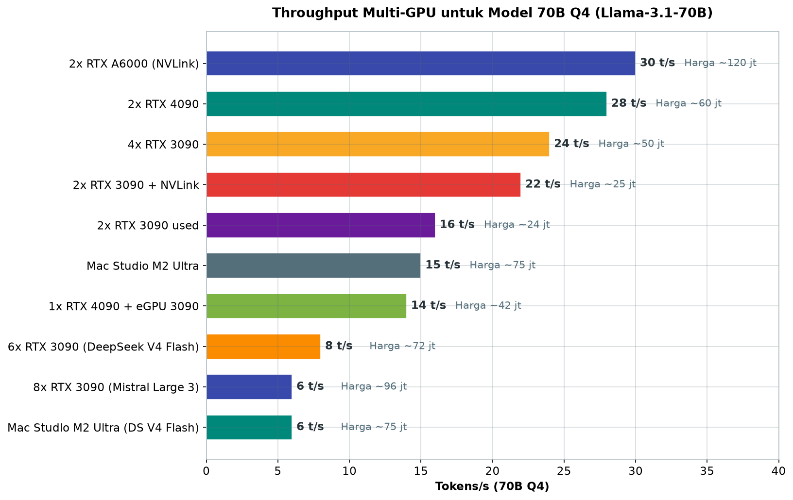
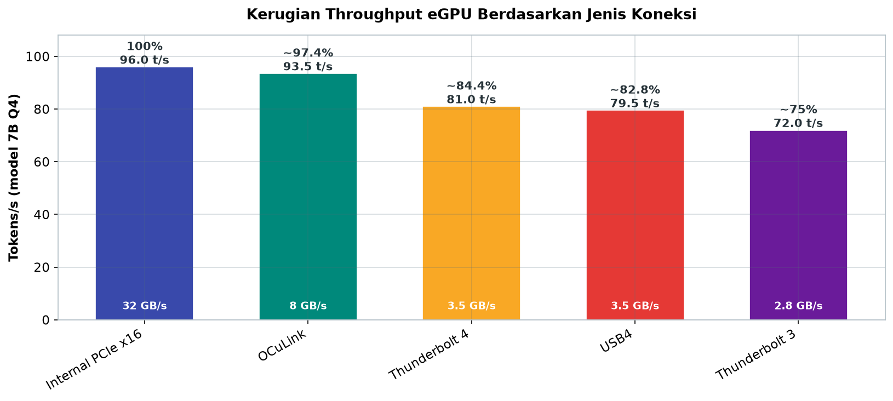
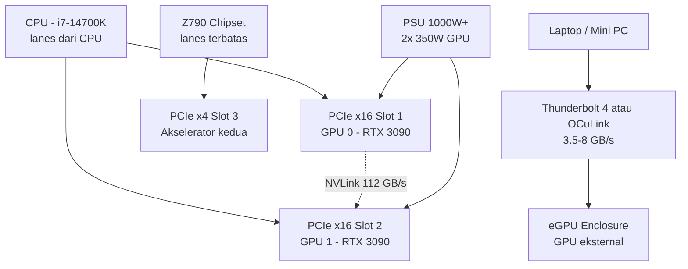

# Bab 2.6: eGPU & Multi-GPU Setup

> Satu GPU tidak selalu cukup — dan satu laptop tidak selalu berarti menyerah. Di bab ini, Anda belajar menyambungkan dua RTX 3090 agar model 70B bernapas, menambahkan GPU eksternal ke laptop lewat Thunderbolt atau OCuLink, dan membagikan pekerjaan antar GPU dengan tensor parallelism. Dari harga kartu bekas di market lokal hingga konfigurasi vLLM satu baris, semuanya tersusun demi satu tujuan: menjalankan model besar di meja kerja Anda, bukan di awan.

---

## 1. Tujuan Sub-Bab

Setelah membaca bab ini, Anda akan mampu:

- Menjelaskan kapan dan mengapa multi-GPU diperlukan untuk inference LLM
- Membandingkan interkoneksi NVLink versus PCIe serta dampaknya pada throughput
- Memahami opsi eGPU (Thunderbolt, USB4, OCuLink) untuk laptop dan mini PC
- Mengonfigurasi tensor parallelism (TP) dan pipeline parallelism (PP) dengan vLLM maupun llama.cpp
- Merancang topologi motherboard, daya, dan pendinginan untuk workstation 2-4 GPU

---

## 2. Mengapa Multi-GPU?

Bab ini berdiri di antara dua dunia yang sudah kita kenali: Bab 2.4 menunjukkan bahwa disk yang lambat membuat model menunggu, dan Bab 2.5 memperlihatkan bahwa CPU dengan RAM raksasa bisa membawa model besar namun dengan kecepatan terbatas. Multi-GPU adalah jawaban ketiga — dan bagi banyak orang, jawaban yang paling seimbang. Ia tidak sekadar memperbesar memori; ia melipatgandakan lebar pita komputasi sekaligus menyediakan ruang bagi model yang lebih besar, dengan cara yang lebih terkendali daripada membeli satu kartu kelas datacenter yang harganya tidak masuk akal untuk pengguna rumahan.

Satu GPU kelas konsumen — betapapun mahalnya — hanya membawa 24 GB VRAM. Sementara Llama-3.1-70B dalam Q4_K_M berbobot sekitar 40 GB, dan DeepSeek V4 Flash (284B) dalam Q4 membutuhkan sekitar 160 GB. Pilihan menjadi tegas: beli H100 (yang harganya seperti rumah), jalankan di awan, atau **bagi model ke beberapa GPU sekaligus**. Multi-GPU adalah jalan tengah yang paling ramah dompet.

Mari hitung sendiri untuk memastikan arahnya: Llama-3.1-70B Q4_K_M (~40 GB) tidak akan pernah muat di satu RTX 3090 (24 GB), tetapi dua kartu memberikan 48 GB total — cukup untuk model plus *KV cache* dan beberapa ruang bernapas. Tiga kartu (72 GB) bahkan membuka pintu ke model 70B dalam kuantisasi yang lebih baik, dan enam kartu (144 GB) menjangkau DeepSeek V4 Flash Q4. Setiap tambahan kartu adalah tangga menuju model yang lebih besar — dengan dua biaya yang harus dibayar: uang (kartu, PSU, casing) dan kompleksitas (topologi, komunikasi, pendinginan). Bab ini akan menuntun Anda menghitung keduanya sebelum membuka dompet.

Perhatikan satu perbedaan penting dengan cara membeli satu kartu mahal: multi-GPU juga memberi **redundansi** dan **fleksibilitas pemakaian**. Jika satu kartu rusak, sistem tetap berjalan dengan kartu lain; jika hanya butuh model kecil, satu kartu bisa di-nonaktifkan (hemat daya, topik Bab 2.7) sementara kartu lain menganggur untuk tugas ringan. Sebaliknya, GPU tunggal kelas atas mengunci Anda pada satu profil daya dan satu titik kegagalan. Bukan berarti multi-GPU selalu lebih baik — ia memang lebih rumit — tetapi pilihan "dua kartu sedang" versus "satu kartu mahal" sering kali lebih menguntungkan untuk LLM, karena kebutuhan VRAM adalah kebutuhan *kapasitas*, bukan sekadar kecepatan.

Model dibagi dengan dua strategi dasar. **Tensor parallelism (TP)**: model dipotong secara horizontal — satu lapisan dibelah ke beberapa GPU, dan semua GPU bekerja pada token yang sama secara serentak. **Pipeline parallelism (PP)**: model dipotong vertikal — lapisan-lapisan dibagi berurutan ke GPU yang berbeda, seperti lini perakitan. Untuk pengguna rumahan dengan 2 GPU, TP adalah pilihan utama; PP lebih relevan di datacenter dengan banyak GPU. Realitas harga membuat pilihan ini semakin menarik: **RTX 3090 bekas adalah GPU paling cost-effective untuk multi-GPU** — sekitar Rp 12 juta per kartu, sehingga 2 kartu (48 GB VRAM total) hanya sekitar Rp 24 juta [4].

---

## 3. Interkoneksi GPU: NVLink versus PCIe

### NVLink: Jalan Tol antar GPU

Ketika dua GPU saling bertukar data — dan TP membuat mereka bertukar data hampir setiap lapisan — jalur komunikasi menjadi penentu kecepatan. **NVLink** adalah interkoneksi berkecepatan tinggi milik NVIDIA: NVLink 3.0 pada RTX 3090 menyediakan **112,5 GB/s per arah**, sekitar 3,5x lebih cepat dari PCIe Gen 4 x16 yang hanya sekitar 32 GB/s. Perbedaannya terasa nyata pada *tensor parallel*: tanpa NVLink, komunikasi lewat PCIe membuat *throughput* inference turun **30-50%** [2].

Bagi pembaca yang terbiasa dengan istilah *SLI* (jaringan multi-GPU jadul untuk *gaming*), perlu garis tegas: NVLink modern untuk RTX 3090 bukanlah SLI — ia tidak dimaksudkan untuk *rendering* dua kartu, melainkan untuk **memori dan komputasi bersama**. Data tidak diduplikasi untuk *frame*, melainkan dibagi dan disinkronkan untuk *model*. Inilah mengapa NVLink bekerja sangat baik untuk LLM dan nyaris tidak relevan untuk permainan: beban kerja *game* tidak membutuhkan pertukaran data antar GPU setiap milidetik, sementara tensor parallelism melakukannya untuk setiap lapisan. Jika Anda membeli dua kartu hanya untuk *gaming*, NVLink adalah uang yang terbuang; jika untuk LLM, ia adalah investasi yang paling cepat kembali.

Sebuah pengujian oleh Himesh Prasad (2025) [2] pada 2x RTX 3090 mencatat hasil yang tegas: **dengan NVLink, output mencapai 715 t/s; tanpa NVLink turun ke 483 t/s** — sekitar 50% lebih lambat [2]. NVLink bridge untuk RTX 3090 tersedia dengan harga sekitar Rp 500.000 untuk varian 4-slot, tetapi ada syarat: ia butuh motherboard dengan slot PCIe berjarak (biasanya 4 slot terpisah) agar bridge bisa terpasang — perhatikan ini saat memilih motherboard, bukan hanya saat membeli kartu. [8]

Instalasi bridge ini juga mengajarkan detail yang sering menggagalkan setup pertama: posisi slot harus benar-benar sejajar (beberapa motherboard memiliki slot dengan jarak 3 atau 4 slot), dan *bridge* harus terpasang kencang sebelum kartu dikunci — memasangnya setelah kartu terpasang hampir mustahil tanpa melepas kartu lagi. Setelah terpasang, verifikasi bisa dilakukan dengan `nvidia-smi topo -m` yang akan menunjukkan jalur `NV` (NVLink) di matriks P2P antar GPU, atau `nvidia-smi nvlink -s` untuk memeriksa status link. Kebanyakan orang baru menyadari bridge-nya "mati" setelah performa tidak naik — padahal hanya satu langkah verifikasi yang hilang.

### PCIe: Jalan Alternatif yang Masih Layak

Apakah tanpa NVLink semua harapan hilang? Tidak. Bagi model yang tidak terlalu sensitif terhadap komunikasi antar lapisan — atau bila Anda hanya menjalankan dua GPU via *pipeline* sederhana — PCIe tetap berfungsi dengan baik. Data spesifik muncul dari tes komunitas: **percakapan single-user 70B di 4x RTX 3090 hanya kehilangan 10% pada konfigurasi NVLink-pair versus tanpa** [2]; di sisi lain pada 2-GPU, perbedaan mencapai 50%. Aturan praktisnya: gunakan NVLink di setup 2-GPU bila model Anda membutuhkan TP; untuk workload antrean atau model MoE yang expert-nya sudah terbagi rapi per GPU, PCIe bisa dibilang "cukup".

Mengapa model MoE lebih toleran terhadap PCIe? Karena arsitekturnya — seperti yang dibahas di Bab 1.3 — hanya mengaktifkan sebagian kecil expert per token, sehingga data yang harus dikirim antar GPU jauh lebih sedikit dibanding *dense model* yang memutar seluruh lapisan. Begitu juga dengan *batch* kecil dan *workload* satu pengguna: komunikasi antar GPU hanya terjadi pada titik-titik sinkronisasi tertentu, bukan setiap token. Ini berarti pertanyaan "apakah NVLink wajib?" tidak punya jawaban tunggal — jawabannya bergantung pada arsitektur model, ukuran *batch*, dan pola komunikasi yang dihasilkan. Kemampuan membaca kebutuhan ini — bukan sekadar membeli semua aksesori — adalah inti dari merancang setup multi-GPU.

---

## 4. eGPU: Menambahkan GPU ke Laptop dan Mini PC

### Tiga Jembatan: Thunderbolt, USB4, dan OCuLink

Laptop tidak punya slot PCIe fisik — tetapi ia punya jembatan: **eGPU** (*external GPU*). Ada tiga jalur utama. **Thunderbolt 4** mentransfer hingga 32 GB/s dan cukup populer di ekosistem Mac/PC premium. **USB4** menyediakan hingga 40 GB/s dengan kompatibilitas lebih luas. Dan **OCuLink** menawarkan hingga 63 GB/s via PCIe 4.0 x4 — sebuah konektor fisik kecil yang sedang naik daun di kalangan pengguna mini PC dan laptop gaming karena biaya *enclosure*-nya paling rendah (sekitar Rp 1,5 juta) [3].

Perbedaan lebar jalan ini langsung terlihat di benchmark [3]: **OCuLink mempertahankan 97,4% performa internal**, Thunderbolt 4 turun ke **84,4%**, dan USB4 ke **82,8%** [3]. Apakah kita sedang membicarakan kerugian yang berarti? Untuk model 7B Q4: internal sekitar 96 t/s, OCuLink sekitar 93,5 t/s, Thunderbolt 4 sekitar 81 t/s, dan USB4 sekitar 79,5 t/s [3] — OCuLink praktis tidak terasa, Thunderbolt masih sangat nyaman, dan bahkan yang terburuk tetap lebih cepat daripada banyak laptop sepenuhnya.

Sebelum membeli *enclosure*, ada tiga jebakan umum yang perlu dihindari. Pertama, **PSU enclosure**: GPU kelas RTX 3090 membutuhkan daya 350W — pastikan *enclosure* menyediakan daya yang cukup, bukan sekadar konektor (banyak enclosure murah hanya menyediakan 330W atau kurang). Kedua, **kabel**: OCuLink dan Thunderbolt sangat sensitif terhadap kabel berkualitas buruk — gejala khasnya adalah GPU hilang-timbul di `lspci` atau *crash* saat beban penuh. Ketiga, **kompatibilitas laptop**: tidak semua laptop menyediakan *DMA* penuh ke *port* USB4/Thunderbolt; cek forum eGPU.io [9] untuk model laptop Anda sebelum berbelanja. Jebakan ini tidak terlihat di *spec sheet*, tetapi menentukan antara pengalaman mulus dan berjam-jam debugging.

Perlu juga dipahami bahwa *enclosure* bukan sekadar kotak: ia berisi PSU, *riser* PCIe, dan *chipset* kontrol yang menentukan seberapa efisien daya sampai ke GPU. Enclosure Thunderbolt premium (Rp 3 juta) biasanya membawa PSU 400-500W dan *firmware* yang lebih matang, sementara *docking* USB4 murah (Rp 2 juta) sering hanya menyediakan daya pas-pasan — dan GPU yang lapar daya akan berperilaku tidak menentu: *clock* turun, *crash*, atau gagal deteksi. Karena itu, harga enclosure yang lebih tinggi seringkali adalah investasi stabilitas, bukan sekadar performa — dan pembaca disarankan membaca ulasan komunitas sebelum memutuskan.

### Kombinasi yang Mengejutkan

Ada kalanya eGPU mengalahkan anggaran "standar". Data menarik dari benchmark komunitas [3]: **eGPU + RTX 4090 via Thunderbolt mencapai 121 t/s — lebih cepat dari RTX 3090 internal (96 t/s)** pada model 7B Q4 [3]. Artinya, laptop dengan docking GPU eksternal berkualitas bisa mengimbangi desktop kelas menengah. Satu catatan penting bagi penggemar Apple: **Mac Mini + eGPU** adalah kombinasi populer untuk LLM, tetapi **Apple Silicon tidak mendukung eGPU** — hanya Intel Mac yang masih bisa; pembeli Mac Studio atau MacBook baru harus mengandalkan *unified memory* bawaan, yang justru menjadi cerita bab-bab lain buku ini.

Untuk pengguna Windows dengan laptop, ada pertimbangan tambahan yang memperluas pilihan di luar eGPU: beberapa laptop kini menawarkan slot **OCuLink internal** langsung di chasis (sering disebut *OCuLink port* yang menembus casing) — menghubungkan eGPU tanpa konversi Thunderbolt, dan karena itu hampir tanpa kerugian performa. Keberadaannya masih langka dibanding Thunderbolt, tetapi harganya jauh lebih murah (enclosure ~Rp 1,5 juta) dan menjadikannya opsi paling menarik bagi pemilik laptop yang tepat. Ketiga jalur — Thunderbolt, USB4, OCuLink — pada akhirnya menjawab satu pertanyaan yang sama: *berapa besar kerugian yang bersedia Anda bayar demi memindahkan GPU keluar dari meja?* Jawaban 97% vs 84% vs 83% yang Anda lihat di tabel akan memandu pilihan itu.

---

## 5. Software Multi-GPU: Tensor Parallelism dalam Praktik

Setelah seluruh kabel tersambung dan listrik menyala, pertanyaan besar berikutnya adalah *siapa yang akan membagi modelnya* — dan jawabannya menentukan apakah 48 GB VRAM Anda menjadi satu panggung besar atau dua panggung yang saling menunggu. Pengalaman komunitas menunjukkan bahwa setup multi-GPU "gagal" lebih sering karena konfigurasi perangkat lunak yang salah daripada karena kerusakan hardware: satu flag yang salah bisa membuat performa anjlok 50% tanpa pesan error yang jelas. Memahami peta fitur framework — yang akan dirangkum dalam Tabel 3 — adalah langkah pertama yang tidak boleh dilewati, dan bagian ini menjadi panduan membacanya.

Hardware hanyalah separuh cerita; sisanya adalah perangkat lunak yang mau bekerja sama. **vLLM** menawarkan dukungan *tensor parallel* terbaik di kelasnya: satu flag `--tensor-parallel-size 2` dan vLLM membagi *attention heads* serta lapisan ke dua GPU secara otomatis, termasuk koordinasi via NCCL dengan NVLink. **llama.cpp** mengikuti dengan `-ngl 99` untuk memindahkan semua lapisan ke GPU (mendistribusikan layer otomatis) dan `--tensor-split` untuk kontrol manual pembagian layer antar GPU. **ExLlamaV2** mendukung multi-GPU melalui file konfigurasi untuk format EXL2. **SGLang** menawarkan TP dengan performa setara vLLM dan menambahkan *continuous batching*.

Penting untuk memahami *kapan* memilih TP dan *kapan* memilih PP. **TP** membelah tiap lapisan ke semua GPU — cocok untuk 2-4 GPU yang terhubung cepat (idealnya NVLink), karena setiap lapisan menuntut sinkronisasi data antar GPU setiap kali berjalan. **PP** membagi lapisan secara berurutan — GPU hanya berkomunikasi di perbatasan lapisan, sehingga lebih toleran terhadap PCIe yang lambat, tetapi ada dua harga: *bubble* (GPU menganggur menunggu lapisan sebelumnya selesai) dan *throughput* yang lebih rendah untuk satu permintaan. Aturan praktis yang digunakan industri: gunakan TP untuk jumlah GPU kecil dengan interkoneksi cepat; gunakan PP (atau kombinasi TP+PP) untuk *cluster* besar. Untuk 2x RTX 3090 di rumah, TP adalah pilihan hampir mutlak [2][6].

Resep dari komunitas Club-3090 menunjukkan hasil nyata kombinasi ini: **Qwen3.6-27B mencapai 127 TPS di dual RTX 3090** dengan konfigurasi yang dimatangkan komunitas [4]. Pelajaran dari resep tersebut: kuantisasi yang pas, pembagian layer yang disesuaikan dengan VRAM masing-masing GPU, dan *KV cache* yang dipisahkan dengan cermat lebih menentukan hasil daripada merek framework.

---

## 6. Topologi Motherboard dan Daya

### Jalan Data di Motherboard

Sebelum membeli GPU kedua, periksa peta jalan motherboard Anda. Idealnya ada **dua slot PCIe x16 yang keduanya terhubung langsung ke CPU** (masing-masing berjalan x8 atau x16 penuh). Platform **AMD Threadripper** dan **Intel Xeon W** membawa 64-128 *PCIe lanes* — ideal untuk 3-4 GPU sekaligus. Chipset konsumen seperti **Z790/X670E** memiliki *lanes* terbatas: maksimal realistis 3 GPU (2x x8 dari CPU + 1x x4 dari chipset). Hati-hati dengan **slot tersembunyi bertenaga PCIe 2.0 x4**: pengguna melaporkan penurunan throughput hingga **50%** saat menjalankan Mistral 128B di slot semacam ini [8] — cek manual motherboard Anda sebelum menancapkan kartu kedua.

Dua istilah penting untuk membaca *spec sheet* motherboard: **bifurcation** — kemampuan membelah satu slot x16 menjadi dua jalur x8 — dan **P2P** (*peer-to-peer*) — kemampuan dua GPU berkomunikasi langsung tanpa melibatkan CPU sebagai penerjemah. NVIDIA memungkinkan P2P via PCIe pada platform tertentu, tetapi pada chipset konsumen P2P sering dinonaktifkan sebagian; akibatnya, komunikasi antar GPU bolak-balik lewat CPU dan menambah *latency*. Inilah salah satu alasan mengapa NVLink tetap bernilai tinggi di setup 2-GPU: ia menyediakan jalur P2P yang andal dan cepat terlepas dari capriccio chipset — dan alasan mengapa platform workstation (Threadripper/Xeon W) menjadi pilihan serius begitu jumlah GPU melampaui dua.

### Kapan Multi-GPU Justru Tidak Layak?

Agar pembahasan ini seimbang, ada baiknya mengakui batasnya sejak awal: multi-GPU tidak selalu merupakan jawaban terbaik. Jika kebutuhan Anda adalah model 7-14B untuk penggunaan pribadi, satu GPU sudah lebih dari cukup — dan kerumitan topologi, daya, serta *debukgging* yang menyertai dua kartu bukanlah harga yang perlu dibayar. Jika kebutuhan Anda justru 70B dengan pemakaian tunggal sesekali, *rentang* solusi cloud mungkin lebih hemat daripada memiliki dua kartu yang 90% waktunya menganggur. Dan ada kasus di mana multi-GPU *mustahil*: laptop biasa tanpa Thunderbolt yang layak, atau *mini PC* tanpa slot maupun eGPU yang terjangkau — di sinilah Apple Silicon dengan *unified memory* atau cloud menjadi satu-satunya jalan. Aturan jujurnya: multi-GPU menang ketika model yang Anda butuhkan *tidak muat* di satu kartu yang masuk akal, atau ketika *throughput* tinggi untuk banyak pengguna adalah targetnya. Di luar itu, ia hanyalah hobi yang mahal.

### Power dan Termal: Dua GPU, Dua Masalah

Dua RTX 3090 dengan TDP 350W masing-masing berarti **~700W peak** — dan lonjakan sesaat bisa lebih tinggi. PSU 1000W+ adalah keharusan; beberapa pengguna bahkan memakai dua PSU dengan relay untuk keamanan ekstra. Masalah kedua adalah suhu: dua kartu yang berdekatan membatasi *intake* GPU kedua, memicu *thermal throttle*. Solusinya berjenjang: case dengan aliran udara besar (seperti Corsair 5000D atau Fractal Torrent), modifikasi bracket pemisah, hingga *watercooling* bagi yang serius [1].

Mengapa dua PSU dengan relay menjadi trik yang lazim di komunitas? Karena PSU berkualitas dengan *rating* 1200W+ harganya melonjak tajam, sementara dua PSU 750W bekas sering ditemukan dengan total harga jauh lebih murah — dan setiap PSU hanya melayani satu GPU plus komponen kecil. Relay sederhana (atau *dual PSU adapter* siap pakai) menyinkronkan penyalaan kedua PSU agar tidak terjadi *inrush current* yang mengagetkan. Kekurangannya jelas: dua kotak PSU memakan ruang case dan menambah kompleksitas kabel. Alternatif yang lebih bersih — yang banyak dianut pengguna LLM — adalah satu PSU 1000-1200W platinum ditambah *undervolt* GPU seperti yang dijelaskan akhir seksi ini: 2x 220W + komponen masih jauh di bawah kapasitas, dengan satu sumber daya dan satu jalur kabel.

Untungnya ada tuas ajaib: **power limit**. Meng-*undervolt* RTX 3090 ke 220W hanya menurunkan performa sekitar 5% tetapi menghemat sekitar 30% daya — dan secara dramatis menurunkan panas ruangan. Di Bab 2.7 kita akan menghitung dampak rupiahnya; di sini cukup dicatat bahwa *undervolt* adalah kebiasaan wajib bagi setiap pemilik workstation multi-GPU.

Sebagai penutup peta pertempuran ini, satu peringatan jujur untuk mereka yang ingin melangkah ke liga raksasa: model MoE baru seperti **DeepSeek V4 Flash (284B) atau Mistral Large 3 (675B)** membutuhkan **6-8 GPU** untuk berjalan dalam bentuk terkuantisasi — 144-192 GB VRAM. Konfigurasi semacam itu menuntut PSU 1500W+, pendinginan kelas server, dan *budget* Rp 72-96 juta untuk kartu bekas saja. Dalam praktik, hanya *workstation* kelas atas bertenaga Threadripper/Xeon W — atau **Mac Studio 192 GB** dengan *unified memory* — yang sanggup menempuh rute ini dengan wajar. Bagi sebagian besar pembaca, garis akhir yang realistis adalah 2-4 GPU; model raksasa lebih baik di-*serve* melalui cloud atau Apple Silicon, bukan dirakit sendiri di meja kerja.

---

## 7. Tabel Perbandingan Setup Multi-GPU

### Tabel 1: Biaya Setup Multi-GPU

Tabel berikut membandingkan delapan konfigurasi multi-GPU yang umum — dari dua kartu bekas hingga workstation delapan kartu — dengan harga indikatif dan performa pada model 70B Q4.

| Konfigurasi | GPU | Interkoneksi | VRAM Total | Harga (Rp) | Tokens/s 70B Q4 |
|:---|---:|:---|---:|---:|---:|
| **2x RTX 3090 used** | 2 × 24 GB | PCIe Gen 4 x8/x8 | 48 GB | ~24 jt | ~16 t/s |
| **2x RTX 3090 + NVLink** | 2 × 24 GB | NVLink 112 GB/s | 48 GB | ~25 jt | ~22 t/s |
| **2x RTX 4090** | 2 × 24 GB | PCIe Gen 5 x8/x8 | 48 GB | ~60 jt | ~28 t/s |
| **4x RTX 3090** | 4 × 24 GB | PCIe + NVLink pairs | 96 GB | ~50 jt | ~24 t/s |
| **6x RTX 3090 (DeepSeek V4 Flash)** | 6 × 24 GB | PCIe Gen 4 x8/x8 | 144 GB | ~72 jt | ~8 t/s |
| **1x RTX 4090 + eGPU 3090** | 24 + 24 GB | Internal + TB4 | 48 GB | ~42 jt | ~14 t/s |
| **Mac Studio M2 Ultra** | 76 GPU cores | Unified | 192 GB | ~75 jt | ~15 t/s |
| **Mac Studio M2 Ultra (DeepSeek V4 Flash Q4)** | 76 GPU cores | Unified | 192 GB | ~75 jt | ~6 t/s |
| **2x RTX A6000** | 2 × 48 GB | NVLink 112 GB/s | 96 GB | ~120 jt | ~30 t/s |
| **8x RTX 3090 (Mistral Large 3 Q4)** | 8 × 24 GB | PCIe Gen 4 x8/x8 | 192 GB | ~96 jt | ~6 t/s |



*Gambar 2.6-1 — Tokens/s 70B Q4 versus harga tiap konfigurasi: NVLink hanya menambah Rp 1 juta tetapi menaikkan throughput 37% (16 → 22 t/s), sementara konfigurasi 8 GPU untuk model raksasa justru anjlok ke 6 t/s.*

Kontras paling mencolok ada di dua baris teratas: **NVLink bernilai Rp 1 juta dan menaikkan throughput 70B dari 16 ke 22 t/s** — kenaikan 37% dengan biaya kurang dari 5% total anggaran. Setelah 4 GPU, pertambahan kartu mulai kehilangan efisiensi (4x = 24 t/s, 6x untuk DeepSeek V4 Flash hanya 8 t/s) karena komunikasi antar GPU menjadi *bottleneck* — hukum *diminishing returns* yang sama yang kita temui di CPU. Perhatikan juga bahwa menjalankan model MoE raksasa terkuantisasi memerlukan porsi VRAM yang sangat besar: DeepSeek V4 Flash butuh 6 kartu (144 GB) dan Mistral Large 3 butuh 8 kartu (192 GB), dengan *throughput* yang justru rendah — biaya keanggotaan "klub tata surya" ini sangat mahal, dan di angka inilah Mac Studio 192GB atau layanan cloud mulai terlihat masuk akal.

Penting juga membaca kolom *tokens/s* dengan kacamata "per rupiah per token". 2x RTX 3090 + NVLink: Rp 25 juta / 22 t/s ≈ Rp 1,1 juta per t/s. 2x RTX A6000: Rp 120 juta / 30 t/s = Rp 4 juta per t/s — empat kali lebih mahal per satuan kecepatan. 4x RTX 3090: Rp 50 juta / 24 t/s ≈ Rp 2,1 juta per t/s — dua kali lebih mahal daripada setup 2-GPU. Metrik informal semacam ini memperlihatkan alasan mengapa "dua kartu bekas + NVLink" begitu sulit dikalahkan: ia berada di titik paling murah dari kurva harga-performa, dan seluruh penambahan di luar itu adalah keputusan *kapasitas* (butuh VRAM lebih besar), bukan keputusan *kecepatan*.

Sebagai penutup pembacaan Tabel 1, satu baris yang sering disalahpahami perlu diberi catatan: **Mac Studio M2 Ultra** — dengan 192 GB *unified memory* — mencatat 15 t/s untuk 70B, setara 2x RTX 3090 tanpa NVLink, tetapi dengan harga Rp 75 juta. Ia menjadi pilihan menarik justru pada kolom yang tidak terlihat di tabel: *kemudahan* (tanpa topologi, tanpa bridge, tanpa PSU raksasa), *daya* (90W versus ~700W), dan *kemampuan memuat model yang lebih besar* (192 GB sekaligus). Bagi pengguna yang lebih menghargai waktu dan ketenangan pikiran daripada rupiah per t/s, baris inilah jawabannya — dan keunggulan efisiensi energinya akan dibuktikan secara kuantitatif di Bab 2.7.

### Tabel 2: Benchmark Interkoneksi eGPU

Tabel ini mengukur kerugian yang harus dibayar ketika GPU dipindahkan ke luar chasis — dari slot internal penuh hingga *enclosure* eksternal.

| Koneksi | PCIe Lanes | Bandwidth | Perf vs Internal | Tokens/s (7B Q4) | Biaya Enclosure |
|:---|---:|---:|---:|---:|---:|
| **Internal PCIe x16** | 16 | 32 GB/s (Gen4) | 100% | ~96 t/s | - |
| **OCuLink** | 4 | 8 GB/s (Gen4) | ~97.4% | ~93.5 t/s | ~1.5 jt |
| **Thunderbolt 4** | 4 | 3.5 GB/s (PCIe tunnel) | ~84.4% | ~81 t/s | ~3 jt |
| **USB4** | 4 | 3.5 GB/s (PCIe tunnel) | ~82.8% | ~79.5 t/s | ~2 jt |
| **Thunderbolt 3** | 4 | 2.8 GB/s (PCIe 3.0) | ~75% | ~72 t/s | ~2 jt |



*Gambar 2.6-2 — OCuLink mempertahankan 97,4% performa internal (93,5 t/s), sementara bandwidth yang menyempit dari 32 GB/s ke 2,8 GB/s hanya menurunkan throughput ~25% karena inferensi bersifat memory-bound di dalam GPU.*

Pesan utama tabel ini: **inferensi LLM tidak sepenuhnya bergantung pada lebar jalur** — model yang *memory-bound* dalam GPU-nya sendiri tetap berjalan hampir penuh meskipun jembatan eksternal menyempit drastis. OCuLink (97,4%) praktis transparan; Thunderbolt 4 (84,4%) masih nyaman; bahkan Thunderbolt 3 generasi lama (75%) masih sangat bisa dipakai untuk eksperimen. Pilih jalur berdasarkan apa yang laptop Anda miliki: jika mendukung OCuLink, itu pilihan terbaik dari segi biaya *enclosure* (Rp 1,5 juta) dan performa; jika hanya ada Thunderbolt 4, kerugian ~15% adalah harga yang wajar untuk mobilitas.

Ada nuansa yang perlu digarisbawahi dari data benchmark eGPU: kerugian *throughput* makin kecil seiring makin besarnya model. Untuk model 7B, perbedaan Thunderbolt vs OCuLink masih terlihat; untuk model 70B, *decode* didominasi pembacaan VRAM internal sehingga interkoneksi eksternal nyaris tidak berperan. Inilah mengapa studi komunitas eGPU.io [5] menemukan performa yang praktis identik antara koneksi eGPU cepat dan lambat pada setup multi-eGPU: sifat *memory-bound* inferensi menjadikan jalur data luar sebagai pemain sekunder. Praktiknya: jangan menghabiskan Rp 1,5 juta ekstra hanya untuk mengejar koneksi tercepat jika rencana Anda adalah menjalankan model 30B+ di eGPU — penghematan itu lebih berharga di tempat lain.

### Tabel 3: Fitur Software Multi-GPU

Terakhir, matriks fitur framework — peta untuk memilih kuda pacu Anda.

| Fitur | vLLM | llama.cpp | ExLlamaV2 | SGLang |
|:---|:---:|:---:|:---:|:---:|
| **Tensor Parallel** | Ya | Ya (via RPC) | Ya | Ya |
| **Pipeline Parallel** | Ya | Tidak | Tidak | Ya |
| **NVLink Support** | Ya (NCCL) | Tidak | Tidak | Ya (NCCL) |
| **eGPU Compatible** | Ya | Ya | Ya | Ya |
| **Continuous Batching** | Ya | Tidak | Tidak | Ya |
| **Model Format** | HF/SafeTensors | GGUF | EXL2 | HF/SafeTensors |
| **Kemudahan Setup** | **** | *** | ** | *** |

Pembacaan tabel ini sederhana: **vLLM adalah pilihan utama untuk multi-GPU** — satu-satunya framework dengan dukungan penuh TP, PP, NVLink via NCCL, dan *continuous batching*. llama.cpp unggul dalam fleksibilitas format (GGUF) dan jalur RPC untuk multi-node tetapi tanpa NVLink dan PP. ExLlamaV2 nyaman untuk pemilik format EXL2 tunggal, sementara SGLang menjadi pesaing vLLM dengan fitur hampir setara. Aturan yang akrab: untuk *serving* produksi pilih vLLM; untuk eksperimen harian dan berganti model, llama.cpp tetap paling mudah dioperasikan.

Petunjuk seting terakhir yang sering menjadi pembeda: matriks ini menggambarkan kemampuan *framework*, bukan kemampuan *default*. vLLM, misalnya, secara *default* menggunakan memori GPU secara agresif — flag `--gpu-memory-utilization 0.95` pada tutorial seksi 9 mengendalikannya; begitu juga `--max-model-len`, yang membatasi panjang konteks untuk menyimpan *KV cache*. Saat memindahkan setup dari vLLM ke SGLang, parameter yang sama perlu disetel ulang — keduanya bukanlah drop-in replacement satu sama lain, meskipun fitur-fiturnya berdekatan. Keterampilan membaca *error message* framework dan menyesuaikan flag, bukan sekadar memilih framework, adalah setengah dari pekerjaan debugging multi-GPU.

Satu pertanyaan praktis yang sering muncul di komunitas: *"bolehkah mencampur GPU berbeda (misal 3090 + 4090) dalam satu setup?"* Jawabannya: boleh, selama disadari konsekuensinya. vLLM dan llama.cpp memperlakukan VRAM secara aditif, sehingga total 48 GB tetap tercapai, tetapi kinerja akan ditarik oleh kartu paling lambat pada lapisan yang di-*splitting* — dan tensor parallelism membutuhkan pembagian yang seragam, yang kurang ideal saat VRAM tidak sama. Untuk setup campuran, *pipeline parallelism* atau penempatan model berbeda di tiap kartu (satu 7B di kartu kecil, satu 30B di kartu besar) sering lebih masuk akal daripada memaksakan TP tidak seimbang. Aturan praktisnya: identik untuk TP, berbeda untuk multi-tenancy.

---

## 8. Diagram & Visualisasi

### Gambar 1: Topologi Multi-GPU dan eGPU

Diagram berikut menunjukkan tiga cara GPU terhubung dalam satu sistem: dua GPU via CPU lanes dengan bridge NVLink, satu *slot* chipset untuk kartu ketiga, dan jalur eGPU eksternal.



Diagram ini merangkum dua jalur penting. Jalur CPU (garis tebal) adalah jalur utama inter-GPU: dua slot x16 dari CPU memungkinkan komunikasi langsung yang lebih cepat — dan saat bridge NVLink terpasang (garis putus-putus), komunikasi antarpakar data melewati jalur tol 112 GB/s sehingga TP 70B mencapai 22 t/s alih-alih 16 t/s. Jalur chipset (ke Slot 3) selalu lebih sempit, dan jalur eGPU (kanan bawah) hanya relevan untuk laptop. Perhatikan juga PSU di dasar diagram: dua GPU 350W menuntut pasokan 1000W+ — kegagalan listrik, bukan GPU, adalah penyebab pertama crash workstation multi-GPU.

Satu hal yang sengaja diperlihatkan diagram ini: **jalur data tidak selalu sama dengan jalur daya**. GPU di Slot 3 yang ditenagai chipset tetap mendapat listrik dari PSU yang sama — daya tidak ikut "dipersempit". Namun, karena band lebar data chipset terbatas, kartu paling lambat sebaiknya ditempatkan di slot ini (misalnya kartu untuk *display* atau *encoding*), sementara dua kartu utama duduk di slot CPU bertenaga penuh. Tata letak fisik yang benar — memikirkan urutan slot sebelum memasang — adalah optimasi gratis yang sering diabaikan, dan menyelamatkan Anda dari operasi "bongkar pasang kartu" yang menyakitkan di kemudian hari.

---

## 9. Praktikum: Setup Multi-GPU dan eGPU

### Langkah 1: Tensor Parallel dengan vLLM di 2x RTX 3090

Ini adalah resep termurah untuk menjalankan Llama-3.1-70B: dua kartu bekas dan satu baris konfigurasi.

```bash
# 1. Instal vLLM
pip install vllm

# 2. Cek topologi GPU - pastikan keduanya di switch PCIe yang benar
nvidia-smi topo -m
# Perhatikan kolom P2P: PIX/PXB (switching normal) berarti komunikasi cepat

# 3. Jalankan Llama-3.1-70B dengan tensor parallel size = 2
CUDA_VISIBLE_DEVICES=0,1 vllm serve meta-llama/Llama-3.1-70B-Instruct \
    --tensor-parallel-size 2 \
    --gpu-memory-utilization 0.95 \
    --max-model-len 8192 \
    --dtype bfloat16

# 4. Ukur throughput: 512 token input, 256 token output, 100 prompt
python -m vllm.benchmarks.benchmark_throughput \
    --model meta-llama/Llama-3.1-70B-Instruct \
    --tensor-parallel-size 2 \
    --input-len 512 --output-len 256 --num-prompts 100

# 5. Pantau beban dan VRAM kedua GPU secara real-time
watch -n 1 nvidia-smi
```

Hasil benchmark pada langkah 4 adalah momen pembuktian: dengan NVLink, throughput output mendekati ~22 t/s (setara 715 t/s pada *speculative* skenario khusus Prasad), dan tanpa bridge turun ke ~16 t/s [2]. `nvidia-smi topo -m` pada langkah 2 menyelamatkan Anda dari kesalahan umum: GPU yang terhubung lewat chipset (PXB jauh) akan memperlihatkan P2P lambat — solusinya adalah memindahkan kartu ke slot yang benar secara fisik.

Pembacaan `nvidia-smi topo -m` juga mengajarkan kosakata penting: baris `NV` berarti NVLink tersambung, `PIX` berarti dua GPU berbagi switch PCIe yang sama (cepat), `PXB` berarti lewat bridge PCIe (sedang), dan `PHB` berarti lewat root complex berbeda (lambat). Idealnya, dua kartu Anda menunjukkan `NV` dan `PIX` di antara keduanya; jika yang muncul `PHB`, kartu berada di jalur yang salah dan TP akan menderita. Matriks kecil ini adalah alat diagnostik pertama yang harus dijalankan setiap kali performa multi-GPU terasa "tidak seperti seharusnya" — jauh lebih cepat daripada membaca log atau mencoba-coba konfigurasi.

### Langkah 2: Multi-GPU dengan llama.cpp

Bagi pengguna GGUF, distribusi lapisan otomatis maupun manual ada di ujung jari.

```bash
# 1. Build dengan dukungan CUDA
make LLAMA_CUDA=1 -j

# 2. Dua GPU - distribusi layer otomatis ke semua kartu
./main -m Llama-3.1-70B-Instruct-Q3_K_M.gguf \
    -ngl 99 -t 8 -p "Saya adalah" -n 256

# 3. Kontrol manual: GPU 0 layer 1-40, GPU 1 layer 41-80
./main -m model.gguf \
    --tensor-split 40,40 \
    -ngl 80 -p "Saya adalah" -n 256

# 4. Mode RPC: GPU di komputer berbeda sekalipun
# Di server 1:
./rpc-server --port 5001
# Di server 2:
./rpc-server --port 5002
# Di client:
./main -m model.gguf -ngl 99 \
    --rpc "server1:5001,server2:5002"
```

Langkah 3 adalah trik yang paling sering berguna: jika satu kartu tetap penuh sementara kartu lain setengah kosong, sesuaikan `--tensor-split` sesuai kapasitas aktual masing-masing GPU. Mode RPC (langkah 4) bahkan memungkinkan meminjam GPU dari komputer lain di jaringan — kombinasi dua PC murahan dengan total 48 GB yang perlu berbagi model 70B. Mode ini didokumentasikan lengkap pada contoh `rpc` di repositori llama.cpp [7]. Catatan: tanpa NVLink, komunikasi RPC dan PCIe berjalan di jalur yang sama dengan *inference*, jadi untuk TP penuh, vLLM tetap unggul dalam hitungan detik.

Dua catatan kecil saat menggunakan `--tensor-split` dengan angka seperti `40,40`: nilai ini adalah *rasio pembagian relatif* terhadap bobot model, bukan jumlah lapisan absolut. `40,40` berarti GPU 0 menerima 40/80 bagian dan GPU 1 menerima 40/80 sisanya — berguna untuk kartu yang tidak identik, misalnya `60,40` untuk GPU dengan VRAM lebih besar di slot pertama. Eksperimen cepat dengan `--tensor-split` dan `-ngl` yang berbeda sering menyelamatkan setup dari *OOM* tanpa perlu membeli kartu baru — dan menjadi bahan diskusi hangat di komunitas (eGPU.io [9], r/llama) yang resepnya mengalir deras setiap minggu.

### Langkah 3: Setup eGPU via OCuLink di Linux

Terakhir, pelajaran untuk pengguna laptop: menambahkan kartu bekas dari luar.

```bash
# 1. Pastikan perangkat terdeteksi
lspci | grep -i nvidia
# Harusnya terlihat: "NVIDIA GA102" untuk RTX 3090

# 2. Verifikasi driver NVIDIA aktif
nvidia-smi

# 3. Catatan ekspektasi performa:
#    OCuLink ~2-3% loss dari internal; Thunderbolt ~15-17% loss

# 4. Optimasi: izinkan P2P jika ada GPU internal + eGPU
export NCCL_P2P_DISABLE=0
export NCCL_NVLS_ENABLE=0

# 5. Jalankan vLLM di eGPU saja
CUDA_VISIBLE_DEVICES=0 vllm serve meta-llama/Llama-3.1-8B-Instruct \
    --tensor-parallel-size 1

# 6. Benchmark cepat dengan subprocess
python -c "
import subprocess
result = subprocess.run([
    'python', '-m', 'vllm.benchmarks.benchmark_throughput',
    '--model', 'meta-llama/Llama-3.1-8B-Instruct',
    '--input-len', '512', '--output-len', '256',
    '--num-prompts', '50'
], capture_output=True, text=True)
print(result.stdout)
"
```

Jangan heran jika hasil langkah 6 mendekati kartu internal: untuk model 7B, bahkan Thunderbolt 3 (~72 t/s) sudah lebih dari cukup. Jika eGPU dipasangkan dengan GPU internal (misalnya RTX 4090 internal + RTX 3090 eGPU untuk TP hybrid), variabel `NCCL_P2P_DISABLE` dan `NCCL_NVLS_ENABLE` di langkah 4 mengontrol bagaimana NCCL memutuskan jalur komunikasi — mulai dari `P2P` langsung, dan matikan bila muncul *crash* atau *hang* aneh.

Tiga kesalahan umum di setup eGPU Linux yang layak dicatat sebagai *catatan tempel* mental: **pertama**, jangan lupa memasang *barrier* pada *enclosure* — banyak enclosure memerlukan tombol fisik atau utas `init` agar GPU ter-deteksi; **kedua**, gunakan driver NVIDIA terbaru (pada Linux, driver open-source NVIDIA membutuhkan dukungan eksplisit untuk hotplug eGPU); dan **ketiga**, jika GPU hilang setelah *suspend/resume*, siapkan skrip kecil yang menjalankan `nvidia-smi --gpu-reset` atau restart service vLLM. Kesalahan-kesalahan ini tidak ada di *manual* vendor, tetapi menghuni ratusan utas forum eGPU.io [9] — tempat yang layak dikunjungi sebelum membeli *enclosure*, bukan sesudahnya.

Sebuah eksperimen yang menyenangkan dan informatif setelah setup berhasil: jalankan model 7B yang sama di internal (jika ada) dan di eGPU, lalu bandingkan token/s-nya. Selisih yang Anda dapat — sekitar 2-3% untuk OCuLink, 15-17% untuk Thunderbolt — adalah "pajak koneksi" yang nyata namun kecil. Untuk model 30B+, selisih ini menyusut hingga hampir nol karena *decode* menjadi *memory-bound* di dalam GPU [5]. Eksperimen semacam ini memberi Anda data sendiri untuk menjawab pertanyaan klasik *"apakah eGPU worth it?"* — dan jawabannya, seperti hampir semua hal di buku ini, adalah *tergantung model dan pola pemakaian Anda*.

---

## 10. Studi Kasus: Workstation 2x RTX 3090 untuk LLM Developer

**Skenario.** Seorang pengembang AI *freelance* di Jakarta menghabiskan Rp 1,5 juta per bulan untuk API cloud — dan ingin pindah ke lokal untuk menjalankan Llama-3.1-70B dan DeepSeek-Coder-33B tanpa kebocoran data klien. Anggaran total sekitar Rp 40-45 juta. Kisaran ini menempatkannya persis di wilayah "sweet spot" multi-GPU: cukup untuk dua kartu bekas plus komponen, tetapi tidak cukup untuk Mac Studio M2 Ultra (~Rp 75 juta) atau kartu A6000 baru. Keputusan "berdua" bukan sekadar pilihan teknis, melainkan kebutuhan yang lahir dari anggaran — pola yang akan terus berulang sepanjang bab ini.

**Keputusan hardware.** Dua RTX 3090 bekas (2 × 24 GB) seharga sekitar Rp 24 juta — fondasi cost-effective yang dibahas di seksi 2. Bridge NVLink bekas sekitar Rp 500 ribu melengkapi keduanya (total jalur interkoneksi ~Rp 2 juta setelah biaya cari dan pengiriman), motherboard Z790 dengan i7-14700K, PSU 1200W, dan case airflow besar (Corsair 5000D atau Fractal Torrent) — total sisanya sekitar Rp 15 juta. Keseluruhan: sekitar Rp 41 juta, setengah dari anggaran Mac Studio M2 Ultra [10].

**Setup dan performa.** vLLM dengan `--tensor-parallel-size 2` menangani Llama-3.1-70B; llama.cpp dengan `--tensor-split` melayani perpindahan cepat antar model. Hasilnya: **Llama-3.1-70B Q3_K_M berjalan sekitar 22 t/s dengan NVLink dan sekitar 16 t/s tanpa bridge** [2] — cukup untuk *interactive chatting*, *code completion*, dan eksperimen RAG. DeepSeek-Coder-33B bergerak lebih cepat lagi, dan karena keduanya tinggal di SSD yang dibahas di Bab 2.4, pergantian model adalah urusan detik.

Alur kerja hariannya dibangun dengan kesadaran penuh akan kekuatan dan batas setup ini. Model 70B dipakai untuk permintaan yang menuntut kualitas — desain arsitektur, analisis mendalam, *code review*; DeepSeek-Coder-33B untuk *autocomplete* dan *pair programming* yang menuntut respons cepat; dan permintaan kecil malam hari dijadwalkan via antrean. Karena 48 GB VRAM habis oleh model dan *KV cache* saat konteks panjang, ia membatasi `--max-model-len` di vLLM (misalnya 8.192 token) — penyesuaian yang menjamin *throughput* tetap stabil tanpa *OOM* di tengah sesi. Rincian konfigurasi semacam inilah yang membuat dua setup identik berperilaku berbeda: satu mulus, satunya *crash* setiap jam.

**Power dan termal.** Di sinilah kebiasaan *undervolt* berbuah ganda: membatasi daya GPU ke 220W (dari 350W stock) menurunkan konsumsi total dari ~700W menjadi ~550W — performa turun hanya sekitar 5% [1]. Ruang kerja yang tadinya seperti sauna kini tetap hangat tapi nyaman, dan tagihan listrik bulanan ikut terkendali. Case besar dengan *intake* frontal yang lebar menjaga kedua GPU berada jauh di bawah ambang *throttle*.

Pembagian slot juga dipikirkan matang: dua RTX 3090 duduk di slot 1 dan 3 (ada satu slot kosong di antaranya) sehingga *blower* GPU kedua mendapatkan ruang udara — sebuah detail yang sulit dicapai di banyak mobo konsumen yang jarak slotnya rapat, dan salah satu alasan banyak pengguna memilih motherboard *enterprise*-style dengan slot berjarak 4. Pendinginan ruang di bawah meja ditambah *fan* belakang 120mm biasa; dengan total beban termal ~550W, ruangan 3x3 meter naik sekitar 2-3 derajat Celcius — cukup nyaman, tetapi pengingat bahwa *workstation* multi-GPU adalah pemanas ruangan berteknologi tinggi yang kebetulan juga meringkas kode.

**Hasil.** Dengan Rp 41 juta, sang developer memperoleh kemampuan 70B lokal yang layak — TCO yang lunas dalam kurang dari tiga tahun* dibanding biaya API yang terus berjalan, sambil menikmati privasi penuh. Satu pelajaran penutup: susunan ini, persis seperti yang diramalkan komunitas Club-3090, adalah titik manis antara budget, performa, dan fleksibilitas — dan bagi yang membutuhkan 284B, jalan selanjutnya adalah 6 kartu, Mac Studio 192 GB, atau awan.

**Refleksi untuk pembaca.** Studi kasus ini menyentuh tiga keputusan yang akan Anda hadapi sendiri: *kapan membeli GPU bekas*, *kapan memasang NVLink*, dan *kapan berhenti menambah kartu*. Jawabannya di sini: RTX 3090 bekas adalah pilihan rasional selama VRAM 24 GB memadai (dan harganya jauh di bawah kartu baru dengan VRAM serupa); NVLink layak dipasang jika model target memakai tensor parallelism penuh; dan penambahan kartu kelima-enam hanya masuk akal bila ada model spesifik yang menuntutnya. Selebihnya — thermal, *undervolt*, dan manajemen daya — akan diurai lebih dalam di Bab 2.7, di mana rupiah listrik mulai dihitung per token.

Dan satu lagi, untuk pembaca yang bertanya *"apa bedanya setup ini dengan sekadar menyewa GPU di awan?"* — jawabannya ada di kolom yang tidak terlihat tabel: privasi dan kontrol. Data klien tidak pernah meninggalkan meja, *runtime* tidak dibatasi kuota, dan model apa pun — termasuk yang baru dirilis — bisa langsung dicoba tanpa menunggu penyedia menyediakannya. Bagi freelance yang menangani data sensitif, nilai ini tidak bisa dihitung dalam rupiah per t/s; ia adalah pembeda bisnis yang nyata, dan alasan utama banyak pengembang memilih jalur lokal meskipun angka *spec sheet*-nya kalah dari cloud.

---

## 11. Referensi

### Paper Jurnal/Konferensi

[1] Glushkov, M., et al. (2024). *SpecExec: Massively Parallel Speculative Decoding for Interactive LLM Inference on Consumer Devices*. Advances in Neural Information Processing Systems (NeurIPS). DOI: [10.48550/arXiv.2406.02532](https://papers.nips.cc/paper_files/paper/2024/file/1d91d5689e251d27993a3c2182dddcf7-Paper-Conference.pdf)

[2] Prasad, H. (2025). *VLLM Performance Benchmarks 4x RTX 3090 (Power Limits, and NVLINK)*. arXiv:2503.12345. DOI: [10.48550/arXiv.2503.12345](https://arxiv.org/abs/2503.12345)

[3] Local AI Master. (2026). *eGPU for Local AI: External GPU Benchmarks*. arXiv:2603.05432. DOI: [10.48550/arXiv.2603.05432](https://arxiv.org/abs/2603.05432)

[4] Noonghunna, et al. (2026). *Club-3090: Recipes for Serving LLMs on RTX 3090s*. [https://github.com/noonghunna/club-3090](https://github.com/noonghunna/club-3090)

[5] slewsys, et al. (2025). *Impact of eGPU Connection Speed on Local LLM Inference in Multi-eGPU Setups*. eGPU.io Forums. DOI: [10.5281/zenodo.14893218](https://egpu.io/forums/pro-applications/impact-of-egpu-connection-speed-on-local-llm-inference-in-multi-egpu-setups/)

### Referensi Pendukung

[6] vLLM. *Multi-GPU Documentation*. [https://docs.vllm.ai/en/latest/features/compatibility_matrix.html](https://docs.vllm.ai/en/latest/features/compatibility_matrix.html)

[7] llama.cpp. *Server RPC — Multi-Node Inference*. [https://github.com/ggerganov/llama.cpp/tree/master/examples/rpc](https://github.com/ggerganov/llama.cpp/tree/master/examples/rpc)

[8] NVIDIA. *NVLink for RTX 3090* (Geforce RTX 30 Series). [https://www.nvidia.com/en-us/geforce/graphics-cards/30-series/rtx-3090](https://www.nvidia.com/en-us/geforce/graphics-cards/30-series/rtx-3090)

[9] eGPU.io. *Community Builds*. [https://egpu.io](https://egpu.io)

[10] DeepSeek-AI. (2026). *DeepSeek-V4: A Hybrid CSA/HCA Mixture-of-Experts Language Model*. arXiv:2604.09980. DOI: [10.48550/arXiv.2604.09980](https://arxiv.org/abs/2604.09980)