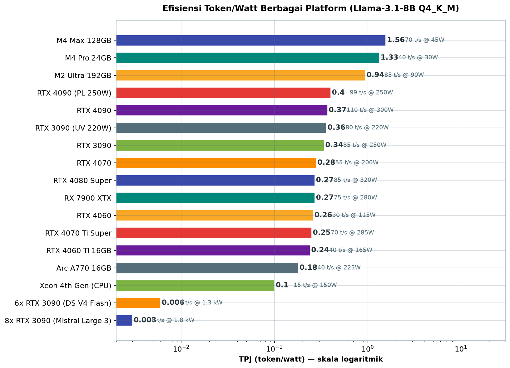
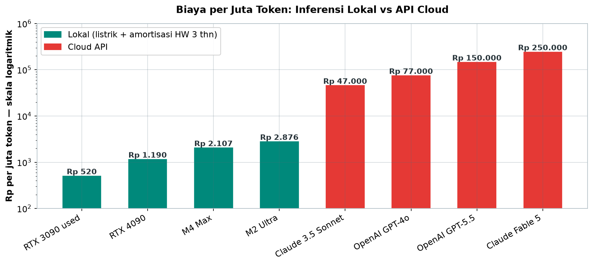
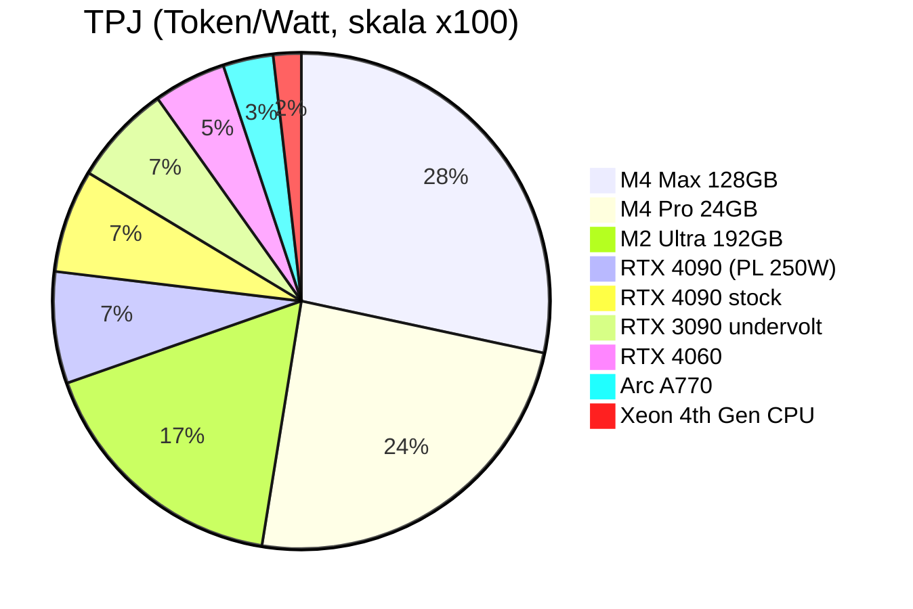

# Bab 2.7: Power Consumption

> GPU yang sama bisa menghabiskan biaya listrik Rp 576 ribu atau Rp 461 ribu per bulan — hanya tergantung pada tiga perintah di terminal. Di bab terakhir Bab 2 ini, kita menutup pembahasan hardware dengan lensa paling praktis: watt, rupiah, dan token. Dari metrik Token/Watt hingga studi perbandingan Mac Mini versus PC gaming untuk server 24/7, semuanya bermuara pada satu pertanyaan sederhana: berapa biaya sebenarnya dari setiap kata yang dihasilkan mesin Anda?

---

## 1. Tujuan Sub-Bab


Setelah membaca bab ini, Anda akan mampu:

- Menghitung metrik Token per Watt (TPJ) dan memaknai hasilnya antar platform
- Menjelaskan karakteristik daya dua fase inferensi LLM — prefill dan decode
- Menerapkan underclocking/undervolting untuk menghemat listrik tanpa mengorbankan performa signifikan
- Menghitung biaya listrik bulanan dan tahunan untuk berbagai skenario pemakaian
- Memilih platform yang tepat berdasarkan total cost of ownership (TCO), bukan harga hardware semata

Bab ini juga menjadi penutup seluruh seri Bab 2 — dan karena itu, ia mengikat semua pembahasan sebelumnya menjadi satu kesimpulan finansial: mesin yang Anda rakit di Bab 2.4-2.6 tidak selesai ketika menyala pertama kali, melainkan ketika Anda tahu berapa biayanya untuk tetap menyala.

---

## 2. Mengapa Efisiensi Energi Penting?


Selama tiga bab terakhir kita menghabiskan banyak uang — untuk SSD, CPU, dan GPU. Bab ini adalah bab di mana semua pengeluaran itu mulai *dipungut balas*: bukan sekali lewat, melainkan setiap bulan selama mesin menyala. Jika Anda mengikuti Bab 2.4 hingga 2.6, Anda kini memiliki mesin yang mampu menjalankan model yang Anda inginkan. Pertanyaan yang tersisa — dan sama pentingnya — adalah: *berapa biaya untuk menjaganya tetap hidup?* Efisiensi energi adalah jawabannya, dan bab ini menutup seri hardware dengan menghitungnya sampai ke rupiah terakhir.

### Inference adalah Bagian Terbesar dari Kisah Energi

Selama bertahun-tahun narasi energi AI berpusat pada *training* — dan benar, melatih model raksasa menghabiskan mega-joule. Namun di dunia nyata, model yang sudah jadi dijalankan terus-menerus, dan jangkauannya jauh lebih luas. Analisis dari komunitas riset energi (HotCarbon [6], merujuk pada data operasional AWS) menunjukkan: **inference menyumbang lebih dari 90% total energi dalam siklus hidup LLM** [6]. Untuk setiap satu satuan energi yang dikeluarkan saat melatih sebuah model, lebih dari sembilan satuan dihabiskan setiap kali model itu melayani permintaan pengguna.

Bagi sebagian besar pembaca buku ini — pengguna lokal yang menjalankan asisten 24/7 — artinya sangat konkret. Sebuah GPU 350W yang menyala terus menerus menghabiskan sekitar **Rp 400 ribu per bulan**, dengan asumsi tarif sekitar Rp 1.600/kWh. Di Indonesia, tarif listrik berada pada rentang **Rp 1.467 hingga Rp 1.700/kWh** (golongan R-1 hingga B-3) [9] — sehingga setiap watt adalah rupiah yang nyata, bukan abstraksi. Inilah mengapa metrik **Token/Watt** menjadi kunci penentu *total cost of ownership* (TCO) perangkat LLM Anda, dan mengapa bab ini berdiri sebagai bab terakhir yang menautkan seluruh diskusi hardware.

Ada dua rincian yang membuat angka ini semakin pribadi bagi pembaca di Indonesia. Pertama, tarif listrik Indonesia bersifat **berjenjang berdasarkan golongan**: rumah tangga R-1 (~Rp 1.467/kWh) lebih murah daripada golongan bisnis B-3 (~Rp 1.700/kWh), sehingga mesin LLM yang menyala di kantor kecil menanggung tarif yang berbeda dari mesin di rumah. Kedua, daya listrik yang dibayar PLN adalah *energi*, bukan *watt sesaat* — artinya GPU yang menyala 24 jam dengan beban tidak stabil tetap dihitung dari kWh aktual, melainkan juga dipengaruhi *power factor* dan efisiensi PSU. Ketika Anda menjalankan dua RTX 3090 yang terus mendengung, beda efisiensi PSU 80% dan 90% berarti puluhan ribu rupiah per bulan yang menguap sebagai panas.

---

## 3. Karakteristik Daya Inferensi LLM


### Dua Fase, Dua Kepribadian Daya

Inferensi LLM tidak mengonsumsi daya secara merata — ia memiliki dua fase dengan karakter yang bertolak belakang. Fase **prefill** memproses seluruh prompt yang masuk sekaligus: ribuan token dihitung berbondong-bondong, GPU melonjak ke beban komputasi penuh dan sering melebihi TDP nominalnya. Fase **decode** menghasilkan token satu per satu, didominasi pembacaan memori, dan dayanya lebih rendah serta stabil.

Bayangkan dua pemain dalam satu orkestra: prefill adalah *fortissimo* — seluruh orkestra meledak sekuat tenaga dalam beberapa detik pertama — sementara decode adalah *pianissimo* yang panjang dan tenang, mengiringi setiap token seperti detak jantung. Bagi perancang sistem, perbedaan ini bukan sekadar warna musik: ia menentukan bagaimana *power supply* harus dirancang (menahan lonjakan, bukan rata-rata), bagaimana *pendinginan* disiapkan (puncak panas terjadi di prefill), dan bagaimana strategi penghematan disusun (fase yang panjang dan tenang lebih mudah di-*throttle* tanpa merusak pengalaman).

Implikasi dari pembedaan ini terlihat dalam data ASPLOS 2024 [2]: *power spike* pada fase prefill bisa menembus **500W pada GPU ber-TDP 350W** [2]. Bayangkan memacu mobil ke batas maksimal setiap kali penumpang bertanya — begitulah prefill bagi GPU Anda. Namun decode, yang mendominasi **lebih dari 80% waktu inferensi**, berjalan tenang dan dapat diprediksi. Sifat dua wajah ini menjadi dasar strategi penghematan: menurunkan *clock* tidak banyak merugikan fase decode (yang tidak compute-bound), tetapi mencegah lonjakan mematikan di fase prefill [2][3][4].

Jangan lupakan juga fase ketiga yang pendiam tapi mahal: **idle**. Banyak mesin LLM menyala 24 jam meskipun hanya aktif beberapa jam. GPU dalam keadaan *idle* tetap mengonsumsi daya tidak sedikit (RTX 3090 sekitar 20-30W, ditambah sisa sistem), dan jika dikalikan dengan 24 jam, angka ini menyumbang ratusan ribu rupiah per tahun tanpa menghasilkan satu token pun. Solusinya berjenjang: aktifkan *power management* OS (yang menurunkan *clock* idle secara otomatis), konfigurasi GPU untuk masuk *low power state* (`nvidia-smi -pm 1` dan *setting* `NVreg_DynamicPowerManagement` di Linux), hingga mematikan mesin sepenuhnya — atau menggunakan perangkat dengan *idle power* sangat rendah seperti Apple Silicon (yang tidur di angka watt tunggal). Menghitung "biaya listrik per jam pemakaian aktif" saja tidak adil; hitunglah juga jam-jam diam yang tetap membebani tagihan.

### DVFS: Menyetel Langkah Tanpa Menabrak Batas Waktu

Penelitian di bidang *energy-efficient serving* menemukan tuas yang lebih halus daripada sekadar membatasi daya: **DVFS** (*Dynamic Voltage Frequency Scaling*) — menurunkan frekuensi GPU pada saat permintaan rendah, dan menaikkannya hanya saat *Service Level Objective* (SLO) terancam. **GreenLLM** [3] melaporkan penghematan energi hingga **34% di A100 dengan kurang dari 3,5% SLO violation** [3]. Studi lain bahkan mencatat **42% penghematan energi pada penurunan 180 MHz dengan hanya 1-3% peningkatan latency** [1]. Sementara itu, **throttLL'eM** [4] memprediksi beban dan melakukan *GPU throttling* proaktif, meningkatkan metrik TPJ hingga **1,78x** [4]. Pesan utamanya: menghemat energi tidak harus berarti memperlambat pengalaman — cukup memperlambat pada saat yang tepat.

### Tabel 1: Biaya Listrik per Skenario Pemakaian

Berikut perbandingan biaya untuk skenario pemakaian yang berbeda pada platform populer — dari pengguna santai malam hari hingga server 24/7.

| Skenario | GPU | Daya Sistem | Jam/hari | kWh/bulan | Biaya/bulan (Rp) | Biaya/tahun (Rp) |
|:---|:---|---:|---:|---:|---:|---:|
| **Casual (evening)** | RTX 4090 | 500W | 4 | 60 | ~96 rb | ~1,15 jt |
| **Semi-pro (8 jam)** | RTX 4090 | 500W | 8 | 120 | ~192 rb | ~2,30 jt |
| **24/7 Server** | RTX 4090 | 500W | 24 | 360 | ~576 rb | ~6,91 jt |
| **24/7 Server (undervolt)** | RTX 4090 @250W | 400W | 24 | 288 | ~461 rb | ~5,53 jt |
| **24/7 Mac Studio** | M2 Ultra | 90W | 24 | 65 | ~104 rb | ~1,24 jt |
| **24/7 Mac Mini** | M4 Pro | 60W | 24 | 43 | ~69 rb | ~0,83 jt |
| **Cloud API (via OpenAI)** | - | - | 8 | - | ~1.5 jt | ~18 jt |

Pelajaran paling tajam: **mode pemakaian mengubah biaya secara eksponensial**. RTX 4090 yang dipakai 4 jam sehari hanya makan ~96 ribu rupiah per bulan; dipakai 24/7 melonjak ke ~576 ribu — enam kali lipat. Namun *undervolt* adalah sahabat terbaik server rumahan: membatasi daya sistem ke 400W menghemat ~115 ribu rupiah per bulan tanpa perubahan yang terasa pada pengalaman (`~90%` performa). Yang lebih mengejutkan: **cloud API lebih mahal daripada listrik 24/7 di rumah**. OpenAI dengan pemakaian 8 jam per hari menghabiskan ~1,5 juta rupiah per bulan — pembanding yang membuat investasi hardware lokal hampir selalu lunas dalam beberapa bulan bagi pemakai rutin.

Satu catatan penting saat membaca baris *Cloud API*: biaya tersebut mengasumsikan pemakaian cloud yang *setara* dengan mesin lokal — jika beban kerja Anda hanya 2-3 jam per hari, perbandingannya berubah drastis dan cloud bisa jadi lebih murah (tidak ada investasi awal, tidak ada perawatan). Karena itu, jangan pernah membuat keputusan "lokal versus cloud" tanpa menghitung *pola pemakaian pribadi* terlebih dahulu. Rumus sederhananya: hitung *jam aktif harian Anda × tarif per jam cloud*, lalu bandingkan dengan *amortisasi hardware + listrik* mesin lokal. Titik impasnya biasanya jatuh di antara 4-8 jam pemakaian harian — di bawah itu cloud menang, di atas itu lokal menang — dan angka ini akan Anda hitung sendiri di studi kasus seksi 7.


---

## 4. Token/Watt Berbagai GPU


### Metrik TPJ: Satu Angka, Semua Jawaban

Cara paling jujur membandingkan efisiensi adalah menghitung berapa token yang dihasilkan untuk setiap watt yang dibakar. Metriknya: **TPJ = tokens_per_second ÷ power_consumption_watts** — semakin tinggi, semakin efisien. Contoh cepat dari data benchmark [5]: RTX 4090 berjalan 110 t/s pada 300W memberikan 0,37 TPJ, sementara RTX 4060 dengan 30 t/s pada 115W hanya 0,26 TPJ. GPU raksasa bisa lebih efisien justru karena mampu menyelesaikan pekerjaan lebih cepat lalu kembali "tidur".

Satu hal yang perlu dipahami tentang TPJ: ia adalah metrik *saat bekerja*, bukan metrik *akumulasi*. TPJ 0,37 untuk RTX 4090 diukur selama *generation* aktif — jika GPU menganggur setengah hari, angka efektif harian Anda jauh lebih rendah. Karena itu ketika membandingkan platform, selalu tanyakan dua hal: *berapa TPJ saat bekerja*, dan *berapa watt saat menganggur*. Apple Silicon unggul di keduanya (TPJ tinggi dan *idle sleep* nyaris nol), sedangkan GPU besar unggul di TPJ tapi kalah telak di *idle* — kecuali Anda menerapkan *power limit* dan *sleep* yang disiplin. Kombinasi itulah yang membuat perbandingan "M4 Max 1,56 TPJ versus RTX 4090 0,37 TPJ" menjadi adil: kedua angka diukur dalam kondisi kerja aktif, dan cerita lengkapnya baru selesai setelah *idle* dihitung.

Yang lebih mengejutkan muncul di kubu Apple: **M4 Max menghasilkan 70 t/s hanya dengan 45W — 1,56 TPJ**, sekitar 4x lebih efisien daripada RTX 4090 [5]. Di ujung lain spektrum, **Xeon 4th Gen (CPU-only) mencatat 15 t/s pada 150W — 0,10 TPJ**, yang paling boros per token di antara platform umum [1]. Angka-angka ini bukan sekadar trivia: mereka menerjemahkan langsung ke dalam rupiah pada tagihan listrik bulanan.

### Tabel 2: Efisiensi Token/Watt Berbagai GPU

Tabel berikut membandingkan 17 platform untuk model Llama 3.1 (8B) Q4_K_M — dari kartu entry-level hingga server 8 GPU — dengan metrik TPJ dan estimasi biaya listrik bulanan.

| GPU | Tokens/s | Daya (W) | TPJ (tokens/W) | TDP Stock | Harga (Rp) | Biaya Listrik/bulan* |
|:---|---:|---:|---:|---:|---:|---:|
| **RTX 4060** | 30 t/s | 115W | 0,26 | 115W | ~5 jt | ~132 rb |
| **RTX 4060 Ti 16GB** | 40 t/s | 165W | 0,24 | 165W | ~8 jt | ~190 rb |
| **RTX 4070** | 55 t/s | 200W | 0,28 | 200W | ~11 jt | ~230 rb |
| **RTX 4070 Ti Super** | 70 t/s | 285W | 0,25 | 285W | ~16 jt | ~328 rb |
| **RTX 4080 Super** | 85 t/s | 320W | 0,27 | 320W | ~20 jt | ~369 rb |
| **RTX 4090** | 110 t/s | 300W | 0,37 | 450W | ~30 jt | ~346 rb |
| **RTX 4090 (power limit 250W)** | 99 t/s | 250W | **0,40** | 250W | ~30 jt | ~288 rb |
| **RTX 3090** | 85 t/s | 250W | 0,34 | 350W | ~12 jt | ~288 rb |
| **RTX 3090 (undervolt 220W)** | 80 t/s | 220W | 0,36 | 220W | ~12 jt | ~253 rb |
| **RX 7900 XTX** | 75 t/s | 280W | 0,27 | 355W | ~15 jt | ~323 rb |
| **Arc A770 16GB** | 40 t/s | 225W | 0,18 | 225W | ~5 jt | ~259 rb |
| **M4 Pro 24GB** | 40 t/s | 30W | **1,33** | system | ~25 jt | ~35 rb |
| **M4 Max 128GB** | 70 t/s | 45W | **1,56** | system | ~55 jt | ~52 rb |
| **M2 Ultra 192GB** | 85 t/s | 90W | 0,94 | system | ~75 jt | ~104 rb |
| **Xeon 4th Gen (CPU)** | 15 t/s | 150W | 0,10 | system | ~15 jt | ~173 rb |
| **6x RTX 3090 (DeepSeek V4 Flash Q4)** | 8 t/s | 1,3 kW | 0,006 | 2,1 kW | ~72 jt | ~1,5 jt |
| **8x RTX 3090 (Mistral Large 3 Q4)** | 6 t/s | 1,8 kW | 0,003 | 2,8 kW | ~96 jt | ~2,1 jt |

*Asumsi: 24 jam/hari, 30 hari, tarif Rp 1.600/kWh.



*Gambar 2.7-1 — Klasemen TPJ berskala log: M4 Max (1,56) empat kali lebih efisien daripada RTX 4090 (0,37), sementara workstation 6-8 GPU untuk model raksasa jatuh ke 0,006-0,003 karena komunikasi antar kartu memboroskan watt.*

Kisah tabel ini berada di tiga sorotan. Pertama, **efek power limit pada RTX 4090 mengubah klasemen**: dari 0,37 menjadi 0,40 TPJ — GPU diskrit paling efisien di tabel, dengan biaya listrik turun dari ~346 ribu menjadi ~288 ribu rupiah per bulan [5]. Kedua, **Apple Silicon beroperasi di liga yang berbeda**: M4 Max 1,56 TPJ empat kali lebih efisien daripada RTX 4090, dan M4 Pro hanya memakan ~35 ribu rupiah per bulan — sekitar seperempatnya biaya kartu NVIDIA entry-level. Ketiga, baris-baris ekstrem mengajarkan batas: menjalankan DeepSeek V4 Flash (284B) di 6x RTX 3090 menuntut 1,3 kW dan ~1,5 juta rupiah per bulan hanya untuk listrik — di sinilah "menjalankan model raksasa di rumah" berubah dari eksperimen menjadi keputusan finansial.

Perhatikan juga pola menarik di jajaran NVIDIA: **efisiensi tidak selalu sejalan dengan kelas**. RTX 4070 (0,28) dan RTX 4080 Super (0,27) berada di atas RTX 4060 Ti (0,24) — dan RTX 4060 (0,26) kalah dari RTX 4070 meskipun watt-nya jauh lebih kecil. Sebabnya adalah *time-to-completion*: kartu yang lebih cepat menyelesaikan pekerjaan lalu beristirahat, sementara kartu kecil yang "irit per jam" justru bekerja lebih lama untuk menghasilkan token yang sama. Ini mengingatkan kita pada diskusi Bab 2.5 — kadang "yang lebih besar lebih efisien" — dan menegaskan kembali bahwa TPJ harus dihitung dengan model dan konfigurasi nyata Anda, bukan dari *spec sheet*.


### Tabel 3: Biaya per Juta Token

Terakhir, mari bandingkan biaya per satu juta token — pemikiran yang mengubah "berapa lama" menjadi "berapa mahal".

| Platform | Biaya listrik/1M token | Harga HW/1M token (amortisasi 3 thn) | Total/1M token |
|:---|---:|---:|---:|
| RTX 4090 | Rp 50 | Rp 1.140 | **Rp 1.190** |
| RTX 3090 used | Rp 65 | Rp 455 | **Rp 520** |
| M4 Max | Rp 14 | Rp 2.093 | **Rp 2.107** |
| M2 Ultra | Rp 23 | Rp 2.853 | **Rp 2.876** |
| OpenAI GPT-4o | - | - | **Rp 77.000** |
| OpenAI GPT-5.5 | - | - | **Rp 150.000** |
| Claude 3.5 Sonnet | - | - | **Rp 47.000** |
| Claude Fable 5 | - | - | **Rp 250.000** |



*Gambar 2.7-2 — Inferensi lokal 40-400x lebih murah per juta token: RTX 3090 bekas ~Rp 520 melawan GPT-5.5 ~Rp 150.000 dan Claude Fable 5 ~Rp 250.000.*

Angka di tabel ini adalah jawaban paling dingin untuk pertanyaan "lokal atau cloud?" — dan jawabannya tegas: **lokal 40x hingga 400x lebih murah per juta token** [6]. RTX 3090 bekas hanya ~520 rupiah per juta token, sementara GPT-5.5 mematok ~150 ribu. Bahkan M2 Ultra yang mahal — ~2.876 rupiah — masih 16x lebih murah daripada Claude 3.5 Sonnet. Perhatikan bahwa komponen terbesar untuk platform lokal adalah *amortisasi hardware* (Rp 455-Rp 2.853), bukan listrik (Rp 14-Rp 65) — yang berarti keputusan pembelian hardware adalah keputusan jangka panjang, sementara biaya operasionalnya hampir bisa diabaikan.

Ada dua hal yang membuat perbandingan ini semakin masuk akal di era 2026. Pertama, **harga API terus naik mengikuti generasi model**: GPT-4o di ~Rp 77 ribu per juta token, GPT-5.5 di ~Rp 150 ribu, Claude Fable 5 bahkan ~Rp 250 ribu — sementara perangkat lokal yang sudah dibeli tidak menaikkan tarifnya. Kedua, **kualitas model lokal mengejar**: dengan DeepSeek V4 Flash dan model terkuantisasi modern, perbedaan kualitas dengan API kelas atas makin tipis untuk sebagian besar tugas harian. Belum lagi pertimbangan privasi yang tidak berharga rupiah, tetapi tak ternilai bagi banyak organisasi. Jika tabel ini membuat Anda tergoda membangun mesin lokal — selamat, Anda baru saja memahami inti seluruh buku ini.

Sebagai penutup pembacaan ketiga tabel ini, ingatlah bahwa semuanya dibangun di atas satu asumsi bersama: tarif listrik **Rp 1.600/kWh** dan pola pemakaian yang tercantum di tiap tabel. Ubah tarifnya (misalnya golongan B-3 di Rp 1.700/kWh atau tarif rumah tangga di Rp 1.467/kWh [9]), dan semua angka bergeser secara proporsional, tetapi arah kesimpulannya tidak berubah: efisiensi energi dan *undervolt* adalah penghemat paling besar, dan lokal tetap jauh lebih murah daripada API untuk pemakaian rutin. Anda dapat (dan sebaiknya) menghitung ulang dengan tarif PLN Anda sendiri sebelum membeli hardware apa pun.

Ada satu pertanyaan yang pantas diajukan sebelum menutup tabel-tabel ini: *apakah angka biaya listrik ini benar-benar yang akan muncul di tagihan PLN?* Jawaban jujurnya: mendekati, dengan dua penyesuaian. Tagihan nyata menambahkan **biaya administrasi dan pajak** (biasanya 3-10% tergantung golongan), dan efisiensi PSU membuat watt yang ditarik dari dinding sekitar 10-20% lebih tinggi dari watt yang dikonsumsi komponen — angka tabel menggunakan daya *komponen*, bukan daya *dinding*. Untuk perkiraan konservatif, tambahkan 15% pada semua angka biaya bulanan; arah perbandingannya tetap sama, dan margin keamanan ini justru memperkuat kesimpulan bahwa efisiensi adalah keputusan finansial yang nyata, bukan angka dekoratif.

---


---

## 5. Underclocking dan Undervolting


### Tuas Ajaib yang Nyata

Sebelum mengganti hardware, ada satu trik yang mengubah segalanya tanpa mengeluarkan uang: **membatasi daya GPU**. RTX 3090 yang dibatasi ke **220W** (dari 350W default) kehilangan performa hanya sekitar **5%** tetapi menghemat **37% konsumsi daya** — dan bahkan spesifikasinya terdengar luar biasa: turun dari ~85 t/s ke ~80 t/s untuk model 7B Q4. RTX 4090 yang dibatasi ke **250W** mempertahankan sekitar **90% performa pada 83% daya** [5].

Dari mana datangnya "keajaiban" matematika ini? Kurva efisiensi GPU tidak linier: pada *clock* tinggi, setiap MHz tambahan membutuhkan voltase (dan daya) yang jauh lebih besar daripada MHz sebelumnya — wilayah yang disebut *voltage wall*. Di bawah *wall* ini, penurunan *clock* kecil menghasilkan penghematan daya yang besar; di atasnya, penambahan daya besar hanya membeli sedikit performa. Dengan memotong daya di titik *wall*, Anda secara efektif berhenti membeli "performa dengan harga premium" dan hanya mempertahankan bagian kurva yang paling hemat — persis logika yang sama yang dipakai *undervolting* CPU pada Bab 2.5, dan yang akan kita ukur langsung di praktikum.

Mengapa ini bekerja? Karena GPU modern menggunakan daya secara boros di bagian kurva frekuensi yang paling tidak efisien. Satu langkah kecil di atas titik puncak efisiensi memberikan performa hampir penuh dengan panas yang jauh lebih rendah — dan panas yang lebih rendah berarti *fans* lebih pelan, umur kartu lebih panjang, serta ruangan yang tidak memanaskan. Nilai ganda yang membuat *undervolt* menjadi kebiasaan pertama yang diajarkan bab ini.

Manfaat yang paling sering dirasakan pengguna bukanlah angka rupiah, melainkan **kenyamanan fisik**. GPU yang di-*undervolt* mengeluarkan panas jauh lebih sedikit, *fans* tidak lagi melolong saat *prefill*, dan ruang kerja tidak berubah menjadi sauna — persis masalah yang kita temui di Bab 2.6 saat dua RTX 3090 menyala bersamaan. Ada juga efek jangka panjang yang jarang dihitung orang: *thermal stress* adalah salah satu penyebab utama bobroknya kartu bekas, dan menurunkan temperatur operasi 10-15 derajat dapat memperpanjang umur kartu secara bermakna. Efek-efek lunak ini tidak muncul di kolom Tabel 2, tetapi terbukti nyata bagi siapa pun yang pernah tinggal serumah dengan workstation 700W.

### Rekomendasi Praktis untuk Setiap Profil Pengguna

Setelah seluruh angka terhitung, mari kunci rekomendasinya dalam tiga profil. **Pertama**, pengguna yang mesinnya menyala 24/7 — asisten pribadi, server rumah, atau agen yang selalu siaga: **Apple Silicon (M-series)** adalah pilihan paling efisien; biaya listriknya sepersepuluh GPU gaming, dan *unified memory*-nya menampung model yang lebih besar. **Kedua**, pengguna yang mengejar performa maksimal dengan mesin menyala saat dibutuhkan: **RTX 4090 dengan power limit 250W** — TPJ terbaik di kelas GPU diskrit (0,40) dan kecepatan 99 t/s yang hampir tidak berkurang. **Ketiga**, pengguna *budget* yang tetap menginginkan performa: **RTX 3090 bekas dengan undervolt 220W** — 80 t/s, TPJ 0,36, dan biaya hardware separuh dari RTX 4090. Di semua profil, lengkapi dengan alat ukur yang tepat: `nvidia-smi` untuk daya/watt sesaat, `nvtop` untuk *dashboard* real-time, `powerstat` untuk tren daya sistem, dan **CodeCarbon** [7] bila Anda ingin mencatat jejak emisi per tugas — konten yang akan kembali diuraikan pada Bab 10 tentang Green AI.

### Gambar 1: Perbandingan TPJ Antarplatform

Diagram berikut memvisualisasikan klasemen efisiensi Token/Watt dari tabel di atas, diskalakan ×100 agar mudah dibaca.



Baca diagram ini sebagai panggung tiga divisi: **Apple Silicon** memimpin dengan telak — M4 Max 156, M4 Pro 133, M2 Ultra 94 — berkat arsitektur *unified memory* yang hemat daya. **GPU NVIDIA** bertengger di divisi kedua (36-40) dengan RTX 4090 yang dibatasi daya sebagai juara divisinya. **CPU** menutup klasemen di 10 — jujur tetapi paling boros per token, sesuai analisis Bab 2.5. Pesan visual yang tidak bisa terlihat di angka: perbedaan antara divisi pertama dan kedua adalah urutan liga, bukan selisih kecil — dan untuk penggunaan 24/7, perbedaan ini diterjemahkan langsung menjadi jutaan rupiah per tahun.

Perlu kejujuran visual: pie chart ini menormalkan nilai ke dalam proporsi relatif, sehingga ukuran irisan tidak bisa dibaca sebagai "kali lipat" langsung (M4 Max 156 versus RTX 4090 40 berarti 3,9x, persis rasio TPJ aslinya). Yang hilang dari gambar ini adalah poros biaya: irisan M4 Max memang paling besar, tetapi harganya ~Rp 55 juta — dan karena itu diagram ini harus selalu dibaca bersama Tabel 2, di mana efisiensi dan harga bertemu. Pola yang pantas direnungkan: platform termahal sekaligus paling efisien (M4 Max) dan platform termurah relatif (RTX 3090 bekas) sama-sama rasional — keduanya hanya melayani profil pengguna yang berbeda, seperti yang akan diperlihatkan studi kasus.

---


---

## 6. Praktikum: Mengukur dan Mengoptimalkan Daya


Tiga langkah berikut membentuk satu siklus utuh: **ukur → ubah → ukur lagi**. Jangan lewatkan satu pun — kebiasaan mengukur sebelum dan sesudah perubahan adalah pembeda antara orang yang "merasa" mesinnya hemat dan orang yang *mengetahui* mesinnya hemat dengan data. Siapkan terminal, `llama-bench` dari Bab 2.5, dan kesabaran untuk menjalankan setiap benchmark hingga selesai sebelum mengubah variabel berikutnya.

### Langkah 1: Mengukur Token/Watt Sendiri

Jangan percaya tabel orang lain — ukurlah efisiensi mesin Anda sendiri.

```bash
#!/bin/bash
# benchmark_efisiensi.sh - ukur tokens/s dan daya

MODEL="Meta-Llama-3.1-8B-Instruct-Q4_K_M.gguf"

# Catat daya awal GPU
nvidia-smi --query-gpu=power.draw --format=csv,noheader > power_before.txt

# Jalankan benchmark (512 prompt, 512 generate)
./llama-bench -m "$MODEL" -ngl 99 -p 512 -n 512 2>&1 | tee bench_output.txt

# Catat daya akhir
nvidia-smi --query-gpu=power.draw --format=csv,noheader > power_after.txt

# Ekstrak tokens/s dan rata-rata daya
TOKENS=$(grep "avg" bench_output.txt | awk '{print $3}')
POWER_AVG=$(awk '{sum+=$1; count++} END {print sum/count}' power_before.txt power_after.txt)
TPJ=$(echo "scale=3; $TOKENS / $POWER_AVG" | bc)

echo "Tokens/s: $TOKENS"
echo "Daya rata-rata: $POWER_AVG W"
echo "Token/Watt: $TPJ"
```

Pastikan `bc` telah terinstall (paket `bc` di distro Anda) sebelum menjalankan skrip. Bandingkan TPJ yang keluar dengan nilai tabel seksi 4: RTX 4090 Anda harusnya mendekati 0,37, RTX 3090 sekitar 0,34 — jika hasil Anda jauh lebih rendah, kemungkinan penyebabnya adalah *power state* yang tidak maksimal atau pendinginan yang memicu *throttle*. Skrip ini adalah alat yang akan Anda pakai lagi setelah *undervolt* pada langkah berikut — sekali lagi, orang yang mengukur adalah orang yang menang.

Catatan kecil tentang pengukuran: `nvidia-smi --query-gpu=power.draw` mengembalikan daya dalam miliWatt pada beberapa versi driver — periksa satuan output Anda; jika angkanya tampak absurd (misalnya 115000), bagi dengan 1000. Idealnya, ukur daya selama beberapa menit dan ambil rata-ratanya, bukan hanya dua sampel awal-akhir seperti skrip sederhana ini — untuk akurasi lebih, kombinasikan dengan `powerstat` yang mencatat tren sistem secara keseluruhan. Pengukuran berulang juga memperlihatkan variasi antar *run* (biasanya 5-10%): jangan panik bila angka kedua berbeda sedikit — yang penting adalah tren, bukan titik tunggal.

### Langkah 2: Undervolt RTX 3090 untuk Efisiensi Maksimal

Sekarang, terapkan tuas ajaib: batasi daya, ukur ulang, dan buat pengaturannya permanen.

```bash
# 1. Set power limit ke 220W (dari default 350W)
nvidia-smi -pl 220

# 2. Verifikasi nilai yang aktif
nvidia-smi --query-gpu=power.limit,power.draw --format=csv

# 3. Ukur performa setelah undervolt - bandingkan dengan pengukuran awal
./llama-bench -m model.gguf -ngl 99 -p 512 -n 256

# 4. Buat systemd service agar persisten setiap boot
sudo tee /etc/systemd/system/nvidia-powerlimit.service <<EOF
[Unit]
Description=NVIDIA Power Limit
After=nvidia-persistenced.service

[Service]
Type=oneshot
ExecStart=/usr/bin/nvidia-smi -pl 220
RemainAfterExit=true

[Install]
WantedBy=multi-user.target
EOF

# 5. Aktifkan service
sudo systemctl enable nvidia-powerlimit.service
sudo systemctl start nvidia-powerlimit.service
```

Hasil yang Anda harapkan di langkah 3 sesuai data tabel: RTX 3090 dari ~85 t/s menjadi ~80 t/s (turun ~5%) sementara daya turun dari ~250W ke ~220W (hemat ~12%) — TPJ naik dari 0,34 ke 0,36 [5]. Sistemd *service* pada langkah 4-5 menjaga pengaturan tetap aktif setelah *reboot*, sehingga Anda tidak perlu mengingatnya setiap pagi. Jika kartu Anda adalah RTX 4090, gunakan nilai 250W — hasil serupa menanti, dengan TPJ 0,40 yang memuncaki klasemen GPU diskrit.

Penting untuk memahami apa yang *tidak* dilakukan oleh `nvidia-smi -pl`: ia membatasi *envelope* daya maksimum, bukan menetapkan target. GPU tetap bebas naik-turun *clock* di dalam batas itu sesuai beban — sehingga pada beban ringan (misalnya satu percakapan 7B), daya aktual bisa jauh di bawah limit yang Anda setel. Menggabungkan `-pl` dengan *dynamic frequency scaling* otomatis di driver (atau alat seperti GreenLLM [3] di lingkungan server) adalah kombinasi terbaik: *envelope* yang disiplin di atas, *frequency* yang adaptif di dalam. Untuk pengguna rumahan, cukup `-pl` ditambah *powermizer* bawaan driver; hasilnya sudah berada di wilayah 90-95% dari potensi optimasi penuh — dengan sepersepuluh usaha.

### Langkah 3: Monitoring Daya Real-time dengan Python + NVML

Terakhir, bangun mata-mata daya berbasis Python untuk melihat perilaku prefill dan decode kita secara langsung.

```python
# power_monitor.py - real-time power monitoring
import pynvml
import time
import argparse

pynvml.nvmlInit()
device_count = pynvml.nvmlDeviceGetCount()

def monitor(interval=1, duration=60):
    handles = [pynvml.nvmlDeviceGetHandleByIndex(i)
               for i in range(device_count)]

    print(f"{'Time':>8} ", end="")
    for i in range(device_count):
        name = pynvml.nvmlDeviceGetName(handles[i])
        print(f"{'GPU'+str(i)+' ('+str(name)+')':>25} ", end="")
    print()

    start = time.time()
    while time.time() - start < duration:
        print(f"{time.time()-start:>7.1f}s ", end="")
        for h in handles:
            power = pynvml.nvmlDeviceGetPowerUsage(h) / 1000
            print(f"{power:>6.2f}W {'':>16}", end=" ")
        print()
        time.sleep(interval)

parser = argparse.ArgumentParser()
parser.add_argument("--interval", type=int, default=2)
parser.add_argument("--duration", type=int, default=30)
args = parser.parse_args()

monitor(args.interval, args.duration)
pynvml.nvmlShutdown()
```

Jalankan `pip install pynvml` terlebih dahulu, lalu buka monitor di satu terminal sementara `llama-bench` berjalan di terminal lain. Anda akan menyaksikan drama dua fase dari seksi 3 secara langsung: lonjakan daya tajam saat *prefill* — bisa menembus TDP nominal, sesuai temuan ASPLOS 2024 [2] — lalu denyut stabil yang lebih rendah saat *decode* berlangsung. Dari pola ini, Anda bisa memutuskan sendiri apakah *power limit* perlu diturunkan lebih jauh, atau justru menaikkan interval *idle* agar GPU "tidur" lebih cepat.

Perhatikan juga bahwa skrip ini menampilkan daya per GPU — sangat berguna bagi pemilik setup multi-GPU dari Bab 2.6: dengan dua monitor berjalan bersamaan, Anda bisa melihat bagaimana daya terbagi saat tensor parallelism aktif (kedua kartu hampir simetris) versus saat hanya satu kartu yang bekerja (yang lain tidur di watt rendah). Pola asimetris semacam itu adalah petunjuk bahwa *pipeline* Anda tidak seimbang — dan dengan data ini, keputusan `--tensor-split` atau penjadwalan menjadi berbasis bukti, bukan perasaan. Monitoring adalah langkah pertama dari optimasi; tanpa data, semua diskusi efisiensi hanyalah spekulasi.

Dengan selesainya ketiga langkah praktikum ini, Anda kini memiliki tiga alat yang saling melengkapi: skrip TPJ untuk *benchmark* efisiensi menyeluruh, `nvidia-smi -pl` + *systemd* untuk *undervolt* yang persisten, dan monitor NVML untuk pengamatan real-time. Kombinasi ini — yang mencerminkan temuan riset GreenLLM [3] dan throttLL'eM [4] dalam skala rumah — akan menemani Anda di studi kasus penutup bab ini, sekaligus menjadi dasar pembahasan Green AI di Bab 10 buku ini.

---

## 7. Studi Kasus: Memilih antara Mac Mini M4 Pro dan PC RTX 4090 untuk 24/7


**Skenario.** Seorang developer di Surabaya ingin menjalankan asisten AI pribadi 24/7 di rumah: *summarization* email, pencarian lokal, dan *chatbot* pribadi yang selalu siap. Dua kandidat di meja: **Mac Mini M4 Pro 24 GB** atau **PC dengan RTX 4090 24 GB** — dan karena mesin akan menyala terus, biaya listrik menjadi pertimbangan utama, bukan sekadar performa puncak. Ini adalah pertanyaan klasik yang pernah dialami hampir semua pembaca buku ini: momen ketika dua pilihan sama-sama "bisa", tetapi hanya satu yang layak dibayar selama tiga tahun ke depan.

Sebelum membandingkan, ada baiknya menetapkan titik awal yang jujur: asisten pribadi seperti ini — meringkas email, menjawab pertanyaan dari dokumen pribadi, menulis draf — biasanya berjalan pada model 7-14B yang terkuantisasi, dengan *throughput* di bawah 40 t/s sudah jauh lebih dari cukup. Dengan kata lain, perlombaan performa puncak hampir tidak relevan sejak menit pertama; yang relevan adalah TCO, keheningan, dan keandalan. Kedua kandidat akan diukur dengan standar yang sama — biaya, bukan *spec sheet* — karena itulah standar satu-satunya yang membayar tagihan.

**Opsi A — Mac Mini M4 Pro 24GB.** Performa sekitar **40 t/s** untuk model 7B Q4, konsumsi sistem hanya sekitar **60W**, dan biaya listrik sekitar **Rp 69 ribu per bulan** [5]. Harga unit sekitar Rp 25 juta. Ia hampir tak terdengar, hampir tak terasa panasnya, dan muat di samping monitor — bahkan bisa disembunyikan di balik monitor, tanpa kabel berantakan, menyala 24 jam tanpa suara.

**Opsi B — PC RTX 4090.** Performa sekitar **110 t/s** — hampir tiga kali lipat, tetapi sistem lengkapnya menyerap **~500W** dan biaya listrik melonjak ke **~576 ribu rupiah per bulan** [5]. Harga sekitar Rp 35 juta. Ia adalah atlet kelas dunia yang menuntut gaji kelas dunia setiap bulan — dan ketika bekerja, ia mendengung seperti *server room* mini di ruang keluarga.

Bagi pembaca yang bertanya *"mengapa membandingkan dengan Mac Mini, bukan PC kelas menengah?"* — jawabannya ada di logika Tabel 2: untuk beban asisten pribadi, kelas GPU yang relevan bukanlah "paling cepat", melainkan "cukup cepat dengan biaya operasional terendah". Mac Mini M4 Pro berada di titik itu; PC RTX 4090 mewakili performa maksimal yang bisa dibeli; dan di antara keduanya — RTX 4060, 4070, atau 3090 *undervolt* — tersebar titik-titik keseimbangan yang masing-masing rasional bagi profil berbeda. Studi kasus ini memilih dua ekstrem agar garis perbandingannya setajam mungkin: efisiensi total versus performa total.

**Analisis.** Angka kuncinya: Mac Mini **8,3x lebih hemat listrik** tetapi hanya memiliki **sekitar 36% performa** dibanding PC. Untuk beban kerja *single-user chatting*, 40 t/s jauh melebihi kebutuhan — manusia bahkan tidak mampu membaca 40 token per detik. Kelebihan 110 t/s hanya terasa pada *batch processing* besar atau *multiple concurrent users*. Menghitung TCO 3 tahun mempertegas arah: Mac Mini = Rp 25 juta (hardware) + Rp 2,5 juta (listrik) = **Rp 27,5 juta**; PC = Rp 35 juta (hardware) + Rp 20,7 juta (listrik) = **Rp 55,7 juta** [5]. Selisih Rp 28,2 juta — hampir satu Mac Mini lagi — adalah harga yang dibayar hanya untuk kecepatan ekstra yang jarang digunakan.

Ada lapisan analisis kedua yang tidak kalah penting: **degradasi nilai dan umur pakai**. Mac Mini M4 Pro mengonsumsi ~60W sehingga komponennya bekerja dalam kondisi paling sejuk — pembaca Tabel 2 akan ingat bahwa M4 Pro hanya membakar 30W saat bekerja; sementara PC RTX 4090 dengan sistem ~500W menekan PSU, *motherboard*, dan *fan* terus-menerus ke batas. Pada tahun ketiga, PC kemungkinan membutuhkan penggantian *fan* atau pembersihan radiator, sementara Mac Mini — yang tanpa *fan* tersumbat dengan desain *fan-less* hampir total — cenderung tetap senyap dan stabil. Memperhitungkan *maintenance* ke dalam TCO membuat selisih Rp 28 juta semakin melebar pada praktiknya, bukan menyempit.

**Kesimpulan.** Untuk penggunaan 24/7, **Mac Mini M4 Pro memenangkan TCO dengan telak** — setengah biaya PC selama tiga tahun, dengan pengalaman pengguna yang praktis setara untuk beban kerja asisten pribadi. PC RTX 4090 tetap menjadi pilihan tepat jika tugas harian Anda adalah *batch inference* besar, eksperimen fine-tuning, atau menjalankan beberapa model besar secara bersamaan. Pelajaran dari studi kasus ini adalah pelajaran penutup bab: **tidak ada hardware terbaik — hanya hardware yang paling tepat untuk pola pemakaian Anda**, dan pola pemakaian yang baik termasuk mematikan lampu yang tidak diperlukan.

Dan dengan ini, perjalanan kita menembus dunia hardware Bab 2 selesai: dari storage yang menyimpan model (2.4), CPU yang menjalankannya tanpa GPU (2.5), hingga GPU yang berlipat ganda (2.6) dan akhirnya dihitung biaya listriknya per token (2.7). Setiap bab menuntun ke pertanyaan yang sama — *apa yang paling tepat untuk kebutuhan Anda* — dan kini Anda memiliki seluruh alat, angka, dan kerangka berpikir untuk menjawabnya sendiri. Selanjutnya, buku ini akan bergerak ke dunia perangkat lunak: framework, *runtime*, dan antarmuka yang akan menghidupkan hardware yang telah Anda pilih.

---

## 8. Referensi


### Paper Jurnal/Konferensi

[1] Fayyaz, M., et al. (2025). *Characterizing LLM Inference Energy-Performance Tradeoffs across Workloads and GPU Scaling*. arXiv:2501.08219. DOI: [10.48550/arXiv.2501.08219](https://arxiv.org/abs/2501.08219)

[2] Gao, Y., et al. (2024). *GPU Power Consumption Patterns of LLM Inference*. International Conference on Architectural Support for Programming Languages and Operating Systems (ASPLOS). DOI: [10.1145/3623278.3624756](https://www.microsoft.com/en-us/research/wp-content/uploads/2024/03/GPU_Power_ASPLOS_24.pdf)

[3] Choi, Y., et al. (2025). *GreenLLM: SLO-Aware Dynamic Frequency Scaling for Energy-Efficient LLM Serving*. ACM SIGMETRICS. DOI: [10.48550/arXiv.2508.16449](https://arxiv.org/abs/2508.16449)

[4] Kim, S., et al. (2024). *throttLL'eM: Predictive GPU Throttling for Energy Efficient LLM Inference Serving*. Conference on Machine Learning and Systems (MLSys). DOI: [10.48550/arXiv.2408.05235](https://arxiv.org/abs/2408.05235)

[5] Niu, C., et al. (2025). *TokenPowerBench: Benchmarking the Power Consumption of LLM Inference*. AAAI 2026. DOI: [10.48550/arXiv.2512.03024](https://arxiv.org/abs/2512.03024)

### Referensi Pendukung

[6] HotCarbon. *Energy Efficient LLM Inference*. [https://hotcarbon.org](https://hotcarbon.org)

[7] CodeCarbon. *Emissions Tracking Library*. [https://codecarbon.io](https://codecarbon.io)

[8] NVIDIA. *nvidia-smi Power Management* (NVIDIA System Management Interface). [https://developer.nvidia.com/nvidia-system-management-interface](https://developer.nvidia.com/nvidia-system-management-interface)

[9] PLN. *Tarif Listrik Indonesia*. [https://www.pln.co.id/pelanggan/tarif-tenaga-listrik](https://www.pln.co.id/pelanggan/tarif-tenaga-listrik)
