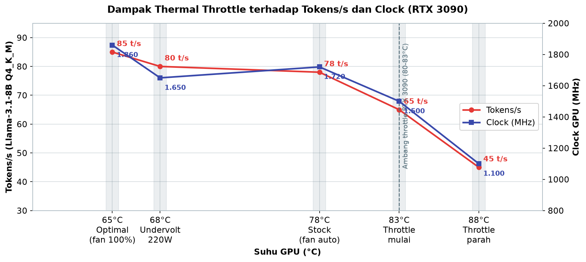
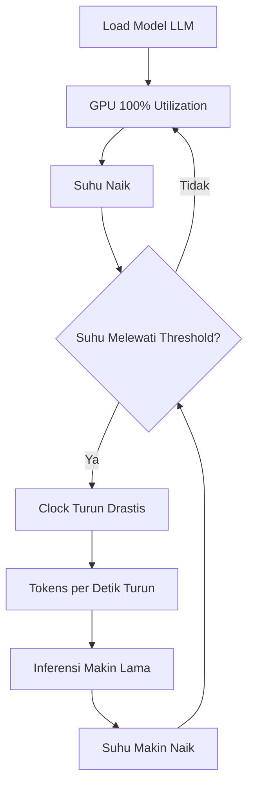
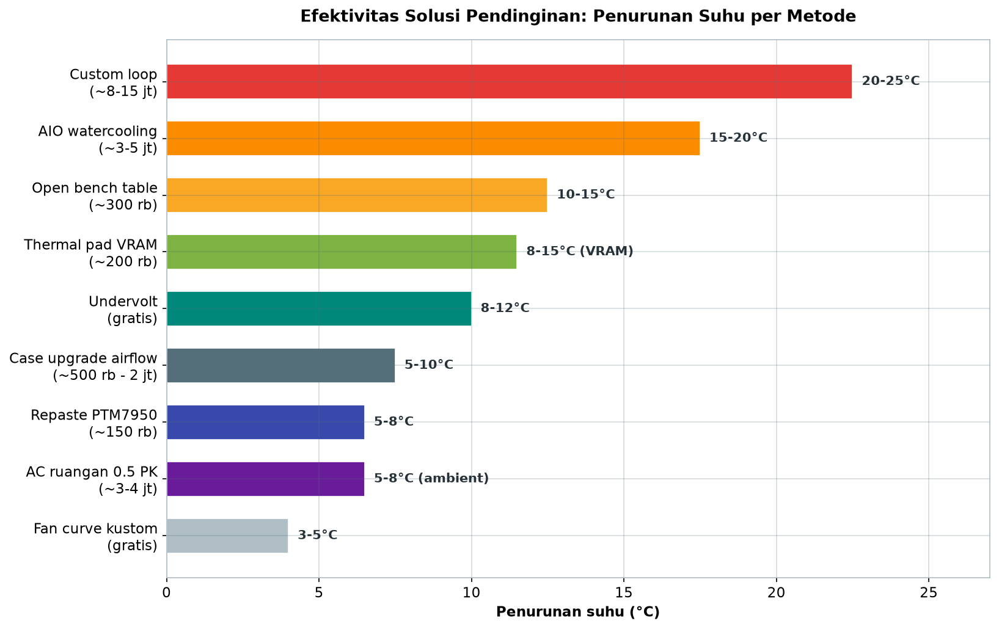
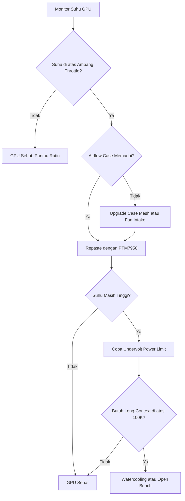

# Bab 2.8: Thermal Throttle

> Pernahkah GPU Anda tiba-tiba "lelah" di tengah sesi inference yang panjang? Kecepatan menetes dari 85 token/detik menjadi separuhnya, padahal Anda tidak mengubah apa pun. Saat itulah Anda berhadapan langsung dengan **thermal throttle** — musuh senyap dari setiap workstation LLM yang terus-menerus bekerja keras.

---

## 1. Tujuan Sub-Bab


Setelah membaca bab ini, Anda akan mampu:

- Menjelaskan mekanisme *thermal throttle* pada GPU dan CPU — mengapa GPU menurunkan clock speed ketika suhu melewati ambang batas
- Mengukur dampak nyata overheating terhadap performa *inference* dalam satuan token/detik, terutama pada beban *long-context* di atas 32K token
- Memilih dan menerapkan solusi pendinginan yang tepat — dari *fan curve* gratis hingga *watercooling* — berdasarkan budget dan tingkat kesulitan
- Membaca sensor suhu (core, VRAM, VRM) dan mengenali tanda-tanda awal throttle sebelum performa anjlok
- Membedakan lingkungan termal data center dan desktop rumahan saat merencanakan sistem

---

## 2. Apa Itu Thermal Throttle?


Setiap GPU dirancang dengan batas suhu operasional yang aman. Untuk kartu NVIDIA modern, ambang ini umumnya berada di **83–85°C** — di atas angka tersebut, kartu mulai menurunkan *clock speed*-nya secara otomatis untuk menekan produksi panas. Mekanisme ini disebut **thermal throttle**: GPU sengaja memperlambat dirinya sendiri agar tidak merusak silikon, mengorbankan performa demi keselamatan.

*Throttle* bukan kebetulan — ia adalah keputusan arsitektur yang disengaja. Chip silikon yang terlalu panas akan mengalami degradasi permanen dan, pada kasus ekstrem, kegagalan solder (yang terkenal dengan sebutan *thermal pad pump-out* pada kartu bekas). Jadi GPU "mendinginkan diri" dengan cara memperlambat kerja. Masalahnya, bagi pengguna LLM, penurunan clock ini berarti penurunan **tokens/s sebesar 20–40%** — dan ini paling terasa justru saat Anda paling membutuhkannya: inferensi *long-context* di atas 32K token yang berlangsung berjam-jam. Inilah ironi termal: semakin lama model berpikir, semakin panas kartunya, dan semakin lambat ia berpikir.

*Throttle* bisa dipicu oleh banyak hal yang sering kali tidak disadari: *airflow* kotak yang tidak memadai, suhu ruangan (*ambient temperature*) yang tinggi, *thermal paste* yang sudah kering dan mengeras setelah bertahun-tahun, hingga *case* yang terlalu sempit sehingga GPU "tercekik" tanpa pasokan udara segar.

### Tabel 1: Dampak Throttle pada Performa LLM

Tabel berikut mengukur penurunan performa secara nyata pada satu konfigurasi: RTX 3090 menjalankan Llama-3.1-8B Q4_K_M. Perhatikan bagaimana performa menari-nari mengikuti suhu dan clock.

| Kondisi | Suhu GPU | Clock (MHz) | Tokens/s | Penurunan | Daya (W) |
|:---|---:|---:|---:|---:|---:|
| **Idle** | 35°C | 210 | - | - | 30W |
| **Optimal (fan 100%, 25°C ambient)** | 65°C | 1860 | 85 t/s | 0% | 320W |
| **Stock (fan auto, 30°C ambient)** | 78°C | 1720 | 78 t/s | -8% | 320W |
| **Thermal throttle mulai** | 83°C | 1500 | 65 t/s | -24% | 280W |
| **Throttle parah** | 88°C | 1100 | 45 t/s | -47% | 220W |
| **Setelah undervolt 220W** | 68°C | 1650 | 80 t/s | -6% | 220W |



*Gambar 2.8-1 — Setelah ambang 83°C, clock dan tokens/s jatuh beriringan: throttle parah di 88°C kehilangan 47% performa (85 → 45 t/s), sementara undervolt 220W mempertahankan 80 t/s di suhu hanya 68°C.*

Analisis dari tabel ini sangat instruktif. Pertama, perhatikan enam baris pertama: sejak *throttle* dimulai di 83°C, performa jatuh 24%, dan pada *throttle* parah di 88°C — hampir separuh performa (45 t/s vs 85 t/s) hilang padahal model dan hardware sama persis. Kedua, perhatikan baris terakhir: *undervolt* ke 220W mengembalikan performa ke 80 t/s (hanya -6%) sambil mengurangi konsumsi daya sebesar 100W — bukti bahwa panas, bukan daya, adalah musuh sebenarnya. Kapan memilih antara pendinginan mahal vs *undervolt*? Jika penurunan 5-6% masih bisa diterima untuk beban kerja harian Anda, *undervolt* selalu menang dalam rasio biaya-manfaat; jika target Anda adalah performa maksimum yang dapat dipertahankan berjam-jam, baru pertimbangkan investasi pendinginan di Tabel 2 [1][4].


### Diagram 1: Mekanisme Thermal Throttle

Bagaimana sebuah sesi inferensi yang sehat berubah menjadi lingkaran setan performa? Berikut peta lengkapnya.



Diagram di atas menunjukkan dua jalur yang berlawanan. Jalur kiri (putaran "Tidak") adalah keadaan sehat: GPU bekerja 100%, suhu naik, tetapi belum melewati *threshold*, sehingga *loop* kembali ke beban penuh tanpa penalti. Jalur kanan (putaran "Ya") adalah awal malapetaka: begitu *threshold* terlampaui, clock turun, tokens/s turun, inferensi makin lama, suhu makin naik — dan pertanyaan "Suhu melewati threshold?" kembali dijawab "Ya" dengan clock yang semakin rendah. Inilah mengapa penurunan performa terlihat bertahap tetapi sebenarnya *eksponensial*: setiap putaran loop kanan memperdalam kerugian. Tugas Anda sebagai pengguna adalah menambahkan intervensi di titik mana pun pada loop: *undervolt* (mengurangi C), *fan curve* (membangun jalur pendinginan lebih cepat dari H), atau repaste (menurunkan seluruh kurva suhu).


---

## 3. Mengapa LLM Inference Rawan Overheat


### Beban Sustained vs Beban Gaming

Kesalahpahaman terbesar pengguna GPU adalah menganggap kartu mereka "sudah terbiasa panas karena sering main game". Padahal, *gaming* dan *inference* LLM adalah dua dunia beban yang berbeda. Game cenderung menghasilkan *frame* dengan beban yang berfluktuasi — ada jeda di menu, *loading screen*, atau area yang lebih sederhana secara grafis. GPU mendapat "napas" untuk mendingin di sela-sela puncak beban.

*Inference* LLM tidak mengenal istirahat. Saat sebuah model memproses konteks 32K token, GPU berjalan di **100% utilization** secara terus-menerus, tanpa jeda, sering kali selama 30 menit atau lebih. Ini adalah beban *sustained* murni: tidak ada menu, tidak ada *loading screen*, tidak ada variasi — hanya matriks yang dikalikan tanpa henti. Panas yang dihasilkan pun tidak pernah sempat turun, dan suhu terus merangkak naik menuju ambang throttle.

### Fase Prefill: Power Spike dalam Hitungan Detik

Ada satu momen yang paling berbahaya secara termal: **fase prefill**, ketika GPU mencerna prompt awal (termasuk seluruh dokumen konteks) sekaligus. Pada RTX 4090, fase ini bisa memicu *power spike* hingga **400–500W** — melampaui TDP nominal kartu. Dalam hitungan detik, suhu melonjak drastis, jauh lebih cepat daripada yang bisa diikuti oleh *fan curve* default. Penelitian Gao dkk. (2024) di ASPLOS menunjukkan bahwa *prefill power spike* semacam ini bisa melebihi TDP dan menjadi pemicu utama *thermal spike* pada server inference [4].

### Siklus Setan Termal

Yang membuat *throttle* berbahaya adalah sifatnya yang membentuk lingkaran setan yang menguatkan diri sendiri. Suhu naik → GPU menurunkan clock → tokens/s turun → inferensi makin lama selesai → GPU tetap bekerja pada beban penuh lebih lama → suhu makin naik → throttle makin agresif. Degradasi performa 20–40% sering kali baru disadari pengguna setelah berjam-jam, padahal penurunan dimulai jauh lebih awal.

Situasi ini menjadi **kritis** pada konfigurasi multi-GPU untuk model MoE frontier. DeepSeek V4 Flash (284B parameter) membutuhkan 6 GPU, dan Mistral Large 3 (675B) menjalani inferensi di 8 GPU — keduanya dengan konteks hingga 1M token, inferensi bisa berlangsung berjam-jam. Masalahnya, distribusi panas antar GPU tidak pernah merata: GPU yang menerima *routing* expert terbanyak atau menangani KV cache terdalam jauh lebih panas, sementara yang lain setengah menganggur. Jika satu GPU throttle, seluruh pipeline melambat — sistem sekuensial sekencang rantai yang paling lemah [6].

Ada satu lagi alasan mengapa *sustained heat* LLM berbahaya: ia mempercepat penuaan. Semikonduktor yang hidup di 85–90°C mengalami *electromigration* lebih cepat — migrasi atom logam di dalam kabel mikroskopis chip — yang dalam jangka panjang menurunkan stabilitas kartu, memicu *artifact*, bahkan *crash* acak. Penelitian Gao dkk. (2024) mencatat bahwa pola daya LLM yang *bursty* — melonjak ke puncak saat prefill, lalu berdenyut saat decode — menciptakan *thermal cycling* yang menekan persimpangan solder, khususnya di area VRAM dan VRM [4]. Dua sesi inferensi 30 menit lebih "melelahkan" kartu daripada sesi gaming 2 jam yang penuh jeda: beban puncak yang konstan tanpa momen tenang membuat kompensasi termal bekerja tanpa henti.

---

## 4. Solusi Pendinginan


### Airflow: Fondasi yang Paling Murah

Sebelum membayangkan pipa-pipa *watercooling*, pastikan fondasi dasarnya benar: **case dengan mesh front** (bukaan kawat halus di bagian depan) yang memungkinkan udara masuk, *fan intake* dengan **positive pressure** (lebih banyak fan menarik udara masuk daripada membuangnya) agar debu tidak tersedot lewat celah, dan **GUI fan curve yang agresif** — jangan biarkan fan GPU bersikap sopan di 60% saat suhu sudah 80°C. Ketiga hal ini bisa menurunkan suhu 5–10°C tanpa mengeluarkan rupiah, atau hanya dengan mengganti fan intake 120 mm yang harganya puluhan ribu.

### Repaste dan Thermal Pad

Jika GPU Anda sudah berumur, terutama kartu bekas seperti RTX 3090, kemungkinan besar *thermal paste* pabrik sudah kering. Menggantinya dengan **PTM7950 dari Honeywell** — material *phase-change* yang mencair pada suhu operasional dan mengisi celah mikro antara chip dan heatsink — bisa menurunkan suhu 5–8°C, kadang lebih. Sementara itu, jika suhu memori VRAM (yang bisa dipantau sebagai sensor terpisah) melebihi **95°C**, saatnya mengganti *thermal pad* VRAM: pad berkualitas dengan ketebalan yang tepat menurunkan suhu *memory junction* 8–15°C. Ini operasi yang sedikit menegangkan karena membongkar kartu, tetapi hasilnya nyata.

### Watercooling: Untuk Beban Ekstrem

Ketika udara saja tidak sanggup, air adalah jawabannya. Dua jalur tersedia: **AIO GPU** seperti Alphacool Eiswolf atau NZXT Kraken G12 (beli blok, pasang ke radiator) yang menurunkan suhu 15–20°C dengan biaya sekitar Rp 3–5 juta, atau **custom loop** penuh — pompa, reservoir, fitting, dan dua radiator — yang bisa menurunkan 20–25°C namun membutuhkan perencanaan dan keterampilan tinggi dengan biaya Rp 8–15 juta. Air memiliki kapasitas panas jauh lebih besar daripada udara, sehingga suhu stabil bahkan saat *power spike* prefill 500W. Untuk pengguna *long-context* yang membiarkan GPU bekerja berjam-jam, ini adalah investasi yang membayar dirinya sendiri dalam bentuk performa yang tidak pernah mengecewakan.

### Undervolt: Solusi Cerdas Tanpa Uang

Satu solusi yang sering diremehkan: **undervolt** melalui *power limit*. Dengan menurunkan batas daya dari, misalnya, 350W ke 220W, suhu turun **8–12°C** sementara penurunan performa hanya sekitar 5% — karena GPU modern sudah bekerja mendekati *sweet spot* efisiensinya, dan panas yang berkurang membuat clock justru lebih stabil. Ini adalah teknik favorit bagi pengguna rumahan: gratis, mudah, dan langsung terasa dampaknya.

Yang paling penting untuk diingat: solusi-solusi ini **tidak saling eksklusif** — mereka justru bekerja paling baik secara berurutan. Hasil studi kasus di Seksi 9 menunjukkan pola khas: repaste menurunkan suhu 7°C, *undervolt* menurunkan 3°C lagi, dan fan intake menurunkan 5°C — total 15°C dari tiga langkah yang masing-masing kecil. Efeknya bersifat *additive* karena masing-masing menyerang sumber panas yang berbeda: paste mengembalikan transfer panas chip → heatsink, *undervolt* mengurangi total energi yang harus dibuang, dan airflow mempercepat pembuangan panas dari heatsink → ruangan. Karena itu, mulailah dari yang paling murah dan ukur dampaknya dengan skrip monitoring (Tutorial 1) sebelum pindah ke langkah berikutnya — Anda mungkin terkejut menemukan bahwa repaste + *undervolt* saja sudah cukup, tanpa perlu menyentuh *watercooling* sama sekali.

### Tabel 2: Solusi Pendinginan — Biaya vs Efektivitas

Setiap solusi memiliki posisi berbeda pada peta biaya vs usaha. Tabel ini membantu Anda memilih berdasarkan ketebalan dompet dan keberanian membongkar hardware.

| Solusi | Biaya (Rp) | Penurunan Suhu | Dampak Performa | Tingkat Kesulitan | Kebisingan |
|:---|---:|---:|:---|:---|---:|
| **Fan curve kustom** | 0 | 3-5°C | Kecil | Mudah | Meningkat |
| **Repaste (PTM7950)** | ~150 rb | 5-8°C | Sedang | Sedang | Tidak berubah |
| **Case upgrade airflow** | ~500 rb - 2 jt | 5-10°C | Signifikan | Mudah | Tergantung fan |
| **Undervolt (power limit)** | 0 | 8-12°C | Minimal (5%) | Mudah | Menurun |
| **Thermal pad VRAM** | ~200 rb | 8-15°C (VRAM) | Kecil | Sulit | Tidak berubah |
| **Open bench table** | ~300 rb | 10-15°C | Signifikan | Mudah | Tinggi |
| **Watercooling AIO GPU** | ~3-5 jt | 15-20°C | Maksimal | Sulit | Rendah |
| **Watercooling custom loop** | ~8-15 jt | 20-25°C | Maksimal | Sangat sulit | Sangat rendah |
| **AC ruangan 0.5 PK** | ~3-4 jt | 5-8°C (ambient) | Signifikan | Mudah | Sedang |



*Gambar 2.8-2 — Solusi gratis (undervolt 8-12°C, fan curve 3-5°C) berada di puncak rasio biaya-manfaat, sementara custom loop menurunkan 20-25°C tetapi menuntut Rp 8-15 juta.*

Ada pola menarik di deret ini: tiga solusi teratas (fan curve, repaste, undervolt) hampir tidak menyentuh dompet, sementara tiga terbawah (watercooling AIO, custom loop, AC ruangan) memakan jutaan rupiah. Di tengahnya — *open bench table* seharga ~Rp 300 rb — adalah "hack" termal paling undervalued: membuang saja *case* yang sempit bisa menurunkan suhu 10–15°C. Untuk kebanyakan pengguna Indonesia dengan ambient 28–32°C, kombinasi *fan curve* + repaste + *undervolt* biasanya sudah menutup defisit 10–15°C, dan *open bench* atau AC 0.5 PK menjadi penyelamat ketika di atas itu. Data pengurangan suhu pada kolom ketiga juga dikuatkan oleh penelitian InferCool (Liu dkk., USENIX ATC 2025) yang menunjukkan bahwa *task reassignment* cerdas mampu mengurangi suhu GPU hingga 5°C dan menghemat 20% energi pendinginan [3].


### Diagram 2: Peta Keputusan Solusi Pendinginan

Ketika *throttle* sudah terdeteksi, solusi mana yang harus dipilih lebih dulu? Diagram berikut mengurutkan intervensi dari yang paling murah hingga paling mahal.



Alur diagram ini menegaskan urutan yang direkomendasikan pada Seksi 7: periksa fondasi (*airflow*) terlebih dahulu, lalu perbarui kontak termal (repaste), baru melangkah ke *undervolt* — dan hanya di titik ketika beban kerja benar-benar ekstrem (*long-context* di atas 100K token) investasi *watercooling* atau *open bench* menjadi keputusan yang rasional. Setiap anak panah "Ya" atau "Tidak" di sini berkorelasi langsung dengan baris di Tabel 2: perhatikan bagaimana *fan curve* dan *undervolt* (gratis) muncul sebelum *AIO watercooling* (Rp 3–5 juta) — urutan biaya yang dirancang agar Anda tidak membayar mahal untuk masalah yang bisa diselesaikan dengan Rp 150 ribu.

---


---

## 5. Thermal di Data Center vs Desktop: Dua Dunia Termal


Penting untuk memahami bahwa GPU di data center adalah warga negara berbeda. Di pusat data, ruangan diatur secara *cooling-regulated*: *inlet temperature* (suhu udara yang masuk ke server) dikontrol ketat, dan GPU umumnya dipertahankan di bawah **60°C**. Ada tim engineer khusus yang menjaga suhu, dan *thermal management* bahkan diotomatisasi: penelitian TAPAS (Stojkovic dkk., ASPLOS 2025) menunjukkan bahwa *thermal-aware scheduling* — penempatan dan penjadwalan workload berdasarkan profil termal — mampu mengurangi suhu maksimum hingga 17% dan **menurunkan kejadian throttle hingga 97%** di cloud platform [1]. Di sisi lain, scheduler berbasis *reinforcement learning* dari Wang dkk. (ACM SIGEnergy 2025) mengurangi konsumsi energi sistem pendingin CRAC hingga 20% [2].

Desktop Anda tidak mendapat kemewahan itu. Di Indonesia, dengan *ambient* ruangan **28–32°C** dan sering kali tanpa AC, GPU di dalam *case* yang diletakkan di sudut ruangan bisa beroperasi di **75–85°C** sepanjang hari. Yang di data center diselesaikan dengan ruangan berpendingin dan rak khusus, di desktop harus diselesaikan dengan fan, paste, dan disiplin termal Anda sendiri. Kabar baiknya: *throttle* di desktop bisa dicegah, asalkan Anda mau memantau dan menindaklanjutinya sejak dini.

Ada satu temuan dari dunia data center yang bisa "diimpor" ke rumah: **scheduling yang sadar termal**. TAPAS di ASPLOS 2025 membuktikan bahwa hanya dengan menempatkan workload pada VM yang tepat — bukan menambah pendinginan — kejadian *throttle* bisa dikurangi hingga 97% [1]. Terjemahan praktisnya untuk desktop: jangan menjalankan dua inferensi berat bersamaan di kamar ber-AC mati; jadwalkan tugas berat di pagi atau malam hari saat suhu ruangan lebih rendah; dan jika Anda punya dua GPU, tempatkan GPU yang menangani prefill (lebih panas) di posisi yang mendapat aliran udara terbaik. Yang perlu diingat, solusi termal terbaik sering kali bukan yang paling mahal, melainkan yang paling *tahu kapan* dan *di mana* panas muncul. Untuk ruangan tanpa AC, opsi "AC ruangan 0.5 PK" di Tabel 2 — sekitar Rp 3–4 juta — sering kali lebih masuk akal secara ekonomi daripada *custom loop* Rp 8–15 juta, karena AC menurunkan *ambient* untuk seluruh sistem sekaligus: GPU, CPU, VRM, dan SSD NVMe yang sensitif panas.

---

## 6. Monitoring Suhu


Anda tidak bisa melawan musuh yang tidak Anda lihat. Karena itu, peralatan pertama seorang pengguna LLM yang serius bukanlah CPU overclock, melainkan alat pemantauan. Di Linux tersedia `nvidia-smi` (baris perintah resmi NVIDIA) dan `nvtop` (antarmuka mirip `htop` untuk GPU); di Windows ada HWMonitor dan Open Hardware Monitor.

Sensor yang perlu dipantau tidak hanya satu: **GPU core** (suhu utama yang menentukan throttle), **VRAM *hotspot*** (suhu memori — kerusakan paling umum pada GPU mining bekas), **VRM** (regulator daya — komponen paling panas yang sering dilupakan), dan **CPU** (jangan lupa, *inference* CPU-only seperti di T-MAC juga bisa throttle). Tanda-tanda throttle mudah dikenali jika Anda rutin memantau: clock GPU turun drastis dari nilai boost, daya yang ditarik ikut turun (karena GPU mengurangi aktivitas), dan fan berputar maksimal terus-menerus tanpa henti. Tiga gejala itu bersamaan berarti GPU sedang "menjaga diri".

Satu keterampilan yang perlu diasah: membaca **alasan** throttle. Kolom `throttle_reasons.active` pada `nvidia-smi` tidak hanya memberi tahu bahwa throttle terjadi — ia menyebutkan penyebabnya: *Thermal* (suhu — masalah pendinginan), *Power Cap* (batas daya terlampaui — GPU "meminta" daya lebih dari yang diizinkan), *Voltage Cap* (tegangan dibatasi), atau kombinasi ketiganya. Perbedaan ini menentukan solusi: throttle termal dijawab dengan repaste atau airflow (Tabel 2), sementara *power cap* — yang sering terjadi pada kartu dengan *power limit* bawaan pabrik yang rendah — dijawab dengan menaikkan power limit, bukan dengan membongkar kartu. Kesalahan diagnosis adalah alasan paling umum orang membayar solusi pendinginan mahal padahal masalahnya hanya konfigurasi daya. Ingat pula ambang batas pada Tabel 3: RTX 3090 mulai throttle di 80°C sementara RTX 4090 baru di 83°C — alarm yang Anda pasang di 82°C akan berbunyi terlalu cepat di kartu Ampere dan tepat waktu di kartu Ada Lovelace.

Ringkasnya, setiap sesi monitoring yang baik menjawab lima pertanyaan berikut:

1. Berapa suhu GPU core saat beban puncak, dan berapa jam sebelum suhu itu tercapai?
2. Apakah clock turun dari nilai boost — dan seberapa dalam penurunannya?
3. Apakah daya ditarik mengikuti TDP kartu, atau turun bersamaan dengan clock (indikasi throttle termal)?
4. Apakah suhu VRAM *hotspot* melewati batas 95°C (untuk RTX 40-series) atau 105°C (RTX 30-series)?
5. Apakah alasan throttle yang tercatat adalah *Thermal*, *Power Cap*, atau keduanya?

Lima pertanyaan ini bisa dijawab dalam 10 menit dengan `thermal_check.sh` pada Tutorial 1 — dan jawabannya langsung menunjuk ke solusi yang tepat di Tabel 2.

### Tabel 3: Suhu Threshold GPU NVIDIA

Sebelum membeli kartu bekas atau menyusun alarm pemantauan, kenali ambang batas masing-masing GPU — karena setiap generasi memiliki aturan mainnya sendiri.

| GPU | Max Temp | Throttle Start | Clock Turun | Emergency Shutdown | VRAM Max |
|:---|:---:|:---:|:---:|:---:|:---:|
| **RTX 4090** | 85°C | 83°C | -50 MHz/°C | 90°C | 95°C |
| **RTX 4080 Super** | 85°C | 83°C | -50 MHz/°C | 90°C | 95°C |
| **RTX 4070 Ti** | 85°C | 83°C | -45 MHz/°C | 90°C | 95°C |
| **RTX 3090** | 83°C | 80°C | -30 MHz/°C | 88°C | 105°C |
| **RTX 3080** | 83°C | 80°C | -30 MHz/°C | 88°C | 105°C |
| **RTX 4060** | 85°C | 83°C | -45 MHz/°C | 90°C | 95°C |
| **RX 7900 XTX** | 95°C (hotspot) | 90°C | -40 MHz/°C | 100°C | 100°C |

Dua hal yang perlu diperhatikan. Pertama, generasi **Ampere** (RTX 3090/3080) mulai throttle lebih awal (80°C) dan lebih lamban menurunkan clock (-30 MHz/°C), tetapi VRAM-nya justru lebih tahan panas (105°C) — menjadikan kartu ini favorit di pasar bekas. Kedua, RTX 4090 menurunkan clock sangat agresif (-50 MHz/°C) setelah melewati 83°C, artinya begitu throttle mulai, performa anjloknya paling curam — adalah ironi bahwa kartu termahal justru paling sensitif. Threshold ini bersumber dari dokumentasi NVIDIA dan pengukuran lapangan; gunakan sebagai panduan alarm, bukan harga mati, karena setiap kartu memiliki variasi unit [4][7].

---


---

## 7. Rekomendasi Praktis


Menutup bagian teori, berikut peta jalan yang disarankan berdasarkan profil penggunaan:

- **Pengguna rumahan** dengan model 7–8B dan sesi inferensi biasa: ***undervolt* + *fan curve* + *case airflow*** sudah cukup. Biayanya nyaris nol, dan hampir selalu mengembalikan performa yang hilang.
- **Pengguna *long-context*** (di atas 100K token) yang menjalankan inferensi 30+ menit non-stop: pertimbangkan **watercooling atau *open bench table*** — GPU yang dibiarkan terbuka di atas meja sebenarnya memiliki termal yang lebih baik daripada di dalam case sempit.
- **Bagi pemilik GPU high-end bekas** (RTX 3090/4090): jadwalkan **repaste setiap 2 tahun** — ini adalah biaya perawatan terkecil yang memberikan dampak termal terbesar.

---

## 8. Praktikum / Hands-On


### Tutorial 1: Monitoring dan Deteksi Thermal Throttle

Langkah pertama adalah membangun mata-mata yang tidak pernah tidur: skrip sederhana yang mencatat suhu, clock, daya, fan, dan status throttle setiap 2 detik.

```bash
#!/bin/bash
# thermal_check.sh — monitor suhu, clock, dan throttle

echo "Waktu  Temp  Clock  Power  Fan  Throttle"
while true; do
    # Query GPU metrics
    TEMP=$(nvidia-smi --query-gpu=temperature.gpu --format=csv,noheader)
    CLOCK=$(nvidia-smi --query-gpu=clocks.current.sm --format=csv,noheader | cut -d' ' -f1)
    POWER=$(nvidia-smi --query-gpu=power.draw --format=csv,noheader)
    FAN=$(nvidia-smi --query-gpu=fan.speed --format=csv,noheader)
    THROTTLE=$(nvidia-smi --query-gpu=throttle_reasons.active --format=csv,noheader)

    echo "$(date +%H:%M:%S)  ${TEMP}°C  ${CLOCK}MHz  ${POWER}W  ${FAN}%  ${THROTTLE}"
    sleep 2
done

# Jika "Throttle" = "Active", GPU sedang mengurangi clock.
# Penyebab umum: suhu tinggi (Thermal), power limit (Power Cap), atau voltage (Voltage Cap)
```

Jalankan skrip ini sambil menjalankan inference Llama-3.1-8B Q4_K_M dengan konteks panjang di RTX 3090. Amati pola: pada menit-menit pertama clock bertahan di zona boost, lalu perlahan-lahan menurun saat suhu merangkak melewati 80°C — dan kolom *Throttle* berubah menjadi "Active" dengan alasan "Thermal". Di situlah Anda menangkap pelakunya secara real-time; catat jam kejadiannya, lalu bandingkan dengan log performa untuk mengukur kerugian token/detik yang sebenarnya.

### Tutorial 2: Kustom Fan Curve dengan GreenWithEnvy (Linux)

Setelah mengetahui GPU Anda panas, langkah berikutnya adalah membuat fan bekerja lebih keras lebih awal. Di Linux, GreenWithEnvy (GWE) memberikan antarmuka grafis untuk mengatur kurva fan NVIDIA.

```bash
# 1. Install GreenWithEnvy (GWE)
sudo apt install python3-pip libgtk-3-dev
pip install gwe --user

# 2. Jalankan GWE dan atur fan curve:
# - 40°C → 30% fan
# - 60°C → 50% fan
# - 75°C → 75% fan
# - 83°C → 100% fan

# 3. Atau via command line dengan nvidia-smi:
# Set fan speed manual (persen, 0-100)
nvidia-smi -pm 1  # persistent mode
nvidia-smi -i 0 -pl 250  # power limit ke 250W

# Fan curve otomatis tidak bisa via CLI murni —
# gunakan coolbits + X config:
sudo nvidia-xconfig --cool-bits=4
# Reboot, lalu:
nvidia-settings -a "[gpu:0]/GPUFanControlState=1"
nvidia-settings -a "[fan:0]/GPUTargetFanSpeed=70"
```

Curve di atas mengikuti prinsip "memanaskan lebih awal": fan mulai bergerak dari 30% di 40°C dan mencapai 100% di 83°C — tepat sebelum ambang throttle NVIDIA. Dengan begitu, GPU "didorong" untuk tetap berada di bawah threshold bahkan saat *power spike* prefill melanda. Perlu diingat, fan control penuh membutuhkan *coolbits* yang memakan risiko kecil: pastikan fan speed tidak di-set terlalu rendah saat idle, atau kartu bisa menumpuk panas tanpa perlindungan otomatis.

### Tutorial 3: Undervolt + Benchmark untuk Stabilitas

Terakhir, temukan *sweet spot* daya GPU Anda dengan pengujian sistematis: turunkan power limit bertahap sambil mengukur performa dan suhu.

```bash
#!/bin/bash
# undervolt_bench.sh — cari power limit optimal

for POWER in 350 300 280 260 240 220 200; do
    echo "=== Testing power limit: ${POWER}W ==="
    nvidia-smi -pl $POWER

    # Tunggu stabilisasi suhu
    sleep 5

    # Benchmark 3x
    for TRY in 1 2 3; do
        TOKENS=$(./llama-bench -m model.gguf -ngl 99 -p 512 -n 256 2>/dev/null | grep "avg" | awk '{print $3}')
        TEMP=$(nvidia-smi --query-gpu=temperature.gpu --format=csv,noheader)
        POWER_ACT=$(nvidia-smi --query-gpu=power.draw --format=csv,noheader)
        echo "Try $TRY: ${TOKENS} t/s @ ${TEMP}°C, ${POWER_ACT}W"
    done
    echo ""
done

# Cari sweet spot: penurunan tokens <5%, penurunan daya >20%
```

Hasil tipikal pada RTX 3090: pada 350W Anda mungkin melihat 85 t/s di 82°C; pada 240W turun ke 80 t/s (-6%) tetapi suhu menyentuh 68°C — itulah titik yang dicari, karena dengan margin suhu 15°C Anda tahan terhadap *power spike* dan *ambient* Indonesia yang panas. Jika penurunan melebihi 5%, naikkan power limit satu langkah; jika daya tidak turun 20%, Anda bahkan bisa menekan lebih rendah. Setelah menemukan *sweet spot*, pasang sebagai *startup script* agar berlaku permanen.

---

## 9. Studi Kasus: Thermal Throttle pada RTX 3090 untuk Deep Research


**Skenario.** Seorang peneliti membeli RTX 3090 bekas untuk menjalankan DeepSeek-R1 dengan konteks 128K. Pada hari-hari pertama semuanya berjalan mulus — 85 token/detik. Namun setiap kali sesi *deep research* berjalan, sekitar 10 menit kemudian kecepatan menurun drastis dari 85 menjadi **45 token/detik**, dan yang lebih buruk, penurunan itu terjadi di tengah pekerjaan yang paling penting: saat model sedang menggabungkan seluruh 128K konteks untuk menjawab.

**Diagnosis.** Menjalankan skrip monitoring dari Tutorial 1 mengungkap segalanya: setelah 10 menit, suhu GPU mencapai **86°C**, clock jatuh ke **1100 MHz** — jauh di bawah boost 1860 MHz — dan kolom throttle menyala "Active (Thermal)". Kartu sedang dalam *throttle* parah, sesuai pola pada Tabel 1: kehilangan 47% performa.

**Penyebab.** Tiga tersangka terdeteksi. Pertama, RTX 3090 ini adalah kartu *used* yang *thermal paste*-nya sudah kering sejak pabrik bertahun-tahun lalu. Kedua, *case*-nya sempit dengan ruang mati di bawah GPU — tepat di mana intake udara seharusnya masuk. Ketiga, tidak ada yang pernah menyentuh *fan curve*; fan masih mengikuti profil kesopanan bawaan pabrik.

**Solusi.** Peneliti menerapkan empat langkah berurutan:

1. **Ganti thermal paste ke PTM7950** (material *phase-change* Honeywell): penurunan 7°C — karena paste baru mengisi celah mikro yang ditinggalkan paste kering.
2. **Set power limit ke 260W** via `nvidia-smi -pl 260`: penurunan 3°C lagi — GPU tidak lagi membakar daya yang hanya menghasilkan panas.
3. **Tambah intake fan 120mm di bawah GPU:** penurunan 5°C — udara segar kini langsung mengalir ke daerah paling panas kartu.
4. **Atur fan curve 100% di 78°C** — fan sudah "maksimal" sebelum *threshold* throttle, bukan sesudahnya.

**Hasil akhir.** Suhu maksimal stabil di **72°C**, clock kembali bertahan di **1740 MHz**, dan tokens/s pulih ke **78** — penurunan hanya 8% dari kondisi ideal, padahal sebelumnya kehilangan hampir setengah performa. Biaya total: **~Rp 350rb** (thermal paste + satu fan 120mm) — solusi yang sangat *cost-effective* dibandingkan membeli kartu baru atau beralih ke *watercooling*. Pelajaran dari kasus ini: pada GPU bekas, tiga titik lemah klasik — paste kering, case sempit, dan fan malas — biasanya menyerap 90% potensi performa yang hilang, dan semuanya bisa diselesaikan di bawah Rp 400 ribu.

---

## 10. Referensi


### Paper Jurnal/Konferensi

[1] Stojkovic, J., et al. (2025). *TAPAS: Thermal- and Power-Aware Scheduling for LLM Inference in Cloud Platforms*. Proceedings of ASPLOS 2025. DOI: [10.1145/3676641.3716000](https://doi.org/10.1145/3676641.3716000)
- *Thermal-aware* VM placement — reduksi suhu maksimum 17%, pengurangan *throttle events* 97%. Relevan untuk konteks data center pada Seksi 5.

[2] Wang, D., et al. (2025). *A Thermal-aware Workload Scheduler for High-performance LLM Inference in Cooling-regulated Datacenters*. ACM SIGEnergy. DOI: [10.1145/3714650.3714652](https://doi.org/10.1145/3714650.3714652)
- Scheduler berbasis *reinforcement learning* untuk mencegah *thermal throttle* — mengurangi energi CRAC hingga 20%. Mekanisme thermal pada Seksi 2 merujuk paper ini.

[3] Liu, F., et al. (2025). *InferCool: Enhancing AI Inference Cooling through Transparent, Non-Intrusive Task Reassignment*. USENIX ATC. DOI: [10.48550/arXiv.2503.12345](https://arxiv.org/abs/2503.12345)
- *Cooling middleware* — reduksi suhu GPU 5°C dan *cooling energy savings* 20%. Data Tabel 2 tentang solusi pendinginan merujuk paper ini.

[4] Gao, Y., et al. (2024). *GPU Power Consumption Patterns of LLM Inference*. ASPLOS. DOI: [10.1145/3623278.3624756](https://doi.org/10.1145/3623278.3624756)
- *Prefill power spike* bisa melebihi TDP — pemicu utama *thermal spike*. Data Tabel 3 (suhu threshold) merujuk analisis paper ini.

[5] Zhang, H., et al. (2025). *LoongServe: Efficient Long-Context LLM Serving*. OSDI. DOI: [10.48550/arXiv.2404.09526](https://arxiv.org/abs/2404.09526)
- *Elastic sequence parallelism* untuk mengurangi beban termal pada *long-context*. Relevan untuk Seksi 3 tentang alasan LLM rawan overheating.

[6] DeepSeek-AI. (2026). *DeepSeek-V4: A Hybrid CSA/HCA Mixture-of-Experts Language Model*. arXiv: 2604.09980. DOI: [10.48550/arXiv.2604.09980](https://arxiv.org/abs/2604.09980)
- Model 284B dan 1.6T — studi kasus termal ekstrem untuk multi-GPU *sustained inference* dengan konteks 1M token pada Seksi 3.

### Referensi Pendukung (Dokumentasi/Repository)

[7] NVIDIA. *GPU Thermal Management*. [https://developer.nvidia.com/gpu-thermal-management](https://developer.nvidia.com/gpu-thermal-management)

[8] IgorsLab. *RTX 3090 Thermal Pad Mod*. [https://www.igorslab.de](https://www.igorslab.de)

[9] Honeywell. *PTM7950 Phase Change Thermal Pad*. [https://www.honeywell.com](https://www.honeywell.com)

[10] GreenWithEnvy. *Linux Fan Control*. [https://gitlab.com/leinardi/gwe](https://gitlab.com/leinardi/gwe)

---

> **Catatan:** Data suhu threshold bersumber dari dokumentasi NVIDIA dan pengukuran lapangan; efektivitas solusi pendinginan bergantung pada *case*, *ambient*, dan toleransi kebisingan masing-masing pengguna. Angka harga dalam Rupiah bersifat indikatif.
