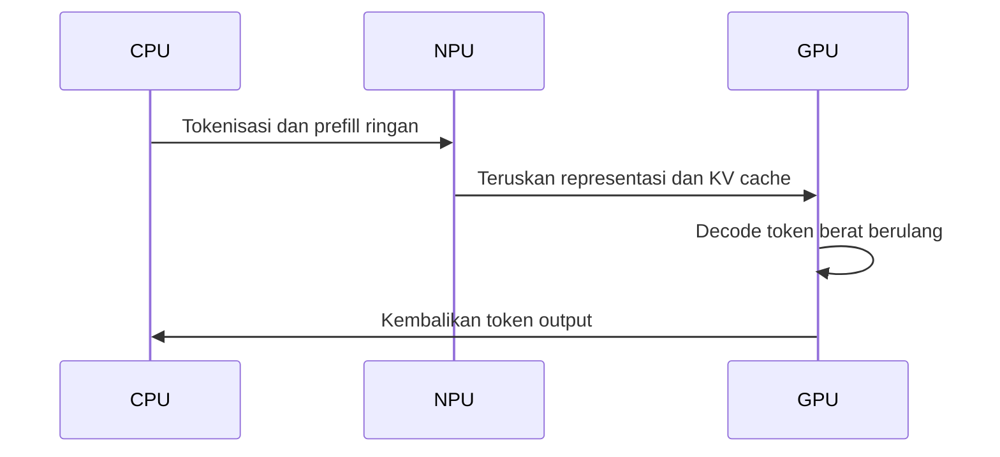
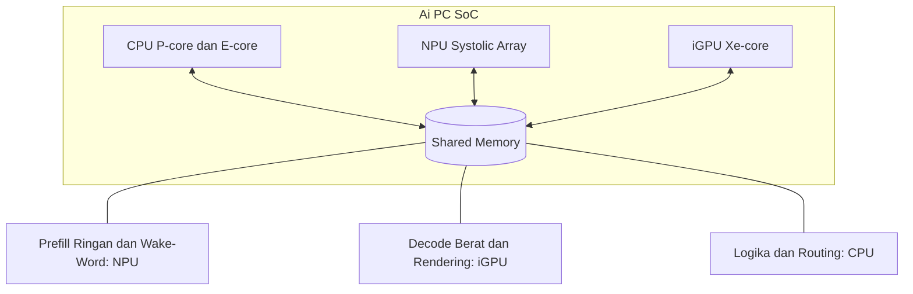
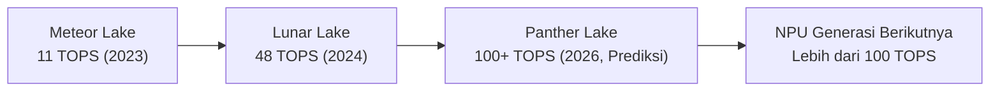

# Bab 2.9: NPU

> Bayangkan sebuah kota kecil yang sibuk melayani kebutuhan warga sehari-hari — tidak perlu jalan tol raksasa, cukup jalur yang efisien. Itulah **NPU** dalam ekosistem AI PC: unit kecil di dalam chip yang dirancang untuk tugas AI ringan secara hemat daya, sementara GPU tetap menjadi "jalan tol" untuk inferensi LLM yang berat.

---

## 1. Tujuan Sub-Bab

Setelah membaca bab ini, Anda akan mampu:

- Menjelaskan arsitektur dasar NPU — *Neural Processing Unit* — dan perannya dalam ekosistem AI PC modern
- Membandingkan NPU dari tiga vendor utama: Intel (Core Ultra), Qualcomm (Snapdragon X Elite), dan AMD (Ryzen AI), plus Apple Neural Engine
- Mengevaluasi secara kritis kemampuan nyata NPU untuk menjalankan LLM lokal versus klaim pemasaran (*hype*) yang beredar
- Menentukan kapan NPU berguna untuk beban kerja Anda — dan kapan GPU tetap tidak tergantikan
- Memahami arah perkembangan NPU hingga 2026, termasuk standar Copilot+ dan prediksi masa depan
- Menilai laptop AI PC secara kritis sebelum membeli — dari kombinasi NPU, iGPU, hingga *software stack* yang didukung

---

## 2. Apa Itu NPU?

**NPU** adalah akselerator AI khusus yang tertanam di dalam SoC (*System-on-Chip*) laptop dan PC modern — satu-satunya tugasnya adalah menjalankan komputasi jaringan saraf secara efisien. Berbeda dengan GPU yang merupakan mesin komputasi umum dengan ribuan core fleksibel, NPU dirancang sejak awal untuk satu jenis pekerjaan: *inference* matriks dengan presisi rendah.

Arsitekturnya menggunakan **systolic array** — susunan sel pemroses yang bekerja seperti barisan tentara menyampaikan data dari tangan ke tangan — yang dioptimalkan untuk operasi matriks INT8 dan INT4. Hasilnya adalah efisiensi energi yang mengesankan: **10–20 TOPS per watt**, jauh lebih baik daripada GPU dalam rasio ini untuk beban AI ringan. NPU generasi ini muncul di beberapa platform sekaligus: **Intel Core Ultra** (Meteor Lake dan Lunar Lake), **Snapdragon X Elite** dari Qualcomm, **AMD Ryzen AI** (Strix Point), serta **Apple Neural Engine** di chip M-series.

Perbedaan kunci yang perlu diingat: GPU adalah "truk" — kuat, fleksibel, tapi boros; NPU adalah "sepeda motor pengantar" — terbatas, tapi hemat dan cepat untuk tugas spesifik. Keduanya bukan pesaing, melainkan bagian dari sistem transportasi yang sama.

Mengapa NPU muncul sekarang, dan bukan satu dekade lalu? Karena tiga kekuatan bertemu di waktu yang sama. Pertama, **efisiensi**: untuk tugas AI ringan yang berjalan terus-menerus — dari *wake word* asisten hingga efek kamera — menjalankan GPU yang konsumsi dayanya 20–120W hanya untuk menyaring suara mikrofon adalah pemborosan yang tidak masuk akal di laptop; NPU dengan 15W melakukan pekerjaan yang sama sambil menyisakan baterai untuk aktivitas lain. Kedua, **persaingan x86**: laptop ARM Qualcomm yang hemat daya mengancam dominasi Intel dan AMD, sehingga keduanya membutuhkan "senjata AI" untuk menjaga pangsa pasar — dan NPU adalah kartu yang dimainkan. Ketiga, **dorongan Microsoft**: standar Copilot+ (minimal NPU 40 TOPS) sejak 2024 memaksa seluruh industri mengejar satu angka, yang justru mempercepat kemajuan generasi NPU secara luar biasa — dari 11 TOPS di 2023 menjadi 50 TOPS hanya dalam 18 bulan [5][7].

---

## 3. Generasi NPU 2024–2026

Perlombaan NPU dimulai dengan sungguh-sungguh pada 2024, ketika Intel meluncurkan Meteor Lake dengan NPU **11 TOPS** (dipasarkan sebagai Intel AI Boost) — kemampuan yang cukup untuk efek kamera dan *background blur*, tetapi jauh dari memadai untuk LLM. Titik balik datang pada pertengahan 2024 ketika Microsoft menetapkan standar **Copilot+ PC**: minimal NPU 40 TOPS. Semua vendor berlari mengejar angka itu.

Intel menjawab dengan **Lunar Lake** (Core Ultra 200V) yang NPU-nya melesat ke **40–48 TOPS**. Qualcomm hadir lebih awal dengan Snapdragon X Elite dan **Hexagon NPU 45 TOPS**. AMD menyodorkan **XDNA 2** di Ryzen AI 300 (Strix Point) dengan **50 TOPS** — tertinggi saat ini. Sementara itu, Apple diam-diam menggenjot Neural Engine 16-core di M4 hingga sekitar **38 TOPS**, meskipun tidak mengikuti standar Copilot+ karena berada di ekosistem macOS.

Peta lengkap persaingan generasi ini — lengkap dengan harga laptop pembawanya — bisa dilihat pada Tabel 1 di Seksi 8. Sebagai ringkasan: dari sisi TOPS, AMD memimpin dengan 50, tetapi dari sisi *software stack* dan ekosistem, Intel menikmati kematangan OpenVINO yang jauh lebih besar, sementara Qualcomm membawa efisiensi ARM yang legendaris ke Windows [5][7]. Angka TOPS sendiri baru sebagian dari cerita — seperti akan Anda lihat pada bagian berikutnya, TOPS tinggi tidak otomatis berarti inferensi LLM yang cepat.

Pola yang perlu dicatat dari evolusi ini: setiap generasi tidak hanya menaikkan TOPS, tetapi juga **menurunkan batas masuk**. Meteor Lake 11 TOPS hanya hadir di laptop Rp 12 juta ke atas pada 2024; dua tahun kemudian, Snapdragon X Plus dengan 45 TOPS — empat kali lipat lebih kuat — bisa dibawa pulang mulai Rp 15 juta. Dengan kata lain, kemampuan NPU generasi sebelumnya menjadi standar generasi berikutnya di harga yang lebih rendah. Inilah siklus yang sama yang pernah terjadi pada GPU dan CPU: spesifikasi kelas atas hari ini adalah barang kelas menengah besok. Bagi pembeli, artinya satu hal — kecuali Anda butuh laptop segera, menunggu satu generasi lagi hampir selalu memberi nilai lebih besar per rupiah.

---

## 4. Realitas vs Hype: NPU untuk LLM Inference

### Harapan: TOPS Tinggi, Inferensi Kencang?

Ketika pemasaran berbicara tentang "AI PC dengan NPU 45 TOPS", naluri pertama pembeli adalah membayangkan laptop yang bisa menjalankan semua model AI dengan lincah. Realitanya jauh lebih berwarna. NPU memang bisa menjalankan LLM — misalnya Llama-3.1-8B dalam INT4 — tetapi kecepatannya mengecewakan: sekitar **3,5 detik per token** pada NPU Intel. Sebagai perbandingan, GPU laptop *integrated* Intel Arc pada chip yang sama mencapai sekitar **20 token/detik** — artinya GPU sekitar **66 kali lebih cepat** daripada NPU untuk tugas LLM [1].

Mengapa bisa terjadi jurang selebar itu? Karena LLM *decoding* bergantung pada dua hal yang tidak dikuasai NPU: *memory bandwidth* (NPU berbagi bandwidth dengan CPU dan iGPU lewat *shared memory*, dan aksesnya dibatasi) dan fleksibilitas operasi (NPU dioptimalkan untuk operasi matriks padat berpresisi rendah, sementara *decoding* token melibatkan banyak operasi non-matriks). TOPS mengukur kecepatan komputasi teoretis; inferensi LLM nyaris selalu dikekang bandwidth — metrik yang tidak pernah dicantumkan di brosur [4].

### Realitas: Framework yang Membuat NPU Lebih Berguna

Namun, cerita NPU tidak berhenti di angka dasar yang menyedihkan itu. Riset akademik terus mengikis kekurangan NPU dengan cara-cara cerdas:

- **NITRO** (Abdelfattah dkk., 2024) adalah framework inferensi LLM di NPU Intel pertama yang mencapai **10x speedup** dibandingkan OpenVINO vanilla, dengan memetakan ulang operasi agar sesuai dengan pola *systolic array* [1].
- **llm.npu** (Liu dkk., MobiSys 2024) mengusulkan arsitektur *hybrid NPU-CPU-GPU* dengan *prompt chunking* dan deteksi *outlier* — mencapai **22,4x speedup prefill** dan **penghematan energi 30,7x** dibandingkan baseline [2].
- **T-MAC** (Wei dkk., EuroSys 2025) bahkan membalik narasi: dengan *table lookup* untuk inferensi low-bit, **CPU Snapdragon X Elite mencapai 12,6 token/detik** — mengalahkan NPU-nya sendiri yang hanya 10,4 t/s. Dalam kasus ini, NPU dikalahkan oleh CPU yang "seharusnya" lebih lambat [4].

Angka-angka ini mengajarkan satu pelajaran penting: untuk LLM, arsitektur dan *software stack* sama menentukan dengan spesifikasi mentah. NPU dengan TOPS tinggi tetapi ekosistem perangkat lunak yang kaku bisa kalah dari CPU yang dimanfaatkan dengan cerdas.

Lalu, di mana posisi NPU yang jujur dalam ekosistem LLM lokal saat ini? Jawabannya: di posisi yang tidak glamor tetapi sangat berguna. NPU unggul untuk **tugas AI ringan yang berjalan terus-menerus** — *wake-word detection* yang mendengar "Hai Asisten" sepanjang hari tanpa menguras baterai, *speech-to-text* untuk notulensi rapat, *background agent* yang memantau email, *continuous listening* untuk *live caption* — semua tugas yang jika dijalankan di GPU akan menguras daya dalam hitungan jam. Data benchmark pada Tabel 2 bahkan menunjukkan satu kasus di mana NPU layak dipertimbangkan untuk LLM itu sendiri: **Snapdragon X Elite** mengelola 10,4 t/s (Llama-2-7B) dengan daya hanya 12W — untuk *batch processing* yang tidak butuh respons real-time (misalnya terjemahan teks semalaman atau klasifikasi dokumen), kombinasi kecepatan moderat dan efisiensi daya luar biasa menjadikannya pilihan yang rasional. Aturan praktisnya: jika tugasnya "cepat, interaktif, dan berat" — GPU; jika tugasnya "lambat, terjadwal, dan hemat daya" — NPU.

Ringkasnya, pembagian kerja yang jujur antara NPU dan GPU dapat disimpulkan sebagai berikut:

1. **NPU:** tugas ringan berkelanjutan — *wake word*, *speech-to-text*, efek kamera, *background agent*, *continuous listening* — yang menuntut efisiensi watt, bukan kecepatan.
2. **GPU/iGPU:** LLM *decoding* interaktif, *creative generation*, rendering — tugas yang menuntut bandwidth dan kecepatan.
3. **CPU:** logika aplikasi, tokenisasi, dan routing antar unit — plus inferensi low-bit dengan T-MAC yang bahkan mengalahkan NPU.
4. **Larangan praktis:** jangan jadikan NPU satu-satunya alasan membeli laptop untuk LLM lokal — nilai NPU baru terasa jika *software stack*-nya (OpenVINO/QNN/Vitis AI) mendukung model yang Anda gunakan [1][2][4].

---

## 5. Arsitektur Heterogen: CPU + GPU + NPU

Kesimpulan dari penelitian di atas mengarah ke satu arah: masa depan AI PC bukan "NPU menggantikan segalanya", melainkan **heterogeneous computing** — ketiga unit komputasi (CPU, iGPU, NPU) bekerja sama, masing-masing mengerjakan tugas yang paling cocok. Penelitian **Agent.xpu** (Kim dkk., 2025) menunjukkan konsep ini dalam praktik: scheduler cerdas membagi *workload agentic* antara iGPU dan NPU, mencapai **1,2–2,4x throughput** dibandingkan iGPU-only [3].

Pembagian kerja yang umum: **NPU** menangani *prefill* ringan, *wake-word detection*, *background agent*, dan *continuous listening* — tugas yang berjalan terus-menerus sepanjang hari, sehingga efisiensi wattnya sangat berharga. **GPU/iGPU** menangani *LLM decoding* berat, rendering, dan *creative generation* — tugas yang membutuhkan kecepatan dan bandwidth, di mana NPU kewalahan. **CPU** menangani logika, tokenisasi, dan routing.

Di Intel Core Ultra, **OpenVINO** mengelola pembagian ini secara otomatis — aplikasi bisa menyatakan "jalankan di NPU" atau menyerahkan keputusan ke *device selection* otomatis. Pengguna akhir tidak perlu tahu unit mana yang bekerja; sistem memilih yang paling efisien untuk setiap lapisan model. Ini adalah filosofi yang sama dengan *smartphone* modern, di mana NPU kecil menangani pengenalan suara dan kamera sepanjang hari tanpa menguras baterai, dan GPU baru dipanggil untuk tugas berat.

Untuk membayangkan alur kerja heterogen ini secara konkret, ikuti perjalanan satu prompt melalui ketiga unit tersebut.



Urutan di atas menggambarkan pembagian tugas yang diusulkan riset *hybrid* seperti llm.npu dan Agent.xpu [2][3]: CPU membuka cerita dengan tokenisasi (mengubah teks menjadi ID), NPU mengambil alih *prefill* — memproses seluruh prompt sekaligus dalam operasi matriks masif yang memang menjadi kekuatannya — lalu menyerahkan bola ke GPU untuk *decode* token demi token, beban *bandwidth-bound* di mana iGPU unggul jauh. Hasil akhirnya dikembalikan ke CPU untuk ditampilkan. Perhatikan bahwa setiap perpindahan "bola" melewati *shared memory* — itulah mengapa *bandwidth* adalah sumber daya yang paling diperebutkan, dan mengapa desain scheduler menentukan segalanya.

Konsekuensi menarik dari arsitektur ini: pada laptop AI PC, **"GPU terbaik" belum tentu yang tercepat, melainkan yang paling mudah dijadwalkan bersama NPU**. iGPU yang sepenuhnya terintegrasi (bukan GPU diskret dengan memori terpisah) dapat berbagi *KV cache* langsung dengan NPU tanpa menyalin data melalui PCIe — penghematan yang oleh penelitian llm.npu dihitung mencapai 30,7x energi versus baseline CPU-only [2]. Inilah alasan mengapa integrasi SoC penuh — satu chip yang menampung CPU, iGPU, dan NPU dengan satu kolam memori — adalah arah yang ditempuh semua vendor, dan mengapa laptop diskret-GPU justru tertinggal dalam efisiensi meskipun unggul di kecepatan mentah.

---

## 6. Software Stack: Medan Pertempuran Sebenarnya

Jika hardware NPU adalah senjatanya, *software stack* adalah pelatihnya — dan di sinilah ketiga vendor sangat berbeda. Intel membangun **OpenVINO**, toolkit open-source dengan dukungan LLM matang (via optimum-intel) dan *quantization* INT8/INT4. Qualcomm menyodorkan **QNN** (Qualcomm Neural Network SDK), yang mumpuni secara teknis tetapi berlisensi tertutup dan sulit di-setup. AMD membawa **Vitis AI** dan Ryzen AI Software, dengan dukungan LLM yang masih eksperimental. Apple, di kutub lain, menyajikan **CoreML** dengan integrasi mendalam lewat MLX — mudah dipakai meskipun tertutup.

Kemudahan setup bervariasi tajam: memuat model ke NPU Intel cukup dengan satu baris `optimum-cli export openvino`, sementara jalur QNN untuk LLM masih menuntut kompilasi manual yang rumit. Bagi pengguna akhir, pilihan laptop "AI PC" sebenarnya adalah pilihan *software stack*, karena NPU tanpa perangkat lunak yang matang adalah hardware yang menganggur. OpenVINO juga membedakan Intel dengan dukungan *dynamic shapes* — penting untuk LLM yang panjang inputnya bervariasi — sementara QNN dan Vitis AI masih terbatas dalam hal ini.

Kabar baiknya, kondisi ini bergerak cepat. Baku *benchmark* mulai terbentuk — Intel menjadi vendor pertama dengan dukungan NPU penuh di MLPerf Client v0.6, mencatat *first-token latency* 1,09 detik dan *throughput* 18,55 t/s pada Llama-2-7B [5] — dan tolok ukur yang terstandarisasi akan memaksa vendor lain mengejar kematangan perangkat lunaknya. Selama standar itu belum merata, tip praktisnya sederhana: uji dulu platform yang Anda incar dengan model target Anda sendiri, dan jangan percaya angka TOPS tanpa melihat *framework* yang berjalan di atasnya.

---

## 7. Masa Depan NPU: Arah dan Batasnya

Ke mana arah perlombaan ini? Standar **Microsoft Copilot+** (minimal 40 TOPS) telah mendorong adopsi massal NPU — hampir semua laptop premium 2025–2026 membawa NPU yang memenuhi syarat. Pada 2026, generasi berikutnya menjanjikan **NPU 100+ TOPS** — Intel dengan Panther Lake, dan AMD dengan penerus Strix Point — yang akan membuka kemampuan baru seperti *on-device translation* dan *vision* real-time.

Namun, penting untuk menahan euforia. Model frontier 2026 — **DeepSeek V4 Pro** (1,6T parameter), **Mistral Large 3** (675B), GPT-5.5, dan Claude Fable 5 — sama sekali **tidak feasible di NPU**. Model sebesar itu membutuhkan GPU dengan HBM atau *unified memory* Apple Silicon dengan *bandwidth* di atas **500 GB/s**; NPU laptop dengan shared memory puluhan GB/s berada di galaksi yang berbeda [6]. Prediksi realistis: dalam 2–3 tahun, kombinasi NPU + iGPU akan cukup untuk menjalankan **SLM 3B–8B** dengan nyaman — cukup untuk asisten lokal di laptop — sementara model besar tetap menjadi wilayah GPU dan *unified memory*.

Bagi calon pembeli laptop di 2026, arah ini memiliki tiga implikasi praktis. Pertama, **jangan membayar ekstra hanya demi angka TOPS**: NPU 45 vs 50 TOPS tidak akan terasa dalam penggunaan sehari-hari; yang terasa adalah kualitas *software stack*-nya — uji dulu apakah model yang Anda butuhkan (misalnya Llama-3.2-3B) berjalan di platform itu sebelum membeli. Kedua, **pastikan laptop memiliki iGPU yang kompeten**: seperti berulang kali ditunjukkan di bab ini, iGPU — bukan NPU — adalah unit yang benar-benar menjalankan LLM di laptop AI PC; tanyakan apakah iGPU-nya bisa dipakai untuk *inference* (OpenVINO GPU di Lunar Lake, misalnya, mencapai 22 t/s untuk Llama-3-8B). Ketiga, **ketahuilah umur pakai dukungan**: NPU adalah hardware yang cepat berganti generasi, tetapi *software stack* yang terus diperbarui (OpenVINO dirilis berkala, MLPerf mulai membakukan benchmark NPU) menentukan berapa lama hardware Anda tetap berguna [5][8]. Beli laptop AI PC untuk masa kini — *background AI* yang hemat daya — dan jangan berharap NPU-nya menjadi mesin LLM masa depan.

---

## 8. Tabel Referensi

### Tabel 1: Spesifikasi NPU di AI PC (2024–2026)

Tabel berikut memetakan tujuh platform AI PC utama — dari NPU 11 TOPS generasi pertama Meteor Lake hingga XDNA 2 dengan 50 TOPS — lengkap dengan status Copilot+ dan ekosistem perangkat lunaknya.

| Platform | NPU Name | INT8 TOPS | Copilot+? | Arsitektur | Software Stack | Harga Laptop Mulai |
|:---|:---:|---:|:---:|:---|:---|:---:|
| **Intel Core Ultra 7 155H** | Intel AI Boost | 11 | Tidak (TPM <40) | Meteor Lake | OpenVINO | ~Rp 12 jt |
| **Intel Core Ultra 9 288V** | Intel AI Boost | 48 | Ya | Lunar Lake | OpenVINO | ~Rp 25 jt |
| **Qualcomm Snapdragon X Elite** | Hexagon NPU | 45 | Ya | Custom ARM | QNN / NPE | ~Rp 18 jt |
| **Qualcomm Snapdragon X Plus** | Hexagon NPU | 45 | Ya | Custom ARM | QNN / NPE | ~Rp 15 jt |
| **AMD Ryzen AI 9 HX 370** | XDNA 2 | 50 | Ya | Strix Point | Vitis AI / Ryzen AI SW | ~Rp 22 jt |
| **Apple M4** | Neural Engine 16c | ~38 | Tidak (macOS) | Apple Silicon | CoreML / ANE | ~Rp 18 jt |
| **Apple M4 Pro** | Neural Engine 16c | ~38 | Tidak (macOS) | Apple Silicon | CoreML / ANE | ~Rp 25 jt |

Tiga pengamatan penting dari tabel ini. Pertama, ambang **40 TOPS** (syarat Copilot+) terlihat jelas membelah pasar: hanya Lunar Lake, Snapdragon, dan Strix Point yang lolos, sementara Meteor Lake dan semua chip Apple tidak — yang terakhir karena macOS memang tidak mengikuti standar Microsoft, bukan karena kalah kemampuan. Kedua, menariknya **TOPS tinggi tidak berkorelasi dengan harga**: Snapdragon X Plus dengan 45 TOPS dijual mulai ~Rp 15 jt, termurah kedua di tabel, karena efisiensi ARM yang tinggi memungkinkan desain termal yang lebih sederhana. Ketiga, kolom *Software Stack* adalah petunjuk pertama bahwa pilihan NPU sebenarnya adalah pilihan ekosistem — topik yang dibahas lebih dalam di Tabel 3 [5][7].

### Tabel 2: Benchmark LLM Inference NPU vs GPU Laptop

Tabel berikut menjawab pertanyaan yang paling sering diajukan: seberapa cepat masing-masing perangkat menjalankan LLM, dan seberapa efisien per watt?

| Device | Framework | Model | Tokens/s | Daya | TOPS | Efisiensi (t/s/W) |
|:---|---:|---:|---:|---:|---:|---:|
| **Intel NPU (Meteor Lake)** | NITRO/OpenVINO | Llama-3-8B INT4 | ~0.3 t/s | 15W (NPU) | 11 | 0.02 |
| **Intel NPU + CPU hybrid** | Agent.xpu | Llama-3-8B W8A16 | ~5 t/s | 28W (total) | 11 | 0.18 |
| **Intel Arc iGPU (Lunar Lake)** | OpenVINO | Llama-3-8B INT4 | ~22 t/s | 35W (iGPU) | 67 (GPU) | 0.63 |
| **Snapdragon X Elite NPU** | QNN | Llama-2-7B INT4 | ~10.4 t/s | 12W (NPU) | 45 | 0.87 |
| **Snapdragon CPU (T-MAC)** | T-MAC (2 core) | Llama-2-7B W4 | ~12.6 t/s | 8W (CPU) | - | 1.58 |
| **AMD Ryzen AI NPU** | Vitis AI | Llama-3-8B INT4 | ~5 t/s | 20W (NPU) | 50 | 0.25 |
| **Apple M4 GPU (MLX)** | MLX | Llama-3.1-8B 4bit | ~60 t/s | ~30W (GPU) | - | 2.00 |
| **RTX 4090 Laptop** | CUDA/llama.cpp | Llama-3.1-8B Q4 | ~80 t/s | ~120W (GPU) | - | 0.67 |

Pembacaan tabel ini penuh kejutan. Perhatikan bahwa NPU dengan TOPS tertinggi (AMD 50 TOPS) justru tidak menghasilkan tokens/s tertinggi — Snapdragon X Elite (45 TOPS) menjalankan Llama-2-7B di 10,4 t/s, tiga kali lebih cepat dari AMD. Perhatikan pula baris T-MAC: CPU dengan 8W mengalahkan NPU yang sama-sama ada di dalam chip Snapdragon — bukti bahwa *software* bisa menang melawan *hardware* yang dirancang khusus. Sementara itu, Apple M4 GPU dengan MLX mencapai efisiensi 2,00 t/s/W — tertinggi di tabel — dan RTX 4090 laptop tetap raja kecepatan mentah (80 t/s) dengan konsekuensi daya 120W. Kesimpulan praktisnya: jika Anda ingin menjalankan LLM 7–8B di laptop, targetkan *iGPU* atau *GPU* — NPU adalah pendamping efisien, bukan pelari utama [1][2][3][4][5].

### Tabel 3: Komparasi Software Stack NPU

Perbandingan empat ekosistem *software* — faktor yang sebenarnya menentukan seberapa mudah NPU digunakan untuk LLM.

| Aspek | Intel OpenVINO | Qualcomm QNN | AMD Vitis AI | Apple CoreML |
|:---|:---|:---|:---|:---|
| **Model Format** | IR (Intermediate Rep) | QNN C++/C API | XIR / ONNX | .mlpackage |
| **LLM Support** | Ya (via optimum-intel) | Terbatas (NITRO) | Eksperimental | Ya (via MLX) |
| **Kemudahan Setup** | Sedang | Sulit | Sulit | Mudah |
| **Quantization** | INT8, INT4 | INT8 | INT8, INT4 | FP16, INT8 |
| **Dynamic Shapes** | Terbatas | Tidak | Tidak | Ya (via ANE) |
| **Open Source** | Ya | Tidak | Sebagian | Tidak |
| **Kematangan** | Tinggi (2024.6+) | Rendah | Rendah | Tinggi |

Dari tabel ini, pola persaingan menjadi jelas: Intel dan Apple memimpin dari sisi kematangan — OpenVINO menjadi satu-satunya stack open-source dengan dukungan LLM penuh, sementara CoreML/MLX menawarkan kemudahan setup terbaik di kelasnya. Qualcomm dan AMD unggul di hardware (efisiensi ARM dan TOPS tertinggi) tetapi tertinggal di perangkat lunak, dengan dukungan LLM yang terbatas atau eksperimental. Bagi pembeli laptop, ini berarti: NPU 50 TOPS tanpa stack yang matang sama nilainya dengan NPU 11 TOPS — keduanya tidak bisa menjalankan LLM dengan baik. *Pilih ekosistem, bukan hanya angka TOPS.*

---

## 9. Diagram & Visualisasi

### Diagram 1: Arsitektur Heterogen SoC AI PC

Inilah peta jalan komputasi AI di dalam sebuah SoC AI PC modern — tiga unit komputasi yang berbagi satu kolam memori.



Diagram ini menunjukkan mengapa NPU tidak bisa "sendiri" menjalankan LLM: ketiga unit terhubung ke *shared memory* yang sama, sehingga *bandwidth* menjadi sumber daya yang diperebutkan. Pembagian kerja yang ideal terlihat di bagian bawah: NPU mengambil tugas yang ringan tetapi berjalan terus-menerus (*wake-word detection*, prefill ringan, background agent) yang dalam setahun menghemat puluhan watt-jam; iGPU menangani *decoding* yang berat karena butuh bandwidth penuh; dan CPU menjadi pengatur lalu lintas. Arsitektur ini pula yang menjadi dasar penelitian Agent.xpu — scheduler yang membagi prefill ke NPU dan decode ke iGPU, menghasilkan throughput 1,2–2,4x lebih tinggi dibandingkan iGPU-only [3].

### Diagram 2: Evolusi TOPS NPU per Generasi

Untuk melihat seberapa cepat perlombaan ini berjalan, perhatikan garis waktu perkembangan TOPS NPU Intel — dari 11 TOPS yang "cukup untuk blur" hingga prediksi 100+ TOPS pada 2026.



Bacaan garis waktu ini luar biasa: dalam tiga tahun, TOPS NPU tumbuh hampir 10 kali lipat — dari 11 di Meteor Lake menjadi prediksi 100+ di Panther Lake. Bandingkan dengan *hukum Moore* klasik yang menggandakan transistor setiap dua tahun; NPU melaju jauh lebih cepat karena dimulai dari titik nol persaingan. Namun — dan ini penekanan yang perlu diulang — sejarah Tabel 2 mengajarkan bahwa TOPS bukan segalanya: Intel NPU 48 TOPS (Lunar Lake) menjalankan Llama-3-8B hanya pada 0,3 t/s dengan NITRO/OpenVINO, sementara iGPU-nya sendiri mencapai 22 t/s. Setiap titik pada garis waktu ini menaikkan *kapasitas teoretis*, tetapi *software stack* yang menentukan seberapa banyak kapasitas itu bisa dinikmati. Garis waktu ini pula yang menjadi dasar prediksi Seksi 7: pada 2026–2028, kombinasi NPU 100+ TOPS dengan iGPU yang matang akan cukup untuk menjalankan SLM 3B–8B secara nyaman di laptop [1][4][5].

---

## 10. Praktikum / Hands-On

### Tutorial 1: Jalankan LLM di NPU Intel dengan NITRO

Cara terbaik untuk memahami batas NPU adalah mengujinya sendiri. Framework NITRO adalah titik masuk paling mudah di NPU Intel.

```bash
# 1. Install OpenVINO 2024.6+
pip install openvino openvino_genai

# 2. Clone NITRO
git clone https://github.com/abdelfattah-lab/nitro
cd nitro

# 3. Download model Llama-3.2-3B INT4
optimum-cli export openvino -m meta-llama/Llama-3.2-3B-Instruct \
    --weight-format int4 Llama-3.2-3B-INT4

# 4. Jalankan di NPU
python nitro/run_npu.py \
    --model_path ./Llama-3.2-3B-INT4 \
    --device NPU \
    --prompt "Saya adalah asisten AI"

# 5. Bandingkan dengan CPU
python nitro/run_npu.py \
    --model_path ./Llama-3.2-3B-INT4 \
    --device CPU \
    --prompt "Saya adalah asisten AI"
```

Pengalaman yang diharapkan: pada langkah 4, NPU menghasilkan respons — tetapi dengan kecepatan yang terasa "berat", sekitar 3,5 detik per token untuk model 8B (model 3B sedikit lebih cepat). Pada langkah 5, CPU sering kali lebih cepat untuk prompt pendek karena NPU harus menyelesaikan inisialisasi pipa terlebih dahulu. Eksperimen ini mengajarkan dua hal: pertama, NPU benar-benar bisa menjalankan LLM — bukan *smoke and mirrors*; kedua, untuk penggunaan interaktif, NPU belum menawarkan pengalaman yang nyaman. Catat pula konsumsi daya keduanya dengan `powerstat` — di situlah NPU menunjukkan keunggulannya: efisiensi per watt untuk tugas yang memang ringan [1].

### Tutorial 2: Hybrid NPU + CPU + GPU dengan Agent.xpu

Selanjutnya, coba arsitektur masa depan: jalankan model secara *hybrid*, dengan prefill di NPU dan decode di iGPU.

```bash
# 1. Install Agent.xpu (Intel Core Ultra required)
pip install agent-xpu openvino

# 2. Optimasi model untuk heterogen compute
python -c "
from agent_xpu import HeterogeneousScheduler
from transformers import AutoTokenizer

model_id = 'meta-llama/Llama-3.2-3B-Instruct'

# Scheduler otomatis: prefill di NPU, decode di iGPU
scheduler = HeterogeneousScheduler(
    model_id=model_id,
    prefill_device='NPU',  # NPU untuk prefill ringan
    decode_device='GPU',   # iGPU untuk decode
    precision='int4'
)

tokenizer = AutoTokenizer.from_pretrained(model_id)
inputs = tokenizer('Jelaskan cara kerja NPU', return_tensors='pt')
outputs = scheduler.generate(**inputs, max_new_tokens=100)
print(tokenizer.decode(outputs[0]))
"
```

Perhatikan filosofi di balik dua baris konfigurasi `prefill_device='NPU'` dan `decode_device='GPU'`: *prefill* (memproses prompt sekaligus) adalah komputasi matriks masif yang cocok untuk *systolic array* NPU, sementara *decode* (menghasilkan token satu per satu) adalah beban *bandwidth-bound* yang jauh lebih cepat di iGPU. Hasil yang diharapkan adalah throughput 1,2–2,4x lebih tinggi dibandingkan menjalankan seluruhnya di iGPU — persis seperti temuan paper Agent.xpu [3]. Jika Anda tidak memiliki Core Ultra, skrip tetap berjalan di GPU biasa, hanya tanpa partisipasi NPU.

### Tutorial 3: Test T-MAC di Snapdragon X Elite

Terakhir, uji fenomena "CPU mengalahkan NPU" dengan T-MAC dari Microsoft di Snapdragon X Elite.

```bash
# 1. Clone T-MAC
git clone https://github.com/microsoft/T-MAC
cd T-MAC
pip install -r requirements.txt

# 2. Benchmark Llama-2-7B 4-bit via CPU T-MAC
python tools/bench_e2e.py \
    --model llama-2-7b-4bit \
    --num_threads 4 \
    --prompt_len 1024 \
    --gen_len 1024

# Output: ~18-22 t/s (Snapdragon X Elite, 4 core)
# Bandingkan: NPU via QNN hanya ~10.4 t/s
```

T-MAC mengganti inti perhitungannya: alih-alih menghitung perkalian matriks (yang menjadi kekuatan NPU), ia memakai *table lookup* — mencari hasil dari tabel yang disiapkan sebelumnya — yang sangat cocok untuk CPU ARM dengan *cache* cepat. Pada Snapdragon X Elite dengan 4 core, hasilnya 18–22 token/detik untuk Llama-2-7B 4-bit, hampir dua kali NPU-nya (10,4 t/s) dengan daya yang lebih rendah (8W vs 12W). Eksperimen ini adalah pelajaran paling tajam tentang *software stack*: algoritma yang tepat bisa membuat hardware "lebih lemah" mengalahkan hardware "lebih kuat" [4].

---

## 11. Studi Kasus: Memilih Laptop AI PC untuk LLM Lokal

**Skenario.** Seorang mahasiswa AI membutuhkan laptop baru dengan budget **Rp 20–25 juta** untuk menjalankan *coding assistant* lokal berbasis Llama-3.1-8B. Ia tergoda oleh kampanye "AI PC" yang mengklaim NPU 45–50 TOPS akan mempercepat semua pekerjaan AI-nya. Tiga kandidat masuk daftar:

- **Opsi A — Intel Core Ultra 9 288V (Lunar Lake):** NPU 48 TOPS + Arc iGPU + 32GB RAM, ~Rp 25 jt.
- **Opsi B — Snapdragon X Elite:** NPU 45 TOPS + Adreno iGPU + 32GB RAM, ~Rp 22 jt.
- **Opsi C — MacBook Pro M4 Pro:** GPU 20-core + 24GB *unified memory* + Neural Engine, ~Rp 25 jt.

**Analisis.** Setelah menelaah data di Tabel 2, keputusan menjadi lebih objektif. NPU di Opsi A dan B — 0,3 hingga 10,4 token/detik — jelas **tidak cukup untuk *real-time* coding assistant**; menunggu 3,5 detik per token membuat alur kerja tidak tertahankan. iGPU Lunar Lake dan Adreno mencapai ~20 t/s untuk model 7B — cukup untuk *basic use*, tetapi *coding assistant* interaktif idealnya di atas 30 t/s. Sementara itu, MacBook Pro M4 Pro dengan MLX menghasilkan **~60 t/s** — tiga kali lebih cepat dari Opsi A dan B untuk tugas LLM yang sama, berkat GPU yang lebih besar dan *unified memory* berbandwith tinggi.

**Rekomendasi.** Jika prioritas utama adalah LLM lokal, **MacBook M4 Pro masih unggul jauh** — dan ini bukan klaim partisan, melainkan hasil pengukuran efisiensi pada Tabel 2 (2,00 t/s/W). Laptop AI PC Intel/Qualcomm tetap pilihan menarik, tetapi NPU-nya belum matang untuk LLM; **GPU tetap menjadi backbone** inferensi di platform tersebut. Nilai NPU pada Opsi A/B bukan untuk LLM, melainkan untuk *background AI tasks*: *Windows Studio Effects* (blur dan *eye contact* di panggilan video), *voice transcription* langsung, dan *live captions* — tugas-tugas yang berjalan sepanjang hari tanpa menguras baterai, persis dengan peran NPU yang dijelaskan di Seksi 5. Mahasiswa tersebut akhirnya membeli Opsi A dengan pemahaman baru: membeli NPU 48 TOPS untuk fitur harian, tetapi menjalankan LLM di iGPU — dan jika budget memungkinkan, pindah ke MacBook untuk beban LLM yang serius.

---

## 12. Referensi

### Paper Jurnal/Konferensi

[1] Abdelfattah, M., et al. (2024). *NITRO: LLM Inference on Intel Laptop NPUs*. arXiv: 2412.11053. DOI: [10.48550/arXiv.2412.11053](https://arxiv.org/abs/2412.11053)
- Framework inferensi NPU pertama untuk Intel Core Ultra — 10x *speedup* vs OpenVINO vanilla. Data benchmark NPU Intel di Tabel 2 merujuk paper ini.

[2] Liu, J., et al. (2024). *Fast On-device LLM Inference with NPUs*. MobiSys. DOI: [10.48550/arXiv.2407.05858](https://arxiv.org/abs/2407.05858)
- Arsitektur *hybrid NPU-CPU-GPU* — 22,4x *prefill speedup* dan penghematan energi 30,7x. Arsitektur heterogen di Seksi 5 merujuk paper ini.

[3] Kim, S., et al. (2025). *Agent.xpu: Efficient Scheduling of Agentic LLM Workloads on Heterogeneous SoC*. arXiv: 2506.24045. DOI: [10.48550/arXiv.2506.24045](https://arxiv.org/abs/2506.24045)
- *Scheduler* NPU-iGPU hybrid — 1,2–2,4x *throughput* vs iGPU-only. Data Tabel 2 tentang *hybrid inference* merujuk paper ini.

[4] Wei, J., Cao, S., Cao, T., Ma, L., Wang, L., Zhang, Y., & Yang, M. (2025). *T-MAC: CPU Renaissance via Table Lookup for Low-Bit LLM Inference on Edge*. EuroSys. DOI: [10.48550/arXiv.2407.00088](https://arxiv.org/abs/2407.00088)
- CPU via T-MAC mengalahkan NPU di Snapdragon X Elite (12,6 vs 10,4 t/s). Data benchmark Tabel 2 — T-MAC CPU vs NPU — diverifikasi dari paper ini.

[5] Intel Corporation. (2025). *Intel Achieves First, Only Full NPU Support in MLPerf Client v0.6 Benchmark*. Intel Newsroom. [https://newsroom.intel.com/client-computing/intel-achieves-first-only-full-npu-support-mlperf-client-v0-6-benchmark](https://newsroom.intel.com/client-computing/intel-achieves-first-only-full-npu-support-mlperf-client-v0-6-benchmark)
- NPU *first-token latency* 1,09s, *throughput* 18,55 t/s di Llama-2-7B — standarisasi benchmark NPU pertama. Data Tabel 2 dan Seksi 3 merujuk publikasi ini.

[6] DeepSeek-AI. (2026). *DeepSeek-V4: A Hybrid CSA/HCA Mixture-of-Experts Language Model*. arXiv: 2604.09980. DOI: [10.48550/arXiv.2604.09980](https://arxiv.org/abs/2604.09980)
- Model 1,6T parameter — contoh *frontier* yang sama sekali tidak bisa dijalankan di NPU, mempertegas batas kemampuan NPU vs GPU pada Seksi 7.

### Referensi Pendukung (Dokumentasi/Repository)

[7] Microsoft. *Copilot+ PC Requirements*. [https://www.microsoft.com/en-us/windows/copilot-plus-pcs](https://www.microsoft.com/en-us/windows/copilot-plus-pcs)

[8] Intel. *OpenVINO NPU Guide*. [https://docs.openvino.ai](https://docs.openvino.ai)

[9] Qualcomm. *Snapdragon Neural Processing Engine SDK*. [https://developer.qualcomm.com/software/qualcomm-neural-processing-sdk](https://developer.qualcomm.com/software/qualcomm-neural-processing-sdk)

[10] AMD. *Ryzen AI Software*. [https://ryzenai.docs.amd.com](https://ryzenai.docs.amd.com)

[11] Apple. *Core ML Neural Engine*. [https://developer.apple.com/machine-learning/core-ml](https://developer.apple.com/machine-learning/core-ml)

---

> **Catatan:** Data TOPS NPU bersumber dari spesifikasi resmi vendor. Benchmark LLM di NPU masih sangat awal — angka dapat berubah signifikan dalam 1–2 tahun, dan sebaiknya diverifikasi ulang sebelum keputusan pembelian.