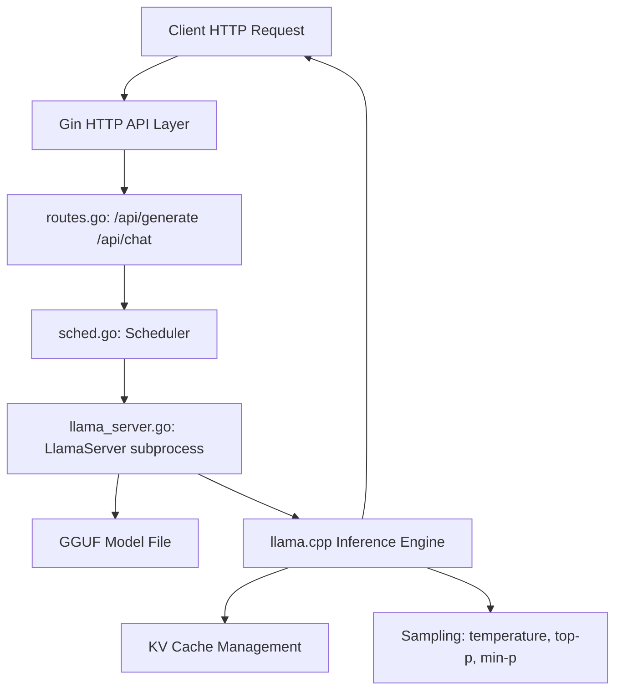
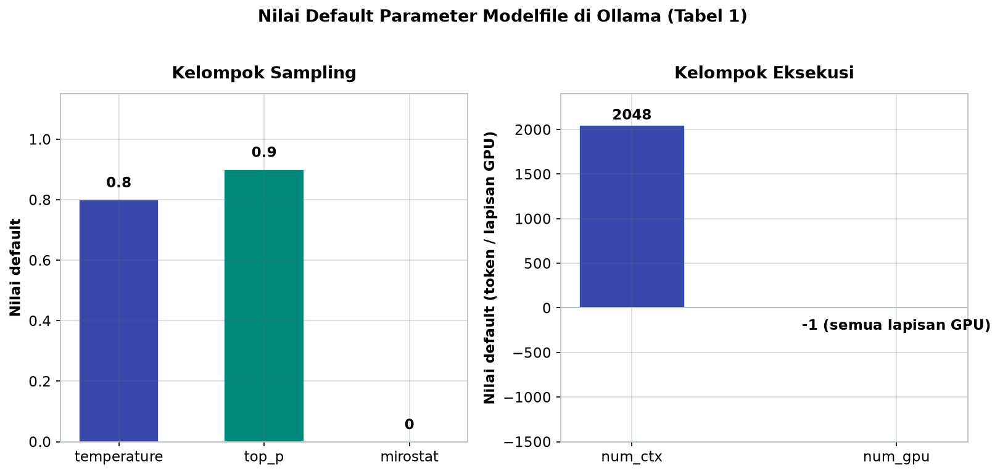
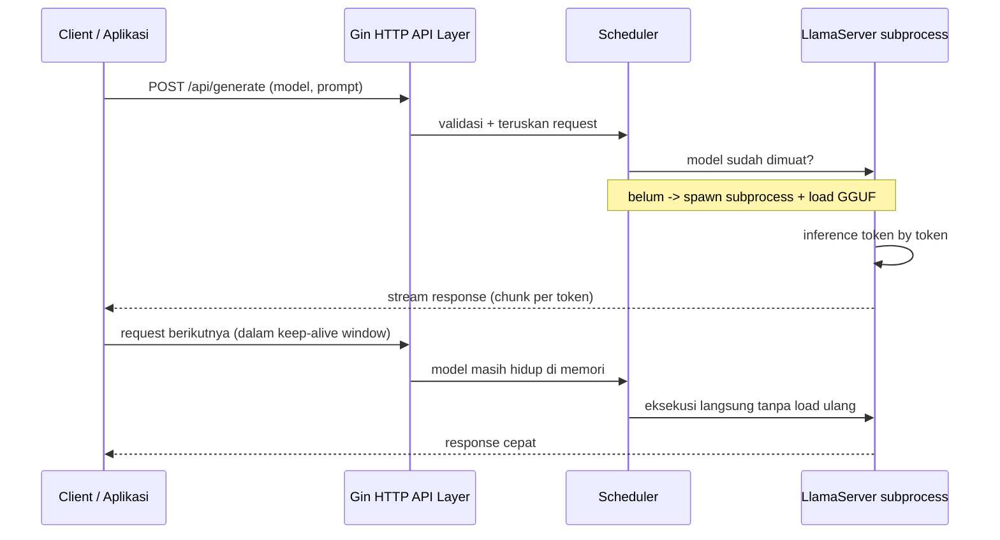

# Bab 3.1: Ollama

> Dari sekian banyak cara menjalankan model bahasa lokal, hanya sedikit yang bisa menyamai kesederhanaan Ollama: satu perintah untuk mengunduh, satu perintah untuk menjalankan, dan satu file teks untuk mengubah kepribadian model. Di balik kesederhanaan itu tersembunyi sebuah arsitektur berlapis yang cerdas — mulai dari *HTTP API* hingga *scheduler* yang mengatur antrean model di memori. Sub-bab ini mengajak Anda membedah mesin di balik "tutup" Ollama, sehingga Anda tidak hanya *user*, melainkan pengelola yang paham setiap lapisannya.

---

## 1. Tujuan Sub-Bab


Setelah membaca sub-bab ini, Anda akan mampu:

- Menjelaskan arsitektur Ollama secara berlapis: *HTTP API* → *Scheduler* → *Runner* → *Inference Engine*, lengkap dengan alasan mengapa setiap lapisan dipisahkan
- Mengelola *model library* lokal dan memahami mekanisme *blob storage* berbasis *content-addressable* dengan deduplikasi otomatis
- Membuat **Modelfile** kustom — mulai dari `FROM`, `PARAMETER`, `TEMPLATE`, hingga `SYSTEM` — untuk membentuk model sesuai kebutuhan
- Membedakan tiga *execution backend* Ollama (llama.cpp, MLX, dan *image generation*) serta memahami kapan masing-masing dipilih otomatis
- Menggunakan API REST dan *endpoint* kompatibel OpenAI untuk mengintegrasikan Ollama ke aplikasi lain seperti Open WebUI atau LangChain
- Melakukan *troubleshooting* dasar GPU, *keep-alive*, dan *concurrent request* tanpa panik saat server ramai

---

## 2. Arsitektur Sistem Ollama: Kondektur Orkestra Berlapis


Bayangkan sebuah restoran besar: tamu datang, pelayan mencatat pesanan di meja depan, koki mengatur urutan masakan, dan setiap hidangan dimasak oleh juru masak spesialis di dapur yang terpisah. Ollama bekerja dengan pola yang persis sama. Sistem ini dirancang sebagai tumpukan berlapis (*layered system*) yang terdiri dari **API Layer** berbasis *Gin HTTP*, lapisan **Orchestration** berupa *Scheduler*, dan lapisan **Execution** yang menjalankan llama.cpp atau MLX.

### Lapisan API: Gerbang Tunggal

Setiap permintaan dari pengguna — baik dari terminal, Open WebUI, maupun kode Python — masuk melalui satu gerbang: server HTTP yang dibangun dengan *framework* **Gin** (populer di ekosistem Go). Lapisan ini menerima request, memvalidasi isinya (model mana, prompt apa, opsi sampling apa), lalu meneruskannya ke bawah. Karena semua klien hanya berhadapan dengan satu gerbang, integrasi menjadi seragam: aplikasi apa pun bisa berbicara dengan Ollama selama ia bisa melakukan *HTTP request*.

### Scheduler dan Subprocess Terisolasi

Setelah melewati gerbang, request sampai ke **Scheduler** (`sched.go`). Tugas scheduler mirip petugas dapur: memutuskan model mana yang harus dimuat, apakah model sudah ada di memori, dan bagaimana membagi sumber daya GPU/CPU. Keputusan paling penting dalam desain Ollama adalah **model dijalankan sebagai *subprocess* terisolasi** — setiap model hidup dalam proses terpisah yang berkomunikasi dengan server utama. Isolasi ini bukan sekadar gaya; jika satu model *crash* karena kehabisan memori, proses lainnya tidak ikut tumbang, dan server utama tetap hidup melayani permintaan berikutnya. Inilah alasan Ollama terasa "tidak mudah mati" meski Anda berganti-ganti model besar.

Lapisan terakhir adalah **LlamaServer subprocess** (`llama_server.go`) yang membungkus *inference engine* — biasanya llama.cpp — lengkap dengan *KV cache management* dan *sampling*. Setiap *runner* memuat file model **GGUF** langsung dari disk, lalu melakukan *inference* token demi token. Karena *runner* hidup di proses terpisah, ia bisa dibunuh, dimuat ulang, atau dipindahkan prioritasnya tanpa menyentuh server utama — sebuah pola yang diadopsi dari praktik *microservice* dalam skala desktop.

### Keep-Alive: Model yang "Menunggu" di Meja

Beban terbesar inference bukan pada perhitungan matematika, melainkan pada *loading*: membongkar file GGUF sebesar 5-10 GB dari disk ke memori. Untuk menghindari biaya ini berulang-ulang, Ollama menerapkan mekanisme **keep-alive** — model yang baru dipakai "menunggu" di memori selama beberapa menit (secara *default* 5 menit) sebelum di-unload. Jika ada permintaan kedua dalam jendela waktu itu, respons langsung cepat tanpa proses bongkar-muat. Ini menjelaskan fenomena yang sering dialami pengguna: prompt pertama terasa lambat, tetapi prompt berikutnya jauh lebih responsif. Parameter ini bisa disesuaikan per-request melalui *header* atau opsi API, misalnya dipanjangkan untuk aplikasi interaktif atau diperpendek agar memori cepat dibebaskan.

Pada lapisan paling atas, Gin juga menangani *request concurrency*: banyak klien boleh memanggil *endpoint* yang sama dalam waktu bersamaan, dan server menangani masing-masing sebagai *goroutine* terpisah — cara Go menangani ribuan tugas ringan serentak. Namun perlu dicatat: *concurrency* di level HTTP tidak berarti model diproses paralel. Jika sebuah model sedang sibuk menghasilkan token untuk permintaan pertama, permintaan kedua dengan model yang sama akan *mengantre* di scheduler (atau berbagi giliran dalam mode streaming) — inilah alasan mengapa latensi naik saat banyak pengguna memakai satu server dengan satu GPU, dan mengapa tim dengan banyak pengguna biasanya memilih model *MoE* efisien seperti DeepSeek V4 Flash yang cepat *memproses* setiap permintaan.

Bagi administrator, dua variabel lingkungan menjadi tombol kendali penting: **`OLLAMA_HOST`** untuk mengubah alamat bind server (misalnya `0.0.0.0:11434` agar bisa diakses mesin lain dalam satu jaringan — tentu dengan pertimbangan keamanan), dan **`OLLAMA_MAX_LOADED_MODELS`** untuk membatasi berapa model boleh hidup bersamaan. Dua pengaturan ini, ditambah *keep-alive*, membentuk segitiga kebijakan memori: seberapa banyak model menetap, berapa lama mereka bertahan, dan berapa besar memori yang rela dikorbankan.

### Gambar 1: Arsitektur Internal Ollama

Diagram berikut menggambarkan perjalanan sebuah *request* dari klien hingga kembali sebagai respons.



Perhatikan alurnya: *request* masuk lewat Gin, dipetakan *route*, lalu diserahkan ke *scheduler*. Scheduler yang memutuskan kapan model dimuat sebagai *subprocess*; sekali `LlamaServer` hidup, ia membaca file GGUF dan menjalankan *inference* dengan dua komponen pendamping — *KV cache* agar konteks tidak dihitung ulang, dan *sampling* untuk memilih token berikutnya. Yang menarik, alur berakhir kembali ke `Client`: dalam mode *streaming*, token pertama bisa keluar bahkan sebelum generasi selesai, membentuk sirkuit responsif yang terasa instan di mata pengguna.


---

## 3. Model Library & Blob Storage: Gudang Model Berbasis Konten


Ketika Anda menjalankan `ollama pull`, apa yang sebenarnya diunduh? Ollama menyimpan setiap model sebagai *layout* berkas di `~/.ollama/models/blobs/` — bukan satu file utuh, melainkan kumpulan **blob** (potongan data biner) yang diidentifikasi berdasarkan isinya.

### Content-Addressable Storage

Setiap blob di-hash dengan **SHA256**, dan nama file di disk adalah hash itu sendiri. Sistem seperti ini disebut *content-addressable storage*: identitas sebuah blob ditentukan oleh isinya, bukan lokasinya. Keuntungannya langsung terasa: jika dua model berbagi *base model* yang sama (misalnya dua fine-tune yang dibangun dari Llama 3.1 yang sama), blob *base* itu hanya disimpan **sekali** dan dirujuk oleh kedua model. Deduplikasi terjadi otomatis tanpa campur tangan pengguna — hemat disk, hemat bandwidth.

### Registri dan Perintah Manajemen

Secara konseptual, Ollama bertindak seperti Git untuk model: ada *registry* tempat model disimpan (Ollama Library resmi, atau *registry* kustom), dan ada mesin lokal yang menyinkronkan konten. `ollama pull` mengambil model dari *registry* ke mesin lokal, `ollama push` mengunggah model kustom ke *registry* (berguna untuk berbagi model dalam tim), dan `ollama rm` menghapus model beserta blob-nya yang tidak lagi dirujuk. Model buatan sendiri yang dibuat lewat Modelfile juga tersimpan dengan mekanisme blob yang sama — Ollama tidak membedakan model "asli" dan "racikan": keduanya adalah kumpulan blob plus satu *manifest* tipis yang menjelaskan strukturnya.

*Manifest* inilah yang sering dilupakan orang saat membahas *blob storage*. Manifest adalah berkas JSON kecil yang mencatat tag model, daftar blob yang dirujuk, arsitektur, parameter, dan *template*. Saat Anda menjalankan `ollama list`, yang dibaca adalah manifest; saat model dijalankan, yang dibaca adalah blob-blob di belakangnya. Bagi pengguna, memahami dua lapisan ini berguna untuk satu alasan praktis: bila disk penuh karena banyak model, ceklah berapa banyak blob yang benar-benar berbeda hash-nya — dua model "berbeda" yang berbagi *base* yang sama hanya menambah sedikit ruang, bukan dua kali lipat. Dengan kata lain, *content-addressable storage* adalah jawaban otomatis atas pertanyaan "kenapa saya hanya mengunduh beberapa GB untuk lima model yang seharusnya 50 GB?"

---

## 4. Modelfile Language: Resep Racikan Model


Jika blob adalah bahan mentah di gudang, **Modelfile** adalah resepnya. Modelfile adalah satu file teks sederhana (berformat seperti *Dockerfile*) yang mendefinisikan bagaimana sebuah model dibentuk. Kesederhanaan inilah yang membuat kustomisasi model di Ollama tidak memerlukan keahlian *machine learning* sama sekali.

### FROM, PARAMETER, dan TEMPLATE

Instruksi pertama, **FROM**, menentukan *base model* — bisa nama model lokal atau model di *registry* seperti `deepseek-v4-pro`. Setelah itu, blok **PARAMETER** mengatur perilaku *sampling* dan eksekusi: `temperature` mengontrol keacakan, `top_p` membatasi distribusi probabilitas ke "nukleus" token teratas, `num_ctx` menentukan ukuran *context window*, `stop` mendaftar urutan berhenti, `num_gpu` mengatur berapa lapisan yang di-*offload* ke GPU, dan `mirostat` mengaktifkan *adaptive sampling* agar *perplexity* tetap stabil sepanjang generasi.

**TEMPLATE** memakai *Go templating* untuk mendefinisikan *chat template* — kerangka percakapan yang menentukan bagaimana pesan sistem, pengguna, dan asisten disusun sebelum masuk ke model. Model yang berbeda punya *chat template* yang berbeda (misalnya *chat marker* `<|user|>` khas keluarga Qwen), dan template yang salah adalah penyebab paling umum output "aneh" — model menjawab dengan format internalnya sendiri.

### SYSTEM, LICENSE, MESSAGES, ADAPTER

Selain tiga instruksi inti, Modelfile mendukung **SYSTEM** untuk menyematkan *system prompt* bawaan (kepribadian model), **LICENSE** untuk melampirkan lisensi model (penting bila Anda mendistribusikan model turunan), **MESSAGES** untuk menyisipkan contoh percakapan sebagai *few-shot* bawaan, dan **ADAPTER** untuk menempelkan *LoRA adapter* hasil *fine-tuning* ke *base model*. Kombinasi FROM + PARAMETER + TEMPLATE + SYSTEM yang tepat mampu mengubah satu model generik menjadi asisten spesifik — penulis surat resmi, pembuat kode berkomentar Indonesia, atau juru bicara merek — hanya lewat belasan baris teks.

Satu kebiasaan yang perlu dibangun sejak awal: **perlakukan Modelfile seperti kode sumber**. Simpan dalam repository, beri komentar pada tiap blok, dan versi-kan nama model dengan *tag* (`my-coder:v1`, `my-coder:v2`). Karena `ollama create` membaca file teks, seluruh konfigurasi model Anda bisa direproduksi di mesin lain hanya dengan menyalin satu file — inilah yang membuat Ollama unggul dibandingkan aplikasi yang mengunci konfigurasi di dalam *database* antarmuka grafisnya. Tim bisa me-review Modelfile seperti me-review *pull request*: perubahan *temperature*, *system prompt*, dan *template* menjadi artefak yang terlacak, bukan keputusan yang hilang dalam satu klik.

### Tabel 1: Perbandingan Parameter Modelfile

Tabel berikut merangkum parameter Modelfile yang paling sering digunakan, lengkap dengan tipe data, nilai *default*, dan contoh penulisan langsung di file Modelfile.

| Parameter | Tipe | Default | Deskripsi | Contoh Penggunaan |
|:---|:---:|:---:|:---|:---|
| `temperature` | float | 0.8 | Randomness sampling | `PARAMETER temperature 0.7` |
| `top_p` | float | 0.9 | Nucleus sampling threshold | `PARAMETER top_p 0.95` |
| `num_ctx` | int | 2048 | Context window size | `PARAMETER num_ctx 8192` |
| `stop` | string[] | [] | Stop sequences | `PARAMETER stop "<\|im_end\|>"` |
| `num_gpu` | int | -1 | GPU layers to offload | `PARAMETER num_gpu 99` |
| `mirostat` | int | 0 | Mirostat sampling mode | `PARAMETER mirostat 2` |

Gambar berikut memetakan nilai *default* keenam parameter ke dua kelompok fungsinya.



*Gambar 3.1-1 — Parameter sampling (temperature 0,8, top_p 0,9, mirostat 0) bekerja pada skala kecil dan mengontrol "rasa" keluaran, sementara parameter eksekusi bekerja pada skala jauh lebih besar — num_ctx 2048 token dan num_gpu -1 yang berarti "semua lapisan ke GPU".*

Pola yang muncul dari tabel ini: parameter sampling (`temperature`, `top_p`) mengontrol *rasa* keluaran, sedangkan parameter eksekusi (`num_ctx`, `num_gpu`) mengontrol *kemampuan* — seberapa banyak konteks yang bisa dipegang dan seberapa banyak komputasi yang dijalankan di GPU. Nilai *default* `temperature 0.8` memang relatif kreatif, cocok untuk percakapan umum; untuk tugas yang menuntut presisi seperti coding atau analisis data, turunkan ke 0,2-0,4. `num_gpu` dengan nilai -1 berarti "semua lapisan ke GPU", dan inilah yang paling sering digunakan pengguna desktop.


---

## 5. Execution Backend: Mesin di Balik Layar


Ollama bukan *inference engine*; ia adalah **pengemudi** yang memilih mesin yang tepat untuk setiap model. Mesin utama adalah **llama.cpp** — implementasi C++ dari Georgi Gerganov yang menjadi standar de facto eksekusi model **GGUF** di seluruh ekosistem. Mesin ini mendukung hampir semua perangkat: GPU NVIDIA via CUDA, GPU AMD via ROCm, GPU Apple via Metal, hingga CPU murni. Karena itulah hampir semua model yang diunduh melalui `ollama pull` adalah file GGUF yang dijalankan llama.cpp.

Perlu ditegaskan di sini: **GGUF bukanlah sebuah model, melainkan format kemasan**. Ia menyimpan bobot yang sudah dikuantisasi (misalnya 4-bit atau 8-bit), *tokenizer*, arsitektur, dan metadata lain dalam satu berkas yang bisa dibaca langsung oleh llama.cpp. Karena formatnya standar, file GGUF yang sama bisa dijalankan oleh Ollama, LM Studio, llama.cpp murni, maupun GPT4All — inilah "bahasa bersama" yang membuat ekosistem model lokal tidak terpecah-pecah. Bila model favorit Anda hanya tersedia dalam format safetensors dari Hugging Face, konversi ke GGUF bisa dilakukan dengan *script* llama.cpp, dan hasilnya langsung bisa dipakai di Ollama.

Untuk pengguna Apple Silicon, Ollama menyediakan *runner* eksperimental berbasis **MLX** — *framework* machine learning buatan Apple yang memanfaatkan *unified memory* secara lebih langsung. MLX bisa lebih cepat pada chip M-series untuk model tertentu, tetapi statusnya masih *experimental*; jangan heran jika sebuah model tampil dua kali di library dengan tanda backend berbeda. Terakhir, ada *backend* khusus **image generation** untuk model difusi seperti Flux — Ollama tidak hanya melayani teks, tetapi juga menggambar. Pemilihan backend dilakukan **otomatis** berdasarkan tipe model: arsitektur encoder-decoder multimodal, *dense decoder*, atau *diffusion* — pengguna cukup memilih model, Ollama yang menebak mesinnya.

### Tabel 2: Perbandingan Backend Ollama

Bandingkan tiga *execution backend* Ollama berikut sebelum memilih model dan perangkat target Anda.

| Fitur | llama.cpp | MLX | Image Generation |
|:---|:---|:---|:---|
| **Tipe Model** | GGUF | Safetensors (MLX) | Diffusion models |
| **Apple Silicon** | Native (Metal) | Native (MLX) | Native |
| **NVIDIA GPU** | CUDA | - | CUDA |
| **Multimodal** | Vision, Audio | Vision | Image generation |
| **Kecepatan Token/s** | **** | ***** (M-series) | N/A |
| **Kematangan** | Mature | Experimental | Experimental |

Pelajaran dari tabel ini: untuk pengguna Linux/Windows dengan kartu NVIDIA, llama.cpp adalah pilihan utama dan satu-satunya yang realistis; untuk pengguna Mac M-series yang menginginkan *throughput* maksimal, MLX patut dicoba meski berstatus *experimental*; dan bagi yang ingin menghasilkan gambar, backend difusi adalah jawabannya. Ollama memilih backend secara otomatis, tetapi memahami perbedaannya membantu Anda membaca mengapa kecepatan token/s bisa berbeda antara dua model yang ukurannya sama.


---

## 6. GPU Management & Scheduling


Saat Anda pertama kali menjalankan model, Ollama melakukan *probe* perangkat keras: mendeteksi GPU NVIDIA (CUDA), AMD (ROCm), atau Apple (Metal) secara otomatis. Hasil deteksi ini menentukan dua hal: berapa lapisan model yang bisa di-*offload* ke **VRAM**, dan berapa besar memori sistem yang tersisa untuk bagian yang tidak muat. Scheduler lalu mengalokasikan **layer offload** secara dinamis — tidak harus semua lapisan masuk GPU; jika VRAM menipis, sebagian lapisan ditarik kembali ke CPU tanpa Anda perlu mengonfigurasi apa pun.

Jika dua model diminta bersamaan, scheduler menilai prioritas: model yang sedang melayani *streaming* dipertahankan, model yang sudah lama tidak dipakai boleh dikeluarkan dari memori untuk memberi tempat model baru. Perilaku ini bisa dikontrol via parameter `num_gpu` (berapa lapisan maksimum yang di-offload) dan `OLLAMA_MAX_LOADED_MODELS` (berapa model boleh hidup bersamaan). Dengan kata lain, Ollama memperlakukan VRAM seperti meja kerja terbatas: ia mengatur posisi duduk setiap "pekerja" (lapisan model) agar semua tugas tetap berjalan, meski harus bergantian.

Ada satu detail lagi yang membuat *scheduling* Ollama terasa "manusiawi": **estimasi kebutuhan memori dilakukan sebelum load**. Scheduler membaca *metadata* model (ukuran bobot, ukuran KV cache untuk konteks default) lalu memutuskan apakah model muat di VRAM yang tersisa; jika tidak, lapisan-lapisan teratas yang paling banyak dipakai ditempatkan di GPU dan sisanya di CPU. Proses ini menghasilkan pola khas: jika Anda menjalankan model yang "pas-pasan" dengan VRAM, *inference* tetap bekerja — hanya saja lebih lambat di lapisan yang jatuh ke CPU. Memahami pola ini membantu menjelaskan kenapa menggeser parameter `num_ctx` ke nilai besar bisa membuat model yang tadinya mulus menjadi tersendat: konteks yang lebih panjang berarti KV cache lebih besar, sisa VRAM menyusut, dan lapisan mulai "tumpah" ke CPU.

---

## 7. Ollama API & Integrasi


Antarmuka utama Ollama bagi pengembang adalah **REST API** di `http://localhost:11434`. Tiga *endpoint* yang paling sering digunakan: `/api/generate` untuk *completion* satu arah, `/api/chat` untuk percakapan dengan pesan ber-*role* (`system`, `user`, `assistant`), dan `/api/embeddings` untuk menghasilkan vektor teks — bahan baku *retrieval-augmented generation* (RAG) dan pencarian semantik. Semua *endpoint* mendukung *streaming*, sehingga token bisa tampil satu per satu seperti mengetik.

Yang membuat Ollama populer di ekosistem developer adalah **endpoint kompatibel OpenAI**: `http://localhost:11434/v1/chat/completions`. Karena bentuknya identik dengan API OpenAI, aplikasi yang ditulis untuk ChatGPT API bisa dialihkan ke Ollama hanya dengan mengganti *base URL* — tanpa mengubah satu baris kode pun. Inilah jembatan yang menghubungkan Ollama dengan **Open WebUI** (antarmuka web mirip ChatGPT), **LangChain**, dan puluhan *framework* lain yang sudah berbicara bahasa OpenAI. Satu gerbang, dua bahasa API: bahasa asli Ollama untuk kontrol penuh, dan bahasa OpenAI untuk kompatibilitas universal.

Pola integrasi yang sama berlaku di hampir semua *framework* modern: tentukan *base URL*, set model, lalu sisanya mengikuti konvensi OpenAI. Untuk *embedding*, *endpoint* `/api/embeddings` (atau padanan OpenAI-nya) menyediakan vektor teks yang bisa disimpan di *vector database* untuk pencarian semantik — fondasi dari aplikasi RAG skala kecil hingga menengah yang seluruhnya berjalan lokal. Kombinasi *chat* + *embedding* inilah yang membuat satu instalasi Ollama mampu menjadi *backend* tunggal untuk sistem *question answering* dokumen perusahaan, tanpa membayar satu sen pun biaya API eksternal.

### Tabel 3: Perintah Dasar Manajemen Ollama

| Perintah | Fungsi | Contoh |
|:---|:---|:---|
| `ollama pull` | Unduh model dari registry | `ollama pull llama3.1:8b` |
| `ollama push` | Unggah model ke registry | `ollama push user/model:tag` |
| `ollama create` | Buat model dari Modelfile | `ollama create mymodel -f Modelfile` |
| `ollama list` | Lihat model lokal | `ollama list` |
| `ollama run` | Jalankan model interaktif | `ollama run llama3.1:8b` |

Kelima perintah ini adalah "daur hidup" sebuah model: `pull` untuk membeli bahan, `create` untuk meracik, `list` untuk mengecek stok, `run` untuk memakai, dan `push` untuk membagikan. Bila diibaratkan Git: `pull` ≈ `clone`, `push` ≈ `push`, `create` ≈ *build image*, dan `list` ≈ `status`.

---


### Gambar 2: Alur Lifecycle Request dan Keep-Alive

Untuk melengkapi gambaran arsitektur, berikut *sequence diagram* yang menunjukkan interaksi antar-komponen saat satu request datang dan bagaimana *keep-alive* bekerja pada request berikutnya.



Diagram ini menjawab pertanyaan klasik "kenapa prompt pertama lambat, kedua cepat?" — perbedaan waktu di langkah `load GGUF` yang hanya terjadi sekali selama jendela *keep-alive*. Dalam aplikasi tim, pemahaman ini berguna untuk mengatur kapan server perlu dipanaskan (*warm-up*) sebelum jam kerja dimulai.

---


---

## 8. Praktikum / Hands-On


### Langkah 1: Membuat Modelfile Kustom

Mulailah dengan membuat sebuah Modelfile untuk asisten coding berbahasa Indonesia yang dibangun di atas DeepSeek V4 Pro. Simpan file berikut sebagai `Modelfile`:

```dockerfile
# Modelfile — Asisten Coding Bahasa Indonesia (DeepSeek V4 Pro)
FROM deepseek-v4-pro

# Parameter inference
PARAMETER temperature 0.3
PARAMETER top_p 0.9
PARAMETER num_ctx 32768
PARAMETER stop "<|end|>"
PARAMETER mirostat 2
PARAMETER mirostat_tau 5.0

# CSA/HCA hybrid attention — optimal untuk konteks panjang
PARAMETER numa 1
PARAMETER flash_attn 1

# System prompt
SYSTEM """
Anda adalah asisten coding yang ahli dalam Bahasa Indonesia.
Selalu berikan kode yang lengkap dan siap pakai.
Gunakan komentar dalam Bahasa Indonesia.
"""

# Chat template
TEMPLATE """
{{- if .System }}
<|system|>
{{ .System }}
{{- end }}
<|user|>
{{ .Prompt }}
<|assistant|>
"""
```

Lalu bangun dan jalankan:

```bash
# Build dan run
ollama create my-coder-deepseek -f Modelfile
ollama run my-coder-deepseek "Buatkan fungsi Python untuk sorting array"
```

Perhatikan pilihan parameternya: `temperature 0.3` membuat model disiplin (tidak berimajinasi), `num_ctx 32768` memberi ruang konteks sebesar 32K token — cukup untuk menempelkan potongan kodebase — dan `mirostat 2` menjaga *perplexity* agar output tetap "dingin" sepanjang sesi. Jika model dasar belum diunduh, Ollama akan menariknya otomatis saat `create` pertama kali dijalankan.

### Langkah 2: Mengelola Model Library dan API Server

Sekarang, kelola library dan uji kedua *endpoint* API:

```bash
# 1. List model yang tersedia
ollama list

# 2. Lihat detail model
ollama show llama3.1:8b

# 3. Jalankan Ollama sebagai server background
ollama serve &
# Server listening di http://localhost:11434

# 4. Panggil API dari terminal
curl http://localhost:11434/api/generate \
  -d '{
    "model": "llama3.1:8b",
    "prompt": "Jelaskan arsitektur transformer",
    "stream": false,
    "options": {
      "temperature": 0.7,
      "num_predict": 200
    }
  }'

# 5. OpenAI-compatible endpoint
curl http://localhost:11434/v1/chat/completions \
  -d '{
    "model": "llama3.1:8b",
    "messages": [{"role": "user", "content": "Halo!"}]
  }'

# 6. Pull model DeepSeek V4 terbaru
ollama pull deepseek-v4-pro     # 1.6T total, 49B aktif, MIT license
ollama pull deepseek-v4-flash   # 284B total, 13B aktif — cepat untuk coding

# 7. Jalankan DeepSeek V4 Flash untuk task ringan
ollama run deepseek-v4-flash "Buatkan unit test untuk fungsi validasi email"
```

Dua *endpoint* pada langkah 4 dan 5 menampilkan filosofi Ollama: `/api/generate` adalah bahasa asli Ollama yang kaya opsi, sementara `/v1/chat/completions` adalah bahasa universal yang dipahami semua aplikasi bergaya OpenAI. Untuk integrasi dengan aplikasi yang sudah ada, gunakan *endpoint* ke-5; untuk kontrol penuh, gunakan yang ke-4.

### Langkah 3: Concurrent Model Loading

Terakhir, uji bagaimana scheduler menangani tiga model yang diminta bersamaan. Script Python berikut mengukur waktu *load* setiap model:

```python
import requests
import concurrent.futures

models = ["llama3.1:8b", "qwen2.5:7b", "mistral:7b"]
base = "http://localhost:11434/api/generate"

def load_model(name):
    r = requests.post(f"{base}", json={
        "model": name, "prompt": "test", "stream": False
    })
    return name, r.elapsed.total_seconds()

with concurrent.futures.ThreadPoolExecutor() as ex:
    for model, time in ex.map(load_model, models):
        print(f"{model}: {time:.2f}s")
```

Jika total RAM/VRAM cukup, ketiga model akan dimuat bersamaan dan masing-masing mencatat waktu kecil; jika memori menipis, scheduler akan menunggu model lama *di-unload* dulu — inilah momen yang tepat mengamati kerja *keep-alive* dan prioritas *scheduling* secara langsung. Waktu yang besar pada model ketiga menandakan *thrashing* memori; solusinya kurangi model yang dimuat sekaligus atau set `OLLAMA_MAX_LOADED_MODELS`.

---

## 9. Studi Kasus: Setup Ollama untuk Team Coding Assistant


Bayangkan sebuah perusahaan software di Jakarta dengan lima developer yang sehari-hari mengerjakan sistem ERP. Setiap developer ingin memakai asisten AI untuk menulis dan meninjau kode, tetapi perusahaan melarang kode bisnis dikirim ke API cloud — masalah keamanan yang tidak bisa ditawar. Solusinya: Ollama di satu server internal.

**Latar & analisis pilihan.** Tim memiliki satu server dengan **RTX 4090 24GB**. Pilihan model jatuh pada **DeepSeek V4 Flash** (284B total, 13B aktif) — arsitektur *Mixture-of-Experts* yang hanya mengaktifkan 13 miliar parameter per token membuatnya jauh lebih ringan daripada total parameternya, sehingga muat dan cepat di VRAM 24GB. Model 1.6T seperti DeepSeek V4 Pro tetap disimpan sebagai *upgrade path* bila nanti ada server tambahan, karena keduanya berlisensi **MIT** dan *open-weight* di Hugging Face.

**Langkah solusi.** Tim menyusun satu Modelfile perusahaan: *base model* `deepseek-v4-flash`, konteks kodebase perusahaan ditambahkan ke `SYSTEM`, *system prompt* berisi standar koding tim (nama variabel, konvensi commit, bahasa komentar), dan konfigurasi `num_ctx 32768` (cukup untuk menempel file kode utuh), `temperature 0.2` (presisi di atas kreativitas), `num_gpu 99` (semua lapisan di GPU), serta *flash attention* diaktifkan untuk efisiensi konteks panjang. Model dijalankan dengan `ollama serve`, dan kelima developer terhubung melalui **Open WebUI** — antarmuka web yang terhubung ke *endpoint* Ollama sehingga tiap developer mendapat akun sendiri tanpa konfigurasi tambahan.

**Hasil & pelajaran.** Kelima developer dapat mengakses model secara bersamaan dengan **latensi di bawah 3 detik per respons** — impresif untuk model berukuran 284B, berkat kombinasi MoE efisien, offload penuh ke RTX 4090, dan *streaming* token. Manajemen blob mempermudah hidup tim: karena semua pengguna memakai model yang sama, blob tersimpan sekali dan otomatis di-*deduplicate*; setiap update model cukup sekali `ollama pull`. Pelajaran terpenting dari kasus ini: dengan satu Modelfile, satu perintah `ollama create`, dan satu *server*, sebuah tim kecil mendapatkan asisten AI internal yang cepat, gratis, dan — yang paling penting — tidak pernah membocorkan kode bisnis ke luar tembok server.

---

## 10. Referensi


### Paper Jurnal/Konferensi

[1] Vake, D., Vičič, J., & Tošić, A. (2025). *Hive: A Secure, Scalable Framework for Distributed Ollama Inference*. SoftwareX, 30, 102183. DOI: [10.1016/j.softx.2025.102183](https://doi.org/10.1016/j.softx.2025.102183)

[2] Liao, S., et al. (2024). *Inference Performance Optimization for Large Language Models on CPUs*. arXiv: [2407.07304](https://arxiv.org/abs/2407.07304)

[3] Zhang, H., et al. (2024). *LLM Inference Serving: Survey of Recent Advances and Opportunities*. arXiv: [2407.12391](https://arxiv.org/abs/2407.12391)

[4] Miao, X., et al. (2025). *Towards Efficient Generative Large Language Model Serving: A Survey from Algorithms to Systems*. ACM Computing Surveys. DOI: [10.1145/3754448](https://dl.acm.org/doi/10.1145/3754448)

[5] Dao, T., Fu, D. Y., Ermon, S., Rudra, A., & Ré, C. (2022). *FlashAttention: Fast and Memory-Efficient Exact Attention with IO-Awareness*. NeurIPS. DOI: [10.48550/arXiv.2205.14135](https://arxiv.org/abs/2205.14135)

### Referensi Pendukung (Dokumentasi/Repository)

[6] Ollama. *Official GitHub Repository*. [github.com/ollama/ollama](https://github.com/ollama/ollama)

[7] Gerganov, G. *llama.cpp*. [github.com/ggerganov/llama.cpp](https://github.com/ggerganov/llama.cpp)

[8] Apple MLX. *Official Documentation*. [ml-explore.github.io/mlx](https://ml-explore.github.io/mlx/)

[9] Ollama Modelfile Documentation. [github.com/ollama/ollama/blob/main/docs/modelfile.md](https://github.com/ollama/ollama/blob/main/docs/modelfile.md)
