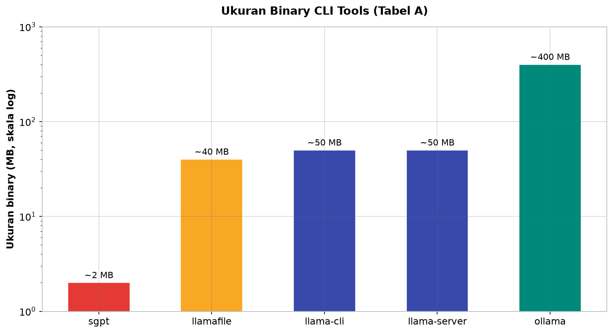
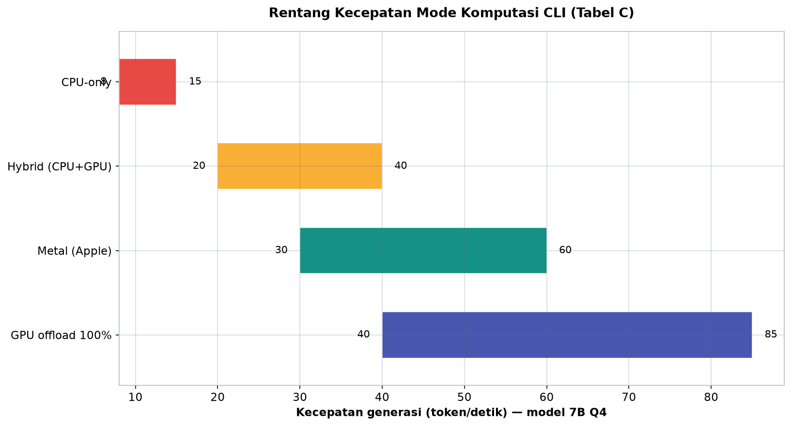
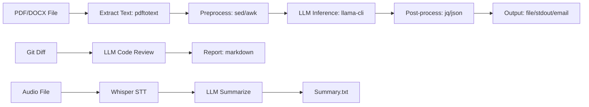

# Bab 3.10: CLI-Only Power — Efisiensi Maksimal Alat Berbasis Terminal

> Sebelum ada GUI, ada terminal. Dan untuk beban kerja AI yang repetitif, terminal masih menjadi antarmuka paling efisien yang pernah dibuat: tanpa overhead rendering, tanpa klik, tanpa menunggu tombol — hanya teks masuk, teks keluar, dan semua yang ada di antaranya bisa diprogram. Sub-bab ini adalah peta jalan bagi *power user* yang ingin menjadikan llama.cpp dan saudara-saudaranya sebagai tulang punggung workflow otomatis.

---

## 1. Tujuan Sub-Bab

Setelah membaca sub-bab ini, Anda akan mampu:

- Menggunakan perangkat CLI llama.cpp: `llama-cli`, `llama-server`, `llama-bench`, `llama-perplexity`, `llama-embedding`, `llama-tokenize`
- Menyusun *one-liner* untuk tanya-jawab, summarization, translation, dan code review
- Membangun pipeline batch processing dengan shell scripting
- Mengoptimalkan parameter CLI: `--threads`, `--batch-size`, `-ngl`, `--mlock`
- Membandingkan llama.cpp dengan Ollama, llamafile, LocalAI CLI, dan Shell-GPT
- Mengintegrasikan LLM ke editor dan workflow harian via terminal

---

## 2. Filosofi CLI-Only

### Terminal: Antarmuka Paling Efisien untuk Mesin

Ada alasan mengapa *power user* selalu kembali ke terminal: ia **zero overhead**. Tidak ada GUI yang memakan RAM untuk *rendering*, tidak ada lapisan abstraksi yang menahan tombol, tidak ada animasi. Yang tersisa hanyalah proses, teks, dan *pipeline*. Bagi LLM — yang pada dasarnya adalah pipa teks menuju teks — terminal adalah pasangan alami: input adalah teks dari *stdin*, output adalah teks ke *stdout*, dan keduanya bisa dihubungkan ke alat UNIX apa pun.

Yang lebih penting, terminal itu **scriptable**. Perintah yang Anda ketik hari ini bisa menjadi skrip yang berjalan besok — terjadwal lewat `cron`, dipicu oleh *hook* git, atau disambungkan dalam *pipeline* dengan `jq`, `curl`, `sed`, dan `awk`. Inilah filosofi *Unix philosophy*: setiap alat melakukan satu hal dengan baik, dan keajaiban muncul saat alat-alat itu disambungkan.

### Mengapa Bukan GUI?

Bukan berarti GUI buruk — LM Studio dan Open WebUI punya tempatnya. Tetapi untuk tugas yang repetitif dan terukur — *summarize* 50 artikel setiap pagi, *review* diff sebelum commit, *translate* file konfigurasi — GUI memaksa Anda melakukan 10 klik per tugas, sedangkan CLI melakukannya dalam satu perintah yang sama setiap kali. Waktu yang dihemat bukan menit, melainkan jam per minggu, dan skrip yang sama bisa dibagikan ke tim.

---

## 3. Toolset llama.cpp

### Satu Bangunan, Enam Pintu

llama.cpp bukan satu program, melainkan sebuah keluarga alat yang masing-masing memandang model dari sudut yang berbeda:

- **`llama-cli`** — alat utama untuk inference interaktif dan *one-shot*; inilah "terminal chat" Anda
- **`llama-server`** — mengubah model menjadi HTTP server yang kompatibel dengan OpenAI API, membuka jalan bagi aplikasi web dan integrasi eksternal
- **`llama-bench`** — *benchmark* performa; menjawab pertanyaan "berapa t/s model ini di mesin saya?"
- **`llama-perplexity`** — mengukur kualitas model secara objektif melalui metrik *perplexity*; berguna untuk membandingkan kuantisasi
- **`llama-embedding`** — ekstraksi vektor embedding dari teks, bahan baku pipeline RAG di terminal
- **`llama-tokenize`** — utilitas *tokenizer*; melihat bagaimana teks dipecah menjadi token, berguna untuk mengoptimalkan konteks

Keenam alat ini berbagi satu *engine* dan satu format model (**GGUF**), sehingga penggunaannya konsisten: sekali Anda paham satu alat, lainnya mudah dipelajari. Dukungan *streaming* ada di semua alat yang menghasilkan teks — output mengalir token demi token, bukan muncul sekaligus di akhir.

---

## 4. One-Liner Power

### Teks Masuk, Teks Keluar

Keindahan CLI-LLM adalah kemampuannya dikombinasikan dengan alat UNIX lain dalam satu baris. Contoh klasik:

```bash
llama-cli -p "buat puisi" | cowsay
```

Model menulis puisi, `cowsay` mengemasnya dalam gambar sapi ASCII — kombinasi konyol namun demonstratif: model hanyalah satu tahap dalam *pipeline*, bukan tujuan akhir. Pola ini berkembang tanpa batas: *summarize* artikel dengan `cat`, *translate* dengan `echo`, *review* kode dengan `git diff`.

### Batch Processing dalam Satu Pola

Perulangan `for` di shell mengubah perintah tunggal menjadi pabrik pemrosesan: satu skrip, seratus file, tanpa intervensi manusia. Setiap file dibaca, diproses, dan hasilnya ditulis ke direktori output — pola yang sama yang dipakai data pipeline industri, tetapi cukup sederhana untuk dipahami dalam lima menit.

### Integrasi dengan Editor

Editor adalah rumah kedua developer, dan ia juga bisa berbahasa terminal: `:!llama-cli ...` di Vim/Neovim mengeksekusi perintah shell dari dalam editor. Pilih blok teks, kirim ke LLM, dan hasil transformasi kembali ke buffer — alur kerja *selection → transform* yang membuat LLM terasa seperti perintah editor asli, bukan aplikasi terpisah.

---

## 5. Shell Scripting untuk AI Pipeline

### Empat Pipeline yang Mengubah Hidup

Pola-pola berikut adalah *blueprint* yang bisa disesuaikan:

**Summarization batch** — loop file PDF → ekstrak teks (`pdftotext`) → LLM meringkas → simpan hasil. Mengubah tumpukan dokumen yang tidak terbaca menjadi *knowledge base* ringkas dalam satu perintah.

**Translation pipeline** — *stdin* → LLM → *stdout*. Karena model menerima teks dari *pipeline* dan menulis ke *stdout*, menerjemahkan file atau aliran data hanyalah masalah memilih *prompt* dan arah aliran.

**Code review** — `git diff` → LLM → laporan review. Sebelum setiap *commit*, diff dikirim ke model untuk menemukan *bug*, celah keamanan, dan pelanggaran *best practice*. Reviewer paling rajin yang pernah Anda miliki, dan ia membaca setiap baris.

**Email drafting** — *template* + LLM → draft. Model mengisi kerangka surat dengan konteks yang diberikan, menghasilkan draf yang siap diedit — bantuan menulis yang tidak menuntut Anda membuka aplikasi apa pun.

---

## 6. Optimasi Performa

### Empat Tuas Utama

Performa inference di CLI dikendalikan oleh empat parameter:

- **`--threads`** — jumlah thread CPU; aturan praktis: **`n_cores - 1`**, menyisakan satu inti untuk sistem operasi
- **`--batch-size`** — ukuran batch untuk *prompt processing*; batch lebih besar meningkatkan *throughput* prefill (diuji pula oleh riset optimasi inference CPU [2])
- **`-ngl`** (n_gpu_layers) — jumlah lapisan yang di-*offload* ke GPU; `-ngl 99` berarti seluruh model di GPU
- **`--mlock`** — mengunci model di RAM agar tidak di-*swap* ke disk; mengorbankan RAM untuk kestabilan kecepatan

Kombinasi yang tepat bergantung perangkat keras, dan `llama-bench` adalah alat untuk menemukannya secara empiris alih-alih menebak. Survei teknik *efficient inference* [5] mengingatkan bahwa optimasi berlapis — data-level, model-level, dan system-level — adalah pendekatan paling komprehensif; parameter CLI hanyalah lapisan terakhir dari tumpukan itu.

### Peran Teknik Khusus CPU

Satu pertanyaan wajar: bagaimana llama.cpp bisa secepat itu di CPU? Sebagian jawabannya datang dari riset seperti **NoMAD-Attention** [4] yang menunjukkan bahwa operasi *attention* bisa dibuat *multiply-add-free* di CPU — menghindari instruksi *multiply* yang mahal pada arsitektur tertentu. Optimalisasi level kernel semacam inilah yang membuat wawasan "CPU-only LLM" menjadi praktis, bukan sekadar teoretis.

---

## 7. Alternatif CLI Lain

### Ollama, llamafile, dan Sahabat Terminal

llama.cpp bukan satu-satunya pintu CLI:

- **Ollama CLI** — dua mode: interaktif (`ollama run`) dan API server (`ollama serve`); kelebihannya pada *model management* yang rapi dan pengunduhan satu perintah
- **llamafile** — satu file *executable* yang berisi model dan runtime sekaligus (dikembangkan dari proyek Mozilla); *portability* maksimal: salin, jalankan, selesai
- **LocalAI CLI** — lewat `local-ai run`, server multi-modalitas dari Bab 3.7 bisa dikendalikan dari terminal
- **Shell-GPT (sgpt)** — asisten AI yang "tinggal" di shell: menyarankan perintah, menjelaskan error, dan berkolaborasi dalam percakapan terminal

Pemilihan di antara mereka bergantung prioritas: kontrol penuh dan kecepatan (llama.cpp), kemudahan manajemen model (Ollama), portabilitas ekstrem (llamafile), atau integrasi percakapan (sgpt).

---

## 8. Tabel Wajib

### Tabel A: Perbandingan CLI Tools

Tabel berikut membandingkan lima alat berbasis terminal yang paling umum dipakai.

| Tool | Instalasi | Ukuran Binary | Streaming | API Server | Fitur Unik |
|:---|:---|:---:|:---:|:---:|:---|
| **llama-cli** | Build/Download | ~50 MB | Ya | Tidak | Paling lengkap |
| **llama-server** | Build/Download | ~50 MB | Ya | Ya | OpenAI-compatible |
| **ollama** | Package manager | ~400 MB | Ya | Ya | Model management |
| **llamafile** | Download 1 file | ~40 MB + model | Ya | Ya | Single file, portable |
| **sgpt (shell-gpt)** | pip install | ~2 MB | Ya | Tidak | Integrasi shell |



*Gambar 3.10-2 — sgpt paling ringan (2 MB) karena memanfaatkan API eksternal; ollama paling berat (~400 MB) karena membundel runtime dan model management sendiri.*

Analisis: tabel ini membagi alat menjadi dua kubu. **llama-cli** dan **llama-server** adalah *engine* murni — fleksibel dan lengkap, tetapi Anda bertanggung jawab atas model dan konfigurasi. **ollama** dan **llamafile** adalah *wrapper* yang menyederhanakan — mereka mengorbankan sebagian kontrol untuk kenyamanan. **sgpt** berdiri sendiri: bukan engine, melainkan asisten yang memanfaatkan API apa pun. Pilihan yang baik sering kali kombinasi: Ollama untuk manajemen model harian, llama-server untuk serving OpenAI-compatible, dan sgpt untuk bantuan *inline* di shell.

### Tabel B: Contoh One-Liner

Ide *one-liner* berikut siap disesuaikan dengan model GGUF atau Ollama Anda.

| Tugas | Perintah |
|:---|:---|
| **Ask question** | `llama-cli -m model.gguf -p "Apa itu AI?" -n 200` |
| **Summarize text** | `cat article.txt \| llama-cli -m model.gguf --temp 0.1 -p "Ringkas:" -n 150` |
| **Translate** | `echo "Hello" \| llama-cli -m model.gguf --temp 0.1 -p "Translate to ID:"` |
| **Code review** | `git diff \| llama-cli -m model.gguf -p "Review this diff:"` |
| **Chat di terminal** | `llama-cli -m model.gguf -cnv` |
| **Benchmark** | `llama-bench -m model.gguf -p 512 -n 128` |
| **Extract email** | `llama-cli -m model.gguf --temp 0 -p "Extract name,email from:\n" < contacts.txt` |
| **DeepSeek V4 Flash** | `ollama run deepseek-v4-flash "Buat fungsi sorting"` |
| **Ministral 3 (CPU-edge)** | `llama-cli -m ministral-3b.gguf -p "Ringkas teks" -t 4` |

Analisis: perhatikan pola konsisten di balik variasi tugas — sebagian besar hanya mengganti *prompt* dan sumber input. `--temp 0.1` untuk tugas yang menuntut presisi (ringkasan, terjemahan), `--temp 0` untuk ekstraksi data yang deterministik, dan `-cnv` untuk sesi percakapan multi-putaran. Dua baris terakhir menunjukkan fleksibilitas antar alat: model besar seperti DeepSeek V4 Flash lebih nyaman lewat Ollama, sementara model ringan seperti Ministral 3 langsung dijalankan sebagai file GGUF dengan `-t 4`.

### Tabel C: Perbandingan Performa Mode CLI

Keempat mode komputasi berikut menentukan pengalaman yang akan Anda rasakan (model 7B Q4).

| Mode | Kecepatan (7B Q4) | RAM | GPU | Cocok Untuk |
|:---|:---:|:---:|:---:|:---|
| **CPU-only** | 8-15 t/s | ~5 GB | 0 | Laptop/desktop tanpa GPU |
| **GPU offload 100%** | 40-85 t/s | ~6 GB | 12-24 GB VRAM | Desktop dengan GPU |
| **Hybrid (CPU+GPU)** | 20-40 t/s | ~5 GB + VRAM | 6-8 GB VRAM | GPU terbatas VRAM |
| **Metal (Apple)** | 30-60 t/s | ~6 GB | Unified Memory | Mac M-series |



*Gambar 3.10-1 — GPU offload penuh memberi lompatan hingga 5× dibanding CPU-only; mode hybrid menjadi kompromi cerdas untuk GPU dengan VRAM terbatas.*

Analisis: tabel ini menunjukkan *trade-off* yang harus dipahami setiap pengguna CLI. CPU-only adalah mode paling universal (8–15 t/s) — cukup untuk *batch processing* yang tidak sensitif waktu, terlalu lambat untuk percakapan interaktif yang nyaman. GPU offload penuh memberikan lompatan 5× lipat tetapi menuntut VRAM besar. **Hybrid** — memuat sebagian lapisan ke GPU, sisanya di CPU — adalah solusi cerdas untuk GPU dengan VRAM kecil (seperti banyak kartu 6–8 GB): kecepatan dua kali lipat dari CPU murni, tanpa perlu GPU baru. **Metal** membuktikan kembali keunggulan *unified memory* Apple Silicon: 30–60 t/s tanpa VRAM terpisah.

---

## 9. Diagram & Visualisasi

### Gambar 1: AI Pipeline di Terminal

Diagram berikut menunjukkan bagaimana berbagai alat terminal dan LLM dirangkai menjadi pipeline utuh.



Tiga cabang diagram ini mewakili tiga beban kerja paling umum. **Cabang dokumen** (A→F) adalah pipeline *batch processing* klasik: ekstraksi, pembersihan, inferensi, dan post-proses masing-masing ditangani alat yang tepat — model hanya satu tahap, bukan segalanya. **Cabang kode** (G→I) menunjukkan *code review* otomatis yang mengubah *git diff* menjadi laporan markdown. **Cabang audio** (J→M) merangkai Whisper STT dengan LLM summarize untuk mengubah rekaman menjadi catatan ringkas. Pesan diagram ini: kekuatan CLI bukan di satu alat, melainkan di *pipeline* — dan LLM adalah komponen paling berharga yang pernah ditambahkan ke filosofi ini.

---

## 10. Tutorial / Hands-On

### Tutorial A: Setup llama.cpp CLI dan One-Liner

Mulai dari membangun binary hingga menjalankan *one-liner* pertama.

```bash
# 1. Build llama.cpp
git clone https://github.com/ggerganov/llama.cpp
cd llama.cpp
LLAMA_METAL=1 make -j 4  # atau LLAMA_CUDA=1 untuk NVIDIA

# 2. Download model (via huggingface-cli)
huggingface-cli download bartowski/Meta-Llama-3.1-8B-Instruct-GGUF \
    Meta-Llama-3.1-8B-Instruct-Q4_K_M.gguf \
    --local-dir ./models

# 3. One-liner: tanya langsung
./llama-cli -m models/llama-3.1-8b-q4.gguf \
    -p "Jelaskan apa itu machine learning dalam 3 kalimat" \
    -n 150 --temp 0.5 --no-display-prompt

# 4. Chat mode interaktif
./llama-cli -m models/llama-3.1-8b-q4.gguf \
    -cnv --system "Kamu adalah asisten yang ramah" \
    --color --interactive-first

# 5. Pipe dari file
cat README.md | ./llama-cli -m models/llama-3.1-8b-q4.gguf \
    -p "Buat rangkuman dari teks berikut:" \
    -n 200 --temp 0.3 --no-display-prompt > summary.txt
```

Perhatikan tiga mode yang berbeda: *one-shot* (langsung selesai), interaktif (`-cnv` untuk percakapan multi-putaran), dan *pipeline* (`cat ... | llama-cli ... > summary.txt`). `--no-display-prompt` penting dalam mode pipeline — tanpa flag itu, prompt ikut tercetak ke file output dan merusak hasil.

### Tutorial B: Batch Processing Pipeline

Ubah perintah tunggal menjadi pabrik ringkasan untuk seluruh folder.

```bash
#!/bin/bash
# Batch summarization: semua .txt di folder → summary per file

MODEL="./models/llama-3.1-8b-q4.gguf"
INPUT_DIR="./articles"
OUTPUT_DIR="./summaries"

mkdir -p "$OUTPUT_DIR"

for file in "$INPUT_DIR"/*.txt; do
    filename=$(basename "$file")
    echo "Processing: $filename"

    # Extract first 2000 chars untuk prompt
    head -c 2000 "$file" | \
    ./llama-cli -m "$MODEL" \
        -p "Buat ringkasan 3 kalimat dalam Bahasa Indonesia:\n" \
        -n 100 --temp 0.2 --no-display-prompt \
        > "$OUTPUT_DIR/${filename%.txt}-summary.txt"
done

echo "Selesai! Semua ringkasan ada di $OUTPUT_DIR"
```

Dua detail perlu diperhatikan. `head -c 2000` membatasi input agar *prompt* tidak melampaui konteks dan biaya komputasi terkendali. `-n 100` membatasi panjang output — di pipeline batch, output yang tak terkendali bisa memakan waktu berjam-jam. Skrip ini adalah cetak biru: ganti prompt, jalankan, dan Anda punya *summarizer*, *translator*, atau *classifier* massal.

### Tutorial C: AI Code Review dari Git Diff

Jadikan LLM penjaga gerbang kualitas sebelum setiap *commit*.

```bash
#!/bin/bash
# code-review.sh — review git diff dengan LLM

MODEL="./models/llama-3.1-8b-q4.gguf"

echo "AI Code Review — $(date)"
echo "==================================="

git diff --cached | \
./llama-cli -m "$MODEL" \
    --temp 0.1 -n 500 \
    -p "Kamu adalah senior code reviewer. \
Review kode berikut. Berikan:
1. Masalah potensial (bugs, security)
2. Saran perbaikan
3. Best practice yang bisa diterapkan

\`\`\`
$(cat)
\`\`\`

Review dalam Bahasa Indonesia:" \
    --no-display-prompt

# Penggunaan:
# git add file.js && ./code-review.sh
```

Dua teknik penting dalam skrip ini: `git diff --cached` membatasi review pada perubahan yang sudah di-*stage* (belum di-*commit*), dan `$(cat)` menyisipkan isi diff ke dalam *prompt* secara literal. `--temp 0.1` menekan kreativitas agar review tetap faktual. Hasilnya: setiap perubahan kode lewat *review* senior sebelum sempat merusak produksi — biaya per review hanya beberapa detik inferensi.

### Tutorial D: llama-bench untuk Profiling

Jangan menebak performa — ukurlah.

```bash
# Benchmark komprehensif
./llama-bench -m models/llama-3.1-8b-q4.gguf \
    -p 512 -n 256 \
    -t 8 -ngl 99

# Output:
# | model | size | params | backend | test | t/s |
# | llama 8B Q4_K_M | 4.92 GiB | 8.03 B | Metal | pp 512 | 1987 t/s |
# | llama 8B Q4_K_M | 4.92 GiB | 8.03 B | Metal | tg 128 | 52.3 t/s |

# Bandingkan berbagai thread count
for t in 4 8 12 16; do
    echo "Threads: $t"
    ./llama-bench -m models/llama-3.1-8b-q4.gguf \
        -p 512 -n 128 -t $t -ngl 99 2>/dev/null
done
```

Output `llama-bench` memisahkan dua fase penting: **pp (prompt processing)** — 1987 t/s berarti *prefill* 512 token selesai dalam pecahan detik — dan **tg (text generation)** — 52,3 t/s adalah kecepatan yang terasa saat output bergulir. Loop perbandingan thread count mengungkap hukum *diminishing returns*: setelah jumlah thread melampaui batas optimal, kecepatan justru turun karena *contention*. Angka inilah yang seharusnya menjadi dasar keputusan `--threads` Anda, bukan kebiasaan.

---

## 11. Studi Kasus: Otomasi Konten untuk Blogger

**Skenario:** Seorang blogger teknologi menulis **tiga artikel per minggu** — dan setiap artikel membutuhkan dua jam membaca riset berbahasa Inggris sebelum satu jam menulis. Total waktu riset 4–6 jam per minggu adalah biaya terbesar; ditambah bahaya *writer's block* saat draft opini macet di tengah.

**Solusi:** Ia membangun pipeline konten penuh di terminal — **llama.cpp CLI + shell scripts + cron** — dengan empat tahap: *cron job* menarik artikel dari RSS feed dan menyimpannya; `llama-cli` meringkas setiap artikel Inggris menjadi ringkasan Bahasa Indonesia; `llama-cli` kedua *generate* draft opini dari ringkasan; dan output ditulis sebagai file markdown yang siap diedit.

**Hasil:** **Satu jam menghasilkan lima draft artikel** yang siap diedit manual. Efisiensi ini menghemat **empat jam per minggu** dibanding proses baca-tulis manual — waktu yang diinvestasikan kembali untuk riset lebih dalam dan pengeditan yang lebih teliti.

**Pelajaran kunci:** Model tidak menggantikan penulis — ia menggantikan *tahap* penulis yang paling membosankan. Prompt drafting diajarkan dengan gaya sang blogger; hasilnya bukan artikel jadi, melainkan *bahan mentah berkualitas* yang jauh lebih murah untuk dipoles daripada halaman kosong. Yang terpenting: seluruh pipeline berjalan tanpa GUI, tanpa membuka satu pun aplikasi selain terminal — dan karena diotomatisasi via cron, proses ini berjalan bahkan saat ia sedang menulis artikel lain.

**Kesimpulan:** Dengan CLI tools dan shell scripting, AI bukan sekadar alat sekali pakai — ia menjadi komponen tetap dari *pipeline produksi* yang berjalan otomatis. Untuk siapa pun yang memproduksi konten secara rutin, tidak ada investasi yang memberi *return* lebih cepat daripada beberapa jam menyusun pipeline seperti ini.

---

## 12. Referensi

### Paper Jurnal/Konferensi

[1] Gerganov, G. (2023). *llama.cpp: LLM Inference in C/C++* (Software Artifact). [https://github.com/ggerganov/llama.cpp](https://github.com/ggerganov/llama.cpp)

[2] Liao, S., et al. (2024). *Inference Performance Optimization for Large Language Models on CPUs*. arXiv:2407.07304. DOI: [10.48550/arXiv.2407.07304](https://arxiv.org/abs/2407.07304)

[3] Kowalski, M., et al. (2025). *Deploying LLMs on CPU-only Environments with llama.cpp Library Set*. CEUR Workshop Proceedings, Vol. 4164. [https://ceur-ws.org/Vol-4164/paper11.pdf](https://ceur-ws.org/Vol-4164/paper11.pdf)

[4] Zhang, T., et al. (2024). *NoMAD-Attention: Efficient LLM Inference on CPUs Through Multiply-add-free Attention*. arXiv:2403.01273. DOI: [10.48550/arXiv.2403.01273](https://arxiv.org/abs/2403.01273)

[5] Zhang, Z., et al. (2024). *A Survey on Efficient Inference for Large Language Models*. arXiv:2404.14294. DOI: [10.48550/arXiv.2404.14294](https://arxiv.org/abs/2404.14294)

### Referensi Pendukung (Dokumentasi/Repository)

[6] llama.cpp CLI Documentation. [https://github.com/ggml-org/llama.cpp/tree/master/tools/cli](https://github.com/ggml-org/llama.cpp/tree/master/tools/cli)

[7] Ollama CLI. *GitHub Repository*. [https://github.com/ollama/ollama](https://github.com/ollama/ollama)

[8] llamafile — Mozilla. *Single-file LLM executable*. [https://github.com/Mozilla-Ocho/llamafile](https://github.com/Mozilla-Ocho/llamafile)

[9] Bash One-Liners for LLMs. *Justine Tunney's Blog*. [https://justine.lol/oneliners/](https://justine.lol/oneliners/)

[10] Shell-GPT (sgpt). *GitHub Repository*. [https://github.com/TheR1D/shell_gpt](https://github.com/TheR1D/shell_gpt)