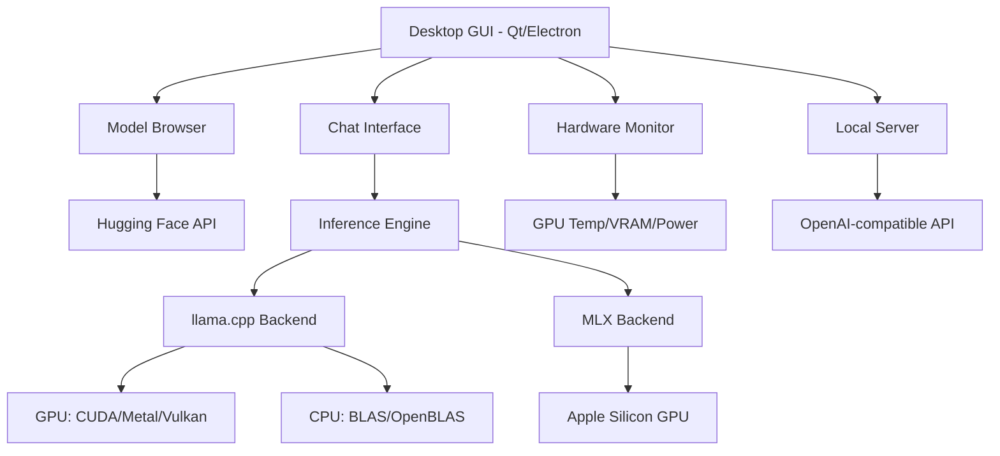
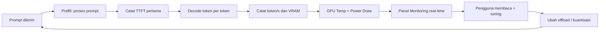

# Bab 3.2: LM Studio

> Ada dua cara mengenal model bahasa: membaca dokumentasi dan *benchmark* selama berhari-hari, atau memakai LM Studio — satu aplikasi desktop tempat Anda mencari model, mengunduhnya, menjalankannya, lalu melihat langsung angka token/detik dan suhu GPU dari jendela yang sama. Jika Ollama adalah mesin yang dioperasikan lewat terminal, LM Studio adalah ruang pamer tempat setiap model bisa dicoba secepat mencicipi menu. Sub-bab ini membedah fitur-fitur yang membuat LM Studio disukai eksperimentator: *model discovery*, *hardware monitoring*, hingga *headless mode* untuk pengembangan.

---

## 1. Tujuan Sub-Bab

Setelah membaca sub-bab ini, Anda akan mampu:

- Menavigasi fitur *discovery* model LM Studio yang terintegrasi dengan Hugging Face — mencari, memfilter, dan mengunduh model tanpa keluar dari aplikasi
- Menggunakan *hardware monitoring* (GPU, CPU, RAM) untuk *profiling* performa model dan mendeteksi *bottleneck* sebelum menyalahkan model
- Mengonfigurasi *multi-model serving* — menjalankan beberapa model sekaligus — dan memahami kapan harus memakai mode *headless*
- Membaca *benchmark* seperti *tokens/second*, *TTFT*, dan *memory peak* untuk membandingkan engine llama.cpp versus MLX di mesin Anda sendiri
- Menggunakan CLI `lms` dan *endpoint* API kompatibel OpenAI untuk mengintegrasikan LM Studio ke aplikasi eksternal

---

## 2. Ekosistem LM Studio: Desktop All-in-One

LM Studio hadir dengan filosofi yang berbeda dari Ollama. Jika Ollama memilih *command-line first* dan menyerahkan tampilan kepada aplikasi lain, LM Studio membangun semuanya dalam satu aplikasi desktop *cross-platform* — macOS, Windows, dan Linux — dari *model browser* hingga panel *monitoring* perangkat keras. Bagi pengguna yang ingin fokus pada eksperimen model, bukan administrasi server, model "semua dalam satu jendela" ini terasa jauh lebih cepat dipelajari.

Penting juga melihat posisinya dalam alur cerita bab ini: jika sub-bab 3.1 menjelaskan bagaimana mesin bekerja dari dalam (Ollama sebagai *engine*), sub-bab ini menjelaskan bagaimana mesin itu dioperasikan dari luar (LM Studio sebagai *cockpit*). Keduanya bahkan bisa digabungkan: LM Studio dan Ollama dapat hidup berdampingan di mesin yang sama, berbagi folder model, dan masing-masing melayani port API sendiri. Sebagian pengguna menggunakan Ollama sebagai *daemon* 24 jam untuk aplikasi produksi, sementara LM Studio dipakai untuk *playground* — mencoba model baru, mengukur performa, dan membandingkan kuantisasi sebelum memutuskan mana yang "naik pangkat" ke *server*.

Untuk siapa LM Studio paling berharga? Tiga profil pengguna yang paling diuntungkan: *power user* yang ingin membandingkan banyak model tanpa menulis *script*; pengembang yang ingin menguji API lokal sebelum integrasi produksi; dan peneliti/penulis yang butuh data performa jujur dari perangkatnya sendiri. Sebaliknya, pengguna yang mengelola *server* headless di data center, atau yang seluruh alur kerjanya sudah berbasis terminal, mungkin merasa GUI ini hanya menambah lapisan — bagi mereka Ollama di sub-bab 3.1 tetap pilihan yang lebih ramping. Mengenali profil ini sejak awal akan menghemat waktu: tidak semua orang perlu aplikasi sekaya ini, dan tidak semua orang cukup dilayani oleh satu perintah terminal.

Dua janji utama LM Studio menjadikannya unik di kelasnya: pertama, **integrasi penuh dengan Hugging Face** — katalog model terbesar dunia bisa dicari langsung dari dalam aplikasi, tanpa membuka browser; kedua, **privacy-first** — aplikasi tidak memerlukan *telemetry*, berjalan *fully offline*, dan tidak pernah mengirim data Anda ke server pihak ketiga selama model berjalan lokal. Dengan kata lain, LM Studio adalah *tool* eksperimen yang menghormati privasi sekaligus menurunkan hambatan teknis bagi pendatang baru.

Alur kerja harian pengguna LM Studio biasanya berbentuk siklus yang sama berulang-ulang: buka aplikasi, cari model baru di *Model Browser*, unduh, *load*, lalu jalankan prompt uji sambil menatap angka token/s dan suhu GPU. Karena semua langkah itu berada dalam satu jendela, siklus *try → measure → compare → decide* berlangsung dalam hitungan menit — jauh lebih cepat daripada mengelola model melalui terminal dan alat *monitoring* terpisah. Bagi pembaca buku ini yang ingin membandingkan puluhan model untuk menentukan mana yang cocok dengan perangkatnya, ritme kerja semacam ini adalah perbedaan antara eksperimen yang selesai dalam seminggu dan eksperimen yang berhenti di tengah jalan karena lelah berurusan dengan konfigurasi.

Dari sudut pandang pengalaman pengguna, ada satu detail yang sering membuat orang "ketagihan" memakai LM Studio: **tidak ada hambatan antara keinginan dan percobaan**. Di ekosistem lain, mencoba model baru bisa berarti membaca dokumentasi *command line*, menunggu unduhan dari situs pihak ketiga, lalu menyusun konfigurasi — tiga hambatan yang cukup untuk mematikan rasa ingin tahu. Di LM Studio, semua itu diringkas menjadi satu klik dari kotak pencarian. Hambatan rendah bukan berarti dangkal: di balik kemudahan itu, *engine* yang sama dengan ekosistem lain — llama.cpp dan MLX — bekerja penuh, lengkap dengan *monitoring* dan API. Inilah kombinasi langka yang membuat aplikasi ini cocok untuk pemula sekaligus *power user*.

---

## 3. Model Discovery & Download: Katalog di Ujung Jari

Dulu, mendapatkan model lokal berarti mengunjungi Hugging Face, mencari file GGUF yang tepat, membaca README, lalu men-download dan meletakkan file di folder yang benar. LM Studio memangkas seluruh proses itu menjadi sebuah kotak pencarian.

### Mencari dan Memfilter

Dari *Model Browser*, Anda bisa mencari model langsung dari **Hugging Face Hub** — panggilan API dilakukan di balik layar, hasilnya ditampilkan sebagai kartu model yang bisa di-klik. Yang membuat pencarian ini efektif adalah **filter** yang bisa dikombinasikan: jenis kuantisasi (**GGUF** atau **MLX**), jumlah parameter, dan lisensi. Contoh praktis: Anda ingin model 7B berlisensi permisif untuk proyek komersial — cukup set filter parameter 5-8B dan lisensi Apache-2.0/MIT, lalu katalog menyusut dari ribuan menjadi beberapa lusin kandidat yang relevan.

Filter lisensi adalah fitur yang sering dianggap remeh padahal menentukan masa depan proyek. Model berlisensi *non-commercial* (misalnya beberapa varian penelitian) bebas dipakai untuk eksperimen, tetapi menjadi masalah hukum bila produk Anda dijual. Dengan menyaring lisensi sejak pencarian, LM Studio membantu Anda menghindari jebakan "model ini bagus, dan ternyata tidak boleh dipakai di produksi" — sebuah pelajaran yang biasanya harus dibayar mahal di kemudian hari. Bagi pembaca buku ini yang serius membangun aplikasi di atas model lokal, biasakan membaca lisensi setiap model yang diunduh, termasuk turunan dan *LoRA*-nya.

### Unduh dan Manajemen Versi

Setelah model dipilih, aplikasi menangani *auto-download* dan *extraction* secara otomatis — tidak ada lagi kebingungan soal file `.bin` vs `.gguf`. Manajemen versi model juga rapi: beberapa kuantisasi dari model yang sama tersimpan sebagai entri terpisah, sehingga Anda bisa A/B membandingkan Q4_K_M dengan Q8_0 tanpa menimpa satu sama lain. Untuk pengguna yang menginginkan kontrol lebih, aplikasi tetap menyediakan folder model di disk yang bisa diakses langsung.

Ada satu keputusan yang akan Anda hadapi berulang kali di *Model Browser*: kuantisasi mana yang dipilih? Prinsipnya sederhana — kuantisasi lebih rendah (Q2/Q3) memakan VRAM lebih sedikit tetapi menurunkan kualitas, sementara kuantisasi lebih tinggi (Q6/Q8) mempertahankan kualitas dengan harga memori lebih besar. Jika VRAM perangkat Anda 8GB dan target model 7B, Q4_K_M biasanya adalah titik keseimbangan yang disarankan komunitas. LM Studio membantu keputusan ini dengan menampilkan perkiraan kebutuhan memori tiap kuantisasi di kartu model, sehingga Anda bisa langsung menyingkirkan varian yang jelas-jelas tidak muat — masalah yang dulu hanya bisa diselesaikan dengan mencoba-coba sampai *out-of-memory*.

Satu hal yang perlu diwaspadai ketika bereksperimen: model yang diunduh cepat menumpuk. Satu model 7B dalam beberapa varian kuantisasi bisa menghabiskan puluhan GB dalam semalam eksperimen. Biasakan *pruning* berkala — hapus varian yang kalah dalam *benchmark* Anda sendiri, pertahankan yang menang. Manajemen disk ini terdengar sepele, tetapi bagi pengguna laptop dengan SSD 256GB, inilah perbedaan antara bisa mencoba model baru minggu ini atau kehabisan ruang dan berhenti bereksperimen. Daftar model di panel *My Models* menampilkan ukuran tiap varian; jadikan itu daftar belanja sekaligus daftar "yang sudah dicoba dan ditolak".

Alur yang kami sarankan untuk menjaga *Model Browser* tetap sehat: (1) baca halaman model di Hugging Face sebelum mengunduh — perhatikan lisensi dan dukungan engine; (2) unduh satu varian kuantisasi saja pada percobaan pertama; (3) uji dengan prompt standar yang sama untuk semua model; (4) bila layak lanjut, barulah bandingkan beberapa kuantisasi; (5) hapus yang kalah. Disiplin kecil ini terdengar membosankan, tetapi justru inilah yang memisahkan "kolektor model" yang disk-nya penuh dengan model tak terpakai dari *evaluator* yang benar-benar tahu perangkatnya bisa menjalankan apa.

---

## 4. Inference Engine Dual: llama.cpp & MLX

Salah satu keunggulan LM Studio yang jarang dimiliki aplikasi lain adalah kemampuan memilih *engine* per model. Dua *backend* utama tersedia: **llama.cpp** untuk model **GGUF** — berjalan *hybrid* di GPU dan CPU, mendukung NVIDIA (CUDA), AMD (Vulkan/ROCm), hingga Intel; dan **Apple MLX** untuk model berformat **MLX/Safetensors** — memanfaatkan *unified memory* Mac M-series sehingga model yang lebih besar bisa muat dengan alokasi memori yang efisien.

Mengapa LM Studio menyediakan dua engine sekaligus, padahal Ollama (sub-bab 3.1) menyembunyikan pilihan itu? Jawabannya adalah filosofi yang berbeda: Ollama mengutamakan kesederhanaan ("pilih model, sisanya otomatis"), sedangkan LM Studio mengutamakan kendali eksperimen ("pilih model, lalu putuskan juga mesinnya"). Kedua pendekatan valid — tetapi untuk pengguna yang sedang *mengevaluasi* model, kemampuan memilih engine berarti satu variabel lagi yang bisa diputar-putar dalam eksperimen. Perbedaan kecepatan antara dua engine untuk model yang sama adalah informasi berharga yang hanya bisa didapat jika aplikasi memberi Anda kedua opsi.

Pilihan engine ini bukan sekadar teknis — ia memengaruhi performa nyata. Pada MacBook M3 Max, model 7B yang sama bisa berjalan sekitar **80 token/detik** via llama.cpp dan **95 token/detik** via MLX (lihat Tabel 1). Perbedaan ini muncul karena MLX mengoptimalkan alokasi memori untuk arsitektur Apple, sedangkan llama.cpp adalah mesin generik yang dioptimalkan di banyak platform. Strategi terbaik: coba kedua engine untuk model favorit Anda, lihat angka *monitoring*, lalu simpan yang tercepat. LM Studio bahkan membolehkan mencampur: model GGUF dan MLX dimuat bersamaan dalam satu sesi.

Selain pemilihan engine, ada dua *toggle* yang layak dikenal di pengaturan model: **FlashAttention** dan **context length**. FlashAttention — mekanisme *attention* yang hemat memori dan I/O, dibahas lebih dalam pada referensi [5] — memungkinkan *context window* lebih besar dengan penggunaan VRAM yang lebih efisien; pada beberapa GPU, mengaktifkannya membuat model yang tadinya hanya sanggup konteks 8K kini nyaman di 16K. Adapun *context length* adalah keputusan seimbang: memanjangkan konteks berarti KV cache membengkak dan *prefill* setiap *request* menjadi lebih lambat. Untuk *chat* harian, 4K-8K token biasanya sudah lebih dari cukup; perpanjang hanya saat benar-benar menempelkan dokumen panjang.

Satu eksperimen yang direkomendasikan bagi setiap pembaca bab ini: **uji satu model 7B pada tiga nilai *context length*** — misalnya 4K, 8K, dan 16K — sambil mencatat token/s dan VRAM di panel *monitoring*. Anda akan melihat pola yang sangat instruktif: kecepatan turun perlahan seiring konteks memanjang, sementara VRAM naik hampir linear. Pola inilah yang menjelaskan dua fakta sekaligus — mengapa "model 8B dengan konteks 128K" terdengar mengesankan tetapi jarang dipakai di perangkat rumahan (memori tidak cukup), dan mengapa produsen *framework* selalu menyarankan mengukur dulu sebelum mempercayai spesifikasi. Eksperimen sederhana ini lebih bernilai dari seratus halaman dokumentasi.

Ringkasnya, *inference engine* bukanlah medan pilihan tunggal: dengan dua engine, dua mode kuantisasi, *FlashAttention*, dan *context length* yang bisa diatur, LM Studio memberi Anda enam *knob* yang bisa diputar untuk satu model yang sama. Kebanyakan pengguna merasa cukup memutar dua atau tiga; sisanya adalah ruang eksperimen untuk mereka yang benar-benar ingin memahami *bottleneck* perangkatnya. Pada sub-bab berikutnya, kita akan melihat pendekatan yang jauh lebih radikal: tidak ada *knob* GPU sama sekali — karena di GPT4All, komputasi seratus persen ada di CPU.

Sebelum menutup seksi ini, satu peringatan kecil: angka kecepatan pada Tabel 1 (80 t/s vs 95 t/s) adalah nilai *indikatif* yang diukur pada satu perangkat tertentu, bukan jaminan universal. Di Mac dengan chip lebih kecil — atau saat model lain dimuat bersamaan — angka tersebut bisa bergeser jauh. Perlakuan yang benar terhadap angka *benchmark* apa pun di buku ini: jadikan titik awal, bukan kebenaran akhir; geser *slider*, ganti engine, dan ukur sendiri — karena perangkat Anda adalah satu-satunya *benchmark* yang benar-benar peduli pada Anda.

Dan bila eksperimen Anda menghasilkan sesuatu yang menarik — misalnya satu kombinasi *engine + kuantisasi* yang jauh lebih cepat dari dugaan — luangkan waktu membagikannya ke komunitas *LM Studio Bench* [8]. *Benchmark* terbaik di ekosistem ini lahir dari pengukuran ribuan perangkat nyata, bukan dari ruang uji vendor; dengan satu laporan sederhana, Anda ikut membangun data yang bermanfaat bagi ribuan pengguna lain dengan perangkat serupa.

---

## 5. Hardware Monitoring & Profiling: Buka Kap Mesin

Saat model sedang bekerja, LM Studio memperlakukan aplikasi seperti *dashboard* mobil balap — setiap metrik penting ditampilkan secara real-time. **GPU temperature** dan **power draw** (khusus NVIDIA/AMD) memberi gambaran seberapa keras GPU bekerja; **VRAM usage** diukur *per proses*, sehingga Anda tahu persis model mana yang menyedot memori; dan **tokens/second** hidup ditampilkan langsung di antarmuka chat, bukan hanya di *benchmark* terpisah.

Kehadiran *monitoring* di dalam aplikasi chat, bukan di alat terpisah, adalah pembeda yang halus tetapi berpengaruh besar terhadap kebiasaan pengguna. Dengan `nvidia-smi` atau `nvtop`, orang jarang membuka *monitor* kecuali saat ada masalah — dengan panel yang selalu tampil di samping percakapan, pengukuran menjadi bagian alami dari setiap sesi: "ah, prompt ini berat, lihat suhu naik", "model ini ternyata hanya memakai separuh VRAM". Perubahan kebiasaan kecil inilah yang mengubah pengguna dari sekadar pemakai menjadi *evaluator* yang sadar sumber daya — dan kesadaran itu adalah bahan bakar semua keputusan teknis di sub-bab ini.

Untuk analisis yang lebih dalam, LM Studio menyediakan *developer mode* dengan metrik tambahan seperti **TTFT** (*time to first token*) — waktu dari pengiriman prompt hingga token pertama muncul — yang mencerminkan biaya *prefill* dan *load*. Memadukan metrik-metrik ini dengan konsep *roofline model* dari literatur [4], Anda bisa membedakan dua situasi yang sering tertukar: model lambat karena **GPU-bound** (komputasi penuh, terlihat dari suhu dan power tinggi) atau karena **memory-bound** (transfer data tidak seimbang, terlihat dari VRAM penuh tapi utilasi GPU rendah). Dengan pemahaman ini, keputusan "turunkan kuantisasi" atau "kurangi *context length*" jadi berdasarkan data, bukan tebakan.

Perlu dicatat bahwa *monitoring* ini tidak terbatas pada satu GPU. Pada mesin dengan beberapa kartu grafis (semakin umum di workstation para pengguna buku ini), LM Studio menampilkan metrik per GPU, dan Anda bisa melihat bagaimana lapisan model didistribusikan di antara mereka. Bagi pemilik laptop yang juga memakai GPU *integrated* dan *discrete* secara bersamaan (pola umum di banyak laptop modern), informasi ini menjelaskan mengapa sebuah model kadang berjalan di chip yang salah: server memilih GPU tercepat yang tersedia, dan log-lah yang menunjukkan pilihannya. Sama seperti *dashboard* mobil yang menampilkan RPM tiap silinder, panel *monitoring* LM Studio memberi Anda pengetahuan yang biasanya hanya dimiliki orang yang merakit komputer sendiri.

Ada satu metrik lagi yang layak dipahami meskipun jarang disorot: **memory peak** — puncak penggunaan memori selama satu sesi *inference*. Metrik ini berbeda dari VRAM *steady-state* karena sebagian model membutuhkan memori sementara yang besar saat *prefill* (memproses prompt panjang) sebelum kembali turun saat *decode*. Jika aplikasi Anda rutin melempar prompt panjang — misalnya meringkas dokumen — perhatikan *memory peak*, bukan VRAM rata-rata, ketika menentukan kuantisasi yang aman. Mengabaikannya adalah penyebab klasik *out-of-memory* yang muncul "tiba-tiba" hanya saat prompt sedang panjang-panjangnya.

Salah satu kontrol yang paling bermanfaat adalah **GPU offload slider** dari 0% hingga 100%. Model GGUF bisa dipecah antara GPU dan CPU: 0% berarti murni CPU (kadang diperlukan agar aplikasi lain tetap punya VRAM), 100% berarti seluruh lapisan di GPU. Menggeser slider ini sambil mengamati angka token/s adalah cara tercepat memahami karakter hardware Anda — biasanya ada *sweet spot* di sekitar 80-100% untuk GPU modern.

Kebiasaan yang perlu dibangun adalah **membaca metrik secara bersamaan, bukan satu per satu**. Token/s yang rendah belum tentu berarti model buruk; bisa jadi suhu GPU sudah menyentuh batas *throttling*, atau VRAM penuh sehingga sebagian lapisan jatuh ke CPU. Sebaliknya, token/s tinggi dengan VRAM hampir kosong bisa berarti model sedang dibatasi oleh *memory bandwidth* — perhatikan, ini persoalan yang tidak akan terlihat jika Anda hanya memandang angka kecepatan. Latihan sederhana: jalankan satu model dengan offload 50%, 75%, lalu 100%, dan catat pasangan (token/s, suhu, VRAM) tiap kali. Anda akan mendapat *profil* perangkat sendiri yang lebih berharga daripada angka *benchmark* orang lain di internet.

---

## 6. Local Server & API: Menghidupkan Backend

Di balik tampilan desktop yang cantik, LM Studio menyembunyikan sebuah *server lokal* lengkap. Dengan mengaktifkan **Local LLM Service** dari menu *Developer*, aplikasi menyediakan *endpoint* API **kompatibel OpenAI** di `http://localhost:1234` — aplikasi yang ditulis untuk API OpenAI bisa langsung diarahkan ke sini hanya dengan mengganti *base URL*, persis seperti Ollama. Bagi aplikasi yang dibangun di atas ekosistem OpenAI (misalnya *agent framework*, *terminal assistant*, atau *IDE plugin*), ini berarti model lokal bisa menjadi pengganti *drop-in* untuk API berbayar — dengan keuntungan privasi dan biaya nol.

Fitur unggulannya adalah **multi-model serving simultan**: beberapa model bisa dimuat dan dilayani pada saat bersamaan, masing-masing tersedia lewat *endpoint* yang sama dengan nama model berbeda. Bagi pengembang, ini berarti satu proses server untuk semua eksperimen — aplikasi testing, script benchmark, dan chat UI berbagi satu infrastruktur. Untuk permintaan yang membutuhkan data terstruktur, LM Studio mendukung **Structured Output** (skema JSON) yang dibangun di atas pustaka *Outlines* — model dijamin mengembalikan JSON yang sesuai skema, bukan teks yang "hampir JSON". Dan ketika Anda tidak ingin aplikasi desktop ikut berjalan, **headless mode** menjadikan LM Studio *background service* murni — server tetap hidup, jendela tidak perlu terbuka.

Perlu diingat: *endpoint* server lokal menunggu di `localhost:1234` dan secara *default* hanya menerima koneksi dari mesin yang sama. Ini keputusan desain yang tepat untuk penggunaan pribadi, tetapi bagi tim yang ingin berbagi satu server model di jaringan kantor, Anda perlu membuka akses jaringan secara sadar — dan bila itu dilakukan, pastikan server berada di balik *firewall* atau VPN internal. Prinsipnya sama dengan Ollama: *local server* yang hebat tetaplah sebuah server, dan setiap server yang terbuka ke jaringan adalah tanggung jawab keamanan Anda.

Bagi pengembang aplikasi, keberadaan API kompatibel OpenAI ini juga membuka pola kerja yang rapi: **aplikasi ditulis sekali, *backend*-nya bisa ditukar**. Di fase pengembangan, aplikasi diarahkan ke LM Studio lokal (gratis, tanpa batas, tanpa data keluar); sebelum rilis, *base URL* cukup diganti ke API OpenAI atau layanan cloud lain — kode tetap sama. Pola ini sangat berguna untuk menguji perilaku *pipeline* (misalnya *structured output* atau *streaming*) dengan biaya nol, sebelum mengorbankan biaya produksi. Inilah salah satu alasan mengapa LM Studio menjadi favorit para *developer* yang bekerja untuk klien dengan kebijakan keamanan ketat: semua logika bisa diuji di meja kerja, dan kode yang sama berjalan di mana pun.

---

## 7. Fitur Developer: CLI `lms` dan SDK TypeScript

Para pengembang yang tidak suka mengklik tombol akan menemukan teman di **`lms`**, utilitas *command-line* bawaan LM Studio. Dengan `lms list` Anda melihat model yang terpasang, `lms load` memuat model tertentu dengan opsi seperti `--context-length` dan `--gpu-offload`, dan `lms server` mengontrol *Local LLM Service*. Semua yang bisa dilakukan lewat GUI bisa dilakukan lewat terminal — dan lebih mudah diotomatisasi.

Kekuatan sesungguhnya dari CLI baru terasa ketika digabungkan dengan *script*. Bayangkan sebuah skenario di mana Anda ingin tahu model mana yang paling cepat untuk perangkat tertentu: tulis *loop* yang memuat satu per satu kandidat model dengan `lms load`, kirim prompt uji yang sama, catat token/s, lalu *unload* — semuanya tanpa satu pun klik pada GUI. Hasilnya adalah tabel perbandingan milik Anda sendiri, yang jauh lebih jujur daripada *benchmark* di internet karena diukur di perangkat yang persis sama dengan perangkat Anda. Inilah praktik yang disebut *profiling*: mengetahui, bukan menebak.

Selain perintah inti, `lms` menyediakan perintah tambahan untuk melihat status server (`lms server status`), menghentikannya (`lms server stop`), dan memeriksa log — pasangan lengkap untuk operasi jarak jauh di server tanpa GUI. Bila Anda mengelola beberapa mesin sekaligus (laptop pengembangan di rumah, workstation di kantor), konsistensi antarmuka CLI berarti satu set perintah yang bisa dihafal sekali dan dipakai di mana saja. Inilah nilai yang tidak terlihat di tangkapan layar aplikasi, tetapi terasa setiap hari bagi pengguna yang bekerja lintas mesin.

Bagi yang membangun aplikasi di atas LM Studio, tersedia **lmstudio-js**: SDK TypeScript yang membungkus API lokal sehingga integrasi cukup menulis beberapa baris kode. Fitur yang paling disukai adalah **model on-demand loading**: aplikasi cukup meminta model tertentu, dan LM Studio memuatnya secara otomatis jika belum aktif — pengguna aplikasi tidak perlu tahu urusan manajemen model. Kombinasi CLI, SDK, dan API kompatibel OpenAI menjadikan LM Studio bukan sekadar *chat client*, melainkan fondasi untuk membangun produk yang serius di atas model lokal.

Perspektif yang paling berguna ketika memilih *tool* adalah bertanya: **siapa yang akan mengoperasikan sistem ini untuk waktu lama?** Jika jawabannya adalah pengguna non-teknis yang hanya perlu model selalu tersedia, *on-demand loading* dan GUI LM Studio adalah penolong sejati — tidak ada perintah terminal yang harus dihafal, tidak ada file konfigurasi yang bisa rusak. Jika jawabannya adalah tim DevOps yang ingin *server* terkontrol penuh di atas Linux tanpa GUI, Ollama akan terasa lebih ringkas. Keduanya bukan pesaing yang saling menyingkirkan — banyak pengguna menjalankan Ollama sebagai *backend* produksi dan LM Studio sebagai *playground* eksperimen di mesin pribadi.

---

## 8. Tabel Wajib

Bagian ini merangkum tiga perbandingan inti yang menjadi fondasi pengambilan keputusan dengan LM Studio: `Tabel 1` membandingkan dua *engine* inference, `Tabel 2` memetakan fitur *monitoring* terhadap alat alternatif, dan `Tabel 3` menempatkan LM Studio di antara para pesaing desktop. Ketiga tabel ini sengaja disusun berjenjang — dari keputusan teknis paling kecil (engine mana) hingga keputusan strategis paling besar (aplikasi mana yang dipakai jangka panjang).

### Tabel 1: Perbandingan Engine Inference LM Studio

Tabel ini membandingkan dua *engine* yang bisa dipilih pengguna LM Studio, dengan contoh angka kecepatan diukur pada MacBook M3 Max untuk model 7B.

| Fitur | llama.cpp (GGUF) | Apple MLX (Safetensors) |
|:---|:---|:---|
| **Target Hardware** | Semua (CPU/GPU/NVIDIA/AMD) | Apple Silicon M-series |
| **Format Model** | GGUF | MLX/Safetensors |
| **Quantization** | Q2–Q8, IQ1–IQ4 | FP16/FP32, MLX quant |
| **Vision Model** | LLaVA, llava-llama, DeepSeek V4 | LLaVA via mlx-vlm |
| **Kecepatan (M3 Max)** | ~80 t/s (7B) | ~95 t/s (7B) |
| **Multi-model** | Ya (GGUF + MLX campur) | Ya |

Analisis dari tabel ini: llama.cpp unggul dalam *portabilitas* — satu mesin untuk semua hardware — sementara MLX unggul dalam *kecepatan* pada ekosistem Apple. Rentang kuantisasi juga berbeda: llama.cpp menawarkan varian ekstrem (IQ1-IQ4) untuk memeras model besar ke VRAM kecil, sedangkan MLX lebih konservatif dengan FP16/FP32 dan kuantisasi miliknya. Jika perangkat Anda Mac M-series dan model yang dipakai mendukung MLX, coba kedua engine dan simpan hasil *benchmark* — perbedaan ~19% kecepatan cukup berarti untuk percobaan harian.

Kapan harus memilih yang mana? Jawaban ringkasnya: **pilih MLX bila modelnya tersedia dan perangkatnya Apple; pilih llama.cpp untuk yang lain**. Ada satu pertimbangan tambahan: dukungan *vision*. Keduanya mendukung model *vision* (LLaVA dan turunannya, termasuk varian DeepSeek V4 di sisi llama.cpp; via `mlx-vlm` di sisi MLX), tetapi kematangan dan jumlah model di ekosistem llama.cpp jauh lebih besar karena ia lebih lama beredar. Untuk pengguna yang rajin mencoba model baru yang rilis mingguan, llama.cpp hampir selalu punya dukungan lebih dulu — MLX menyusul beberapa saat kemudian.

### Tabel 2: Fitur Monitoring Hardware

Berikut perbandingan metrik *monitoring* yang disediakan LM Studio terhadap *tool* alternatif, lengkap dengan tingkat akurasi.

| Metrik | LM Studio | Tool Alternatif | Akurasi |
|:---|:---|:---|:---:|
| GPU Temperature | Ada (NVIDIA/AMD/Intel) | nvidia-smi, radeontop | Real-time |
| VRAM Usage | Ada (per proses) | nvtop | ±50 MB |
| Token/s (Live) | Ada (di chat UI) | llama-bench | Real-time |
| TTFT | Ada (developer mode) | Manual curl timing | ±10 ms |
| Power Draw | Ada (NVIDIA/AMD) | nvidia-smi | Real-time |

Kesimpulan yang bisa diambil: LM Studio tidak sekadar menyalin fungsi `nvidia-smi` — ia menautkan metrik *hardware* dengan metrik *inference* dalam satu tampilan, sehingga korelasi "suhu naik → token/s turun" langsung terlihat. Akurasi VRAM ±50 MB dan TTFT ±10 ms cukup untuk pengambilan keputusan sehari-hari; untuk pengukuran presisi penelitian, tetap gunakan *tool* khusus.

Cara membaca tabel ini dengan benar adalah menanyakan: "metrik mana yang benar-benar saya perlukan?" Pengguna desktop yang hanya ingin tahu "apakah GPU saya kepanasan?" cukup melihat baris pertama; pengembang yang menyetel *pipeline* butuh TTFT dan *token/s*; pemilik laptop yang khawatir baterai perlu *power draw*. Nilai dari integrasi LM Studio bukan pada akurasinya yang setara *tool* khusus — melainkan pada *ketersediaannya di tempat yang sama dengan percakapan*. Anda tidak perlu berpindah jendela untuk memastikan VRAM masih cukup saat model mulai mengeluarkan *error* — jawabannya sudah tampil di layar yang sama.

### Tabel 3: Perbandingan LM Studio vs Alternatif Desktop

| Fitur | LM Studio | Ollama | GPT4All | Text-Generation-WebUI |
|:---|:---|:---|:---|:---|
| **GUI Desktop** | Native app | CLI-only | Native app | Web UI |
| **Model Browser** | Ada (HF integrated) | CLI pull | Built-in leaderboard | Manual download |
| **Monitoring HW** | Terintegrasi | Tidak | Minimal | Extension |
| **Headless Mode** | Ada | Built-in | Tidak | Ada |
| **OpenAI API** | Ada | Ada | Ada | Ada |

Tabel ini memetakan empat pilihan populer: Ollama adalah pemenang untuk *server* dan otomatisasi (API paling matang), LM Studio untuk eksperimen desktop dengan *monitoring* lengkap, GPT4All untuk perangkat tua *CPU-only* (akan dibahas di sub-bab 3.3), dan Text-Generation-WebUI untuk penggemar web UI dengan ekstensi. Pilihan bukan soal "siapa terbaik", melainkan "di mana Anda bekerja": di terminal, di desktop ber-GPU, atau di laptop lawas.

Dua kolom yang paling sering diabaikan calon pengguna adalah *Headless Mode* dan *Monitoring HW*. Pengguna baru biasanya memilih berdasarkan GUI, padahal dua fitur itulah yang menentukan apakah sebuah aplikasi bisa "tumbuh" bersama kebutuhan: ketika eksperimen berubah menjadi layanan yang harus berjalan 24 jam (headless), atau ketika *bottleneck* mulai muncul dan perlu diukur (monitoring). Sebagai panduan cepat: jika Anda berencana mengotomasi sesuatu, pastikan pilihan Anda memiliki mode *headless*; jika Anda berencana membandingkan banyak model, pastikan ada *monitoring* — dua kriteria ini menyingkirkan separuh kandidat sebelum Anda mulai mengunduh.

---

## 9. Diagram & Visualisasi

Dua diagram berikut merangkum sisi *struktur* dan sisi *alur* LM Studio. Gambar 1 menunjukkan bagian-bagian aplikasi dan hubungannya, sedangkan Gambar 2 menunjukkan bagaimana data mengalir dari *request* hingga menjadi metrik yang tampil di panel *monitoring* — keduanya melengkapi pembahasan seksi 4-7 di atas.

### Gambar 1: Arsitektur Aplikasi LM Studio

Diagram berikut menunjukkan bagaimana komponen-komponen LM Studio saling terhubung.



Perhatikan bahwa satu *desktop GUI* menjadi pusat yang menghubungkan empat fungsi: mencari model (kiri), berchat (tengah), memantau perangkat keras (bawah), dan melayani API (kanan). Di bawah *chat interface* terdapat *engine layer* yang memilih antara llama.cpp dan MLX — dan dari sana, jalur *hardware* terpecah sesuai target: CUDA/Metal/Vulkan untuk GPU umum, BLAS/OpenBLAS untuk CPU, dan GPU Apple khusus untuk MLX. Diagram ini menjelaskan mengapa satu aplikasi bisa menangani hampir semua kebutuhan eksperimen tanpa pindah *tool*.

Dua cabang *UI* yang paling menarik untuk diperhatikan adalah `MON` dan `SRV`. Keduanya tidak bergantung pada *engine layer*: *hardware monitor* membaca data langsung dari kartu grafis (lewat API sistem seperti `nvidia-smi` di balik layar), sementara *local server* mengekspos model apa pun yang sedang dimuat melalui satu *endpoint* OpenAI yang seragam. Desain ini menjelaskan dua karakteristik pengalaman pengguna: *monitoring* tetap hidup bahkan saat model sedang tidak aktif (karena ia membaca *hardware*, bukan proses inference), dan *server* tidak perlu tahu engine apa yang dipakai model (karena konversi dilakukan di lapisan `ENG`). Pemisahan tanggung jawab semacam inilah yang membuat LM Studio terasa lengkap tanpa menjadi rumit.

### Gambar 2: Alur Data *Monitoring* dan *Benchmark*

Untuk melengkapi, berikut alur bagaimana LM Studio mengubah *request* menjadi angka *benchmark* yang terlihat di panel *monitoring*.



Sirkuit ini adalah inti dari *profiling*: setiap *request* menghasilkan jejak metrik — TTFT, token/s, VRAM, suhu — yang ditampilkan langsung di *dashboard*. Pengguna membaca jejak itu, mengubah *GPU offload* atau kuantisasi, lalu mengirim *request* baru untuk membandingkan. Inilah pola kerja ilmiah yang membuat LM Studio terasa seperti *laboratorium* model lokal: setiap percobaan terukur, setiap keputusan berbasis angka.

Perlu ditegaskan satu perbedaan yang sering membingungkan pembaca *benchmark*: **token/s mengukur generasi, bukan persepsi**. Pada model 3B yang melaju 80 t/s, sebuah jawaban 200 token selesai dalam 2,5 detik — terasa instan. Pada model 70B yang berjalan 8 t/s, jawaban yang sama butuh 25 detik — pengguna akan merasakan jeda panjang, apalagi jika *prefill* prompt panjang ikut dihitung. Karena itu, saat menguji model untuk pengguna akhir, jangan hanya mengejar token/s tertinggi; ukur juga TTFT dan waktu total, karena itulah yang dirasakan manusia. LM Studio memberi semua angka ini — tugas Anda adalah membaca yang benar sesuai pertanyaan yang diajukan.

Masih dalam semangat *benchmark* yang jujur: catat juga **kondisi pengukuran** setiap kali menjalankan tes — offload berapa persen, *context length* berapa, model lain sedang dimuat atau tidak. Angka 75 t/s yang diukur saat GPU kosong akan sangat berbeda dengan 40 t/s yang diukur saat browser, editor, dan video call ikut berjalan. *Profiling* yang baik mencatat lingkungan pengukuran bersama hasilnya, sehingga perbandingan antar model tetap adil dan bisa direproduksi di kemudian hari — ini disiplin kecil yang sering diabaikan bahkan oleh penulis ulasan teknologi di internet.

---

## 10. Praktikum / Hands-On

Dua tutorial berikut menuntun Anda dari instalasi hingga *serving* multi-model. Keduanya dapat dijalankan di macOS maupun Windows, dan dirancang berurutan: Langkah 1 membangun *baseline* performa, Langkah 2 memperdalamnya dengan *multi-model serving* dan *structured output*.

### Langkah 1: Setup Headless Server dan Benchmark Model

Mulailah dari nol: instal LM Studio, lalu siapkan model dan ukur kecepatannya dari terminal. Tutorial ini mengasumsikan Anda menggunakan macOS atau Windows — kedua platform didukung penuh, dan semua perintah di bawah bekerja sama di keduanya.

```bash
# 1. Install LM Studio dan buka aplikasi
# 2. Cari model di Model Browser: "llama-3.2-3b-instruct-q4_k_m"
# 3. Download dan load model

# 4. Enable headless mode (Local LLM Service)
# Settings > Developer > Enable Local LLM Service

# 5. Gunakan CLI lms
lms list
lms load llama-3.2-3b-instruct-q4_k_m --context-length 8192

# 6. Benchmark dari terminal
python -c "
import time, requests
start = time.time()
r = requests.post('http://localhost:1234/v1/chat/completions',
    json={'model':'llama-3.2-3b','messages':[
        {'role':'user','content':'Buat cerita 500 kata'}
    ],'stream':False})
elapsed = time.time() - start
tokens = len(r.json()['choices'][0]['message']['content'].split())
print(f'Time: {elapsed:.2f}s, Tokens: {tokens}, Speed: {tokens/elapsed:.1f} t/s')
"
```

Perhatikan alur kerja yang dihasilkan langkah-langkah ini: *load* model dilakukan lewat CLI `lms`, tetapi *benchmark* hanya butuh *HTTP request* biasa ke `localhost:1234` — artinya apa pun yang bisa mengirim *HTTP* (Python, curl, aplikasi lain) bisa mengukur performa LM Studio. Simpan angka token/s dari langkah 6 sebagai *baseline*; Anda akan membandingkannya setelah mengubah *GPU offload*.

Penting juga dipahami bahwa langkah 2-3 bisa dilakukan dua jalan: lewat GUI (klik model di *Model Browser*, tombol *Download*) atau lewat CLI. Jika komputer Anda bukan mesin utama dan Anda bekerja jarak jauh, jalur CLI jauh lebih efisien — inilah alasan mengapa `lms` ada: ia membawa seluruh kemampuan GUI ke terminal tanpa kehilangan fitur. Bila `lms` tidak dikenali setelah instalasi, periksa kembali *PATH* atau jalankan dari folder aplikasi; pada macOS, satu kali izin *privacy* untuk *network access* juga kadang diperlukan.

### Langkah 2: Multi-Model Serving dan GPU Offload Tuning

Setelah *baseline* model pertama tercatat, saatnya bereksperimen dengan *multi-model serving* — menjalankan dua model berbeda dalam satu server, masing-masing dengan alokasi GPU yang bisa diatur. Ini juga kesempatan menguji *structured output*, fitur yang membedakan LM Studio dari *client* sederhana.

```bash
# 1. Load 2 model berbeda secara simultan
lms load llama-3.2-3b-instruct-q4_k_m --gpu-offload 100
lms load qwen2.5-7b-instruct-q4_k_m --gpu-offload 50

# 2. Verifikasi via API
curl http://localhost:1234/v1/models

# 3. Monitoring resource
# Buka tab "Developer" > "Server Log" untuk lihat GPU allocation

# 4. JSON Structured Output
curl http://localhost:1234/v1/chat/completions \
  -d '{
    "model": "llama-3.2-3b",
    "messages": [{"role":"user","content":"Extract: Nama: Budi, Umur: 25"}],
    "response_format": {
      "type": "json_schema",
      "json_schema": {
        "name": "person",
        "schema": {
          "type": "object",
          "properties": {
            "nama": {"type": "string"},
            "umur": {"type": "integer"}
          }
        }
      }
    }
  }'
```

Dua model dengan *offload* 100% dan 50% menunjukkan filosofi *sharing* VRAM: model pertama mengambil seluruh GPU, model kedua berbagi antara GPU dan CPU — ideal saat VRAM tidak cukup untuk keduanya penuh. *Response* JSON dari langkah 4 dijamin mengikuti skema (nama string, umur integer) berkat *Outlines*; bandingkan hasilnya dengan tanpa `response_format` untuk merasakan bedanya. Ini adalah fitur kunci bagi pengembang yang ingin membangun *pipeline* data otomatis di atas model lokal.

Satu catatan tentang langkah 3: tab *Server Log* adalah jendela ke dalam proses *serving*. Di sana Anda bisa melihat bagaimana model dibagi antara GPU dan CPU, kapan model dimuat atau dibongkar, dan — yang paling berguna — pesan peringatan saat *context* melebihi kapasitas. Ketika aplikasi tiba-tiba memberi jawaban terpotong atau *error*, tab inilah tempat pertama untuk mencari jawaban. Banyak masalah "model saya rusak" ternyata adalah masalah konfigurasi yang terpampang jelas di *log* — kebiasaan membaca *log* sebelum bertanya ke forum adalah salah satu keterampilan yang paling cepat membedakan pengguna berpengalaman.

Langkah 1 dan 2 bersama-sama menyelesaikan siklus *profiling* yang utuh: *baseline* diukur (satu model, satu offload), lalu dibandingkan (dua model, dua offload), dan akhirnya diverifikasi bentuknya (*structured output*). Sebagai latihan lanjutan, coba ulangi langkah 2 dengan menukar nilai offload — `--gpu-offload 50` untuk model kecil dan 100 untuk model besar — lalu amati apakah catatan token/s Anda selaras dengan analisis *roofline* di seksi 5. Jika hasilnya tidak memuaskan, jangan buru-buru mengganti model; coba dulu menurunkan konteks atau mengganti kuantisasi — sering kali solusi ada di pengaturan, bukan di model.

---

## 11. Studi Kasus: Eksperimen Model untuk Penulis Konten

Studi kasus berikut menggambarkan bagaimana LM Studio digunakan bukan oleh *developer*, melainkan oleh pengguna biasa dengan kebutuhan *benchmark* yang nyata — sekaligus menunjukkan bahwa *hardware monitoring* yang terintegrasi mengubah cara orang menulis ulasan teknologi.

Seorang penulis konten teknologi di Bandung — bukan *engineer*, melainkan pengguna harian yang menulis artikel tentang AI — mendapat mandat membuat seri tulisan perbandingan model lokal. Masalahnya, ia tidak punya pengalaman terminal, tidak ingin memakai API berbayar, dan hanya punya satu alat: **MacBook Pro M3 Pro 18GB** yang dipakai kerja.

**Pilihan solusi.** Melihat profil penggunanya (non-teknis, butuh hasil cepat, perangkat Mac dengan *unified memory* terbatas 18GB), **LM Studio** adalah pilihan paling masuk akal — GUI desktop, tidak perlu perintah terminal untuk hal-hal dasar, dan *monitoring* terintegrasi sehingga ia tidak perlu alat eksternal untuk menulis angka *benchmark* di artikelnya. Opsi lain sempat dipertimbangkan: Ollama membutuhkan keakraban terminal dan *monitoring*-nya terpisah; GPT4All tidak mendukung GPU dan katalognya lebih sempit. Keduanya gugur bukan karena buruk, melainkan karena tidak cocok dengan profil penggunanya — sebuah pelajaran tentang memilih *tool* berdasarkan *user*, bukan *feature list*.

Pertimbangan lain yang ikut menentukan: **ukuran *unduhan* dan kemudahan pemutakhiran aplikasi**. Seorang penulis yang bekerja dengan kuota internet kantor tidak ingin menarik puluhan GB setiap kali mencoba satu model — LM Studio menawarkan pencarian model yang filter-nya bisa mempersempit kandidat sebelum unduhan dimulai, sehingga ia hanya mengunduh model yang benar-benar akan diuji. Detail semacam ini jarang masuk daftar fitur, tetapi justru menjadi penentu bagi pengguna dengan keterbatasan nyata.

**Langkah kerja.** Ia membuka *Model Browser*, lalu mengunduh tiga kandidat sekaligus: **Mistral** (untuk konteks umum), **Llama 3.2** (kekuatan keluarga Llama), **Qwen 2.5** (kekuatan model China berbahasa banyak), serta **DeepSeek V4 Flash** untuk menguji tugas *reasoning* berat. Setiap model di-*load* dengan **GPU offload 100%**, lalu ia menjalankan prompt riset yang sama dan mencatat token/s dan VRAM dari panel *monitoring*. Karena MacBook M3 Pro hanya punya 18GB *unified memory*, model 13B+ harus dibatasi *context*-nya agar tidak menyentuh *swap* — pengaturan ini ia pelajari dengan mencoba, bukan dari dokumen.

**Hasil & pelajaran.** Dari eksperimen itu, **Qwen 2.5 7B Q4_K_M** memberikan keseimbangan terbaik — sekitar **75 t/s** dengan **5.2GB VRAM** — cukup untuk menulis draft artikel tanpa menunggu lama, sementara **DeepSeek V4 Flash** (13B aktif) unggul telak di tugas *reasoning* kompleks seperti merangkum paper penelitian berstruktur, berkat arsitektur *Mixture-of-Experts*-nya. Kesimpulan penulisnya: LM Studio memungkinkan eksperimen cepat tanpa *setup* infrastruktur — dari nol sampai artikel perbandingan berdata lengkap hanya dalam satu sore, dan semua angka di artikelnya bisa dipertanggungjawabkan karena diukur sendiri. Yang menarik, artikel itu justru populer justru karena menyertakan angka TTFT dan VRAM yang diukur di perangkat kelas menengah — data yang biasanya tidak pernah muncul di artikel *review* yang hanya mengutip *benchmark* vendor.

Dari kisah ini ada dua pelajaran yang berlaku umum. Pertama, **data lokal mengalahkan data vendor**: angka *benchmark* yang dipublikasikan pembuat model diukur di *hardware* kelas datacenter, bukan di MacBook milik penulis; tanpa *monitoring* terintegrasi, ia tidak akan pernah tahu bahwa kenyataan di perangkatnya berbeda drastis. Kedua, **profil pengguna menentukan pilihan *tool***: keputusan memilih LM Studio tidak didasarkan pada "aplikasi mana yang paling canggih", melainkan pada "aplikasi mana yang paling sedikit hambatannya bagi orang yang tidak ingin menyentuh terminal". Kedua pelajaran ini akan kembali berguna saat kita membandingkan GPT4All untuk perangkat lawas di sub-bab berikutnya — tepatnya, saat kita melihat bagaimana aplikasi yang jauh lebih sederhana justru menjadi jawaban untuk masalah yang sama sekali berbeda.

---

## 12. Referensi

### Paper Jurnal/Konferensi

[1] Liao, S., et al. (2024). *Inference Performance Optimization for Large Language Models on CPUs*. arXiv: [2407.07304](https://arxiv.org/abs/2407.07304)

[2] Zhang, T., et al. (2024). *NoMAD-Attention: Efficient LLM Inference on CPUs Through Multiply-add-free Attention*. arXiv: [2403.01273](https://arxiv.org/abs/2403.01273)

[3] Zhang, Z., et al. (2024). *A Survey on Efficient Inference for Large Language Models*. arXiv: [2404.14294](https://arxiv.org/abs/2404.14294)

[4] Yuan, Z., et al. (2024). *LLM Inference Unveiled: Survey and Roofline Model Insights*. arXiv: [2402.16363](https://arxiv.org/abs/2402.16363)

[5] Dao, T., Fu, D. Y., Ermon, S., Rudra, A., & Ré, C. (2022). *FlashAttention: Fast and Memory-Efficient Exact Attention with IO-Awareness*. NeurIPS. DOI: [10.48550/arXiv.2205.14135](https://arxiv.org/abs/2205.14135)

### Referensi Pendukung (Dokumentasi/Repository)

[6] LM Studio. *Official Website & Blog*. [lmstudio.ai](https://lmstudio.ai)

[7] LM Studio. *CLI (`lms`) Documentation*. [lmstudio.ai/docs](https://lmstudio.ai/docs)

[8] Ajimaru. *LM Studio Bench — Community Benchmark Tool*. [github.com/Ajimaru/LM-Studio-Bench](https://github.com/Ajimaru/LM-Studio-Bench)

[9] Hugging Face. *Model Hub*. [huggingface.co/models](https://huggingface.co/models)
