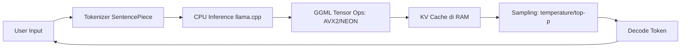
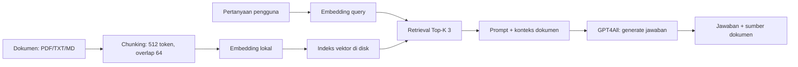

# Bab 3.3: GPT4All

> Di dunia yang berlomba mengejar GPU terbaru, ada jutaan laptop yang ditinggalkan: prosesor lawas tahun 2015-2020, RAM 4-8 GB, tanpa kartu grafis. GPT4All lahir justru untuk perangkat yang "terlupakan" itu — membuktikan bahwa asisten AI lokal tidak memerlukan *hardware* mewah, cukup sabar dan cerdas dalam memilih model. Jika dua sub-bab sebelumnya berbicara tentang mesin berkecepatan tinggi, sub-bab ini adalah tentang menghidupkan kembali mesin tua: bagaimana menjalankan LLM murni di CPU, dengan instalasi ringan, tanpa koneksi internet, tanpa GPU.

---

## 1. Tujuan Sub-Bab

Setelah membaca sub-bab ini, Anda akan mampu:

- Menginstal dan menjalankan GPT4All di perangkat dengan spesifikasi minimal — laptop tanpa GPU *dedicated*, RAM 4-8 GB
- Memahami mekanisme *CPU-only inference* berbasis llama.cpp, termasuk peran instruksi **AVX2**, **ARM NEON**, dan *threading* **OpenMP**
- Memilih model yang tepat untuk CPU dengan RAM terbatas, berdasarkan ukuran model, tingkat kuantisasi, dan kebutuhan konteks
- Menggunakan **LocalDocs** untuk *retrieval-augmented generation* (RAG) lokal — menjadikan dokumen pribadi sebagai sumber jawaban
- Mengidentifikasi *trade-off* perangkat keras lama (tanpa AVX2, RAM kecil, HDD lambat) dan kapan harus beralih ke alternatif lain

---

## 2. Filosofi GPT4All: AI untuk Semua

Setiap *software* punya asal-usul yang menjelaskan karakternya. GPT4All dikembangkan oleh **Nomic AI** dengan satu tujuan yang jelas: **aksesibilitas**. Namanya sendiri — "GPT untuk semua orang" — adalah manifestonya. Di tengah ekosistem yang berlomba membuat model makin besar dan butuh GPU makin mahal, Nomic memilih arah sebaliknya: membuat LLM berjalan di perangkat yang sudah dimiliki kebanyakan orang.

Filosofi ini diterjemahkan ke dalam tiga keputusan desain yang konsisten. Pertama, **CPU-first** — GPT4All dirancang untuk berjalan *tanpa GPU*, dan bahkan *tanpa koneksi internet* setelah model terpasang; privasi dan kemandirian adalah fitur, bukan sekadar janji. Kedua, **instalasi minimal** — ukuran aplikasi hanya sekitar **100MB**, jauh lebih ramping dari *runtime* yang membawa serta CUDA/PyTorch; satu laptop tua yang bahkan kesulitan membuka browser modern tetap sanggup menjalankan GPT4All. Ketiga, **satu klik** — pengguna biasa tidak pernah berhadapan dengan terminal; model diunduh dari katalog bawaan dan langsung dipakai. Inilah *software* yang dirancang untuk kakek-nenek yang baru kenal AI, sekaligus untuk kantor pemerintah yang komputer-komputernya masih Windows 7.

Penting juga untuk menempatkan GPT4All di peta bab ini. Ollama (sub-bab 3.1) adalah mesin untuk pengelola; LM Studio (sub-bab 3.2) adalah laboratorium untuk eksperimentator; GPT4All adalah pintu masuk untuk semua orang — termasuk mereka yang tidak pernah mendengar istilah *parameter*, *kuantisasi*, atau *GGUF*. Ketiga aplikasi ini bahkan bisa dipakai pada perangkat yang sama: GPT4All untuk anggota keluarga yang hanya butuh bertanya, LM Studio untuk anak rumah yang bereksperimen, dan Ollama sebagai *server* rumah tangga untuk aplikasi otomatis. Singkatnya, ekosistem *software gateway* ini tidak saling menggantikan — mereka melayani tingkat keahlian yang berbeda.

Satu catatan penting tentang **audiens GPT4All**: target pembaca sub-bab ini adalah pemilik perangkat 2015-2020 tanpa GPU *dedicated* — kategori yang secara mengejutkan masih sangat besar, baik di Indonesia maupun global. Alasan *hardware* semacam ini pantas diberi bab tersendiri bukan sentimentalitas, melainkan ekonomi: mengganti laptop kerja yang masih berfungsi demi menjalankan AI adalah biaya yang tidak semua orang (atau semua kantor) sanggup tanggung. GPT4All mengubah pertanyaannya dari "harus beli apa?" menjadi "sudah punya apa?" — dan untuk pertanyaan itu, jawaban "laptop lama yang masih nyala" hampir selalu sudah cukup untuk memulai.

---

## 3. Arsitektur CPU-Only: Kekuatan dari Kesederhanaan

Bagaimana mungkin *inference* model 7 miliar parameter berjalan di CPU yang bahkan tidak bisa menjalankan game modern? Jawabannya terletak pada dua pilar: **llama.cpp** sebagai *backend* dan **kuantisasi GGUF** sebagai bahasa penyimpanan. Keduanya bukan teknologi baru yang mewah — keduanya adalah hasil bertahun-tahun optimasi untuk menjawab satu pertanyaan: bagaimana membuat matematika *neural network* selingkas mungkin di perangkat yang tidak memiliki akselerator khusus.

### Tanpa CUDA, Tanpa PyTorch

GPT4All memakai **llama.cpp** — implementasi C++ murni yang dirancang dari awal untuk efisiensi maksimal di perangkat terbatas. Karena murni C++, ia tidak bergantung pada *runtime* besar seperti CUDA atau PyTorch; *dependency*-nya sangat minimal, dan semuanya berjalan langsung di CPU. Model disimpan sebagai **GGUF** dengan kuantisasi 4-bit (Q4) — bobot presisi 16-bit ditekan menjadi 4-bit per nilai, sehingga model 7B yang semula ~14GB menyusut menjadi sekitar 4GB, cukup muat di RAM sistem 8GB.

*Trade-off* kuantisasi perlu dipahami secara jujur: menekan bobot dari 16-bit ke 4-bit berarti menekan kualitas, tetapi untuk *hardware* lama, model Q4 yang berjalan adalah jauh lebih berguna daripada model FP16 yang tidak pernah bisa berjalan. Perlu juga dicatat bahwa kuantisasi tidak mengurangi kebutuhan *computation* — model Q4 menjalankan jumlah matematika yang sama dengan model FP16 — melainkan mengurangi *ukuran data* yang harus dibaca dari memori. Karena *inference* CPU sangat *memory-bound* (prosesor menganggur menunggu data dari RAM), penyusutan ukuran inilah yang menghasilkan akselerasi nyata, bukan hanya sekadar "memuat lebih cepat".

### Instruksi Khusus CPU

Performa *inference* di CPU ditentukan oleh set instruksi yang tersedia. **AVX2** — *Advanced Vector Extensions 2*, tersedia di prosesor Intel/AMD sejak sekitar 2013 — memungkinkan satu perintah memproses banyak data sekaligus (*SIMD*), dan operasi matriks inti LLM sangat diuntungkan olehnya. **ARM NEON** adalah padanannya untuk prosesor ARM, dan **OpenMP** menangani *threading* — membagi perhitungan ke semua inti CPU. Kombinasi ketiganya menentukan mengapa *inference* di laptop lawas bisa 3-8 kali lebih lambat daripada di laptop modern: bukan hanya soal *clock speed*, tetapi apakah CPU mendukung instruksi *vectorized* yang benar.

Cara paling mudah memahami pengaruh AVX2 adalah bertanya "berapa banyak matematika yang bisa dilakukan dalam satu langkah?". Tanpa SIMD, penjumlahan 8 angka berarti 8 perintah; dengan AVX2, satu perintah. Operasi matriks pada LLM adalah ribuan juta penjumlahan semacam itu — kecilnya faktor "angka per perintah" ini, dikalikan berjuta kali, menjadi perbedaan kecepatan yang Anda rasakan di layar. Karena alasan inilah GPT4All mendeteksi kemampuan CPU saat pertama dijalankan dan memilih kuantisasi Q4_0 ketika AVX2 tidak ditemukan; memberi tanda "model ini bisa jalan" yang akurat, alih-alih membiarkan pengguna menebak dari spesifikasi prosesor yang tidak mereka pahami.

Masih dalam arsitektur CPU-only, ada satu detail *threading* yang layak dipahami: **OpenMP membagi perhitungan token yang sama ke beberapa inti**, tetapi pembagian ini tidak gratis — setiap pemecahan punya biaya sinkronisasi. Pada CPU dengan sedikit inti (2-4), mengaktifkan semua inti biasanya menang; pada CPU dengan banyak inti tapi *memory bandwidth* sempit, ada titik di mana menambah *thread* justru memperlambat karena semua inti berebut membaca RAM yang sama. Inilah alasan pengaturan *Number of CPU Threads* di GPT4All lebih dari sekadar mainan teknis: aturan `(n_cores - 1)` yang disarankan di Langkah 3 adalah titik awal yang aman, tetapi pengguna yang rajin bisa mencoba 1 inti lebih atau kurang dan mengukur *(benchmark)* sendiri mana yang paling cepat untuk CPU spesifiknya.

Sebagai penutup seksi ini, satu rangkuman yang perlu dibawa ke sesi praktikum: GPT4All adalah **sistem CPU-only yang berlapis tiga** — format GGUF memungkinkan model muat, instruksi SIMD (AVX2/NEON) mempercepat hitungan, dan *threading* OpenMP memanfaatkan semua inti. Ketiganya bekerja di atas satu sumber daya bersama: RAM. Setiap keputusan di Langkah 1-3 praktikum nanti — pilihan model, kuantisasi, jumlah *thread* — pada akhirnya adalah keputusan tentang bagaimana memakai RAM yang terbatas itu sebaik mungkin.

---

## 4. Koleksi Model Teroptimasi: Pilih yang Muat, Bukan yang Terbesar

Salah satu jebakan terbesar pengguna *hardware* tua adalah memaksakan model besar. GPT4All menjawabnya dengan **leaderboard internal** — katalog model yang diuji khusus pada performa CPU, bukan GPU. Setiap model diberi peringkat berdasarkan kecepatan dan kualitas di perangkat kelas menengah, sehingga pengguna tidak perlu menebak.

Fokus pada "performa CPU" ini adalah perbedaan mendasar dari katalog di LM Studio yang berbasis Hugging Face: model yang peringkatnya tinggi di GPU bisa jadi berjalan buruk di CPU, dan sebaliknya. Dengan menguji pada CPU, GPT4All memberi sinyal yang tepat bagi target pasarnya sendiri — sebuah praktik yang sebaiknya diikuti semua platform: *benchmark* yang relevan adalah *benchmark* yang diukur pada perangkat yang mirip dengan perangkat Anda.

Leaderboard ini bekerja seperti menu restoran yang sudah diberi bintang oleh juri: Anda tidak perlu mencicipi semua masakan untuk tahu mana yang layak. Setiap entri menampilkan ukuran file, kuantisasi, dan estimasi kebutuhan RAM — tiga angka yang menentukan kelayakan sebelum unduhan dimulai. Bagi pengguna dengan RAM 4-8GB, disiplin membaca tiga angka ini sebelum mengunduh mencegah pengalaman paling menyakitkan di dunia LLM lokal: menunggu unduhan berjam-jam, lalu menyadari model tidak bisa dimuat.

Rentang ukuran model yang direkomendasikan adalah **500MB hingga 4GB** (semua dalam kuantisasi Q4). Pilihan utama meliputi **Mistral 7B Q4** (standar lama yang masih tangguh), **Phi-3-mini Q4** (3.8B, efisien dan cerdas), **Gemma 2 Q4**, dan — yang paling menarik untuk 2026 — **Ministral 3** (varian 3B/8B). Ministral 3, dirilis Desember 2025, adalah keluarga model *dense* 3B/8B/14B dengan lisensi **Apache 2.0** yang dibangun lewat *Cascade Distillation* — teknik menggabungkan *pruning* dan distilasi sehingga *footprint*-nya kecil tetapi kemampuannya tinggi. Bagi perangkat CPU-only, model 1-3B inilah "kuda beban" yang sebenarnya: cukup ringan untuk RAM 4GB, cukup cepat untuk dipakai menulis, dan cukup pintar untuk tugas harian.

Fenomena yang patut dicatat: kualitas "cukup pintar" ini naik setiap generasi model kecil. TinyLlama 1.1B yang dua tahun lalu dianggap model pemula kini tergantikan oleh keluarga Ministral 3 dan Phi yang jauh lebih mumpuni pada ukuran yang sama. Artinya, rekomendasi model di sub-bab ini bukan harga mati — lakukan pemeriksaan *leaderboard* GPT4All secara berkala setiap beberapa bulan. Perangkat lama Anda tidak berubah, tetapi katalog model yang muat di dalamnya terus membaik: ini keuntungan unik menjadi pengguna *hardware* lawas di tahun 2026 — dulu tertinggal, kini dijemput kemajuan.

Aturan praktisnya sederhana: **mulai dari yang paling kecil yang bisa menyelesaikan tugas Anda**. Model 7B terlihat lebih mengesankan di atas kertas, tetapi 3B yang berjalan 3 kali lebih cepat akan lebih produktif di perangkat yang sama.

Cara terbaik memutuskan adalah melakukan **uji tiga tingkat**: mulai dengan model 1-3B untuk merasakan kecepatan penuh perangkat, naik ke 3-4B untuk melihat batas kualitas, lalu (jika RAM memungkinkan) coba 7B sebagai pembanding. Tiga sesi singkat ini memberi Anda kurva kualitas-vs-kecepatan milik perangkat sendiri — dan biasanya berakhir dengan keputusan yang tidak terduga: banyak pengguna menemukan bahwa 1.1B yang lincah lebih "dipakai sehari-hari" daripada 7B yang kaku, karena terasa instan dan tidak menguji kesabaran. Memahami preferensi ini adalah bagian dari menemukan *ritme kerja* Anda sendiri, bukan sekadar memilih spesifikasi tertinggi.

Satu pola yang bisa diprediksi dari pengalaman banyak pengguna GPT4All: **model yang dipakai akhirnya bermigrasi ke ukuran yang lebih kecil seiring waktu**. Minggu pertama biasanya dipenuhi kekaguman terhadap model 7B; minggu kedua mulai terasa lama menunggu; minggu ketiga pengguna menemukan model 3B yang menjawab "cukup baik" dalam sepertiga waktu — dan di situlah model harian ditetapkan. Bukan berarti 7B ditinggalkan: ia tetap berguna untuk tugas yang benar-benar membutuhkan kualitas, misalnya merangkum dokumen penting sekali sehari. Memiliki "model harian" dan "model istimewa" adalah pola manajemen yang sehat di perangkat terbatas.

---

## 5. Fitur Desktop App: Chat, LocalDocs, dan Kemerdekaan dari Cloud

Tampilan GPT4All adalah aplikasi desktop sederhana *cross-platform* (Windows, macOS, Linux) dengan *chat interface* yang akrab, *dark mode*, dan kemampuan ekspor percakapan. Namun fitur yang membuatnya istimewa adalah **LocalDocs** — sistem **RAG lokal** bawaan yang tidak menuntut satu baris kode pun.

Bagi pengguna perangkat tua, tiga properti antarmuka ini lebih penting daripada yang terlihat: *dark mode* mengurangi beban panel pada layar lama yang cahayanya sudah redup; *ekspor percakapan* memungkinkan hasil diskusi dengan AI disimpan sebagai dokumen kerja; dan *kesederhanaan wajah aplikasi* berarti tidak ada fitur yang menghalangi — sesuatu yang sayangnya tidak bisa dikatakan untuk banyak aplikasi modern yang penuh tombol dan menu. GPT4All sengaja menjaga fokus: satu jendela, satu percakapan, satu folder dokumen — filosofi yang sama dengan desain *tool* produktivitas terbaik.

Mengapa "*kemerdekaan dari cloud*" dipilih sebagai bagian judul seksi ini? Karena bagi banyak pengguna *hardware* lawas, internet bukan hal yang bisa diandalkan — kantor di daerah terpencil, ruangan tanpa sinyal, atau kuota yang terbatas. GPT4All bekerja penuh dalam keadaan *offline*: model, *embedding*, hingga *LocalDocs* semuanya lokal. Internet hanya diperlukan saat mengunduh aplikasi dan model pertama kali; setelah itu, aplikasi berfungsi seperti mesin yang terisolasi dengan aman. Bagi pengguna yang menangani dokumen sensitif — surat dinas, data internal — kemerdekaan ini bukan sekadar kenyamanan, melainkan keharusan: tidak ada data yang berangkat ke mana pun, karena memang tidak ada jalannya.

Dengan LocalDocs, Anda memilih satu atau beberapa folder berisi dokumen (PDF, TXT, Markdown), dan aplikasi mengindeks isinya menjadi *chunk* teks. Saat Anda bertanya, GPT4All mencari bagian dokumen yang relevan (melalui *embedding* lokal), menempelkannya ke *prompt* sebagai konteks, lalu menjawab berdasarkan dokumen Anda. Tidak ada data yang keluar dari perangkat — *retrieval* dan generasi semuanya lokal. Inilah penggunaan nyata yang diimpikan pengguna *hardware* tua: laptop kantor lawas berubah menjadi "sistem manajemen pengetahuan" yang menjawab pertanyaan dari arsip surat, prosedur operasional, atau kumpulan resep keluarga, tanpa internet dan tanpa risiko bocor.

Perlu digarisbawahi bahwa *embedding* yang dipakai LocalDocs juga dijalankan lokal — kecil, ringan, dan bisa berjalan di CPU yang sama. Pada perangkat dengan RAM terbatas, proses *indexing* sebaiknya dilakukan saat laptop tidak sedang dipakai pekerjaan lain, karena ia bersaing dengan model utama untuk mendapatkan memori dan waktu CPU. Setelah indeks terbentuk, pencarian menjadi cepat; *chunk* yang relevan disimpan di indeks vektor, sehingga *full scan* dokumen tidak dilakukan setiap kali bertanya.

Ada juga batas wajar yang perlu dipahami: LocalDocs bukan *search engine* untuk korpus raksasa. Pada folder dengan ratusan dokumen, kualitas jawaban bergantung pada presisi *embedding* — dan *embedding* ringan yang dipakai di perangkat CPU-only bekerja paling baik pada dokumen yang topiknya jelas dan bahasa yang konsisten. Untuk arsip berpuluh ribu halaman, lebih bijak memecah korpus menjadi beberapa koleksi tematik (lihat rekomendasi di Langkah 2). Dengan kata lain: *LocalDocs* adalah *manajer pengetahuan pribadi* yang hebat, bukan perpustakaan nasional — dan mengetahui batas itu adalah bagian dari menggunakannya dengan baik.

---

## 6. Trade-off Hardware Lama: Mengetahui Batas, Menghindari Frustrasi

Menjalankan LLM di perangkat tua adalah seni mengelola keterbatasan. Berikut peta batas yang perlu Anda pahami sebelum memilih model:

- **CPU tanpa AVX2** — prosesor dari era sebelum ~2013 (misalnya Core 2 Duo). GPT4All otomatis *fallback* ke **Q4_0** — kuantisasi dasar yang tidak memanfaatkan instruksi vektor lanjutan — dan bukan Q4_K_M yang lebih cerdas. Model yang sama bisa berjalan 3-4 kali lebih lambat.
- **RAM 4GB** — hanya model **1-3B** dengan *context* pendek yang realistis. Sistem operasi sendiri sudah memakan 2-3GB; model 7B akan membuat sistem *thrashing* ke *swap*.
- **RAM 8GB** — model **7B Q4** bisa berjalan, tetapi *context* praktisnya sekitar **2048 token**; sisanya untuk KV cache yang membengkak seiring panjang percakapan.
- **SSD vs HDD** — *loading time* model bergantung pada kecepatan baca disk. Model 4GB yang dimuat dari HDD bisa terasa seperti menunggu kopi; SSD mempercepatnya beberapa kali lipat.

Peta ini bisa diringkas menjadi satu kalimat yang layak ditempel di monitor: **RAM dan AVX2 menentukan model yang bisa dipilih; disk menentukan seberapa cepat model itu siap dipakai; konteks menyisakan ruang untuk percakapan.** Ketiga variabel ini berinteraksi: SSD mempercepat *load* tetapi tidak mempercepat generasi token; RAM menentukan ukuran model tetapi *context* yang panjang bisa menggerus keuntungan itu. Setiap upgrade perangkat (SSD murah, RAM tambah) menggeser peta ini — dan saat itulah waktu yang tepat untuk *re-benchmark* pilihan model Anda.

Praktik yang kami rekomendasikan untuk semua pengguna *hardware* lawas: **catat satu set angka rujukan** — kecepatan t/s model favorit di perangkat Anda, waktu *load*, dan sisa RAM saat model berjalan — lalu ulangi pengukuran setiap kali mengganti model atau mengubah pengaturan. Angka rujukan ini menjadi radar pribadi: ketika sistem terasa lambat, Anda bisa langsung membandingkan dengan baseline, bukan menebak. Menjalankan LLM di perangkat tua bukanlah perlombaan melawan waktu; ia adalah pengelolaan sumber daya yang sabar — dan setiap pengelolaan yang baik dimulai dari catatan yang jujur.

Memahami peta ini mengubah ekspektasi: di RAM 8GB, jangan berharap *chat* panjang dengan konteks 32K — itu bukan kegagalan *software*, melainkan fisika memori. Yang bijak adalah menyesuaikan gaya penggunaan dengan batas perangkat: *prompt* pendek, model kecil, dan sesi yang disegarkan.

Ada satu pengorbanan lagi yang sering luput dari perhatian: **suhu dan baterai**. *Inference* CPU memaksa prosesor bekerja pada beban penuh selama puluhan detik hingga menit — di laptop lawas, ini berarti kipas menyala terus dan baterai terkuras lebih cepat daripada penggunaan biasa. Untuk sesi kerja panjang, colokkan laptop; untuk laptop yang sudah bermasalah dengan panas (umum pada perangkat 2015-2020), batasi sesi *chat* menjadi 20-30 menit, lalu biarkan dingin. Bagi pengguna yang perangkatnya untuk kerja 8 jam, kebiasaan "sesi pendek dan istirahat" ini bukan sekadar saran kenyamanan, melainkan perlindungan perangkat keras.

---

## 7. Keterbatasan dan Alternatif: Jujur pada Diri Sendiri

Tidak ada solusi tanpa kompromi, dan GPT4All jujur mengenai keterbatasannya. Pertama, **tidak ada GPU offload** — semua komputasi di CPU, sehingga GPU yang Anda miliki (jika ada) menganggur. Kedua, **kecepatan terbatas**: pada CPU modern *inference* berada di kisaran **5-15 token/detik**, sementara pada CPU lawas turun menjadi **1-3 token/detik** — untuk model 7B, jawaban 200 kata bisa menunggu beberapa menit. Ketiga, pengendaliannya lebih terbatas dibandingkan *tool* tingkat lanjut.

Ketiga keterbatasan ini sebenarnya satu cerita yang sama: GPT4All memilih *kesederhanaan* sebagai desain, dan kesederhanaan selalu datang dengan harga. Harga yang dibayar ada pada *throughput* (lambat), *fleksibilitas* (sedikit opsi), dan *skalabilitas* (satu pengguna, satu perangkat). Namun harga itu membuat aplikasi bisa diinstal oleh siapa pun dalam satu klik — dan bagi sebagian besar calon pengguna di segmen ini, menukar fleksibilitas demi satu klik adalah kesepakatan yang sangat menguntungkan. Justru pengguna yang butuh *fleksibilitas* itulah yang harus jujur menilai diri dan berpindah ke alat lain.

Jika batas-batas ini terasa menghambat, ada jalan keluar: **Ollama** atau llama.cpp langsung memberi kendali lebih besar — pengaturan *thread*, pemilihan kuantisasi, hingga *GPU offload* jika suatu saat perangkat di-upgrade. Namun untuk pengguna yang perangkatnya memang lawas dan tujuannya sederhana — asisten menulis, RAG dokumen pribadi, belajar AI tanpa biaya — GPT4All tetap pilihan paling masuk akal: instalasi satu klik, tanpa konfigurasi, dan langsung jalan. Seperti kata pepatah, alat yang tepat adalah alat yang dipakai; bagi jutaan laptop tua di Indonesia, GPT4All adalah alat yang tepat itu.

Ada satu skenario lagi yang menarik untuk dicatat: ketika pengguna dengan laptop lawas **meng-upgrade** perangkatnya, GPT4All tidak harus ditinggalkan. Model yang sama — file GGUF yang sama — bisa langsung dijalankan di Ollama atau LM Studio tanpa konversi apa pun. Inilah keuntungan format GGUF yang menjadi bahasa bersama (lihat sub-bab 3.1): investasi Anda dalam memilih dan mengunduh model tidak pernah hangus. Perjalanan pengguna sering kali linear: mulai dengan GPT4All di perangkat tua, lalu "lulus" ke tool yang lebih canggih ketika perangkatnya ikut naik kelas — tanpa kehilangan satu file pun.

Untuk menutup seksi ini, mari jawab pertanyaan yang mungkin sudah muncul di kepala pembaca: **"kalau begitu, kapan GPT4All bukan pilihan?"** Jawabannya: ketika pekerjaan Anda membutuhkan *throughput* tinggi (menulis ratusan halaman otomatis), konteks sangat panjang (menganalisis dokumen 50 halaman dalam satu sesi), atau integrasi *server* (banyak pengguna bersamaan). Untuk tiga kebutuhan itu, komputasi CPU-only dan RAM 4-8GB memang bukan medan yang tepat — dan tidak ada salahnya mengakuinya. Memilih *tool* bukan tentang menemukan yang "paling hebat", melainkan yang paling cocok dengan perangkat, keterampilan, dan tugas Anda; bagi banyak orang, GPT4All adalah jawaban yang tepat untuk dua dari tiga syarat itu.

---

## 8. Tabel Wajib

Tiga tabel berikut adalah peta jalan praktis untuk pengguna *hardware* lawas: Tabel 1 memetakan model ke kebutuhan perangkat, Tabel 2 membandingkan GPT4All dengan tiga alternatif, dan Tabel 3 menunjukkan angka nyata di salah satu laptop lawas paling umum di pasaran. Bacalah berurutan: pilih kelas model dari Tabel 1, konfirmasi keunggulan alat dari Tabel 2, dan temper ekspektasi dengan data nyata dari Tabel 3.

### Tabel 1: Spesifikasi Hardware Minimal per Model

Tabel berikut memetakan ukuran model terhadap kebutuhan CPU dan RAM, beserta estimasi kecepatan di perangkat kelas menengah.

| Ukuran Model | CPU (AVX2) | RAM Minimal | RAM Direkomendasikan | Kecepatan (t/s) |
|:---|:---|:---:|:---:|:---:|
| 1-3B (Phi-3-mini, TinyLlama, Ministral 3B) | Ya | 4 GB | 8 GB | 10-25 t/s |
| 7B (Mistral, Llama 3.2, Ministral 8B) | Ya | 8 GB | 16 GB | 3-12 t/s |
| 7B (tanpa AVX2) | Tidak | 8 GB | 16 GB | 1-4 t/s |
| 13B | Ya | 16 GB | 32 GB | 1-5 t/s |

Insight dari tabel ini: kolom CPU (AVX2) dan kecepatan adalah pasangan yang tidak bisa dipisahkan. Model 7B yang sama berjalan 3-12 t/s dengan AVX2 tetapi merosot ke 1-4 t/s tanpanya — penurunan hingga 3 kali lipat yang langsung terasa di percakapan. Perhatikan juga lonjakan kebutuhan RAM dari 8GB (7B) ke 16GB (13B): *doubling* parameter berarti *doubling* memori minimum. Aturan emasnya: pilih ukuran model satu tingkat di bawah kemampuan RAM Anda, agar tersisa ruang untuk sistem operasi dan KV cache.

Cara terbaik menggunakan tabel ini adalah dengan **menandai kolom yang relevan dengan perangkat Anda** sebelum mengunduh apa pun. Pemilik laptop 4GB cukup membaca baris pertama dan mengabaikan sisanya; pemilik 16GB boleh melirik baris 13B, tetapi harus siap dengan kecepatan 1-5 t/s yang menguji kesabaran. Bagi pengguna yang perangkatnya belum jelas dukungan AVX2-nya, cek dulu dengan `lscpu | grep avx2` (Langkah 3) sebelum memilih baris — karena memilih baris yang salah berarti membuang waktu unduhan dan memori. Tabel ini dirancang untuk dipakai, bukan untuk dihafal.

### Tabel 2: Perbandingan GPT4All vs Alternatif CPU-Only

| Fitur | GPT4All | Ollama (CPU) | llama.cpp | LM Studio |
|:---|:---|:---|:---|:---|
| **GUI Desktop** | Native | CLI | CLI | Native |
| **Instalasi** | Satu klik | Manual | Build from source | Satu klik |
| **Ukuran Installer** | ~80 MB | ~400 MB | ~50 MB (build) | ~200 MB |
| **LocalDocs / RAG** | Built-in | Eksternal | Manual | Eksternal |
| **Model Discovery** | Built-in leaderboard | `ollama pull` | Manual download | HF browser |
| **CPU AVX2 fallback** | Otomatis | Otomatis | Manual flag | Otomatis |
| **GPU Support** | Tidak | Ya (opsional) | Ya (opsional) | Ya |

Dari tabel ini, GPT4All menang telak pada tiga hal yang paling penting bagi pengguna perangkat tua: GUI native, instalasi satu klik, dan **LocalDocs built-in**. Namun keunggulannya berhenti di situ: tanpa dukungan GPU sama sekali, ia bukan pilihan untuk pemilik kartu grafis yang ingin *inference* cepat. llama.cpp adalah level paling rendah (paling terkontrol) tetapi juga paling menyakitkan untuk non-teknis. Strategi terbaik: GPT4All untuk perangkat lawas murni CPU, Ollama untuk perangkat dengan GPU atau kebutuhan *server*, dan LM Studio untuk eksperimen desktop yang kaya fitur.

Perhatikan juga kolom **Model Discovery**: satu-satunya aplikasi yang punya katalog internal adalah GPT4All dan LM Studio — dan keduanya mengambil pendekatan berbeda. Katalog LM Studio terhubung ke Hugging Face (ribuan model, butuh filter yang dipahami), sedangkan *leaderboard* GPT4All dikurasi untuk CPU (kecil, sudah tersaring). Bagi pengguna yang tidak ingin berpikir, kurasi adalah anugerah: mereka tidak perlu tahu kenapa Q4_K_M lebih baik dari Q4_0 — mereka hanya perlu memilih model yang sudah diberi peringkat untuk perangkat semacam miliknya. Ini bukan pembodohan; ini *good design* yang menempatkan keputusan sulit di tempat yang tepat.

### Tabel 3: Benchmark di Hardware Lawas (Intel i5-7200U, 8GB RAM)

Pengukuran berikut dilakukan pada laptop generasi 2017 — Intel i5-7200U dengan 8GB RAM — sebagai gambaran nyata performa CPU-only.

| Model | Q Level | Load Time | Speed (t/s) | VRAM | RAM Usage |
|:---|:---:|:---:|:---:|:---:|:---:|
| Phi-3-mini-3.8B | Q4_0 | 3.2s | 8.5 t/s | 0 GB | 3.1 GB |
| Mistral-7B | Q4_0 | 8.1s | 3.2 t/s | 0 GB | 5.8 GB |
| TinyLlama-1.1B | Q4_0 | 1.5s | 22 t/s | 0 GB | 1.2 GB |

Tabel ini merangkum semua *trade-off* yang dibahas di seksi 6 ke dalam satu set angka. Phi-3-mini 3.8B adalah titik keseimbangan emas: *load* 3,2 detik, kecepatan 8,5 t/s, dan RAM hanya 3,1GB — meninggalkan ruang cukup untuk sistem. Mistral-7B menunjukkan mengapa model besar terasa menyakitkan di perangkat ini: *load* 8 detik, kecepatan merosot ke 3,2 t/s, dan RAM 5,8GB membuat sistem nyaris kehabisan napas. Sementara TinyLlama 1.1B, dengan 22 t/s, terasa lincah tetapi kualitasnya terbatas. Keputusan akhir selalu berupa segitiga: kualitas, kecepatan, dan memori — dan di perangkat lawas, Anda hanya bisa memilih dua.

Perhatikan juga kolom "VRAM 0 GB" pada ketiga baris: ini bukan kebetulan, melainkan esensi GPT4All — komputasi tidak menyentuh kartu grafis sama sekali. Implikasinya sederhana namun penting: RAM sistem adalah satu-satunya *bottleneck* memori. Pada perangkat dengan 8GB, model 7B yang memakai 5,8GB menyisakan 2,2GB untuk sistem operasi — nyaris tidak cukup, sehingga muncul *swapping* dan sistem terasa membeku. Data Tabel 3 adalah alasan terkuat untuk tidak memaksakan model 7B di laptop 8GB yang sekaligus dipakai bekerja; angka di tabel ini, bukan spekulasi, yang sebaiknya menjadi dasar keputusan.

---

## 9. Diagram & Visualisasi

Dua diagram di bawah merangkum sisi *alur komputasi* dan sisi *alur dokumen* GPT4All. Gambar 1 menunjukkan siklus *inference* CPU-only yang menjadi inti aplikasi; Gambar 2 menunjukkan bagaimana LocalDocs mengubah dokumen pribadi menjadi sumber jawaban — dua setengah mesin yang, digabungkan, membentuk seluruh pengalaman GPT4All. Kedua diagram menggunakan notasi yang sama (kotak = proses, panah = aliran data), sehingga keduanya bisa "disambung" secara mental: keluaran Gambar 2 (konteks dokumen) menjadi bagian dari input Gambar 1 (prompt).

### Gambar 1: Alur Kerja GPT4All CPU-Only

Berikut siklus lengkap *inference* di GPT4All, dari input pengguna hingga output token.



Perhatikan siklusnya: setelah input diubah menjadi token oleh **SentencePiece**, komputasi berputar di CPU — operasi tensor *GGML* memanfaatkan AVX2/NEON, *KV cache* menyimpan riwayat di RAM, *sampling* memilih token berikutnya, lalu token itu di-*decode* dan ditambahkan ke input, memulai iterasi berikutnya. Sirkuit inilah yang menjelaskan dua karakteristik GPT4All: ia *memory-bound* (RAM menentukan batas konteks) dan *sequential* (token harus keluar satu per satu), sehingga kecepatan token/detik adalah metrik yang paling jujur untuk mengukur pengalaman pengguna.

Ada satu implikasi *by design* dari sirkuit ini yang jarang disadari: karena *KV cache* hidup di RAM dan terus membengkak sepanjang percakapan, **panjang percakapan memengaruhi kecepatan**. Di awal sesi, model secepat angka Tabel 3; setelah 20-30 pesan, cache membesar, RAM semakin penuh, dan kecepatan bisa turun setengah. Ini bukan *bug* — ini konsekuensi langsung arsitektur yang digambarkan diagram. Bagi pengguna produktif, dampaknya nyata: mulailah sesi baru untuk tugas baru, dan jangan biarkan satu percakapan menggendong seluruh pekerjaan hari itu — kebiasaan "satu tugas, satu sesi" adalah optimasi paling sederhana yang bisa dilakukan di atas GPT4All.

Perhatikan juga bahwa sirkuit ini **tidak memiliki cabang GPU** — karena memang tidak ada. Bandingkan dengan diagram arsitektur Ollama di sub-bab 3.1 yang penuh GPU dan *scheduler*; inilah dua ujung spektrum desain: optimasi untuk kecepatan di perangkat kaya versus optimasi untuk kemungkinan di perangkat miskin. GPT4All sengaja membuang kompleksitas *offload* agar aplikasi tetap ringan dan dapat diprediksi — keputusan desain yang keliru bagi *workstation*, tetapi tepat bagi target pasarnya. Setiap diagram arsitektur dalam buku ini layak dibaca dua kali: sekali untuk melihat apa yang ada, sekali lagi untuk melihat apa yang sengaja tidak ada — dan bertanya mengapa.

### Gambar 2: Alur LocalDocs (RAG Lokal)

Untuk memahami bagaimana GPT4All menjawab dari dokumen pribadi, ikuti alur *LocalDocs* berikut.



Dua jalur bertemu di tengah: jalur dokumen (atas) mengindeks berkas Anda menjadi *chunk* 512 token dengan *overlap* 64, lalu mengubahnya menjadi *embedding* yang disimpan sebagai indeks vektor; jalur pertanyaan (bawah) mengubah pertanyaan menjadi *embedding* dan mencari 3 dokumen teratas. Hasil *retrieval* digabung ke dalam *prompt* sehingga model menjawab "berdasarkan dokumen saya" — bukan dari ingatan umumnya. Seluruh proses, termasuk *embedding*, berjalan lokal: dokumen sensitif tidak pernah meninggalkan perangkat. Inilah esensi RAG yang demokratis: tanpa server, tanpa cloud, tanpa biaya.

Pentahapan *chunking → embedding → retrieval → generate* pada diagram ini juga menjelaskan mengapa *LocalDocs* baiknya dipasangkan dengan model yang lebih kecil. Menempel konteks dokumen ke *prompt* berarti token yang harus diproses bertambah — pada model 1.1B di perangkat 4GB, satu *chunk* 512 token saja sudah memakan porsi signifikan dari *context window* yang tersedia. Praktik yang disarankan: simpan dokumen referensi dalam *chunk* pendek, gunakan *Top K* kecil (2-3), dan pilih model dengan *context* minimal 2048 token. Dengan kata lain, RAG di perangkat lawas adalah seni *hemat konteks* — setiap token yang tidak perlu, dibayar dalam detik tunggu.

Jika digabungkan dengan sirkuit pada Gambar 1, terlihat bahwa *LocalDocs* tidak mengubah siklus *inference* sama sekali — ia hanya mengubah **isi prompt** yang masuk ke siklus itu. Model masih menghasilkan token satu per satu di CPU; bedanya, token yang diproses kini mencakup konteks dokumen yang relevan. Inilah kekuatan desain berlapis: fitur *retrieval* dipisahkan dari mesin *inference*, sehingga satu mesin yang sama bisa dilayani oleh banyak fitur tanpa mengubah intinya. Perpaduan dua diagram ini — inti yang stabil dan fitur yang tumbuh di sekelilingnya — adalah pola arsitektur yang baik untuk dipelajari, bukan hanya dipakai.

---

## 10. Praktikum / Hands-On

Tiga tutorial berikut bergerak dari yang paling dasar hingga paling teknis: instalasi model pertama (Langkah 1), RAG dokumen pribadi dengan LocalDocs (Langkah 2), dan optimasi untuk CPU tanpa AVX2 (Langkah 3). Kerjakan berurutan; Langkah 3 hanya wajib bagi pemilik prosesor pra-2013, tetapi tetap berguna sebagai pengetahuan diagnostik bagi semua. Bagi pengguna yang perangkatnya hanya 4GB RAM, mulailah dari model 1-3B di Langkah 1 — penyesuaian itu akan menghemat banyak waktu tunggu dibandingkan memaksa model 7B.

### Langkah 1: Install dan Jalankan Model Pertama

Mulailah dengan rute paling sederhana — instalasi grafis:

```bash
# 1. Download GPT4All dari https://gpt4all.io
# Installer: GPT4All_Installer_xxx.dmg (Mac) atau .exe (Windows)

# 2. Buka aplikasi, buka tab "Models"
# Klik "Explore Models" → pilih "Mistral 7B Q4"

# 3. Atau download manual via terminal:
mkdir -p ~/.nomic/GPT4All/models/
cd ~/.nomic/GPT4All/models/
wget https://gpt4all.io/models/gguf/mistral-7b-instruct-v0.2.Q4_0.gguf

# 4. Buka GPT4All → Settings → Models → Add Local Model
# Pilih file .gguf yang sudah didownload

# 5. Test inference
# Prompt: "Jelaskan cara kerja CPU dalam 3 kalimat"
```

Langkah 3 menunjukkan bahwa GPT4All tetap terbuka bagi pengguna terminal: model hanyalah file GGUF biasa yang bisa diunduh dengan `wget` dan didaftarkan lewat menu *Add Local Model*. Bagi pengguna yang hanya punya laptop 4GB RAM, pertimbangkan mengganti Mistral 7B dengan Phi-3-mini Q4 yang lebih ramah memori — lihat kembali Tabel 1 sebelum memutuskan.

Satu hal yang perlu diperhatikan pada rute *manual* (langkah 3-4): pastikan nama file GGUF yang diunduh cocok dengan kuantisasi yang dijanjikan. Nama seperti `mistral-7b-instruct-v0.2.Q4_0.gguf` mengikuti konvensi yang konsisten — `Q4_0` adalah tingkat kuantisasi. Jika Anda mengunduh varian Q8 (lebih besar, lebih akurat), ingat bahwa ia membutuhkan RAM lebih banyak; jangan ganti varian mendadak tanpa memeriksa Tabel 1. Disiplin kecil — membaca nama file sebelum mengunduh — adalah kebiasaan yang mencegah hampir semua masalah "model tidak bisa dimuat" di GPT4All.

### Langkah 2: Setup LocalDocs untuk RAG

Ubah GPT4All menjadi asisten yang menjawab dari dokumen Anda sendiri:

```bash
# 1. Buka GPT4All → tab "LocalDocs"
# 2. Klik "Add Folder" → pilih folder dokumen (PDF/txt/md)

# 3. Konfigurasi:
# - Chunk size: 512 tokens
# - Chunk overlap: 64 tokens
# - Top K: 3 dokumen

# 4. Mulai chat dengan mengaktifkan "LocalDocs" toggle
# Prompt: "Cari informasi tentang resep nasi goreng dari dokumen saya"

# 5. Untuk akses API:
# Settings → Enable Local API Server
curl http://localhost:4891/v1/chat/completions \
  -d '{
    "model": "mistral-7b-instruct-v0.2.q4_0",
    "messages": [{"role":"user","content":"Halo"}]
  }'
```

Tiga angka konfigurasi (512, 64, 3) adalah tombol keseimbangan RAG: *chunk size* 512 cukup panjang untuk ide utuh namun cukup pendek untuk *retrieval* presisi; *overlap* 64 menjaga kesinambungan antar-*chunk*; dan *Top K* 3 menjaga *prompt* tetap ramping untuk CPU. Langkah 5 menunjukkan bahwa GPT4All juga bisa menjadi *server* kecil dengan API kompatibel OpenAI di port 4891 — berguna untuk mengotomasi pertanyaan ke dokumen Anda dari script.

Dua praktik yang akan sangat membantu saat dokumen Anda banyak: pertama, **kelompokkan folder per topik** — misalnya folder "surat", "prosedur", dan "arsip-2023" — alih-alih satu folder raksasa, agar *retrieval* tidak mencampur konteks; kedua, **bersihkan dokumen duplikat**, karena *chunk* yang berulang menghabiskan slot *Top K* dan membuat jawaban berbelit. Keduanya adalah kebiasaan manajemen dokumen, bukan teknis — dan justru karena itu, mudah diterapkan oleh pengguna non-teknis sekalipun. Hasil RAG yang baik dimulai dari dokumen yang rapi, bukan dari model yang canggih.

### Langkah 3: Optimasi untuk CPU Tanpa AVX2

Jika perangkat Anda benar-benar lawas, ikuti resep optimasi berikut:

```bash
# GPT4All otomatis mendeteksi CPU capability
# Fallback ke Q4_0 jika AVX2 tidak tersedia

# Cek CPU:
lscpu | grep avx2
# Jika tidak ada output → CPU tanpa AVX2

# Model yang bisa dijalankan:
# - tinyllama-1.1b (Q4_0) — paling aman
# - phi-3-mini-3.8b (Q4_0)
# - jangan coba model 7B (akan sangat lambat)

# Untuk performa maksimal:
# - Tutup aplikasi lain
# - Set cpu threads optimal:
# Settings → Number of CPU Threads → (n_cores - 1)
```

Perintah `lscpu | grep avx2` adalah pemeriksaan satu baris yang menyelamatkan Anda dari berjam-jam frustrasi: tanpa AVX2, model 7B akan berjalan di kisaran 1-4 t/s (lihat Tabel 3) — hampir tidak bisa dipakai untuk percakapan. Aturan *threads* `(n_cores - 1)` menyisakan satu inti untuk sistem operasi, mencegah "kelaparan" yang membuat seluruh laptop membeku. Dan menutup aplikasi lain bukan sekadar saran — pada RAM 4-8GB, setiap gigabyte yang diselamatkan menambah ruang KV cache yang menentukan panjang percakapan yang bisa Anda lakukan.

Satu pertanyaan yang sering muncul dari pembaca bagian ini: "bagaimana jika CPU saya mendukung AVX2?" Maka resep di atas cukup disesuaikan — Anda boleh mencoba Phi-3-mini Q4_0 atau bahkan Mistral 7B Q4_0, dengan tetap mengikuti aturan *threads* dan ruang RAM yang sama. Sebaliknya, jika `lscpu` tidak tersedia di sistem Anda (pengguna Windows), gunakan *Task Manager* untuk memeriksa nama prosesor, atau aplikasi *CPU-Z* yang gratis; nama prosesor yang diakhiri generasi 2013 ke atas hampir selalu mendukung AVX2. Yang penting bukan alat pemeriksaannya — melainkan keputusan yang mengikuti hasilnya: jangan memaksakan model yang perangkatnya tidak sanggup.

---

## 11. Studi Kasus: Laptop Kantor Lawas untuk Asisten Menulis

Studi kasus berikut menyatukan semua konsep sub-bab ini — pemilihan model sesuai RAM, pemanfaatan LocalDocs, hingga *trade-off* bahasa — dalam satu kisah nyata yang bisa ditiru di lingkungan pemerintahan, sekolah, atau usaha kecil.

Seorang staf administrasi di sebuah kantor kecamatan membawa pulang **Lenovo ThinkPad X280** (Intel i5-8350U, 8GB RAM, SSD 256GB) — laptop kantor yang sudah tiga tahun "pensiun" karena tidak sanggup menjalankan aplikasi modern. Tugasnya: menulis draft surat, mengedit prosedur, dan menjawab pertanyaan seputar arsip — pekerjaan yang selama ini dilakukan manual dan lambat.

**Analisis pilihan.** Tanpa GPU, RAM hanya 8GB, dan tidak boleh bergantung internet di ruangan tanpa sinyal stabil. Ollama dan LM Studio sebenarnya bisa berjalan, tetapi keduanya menuntut konfigurasi yang lebih rumit dan pengalaman terminal — bukan untuk profil pengguna ini. **GPT4All** adalah jawaban yang hampir dibuat khusus untuk situasi ini: satu klik, model dari katalog, dan *LocalDocs* yang menjadikan folder arsip kantor sebagai sumber jawaban. Keputusan ini juga mempertimbangkan *audiens*: laptop tersebut kadang dipakai rekan kerja lain yang tingkat teknisnya lebih rendah — antarmuka GPT4All yang sederhana berarti tanpa pelatihan tambahan.

**Langkah solusi.** Model yang dipilih bukan Mistral 7B, melainkan **Phi-3-mini-3.8B Q4_0** — berdasarkan Tabel 1 dan 3, ini satu-satunya model yang memberi kecepatan layak (8,5 t/s) dengan RAM 3,1GB, menyisakan ruang untuk sistem dan dokumen. *LocalDocs* diisi dengan folder artikel referensi dan template surat, di-*chunk* 512 token dengan *Top K* 3. Sesi menulis dimulai dengan menyalakan *toggle LocalDocs* lalu bertanya dalam format permintaan surat.

**Hasil & pelajaran.** Model berjalan di kisaran **6-8 t/s** — cukup cepat untuk menulis draft email dan mengedit surat tanpa rasa "menunggu". Percobaan pertama dengan model 7B langsung dibatalkan: kecepatannya sekitar **2 t/s**, terlalu lambat untuk alur kerja apa pun; pelajaran ini menegaskan aturan "mulai dari yang terkecil yang cukup". Total biaya: **Rp 0** — *software* gratis dan perangkat keras yang sudah ada. Kesimpulannya: GPT4All menghidupkan kembali laptop lawas sebagai *AI writing assistant* yang berdampak nyata — dan yang lebih penting, cerita ini bisa direplikasi di ribuan kantor lain yang komputernya dianggap "sampah" padahal masih bisa berbuat banyak.

Ada satu kendala tak terduga dalam proses ini yang patut dicatat: **kualitas jawaban untuk dokumen berbahasa Indonesia**. Phi-3-mini dilatih dengan dominasi data Inggris, sehingga jawaban dari arsip berbahasa Indonesia kadang menggunakan struktur kalimat yang kaku — masalah yang lebih kecil pada model 8B+ dengan dukungan multibahasa lebih luas. Tim menyiasatinya dengan memformat *prompt* memakai frasa "berdasarkan dokumen, jawab dalam Bahasa Indonesia" di setiap sesi, dan dengan menuliskan pertanyaan singkat yang eksplisit. Kendala ini bukan kegagalan GPT4All — ia adalah pengingat bahwa model kecil punya *trade-off* bahasa yang perlu dikelola dengan teknik *prompting*.

Pelajaran terakhir dari kasus ini jarang disebut, tetapi paling berharga secara kelembagaan: **dampak psikologis pada staf**. Pegawai yang selama ini memandang laptop kantor sebagai alat tulis yang usang kini merasa "memiliki AI" — mereka mulai bertanya lebih banyak, menulis draf lebih cepat, dan yang terpenting, tidak takut bereksperimen karena tidak ada biaya yang terbuang. Dampak semacam ini tidak muncul di *benchmark* mana pun, tetapi bagi organisasi dengan sumber daya terbatas, inilah justru nilai yang paling besar: GPT4All tidak mengubah *hardware*, melainkan mengubah kepercayaan diri pemakainya — dan itu gratis.

---

## 12. Referensi

### Paper Jurnal/Konferensi

[1] Kowalski, M., et al. (2025). *Deploying LLMs on CPU-only Environments with llama.cpp Library Set: MedLocalGPT Project Case*. CEUR Workshop Proceedings, 4164. [ceur-ws.org/Vol-4164/paper11.pdf](https://ceur-ws.org/Vol-4164/paper11.pdf)

[2] Liao, S., et al. (2024). *Inference Performance Optimization for Large Language Models on CPUs*. arXiv: [2407.07304](https://arxiv.org/abs/2407.07304)

[3] Na, S., et al. (2024). *LLM Inference on CPUs*. IEEE International Symposium on Workload Characterization (IISWC). DOI: [10.48550/arXiv.2406.07553](https://arxiv.org/abs/2406.07553)

[4] Lu, Z., et al. (2024). *Small Language Models: Survey, Measurements, and Insights*. arXiv: [2409.15790](https://arxiv.org/abs/2409.15790)

[5] Lu, Z., et al. (2025). *Demystifying Small Language Models for Edge Deployment*. Proceedings of the 63rd Annual Meeting of the ACL. DOI: [10.18653/v1/2025.acl-long.718](https://aclanthology.org/2025.acl-long.718/)

### Referensi Pendukung (Dokumentasi/Repository)

[6] Nomic AI. *GPT4All — GitHub Repository & Documentation*. [github.com/nomic-ai/gpt4all](https://github.com/nomic-ai/gpt4all)

[7] Nomic AI. *GPT4All Model Explorer*. [gpt4all.io/models/models.json](https://gpt4all.io/models/models.json)

[8] Intel. *AVX-512 and AMX for AI Inference*. [intel.com](https://www.intel.com)
