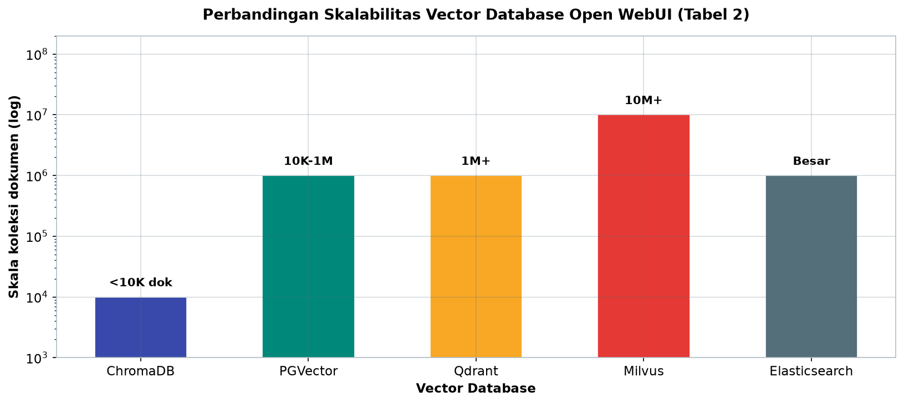
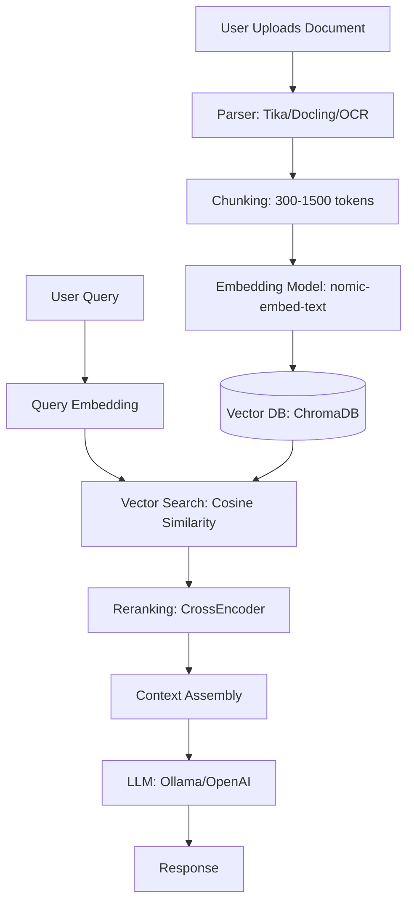
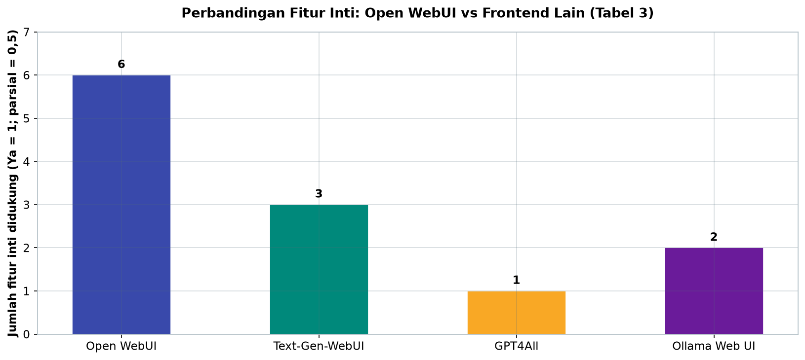
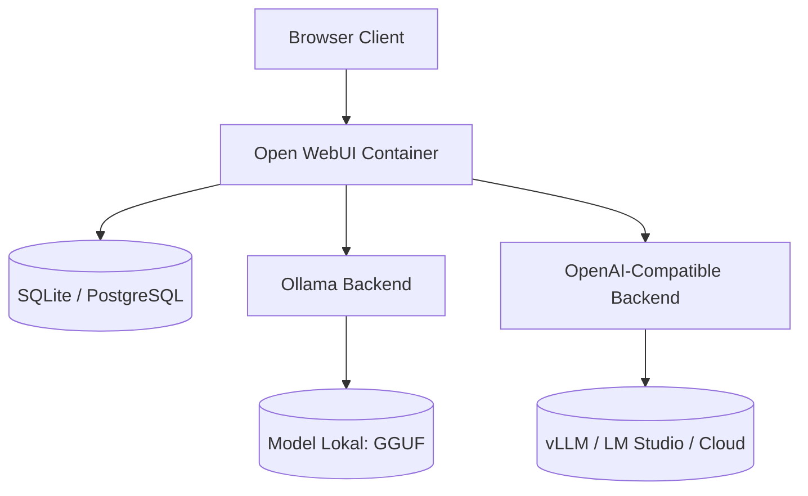

# Bab 3.4: Open WebUI

> Di balik layar, model lokal Anda hanyalah daemon tanpa wajah di port 11434. Open WebUI-lah yang memberi wajah itu: antarmuka web bergaya ChatGPT yang menyalurkan inferensi ke mesin di belakangnya, menampung dokumen, dan memberi "tangan" bagi model untuk memanggil fungsi. Dalam sub-bab ini, Anda akan mendeploy gateway all-in-one tersebut dan menghidupkan RAG serta Tools-nya.

---

## 1. Tujuan Sub-Bab


Setelah membaca sub-bab ini, Anda akan mampu:

- Mendeploy Open WebUI dengan Docker, termasuk opsi *image* `:main`, `:ollama`, dan `:cuda` beserta *volume* persistensi dan *GPU passthrough*
- Mengonfigurasi *RAG pipeline* lengkap: *chunking*, *embedding* lokal, *vector database*, hingga *hybrid search* dengan *reranking*
- Membuat dan menggunakan *Tools* (fungsi Python kustom) beserta *function calling* dan dukungan *Model Context Protocol* (MCP)
- Membandingkan Open WebUI dengan *frontend* LLM lain dan memutuskan kapan Open WebUI adalah pilihan tepat
- Mengamankan deployment dengan RBAC multi-user, *rate limiting*, dan *reverse proxy* HTTPS

---

## 2. Open WebUI: Wajah Ramah di Depan Mesin Inferensi


### Dari Terminal ke Antarmuka Bergaya ChatGPT

Bayangkan Anda baru saja mengunduh DeepSeek V4 Flash melalui Ollama. Untuk mengobrol dengannya, pilihan Anda adalah `ollama run` di terminal — cepat, tetapi kering: tidak ada riwayat percakapan yang nyaman, tidak ada tempat menyimpan dokumen, dan tidak ada cara bagi model untuk menjalankan kode. Open WebUI hadir untuk mengisi kekosongan itu. Proyek ini adalah *frontend* web *self-hosted* yang awalnya bernama "Ollama WebUI" dan kemudian berkembang menjadi platform lengkap: pengganti ChatGPT *self-hosted* yang dapat dijalankan di mesin sendiri, sepenuhnya gratis dan *open source* [6].

Yang membuat Open WebUI menarik bukan hanya tampilannya yang mirip layanan komersial, tetapi tiga lapis kemampuannya: **antarmuka percakapan** yang nyaman, **RAG pipeline** bawaan yang siap pakai, dan **sistem Tools** yang memungkinkan model memanggil fungsi. Kombinasi ini menjadikannya *gateway* yang menghubungkan pengguna, dokumen, dan mesin inferensi dalam satu antarmuka.

### Arsitektur: Backend Python, Frontend Svelte

Secara arsitektur, Open WebUI terdiri dari dua bagian yang dipisahkan dengan tegas [1]. **Backend** ditulis dalam Python menggunakan *framework* **FastAPI** — backend ini bertanggung jawab atas autentikasi, *routing* permintaan, orkestrasi RAG, eksekusi Tools, dan semua logika sisi server. **Frontend** dibangun dengan **Svelte**, kerangka kerja JavaScript yang dikenal ringan dan reaktif — frontend inilah yang dirender di browser pengguna. Keduanya berkomunikasi melalui REST API dan *WebSocket*, sehingga respons model dapat mengalir *streaming* token demi token tanpa menunggu seluruh jawaban selesai.

Pemisahan ini memberi konsekuensi praktis yang penting: Open WebUI hanyalah *frontend*, bukan mesin inferensi. Ia tidak menjalankan model sendiri, melainkan berperan sebagai **konduktor** yang menyalurkan permintaan ke *backend engine* di belakangnya — seperti orkestra yang memukimkan setiap instrument ke posisinya masing-masing.

### Dukungan Multi-Engine

Open WebUI mendukung banyak mesin inferensi sekaligus, dan Anda dapat berpindah *engine* bahkan di tengah percakapan:

- **Ollama** — mesin default yang paling mudah; Open WebUI bahkan menyediakan *image* Docker yang sudah membundel Ollama di dalamnya
- **OpenAI-compatible API** — endpoint apa pun yang mengikuti format API OpenAI, termasuk vLLM, LM Studio, llama.cpp *server*, hingga penyedia cloud
- **vLLM** — untuk kebutuhan *throughput* tinggi dan *continuous batching* di kelas server

*Database* bawaan Open WebUI adalah **SQLite** — cukup untuk penggunaan pribadi hingga tim kecil. Untuk skala yang lebih besar, Open WebUI mendukung **PostgreSQL** sebagai pengganti, yang menangani banyak koneksi bersamaan dengan lebih baik [7].

### Tabel 1: Opsi Deployment Open WebUI

Berikut perbandingan metode *deployment* yang tersedia, dari yang paling sederhana hingga skala *enterprise*:

| Metode | Perintah | GPU Support | Cocok Untuk |
|:---|:---|:---:|:---|
| **Docker Standalone** | `docker run ghcr.io/open-webui/open-webui:main` | Via host | Pengguna dengan Ollama terpisah |
| **Docker + Ollama** | `docker run ghcr.io/open-webui/open-webui:ollama` | --gpus=all | Setup all-in-one termudah |
| **Docker + CUDA** | `docker run ghcr.io/open-webui/open-webui:cuda` | CUDA native | NVIDIA GPU users |
| **Docker Compose** | `docker compose up` | Ya | Production deployment |
| **Kubernetes** | Helm chart / kubectl | Ya | Enterprise scale |
| **Native (pip)** | `pip install open-webui` | Ya | Development |

Analisis: pilihan metode pada dasarnya adalah *trade-off* antara kemudahan dan kendali. Varian `:ollama` adalah jalan pintas terbaik untuk pengguna rumahan — satu perintah sudah membawa *frontend* dan mesin inferensi sekaligus. Namun, menyatukan Ollama di dalam *container* berarti *upgrade* Ollama harus mengikuti *release* image Open WebUI. Sebaliknya, `:main` dengan Ollama terpisah di host memberi kebebasan *upgrade* independen, dan *standalone* CUDA `:cuda` menjadi pilihan bagi pengguna NVIDIA yang ingin memaksimalkan komputasi GPU. Kubernetes relevan hanya bila Anda sudah memiliki *cluster*; untuk kebanyakan tim, Docker Compose adalah titik manis antara kesederhanaan dan ketahanan.


---

## 3. Deploy dengan Docker


### Memilih Image yang Tepat

Cara termudah menjalankan Open WebUI adalah Docker, dan pemilihan *image* menentukan kemudahan *setup* Anda. Terdapat tiga varian utama [7]:

| Varian | Isi |
|:---|:---|
| `ghcr.io/open-webui/open-webui:main` | Open WebUI *standalone* tanpa mesin inferensi — cocok bila Ollama sudah terpasang terpisah |
| `ghcr.io/open-webui/open-webui:ollama` | Sudah membundel Ollama di dalam *container* — *setup all-in-one* paling mudah |
| `ghcr.io/open-webui/open-webui:cuda` | Dilengkapi dukungan CUDA *native* untuk GPU NVIDIA |

### Volume dan GPU Passthrough

Dua hal yang tidak boleh dilupakan saat mendeploy: **persistensi data** dan **akses GPU**. Persistensi dilakukan dengan *volume mount* — `-v open-webui:/app/backend/data` menyimpan database, riwayat percakapan, dan *knowledge base* Anda, sementara `-v ollama:/root/.ollama` menyimpan model-model Ollama. Tanpa volume ini, seluruh data akan hilang saat *container* dihapus.

Akses GPU diberikan melalui flag `--gpus=all` yang meneruskan seluruh GPU host ke dalam *container*. Tanpa flag ini, model akan berjalan di CPU — jauh lebih lambat. Kombinasi kedua flag itulah yang menjadi perintah *deployment* standar:

```bash
docker run -d -p 3000:8080 \
  --gpus=all \
  -v ollama:/root/.ollama \
  -v open-webui:/app/backend/data \
  --name open-webui \
  --restart always \
  ghcr.io/open-webui/open-webui:ollama
```

Setelah perintah ini, antarmuka dapat diakses di `http://localhost:3000` — port 3000 di host dipetakan ke port 8080 di dalam *container*. Flag `--restart always` memastikan layanan bangkit kembali otomatis jika server reboot, sebuah detail kecil yang sangat berarti untuk deployment jangka panjang.

### Pendekatan Production dengan Docker Compose

Untuk kebutuhan *production*, cara `docker run` satu baris mulai terasa rapuh. Di sinilah **Docker Compose** unggul: seluruh konfigurasi — *image*, port, volume, variabel lingkungan, dan *restart policy* — ditulis sebagai *file* YAML yang versi-kontrol dan dapat direplikasi di mesin lain. Perlu dicatat, pendekatan Compose juga menjadi fondasi untuk skenario lanjutan seperti *load balancing* dan pemisahan layanan yang dibahas dalam konteks sistem *serving* berskala [4].

---

## 4. Anatomi RAG Pipeline


### Alur Retrieval-Augmented Generation

Sekadar mengobrol dengan model lokal mungkin sudah memuaskan, tetapi bagaimana jika Anda ingin model menjawab pertanyaan berdasarkan 200 dokumen PDF perusahaan Anda? Inilah pekerjaan **RAG** (*Retrieval-Augmented Generation*) — arsitektur yang menggabungkan *retrieval* dokumen relevan dengan *generation* jawaban oleh LLM [2]. Open WebUI mengemas seluruh pipeline ini menjadi fitur *Knowledge Base* yang konfigurasinya dapat dilakukan dari *Admin Panel* tanpa menulis kode.

Alur RAG di Open WebUI dapat diuraikan dalam enam tahap: *document loading*, *chunking*, *embedding*, penyimpanan vektor, pencarian, dan *generation*.

### Document Loading dan Chunking

Tahap pertama adalah memuat dokumen. Open WebUI menerima berbagai format: **PDF, DOCX, TXT, Markdown, hingga HTML**. Saat dokumen diunggah, *parser* internal (berbasis *library* seperti Tika dan Docling, dengan dukungan OCR untuk dokumen hasil scan) mengekstrak teks mentah dari format-format tersebut.

Teks yang panjang tidak bisa langsung dimasukkan ke model — model hanya melihat sejumlah token dalam satu waktu. Karena itu teks dipecah menjadi potongan-potongan yang disebut **chunk**. Ukuran *chunk* dan *overlap* bersifat *configurable*: pada konfigurasi standar, **chunk size 1000 token** dengan **chunk overlap 200 token**. *Overlap* sengaja dipertahankan agar kalimat yang terpotong di ujung satu *chunk* tidak kehilangan konteksnya saat diembed secara terpisah — seperti menyambung kaset yang ujungnya saling tumpang tindih agar tidak ada suku kata yang hilang.

### Embedding dan Vector Database

Setiap *chunk* kemudian diterjemahkan menjadi **vektor** (deretan angka berdimensi tinggi) oleh model *embedding* — vektor yang posisinya di ruang semantik mencerminkan makna teks. Open WebUI mendukung model *embedding* dari Ollama (misalnya **nomic-embed-text**), dari OpenAI, atau model lokal *sentence-transformers*. Model *embedding* lokal menjadi pilihan paling masuk akal untuk pengguna yang menginginkan privasi penuh: tidak ada data yang keluar dari mesin.

Vektor-vektor ini disimpan di **vector database**. Default Open WebUI adalah **ChromaDB** — *embedded database* yang ringan dan muat dalam satu *folder*, ideal untuk koleksi di bawah 10 ribu dokumen. Bagi yang membutuhkan skala lebih besar, tersedia hingga 9 opsi lain: **PGVector, Qdrant, Milvus, Elasticsearch**, dan lainnya [8]. Analisis perbandingan opsi ini dibahas di Tabel 2.

### Hybrid Search dan Reranking

Saat pengguna bertanya, pertanyaan di-*embed* menjadi vektor, lalu vektor-vektor dokumen terdekat diambil dengan **cosine similarity**. Namun Open WebUI tidak berhenti di situ: ia menjalankan **hybrid search** yang menggabungkan *embedding search* dengan **BM25** — pencarian berbasis kata kunci klasik yang unggul untuk istilah eksak seperti kode produk atau nama orang. Hasil gabungan keduanya kemudian melewati **CrossEncoder reranking**: model kecil yang membandingkan pertanyaan dengan setiap kandidat dokumen secara langsung dan mengurutkan ulang yang paling relevan ke atas. Konfigurasi **Top K = 5** berarti lima *chunk* terbaik yang diambil sebagai konteks jawaban. Hasil akhirnya adalah jawaban yang disusun LLM dengan konteks yang benar-benar relevan, bukan sekadar potongan dokumen yang kebetulan mirip.

### Filesystem Access: ENABLE_KB_EXEC

Open WebUI memiliki fitur yang jarang dimiliki *frontend* lain: akses *knowledge base* ala *filesystem*. Dengan mengaktifkan variabel lingkungan **ENABLE_KB_EXEC**, model dapat menjalankan perintah seperti `ls`, `grep`, dan `cat` terhadap *knowledge base* melalui Tools — memungkinkan pertanyaan seperti "cari semua dokumen yang menyebut istilah klausul penalti" dijawab dengan cara yang presisi alih-alih mengandalkan *fuzzy search*.

### Tabel 2: Perbandingan Dukungan Vector Database

Pilihan *vector database* menentukan seberapa jauh RAG Anda bisa berkembang:

| Vector DB | Tipe | Open Source | Skalabilitas | Kecepatan Query |
|:---|:---|:---:|:---|:---|
| **ChromaDB** | Embedded | Ya | Kecil (<10K docs) | Cepat |
| **PGVector** | PostgreSQL extension | Ya | Sedang (10K-1M) | Sedang |
| **Qdrant** | Standalone | Ya | Besar (1M+) | Cepat |
| **Milvus** | Distributed | Ya | Sangat Besar (10M+) | Sangat cepat |
| **Elasticsearch** | Enterprise | Ya/No | Besar | Sedang |

Gambar berikut memetakan kolom skalabilitas tabel ini ke skala logaritmik.



*Gambar 3.4-1 — ChromaDB cukup untuk koleksi di bawah 10 ribu dokumen, sementara Milvus melayani 10 juta+ — selisih tiga orde magnitudo; label "Besar" pada Elasticsearch dan Qdrant dipetakan ke ~1 juta dokumen sesuai keterangan tabel.*

Analisis: tidak ada jawaban tunggal yang benar — semuanya bergantung pada jumlah dokumen. ChromaDB adalah pilihan default yang tepat: nol *infrastruktur* tambahan karena berjalan *embedded* di dalam proses, cukup untuk perpustakaan dokumen pribadi hingga ribuan *chunk*. Ketika koleksi melewati batas 10 ribu dokumen atau mulai melayani banyak pengguna bersamaan, PGVector menawarkan jalur halus karena cukup menambahkan ekstensi pada PostgreSQL yang mungkin sudah ada. Pada skala jutaan dokumen, Qdrant dan Milvus yang berdiri sendiri (*standalone/distributed*) memberi *control* penuh atas *sharding* dan *replication*, tetapi juga berarti layanan tambahan yang harus dirawat. Aturan praktis: mulai dengan ChromaDB, dan pindah hanya ketika ada bukti pengukuran bahwa ChromaDB sudah menjadi *bottleneck*.


### Gambar 1: Arsitektur RAG Pipeline Open WebUI

Berikut alur lengkap dokumen dan pertanyaan dalam RAG pipeline Open WebUI — dua jalur yang bertemu di tahap penyusunan konteks:



Perhatikan dua jalur dalam diagram ini. Jalur atas (dokumen) berjalan *offline* saat unggahan: dokumen diurai, di-*chunk*, di-*embed*, dan disimpan di ChromaDB — pekerjaan satu kali yang membangun indeks. Jalur bawah (pertanyaan) berjalan *online* setiap kali pengguna bertanya: pertanyaan di-*embed*, diambil dari vektor terdekat, di-*rerank*, lalu disusun menjadi konteks bagi LLM. Pemisahan ini penting dipahami karena biaya utamanya berbeda: *indexing* memakan waktu sekali per dokumen, sedangkan *query time* menentukan latensi setiap jawaban.


---

## 5. Tools, Function Calling, dan MCP


### Builtin Tools

Fitur **Tools** adalah yang membedakan Open WebUI dari sekadar *chat UI*: ia memberi model "tangan" untuk bertindak. Tiga *builtin tools* tersedia sejak awal: **query_knowledge_bases** untuk menelusuri koleksi dokumen, **search_chats** untuk mencari riwayat percakapan, dan **web_search** untuk mencari di internet [7]. Saat pengguna menanyakan sesuatu yang membutuhkan data dari ketiga sumber itu, model dapat memutuskan sendiri tool mana yang dipanggil.

### Custom Tools: Python di dalam Sandbox

Yang lebih menarik adalah *custom tools*: Anda menulis fungsi Python, dan model akan memanggilnya saat relevan — seperti *function calling* di platform komersial, tetapi berjalan sepenuhnya lokal. Fungsi ini dieksekusi di *sandbox* sehingga kode tidak langsung menyentuh sistem host. Langkah 2 pada bagian Praktikum memperlihatkan contoh lengkap sebuah *tool* kalkulator.

Open WebUI mendukung dua mode: **native function calling** — model dilatih untuk mengeluarkan panggilan fungsi terstruktur — dan **default mode** yang lebih longgar. *Tools* diaktifkan dalam percakapan dengan mengetik `@nama_tool` atau membiarkan model memanggilnya otomatis.

### Dukungan MCP

Sejak 2025, ekosistem *tool* LLM diramaikan **Model Context Protocol (MCP)** — protokol terbuka yang distandardisasi oleh Anthropic untuk menghubungkan model dengan sumber data eksternal (database, browser, sistem file) melalui server MCP [10]. Open WebUI mengadopsi dukungan MCP, sehingga Anda dapat menautkan *server* MCP yang sudah ada ke antarmuka ini tanpa menulis integrasi khusus — sebuah investasi yang membuat Open WebUI kompatibel dengan ekosistem yang terus bertumbuh.

---

## 6. Fitur Lanjutan


### Multi-User dengan Role

Open WebUI bukan sekadar aplikasi pengguna tunggal. Ia mendukung **multi-user** dengan tiga peran: **admin** (kontrol penuh, akses pengaturan), **user** (menggunakan chat, dokumen, dan Tools), serta **pending** (akun yang menunggu disetujui admin). Alur pendaftarannya sederhana: pengguna pertama yang registrasi otomatis menjadi admin, dan admin dapat mengatur siapa yang boleh bergabung. Ini menjadikan Open WebUI cocok untuk keluarga, sekolah, hingga kantor kecil — topik yang dibahas lebih dalam di Jilid 2 Bab 7.

### Web Search dan Image Generation

Untuk informasi *real-time*, Open WebUI mendukung integrasi **web search** dari 15+ penyedia — mulai dari mesin pencari mandiri seperti **SearXNG** yang di-*self-host* (pilihan terbaik untuk privasi) hingga penyedia komersial seperti **Brave Search**. Model akan mencari → mengambil → meringkas, persis seperti asisten AI modern.

Open WebUI juga terintegrasi dengan *image generation*: **DALL-E, Stable Diffusion, hingga Flux**. Ini berarti satu antarmuka untuk teks dan gambar — berguna untuk membuat ilustrasi cerita atau materi presentasi.

### Manajemen Model

Pengguna dapat **berpindah model di tengah percakapan** — mulai dengan model kecil untuk respons cepat, lalu lanjut ke model besar saat pertanyaan menuntut *reasoning* mendalam. Open WebUI juga memungkinkan **penyesuaian bobot model** (berat antar model) dan parameter *sampling* per sesi, tanpa perlu menyentuh konfigurasi mesin inferensi.

---

## 7. Keamanan dan Performa


Deployment yang baik adalah deployment yang aman. Open WebUI menyediakan **RBAC** (*Role-Based Access Control*) lengkap: *admin panel*, manajemen pengguna, dan manajemen **API key** untuk integrasi programatik. Untuk melindungi layanan dari penyalahgunaan, tersedia **rate limiting** dan **request logging** — mencatat siapa meminta apa dan kapan, sehingga perilaku aneh dapat dideteksi.

Untuk pengiriman melalui jaringan luas, praktik standar adalah menempatkan **reverse proxy** (Caddy atau Nginx) di depan Open WebUI. Proxy ini mengelola sertifikat **HTTPS** secara otomatis, menyembunyikan detail internal, dan menangani *connection pooling*. Kombinasi Open WebUI + reverse proxy + *restart policy* Docker adalah fondasi *production deployment* yang murah namun andal — sejalan dengan prinsip sistem *serving* yang memisahkan *control plane* dan *data plane* agar mudah di-*scale* [4][5].

### Tabel 3: Perbandingan Frontend LLM

Untuk memosisikan Open WebUI, bandingkan dengan tiga *frontend* lain yang populer:

| Fitur | Open WebUI | Text-Gen-WebUI | GPT4All | Ollama Web UI |
|:---|:---|:---|:---|:---|
| **Docker Support** | Ya | Ya | Tidak | Ya |
| **RAG Built-in** | Ya (full pipeline) | Extension | LocalDocs | Tidak |
| **Tools/Functions** | Ya | Tidak | Tidak | Tidak |
| **Multi-User** | Ya (RBAC) | Tidak | Tidak | Tidak |
| **Web Search** | 15+ providers | Manual | Tidak | Tidak |
| **Multi-Model** | Ya | Ya | Terbatas | Ya |

Gambar berikut menghitung dukungan keenam fitur inti pada tabel ini dengan skala: dukungan penuh ("Ya") = 1, dukungan parsial (Extension, LocalDocs, Terbatas, Manual) = 0,5.



*Gambar 3.4-2 — Open WebUI adalah satu-satunya yang mendukung seluruh enam fitur inti (RAG lengkap, Tools, multi-user RBAC, web search); Text-Generation-WebUI dan Ollama Web UI tertinggal jauh, mempertegas posisi Open WebUI sebagai pilihan all-in-one.*

Analisis: dari tabel ini terlihat mengapa Open WebUI disebut *all-in-one* — ia adalah satu-satunya yang mengemas RAG lengkap, Tools, multi-user, dan web search dalam satu paket. Text-Generation-WebUI (dibahas di Bab 3.5) unggul justru di area lain yang tidak tercantum di sini: kendali *parameter sampling* yang sangat mendalam, menjadikannya laboratorium eksperimen yang ideal. GPT4All menang di sisi kesederhanaan *desktop app* tanpa Docker, sementara Ollama Web UI pada dasarnya adalah versi awal dari Open WebUI itu sendiri. Pilihan yang tepat bergantung peran: Open WebUI jika Anda ingin *produk jadi untuk banyak orang*, Text-Generation-WebUI jika Anda ingin *laboratorium riset sampling*, dan GPT4All jika Anda ingin aplikasi *desktop* paling sederhana.

---


### Gambar 2: Topologi Deployment

Gambar 2 menunjukkan bagaimana Open WebUI berdiri di tengah ekosistem backend:



Topologi ini menggambarkan fleksibilitas *multi-engine*: Open WebUI menjadi satu titik masuk, sementara backend dapat lebih dari satu sekaligus. Pengguna bisa berpindah dari model Ollama lokal ke endpoint vLLM atau API cloud tanpa mengganti aplikasi. Database (SQLite untuk pemakaian pribadi, PostgreSQL untuk skala tim) menyimpan semua metadata percakapan dan *knowledge base*, sedangkan model tetap tinggal di mesin inferensi masing-masing.

---


---

## 8. Praktikum / Hands-On


### Langkah 1: Deployment Docker + RAG Setup

Langkah pertama, deploy Open WebUI dengan Ollama yang sudah dibundel, lalu siapkan model inference dan embedding:

```bash
# 1. Deploy Open WebUI dengan Ollama bundling
docker run -d -p 3000:8080 \
  --gpus=all \
  -v ollama:/root/.ollama \
  -v open-webui:/app/backend/data \
  --name open-webui \
  --restart always \
  ghcr.io/open-webui/open-webui:ollama

# 2. Pull model inference dan embedding
docker exec -it open-webui ollama pull deepseek-v4-flash
docker exec -it open-webui ollama pull llama3.1:8b
docker exec -it open-webui ollama pull nomic-embed-text

# 3. Buka http://localhost:3000
# Register akun admin pertama

# 4. Konfigurasi RAG:
# Admin Panel > Settings > Documents
# - Chunk Size: 1000 tokens
# - Chunk Overlap: 200 tokens
# - Embedding Model: nomic-embed-text (via Ollama)
# - Vector DB: ChromaDB (default)
# - Top K: 5

# 5. Upload dokumen ke Knowledge Base
# Workspace > Knowledge > Create Knowledge
# Upload file PDF tentang topik tertentu

# 6. Test RAG dengan prompt yang merujuk ke knowledge base
```

Perhatikan bahwa tiga model diunduh dengan peran berbeda: `deepseek-v4-flash` dan `llama3.1:8b` untuk *generation*, `nomic-embed-text` untuk *embedding*. Model *embedding* tidak perlu sebesar model *generation* — ia hanya menerjemahkan teks ke vektor, bukan menghasilkan jawaban. Saat pengujian, tanyakan sesuatu yang hanya bisa dijawab dari dokumen yang Anda unggah — misalnya kutipan angka dari dokumen tersebut — untuk memastikan RAG benar-benar berfungsi, bukan sekadar menjawab dari pengetahuan umum model.

### Langkah 2: Custom Tool — Kalkulator Python

Sekarang buat *tool* pertama: kalkulator aritmatika yang dieksekusi di *sandbox*. Di antarmuka Open WebUI, masuk ke **Workspace > Tools > Create Tool**:

```python
# Di Open WebUI: Workspace > Tools > Create Tool
# Nama: kalkulator_dasar

"""
Title: Kalkulator Dasar
Description: Kalkulator untuk operasi aritmatika sederhana
"""
import json

def kalkulator(ekspresi: str) -> str:
    """
    Hitung ekspresi matematika sederhana.

    Parameters:
    ekspresi (str): Ekspresi matematika, contoh: "2 + 3 * 4"

    Returns:
    str: Hasil perhitungan dalam format JSON
    """
    try:
        # Filter hanya karakter yang aman
        aman = all(c in "0123456789+-*/(). " for c in ekspresi)
        if not aman:
            return json.dumps({"error": "Ekspresi mengandung karakter tidak aman"})

        hasil = eval(ekspresi)
        return json.dumps({"ekspresi": ekspresi, "hasil": hasil})
    except ZeroDivisionError:
        return json.dumps({"error": "Pembagian dengan nol"})
    except Exception as e:
        return json.dumps({"error": str(e)})
```

```bash
# Aktifkan tool di chat dengan mengetik "@kalkulator_dasar"
# Atau model akan memanggil tool secara otomatis jika relevan
```

Dua detail penting dalam *tool* ini. Pertama, *whitelist* karakter — `0123456789+-*/(). ` — menyaring input sebelum diteruskan ke `eval()`, mencegah ekspresi berbahaya seperti `__import__('os').system('rm -rf /')`. Kedua, *error handling* pada pembagian dengan nol. Pola *whitelist + error handling* ini adalah *best practice* untuk semua *custom tool* yang akan Anda tulis.

### Langkah 3: Web Search RAG Integration

Langkah terakhir, aktifkan *web search* agar model dapat menjawab pertanyaan *real-time*:

```bash
# 1. Admin Panel > Settings > Web Search
# Pilih search provider (contoh: SearXNG self-hosted atau Brave)

# 2. Integrasi dengan Docker:
# Tambahkan environment variable saat run
docker run -d -p 3000:8080 \
  --gpus=all \
  -v open-webui:/app/backend/data \
  -e WEB_SEARCH_PROVIDER=brave \
  -e BRAVE_SEARCH_API_KEY=your_api_key \
  --name open-webui \
  ghcr.io/open-webui/open-webui:ollama

# 3. Test: tanya pertanyaan yang butuh data real-time
# "Berita terbaru AI tahun 2026"
# Model akan: web search → retrieve → summarize
```

Untuk privasi maksimal, *self-host* SearXNG sebagai penyedia: *search* berjalan dari server Anda sendiri tanpa mengirim log ke penyedia pihak ketiga. Integrasi web search juga berpadu dengan RAG — jawaban dapat menggabungkan dokumen internal (dari *knowledge base*) dan informasi terkini (dari web) dalam satu respons.

---

## 9. Studi Kasus: Perpustakaan Digital SMK dengan Open WebUI


**Skenario.** Sebuah SMK dengan 500 siswa memiliki perpustakaan berisi ratusan buku pelajaran digital, tetapi siswa kesulitan mencari materi — halaman demi halaman PDF harus dibuka manual. Sekolah memiliki server lokal bekas: Xeon E5, 64 GB RAM, dan RTX 3060 12 GB. Kepala sekolah ingin siswa dapat bertanya dalam bahasa sehari-hari: "Bagaimana rumus usaha dalam fisika?" dan langsung mendapat jawaban beserta sumbernya.

**Analisis pilihan.** Model di cloud mahal per-token dan mengirim data siswa ke pihak ketiga — tidak cocok untuk sekolah. Model lokal di server yang ada adalah pilihan realistis, dengan Open WebUI sebagai *frontend* karena satu alasan kunci: dukungan **multi-user RBAC**. Diperlukan pemisahan peran — 10 guru sebagai admin yang mengelola *knowledge base*, 500 siswa sebagai user terbatas tanpa akses pengaturan. Alternatif seperti Text-Generation-WebUI gugur di sini karena tidak memiliki manajemen pengguna.

**Solusi.** Deployment: Open WebUI + Ollama di server sekolah. Dua model *generation* disiapkan dengan strategi berjenjang: **DeepSeek V4 Flash** untuk pertanyaan ringan (definisi, ringkasan) yang menuntut kecepatan, dan **Qwen 2.5 (14B) Q4_K_M** untuk tugas berat seperti pemecahan soal fisika bertahap. RAG dikonfigurasi dengan ChromaDB (default) — koleksi **200+ buku pelajaran PDF** di-*chunk* (1000 token, overlap 200) dan di-*embed* dengan nomic-embed-text lokal, sehingga tidak ada data yang keluar dari server.

**Hasil.** Siswa bertanya dalam bahasa alami dan mendapat jawaban dengan konteks dari buku yang sesuai; guru memantau pengguna dan *knowledge base* dari admin panel. DeepSeek V4 Flash menangani mayoritas pertanyaan ringan dengan respons cepat, sementara Qwen 2.5 (14B) diaktifkan untuk soal yang menuntut *reasoning* — *model switching* di tengah percakapan dimanfaatkan guru untuk memilih sesuai tingkat kesulitan. Untuk pelajaran coding, *tool* Python kustom dijalankan di *sandbox* sehingga siswa bisa menguji potongan kode langsung di dalam chat.

**Pelajaran.** Pertama, *budgeting* yang bijak: **biaya software Rp 0** — seluruh komponen *open source*, hardware memanfaatkan server existing. Kedua, skala model tidak harus selalu besar: kombinasi model cepat untuk 80% pertanyaan dan model kuat untuk 20% sisanya jauh lebih efisien daripada satu model besar untuk semua. Ketiga, fitur RBAC bukan kemewahan — di institusi pendidikan, pembatasan akses dan peran admin adalah kebutuhan fungsional yang menentukan kelayakan sebuah solusi.

---

## 10. Referensi


### Paper Jurnal/Konferensi

[1] The Open WebUI Team. (2025). *Open WebUI: An Open, Extensible, and Usable Interface for AI Interaction*. arXiv preprint arXiv:2510.02546. DOI: [10.48550/arXiv.2510.02546](https://arxiv.org/abs/2510.02546)
- Paper utama Open WebUI — desain, *usability testing*, dan arsitektur backend-frontend yang dijelaskan di Sub-bab 2.

[2] Gao, Y., et al. (2024). *Retrieval-Augmented Generation for Large Language Models: A Survey*. arXiv preprint arXiv:2312.10997. DOI: [10.48550/arXiv.2312.10997](https://arxiv.org/abs/2312.10997)
- Survey komprehensif RAG — fondasi teoretis *indexing*, *retrieval*, dan *generation* pada Sub-bab 4.

[3] Fu, Y., et al. (2024). *APIServe: Efficient API Support for Large-Language Model Inferencing*. arXiv preprint arXiv:2402.01869. DOI: [10.48550/arXiv.2402.01869](https://arxiv.org/abs/2402.01869)
- *Framework* inferensi untuk API-augmented LLM — relevan dengan fitur Tools/*function calling* pada Sub-bab 5.

[4] Wang, L., et al. (2024). *ScaleLLM: A Resource-Frugal LLM Serving Framework by Optimizing End-to-End Efficiency*. Proceedings of EMNLP Industry Track. DOI: [10.18653/v1/2024.emnlp-industry.22](https://aclanthology.org/2024.emnlp-industry.22/)
- Sistem *serving* dengan API *gateway* dan *load balancing* — relevan dengan deployment multi-user pada Sub-bab 7.

[5] Fu, Y., et al. (2024). *ServerlessLLM: Low-Latency Serverless Inference for Large Language Models*. USENIX OSDI. [https://www.usenix.org/system/files/osdi24-fu.pdf](https://www.usenix.org/system/files/osdi24-fu.pdf)
- Sistem serverless dengan *checkpoint management* — strategi deployment Docker dan manajemen siklus hidup pada Sub-bab 3.

### Referensi Pendukung (Dokumentasi/Repository)

[6] Open WebUI Official. *GitHub Repository*. [https://github.com/open-webui/open-webui](https://github.com/open-webui/open-webui)

[7] Open WebUI Documentation. [https://docs.openwebui.com](https://docs.openwebui.com)

[8] ChromaDB Documentation. [https://www.trychroma.com](https://www.trychroma.com)

[9] Docker Documentation. [https://docs.docker.com](https://docs.docker.com)

[10] MCP (Model Context Protocol) Specification. [https://modelcontextprotocol.io](https://modelcontextprotocol.io)
