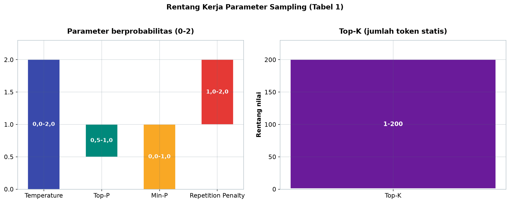
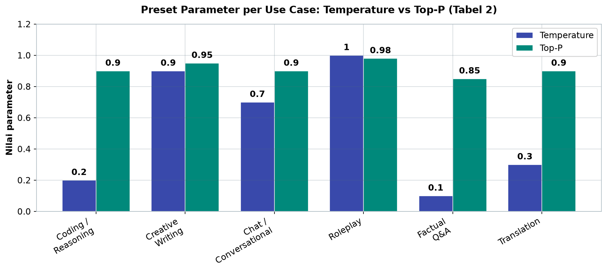
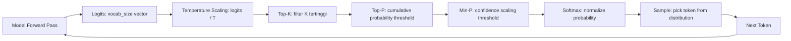
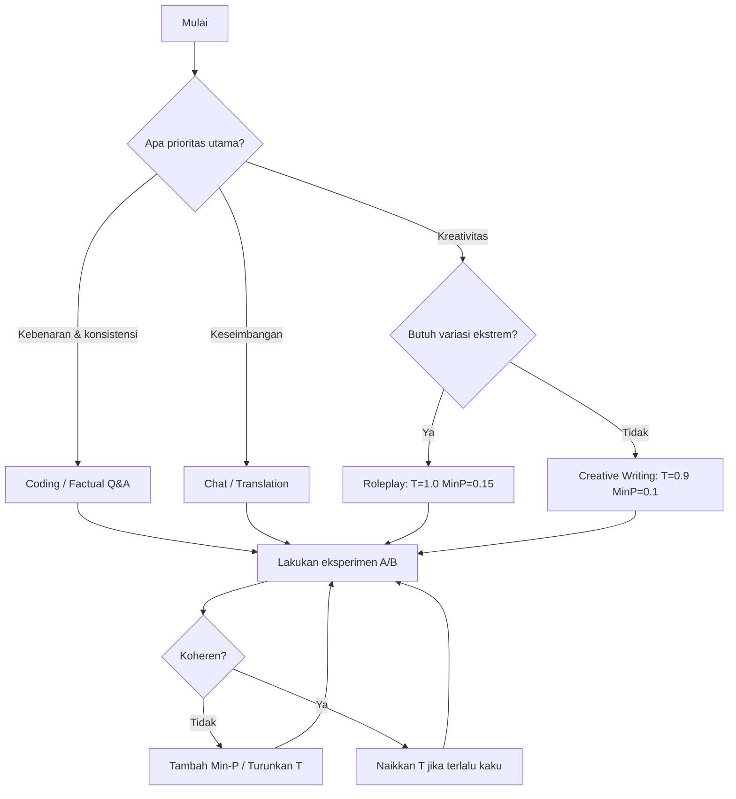

# Bab 3.5: Text-Generation-WebUI

> Model yang sama dapat menjadi juru tulis yang kaku atau penyair yang liar — semuanya ditentukan oleh *decoding strategy*: deretan tombol kecil bernama Temperature, Top-K, Top-P, dan Min-P. Text-Generation-WebUI adalah laboratorium tempat tombol-tombol itu dapat Anda putar langsung dan melihat dampaknya secara nyata. Di bab ini, kita membedah matematika di baliknya, lalu belajar mengendalikannya untuk setiap jenis pekerjaan.

---

## 1. Tujuan Sub-Bab

Setelah membaca sub-bab ini, Anda akan mampu:

- Menjelaskan perbedaan mekanisme **Temperature**, **Top-K**, **Top-P**, **Min-P**, dan **Repetition Penalty** beserta matematika di baliknya
- Menentukan kombinasi parameter optimal untuk berbagai *use case* — dari coding hingga *creative writing*
- Menggunakan Text-Generation-WebUI (oobabooga) sebagai laboratorium eksperimen *sampling*
- Mengevaluasi hasil eksperimen secara sistematis dengan skrip Python dan *benchmark* sederhana
- Memahami metode *decoding* alternatif seperti *Contrastive Decoding* dan *Speculative Decoding*

---

## 2. Mengapa Sampling Penting?

### Model Menebak Satu Token Demi Satu Token

Cara kerja LLM pada dasarnya sederhana: diberikan rangkaian token sejauh ini, model menghitung **logits** — skor mentah untuk setiap kata dalam *vocabulary* — lalu memilih token berikutnya. Proses ini diulang hingga *end-of-sequence*. Pertanyaannya adalah: *bagaimana* memilih token dari kumpulan skor itu? Pilihan strategi inilah yang disebut **sampling strategy** atau **decoding strategy**, dan ia menentukan kualitas output sama pentingnya dengan model itu sendiri [2].

Strategi paling naif adalah **greedy decoding**: selalu pilih token dengan skor tertinggi. Hasilnya deterministik dan koheren — tetapi juga repetitif dan membosankan. Dalam teks terbuka (*open-ended generation*) seperti cerita atau percakapan, *greedy* akan berputar dalam lingkaran frase yang sama [2]. Di kutub lain, memilih token secara acak sepenuhnya menghasilkan teks yang liar dan tidak bermakna. Dunia nyata berada di antara keduanya: **sampling bertingkat probabilitas** yang memilih token secara acak, tetapi dengan peluang proporsional terhadap skor — sedikit keacakan untuk kreativitas, dibatasi agar tidak meledak menjadi omong kosong.

### Mendesain "Karakter" Model

Cara paling hidup memahami *sampling* adalah analogi restoran: **Temperature** mengatur seberapa berani Anda mencoba menu baru, **Top-K** membatasi hanya melihat menu-menu terpopuler saja, **Top-P** membolehkan lihat menu apa pun asalkan total popularitasnya masih dalam anggaran, dan **Min-P** hanya memesan menu yang "cukup populer" relatif terhadap yang terfavorit. Empat tombol ini bekerja bersama menentukan kepribadian output. Memahami masing-masing adalah kunci untuk mengendalikan perilaku model — dan Text-Generation-WebUI adalah arena terbaik untuk melatihnya.

---

## 3. Temperature

### Renormalisasi Logits

Parameter paling terkenal — dan paling mudah disalahpahami — adalah **Temperature** (T). Secara matematis, *Temperature* membagi setiap logit sebelum *softmax*:

$$P_i = \frac{e^{l_i / T}}{\sum_j e^{l_j / T}}$$

Ketika T = 1, tidak ada perubahan: distribusi *softmax* standard. Ketika T < 1, logit dibagi angka lebih kecil sehingga perbedaan antar skor membesar — distribusi menjadi **tajam** (satu token mendominasi). Ketika T > 1, logit dibagi angka lebih besar sehingga selisih skor menyusut — distribusi menjadi **datar** (banyak token hampir sama mungkinnya) [5].

### Tiga Wilayah Temperatur

Praktiknya, *Temperature* dibagi menjadi tiga wilayah penggunaan:

- **T rendah (0,1–0,5)**: deterministik dan konservatif. Model hampir selalu memilih token terbaiknya. Cocok untuk coding, penulisan faktual, dan tugas di mana jawaban yang salah mahal.
- **T sedang (0,7–1,0)**: seimbang; inilah wilayah *default* (0,7) di hampir semua aplikasi. Variasi terbuka namun tetap koheren.
- **T tinggi (1,2–2,0)**: kreatif dan tidak terduga — tetapi berisiko *incoherent* karena model mulai memilih token berpeluang rendah yang secara semantik tidak berhubungan.

Pada T ekstrem (di atas 1,5), model cenderung "berfantasi": kata-kata tetap gramatikal tetapi makna melayang. Karena itu *Temperature* tinggi hampir tidak pernah dipakai sendirian — ia butuh pasangan berupa *truncation* (Top-K/Top-P/Min-P) untuk menjinakkannya, sebagaimana dibahas pada Sub-bab 5.

---

## 4. Top-K Sampling

### Memangkas Ekor Distribusi

**Top-K** bekerja sederhana: dari seluruh *vocabulary*, pertahankan hanya **K token dengan probabilitas tertinggi**, buang sisanya, lalu *renormalize* probabilitas di antara token-token yang tersisa. Jika K = 40, model hanya boleh memilih dari 40 kandidat teratas di setiap langkah — apapun situasinya.

- **K kecil (10–40)**: lebih fokus dan stabil, tetapi kurang variasi — model jarang "melompat" ke kata yang tidak biasa.
- **K besar (100+)**: lebih banyak variasi, tetapi berisiko memilih token yang tidak relevan secara kontekstual, karena 100 teratas *vocabulary* belum tentu semuanya masuk akal dalam kalimat yang sedang dibangun.

Kelemahan konseptual Top-K: K bersifat **statis**. Pada langkah di mana distribusi sangat tajam (hanya 3 token yang masuk akal), K = 40 tetap memberi peluang pada 37 token sampah. Pada langkah di mana distribusi datar (100 token sah-sah saja), K = 40 justru memotong kandidat yang valid. Inilah alasan mengapa metode *truncation* adaptif — yang menyesuaikan jumlah kandidat dengan bentuk distribusi — kemudian dikembangkan.

---

## 5. Top-P (Nucleus Sampling)

### Memangkas Berdasarkan Massa Probabilitas

**Top-P**, yang juga dikenal sebagai **Nucleus Sampling**, memperbaiki kelemahan Top-K [2]. Alih-alih jumlah token tetap, Top-P memilih token-token dari yang paling mungkin hingga **probabilitas kumulatif mencapai P**:

- **P rendah (0,8–0,9)**: *nucleus* kecil — hanya token paling yakin yang dipertahankan. Output lebih ketat, lebih koheren.
- **P tinggi (0,95–0,99)**: *nucleus* besar — banyak token dipertahankan. Output lebih longgar, lebih variatif.

Nilai P = 0,9 misalnya berarti: urutkan token dari yang paling mungkin, lalu ambil berturut-turut sampai total probabilitas yang terkumpul ≥ 0,9; sisanya dibuang. Jumlah token yang dipilih otomatis berubah per langkah — di distribusi tajam hanya sedikit token (mungkin 5), di distribusi datar banyak token (mungkin 200).

### Mengapa Top-P Lebih Adaptif

Adaptivitas inilah keunggulan kunci Top-P: ia *menyesuaikan diri dengan konteks*. Di posisi kalimat di mana model sangat yakin (misalnya setelah kata "presiden", konteks yang jelas), nucleus menyempit dengan sendirinya — model tidak akan tergoda kata acak. Di posisi kreatif di mana banyak kelanjutan sama-sama masuk akal (misalnya awal kalimat deskriptif), nucleus melebar memberi ruang variasi. Paper *The Curious Case of Neural Text Degeneration* menunjukkan bahwa pemangkasan berbasis massa probabilitas ini menghilangkan sebagian besar pola repetitif *greedy decoding* tanpa mengorbankan koherensi [2]. Karena alasan inilah Top-P bersama Temperature menjadi *default* di hampir semua *framework*, termasuk Text-Generation-WebUI.

---

## 6. Min-P Sampling

### Ambang yang Bergerak Mengikuti Keyakinan Model

**Min-P** adalah metode termuda dalam keluarga ini, diperkenalkan lewat paper *Turning Up the Heat: Min-p Sampling for Creative and Coherent LLM Outputs* yang dipublikasikan pada ICLR 2025 [1]. Ide dasarnya elegan:

> **Min-P = probabilitas token teratas × p**

Alih-alih menyimpan "K token teratas" atau "token sampai total probabilitas P", Min-P mempertahankan token apa pun yang probabilitasnya setidaknya **p dikali probabilitas token paling mungkin**. Jika token terbaik memiliki probabilitas 0,5 dan p = 0,1, maka semua token dengan probabilitas ≥ 0,05 dipertahankan.

Konsekuensinya, ambang pemangkasan **menyusut saat model yakin** (token top punya probabilitas tinggi → ambang naik → hanya sedikit token lolos) dan **melebar saat model ragu** (token top penuh ketidakpastian → ambang turun → banyak token lolos). Sekali lagi analogi restoran: Anda tidak pernah memesan hidangan yang popularitasnya kurang dari 10% menu terfavorit — saat seluruh menu sepi peminat, Anda bersedia mencoba hampir semua.

### Keunggulan di Temperatur Tinggi

Temuan utama paper Min-P [1]: metode ini **unggul di temperature tinggi**. Kombinasi T tinggi (1,2–2,0) + *truncation* statis sering menghasilkan omong kosong karena distribusi yang didatarkan *Temperature* melonggarkan ambang Top-K/Top-P. Min-P tidak terpengaruh — ambangnya berbasis skala relatif, sehingga ia tetap memangkas ekor distribusi dengan benar bahkan setelah distribusi didatarkan. Hasilnya: **kreativitas tinggi tanpa incoherence** — kombinasi yang sebelumnya sulit dicapai.

Keunggulan praktis lainnya: Min-P adalah **parameter tunggal yang intuitif**. Nilai default umumnya 0,05–0,1 untuk perilaku seimbang; dinaikkan ke 0,2 untuk lebih deterministik, diturunkan untuk lebih liar. Tidak heran Min-P kini diadopsi luas — termasuk di vLLM dan Hugging Face Transformers [8] — dan menjadi *game-changer* untuk tugas kreatif (lihat Studi Kasus).

---

## 7. Parameter Pendukung Lainnya

Keluarga *sampling* tidak berhenti di empat parameter utama. Beberapa parameter *penalty* dan metode alternatif layak dipahami:

**Repetition Penalty** (1,0–1,2): menurunkan probabilitas token yang sudah muncul dalam teks sejauh ini. Nilai 1,0 = tanpa efek; 1,1 = sedang; 1,2+ = agresif. Efek samping yang perlu diwaspadai: penalty terlalu tinggi membuat model menghindari kata yang sebenarnya diperlukan, menghasilkan kalimat kaku.

**Frequency Penalty** dan **Presence Penalty**: dua saudara *Repetition Penalty*. *Frequency* menghukum token *sebanding dengan seberapa sering* ia muncul; *Presence* menghukum token sekali saja begitu ia muncul, tanpa menghitung frekuensi. Keduanya menjaga variasi kosakata tanpa merusak frasa natural.

**Typical-P**: metode berbasis *entropy* yang memilih token-token yang probabilitasnya "khas" untuk distribusi — menjaga *surprise* pada tingkat yang diharapkan model. **Mirostat**: *auto-adjusting* — ia mengukur *perplexity* teks yang dihasilkan secara langsung dan mengubah *Temperature* secara adaptif untuk menjaga *perplexity* pada target yang ditentukan, mengotomatiskan apa yang biasanya dilakukan manual [3][5].

Di luar keluarga *sampling*, ada pendekatan *decoding* yang sama sekali berbeda: **Contrastive Decoding** membandingkan distribusi model "expert" dan "amateur"; token dipilih jika expert sangat menyukainya tetapi amateur tidak — menghasilkan teks yang lebih koheren dan informatif [3]. Sementara **Speculative Decoding** mempercepat inferensi dengan meminta model kecil "drafting" beberapa token terlebih dahulu lalu model besar memverifikasinya — mempercepat produksi tanpa mengubah distribusi hasil akhir [5].

---

## 8. Implementasi di Text-Generation-WebUI

### Tab Parameters dan Perangkat Eksperimen

Text-Generation-WebUI (oobabooga) adalah *frontend* yang berfokus pada **kendali teknis total** [6]. Tab **Parameters** menyediakan *slider interaktif* untuk setiap parameter yang dibahas — termasuk yang jarang ada di aplikasi lain. Pengguna dapat bereksperimen secara *live*: ubah nilai, generate, bandingkan. Fitur-fitur pendukung eksperimen:

- **Truncate the prompt up to this length**: mengontrol *context window* — berapa banyak riwayat yang benar-benar dilihat model.
- **Seed**: nilai acak tetap untuk *reproducibility*. Seed yang sama + parameter yang sama = output identik — alat penting untuk *debugging* dan perbandingan eksperimen yang adil.
- **Tab Character**: *persona-based preset* — definisi karakter yang disisipkan ke *prompt*, berguna untuk *roleplay* dan *creative writing* terarah.
- **API**: server TGW membuka API OpenAI-compatible, sehingga eksperimen dapat dilakukan *programmatically* (lihat Tutorial B).

### Reasoning Effort: Parameter Baru di Era Model Reasoning

Perkembangan terbaru memperkenalkan dimensi kontrol baru. Model terbaru seperti **GPT-5.5** (rilis April 2026) mendukung parameter **`reasoning_effort`** dengan nilai `low`/`medium`/`high`/`xhigh` yang mengontrol seberapa lama model "berpikir" (*chain-of-thought*/CoT) sebelum menjawab — setara dengan mengatur *depth* CoT secara dinamis. Parameter ini diatur lewat API OpenAI-compatible: `low` untuk tugas cepat sehari-hari, `xhigh` untuk masalah kompleks yang menuntut penalaran panjang. Meskipun pengaturannya mirip *sampling*, penting dipahami bedanya: *sampling* mengatur *distribusi* token yang dipilih, sedangkan *reasoning_effort* mengatur *panjang proses berpikir internal* sebelum token jawaban dihasilkan.

---

## 9. Tabel Wajib

### Tabel 1: Efek Parameter Sampling terhadap Output

Tabel ini merangkum rentang kerja dan pengaruh setiap parameter pada semangat output:

| Parameter | Rentang | Efek Low | Efek Medium | Efek High |
|:---|:---:|:---|:---|:---|
| **Temperature** | 0.0–2.0 | Deterministik, repetitif | Seimbang (default 0.7) | Kreatif, riskan incoherent |
| **Top-K** | 1–200 | Fokus sempit | Seimbang (40) | Variasi tinggi |
| **Top-P** | 0.5–1.0 | Konservatif (0.8) | Default (0.9) | Longgar (0.99) |
| **Min-P** | 0.0–1.0 | Deterministik | Default (0.05-0.1) | Kreatif (0.2) |
| **Repetition Penalty** | 1.0–2.0 | Normal (1.0) | Sedang (1.1) | Agresif (1.2+) |

Gambar berikut memvisualisasikan kolom *Rentang* tabel ini.



*Gambar 3.5-1 — Top-K memiliki rentang operasi terluas (1–200) karena K bersifat statis, sementara parameter berbasis probabilitas (Temperature 0–2, Top-P 0,5–1, Min-P 0–1) bekerja pada skala yang lebih sempit — sebagian alasan mengapa truncation adaptif seperti Min-P lebih mudah dikendalikan.*

Analisis: perhatikan pola yang konsisten — hampir semua parameter memiliki wilayah "seimbang" yang menjadi *default* industri. Temperature rendah dan *penalty* polos adalah kunci tugas presisi; *ketiganya* dilonggarkan bersamaan hanya untuk tugas kreatif. Kesalahan umum pemula adalah mengubah hanya Temperature untuk "membuat model kreatif" tanpa menyentuh *truncation* — hasilnya sering persis seperti yang ditakuti: *incoherent*. Kuncinya diingat: **Temperature mengatur keberanian, truncation mengatur batas keselamatan** — keduanya harus diubah bersama.

### Tabel 2: Preset Parameter per Use Case

Rangkuman *preset* yang terbukti bekerja untuk enam *use case* umum:

| Use Case | Temp | Top-P | Top-K | Min-P | Rep. Penalty | Seed |
|:---|:---:|:---:|:---:|:---:|:---:|:---:|
| **Coding / Reasoning** | 0.2 | 0.9 | 40 | 0.05 | 1.0 | 42 |
| **Creative Writing** | 0.9 | 0.95 | 60 | 0.1 | 1.1 | -1 |
| **Chat / Conversational** | 0.7 | 0.9 | 40 | 0.05 | 1.05 | -1 |
| **Roleplay** | 1.0 | 0.98 | 80 | 0.15 | 1.15 | -1 |
| **Factual Q&A** | 0.1 | 0.85 | 20 | 0.02 | 1.0 | 123 |
| **Translation** | 0.3 | 0.9 | 30 | 0.05 | 1.0 | 42 |

Gambar berikut membandingkan dua kolom parameter yang berskala sama (Temperature dan Top-P) untuk keenam *use case*.



*Gambar 3.5-2 — Di ujung presisi, Factual Q&A memakai Temperature 0,1 dan Coding 0,2 dengan Top-P ketat; di ujung kreatif, Roleplay melonggarkan semua tombol (T=1,0, Top-P 0,98) — spektrum yang sama terlihat pada kolom Top-K dan Min-P di tabel.*

Analisis: baca tabel ini sebagai spektrum. Di ujung kiri, tugas presisi (coding, fakta, terjemahan) memakai Temperature rendah dan *truncation* ketat dengan *seed* tetap — *reproducibility* adalah prioritas; perhatikan *Factual Q&A* memakai seed 123 agar output dapat diverifikasi ulang. Di ujung kanan, *Roleplay* paling longgar (T=1,0, Top-P 0,98, Min-P 0,15) dengan *seed* acak (-1) — kreativitas dan variasi justru yang diinginkan. *Creative Writing* dan *Chat* berada di tengah. Tabel ini bukan hukum, melainkan titik awal eksperimen: setiap kombinasi perlu divalidasi terhadap kebutuhan nyata, karena karakter model antar arsitektur berbeda.

### Tabel 3: Perbandingan Metode Sampling

Perbandingan sifat-sifat tiap metode secara ringkas:

| Metode | Adaptif | Parameter Tunggal | Performa di High Temp | Koherensi vs Kreativitas |
|:---|:---:|:---:|:---:|:---|
| **Greedy** | Tidak | - | Buruk | 100% koheren, 0% kreatif |
| **Temperature** | Tidak | Ya | Buruk | Bergantung T |
| **Top-K** | Tidak | Ya | Buruk | Seimbang (dengan tuning) |
| **Top-P (Nucleus)** | Ya | Ya | Cukup | Baik |
| **Min-P** | Ya | Ya | **Sangat Baik** | **Terbaik** |
| **Mirostat** | Ya | Ya | Baik | Auto-tune |

Analisis: poros utama tabel ini adalah **adaptivitas**. Metode non-adaptif (Greedy, Temperature, Top-K) memerlukan tuning manual yang hati-hati setiap ganti konteks dan gagal di *temperature* tinggi. Metode adaptif — Top-P, Min-P, Mirostat — menyesuaikan ambangnya dengan bentuk distribusi sesaat. Min-P menonjol sebagai pemenang di *high temperature* karena ambangnya berbasis skala relatif (lihat Sub-bab 6), dan Mirostat menawarkan nilai unik: *zero-tuning* karena menargetkan *perplexity* secara langsung. Pilihan sinergis yang umum: gabungkan Temperature + Top-P *dan* Min-P sekaligus — keterangan Tutorial A memperlihatkan dampak kombinasi ini.

---

## 10. Diagram & Visualisasi

### Diagram 1: Pipeline Decoding Step-by-Step

Berikut urutan operasi *decoding* pada setiap langkah generasi token:



Pahami urutan ini — ia bukan sembarang urutan. Pertama model menghasilkan logits mentah; *Temperature* menata ulang skalanya; lalu *truncation* (Top-K → Top-P → Min-P) bekerja *berlapis*, masing-masing membuang kandidat sisa; *softmax* menormalkan sisanya menjadi distribusi probabilitas; token terakhir di-*sample*. Output menjadi input iterasi berikutnya — siklus yang sama berulang hingga *end-of-sequence*. Karena urutan ini tetap, mengubah satu parameter juga mengubah *efek* parameter berikutnya — salah satu alasan mengapa eksperimen holistik lebih bernilai daripada tuning per-parameter.

### Diagram 2: Peta Keputusan Pemilihan Preset

Untuk memilih titik awal parameter sesuai kebutuhan, gunakan peta keputusan berikut:



Peta ini menerjemahkan *preset* Tabel 2 menjadi alur keputusan: tentukan prioritas → pilih titik awal → lakukan eksperimen A/B → evaluasi koherensi → sesuaikan. Putaran umpan balik inilah yang membangun intuisi *sampling* — bukan menghafal angka.

---

## 11. Praktikum / Hands-On

### Tutorial A: Eksperimen Parameter dengan Text-Generation-WebUI

Siapkan laboratorium Anda — instalasi dan eksperimen pertama dalam lima langkah:

```bash
# 1. Install Text-Generation-WebUI
git clone https://github.com/oobabooga/text-generation-webui
cd text-generation-webui
# Jalankan start_linux.sh / start_mac.sh / start_windows.bat

# 2. Load model (contoh: Llama 3.1 8B)
# Buka http://localhost:7860
# Model tab → Download model: "bartowski/Meta-Llama-3.1-8B-Instruct-GGUF"
# Pilih quantization: Q4_K_M → Load

# 3. Buka tab "Parameters" → set:
# - Temperature: 0.2 (deterministic)
# Prompt: "Tulis puisi tentang AI"

# 4. Ubah Temperature: 1.2
# Prompt yang sama → bandingkan hasil

# 5. Tambahkan Min-P sampling:
# Enable Min-P → set 0.1
# Temperature tetap 1.2 → lihat perbedaan koherensi
```

Eksperimen ini mengajarkan tiga pelajaran nyata. Dari langkah 3: di T = 0,2 puisi akan "aman" — rima sederhana, metafora datar, karakter hanya satu pola. Dari langkah 4: di T = 1,2 tanpa *truncation* adaptif, *output* akan liar — kadang mengejutkan, kadang melompat ke ide yang tidak nyambung. Dari langkah 5: setelah Min-P = 0,1 diaktifkan dengan T tetap 1,2, kreativitas bertahan tetapi lompatan tak berhubungan hilang — bukti empiris klaim paper Min-P [1] bahwa *truncation* berbasis skala relatif menyelamatkan *temperature* tinggi.

### Tutorial B: Script Python untuk Benchmark Sampling

Karena TGW membuka API, eksperimen dapat diprogram — memungkinkan perbandingan yang adil antar konfigurasi:

```python
import requests
import json

BASE = "http://localhost:7860/api/v1"
PROMPT = "Lanjutkan cerita: Di tengah hutan rimba,"

configs = [
    {"name": "Greedy", "temperature": 0.01, "top_p": 1.0, "top_k": 1},
    {"name": "Creative", "temperature": 1.2, "top_p": 0.95, "top_k": 60},
    {"name": "MinP", "temperature": 1.2, "top_p": 0.95, "min_p": 0.1, "top_k": 0},
    {"name": "Balanced", "temperature": 0.7, "top_p": 0.9, "top_k": 40},
]

for cfg in configs:
    payload = {
        "prompt": PROMPT,
        "max_new_tokens": 100,
        "do_sample": True,
        **cfg
    }
    r = requests.post(f"{BASE}/generate", json=payload)
    text = r.json()["results"][0]["text"]
    print(f"\n=== {cfg['name']} ===")
    print(text[:200])
```

Perhatikan variasi pada `configs`: *Greedy* sengaja dibuat ekstrem (T=0,01, Top-K=1) untuk melihat *baseline* repetitif; *Creative* melonggarkan semuanya; *MinP* meniru *Creative* tetapi dengan `top_k: 0` (nonaktif) dan `min_p: 0.1` — perbandingan langsung ini memperlihatkan dampak Min-P tanpa variabel pengganggu. Jalankan skrip yang sama 3–5 kali; *output* yang konsisten dengan cara berbeda mengajarkan lebih banyak daripada satu kali *generate*.

### Tutorial C: Menemukan Preset Optimal via Eksperimen

Ketika *use case* khusus (misalnya menulis berita olahraga), lakukan pencarian parameter sistematis:

```python
# Script untuk auto-evaluasi parameter
import itertools

params = {
    "temperature": [0.3, 0.7, 1.0, 1.5],
    "top_p": [0.8, 0.9, 0.95],
    "repetition_penalty": [1.0, 1.1, 1.2],
}

best_score = 0
best_combo = None

for temp, top_p, rep in itertools.product(*params.values()):
    # Kirim prompt test, evaluasi secara manual
    # atau menggunakan metric otomatis seperti perplexity
    print(f"Testing: T={temp}, P={top_p}, RP={rep}")
    # ... logic evaluasi ...
```

Ruang kombinasi `4 × 3 × 3 = 36` konfigurasi — *grid search* sederhana yang ideal dijalankan semalaman. Kriteria evaluasi bisa kuantitatif (rata-rata *perplexity* hasil, jumlah pengulangan frase) atau kualitatif (skor 1–5 hasil tes buta oleh manusia). Untuk tugas yang butuh *reproducibility*, tambahkan *seed* tetap pada konfigurasi pemenang — nilai yang sama akan selalu menghasilkan output yang sama, memungkinkan *debugging* dan pengujian regresi.

---

## 12. Studi Kasus: Parameter Tuning untuk Novel Writing

**Skenario.** Seorang penulis ingin AI membantu menyusun *draft* novel fantasi 50.000 kata. Permasalahannya klasik: *output* AI terlalu kaku — pola kalimat formulaik, emosi dangkal, konflik melodramatis — atau terlalu acak ketika parameter dinaikkan: plot meloncat, karakter bertindak di luar motivasi.

**Eksperimen dengan Text-Generation-WebUI.** Penulis menguji tiga konfigurasi pada *draft* bab pertama:

1. **Default (T=0,7, P=0,9)**: koheren, tetapi terlalu umum — "semua paragraf terdengar seperti ringkasan ensiklopedia" tanpa ketegangan naratif.
2. **Creative (T=1,2, P=0,98, Top-K=80)**: terlalu liar — dialog karakter melompat ke topik tak berhubungan dan *plot* kehilangan arah.
3. **Min-P (T=1,0, Min-P=0,1)**: kombinasi paling seimbang — *output* kreatif dengan metafora dan ketegangan, tetapi tetap koheren dan mengikuti motivasi karakter.

**Penyesuaian lanjutan.** Repetition Penalty dinaikkan ke **1,15** untuk menekan pola frase yang berulang (kelemahan umum LLM pada teks panjang [2]); *seed* dibiarkan acak (-1) karena variasi justru diinginkan di setiap sesi menulis.

**Hasil.** Produktivitas naik menjadi **1.200 kata per jam** dengan kualitas setara *draft* pertama penulis sendiri. Alur kerja: penulis menyetir *plot* dan motivasi karakter, model mengisi prosa deskriptif dan dialog ekspansi, penulis menyunting. Frase kunci yang diperoleh: pole valutanya bukan "model yang lebih pintar", melainkan *preset* yang tepat — model 8B yang sama menghasilkan naskah buruk di konfigurasi default dan naskah layak sunting di konfigurasi Min-P.

**Kesimpulan.** Min-P *sampling* adalah *game-changer* untuk *creative writing*. Ia memecahkan dilema lama — kreativitas atau koherensi — dengan membuat ambang *truncation* adaptif terhadap keyakinan model [1]. Bagi penulis lain dengan masalah serupa: mulai dari preset Creative Writing (Tabel 2), sesuaikan Min-P di 0,1–0,15, lalu ukur hasil secara konsisten alih-alih mengubah banyak parameter sekaligus.

---

## 13. Referensi

### Paper Jurnal/Konferensi

[1] Nguyen, N. M., Baker, A., Neo, C., Roush, A. G., Kirsch, A., & Shwartz-Ziv, R. (2025). *Turning Up the Heat: Min-p Sampling for Creative and Coherent LLM Outputs*. International Conference on Learning Representations (ICLR). DOI: [10.48550/arXiv.2407.01082](https://arxiv.org/abs/2407.01082)
- Paper utama Min-P — dasar Sub-bab 6 dan data Tabel 3.

[2] Holtzman, A., Buys, J., Du, L., Forbes, M., & Choi, Y. (2020). *The Curious Case of Neural Text Degeneration*. International Conference on Learning Representations (ICLR). DOI: [10.48550/arXiv.1904.09751](https://arxiv.org/abs/1904.09751)
- Paper foundational *Nucleus Sampling* (Top-P) — dasar Sub-bab 5.

[3] Li, X. L., et al. (2023). *Contrastive Decoding: Open-ended Text Generation as Optimization*. Proceedings of the 61st Annual Meeting of the ACL. DOI: [10.18653/v1/2023.acl-long.687](https://aclanthology.org/2023.acl-long.687/)
- Metode *decoding* alternatif — dibahas pada Sub-bab 7.

[4] Chang, K., et al. (2024). *Temperature-Centric Investigation of Speculative Decoding*. Proceedings of EMNLP Findings. DOI: [10.18653/v1/2024.findings-emnlp.767](https://aclanthology.org/2024.findings-emnlp.767/)
- Analisis efek *temperature* pada distribusi token — relevan dengan Sub-bab 3.

[5] Leviathan, Y., Kalman, M., & Matias, Y. (2023). *Fast Inference from Transformers via Speculative Decoding*. Proceedings of the 40th International Conference on Machine Learning (ICML). [https://proceedings.mlr.press/v202/leviathan23a.html](https://proceedings.mlr.press/v202/leviathan23a.html)
- Percepatan *decoding* dengan *draft model* — konteks *sampling* di produksi, Sub-bab 7.

### Referensi Pendukung (Dokumentasi/Repository)

[6] Text-Generation-WebUI. *GitHub Repository*. [https://github.com/oobabooga/text-generation-webui](https://github.com/oobabooga/text-generation-webui)

[7] Hugging Face Transformers. *Generation Configuration*. [https://huggingface.co/docs/transformers/generation_strategies](https://huggingface.co/docs/transformers/generation_strategies)

[8] Min-P Sampling. *Implementasi di vLLM & HF*. [https://github.com/huggingface/transformers/pull/32663](https://github.com/huggingface/transformers/pull/32663)