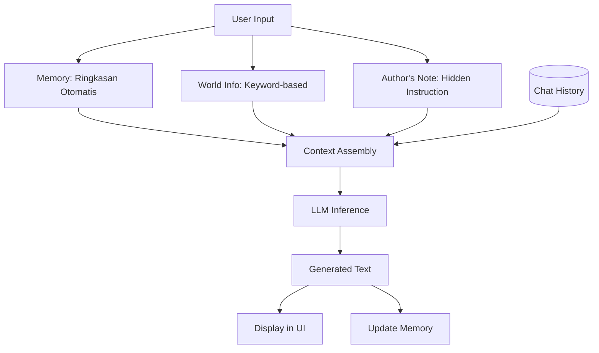
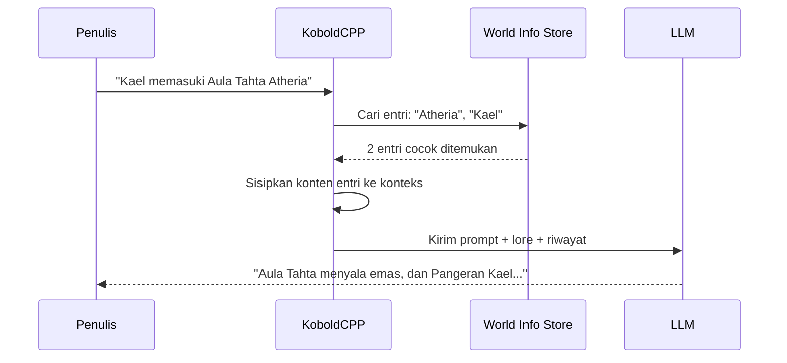
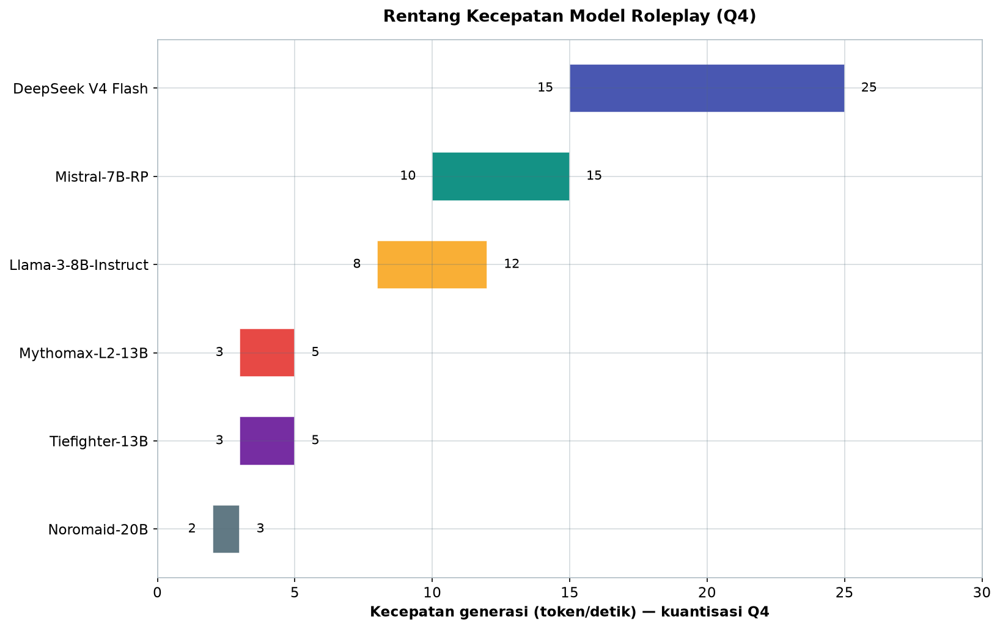
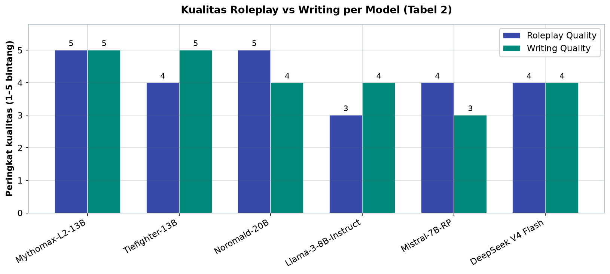

# Bab 3.6: KoboldCPP

> Bayangkan menulis novel fantasi dan AI bukan sekadar melanjutkan kalimat Anda, tetapi *tinggal di dalam dunia cerita*: mengingat bahwa Atheria adalah kerajaan di Lembah Emas, tahu bahwa Pangeran Kael takut api, dan mengeksekusi twist plot yang Anda sematkan diam-diam melalui Author's Note. Itulah KoboldCPP — mesin tulis yang dirancang khusus untuk *creative writing* dan *roleplay* lokal, bukan sekadar *chatbot* generik.

---

## 1. Tujuan Sub-Bab


Setelah membaca sub-bab ini, Anda akan mampu:

- Menginstal dan menjalankan KoboldCPP untuk *creative writing* dari *source* maupun *release binary*
- Menggunakan fitur spesifik KoboldCPP: **Memory**, **Author's Note**, **World Info**, *Context Shifting*, dan *Quick Continue*
- Menyusun *character card* dan *World Info* entry untuk *worldbuilding* yang konsisten
- Mengoptimalkan parameter *sampling* untuk *roleplay* dan narasi panjang
- Menghubungkan antarmuka KoboldAI Lite dari perangkat lain ke backend KoboldCPP

---

## 2. Filosofi KoboldCPP: Mesin yang Dibangun untuk Bercerita


### Pewaris KoboldAI

Sebagian besar *frontend* LLM lahir dari kebutuhan *chat*: jawab pertanyaan, bantu coding. KoboldCPP lahir dari kebutuhan yang berbeda — **narasi interaktif**. Ia adalah turunan dari **KoboldAI**, proyek yang dirintis komunitas untuk menulis cerita dan bermain *roleplay* dengan model bahasa. Perbedaan *genesis* ini tercermin di setiap sudut desainnya: riwayat percakapan disusun seperti bab cerita, bukan seperti log chat; memori lintas sesi dijaga; dan *lore* dunia dikelola sebagai entitas terpisah, bukan diselipkan manual ke *prompt*.

Teknisnya, KoboldCPP dibangun **di atas llama.cpp** — pustaka inferensi C++ yang efisien untuk model GGUF — dengan **UI web terintegrasi**. Jadi satu program menyediakan dua hal sekaligus: mesin inferensi dan antarmuka penulis, terhubung tanpa konfigurasi tambahan [6].

### Fokus pada Pengalaman Naratif

*Open source* dan gratis, KoboldCPP mengejar satu tujuan yang tidak dimiliki pesaingnya: **pengalaman naratif interaktif yang mulus**. Kecepatan generasi, pengelolaan konteks untuk cerita panjang, dan kebebasan memuat *model roleplay* apa pun adalah tiga pilar yang dibangun sejak awal. Bagi penulis atau *roleplayer*, KoboldCPP bukan alat tulis biasa — ia adalah *meja kerja* tempat dunia fiksi dibangun dan dijaga tetap hidup.

### Gambar 1: Alur Context Management KoboldCPP

Diagram ini menunjukkan bagaimana berbagai sumber teks disatukan menjadi konteks untuk model:



Dua aspek diagram ini penting dipahami. Pertama, *Context Assembly* adalah satu titik pertemuan semua sumber — *memory*, *world info*, *author's note*, dan riwayat chat. Susunan urutan bagian-bagian ini dalam *prompt* menentukan seberapa baik model mengikuti masing-masing. Kedua, ada *loop* kunci di kanan: output yang dihasilkan tidak hanya ditampilkan, tetapi juga **memperbarui Memory** — ringkasan otomatis yang akan dipakai sesi berikutnya. Inilah yang membuat cerita lintas sesi tetap hidup: pengetahuan tidak pernah mulai dari nol.


---

## 3. Arsitektur dan Fitur Unggulan


### Single Binary C++ yang Portabel

Salah satu keunggulan teknis KoboldCPP: **single binary C++**. Tidak ada *runtime* Python yang rumit, tidak ada rantai dependensi — satu file program yang dapat disalin ke mesin lain dan langsung berjalan. Bagi pengguna rumahan yang berpindah-pindah komputer, ini berarti *setup* yang sama sekali tidak merepotkan. *Binary* siap pakai tersedia di halaman *release* resmi, atau dapat dibangun dari *source* (lihat Langkah 1).

### UI Web Bawaan: Editor Cerita dalam Satu Tempat

Saat pertama kali membuka `http://localhost:5001`, Anda tidak disambut panel *developer* yang dingin, melainkan **editor cerita**: area menulis yang nyaman, daftar *character card* yang bisa diimpor, dan pengaturan karakter. Antarmuka ini dirancang seperti buku catatan penulis, bukan konsol. Bagi *roleplayer*, satu panel menampung semuanya — mulai dari *greeting* karakter, riwayat percakapan berbentuk bab, hingga tombol *Generate* dan *Continue* yang bisa diakses tanpa berpindah tab. Kesederhanaan ini adalah keputusan desain yang disengaja: semakin sedikit jarak antara pikiran dan teks, semakin lama *flow* menulis bertahan.

### Memory, Author's Note, dan World Info

Tiga fitur inilah yang membuat KoboldCPP "berpikir" seperti editor manusia:

**Memory** adalah *ringkasan otomatis* konteks. Saat percakapan memanjang melampaui *context window*, KoboldCPP tidak begitu saja membuang bagian tertua — ia meringkasnya menjadi beberapa kalimat inti dan menyisipkannya kembali. Cerita yang berjalan 10 ribu token tetap koheren karena "benang merah" tidak pernah hilang.

**Author's Note** adalah instruksi *diam-diam* yang disisipkan ke konteks tanpa pernah muncul di *output*: pengaturan *tone* ("jaga suasana gelap dan tegang"), *pacing*, atau batasan tema. Ini analog dengan catatan sutradara di naskah — hadir untuk mengarahkan, tidak untuk dibaca penonton.

**World Info** adalah *knowledge base* berbasis kata kunci: setiap entri memiliki *key* (misalnya "Atheria") dan *content* (deskripsi kerajaan itu). Saat kata kunci muncul dalam percakapan, *content*-nya otomatis di-*inject* ke konteks. Model tidak perlu mengingat semua *lore* — ia diberitahu tepat saat relevan. Rincian pengelolaannya di Sub-bab 6.

---

## 4. Parameter Khusus untuk Creative Writing


### Context Shifting dan Dynamic Context

Keterbatasan klasik menulis dengan LLM adalah *context window*: pada 8K token, sebagian besar cerita panjang sudah memenuhi konteks. KoboldCPP menghadapinya dengan **Context Shifting** — mekanisme yang memprioritaskan token penting saat konteks penuh: alih-alih memangkas dari depan secara buta, ia menjaga bagian-bagian yang sedang relevan (adegan aktif, karakter yang muncul) dan menggeser yang lama keluar. Dengan *Context Shifting*, **cerita di atas 8K token tetap bisa dilanjutkan** tanpa kehilangan momen naratif yang tengah berjalan.

**Dynamic Context** adalah lapisan kedua: saat konteks penuh, token dinilai kepentingannya dan yang kurang penting (deskripsi lama, dialog selesai) di-*prune* terlebih dahulu. Efek gabungannya: buku tidak perlu ditulis ulang dalam *chunk* kecil yang terputus — alur bercerita tetap utuh.

### Adventure Mode dan Quick Continue

Dua fitur yang paling disukai penulis dan *roleplayer*:

**Adventure Mode** mengubah cerita menjadi *gamebook*: AI menghasilkan narasi lalu menyajikan **pilihan interaktif** ("Kejar sosok misterius itu, atau selidiki bisikan di lorong?"). Pembaca memilih, narasi berlanjut sesuai pilihan — pola *Choose Your Own Adventure* (CYOA) yang membuat satu dunia melayani banyak alur berbeda.

**Quick Continue** adalah tombol "lanjutkan menulis": AI meneruskan teks dari titik terakhir *tanpa prompt baru*. Kombinasi *Quick Continue* + *generate* adalah alur kerja penulis: menulis 300 kata → *Continue* → sunting → *Continue* — tanpa pernah memutus *flow* (lihat Studi Kasus).

### Tabel 1: Fitur KoboldCPP untuk Creative Writing

Berikut fitur-fitur andalan dan manfaatnya bagi penulis:

| Fitur | Deskripsi | Manfaat untuk Penulis |
|:---|:---|:---|
| **Memory** | Ringkasan otomatis konteks | Cerita panjang tetap koheren |
| **Author's Note** | Instruksi diam-diam di konteks | Kontrol tone/style tanpa muncul di output |
| **World Info** | Lore/karakter knowledge base | Worldbuilding konsisten |
| **Context Shifting** | Prioritaskan token penting | Cerita > 8K token tetap bisa |
| **Adventure Mode** | Narasi dengan pilihan interaktif | Gamebook / CYOA |
| **Quick Continue** | Generate tanpa prompt baru | Aliran menulis tidak terputus |

Analisis: baca tabel ini dari perspektif "di mana setiap fitur menyelesaikan masalah penulis". *Memory* dan *Context Shifting* menyelesaikan masalah kuantitatif — konteks terbatas; *World Info* dan *Author's Note* menyelesaikan masalah kualitatif — konsistensi dan arah; *Quick Continue* dan *Adventure Mode* menyelesaikan masalah *workflow* — alur dan keterlibatan. Kombinasi keempatnya penting diingat: *World Info* tanpa *Context Shifting* akan macet di cerita panjang, dan *Author's Note* tanpa *Memory* akan "lupa" arah di bab berikutnya. Fitur-fitur ini dirancang untuk dipakai bersama.


---

## 5. KoboldAI Lite vs KoboldCPP


### Dua Wajah, Satu Otak

Ekosistem KoboldAI terbagi dua peran yang saling melengkapi. **KoboldCPP** adalah *backend*: *binary* lokal yang menjalankan inferensi dan membuka server HTTP dengan API. **KoboldAI Lite** adalah *frontend*: antarmuka web yang ringan, dapat dijalankan di mana saja — termasuk *browser* — dan dirancang untuk terhubung ke server KoboldCPP jarak jauh [7].

Keduanya **kompatibel penuh**: UI Lite → backend CPP. Ini berarti satu PC ber-*GPU* dapat menjalankan KoboldCPP, sementara laptop tipis atau bahkan tablet mengaksesnya lewat *browser* melalui jaringan — pola komputasi terpusat yang nyaman untuk menulis di mana saja. KoboldAI Lite juga dapat di-*host* secara mandiri (file statis), atau memakai layanan publik di `lite.koboldai.net` bila situasi mengizinkan.

Perlu dipahami pula bahwa pemisahan *frontend* dan *backend* ini adalah pola yang sama dengan Open WebUI (Bab 3.4): antarmuka berubah, mesin tidak. Bedanya, ekosistem KoboldAI menempatkan *creative writing* sebagai fungsi utama, bukan pelengkap — UI Lite hadir dengan *styling* khusus untuk narasi, bukan sekadar *chat box*.

---

## 6. Manajemen Character dan World Info


### Character Card

Karakter dalam KoboldCPP direpresentasikan sebagai **character card**: satu blok berisi **nama, deskripsi, persona, dan greeting** (kalimat pembuka karakter). KoboldCPP mengadopsi format populer **TavernAI / Pygmalion character cards** [8][9], sehingga ribuan *card* yang dibagikan komunitas dapat langsung diimpor. Satu *card* yang baik menjawab tiga pertanyaan: *siapa* karakter ini, *bagaimana ia berbicara*, dan *apa yang ia inginkan*. Karena *prompt* disusun dari *card* ini di setiap sesi, kualitas *card* menentukan kualitas *roleplay* lebih dari model itu sendiri.

### World Info Entries

Jika *character card* mengatur individu, **World Info** mengatur dunia. Setiap entri memiliki:

- **key**: satu atau lebih kata pemicu ("Atheria", "Kerajaan Atheria", "Kael", "Pangeran Kael")
- **content**: teks *lore* yang di-*inject* saat pemicu muncul
- **selective**: bendera yang menentukan apakah entri selalu aktif atau hanya saat kata kunci benar-benar muncul

Mekanisme *keyword → inject* ini seperti kamus yang hanya dibuka model saat perlu: 50 entri *World Info* tidak menghabiskan konteks sekaligus — hanya yang relevan yang muncul. Hasilnya, *worldbuilding* tetap konsisten tanpa mengorbankan *context window* untuk deskripsi yang tidak sedang dibutuhkan.

### Memory: Ringkasan Otomatis Percakapan

Saat percakapan panjang, **Memory** meringkas riwayat lama secara otomatis dan menjaganya tetap hadir di konteks. Penulis dapat mengatur frekuensi peringkasan (misalnya setiap 500 token) dan menulis *memory* manual ("Cerita berlatar dunia fantasi abad pertengahan") untuk memandu ringkasan berikutnya. Ini adalah penyelamat koherensi untuk *roleplay* jangka panjang — topik yang juga menjadi fokus riset pada *role-playing language models* jangka panjang [1].

### Gambar 2: Alur Kerja World Info Berbasis Kata Kunci

Perilaku *keyword → inject* World Info dalam satu percakapan:



*Sequence diagram* ini memperlihatkan logika *World Info* yang cerdas: KoboldCPP mencocokkan kata kunci dalam input pengguna terhadap *store* entri; entri yang cocok disisipkan ke konteks *sebelum* prompt dikirim ke LLM. Model tidak pernah diminta mengingat *lore* — ia *diberitahu* tepat saat relevan. Implikasinya: *World Info* adalah *cache* pengetahuan yang hemat konteks dan bekerja tanpa campur tangan penulis di tengah cerita.

---


---

## 7. Ekosistem Model untuk Roleplay


### Model yang Dilahirkan untuk Bercerita

Model *instruct* generik dilatih untuk menjawab instruksi — berguna, tetapi terasa datar untuk *roleplay*. Komunitas KoboldAI/Pygmalion menjawabnya dengan **model yang di-*fine-tune* khusus** untuk narasi dan percakapan karakter [9]. Kelompok pertama: **model roleplay** — **Mythomax**, **Tiefighter**, **Noromaid** — yang *natural* dan *immersive* dalam percakapan karakter. Kelompok kedua: **model creative writing** — **Luna**, **Wyvern**, **Stheno** — yang unggul dalam prosa naratif, deskripsi, dan *pacing*.

Mengapa model spesifik lebih baik daripada model generik? Karena pelatihan tambahan pada data *roleplay* menggeser distribusi output: dialog terdengar seperti manusia bercakap, bukan seperti model menjawab soal; deskripsi berlapis, bukan ringkasan. *Benchmark* terbaru mengonfirmasi korelasi ini — perbaikan pada *creative writing* ikut meningkatkan kualitas *roleplay* [4].

### Panduan Praktis Memilih

Panduan pemilihan model: mulai dari **Mythomax-L2-13B** (Q4) — *sweet spot* kualitas/kinerja untuk GPU 24 GB; naik ke **Noromaid-20B** untuk karakter yang lebih dalam bila VRAM 48 GB tersedia; turun ke **Mistral-7B-RP** untuk kecepatan tertinggi di GPU kecil; dan jangan abaikan **DeepSeek V4 Flash** — arsitektur *MoE* (284B total, 13B aktif) menawarkan kualitas tinggi dengan kecepatan 15-25 t/s berkat efisiensi *Mixture-of-Experts*.

### Tabel 2: Perbandingan Model Roleplay-Specific

Peta lanskap model untuk *roleplay*, dengan estimasi kecepatan pada kuantisasi Q4:

| Model | Ukuran | Roleplay Quality | Writing Quality | Kecepatan (7B, Q4) |
|:---|:---:|:---:|:---:|:---:|
| **Mythomax-L2-13B** | 13B | ***** | ***** | 3-5 t/s (GPU 24GB) |
| **Tiefighter-13B** | 13B | **** | ***** | 3-5 t/s |
| **Noromaid-20B** | 20B | ***** | **** | 2-3 t/s (GPU 48GB) |
| **Llama 3 (8B)** | 8B | *** | **** | 8-12 t/s |
| **Mistral-7B-RP** | 7B | **** | *** | 10-15 t/s |
| **DeepSeek V4 Flash** | 284B/13B aktif | **** | **** | 15-25 t/s (MoE efisien) |



*Gambar 3.6-1 — Rentang kecepatan model roleplay (Q4). DeepSeek V4 Flash paling cepat berkat arsitektur MoE, sementara Noromaid-20B paling lambat karena ukurannya yang besar.*



*Gambar 3.6-2 — Peringkat kualitas roleplay vs writing. Mythomax-L2-13B adalah satu-satunya yang unggul di keduanya, menjadikannya *sweet spot* kualitas/kinerja.*

Analisis: pola yang terlihat jelas adalah *trade-off* kualitas versus kecepatan. Mythomax-L2-13B adalah *all-rounder* yang tepat — kualitas *roleplay* dan *writing* sama-sama bintang lima, dan 3–5 t/s masih nyaman untuk membaca *output* sambil menyunting. Noromaid-20B unggul dalam *roleplay* tetapi menuntut 48 GB VRAM — investasi yang hanya masuk akal bagi *power user*. Di ujung lain, Mistral-7B-RP dan DeepSeek V4 Flash menawarkan kecepatan tinggi — penting untuk *roleplay* *real-time* yang responsif — dengan kompromi kualitas. Catatan menarik: DeepSeek V4 Flash, meski bukan model *roleplay*-spesifik, unggul dalam kecepatan berkat *MoE*; untuk pengalaman terbaik, gunakan *preset* parameter *roleplay* (Tabel 3) sebagai kompensasi.


### Tabel 3: Parameter Optimal untuk Roleplay

*Preset* parameter yang direkomendasikan untuk tiga skenario:

| Parameter | Default | Roleplay | Creative Writing | Chat |
|:---|:---:|:---:|:---:|:---:|
| **Temperature** | 0.7 | 0.95 | 0.9 | 0.8 |
| **Top-P** | 0.9 | 0.95 | 0.95 | 0.9 |
| **Top-K** | 40 | 60 | 50 | 40 |
| **Repetition Penalty** | 1.0 | 1.15 | 1.1 | 1.05 |
| **Min-P** | 0.05 | 0.1 | 0.1 | 0.05 |
| **Context Size** | 2048 | 4096 | 8192 | 2048 |

Analisis: tiga skenario ini membentuk spektrum dari paling ketat ke paling longgar — *Chat* paling dekat dengan *default* (variasi kecil), *Creative Writing* melonggarkan sedikit, dan *Roleplay* paling bebas (T=0,95, Top-P 0,95, Min-P 0,1, Repetition Penalty 1,15). Dua hal patut diperhatikan. Pertama, *Context Size* yang berbeda mencerminkan kebutuhan berbeda: *roleplay* butuh riwayat percakapan (4096), *creative writing* butuh ruang narasi (8192). Kedua, *Repetition Penalty* naik bersama kreativitas — pada T tinggi, model cenderung mengulang frase; *penalty* 1,15 mencegah itu tanpa membuat kalimat kaku [2]. Min-P di sini mengikuti rekomendasi paper-nya: nilai 0,1 adalah titik awal terbaik untuk tugas kreatif [5].

---


---

## 8. Praktikum / Hands-On


### Langkah 1: Setup KoboldCPP dan Mulai Menulis

Langkah pertama, dapatkan KoboldCPP dan jalankan dengan model GGUF:

```bash
# 1. Download KoboldCPP
# Kunjungi https://github.com/LostRuins/koboldcpp/releases
# atau build dari source:

git clone https://github.com/LostRuins/koboldcpp
cd koboldcpp
make -j 4

# 2. Jalankan dengan model GGUF
python koboldcpp.py ../model.gguf --threads 8 \
  --contextsize 4096 \
  --blasbatchsize 1024 \
  --gpulayers 30

# 3. Buka http://localhost:5001
# UI KoboldCPP akan terbuka

# 4. Setting parameter writing:
# Temperature: 0.9
# Top-P: 0.95
# Repetition Penalty: 1.12
# Memory: "Cerita berlatar dunia fantasi abad pertengahan"

# 5. Mulai prompt:
# "Di istana kerajaan Atheria, seorang pangeran muda..."
# Klik "Generate" atau "Continue"
```

Empat opsi baris perintah patut diperhatikan. `--threads 8` mengatur jumlah *thread* CPU untuk pembacaan token; `--contextsize 4096` menetapkan *context window* — jangan melebihi batas model; `--blasbatchsize 1024` mengatur ukuran *batch* komputasi *BLAS*; dan `--gpulayers 30` memindahkan 30 lapisan pertama model ke GPU — *offload* yang menentukan kecepatan. Jika GPU Anda lebih kecil, turunkan `--gpulayers`; model tetap berjalan, hanya lebih lambat.

### Langkah 2: Setup World Info untuk Worldbuilding

Sekarang bangun *World Info* untuk dunia Atheria — dua entri pertama:

```json
{
  "name": "Kerajaan Atheria",
  "entries": [
    {
      "key": ["Atheria", "Kerajaan Atheria"],
      "content": "Kerajaan Atheria adalah kerajaan makmur di Lembah Emas. \
Dipimpin oleh Raja Aldric yang bijaksana. Ibukota: Atherion.\
Bahasa resmi: Atherian. Mata uang: Gold Crown.",
      "selective": true
    },
    {
      "key": ["Pangeran Kael", "Kael"],
      "content": "Pangeran Kael adalah putra mahkota Atheria, \
berusia 24 tahun. Memiliki kemampuan sihir unsur api. \
Sifat: pemberani tapi impulsif. Rambut merah, mata emas.",
      "selective": true
    }
  ]
}
```

```bash
# Di UI KoboldCPP: World Info tab
# Import JSON → entries akan aktif
# Saat kata "Atheria" muncul di chat, World Info akan otomatis disuntikkan
```

Perhatikan struktur entri: `key` menerima **daftar pemicu** — "Pangeran Kael" dan "Kael" sama-sama memicu entri yang sama — sementara `content` adalah teks *lore* yang lengkap namun ringkas. `selective: true` berarti entri hanya aktif ketika pemicu muncul (bukan selalu di konteks). Trik praktis: sebutkan pemicu yang umum muncul di dialog karakter agar *lore* sering *terinject* secara natural; dan jangan menulis `content` yang lebih panjang dari 2–3 kalimat, agar tidak memboroskan *context window*.

### Langkah 3: Remote KoboldAI Lite ke KoboldCPP

Manfaatkan server PC desktop Anda dari perangkat lain:

```bash
# Di PC/server:
python koboldcpp.py model.gguf --host 0.0.0.0 --port 5001

# Di laptop/client:
# Buka https://lite.koboldai.net/
# Settings → API → KoboldCPP → http://server-ip:5001

# Atau self-host KoboldAI Lite:
git clone https://github.com/LostRuins/koboldai-lite
cd koboldai-lite
python -m http.server 8000
# Buka http://localhost:8000, sambungkan ke KoboldCPP server
```

Satu peringatan keamanan: `--host 0.0.0.0` membuat server dapat diakses dari *semua* perangkat di jaringan — praktis untuk rumah, tetapi jangan membuka port 5001 ke internet publik tanpa autentikasi, karena siapa pun yang terhubung dapat memakai GPU Anda. Untuk jaringan *broadband* rumah, batasi akses lewat *firewall* atau *reverse proxy*.

---

## 9. Studi Kasus: Novel Interaktif dengan World Info


**Skenario.** Seorang penulis ingin menulis novel fantasi epik dengan AI sebagai *co-writer*. Target: bab-bab yang koheren dengan *worldbuilding* yang konsisten, tanpa harus menulis ulang deskripsi dunia setiap bab. Penulis memilih KoboldCPP + **Mythomax-L2-13B Q4_K_M** — kombinasi kualitas *roleplay*/*writing* bintang lima dengan kebutuhan VRAM yang masuk akal (24 GB) [8][9].

**World Info Setup.** Penulis membangun **50 entri World Info**: 12 karakter, 20 lokasi, 10 benda ajaib, dan 8 organisasi. Setiap entri ditulis ringkas (2–3 kalimat) dengan pemicu ganda — nama lengkap dan nama panggilan. *Memory System* diatur untuk **meringkas otomatis setiap 500 token**, sehingga percakapan lintas bab tetap terikat pada *plot* utama.

**Parameter.** T=0,9, Min-P=0,1, Repetition Penalty=1,12, *Context* = 8192 — mengikuti *preset* *creative writing* (Tabel 3) dengan *penalty* sedikit dinaikkan untuk teks narasi panjang [5].

**Workflow.** Menulis 300 kata → AI *generate* 500 kata → sunting → *Continue* — siklus yang berulang sepanjang hari. *Author's Note* memegang arahan diam-diam ("pertahankan sudut pandang orang ketiga terbatas pada Kael") yang tidak pernah bocor ke teks.

**Hasil.** Produktivitas **3.000 kata per hari** dengan koherensi *plot* yang baik — karakter yang disebut di bab 2 tetap konsisten di bab 10 berkat *World Info*, dan memori mencegah kontradiksi fakta. *Quick Continue* menghilangkan jeda berpikir antar segmen.

**Kendala dan pelajaran.** *Context* 8192 token masih terbatas untuk novel *full chapter* — saat konteks penuh, bab yang panjang membutuhkan **summarization manual** di Memory agar ringkasan mesin tidak kehilangan nuansa penting. Pelajaran berharga: *World Info* tidak menggantikan disiplin penulis; ia hanya menggantikan kerja ingatan. Plot, motivasi, dan *pacing* tetap harus dikendalikan manusia — AI adalah *co-writer* yang luar biasa selama arah cerita tetap di tangan penulis.

---

## 10. Referensi


### Paper Jurnal/Konferensi

[1] Wang, Z. M., et al. (2024). *RoleLLM: Benchmarking, Eliciting, and Enhancing Role-Playing Abilities of Large Language Models*. Proceedings of ACL Findings. DOI: [10.18653/v1/2024.findings-acl.878](https://aclanthology.org/2024.findings-acl.878/)
- *Framework* benchmark dan *enhancement* kemampuan *role-playing* LLM — dasar Sub-bab 7.

[2] Chen, J., et al. (2024). *HOLLMWOOD: Unleashing the Creativity of Large Language Models in Screenwriting via Role Playing*. Proceedings of EMNLP Findings. DOI: [10.18653/v1/2024.findings-emnlp.474](https://aclanthology.org/2024.findings-emnlp.474/)
- *Framework* multi-role (Writer, Editor, Actor) untuk *screenwriting* — relevan dengan fasilitasi *creative writing* pada Sub-bab 3-4.

[3] Luo, Z., et al. (2024). *Capturing Minds, Not Just Words: Enhancing Role-Playing Language Models with Personality-Indicative Data*. Proceedings of EMNLP Findings. DOI: [10.18653/v1/2024.findings-emnlp.853](https://aclanthology.org/2024.findings-emnlp.853/)
- Dataset ROLEPERSONALITY untuk *fidelity* karakter — dasar Sub-bab 6 (*World Info* dan *Character Cards*).

[4] Paul, D., et al. (2024). *PingPong: A Benchmark for Role-Playing Language Models with User Emulation and Multi-Model Evaluation*. arXiv preprint arXiv:2409.06820. DOI: [10.48550/arXiv.2409.06820](https://arxiv.org/abs/2409.06820)
- Benchmark *role-playing* dengan korelasi *creative writing* — mendukung Sub-bab 7.

[5] Nguyen, N. M., et al. (2025). *Turning Up the Heat: Min-p Sampling for Creative and Coherent LLM Outputs*. International Conference on Learning Representations (ICLR). DOI: [10.48550/arXiv.2407.01082](https://arxiv.org/abs/2407.01082)
- Min-P *sampling* untuk *temperature* tinggi — dasar nilai parameter Tabel 3 dan Studi Kasus.

### Referensi Pendukung (Dokumentasi/Repository)

[6] KoboldCPP. *GitHub Repository*. [https://github.com/LostRuins/koboldcpp](https://github.com/LostRuins/koboldcpp)

[7] KoboldAI Lite. *GitHub Repository*. [https://github.com/LostRuins/koboldai-lite](https://github.com/LostRuins/koboldai-lite)

[8] TavernAI Character Card Specification. [https://github.com/TavernAI/TavernAI](https://github.com/TavernAI/TavernAI)

[9] Pygmalion Roleplay Models. [https://huggingface.co/PygmalionAI](https://huggingface.co/PygmalionAI)
