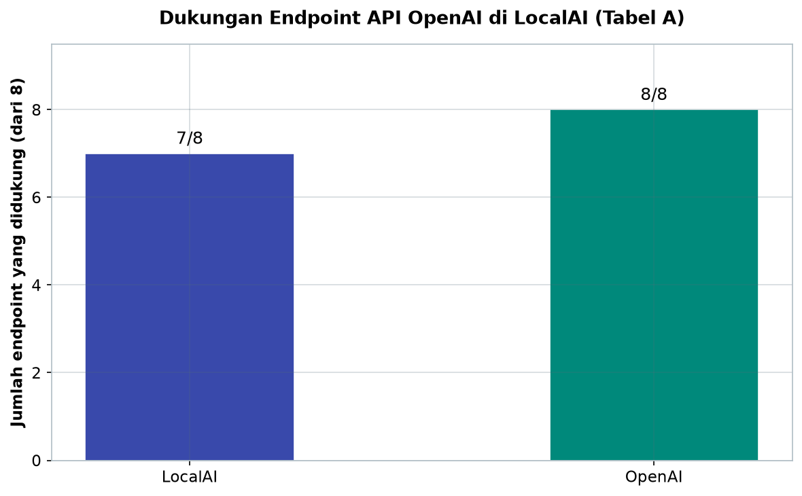
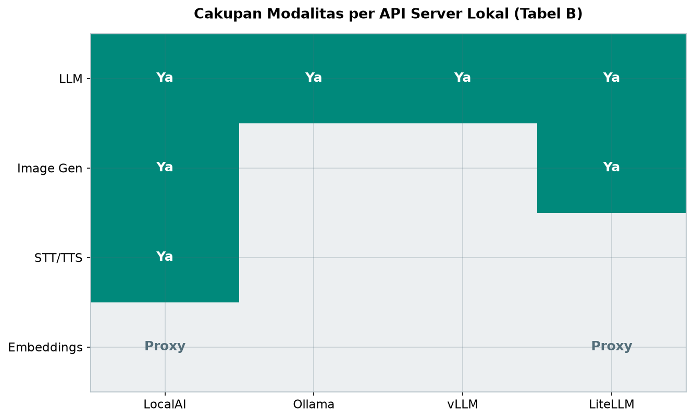
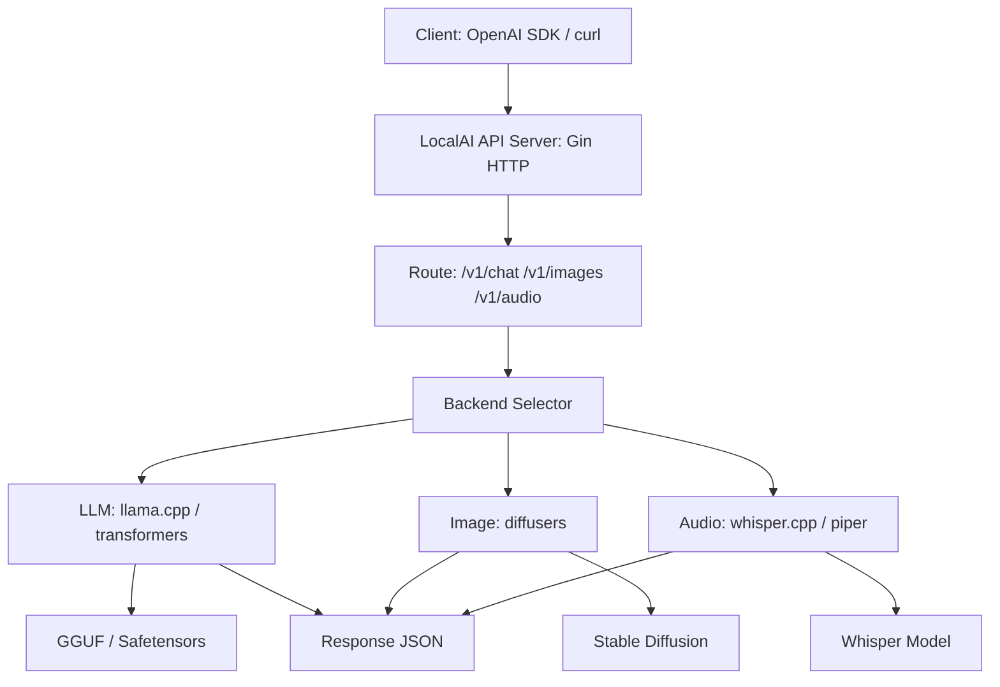
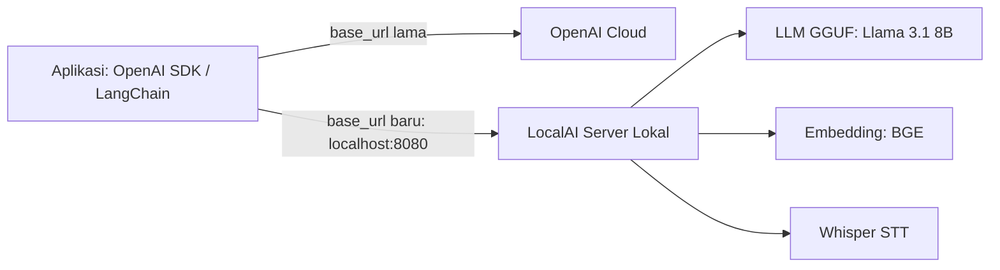

# Bab 3.7: LocalAI

> Bayangkan Anda bisa mengganti server OpenAI dengan sebuah aplikasi yang berjalan di komputer sendiri — tanpa mengubah satu baris kode pun pada aplikasi yang sudah ada. Itulah janji LocalAI: sebuah server API lokal yang 100% kompatibel dengan OpenAI API, siap dipasang di PC, Mini PC, hingga server rumah. Sub-bab ini mengajak Anda menyelami filosofi, arsitektur backend modular, konfigurasi model, hingga proses migrasi nyata dari cloud ke lokal.

---

## 1. Tujuan Sub-Bab


Setelah membaca sub-bab ini, Anda akan mampu:

- Mendeploy LocalAI dengan Docker dan mengganti endpoint API dari OpenAI ke server lokal
- Mengonfigurasi model LLM, embedding, image generation, dan TTS melalui file YAML per model
- Menjelaskan arsitektur backend modular LocalAI (llama.cpp, transformers, diffusers, whisper.cpp)
- Membangun pipeline RAG dengan LangChain dan LocalAI sebagai penyedia embedding
- Menggunakan satu server untuk berbagai modalitas: teks, gambar, suara, dan transkripsi
- Membandingkan LocalAI dengan Ollama, vLLM, dan LiteLLM sebagai API server lokal
- Menilai trade-off biaya, privasi, dan kualitas saat memigrasi beban kerja dari OpenAI ke lokal

---

## 2. Filosofi LocalAI


### Drop-in Replacement untuk OpenAI API

LocalAI lahir dari sebuah pertanyaan sederhana: apa yang terjadi jika seluruh permintaan yang biasanya dikirim ke `api.openai.com` dialihkan ke komputer kita sendiri? Jawabannya adalah sebuah server yang meniru kontrak API OpenAI secara persis — mulai dari `base_url`, format permintaan, hingga struktur respons JSON. Konsep ini dikenal sebagai **drop-in replacement**: aplikasi yang sudah menulis kode terhadap OpenAI SDK tidak perlu diubah sama sekali. Cukup arahkan `base_url` ke `http://localhost:8080/v1`, dan aplikasi itu kini "berbicara" dengan model lokal.

Kelebihan pendekatan ini tidak perlu diperdebatkan: *vendor lock-in* hilang, biaya per token menjadi biaya listrik, dan data tidak lagi meninggalkan lingkungan Anda. Filosofi ini sejalan dengan riset tentang deployment *on-premises* — Li et al. (2024) [1] menunjukkan bahwa jalur "tengah" antara model tertutup dan model terbuka penuh — yaitu menjalankan model di infrastruktur sendiri — menjadi solusi praktis bagi organisasi yang tidak bisa melepas privasi ke cloud.

### Satu Server untuk Semua Modalitas

Yang membedakan LocalAI dari kebanyakan pesaingnya adalah cakupan modalitasnya. Satu proses server yang sama menangani **LLM** (*chat completion*), **image generation** (Stable Diffusion), **speech-to-text** (Whisper), **TTS** (Piper/Bark), dan **embeddings**. Ini seperti memiliki satu dapur pusat yang melayani banyak meja restoran: koki yang berbeda (backend) tetapi dapur (server) dan jam buka (endpoint) yang sama.

Dari sisi perangkat keras, LocalAI bersikap **CPU-first**: server ini dirancang untuk berjalan tanpa GPU sama sekali, dengan dukungan akselerasi GPU sebagai opsi. Artinya, sebuah Mini PC biasa pun bisa menjadi "server AI" keluarga atau kantor kecil — sangat kontras dengan framework seperti vLLM yang menuntut CUDA.

### Tabel 1: Fitur API OpenAI yang Didukung LocalAI

Tabel berikut memetakan endpoint inti OpenAI dengan dukungannya di LocalAI — perhatikan bahwa hampir semua endpoint penting telah terpenuhi.

| Endpoint | LocalAI | OpenAI | Catatan |
|:---|:---:|:---:|:---|
| `/v1/chat/completions` | Ya | Ya | Streaming, function calling |
| `/v1/completions` | Ya | Ya | Legacy completions |
| `/v1/embeddings` | Ya | Ya | Multiple backend |
| `/v1/models` | Ya | Ya | List loaded models |
| `/v1/images/generations` | Ya | Ya | Stable Diffusion |
| `/v1/audio/transcriptions` | Ya | Ya | Whisper |
| `/v1/audio/speech` | Ya | Ya | Piper/Bark TTS |
| `/v1/moderations` | Tidak | Ya | Belum support |



*Gambar 3.7-1 — Dari delapan endpoint yang dibandingkan, LocalAI mendukung tujuh; satu-satunya celah adalah `/v1/moderations` yang belum support.*



*Gambar 3.7-2 — LocalAI adalah satu-satunya yang menangani empat modalitas sekaligus; vLLM hanya LLM, sementara LiteLLM berperan sebagai proxy ke berbagai API.*

Analisis: cakupan tujuh dari delapan endpoint utama berarti sebagian besar aplikasi yang dibangun di atas OpenAI SDK dapat langsung berjalan. Satu-satunya celah yang menonjol adalah `/v1/moderations` — filter moderasi konten bawaan OpenAI. Jika aplikasi Anda mengandalkan fitur ini, penggantinya harus dibangun sendiri (misalnya dengan model classifier lokal), atau moderasi dijalankan pada lapisan aplikasi. Ini adalah *trade-off* yang wajar: kontrol penuh atas data berarti tanggung jawab moderasi juga menjadi milik Anda.


### Gambar 1: Arsitektur LocalAI Multi-Model

Diagram berikut menggambarkan alur permintaan dari klien hingga respons — perhatikan bagaimana *Backend Selector* menjadi pusat percabangan menuju tiga keluarga backend.



Yang menarik dari diagram ini adalah kesimetrisannya: ketiga jalur backend berakhir pada `RESP` yang sama, sehingga klien tidak pernah peduli modalitas apa yang sedang diproses — kontrak JSON-nya seragam. Inilah esensi desain *gateway*: satu pintu masuk, banyak dapur, satu bahasa respons.


---

## 3. Arsitektur Backend Modular


### Backend sebagai "Koki Spesialis"

Arsitektur LocalAI berbasis pada konsep **backend modular**: setiap jenis model ditangani oleh pustaka inference yang paling unggul di bidangnya. Untuk model bahasa, LocalAI memanggil **llama.cpp** (format GGUF) atau **transformers** dari Hugging Face (format Safetensors). Untuk gambar, ia menggunakan **diffusers**. Untuk transkripsi suara, **whisper.cpp**. Masing-masing adalah "koki spesialis" yang menangani masakan tertentu — dan LocalAI bertindak sebagai manajer dapur yang mengarahkan pesanan ke koki yang tepat.

Konsekuensi dari desain ini sangat praktis: Anda tidak perlu memilih satu *engine* untuk semua keperluan. Model Llama 3.1 untuk percakapan harian, DeepSeek V4 Flash untuk tugas penalaran berat, BGE untuk embeddings, dan Whisper untuk transkrip rapat — semuanya hidup berdampingan dalam satu server.

### Alur Permintaan

Setiap permintaan mengalir melalui pipeline yang sama:

```text
HTTP Request → API Router → Backend Selector → Model Backend → Inference → Response JSON
```

*API Router* (dibangun di atas Gin HTTP) memeriksa jalur URL, *Backend Selector* menentukan backend mana yang bertanggung jawab berdasarkan konfigurasi model yang diminta, lalu hasil inference dikembalikan dalam format JSON yang identik dengan respons OpenAI. Studi tentang sistem *serving* seperti ScaleLLM [2] dan survey LLM inference serving [3] menunjukkan bahwa desain *API gateway* + *backend abstraction* semacam ini adalah pola yang paling efisien untuk melayani beragam model dengan satu titik masuk — persis yang diadopsi LocalAI.

---

## 4. Model Configuration YAML


### Satu Model, Satu File Konfigurasi

Di LocalAI, setiap model direpresentasikan oleh **satu file YAML**. File inilah yang menjadi "resep" model: menentukan backend apa yang digunakan, di mana file bobot berada, dan parameter inference apa yang aktif. Berbeda dengan Ollama yang memanfaatkan Modelfile dan *template* khusus, konfigurasi LocalAI lebih eksplisit dan terbuka terhadap parameter backend secara langsung.

Parameter penting yang dikendalikan dari YAML antara lain:

- **`context_size`** — panjang jendela konteks (misalnya 32.768 token)
- **`threads`** — jumlah thread CPU untuk inference
- **`n_gpu_layers`** — jumlah lapisan yang di-*offload* ke GPU (0 berarti CPU murni)
- **`f16`** dan **`mmap`** — presisi komputasi dan *memory mapping* file model
- **`temperature`, `top_k`, `top_p`** — parameter sampling untuk mengatur kreativitas

Kelebihan pendekatan file YAML adalah **portabilitas konfigurasi**. Sebuah resep model dapat disimpan di repositori (misalnya Model Gallery milik LocalAI), dibagikan antar tim, dan diputar ulang di mesin mana pun — mirip *Infrastructure as Code*, tetapi untuk model AI.

### Beberapa Backend untuk Satu Tipe Model

Fleksibilitas LocalAI tampak jelas dari kenyataan bahwa satu tipe model bisa punya banyak backend. Model bahasa bisa dijalankan lewat llama.cpp (cepat, ringan) atau transformers (lengkap, cocok untuk eksperimen). Embeddings bisa memakai bert.cpp (format GGUF) atau sentencetransformers (format ONNX). Pilihan backend inilah yang menentukan *trade-off* kecepatan, akurasi, dan penggunaan memori — dan semuanya bisa diatur tanpa menyentuh kode aplikasi klien.

### Tabel 2: Backend Model LocalAI

Tabel ini merangkum peta backend — jenis model, pustaka inference, dan format file yang didukung.

| Tipe Model | Backend | Format | GPU Support |
|:---|:---|:---|:---:|
| **LLM** | llama.cpp | GGUF | Ya |
| **LLM** | transformers | Safetensors | Ya |
| **LLM** | diffusers | - | Ya (image) |
| **Embeddings** | bert.cpp | GGUF | Tidak |
| **Embeddings** | sentencetransformers | ONNX | Tidak |
| **STT** | whisper.cpp | GGML | Ya |
| **TTS** | piper | ONNX | Tidak |
| **TTS** | bark | transformers | Ya |

Analisis: peta ini menjelaskan *trade-off* pemilihan backend. Backend berbasis C++ (llama.cpp, whisper.cpp, bert.cpp) unggul dalam kecepatan dan efisiensi memori — pilihan utama untuk perangkat keras terbatas. Backend berbasis Python (transformers, diffusers, sentencetransformers) lebih fleksibel dan kaya fitur, tetapi lebih berat. Perhatikan bahwa backend embeddings tidak mendukung GPU: untuk workload embedding masif, pertimbangkan beban CPU-nya. Aturan praktisnya: pakai llama.cpp untuk LLM produksi harian, transformers untuk eksperimen dan model yang belum punya konversi GGUF.

---


---

## 5. Embeddings & Pipeline RAG


### Endpoint /v1/embeddings yang Sesuai Standar

LocalAI mengekspos endpoint **`/v1/embeddings`** yang formatnya identik dengan OpenAI. Artinya, semua pustaka yang terbiasa memanggil API embedding OpenAI — LangChain, LlamaIndex, Open WebUI, hingga *vector database* — bisa langsung diarahkan ke server lokal. Dua backend yang tersedia adalah **bert.cpp** (cepat, ringan, format GGUF) dan **sentencetransformers** (lebih beragam pilihan model, format ONNX).

Fungsi ini mengubah LocalAI menjadi **embedding server mandiri**: alih-alih mengirim dokumen ke cloud untuk dilakukan embedding, dokumen sensitif (kontrak, catatan medis, data pelanggan) diproses sepenuhnya di lingkungan sendiri. Ini penting karena tahap embedding sering menjadi titik bocornya data dalam pipeline RAG — orang rajin merahasiakan prompt, tetapi lupa bahwa dokumen sumber juga dikirim ke penyedia embedding.

### Integrasi LangChain & LlamaIndex

Karena kontrak API-nya sama, integrasi dengan ekosistem *agentic* menjadi murah. LangChain menyediakan `LocalAIEmbeddings` untuk vektor dan `ChatLocalAI` untuk LLM — dua kelas yang dibuat khusus untuk server seperti ini. LlamaIndex, Open WebUI, dan tools lain yang berbasis OpenAI API juga bisa diarahkan dengan mengubah satu variabel `base_url`. Inilah keindahan standar API: kompatibilitas adalah fitur, bukan kebetulan.

---

## 6. Image, Audio, dan TTS dalam Satu Server


### Image Generation dengan Stable Diffusion

Lewat backend **diffusers**, LocalAI menyediakan endpoint **`/v1/images/generations`** — setara dengan DALL-E di OpenAI. Model Stable Diffusion dimuat dan dijalankan di mesin yang sama dengan LLM Anda. Untuk tim kecil yang butuh ilustrasi internal, ini menghilangkan langganan image generator terpisah.

### Speech-to-Text dengan Whisper

Endpoint **`/v1/audio/transcriptions`** ditangani oleh **whisper.cpp** — implementasi Whisper yang ringan dan efisien. Rapat, wawancara, atau rekaman kuliah bisa ditranskripsi tanpa data meninggalkan perangkat. Format model GGML yang digunakan whisper.cpp juga mendukung akselerasi GPU bila tersedia.

### Text-to-Speech dengan Piper & Bark

Untuk arah sebaliknya, endpoint **`/v1/audio/speech`** didukung oleh **Piper** (ringan, berjalan di CPU, format ONNX) dan **Bark** (lebih natural, berbasis transformers). Dengan satu server, Anda bisa membangun asisten suara lokal penuh: dengar pertanyaan (Whisper), proses (LLM), lalu jawab dengan suara (Piper/Bark). Ekosistem *voice assistant* rumahan yang dibahas di jilid ini menjadi mungkin tanpa satu pun layanan cloud.

### Tabel 3: Perbandingan API Server Lokal

Untuk memposisikan LocalAI, berikut perbandingannya dengan tiga pesaing utama di kelas yang sama.

| Fitur | LocalAI | Ollama | vLLM | LiteLLM |
|:---|:---|:---|:---|:---|
| **Drop-in OpenAI** | **100%** | Sebagian | 95% | Proxy ke berbagai API |
| **LLM** | Ya | Ya | Ya | Proxy |
| **Image Gen** | Ya | Tidak | Tidak | Tidak |
| **STT/TTS** | Ya | Tidak | Tidak | Tidak |
| **Embeddings** | Ya | Ya | Tidak | Proxy |
| **GPU Support** | CUDA, Metal | CUDA, Metal, ROCm | CUDA | - |
| **CPU-Only** | Ya (optimized) | Ya | Tidak | - |
| **Multi-Model** | Ya (YAML) | Ya (CLI) | Ya | Ya |

Analisis: tabel ini menunjukkan pembagian peran yang jelas. **LocalAI** adalah *generalist* paling lengkap — satu-satunya yang menangani image gen, STT, dan TTS — sehingga ideal untuk server rumah atau kantor kecil yang ingin mengganti banyak layanan cloud sekaligus. **Ollama** unggul dalam kemudahan penggunaan (*model management* via CLI) tetapi kompatibilitas OpenAI-nya parsial. **vLLM** adalah pilihan *production-scale* untuk beban GPU berat dengan throughput tinggi, tetapi tidak CPU-only dan tidak punya modalitas lain. **LiteLLM** berbeda total: ia bukan *engine* inference melainkan *proxy* yang meneruskan permintaan ke berbagai provider. Untuk migrasi *local-first*, LocalAI menang; untuk *enterprise serving*, vLLM menang; untuk *multi-provider routing*, LiteLLM menang.


---

## 7. Performa, Loading, dan Scaling


### Lazy Loading dan Keep-Alive

LocalAI menerapkan **lazy loading**: model tidak dimuat saat server dinyalakan, melainkan saat pertama kali dipanggil. Ini mirip *panggilan on-demand* — server bisa menampung puluhan konfigurasi model di disk, tetapi hanya model yang benar-benar digunakan yang masuk ke RAM. Opsi **keep-alive** mempertahankan model yang sudah dimuat agar permintaan berikutnya tidak perlu memuat ulang.

### Caching dan Autoload

**Prompt caching** menyimpan hasil komputasi untuk bagian prompt yang berulang, sementara **image result caching** menghindari regenerasi gambar identik. Mekanisme ini selaras dengan temuan ServerlessLLM [4] yang menunjukkan bahwa manajemen *checkpoint* berlapis (disk → memori → VRAM) mampu memangkas waktu muat model secara drastis — dan survei taksonomi sistem serving oleh Miao et al. (2025) [5] menegaskan bahwa *request scheduling* dan *memory management* adalah dua tuas performa utama sistem inference.

### Akselerasi GPU

Ketika GPU tersedia, LocalAI memanfaatkannya lewat **CUDA** (NVIDIA), **Metal** (Apple Silicon), atau **OpenCL** (berbagai vendor). Kombinasi *CPU-first* dengan opsi akselerasi membuatnya luwes: server bisa mulai di mesin tanpa GPU, lalu ditingkatkan tanpa mengubah konfigurasi API sama sekali.

### Gambar 2: Jalur Migrasi dari OpenAI ke LocalAI

Migrasi tidak perlu dilakukan sekaligus. Diagram berikut menunjukkan jalur bertahap yang paling aman.



Perubahan satu baris pada `base_url` adalah satu-satunya langkah wajib; sisanya — pemilihan model, konfigurasi YAML, penyesuaian parameter — bisa dilakukan sambil jalan. Strategi *staged migration* ini memungkinkan tim mengukur kualitas model lokal dengan beban produksi asli sebelum memutuskan mematikan langganan cloud sepenuhnya.

---


---

## 8. Praktikum / Hands-On


### Langkah 1: Deploy LocalAI dengan Docker

Langkah pertama adalah menjalankan server. Docker membuat proses ini konsisten di semua sistem operasi.

```bash
# 1. Deploy LocalAI (versi CPU)
docker run -d \
  --name localai \
  -p 8080:8080 \
  -v localai-models:/models \
  -v localai-config:/config \
  localai/localai:latest-cpu

# Dengan GPU NVIDIA:
docker run -d \
  --name localai \
  --gpus all \
  -p 8080:8080 \
  -v localai-models:/models \
  -v localai-config:/config \
  localai/localai:latest-gpu-nvidia

# 2. Download model via LocalAI API (Model Gallery)
curl http://localhost:8080/models/apply \
  -d '{
    "url": "github:go-skynet/model-gallery/llama-3.1-8b-instruct.yaml"
  }'

# 3. Download DeepSeek V4 Flash
curl http://localhost:8080/models/apply \
  -d '{
    "url": "github:go-skynet/model-gallery/deepseek-v4-flash.yaml"
  }'

# 4. Test chat completion (OpenAI-compatible)
curl http://localhost:8080/v1/chat/completions \
  -H "Content-Type: application/json" \
  -d '{
    "model": "deepseek-v4-flash",
    "messages": [
      {"role": "user", "content": "Halo, siapa kamu?"}
    ],
    "temperature": 0.5,
    "stream": true
  }'
```

Volume `localai-models` menyimpan file bobot dan YAML, sedangkan `localai-config` menyimpan konfigurasi server. Keduanya harus dipertahankan agar model tidak perlu diunduh ulang setiap kali kontainer dibuat ulang.

### Langkah 2: Konfigurasi Model YAML Manual

Jika model favorit Anda belum ada di Model Gallery, buat konfigurasinya sendiri. Simpan file YAML di direktori models, dan server akan mengenalinya sebagai model baru.

```yaml
# models/llama3.yaml
name: deepseek-v4-flash
backend: llama.cpp
parameters:
  model: /models/deepseek-v4-flash-q4_k_m.gguf
  context_size: 32768
  threads: 8
  f16: true
  mmap: true
  # GPU offload
  n_gpu_layers: 60
  # MoE tuning — optimal untuk sparse inference
  temperature: 0.5
  top_k: 40
  top_p: 0.9
```

Setelah konfigurasi tersimpan, uji dari Python menggunakan OpenAI SDK standar:

```python
import openai

client = openai.OpenAI(
    base_url="http://localhost:8080/v1",
    api_key="not-needed"  # LocalAI tidak perlu API key
)

response = client.chat.completions.create(
    model="llama-3.1-8b-instruct",
    messages=[{"role": "user", "content": "Siapa presiden Indonesia?"}],
    stream=True
)

for chunk in response:
    print(chunk.choices[0].delta.content or "", end="")
```

Perhatikan bahwa kode di atas sama persis dengan kode yang biasa digunakan untuk OpenAI — satu-satunya perbedaan adalah `base_url` dan nilai *placeholder* untuk `api_key`.

### Langkah 3: Setup RAG dengan LangChain + LocalAI

LocalAI bisa menjadi tulang punggung pipeline RAG: embedding, vector store, dan LLM semuanya berjalan lokal.

```python
from langchain_community.embeddings import LocalAIEmbeddings
from langchain_community.vectorstores import Chroma

# Embedding via LocalAI
embeddings = LocalAIEmbeddings(
    model="text-embedding-ada-002",  # atau model lokal
    openai_api_base="http://localhost:8080/v1"
)

# Vector store
vectorstore = Chroma.from_documents(
    documents=splits,
    embedding=embeddings
)

# LLM via LocalAI
from langchain_community.chat_models import ChatLocalAI

llm = ChatLocalAI(
    model="llama-3.1-8b-instruct",
    base_url="http://localhost:8080/v1"
)

# RAG chain siap digunakan!
```

Dengan pipeline ini, seluruh siklus hidup dokumen — *chunking*, embedding, retrieval, generasi jawaban — tidak pernah menyentuh internet. Kombinasi LocalAI + Chroma + Llama 3.1 8B adalah contoh paling murah untuk membangun *knowledge base* pribadi yang benar-benar privat.

---

## 9. Studi Kasus: Migrasi Startup dari OpenAI ke LocalAI


**Skenario:** Sebuah startup kecil dengan lima developer selama ini memakai OpenAI API dengan tagihan sekitar **$200 per bulan** — biaya yang membengkak seiring pertumbuhan penggunaan. Tantangannya bukan teknis, melainkan strategis: bagaimana menghemat biaya tanpa menulis ulang aplikasi dan tanpa mengorbankan privasi data pelanggan.

**Solusi:** Tim memutuskan mendeploy LocalAI di sebuah **Mini PC** — prosesor Ryzen 9, 64 GB RAM, dan satu RTX 4060. Perangkat ini cukup untuk menjalankan tiga beban kerja utama sekaligus: **Llama 3.1 8B** untuk chat, **BGE** untuk embeddings dokumen, dan **Whisper** untuk transkripsi — semuanya dalam satu server, persis seperti skenario "satu dapur untuk semua meja".

**Proses migrasi:** Langkah paling penting ternyata yang paling sepele: mengganti `base_url` dari `api.openai.com` ke `localhost:8080`. Karena LocalAI 100% kompatibel, tidak ada satu pun perubahan pada kode aplikasi. Setelah itu tim menghabiskan beberapa minggu menyetel parameter — `temperature`, `top_k`, `top_p` — agar kualitas output model lokal mendekati standar yang biasa didapat dari cloud.

**Hasil:** Tagihan API bulanan turun dari **$200 menjadi $0**. Latensi rata-rata tetap setara (sekitar 2 detik per respons), dan yang lebih berharga: seluruh data pelanggan kini diproses di perangkat sendiri — tidak ada lagi pertanyaan "di mana data kami diproses?" yang harus dijawab. **Kendala** yang tersisa: kualitas output model 8B memang sedikit berbeda dari model cloud besar — untuk beberapa tugas, tim menambahkan *fine-tuning* ringan agar gaya jawaban konsisten.

**Pelajaran:** Migrasi ke LocalAI bukan keputusan biner "semua atau tidak sama sekali". Karena kompatibilitasnya total, startup bisa menjalankan dua jalur paralel — lokal untuk beban harian, cloud sebagai *fallback* untuk tugas yang butuh model terbesar. LocalAI terbukti menjadi pilihan ekonomis untuk startup yang menginginkan strategi *local-first* tanpa mengorbankan kemampuan berpindah kapan saja.

---

## 10. Referensi


### Paper Jurnal/Konferensi

[1] Li, X., et al. (2024). *A Middle Path for On-Premises LLM Deployment: Preserving Privacy Without Sacrificing Model Confidentiality*. arXiv:2410.11182. DOI: [10.48550/arXiv.2410.11182](https://arxiv.org/abs/2410.11182)

[2] Wang, L., et al. (2024). *ScaleLLM: A Resource-Frugal LLM Serving Framework by Optimizing End-to-End Efficiency*. Proceedings of EMNLP Industry Track. DOI: [10.18653/v1/2024.emnlp-industry.22](https://aclanthology.org/2024.emnlp-industry.22/)

[3] Zhang, H., et al. (2024). *LLM Inference Serving: Survey of Recent Advances and Opportunities*. arXiv:2407.12391. DOI: [10.48550/arXiv.2407.12391](https://arxiv.org/abs/2407.12391)

[4] Fu, Y., et al. (2024). *ServerlessLLM: Low-Latency Serverless Inference for Large Language Models*. USENIX OSDI 2024. [https://www.usenix.org/system/files/osdi24-fu.pdf](https://www.usenix.org/system/files/osdi24-fu.pdf)

[5] Miao, X., et al. (2025). *Towards Efficient Generative Large Language Model Serving: A Survey from Algorithms to Systems*. ACM Computing Surveys. DOI: [10.1145/3754448](https://dl.acm.org/doi/10.1145/3754448)

### Referensi Pendukung (Dokumentasi/Repository)

[6] LocalAI. *GitHub Repository*. [https://github.com/mudler/LocalAI](https://github.com/mudler/LocalAI)

[7] LocalAI Documentation. [https://localai.io](https://localai.io)

[8] LocalAI Model Gallery. [https://github.com/mudler/LocalAI/tree/master/models](https://github.com/mudler/LocalAI/tree/master/models)

[9] OpenAI API Reference. [https://platform.openai.com/docs/api-reference](https://platform.openai.com/docs/api-reference)
