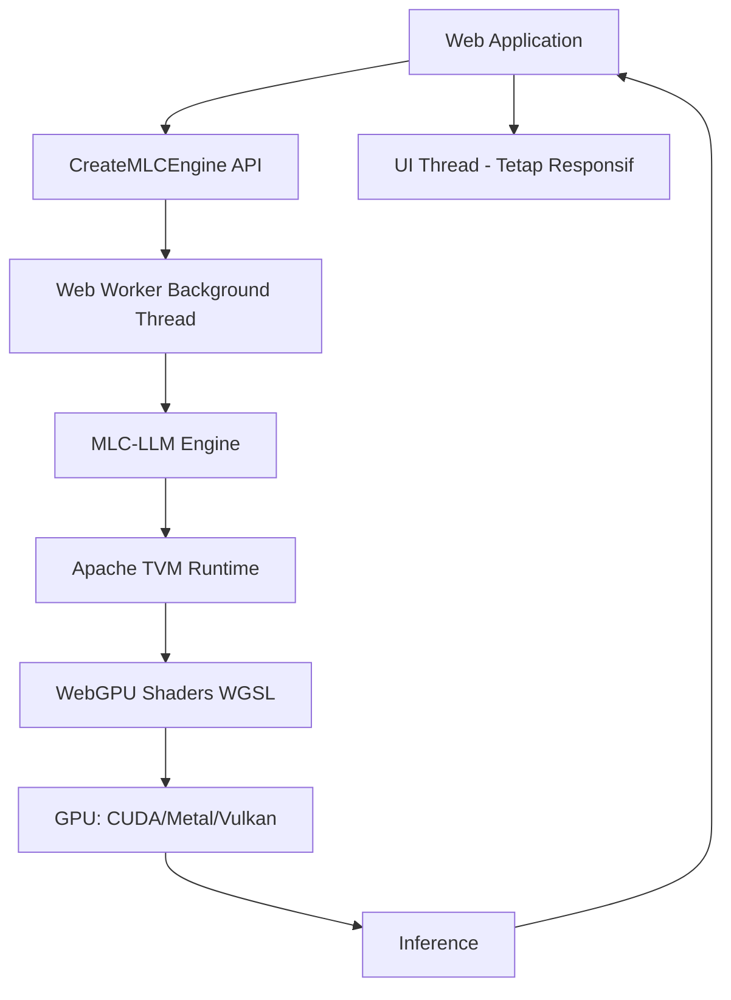
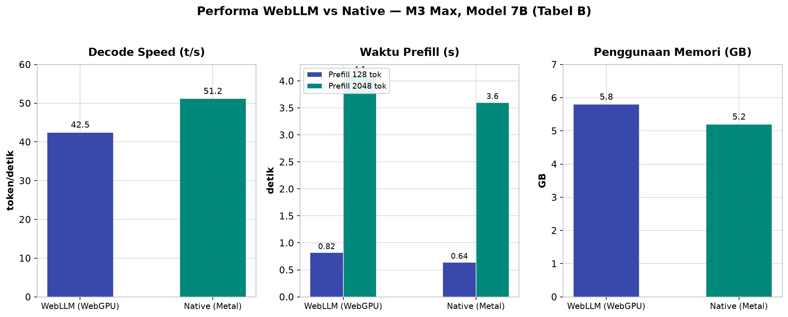
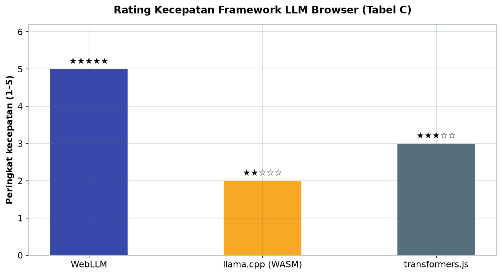

# Bab 3.8: Browser-Based LLM — WebLLM & WebGPU

> Bayangkan membuka sebuah halaman web, lalu asisten AI langsung siap diajak bicara — tanpa server, tanpa instalasi, tanpa data yang meninggalkan browser Anda. Sub-bab ini menjelaskan bagaimana WebLLM dan WebGPU membuat hal itu mungkin: model bahasa berjalan penuh di dalam browser, menggunakan GPU perangkat melalui standar web terbaru. Dari arsitektur hingga benchmark, kita akan melihat seberapa dekat browser bisa menandingi performa aplikasi native.

---

## 1. Tujuan Sub-Bab


Setelah membaca sub-bab ini, Anda akan mampu:

- Menjelaskan alasan strategis menjalankan LLM di browser: *zero deployment*, privasi, dan universalitas
- Memahami WebGPU sebagai standar W3C untuk akses GPU dari JavaScript
- Menjelaskan arsitektur WebLLM berbasis MLC-LLM, Apache TVM, dan Web Workers
- Menginterpretasikan data performa browser versus native beserta faktor bottleneck-nya
- Mengintegrasikan WebLLM ke aplikasi web dengan API bergaya OpenAI (`CreateMLCEngine`)
- Mengevaluasi keterbatasan dan kasus penggunaan yang realistis untuk model di browser

---

## 2. Mengapa LLM di Browser?


### Zero Deployment: AI Tanpa Instalasi

Pertanyaan pertama yang wajar muncul: mengapa repot-repot menjalankan model di dalam browser padahal ada server? Jawabannya dimulai dari kata ***deployment*: untuk aplikasi web, "menjual" AI kepada pengguna cukup dengan memberi mereka URL. Tidak ada aplikasi yang perlu diunduh, tidak ada runtime yang perlu dipasang, tidak ada GPU driver yang perlu diatur — browser yang sudah mereka miliki menjadi mesin inference sekaligus antarmuka. Model diunduh sekali dari CDN, kemudian tersimpan di *cache* perangkat.

Model bisnisnya pun menjadi menarik: biaya komputasi berpindah dari server Anda ke perangkat pengguna. Sebuah aplikasi dengan ribuan pengguna tidak lagi membayar per token, karena setiap pengguna "membayar" dengan listrik dan perangkatnya sendiri. Ini paradigma yang belum pernah ada sebelumnya dalam industri AI — seperti memindahkan dapur dari restoran pusat ke setiap rumah pelanggan.

### Privasi 100% Client-Side

Konsekuensi paling berharga dari komputasi di browser adalah **privasi absolut**: data tidak pernah meninggalkan perangkat. Prompt, dokumen, riwayat percakapan — semuanya diproses di mesin pengguna. Bagi institusi dengan data sensitif (klinik, firma hukum, lembaga keuangan), ini menghapus pertanyaan "apakah data kami digunakan untuk melatih model?" secara permanen. Tidak ada log di server, tidak ada permintaan jaringan yang bocor, tidak ada *third-party cookie* yang bisa mengintip isi percakapan.

### Universalitas Browser

Browser ada di mana-mana: desktop, laptop, tablet, bahkan ponsel. Tidak seperti aplikasi native yang harus dikembangkan dua kali (Android dan iOS), satu aplikasi web berbasis WebLLM langsung berjalan di seluruh perangkat yang mendukung WebGPU. Bagi developer dengan sumber daya terbatas, ini adalah cara paling murah untuk menjangkau sebanyak mungkin perangkat sekaligus.

### Tabel C: Perbandingan Framework Browser LLM

Tiga pendekatan utama inference di browser dibandingkan di bawah ini.

| Fitur | WebLLM | llama.cpp (WASM) | transformers.js |
|:---|:---|:---|:---|
| **GPU Acceleration** | WebGPU | CPU (WASM) | CPU (WASM) |
| **Kecepatan** | ★★★★★ (GPU) | ★★☆☆☆ (CPU) | ★★★☆☆ (CPU) |
| **OpenAI API** | Ya | Manual | Manual |
| **Model Format** | MLC | GGUF | ONNX |
| **Web Worker** | Ya | Manual | Manual |
| **Browser Support** | Chrome/Edge | All browsers | All browsers |

Analisis: tabel ini menunjukkan *trade-off* klasik antara performa dan universalitas. **WebLLM** memimpin kecepatan berkat WebGPU, tetapi hanya pada browser yang mendukungnya. **llama.cpp (WASM)** dan **transformers.js** berjalan di semua browser karena murni CPU — kompensasi untuk kecepatan yang lebih rendah. Pilihan format model pun saling terkunci: MLC untuk WebLLM, GGUF untuk llama.cpp, ONNX untuk transformers.js. Keputusan yang baik tidak hanya mempertimbangkan kecepatan, tetapi juga keluarga model yang ingin Anda dukung dan jangkauan browser target.

---


---

## 3. WebGPU: Akselerasi GPU di Browser


### Standar W3C untuk Komputasi GPU

**WebGPU** adalah standar W3C yang memberikan akses *low-level* ke GPU dari JavaScript — penerus dari WebGL yang telah berusia lebih dari satu dekade. Perbedaan fundamentalnya: WebGL dirancang untuk *rendering* grafis, sedangkan WebGPU dirancang untuk **komputasi umum** — dan *general-purpose computing* adalah panggung tempat LLM beraksi.

Keindahan WebGPU terletak pada sifatnya yang **backend-agnostic**. Kode yang Anda tulis dalam bahasa *shader* **WGSL** (WebGPU Shading Language) diterjemahkan ke API GPU mana pun yang tersedia: CUDA di belakang, Metal di belakang, atau Vulkan di belakang. Satu aplikasi, tiga mesin GPU berbeda — browser yang menangani perbedaannya.

### Dukungan Browser

Adopsi WebGPU berjalan cepat. **Chrome 113+** dan **Edge 113+** mendukung penuh dan stabil; **Opera 99+** juga lengkap. **Safari** masih parsial sejak 16.4, dan **Firefox** masih eksperimental di versi Nightly. Bagi developer, artinya: WebGPU siap digunakan di mayoritas perangkat desktop modern, tetapi tetap wajib menyediakan *fallback* — sebuah topik yang akan kita bahas di tutorial.

### Tabel A: Browser Support WebGPU

Tabel berikut menunjukkan status dukungan WebGPU di browser utama — informasi krusial sebelum Anda memutuskan WebLLM sebagai fondasi aplikasi.

| Browser | Version | WebGPU Support | Status |
|:---|:---:|:---:|:---|
| **Google Chrome** | 113+ | Full | Stable |
| **Microsoft Edge** | 113+ | Full | Stable |
| **Firefox** | Nightly | Experimental | In Development |
| **Safari** | 16.4+ | Partial | In Development |
| **Opera** | 99+ | Full | Stable |

Analisis: untuk pengguna mainstream, Chrome dan Edge sudah siap produksi — dan karena keduanya berbagi *engine* Chromium, dukungannya identik. Safari yang parsial adalah kendala terbesar bagi aplikasi yang menargetkan pengguna macOS/iOS melalui browser; Firefox yang masih eksperimental mengharuskan *fallback* yang andal. Strategi yang bijak: deteksi `navigator.gpu` saat aplikasi dimuat, tawarkan pengalaman WebGPU penuh bila tersedia, dan jatuh ke mode CPU bila tidak.


---

## 4. Arsitektur WebLLM


### Dari Native ke Web: MLC-LLM dan Apache TVM

**WebLLM** dibangun di atas **MLC-LLM**, kerangka kerja yang mengompilasi model bahasa ke berbagai *runtime* — termasuk browser — dengan bantuan **Apache TVM compiler**. Ide kuncinya: kernel CUDA atau Metal yang ditulis untuk GPU native **dikompilasi ulang menjadi kernel WebGPU** (WGSL). Dengan kata lain, WebLLM tidak menulis ulang model dari nol untuk web; ia memakai kembali optimasi native yang sudah matang dan menerjemahkannya ke bahasa yang dipahami browser.

Hasilnya adalah efisiensi yang sulit dicapai dengan pendekatan *from-scratch*: operasi *tensor*, *attention*, dan *quantized matmul* semuanya berjalan sebagai kernel GPU sungguhan — bukan simulasi CPU di balik WebAssembly.

### Web Workers: Inference Tanpa Membekukan UI

Salah satu masalah terbesar inference di browser adalah *blocking*: jika komputasi berat berjalan di *main thread*, halaman web membeku. WebLLM memindahkan seluruh beban kerja ke **Web Worker** — *background thread* yang berkomunikasi dengan UI via pesan. Pengguna bisa terus mengetik, men-scroll, atau mengklik tombol sementara model berpikir di balik layar. Pengalaman ini, yang dijelaskan dalam paper utama WebLLM oleh Ruan et al. (2024) [1], adalah salah satu alasan utama WebLLM terasa "native".

### OpenAI-Compatible API

Dari sisi developer, WebLLM menawarkan API yang familier: `CreateMLCEngine()` mengembalikan *engine* yang mengekspos `engine.chat.completions.create(...)` — bentuknya sama dengan OpenAI SDK. Kode yang biasa menulis `client.chat.completions.create` hanya perlu mengganti `client` dengan `engine`. Kurva belajar nyaris nol bagi developer yang sudah akrab dengan ekosistem OpenAI.

### Gambar 1: Arsitektur WebLLM

Diagram berikut menunjukkan alur dari aplikasi web hingga GPU — perhatikan bagaimana Web Worker memisahkan inferensi dari UI.



Pesan utama diagram ini adalah pemisahan tanggung jawab: komputasi berat mengalir di jalur bawah (Worker → MLC → TVM → WGSL → GPU), sementara antarmuka tetap berada di jalur atas. Hasil inference kembali ke aplikasi melalui pesan asinkron, dan UI tidak pernah diblokir. Inilah alasan mengapa pengalaman chatting di WebLLM terasa mulus meskipun komputasi terjadi penuh di perangkat pengguna.

---


---

## 5. Performa Browser vs Native


### Angka yang Mengejutkan: ~80% Performa Native

Klaim paling kontroversial dari WebLLM adalah performanya yang mendekati native. Data benchmark dari paper Ruan et al. (2024) [1] pada **M3 Max dengan model 7B** menunjukkan *decode speed* WebGPU sebesar **42,5 token/detik** dibanding **51,2 t/s** native — rasio sekitar **83%**. Prefill 128 token hanya kehilangan 22% kecepatan, dan pada konteks 2048 token gapnya menyempit menjadi 12%. Memori 5,8 GB versus 5,2 GB.

Bottleneck utamanya adalah **driver translation**: WGSL harus diterjemahkan ke *native shader* setiap kali kernel berjalan. Ini biaya tetap yang tidak dimiliki aplikasi native — tetapi dengan komputasi yang cukup besar (seperti prefill 2048 token), biaya tetap itu ter-amortisasi, dan gap justru mengecil.

### Model yang Realistis di Browser

Konsekuensi praktisnya: model **2B–7B dengan kuantisasi Q4** adalah kisaran yang nyaman untuk browser. Di atas itu, *memory limit* perangkat menjadi pembatas — karena WebGPU dibatasi oleh *device memory* GPU yang tersedia, bukan RAM sistem. Model 3B seperti **Llama 3.2 3B** atau **Ministral 3 3B** adalah titik manis: cukup cerdas untuk tugas harian, cukup ringan untuk dimuat dalam hitungan detik.

### Tabel B: Performa WebLLM vs Native (M3 Max, 7B Model)

Data ini bersumber dari benchmark resmi WebLLM (Ruan et al., 2024) [1] pada Apple M3 Max dengan model 7B.

| Metrik | WebLLM (WebGPU) | Native (Metal) | Rasio |
|:---|:---:|:---:|:---:|
| **Decode Speed (t/s)** | 42.5 t/s | 51.2 t/s | ~83% |
| **Prefill (128 tok)** | 0.82s | 0.64s | ~78% |
| **Prefill (2048 tok)** | 4.1s | 3.6s | ~88% |
| **Memory Usage** | 5.8 GB | 5.2 GB | ~112% |



*Gambar 3.8-1 — WebGPU mencapai 42,5 t/s atau ~83% dari kecepatan decode native; pada prefill panjang (2048 token) gap menyempit menjadi ~88%, dan memori hanya bertambah 0,6 GB.*



*Gambar 3.8-2 — WebLLM memimpin dengan akselerasi GPU penuh (WebGPU), sementara framework berbasis CPU tertinggal jauh dalam rating kecepatan.*

Analisis: pola yang paling informatif adalah *decode speed* — metrik yang paling terasa oleh pengguna akhir. Kehilangan 17% kecepatan berarti 42,5 token per detik, tetap jauh di atas kecepatan membaca manusia, sehingga hampir tidak terasa dalam percakapan biasa. Yang lebih menarik: pada prefill panjang (2048 token), rasio membaik ke 88% — konfirmasi bahwa *overhead* terjemahan WGSL ter-amortisasi pada beban komputasi yang besar. Memori ekstra 12% adalah harga wajar untuk lapisan abstraksi browser.


---

## 6. Model yang Didukung


### Format MLC dan Kuantisasi

Model di WebLLM memakai **format MLC** — varian yang dioptimasi khusus untuk WebGPU — dan diunduh via CDN atau Hugging Face. Tiga level kuantisasi yang umum:

- **q4f16** — kuantisasi 4-bit dengan *scaling* FP16; keseimbangan terbaik untuk web
- **q4f32** — presisi lebih tinggi, memori lebih besar
- **q0f16** — tanpa kuantisasi (FP16 penuh); hanya untuk model kecil dan GPU kaya memori

### Katalog Model

WebLLM mendukung keluarga model populer: **Llama 3.2**, **Phi-3**, **Gemma 2**, **Qwen 2.5**, dan — untuk beban berat — **DeepSeek V4 Flash** via MLC. Yang paling relevan untuk kasus browser adalah **Ministral 3** (3B/8B): model *dense* kecil dengan lisensi Apache 2.0, dirancang efisien lewat teknik *Cascade Distillation* — sebuah pendekatan yang membuat model kecil mampu meniru kualitas model yang jauh lebih besar dengan biaya komputasi kecil. Survei *small language models* oleh Lu et al. (2024) [3] mengkonfirmasi bahwa kelas model 1B–7B ini adalah kisaran yang paling layak untuk lingkungan *edge* seperti browser.

---

## 7. Use Cases & Keterbatasan


### Skenario yang Realistis

WebLLM paling cocok untuk tugas ringan dan privat: **chatbot pribadi** di halaman web, **summarization** dokumen lokal, **translation**, dan *code assistant* inline. Paper Demystifying Small Language Models (Lu et al., 2025) [4] dan survei *edge LLM* (Qu et al., 2024) [5] menunjukkan bahwa kasus-kasus dengan *latency requirement* longgar dan data sensitif adalah tempat terbaik untuk inference di *edge* — dan browser adalah *edge* yang paling mudah dijangkau.

### Keterbatasan yang Jujur

Tidak adil jika tidak menyebut keterbatasannya. Ukuran model terbatas pada sekitar **7B** — di atas itu terlalu berat untuk GPU konsumen. **Context window** relatif pendek karena memori terbatas, meskipun implementasi FlashAttention [2] telah memperpanjang batas yang bisa dicapai. Dan yang terpenting: **tidak semua browser mendukung WebGPU** — Safari parsial, Firefox masih eksperimental — sehingga aplikasi produksi tetap membutuhkan *fallback* CPU. Masa depan tetap optimistis: WebGPU terus berkembang di setiap rilis browser, dan gap performa terhadap native terus mengecil.

---

## 8. Tutorial / Hands-On


### Tutorial A: WebLLM Chat — Hello World

Mulailah dengan halaman HTML tunggal yang menjalankan model di browser. Pastikan Anda menggunakan Chrome 113+ atau Edge 113+.

```html
<!DOCTYPE html>
<html>
<head>
  <title>WebLLM Chat Lokal</title>
  <script type="module">
    import { CreateMLCEngine } from "@mlc-ai/web-llm";

    async function main() {
      const statusDiv = document.getElementById("status");
      const responseDiv = document.getElementById("response");

      statusDiv.textContent = "Loading model...";

      // Inisialisasi engine
      const engine = await CreateMLCEngine(
        "Llama-3.2-3B-Instruct-q4f16_1-MLC",
        { initProgressCallback: (p) => {
          statusDiv.textContent = `Loading: ${Math.round(p.progress * 100)}%`;
        }}
      );

      statusDiv.textContent = "Ready!";

      // Chat completion
      const reply = await engine.chat.completions.create({
        messages: [
          { role: "system", content: "Kamu adalah asisten yang membantu." },
          { role: "user", content: "Jelaskan AI dalam 3 kalimat." }
        ],
        temperature: 0.7,
        max_tokens: 100,
        stream: true,
      });

      let response = "";
      for await (const chunk of reply) {
        response += chunk.choices[0]?.delta?.content || "";
        responseDiv.textContent = response;
      }
    }

    main();
  </script>
</head>
<body>
  <h2>WebLLM Chat Lokal</h2>
  <div id="status">Initializing...</div>
  <div id="response"></div>
</body>
</html>
```

Perhatikan kemiripan `engine.chat.completions.create` dengan OpenAI SDK — hanya saja *engine* berjalan sepenuhnya di browser. Saat pertama kali dibuka, model diunduh dari CDN; kunjungan berikutnya memanfaatkan *cache* sehingga prosesnya jauh lebih cepat.

### Tutorial B: Setup WebGPU Check dan Fallback

Karena tidak semua browser mendukung WebGPU, aplikasi produksi wajib memeriksa ketersediaannya dan menyiapkan rencana cadangan.

```html
<script>
  async function checkWebGPU() {
    if (!navigator.gpu) {
      alert("WebGPU tidak didukung browser ini. Gunakan Chrome 113+");
      return false;
    }

    const adapter = await navigator.gpu.requestAdapter();
    if (!adapter) {
      alert("Tidak ada GPU adapter yang tersedia");
      return false;
    }

    const device = await adapter.requestDevice();
    const info = {
      vendor: adapter.info.vendor,
      architecture: adapter.info.architecture,
      device: adapter.info.device,
      features: [...adapter.features].join(", "),
    };

    console.table(info);
    return true;
  }

  // Integrasi dengan WebLLM
  async function loadModelWithFallback() {
    const hasWebGPU = await checkWebGPU();
    if (!hasWebGPU) {
      // Fallback ke transformers.js (CPU via WASM)
      console.log("Falling back to CPU-based inference");
      return loadTransformersJS();
    }
    return loadWebLLM();
  }
</script>
```

Deteksi tiga lapis — dukungan API, adapter, lalu device — memastikan Anda tahu persis kemampuan mesin pengguna. Strategi *fallback* yang ditampilkan di sini (turun ke transformers.js berbasis CPU) menjaga aplikasi tetap berfungsi di semua browser, dengan pengalaman yang lebih lambat tetapi tetap berjalan.

### Tutorial C: Multiple Model Switching

Banyak aplikasi butuh lebih dari satu model — model ringan untuk chat cepat dan model lebih besar untuk penalaran. Kelas berikut mengelola beberapa engine sekaligus.

```javascript
import { CreateMLCEngine } from "@mlc-ai/web-llm";

class LocalAIAssistant {
  constructor() {
    this.engines = {};
  }

  async loadModel(name, modelId) {
    if (this.engines[name]) return this.engines[name];

    this.engines[name] = await CreateMLCEngine(modelId);
    return this.engines[name];
  }

  async chat(name, messages, options = {}) {
    const engine = await this.loadModel(name, this.modelMap[name]);
    return engine.chat.completions.create({
      messages,
      temperature: options.temperature || 0.7,
      max_tokens: options.maxTokens || 256,
      stream: true,
    });
  }

  async unloadAll() {
    for (const name in this.engines) {
      await this.engines[name].unload();
    }
    this.engines = {};
  }
}

// Usage
const assistant = new LocalAIAssistant();
const stream = await assistant.chat(
  "reasoning",
  [{ role: "user", content: "Solve: 2x + 5 = 15" }],
  { temperature: 0.2 }
);
```

Pola *lazy load* di atas menghindari pemuatan semua model sekaligus — model hanya dimuat saat pertama dipanggil. Karena memori browser terbatas, metode `unloadAll()` penting untuk melepaskan model yang tidak lagi digunakan sebelum memuat model baru.

---

## 9. Studi Kasus: Aplikasi Web Privacy-First untuk Klinik Kecil


**Skenario:** Sebuah klinik dengan tiga dokter ingin memanfaatkan AI untuk merangkum rekam medis. Kendalanya bukan anggaran, melainkan regulasi dan etika: **data pasien tidak boleh dikirim ke server cloud**. Permintaan ke API publik berarti menitipkan data medis ke pihak ketiga — risiko yang tidak bisa ditoleransi.

**Solusi:** Tim membangun aplikasi web berbasis **React + WebLLM**. Semua inferensi berjalan di browser dokter — laptop dengan GPU standar. Model yang dipilih adalah **Llama 3.2 3B q4f16**: cukup kecil untuk dimuat cepat, cukup akurat untuk tugas summarization. Riwayat percakapan disimpan di *Local Storage* perangkat, sehingga tidak ada data pasien yang tersimpan di server mana pun.

**Hasil:** Rangkuman rekam medis sepanjang 200 kata dihasilkan dalam **5 detik** — sepenuhnya *offline*, tanpa koneksi internet sama sekali. Karena tidak ada server, biaya operasional aplikasi ini nyaris nol: cukup hosting statis untuk file HTML/JS, dan setiap browser dokter menjadi mesin inference-nya sendiri.

**Kendala:** Dokter harus menggunakan **Chrome terbaru** dan laptop dengan GPU yang memadai — laptop tanpa GPU atau browser lama terpaksa memakai mode CPU yang lebih lambat. Tim menjawabnya dengan tutorial singkat pemasangan Chrome dan panduan deteksi WebGPU otomatis.

**Kesimpulan:** Kasus ini menunjukkan tesis utama sub-bab ini: WebLLM memungkinkan deployment AI **tanpa server dan tanpa risiko kebocoran data** — sebuah kombinasi yang sebelumnya mustahil. Untuk organisasi kecil dengan data sensitif, browser bukan sekadar alternatif murah, melainkan satu-satunya opsi yang memenuhi persyaratan privasi.

---

## 10. Referensi


### Paper Jurnal/Konferensi

[1] Ruan, C.F., Qin, Y., Zhou, X., et al. (2024). *WebLLM: A High-Performance In-Browser LLM Inference Engine*. arXiv:2412.15803. DOI: [10.48550/arXiv.2412.15803](https://arxiv.org/abs/2412.15803)

[2] Dao, T., et al. (2022). *FlashAttention: Fast and Memory-Efficient Exact Attention with IO-Awareness*. Advances in Neural Information Processing Systems (NeurIPS). DOI: [10.48550/arXiv.2205.14135](https://arxiv.org/abs/2205.14135)

[3] Lu, Z., et al. (2024). *Small Language Models: Survey, Measurements, and Insights*. arXiv:2409.15790. DOI: [10.48550/arXiv.2409.15790](https://arxiv.org/abs/2409.15790)

[4] Lu, Z., et al. (2025). *Demystifying Small Language Models for Edge Deployment*. Proceedings of the 63rd Annual Meeting of the ACL. DOI: [10.18653/v1/2025.acl-long.718](https://aclanthology.org/2025.acl-long.718/)

[5] Qu, Z., et al. (2024). *A Review on Edge Large Language Models: Design, Execution, and Applications*. arXiv:2410.11845. DOI: [10.48550/arXiv.2410.11845](https://arxiv.org/abs/2410.11845)

### Referensi Pendukung (Dokumentasi/Repository)

[6] WebLLM. *GitHub Repository & Documentation*. [https://github.com/mlc-ai/web-llm](https://github.com/mlc-ai/web-llm)

[7] WebGPU Specification. *W3C*. [https://www.w3.org/TR/webgpu/](https://www.w3.org/TR/webgpu/)

[8] MLC-LLM. *GitHub Repository*. [https://github.com/mlc-ai/mlc-llm](https://github.com/mlc-ai/mlc-llm)

[9] WebGPU Report — Browser Support. [https://webgpureport.org](https://webgpureport.org)
