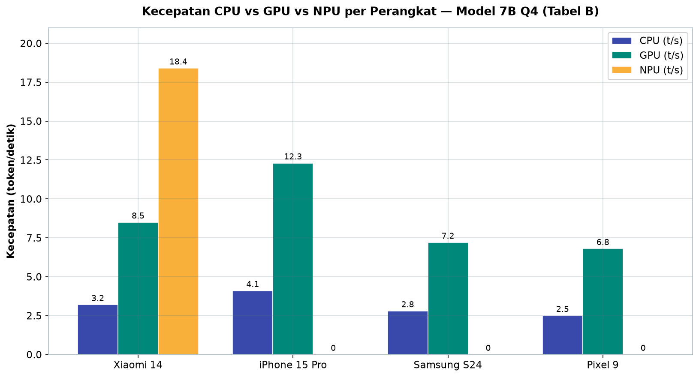
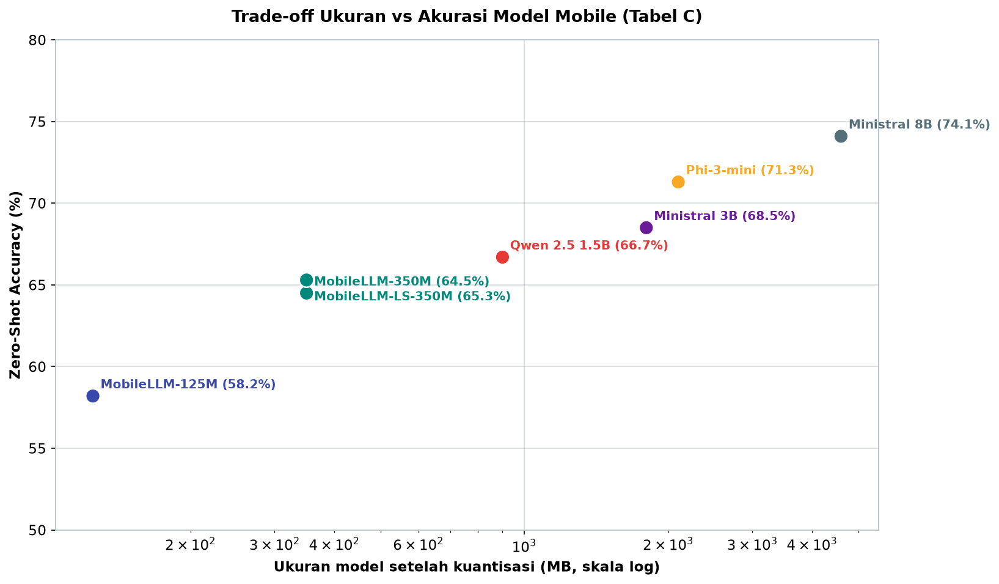
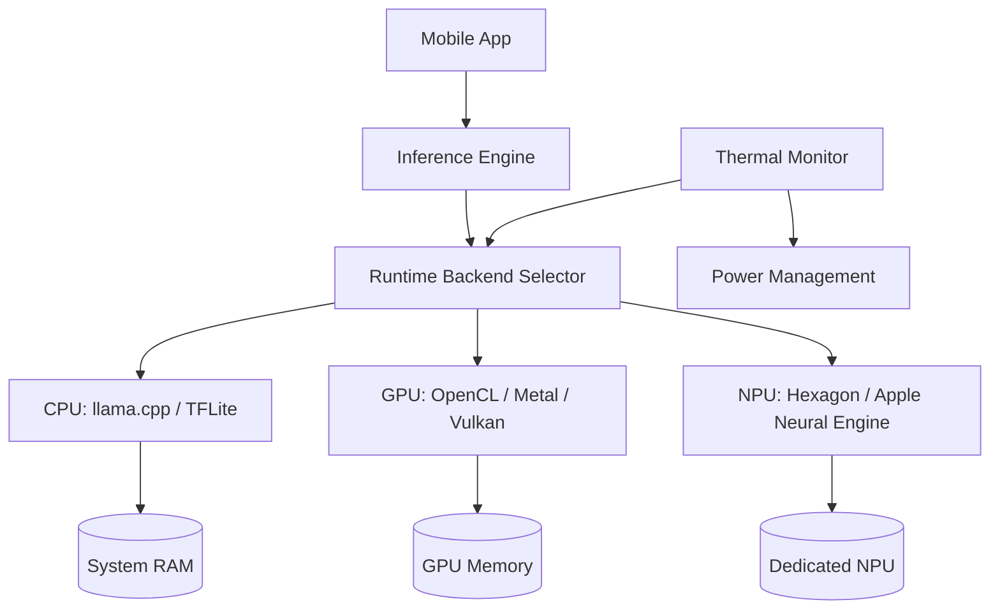
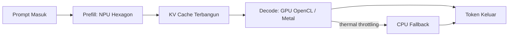

# Bab 3.9: Mobile Deployment — LLM di Android/iOS Native

> Di saku Anda, perangkat dengan RAM lebih besar dari server pribadi zaman 2010 sedang menunggu. Ponsel modern membawa GPU, NPU, dan memori terpadu yang memungkinkan model bahasa berjalan sepenuhnya offline — asalkan kita tahu cara mengemas, mengompilasi, dan mengoptimalkannya. Sub-bab ini membedah tantangan inference di perangkat mobile, framework yang tersedia (MLC-LLM, llama.cpp, ExecuTorch), hingga arsitektur model yang dirancang khusus untuk ponsel.

---

## 1. Tujuan Sub-Bab

Setelah membaca sub-bab ini, Anda akan mampu:

- Menjelaskan tantangan deployment LLM di perangkat mobile: memori terbatas, *thermal throttling*, dan daya baterai
- Membandingkan framework inference mobile: MLC-LLM, llama.cpp, ExecuTorch, MNN, dan llm.npu
- Mengompilasi dan men-deploy model Android dengan MLC-LLM dan OpenCL backend
- Menjalankan LLM di iOS dengan LLMFarm dan *bindings* Swift llama.cpp
- Memahami arsitektur MobileLLM: *deep & thin*, *embedding sharing*, dan *block-wise weight sharing*
- Memanfaatkan NPU (Qualcomm Hexagon) dengan llm.npu untuk prefill berkecepatan tinggi

---

## 2. Tantangan Mobile Inference

### Memori yang Terbagi, Bukan Dedicated

Perbedaan paling fundamental antara GPU desktop dan perangkat mobile adalah **memori**. Ponsel tidak memiliki VRAM khusus; ia berbagi satu kolam memori sistem berukuran **4–12 GB** antara OS, aplikasi, dan model. Model LLM yang di-*load* harus berkompetisi dengan segala yang lain di dalam ponsel — dan *browser*, aplikasi media sosial, serta OS itu sendiri memakan separuh kapasitas sebelum model melihatnya. Konsekuensinya langsung: **ukuran model setelah kuantisasi harus di bawah 4 GB**, dan idealnya jauh di bawah itu agar ponsel tetap bisa dipakai untuk hal lain.

### Panas dan Baterai

Inference LLM adalah pekerjaan komputasi paling berat yang pernah diminta dari ponsel. GPU mobile cepat panas, dan ketika suhu inti naik, sistem menurunkan frekuensi — fenomena **thermal throttling** — sehingga kecepatan token per detik jatuh drastis setelah beberapa menit penggunaan intensif. Di sisi lain, daya yang diserap proses inference berkisar **5–15 W**; dalam skenario terburuk, itu berarti baterai ponsel habis dalam hitungan jam. Konsekuensi desain: aplikasi LLM mobile yang baik harus menghitung *budget* energi, bukan hanya kecepatan.

### Batasan yang Membentuk Desain

Ketiga pembatas ini — memori, panas, baterai — bukan sekadar angka; mereka membentuk keputusan arsitektur. Model harus kecil (kuantisasi agresif), inference harus efisien (memilih unit komputasi yang tepat), dan sesi harus pendek atau diatur termalnya. Paper *Elastic On-Device LLM Service* (Lu et al., 2025) [3] menunjukkan salah satu jawaban cerdas: **model switching berdasarkan kompleksitas tugas** — gunakan model kecil untuk tugas ringan, dan hanya naik kelas saat tugas benar-benar berat.

---

## 3. Arsitektur Inference Mobile

### Tiga Unit Komputasi, Tiga Karakter

Ponsel modern menawarkan tiga "otot" dengan karakter berbeda, dan arsitektur inference yang baik memilih otot yang tepat untuk pekerjaan yang tepat:

- **CPU** — paling serbaguna dan tidak pernah panas berlebihan untuk beban pendek; menjadi *fallback* utama. Backend: llama.cpp, MNN, TFLite.
- **GPU** — jauh lebih cepat dari CPU, tetapi lebih boros daya dan cepat panas. Backend: **OpenCL** di Android, **Metal** di iOS.
- **NPU** — *Neural Processing Unit* khusus (Qualcomm Hexagon, Apple Neural Engine, MediaTek APU) — unit paling efisien secara energi, dirancang untuk beban *tensor* berulang. Namun tidak semua operasi LLM didukung dengan baik.

Framework menghubungkan aplikasi ke ketiga unit ini. **MLC-LLM** (berbasis Apache TVM) mengompilasi model untuk semua target; **ExecuTorch** membawa ekosistem PyTorch ke perangkat; **llama.cpp** menawarkan inference C++ murni. Penelitian *edge LLM* [5] menegaskan bahwa *heterogeneous execution* — memakai unit berbeda untuk fase berbeda — adalah kunci efisiensi di perangkat mobile.

### Monitor Termal sebagai Orkestrator

Diagram arsitektur di bagian visualisasi menunjukkan komponen yang jarang dibahas: **Thermal Monitor**. Sistem bukan hanya memilih unit komputasi berdasarkan kecepatan, tetapi juga memantau suhu dan daya — jika GPU mulai membara, inference dipindahkan ke CPU, atau *power management* menurunkan batas konsumsi. Di sinilah desain *runtime* mobile berbeda fundamental dari server: di server, targetnya *throughput*; di ponsel, targetnya *survival*.

### Memilih Unit Komputasi: Per Fase, Bukan Per Sesi

Keputusan tidak dibuat sekali untuk seluruh sesi percakapan, melainkan **per fase komputasi** — dan inilah perbedaan pola pikir yang paling penting. Setiap respons LLM terdiri dari dua fase dengan karakter yang sangat berbeda:

- **Prefill** — memproses seluruh prompt sekaligus. Beban komputasi tinggi secara paralel, sangat cocok untuk NPU yang dirancang untuk *matrix multiplication* masif. Di fase inilah llm.npu mencatatkan prefill 1000+ token/detik.
- **Decode** — menghasilkan token baru satu per satu. Beban per token kecil dan serial, memanfaatkan lebih baik GPU atau CPU yang sudah hangat.

Arsitektur *heterogeneous execution* memanfaatkan perbedaan ini: **NPU untuk prefill** (cepat, efisien, selesai dalam sekejap), **GPU untuk decode** (kecepatan stabil 8–12 t/s), dan **CPU sebagai jaring pengaman** saat termal memaksa. Pembagian kerja semacam ini menyerupai *pipeline* industri: setiap stasiun kerja menangani tahap yang paling cocok untuknya, bukan satu mesin yang mengerjakan semua.

---

## 4. MLC-LLM untuk Mobile

### Dari Model ke APK

**MLC-LLM** adalah jalur paling mulus dari model Hugging Face ke aplikasi mobile. Model dikompilasi ke **format MLC** menggunakan Apache TVM, dengan target yang spesifik untuk setiap platform: **OpenCL backend** untuk GPU Android, **Metal backend** untuk GPU iOS. Karena formatnya adalah *native binary* yang dioptimasi untuk perangkat tertentu, performanya jauh lebih baik daripada pendekatan interpreter generik.

Alur kerjanya linear: pilih model → tentukan kuantisasi → kompilasi untuk target Android → bangun APK. Proses ini bisa diotomatisasi dalam *pipeline* CI/CD sehingga rilis aplikasi dengan model baru menjadi rutinitas, bukan proyek khusus.

Dua keputusan dalam alur tersebut yang paling menentukan pengalaman pengguna adalah **pilihan kuantisasi** dan **target GPU**. Kuantisasi `q4f16_1` menjadi standar de facto untuk mobile karena mengurangi ukuran model ~4× lipat dengan degradasi kualitas minimal — sebuah *trade-off* yang juga ditegaskan oleh survei *small language models* [5]. Sementara itu, kompilasi yang ditujukan pada *device family* tertentu (misalnya Snapdragon vs Tensor) memungkinkan kernel dioptimasi untuk karakteristik memori dan instruksi GPU masing-masing — detail yang tidak mungkin dicapai dengan pendekatan interpreter universal.

### Model yang Direkomendasikan

Keluarga model yang paling nyaman untuk MLC-LLM mobile adalah **Phi-3-mini** (3,8B), **Qwen 2.5**, dan **Llama 3.2**. Ketiganya punya varian Q4 yang muat di perangkat menengah. Untuk beban *edge* yang paling efisien, keluarga **Ministral 3** (3B/8B) patut diperhitungkan — model *dense* kompak yang memakai *Cascade Distillation* sehingga kualitasnya tinggi untuk ukurannya, cocok dipasangkan dengan footprint memori yang ketat di ponsel.

---

## 5. llama.cpp di Mobile

### Android: Termux dan Aplikasi Inferensi

**llama.cpp** hadir di Android melalui dua jalur. Jalur *power user*: install **Termux** (emulator terminal), kompilasi llama.cpp di dalamnya, dan jalankan CLI inference langsung dari ponsel — sebuah pengalaman yang mengingatkan pada sub-bab CLI-Only. Jalur aplikasi: berbagai aplikasi inference di Play Store yang memakai llama.cpp sebagai *engine*, menawarkan antarmuka chat tanpa perlu menyentuh terminal.

### iOS: LLMFarm dan Swift Bindings

Di sisi iOS, **LLMFarm** adalah aplikasi paling populer berbasis llama.cpp — mendukung format GGUF, multi-model, dan *metal* acceleration. Bagi developer yang ingin integrasi sendiri, llama.cpp menyediakan *Swift bindings*: model dimuat dengan `llama_load_model_from_file`, konteks dibuat dengan `llama_new_context_with_model`, lalu token di-generate satu per satu.

### GGUF: Format Universal

Keunggulan utama jalur llama.cpp adalah **format GGUF yang universal**: satu file model dapat dipindahkan dari desktop ke Android ke iOS tanpa konversi apa pun. Di sinilah letak daya tariknya bagi pengguna individual: model yang sama yang Anda jalankan di laptop Mac, bisa Anda pakai di ponsel.

---

## 6. MobileLLM: Arsitektur Model untuk Mobile

### Deep & Thin: Menipis, Bukan Mengecil

Paper **MobileLLM** (Liu et al., 2024) [1] menjawab pertanyaan arsitektural yang tampak sederhana: model kecil mana yang terbaik untuk perangkat? Temuan utamanya melawan intuisi konvensional: daripada model "lebar tapi dangkal" (banyak neuron per lapisan, sedikit lapisan), model **deep & thin** — banyak lapisan dengan dimensi sempit — memberi akurasi lebih tinggi dengan parameter yang sama. Dengan kata lain, *kedalaman* lebih bernilai daripada *lebar* untuk model sub-miliar.

### Teknik Berbagi Parameter

MobileLLM menambah dua teknik kunci. **Embedding sharing**: proyeksi input dan output (*token embedding* dan *lm_head*) berbagi bobot, menghemat memori besar karena lapisan ini adalah dua matriks terbesar di model kecil. **Block-wise weight sharing**: kelompok lapisan berbagi parameter yang sama, memungkinkan model lebih dalam tanpa menambah parameter — sebuah bentuk kompresi struktural yang alami.

### 125M–350M: Kecil tapi Terampil

Hasilnya adalah kelas model **sub-billion** (125M–350M) yang untuk tugas spesifik — chat sederhana, klasifikasi, intent detection — mendekati performa model yang jauh lebih besar. Angka akurasinya tercantum di Tabel C: MobileLLM-LS-350M mencapai 65,3% *zero-shot accuracy*. Ini bukan pengganti model 7B untuk penalaran kompleks, tetapi untuk tugas sempit di perangkat, ukurannya yang hanya 350 MB adalah nilai jual yang tak tertandingi.

---

## 7. NPU Offloading dengan llm.npu

### NPU: Otot Paling Efisien yang Baru Dipakai

Paper **llm.npu** (Hou et al., 2024) [2] adalah studi pertama yang berhasil melepas beban LLM sepenuhnya ke **NPU Qualcomm Hexagon** di perangkat Android. Hasilnya spektakuler: **7,3× hingga 18,4× lebih cepat daripada CPU** untuk beban prefill, dengan presisi FP16 dan *accuracy loss* di bawah 1%. Model yang didukung mencakup keluarga Qwen, Gemma, Phi, dan Llama 2.

Angka ini mengubah ekonomi komputasi mobile. Prefill — fase memproses prompt awal — adalah bagian yang paling berat dari tiap percakapan; memindahkannya ke NPU berarti *time-to-first-token* turun drastis, sementara fase *decode* (generasi token berikutnya) tetap bisa ditangani GPU atau CPU.

### Catatan untuk Model Frontier 2026

Perlu kejujuran di sini: model *frontier* 2026 — seperti DeepSeek V4 Flash dengan ratusan miliar parameter atau Mistral Large 3 — **tidak feasible di NPU mobile** karena footprint memorinya jauh melampaui kapasitas NPU dan memori perangkat. NPU unggul pada kelas model kecil hingga menengah (1–8B). Pemahaman batas ini justru penting agar ekspektasi realistis: NPU adalah pengungkit untuk model *on-device* kelas menengah, bukan pintu masuk ke model raksasa.

### Kapan NPU, Kapan Tidak?

Meski angka speedup NPU mengesankan, dukungannya masih terbatas pada model dan operator tertentu. Panduan praktisnya: gunakan NPU ketika (1) model yang dipilih masuk dalam daftar dukungan llm.npu (keluarga Qwen, Gemma, Phi, Llama 2), (2) beban didominasi prefill panjang — misalnya dokumen yang harus dirangkum, dan (3) perangkat memakai chipset Qualcomm dengan Hexagon NPU. Sebaliknya, jangan bergantung pada NPU untuk *decode* interaktif yang panjang — di sana GPU OpenCL atau Metal masih lebih stabil, dan jangan berharap NPU menangani model >8B dalam waktu dekat. Strategi terbaik hari ini bukan "pakai NPU untuk segalanya", melainkan NPU sebagai *booster prefill* dalam arsitektur yang sudah memiliki GPU dan CPU sebagai jalur utama.

---

## 8. Tabel Wajib

### Tabel A: Framework Mobile LLM

Tabel berikut memetakan framework utama beserta dukungan platform dan backend-nya.

| Framework | Android | iOS | GPU Backend | NPU Backend | Bahasa |
|:---|:---:|:---:|:---:|:---:|:---:|
| **MLC-LLM** | Ya | Ya | OpenCL, Vulkan | - | Python/JS |
| **llama.cpp** | Ya (Termux) | Ya (LLMFarm) | Metal, OpenCL | - | C++ |
| **ExecuTorch** | Ya | Ya | MPS, OpenCL | - | Python |
| **llm.npu** | Ya (Qualcomm) | - | - | Hexagon NPU | C++ |
| **MNN** | Ya | Ya | OpenCL, Vulkan, Metal | Huawei NPU | C++ |

Analisis: tidak ada satu framework yang menang di semua dimensi. **MLC-LLM** adalah pilihan utama untuk integrasi penuh dengan performa GPU terbaik di kedua platform. **llama.cpp** unggul dalam kesederhanaan dan portabilitas format GGUF, tetapi integrasi GPU di Android masih kalah matang dari MLC-LLM. **ExecuTorch** menarik bagi tim yang sudah berinvestasi di ekosistem PyTorch. **llm.npu** dan **MNN** adalah pilihan khusus: yang pertama untuk memaksimalkan NPU Qualcomm, yang kedua untuk dukungan NPU Huawei. Tabel ini juga menegaskan: backend NPU masih langka — ini adalah medan yang baru mulai berkembang.

### Tabel B: Performa di Perangkat Mobile (Model 7B Q4)

Angka *tokens per second* berikut menggambarkan performa aktual di perangkat mainstream 2024-2025, bersumber dari benchmark paper mobile LLM [2][5].

| Perangkat | Chipset | RAM | CPU (t/s) | GPU (t/s) | NPU (t/s) |
|:---|:---|:---:|:---:|:---:|:---:|
| **Xiaomi 14** | Snapdragon 8 Gen 3 | 12GB | 3.2 t/s | 8.5 t/s | 18.4 t/s |
| **iPhone 15 Pro** | A17 Pro | 8GB | 4.1 t/s | 12.3 t/s | - |
| **Samsung S24** | Exynos 2400 | 8GB | 2.8 t/s | 7.2 t/s | - |
| **Pixel 9** | Tensor G4 | 12GB | 2.5 t/s | 6.8 t/s | - |



*Gambar 3.9-1 — NPU Snapdragon 8 Gen 3 melesat 5,8× dari CPU (18,4 t/s vs 3,2 t/s); GPU 8–12 t/s tetap di bawah pengalaman desktop.*



*Gambar 3.9-2 — Setiap kenaikan akurasi ~2–3% menuntut lompatan ukuran 2–3× lipat; Ministral 3B (1,8 GB) adalah titik keseimbangan terbaik.*

Analisis: pola yang paling menonjol adalah lompatan besar CPU → GPU → NPU. Di Xiaomi 14, GPU 2,7× lebih cepat dari CPU, dan NPU lebih dari 2× di atas GPU — total 5,8× lompatan dari CPU ke NPU. Perlu dicatat bahwa angka GPU 8–12 t/s ini masih di bawah pengalaman desktop; pada kecepatan ini, respons panjang tetap terasa lambat. Angka NPU 18,4 t/s, bagaimanapun, mendekati pengalaman desktop — dan itulah mengapa prefill di NPU terasa "instan". Untuk aplikasi produksi, kombinasi yang disarankan: **NPU untuk prefill, GPU untuk decode**, dengan CPU sebagai jaring pengaman termal.

### Tabel C: MobileLLM Model Sizes vs Akurasi

Tabel ini membandingkan model kecil arsitektur MobileLLM dengan model populer yang biasa dipakai di mobile (data akurasi mengacu pada paper [1]).

| Model | Parameters | Quantization | Size | Zero-Shot Accuracy | Use Case |
|:---|:---:|:---:|:---:|:---:|:---|
| **MobileLLM-125M** | 125M | INT8 | 125 MB | 58.2% | Simple chat, classification |
| **MobileLLM-350M** | 350M | INT8 | 350 MB | 64.5% | Q&A, summarization |
| **MobileLLM-LS-350M** | 350M | INT8 | 350 MB | 65.3% | API calling, intent detection |
| **Phi-3-mini** | 3.8B | Q4 | 2.1 GB | 71.3% | General purpose |
| **Qwen 2.5 1.5B** | 1.5B | Q4 | 0.9 GB | 66.7% | Multilingual chat |
| **Ministral 3B** | 3B | Q4 | 1.8 GB | 68.5% | Edge inference, Cascade Distillation |
| **Ministral 8B** | 8B | Q4 | 4.6 GB | 74.1% | General purpose mobile |

Analisis: tabel ini menunjukkan *hukum harga* model mobile: setiap kenaikan akurasi ~2–3% membutuhkan lompatan ukuran 2–3× lipat. MobileLLM-125M (58,2%) hanya 125 MB — cocok untuk klasifikasi ringan dan chat sederhana yang berjalan di perangkat paling terbatas. Di kelas menengah, **Ministral 3B** (68,5%, 1,8 GB) adalah keseimbangan terbaik antara footprint dan kemampuan. Di kelas atas, **Ministral 8B** (74,1%, 4,6 GB) mendekati akurasi Phi-3-mini dengan ukuran lebih besar — pilihan tepat hanya jika perangkat punya memori lapang. Studi kasus berikut akan menunjukkan bagaimana kelas 8B ini bisa dipakai dalam praktik nyata.

---

## 9. Diagram & Visualisasi

### Gambar 1: Arsitektur LLM Inference di Mobile

Diagram berikut menggambarkan bagaimana sebuah aplikasi mobile memilih unit komputasi secara dinamis.



Dua elemen diagram ini yang paling layak diperhatikan. Pertama, tiga jalur backend berbagi satu *Runtime Backend Selector* — keputusan pemilihan unit terjadi per fase (prefill vs decode) dan per kondisi (suhu, daya). Kedua, *Thermal Monitor* adalah karakter tersembunyi yang sebenarnya memegang kendali: ia memberi sinyal ke *Backend Selector* (turunkan ke CPU jika GPU kepanasan) dan ke *Power Management* (batasi daya). Pada perangkat mobile, suhu adalah *scheduler* tertinggi — sesuatu yang tidak pernah dialami developer server.

### Gambar 2: Strategi Heterogeneous Execution

Diagram berikut menjabarkan pembagian kerja antar unit komputasi dalam satu sesi percakapan.



Aliran ini menggambarkan prinsip *per fase, bukan per sesi*: NPU menangani beban prefill yang berat dalam satu ledakan efisien, GPU menangani decode token demi token yang serial, dan CPU hanya mengambil alih ketika termal memaksa. Setiap unit bekerja di wilayahnya yang paling efisien, dan busur `thermal throttling` mengingatkan bahwa di perangkat mobile, rencana cadangan bukanlah opsi — ia bagian dari desain.

---

## 10. Tutorial / Hands-On

### Tutorial A: Build Aplikasi Android dengan MLC-LLM

Ikuti langkah berikut untuk mengompilasi model dan membangun APK sendiri.

```bash
# 1. Prasyarat: Python 3.10+, Android NDK, Android SDK

# 2. Clone MLC-LLM
git clone https://github.com/mlc-ai/mlc-llm
cd mlc-llm

# 3. Install dependencies
pip install -r requirements.txt

# 4. Compile model untuk Android
python -m mlc_llm.build \
  --model phi-3-mini \
  --target android \
  --quantization q4f16_1 \
  --max-batch-size 1

# 5. Build APK
cd android
./gradlew assembleRelease

# 6. Install ke device
adb install app/build/outputs/apk/release/app-release.apk

# 7. Buka app → model akan otomatis didownload
# Atau copy model manual ke:
# /storage/emulated/0/Android/data/com.mlc.llm/files/
```

Perhatikan `--target android` dan `--quantization q4f16_1` — dua keputusan yang menentukan performa dan ukuran. Kompilasi membutuhkan waktu (beberapa menit hingga jam tergantung perangkat), dan hasilnya adalah *native library* yang dioptimasi untuk GPU Android. Setelah APK terpasang, model dapat diunduh otomatis atau disalin manual untuk penggunaan offline penuh.

### Tutorial B: LLM Inference di iOS dengan LLMFarm

Di sisi iOS, dua jalur tersedia: aplikasi siap pakai atau integrasi langsung dengan llama.cpp.

```swift
// 1. Install LLMFarm dari App Store atau build dari source
// https://github.com/guinmoon/LLMFarm

// 2. Integrasi llama.cpp via Swift Package Manager
// Package.swift:
// dependencies: [
//     .package(url: "https://github.com/ggerganov/llama.cpp", from: "b4000")
// ]

// 3. Code minimal untuk inference
import llama

class LocalLLM {
    private var model: OpaquePointer?
    private var context: OpaquePointer?

    func loadModel(path: String) {
        let params = llama_model_default_params()
        model = llama_load_model_from_file(path, params)
        context = llama_new_context_with_model(model, llama_context_default_params())
    }

    func generate(prompt: String) -> String {
        let tokens = tokenize(prompt)
        var output = ""

        for _ in 0..<256 {
            let token = sampleNext(tokens)
            if token == llama_token_eos() { break }
            output += String(cString: llama_token_to_piece(context, token))
            tokens.append(token)
        }
        return output
    }
}
```

Kode di atas adalah inti dari semua aplikasi iOS berbasis llama.cpp: muat model, buat konteks, lalu *sample* token satu per satu hingga *end-of-sequence*. Konsepnya identik dengan llama.cpp di desktop — hanya berjalan di atas Metal dengan batasan memori perangkat.

### Tutorial C: NPU Offloading dengan llm.npu (Android)

Untuk memanfaatkan NPU Qualcomm Hexagon, aktifkan flag NPU saat memuat model.

```kotlin
// llm.npu memungkinkan offload LLM ke Qualcomm Hexagon NPU
// Cukup dengan menambahkan flag NPU saat load model

// Dalam C++ (jni):
#include "llm_npu.hpp"

llm_npu::ModelConfig config;
config.model_path = "/data/local/tmp/qwen2.5-1.5b-fp16.mnn";
config.use_npu = true;  // Enable NPU offload
config.npu_core = 3;    // Maximum NPU cores
config.precision = LLM_NPU_FP16;

auto model = llm_npu::create_model(config);
std::string result = model->generate("Jelaskan AI");

// Output: 1000+ tokens/detik prefill speed
// vs CPU: ~50 tokens/detik
// Efficiency: 7.3x-18.4x lebih cepat dari CPU
```

Angka *prefill speed* 1000+ token/detik versus ~50 token/detik di CPU adalah ilustrasi paling dramatis dari seluruh sub-bab ini: untuk fase memproses prompt, NPU membuat perbedaan 20× lipat. Perhatikan bahwa model yang dipakai di sini berformat MNN — llm.npu berintegrasi dengan ekosistem MNN, bukan GGUF atau MLC.

---

## 11. Studi Kasus: AI Assistant Offline untuk Dokter di Daerah Terpencil

**Skenario:** Seorang dokter di klinik desa memiliki ponsel **Xiaomi 14** (Snapdragon 8 Gen 3, 12 GB RAM) dan sinyal internet yang tidak stabil. Ia butuh asisten AI untuk tiga tugas: merangkum rekam medis, memberikan saran diagnosis awal, dan memeriksa interaksi obat. Semua harus berjalan **100% offline** — mengirim data pasien ke cloud bukan hanya tidak praktis, tetapi melanggar etika medis.

**Solusi:** Tim membangun aplikasi Android berbasis **MLC-LLM** dengan dua strategi model. Untuk tugas inti, dipakai **Ministral 8B Q4** (4,6 GB) yang memberikan akurasi lebih tinggi dengan *footprint* yang sama dengan alternatifnya — keunggulan *Cascade Distillation*. Untuk percakapan ringan dan *fallback* saat termal tinggi, disiapkan **Qwen 2.5 1.5B Q4** yang hanya 0,9 GB.

**Optimasi:** Aplikasi menerapkan strategi *heterogeneous execution* yang dibahas di bagian teori: **NPU untuk prefill** (llm.npu, prefill 512 token selesai di bawah 1 detik), **GPU OpenCL untuk decode** (8–10 t/s). *Thermal Monitor* mengawasi suhu dan otomatis menurunkan beban ke CPU bila perangkat mulai panas.

**Hasil:** Diagnosis assistant berjalan penuh tanpa koneksi internet. Baterai bertahan **4 jam pemakaian kontinu** — angka yang sangat baik untuk workload LLM — dan dokumen 512 token dirangkum dalam hitungan detik.

**Kendala:** Setelah **15 menit** penggunaan kontinu, *thermal throttling* menurunkan kecepatan secara nyata; solusinya sederhana dan kuno — pendinginan pasif (melepas casing, jeda sejenak). Pengalaman ini mengajarkan pelajaran desain yang jujur: di perangkat mobile, AI bukan soal kecepatan maksimal, melainkan kecepatan yang berkelanjutan.

**Pelajaran:** Kombinasi MLC-LLM (GPU), llm.npu (NPU), dan model kelas Ministral 8B menunjukkan bahwa *frontier AI* telah benar-benar masuk ke saku: asisten medis yang dulu butuh server kini muat di ponsel, dengan privasi penuh dan tanpa bergantung pada infrastruktur apa pun.

---

## 12. Referensi

### Paper Jurnal/Konferensi

[1] Liu, Z., et al. (2024). *MobileLLM: Optimizing Sub-billion Parameter Language Models for On-Device Use Cases*. arXiv:2402.14905. DOI: [10.48550/arXiv.2402.14905](https://arxiv.org/abs/2402.14905)

[2] Hou, X., et al. (2024). *Fast On-device LLM Inference with NPUs*. arXiv:2407.05858. DOI: [10.48550/arXiv.2407.05858](https://arxiv.org/abs/2407.05858)

[3] Lu, Z., et al. (2025). *Elastic On-Device LLM Service*. Proceedings of ACM MobiCom 2025. [https://xumengwei.github.io/files/MobiCom25-ElastiLM.pdf](https://xumengwei.github.io/files/MobiCom25-ElastiLM.pdf)

[4] Li, S., et al. (2025). *MobiLoRA: Accelerating LoRA-based LLM Inference on Mobile Devices*. Proceedings of the 63rd Annual Meeting of the ACL. DOI: [10.18653/v1/2025.acl-long.1140](https://aclanthology.org/2025.acl-long.1140/)

[5] Lu, Z., et al. (2024). *Small Language Models: Survey, Measurements, and Insights*. arXiv:2409.15790. DOI: [10.48550/arXiv.2409.15790](https://arxiv.org/abs/2409.15790)

### Referensi Pendukung (Dokumentasi/Repository)

[6] MLC-LLM. *GitHub Repository — Android/iOS deployment*. [https://github.com/mlc-ai/mlc-llm](https://github.com/mlc-ai/mlc-llm)

[7] LLMFarm. *iOS LLM Inference App*. [https://github.com/guinmoon/LLMFarm](https://github.com/guinmoon/LLMFarm)

[8] ExecuTorch. *PyTorch Mobile Inference*. [https://pytorch.org/executorch/](https://pytorch.org/executorch/)

[9] llama.cpp for Android. [https://github.com/ggerganov/llama.cpp#android](https://github.com/ggerganov/llama.cpp#android)

[10] Qualcomm AI Hub — On-Device AI Models. [https://aihub.qualcomm.com](https://aihub.qualcomm.com)
