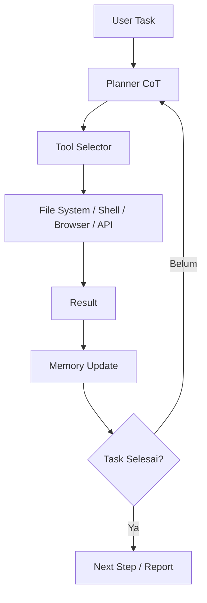
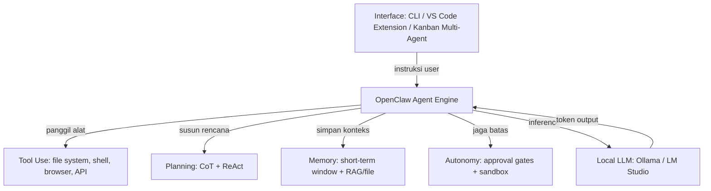
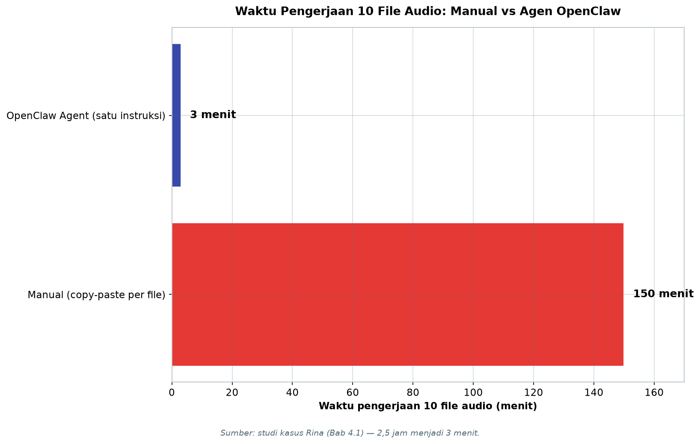

# Bab 4.1: Filosofi OpenClaw — Mengapa Agen Otonom Masa Depan Komputasi

> Bayangkan Anda punya seorang asisten yang bukan sekadar menjawab pertanyaan, tetapi benar-benar menyelesaikan pekerjaan: membuka file, menjalankan perintah, memeriksa hasil, lalu melapor. Itulah pergeseran terbesar sejak GUI menggantikan baris perintah — komputasi tidak lagi dioperasikan, melainkan dipercayakan. Bab ini membuka paradigma *agentic computing* melalui kacamata OpenClaw, platform agen otonom lokal yang menjadikan kata-kata sebagai kendali mesin.

---

## 1. Tujuan Sub-Bab


Setelah membaca sub-bab ini, Anda akan mampu:

- Menjelaskan mengapa agen otonom — bukan chatbot pasif — adalah lompatan berikutnya dalam komputasi personal
- Membedakan secara fundamental antara LLM sebagai chatbot (pasif, *stateless*) dan LLM sebagai agen (aktif, *stateful loop*)
- Memahami filosofi OpenClaw: *tool use*, *planning*, *memory*, dan *autonomy* sebagai empat pilar *agentic computing*
- Menimbang keuntungan pendekatan *local-first* dibandingkan API cloud, berikut tantangan keamanannya
- Membangun agen pertama sederhana di CLI dan simulasi *agent loop* dalam Python

---

## 2. Dari Chatbot ke Agent: Mesin Ketik vs Robot


### Mesin Ketik yang Sangat Pintar

Selama tiga tahun terakhir, kita terbiasa memperlakukan LLM seperti *mesin ketik supercerdas*: kita mengetik pertanyaan, ia membalas teks, lalu sesi berhenti. Setiap percakapan baru dimulai dari nol — tanpa ingatan atas percakapan sebelumnya, tanpa kemampuan menyentuh apa pun di luar jendela percakapan. Ini model **chatbot pasif**: *request* masuk, *respons* teks keluar. Tidak lebih.

Keterbatasannya nyata: chatbot tidak bisa membuka file untuk Anda, tidak bisa menjalankan `git commit`, tidak bisa membuat folder, dan tidak bisa mencari data di database Anda. Ia hanya bisa *menuliskan* instruksinya — sisanya terserah Anda menyalin dan menempelkan secara manual. Selama bertahun-tahun kita menerima keterbatasan ini semata-mata karena belum ada alternatifnya.

### Robot yang Bekerja

Sekarang bayangkan yang sebaliknya: Anda memberi tahu komputer sebuah **intensi** — "rapikan folder unduhan sesuai jenis file" — dan komputer mengurai tugas itu sendiri: melihat isi folder (*observasi*), menyusun rencana penyortiran (*reasoning*), memindahkan file (*action*), memeriksa hasilnya (*observasi lagi*), lalu mengulang siklus sampai selesai. Inilah pola **agent aktif**: *observasi → reasoning → action → observasi*, berputar dalam satu lingkaran yang oleh para peneliti disebut *agent loop* [4].

Perbedaan ini bukan sekadar teknis — ia filosofis. Chatbot menjawab pertanyaan; agen menyelesaikan pekerjaan. Chatbot menulis resep masakan; agen pergi ke dapur, mengambil bahan, memasak, dan menyajikan. Seperti analogi yang dipakai di *guideline* (panduan): satu adalah *mesin ketik*, satu lagi *robot*. Keduanya sama-sama "pintar", tetapi hanya satu yang bisa bertindak di dunia nyata. Survei komprehensif Acharya et al. (2025) menegaskan bahwa pergeseran dari model pasif ke agen otonom adalah salah satu arah paling fundamental riset AI saat ini [1].

Implikasi perubahan ini menjangkau cara kerja kita sehari-hari. Jika sebelumnya produktivitas digital dibatasi oleh seberapa cepat jari Anda mengetik atau seberapa hafal Anda pada menu aplikasi, kini dibatasi oleh seberapa jelas Anda merumuskan keinginan. Tugas-tugas repetitif — merapikan folder, mengganti nama ratusan file, mengompilasi laporan dari data mentah — bukan lagi pekerjaan yang "menunggu programmer menulis skrip", melainkan pekerjaan yang bisa didelegasikan dalam satu kalimat. Inilah yang dimaksud para peneliti ketika menyebut agen sebagai *paradigma baru interaksi manusia-komputer* [3]: bukan antarmuka yang lebih pintar, tetapi *pembagian kerja* yang baru antara manusia dan mesin.

Secara historis, setiap lompatan antarmuka selalu menggeser kurva keahlian. Di era *command line*, keahlian adalah menghafal sintaks; di era GUI, keahlian adalah mengenali pola visual; di era agentic, keahlian bergeser menjadi *kejelasan intensi dan kemampuan menyusun rencana yang bisa dipahami mesin*. Konsekuensinya menarik: orang yang tidak pernah belajar pemrograman kini bisa "memprogram" komputer — cukup dengan kalimat yang terstruktur baik.

### Tabel 1: Chatbot vs Agent — Perbandingan Fundamental

Berikut peta perbedaan paling esensial antara dua paradigma yang menentukan cara kita berinteraksi dengan komputer.

| Dimensi | Chatbot (Pasif) | Agent (Aktif) |
|:---|:---|:---|
| **Input/Output** | Teks → Teks | Observasi → Action |
| **State** | Stateless per turn | Stateful (konteks berkelanjutan) |
| **Tool Access** | Tidak ada | File system, API, shell, browser |
| **Loop** | Single turn | Think → Act → Observe → Repeat |
| **Kontrol** | Sepenuhnya manual | Autonomi dengan supervision |
| **Use Case** | Tanya jawab | Otomasi workflow kompleks |
| **Keamanan** | Rendah (hanya teks) | Tinggi (perlu sandbox) |

Setelah membaca baris per baris, pola yang terlihat bukanlah "chatbot yang ditingkatkan", melainkan dua kelas sistem yang berbeda secara fundamental. Dimensi yang paling menentukan adalah *Loop* dan *Kontrol*: chatbot berhenti setelah satu jawaban karena manusia yang memegang semua kendali, sedangkan agen terus berputar pada *Think → Act → Observe* karena kendali dieksekusi oleh sistem. Konsekuensinya, *keamanan* berbanding terbalik dengan kenyamanan — semakin aktif sistem, semakin besar tanggung jawab yang Anda pikul. Pilihan "chatbot atau agen" karena itu bukan pilihan teknis semata, melainkan pilihan tentang seberapa besar kendali yang ingin Anda serahkan.


### Gambar 1: Agent Loop — Siklus Observe-Think-Act

Jantung *agentic computing* adalah lingkaran perhatian: sebuah putaran yang terus berulang sampai tugas selesai.



Diagram ini menunjukkan *agent loop* dalam bentuk paling murni: tugas masuk ke *Planner* yang menyusun langkah (CoT), *Tool Selector* memilih alat yang tepat, alat dieksekusi, hasilnya diamati, dan memori diperbarui. Keputusan ada di *diamond* di tengah: bila tugas belum selesai, putaran kembali ke *Planner* dengan memori yang lebih kaya — ini yang membuat setiap iterasi lebih cerdas dari iterasi sebelumnya. Bila selesai, agen melapor. Poin penting yang sering luput: tidak ada *arrow* yang keluar dari diagram ini menuju manusia — intervensi manusia hanya terjadi melalui *approval gates* di titik-titik tertentu, bukan di setiap langkah. Inilah keseimbangan *autonomy with supervision* yang menjadi ciri khas OpenClaw.

Dua varian *loop* ini layak dikenal. *Single-step loop* — pola paling sederhana, cocok untuk tugas seperti transkripsi file — menjalankan satu siklus *plan → act → observe* lalu berhenti. *Multi-step loop* — seperti pada diagram di atas — berulang hingga kriteria selesai terpenuhi, dan inilah yang dibutuhkan tugas seperti "bersihkan direktori proyek" yang melibatkan puluhan keputusan kecil. Perbedaan keduanya persis seperti membeli bahan sekali (*single*) dibandingkan berbelanja sambil memeriksa dapur setiap kali (*multi*): yang kedua lebih lambat per langkahnya, tetapi lebih hemat dan tepat sasaran untuk tugas kompleks. ReAct [4] adalah contoh formal dari *multi-step loop* yang akan dibedah di Bab 4.3.


---

## 3. Apa Itu OpenClaw?


### Platform Agen Otonom Open-Source

**OpenClaw** adalah platform agen otonom *open-source* yang dirancang untuk komputasi lokal: agen yang bisa Anda jalankan di mesin sendiri, dengan model LLM lokal atau API pilihan Anda [6]. Ia bukan sekadar aplikasi chat — ia adalah lapisan *orchestrator* yang menghubungkan LLM dengan kemampuan nyata: *file system*, *shell*, *browser*, dan API. Dengan kata lain, OpenClaw adalah "jembatan" yang mengubah otak (LLM) menjadi tangan (tool).

Posisinya dalam ekosistem 2026 sangat menarik. Di satu sisi ada *coding agent* seperti Cline yang fokus pada repositori kode [7]; di sisi lain ada platform otomasi umum tempat agen bebas menentukan peralatannya sendiri. OpenClaw memilih jalur kedua dengan penekanan pada kedaulatan lokal: model, data, dan kontrol tetap berada di mesin Anda.

Perlu digarisbawahi: OpenClaw bukanlah model AI. Ia tidak dilatih, tidak mengeluarkan *token*, dan tidak boleh disamakan dengan "otak" di baliknya. OpenClaw adalah *sistem saraf* yang menghubungkan otak (LLM lokal via Ollama/LM Studio atau LLM API) dengan otot (tool). Konsekuensi desainnya penting: kualitas `otak` menentukan *kecerdasan* agen, sementara kualitas `sistem saraf` menentukan *kelincahan* agen. Anda bisa mengganti otak — dari model 8B untuk tugas ringan hingga DeepSeek V4 Flash untuk tugas berat — tanpa mengganti kerangka kerjanya. Analogi yang tepat: OpenClaw adalah *rangka dan otot*, sedangkan LLM adalah *otak* yang bisa dicangkok.

### Tiga Prinsip Desain

Filosofi OpenClaw bertumpu pada tiga pilar desain. Pertama, **human-in-the-loop autonomy** — agen boleh otonom, tetapi keputusan berisiko tetap melewati persetujuan manusia. Kedua, **tool-first** — kemampuan agen diukur dari seberapa banyak tool (alat) yang bisa ia kendalikan, bukan dari panjang percakapan. Ketiga, **local-first** — seluruh *pipeline* (alur kerja), dari model hingga penyimpanan, berjalan di mesin sendiri demi privasi dan kedaulatan data.

Prinsip pertama inilah yang membedakan OpenClaw dari eksperimen agen "liar" yang berjalan tanpa pengawasan. Konsep *human-in-the-loop* ini bukan hal baru dalam literatur: Cheng et al. (2024) mengkategorikan agen cerdas berdasarkan tingkat otonominya dan menempatkan kolaborasi manusia-agen sebagai kelas penting dari sistem agentic [5]. Dengan *approval gates*, OpenClaw mengkomersialkan konsep itu menjadi fitur sehari-hari.

Sebagai ilustrasi berlawanan, bayangkan agen tanpa *approval gate* yang diminta "rapikan file proyek" — ia mungkin dengan percaya diri menghapus `backup_2020.tar.gz` karena tampak "usang". Dengan *approval gate*, keputusan destruktif semacam itu berhenti di meja Anda: agen melaporkan rencananya, menunggu persetujuan, dan baru bertindak setelah Anda menekan *enter*. Kesalahan tetap mungkin terjadi, tetapi *dampak* kesalahan dibatasi oleh satu keputusan manusia — bukan oleh imajinasi agen.

### Ekosistem

OpenClaw tidak hidup sendiri. Ia hadir dalam empat bentuk yang saling melengkapi: **CLI** untuk pengguna terminal (paling fleksibel, paling ringan), **ekstensi VS Code** untuk developer yang bekerja dengan kode, **SDK** (misalnya Python) untuk membangun agen kustom, dan **Kanban multi-agent** untuk memvisualisasikan beberapa agen yang bekerja paralel pada tugas berbeda — semacam papan Trello tempat setiap kartu dipegang oleh agen yang berbeda. Empat antarmuka ini berbagi satu *engine* yang sama, sehingga tugas yang sama bisa dijalankan dari mana saja.

Pilih antarmuka berdasarkan konteks kerja Anda, bukan berdasarkan mode. Pengguna yang sering bekerja di terminal akan betah di CLI karena ia bisa dipanggil dari dalam skrip dan *cron job* — otomasi yang mengotomasi otomasi. Pengembang yang menulis kode sepanjang hari lebih produktif dengan ekstensi VS Code karena konteks kode langsung tersedia bagi agen. Tim yang mengawasi banyak tugas paralel mendapat manfaat dari Kanban: setiap kartu adalah satu agen, setiap kolom adalah tahap pengerjaan, dan status terlihat sekilas tanpa membuka log. Semua pintu masuk ini menuju *engine* yang sama, sehingga menguasai satu berarti menguasai semuanya — inilah keputusan desain yang membuat OpenClaw mudah diadopsi bertahap.

### Gambar 2: Stack Filosofi OpenClaw — Tiga Lapisan

Arsitektur OpenClaw tersusun berlapis seperti makanan siap saji: antarmuka di atas, mesin di tengah, otak di bawah.



Tiga lapisan terlihat jelas. Lapisan atas adalah antarmuka yang beragam — CLI untuk ketangkasan, VS Code untuk coding, Kanban untuk pengawasan multi-agen. Lapisan tengah adalah *OpenClaw Agent Engine* yang merangkai empat pilar: *Tool Use*, *Planning*, *Memory*, dan *Autonomy*. Lapisan bawah adalah *Local LLM* (via Ollama atau LM Studio) yang menjadi otak — dengan *arrow* kembali ke atas, memperlihatkan bahwa hasil inference selalu mengalir balik ke engine untuk langkah berikutnya. Kecantikan arsitektur ini ada pada *decoupling*: Anda bisa mengganti lapisan bawah (dari model 8B ke DeepSeek V4 Flash) atau lapisan atas (dari CLI ke Kanban) tanpa menyentuh mesin di tengah.

---


---

## 4. Empat Pilar Agentic Computing


### Pilar 1: Tool Use (Function Calling)

Pilar pertama adalah kemampuan agen memanggil alat: API sistem operasi, *file system*, *browser*, dan *terminal*. Inilah yang mengubah LLM dari orator menjadi pekerja. Alih-alih menulis teks "silakan jalankan perintah berikut", agen memproduksi *structured call* — nama fungsi dan argumen yang siap dieksekusi. Teknik ini dibahas mendalam di Bab 4.2, tetapi intinya: *tool use* adalah tangan dari agen, sementara penalaran adalah otaknya.

### Pilar 2: Planning & Reasoning (Perencanaan dan Penalaran)

Pilar kedua adalah kemampuan menyusun rencana dan menalarnya langkah demi langkah. Teknik **Chain-of-Thought (CoT)** dan **ReAct** memungkinkan agen mendekomposisi tugas besar menjadi langkah-langkah kecil yang bisa dieksekusi berurutan [2][4]. Di Bab 4.3 Anda akan melihat bagaimana pola *Thought → Action → Observation* menjadi tulang punggung agen yang bisa berpikir sambil bekerja.

### Pilar 3: Memory (Memori)

Pilar ketiga adalah memori. Agent yang baik tidak boleh lupa: konteks jangka pendek disimpan dalam *prompt window* model (ingatan kerja), sementara pengetahuan jangka panjang disimpan di luar — sebagai file, database, atau hasil *retrieval* (RAG). Memori inilah yang membuat agen "konsisten" di sepanjang sesi panjang, menyambungkan pekerjaan dari langkah pertama hingga terakhir, dan belajar dari kesalahan di langkah sebelumnya.

### Pilar 4: Autonomy (Otonomi)

Pilar terakhir adalah **autonomy**: kemampuan mengeksekusi rangkaian langkah berganda tanpa intervensi manusia — tentu dengan *safety guard*. Tingkat otonomi bisa diatur: dari "tanyakan setiap langkah" hingga "jalan sendiri, lapor hasil akhir". Wang et al. (2024) dalam survei mereka menunjukkan bahwa komponen dasar agen — perencanaan, memori, dan aksi — justru menjadi berarti penuh ketika digabungkan melalui siklus otonomi yang berulang [2]. Tanpa otonomi, agen hanyalah chatbot dengan akses *shell*; dengan otonomi, ia menjadi karyawan digital.

Empat pilar ini tidak bekerja sendiri-sendiri — ia saling menguatkan seperti kaki meja. *Tool use* tanpa *planning* menghasilkan aksi yang kacau; *planning* tanpa *tool use* menghasilkan rencana yang tak pernah dieksekusi; keduanya tanpa *memory* akan mengulang kesalahan yang sama berulang kali; dan semuanya tanpa *autonomy* hanya menjadi saran yang harus Anda kerjakan sendiri. OpenClaw merangkai keempatnya dalam satu *loop* — seperti yang akan Anda lihat pada Gambar 1 — sehingga kekuatan totalnya lebih besar daripada jumlah kekuatan parsial masing-masing. Xi et al. (2025) menyebut integrasi semacam ini sebagai ciri pembeda agen generasi terbaru dibandingkan sistem AI generasi sebelumnya [3].

---

## 5. Passive LLM vs Active Agent


Setelah memahami empat pilar, kita bisa memetakan perbedaan *chatbot* dan *agent* secara tegas. Chatbot bekerja dalam satu putaran (*single-turn*): pertanyaan masuk, jawaban keluar, selesai. Ia *stateless* — tidak mengingat apa-apa antar putaran — dan tidak memiliki akses ke alat apa pun. Agent bekerja dalam banyak putaran (*multi-turn*): ia mengamati, berpikir, bertindak, mengamati lagi, dan mengulang sampai tuntas. Ia *stateful* — konteks terus diperbarui di setiap langkah — dan punya akses ke *file system*, API, *shell*, dan *browser*.

Contoh nyata yang mudah dikenali: ChatGPT adalah *passive LLM* — mumpuni dalam percakapan, tetapi buntu ketika diminta "tolong backup folder saya". OpenClaw atau Cline adalah *active agent* — dengan satu instruksi, mereka menyusun rencana, menjalankan perintah, dan melaporkan hasil. Perbandingan lengkapnya dapat Anda lihat pada **Tabel 1** di seksi 2; poin terpentingnya adalah kontrol bergeser dari manusia yang mengoperasikan ke manusia yang *mengawasi*.

Perlu kejujuran di sini: kedua paradigma tetap punya tempatnya masing-masing di tahun 2026. Chatbot masih yang terbaik untuk menjawab pertanyaan cepat, menulis draf, dan mengoreksi teks — tugas yang satu putaran dan tidak menyentuh sistem Anda. Agen baru unggul ketika tugasnya *multi-step*, menyentuh banyak *tool*, dan berulang. Kesalahan umum yang dilakukan pengguna baru adalah memaksakan semua interaksi menjadi sesi agen; pemborosan yang sama seperti membawa robot ke meja untuk menanyakan "jam berapa sekarang". Kuncinya adalah *memilih alat sesuai tugas* — dan buku ini ditulis agar Anda bisa membedakan keduanya dengan cepat.

### Tabel 2: Perbandingan Filosofi Framework Agent

OpenClaw bukan satu-satunya framework agen yang ada. Tabel ini membandingkannya dengan tiga pesaing populer agar Anda tahu kapan masing-masing paling tepat.

| Aspek | OpenClaw | AutoGen (Microsoft) | LangChain Agents | CrewAI |
|:---|:---|:---|:---|:---|
| **Fokus** | Agen personal lokal | Multi-agent conversation | Chain/pipeline | Role-based crew |
| **Tool-first** | Ya (built-in) | Via plugin | Ya (integrations) | Ya |
| **Sandbox** | Docker-in-Docker | Tidak built-in | Tidak built-in | Tidak built-in |
| **Local LLM** | First-class | Via config | Via config | Via Ollama |
| **Human-in-loop** | Ya (approval gates) | Opsional | Opsional | Opsional |

Analisisnya menarik: OpenClaw adalah satu-satunya framework yang menjadikan *sandbox* dan *human-in-loop* sebagai fitur bawaan, bukan *add-on*. Bagi penggunaan personal dengan data sensitif, keduanya bukan kemewahan — melainkan prasyarat keamanan. AutoGen unggul bila Anda ingin meniru percakapan antar-agen, LangChain unggul sebagai lapisan integrasi umum, dan CrewAI unggul ketika tugas perlu dibagi per peran. Namun bila kriteria Anda adalah "agent lokal yang aman untuk dipakai setiap hari", OpenClaw menawarkan paket yang paling lengkap sejak awal — yang justru menjadi kelemahannya: ekosistem ketiganya lebih besar dan dokumentasi komunitasnya lebih banyak.


---

## 6. Mengapa Local-First?


### Privasi dan Latensi

Mengapa agen harus berjalan lokal, bukan di cloud? Alasan pertama adalah **privasi**. Ketika agen bekerja dengan file, email, atau database pribadi Anda, semua data itu tidak perlu meninggalkan mesin. Tidak ada yang diunggah ke server pihak ketiga, tidak ada jejak yang tersimpan di luar kendali Anda. Ini kontras tajam dengan agen cloud yang mengirim setiap konteks percakapan — termasuk isi dokumen yang Anda proses — ke penyedia.

Alasan kedua adalah **latensi** (keterlambatan). Setiap panggilan ke API cloud menempuh *network round-trip* yang menambah ratusan milidetik per langkah. Dalam *agent loop* yang bisa puluhan langkah, penundaan itu terakumulasi menjadi menit-menit yang sia-sia. Agen lokal memanggil GPU-nya sendiri dalam hitungan milidetik — bedanya seperti memasak di dapur sendiri dibanding memesan makanan dari restoran di seberang kota.

### Biaya dan Reliabilitas

Alasan ketiga adalah **biaya**: tanpa API, tidak ada biaya per *token*. Setelah perangkat keras terpasang, inference lokal berbiaya nol per pertanyaan. Alasan keempat adalah **reliabilitas**: agen lokal tidak peduli koneksi internet Anda putus, tidak peduli server penyedia sedang *maintenance*. Ia terus bekerja — bahkan di tengah perjalanan kereta tanpa sinyal. Bagi pengguna di Indonesia, empat alasan ini sangat relevan: koneksi yang tidak stabil, biaya API dalam USD, dan kekhawatiran privasi data membuat *local-first* bukan sekadar pilihan gaya, melainkan kebutuhan praktis.

### Kematangan Model Lokal

Argumen klasik penentang agen lokal adalah "model lokal kualitasnya kalah". Argumen itu semakin usang di 2026. **DeepSeek V4 Pro** (*open-weight*) dan **DeepSeek V4 Flash** (284 miliar parameter, 13 miliar aktif, lisensi MIT — bisa berjalan di workstation dua GPU kelas RTX 6000) membawa kualitas mendekati *frontier* cloud ke mesin sendiri.

**Mistral Large 3** (675 miliar parameter, Apache 2.0) menawarkan alternatif Eropa yang permisif untuk penggunaan komersial. Dan bila tugas membutuhkan akurasi tertinggi — misalnya *reasoning* hukum atau medis — agen lokal tetap bisa memanggil **Claude Fable 5** via API sebagai "penasihat ahli eksternal", termasuk kualitas *SWE-bench* 95% [Sumber?] yang menjadi standar industri 2026.

Kombinasi ini menjadikan agent lokal bukan sekadar mumpuni, tetapi sering kali pilihan yang lebih rasional.

Bahkan arsitektur paling pragmatis sekalipun — *hybrid* — berakar pada fondasi lokal: model lokal menangani 80% tugas rutin dengan biaya nol dan privasi penuh, sementara API *frontier* dipanggil hanya untuk tugas yang benar-benar membutuhkan akurasi maksimal. Dengan strategi ini, tagihan API bulanan bisa ditekan hingga sebagian kecil dari biaya penggunaan cloud penuh, tanpa mengorbankan kualitas pada titik-titik kritis. Inilah pola yang akan Anda lihat berulang kali di buku ini: *local-first, cloud-on-demand*.

---

## 7. Tantangan & Risiko: Kekuatan yang Perlu Sekering


Kekuatan agen adalah juga bahayanya. Setiap pilar yang membuat agen berguna — akses *shell*, otonomi, memori — adalah permukaan serangan baru. Risiko pertama: **keamanan**. Agen dengan akses *shell* bisa menghapus data, menimpa file penting, atau menjalankan perintah yang merusak sistem. Kesalahan satu argumen dalam satu panggilan tool bisa berarti hilangnya folder yang berisi tahunan pekerjaan. Risiko kedua: **halusinasi yang berbahaya**. Jika agen salah menalar, ia bisa mengeksekusi perintah yang salah — dan karena ia "percaya diri", kesalahan ini bisa berlangsung beberapa langkah sebelum terdeteksi [1].

Solusinya berlapis, seperti *sekering* (pengaman arus) pada peralatan listrik. Pertama, **sandboxing Docker**: jalankan agen di kontainer yang terisolasi sehingga kerusakan tidak menjalar ke sistem utama. Kedua, **approval gates**: perintah berisiko (menghapus, menimpa, mengirim data keluar) menunggu persetujuan manusia. Ketiga, **permission system**: setiap tool memiliki izin granular — agent boleh membaca, tetapi tidak boleh menulis; boleh mengakses satu folder, tetapi tidak seluruh disk. Filosofi OpenClaw merangkumnya dalam satu aturan sederhana: **delegasikan tugas, tetapi jangan pernah mengirimkan kedaulatan**. Bab 4.8 buku ini akan membahas keamanan sandbox secara menyeluruh.

Dalam praktiknya, keamanan agen adalah *manajemen risiko*, bukan *penghapusan risiko*. Mustahil membuat agen yang serba bisa dan serba aman sekaligus; yang bisa diatur adalah *peluang dan dampak* kecelakaan. Analisis risiko sederhana berbunyi seperti ini: tool apa yang paling berbahaya? (jawabannya *shell* dan *database*), kapan ia paling sering salah? (saat instruksi ambigu), dan berapa besar kerugian jika salah? (sebanding dengan apa yang bisa disentuh agen). Dari tiga jawaban itu Anda bisa menyusun kebijakan: batasi tool berbahaya dengan sandbox, minta konfirmasi untuk instruksi ambigu, dan sempitkan akses agen ke folder kerja saja. Kebiasaan ini — berpikir seperti *insurer* sebelum berpikir seperti *programmer* — membedakan pengguna agen yang bertahan lama dari yang berhenti setelah satu kecelakaan.

### Tabel 3: Evolusi Komputasi Personal

Sejarah komputasi personal adalah sejarah pergeseran pusat kendali — dari keyboard, ke mouse, ke browser, dan kini ke kalimat.

| Era | Paradigma | Interaksi | Contoh |
|:---|:---|:---|:---|
| **1980s** | Command Line | Keyboard → Perintah | MS-DOS, Bash |
| **1990s** | GUI | Mouse → Visual | Windows, Mac OS |
| **2010s** | Cloud/SaaS | Browser → Server | Google Docs, ChatGPT |
| **2020s** | Agentic AI | Natural Language → Action | OpenClaw, Cline |

Membaca tabel ini secara diagonal, pola yang konsisten adalah *penurunan hambatan*: setiap era baru memindahkan lebih banyak pengetahuan teknis dari manusia ke mesin. Di era command line, Anda harus hafal sintaks; di era GUI, Anda cukup mengenali ikon; di era cloud, Anda cukup mengetik alamat; di era agentic, Anda cukup *mengatakan apa yang Anda inginkan*.

Perhatikan juga arahnya: komputasi personal berputar dari *lokal* (1980s) ke *terpusat* (2010s) dan kembali ke *lokal* (2020s) — kali ini dengan mesin yang mengerti maksud manusia. Inilah alasan mengapa agen lokal, bukan chatbot cloud, dipandang sebagai puncak evolusi ini.

---


---

## 8. Praktikum / Hands-On


### Langkah 1: Instal OpenClaw CLI

Cara tercepat merasakan *agentic computing* adalah memasang OpenClaw CLI. Pastikan Node.js versi LTS sudah terpasang.

```bash
# Pasang OpenClaw CLI secara global
npm install -g @openclaw/cli

# Verifikasi pemasangan
openclaw --version
```

### Langkah 2: Agen Pertama Anda

Sekarang kita buat proyek agen pertama dan beri ia tugas sederhana di dunia nyata.

```bash
# Buat direktori proyek dan masuk ke dalamnya
mkdir my-first-agent && cd my-first-agent

# Inisialisasi konfigurasi agen (membuat openclaw.json)
openclaw init

# Jalankan agen dengan satu instruksi
openclaw run "Buat folder project baru dan inisialisasi git"
```

**Output yang diharapkan:** agen akan (1) membuat folder *project*, (2) menjalankan `git init`, (3) membuat file `README.md` sebagai penanda, dan (4) melaporkan hasil setiap langkah ke terminal. Perhatikan bahwa Anda tidak memberi perintah satu per satu — Anda memberi *intensi*, agen yang menerjemahkannya menjadi aksi. Bandingkan dengan cara kerja ChatGPT yang hanya akan mengetikkan perintahnya untuk Anda salin.

### Langkah 3: Simulasi Agent Loop dengan Python

Untuk memahami mekanika di balik CLI, mari kita bangun simulasi *agent loop* terkecil yang tetap jujur terhadap filosofi OpenClaw.

```python
# simple_agent.py — simulasi agent loop filosofi OpenClaw
import json
import ollama

class SimpleAgent:
    def __init__(self, llm="llama3.1:8b"):
        self.model = llm
        self.memory = []
        self.tools = {
            "create_file": self.create_file,
            "list_dir": self.list_dir,
        }

    def create_file(self, path, content=""):
        with open(path, "w") as f:
            f.write(content)
        return f"{path} dibuat ({len(content)} karakter)"

    def list_dir(self, path="."):
        import os
        return os.listdir(path)

    def think(self, task):
        prompt = f"""Task: {task}
Memory: {self.memory}
Pilih tool yang tersedia: create_file (args: path, content) atau list_dir (args: path).
Kembalikan JSON: {{"tool": "...", "args": {{...}}}}"""
        resp = ollama.chat(
            model=self.model,
            messages=[{"role": "user", "content": prompt}],
            options={"temperature": 0.0},
        )
        raw = resp["message"]["content"]
        try:
            return json.loads(raw)
        except json.JSONDecodeError:
            return {"tool": "create_file",
                    "args": {"path": "hello.txt", "content": "Hello World"}}

    def act(self, decision):
        tool_name = decision["tool"]
        args = decision["args"]
        result = self.tools[tool_name](**args)
        self.memory.append({"step": tool_name, "result": result})
        return result

    def is_done(self, task):
        return "create_file" in [m["step"] for m in self.memory]

    def run(self, task):
        while not self.is_done(task):
            decision = self.think(task)
            result = self.act(decision)
            print(f"[Agent] {decision['tool']} → {result}")
        print("[Agent] Task selesai!")

# Contoh use case — pastikan Ollama berjalan dan model tersedia
agent = SimpleAgent(llm="llama3.1:8b")
agent.run("Buat file hello.txt dan isi dengan 'Hello World'")
```

Perhatikan tiga elemen kunci yang mencerminkan empat pilar: (1) `memory` — daftar langkah yang sudah dijalankan, membuat agen *stateful* (pilar memory); (2) `think` → `act` — siklus *reasoning* lalu *action* (pilar planning + tool use); (3) `while not self.is_done` — putaran otonom yang berhenti hanya ketika kriteria selesai terpenuhi (pilar autonomy). Dalam produksi, `think` menggunakan *tool definitions* resmi Ollama sehingga model benar-benar memilih dari daftar tool — persis seperti yang akan Anda pelajari di Bab 4.2.

Untuk menguji simulasi ini, pastikan Ollama berjalan (`ollama serve`) dan model `llama3.1:8b` sudah diunduh, lalu jalankan:

```bash
# Jalankan simulasi agent loop
python3 simple_agent.py

# Hasil yang diharapkan (kurang lebih):
# [Agent] create_file → hello.txt dibuat (11 karakter)
# [Agent] Task selesai!
```

Setelah berjalan, periksa file `hello.txt` di direktori yang sama — isinya "Hello World". Cobalah memodifikasi `is_done` sehingga agen harus menjalankan `list_dir` sebelum `create_file`, atau tambahkan tool ketiga (`delete_file`) untuk melihat bagaimana kebijakan *permission* seharusnya membatasi tool tersebut. Eksperimen kecil ini melatih naluri yang paling penting bagi pengguna agen: kemampuan membaca jejak langkah (*trace*) agen dan menebak keputusan berikutnya sebelum agen mengambilnya.

---

## 9. Studi Kasus: Migrasi dari ChatGPT ke Agent Lokal


**Profil:** Rina, seorang *content creator* yang setiap minggu merekam 10-20 file audio percakapan. Alur kerjanya konstan: ambil file dari folder rekaman → transkripsikan dengan Whisper → rangkum dengan LLM → simpan ringkasan ke aplikasi catatan lokal (Notion-Local). Masalahnya: seluruh proses ini *manual*.

**Dengan ChatGPT:** Rina harus membuka setiap file audio, mengunggahnya ke layanan transkripsi, menyalin hasilnya, menempelkannya ke ChatGPT dengan instruksi rangkum, menyalin lagi hasilnya, lalu menempelkannya ke aplikasi catatan. Satu file butuh ±15 menit kerja tangan. Untuk 10 file, itu 2,5 jam kerja monoton setiap minggu — belum termasuk risiko salah salin di salah satu *copy-paste*.

**Analisis pilihan:** Rina mempertimbangkan chatbot biasa (tetap manual), skrip Python keras (fleksibel tetapi harus ditulis ulang untuk setiap perubahan alur), dan agen lokal. Keputusan jatuh pada OpenClaw karena tiga alasan: (1) alurnya melibatkan tiga *tool* berbeda (file system, transkripsi, LLM) yang bisa dirangkai agen; (2) datanya bersifat pribadi (wawancara narasumber) sehingga *local-first* menjadi syarat mutlak; (3) alurnya berulang setiap minggu, sehingga biaya setup sekali terbayar berulang kali.

**Langkah solusi:** Rina menyiapkan satu folder `~/recordings`, lalu memberi agen satu instruksi: "Proses semua audio di folder `recordings`." Agen menyusun rencana (*planning*), menemukan 10 file (*tool use*), memanggil Whisper untuk transkripsi, merangkum dengan LLM lokal (*reasoning*), dan menyimpan hasilnya ke aplikasi catatan — semuanya dalam satu *agent loop* dengan pengawasan ringan.

**Hasil:** 10 file audio selesai dalam 3 menit tanpa intervensi — dari 2,5 jam menjadi 3 menit, sekitar 98% waktu terhemat. Angka ini bukan hasil *fine-tuning* atau arsitektur khusus; ia murni buah dari pergeseran paradigma. Rina tidak bekerja lebih cepat — ia *tidak bekerja*: komputer yang bekerja, ia yang mengawasi. Kecepatan hanya dibatasi oleh *throughput* transkripsi lokal dan kualitas model perangkum.



*Gambar 4.1-1 — Waktu pengerjaan 10 file audio turun dari 150 menit (manual) menjadi 3 menit dengan agen OpenClaw; hampir 98% waktu terhemat murni dari pergeseran paradigma, bukan dari optimasi kecepatan mengetik.*

**Pelajaran:** inti *agentic computing* bukanlah "komputer lebih cepat mengetik", melainkan *komputer mengerti intensi, bukan hanya instruksi*. Ketika manusia cukup berkata "apa yang diinginkan" dan komputer yang mengatur "bagaimana melakukannya", produktivitas melompat satu orde — dan inilah janji yang ditebus OpenClaw setiap hari. Dua pelajaran praktis menyertai: pertama, dokumentasikan alur Anda sebelum membuat agen — Rina menuliskan langkah-langkahnya di kertas dulu, dan *prompt* yang ia berikan kepada agen hampir sama persis dengan catatan itu; kedua, mulai dari satu alur yang paling menyakitkan, bukan dari yang paling canggih. Keberhasilan kecil pertama itulah yang membangun kepercayaan untuk migrasi alur-alur berikutnya.

---

## 10. Referensi


### Paper Jurnal/Konferensi

[1] Acharya, D., Kuppan, R., & Divya, B. (2025). *Agentic AI: Autonomous Intelligence for Complex Goals — A Comprehensive Survey*. IEEE Access, 13, 18912–18936. DOI: [10.1109/ACCESS.2025.3532853](https://doi.org/10.1109/ACCESS.2025.3532853) — Landasan filosofis dan taksonomi *agentic AI* sebagai paradigma komputasi baru.

[2] Wang, L., et al. (2024). *A Survey on Large Language Model based Autonomous Agents*. Frontiers of Computer Science, 18(6), 186345. DOI: [10.1007/s11704-024-40231-1](https://doi.org/10.1007/s11704-024-40231-1) — Framework terpadu konstruksi agen: komponen, aplikasi, dan evaluasi.

[3] Xi, Z., et al. (2025). *The Rise and Potential of Large Language Model Based Agents: A Survey*. Science China Information Sciences, 68, 121101. DOI: [10.1007/s11432-024-4222-0](https://doi.org/10.1007/s11432-024-4222-0) — Analisis evolusi LLM menuju agen: framework konstruksi dan aplikasi.

[4] Yao, S., et al. (2023). *ReAct: Synergizing Reasoning and Acting in Language Models*. ICLR. DOI: [10.48550/arXiv.2210.03629](https://arxiv.org/abs/2210.03629) — Landasan teknis *agent loop*: menggabungkan *reasoning trace* dan *action*.

[5] Cheng, Y., et al. (2024). *Exploring Large Language Model based Intelligent Agents: Definitions, Methods, and Prospects*. arXiv:2401.03428. DOI: [10.48550/arXiv.2401.03428](https://arxiv.org/abs/2401.03428) — Definisi dan taksonomi agen cerdas: kategorisasi *single* vs *multi-agent*.

### Referensi Pendukung (Dokumentasi/Repository)

[6] OpenClaw. *GitHub Repository*. [github.com/openclaw](https://github.com/openclaw)

[7] Cline. *Autonomous Coding Agent*. [github.com/cline/cline](https://github.com/cline/cline)

[8] Weng, L. (2023). *LLM-powered Autonomous Agents*. Lilian's Blog. [lilianweng.github.io](https://lilianweng.github.io/posts/2023-06-23-agent/)
