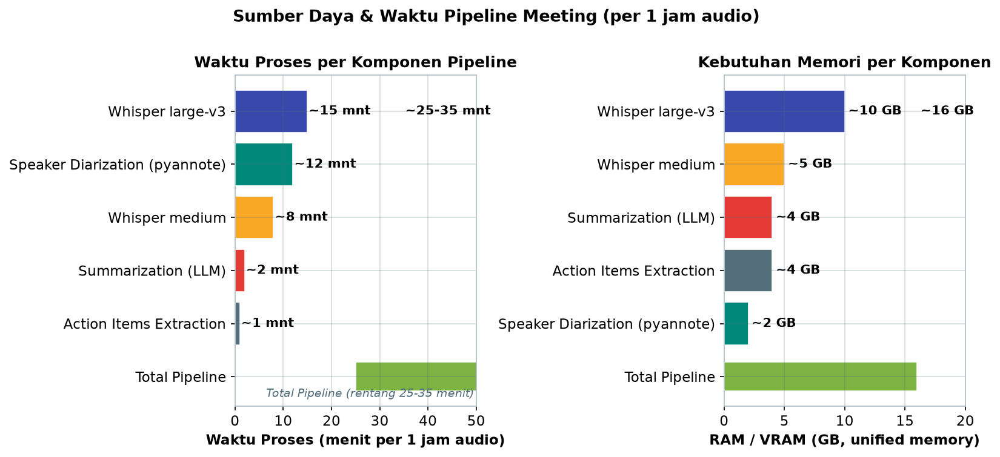
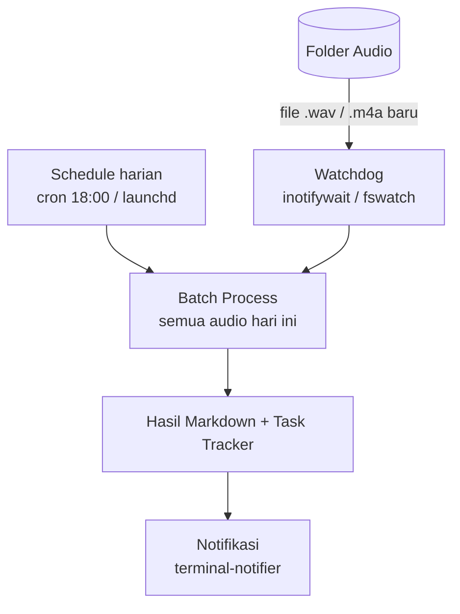

# Bab 4.10: Daily Workflow Automation

> Setiap minggu, ratusan juta jam kerja manusia menguap di dalam ruang meeting — dan sebagian besar isinya terlupakan begitu pintu tertutup. Bayangkan sebuah sistem yang mendengarkan setiap meeting Anda, menuliskan rangkumannya, mengekstrak daftar tugas, dan memasukkan semuanya ke *task tracker* — semuanya berjalan di mesin lokal tanpa cloud. Bab ini membangun pipeline tersebut, langkah demi langkah: dari audio mentah hingga daftar *action items* yang siap dikerjakan.

---

## 1. Tujuan Sub-Bab


Setelah membaca bab ini, Anda akan mampu:

- Membangun pipeline otomasi lengkap: audio meeting → transkrip → rangkuman → *task tracker*
- Mengintegrasikan *speech-to-text* (Whisper), LLM lokal, dan alat otomasi dalam satu *workflow* agen
- Mengonfigurasi *speaker diarization* untuk membedakan siapa berbicara kapan
- Menjadwalkan *workflow* harian dengan cron atau launchd agar berjalan otomatis
- Mengintegrasikan output ke *task tracker* seperti Taskwarrior, Todoist, atau Obsidian

---

## 2. Problem: Meeting Overload


### Jam yang Hilang dalam Meeting

Rata-rata pekerja profesional menghabiskan **10-15 jam per minggu** dalam meeting — dan ini bukan kabar buruknya. Kabar buruknya: sekitar 30% dari waktu itu terbuang untuk catatan manual. Seseorang harus menulis notulensi, merangkum keputusan, dan mengekstrak *action items*, biasanya sambil tetap mengikuti diskusi yang sedang berlangsung. Hasilnya adalah dokumen yang tidak lengkap, *action items* yang terlupakan, dan pertanyaan klasik di meeting berikutnya: "siapa yang bertanggung jawab untuk ini?"

Masalahnya bukan kekurangan informasi, melainkan kekurangan *filter*. Audio meeting mengandung semua informasi — termasuk 40 menit diskusi yang tidak relevan — dan otak manusia tidak dirancang untuk mendengarkan, menganalisis, dan mencatat secara simultan. Inilah celah yang diisi oleh pipeline otomasi: mesin yang mendengarkan dengan sabar, merangkum dengan cerdas, dan mengekstrak tugas dengan presisi, tanpa pernah bosan atau kehilangan konsentrasi.

### Solusi: Dari Audio ke Actionable Summary

Solusinya adalah **pipeline otomatis yang berjalan sepenuhnya lokal**: audio direkam dan disimpan di folder, kemudian setiap malam sebuah proses menjalankan empat tahap — transkripsi dengan Whisper, identifikasi pembicara dengan *speaker diarization*, perangkuman dengan LLM lokal, dan ekstraksi *action items* — lalu menulis hasilnya sebagai file Markdown dan memasukkan tugas ke *task tracker*. Tidak ada rekaman yang keluar dari mesin Anda, tidak ada biaya API per menit audio, dan privasi meeting tetap terjaga sepenuhnya.

---

## 3. Pipeline End-to-End


### Alur Lengkap

Pipeline ini memiliki tujuh tahap yang berurutan: **Audio → STT (Whisper) → Speaker Diarization → Rangkuman (LLM) → Ekstrak Action Items → Simpan ke Markdown → Integrasi Task Tracker**. Setiap tahap menghasilkan output yang menjadi input tahap berikutnya, membentuk rantai otomasi yang utuh. Diagram pada bagian 6 menggambarkan keseluruhan alur secara visual; Tutorial A pada bagian 8 memberikan implementasi Python lengkap dalam satu kelas.

Perhatikan filosofi desain *pipeline* ini: pemisahan tanggung jawab yang ketat. Whisper tidak merangkum, LLM tidak mentranskripsi, dan *task tracker* tidak berpikir — setiap komponen melakukan satu pekerjaan dengan baik. Ini membuat pipeline mudah di-debug (jika transkrip jelek, masalahnya di Whisper, bukan di LLM) dan mudah di-upgrade (ganti Whisper dengan model lebih baik tanpa menyentuh tahap lain).

### Semua Lokal, Privasi Terjaga

Keunggulan arsitektur ini dibandingkan layanan cloud seperti Otter.ai adalah kedaulatan data. Audio meeting — yang sering berisi informasi bisnis sensitif — tidak pernah diunggah ke server pihak ketiga. Whisper berjalan di mesin lokal, LLM diakses melalui Ollama di `localhost:11434`, dan output disimpan sebagai berkas biasa di direktori Anda. Konsekuensinya: *privacy-by-design*, tidak ada langganan bulanan, dan pipeline tetap berfungsi tanpa internet — asalkan semua komponen berjalan secara lokal.

---

## 4. Komponen Pipeline


### Audio Capture: Sumber Bahan Baku

Semua dimulai dari rekaman audio. Opsi yang umum digunakan: **Otter.ai** untuk mereka yang sudah menggunakannya di cloud, **QuickTime recording** di macOS untuk rekaman cepat, atau **Zoom lokal** yang menyimpan rekaman meeting otomatis ke folder tertentu. Apapun alatnya, aturannya sama: pastikan semua rekaman berakhir di satu folder pemantauan (misalnya `~/Documents/Meetings/Audio`) dalam format `.wav` atau `.m4a` — dua format yang didukung langsung oleh pipeline pada Tutorial A.

### STT: Whisper untuk Bahasa Indonesia

**Whisper** dari OpenAI adalah tulang punggung *speech-to-text* pipeline ini. Model *medium* dan *large-v3* adalah pilihan utama untuk Bahasa Indonesia — keduanya mendukung bahasa secara native dengan parameter `language="id"`. Dari Tabel A di bagian 4: Whisper *medium* membutuhkan sekitar 5 GB memori dengan akurasi sekitar 9% *Word Error Rate* (WER), sementara *large-v3* menawarkan akurasi lebih baik (sekitar 7% WER) dengan biaya 10 GB memori dan waktu proses hampir dua kali lipat. Untuk meeting harian, *medium* biasanya merupakan titik keseimbangan yang baik [3].

### Speaker Diarization: Siapa Bicara Kapan

Transkrip mentah hanyalah aliran kata tanpa pemilik. **Speaker diarization** — diimplementasikan oleh **pyannote-audio** — menjawab pertanyaan "siapa bicara kapan" dengan membagi transkrip ke dalam segmen-segmen pembicara. Dengan informasi ini, rangkuman bisa menyebut nama: "Alice memutuskan bahwa Feature X akan dideploy Jumat," bukan sekadar "diputuskan bahwa...". Akurasi diarization pyannote berada di sekitar 85% pada kondisi meeting normal; segmen yang salah diklasifikasikan biasanya pendek dan jarang mengubah makna keseluruhan. Perhatikan bahwa diarization memproses audio kedua (tahap terpisah dari transkripsi) sehingga waktu proses total bertambah sekitar 12 menit per jam audio — sesuai Tabel A.

### Summarization: LLM Menyusun Rangkuman

Tahap ketiga menggunakan LLM lokal — **DeepSeek V4 Flash** atau **Llama-3.1-8B** — untuk menyusun rangkuman terstruktur dari transkrip. *Prompt* dirancang untuk menghasilkan keluaran dengan format standar: key points dalam bentuk *bullet*, daftar *action items*, dan kesimpulan. *Temperature* rendah (0,2) digunakan di sini dengan sengaja: tugas perangkuman adalah pengurangan informasi, bukan kreativitas — kita ingin LLM konsisten, bukan imajinatif. LLM lokal menyelesaikan tahap ini dalam sekitar 2 menit untuk satu jam audio, dengan kebutuhan memori sekitar 4 GB.

### Action Items Extraction: Dari Prosa ke Tugas

Tahap keempat adalah pemisahan ulang: dari rangkuman prosa, ekstrak semua *action items* ke dalam **JSON array** berisi `task`, `owner`, dan `deadline`. Format JSON penting karena beberapa alasan: ia bisa di-*parse* secara deterministik (tidak ada prosa yang ambigu), bisa langsung dimasukkan ke *task tracker*, dan bisa diproses oleh script lain tanpa melibatkan LLM lagi. Jika parsing gagal, pipeline menangani *edge case* dengan mengembalikan array kosong daripada menabrak — desain yang toleran terhadap kesalahan.

### Output: Markdown dan Integrasi Task Tracker

Tahap terakhir menyimpan hasil sebagai **file Markdown** dengan *frontmatter* YAML (judul, tanggal, durasi, peserta) dan menuliskan *action items* terstruktur di bawah rangkuman. Format Markdown dipilih karena universal: bisa dibuka di editor apa pun, mudah dibaca manusia, dan mudah diproses script. Dari sini, integrasi ke *task tracker* — Taskwarrior, Todoist, Notion, atau Obsidian — dilakukan melalui API atau CLI masing-masing, seperti dibahas di Tabel C bagian 4.

### Tabel A: Pipeline Components & Resource

Tabel ini merangkum setiap komponen pipeline beserta kebutuhan sumber daya dan waktu pemrosesan untuk satu jam audio — jadikan ini acuan saat memilih konfigurasi mesin Anda.

| Komponen | Tool | RAM | VRAM | Waktu Proses (1 jam audio) | Akurasi |
|:---|:---|:---:|:---:|:---:|:---:|
| **STT (Indonesia)** | Whisper medium | ~5 GB | ~5 GB | ~8 menit | ~9% WER |
| **STT (Indonesia)** | Whisper large-v3 | ~10 GB | ~10 GB | ~15 menit | ~7% WER |
| **Speaker Diarization** | pyannote-audio | ~2 GB | ~2 GB | ~12 menit | ~85% |
| **Summarization** | DeepSeek V4 Flash / Llama-3.1-8B | ~4 GB | ~4 GB | ~2 menit | - |
| **Action Items Extraction** | DeepSeek V4 Flash / Qwen-2.5-7B | ~4 GB | ~4 GB | ~1 menit | - |
| **Total Pipeline** | - | ~16 GB | ~16 GB | ~25-35 menit | - |

Dari tabel ini, pesan utama tentang sumber daya: pipeline kelas ini berjalan nyaman di mesin dengan **16 GB memori** — angka yang sama untuk RAM dan VRAM karena pada Mac Apple Silicon keduanya adalah *unified memory*, sedangkan pada GPU NVIDIA Anda perlu memastikan VRAM setidaknya 10 GB untuk Whisper *large-v3*. Perhatikan trade-off Whisper: *large-v3* hanya menghemat 2 poin WER (9% → 7%) tetapi menggandakan waktu proses dan memori. Untuk meeting internal yang tidak terlalu menuntut, *medium* adalah pilihan rasional. Waktu total 25-35 menit untuk satu jam audio berarti pipeline paling praktis dijalankan sebagai *batch* malam hari — dan karena source file dipindahkan setelah diproses (lihat Tutorial C), pipeline secara alami hanya memproses audio baru.



*Gambar 4.10-1 — Whisper large-v3 adalah komponen termahal (15 menit, 10 GB) sementara diarization menyusul (12 menit); total 25-35 menit dan ~16 GB memori membuat pipeline ideal dijalankan sebagai batch malam hari.*


### Tabel C: Task Tracker Integration

Terakhir, perbandingan lima platform *task tracker* yang dapat menjadi tujuan akhir *action items* — dari yang paling sederhana hingga yang paling enterprise.

| Platform | API Method | Auth | Free Tier | Notes |
|:---|:---|:---|:---:|:---|
| **Taskwarrior** | CLI lokal | None | Ya | Setup paling mudah |
| **Todoist** | REST API | OAuth | Ya (5 project) | Sync multi-device |
| **Notion** | REST API | Internal Integration | Ya (personal) | Plus database |
| **Obsidian** | Local files | None | Ya | Markdown native |
| **ClickUp** | REST API | API Key | Ya (100MB) | Enterprise ready |

Dari tabel ini, rekomendasi berbeda untuk kebutuhan berbeda. **Taskwarrior** adalah pilihan yang paling sederhana dan paling selaras dengan filosofi lokal bab ini: CLI murni, tanpa autentikasi, dan tanpa cloud — satu perintah `task add` sudah memasukkan tugas ke database lokal. **Obsidian** sempurna jika Anda sudah menggunakannya sebagai *knowledge base*: karena output pipeline sudah berbentuk Markdown, integrasinya hanya menyalin file ke vault. **Todoist** cocok ketika tim Anda tersebar di perangkat — OAuth dan sinkronisasi multi-device membuat tugas muncul di ponsel semua orang. **Notion** menambah kekuatan *database* — Anda bisa membuat *view* per orang, per minggu, atau per proyek. **ClickUp** adalah pilihan enterprise dengan batasan *free tier* 100 MB. Aturan praktis: mulai dari Taskwarrior untuk kebutuhan pribadi, naikkan ke Notion atau ClickUp ketika kolaborasi tim membutuhkannya [8].

---


---

## 5. Format Output


### Frontmatter Standar

Setiap file hasil pipeline mengikuti format yang konsisten — ini bukan sekadar kerapian, melainkan desain yang membuat output bisa di-*parse* oleh alat lain. File dimulai dengan *frontmatter* YAML berisi `title`, `date`, `duration`, dan daftar `attendees`. Kemudian tiga bagian utama: **Key Points** (poin-poin diskusi dalam *bullet*), **Action Items** (tugas dengan pemilik dan *deadline*), dan referensi ke **Full Transcript** lengkap. Tutorial bagian 8 menghasilkan output persis dengan format ini; Tabel B memperlihatkan contoh lengkapnya.

### Mengapa Struktur Ini Penting

Format standar memberikan tiga keuntungan. Pertama, *action items* dengan format `[ ] tugas → deadline: tanggal` bisa dikenali oleh kode — sebuah *regex* sederhana cukup untuk mengekstraknya tanpa melibatkan LLM. Kedua, konsistensi format membuat file dari meeting yang berbeda bisa dibandingkan dan diagregasi — misalnya, rangkuman semua meeting minggu ini dalam satu tampilan. Ketiga, *frontmatter* memungkinkan integrasi langsung dengan alat seperti Obsidian yang membaca metadata YAML untuk menampilkan properti dokumen. Dengan kata lain: pilih format sekali, dan semua alat lain menyesuaikan.

### Tabel B: Format Structured Output

Tabel ini menunjukkan format output final yang dihasilkan pipeline — perhatikan struktur *frontmatter*, *key points*, dan *action items* yang konsisten, lengkap dengan pemilik dan *deadline*.

```markdown
---
title: "Sprint Planning Week 24"
date: 2025-06-16
duration: 45 menit
attendees: ["Alice", "Bob", "Charlie"]
---

## Key Points
- Feature X 80% selesai, target deploy Jumat
- Bug Y critical — perlu hotfix hari ini
- Q3 roadmap perlu direvisi

## Action Items
- [ ] Alice: Deploy Feature X → deadline: Jumat
- [ ] Bob: Hotfix Bug Y → deadline: Hari ini
- [ ] Charlie: Revisi Q3 roadmap → deadline: Rabu

## Full Transcript
[link ke file transcript.md]
```

Analisis format ini: setiap elemen memiliki tujuan teknis yang jelas. *Frontmatter* YAML memungkinkan *parser* (dan alat seperti Obsidian) membaca metadata tanpa menyentuh isi dokumen. Format `- [ ] Nama: Tugas → deadline: X` pada *action items* adalah kunci integrasi — pola ini bisa dikenali *regex* sederhana, ditampilkan sebagai *checkbox* di editor Markdown, dan diterjemahkan ke Taskwarrior sebagai tugas dengan *due date*. Satu catatan penting: *deadline* dalam bentuk nama hari ("Jumat", "Hari ini") membutuhkan konversi ke tanggal aktual pada tahap integrasi — sebuah langkah kecil yang sering dilupakan dan menyebabkan tugas terlupakan. Struktur inilah yang membuat output pipeline bukan sekadar catatan, melainkan *actionable data* [1].


---

## 6. Scheduling: Membuat Pipeline Berjalan Sendiri


### Cron dan Launchd

Pipeline yang harus dijalankan manual bukanlah otomasi. Untuk membuatnya berjalan mandiri, gunakan **cron** (Linux) atau **launchd** (macOS). Dengan *cron*, satu baris konfigurasi — misalnya `0 18 * * 1-5` — menjalankan *batch process* setiap hari kerja pukul 18:00, tepat setelah rapat hari itu selesai. *Launchd* adalah pendekatan macOS yang lebih modern dengan `LaunchAgent` plist; keunggulannya adalah *monitoring* dan *restart* otomatis jika proses gagal. Keduanya melayani tujuan yang sama: memindahkan pipeline dari "sesuatu yang saya jalankan" menjadi "sesuatu yang berjalan".

### Watchdog Folder dan Notifikasi

Selain penjadwalan berbasis waktu, pipeline bisa dipicu oleh **peristiwa**: sebuah *watchdog* memantau folder audio dan memproses setiap berkas baru begitu muncul. Library `watchdog` (Python) atau `inotifywait` (Linux) melayani tujuan ini; di macOS, `fswatch` adalah alternatif native. Dengan *watchdog*, hasil rangkuman tersedia dalam hitungan menit setelah meeting berakhir, bukan menunggu jadwal malam. Setelah proses selesai, **terminal-notifier** di macOS menampilkan notifikasi — "Rangkuman selesai: Sprint_Planning_W24.md" — sehingga Anda tidak perlu memeriksa folder secara manual.

Diagram berikut menggambarkan keseluruhan pipeline meeting otomasi — perhatikan urutan tahap yang membentuk rantai dari audio mentah hingga notifikasi selesai. ```mermaid flowchart LR A[Folder Audio\n.wav / .m4a] --> B[Whisper STT\nid language] B --> C[Speaker Diarization\npyannote-audio] C --> D[LLM Summarization\nDeepSeek V4 Flash] D --> E[Action Items\nEkstrak JSON] E --> F[Markdown Output\nfrontmatter + key points] F --> G[Task Tracker\nTaskwarrior / Notion] G --> H[Notifikasi\nterminal-notifier] ``` Diagram ini menunjukkan rantai tujuh tahap yang berurutan. Dimulai dari folder audio yang dipantau *watchdog*, pipeline mentranskripsi dengan Whisper (dengan parameter bahasa Indonesia), memisahkan pembicara dengan pyannote-audio, merangkum dengan LLM lokal, mengekstrak *action items* berformat JSON, menulis output Markdown, memasukkan tugas ke *task tracker*, dan menutupnya dengan notifikasi ke pengguna. Setiap tahap bergantung pada output tahap sebelumnya seperti rantai produksi. Keindahan desain ini: setiap *box* bisa diganti tanpa merusak yang lain — misalnya mengganti Whisper *medium* dengan *large-v3* hanya mengubah *box* kedua, sementara seluruh rantai tetap bekerja identik.

### Diagram Pelengkap: Trigger Scheduling

Untuk melengkapi, berikut dua mekanisme pemicu yang dibahas pada bagian 6 — jadwal tetap dan peristiwa *file baru*.



Diagram ini menunjukkan dua jalur menuju proses yang sama. Jalur atas berbasis jadwal: *cron* atau *launchd* men-trigger *batch process* pada waktu tertentu (misalnya 18:00 setiap hari kerja), yang memproses semua audio yang mengantri. Jalur bawah berbasis peristiwa: *watchdog* mendeteksi berkas audio baru di folder dan langsung memicu proses. Kedua jalur konvergen ke titik yang sama — hasil Markdown, integrasi *task tracker*, dan notifikasi. Dalam praktiknya, banyak pengguna mengaktifkan keduanya sekaligus: *watchdog* untuk respons cepat dan *cron* sebagai *backup* yang menjamin tidak ada meeting terlewat.

---


---

## 7. Extending Workflow: Melampaui Rangkuman


### Integrasi Notion, Obsidian, dan Kalender

Pipeline dasar ini adalah fondasi yang bisa diperluas ke berbagai arah. **Notion** dan **Obsidian** dapat menjadi rumah permanen rangkuman: Obsidian via *local files* (format Markdown native), Notion via *REST API* dengan *Internal Integration token*. Dari *action items* yang sudah berformat JSON, Anda bisa **auto-create calendar events** untuk setiap *deadline* — memperbolehkan kalender Anda menampilkan tenggat tugas meeting secara otomatis. **Email draft** juga bisa dihasilkan — "berikut rangkuman meeting hari ini beserta tugas masing-masing" — dan dikirim ke peserta meeting dengan satu perintah.

### Prinsip Modularitas

Semua ekstensi di atas berbagi satu prinsip: jangan mengubah pipeline inti. Rangkuman dan JSON *action items* adalah output yang stabil; ekstensi hanya membaca output itu dan melakukan hal baru. Ingin menambah satu integrator Notion? Tulis script kecil yang membaca folder Markdown dan mengunggah ke Notion — tanpa menyentuh `meeting_pipeline.py`. Modularitas inilah yang membuat pipeline umur panjang: kebutuhan hari ini adalah rangkuman meeting, kebutuhan bulan depan mungkin adalah *dashboard* kepatuhan — dan keduanya berbagi fondasi yang sama.

---

## 8. Tutorial / Hands-On


### Tutorial A: Full Pipeline Meeting Summarizer

Tutorial pertama adalah inti dari bab ini: satu kelas Python yang menjalankan seluruh pipeline — transkripsi, perangkuman, ekstraksi *action items*, dan penyimpanan output.

```python
# meeting_pipeline.py
import os
import json
import subprocess
from datetime import datetime
import whisper
import requests

class MeetingPipeline:
    def __init__(self):
        self.stt_model = whisper.load_model("medium")
        self.llm_url = "http://localhost:11434/api/generate"

    def transcribe(self, audio_path):
        """Step 1: Speech-to-text"""
        print(f"[1/4] Transkripsi {audio_path}...")
        result = self.stt_model.transcribe(
            audio_path, language="id",
            task="transcribe", verbose=False
        )
        transcript = result["text"]
        segments = result["segments"]

        # Simpan transcript
        transcript_path = audio_path.replace(".wav", "_transcript.txt")
        with open(transcript_path, "w") as f:
            for seg in segments:
                start = seg["start"]
                text = seg["text"]
                f.write(f"[{start:.0f}s] {text}\n")

        return transcript, transcript_path

    def summarize(self, transcript, meeting_title):
        """Step 2: LLM summarization"""
        print("[2/4] Membuat rangkuman...")
        prompt = f"""Buat rangkuman meeting dari transkrip berikut.

Judul: {meeting_title}
Transkrip:
{transcript[:8000]}

Format output:
## Key Points
- [poin utama 1]
- [poin utama 2]

## Action Items
- [ ] [tugas] → deadline: [tanggal]
- [ ] [tugas] → deadline: [tanggal]

## Kesimpulan
"""
        resp = requests.post(self.llm_url, json={
            "model": "deepseek-v4-flash",
            "prompt": prompt,
            "stream": False,
            "options": {"temperature": 0.2}
        })
        return resp.json()["response"]

    def extract_actions(self, summary):
        """Step 3: Ekstrak action items terstruktur"""
        print("[3/4] Ekstrak action items...")
        prompt = f"""Dari rangkuman meeting berikut, ekstrak semua action items dalam format JSON array.
Setiap item: {{"task": "...", "owner": "...", "deadline": "..."}}

Rangkuman:
{summary}

JSON:"""
        resp = requests.post(self.llm_url, json={
            "model": "deepseek-v4-flash",
            "prompt": prompt,
            "stream": False,
            "format": "json"
        })
        try:
            return json.loads(resp.json()["response"])
        except:
            return []

    def save_output(self, summary, actions, metadata):
        """Step 4: Simpan ke file markdown"""
        print("[4/4] Menyimpan output...")
        date = datetime.now().strftime("%Y-%m-%d")
        filename = f"meeting_{date}_{metadata['title'].replace(' ', '_')}.md"

        with open(filename, "w") as f:
            f.write(f"---\ntitle: \"{metadata['title']}\"\n")
            f.write(f"date: {date}\nduration: {metadata['duration']} menit\n---\n\n")
            f.write(summary)
            f.write("\n## Action Items (Structured)\n")
            for item in actions:
                owner = item.get("owner", "TBD")
                deadline = item.get("deadline", "TBD")
                f.write(f"- [ ] {item['task']} (Owner: {owner}, Deadline: {deadline})\n")

        print(f"Output: {filename}")
        return filename

    def run(self, audio_path, title="Untitled Meeting", duration=60):
        metadata = {"title": title, "duration": duration}
        transcript, _ = self.transcribe(audio_path)
        summary = self.summarize(transcript, title)
        actions = self.extract_actions(summary)
        output = self.save_output(summary, actions, metadata)
        print(f"\n✅ Pipeline selesai! File: {output}")

# Penggunaan
pipeline = MeetingPipeline()
pipeline.run("meeting_2025-06-16.wav",
             title="Sprint Planning Week 24",
             duration=45)
```

Beberapa detail penting dalam kode ini. Metode `transcribe` memanggil Whisper dengan `language="id"` — parameter yang menentukan akurasi untuk Bahasa Indonesia — dan menyimpan transkrip ber-timestamp dalam format `[detik] teks` untuk keperluan navigasi. Metode `summarize` mengirim transkrip (dipotong 8.000 karakter pertama) ke LLM lokal dengan `temperature 0.2` dan *prompt* yang mendefinisikan format output secara eksplisit. Metode `extract_actions` meminta LLM mengembalikan JSON — perhatikan opsi `"format": "json"` pada *payload* yang membuat Ollama memaksa output terstruktur, plus blok `try/except` yang mengembalikan list kosong jika parsing gagal agar pipeline tidak menabrak. Terakhir, `save_output` menulis frontmatter YAML dan `action items` terstruktur; penggunaan `item.get("owner", "TBD")` menjamin nilai *default* jika LLM tidak menyebut pemilik. Jalankan dengan file `.wav` meeting Anda dan amati empat tahap pencetakannya di terminal.

### Tutorial B: Folder Watcher Otomatis (macOS + launchd)

Tutorial kedua membuat pipeline berjalan sendiri: script pemantau folder yang memproses setiap audio baru dan memberi notifikasi.

```bash
# 1. Buat script watcher
cat > ~/bin/meeting_watcher.sh << 'SCRIPT'
#!/bin/bash
WATCH_DIR=~/Documents/Meetings/Audio
PROCESSED_DIR=~/Documents/Meetings/Processed

inotifywait -m "$WATCH_DIR" -e create -e moved_to |
    while read path action file; do
        if [[ "$file" == *.wav ]] || [[ "$file" == *.m4a ]]; then
            echo "[$(date)] New audio: $file"
            cd ~/Documents/Meetings
            python3 meeting_pipeline.py "$WATCH_DIR/$file"
            mv "$WATCH_DIR/$file" "$PROCESSED_DIR/"
            terminal-notifier -title "Meeting Pipeline" \
                -message "Rangkuman selesai: $file" \
                -sound default
        fi
    done
SCRIPT

# 2. Atau pakai cron untuk batch harian
echo "0 18 * * 1-5 cd ~/Documents/Meetings && python3 batch_process.py" | crontab -
```

Skrip ini menjalankan loop tak berujung: `inotifywait` memantau folder `WATCH_DIR` untuk peristiwa pembuatan berkas baru dan pemindahan masuk (`-e create -e moved_to`). Untuk setiap berkas `.wav` atau `.m4a` yang muncul, pipeline Python dipanggil, berkas asli dipindahkan ke folder `Processed` (mencegah pemrosesan ulang), dan notifikasi dikirim. Catatan untuk pengguna macOS: `inotifywait` adalah alat Linux — gunakan **fswatch** sebagai pengganti native, atau jalankan skrip ini di mesin Linux/WSL. Alternatif kedua pada baris terakhir menggunakan `cron` untuk *batch* harian setiap hari kerja pukul 18:00 — kombinasi yang umum digunakan: *watchdog* untuk respons cepat terhadap meeting mendadak, *cron* sebagai jaring pengaman untuk semua rekaman yang terlewat.

### Tutorial C: Batch Process Harian

Tutorial terakhir adalah versi *batch* — memproses semua audio yang mengantri di folder dalam satu kali jalan, yang dipicu oleh *cron* malam hari.

```python
# batch_process.py — proses semua audio hari ini
from meeting_pipeline import MeetingPipeline
from pathlib import Path
import sys

pipeline = MeetingPipeline()
audio_dir = Path("~/Documents/Meetings/Audio").expanduser()
processed_dir = Path("~/Documents/Meetings/Processed").expanduser()
processed_dir.mkdir(exist_ok=True)

audio_files = list(audio_dir.glob("*.[wW][aA][vV]")) + \
              list(audio_dir.glob("*.[mM]4[aA]"))

for i, audio in enumerate(audio_files):
    print(f"\n=== Processing {i+1}/{len(audio_files)}: {audio.name} ===")
    pipeline.run(str(audio), title=audio.stem)
    audio.rename(processed_dir / audio.name)

print(f"\n✅ Selesai! {len(audio_files)} meeting diproses.")
```

Kode ini menunjukkan pola *idempotent batch* yang aman untuk dijalankan berulang. Glob pattern `*.[wW][aA][vV]` mencakup semua variasi kapitalisasi ekstensi (`.wav`, `.WAV`, `.Wav`) — detail kecil yang mencegah berkas terlewat. Setiap berkas diproses melalui `pipeline.run()` lalu **dipindahkan** ke folder `Processed` dengan `audio.rename()`. Pemindahan bukan penghapusan: berkas tetap tersimpan sebagai arsip, tetapi tidak lagi berada di folder yang dipantau, sehingga batch berikutnya tidak memproses ulang audio yang sama. Judul meeting diambil dari nama berkas (`audio.stem`), sehingga penamaan berkas yang rapi — misalnya `sprint_planning_w24.wav` — menghasilkan judul yang langsung terbaca di output.

---

## 9. Studi Kasus: Otomasi Meeting Management — Startup 10 Orang


**Latar:** Sebuah startup teknologi beranggotakan 10 orang di Jakarta menghabiskan rata-rata 15 jam per minggu untuk meeting — sekitar 1,5 jam per orang, setiap hari. Notulensi ditulis bergiliran oleh anggota tim, sering terlambat dua hari, dan *action items* sering hilang antar-sprint. Dua pertanyaan berulang di setiap meeting mingguan: "apa hasil meeting kemarin?" dan "siapa yang pegang tugas ini?".

**Setup:** Tim engineering membangun pipeline yang dibahas di bab ini di atas **Mac Mini M4 Pro 48GB** — mesin yang cukup untuk menangani Whisper *medium* + LLM lokal 8B secara bersamaan (lihat Tabel A: total kebutuhan sekitar 16 GB, jauh di bawah kapasitas mesin). Semua meeting direkam melalui **Zoom** dengan opsi rekaman lokal yang otomatis tersimpan di folder `Documents/Meetings/Audio`.

**Workflow harian:** Setiap pukul 18:00, *cron* men-trigger `batch_process.py`. Pipeline menjalankan empat tahap: Whisper mentranskripsi semua audio hari itu, pyannote mengidentifikasi pembicara, DeepSeek V4 Flash (via Ollama) merangkum dan mengekstrak *action items*, lalu hasilnya disimpan ke vault **Obsidian** — yang juga berfungsi sebagai *knowledge base* tim — dan di-sinkronkan ke **Taskwarrior** melalui script kecil yang membaca JSON *action items*.

**Hasil:** Angka yang paling mencolok adalah waktu review: dari 15 jam meeting per minggu, tim kini hanya menghabiskan **30 menit** untuk mereview semua rangkuman — efisiensi 96% waktu yang dihemat untuk notulensi. *Action items* tidak lagi hilang: setiap tugas muncul di Taskwarrior dengan *owner* dan *deadline* dari hasil ekstraksi JSON, dan akhir sprint tidak lagi dimulai dengan pertanyaan "tugas siapa ini?". Satu penyesuaian yang mereka lakukan di minggu kedua: *prompt* rangkuman diperjelas agar menuliskan keputusan secara eksplisit ("KEPUTUSAN: ..."), karena tim menemukan bahwa keputusan sering tenggelam di antara diskusi.

**Pelajaran:** Studi kasus ini menunjukkan tiga faktor keberhasilan. Pertama, *hardware matters*: Mac Mini M4 Pro 48GB menangani seluruh pipeline dengan nyaman, dan *unified memory* membuat RAM dan VRAM tidak perlu dipisahkan. Kedua, *format consistency* adalah kunci adopsi: karena semua output mengikuti struktur frontmatter + action items, tim dengan cepat mengembangkan kebiasaan baru — membaca rangkuman pagi hari sebagai "surat kabar meeting". Ketiga, otomasi bukan pengganti manusia, melainkan pengganti pekerjaan yang paling dibenci manusia: mencatat. Review 30 menit tetap dilakukan manusia — tetapi yang direview adalah *ringkasan yang sudah jadi*, bukan jam rekaman mentah [5].

---

## 10. Referensi


### Paper Jurnal/Konferensi

[1] Yang, Y., et al. (2025). *Summaries, Highlights, and Action Items: Design, Implementation and Evaluation of an LLM-powered Meeting Recap System*. Proceedings of the ACM on Human-Computer Interaction (CSCW), 9(2), CSCW176. DOI: [10.1145/3711074](https://doi.org/10.1145/3711074) — Desain sistem *meeting recap* berbasis LLM: *highlights* vs *structured minutes*, evaluasi dengan 7 pengguna.

[2] Kirstein, F., et al. (2025). *Re-FRAME the Meeting Summarization SCOPE: Fact-Based Summarization and Personalization via Questions*. arXiv:2503.19843. DOI: [10.48550/arXiv.2503.19843](https://arxiv.org/abs/2503.19843) — *FRAME pipeline* untuk perangkuman meeting: *richness extraction* dan verifikasi fakta.

[3] Radford, A., Kim, J.W., Xu, T., et al. (2023). *Robust Speech Recognition via Large-Scale Weak Supervision*. Proceedings of the 40th International Conference on Machine Learning (ICML), 28492-28518. DOI: [10.48550/arXiv.2212.04356](https://arxiv.org/abs/2212.04356) — Paper Whisper: backbone *speech-to-text* pipeline; akurasi dan kebutuhan sumber daya pada Tabel A.

[4] Zhang, Y., et al. (2024). *AutoFlow: Automated Workflow Generation for Large Language Model Agents*. arXiv:2407.12821. DOI: [10.48550/arXiv.2407.12821](https://arxiv.org/abs/2407.12821) — Generasi *workflow* otomatis: dari bahasa alami ke pipeline agen.

[5] Patel, N., Patel, K. (2025). *AI-Powered Meeting Assistant: An LLM-Centric, Agentic AI Approach for Automating Post-Meeting Workflows*. Scientific Research Journal of Science, Engineering and Technology, 3(1), 55-60 — Arsitektur *end-to-end meeting assistant*: dari *audio ingestion* hingga integrasi *task tracker*.

### Referensi Pendukung

[6] Whisper (OpenAI). *GitHub Repository*. [https://github.com/openai/whisper](https://github.com/openai/whisper)

[7] pyannote-audio. *Speaker Diarization*. [https://github.com/pyannote/pyannote-audio](https://github.com/pyannote/pyannote-audio)

[8] Taskwarrior. *Task Management CLI*. [https://taskwarrior.org](https://taskwarrior.org)
