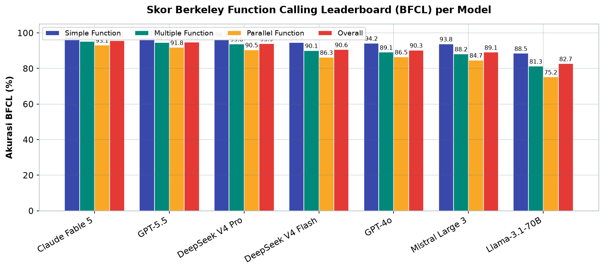
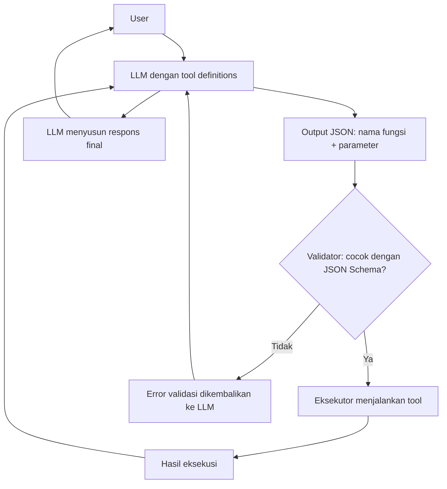
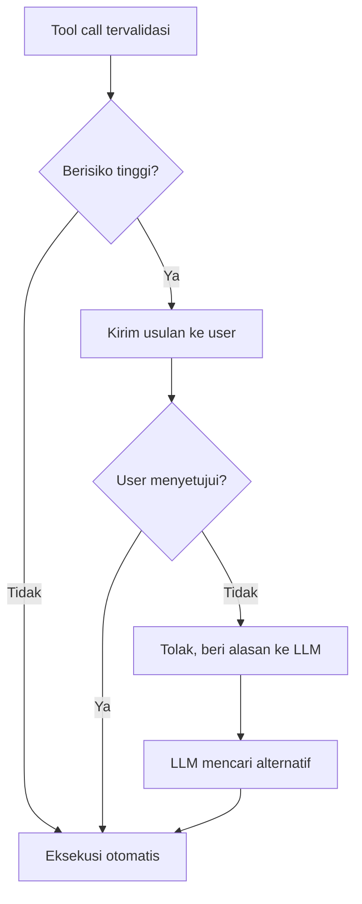

# Bab 4.2: Tool Use — Function Calling dengan JSON Schema

> Seorang resepsionis tidak membawakan barangnya sendiri — ia menulis surat tugas yang jelas, lalu bagian lain yang mengerjakan. Demikian pula LLM: ia tidak bisa menyentuh file, membuka browser, atau menjalankan perintah, tetapi ia bisa *menuliskan instruksi yang tepat* dalam format yang bisa dieksekusi mesin. Format itu bernama *function calling*, dan bahasanya adalah JSON Schema. Bab ini mengajarkan Anda menjadi penterjemah antara bahasa manusia, keputusan model, dan eksekusi sistem operasi.

---

## 1. Tujuan Sub-Bab

Setelah membaca sub-bab ini, Anda akan mampu:

- Menjelaskan mekanisme *function calling*: definisi tool → LLM memutuskan → eksekusi → hasil kembali ke LLM
- Menulis definisi tool (*tool definition*) dalam JSON Schema untuk berbagai API sistem
- Mengimplementasikan *function calling* dengan Ollama, OpenClaw, dan API yang kompatibel dengan OpenAI
- Menilai kekuatan dan kelemahan dukungan *function calling* antar provider (OpenAI, Anthropic, Ollama, Llama 3.1, Mistral, Gemini, DeepSeek V4, Claude Fable 5)
- Menerapkan *error handling* dan pola validasi "LLM proposes, human disposes" pada sistem agen

---

## 2. Konsep Dasar Function Calling

### Resepsionis yang Menulis Surat Tugas

**Function calling** (sering disebut *tool use*) adalah kemampuan LLM untuk menghasilkan **JSON terstruktur** yang berisi nama fungsi dan parameter — alih-alih teks bebas — ketika ia memutuskan bahwa sebuah tugas memerlukan alat eksternal. Analogi yang paling tepat: LLM adalah **resepsionis yang menulis surat tugas, bukan yang mengerjakan**. Saat seorang tamu meminta dokumen, resepsionis tidak mencetak dokumennya sendiri; ia menulis perintah yang jelas ("ke arsip, ambil map bernomor 42, bawa ke meja saya") yang kemudian dijalankan oleh bagian lain.

Alur lengkapnya terdiri dari empat tahap. Pertama, developer mendefinisikan *tool definitions* — daftar alat beserta deskripsi dan skema parameternya — dan mengirimkannya bersama pertanyaan user. Kedua, LLM *menalar*: apakah salah satu alat yang tersedia relevan dengan pertanyaan ini? Bila ya, ia mengeluarkan *tool call*: JSON berisi nama fungsi dan argumen. Ketiga, *kode Anda* — bukan LLM — yang mengeksekusi fungsi tersebut terhadap sistem nyata. Keempat, hasil eksekusi dikembalikan ke LLM, yang kemudian menyusun respons final yang menyandang data aktual. Konsep yang dicetuskan Toolformer (Schick et al., 2024) ini awalnya membuat model "belajar sendiri" menggunakan API [1]; kini ia menjadi fitur standar semua model modern.

### Mengapa Terstruktur Lebih Baik daripada Teks Bebas

Pembaca yang jeli akan bertanya: bukankah model bisa saja mengetik perintah dalam teks biasa, dan kita *parse* manual? Tentu bisa — tetapi dengan biaya yang tidak sebanding. Teks bebas itu ambigu: apakah "hapus file backup" berarti menghapus `backup.tmp` atau folder `backup/`? Format terstruktur menghapus ambiguitas itu. JSON Schema memberikan *kontrak*: nama fungsi harus persis, tipe parameter harus cocok, *required fields* harus terisi. Model tidak "menebak-nebak" — ia mengisi formulir yang sudah ditentukan. Inilah mengapa *function calling* menjadi standar industri alih-alih *prompt parsing*: ia mengubah keputusan yang bersifat *probabilistik* (bahasa) menjadi antarmuka yang bersifat *deterministik* (API).

Lebih jauh, format terstruktur memungkinkan **validasi sebelum eksekusi**. JSON dari model bisa diperiksa terhadap skema — tipe salah, langsung ditolak sebelum menyentuh sistem. Kombinasi *structured output* + *validasi* inilah yang membuat agen aman digunakan pada operasi nyata seperti membaca file atau menulis database, sebagaimana akan kita lihat pada seksi keamanan nanti.

---

## 3. JSON Schema untuk Tool Definition

### Struktur Dasar

Setiap *tool definition* berbentuk JSON dengan tiga bagian wajib: `name` (nama fungsi, unik), `description` (deskripsi kapan dan bagaimana fungsi dipakai — semakin jelas, semakin akurat model memilihnya), dan `parameters` (skema argumen dalam format JSON Schema). Deskripsi adalah bagian yang paling sering diremehkan, padahal inilah "menu" yang dibaca LLM untuk memilih alat. Deskripsi yang baik menyebutkan *kapan* alat dipakai dan *contoh* nilainya, bukan sekadar satu kalimat generik.

```json
{
  "name": "search_web",
  "description": "Cari informasi di internet. Gunakan ketika pertanyaan membutuhkan data terbaru yang tidak mungkin diketahui model.",
  "parameters": {
    "type": "object",
    "properties": {
      "query": {
        "type": "string",
        "description": "Kata kunci pencarian, maksimal 200 karakter"
      },
      "max_results": {
        "type": "integer",
        "description": "Jumlah hasil yang diminta",
        "default": 5
      }
    },
    "required": ["query"]
  }
}
```

### Tipe Parameter dan Batasannya

JSON Schema mendukung tipe dasar `string`, `number`, `integer`, `boolean`, `array`, dan `object` — masing-masing bisa diberi `description` agar model memahami semantiknya. Dua *keyword* tambahan sangat berguna untuk memperketat kontrak. `enum` membatasi nilai yang boleh dipilih, misalnya `"encoding": {"type": "string", "enum": ["utf-8", "latin-1"]}` — model tidak akan menebak `"utf8"` atau `"UTF_8"`. `default` memberikan nilai cadangan bila model tidak mengirim parameter opsional. Dan **`required`** menentukan parameter mana yang wajib ada; parameter lain dianggap opsional.

Prinsip desain yang perlu diingat: *semakin banyak kendala di skema, semakin sedikit kejutan saat eksekusi*. Jika fungsi Anda hanya menerima tiga nilai valid, tulis `enum`; jika argumen harus berupa path absolut, katakan di `description`. Setiap batasan yang Anda tulis adalah satu kelas kesalahan yang tidak perlu ditangani di *runtime*. Di sisi lain, jangan berlebihan: skema yang terlalu kaku membuat model kesulitan mengisi parameter yang sebenarnya fleksibel — misalnya `description` yang menuntut format tanggal tertentu padahal sistem Anda menerima beberapa format.

---

## 4. Function Calling di API Modern

### Pola OpenAI: Parameter `tools`

API *chat completion* OpenAI memperkenalkan pola yang kini menjadi standar *de facto*: parameter `tools` dikirim bersama `messages`, dan model mengembalikan `tool_calls` bila diperlukan. Fitur penting yang menyertainya: **strict schema validation** (`strict: true`) yang menjamin output JSON selalu memenuhi skema yang Anda definisikan — model tidak akan menghasilkan JSON yang menyimpang, dan **parallel function calling** yang memungkinkan satu respons memuat hingga beberapa panggilan fungsi sekaligus. OpenAI mengizinkan hingga 10 *tool call* paralel dalam satu respons.

### Ekosistem Open Source: Ollama, Llama 3.1, Mistral, DeepSeek V4

Ekosistem lokal tidak ketinggalan. **Ollama** mendukung tool melalui parameter `tools` pada endpoint `/api/chat` — format JSON Schema yang sama dengan OpenAI, sehingga kode Anda bisa portabel. **Llama 3.1** sejak Juli 2024 dilatih khusus dengan *function calling native*; **Mistral** juga menyertakan dukungan *function calling* pada model-model terbarunya. Yang menarik, **DeepSeek V4** (Pro dan Flash) mendukung format JSON Schema dengan *strict* parsial dan *parallel call* — cukup mumpuni untuk agen lokal di workstation.

Bagaimana mengukur kualitas dukungan ini? Standar pengukurannya adalah **Berkeley Function Calling Leaderboard (BFCL)** [6], yang menguji model pada tiga kelas tugas: *simple function* (satu fungsi), *multiple function* (memilih di antara banyak fungsi), dan *parallel function* (beberapa panggilan sekaligus). Tabel 3 di seksi tabel nanti akan membandingkan skor model-model utama — dan hasilnya mengejutkan: model lokal seperti DeepSeek V4 Flash (90,6%) kini berada dalam jarak dekat dengan model proprietary termahal. Dasar teknis di balik angka-angka itu adalah *multi-task learning* — teknik yang digunakan Granite-Function Calling untuk melatih model memilih dan mengisi fungsi secara presisi [4].

---

## 5. Function Calling untuk Sistem Operasi

### Tangan dan Kaki Agen Lokal

Jika pada Bab 4.1 *tool use* adalah "tangan" agen, maka untuk agen lokal tangannya adalah **sistem operasi itu sendiri**. Tool paling dasar yang hampir selalu tersedia: `execute_command` (jalankan perintah shell), `read_file` (baca file), `write_file` (tulis file), `list_directory` (daftar isi folder), dan `search_files` (cari file dengan pola). Dengan lima tool ini saja, agen sudah bisa melakukan pekerjaan nyata: menganalisis struktur proyek, menemukan file yang bermasalah, memperbaiki, dan melaporkan.

Perhatikan pola penting di sini: *tool yang tersedia menentukan kekuatan sekaligus risiko agen*. Agen tanpa `delete_file` mustahil menghapus data — bukan karena ia tidak mau, tetapi karena *kemampuannya* memang tidak ada. Konsep "kurasi kemampuan" ini sering disebut **minimal tool principle**: sediakan hanya tool yang benar-benar dibutuhkan tugas. Agen yang ditugaskan menganalisis laporan tidak perlu akses ke `drop_database`; agen yang menulis artikel tidak perlu `execute_command` dengan *sudo*.

### Pola Keamanan: "LLM Proposes, Human Disposes"

Aturan emas keamanan *function calling* untuk sistem operasi dirangkum dalam satu kalimat: **LLM proposes, human disposes** — LLM mengusulkan, manusia yang memutuskan. Terjemahan praktisnya dua lapis. Lapis pertama adalah **validasi argumen**: sebelum eksekusi, periksa bahwa nama fungsi diizinkan, tipe parameter benar, dan nilai berada dalam rentang yang wajar (misalnya path berada di dalam direktori kerja). Lapis kedua adalah **approval gate**: operasi berisiko tinggi — menimpa file, menghapus, mengirim data keluar — menunggu konfirmasi manusia. Jangan pernah mempercayai LLM mentah-mentah; perlakuan yang tepat terhadap output LLM adalah *memperlakukannya seperti input dari pengguna yang tidak dikenal*.

---

## 6. Error Handling & Retry

### Kegagalan adalah Bagian dari Kehidupan Tool

Tool bisa gagal — dan akan sering gagal. Penyebabnya beragam: *network error* saat memanggil API, argumen tidak valid, file yang dituju tidak ada, atau izin yang ditolak. Kesalahan terbesar yang bisa dilakukan developer pemula adalah *menyembunyikan* kegagalan itu dari model. Jika tool gagal dan hasilnya tidak dikembalikan, LLM akan menyusun jawaban dari tebakan — persis perilaku halusinasi yang ingin kita hindari.

Pola yang benar: **kembalikan error ke LLM sebagai observasi**. Ketika `read_file` gagal karena file tidak ditemukan, kirim balik pesan `{"error": "file tidak ditemukan: /tmp/x.txt"}` sebagai hasil tool. LLM yang baik akan bereaksi secara masuk akal: mencari alternatif, memperbaiki argumen, atau memberi tahu user bahwa tugas tidak bisa diselesaikan. Kegagalan berubah dari *terminal state* menjadi *informasi* yang menggerakkan langkah berikutnya — persis semangat ReAct yang menjadikan observasi sebagai bahan penalaran [2].

### Validasi Berlapis

Namun jangan hanya mengandalkan "kepintaran" model dalam menangani error. Bangun **validasi berlapis**: (1) validasi skema sebelum eksekusi — JSON yang tidak lolos skema tidak pernah sampai ke sistem; (2) *guard* di dalam implementasi fungsi — periksa ulang tipe dan jangkauan nilai sebelum menjalankan operasi destruktif; (3) *retry dengan eksponensial backoff* untuk kegagalan transien seperti *network timeout*; (4) *circuit breaker* — batasi jumlah percobaan ulang, lalu berhenti dan lapor. Setiap lapis validasi adalah satu filter yang mengurangi beban model dan mengurangi risiko sistem. Kombinasi *strict schema* (di sisi model) dan *guard* (di sisi eksekusi) inilah yang membuat agen bisa dipercaya menangani file pribadi Anda.

---

## 7. Tabel Wajib

### Tabel 1: Perbandingan Provider Function Calling

Sebelum memilih provider untuk agen Anda, perhatikan peta dukungan *function calling* berikut.

| Provider | Format Tool | Strict Schema | Parallel Calls | Open Source | Local |
|:---|:---|:---|:---|:---|:---|
| **OpenAI** | JSON Schema | Ya (strict:true) | Ya (max 10) | Tidak | Tidak |
| **Anthropic** | `input_schema` | Ya | Ya | Tidak | Tidak |
| **Ollama** | JSON Schema | Tidak | Terbatas | Ya | Ya |
| **Llama 3.1** | Built-in function calling | Parsial | Terbatas | Ya | Ya |
| **Mistral** | JSON Schema | Tidak | Ya | Ya | Ya |
| **Google Gemini** | FunctionDeclaration | Ya | Ya | Tidak | Tidak |
| **DeepSeek V4** | JSON Schema | Parsial | Ya | Ya | Ya |
| **Claude Fable 5** | `input_schema` | Ya | Ya | Tidak | Tidak |

Membaca tabel ini, ada pola menarik: format antarmuka hampir seragam (turunan JSON Schema), tetapi *strict schema* dan *parallel call* masih menjadi pembeda. Provider proprietary (OpenAI, Anthropic, Gemini) semuanya menawarkan *strict* dan paralel penuh — jaminan output yang lebih ketat. Di sisi lokal, Ollama dan Llama 3.1 belum memiliki *strict schema*, sementara Mistral dan DeepSeek V4 sudah mendukung paralel. Implikasi praktisnya: bila aplikasi Anda kritis terhadap format output, pilih provider dengan *strict: true*; bila aplikasi Anda berjalan lokal dan menoleransi variasi kecil, Ollama + Llama 3.1 cukup — dengan syarat Anda menambahkan lapisan validasi sendiri di sisi eksekusi.

### Tabel 2: Kategori Tool untuk System Agent

Agen sistem bekerja melalui kategori tool yang berbeda — dan setiap kategori membawa risiko keamanan yang berbeda pula.

| Kategori | Contoh Tool | Risiko Keamanan |
|:---|:---|:---:|
| **File System** | `read_file`, `write_file`, `list_dir`, `search_files` | Sedang (baca/tulis) |
| **Shell** | `execute_command`, `run_script` | Tinggi (eksekusi) |
| **Network** | `http_get`, `search_web`, `fetch_url` | Rendah (read-only) |
| **Database** | `query_sql`, `read_db` | Tinggi (data bocor) |
| **Code** | `run_python`, `compile` | Tinggi (sandbox wajib) |
| **Browser** | `navigate`, `click`, `type`, `screenshot` | Rendah (headless) |

Analisis risiko di kolom kanan adalah peta keamanan Anda. Kategori *Network* dan *Browser* berisiko rendah karena umumnya *read-only* — tetapi waspadai efek samping: `http_get` bisa membocorkan data internal jika URL-nya disalahgunakan, dan browser yang bisa *click* dan *type* berpotensi mengirimkan data ke formulir. Kategori *Shell*, *Database*, dan *Code* adalah trio berisiko tinggi: semuanya mengeksekusi atau mengakses sumber daya yang berdampak langsung. Aturan praktis: kategori berisiko tinggi wajib berjalan dalam **sandbox** dan melewati **approval gate**; kategori berisiko rendah boleh lebih otonom. *Database* layak mendapat perhatian khusus karena kebocoran bukan berupa file hilang, melainkan *data yang keluar* — kerusakan yang tidak terlihat sampai terlambat.

### Tabel 3: Benchmark Akurasi Function Calling (BFCL)

Seberapa baik masing-masing model *mengerti* tool definitions? BFCL memberikan angka yang bisa dibandingkan.

| Model | Simple Function | Multiple Function | Parallel Function | Overall |
|:---|:---:|:---:|:---:|:---:|
| **Claude Fable 5** | 97.8% | 95.2% | 93.1% | **95.6%** |
| **GPT-5.5** | 97.1% | 94.5% | 91.8% | 94.8% |
| **DeepSeek V4 Pro** | 96.3% | 93.8% | 90.5% | 93.9% |
| GPT-4o | 94.2% | 89.1% | 86.5% | 90.3% |
| Llama-3.1-70B | 88.5% | 81.3% | 75.2% | 82.7% |
| Mistral Large 3 | 93.8% | 88.2% | 84.7% | 89.1% |
| DeepSeek V4 Flash | 94.5% | 90.1% | 86.3% | 90.6% |

Tiga wawasan penting muncul dari angka-angka ini. Pertama, semua model menurun saat tugas beralih dari *simple* ke *multiple* ke *parallel* — memilih di antara banyak fungsi lebih sulit daripada mengisi satu fungsi, dan paralel lebih sulit lagi. Kedua, *gap* antara model proprietary termahal (Claude Fable 5, 95,6%) dan model lokal (DeepSeek V4 Flash, 90,6%) hanya sekitar 5 poin persentase — margin yang kecil untuk selisih biaya per *token* yang sangat besar. Ketiga, Llama-3.1-70B tertinggal cukup jauh (82,7%) meskipun memiliki *function calling native* — bukti bahwa dukungan format tidak identik dengan kemampuan. Bagi pengguna lokal, DeepSeek V4 Flash dan Mistral Large 3 adalah pilihan rasional; bagi aplikasi kritis dengan toleransi kesalahan minimum, Claude Fable 5 atau GPT-5.5 masih layak dibayar [3][6].



*Gambar 4.2-1 — Semua model menurun saat tugas berpindah dari simple ke multiple ke parallel function; gap overall antara Claude Fable 5 (95,6%) dan DeepSeek V4 Flash (90,6%) hanya ~5 poin persentase, sementara Llama-3.1-70B (82,7%) tertinggal meskipun punya function calling native.*

---

## 8. Diagram & Visualisasi

### Gambar 1: Alur Function Calling

Berikut alur lengkap *function calling* — dari pertanyaan user hingga respons final.



Bacalah diagram ini searah jarum jam: pertanyaan user dan *tool definitions* masuk ke LLM; LLM mengeluarkan JSON terstruktur; validator memeriksa kesesuaian dengan skema. Cabang "Tidak" mengembalikan error ke LLM — inilah implementasi *error handling* dari seksi 6: kegagalan menjadi informasi, bukan jalan buntu. Cabang "Ya" mengantarkan *tool call* ke eksekutor; hasilnya kembali ke LLM sebagai observasi; dan LLM menyusun respons final yang *grounded* pada data nyata. Perhatikan bahwa *eksekusi tidak pernah dilakukan oleh LLM* — ia hanya mengusulkan. Kotak *Validator* dan *Eksekutor* adalah kode Anda, dan di sanalah seluruh kebijakan keamanan "LLM proposes, human disposes" berada.

### Gambar 2: Pola "LLM Proposes, Human Disposes"

Untuk operasi berisiko tinggi, alur di atas diberi satu cabang tambahan: meja persetujuan manusia.



Titik keputusan di kotak *Berisiko tinggi?* adalah garis batas otonomi: operasi aman (membaca file, daftar direktori) berjalan tanpa persetujuan, sementara operasi destruktif (menimpa, menghapus, eksekusi *shell*) berhenti di meja user. Bila user menolak, penolakan itu dikirim kembali ke LLM sebagai observasi — ia harus mencari alternatif, bukan mengulangi permintaan yang sama. Pola ini yang membuat agen otonom dan aman secara bersamaan: kecepatan untuk hal-hal yang rutin, kontrol untuk hal-hal yang berisiko. Implementasi teknisnya ada pada Tutorial B di bawah.

---

## 9. Praktikum / Hands-On

### Langkah 1: Function Calling dengan Ollama + Python

Pastikan Ollama berjalan (`ollama serve`) dan model `llama3.1:8b` sudah diunduh. Simpan skrip berikut sebagai `function_calling_demo.py`.

```python
# function_calling_demo.py
import json
import requests

# 1. Definisikan tool dalam format JSON Schema
tools = [
    {
        "type": "function",
        "function": {
            "name": "get_current_time",
            "description": "Dapatkan waktu saat ini di zona waktu tertentu",
            "parameters": {
                "type": "object",
                "properties": {
                    "timezone": {
                        "type": "string",
                        "description": "Zona waktu (contoh: Asia/Jakarta, US/Eastern)",
                    }
                },
                "required": ["timezone"]
            }
        }
    },
    {
        "type": "function",
        "function": {
            "name": "calculate",
            "description": "Lakukan operasi matematika",
            "parameters": {
                "type": "object",
                "properties": {
                    "expression": {
                        "type": "string",
                        "description": "Ekspresi matematika (contoh: 2 + 2 * 3)",
                    }
                },
                "required": ["expression"]
            }
        }
    }
]

# 2. Implementasi tool handler
def handle_tool_call(tool_call):
    name = tool_call["function"]["name"]
    args = json.loads(tool_call["function"]["arguments"])

    if name == "get_current_time":
        from datetime import datetime
        import pytz
        tz = pytz.timezone(args["timezone"])
        return datetime.now(tz).strftime("%H:%M:%S")

    elif name == "calculate":
        return str(eval(args["expression"]))

    return "Tool tidak dikenal"

# 3. Kirim ke Ollama dengan tool definitions
response = requests.post("http://localhost:11434/api/chat", json={
    "model": "llama3.1:8b",
    "messages": [{"role": "user", "content": "Jam berapa sekarang di Jakarta? Hitung juga 25 * 4 + 10"}],
    "tools": tools,
    "stream": False
})

data = response.json()
for msg in data["message"]["content"]:
    if "tool_calls" in msg:
        for tc in msg["tool_calls"]:
            result = handle_tool_call(tc)
            print(f"Tool: {tc['function']['name']} → {result}")
```

```bash
# Jalankan demonstrasi
python3 function_calling_demo.py

# Output yang diharapkan:
# Tool: get_current_time → 14:32:05 (jam lokal Jakarta)
# Tool: calculate → 110
```

Perhatikan pembagian kerja: model **memilih** tool dan **mengisi** argumen, sedangkan kode Anda yang **mengeksekusi** — termasuk fungsi `eval()` yang berbahaya bila dibiarkan tanpa pengaman. Dalam produksi, ganti `eval` dengan parser aritmetika (misalnya `ast` atau `simpleeval`) dan selalu validasi argumen sebelum dipakai.

### Langkah 2: Custom Tool untuk File System

Sekarang kita buat *tool definitions* untuk operasi file yang bisa dipasang pada agen apa pun.

```python
# file_tools.py — tool definition untuk operasi file
FILE_TOOLS = [
    {
        "name": "read_file",
        "description": "Baca konten file teks",
        "parameters": {
            "type": "object",
            "properties": {
                "path": {"type": "string", "description": "Path absolut file"},
                "encoding": {"type": "string", "enum": ["utf-8", "latin-1"]}
            },
            "required": ["path"]
        }
    },
    {
        "name": "write_file",
        "description": "Tulis konten ke file (HATI-HATI: akan overwrite)",
        "parameters": {
            "type": "object",
            "properties": {
                "path": {"type": "string"},
                "content": {"type": "string", "description": "Konten yang akan ditulis"}
            },
            "required": ["path", "content"]
        }
    },
    {
        "name": "list_directory",
        "description": "List file dalam direktori",
        "parameters": {
            "type": "object",
            "properties": {
                "path": {"type": "string", "default": "."},
                "pattern": {"type": "string", "description": "Filter glob pattern"}
            }
        }
    }
]

# Pattern: jangan pernah execute tool call tanpa validasi
def validate_tool_call(tool_call, allowed_tools):
    name = tool_call["function"]["name"]
    if name not in [t["name"] for t in allowed_tools]:
        raise PermissionError(f"Tool {name} tidak diizinkan")
    return True
```

Perhatikan detail yang sering dilupakan. `write_file` menyebut risiko overwrite langsung di `description` — model yang membaca deskripsi ini akan lebih berhati-hati dan cenderung menanyakan konfirmasi. `list_directory` tidak mencantumkan `required`, sehingga parameter `path` dan `pattern` bersifat opsional (ada `default`). Dan `validate_tool_call` menerapkan *allowlist*: hanya tool yang terdaftar yang boleh dieksekusi — semua nama lain melempar `PermissionError` sebelum menyentuh sistem.

```python
# Uji validasi dengan cepat
from file_tools import FILE_TOOLS, validate_tool_call

call_baik = {"function": {"name": "read_file"}}
call_jahat = {"function": {"name": "delete_file"}}  # tidak terdaftar!

validate_tool_call(call_baik, FILE_TOOLS)   # lolos
validate_tool_call(call_jahat, FILE_TOOLS)  # PermissionError!
```

---

## 10. Studi Kasus: Agent Backup Otomatis dengan Function Calling

**Profil:** Bagas, seorang *freelance developer* yang setiap akhir pekan melakukan backup manual folder `Documents` (sekitar 5 GB) ke *external drive*. Rutinitasnya: buka terminal, salin folder, kecualikan file `.tmp`, kompres, pindahkan. Selama setahun, proses 40 menit ini terulang 50 kali — dan dua kali ia lupa mengecualikan file `.tmp` sehingga hasil kompresinya kotor.

**Analisis pilihan:** Bagas mempertimbangkan skrip `rsync` keras. Kelebihannya cepat dan deterministik; kekurangannya tidak fleksibel — minggu depan ia mungkin ingin memindahkan bukan menyalin, atau mengecualikan pola baru. Ia butuh *skrip yang bisa berubah-ubah dengan sendirinya*: itulah agen dengan *function calling*. Keputusan: agen dengan empat tool — `list_directory` (memindai sumber), `read_file_metadata` (memfilter berdasarkan ekstensi), `copy_file` (menyalin), dan `create_archive` (mengompresi).

**Langkah solusi:** Bagas memberikan satu instruksi: *"Backup folder Documents ke external drive, kecuali file .tmp."* Alur yang dijalankan agen: (1) LLM memanggil `list_directory` pada `~/Documents`; (2) observasi menunjukkan 100+ file termasuk beberapa `.tmp`; (3) LLM memutuskan memanggil `read_file_metadata` untuk mengidentifikasi ekstensi; (4) `create_archive` mengompresi file yang lolos filter; (5) `copy_file` memindahkan arsip ke *external drive*; (6) agen melaporkan jumlah file dan ukuran arsip.

**Keamanan yang diterapkan:** tool `delete_file` **sengaja tidak disediakan** — agen secara struktural mustahil menghapus data. `copy_file` divalidasi agar target hanya di bawah mount point *external drive*. Perintah kompresi berjalan tanpa *sudo*. Hasilnya: backup 5 GB selesai dalam 2 menit dengan satu prompt, tanpa risiko penghapusan.

**Pelajaran:** tiga prinsip *function calling* yang aman terbukti bekerja. *Pertama*, kurasi tool adalah kontrol keamanan paling efektif — tidak ada tool, tidak ada risiko. *Kedua*, filter di sisi LLM (instruksi "kecuali .tmp") harus didukung filter di sisi eksekusi (validasi path target). *Ketiga*, deskripsi tool yang jelas (`create_archive`) membuat LLM memilih alat yang tepat tanpa instruksi tambahan. Bagas sekarang memodifikasi prompt backup-nya setiap minggu — menambah pola pengecualian, mengubah arah salinan — tanpa menulis ulang satu baris kode pun. Itulah fleksibilitas yang hanya mungkin dengan *function calling* [1][5].

---

## 11. Referensi

### Paper Jurnal/Konferensi

[1] Schick, T., Dwivedi-Yu, J., Dessì, R., Raileanu, R., Lomeli, M., Zettlemoyer, L., Cancedda, N., & Scialom, T. (2024). *Toolformer: Language Models Can Teach Themselves to Use Tools*. NeurIPS. DOI: [10.48550/arXiv.2302.04761](https://arxiv.org/abs/2302.04761) — Paper perintis yang mengajarkan LLM menggunakan tools via API; dasar konsep *tool use*.

[2] Yao, S., Zhao, J., Yu, D., Du, N., Shafran, I., Narasimhan, K., & Cao, Y. (2023). *ReAct: Synergizing Reasoning and Acting in Language Models*. ICLR. DOI: [10.48550/arXiv.2210.03629](https://arxiv.org/abs/2210.03629) — *Reasoning* + *acting* secara interleaved; fondasi *function calling agent loop*.

[3] Kim, S., Moon, S., Tabrizi, R., Lee, N., Mahoney, M.W., Keutzer, K., & Gholami, A. (2024). *An LLM Compiler for Parallel Function Calling*. ICML. DOI: [10.48550/arXiv.2312.04511](https://arxiv.org/abs/2312.04511) — Optimasi latensi *function calling* melalui paralelisasi; relevan untuk Tabel 1.

[4] Abdelaziz, I., Basu, K., Agarwal, M., et al. (2024). *Granite-Function Calling Model: Introducing Function Calling Abilities via Multi-task Learning of Granular Tasks*. EMNLP 2024 Industry Track. DOI: [10.48550/arXiv.2407.00121](https://arxiv.org/abs/2407.00121) — *Multi-task training* untuk *function calling*; relevan untuk benchmark BFCL di Tabel 3.

[5] Patil, S.G., Zhang, T., Wang, X., & Gonzalez, J.E. (2023). *Gorilla: Large Language Model Connected with Massive APIs*. NeurIPS. DOI: [10.48550/arXiv.2305.15334](https://arxiv.org/abs/2305.15334) — Generasi panggilan API via *retrieval*; dasar pemilihan tool dari ribuan API.

### Referensi Pendukung (Dokumentasi/Repository)

[6] Berkeley Function Calling Leaderboard (BFCL). [gorilla.cs.berkeley.edu/leaderboard.html](https://gorilla.cs.berkeley.edu/leaderboard.html)

[7] Ollama. *Tools Documentation*. [github.com/ollama/ollama/blob/main/docs/api.md](https://github.com/ollama/ollama/blob/main/docs/api.md)

[8] OpenAI. *Function Calling Guide*. [platform.openai.com/docs/guides/function-calling](https://platform.openai.com/docs/guides/function-calling)