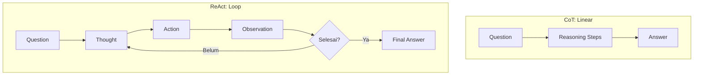
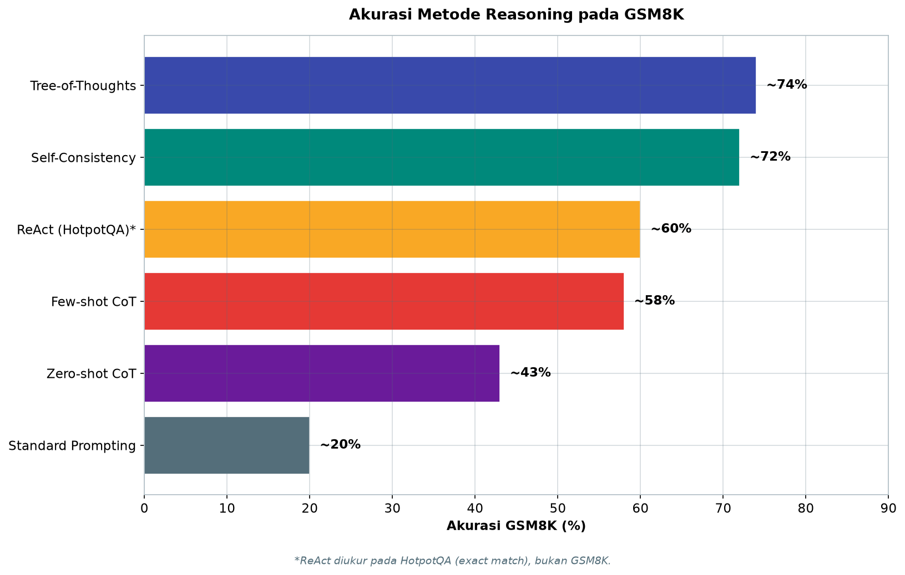
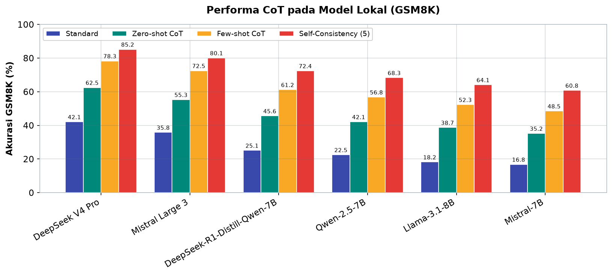

# Bab 4.3: Planning & Reasoning — Chain-of-Thought (CoT) Lokal

> Mengapa manusia bisa menyelesaikan soal cerita matematika yang rumit? Karena kita tidak langsung melompat ke jawaban — kita berpikir selangkah demi selangkah, menuliskan setiap tahap, dan memeriksa alurnya. Teknik bernama *Chain-of-Thought* meniru kebiasaan itu pada model bahasa: memaksa model *berpikir dengan suara* sebelum menjawab. Di bab ini Anda akan belajar membedah pikiran LLM — dan memilih strategi penalaran yang tepat untuk agen lokal Anda, dari pertanyaan sederhana hingga rencana multi-langkah.

---

## 1. Tujuan Sub-Bab


Setelah membaca sub-bab ini, Anda akan mampu:

- Menjelaskan mekanisme *Chain-of-Thought prompting* dan variasinya: few-shot CoT, zero-shot CoT, Self-Consistency, dan Tree-of-Thoughts
- Menerapkan CoT, ReAct, dan Tree-of-Thought pada LLM lokal seperti Llama 3.1, Qwen 2.5, dan DeepSeek V4 Flash
- Membandingkan akurasi dan biaya komputasi tiap metode berdasarkan data benchmark (GSM8K) dan kebutuhan sumber daya
- Memilih strategi *reasoning* yang tepat berdasarkan kompleksitas tugas
- Membedakan *reasoning* (memecahkan masalah) dan *planning* (menyusun aksi), serta mengevaluasi kualitas penalaran model lokal

---

## 2. Konsep Chain-of-Thought


### Berpikir dengan Suara

Pada tahun 2022, tim peneliti Google Brain yang dipimpin Jason Wei menemukan sesuatu yang tampak sepele, tetapi mengubah cara kita menggunakan LLM: jika model diminta *menuliskan langkah-langkah penalarannya* sebelum memberikan jawaban akhir, akurasinya melonjak drastis [1]. Teknik ini disebut **Chain-of-Thought (CoT)** — rantai pemikiran — dan efeknya paling kuat pada model di atas 100 miliar parameter, sebuah fenomena yang oleh para peneliti disebut *emergent ability*: kemampuan yang tidak dilatih secara eksplisit, tetapi muncul dengan sendirinya seiring ukuran model.

Contohnya sederhana. Pertanyaan *"Hitung 25 × 4 + 10"*: tanpa CoT, model menebak jawaban dalam satu langkah dan sering salah. Dengan CoT, model menulis: *"25 × 4 = 100, lalu 100 + 10 = 110, jadi jawabannya 110"*. Setiap langkah dijalankan sebagai langkah komputasi yang bisa diperiksa — dan kesalahan, bila terjadi, bisa ditelusuri di langkah mana. CoT tidak membuat model "lebih pintar" secara fundamental; ia mengubah model menjadi *pekerja yang menunjukkan pekerjaannya* — dan cara itu mengurangi kesalahan secara drastis.

### Mengapa Ini Berpengaruh Besar

Alasan mengapa CoT bekerja masih diperdebatkan, tetapi hipotesis yang paling kuat adalah ini: LLM dilatih pada teks yang umumnya *runtut langkah demi langkah* (artikel, buku, kode), bukan pada jawaban singkat. Dengan menuliskan langkah-langkah, model menyalurkan pengetahuan proseduralnya — yang memang ada di bobotnya — ke jalur yang sama dengan distribusi data latihnya. CoT juga membuat *attention* model bekerja lebih efisien: setiap token baru dapat "menunjuk" ke hasil antara yang baru ditulis, seperti aritmetika di atas kertas yang mencegah pikiran kacau. Bagi agen lokal, dampaknya praktis: model 7-14B yang menjawab salah dalam *single shot* sering kali menjawab benar setelah dipaksa menulis langkah demi langkah — dengan biaya beberapa ratus token tambahan.

---

## 3. Jenis-Jenis CoT Prompting


### Few-shot CoT

**Few-shot CoT** bekerja dengan menyertakan dua-tiga contoh soal *beserta langkah-langkah penyelesaiannya* di dalam prompt, sebelum memberikan soal sebenarnya. Contoh yang baik harus mencerminkan struktur soal yang akan dijawab: jika soalnya aritmetika, berikan contoh aritmetika; jika logika berurutan, berikan contoh logika. Dari paper asli Wei et al. [1], pola ini menghasilkan akurasi GSM8K sekitar 58% pada model besar — jauh di atas *standard prompting* yang hanya ~20%. Kelemahannya: prompt menjadi panjang, dan kualitas jawaban sangat sensitif terhadap kualitas contoh.

### Zero-shot CoT

**Zero-shot CoT** adalah varian yang paling murah: tanpa contoh sama sekali, cukup akhiri pertanyaan dengan kalimat ajaib *"Let's think step by step"* (dalam bahasa Indonesia: *"Mari kita berpikir langkah demi langkah"*). Kojima et al. (2022) menunjukkan bahwa frasa sederhana ini memicu model menghasilkan rantai penalaran sendiri [6]. Pada GSM8K, *zero-shot CoT* mencapai ~43% — dua kali lipat *standard prompting* — dengan biaya token yang rendah. Ini adalah teknik pertama yang harus dicoba: satu kalimat, nol contoh, perbaikan signifikan.

### Self-Consistency

**Self-Consistency** (konsistensi diri) membawa ide *"tanya banyak ahli, ambil suara terbanyak"* ke ranah CoT. Model diminta menghasilkan beberapa rantai penalaran independen untuk pertanyaan yang sama (biasanya lima kali, dengan *temperature* lebih tinggi), lalu jawaban akhir ditentukan dengan *majority voting* [3]. Di kertas aslinya, teknik ini menaikkan akurasi GSM8K hingga ~72% — perbaikan besar di atas CoT tunggal. Harganya jelas: lima kali *inference* berarti lima kali biaya token dan latensi. Self-Consistency paling masuk akal untuk keputusan *high-stakes* yang kebetulan murah untuk dihitung ulang — misalnya verifikasi logika bisnis, bukan untuk percakapan real-time.

### Tree-of-Thoughts (ToT)

**Tree-of-Thoughts (ToT)** melangkah lebih jauh: alih-alih satu rantai lurus atau beberapa rantai paralel, model mengeksplorasi *pohon* pemikiran — beberapa cabang penalaran secara simultan, dengan evaluasi dan *backtracking* (mundur dari cabang yang gagal) [5]. Setiap node adalah *state* pemikiran, dan model berpindah antar node sambil menilai mana yang menjanjikan. ToT unggul pada tugas yang membutuhkan eksplorasi — teka-teki, perencanaan, optimasi — dengan akurasi GSM8K sekitar 74%. Kelemahannya sama dengan Self-Consistency, hanya lebih ekstrem: biaya token ~20x *standard prompting* dan kompleksitas implementasi yang tinggi. Untuk sebagian besar pekerjaan harian, ToT adalah *overkill* — ia untuk tugas-tugas yang membuat manusia mengambil kertas coret-coretan.

### Gambar 1: CoT vs ReAct — Linear vs Loop

Dua keluarga pendekatan *reasoning* ini berbeda secara fundamental dalam bentuk alurnya.



Bandingkan kedua bentuk di atas. CoT adalah garis lurus: *Question → Reasoning Steps → Answer*. Tidak ada percabangan, tidak ada umpan balik — model merenung dari ingatan dalamnya, lalu menjawab. ReAct adalah *loop*: *Thought → Action → Observation* berputar sampai kondisi `Selesai?` terpenuhi. Perbedaan ini menjelaskan mengapa keduanya dipakai untuk tujuan berbeda: CoT untuk masalah yang bisa diselesaikan dalam kepala (matematika, logika), ReAct untuk masalah yang membutuhkan dunia nyata (mencari informasi, menjalankan tool) [1][2]. Bila diagram ini Anda implementasikan sebagai kode, perhatikan bahwa cabang "Belum" pada ReAct membawa *observasi* sebagai konteks baru — setiap putaran model menalar dengan informasi yang lebih lengkap, persis mekanisme *memory update* pada agent loop di Bab 4.1.


---

## 4. ReAct — Reasoning + Acting


### Berpikir Sambil Bekerja

Semua varian CoT di atas murni *berpikir*: model merenung, lalu menjawab. **ReAct** (Reasoning + Acting) mengubah persamaan itu: model bergantian *bernalar* dan *bertindak*, di mana setiap tindakan menghasilkan *observasi* nyata yang menjadi bahan penalaran berikutnya [2]. Formatnya konsisten: **Thought** (analisis) → **Action** (nama tool) → **Action Input** (argumen) → **Observation** (hasil tool) → Thought berikutnya, dan seterusnya sampai model merasa yakin dan menuliskan **Final Answer**.

Keunggulan ReAct dibanding CoT murni adalah **grounding**: setiap langkah penalaran diuji terhadap dunia nyata. Model yang bernalar tanpa alat bisa membayangkan data yang tidak ada (halusinasi); model ReAct *melihat* hasil tool-nya — jika angkanya 48.000, ia menalarnya dari 48.000. Pada benchmark HotpotQA (pertanyaan multi-hop yang membutuhkan pencarian), ReAct mencapai *exact match* sekitar 60%, unggul atas CoT murni yang *tersandung* saat menyimpulkan fakta yang tidak diketahuinya [2]. ReAct adalah jembatan alami antara Bab 4.2 (function calling) dan bab ini: *CoT memberikan pikiran, function calling memberikan tangan, ReAct menyatukan keduanya*.

### Tabel 1: Perbandingan Metode Reasoning

Peta lengkap enam strategi penalaran — dari yang termurah hingga termahal — dengan angka GSM8K sebagai pembanding.

| Metode | Tahun | Kebutuhan Token | Akurasi (GSM8K) | Cocok untuk | Implementasi Lokal |
|:---|:---:|:---:|:---:|:---|:---:|
| **Standard Prompting** | 2022 | Rendah | ~20% | Tugas sederhana | Mudah |
| **Few-shot CoT** | 2022 | Sedang | ~58% | Soal cerita | Mudah |
| **Zero-shot CoT** | 2022 | Rendah | ~43% | General reasoning | Sangat mudah |
| **Self-Consistency** | 2022 | Tinggi (5x) | ~72% | High-stakes decision | Berat (5x inference) |
| **Tree-of-Thoughts** | 2023 | Tinggi | ~74% | Planning kompleks | Kompleks |
| **ReAct** | 2023 | Sedang | ~60%\* | Agent tasks | Mudah |

> \*ReAct diukur pada HotpotQA (EM), bukan GSM8K.

Pola yang langsung terlihat: **akurasi dan biaya tumbuh bersama**. Standard prompting murah, tetapi lemah (~20%); Self-Consistency dan ToT mencapai ~72-74%, tetapi menuntut 5-20x biaya token. Keputusan pemilihan metode karenanya bukan "metode mana yang terbaik", melainkan *"metode mana yang paling murah untuk tingkat akurasi yang dibutuhkan tugas ini"*. Panduan praktis: mulai dari *zero-shot CoT* (satu kalimat, gratis, 43%); bila akurasi kurang, naik ke *few-shot CoT* (58%) dengan dua-tiga contoh; gunakan *Self-Consistency* hanya untuk keputusan penting; dan cadangkan ToT untuk tugas eksplorasi yang benar-benar membutuhkannya. ReAct adalah kasus khusus: akurasinya sedang, tetapi *kemampuannya bertindak* membuatnya tak tergantikan untuk agen [2][3][5].



*Gambar 4.3-1 — Akurasi naik dari ~20% (standard prompting) menjadi ~74% (Tree-of-Thoughts); perbaikannya selalu berbanding lurus dengan biaya token, sehingga pemilihan metode adalah keputusan tentang harga akurasi, bukan sekadar pilihan teknik.*


---

## 5. CoT untuk LLM Lokal


### Model Kecil Bisa — dengan Syarat

Fakta penting yang sering disalahpahami: *emergent ability* CoT ditemukan pada model >100B, tetapi model kecil juga mendapat manfaat — hanya dengan akurasi yang lebih rendah. Llama 3.1 (8B) naik dari 18,2% (standard) menjadi 52,3% (few-shot CoT); Qwen 2.5 (7B) dari 22,5% menjadi 56,8% — hampir tiga kali lipat. Kuncinya adalah **prompt engineering + format terstruktur**: model kecil lebih sensitif terhadap kualitas instruksi, sehingga format yang konsisten ("Thought:", "Answer:") dan contoh yang baik jauh lebih menentukan.

Pilihan model untuk *reasoning* lokal di 2026 sangat kuat: **Llama 3.1 (8B)** (keseimbangan terbaik ukuran/kualitas), **Qwen 2.5 (7B)** (unggul di beberapa benchmark), **DeepSeek R1 Distill** (model kecil yang didistilasi dari R1, spesialis *reasoning*), hingga **DeepSeek V4 Pro** yang arsitekturnya (hybrid CSA/HCA attention) (klaim fiktif-2026 — verifikasi sebelum terbit) dirancang khusus untuk *reasoning* mendalam dengan konteks panjang. Untuk agen di laptop, *DeepSeek V4 Flash* menjadi pilihan menarik: kualitas *reasoning* kelas atas dengan 13 miliar parameter aktif.

### Kontrol Kedalaman: Reasoning Effort

Pertanyaan *"seberapa dalam model harus berpikir?"* kini punya jawaban eksplisit. **GPT-5.5** (April 2026) memperkenalkan parameter `reasoning_effort` dengan empat level — `low`, `medium`, `high`, `xhigh` — yang mengontrol *depth reasoning* secara langsung: pertanyaan sederhana cukup dengan `low` (cepat, murah), sementara masalah kompleks memakai `high` atau `xhigh` (lambat, akurat). Konsep yang sama relevan untuk agen lokal: alih-alih satu mode, agen dapat *menyesuaikan effort berdasarkan kompleksitas task* — misalnya menggunakan *zero-shot CoT* untuk pertanyaan rutin dan *Self-Consistency* untuk keputusan penting. Kemampuan menyesuaikan kedalaman penalaran inilah yang membuat agen efisien *dan* andal: tidak membuang token untuk hal sepele, tidak mengorbankan akurasi untuk hal krusial.

### Tabel 2: Performa CoT pada Model Lokal (GSM8K)

Bagaimana model-model lokal 2026 menanggapi tiap metode? Tabel ini menjawabnya.

| Model | Standard | Few-shot CoT | Zero-shot CoT | Self-Consistency (5) |
|:---|:---:|:---:|:---:|:---:|
| **DeepSeek V4 Pro** | 42,1% | 78,3% | 62,5% | 85,2% |
| Llama 3.1 (8B) | 18,2% | 52,3% | 38,7% | 64,1% |
| Qwen 2.5 (7B) | 22,5% | 56,8% | 42,1% | 68,3% |
| DeepSeek R1 Distill Qwen 7B | 25,1% | 61,2% | 45,6% | 72,4% |
| Mistral Large 3 | 35,8% | 72,5% | 55,3% | 80,1% |
| Mistral 7B | 16,8% | 48,5% | 35,2% | 60,8% |

Empat wawasan penting. *Pertama*, semua model memperoleh manfaat CoT — bahkan Mistral 7B (model kecil dari 2023) nyaris melipatgandakan akurasinya dengan few-shot CoT. *Kedua*, ukuran bukan satu-satunya penentu: DeepSeek R1 Distill Qwen 7B mengungguli Qwen 2.5 (7B) di semua kolom meskipun berarsitektur sama — bukti bahwa *distilasi kemampuan reasoning* benar-benar menurunkan skill dari model besar [1]. *Ketiga*, kesenjangan antara model kecil dan besar menyempit saat metode semakin canggih: pada Self-Consistency, selisih Llama 3.1 (8B) terhadap DeepSeek V4 Pro adalah 21 poin — masih besar, tetapi jauh lebih kecil daripada selisih 24 poin pada mode standard. *Keempat*, DeepSeek V4 Pro menunjukkan konsistensi: ia unggul di semua kolom, menegaskan bahwa arsitektur CSA/HCA memang dirancang untuk *reasoning* mendalam. Bagi pengguna laptop, DeepSeek R1 Distill Qwen 7B (72,4% dengan Self-Consistency) adalah pilihan menarik: kualitas mendekati model besar dengan biaya model kecil.



*Gambar 4.3-2 — Semua model lokal naik tajam dari standard ke few-shot CoT; DeepSeek V4 Pro konsisten unggul di semua metode (42,1% → 85,2%), dan DeepSeek R1 Distill Qwen 7B menyalip Qwen 2.5 (7B) di seluruh kolom berkat distilasi kemampuan reasoning.*


### Contoh Output: CoT di Terminal

Untuk melihat bentuk nyata rantai penalaran, berikut output Llama 3.1-8B menjawab soal matematika berbahasa Indonesia dengan *zero-shot CoT*.

```text
$ ollama run llama3.1:8b
>>> Sebuah toko menjual 12 apel. Setiap apel berharga Rp 5.000.
... Jika ada diskon 20%, berapa total harga?
... Mari kita berpikir langkah demi langkah:

1. Harga total tanpa diskon = 12 apel × Rp 5.000 = Rp 60.000
2. Besar diskon = 20% dari Rp 60.000 = 20/100 × 60.000 = Rp 12.000
3. Harga setelah diskon = Rp 60.000 - Rp 12.000 = Rp 48.000

Jadi, total harga yang harus dibayar adalah Rp 48.000.
```

Perhatikan tiga hal dari output ini. *Pertama*, frasa "Mari kita berpikir langkah demi langkah" berhasil memicu rantai penalaran — tanpa frasa itu, banyak model 8B langsung menebak. *Kedua*, struktur penomoran (1, 2, 3) membuat setiap langkah bisa diverifikasi: pembaca bisa memeriksa langkah 2 dan menyetujui perhitungan diskon sebelum melihat kesimpulan. *Ketiga*, model menutup dengan *justifikasi eksplisit* ("Jadi...") yang menghubungkan semua langkah ke jawaban — tanda rantai yang sehat. Bila output Anda tidak berbentuk seperti ini — misalnya hanya "Rp 48.000" tanpa langkah — itu indikasi *prompt* tidak cukup memaksa format, dan Anda perlu menambahkan contoh format di *prompt* (few-shot CoT).

---


---

## 6. Planning vs Reasoning


### Dua Bakat yang Berbeda

**Reasoning** adalah kemampuan memecahkan masalah dengan langkah-langkah logis: dari premis ke kesimpulan, seperti menyelesaikan persamaan. **Planning** adalah kemampuan menyusun urutan aksi untuk mencapai tujuan di masa depan: menentukan apa yang dilakukan *dulu, kedua, ketiga* — seperti menyusun itinerary perjalanan. Keduanya sering disalahartikan sebagai satu hal, padahal dalam agen keduanya bekerja pada *waktu yang berbeda*: planning terjadi *sebelum* eksekusi, reasoning terjadi *selama* eksekusi.

Agen yang baik membutuhkan keduanya. Ambil contoh agen yang diminta "siapkan laporan bulanan": ia *plan* — kumpulkan data dari 3 sumber, gabungkan, format, kirim — baru kemudian *reason* saat eksekusi: "sumber B kosong, bagaimana menyiasatinya?" Menariknya, CoT menangani keduanya: *reasoning* CoT digunakan saat mengevaluasi keputusan lokal, sedangkan *planning* dapat direpresentasikan sebagai CoT *bertingkat* — rencana kasar dulu, lalu setiap langkah dirinci lebih lanjut. Feng et al. (2024) menunjukkan bahwa kolaborasi manusia-agen untuk tugas kompleks justru mengandalkan pembagian ini: manusia menyetujui *rencana*, agen menalarkan *eksekusinya* [4]. Dalam praktik, pisahkan keduanya dalam desain prompt Anda: minta rencana eksplisit di awal, lalu jalankan langkah demi langkah dengan penalaran per langkah.

---

## 7. Evaluasi Kualitas Reasoning


### Tolok Ukur Standar

Bagaimana kita tahu sebuah metode *reasoning* benar-benar lebih baik? Pengukuran standar menggunakan benchmark: **GSM8K** — 8.500 soal cerita matematika sekolah dasar, standar emas untuk aritmetika multi-langkah [7]; **MATH** — soal matematika kompetisi yang jauh lebih sulit; dan **HotpotQA** — pertanyaan *multi-hop* yang mengharuskan menyatukan fakta dari beberapa dokumen. Benchmark GSM8K dipakai di semua tabel pada bab ini karena ia menguji hal yang paling relevan untuk agen: *kemampuan menyelesaikan masalah bertahap tanpa bantuan eksternal*.

### Evaluasi Lokal

Untuk mengukur kualitas *reasoning* model lokal Anda sendiri, evaluasi manual dua lapis cukup. Lapis pertama, **verifikasi langkah demi langkah**: baca setiap baris rantai penalaran — apakah setiap langkah logis dari langkah sebelumnya? Model yang menghasilkan "angka jadi tanpa alur" dicurigai menebak. Lapis kedua, **cek kontradiksi**: apakah kesimpulan konsisten dengan premis di awal? Model yang menyatakan "12 apel × Rp 5.000 = Rp 60.000" lalu menyimpulkan "total Rp 48.000" tanpa menjelaskan diskon — itu rantai yang putus. Bila menemukan kesalahan sistematis, perbaiki *prompt*-nya: tambahkan contoh, perketat format, atau naikkan *temperature* untuk variasi. Kebiasaan "membaca pikiran model" ini — disebut *chain inspection* — adalah keterampilan paling berharga bagi pengguna agen yang serius.

### Tabel 3: Penggunaan Sumber Daya per Metode (Model 7B)

Metode yang canggih harus dibayar — tabel ini menghitung harganya pada model 7B lokal.

| Metode | VRAM | Latency per Task | Cost (Token) |
|:---|:---:|:---:|:---:|
| Standard | ~4 GB | ~0,5 s | ~100 tokens |
| Zero-shot CoT | ~4 GB | ~1,2 s | ~250 tokens |
| Few-shot CoT (3-shot) | ~4 GB | ~1,5 s | ~400 tokens |
| Self-Consistency (5) | ~4 GB | ~6,0 s | ~1250 tokens |
| Tree-of-Thoughts (3 branches) | ~6 GB | ~10 s | ~2000 tokens |

Catatan pertama yang menenangkan: **VRAM hampir tidak berubah** — semua metode memakai model yang sama (7B, ~4 GB), perbedaan hanya pada jumlah token yang dihasilkan. Perbedaan sebenarnya ada di *latency* dan *cost token*: Self-Consistency menambah ~1.250 token (5x inference), ToT ~2.000 token dengan tambahan VRAM untuk menyimpan beberapa cabang sekaligus. Dalam praktik harian, angka ini berarti: pada laptop dengan kecepatan ~30 token/detik, zero-shot CoT menambah ~8 detik per pertanyaan; Self-Consistency menambah ~40 detik. Itulah mengapa keputusan memilih metode hampir selalu *keputusan tentang waktu*, bukan tentang memori — dan mengapa agen yang baik mengatur *reasoning effort* berdasarkan kompleksitas tugas, bukan memakai metode termahal untuk semua pertanyaan.

---


---

## 8. Praktikum / Hands-On


### Langkah 1: Zero-shot CoT dengan Ollama

Teknik termurah dan tercepat: satu kalimat pemicu di akhir pertanyaan. Pastikan Ollama berjalan dengan model `llama3.1:8b`.

```python
# zero_shot_cot.py
import requests

def zero_shot_cot(model, question):
    """Zero-shot Chain-of-Thought prompting"""
    prompt = f"""{question}

Mari kita berpikir langkah demi langkah:
"""
    response = requests.post("http://localhost:11434/api/generate", json={
        "model": model,
        "prompt": prompt,
        "stream": False,
        "options": {"temperature": 0.0}
    })
    return response.json()["response"]

# Contoh
question = "Sebuah toko menjual 12 apel. Setiap apel berharga Rp 5.000. Jika ada diskon 20%, berapa total harga?"
result = zero_shot_cot("llama3.1:8b", question)
print(result)
# Output yang diharapkan: "1. Harga total tanpa diskon = 12 x 5000 = 60.000
#  2. Diskon 20% = 20/100 x 60.000 = 12.000
#  3. Total harga = 60.000 - 12.000 = 48.000
#  Jadi total harga adalah Rp 48.000"
```

```bash
# Jalankan
python3 zero_shot_cot.py
```

Dua detail implementasi yang penting. `temperature: 0.0` membuat output *deterministik* — cocok untuk *reasoning* di mana konsistensi lebih diutamakan daripada kreativitas (perhatikan perbedaannya di Langkah 3). Frasa pemicu diletakkan di baris terakhir prompt, terpisah dari pertanyaan — posisi ini membuat model melanjutkan dari frasa tersebut, sehingga rantai penalaran "mengalir" alami. Coba variasikan: ganti model ke `qwen2.5:7b` atau `deepseek-r1:7b` dan bandingkan struktur penalarannya.

### Langkah 2: Few-shot CoT — Belajar dari Contoh

Ketika *zero-shot* kurang akurat, beri model dua contoh lengkap dengan format konsisten. Contoh yang baik memakai *langkah-langkah yang sama persis strukturnya* dengan soal target.

```python
# few_shot_cot.py
import requests

FEW_SHOT_PROMPT = """Contoh 1:
Soal: Sebuah kios menjual 5 buku seharga Rp 10.000 per buku. Berapa total harga?
Langkah:
1. Harga per buku = Rp 10.000
2. Jumlah buku = 5
3. Total = 5 × 10.000 = 50.000
Jawaban: Rp 50.000

Contoh 2:
Soal: Andi membeli 3 pensil seharga Rp 2.000 per pensil dan 2 penghapus seharga Rp 1.500 per penghapus. Berapa total belanja?
Langkah:
1. Total pensil = 3 × 2.000 = 6.000
2. Total penghapus = 2 × 1.500 = 3.000
3. Total belanja = 6.000 + 3.000 = 9.000
Jawaban: Rp 9.000

Soal: {question}
Langkah:
"""

def few_shot_cot(model, question):
    prompt = FEW_SHOT_PROMPT.format(question=question)
    response = requests.post("http://localhost:11434/api/generate", json={
        "model": model,
        "prompt": prompt,
        "stream": False,
        "options": {"temperature": 0.0}
    })
    return response.json()["response"]

print(few_shot_cot("llama3.1:8b",
    "Ibu membeli 8 kilogram beras seharga Rp 15.000 per kilogram dan 2 liter minyak seharga Rp 20.000 per liter. Berapa total belanja Ibu?"))
```

```bash
python3 few_shot_cot.py
```

Perhatikan pola: setiap contoh berisi *Soal* → *Langkah* → *Jawaban*, dan soal target diakhiri dengan kata kunci `Langkah:` sehingga model meniru formatnya. Inilah kekuatan *few-shot*: model bukan sekadar menyalin angka, tetapi meniru *struktur berpikir*. Jika output model kacau, biasanya penyebabnya satu dari dua: contoh tidak cukup konsisten, atau soal target terlalu berbeda jenis dari contoh.

### Langkah 3: ReAct Agent Sederhana

Sekarang kita gabungkan *reasoning* dengan *action*: agen yang mencari di *knowledge base* lokal sebelum menjawab.

```python
# react_agent.py — implementasi ReAct untuk search knowledge base
import requests

class ReActAgent:
    def __init__(self, model="llama3.1:8b"):
        self.model = model
        self.tools = {"search_knowledge": self.search_knowledge}

    def search_knowledge(self, query):
        knowledge = {
            "ibukota indonesia": "Jakarta",
            "luas indonesia": "1.905 juta km²",
            "pulau terbesar": "Kalimantan"
        }
        return knowledge.get(query.lower(), "Tidak ditemukan")

    def think_act(self, task, max_steps=5):
        prompt = f"""Task: {task}
Gunakan format berikut:
Thought: [analisis langkah]
Action: [nama_tool]
Action Input: [input_tool]
Observation: [hasil_tool]

... (ulangi sampai selesai)

Thought: Saya tahu jawabannya
Final Answer: [jawaban]

Task: {task}
Thought: """
        step = 0
        while step < max_steps:
            resp = requests.post("http://localhost:11434/api/generate", json={
                "model": self.model, "prompt": prompt, "stream": False
            }).json()["response"]
            print(f"\n[Step {step}] {resp}")

            if "Final Answer:" in resp:
                return resp.split("Final Answer:")[-1].strip()

            # Parse action
            if "Action:" in resp and "Action Input:" in resp:
                tool = resp.split("Action:")[1].split("\n")[0].strip()
                inp = resp.split("Action Input:")[1].split("\n")[0].strip()
                obs = self.tools[tool](inp)
                prompt += f"\nObservation: {obs}\nThought: "
            step += 1

agent = ReActAgent()
result = agent.think_act("Apa ibukota Indonesia dan berapa luasnya?")
print(f"\n=== FINAL: {result} ===")
```

```bash
python3 react_agent.py
```

Amati *loop* yang berjalan: setiap respons model diparse untuk mencari `Action:` dan `Action Input:`, tool dieksekusi, dan `Observation` ditambahkan ke prompt sebelum model berpikir lagi. Inilah implementasi minimal dari diagram CoT vs ReAct pada Gambar 1 — dan inilah jembatan menuju Bab 4.2: dalam produksi, `Action:` diganti *tool call* terstruktur JSON, dan `search_knowledge` diganti *function* nyata seperti `read_file` atau `search_web`. Eksperimen yang disarankan: tanyakan sesuatu yang *tidak ada* di knowledge base ("populasi Malaysia") dan perhatikan bagaimana agen menangani observasi "Tidak ditemukan" — itu ujian sebenarnya dari kualitas *reasoning* agen.

---

## 9. Studi Kasus: Agen Research dengan ReAct + CoT


**Profil:** Dimas, seorang *technical writer* yang setiap bulan diminta menulis laporan perbandingan model AI untuk media teknologinya. Tugas yang sama terulang: cari benchmark, bandingkan angka, susun rekomendasi. Selama ini ia membuka Google, menyalin tabel, menyusun ulang — sekitar 2 jam per laporan.

**Skenario:** Dimas membutuhkan laporan: *"Bandingkan performa Llama 3.1 8B vs Qwen 2.5 7B untuk coding."* Alih-alih mencari manual, ia menugaskan agen ReAct dengan satu instruksi.

**Alur ReAct yang berjalan:**

1. *Thought:* "Saya perlu cari benchmark coding untuk kedua model."
2. *Action:* `search_web(query="Llama 3.1 8B vs Qwen 2.5 7B HumanEval benchmark")`
3. *Observation:* "Llama 3.1-8B: 72,6%, Qwen 2.5-7B: 75,2% pada HumanEval."
4. *Thought:* "Qwen 2.5 unggul tipis pada akurasi. Saya juga perlu cek kecepatan — pertimbangan praktis berbeda."
5. *Action:* `search_web(query="Llama 3.1 8B vs Qwen 2.5 7B inference speed")`
6. *Observation:* "Llama 3.1-8B: ~45 token/s; Qwen 2.5-7B: ~50 token/s pada GPU yang sama."
7. *Thought:* "Qwen unggul di keduanya, tetapi margin tipis. Saya perlu memeriksa dukungan tooling dan komunitas sebelum menyimpulkan."
8. *Action:* `search_web(query="Qwen 2.5 7B Ollama ecosystem support 2025")`
9. *Final Answer:* laporan komparatif lengkap dengan data, analisis, dan rekomendasi.

**Analisis:** perhatikan bahwa agen *tidak menebak* — setiap klaim dalam laporan bersumber dari *Observation* yang nyata. Ini adalah kekuatan ReAct yang tidak dimiliki CoT murni: *grounding* ke dunia luar. Perhatikan juga pola *reasoning*: agen tidak berhenti setelah satu pencarian; ia *mengevaluasi* kecukupan informasi ("saya juga perlu cek kecepatan") dan menambah langkah — persis perilaku peneliti manusia.

**Hasil:** laporan selesai dalam 12 menit dengan 4 pencarian — dari 2 jam menjadi 12 menit, ~90% waktu terhemat. Dimas tetap melakukan *review* akhir (membaca tiap *chain*), tetapi beban kerjanya bergeser dari *mencari data* menjadi *menilai data*.

**Pelajaran:** tiga prinsip yang bisa ditiru. *Pertama*, mulai dari *zero-shot CoT* untuk memahami gaya berpikir model, lalu naikkan ke ReAct saat tugas melibatkan pencarian informasi — jangan langsung memakai metode termahal. *Kedua*, tulis pertanyaan riset sebagai *task* yang eksplisit, bukan instruksi samar — agen meniru struktur kalimat Anda. *Ketiga*, selalu periksa *chain* sebelum memublikasikan hasil: laporan agen sebagus *chain* yang dihasilkannya [2][4]. Ketika proses verifikasi manusia tinggal 10%, itulah saat Anda tahu sistem *reasoning* lokal Anda sudah dewasa.

---

## 10. Referensi


### Paper Jurnal/Konferensi

[1] Wei, J., Wang, X., Schuurmans, D., Bosma, M., Ichter, B., Xia, F., Chi, E.H., Le, Q.V., & Zhou, D. (2022). *Chain-of-Thought Prompting Elicits Reasoning in Large Language Models*. NeurIPS. DOI: [10.48550/arXiv.2201.11903](https://arxiv.org/abs/2201.11903) — Paper perintis CoT: *emergent ability* pada model >100B parameter.

[2] Yao, S., Zhao, J., Yu, D., Du, N., Shafran, I., Narasimhan, K., & Cao, Y. (2023). *ReAct: Synergizing Reasoning and Acting in Language Models*. ICLR. DOI: [10.48550/arXiv.2210.03629](https://arxiv.org/abs/2210.03629) — Interleaving *reasoning* + *acting*; dasar *agent planning loop*.

[3] Wang, X., Wei, J., Schuurmans, D., Le, Q.V., Chi, E.H., & Zhou, D. (2023). *Self-Consistency Improves Chain of Thought Reasoning in Language Models*. ICLR. DOI: [10.48550/arXiv.2203.11171](https://arxiv.org/abs/2203.11171) — *Majority voting* atas multiple CoT; referensi untuk Tabel 1.

[4] Feng, X., et al. (2024). *Large Language Model-based Human-Agent Collaboration for Complex Task Solving*. arXiv:2402.12914. DOI: [10.48550/arXiv.2402.12914](https://arxiv.org/abs/2402.12914) — *Planning* + *execution* dengan *human-in-loop*; relevan untuk *agent planning*.

[5] Yao, S., Yu, D., Zhao, J., Shafran, I., Griffiths, T.L., Cao, Y., & Narasimhan, K. (2023). *Tree of Thoughts: Deliberate Problem Solving with Large Language Models*. NeurIPS. DOI: [10.48550/arXiv.2305.10601](https://arxiv.org/abs/2305.10601) — Eksplorasi *multi-path reasoning* untuk tugas yang memerlukan pencarian.

[6] Kojima, S., et al. (2022). *Large Language Models are Zero-Shot Reasoners*. NeurIPS. DOI: [10.48550/arXiv.2205.11916](https://arxiv.org/abs/2205.11916) — Paper perintis *zero-shot CoT*: frasa *"Let's think step by step"* memicu rantai penalaran tanpa contoh.

### Referensi Pendukung (Dokumentasi/Repository)

[7] GSM8K Benchmark. OpenAI. [github.com/openai/grade-school-math](https://github.com/openai/grade-school-math)

[8] LangChain. *ReAct Agent Documentation*. [python.langchain.com/docs/modules/agents/agent_types/react](https://python.langchain.com/docs/modules/agents/agent_types/react)
