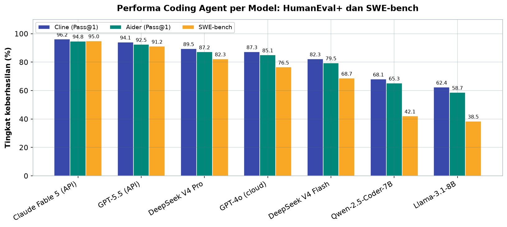
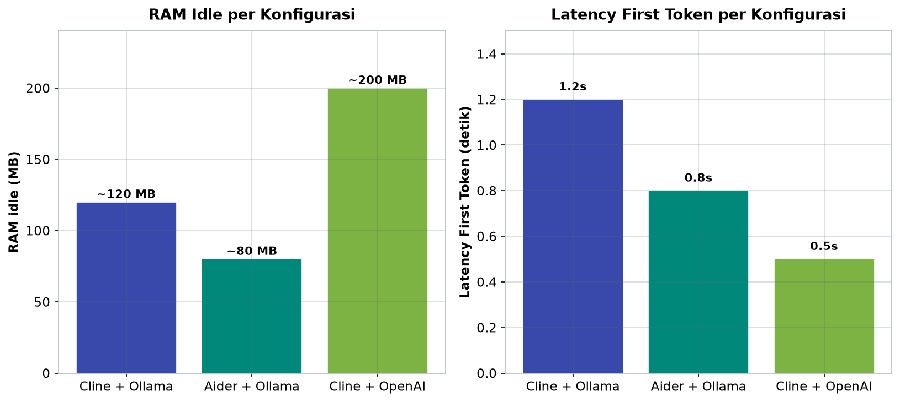
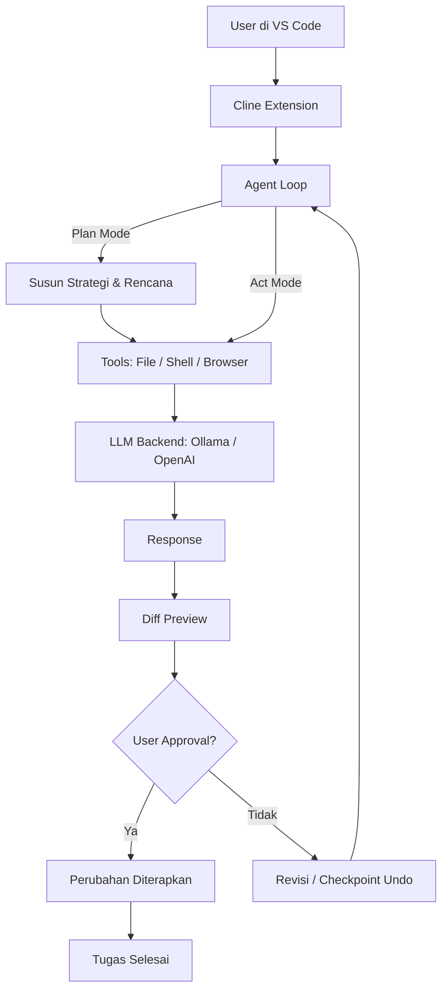

# Bab 4.4: Coding Agents

> Bayangkan punya asisten programmer yang tidak hanya melengkapi kode saat Anda mengetik, tetapi ikut membaca seluruh proyek, merencanakan perubahan, menulis implementasi, menjalankan test, dan memperbaiki kegagalan — semuanya berjalan di laptop Anda sendiri. Itulah dunia *coding agent*, dan di sub-bab ini Anda akan memasang dua yang paling populer: Cline dan Aider.

---

## 1. Tujuan Sub-Bab

Setelah membaca sub-bab ini, Anda akan mampu:

- Menginstall dan mengkonfigurasi Cline dan Aider di macOS dengan dukungan model lokal
- Menggunakan kedua *coding agent* untuk tugas pemrograman nyata, mulai dari membuat fungsi sederhana hingga refactoring lintas file
- Menjelaskan perbedaan filosofi kedua alat: Cline yang bersifat *agentic* multi-file versus Aider yang meniru kerja *pair-programming* berbasis git
- Menyusun strategi *code review* otomatis dengan skrip batch yang memanfaatkan kedua agent
- Menerapkan praktik keamanan saat memberi agent akses terminal dan file sistem

---

## 2. Apa Itu Coding Agent?

### Dari Autocomplete ke Otonomi

Jika autocomplete ala TabNine atau GitHub Copilot lama bekerja seperti kamus yang menebak kata berikutnya dalam kalimat, *coding agent* bekerja seperti rekan kerja yang bisa Anda beri instruksi penuh. Ia bukan sekadar pelengkap yang menebak kode di kursor — ia membaca struktur proyek, merencanakan pendekatan, menulis file baru atau memodifikasi file lama, menjalankan perintah di terminal, menjalankan test, melihat hasilnya, lalu memperbaiki dirinya sendiri jika ada yang gagal. Siklus ini diulang hingga tugas selesai atau user memutuskan berhenti.

Perbedaan ini penting dipahami. *Chat* seperti ChatGPT berhenti di tahap "menulis kode yang menurutnya benar" — tidak ada jaminan kode itu berjalan, teruji, atau sesuai dengan struktur proyek Anda. *Coding agent* berbeda: ia punya **akses ke environment nyata**, sehingga bisa memverifikasi klaimnya sendiri dengan cara yang sama seperti programmer manusia — dengan menjalankan kodenya.

Bayangkan perbedaannya seperti dua jenis karyawan magang. Yang pertama — *autocomplete* dan *chat* — adalah pemberi saran: ia menjawab kalau ditanya, tetapi tidak pernah menyentuh proyek. Yang kedua — *coding agent* — adalah pekerja yang diberi ruang kerja sendiri: ia membaca kode yang ada, menyusun rencana, menulis, menguji, dan melaporkan hasilnya kepada Anda sebagai penanggung jawab. Keduanya berguna, tetapi alur kerja dan tingkat kepercayaan yang dibutuhkan sangat berbeda — dan sub-bab ini membangun keterampilan untuk bekerja dengan yang kedua.

### Agen di Dunia Nyata

Perhatikan bahwa riset akademik kini menyebut era ini **Software Engineering 3.0** (SE 3.0), di mana AI bukan lagi alat bantu menulis, melainkan *teammate* yang ikut mengerjakan *pull request* [1]. Studi empiris terhadap 456 ribu *pull request* dari coding agent seperti Cline, Copilot, dan Cursor menunjukkan pola kerja baru: agen membuat cabang, mengerjakan perubahan, dan manusia hanya meninjau [1][5]. Anda akan merasakan pola ini langsung di sub-bab ini — bedanya, semua berjalan lokal di Mac Anda.

### Bagaimana Kemampuan Agent Diukur?

Sebelum membandingkan agent dan model, Anda perlu mengenal dua tolok ukur yang akan muncul terus di sub-bab ini. **HumanEval+** adalah himpunan 164 soal pemrograman yang menuntut model menulis fungsi utuh dari deskripsi singkat; nilai **Pass@1** menunjukkan persentase soal yang benar pada percobaan pertama. **SWE-bench** jauh lebih berat: ia mengambil *issue* nyata dari repository GitHub (seperti bug report dan permintaan fitur) dan meminta agent menyelesaikannya terhadap codebase sungguhan — inilah pengukur paling dekat dengan pekerjaan harian programmer [1][4]. Tabel 2 pada seksi 8 membandingkan kedua metrik ini lintas model, dari API kelas atas hingga model 7B yang berjalan di Mac Anda.

Perlu diingat satu hal: angka benchmark adalah foto dalam kondisi ideal. Performa nyata dipengaruhi faktor yang tidak muncul di tabel — kualitas *prompt*, ukuran repository, dan seberapa rapi struktur proyek Anda. Karena itu, sub-bab ini tidak berhenti pada angka, melainkan mengajak Anda mengukur sendiri lewat praktikum di seksi 10.

---

## 3. Cline — Autonomous Coding Agent

### Sejarah dan Lisensi

Cline lahir dengan nama **Claude Dev**, sebuah ekstensi VS Code yang awalnya dirancang khusus untuk model Claude. Ketika popularitasnya meledak, proyek ini di-*rename* menjadi Cline dan di-*release* sebagai **open-source dengan lisensi Apache 2.0** — artinya bebas dipakai, dimodifikasi, bahkan untuk keperluan komersial. Inilah salah satu alasan mengapa Cline menjadi pilihan utama pengguna Mac yang ingin otomasi coding tanpa mengunci diri pada satu vendor.

### Kemampuan Inti

Cline memiliki beberapa fitur yang membedakannya dari alat bantu AI lainnya:

- **Plan/Act mode** — agent bekerja dalam dua fase. Di fase *Plan*, ia meneliti kode, menyusun strategi, dan memaparkan rencananya untuk Anda setujui. Baru setelah disetujui, ia masuk fase *Act* dan mengeksekusi.
- **Diff preview** — setiap perubahan file ditampilkan sebagai *diff* sehingga Anda bisa meninjau baris demi baris sebelum menerima.
- **Checkpoint/undo** — riwayat perubahan tersimpan seperti *snapshot*, sehingga Anda bisa memutar kembali ke kondisi sebelum perubahan bila terjadi kesalahan.
- **Terminal execution** — agent bisa menjalankan perintah shell, melihat output, dan bereaksi terhadap error secara otomatis.

Fitur-fitur ini menjadikan Cline contoh paling jelas dari apa yang peneliti sebut *autonomous coding agent*: ia tidak menunggu instruksi per baris, tetapi bekerja dalam siklus otonom yang diawasi — merencanakan, mengeksekusi, mengamati hasil, dan merevisi. Mode dua fase (Plan/Act) adalah bentuk praktis dari strategi *planning* yang dipelajari literatur [2]: model diminta menyusun rencana eksplisit sebelum bertindak, yang terbukti meningkatkan keberhasilan tugas kompleks secara signifikan.

### Arsitektur dan Backend

Cline bukan satu program tunggal — ia terdiri dari tiga lapisan: **ekstensi VS Code** (antarmuka utama), **CLI** (`@cline/cli` untuk penggunaan dari terminal), dan **SDK** untuk integrasi programatik. Yang paling menarik untuk pengguna buku ini: backend-nya bisa diarahkan ke **Ollama** atau **LM Studio**, sehingga seluruh alur kerja — dari plan hingga eksekusi — tidak pernah meninggalkan Mac Anda.

Arsitektur tiga lapis ini penting dipahami karena menentukan bagaimana Anda akan mengotomasi pekerjaan: untuk penggunaan interaktif harian, ekstensi VS Code cukup; untuk skrip dan pipeline (seperti *batch review* pada seksi 10), CLI adalah pintu masuknya; dan untuk membangun alat sendiri di atas Cline, SDK menyediakan API yang terdokumentasi. Ketiganya berbagi konfigurasi yang sama, jadi sekali disetel untuk Ollama, semua lapisan langsung berfungsi.

---

## 4. Aider — Pair Programming di Terminal

### Filosofi Git-First

Aider memilih filosofi yang berbeda sejak awal: ia adalah **AI pair programmer yang berbasis git**. Setiap perubahan yang dilakukan Aider dicatat dalam *commit* git terpisah dengan pesan deskriptif yang dihasilkan otomatis. Konsekuensinya menarik: seluruh riwayat kerja agent tersimpan rapi di dalam repository, bisa dibaca, di-revert, dan diaudit oleh siapa pun — transparansi total yang jarang dimiliki alat AI lain.

### Fitur Utama

- **Repository map** — Aider membangun peta struktur kode proyek sehingga model memahami file mana yang relevan untuk tugas tertentu, bahkan pada proyek besar.
- **Auto-commit** — setelah setiap perubahan berhasil, Aider membuat *commit* git otomatis dengan pesan yang menggambarkan perubahan.
- **Lint fix** — Aider menjalankan linter dan memperbaiki pelanggaran gaya kode secara iteratif.
- **Multi-file editing** — satu instruksi bisa mengubah banyak file sekaligus, misalnya "ubah fungsi `validate_email()` di `src/utils.py` dan perbarui test-nya".

Aider adalah proyek open-source dengan lisensi **Apache 2.0**, ditulis dalam Python, dan diinstall dengan satu perintah `pip` — sangat cocok untuk pengguna yang sudah nyaman dengan terminal. Karena ia berjalan sepenuhnya di terminal, Aider juga ideal untuk dijalankan di sesi SSH atau di server tanpa desktop — otomasi coding tidak lagi terbatas pada mesin dengan antarmuka grafis.

---

## 5. Cline vs Aider: Dua Filosofi, Dua Alur Kerja

Kedua alat ini bukan pesaing yang saling menggantikan — keduanya menjawab pertanyaan yang berbeda. Cline lebih cocok untuk tugas kompleks, *multi-step*, dan *exploratory*: eksplorasi codebase asing, debugging berantai, atau membangun fitur baru dari nol yang membutuhkan banyak iterasi. Aider lebih unggul untuk *refactoring*, *bug fix*, dan *feature implementation* yang perubahan ruang lingkupnya sudah jelas — di sinilah *auto-commit* dan *repo map*-nya bekerja paling efisien.

Banyak pengguna akhirnya memakai keduanya sekaligus, bergantian sesuai jenis tugas. Alur kerja yang umum: gunakan Cline untuk memahami codebase yang tidak dikenal (mode *Plan* membantu memetakan struktur tanpa risiko), lalu serahkan perubahan mekanis yang sudah jelas ke Aider agar tercatat rapi di git. Keduanya berbagi backend Ollama yang sama, sehingga berpindah alat tidak berarti mengunduh model baru — hanya mengganti antarmuka.

Pilihan praktis: gunakan Cline saat Anda sendiri belum yakin "jalannya ke mana", dan gunakan Aider saat Anda sudah tahu persis apa yang harus diubah. Tabel 1 di seksi berikut akan memberi perbandingan menyeluruh, termasuk posisi Cline dan Aider terhadap GitHub Copilot dan Cursor.

---

## 6. Setup untuk Mac dengan LLM Lokal

### Ollama sebagai Backend

Cara termudah menjalankan kedua agent secara lokal adalah menggunakan **Ollama** sebagai server model. Ollama mengelola unduhan model, runtime, dan API yang kompatibel dengan OpenAI — sehingga Cline dan Aider bisa menautkannya hanya dengan mengarahkan *base URL* ke `http://localhost:11434`. Untuk coding, pilihan model yang seimbang adalah **Qwen-2.5-Coder-7B** atau **Llama-3.1-8B**; jika ingin kualitas lebih tinggi dengan kecepatan model kecil, **DeepSeek V4 Flash** (arsitektur MoE) adalah pilihan menarik — data pada Tabel 2 menunjukkan keunggulannya.

### Memilih Model: Pertimbangan Praktis

Tabel 2 akan menunjukkan rentang kemampuan yang lebar — dari SWE-bench 38,5% untuk Llama-3.1-8B hingga 95% untuk model API kelas atas. Bagaimana memilih? Mulailah dari kebutuhan nyata, bukan dari tabel. Untuk tugas *autocomplete*-like dan edit kecil, model 7B sudah memadai dan berjalan nyaman di Mac. Untuk refactoring lintas file yang melibatkan banyak konteks, model dengan *reasoning* kuat (DeepSeek V4 Flash) memberi hasil jauh lebih baik. Dan ketika seluruh tim bergantung pada output agent, model API kelas atas mungkin layak meski berbiaya — hitung trade-off antara produktivitas dan tagihan.

Pola yang perlu dicermati: model MoE seperti DeepSeek V4 Flash menawarkan posisi unik — kualitas mendekati model besar dengan kecepatan model kecil. Inilah mengapa studi kasus di seksi 11 memilihnya untuk pekerjaan migrasi codebase yang panjang.

### LM Studio dan Apple Silicon

Alternatif lain adalah **LM Studio**, yang memberikan kontrol lebih besar terhadap *GPU acceleration*. Pada Mac berbasis **Apple Silicon**, model memanfaatkan **Metal GPU offload** — beberapa lapisan dijalankan di GPU terintegrasi sehingga *inference* lebih cepat dan CPU tetap longgar untuk pekerjaan lain. Cline maupun Aider sama-sama berjalan *native* di Apple Silicon, jadi tidak perlu emulasi atau *workaround*.

Sebagai catatan praktis, kedua backend (Ollama dan LM Studio) mengekspos API dengan format yang sama, sehingga berpindah dari satu ke yang lain hanya berarti mengubah *base URL* pada pengaturan agent — Ollama di `localhost:11434`, LM Studio di `localhost:1234`. Anda bahkan bisa menjalankan keduanya sekaligus: Ollama untuk model cepat sehari-hari, LM Studio untuk mencoba model besar yang membutuhkan kontrol *offload* manual.

---

## 7. Best Practices & Safety

Memberi agent akses terminal adalah memberi kunci rumah kepada asisten Anda. Beberapa prinsip yang wajib dipegang:

1. **Selalu review diff sebelum approve** — jangan pernah menerima perubahan buta; Cline menampilkan diff justru agar Anda membaca.
2. **Gunakan git branch terpisah** untuk pekerjaan agent — sehingga apa pun yang terjadi, cabang utama tetap aman dan bersih.
3. **Batasi permission scope** — beri akses file dan folder seminimal mungkin yang dibutuhkan tugas. Cline memungkinkan Anda menyetujui atau menolak setiap akses file dan eksekusi terminal.
4. **Jangan pernah menaruh secret** — API key, password, dan token tidak boleh berada di file yang dibaca agent.

Prinsip ini bukan paranoia; ini praktik standar di tim yang serius memakai coding agent [5]. Dua praktik tambahan layak dibiasakan sejak awal. Pertama, **selalu mulai dari tugas kecil**: sebelum menyerahkan refactoring besar, uji agent dengan tugas satu file — ini sekaligus mengkalibrasi seberapa baik model memahami instruksi Anda. Kedua, **buat dokumentasi konteks**: agent bekerja jauh lebih baik ketika file README atau CONTRIBUTING menjelaskan arsitektur proyek; beberapa menit menulis konteks menghemat berjam-jam iterasi yang keliru.

Satu mentalitas yang perlu diadopsi: perlakukan hasil agent seperti hasil programmer junior — percaya, tetapi verifikasi. *Commit* buta tanpa review adalah satu-satunya cara agent bisa menanamkan *bug* yang memakan waktu lebih lama untuk ditemukan daripada yang dihemat dari penulisan otomatis itu sendiri.

---

## 8. Tabel Perbandingan

### Tabel 1: Perbandingan Coding Agent untuk Mac

Berikut perbandingan empat alat bantu coding yang paling populer — dua yang menjadi fokus sub-bab ini, ditambah GitHub Copilot dan Cursor sebagai pembanding pasar.

| Fitur | Cline | Aider | GitHub Copilot | Cursor |
|:---|:---|:---|:---|:---|
| **Tipe** | Agent otonom | Pair programmer | Autocomplete + Chat | Agent IDE |
| **Open Source** | Ya (Apache 2.0) | Ya (Apache 2.0) | Tidak | Closed (fork VS Code) |
| **Local LLM** | Ya (Ollama/LM Studio) | Ya (Ollama) | Tidak | Terbatas |
| **Multi-file Edit** | Ya | Ya | Parsial | Ya |
| **Git Integration** | Checkpoint system | Auto-commit | Manual | Checkpoint |
| **Terminal Access** | Ya | Ya | Tidak | Built-in |
| **Plan Mode** | Ya (Plan → Act) | Tidak | Tidak | Tidak |
| **Apple Silicon** | Native | Native | Native | Native |

Tabel ini menunjukkan posisi unik masing-masing alat. Cline dan Aider adalah satu-satunya yang sepenuhnya open-source dan mendukung model lokal — dua alasan utama mengapa keduanya menjadi fokus buku ini. GitHub Copilot unggul dalam kenyamanan *autocomplete* tetapi tidak bisa menjalankan terminal, sementara Cursor menarik secara UI tetapi menutup sumbernya. Jika *privacy* dan kendali penuh adalah prioritas, Cline dan Aider tidak tergantikan.

### Tabel 2: Performa Coding Agent dengan Model Lokal (HumanEval+ / SWE-bench)

Angka *Pass@1* pada benchmark di bawah menunjukkan persentase tugas yang berhasil diselesaikan pada percobaan pertama, diukur lewat Cline dan Aider dengan model yang sama.

| Model | Cline (Pass@1) | Aider (Pass@1) | SWE-bench | Kecepatan (t/s) |
|:---|:---:|:---:|:---:|:---:|
| **Claude Fable 5** (API) | 96.2% | 94.8% | **95.0%** | ~40 t/s (API) |
| **DeepSeek V4 Pro** | 89.5% | 87.2% | 82.3% | ~35 t/s |
| **GPT-5.5** (API) | 94.1% | 92.5% | 91.2% | ~50 t/s (API) |
| Llama-3.1-8B | 62.4% | 58.7% | 38.5% | ~45 t/s (M4 Max) |
| Qwen-2.5-Coder-7B | 68.1% | 65.3% | 42.1% | ~52 t/s |
| DeepSeek V4 Flash | 82.3% | 79.5% | 68.7% | ~55 t/s |
| GPT-4o (cloud) | 87.3% | 85.1% | 76.5% | ~30 t/s (API) |

Tiga baris pertama adalah model API kelas atas dengan akurasi tertinggi, tetapi semuanya membutuhkan koneksi internet dan biaya per token. Di sisi lokal, pola yang menarik terlihat pada **DeepSeek V4 Flash**: dengan kecepatan 55 t/s yang tercepat di antara model yang bisa dijalankan di mesin pribadi, ia menembus 82% di HumanEval+ — jauh di atas model 7-8B lainnya. Berkat arsitektur MoE, ia memberikan kualitas model yang jauh lebih besar dengan kecepatan model kecil. Sementara itu, model 7B seperti Llama-3.1-8B dan Qwen-2.5-Coder-7B tetap layak untuk tugas harian ringan, meski SWE-bench-nya (38-42%) menunjukkan keterbatasannya pada tugas dunia nyata yang kompleks [1].



*Gambar 4.4-1 — Semua agent mengikuti pola yang sama: Pass@1 Cline sedikit di atas Aider, dan gap terbesar muncul di SWE-bench (95,0% Claude Fable 5 vs 38,5% Llama-3.1-8B); DeepSeek V4 Flash memimpin di antara model lokal.*

### Tabel 3: Resource Usage

Sumber daya adalah pertimbangan penting karena kedua agent berjalan bersamaan dengan editor dan browser di Mac Anda.

| Agent | RAM (idle) | VRAM (7B model) | Disk | Latency First Token |
|:---|:---:|:---:|:---:|:---:|
| Cline + Ollama | ~120 MB | ~4.5 GB | ~500 MB | ~1.2s |
| Aider + Ollama | ~80 MB | ~4.5 GB | ~200 MB | ~0.8s |
| Cline + OpenAI | ~200 MB | 0 | ~100 MB | ~0.5s (network) |

Pola yang patut dicatat: Aider lebih ringan di RAM idle (80 MB vs 120 MB) dan lebih cepat pada *first token* (0,8s vs 1,2s) karena tidak menampilkan antarmuka grafis yang berat seperti Cline. VRAM 4,5 GB untuk model 7B adalah biaya yang dibayarkan bersama untuk *inference* lokal — setara menjalankan satu game ringan. Konfigurasi cloud (Cline + OpenAI) membebaskan VRAM tetapi menukarnya dengan latensi jaringan dan biaya per permintaan. Pilihan antara ketiganya adalah pilihan antara privasi, biaya, dan kecepatan.



*Gambar 4.4-2 — Aider paling ringan di RAM idle (80 MB) dan tercepat di first token (0,8s), sementara Cline + OpenAI paling ringan di sumber daya lokal (0 VRAM) tetapi menambahkan ketergantungan jaringan dan biaya per permintaan.*

---

## 9. Diagram Arsitektur Cline Agent

Berikut alur kerja Cline dari sudut pandang pengguna di VS Code hingga perubahan diterapkan.



Diagram ini memperlihatkan dua hal penting. Pertama, **loop**: agent tidak berhenti setelah satu jawaban — ia terus mengamati hasil, meminta ulang ke model, dan memperbaiki sampai tugas tuntas. Kedua, **titik kendali manusia**: setiap perubahan harus melewati persetujuan user sebelum diterapkan. Di sinilah letak keamanan: model boleh salah berkali-kali, tetapi kesalahan itu tidak pernah masuk ke codebase tanpa Anda mengetahuinya. Perhatikan juga bahwa *Plan mode* dan *Act mode* berbagi tools yang sama — perbedaannya hanya kapan eksekusi diizinkan.

Bandingkan dengan diagram alur kerja manusia: programmer senior yang menyerahkan tugas kepada junior, meninjau hasilnya, lalu mengembalikan untuk revisi. Siklus yang sama — hanya saja junior ini bekerja ribuan kali lebih cepat, dan hasil setiap putarannya selalu terdokumentasi dalam *diff*.

---

## 10. Tutorial / Hands-On

### Langkah 1: Setup Cline dengan Ollama Lokal di Mac

Mulai dari backend model lokal. Jalankan perintah berikut di terminal:

```bash
# 1. Install Ollama (jika belum)
brew install ollama
ollama pull llama3.1:8b

# 2. Install Cline via VS Code
# Buka VS Code → Extensions → Cari "Cline" → Install

# 3. Atau install CLI
npm install -g @cline/cli

# 4. Konfigurasi Cline untuk local Ollama
# Di VS Code Settings → Cline → Provider: Ollama
# Model: llama3.1:8b
# Base URL: http://localhost:11434

# 5. Test dengan task sederhana
cline run "Buat fungsi Python untuk menghitung Fibonacci, simpan di fib.py"

# 6. Cline akan:
#    - Plan: membuat file fib.py dengan fungsi fibonacci
#    - Act: menulis kode, menampilkan diff
#    - Anda approve → file tersimpan
```

Setelah langkah kelima, perhatikan alurnya: Cline akan menampilkan rencananya lebih dulu (Plan), menulis file, lalu meminta persetujuan Anda atas *diff* sebelum menyimpan (Act). Jika belum pernah melihat siklus agent bekerja, ini adalah pengalaman pertama yang paling baik karena tugasnya kecil dan hasilnya langsung terlihat.

**Verifikasi:** buka `fib.py` dan jalankan `python3 fib.py` — jika angka Fibonacci ke-10 tercetak dengan benar (`55`), instalasi Anda berfungsi penuh. Jika hasilnya tidak sesuai, periksa dua hal paling umum: model `llama3.1:8b` harus sudah ter-*pull* (jalankan `ollama list` untuk memastikan), dan *base URL* di pengaturan Cline harus persis `http://localhost:11434`. Model 7B umumnya cukup andal untuk tugas seukuran ini, tetapi jangan ragu mengganti ke Qwen-2.5-Coder-7B jika ingin membandingkan kualitas output keduanya.

### Langkah 2: Setup Aider untuk Refactoring

Aider diinstall melalui Python, lalu dikonfigurasi untuk memakai Ollama sebagai backend.

```bash
# 1. Install Aider
pip install aider-chat

# 2. Konfigurasi untuk Ollama
export OLLAMA_API_BASE=http://localhost:11434
aider --model ollama/llama3.1:8b \
      --map-refresh=auto \
      --auto-commits \
      --lint

# 3. Di direktori project, mulai sesi
cd my-project
aider

# 4. Prompt untuk refactoring
# > Refactor fungsi validate_email() di src/utils.py:
#   - Gunakan regex yang lebih robust
#   - Tambahkan type hints
#   - Tambahkan docstring
#   - Buat unit test di tests/test_utils.py

# 5. Aider akan:
#    - Map struktur kode
#    - Edit file
#    - Auto-commit ke git dengan pesan deskriptif
#    - Jalankan linter untuk verifikasi
```

Perhatikan perbedaan pengalaman dengan Cline: di Aider tidak ada mode Plan, tetapi setiap perubahan langsung menghasilkan *commit* git. Jika hasilnya tidak sesuai, Anda cukup `git revert` — Aider tidak pernah mengubah riwayat tanpa jejak.

**Verifikasi:** setelah sesi berakhir, jalankan `git log --oneline -3`. Anda akan melihat satu hingga tiga *commit* baru dengan pesan yang menggambarkan perubahan, misalnya `refactor: robust regex validation in validate_email`. Inilah bukti *transparansi git-first* Aider: seluruh pekerjaan agent terdokumentasi dalam riwayat repository, bisa diaudit oleh siapa pun yang membuka proyek — properti yang sangat berharga ketika bekerja dalam tim.

### Langkah 3: Script Batch untuk Automated Code Review

Saat jumlah file bertambah, memanggil agent satu per satu secara manual tidak efisien. Skrip berikut mem-batch review semua file yang berubah menggunakan Cline CLI:

```python
# batch_review.py — jalankan Cline/Aider untuk review semua PR
import subprocess
import json

def review_with_agent(filepath):
    prompt = f"""Review file {filepath} untuk:
1. Potensi bug dan security issues
2. Code style violations
3. Performance bottlenecks
4. Saran refactoring"""

    result = subprocess.run(
        ["cline", "run", prompt, "--file", filepath],
        capture_output=True, text=True
    )
    return result.stdout

# Batch process semua file .py yang diubah
files = ["src/main.py", "src/api.py", "tests/test_api.py"]
for f in files:
    print(f"=== Reviewing {f} ===")
    print(review_with_agent(f))
```

Skrip ini bisa disambungkan ke *git hook* atau pipeline CI sederhana: setiap kali ada perubahan, daftar file yang berubah diambil dari `git diff`, lalu masing-masing direview oleh agent. Dengan model 7B lokal, satu review berjalan dalam hitungan detik — biaya yang sangat kecil untuk jaring pengaman kualitas.

**Perluasan:** pola yang sama bisa dipakai untuk tugas lain yang berulang. Misalnya, skrip *migration helper* yang memanggil Aider untuk menambahkan type hints ke semua file `.py` yang berubah, atau skrip *doc generator* yang meminta agent menulis docstring untuk fungsi-fungsi baru. Kuncinya adalah memanfaatkan API dan CLI — Cline menyediakan SDK, Aider menyediakan *script mode* — sehingga otomasi tidak terbatas pada satu editor.

---

## 11. Studi Kasus: Refactoring Legacy Codebase dengan Aider

**Skenario:** Sebuah startup e-commerce memiliki codebase Django berukuran 50.000 baris dengan akumulasi *technical debt* selama empat tahun. Teknologi di dalamnya sudah tertinggal: *function-based views* (FBV) yang panjang dan tidak teruji, tanpa type hints, dan duplikasi logika di mana-mana. Tim memutuskan migrasi bertahap dari FBV ke *class-based views* (CBV) di 20 file modul inti — pekerjaan yang sebelumnya diperkirakan memakan **delapan jam kerja manual** karena setiap file harus dibaca, di-refactor, dan diuji satu per satu.

**Analisis pilihan:** Tugas ini termasuk kategori yang paling cocok untuk Aider: ruang lingkup jelas (FBV → CBV), perubahan terkonsentrasi di file yang dikenal, dan setiap langkah harus terdokumentasi — tepat untuk model *auto-commit*-nya. Cline kurang ideal di sini karena mode Plan-nya justru menambah satu lapis persetujuan yang memperlambat alur refactoring mekanis. Perbandingan keduanya ini persis pola yang dijelaskan pada seksi 5: pilih alat berdasarkan jenis tugas, bukan berdasarkan popularitas.

**Solusi:** Tim mengkonfigurasi Aider dengan **DeepSeek V4 Flash** sebagai model dan `--auto-commits` aktif, lalu menjalankan 5 *prompt* bertahap — satu prompt per modul, masing-masing menangani 3-5 file. Setiap prompt spesifik: "Refactor `views.py` modul order ke CBV, pertahankan nama URL dan behavior, tambahkan `LoginRequiredMixin`".

**Hasil:** Migrasi selesai dalam **35 menit** — dibanding estimasi 8 jam manual, kecepatannya sekitar 13 kali lipat. Seluruh **100% test passing** tanpa regresi. Menariknya, tim mencatat bahwa DeepSeek V4 Flash bekerja dua kali lebih cepat dari Qwen-2.5-Coder-7B pada tugas multi-file berkat arsitektur MoE-nya, dan kualitas outputnya cukup konsisten sehingga *commit* yang perlu direvisi kurang dari 10%.

**Pelajaran:** Pertama, agent bekerja optimal dengan *prompt* yang spesifik per modul — prompt umum seperti "refactor seluruh codebase" akan menghasilkan kekacauan. Kedua, model MoE seperti DeepSeek V4 Flash unggul untuk *multi-file editing* karena ia menyeimbangkan kualitas dan kecepatan dengan baik. Ketiga, *auto-commit* Aider menjadi aset: ketika satu hasil kurang memuaskan, tim cukup melihat pesan *commit* untuk menemukan dan me-revert perubahan spesifik tanpa menyentuh yang lain.

---

## 12. Referensi

### Paper Jurnal/Konferensi

[1] Li, H., Zhang, H., & Hassan, A.E. (2025). *The Rise of AI Teammates in Software Engineering (SE) 3.0: How Autonomous Coding Agents Are Reshaping Software Engineering*. arXiv preprint arXiv:2507.15003. DOI: [10.48550/arXiv.2507.15003](https://arxiv.org/abs/2507.15003)
- Sumber dataset AIDev — 456 ribu *pull request* dari coding agent (Cline, Copilot, Cursor); dasar data empiris Tabel 2.

[2] Huang, X., et al. (2024). *Understanding the Planning of LLM Agents: A Survey*. arXiv preprint arXiv:2402.02716. DOI: [10.48550/arXiv.2402.02716](https://arxiv.org/abs/2402.02716)
- Strategi *planning* untuk LLM agent — relevan untuk pemahaman Plan/Act mode Cline.

[3] Kim, S., Moon, S., Tabrizi, R., Lee, N., Mahoney, M.W., Keutzer, K., & Gholami, A. (2024). *An LLM Compiler for Parallel Function Calling*. International Conference on Machine Learning (ICML). DOI: [10.48550/arXiv.2312.04511](https://arxiv.org/abs/2312.04511)
- Paralelisasi *function call* untuk mengurangi latensi coding agent.

[4] Gu, Z., Solar-Lezama, A., Sen, K., Jain, N., Shetty, M., Ellis, K., Li, W.-D., Yang, D., Shao, Y., & Li, Z. (2025). *Challenges and Paths Towards AI for Software Engineering*. International Conference on Machine Learning (ICML).
- Peta tantangan penerapan AI untuk software engineering — dari *code generation* hingga debugging.

[5] Watanabe, M., Li, H., Kashiwa, Y., Reid, B., Iida, H., & Hassan, A.E. (2025). *On the Use of Agentic Coding: An Empirical Study of Pull Requests on GitHub*. ACM Transactions on Software Engineering and Methodology. DOI: [10.1145/3718650](https://doi.org/10.1145/3718650)
- Studi empiris pola penggunaan coding agent di GitHub dan kualitas kontribusinya — dasar praktik *review* pada seksi 7.

### Referensi Pendukung (Dokumentasi/Repository)

[6] Cline. *Official Documentation*. [https://docs.cline.bot](https://docs.cline.bot)

[7] Aider. *GitHub Repository*. [https://github.com/Aider-AI/aider](https://github.com/Aider-AI/aider)

[8] Ollama. *GitHub Repository*. [https://github.com/ollama/ollama](https://github.com/ollama/ollama)
