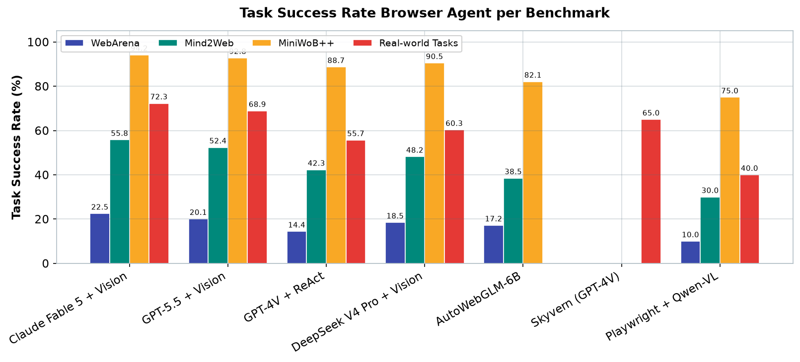
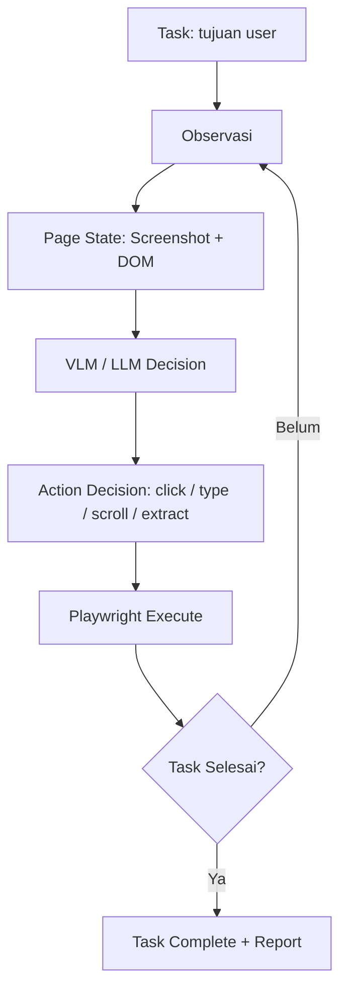

# Bab 4.5: Browser Agents

> Bayangkan memberi tahu asisten virtual: "Cek harga tiket kereta Jakarta–Bandung untuk akhir pekan ini, lalu bandingkan dengan kemarin." Lalu ia benar-benar membuka situs, mengisi form, menunggu hasil, mengekstrak angka, dan melaporkannya kembali — tanpa satu baris kode *scraper* pun yang Anda tulis. Inilah *browser agent*: AI yang mengendalikan browser persis seperti manusia.

---

## 1. Tujuan Sub-Bab

Setelah membaca sub-bab ini, Anda akan mampu:

- Menjelaskan cara kerja *browser agent*: siklus *observasi → keputusan → aksi* yang berulang
- Mengimplementasikan agent web lokal sederhana dengan Playwright dan model lokal via Ollama
- Menjalankan **Skyvern** secara *self-host* untuk otomasi navigasi web yang tangguh
- Membuat *workflow* otomasi web nyata: mengisi form, scraping, dan pemantauan harga
- Membandingkan Skyvern, MultiOn, AutoWebGLM, dan WebVoyager berdasarkan kebutuhan dan anggaran

---

## 2. Konsep Dasar Browser Agent

### Mengapa Scraping Tradisional Gagal

Cara klasik mengotomasi web adalah menulis *scraper*: skrip yang membuka halaman, mem-parsing HTML dengan selector seperti `#price-tag`, lalu mengekstrak data. Masalahnya, website modern dibangun dengan JavaScript yang merender konten secara dinamis — selector yang bekerja hari ini bisa patah besok ketika tim frontend mengubah satu kelas CSS. Anda seperti mencoba menemukan rumah hanya dari alamat yang tertulis di atas kertas, padahal nomor rumahnya dicat ulang setiap minggu.

Kegagalan ini bukan kasus langka: setiap kali sebuah situs e-commerce besar memperbarui templatenya, ribuan *scraper* produksi di seluruh dunia patah secara bersamaan. Perawatannya pun mahal — setiap patahan berarti kerja analisis manual untuk menemukan selector baru. Inilah biaya tersembunyi pendekatan berbasis struktur yang sering tidak dihitung ketika memilih teknologi.

### Agent yang "Melihat"

*Browser agent* mengambil pendekatan berbeda. Alih-alih bergantung pada struktur HTML yang rapuh, ia **mengamati halaman seperti manusia**: mengambil *screenshot* dan membaca struktur DOM, lalu memutuskan aksi berikutnya — klik, ketik, scroll, atau navigasi. Tidak ada selector yang di-hardcode; setiap keputusan dibuat berdasarkan pemahaman tentang apa yang sedang dilihat. Siklusnya sederhana namun kuat:

**Observasi → Decision → Action → New State → Repeat**

Loop ini diulang hingga tugas selesai atau batas langkah tercapai. Karena keputusannya berbasis penglihatan dan pemahaman bahasa, agent ini sanggup menangani situs yang berat JavaScript, berubah-ubah, dan bahkan yang belum pernah dilihat sebelumnya.

Dalam praktiknya, dua jenis *state* yang diamati saling melengkapi: *screenshot* memberikan gambaran visual yang dibutuhkan model multimodal, sementara *DOM* menyediakan teks dan atribut yang bisa dibaca dengan presisi (misalnya `aria-label` tombol). Agent terbaik menggabungkan keduanya — mengambil konteks visual untuk orientasi umum, lalu detail tekstual untuk aksi yang presisi. Kombinasi inilah yang membuat agent sanggup menyelesaikan tugas yang gagal dilakukan model teks murni, sekaligus menjelaskan mengapa Tabel 2 pada seksi 7 selalu menyertakan informasi kemampuan *vision* setiap agent.

### Benchmark: Bagaimana Mengukur Keberhasilan Agent Web?

Sebelum memilih agent, Anda perlu mengenal empat tolok ukur yang akan muncul pada Tabel 2. **WebArena** adalah lingkungan web realistis — situs tiruan e-commerce, forum, dan manajemen konten — yang menuntut agent menyelesaikan tugas nyata di dalamnya. **Mind2Web** menguji kemampuan mengikuti instruksi web dunia nyata dalam skala besar. **MiniWoB++** menyajikan tugas-tugas dasar (mengisi form, memilih opsi) di lingkungan yang disederhanakan — baik untuk mengukur kemampuan dasar tanpa gangguan situs kompleks. Sedangkan *real-world tasks* adalah skenario nyata seperti booking tiket atau riset produk.

Empat benchmark ini membentuk tangga kesulitan: MiniWoB++ mengukur fondasi, Mind2Web dan WebArena mengukur adaptasi pada lingkungan realistis, dan tugas dunia nyata mengukur kelayakan praktis. Karena itu, jangan pernah membandingkan agent hanya dari satu angka — perhatikan pola di seluruh kolom, persis seperti yang akan Anda lakukan pada Tabel 2.

---

## 3. Skyvern — Open Source Browser Agent

### Visi: Komputer Vision + LLM

**Skyvern** adalah *browser agent* open-source (lisensi AGPL) yang dibangun di atas kombinasi **computer vision** dan **LLM**. Berbeda dari agent yang mem-parsing HTML secara tekstual, Skyvern "melihat" halaman dan memahami elemen interaktifnya secara visual. Inilah mengapa ia diklaim **tidak tergantung pada struktur HTML** — perubahan kecil pada layout tidak mematahkan alurnya, karena ia mengenali tombol dari penampilannya, bukan dari selector-nya.

Pendekatan visual ini adalah jawaban langsung atas masalah yang dibahas di seksi 2: halaman yang berubah layout tidak perlu mematahkan otomasi. Yang perlu dipahami adalah batasannya — pengenalan visual tetap bergantung pada kualitas model multimodal di belakangnya; ketika halaman terlalu padat atau elemennya ambigu (dua tombol identik berdampingan), keputusan bisa meleset. Untuk tugas sederhana dengan elemen jelas, performanya sangat andal; inilah wilayah kerja idealnya.

### Arsitektur

Secara internal, Skyvern menggunakan **Playwright** sebagai lapisan kontrol browser, dengan model multimodal di belakangnya. Anda bisa mengarahkannya ke model cloud seperti GPT-4V, atau ke model lokal — yang menarik untuk pembaca buku ini — dengan menyetel `LLM_PROVIDER=ollama` dan menyebutkan model seperti `qwen2.5:7b`. Server Skyvern mengekspos API REST (`POST /task`) sehingga workflow bisa dipicu dari skrip, cron, maupun aplikasi lain.

Keputusan untuk *self-host* Skyvern adalah keputusan arsitektur yang perlu disadari: Anda bertanggung jawab atas server, *database*, dan browser yang berjalan di dalamnya. Tabel 3 pada seksi 7 memperlihatkan biayanya — sekitar 2 GB RAM, 6-24 GB VRAM, dan latensi 3-8 detik per aksi. Untuk alur produksi yang dijalankan per jam, pastikan host Anda sanggup; untuk percobaan pertama, laptop pribadi sudah lebih dari cukup.

---

## 4. MultiOn dan Alternatif Lain

### MultiOn: API-First, Closed-Source

**MultiOn** adalah *browser agent* komersial yang berorientasi API — Anda mengirim deskripsi tugas dan menerima hasil eksekusi, tanpa perlu mengelola browser sendiri. Nyaman dan tangguh, tetapi *closed-source* dan berbiaya *per call*. Untuk pengguna yang mengejar kendali penuh dan biaya nol, alternatifnya adalah kombinasi **Playwright + Ollama** yang dirakit sendiri, sebagaimana ditunjukkan Tutorial 1 nanti.

Kapan MultiOn layak dipilih? Ketika kecepatan pengembangan lebih berharga daripada biaya dan privasi — misalnya untuk *proof of concept* yang harus berjalan hari ini juga, atau ketika sumber daya mesin lokal terbatas. Model bisnis ini juga berarti Anda menyerahkan data halaman yang Anda akses kepada penyedia — keputusan yang perlu dipertimbangkan untuk data sensitif.

### WebVoyager dan AutoWebGLM

Dua nama dari riset perlu dikenal sebagai titik acuan. **WebVoyager** [2] adalah *multimodal web agent* yang bekerja dengan *screenshot* dan teks, sekaligus memperkenalkan protokol evaluasi untuk tugas web dunia nyata. **AutoWebGLM** [1] adalah agent open-source (MIT, model 6B) yang *bilingual* (Inggris dan Mandarin) dan dilaporkan mengungguli GPT-4 pada beberapa benchmark navigasi web — bukti bahwa agent kecil yang dilatih khusus bisa bersaing dengan model raksasa. Keduanya menjadi dasar perbandingan performa pada Tabel 2.

### Playwright + LLM: Rakitan Sendiri

Kombinasi terakhir — *Playwright + LLM* — adalah strategi yang penulis rekomendasikan untuk belajar: tidak ada framework, hanya library kontrol browser (Playwright), server model (Ollama), dan logika loop yang Anda tulis sendiri, persis seperti Tutorial 1. Kelebihannya: setiap baris kode dipahami, biaya nol, dan mudah dimodifikasi. Kekurangannya: performa di bawah framework jadi-jadian — lihat baris terakhir Tabel 2 (~40% pada *real-world tasks*). Ini bukan alat produksi akhir, melainkan *laboratorium belajar* yang ideal sebelum naik kelas ke Skyvern.

---

## 5. Setup untuk Mac Lokal

### Dua Jalur yang Tersedia

Di Mac lokal ada dua jalur utama. Jalur *ringan*: Playwright + Ollama dengan model multimodal seperti **Qwen-VL** — cukup untuk tugas sederhana, semuanya transparan dan bisa dimodifikasi. Jalur *lengkap*: **Skyvern self-host** — lebih berat (Tabel 3) tetapi langsung menangani loop observasi-keputusan-aksi tanpa harus menulis logika agent dari nol.

Pemilihan jalur sebaiknya mengikuti tahap proyek Anda. Sedang belajar konsep agent? Mulai dari jalur ringan — tulis sendiri loop-nya sekali, dan Anda memahami 90% cara kerja semua framework. Sudah punya kebutuhan produksi yang konkret (misalnya monitoring harga harian)? Langsung ke Skyvern, karena menulis ulang loop yang sudah matang adalah pemborosan. Kedua jalur tidak eksklusif — banyak pengguna memakai keduanya: rakitan ringan untuk eksperimen, Skyvern untuk produksi.

### Headed vs Headless

Satu keputusan penting: jalankan browser dalam mode **headless** (tanpa jendela, untuk produksi dan cron) atau **headed** (dengan jendela terlihat, untuk debugging). Saat mengembangkan workflow, selalu mulai dari mode *headed* — melihat agent mengklik dan mengetik di depan mata Anda adalah cara terbaik menemukan kesalahan logika, jauh lebih efisien daripada membaca log.

### Debugging Workflow yang Efektif

Saat workflow gagal, tiga tempat yang paling sering menjadi biang: (1) **prompt yang ambigu** — tugas seperti "cari informasi" memberi agent terlalu banyak kebebasan; perjelas dengan langkah dan kriteria hasil; (2) **model yang lemah** — model 7B sering salah memahami elemen halaman; coba naikkan ke model yang lebih besar atau tambahkan contoh output di prompt; (3) **situs yang berubah** — jika halaman memuat iklan atau pop-up yang tidak terduga, tambahkan langkah penanganan eksplisit. Kebiasaan baik: simpan *screenshot* pada setiap langkah ke folder log, sehingga kegagalan bisa ditelusuri tanpa menjalankan ulang seluruh proses.

---

## 6. Use Cases: Lebih dari Sekadar Scraping

Kekuatan *browser agent* baru terasa pada *workflow multi-step*: tugas yang membutuhkan urutan login → pencarian → ekstraksi → penyimpanan. Contoh nyata: otomasi pengisian form (pendaftaran, klaim, pengajuan), *booking* tiket, scraping data terstruktur, dan **monitoring harga** yang berjalan harian melalui cron — seperti studi kasus di seksi 10. Karena agent "melihat" dan "membaca", ia juga bisa menangani situs dengan CAPTCHA sederhana, dialog pop-up, dan elemen yang dimuat lambat — area di mana *scraper* tradisional paling sering tersandung.

### Otomasi Form: Lebih dari Sekadar Mengisi

Pengisian form adalah kasus yang paling mudah dipahami nilainya. Sebagian besar pekerjaan administratif digital — dari mengajukan lamaran hingga memperbarui profil — hanya membutuhkan pengisian berulang pada form yang sama. Browser agent menghilangkan repetisi ini: simpan data di file konfigurasi, dan biarkan agent mengisi, menyerahkan, dan mencatat hasilnya. Bahkan ketika situs mengubah tata letak form, agent tetap bisa menyesuaikan karena ia membaca label daripada mengandalkan posisi elemen yang tetap.

### Monitoring Berkelanjutan

Skenario paling menguntungkan adalah **pemantauan berkala**: harga tiket, ketersediaan stok, jadwal, atau perubahan halaman. Karena agent berjalan tanpa pengawasan, satu *cron* pagi bisa membandingkan kondisi hari ini dengan kemarin dan mengirim notifikasi hanya ketika ada perubahan signifikan. Inilah yang membuat studi kasus booking tiket di seksi 10 berhasil — bukan karena teknologinya canggih, melainkan karena sebuah tugas kecil dijalankan dengan konsisten setiap hari.

### Batasan dan Etika Otomasi Web

Kekuatan untuk mengotomasi apa pun di browser membawa tanggung jawab. Tiga batasan yang harus selalu diingat: (1) **hormati *terms of service*** — beberapa situs melarang akses otomatis; baca kebijakannya sebelum membangun workflow, dan jaga *rate* permintaan tetap wajar agar tidak membebani server; (2) **lindungi akun** — jangan pernah menyimpan kredensial login dalam teks polos di skrip atau env var yang ikut ter-*commit* ke git; (3) **batasi dampak** — workflow yang menulis data (misalnya mengirim form) harus punya *dry-run* dan konfirmasi, seperti halnya prinsip *file agent* pada sub-bab 4.6.

---

## 7. Tabel Perbandingan

### Tabel 1: Perbandingan Browser Agent

Berikut peta lima opsi utama — dari yang sepenuhnya open-source hingga komersial — berdasarkan lisensi, dukungan model lokal, dan biaya.

| Agent | Open Source | Local VLM | Navigasi | Form Filling | Screenshot | Biaya |
|:---|:---:|:---:|:---:|:---:|:---:|:---|
| **Skyvern** | Ya (AGPL) | Opsional | Ya | Ya | Ya | Gratis (self-host) |
| **MultiOn** | Tidak | Tidak | Ya | Ya | Ya | API per call |
| **AutoWebGLM** | Ya (MIT) | Ya (6B) | Ya | Terbatas | Tidak | Gratis |
| **WebVoyager** | Ya | Ya (LMM) | Ya | Ya | Ya | Gratis |
| **Playwright + LLM** | Kustom | Ya | Ya | Ya | Ya | Gratis |

Pola yang terlihat: lisensi dan kendali berjalan beriringan. Skyvern memberi kebebasan paling besar dengan lisensi AGPL dan dukungan model lokal opsional — tetapi Anda bertanggung jawab atas infrastruktur. MultiOn menukar semua itu dengan kenyamanan API, sambil menagih per *call*. Untuk belajar, AutoWebGLM (6B) dan WebVoyager menawarkan fondasi riset yang sudah teruji; sementara rakitan **Playwright + LLM** memberi fleksibilitas total karena setiap baris loop ada di tangan Anda.

Tabel ini adalah peta pilihan, bukan papan skor — tidak ada jawaban "terbaik" mutlak. Untuk *learning* dan fleksibilitas, Playwright + LLM adalah laboratorium yang ideal; untuk produksi yang butuh keandalan, Skyvern adalah titik berangkat yang kuat; dan untuk proyek komersial tanpa tim infrastruktur, MultiOn menawarkan jalan pintas berbayar. Tabel berikutnya akan memperlihatkan berapa "kemampuan" yang dibeli oleh setiap pilihan — dan berapa yang tersisa di meja.

### Tabel 2: Performa Web Agent (Task Success Rate)

*Task success rate* pada empat benchmark — WebArena (lingkungan web realistis), Mind2Web (instruksi web dunia nyata), MiniWoB++ (tugas dasar), dan *real-world tasks* (skenario nyata).

| Agent | WebArena | Mind2Web | MiniWoB++ | Real-world Tasks |
|:---|:---:|:---:|:---:|:---:|
| **Claude Fable 5** + Vision | 22.5% | 55.8% | 94.2% | **72.3%** |
| GPT-5.5 + Vision | 20.1% | 52.4% | 92.8% | 68.9% |
| GPT-4V + ReAct | 14.4% | 42.3% | 88.7% | 55.7% (WebVoyager) |
| AutoWebGLM-6B | 17.2%* | 38.5% | 82.1% | - |
| DeepSeek V4 Pro + Vision | 18.5% | 48.2% | 90.5% | 60.3% |
| Skyvern (GPT-4V) | - | - | - | ~65% |
| Playwright + Qwen-VL | ~10% | ~30% | ~75% | ~40% |

Dua pelajaran penting dari tabel ini. Pertama, **navigasi web masih sulit** — bahkan model terbaik hanya mencapai 22,5% di WebArena, yang mengharuskan agent beradaptasi dengan situs dinamis. Kedua, jarak antara model besar dan model lokal tidak terlalu ekstrem di tugas dasar (MiniWoB++: 75% vs 94%), tetapi melebar drastis di tugas kompleks. Untuk penggunaan pribadi — monitoring harga, isi form, ekstraksi sederhana — kombinasi **Playwright + Qwen-VL** (~40% *real-world*) masih berguna; untuk keandalan tinggi, pertimbangkan Skyvern dengan model API yang kuat.



*Gambar 4.5-1 — Semua agent menurun drastis dari MiniWoB++ (75-94%) ke WebArena (10-22,5%): tugas dasar bisa dikuasai model kecil, tetapi navigasi situs dinamis masih menjadi tantangan bahkan bagi model frontier.*

### Tabel 3: Resource Usage Browser Agent Lokal

Biaya menjalankan agent web lokal, komponen demi komponen.

| Komponen | RAM | VRAM | Storage | Latency per Action |
|:---|:---:|:---:|:---:|:---:|
| Playwright (headless) | ~200 MB | 0 | ~300 MB | 0.1s (browser) |
| Qwen-VL 7B (VLM) | ~200 MB | ~6 GB | ~15 GB | ~2s (inference) |
| Skyvern (full stack) | ~2 GB | ~6-24 GB | ~20 GB | 3-8s |

Perhatikan bahwa browser itu sendiri murah — 200 MB RAM dan latensi 0,1 detik — sementara *inference* model multimodal adalah bagian paling mahal: 2 detik per keputusan dengan Qwen-VL 7B. Skyvern menumpuk semua komponen sehingga memakan hingga 24 GB VRAM dengan latensi 3-8 detik per aksi. Artinya, untuk satu tugas 10 langkah, Anda harus bersiap menunggu 30-80 detik — sebuah pengingat bahwa kesabaran adalah bagian dari biaya *self-hosting*.

---

## 8. Diagram: Browser Agent Loop

Siklus kerja yang menjadi jantung setiap *browser agent*:



Diagram ini memperlihatkan mengapa *browser agent* bisa bertahan menghadapi perubahan website: tidak ada jalur yang menghubungkan tugas langsung ke selector tertentu. Setiap langkah melewati evaluasi baru terhadap *state* halaman terkini. Inilah yang membuat loop ini berbeda dari *scraper* klasik — dan mengapa ia disebut "agent", bukan "script": ia membuat keputusan di setiap titik, bukan menjalankan instruksi buta. Satu-satunya batasan adalah jumlah iterasi (biasanya dibatasi, misalnya 10-20 langkah) untuk mencegah agent berputar tanpa henti.

Perhatikan juga bahwa *screenshot* dan *DOM* diambil pada setiap iterasi — bukan sekali di awal. Ini penting karena satu klik bisa mengubah seluruh halaman: menu yang tadinya tertutup kini terbuka, atau harga baru muncul setelah dialog dipilih. Pengambilan ulang *state* setiap langkah adalah biaya yang dibayar demi keputusan yang akurat; inilah juga sumber latensi pada Tabel 3 yang mencapai 3-8 detik per aksi.

---

## 9. Tutorial / Hands-On

### Langkah 1: Browser Agent Sederhana dengan Playwright + Ollama

Cara terbaik memahami loop agent adalah merakitnya sendiri. Skrip berikut adalah implementasi minimal — sekitar 50 baris — dari konsep di Diagram 1.

```python
# simple_browser_agent.py
import asyncio
from playwright.async_api import async_playwright
import requests
import json

class SimpleBrowserAgent:
    def __init__(self, llm_model="llama3.1:8b"):
        self.model = llm_model

    async def run(self, task, url):
        async with async_playwright() as p:
            browser = await p.chromium.launch(headless=False)
            page = await browser.new_page()
            await page.goto(url)

            for step in range(10):
                # 1. Observasi — ambil screenshot dan URL
                screenshot = await page.screenshot()
                title = await page.title()
                content = await page.content()

                # 2. Decision — LLM pilih action
                prompt = f"""Task: {task}
Halaman: {title}
URL: {page.url}
Actions available: CLICK_BUTTON, TYPE_TEXT, SCROLL, EXTRACT, NAVIGATE
Pilih action dan argumen dalam JSON."""

                resp = requests.post("http://localhost:11434/api/generate", json={
                    "model": self.model, "prompt": prompt, "stream": False
                })
                decision = json.loads(resp.json()["response"])

                # 3. Action
                if decision["action"] == "EXTRACT":
                    text = await page.text_content(decision["selector"])
                    print(f"[Extract] {text[:200]}...")
                elif decision["action"] == "CLICK_BUTTON":
                    await page.click(decision["selector"])
                elif decision["action"] == "TYPE_TEXT":
                    await page.fill(decision["selector"], decision["value"])
                elif decision["action"] == "SCROLL":
                    await page.evaluate(f"window.scrollBy(0, {decision['amount']})")

                # 4. Cek selesai
                if task.lower() in (await page.content()).lower():
                    print("Task selesai!")
                    break

            await browser.close()

# Run
agent = SimpleBrowserAgent()
asyncio.run(agent.run(
    "Cari informasi tentang AI Agent di Wikipedia",
    "https://www.wikipedia.org"
))
```

Jalankan dengan `pip install playwright && playwright install chromium`, lalu pastikan Ollama aktif (`ollama pull llama3.1:8b`). Mulailah dari tugas Wikipedia di atas. Jika LLM menjawab di luar format JSON, tambahkan contoh output di *prompt* — penyetelan *prompt* adalah 80% dari seni membuat agent lokal bekerja.

**Catatan penting:** model 7B yang tidak *vision* (seperti llama3.1) tidak bisa membaca *screenshot* — pada skrip di atas, keputusan hanya berdasarkan judul, URL, dan konten halaman yang dikirim sebagai teks. Jika ingin agent yang benar-benar "melihat", ganti dengan model multimodal seperti **Qwen-VL** dan sertakan deskripsi visual dalam *prompt*; konsekuensinya, VRAM naik ke sekitar 6 GB (Tabel 3). Mulailah dari versi teks ini, lalu naik kelas ketika kebutuhan memaksa.

### Langkah 2: Setup Skyvern Lokal

Untuk otomasi yang lebih matang, jalankan Skyvern *self-host*:

```bash
# 1. Clone Skyvern
git clone https://github.com/Skyvern-AI/skyvern.git
cd skyvern

# 2. Setup environment
python -m venv .venv
source .venv/bin/activate
pip install -r requirements.txt

# 3. Setup Playwright
playwright install chromium

# 4. Konfigurasi environment variables
export LLM_PROVIDER=ollama
export OLLAMA_BASE_URL=http://localhost:11434
export MODEL_NAME=qwen2.5:7b

# 5. Jalankan Skyvern server
uvicorn skyvern.server:app --reload --port 8000

# 6. Test via API
curl -X POST http://localhost:8000/task \
  -H "Content-Type: application/json" \
  -d '{
    "url": "https://www.google.com",
    "task": "Search for AI agents and save the first result title"
  }'
```

Perhatikan langkah 4: mengganti `MODEL_NAME` memungkinkan Anda berpindah dari model lokal (`qwen2.5:7b`) ke model API tanpa menyentuh kode. Inilah keunggulan abstraksi server — logika agent dan model bisa dievolusi secara terpisah. Untuk penggunaan harian, skrip cron bisa memanggil endpoint `/task` ini secara terjadwal.

**Verifikasi:** setelah mengirim permintaan *curl*, cek bahwa server merespons dengan ID task (format JSON), lalu ikuti progress-nya — Skyvern menyimpan status, log langkah, dan *screenshot* per langkah yang bisa Anda periksa untuk memastikan setiap aksi benar. Jika task gagal di langkah kedua tanpa alasan jelas, kembali ke mode *headed* dan jalankan ulang sambil mengamati perilaku browser.

**Penyetelan lanjutan:** setelah workflow pertama berjalan, Anda akan menemukan tiga tuas penyetelan yang paling sering dipakai: (1) *max steps* — batasi jumlah langkah agar agent tidak berputar di halaman yang kompleks; (2) *timeout per aksi* — untuk situs lambat, naikkan ambang tunggu agar agent tidak menyerah terlalu cepat; (3) *pemilihan model* — naikkan kualitas model (misalnya dari `qwen2.5:7b` ke DeepSeek V4 Pro) ketika task melibatkan halaman yang padat dan ambigu. Ketiganya didokumentasikan di dashboard Skyvern dan bisa diubah tanpa menyentuh kode.

---

## 10. Studi Kasus: Otomasi Booking Tiket Kereta

**Skenario:** Seorang pekerja rutin pulang pergi Jakarta–Bandung setiap akhir pekan. Harga tiket kereta sering naik-turun, dan pembelian seminggu sebelum keberangkatan bisa menghemat puluhan ribu rupiah. Tetapi memeriksa harga manual setiap pagi adalah kebiasaan yang mustahil dipertahankan. Ia membutuhkan mata yang selalu memantau — dan di sinilah Skyvern berperan.

Sebelum membangun, ia mempertimbangkan alternatif: *scraper* statis ditolak karena situs kereta berganti layout berkala dan load-nya berat JavaScript; Playwright + LLM rakitan sendiri dipertimbangkan tetapi membutuhkan dua hari pengembangan dan pemeliharaan; MultiOn ditolak karena biaya *per call* akan terakumulasi pada eksekusi harian. Keputusan jatuh pada **Skyvern self-host**: pengembangan cepat karena loop sudah tersedia, dan biaya operasional hanya listrik dan waktu mesin.

**Analisis pilihan:** Tugas ini melibatkan situs dinamis (KAI Access / Traveloka) dengan form multi-langkah dan harga yang berubah setiap hari. *Scraper* statis tidak cocok karena selector situs sering berubah. Playwright + LLM rakitan sendiri bisa, tetapi membutuhkan waktu pengembangan; Skyvern sudah menyediakan loop lengkap plus dashboard untuk memantau setiap langkah.

**Workflow yang dibangun:**

1. Buka KAI Access / Traveloka
2. Isi stasiun asal-tujuan (Jakarta → Bandung)
3. Pilih tanggal (Sabtu/Minggu)
4. *Search* → ekstrak harga
5. Bandingkan dengan harga kemarin → kirim notifikasi jika turun

**Hasil:** Workflow dijalankan harian melalui **cron** pada pagi hari. Ketika harga turun di bawah ambang yang ditentukan, notifikasi dikirim dan pembelian dilakukan. Dalam sebulan pemakaian, penghematan tercatat sekitar **30%** dari biaya tiket karena pembelian selalu dilakukan saat harga turun — tanpa sekali pun membuka situs secara manual.

Sebagian eksekusi memang sesekali perlu intervensi — biasanya ketika situs menampilkan *pop-up* yang tidak terduga. Di sinilah nilai *screenshot* per langkah terasa: setiap kegagalan langsung bisa ditelusuri dan ditangani dengan menambahkan satu instruksi di *prompt*, tanpa menulis ulang seluruh workflow. Untuk tugas pemantauan, kegagalan sesekali tidak pernah berarti kehilangan kesempatan permanen — esok hari, cron menjalankannya lagi.

**Pelajaran:** Kekuatan studi kasus ini bukan pada kecanggihan model, melainkan pada **konsistensi**. Agent tidak lebih pintar dari manusia dalam menilai harga — tetapi ia tidak pernah lupa, tidak pernah malas, dan selalu datang tepat waktu. Untuk pekerjaan pemantauan berulang seperti ini, keandalan jadwal lebih berharga daripada akurasi sesaat. Satu catatan etis: pastikan otomasi mematuhi *terms of service* situs dan tidak membebani server dengan permintaan berlebihan — prinsip yang dibahas pada seksi 6.

Dari proyek ini, ada tiga kebiasaan yang layak dibawa ke proyek otomasi berikutnya: (1) **catat riwayat data** — menyimpan harga harian dalam CSV sederhana memungkinkan analisa tren di kemudian hari, bukan hanya notifikasi sesaat; (2) **buat fallback** — jika eksekusi gagal berulang kali, kirim peringatan dan hentikan *retry* agar tidak menggandakan beban server; (3) **evaluasi berkala** — periksa log secara rutin untuk melihat pola kegagalan dan perbaiki *prompt* atau alur sebelum kegagalan itu menjadi mahal.

Dari proyek ini, ada tiga kebiasaan yang layak dibawa ke proyek otomasi berikutnya: (1) **catat riwayat data** — menyimpan harga harian dalam CSV sederhana memungkinkan analisa tren di kemudian hari, bukan hanya notifikasi sesaat; (2) **buat fallback** — jika eksekusi gagal tiga kali berturut-turut, kirim peringatan dan hentikan *retry* agar tidak menggandakan beban; (3) **evaluasi berkala** — seminggu sekali, periksa log untuk melihat pola kegagalan dan perbaiki *prompt* atau alur sebelum kegagalan itu menjadi mahal.

---

## 11. Referensi

### Paper Jurnal/Konferensi

[1] Lai, H., et al. (2024). *AutoWebGLM: A Large Language Model-based Web Navigating Agent*. Proceedings of the 30th ACM SIGKDD Conference (KDD '24). DOI: [10.1145/3637528.3671620](https://doi.org/10.1145/3637528.3671620)
- Teknik *HTML simplification* dan *curriculum training* untuk web agent — baseline performa Tabel 2.

[2] He, H., Yao, W., Ma, K., Yu, W., Dai, Y., Zhang, H., Lan, Z., & Yu, D. (2024). *WebVoyager: Building an End-to-End Web Agent with Large Multimodal Models*. arXiv preprint arXiv:2401.13919. DOI: [10.48550/arXiv.2401.13919](https://arxiv.org/abs/2401.13919)
- *Multimodal web agent* dengan protokol evaluasi dunia nyata — referensi arsitektur.

[3] Gur, I., et al. (2024). *WebAgent: A Self-experienced Agent for Web Automation*. International Conference on Learning Representations (ICLR).
- HTML-T5 untuk *summarization* dan *plan decomposition* untuk navigasi web.

[4] Pan, J., et al. (2024). *NNetNav: Unsupervised Learning of Browser Agents Through Environment Interaction in the Wild*. arXiv preprint arXiv:2410.02907. DOI: [10.48550/arXiv.2410.02907](https://arxiv.org/abs/2410.02907)
- Pelatihan *self-supervised* untuk browser agent dari interaksi nyata — relevan untuk praktik lokal.

[5] He, H., et al. (2024). *OpenWebVoyager: Building Multimodal Web Agents via Iterative Real-World Exploration, Feedback and Optimization*. arXiv preprint arXiv:2410.19609. DOI: [10.48550/arXiv.2410.19609](https://arxiv.org/abs/2410.19609)
- Siklus *exploration-feedback-optimization* untuk perbaikan diri web agent.

### Referensi Pendukung (Dokumentasi/Repository)

[6] Skyvern. *GitHub Repository*. [https://github.com/Skyvern-AI/skyvern](https://github.com/Skyvern-AI/skyvern)

[7] Playwright. *Documentation*. [https://playwright.dev](https://playwright.dev)

[8] WebArena Benchmark. [https://webarena.dev](https://webarena.dev)
