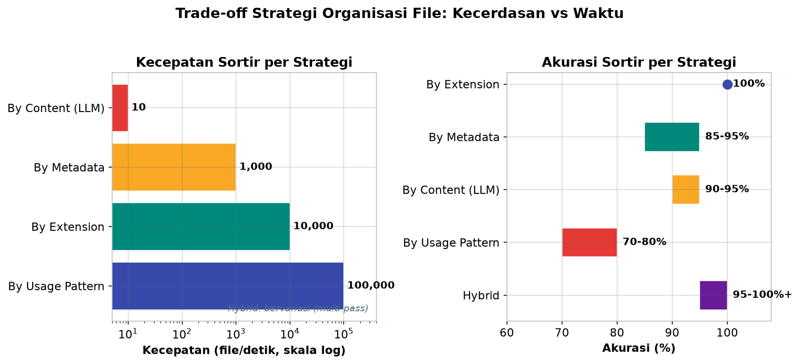
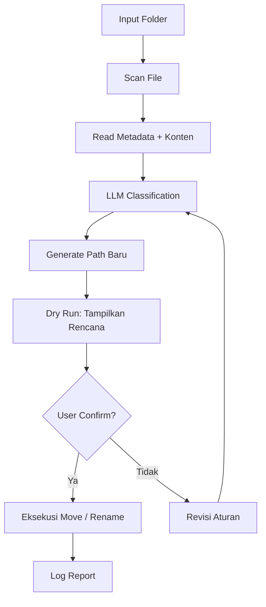

# Bab 4.6: File System Mastery

> Ada metafora yang pas untuk hard drive Anda: rak buku tanpa sistem katalog. Ribuan file menumpuk di Downloads, dokumen tersebar di tiga hard drive, dan foto liburan 2018 bercampur dengan screenshot kerja. Sub-bab ini mengajarkan Anda membangun asisten digital yang bisa merapikan seluruh kekacauan itu — membaca, mengklasifikasi, menamai ulang, dan menganalisis ribuan file secara otonom.

---

## 1. Tujuan Sub-Bab


Setelah membaca sub-bab ini, Anda akan mampu:

- Membangun agent yang bisa *sortir*, *rename*, dan menganalisis file secara otonom dengan bantuan LLM
- Menggunakan *function calling* untuk operasi file system secara *batch* yang aman
- Membandingkan lima strategi organisasi file berdasarkan akurasi, kecepatan, dan kesesuaiannya
- Membuat *workflow* backup dan organisasi file berbasis AI dengan prinsip *dry-run first*
- Menerapkan lapisan keamanan: *permission level*, snapshot, dan deteksi duplikat

---

## 2. Masalah File System Modern


### 50.000 File di Satu Tempat

Coba jalankan `find ~ -type f | wc -l` di terminal Mac Anda — hasilnya kemungkinan besar di angka **50.000 hingga 100.000 file**. Angka itu bukan anomali; rata-rata pengguna Mac memang menyimpan puluhan ribu file: dokumen kerja, foto, screenshot, unduhan, file project, dan sisa-sisa aplikasi yang tidak pernah dibuka lagi. Sebagian besar menghuni dua tempat yang oleh banyak orang disebut "tempat sampah digital": folder **Documents** dan **Downloads** — berisi file tanpa struktur, nama file seperti `final_v2_REAL(1).docx`, dan duplikat yang menghabiskan gigabyte.

### Mengapa Manual Tidak Skalabel

Menata 100.000 file secara manual adalah pekerjaan yang tidak akan pernah selesai — dan di sinilah letak masalahnya. Mengorganisir file bukan sekadar memindahkan; itu membutuhkan *pemahaman*: dokumen ini tentang apa? foto ini kapan diambil? file ini masih dipakai atau sudah usang? Pertanyaan-pertanyaan ini justru menjadi kekuatan LLM. Inilah mengapa *file agent* — kombinasi skrip otomasi dan model bahasa — adalah jawaban modern untuk masalah kuno ini.

### Tabel 1: Strategi Organisasi File

Lima strategi penyortiran dari yang paling sederhana hingga paling kompleks, lengkap dengan biaya kecepatan dan akurasi masing-masing.

| Strategi | Metode | Akurasi | Kecepatan | Cocok untuk |
|:---|:---|:---:|:---:|:---|
| **By Extension** | Rule-based | 100% | 10.000 file/detik | Semua file |
| **By Metadata** | EXIF/ID3 | 85-95% | 1.000 file/detik | Foto, musik, dokumen |
| **By Content (LLM)** | AI classification | 90-95% | 10 file/detik | Dokumen, kode |
| **By Usage Pattern** | atime/mtime log | 70-80% | 100.000 file/detik | Arsip, backup |
| **Hybrid** | Multi-pass | 95%+ | Bervariasi | Best practice |

Tabel ini menunjukkan *trade-off* yang tidak bisa dihindari: kecerdasan membutuhkan waktu. *By extension* menyortir 10.000 file per detik, tetapi tidak memahami apa pun; *by content* memahami isi, tetapi hanya 10 file per detik — 1.000 kali lebih lambat karena setiap file harus dikirim ke LLM. Strategi hibrid mengatasi ini dengan *multi-pass*: lintasan cepat (extension, metadata) menyelesaikan mayoritas file, lalu lintasan LLM hanya untuk sisanya yang ambigu. Pendekatan inilah yang dipakai pada studi kasus 50.000 foto di seksi 9.



*Gambar 4.6-1 — By usage pattern adalah yang tercepat (100.000 file/detik), tetapi paling tidak akurat (70-80%), sedangkan by content justru kebalikannya (10 file/detik, 90-95%); hibrid menggabungkan keduanya lewat multi-pass.*


---

## 3. Tool Set untuk File Agent


### Fondasi Python

Python adalah bahasa utama *file agent* karena tiga pustaka standarnya yang matang: **`os`** untuk operasi sistem dasar, **`shutil`** untuk memindahkan dan menyalin file, serta **`pathlib`** yang memperlakukan path sebagai objek — jauh lebih bersih daripada manipulasi string. Untuk pemantauan folder secara real-time, **`watchdog`** menambahkan kemampuan mendengarkan perubahan direktori, sehingga agent bisa bereaksi ketika file baru masuk ke Downloads.

### CLI Pendukung

Beberapa perintah terminal yang sudah ada selama puluhan tahun tetap tak tergantikan: **`find`** untuk pencarian fleksibel, **`grep`** untuk konten, **`rsync`** untuk sinkronisasi dan backup (dengan dukungan `--dry-run`), serta **`exiftool`** untuk membaca metadata EXIF, ID3, dan format metadata lainnya dari foto, musik, dan dokumen. LLM melengkapi alat-alat ini bukan untuk menggantikannya, melainkan untuk tugas yang tidak bisa dilakukan tool CLI: **klasifikasi konten**, **ekstraksi makna**, dan **penamaan cerdas**.

---

## 4. Strategi Sorting Berbasis AI


### Lima Lapisan Strategi

Organisasi file bisa dilakukan pada lima tingkat kecerdasan yang berbeda:

1. **By file type (extension)** — aturan sederhana: `.jpg` → folder Gambar. Cepat dan 100% pasti, tetapi dangkal: foto liburan dan screenshot kerja masuk folder yang sama.
2. **By content** — LLM membaca isi file (teks awal dokumen, judul, atau *metadata*) lalu mengkategorikannya: "ini laporan keuangan", "ini notulensi rapat". Jauh lebih bermakna.
3. **By date/usage pattern** — memanfaatkan *access time* (atime) dan *modification time* (mtime) untuk membedakan file aktif dari file yang sudah bertahun-tahun tidak disentuh.
4. **By metadata** — membaca EXIF/ID3 (tanggal, lokasi, kamera, kreator) yang melekat pada foto, musik, dan dokumen; cepat seperti aturan ekstensi, tetapi memberikan kategori yang lebih bermakna seperti "Liburan 2019" alih-alih sekadar "Gambar".
5. **Hybrid** — kombinasi metadata + analisis konten dalam beberapa lintasan (*multi-pass*). Inilah yang penulis rekomendasikan sebagai *best practice*.

Perbandingan kuantitatif kelima strategi ini ada pada Tabel 1.

### Tabel 2: Tools Comparison

Peta peralatan — dari pustaka Python hingga tool baris perintah — menurut fungsi, dukungan batch, dan keamanannya.

| Tool | Fungsi | Platform | Batch | LLM Integration | Safety |
|:---|:---|:---|:---:|:---:|:---:|
| **Python pathlib** | File ops | Cross | Ya | Manual | Manual |
| **rsync** | Backup/sync | Unix | Ya | Tidak | --dry-run |
| **exiftool** | Metadata | Cross | Ya | Tidak | Read-only |
| **fdupes** | Duplicate find | Unix | Ya | Tidak | --delete |
| **rclone** | Cloud sync | Cross | Ya | Tidak | --dry-run |
| **OpenClaw file tools** | Agent-based | Cross | Ya | Built-in | Permission gates |

Perhatikan kolom terakhir: tool tradisional menyerahkan keamanan kepada pemakainya (Anda harus ingat menambahkan `--dry-run`), sementara *agent-based tools* seperti file tools di OpenClaw memasang *permission gates* secara bawaan — setiap operasi tulis harus disetujui. Inilah arah perkembangan yang sehat: keamanan bukan lagi kebiasaan pengguna, melainkan desain sistem. Untuk pekerjaan harian, kombinasi `pathlib` (logika), `exiftool` (metadata), dan `fdupes` (duplikat) sudah mencukupi 90% kebutuhan.


---

## 5. Rename Cerdas dan Analisis Otomatis


### Pattern Nama yang Bermakna

Nama file yang baik adalah sistem informasi yang ringkas: ia harus bisa dibaca manusia dan mesin sekaligus. Pattern yang direkomendasikan buku ini:

```
[YYYY-MM-DD]_[Kategori]_[Deskripsi_Pendek].[ext]
```

LLM berperan di bagian `Deskripsi_Pendek`: setelah membaca konten, model menghasilkan dua-lima kata yang meringkas isi — misalnya `2026-08-13_Laporan_Anggaran-Q3-2026.pdf` menggantikan `FINAL_rev3_fix(1).pdf`. Dengan pattern ini, `find`, pencarian Spotlight, dan bahkan penyortiran otomatis berikutnya menjadi jauh lebih efektif.

### Analisis dan Deteksi Duplikat

Tahap analisis melengkapi organisasi: *scan* folder → ekstrak metadata → hasilkan laporan ringkas. Dua analisis yang paling bernilai: **deteksi duplikat** — membandingkan hash file, bukan hanya nama, sehingga file identik dengan nama berbeda tetap terdeteksi — dan **identifikasi file tidak terpakai** (yang terakhir diakses lebih dari satu tahun). Keduanya memberi dasar untuk keputusan besar: apa yang diarsipkan, dan apa yang bisa dihapus.

---

## 6. Safety & Backup


### Prinsip "Read Before Write, Backup Before Modify"

Memberi agent kekuatan memindahkan ribuan file adalah memberi senjata yang bisa menghancurkan dalam satu kesalahan konfigurasi. Karena itu, tiga aturan wajib:

1. **Read before write** — agent boleh membaca apa saja, tetapi menulis hanya setelah proposal ditinjau.
2. **Backup before modify** — sebelum operasi massal, buat *snapshot* atau salinan ke media eksternal.
3. **Tiga level permission** — *read-only* (analisis saja), *dry-run* (tunjukkan rencana tanpa eksekusi), dan *full-access* (eksekusi nyata). Alur ini persis yang dilaksanakan agent pada Langkah 1: `dry_run=True` secara default.

Prinsip ini juga berlaku untuk tool: `rsync` memiliki `--dry-run`, dan skrip Python yang baik meniru perilaku itu dengan mode simulasi.

### Tabel 3: Contoh Klasifikasi Konten (LLM-based)

Template klasifikasi yang bisa langsung dipakai sebagai titik awal *prompt* untuk agent Anda.

| Jenis File | Ekstensi | Kategori Default | Informasi Ekstrak |
|:---|:---|:---|:---|
| **Dokumen** | .pdf, .docx, .txt | Laporan, Surat, Notulensi | Judul, tanggal, penulis |
| **Kode** | .py, .js, .tsx | Project web, script, config | Bahasa, framework, fungsi |
| **Gambar** | .jpg, .png, .raw | Foto, screenshot, desain | Tanggal, lokasi, objek |
| **Audio** | .mp3, .wav, .m4a | Musik, podcast, rekaman | Artist, durasi, genre |
| **Video** | .mp4, .mov, .mkv | Video pendek, film, tutorial | Resolusi, durasi, codec |

Tabel ini bisa dipahami sebagai *taxonomy* awal: ekstensi memberi petunjuk pertama, kategori memberi struktur folder, dan kolom terakhir memberi tahu agent metadata apa yang harus diekstrak untuk membuat laporan. Anda bebas menambah baris — misalnya `.csv`, `.epub`, atau `.fig` — selama kategori tetap jumlahnya sedikit (8-12 kategori cukup untuk 90% file) agar klasifikasi LLM tetap akurat.

---


---

## 7. Diagram: File Agent Workflow


Alur kerja lengkap sebuah *file agent* — dari folder kacau hingga laporan rapi:



Ada dua hal yang perlu diperhatikan dari diagram ini. Pertama, **titik krusial di Dry Run**: rencana dipajang sebelum satu pun file dipindahkan — ini adalah implementasi prinsip "read before write". Kedua, ada *feedback loop* yang jarang ada di skrip biasa: jika user menolak rencana, aturan klasifikasi direvisi dan proses diulang, bukan sekadar dibatalkan. Inilah perbedaan mendasar *agent* dengan *script*: agent mampu menyesuaikan diri berdasarkan umpan balik, persis seperti asisten manusia yang diberi koreksi.

---

## 8. Praktikum / Hands-On


### Langkah 1: File Sorting Agent dengan Python + Ollama

Agent berikut menggabungkan aturan berbasis ekstensi untuk file yang jelas, dan LLM untuk dokumen yang butuh pemahaman. Mode `dry_run` aktif secara default:

```python
# file_sorter_agent.py
import os
import shutil
import json
import requests
from pathlib import Path

class FileSorterAgent:
    def __init__(self, model="deepseek-v4-flash"):
        self.model = model
        self.categories = [
            "dokumen", "kode", "gambar", "audio",
            "video", "arsip", "data", "lainnya"
        ]

    def classify_file(self, filepath):
        """Gunakan LLM (DeepSeek V4 Flash atau llama3.1) untuk klasifikasi file by content"""
        ext = Path(filepath).suffix.lower()
        name = Path(filepath).name

        # Rule-based untuk yang jelas
        if ext in ['.jpg', '.png', '.gif', '.webp']:
            return "gambar"
        if ext in ['.mp3', '.wav', '.m4a', '.flac']:
            return "audio"
        if ext in ['.mp4', '.mov', '.mkv']:
            return "video"
        if ext in ['.zip', '.tar', '.gz']:
            return "arsip"
        if ext in ['.py', '.js', '.ts', '.go', '.rs']:
            return "kode"

        # Untuk dokumen, coba baca konten via LLM
        if ext in ['.txt', '.md', '.pdf']:
            try:
                with open(filepath, 'r', errors='ignore') as f:
                    content = f.read()[:500]
                prompt = f"""Klasifikasikan file ini ke kategori: {self.categories}
Nama: {name}
Konten: {content}
Jawab hanya dengan satu kata kategori."""
                resp = requests.post("http://localhost:11434/api/generate", json={
                    "model": self.model, "prompt": prompt, "stream": False
                })
                category = resp.json()["response"].strip().lower()
                return category if category in self.categories else "dokumen"
            except:
                return "dokumen"
        return "lainnya"

    def organize(self, source_dir, target_dir, dry_run=True):
        source = Path(source_dir)
        target = Path(target_dir)
        results = []

        for filepath in source.iterdir():
            if filepath.is_file():
                category = self.classify_file(filepath)
                dest_dir = target / category
                dest_path = dest_dir / filepath.name

                if dry_run:
                    results.append(f"[DRY-RUN] {filepath.name} → {category}/")
                else:
                    dest_dir.mkdir(parents=True, exist_ok=True)
                    shutil.move(str(filepath), str(dest_path))
                    results.append(f"[MOVED] {filepath.name} → {category}/")

        return results

# Penggunaan
agent = FileSorterAgent()
report = agent.organize("~/Downloads", "~/Organized", dry_run=True)
for line in report[:20]:
    print(line)
print(f"... dan {len(report)-20} file lainnya")
```

Uji coba yang baik: jalankan dengan `dry_run=True` pada folder kecil berisi 20-30 file campuran, periksa rencana yang dihasilkan, lalu baru eksekusi dengan `dry_run=False`. Perhatikan pola *hybrid* dalam kode: file gambar dan kode ditangani aturan cepat tanpa menyentuh LLM — hanya dokumen ambigu yang "mahal" untuk diklasifikasi.

### Langkah 2: Smart Rename dengan AI

Setelah file tersortir, tahap berikutnya memberi nama yang bermakna:

```python
# smart_rename.py
import os
import re
from datetime import datetime
import requests

def smart_rename(filepath, model="llama3.1:8b"):
    """Generate nama file deskriptif berdasarkan konten"""
    ext = os.path.splitext(filepath)[1]
    mod_time = os.path.getmtime(filepath)
    date_str = datetime.fromtimestamp(mod_time).strftime("%Y-%m-%d")

    try:
        with open(filepath, 'r', errors='ignore') as f:
            content = f.read()[:300]
    except:
        content = ""

    prompt = f"""Beri nama pendek deskriptif (max 5 kata, tanpa ekstensi) untuk file ini:
Konten: {content[:300]}
Nama asli: {os.path.basename(filepath)}
Format: kata1-kata2 (lowercase, pakai dash)"""

    resp = requests.post("http://localhost:11434/api/generate", json={
        "model": model, "prompt": prompt, "stream": False
    })
    desc = resp.json()["response"].strip()

    new_name = f"{date_str}_{desc}{ext}"
    new_path = os.path.join(os.path.dirname(filepath), new_name)

    print(f"{os.path.basename(filepath)} → {new_name}")
    return new_path

# Batch rename dengan dry-run
folder = "/path/to/files"
for f in os.listdir(folder)[:5]:  # test 5 dulu
    smart_rename(os.path.join(folder, f))
```

Skrip ini mencetak hasil `nama lama → nama baru` tanpa benar-benar mengganti nama — formasi *dry-run* sederhana. Mulailah dengan 5 file (baris `[:5]`), periksa kualitas nama yang dihasilkan LLM, lalu perluas jumlahnya. Dua hal yang perlu diperhatikan: LLM kadang menambahkan tanda baca atau spasi — bersihkan dengan `re.sub(r'[^a-z0-9-]', '-', desc)` — dan pastikan nama hasil tidak bentrok dengan file yang sudah ada.

### Langkah 3: Workflow Backup dan Deteksi Duplikat

Lapisan terakhir adalah keamanan: backup sebelum operasi massal, dan pembersihan duplikat setelahnya.

```bash
# 1. Backup folder target ke external drive (dry-run dulu)
rsync -avn ~/Organized /Volumes/BackupDisk/Organized

# 2. Jika rencana OK, eksekusi backup sungguhan
rsync -av ~/Organized /Volumes/BackupDisk/Organized

# 3. Deteksi duplikat di seluruh folder foto
fdupes -r ~/Photos > duplicates.txt

# 4. Lihat hasil, lalu hapus dengan konfirmasi per file
fdupes -r -d ~/Photos

# 5. Buat snapshot sebelum operasi massal (Time Machine / tmutil)
tmutil snapshot
```

Urutan ini adalah manifestasi prinsip keamanan bab ini: *dry-run* → eksekusi → deteksi → konfirmasi → snapshot. Dengan snapshot Time Machine aktif, bahkan kesalahan terparah pun bisa dipulihkan — inilah jaring pengaman terakhir yang membuat pemberian *full-access* ke agent menjadi keputusan yang bisa diterima.

---

## 9. Studi Kasus: Organisasi Foto Keluarga 10 Tahun


**Skenario:** Seorang ayah memiliki **50.000 foto** dari tahun 2015-2025 yang tersebar di tiga hard drive dan dua layanan cloud. Foto liburan bercampur dengan screenshot kerja, duplikat memenuhi penyimpanan, dan mencari "foto ulang tahun anak 2019" berarti membuka lima folder berbeda. Selama bertahun-tahun ia menunda merapikan — pekerjaan ini tampak terlalu besar.

**Analisis pilihan:** Menyortir 50.000 foto secara manual tidak realistis. Strategi yang dipilih adalah **hibrid**: extension dan metadata untuk mayoritas, LLM untuk pengelompokan bermakna, dan *hash comparison* untuk duplikat. Berdasarkan Tabel 1, pendekatan ini mencapai akurasi 95%+ dengan kecepatan yang masih bisa ditoleransi untuk satu kali proses.

**Workflow agent:**

1. *Scan* semua drive → kumpulkan semua `.jpg`, `.raw`, `.heic`
2. Ekstrak EXIF: tanggal, lokasi, kamera
3. LLM klasifikasi: "liburan", "ulang tahun", "daily", "makanan"
4. Sortir ke folder: `~/Photos/[YYYY]/[YYYY-MM-DD]_[Event]/`
5. Deteksi duplikat: *hash comparison* → simpan yang resolusi tertinggi

**Hasil:** Seluruh 50.000 foto terorganisir dalam **3 jam** (mayoritas waktu dihabiskan untuk menyalin antar drive), dan proses deteksi duplikat **menghemat 200 GB** penyimpanan. Kini pencarian foto liburan tinggal membuka `~/Photos/2019/` dan melihat folder berjudul `2019-07-15_Liburan-Bali/`.

**Pelajaran:** Tiga prinsip yang membuat studi kasus ini berhasil — dan yang sebaiknya Anda tiru: (1) **semua operasi dry-run dulu**, termasuk pemetaan rencana perpindahan yang ditinjau sebelum dieksekusi; (2) **backup ke external drive sebelum move**, sehingga tidak ada satu foto pun yang berpindah tanpa salinan; (3) **kelompokkan dalam lintasan bertahap**, jangan mencampur sortir, rename, dan deduplikasi dalam satu operasi raksasa. Pelajaran yang tak kalah penting: 200 GB duplikat berarti selama bertahun-tahun ia membayar penyimpanan untuk data ganda — organisasi file yang baik adalah investasi yang kembali dengan cepat.

---

## 10. Referensi


### Paper Jurnal/Konferensi

[1] Wang, G., Xie, Y., Jiang, Y., Mandlekar, A., Xiao, C., Zhu, Y., Fan, L., & Anandkumar, A. (2023). *Voyager: An Open-Ended Embodied Agent with Large Language Models*. arXiv preprint arXiv:2305.16291. DOI: [10.48550/arXiv.2305.16291](https://arxiv.org/abs/2305.16291)
- *Skill library* untuk *code execution* — konsep yang diadaptasi untuk *file manipulation skills*.

[2] Yao, S., Zhao, J., Yu, D., Du, N., Shafran, I., Narasimhan, K., & Cao, Y. (2023). *ReAct: Synergizing Reasoning and Acting in Language Models*. International Conference on Learning Representations (ICLR). DOI: [10.48550/arXiv.2210.03629](https://arxiv.org/abs/2210.03629)
- *Agent loop* untuk operasi file: *observe filesystem → decide action → execute → verify*.

[3] Cheng, D., Huang, S., Gu, Y., Song, H., Chen, G., Dong, L., Zhao, W.X., Wen, J.-R., & Wei, F. (2026). *LLM-in-Sandbox Elicits General Agentic Intelligence*. arXiv preprint arXiv:2601.16206. DOI: [10.48550/arXiv.2601.16206](https://arxiv.org/abs/2601.16206)
- File system sebagai *long-term memory* — agent memanfaatkan file system untuk *persistent context*.

[4] Wang, L., Ma, C., Feng, X., et al. (2024). *A Survey on Large Language Model based Autonomous Agents*. Frontiers of Computer Science, 18(6), 186345. DOI: [10.1007/s11704-024-40231-1](https://doi.org/10.1007/s11704-024-40231-1)
- *Framework tool use* untuk agent — termasuk *file system tools* sebagai kategori penting.

[5] Masterman, T., & Besen, S. (2024). *Agentic AI Frameworks: Architectures, Protocols, and Design Challenges*. arXiv preprint arXiv:2404.11584. DOI: [10.48550/arXiv.2404.11584](https://arxiv.org/abs/2404.11584)
- Arsitektur agent untuk *task execution* — termasuk file system sebagai *environment*.

### Referensi Pendukung (Dokumentasi/Repository)

[6] Python `pathlib` Documentation. [https://docs.python.org/3/library/pathlib.html](https://docs.python.org/3/library/pathlib.html)

[7] `exiftool` by Phil Harvey. [https://exiftool.org](https://exiftool.org)

[8] `rsync` man page. [https://linux.die.net/man/1/rsync](https://linux.die.net/man/1/rsync)
