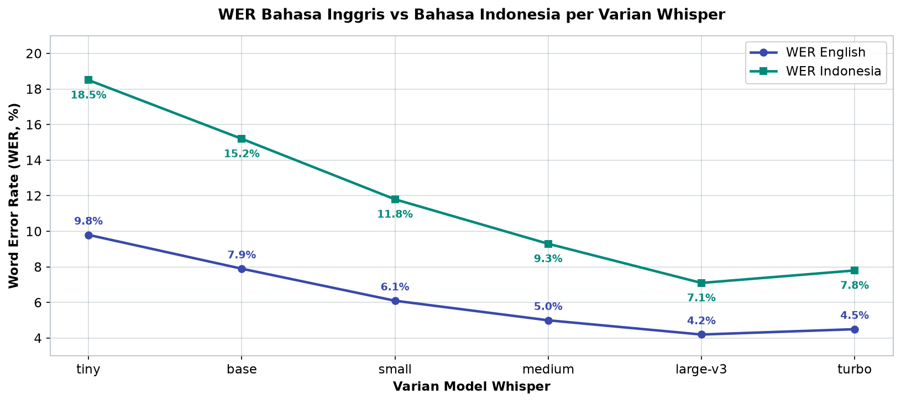
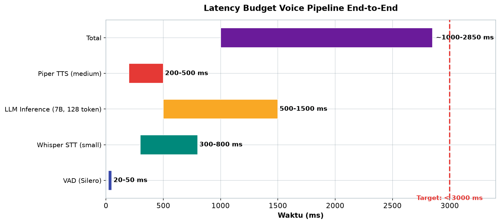

# Bab 4.7: Integrasi Suara

> Bayangkan berterima "Catat rapat hari ini" ke arah Mac Anda — dan lima menit kemudian sebuah ringkasan rapi muncul di folder Jurnal. Tidak ada cloud, tidak ada langganan, dan semua audio tidak pernah meninggalkan rumah Anda. Itulah janji integrasi suara lokal: *speech-to-text* (STT) dengan Whisper, *text-to-speech* (TTS) dengan Piper, dan LLM di tengahnya.

---

## 1. Tujuan Sub-Bab


Setelah membaca sub-bab ini, Anda akan mampu:

- Menginstal dan menjalankan **Whisper** (termasuk *faster-whisper*) untuk *speech-to-text* lokal di Mac
- Menginstal dan menjalankan **Piper** TTS untuk *text-to-speech* lokal yang ringan
- Membangun *voice pipeline* lengkap: *Mic → STT → LLM → TTS → Speaker*
- Memilih varian model Whisper yang tepat berdasarkan kebutuhan WER dan sumber daya
- Menghitung *latency budget* end-to-end dengan target di bawah 3 detik

---

## 2. Konsep STT/TTS Lokal


### Dua Arah Percakapan

Suara adalah antarmuka yang paling alami bagi manusia, tetapi mesin butuh dua jembatan untuk berbicara dengannya. **STT** (*Speech-to-Text*) mengubah gelombang suara menjadi teks — perannya dimainkan oleh **Whisper**, model open-source dari OpenAI yang dilatih pada **680 ribu jam audio** dan mendukung 97 bahasa [1]. **TTS** (*Text-to-Speech*) bekerja sebaliknya: mengubah teks menjadi ucapan — di sini **Piper** dari proyek Rhasspy hadir sebagai mesin lokal yang ringan [4].

### Mengapa Lokal?

Tiga alasan yang sama-sama kuat. **Privasi**: tidak ada satu byte audio pun yang dikirim ke server pihak ketiga — penting untuk jurnal pribadi atau rekaman rapat internal. **Latensi**: tanpa perjalanan jaringan, waktu respons lebih bisa diprediksi. **Biaya**: setelah model diunduh, semua penggunaan gratis tanpa langganan. Ketiganya menjadikan integrasi suara lokal fondasi alami untuk *voice assistant* yang dibangun pada bab-bab sebelumnya.

### Tabel 1: Perbandingan TTS Lokal

Empat mesin TTS lokal dengan ukuran, kecepatan, dan cakupan bahasa yang berbeda.

| Engine | Kualitas Suara | Kecepatan (RTF) | Bahasa | Parameter | Platform |
|:---|:---:|:---:|:---:|:---:|:---:|
| **Piper** | Medium-Tinggi | 0,3-0,8 RTF | 30+ | ~50M | CPU/GPU |
| **Coqui TTS** | Tinggi | 0,5-1,5 RTF | 20+ | ~100M | GPU |
| **eSpeak-NG** | Rendah (robotik) | 0,01 RTF | 100+ | 0 (rule-based) | CPU |
| **MeloTTS** | Tinggi | 0,2-0,5 RTF | 5 | ~80M | CPU/GPU |

Konsep **RTF** (*Real-Time Factor*) perlu dipahami: nilai 0,5 berarti untuk setiap 1 detik audio, mesin butuh 0,5 detik untuk menghasilkan. eSpeak-NG berkecepatan ekstrem (0,01), tetapi suaranya robotik dan tidak neural. Coqui TTS menghasilkan suara terbaik, tetapi menuntut GPU. **Piper berada di zona nyaman**: suara neural yang layak, RTF di bawah 1 (bisa *real-time* di CPU), dan 30+ bahasa. MeloTTS lebih cepat dan berkualitas tinggi, tetapi hanya mendukung 5 bahasa.


---

## 3. Whisper — Model dan Varian


### Arsitektur yang Terbukti

Whisper adalah *encoder-decoder Transformer* yang dilatih dengan *weak supervision*: bukan data berlabel manual, melainkan transkrip yang sudah tersedia di internet dalam jumlah masif. Pendekatan ini menghasilkan model yang *robust* terhadap aksen, kebisingan, dan berbagai bahasa — termasuk **Bahasa Indonesia** [1]. Karena dilatih untuk *multitask* (transkripsi, terjemahan, deteksi bahasa), satu model yang sama bisa melayani banyak skenario.

### Peta Varian

Whisper hadir dalam enam ukuran yang perlu dipahami: **tiny** (39M), **base** (74M), **small** (244M), **medium** (769M), **large-v3** (1,55B), dan **turbo** (809M). Aturan praktisnya: semakin besar model, semakin rendah *Word Error Rate* (WER), tetapi semakin besar pula RAM dan waktu komputasinya. Untuk Bahasa Indonesia [1], **large-v3** mencapai WER 7,1% (hampir setara manusia untuk transkripsi umum), sementara **small** yang jauh lebih ringan masih mencatat 11,8% — angka yang sangat layak untuk sebagian besar kebutuhan praktis. Kedua angka diukur pada benchmark FLEURS dalam rilis resmi Whisper [1].

### faster-whisper: Turbo untuk Transkripsi

Implementasi asli Whisper berjalan di PyTorch. **faster-whisper** menggantinya dengan backend **CTranslate2** — optimasi runtime yang membuat transkripsi **4 kali lebih cepat** dengan akurasi yang sama. Untuk keperluan *batch* transkripsi puluhan file, selisih ini terasa nyata. Di Mac berbasis Apple Silicon, ada pula **mlx-whisper** (CoreML/MLX) yang mencatat akselerasi sekitar 2 kali lipat.

### Tabel 2: Perbandingan Varian Whisper

Enam varian Whisper dengan kebutuhan RAM, kecepatan relatif, dan WER untuk bahasa Inggris serta Bahasa Indonesia. Angka kecepatan relatif terhadap `large-v3` (1x).

| Model | Parameter | RAM | Relative Speed | WER (English) | WER (Indonesia) |
|:---|:---:|:---:|:---:|:---:|:---:|
| **tiny** | 39M | ~1 GB | ~10x | 9,8% | 18,5% |
| **base** | 74M | ~1 GB | ~7x | 7,9% | 15,2% |
| **small** | 244M | ~2 GB | ~4x | 6,1% | 11,8% |
| **medium** | 769M | ~5 GB | ~2x | 5,0% | 9,3% |
| **large-v3** | 1550M | ~10 GB | 1x | 4,2% | 7,1% |
| **turbo** | 809M | ~6 GB | ~2,5x | 4,5% | 7,8% |

Dua pola penting muncul dari tabel ini. Pertama, WER Bahasa Indonesia konsisten lebih tinggi dari bahasa Inggris pada semua varian — bahasa dengan data pelatihan lebih sedikit memang lebih menantang, tetapi gap-nya menyempit di model besar (4,2% vs 7,1% hanya untuk large-v3). Kedua, **turbo adalah sweet spot**: dengan setengah parameter large-v3, WER-nya hanya selisih 0,3-0,7 poin, tetapi berjalan 2,5 kali lebih cepat. Untuk laptop dengan RAM terbatas, pilihan rasional adalah *small* (2 GB, cukup untuk percakapan) atau *turbo* jika kecepatan adalah prioritas.



*Gambar 4.7-1 — WER Indonesia selalu lebih tinggi dari WER Inggris pada semua varian, tetapi gap menyempit seiring ukuran model; turbo (WER 7,8%) hampir menyamai large-v3 (7,1%) dengan setengah parameter.*


---

## 4. Piper TTS — Arsitektur


### VITS + ONNX = Ringan

Piper dibangun di atas **VITS** (*Variational Inference with adversarial Training for end-to-end Text to Speech*) yang dikonversi ke **ONNX Runtime**. Hasilnya: mesin TTS yang berjalan nyaman di CPU saja — tanpa GPU — dengan output audio **16kHz hingga 22kHz**. Kualitas suaranya masuk kategori *medium hingga tinggi* untuk ukuran model neural yang hanya ~50 juta parameter.

### Bahasa dan Kualitas

Piper mendukung **30+ bahasa** dengan empat tingkat kualitas suara: *x_low*, *low*, *medium*, dan *high*. Untuk Bahasa Indonesia tersedia suara seperti `id_ID-female-medium` — cukup untuk asisten suara dan pembacaan teks. Jika Anda sudah menikmati kualitas LLM besar, suara Piper memang belum setara aktor manusia, tetapi untuk kecepatan (RTF 0,3-0,8, lihat Tabel 1) dan kemudahan instalasi, Piper adalah pilihan terbaik untuk pemrosesan lokal.

---

## 5. Pipeline Voice Agent


### Lima Tahap, Satu Target

*Voice agent* end-to-end adalah rangkaian lima tahap: **Microphone → VAD → Whisper STT → LLM → Piper TTS → Speaker**. Tahap VAD (*Voice Activity Detection*) dengan **Silero VAD** berperan sebagai penjaga gerbang: ia mendeteksi kapan Anda mulai bicara dan kapan berhenti, sehingga LLM tidak perlu "mendengarkan" senyap.

### Target Latensi: Di Bawah 3 Detik

Untuk percakapan terasa *real-time*, target standar adalah **kurang dari 3 detik** end-to-end. Anggaran waktunya (Tabel 3): VAD 20-50 ms, Whisper small 300-800 ms, LLM 500-1500 ms, dan Piper 200-500 ms. Total sekitar 1-2,9 detik — masih dalam target, tetapi jelas terlihat bahwa **LLM adalah komponen termahal**, dan pilihan model kecil (7B) menjadi krusial. Tools pendukung di Python: **`speech_recognition`**, **`pyaudio`**, dan **`sounddevice`**.

### Tabel 3: Pipeline Latency Budget (target <3 detik)

Rincian alokasi waktu pada *voice pipeline* untuk percakapan yang terasa alami.

| Komponen | Waktu (ms) | Keterangan |
|:---|:---:|:---|
| VAD (Silero) | 20-50 | Deteksi mulai bicara |
| Whisper STT (small) | 300-800 | Transkripsi |
| LLM Inference (7B, 128 token) | 500-1500 | Generate respons |
| Piper TTS (medium) | 200-500 | Sintesis suara |
| **Total** | **~1000-2850** | **Target tercapai** |

Tabel ini adalah *budget* yang harus dikelola, bukan sekadar daftar. Total 1.000-2.850 ms masih di bawah target 3 detik, tetapi perhatikan marginnya: jika Anda mengganti Whisper small ke medium, tambah 300-500 ms; jika model LLM menulis lebih dari 128 token, tambah ratusan ms lagi. Titik paling efisien untuk berhemat adalah STT (pilih small) dan LLM (batasi panjang jawaban) — karena keduanya menyumbang porsi terbesar dari anggaran.



*Gambar 4.7-2 — LLM (500-1.500 ms) adalah komponen termahal dalam anggaran, disusul Whisper STT (300-800 ms); total 1.000-2.850 ms masih lolos target 3 detik, tetapi marginnya tipis.*

---


---

## 6. Optimasi untuk Mac


### Apple Silicon: CoreML dan MLX

Dua jalur optimasi tersedia di Mac modern. **mlx-whisper** mengeksploitasi Apple Silicon via MLX dengan kecepatan sekitar 2 kali lipat dibanding versi PyTorch biasa. Untuk Piper, **ONNX Runtime** saja sudah memadai — sintesis suara berjalan cepat di CPU, sehingga GPU bisa fokus pada LLM.

### VAD dan Alur Percakapan

**Silero VAD** adalah standar untuk deteksi aktivitas suara: model kecil (sekitar 2 MB) yang berjalan ratusan kali lebih cepat dari real-time. Dalam pipeline, VAD membaca audio 30 ms per jendela, menandai mana ujaran dan mana jeda — ini yang memungkinkan percakapan bergantian alami, bukan perekaman durasi tetap.

---

## 7. Use Cases: Tiga Skenario Nyata


### Voice Assistant Lokal (Siri tanpa Cloud)

Gabungan bab 4.4-4.7 menghasilkan *voice assistant* pribadi yang sepenuhnya lokal: katakan "Buatkan fungsi Python untuk menghitung Fibonacci", dan pipeline suara + LLM + coding agent mengerjakannya dari ujung ke ujung. Tanpa cloud, asisten ini tidak butuh langganan, tidak mencatat riwayat di server mana pun, dan tetap bekerja saat internet mati — keunggulan yang tidak bisa ditawarkan asisten komersial.

### Transkripsi Meeting Otomatis

Rekaman rapat berjam-jam bisa diubah menjadi transkrip dalam hitungan menit menggunakan Whisper di atas *faster-whisper* — 4 kali lebih cepat dari implementasi dasar. Transkrip lalu diserahkan ke LLM untuk ringkasan, keputusan, dan tindak lanjut. Privasi menjadi nilai utama di sini: rapat bisnis yang berisi strategi tidak perlu meninggalkan Mac.

### Audio Journaling dengan LLM

Skenario dari studi kasus seksi 10 — bercerita setiap malam, mendapat ringkasan tertulis yang bisa dicari. Ini kombinasi paling menarik ketiga pola di atas: privasi jurnal pribadi, kemudahan bicara, dan nilai analisis teks. Ketiga *use case* ini akan kembali Anda temui di studi kasus.

---

## 8. Diagram: Voice Agent Pipeline


Alur suara end-to-end dari mulut Anda hingga suara balasan, dengan anotasi waktu tempuh tiap tahap:


Diagram ini menunjukkan aliran satu arah namun dua dunia: dari sinyal analog (audio) menjadi simbol (teks), lalu kembali menjadi sinyal analog (suara). Perhatikan bahwa model LLM adalah satu-satunya komponen yang tidak berurusan langsung dengan audio — ia hanya melihat teks, dan di sinilah *reasoning* terjadi. Waktu tempuh di setiap panah adalah *budget* dari Tabel 3; menjumlahkannya memberi total 1-2,85 detik. Jika salah satu tahap melambat, percakapan mulai terasa "berat" — inilah mengapa setiap komponen dipilih berdasarkan keseimbangan kecepatan dan kualitas, bukan kualitas semata.

---

## 9. Praktikum / Hands-On


### Langkah 1: STT Lokal dengan Whisper

Mulai dari transkripsi file audio — pondasi semua penggunaan STT.

```python
# whisper_stt.py
import whisper
import time

# 1. Load model (download otomatis pertama kali)
model = whisper.load_model("small")  # atau "base", "medium", "large"

# 2. Transkrip file audio
result = model.transcribe(
    "recording.wav",
    language="id",
    task="transcribe",
    verbose=True
)
print(f"Teks: {result['text']}")
print(f"Bahasa: {result['language']}")
print(f"Durasi: {result['segments'][-1]['end']:.2f}s")

# 3. Real-time dari mic (versi sederhana)
import sounddevice as sd
import numpy as np

def record_audio(duration=5, samplerate=16000):
    print("Rekam...")
    audio = sd.rec(int(duration * samplerate),
                   samplerate=samplerate,
                   channels=1, dtype='float32')
    sd.wait()
    return audio.flatten()

audio = record_audio(5)
result = model.transcribe(audio, language="id")
print(f"Anda: {result['text']}")
```

Instalasi: `pip install openai-whisper sounddevice`. Percobaan pertama yang baik adalah merekam suara Anda sendiri selama 5 detik lalu mentranskripsikannya — perhatikan perbedaan akurasi antara model `small` dan `large` pada ucapan yang sama. Ini juga saat yang tepat menguji **faster-whisper** (`pip install faster-whisper`) sebagai pengganti transparan untuk mengejar kecepatan 4 kali lipat [3].

### Langkah 2: TTS Lokal dengan Piper

Piper diinstal sebagai CLI dan juga tersedia sebagai pustaka Python.

```bash
# Install CLI
brew install piper

# Unduh suara Bahasa Indonesia (medium)
# Kunjungi https://rhasspy.github.io/piper-samples untuk tautan model
# Contoh: id_ID-female-medium.onnx
```

```python
# piper_tts.py
import subprocess
import tempfile

def text_to_speech(text, voice="id_ID-female-medium", output="output.wav"):
    """Konversi teks ke speech dengan Piper"""
    cmd = [
        "piper",
        "--model", voice,
        "--output_file", output
    ]
    proc = subprocess.Popen(
        cmd, stdin=subprocess.PIPE, stdout=subprocess.PIPE
    )
    proc.stdin.write(text.encode())
    proc.stdin.close()
    proc.wait()
    print(f"Audio saved: {output}")

# Atau via Python API (piper-tts library)
from piper import PiperVoice
import wave

voice = PiperVoice.load("id_ID-female-medium.onnx")
with wave.open("output.wav", "w") as wav:
    voice.synthesize("Selamat datang di buku Local LLM Encyclopedia", wav)

# Play audio (Mac)
import subprocess
subprocess.run(["afplay", "output.wav"])
```

Uji pertama yang menyenangkan: minta Piper membacakan kalimat pembuka bab ini, lalu bandingkan kecepatan dan kejernihannya dengan suara `low` jika tersedia. Perhatikan bahwa Piper menerima teks melalui *stdin* — sehingga bisa dipanggil dari bahasa pemrograman apa pun, tidak hanya Python. Untuk integrasi ke aplikasi, API Python (`PiperVoice.load`) lebih nyaman karena tidak mem-boot proses baru untuk setiap kalimat.

### Langkah 3: Voice Agent End-to-End

Sekarang satukan semuanya — *mic → STT → LLM → TTS → speaker* — dengan Ollama sebagai otak:

```python
# voice_agent.py — mic → STT → LLM → TTS → speaker
import whisper
import subprocess
import sounddevice as sd
import numpy as np
import requests
import tempfile
import wave

class VoiceAgent:
    def __init__(self):
        self.stt = whisper.load_model("small")
        self.llm_url = "http://localhost:11434/api/generate"

    def listen(self, duration=5):
        audio = sd.rec(int(duration * 16000),
                       samplerate=16000, channels=1, dtype='float32')
        sd.wait()
        return audio.flatten()

    def transcribe(self, audio):
        result = self.stt.transcribe(audio, language="id")
        return result["text"]

    def think(self, text):
        resp = requests.post(self.llm_url, json={
            "model": "deepseek-v4-flash",
            "prompt": f"Jawab singkat: {text}",
            "stream": False
        })
        return resp.json()["response"]

    def speak(self, text):
        subprocess.run(["piper", "--model", "id_ID-female-medium",
                        "--output_file", "/tmp/response.wav"],
                       input=text.encode())
        subprocess.run(["afplay", "/tmp/response.wav"])

    def run(self):
        print("Agent siap. Tekan Enter untuk mulai bicara...")
        input()
        audio = self.listen()
        teks = self.transcribe(audio)
        print(f"Anda: {teks}")
        jawaban = self.think(teks)
        print(f"Agent: {jawaban}")
        self.speak(jawaban)

agent = VoiceAgent()
agent.run()
```

Jalankan dengan Ollama aktif (`ollama pull deepseek-v4-flash` atau ganti nama model pada `llm_url`). Perhatikan tiga keputusan desain pada skrip ini: *prompt* "Jawab singkat" menjaga jumlah token rendah sehingga latensi LLM tetap di anggaran Tabel 3; perekaman durasi tetap 5 detik adalah penyederhanaan — di produksi Anda akan menggantinya dengan **Silero VAD** agar percakapan menunggu sampai Anda selesai bicara; dan seluruh alur tidak menyentuh internet sama sekali.

---

## 10. Studi Kasus: Voice Journal Harian


**Skenario:** Seorang penulis ingin membuat jurnal harian, tetapi mengetik setiap malam terasa seperti pekerjaan. Selama bertahun-tahun ia mencoba aplikasi jurnal, dan selalu berhenti di minggu kedua. Ia membutuhkan cara bercerita yang semudah mengobrol — dan cukup privat untuk memuat pikiran-pikiran yang tidak ingin ia bagikan ke cloud mana pun.

**Analisis pilihan:** Kandidat solusi: aplikasi jurnal cloud (privasi dipertanyakan), perekaman suara mentah (tidak bisa dicari), atau mengetik (tidak bertahan). *Voice pipeline* lokal menawarkan kombinasi unik: privasi total karena semua pemrosesan di Mac, output berupa teks yang bisa dicari, dan antarmuka bicara yang paling rendah hambatan.

**Pipeline yang dibangun:**

- **Mic → Whisper STT** — transkripsi 5 menit cerita harian dengan model `small` (cukup untuk Bahasa Indonesia dengan WER 11,8% [1])
- **DeepSeek V4 Flash / Llama 3.1 via Ollama** — merangkum cerita menjadi tiga-lima poin dan menambahkan refleksi
- **Penyimpanan** — ringkasan ditulis ke file `.md` bernama `2026-08-14-jurnal.md` di folder Jurnal

**Hasil:** Setelah satu bulan, terkumpul **30 file jurnal terstruktur** yang bisa dicari dan dianalisis — dari tumpukan rekaman suara yang tidak pernah didengar lagi menjadi arsip teks yang berguna. Penulis mencatat bahwa **DeepSeek V4 Flash** memberikan ringkasan yang lebih detail berkat *context window* 1M token — seluruh riwayat jurnal bulan tersebut bisa masuk dalam satu konteks untuk analisis lintas hari.

**Pelajaran:** Dua hal yang membuat kebiasaan ini bertahan — dan keduanya berasal dari arsitektur lokal. Pertama, **privasi** (tidak ada audio yang meninggalkan Mac) menurunkan hambatan untuk menulis hal-hal jujur. Kedua, **latensi rendah** (tanpa jaringan) membuat alur 5 menit terasa seperti mengobrol, bukan "menggunakan aplikasi". Perhatikan juga pilihan model: tugas transkripsi memakai Whisper *small* yang ringan, sementara tugas ringkasan memakai model yang lebih besar — setiap komponen dipilih sesuai kebutuhan, persis filosofi *latency budget* di Tabel 3.

---

## 11. Referensi


### Paper Jurnal/Konferensi

[1] Radford, A., Kim, J.W., Xu, T., Brockman, G., McLeavey, C., & Sutskever, I. (2023). *Robust Speech Recognition via Large-Scale Weak Supervision*. Proceedings of the 40th International Conference on Machine Learning (ICML), 28492-28518. DOI: [10.48550/arXiv.2212.04356](https://arxiv.org/abs/2212.04356)
- Paper utama Whisper — dilatih pada 680 ribu jam audio, 97 bahasa; dasar seluruh implementasi STT lokal.

[2] Gandhi, S., et al. (2023). *Distil-Whisper: Robust Knowledge Distillation via Large-Scale Pseudo Labelling*. arXiv preprint arXiv:2311.00430. DOI: [10.48550/arXiv.2311.00430](https://arxiv.org/abs/2311.00430)
- Distilasi Whisper untuk perangkat terbatas — model lebih kecil dengan WER mendekati *large*.

[3] Macháček, D., et al. (2023). *Turning Whisper into Real-Time Transcription System*. arXiv preprint arXiv:2307.14743. DOI: [10.48550/arXiv.2307.14743](https://arxiv.org/abs/2307.14743)
- Whisper-Streaming — *local agreement policy* untuk transkripsi real-time dengan latensi 3,3 detik.

[4] Rhasspy contributors (2023). *Piper: A Fast, Local Neural Text to Speech System*. GitHub repository: [https://github.com/rhasspy/piper](https://github.com/rhasspy/piper)
- Mesin TTS Piper — berbasis VITS, ONNX runtime, 30+ bahasa; dasar pemilihan pada Tabel 1.

[5] Lang, M., et al. (2025). *On-Device LLMs for Home Assistant: Dual Role in Intent Detection and Response Generation*. arXiv preprint arXiv:2502.12923. DOI: [10.48550/arXiv.2502.12923](https://arxiv.org/abs/2502.12923)
- Integrasi STT/TTS dengan LLM lokal untuk *voice assistant* — arsitektur *voice pipeline*.

### Referensi Pendukung (Dokumentasi/Repository)

[6] OpenAI Whisper. *GitHub Repository*. [https://github.com/openai/whisper](https://github.com/openai/whisper)

[7] Piper TTS. *Voices & Samples*. [https://rhasspy.github.io/piper-samples](https://rhasspy.github.io/piper-samples)

[8] Silero VAD. *GitHub Repository*. [https://github.com/snakers4/silero-vad](https://github.com/snakers4/silero-vad)
