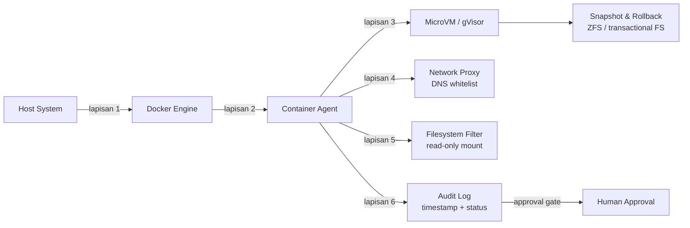
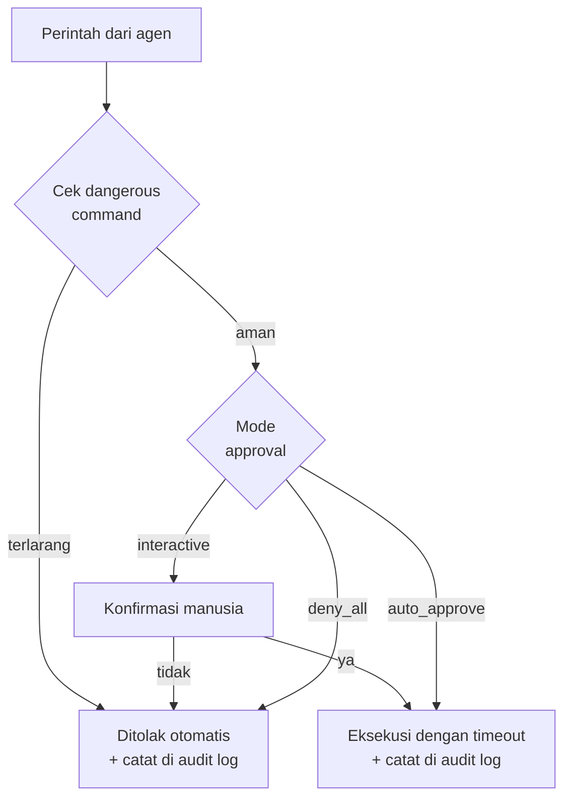

# Bab 4.8: Keamanan & Sandbox

> Memberi akses *shell* ke AI terasa seperti menyerahkan kunci mobil Anda kepada pengemudi yang sangat cerdas, tetapi kadang salah membaca rambu lalu lintas. Model bahasa bisa melakukan banyak hal luar biasa — tetapi ia juga bisa salah menafsirkan satu instruksi dan menghapus berkas yang seharusnya dijaga. Bab ini membahas *threat model* agentic AI, cara mengurung agen dalam **Docker sandbox**, strategi *defense-in-depth* berlapis, hingga sistem *approval gate* yang mencegah kehancuran sebelum terjadi.

---

## 1. Tujuan Sub-Bab

Setelah membaca bab ini, Anda akan mampu:

- Menjelaskan *threat model* agentic AI: apa yang bisa salah ketika agen memiliki akses ke *file system*, *shell*, *network*, dan API
- Mengimplementasikan **Docker sandbox** untuk mengisolasi eksekusi agen dari sistem host
- Menerapkan strategi *defense-in-depth*: pembatasan *permission*, isolasi jaringan, dan *rollback*
- Membangun sistem *approval gate* yang memblokir perintah destruktif seperti `rm -rf`
- Membandingkan tingkat isolasi dari container biasa, Docker-in-Docker, gVisor, MicroVM, hingga VM penuh
- Mendesain arsitektur sandbox berlapis dengan *audit log* untuk akuntabilitas penuh

---

## 2. Threat Model Agentic AI: Apa yang Bisa Salah?

### Akses Luas, Pengawasan Sempit

Agentic AI modern bekerja dengan memanfaatkan alat — ia membaca berkas, mengeksekusi perintah, mengunduh data, dan memanggil API. Dari perspektif sistem operasi, agen ini tidak jauh berbeda dari pengguna yang login ke mesin Anda: ia memiliki akses ke *file system*, *shell*, *network*, dan API dengan semua hak yang Anda berikan. Masalahnya, apa yang bisa salah sangat beragam: `rm -rf /` yang menghapus seluruh direktori, unduhan *malware* yang kemudian dieksekusi, *data exfiltration* yang mengirim berkas sensitif ke server pihak ketiga, hingga *privilege escalation* yang membuka pintu ke sistem lain.

Kebanyakan orang membayangkan skenario ini sebagai "AI jahat yang memberontak". Kenyataannya lebih membosankan, tetapi tidak kalah berbahaya: **LLM bisa salah menafsirkan instruksi**. Anda meminta "bersihkan berkas log yang berumur lebih dari 30 hari", dan model menerjemahkannya menjadi `rm -rf /var/log/*` — tanpa filter tanggal. Bukan karena niat jahat, melainkan karena *ambiguity* adalah bagian tak terpisahkan dari bahasa alami, dan *function calling* — meskipun semakin akurat — tidak pernah sempurna seratus persen.

### Angka Kegagalan Function Calling

Kita bisa mengukur risiko ini secara kuantitatif. Pada *Berkeley Function Calling Leaderboard* (BFCL), model terbaik seperti **Claude Fable 5** mencapai akurasi 95,6%, sementara **DeepSeek V4 Pro** mencapai 93,9%. Artinya, bahkan model terbaik di kelasnya masih salah menginterpretasikan pemanggilan fungsi 4-6% dari waktu. Sekarang kalikan angka itu dengan ribuan panggilan fungsi per sesi kerja, dan Anda akan melihat bahwa kegagalan *function calling* bukanlah kejadian langka — ia adalah kepastian statistik. Inilah mengapa isolasi bukanlah opsi, melainkan fondasi dari setiap deployment agentic AI yang serius.

### Prinsip Dasar: Anggap Agen Tidak Dapat Dipercaya

Cara berpikir yang benar adalah menganggap agen sebagai *untrusted code* — kode dari sumber yang tidak diketahui — sekalipun ia dijalankan oleh model favorit Anda. Seperti halnya Anda tidak akan menjalankan skrip yang diunduh dari internet tanpa memeriksanya, Anda tidak boleh memberikan akses penuh ke mesin kepada agen tanpa lapisan pengaman. Bab ini akan membangun lapisan-lapisan itu satu per satu, dimulai dari fondasi paling sederhana: container.

---

## 3. Docker Sandbox: Lapisan Dasar

### Isolasi via Namespaces dan cgroups

Container Docker adalah lapisan dasar isolasi yang paling mudah diadopsi. Setiap container berjalan dalam *Linux namespaces* — namespace terpisah untuk PID, *mount*, *network*, *user*, dan *UTS* — sehingga proses di dalam container "melihat" dunia yang terbatas. Sementara itu, *cgroups* (control groups) membatasi sumber daya: berapa banyak CPU, memori, dan I/O yang boleh dikonsumsi. Hasilnya, sebuah agen yang berjalan di dalam container tidak bisa melihat proses di luar container, tidak bisa me-mount *file system* host secara sembarangan, dan tidak bisa memboroskan seluruh RAM mesin.

Bayangkan container seperti kamar sewa di dalam gedung apartemen: Anda punya pintu sendiri, perabot sendiri, dan kunci sendiri — tetapi dinding, fondasi, dan pipa air masih dibagikan dengan penghuni lain. Pintu kamar Anda (isolasi *namespaces*) cukup kuat untuk menahan penyusup biasa, tetapi *landlord* (kernel) masih bisa masuk kapan saja.

### Keterbatasan: Kernel yang Dibagi

Kelemahan mendasar container adalah **shared kernel**. Container tidak menjalankan kernel sendiri — ia meminjam kernel host. Ini luar biasa efisien (boot dalam hitungan milidetik, overhead rendah), tetapi berarti setiap *vulnerability* di kernel host menjadi pintu masuk potensial. Teknik *container escape* — melarikan diri dari container ke host — memang masih mungkin ditemukan di dunia nyata, dan penelitian terbaru bahkan mengukur kemampuan model frontier dalam melakukan breakout dari container secara otomatis [1]. Inilah sebabnya container saja tidak cukup; ia harus dikombinasikan dengan lapisan lain.

### Volume Mount: Prinsip Least Privilege

Bagian paling penting dari konfigurasi container untuk agen adalah cara Anda memasang berkas. Gunakan prinsip *least privilege*: kode sumber yang hanya perlu dibaca dipasang dengan mode **read-only** (`-v "$(pwd)/workspace:/workspace:ro"`), sedangkan area output sementara dibatasi ke direktori `/tmp` yang terpisah. Agen tidak pernah membutuhkan akses tulis ke berkas yang hanya perlu ia baca — dan jika ia tidak bisa menulis, ia tidak bisa menghancurkannya. Aturan ini sederhana, tetapi mencegah mayoritas insiden yang sebenarnya terjadi pada agentic AI: bukan karena agen jahat, melainkan karena agen menulis ke tempat yang salah.

---

## 4. Docker-in-Docker: Sandbox di dalam Sandbox

### Konsep DinD

Banyak agen modern membutuhkan kemampuan untuk menjalankan container sendiri — misalnya, menguji aplikasi, menjalankan kode dalam lingkungan terisolasi, atau membangun image. Memberi agen akses ke *Docker socket* host (`/var/run/docker.sock`) adalah salah satu kesalahan keamanan paling fatal: siapa pun yang menguasai socket itu menguasai seluruh host, karena Docker socket memberikan akses *root* efektif. Solusinya adalah **Docker-in-Docker (DinD)** — agen menjalankan Docker di *dalam* container Docker, bukan pada Docker host.

Dengan DinD, agen bebas menjalankan `docker run` sebanyak yang ia mau — tetapi semuanya terjadi di dalam lingkungan yang sudah terkunci. Ia tidak pernah menyentuh Docker daemon host, tidak bisa melihat container lain, dan tidak bisa mengubah konfigurasi mesin. Ini seperti memberi agen sebuah kotak pasir di dalam kotak pasir: ia bisa membangun istana pasir seluas apa pun, tetapi tidak pernah bisa keluar dari kotak terluar.

### Lapisan Hypervisor: gVisor dan Firecracker

Untuk mereka yang membutuhkan jaminan isolasi yang lebih kuat, ada dua teknologi utama. **gVisor** dari Google adalah *user-space kernel* yang menjadi penghalang antara aplikasi dan kernel host — setiap *syscall* dicegat dan diterjemahkan, sehingga kernel host tidak pernah melihat permintaan yang berbahaya. **Firecracker** dari AWS mengambil pendekatan berbeda: ia adalah *MicroVM* yang menjalankan kernel khusus yang sangat ramping, sehingga setiap container mendapat kernel *dedicated* sendiri tanpa overhead VM tradisional. Keduanya mengatasi masalah *shared kernel* container biasa dengan biaya overhead yang relatif kecil (lihat Tabel A pada bagian 8).

---

## 5. Network Isolation: Memutus Akses Dunia Luar

### Sandbox Tanpa Internet

Sebagian besar ancaman terhadap agen membutuhkan satu jalur: jaringan. *Data exfiltration* tidak mungkin terjadi tanpa koneksi keluar; *malware* tidak bisa diunduh tanpa akses ke internet. Karena itu, salah satu langkah keamanan paling efektif adalah memblokir akses internet dari sandbox sejak awal. Konfigurasi Docker `--network none` memutus total komunikasi jaringan — agen hanya bisa berbicara dengan proses di dalam container-nya sendiri. Ini adalah pilihan terbaik untuk tugas yang tidak membutuhkan internet sama sekali, seperti pemrosesan berkas atau eksekusi kode lokal.

### Proxy dan DNS Whitelist

Ketika agen *memang* membutuhkan akses jaringan — misalnya untuk memanggil API LLM atau mengambil data dari sumber tertentu — gunakan *proxy* sebagai satu-satunya pintu keluar. Semua lalu lintas jaringan diarahkan ke proxy yang berperan sebagai penjaga gerbang: hanya *domain whitelist* yang diizinkan lewat, permintaan ke IP internal atau *LAN* diblokir, dan setiap koneksi dicatat. Dengan pendekatan ini, agen secara teknis "memiliki akses internet", tetapi praktis hanya bisa menjangkau tiga domain yang Anda setujui. Tidak ada akses ke jaringan internal perusahaan, tidak ada akses ke host lain, tidak ada akses ke layanan cloud yang tidak dikenal.

---

## 6. Permission & Approval Gates: Pintu Konfirmasi Manusia

### Empat Tingkat Permission

Isolasi teknis saja tidak cukup — Anda juga perlu mengatur *kebijakan* tentang apa yang boleh dilakukan agen. Model permission yang umum digunakan memiliki empat tingkat, diurutkan dari paling aman:

1. **Read-only** — agen hanya bisa membaca dan menganalisis; tidak ada operasi yang mengubah sistem.
2. **Dry-run** — agen boleh merencanakan operasi, tetapi semua eksekusi ditampilkan sebagai simulasi.
3. **With-approval** — agen dapat mengeksekusi, tetapi setiap operasi berisiko harus dikonfirmasi manusia terlebih dahulu.
4. **Full-auto** — agen berjalan tanpa konfirmasi; hanya cocok untuk tugas yang sepenuhnya dapat dipercaya dan tidak berisiko.

### Approval Gate untuk Operasi Destruktif

Operasi destruktif — `rm`, `mv`, `chmod`, `format`, dan sejenisnya — harus selalu melewati *approval gate*. Sistem ini memeriksa setiap perintah sebelum dieksekusi, membandingkannya dengan daftar *dangerous commands*, dan meminta konfirmasi manusia ketika menemukan kecocokan. Pola sederhananya dapat dilihat pada Tutorial B di bagian 10, di mana sebuah kelas `SafetyGate` memblokir `rm -rf` secara otomatis tanpa menunggu interaksi manusia sama sekali. Prinsipnya sederhana: biarkan agen bekerja cepat untuk hal-hal aman, dan paksa berhenti untuk hal-hal yang berisiko.

### Audit Log: Jejak Digital yang Tidak Terhapus

Setiap keputusan — disetujui, ditolak, atau diblokir — harus dicatat dalam **audit log** dengan timestamp, perintah, dan alasan. Log ini bukan sekadar formalitas; ia adalah alat debugging terbaik ketika insiden terjadi. Anda bisa menjawab pertanyaan "kenapa berkas ini terhapus?" dengan membuka log dan melihat: perintah apa yang dieksekusi, oleh siapa, disetujui oleh siapa, dan pada pukul berapa. Tanpa audit log, investigasi insiden berubah menjadi permainan menebak. Dengan audit log, setiap tindakan agen memiliki jejak yang dapat dipertanggungjawabkan [4].

---

## 7. Rollback & Snapshot: Jaring Pengaman Terakhir

### Snapshot Sebelum Agen Mulai

Tidak peduli seberapa baik isolasi dan *approval gate* Anda, insiden tetap bisa terjadi — dan ketika terjadi, pertanyaan paling penting bukan "bagaimana mencegahnya", melainkan "bagaimana mengembalikan keadaan". Sebelum agen mulai bekerja, buat **snapshot** dari *file system* menggunakan ZFS, btrfs, atau Timeshift. Snapshot adalah foto lengkap sistem pada satu titik waktu; jika agen mengacau, Anda tinggal kembali ke foto itu. Operasi ini murah, cepat, dan dapat diotomatisasi untuk setiap sesi kerja agen.

### Pendekatan Transaksional

Langkah lebih lanjut adalah pendekatan **transaksional**, yang diusung oleh penelitian *Fault-Tolerant Sandboxing* [3]: semua perubahan agen dibungkus dalam satu *transaction* atomik. Perubahan hanya di-*commit* ke sistem ketika seluruh tugas selesai tanpa error; jika terjadi kegagalan di tengah jalan, seluruh perubahan dibatalkan otomatis (*auto-rollback*) — seperti *database transaction* yang dibatalkan ketika satu pernyataan gagal. Kombinasi snapshot periodik dan *transactional filesystem* membuat kerusakan dari agen menjadi masalah sementara, bukan permanen.

---

## 8. Tabel Perbandingan

### Tabel A: Sandbox Isolation Levels

Tabel berikut membandingkan lima tingkat isolasi sandbox, dari yang paling sederhana hingga paling ketat — perhatikan bagaimana *boot time* dan *overhead* bergerak berlawanan arah dengan risiko *container escape*.

| Level | Teknologi | Isolasi Kernel | Boot Time | Overhead | Container Escape Risk |
|:---|:---|:---:|:---:|:---:|:---:|
| **1 — Container** | Docker | Shared | ~200ms | Rendah | Ada |
| **2 — DinD** | Docker-in-Docker | Shared (nested) | ~500ms | Rendah | Minimal |
| **3 — gVisor** | gVisor | Sandboxed kernel | ~300ms | Sedang | Sangat rendah |
| **4 — MicroVM** | Firecracker | Dedicated kernel | ~150ms | Sedang | Hampir tidak ada |
| **5 — Full VM** | QEMU/KVM | Dedicated | ~5-30s | Tinggi | Tidak ada |

Analisis dari tabel ini: ada hubungan langsung antara *overhead* dan keamanan, tetapi tidak selalu linier. Perhatikan bahwa Firecracker justru lebih cepat boot (150ms) daripada container biasa (200ms) karena kernel-nya yang sangat ramping — bukti bahwa MicroVM modern telah memecahkan masalah kecepatan. Sementara itu, Docker-in-Docker menambah *boot time* hanya 300ms dibandingkan container biasa, tetapi secara signifikan mengurangi risiko karena agen tidak lagi memiliki akses ke Docker daemon host. Pilihan level bergantung pada apa yang dipertaruhkan: untuk eksperimen pribadi, container biasa mungkin sudah cukup; untuk produksi yang memproses data sensitif, gVisor atau Firecracker layak dipertimbangkan; untuk kepatuhan ketat, VM penuh tetap menjadi standar emas.

### Tabel B: Risk Matrix — File Operations

Tabel ini memetakan setiap operasi yang mungkin dilakukan agen ke tingkat risiko, *permission* minimum yang dibutuhkan, kebutuhan *approval*, dan strategi mitigasinya.

| Operasi | Risiko | Minimal Permission | Approval Needed | Mitigasi |
|:---|:---:|:---|:---:|:---|
| **Read file** | Rendah | read | Tidak | - |
| **Write file** | Sedang | write | Opsional | Backup dulu |
| **Delete file** | Tinggi | write + delete | Ya | Trash instead |
| **Execute command** | Tinggi | execute | Ya | Timeout + log |
| **Network access** | Sedang | network | Ya | Whitelist |
| **Install package** | Sedang | write + execute | Ya | Allow list |
| **Format disk** | Kritis | root | Ya (manual) | Block by default |

Pola yang jelas terlihat: semakin tinggi risiko, semakin ketat kontrolnya. *Read file* berjalan tanpa hambatan, sedangkan *format disk* diblokir secara default bahkan tidak ditawarkan untuk disetujui secara otomatis. Mitigasi yang menarik adalah "trash instead" untuk penghapusan — alih-alih `rm`, pindahkan berkas ke folder sampah yang bisa dipulihkan, sehingga penghapusan yang keliru tidak pernah permanen. Perhatikan juga bahwa "Execute command" dan "Install package" membutuhkan *approval* karena keduanya adalah pintu gerbang ke kemampuan yang lebih luas: satu perintah bisa memicu serangkaian tindakan lain.

### Tabel C: Perbandingan Sandbox Tools untuk AI Agent

Terakhir, perbandingan antar-tool yang tersedia di ekosistem saat ini — dari solusi sederhana untuk pengembang lokal hingga arsitektur penelitian yang kompleks.

| Tool | Isolasi | Network | Filesystem | Rollback | Setup | Cocok untuk |
|:---|:---|:---|:---|:---:|:---|:---|
| **Docker Sandbox (Docker)** | Container | Proxy | Volume mount | Manual | Mudah | Developer lokal |
| **Docker Sandbox (MicroVM)** | MicroVM | Isolated | Clone mode | Snapshot | Sedang | Production |
| **llm-sandbox (vndee)** | Container | None mode | RO mount | Ephemeral | Mudah | Code execution |
| **CubeSandbox** | MicroVM | eBPF | Full isolation | Snapshot | Sulit | Enterprise |
| **Fault-Tolerant Sandbox** | Container + FS | VXLAN | Transactional | Auto-rollback | Sulit | Research |

Dari tabel ini, pesan utamanya adalah: tidak ada satu tool yang menang di semua dimensi. Untuk pengembang lokal yang ingin cepat mulai, **llm-sandbox** dengan *read-only mount* dan mode tanpa jaringan adalah pilihan paling sederhana. Untuk produksi, versi MicroVM dari Docker Sandbox menawarkan isolasi lebih kuat dengan *snapshot rollback*. CubeSandbox menambahkan *eBPF* untuk mengendalikan lalu lintas jaringan di level kernel — menarik untuk perusahaan besar, tetapi sulit dikonfigurasi. Sementara Fault-Tolerant Sandbox dengan *transactional filesystem* dan *auto-rollback* adalah arah riset yang paling menjanjikan, meskipun belum siap untuk pengguna awam.

---

## 9. Diagram: Arsitektur Sandbox Defense-in-Depth

Diagram berikut menggambarkan arsitektur *defense-in-depth* yang ideal untuk agentic AI. Setiap lapisan memeriksa dan menahan potensi kerusakan, sehingga kegagalan satu lapisan tidak menggagalkan seluruh sistem.



Diagram ini menunjukkan enam lapisan yang bekerja bersama. Di lapisan pertama, host dan Docker Engine memisahkan container dari sistem utama. Lapisan kedua adalah container itu sendiri — agen bekerja di sini. Lapisan ketiga adalah MicroVM atau gVisor yang memotong jalur langsung ke kernel host. Lapisan keempat hingga keenam — proxy jaringan, filter *filesystem*, dan audit log — mengawasi setiap tindakan agen dari tiga sudut yang berbeda. Yang terpenting: *audit log* mengalir ke *human approval*, yang berarti setiap keputusan kritis pada akhirnya kembali ke manusia. Di bawah semua itu, *snapshot* dan sistem transaksional menunggu sebagai jaring pengaman terakhir. Tidak ada satu lapisan pun yang sempurna, tetapi enam lapisan sekaligus membuat kegagalan berlapis menjadi sangat sulit.

### Diagram Pelengkap: Siklus Approval Gate

Untuk memperjelas bagaimana *approval gate* bekerja saat runtime, berikut alur pengambilan keputusan untuk setiap perintah yang diajukan agen:



Alur ini menunjukkan tiga jalur keputusan. Perintah yang mengandung pola berbahaya seperti `rm -rf` langsung ditolak tanpa dialog — ini adalah kunci keamanan yang tidak bisa ditimpa. Perintah aman kemudian memasuki keputusan mode: dalam mode interaktif, manusia diminta konfirmasi; dalam mode `auto_approve`, perintah dijalankan langsung (hati-hati dengan mode ini); dalam mode `deny_all`, semua dieksekusi diblokir. Setiap hasil — ditolak atau dieksekusi — dicatat di audit log, menciptakan jejak yang lengkap.

---

## 10. Tutorial / Hands-On

### Tutorial A: Docker Sandbox untuk AI Agent

Tutorial ini membangun sandbox Docker lengkap dengan *filesystem* read-only, memori terbatas, dan tanpa akses jaringan — aman untuk menjalankan agen yang memproses berkas lokal.

```bash
# setup_sandbox.sh — Docker sandbox untuk agent
#!/bin/bash

# 1. Buat Dockerfile untuk sandbox
cat > Dockerfile.sandbox << 'EOF'
FROM ubuntu:22.04
RUN apt-get update && apt-get install -y \
    python3 python3-pip curl git jq \
    && rm -rf /var/lib/apt/lists/*
RUN pip3 install --no-cache-dir requests
WORKDIR /workspace
EOF

# 2. Build image
docker build -t agent-sandbox -f Dockerfile.sandbox .

# 3. Jalankan container dengan limited permissions
docker run --rm -it \
    --name agent-sandbox \
    --read-only \
    --tmpfs /tmp:rw,noexec,nosuid,size=100m \
    --network none \
    --security-opt no-new-privileges \
    --cap-drop ALL \
    --memory 2g \
    --cpus 2 \
    -v "$(pwd)/workspace:/workspace:ro" \
    agent-sandbox \
    python3 -c "import os; print('Sandbox aktif!')"
```

Mari kita bedah setiap flag pada perintah `docker run` di atas. Flag `--read-only` membuat seluruh *filesystem* container hanya bisa dibaca — agen tidak bisa menulis apa pun kecuali ke `/tmp`, yang didefinisikan sebagai *tmpfs* dengan batas 100 MB dan tanpa izin eksekusi (`noexec`). Flag `--network none` memutus total akses jaringan, sehingga *exfiltration* data secara teknis mustahil. Flag `--security-opt no-new-privileges` mencegah proses menaikkan hak istimewa, dan `--cap-drop ALL` menghapus semua *Linux capabilities* — tanpa capabilities, perintah seperti `mount` atau `chown` tidak bisa dijalankan bahkan oleh *root* di dalam container. Terakhir, `--memory 2g` dan `--cpus 2` membatasi konsumsi sumber daya. Direktori `workspace` dari host dipasang secara read-only, dan hasil kerja agen ditulis ke `/tmp` yang kemudian bisa disalin keluar setelah container berhenti.

### Tutorial B: Approval Gate System

Script Python ini adalah inti dari sistem *safety gate* — ia memeriksa setiap perintah, memblokir yang berbahaya, dan mencatat semua keputusan ke audit log.

```python
# safety_gate.py — approval system untuk agent commands
import os
import json
import time

DANGEROUS_COMMANDS = ["rm", "mv", "dd", "format", "mkfs",
                       "chmod 777", ">:*", "wget", "curl"]

class SafetyGate:
    def __init__(self, mode="interactive"):
        self.mode = mode  # interactive | auto_approve | deny_all

    def check_command(self, cmd):
        """Cek apakah command berbahaya"""
        for dangerous in DANGEROUS_COMMANDS:
            if dangerous in cmd:
                return False, f"Command terlarang: {dangerous}"
        return True, "OK"

    def log_action(self, cmd, status, reason):
        with open("audit.log", "a") as f:
            entry = {"cmd": cmd, "status": status,
                     "reason": reason, "timestamp": time.time()}
            f.write(json.dumps(entry) + "\n")

    def execute(self, cmd, timeout=30):
        """Eksekusi dengan safety check"""
        safe, reason = self.check_command(cmd)
        if not safe:
            self.log_action(cmd, "REJECTED", reason)
            return {"status": "rejected", "reason": reason}

        if self.mode == "interactive":
            print(f"\n[APPROVAL] Command: {cmd}")
            choice = input("Approve? (y/N/skip): ").lower()
            if choice != 'y':
                self.log_action(cmd, "REJECTED", "User declined")
                return {"status": "rejected"}

        self.log_action(cmd, "APPROVED", "")
        result = os.popen(f"timeout {timeout} {cmd}").read()
        return {"status": "executed", "output": result}

# Penggunaan
gate = SafetyGate(mode="interactive")
gate.execute("rm -rf /important")  # Akan ditolak
gate.execute("ls -la")            # Akan minta approval
```

Perhatikan dua jalur pertahanan dalam kelas ini. Pertama, `check_command` membandingkan perintah dengan daftar *dangerous commands* — daftar ini mencakup `rm`, `mv`, `dd`, `format`, `mkfs`, `chmod 777`, pola *output redirection* `>:*`, serta `wget` dan `curl` sebagai pintu masuk unduhan. Jika cocok, perintah ditolak sebelum sempat berjalan. Kedua, dalam mode interaktif, manusia tetap diminta konfirmasi bahkan untuk perintah yang lolos pemeriksaan awal — lapisan manusia inilah yang menangkap kesalahan interpretasi yang tidak terdeteksi oleh pola statis. Semua keputusan, baik yang ditolak maupun dieksekusi, ditulis ke `audit.log` sebagai JSON dengan timestamp. Cobalah jalankan skrip ini dan amati bagaimana `audit.log` terbentuk — Anda akan melihat pola data yang sama dengan yang dijanjikan di bagian Audit Log.

### Tutorial C: Docker-in-Docker untuk Agent

Tutorial terakhir menunjukkan cara memberi agen kemampuan `docker run` tanpa pernah memberinya akses ke Docker daemon host — pola yang dibahas pada bagian 4.

```bash
# dind_agent.sh — Docker-in-Docker untuk agent
# Agent bisa 'docker run' tapi tidak punya akses ke host docker

# 1. Jalankan DinD container
docker run --privileged --name dind -d docker:27-dind

# 2. Jalankan agent dengan koneksi ke DinD
docker run --rm -it \
    --link dind:docker \
    -e DOCKER_HOST=tcp://docker:2376 \
    alpine sh -c "
# Agent ada di sini — bisa docker run image apa pun
# Tapi tidak bisa akses Docker host asli
docker run --rm alpine echo 'Hello from inside sandbox!'
"
```

Baris pertama menjalankan daemon Docker di dalam container (`docker:27-dind`) — inilah "Docker di dalam Docker". Baris kedua menjalankan agen (diwakili container Alpine) yang terhubung ke daemon *di dalam* container tersebut melalui variabel lingkungan `DOCKER_HOST=tcp://docker:2376`. Ketika agen mengeksekusi `docker run alpine`, container yang dihasilkan berjalan di dalam sandbox, bukan di host Anda. Jika agen mencoba melakukan sesuatu yang merusak terhadap Docker, yang bisa ia rusak hanyalah sandbox itu sendiri — dan karena container dijalankan dengan `--rm`, semua jejak hilang saat selesai. Catatan: flag `--privileged` dibutuhkan oleh daemon DinD itu sendiri, tetapi flag ini hanya berlaku di dalam container dind, bukan untuk agen yang berjalan di lapisan atas.

---

## 11. Studi Kasus: Insiden Nyata — Agent Hampir Hapus Production Database

**Skenario:** Sebuah perusahaan menengah mengoperasikan server produksi dengan ribuan berkas log audit — data yang secara regulasi wajib disimpan selama bertahun-tahun. Manajemen memutuskan memanfaatkan agentic AI untuk pekerjaan operasional harian, termasuk pembersihan berkas. Seorang engineer memberikan perintah kepada agen: "Bersihkan file log lama di server".

**Masalah:** Perintah itu ambigu. "Log lama" tidak didefinisikan — berapa umur berkas yang dianggap lama? Agen menafsirkan instruksi secara literal dan menyusun perintah `rm -rf /var/log/*` tanpa filter tanggal. Satu perintah ini, jika dieksekusi, akan menghapus *semua* log, termasuk log yang baru dibuat dan yang masih dibutuhkan untuk audit kepatuhan. Tim baru menyadari masalah ini setelah melihat jejak di layar monitor.

**Mengapa tidak terjadi:** Sistem *safety gate* yang dipasang di hari sebelumnya melakukan tugasnya. Saat perintah `rm -rf /var/log/*` diajukan, kelas `SafetyGate` (seperti Tutorial B) langsung mengenali pola `rm` — yang termasuk *dangerous command* — dan menolak eksekusi secara otomatis, tanpa menunggu konfirmasi manusia sekalipun. Perintah dicatat di audit log dengan status `REJECTED` dan alasan `Command terlarang: rm`. Tidak ada satu berkas pun yang hilang.

**Pelajaran:** Insiden ini merangkum seluruh tema bab ini. Pertama, *threat model* bekerja: bahaya bukan datang dari agen yang "jahat", melainkan dari salah interpretasi instruksi — dan model dengan akurasi *function calling* setinggi **Claude Fable 5** (95,6% BFCL) atau **DeepSeek V4 Pro** (93,9% BFCL) tetap bisa salah pada 4-6% pemanggilan. Kedua, tanpa sandbox dan *approval gate*, satu prompt yang salah bisa menjadi bencana permanen. Ketiga, audit log bukan formalitas — ia adalah bukti yang menyelamatkan tim dari investigasi yang panjang. Insiden ini tidak menelan korban data, tetapi mengubah kebijakan perusahaan: sejak hari itu, semua agen wajib berjalan dalam sandbox dengan `--cap-drop ALL` dan semua operasi penghapusan wajib melewati konfirmasi manual.

---

## 12. Referensi

### Paper Jurnal/Konferensi

[1] Marchand, R., O'Cathain, A., Wynne, J., et al. (2026). *Quantifying Frontier LLM Capabilities for Container Sandbox Escape*. arXiv:2603.02277. DOI: [10.48550/arXiv.2603.02277](https://arxiv.org/abs/2603.02277) — SandboxEscapeBench, benchmark kemampuan LLM untuk *breakout* dari container; dasar mitigasi pada Tabel A.

[2] Cheng, D., Huang, S., Gu, Y., et al. (2026). *LLM-in-Sandbox Elicits General Agentic Intelligence*. arXiv:2601.16206. DOI: [10.48550/arXiv.2601.16206](https://arxiv.org/abs/2601.16206) — Docker sandbox dan *file system* sebagai *long-term memory* untuk agen; arsitektur isolasi yang menjadi fondasi desain di bagian 3-4.

[3] Yan, B., et al. (2025). *Fault-Tolerant Sandboxing for AI Coding Agents: A Transactional Approach to Safe Autonomous Execution*. arXiv:2512.12806. DOI: [10.48550/arXiv.2512.12806](https://arxiv.org/abs/2512.12806) — *Transactional sandboxing*: perubahan atomik dan *auto-rollback* pada kegagalan; dasar pendekatan pada bagian 7.

[4] Masterman, T., Besen, S. (2024). *Agentic AI Frameworks: Architectures, Protocols, and Design Challenges*. arXiv:2404.11584. DOI: [10.48550/arXiv.2404.11584](https://arxiv.org/abs/2404.11584) — Arsitektur keamanan agen: *safety guardrails*, model permission, dan *audit trails*.

[5] Wang, L., Ma, C., Feng, X., et al. (2024). *A Survey on Large Language Model based Autonomous Agents*. Frontiers of Computer Science, 18(6), 186345. DOI: [10.1007/s11704-024-40231-1](https://doi.org/10.1007/s11704-024-40231-1) — Kategorisasi risiko agen, termasuk *safety* dan *security* sebagai dimensi evaluasi.

### Referensi Pendukung

[6] Docker Security Documentation. [https://docs.docker.com/engine/security/](https://docs.docker.com/engine/security/)

[7] gVisor — Sandboxed Container Runtime. [https://gvisor.dev](https://gvisor.dev)

[8] Firecracker MicroVM (AWS). [https://firecracker-microvm.github.io](https://firecracker-microvm.github.io)
