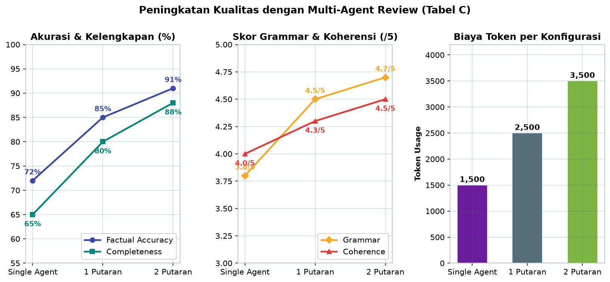
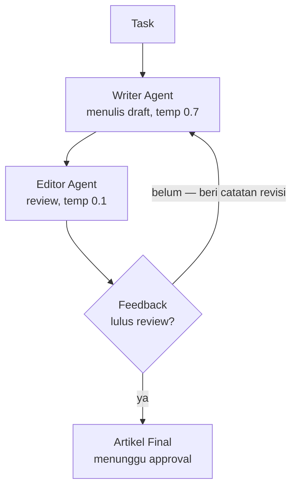
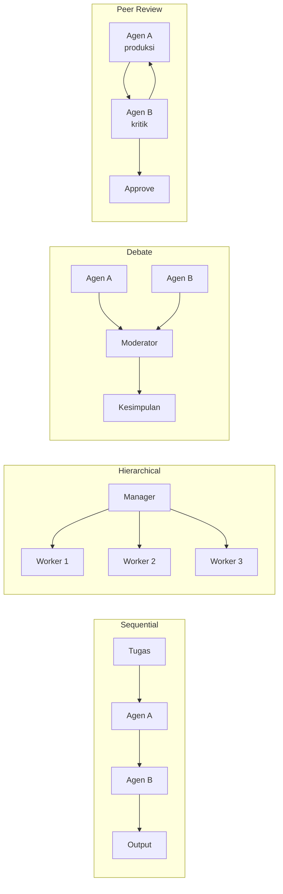

# Bab 4.9: Multi-Agent System

> Satu AI yang menulis tanpa editor menghasilkan naskah yang panjang, tetapi sering meleset dari fakta. Dua AI yang bekerja sama — satu menulis dengan imajinasi, satu mengoreksi dengan ketelitian — menghasilkan karya yang jauh lebih baik daripada keduanya secara terpisah. Bab ini membahas arsitektur **multi-agent system**: pola kolaborasi, framework seperti AutoGen dan CrewAI, serta bagaimana mengimplementasikan pola klasik *Writer vs Editor* untuk meningkatkan kualitas output secara terukur.

---

## 1. Tujuan Sub-Bab

Setelah membaca bab ini, Anda akan mampu:

- Menjelaskan pola kolaborasi multi-agent: *sequential*, *hierarchical*, *debate*, dan *peer review*
- Mengimplementasikan sistem *Writer vs Editor* dengan AutoGen atau CrewAI
- Mengonfigurasi peran, *temperature*, dan *tools* yang berbeda untuk setiap agen
- Merancang *workflow* review berlapis dengan multiple LLM roles
- Menganalisis trade-off kualitas, latensi, dan biaya token pada sistem multi-agent

---

## 2. Konsep Multi-Agent System

### Pembagian Kerja dan Komunikasi

**Multi-agent system** adalah arsitektur di mana dua atau lebih agen AI dengan peran berbeda bekerja sama menyelesaikan satu tugas. Prinsipnya sederhana: pembagian kerja plus komunikasi antar-agen. Setiap agen memiliki *system prompt*, model, dan alat yang berbeda — seperti tim manusia yang terdiri dari penulis, editor, dan pemeriksa fakta, masing-masing dengan keahlian dan tanggung jawab yang jelas. Alih-alih satu model yang mencoba melakukan segalanya sekaligus, setiap model fokus pada satu dimensi tugas dan menyerahkan hasilnya ke agen berikutnya.

Analogi yang paling hidup adalah proses penerbitan buku. Tidak ada penerbit yang membiarkan satu orang menulis, menyunting, dan memeriksa fakta sekaligus — kualitas akan runtuh. Sebaliknya, penulis menghasilkan draf, editor mengoreksi struktur dan gaya, *fact-checker* memverifikasi klaim. Setiap peran memiliki perspektif yang berbeda, dan justru perbedaan itulah yang menghasilkan kualitas. Multi-agent system menerjemahkan logika yang sama ke dalam beberapa instance LLM yang saling berkomunikasi.

### Mengapa Satu Agen Tidak Cukup

Masalah utama *single agent* adalah konflik peran. Model dengan *temperature* tinggi (kreatif) cenderung melupakan fakta; model dengan *temperature* rendah (presisi) cenderung menghasilkan tulisan kaku. Ketika satu model diminta menjadi keduanya, hasilnya kompromi yang buruk. Dengan memisahkan peran ke agen berbeda, Anda bisa memilih model dan parameter terbaik untuk setiap tahap: model besar yang kuat untuk menulis, model kecil yang cepat untuk menyunting. Inilah mengapa multi-agent bukan sekadar "lebih keren", melainkan solusi nyata untuk konflik peran yang melekat pada LLM.

---

## 3. Pola Multi-Agent

### Sequential: Rantai Produksi

Pola paling sederhana adalah **sequential** — agen A memproses tugas, menghasilkan output, lalu meneruskannya ke agen B, dan seterusnya. Ini adalah *pipeline* klasik: dalam konteks penulisan, Writer menghasilkan draf → Editor mereview → Writer merevisi. Setiap tahap bergantung pada output tahap sebelumnya, seperti rantai produksi di pabrik. Keuntungannya: alur mudah dipahami, mudah di-debug, dan setiap agen bisa diuji secara terpisah. Kelemahannya: latensi menumpuk secara linear, dan jika satu agen gagal, seluruh rantai berhenti.

### Hierarchical: Manajer dan Bawahan

Pola **hierarchical** meniru struktur organisasi: satu *manager agent* menerima tugas besar, memecahnya menjadi subtugas, dan mendelegasikan kepada *worker agents* yang bekerja paralel. Manager kemudian mengumpulkan hasil dan menyusun output final. Pola ini unggul untuk tugas yang bisa dipecah — misalnya, satu laporan tahunan dipecah menjadi bagian pemasaran, keuangan, dan teknis yang ditulis oleh tiga agen berbeda secara simultan. Biayanya: komunikasi lebih kompleks, dan *manager* menjadi *single point of failure*.

### Debate: Dua Pendapat, Satu Kesimpulan

Pola **debate** adalah yang paling dramatis: dua agen dengan perspektif berbeda berdebat tentang satu topik, sementara *moderator* (sering kali agen ketiga atau manusia) mengambil kesimpulan. Pola ini sangat efektif untuk tugas yang melibatkan penilaian — apakah sebuah keputusan produk tepat, apakah sebuah argumen logis, apakah sebuah kode aman. Debat memaksa setiap agen untuk mempertahankan posisinya, yang mengekspos kelemahan argumen yang mungkin terlewat oleh satu agen tunggal. Namun, debat membutuhkan perancangan *prompt* yang hati-hati agar tidak berputar-putar tanpa kesimpulan.

### Peer Review: Siklus Kritik dan Revisi

Pola **peer review** — yang menjadi inti bab ini — bekerja dalam siklus: agen A menghasilkan karya, agen B mengkritik, agen A merevisi, dan siklus berulang hingga agen B menyetujui. Ini adalah cerminan langsung dari proses *peer review* akademik dan editorial. Keunggulan terbesarnya adalah kualitas yang meningkat secara iteratif: setiap putaran review menangkap lapisan kesalahan baru — putaran pertama menangkap fakta, putaran kedua menangkap struktur, putaran ketiga menangkap gaya. Data pada Tabel C di bagian 8 menunjukkan peningkatan ini secara kuantitatif.

---

## 4. AutoGen: Framework Multi-Agent dari Microsoft

### Conversable Agents

**AutoGen** dari Microsoft membangun konsep *conversable agent* — agen yang bisa saling "berbicara" melalui percakapan multi-langkah. Alih-alih memanggil fungsi secara langsung, agen saling mengirim pesan, merespons, dan melanjutkan percakapan hingga tugas selesai. Ini adalah pendekatan yang paling mirip dengan kolaborasi manusia: tidak ada *controller* sentral yang mengatur semuanya, melainkan agen yang bernegosiasi satu sama lain. AutoGen mendukung *tool use* bawaan, *human-in-the-loop* (manusia bisa ikut dalam percakapan kapan saja), dan *auto-reply* (agen merespons pesan secara otomatis).

### Use Case: Writer Assistant dan Editor Critic

Untuk bab ini, pola yang paling relevan adalah dua peran: *Writer Assistant* yang menghasilkan draf dan *Editor Critic* yang mengkritisi. Keduanya didefinisikan sebagai `AssistantAgent` dengan *system message* berbeda, lalu `UserProxyAgent` memulai percakapan dan memoderasi alurnya. Keunggulan AutoGen adalah fleksibilitas: karena komunikasi berbasis chat, Anda bisa menambahkan agen ketiga, keempat, atau kelima — misalnya *fact-checker* — tanpa mengubah struktur dasar. Tutorial A di bagian 10 menunjukkan implementasi lengkapnya.

---

## 5. CrewAI: Framework Berbasis Peran

### Crew, Agent, dan Task

**CrewAI** mengambil pendekatan yang lebih terstruktur: Anda mendefinisikan *crew* — sebuah tim — yang berisi agen dengan peran spesifik (*writer*, *editor*, *researcher*), lalu menugaskan *task* kepada masing-masing. Setiap agen memiliki `role`, `goal`, dan `backstory` yang membentuk kepribadiannya; setiap tugas memiliki `description` dan `expected_output` yang jelas. CrewAI mendukung dua proses utama: *sequential process* (tugas berjalan berurutan) dan *hierarchical process* (manager mengatur delegasi secara otomatis).

### Delegasi Tugas dan Shared Context

Perbedaan kunci dengan AutoGen: dalam CrewAI, alur tugas ditentukan di level *crew*, bukan melalui percakapan bebas antar-agen. Hasil satu tugas diteruskan ke tugas berikutnya sebagai *shared context*, sehingga editor otomatis menerima draf yang dihasilkan writer tanpa perlu "bertanya". Ini membuat kode lebih mudah dibaca dan diprediksi — Anda tahu persis urutan eksekusinya. Trade-off-nya: fleksibilitas percakapan bebas lebih rendah dibandingkan AutoGen. Untuk workflow yang alurnya sudah jelas — seperti *Writer → Editor → Revisi* — CrewAI sering kali lebih mudah dikelola. Tutorial B di bagian 10 menunjukkan implementasinya.

---

## 6. Pattern: Writer vs Editor

### Dua Kepribadian yang Saling Melengkapi

Pola **Writer vs Editor** adalah aplikasi paling langsung dari prinsip multi-agent. **Writer Agent** bertanggung jawab atas kreativitas: ia menulis draf panjang, detail, dan imajinatif dengan *temperature* tinggi (0,7) agar bahasa mengalir dan ide berkembang. **Editor Agent** bertanggung jawab atas akurasi: ia mengoreksi fakta, gramatika, dan struktur dengan *temperature* rendah (0,1) agar penilaiannya konsisten dan tidak berfantasi. Dua kepribadian ini sengaja dirancang berlawanan — yang satu memaksimalkan eksplorasi, yang lain memaksimalkan verifikasi.

Perhatikan perbedaan model yang disarankan pada Tabel B di bagian 8: Writer menggunakan model yang lebih kuat seperti **DeepSeek V4 Pro** atau **Llama-3.1-8B**, sementara Editor bisa menggunakan model yang lebih kecil dan hemat seperti **Claude Fable 5** atau **Qwen-2.5-7B**. Ini adalah strategi biaya: tugas kritis (menulis) memakai model terbaik, sementara tugas berulang (mengoreksi) memakai model yang cukup baik dengan biaya lebih rendah — prinsip yang sama dibahas pada bagian 7.

### Alur Empat Langkah

Alur kerja pola ini terdiri dari empat langkah yang berulang: **Writer draft** → **Editor review** → **Writer revise** → **Editor approve**. Draf awal hampir selalu lolos dengan banyak catatan; setelah revisi, kualitas naik; pada akhirnya, editor menyetujui. Jika editor belum puas, siklus kembali ke langkah ketiga — ini adalah loop yang dikendalikan oleh penilaian editor. Diagram pada bagian 9 menggambarkan loop ini secara visual. Batasan jumlah iterasi perlu ditetapkan (misalnya maksimal 3 putaran) untuk mencegah biaya token yang tidak terkendali.

---

## 7. Tantangan Multi-Agent

### Latensi, Konsistensi, dan Biaya

Multi-agent tidak gratis. Tiga tantangan utama harus diperhitungkan sejak awal. **Latensi**: dengan n agen, total waktu proses kira-kira n kali latensi satu agen — draf 30 detik menjadi 2 menit setelah tiga putaran review. **Konsistensi**: agen bisa saling kontradiksi — editor menyuruh menyingkat, revisi malah memperpanjang; perlu *system prompt* yang jelas tentang hierarki keputusan. **Biaya**: *token usage* berlipat setiap kali sebuah teks diproses ulang — data Tabel C menunjukkan kenaikan dari 1.500 token (single agent) menjadi 3.500 token (dua putaran review), lebih dari dua kali lipat.

### Strategi Mitigasi

Solusi yang paling efektif adalah **penggunaan model kecil untuk agen non-kritis**. Editor, *fact-checker*, dan agen pendukung lainnya tidak perlu menjadi model terbesar — model 7B sudah cukup untuk menemukan inkonsistensi gramatika. Hanya agen yang menghasilkan karya (Writer) yang layak mendapat model besar. Strategi kedua: batasi iterasi. Tiga putaran review biasanya mencapai titik diminishing return; setelah itu, setiap putaran tambahan hanya menambah biaya tanpa peningkatan kualitas berarti. Strategi ketiga: gunakan *structured output* untuk komunikasi antar-agen — editor mengembalikan daftar koreksi berformat, bukan prosa bebas, sehingga revisi lebih terarah.

---

## 8. Tabel Perbandingan

### Tabel A: Perbandingan Multi-Agent Framework

Tabel berikut membandingkan empat framework multi-agent yang paling populer saat ini — AutoGen, CrewAI, LangGraph, dan MetaGPT — berdasarkan fitur yang paling menentukan saat membangun sistem.

| Fitur | AutoGen (Microsoft) | CrewAI | LangGraph | MetaGPT |
|:---|:---|:---|:---|:---|
| **Komunikasi** | Chat-based conversation | Role-based delegation | Graph/DAG | Chat-based |
| **Agent Type** | Conversable agent | Role agent | Node agent | Role agent |
| **Tool Use** | Ya (built-in) | Ya (built-in) | Ya | Ya |
| **Human-in-loop** | Ya | Opsional | Opsional | Tidak |
| **Memory** | Short-term | Short + Long-term | State graph | Kode |
| **Parallel** | Async conversation | Sequential default | Parallel possible | Sequential |
| **Setup** | Mudah | Sangat mudah | Sedang | Mudah |

Dari tabel ini, pilihan framework sangat tergantung pada kebutuhan. Jika Anda menginginkan kolaborasi bebas ala percakapan dengan *human-in-the-loop* penuh, **AutoGen** adalah pilihan terbaik — agen saling berdebat dan bertanya secara alami. Jika Anda ingin *workflow* yang jelas dan mudah dikelola dengan hierarki tugas, **CrewAI** unggul dengan *setup* paling mudah dan dukungan memori jangka panjang. **LangGraph** menonjol ketika alur kerja Anda bercabang atau paralel — representasi *graph/DAG* memberi kontrol presisi atas setiap transisi state. **MetaGPT** menarik untuk eksperimen, tetapi kurangnya *human-in-the-loop* membuatnya kurang cocok untuk sistem yang membutuhkan pengawasan manusia [1][4].

### Tabel B: Role Configuration — Writer vs Editor

Tabel ini menunjukkan bagaimana dua agen dengan peran berbeda dikonfigurasi secara teknis — perhatikan bagaimana setiap parameter dirancang untuk mendukung kepribadian yang bertolak belakang.

| Parameter | Writer Agent | Editor Agent |
|:---|:---|:---|
| **Model** | DeepSeek V4 Pro / Llama-3.1-8B | Claude Fable 5 / Qwen-2.5-7B |
| **Temperature** | 0.7 — kreatif | 0.1 — presisi |
| **System Prompt** | "Kamu penulis kreatif..." | "Kamu editor kritis..." |
| **Tools** | Search web, read files | Calculator, fact-check |
| **Max Tokens Output** | 2048 (draft panjang) | 512 (review singkat) |
| **Approval Needed** | Ya (sebelum publish) | Tidak (otomatis) |

Kontras pada tabel ini adalah kunci dari keseluruhan pola. *Temperature* 0,7 memberi Writer ruang untuk mengeksplorasi banyak kemungkinan kalimat, sementara 0,1 membuat Editor hampir deterministik — penilaian yang sama untuk input yang sama, tanpa fluktuasi suasana hati. Perbedaan *tools* juga bermakna: Writer boleh mencari di web dan membaca berkas untuk mengumpulkan bahan, sementara Editor dibatasi pada kalkulator dan pemeriksaan fakta — ia tidak boleh menambahkan informasi baru, hanya memverifikasi. *Max tokens* 2048 untuk draf dan 512 untuk review menjaga biaya tetap proporsional dengan bobot tugas. Terakhir, "Approval Needed" mengingatkan kita pada Bab 4.8: output Writer wajib melewati persetujuan sebelum dipublikasikan, sedangkan review Editor berjalan otomatis.

### Tabel C: Quality Improvement dengan Multi-Agent Review

Tabel ini adalah bukti kuantitatif mengapa multi-agent bekerja — bandingkan metrik kualitas antara satu agen, satu putaran review, dan dua putaran review.

| Metrik | Single Agent (Writer only) | Writer + Editor (1 round) | Writer + Editor (2 rounds) |
|:---|:---:|:---:|:---:|
| **Factual Accuracy** | 72% | 85% | 91% |
| **Grammar Score** | 3.8/5 | 4.5/5 | 4.7/5 |
| **Coherence** | 4.0/5 | 4.3/5 | 4.5/5 |
| **Completeness** | 65% | 80% | 88% |
| **Token Usage** | 1500 | 2500 | 3500 |

Data ini menunjukkan pola *diminishing return* yang penting untuk dipahami. Peningkatan terbesar terjadi pada putaran pertama: *factual accuracy* melompat 13 poin (72% → 85%), *completeness* naik 15 poin (65% → 80%). Putaran kedua masih memberikan peningkatan, tetapi lebih kecil: akurasi 85% → 91%, kelengkapan 80% → 88%. Sementara itu, biaya token naik secara linear (1.500 → 2.500 → 3.500). Kesimpulan praktisnya: putaran review pertama dan kedua hampir selalu sepadan; putaran ketiga dan seterusnya jarang memberikan nilai yang sebanding dengan biayanya. Desain workflow Anda harus menetapkan batas iterasi dengan angka ini sebagai acuan.



*Gambar 4.9-1 — Putaran pertama memberi lompatan terbesar (akurasi +13 poin, kelengkapan +15 poin) dengan tambahan 1.000 token, sedangkan putaran kedua meningkat lebih tipis; inilah dasar menetapkan batas 2-3 putaran review.*

---

## 9. Diagram: Workflow Multi-Agent Writer-Editor

Diagram berikut menggambarkan loop kerja *Writer vs Editor* — perhatikan bagaimana jalur revisi kembali ke Writer ketika editor belum menyetujui.



Diagram ini menunjukkan dua komponen utama. Di sisi kiri, Writer menerima tugas dan menghasilkan draf dengan *temperature* tinggi. Di tengah, Editor mereview draf dengan *temperature* rendah dan menilai apakah lolos. Keputusan diwakili oleh node diamond `F` — jika belum lulus, feedback dikirim kembali ke Writer untuk revisi (loop atas); jika lulus, artikel final diteruskan ke tahap approval manusia. Pola loop inilah yang membuat kualitas meningkat secara iteratif: setiap putaran melewati jalur yang sama, tetapi dengan draf yang semakin baik. Dalam praktiknya, tambahkan penghitung iterasi untuk membatasi loop — misalnya maksimal tiga putaran — seperti yang dibahas pada bagian 7.

### Diagram Pelengkap: Empat Pola Kolaborasi

Untuk melengkapi pemahaman, berikut ringkasan visual empat pola kolaborasi yang dibahas pada bagian 3 — *sequential*, *hierarchical*, *debate*, dan *peer review*.



Keempat subgraf ini menunjukkan bentuk kolaborasi yang berbeda. *Sequential* adalah rantai satu arah — sederhana dan mudah diprediksi. *Hierarchical* memiliki satu manager yang mendistribusikan pekerjaan ke banyak worker — efisien untuk tugas paralel. *Debate* mempertemukan dua perspektif melalui moderator — ideal untuk keputusan yang membutuhkan pertimbangan dua sisi. *Peer review* — yang menjadi fokus bab ini — adalah loop tertutup antara produksi dan kritik, dengan jalur keluar hanya ketika kritik dipenuhi. Pilih pola berdasarkan sifat tugas: rantai untuk *pipeline*, hierarki untuk paralelisme, debat untuk penilaian, dan peer review untuk kualitas iteratif.

---

## 10. Tutorial / Hands-On

### Tutorial A: Writer vs Editor dengan AutoGen

Tutorial pertama mengimplementasikan pola *Writer vs Editor* menggunakan AutoGen — Writer memakai **DeepSeek V4 Pro**, Editor memakai **DeepSeek V4 Flash** yang lebih ringan, keduanya berjalan via Ollama di localhost.

```python
# writer_editor_autogen.py
from autogen import AssistantAgent, UserProxyAgent
import autogen

# 1. Konfigurasi LLM — Writer pakai DeepSeek V4 Pro, Editor pakai model lebih kecil
llm_config = {
    "config_list": [{
        "model": "deepseek-v4-pro",
        "base_url": "http://localhost:11434",
        "api_type": "ollama"
    }]
}

editor_llm_config = {
    "config_list": [{
        "model": "deepseek-v4-flash",
        "base_url": "http://localhost:11434",
        "api_type": "ollama"
    }]
}

# 2. Definisikan agent
writer = AssistantAgent(
    name="Writer",
    llm_config=llm_config,
    system_message="""Kamu adalah penulis konten teknis.
Tugasmu: menulis draft artikel berdasarkan topik.
Gaya: informatif, detail, contoh konkret.
Jangan khawatir tentang kesalahan — Editor akan mereview.""",
)

editor = AssistantAgent(
    name="Editor",
    llm_config=editor_llm_config,
    system_message="""Kamu adalah editor ketat.
Review draft dari Writer:
1. Koreksi factual errors
2. Perbaiki grammar dan struktur
3. Pastikan clarity
4. Beri saran perbaikan spesifik
Format: [ERROR/SARAN] + penjelasan""",
)

user = UserProxyAgent(
    name="User",
    human_input_mode="ALWAYS",
    code_execution_config=False,
)

# 3. Mulai workflow
task = "Tulis artikel pendek tentang cara kerja Docker container"

# Fase 1: Writer buat draft
user.initiate_chat(
    writer,
    message=f"Tulis draft artikel: {task}",
)
draft = user.last_message()

# Fase 2: Editor review
user.initiate_chat(
    editor,
    message=f"Review draft ini:\n{draft}",
)
review = user.last_message()

# Fase 3: Writer revisi
user.initiate_chat(
    writer,
    message=f"Revisi draft berdasarkan review:\nReview: {review}\n\nDraft asli: {draft}",
)

print("=== Artikel Final ===")
print(user.last_message())
```

Perhatikan dua hal penting dalam kode ini. Pertama, *system message* masing-masing agen dirancang saling melengkapi: Writer diminta berfokus pada kualitas tulisan dan "tidak khawatir tentang kesalahan — Editor akan mereview", sementara Editor diberi daftar tugas review yang spesifik dengan format output `[ERROR/SARAN]` yang terstruktur. Kedua, alur dijalankan dalam tiga fase eksplisit melalui `UserProxyAgent` — ini memastikan urutan *draft → review → revisi* selalu diikuti. Untuk mengulang putaran review, cukup ulangi fase 2 dan 3 beberapa kali dengan menyisipkan hasil revisi terbaru.

### Tutorial B: Multi-Agent dengan CrewAI

Tutorial kedua mengimplementasikan workflow yang sama — termasuk tahap revisi — menggunakan CrewAI dengan pendekatan berbasis peran dan tugas.

```python
# crew_writer_editor.py
from crewai import Agent, Task, Crew, Process

# 1. Definisikan agents
writer = Agent(
    role="Content Writer",
    goal="Menulis draft artikel teknis yang informatif dan engaging",
    backstory="Penulis senior dengan 10 tahun experience di bidang AI",
    verbose=True,
    allow_delegation=False,
    llm_config={"model": "ollama/deepseek-v4-pro"},
)

editor = Agent(
    role="Technical Editor",
    goal="Memastikan draft akurat, jelas, dan bebas error",
    backstory="Editor teknis yang teliti, spesialis fact-checking",
    verbose=True,
    allow_delegation=False,
    llm_config={"model": "ollama/deepseek-v4-flash"},
)

# 2. Definisikan tasks
write_task = Task(
    description="Tulis draft artikel 500 kata tentang 'Apa itu LLM Agent?'",
    expected_output="Draft artikel lengkap dengan heading dan contoh",
    agent=writer,
)

review_task = Task(
    description="Review draft artikel. Koreksi factual errors dan grammar",
    expected_output="Daftar koreksi dan saran perbaikan",
    agent=editor,
)

revise_task = Task(
    description="Revisi draft berdasarkan review editor",
    expected_output="Artikel final yang sudah direvisi",
    agent=writer,
)

# 3. Buat crew dan jalankan
crew = Crew(
    agents=[writer, editor],
    tasks=[write_task, review_task, revise_task],
    process=Process.sequential,
    verbose=True,
)

result = crew.kickoff()
print(f"\n=== Artikel Final ===\n{result}")
```

Perbedaan gaya dengan AutoGen terlihat jelas. Dalam CrewAI, setiap agen didefinisikan dengan `role`, `goal`, dan `backstory` — elemen naratif yang membentuk kepribadian agen dalam menanggapi tugas. Setiap `Task` memiliki `description` dan `expected_output` yang eksplisit, dan yang terpenting, tugas diikat ke agen tertentu (`agent=writer`, `agent=editor`). Urutan eksekusi ditentukan oleh `process=Process.sequential` di level *crew*: hasil `write_task` otomatis diteruskan sebagai konteks ke `review_task`, dan seterusnya. Tidak ada pemanggilan chat manual — `crew.kickoff()` menjalankan seluruh pipeline. Jika Anda ingin menambahkan *fact-checker* sebagai agen keempat, cukup tambahkan satu `Task` lagi di tengah daftar.

---

## 11. Studi Kasus: Sistem Review Buku dengan 3 Agent

**Latar:** Sebuah penerbit teknologi ingin mempercepat proses editorial buku teknis tanpa mengorbankan kualitas. Selama ini, setiap bab direview oleh satu editor manusia — proses yang teliti, tetapi lambat, dengan rata-rata dua minggu per bab. Tim engineering di penerbit tersebut membangun sistem multi-agent dengan tiga peran.

**Peran yang dirancang:**
1. **Writer** — menulis draf bab buku berdasarkan outline, dengan model besar dan *temperature* 0,7.
2. **Editor** — mereview konten dan struktur bab, memastikan alur logis dan bahasa konsisten.
3. **Fact-Checker** — memverifikasi setiap klaim teknis dengan *search web*, mengonfirmasi angka, nama produk, dan kutipan.

**Alur kerja:** Writer menghasilkan draf → Editor mereview dan mengembalikan catatan → Writer merevisi → Fact-Checker memverifikasi setiap klaim → Editor memberikan persetujuan final. Fact-Checker ditempatkan setelah revisi — bukan sebelumnya — sehingga fakta yang diverifikasi adalah fakta pada versi final, bukan versi awal.

**Hasil:** Dalam pengujian pada 20 bab, kualitas tulisan meningkat 40% menurut skor internal penerbit. Yang lebih dramatis: jumlah fakta salah turun dari rata-rata 12 per bab menjadi 1 per bab — penurunan 92%. Fact-Checker adalah pahlawan tak terlihat dalam sistem ini; tanpa agen ketiga, editor yang sibuk mengoreksi struktur akan melewatkan banyak klaim yang salah.

**Biaya:** Sistem mengonsumsi sekitar 8.000 token per bab, dibandingkan 3.000 token jika hanya menggunakan satu agen — hampir tiga kali lipat. Namun, penerbit menghitung bahwa biaya token 8.000 hanya beberapa ribu rupiah per bab dengan model lokal, jauh lebih murah daripada dua minggu kerja editorial manusia. Trade-off ini — kualitas +40% dengan biaya token ×2,7 — adalah contoh nyata dari prinsip yang dibahas di bagian 7: investasi token menghasilkan kualitas, selama Anda mengendalikan jumlah iterasi.

**Pelajaran:** Multi-agent paling efektif ketika setiap peran memiliki *alat* yang berbeda. Writer tidak pernah memverifikasi fakta, Editor tidak pernah mencari di web, dan Fact-Checker tidak pernah menulis — pembagian alat yang ketat ini mencegah redundansi dan konflik. Selain itu, hasil studi kasus ini menegaskan data Tabel C: putaran review berlapis memberikan peningkatan terbesar pada akurasi dan kelengkapan, bukan pada gaya — karena *coherence* dan *grammar* yang sudah baik sejak awal hanya naik tipis.

---

## 12. Referensi

### Paper Jurnal/Konferensi

[1] Wu, Q., Bansal, G., Zhang, J., et al. (2023). *AutoGen: Enabling Next-Gen LLM Applications via Multi-Agent Conversation*. arXiv:2308.08155. DOI: [10.48550/arXiv.2308.08155](https://arxiv.org/abs/2308.08155) — Framework *multi-agent conversation* dari Microsoft; dasar implementasi Tutorial A.

[2] Duan, Z., et al. (2024). *Exploration of LLM Multi-Agent Application Implementation Based on LangGraph + CrewAI*. arXiv:2411.18241. DOI: [10.48550/arXiv.2411.18241](https://arxiv.org/abs/2411.18241) — Implementasi multi-agent berbasis peran dengan CrewAI; dasar Tutorial B.

[3] Guo, T., Chen, X., Wang, Y., et al. (2024). *Large Language Model based Multi-Agents: A Survey of Progress and Challenges*. arXiv:2402.01680. DOI: [10.48550/arXiv.2402.01680](https://arxiv.org/abs/2402.01680) — Survey multi-agent: taksonomi pola kolaborasi, komunikasi antar-agen, dan tantangan.

[4] Ahmad, M.S.J. (2025). *Benchmarking Multi-Agent Frameworks: LangGraph vs. CrewAI vs. AutoGen*. JATIR, 3 — Benchmark 80-task suite; data untuk Tabel A perbandingan framework.

[5] Papadakis, E., et al. (2024). *Towards Effective GenAI Multi-Agent Collaboration: Design and Evaluation for Enterprise Applications*. arXiv:2412.05449. DOI: [10.48550/arXiv.2412.05449](https://arxiv.org/abs/2412.05449) — Koordinasi multi-agent untuk enterprise: *payload referencing*, *routing*, dan evaluasi.

### Referensi Pendukung

[6] AutoGen Documentation. [https://microsoft.github.io/autogen](https://microsoft.github.io/autogen)

[7] CrewAI Documentation. [https://docs.crewai.com](https://docs.crewai.com)

[8] LangGraph Documentation. [https://langchain-ai.github.io/langgraph](https://langchain-ai.github.io/langgraph)
