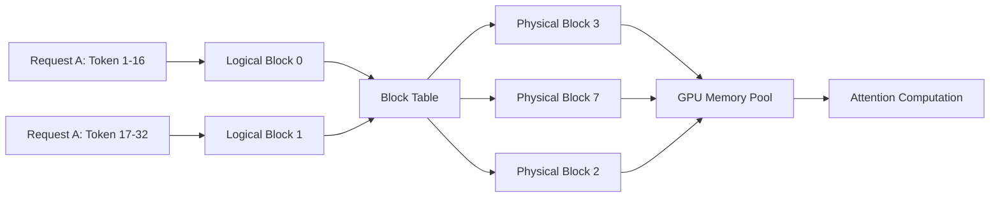
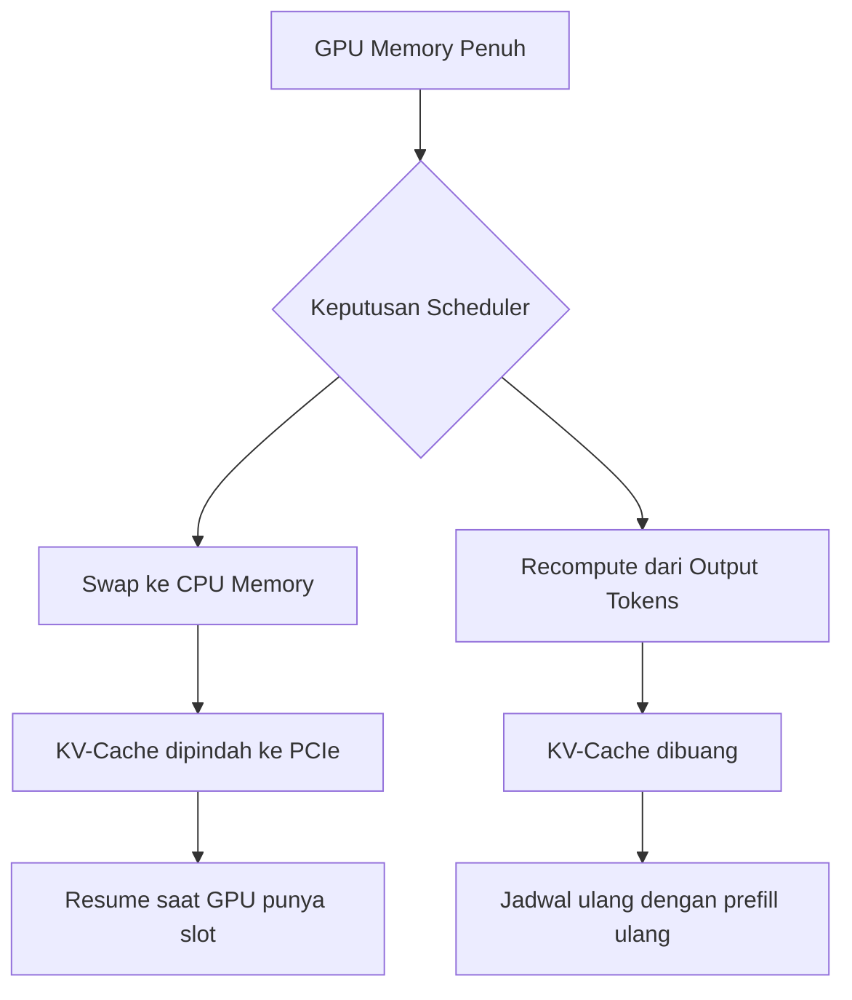

# Bab 5.1: vLLM

> Bayangkan perpustakaan raksasa yang menyimpan catatan percakapan Anda di atas meja-meja berukuran tetap — setengah meja kosong tidak bisa dipakai siapa pun, dan rak harus selalu berurutan meski sebenarnya tidak perlu. Itulah keadaan *KV-cache* pada mesin *inference* konvensional sebelum PagedAttention hadir. Bab ini mengajak Anda masuk ke dalam mesin vLLM: bagaimana sebuah ide dari sistem operasi — *virtual memory* — berhasil mengubah *bottleneck* memori menjadi keunggulan kompetitif, dan membuat satu server GPU melayani puluhan permintaan sekaligus tanpa tersendat.

---

## 1. Tujuan Sub-Bab

Setelah membaca sub-bab ini, Anda akan mampu:

- Menjelaskan mengapa **KV-cache** menjadi *bottleneck* utama dalam *LLM serving* — baik dari sisi kapasitas memori maupun pola alokasinya
- Memahami prinsip **PagedAttention**: meminjam ide *virtual memory* dari sistem operasi untuk mengelola KV-cache secara *block-level*
- Menerangkan cara vLLM mengalokasikan dan membebaskan memori GPU secara dinamis melalui *block table* dan *KV Cache Manager*
- Membedakan strategi *preemption* berbasis *swap* ke CPU versus *recomputation*, beserta konsekuensi latensinya
- Mengkonfigurasi parameter inti vLLM (`--block-size`, `--max-num-seqs`, `--gpu-memory-utilization`) untuk kebutuhan produksi
- Men-deploy server vLLM yang kompatibel dengan API OpenAI dan membaca metriknya

---

## 2. Masalah KV-Cache pada Serving

### 2.1 Dua Fase yang Tidak Seimbang

Setiap permintaan ke LLM melewati dua fase yang sifatnya bertolak belakang. Fase **prefill** membaca seluruh *prompt* sekaligus dan menghasilkan token pertama — fase ini rakus komputasi tetapi hanya terjadi sekali. Fase **decode** kemudian menghasilkan token berikutnya satu per satu secara *autoregressive* — setiap token baru bergantung pada seluruh token sebelumnya. Masalahnya, agar model bisa "mengingat" konteks, setiap token yang sudah diproses harus disimpan dalam bentuk pasangan tensor *key* dan *value* untuk tiap lapisan *attention*. Kumpulan tensor inilah yang disebut **KV-cache**, dan ukurannya tumbuh linear terhadap panjang percakapan serta jumlah lapisan model.

Di sinilah letak ironi *serving* model bahasa: bobot model memang statis (sekali dimuat di GPU, ukurannya tetap), tetapi **KV-cache tumbuh dinamis setiap token diproduksi**. Pada model besar dengan konteks panjang, KV-cache bisa memakan sebagian besar *VRAM* yang tersedia — bahkan lebih besar dari bobot model itu sendiri. Dengan kata lain, ketika Anda menambah pengguna, yang pertama kali kehabisan bukanlah komputasi GPU, melainkan memori untuk menyimpan "memori" tiap percakapan.

Lebih rumit lagi, ukuran KV-cache per request tidak bisa diketahui sebelumnya: model menentukan panjang jawaban saat berjalan, dan pengguna bisa menambah konteks kapan saja. Sistem alokasi yang kaku — reservasi penuh di awal — terpaksa bermain aman dengan mengunci kapasitas maksimum. Padahal mayoritas percakapan nyata hanya memakai sebagian kecil dari batas itu; sisanya menganggur, tetapi tetap terhitung sebagai "terpakai" di mata GPU. Inilah akar dari angka-angka pemborosan yang akan kita lihat pada Tabel 1: bukan kekurangan kapasitas, melainkan ketidakmampuan memakai kapasitas yang sebenarnya sudah tersedia.

### 2.2 Fragmenasi Memori dan Pemborosan 60-80%

Sayangnya, sekadar menyediakan memori saja tidak cukup — cara sistem konvensional **mengalokasikan** memori itu juga bermasalah. Bayangkan sebuah *request* yang boleh menghasilkan maksimal 2.048 token. Sistem lama seperti Hugging Face Transformers akan langsung mereservasi ruang untuk 2.048 token itu sejak awal, padahal percakapan sering berakhir di 100-200 token. Ruang sisanya terlanjur dikunci dan tidak bisa dipakai request lain — inilah **fragmenasi internal** (*reservasi maksimum*). Di sisi lain, KV-cache lama ditempatkan pada blok memori yang harus *contiguous* (berurutan); jika sisa memori hanya tersedia dalam potongan-potongan kecil berserakan, alokasi gagal walau total ruang masih cukup — inilah **fragmenasi eksternal**.

Akibat dua jenis fragmenasi ini, pengukuran pada paper PagedAttention menunjukkan **utilisasi memori KV-cache hanya 20-40%** — artinya 60-80% memori terbuang sebagai *waste* [1]. Sistem serving seperti Hugging Face Transformers bahkan mencatat pemborosan hingga ~80%, sementara FasterTransformer dan Orca masih ~60% dan ~50%. Hampir semua keuntungan *continuous batching* — yang memungkinkan banyak request berbagi satu GPU — tergerus habis oleh manajemen memori yang boros. Persis seperti perpustakaan yang menolak meminjamkan setengah meja yang kosong, GPU pun dipaksa menolak pekerjaan yang sebenarnya masih muat.

### 2.3 Mengapa Masalah Ini Kian Akut di 2026

Ada alasan mengapa topik ini baru meledak popularitasnya dalam dua tahun terakhir: *context window* model melonjak drastis. Model standar 2024 seperti Llama-3 membawa konteks 128K, sementara model frontier 2026 seperti DeepSeek V4 dan Mistral Large 3 menawarkan konteks **1 juta token** — delapan kali lipat hanya dalam dua tahun. KV-cache tumbuh linear terhadap panjang konteks, sehingga *request* dengan *prompt* panjang kini bisa memakan puluhan GB lebih banyak memori. Di sinilah humor pahit terjadi: model MoE modern seperti DeepSeek V4 Pro hanya menghitung 49 miliar parameter aktif per token — beban komputasi justru ringan dibandingkan model dense sekelas — tetapi KV-cache-nya tetap tumbuh tanpa kenal ampun. Hasilnya, *bottleneck* server modern hampir selalu **memori**, bukan *compute*.

Kabar baiknya, arsitektur model mulai membantu. DeepSeek V4 Pro dengan *hybrid CSA/HCA attention* memangkas KV-cache hingga hanya **10% dari V3.2** pada konteks 1 juta token, dan *training FLOPs*-nya hanya 27% milik V3.2 [8]. Efek gabungannya terlihat di Tabel 2 nanti: meski berparameter 1,6 triliun, DeepSeek V4 Pro justru mencapai *throughput* tertinggi di kelasnya — karena masalah memori yang menganga sudah diobati sejak arsitektur. Namun untuk model-model yang belum seefisien itu, manajemen memori yang baik tetap menjadi pembeda antara server yang melayani 4 request dan yang melayani 64 request per detik.

---

## 3. Konsep PagedAttention

### 3.1 Meminjam Virtual Memory dari OS

PagedAttention lahir dari sebuah analogi yang sangat sederhana namun dalam: jika LLM serving menghadapi masalah memori yang sama seperti program komputer di tahun 1960-an — *memory fragmentation* dan alokasi *contiguous* yang membatasi — mengapa tidak memakai solusi yang sudah matang di sistem operasi, yaitu **virtual memory**? Di dunia OS, program melihat alamat memori seolah berurutan, tetapi di belakang layar halaman-halamannya (*pages*) disimpan di mana saja di RAM, bahkan boleh dipindah ke disk. Pemetaannya dicatat di struktur bernama *page table*.

PagedAttention mengadopsi ide ini secara harfiah untuk KV-cache. KV-cache sebuah request dipecah menjadi **KV blocks** kecil berukuran tetap — secara default **16 token per blok**. Ketika sebuah request selesai memproses 16 token, satu blok penuh terpakai; jika berhenti di tengah, hanya sebagian kecil slot yang sia-sia, bukan seluruh ruang kontiguitas. Karena blok-blok ini *independen*, mereka boleh berserakan di mana saja di memori GPU — tidak perlu lagi menyimpan satu barisan memori yang panjang dan kaku.

Dampak langsung *block-level allocation* ini: alokasi dan pembebasan memori menjadi operasi murah yang sering dilakukan, bukan peristiwa langka yang mengerikan. Setiap kali sebuah request selesai, blok-bloknya kembali ke *pool* dalam hitungan mikrodetik dan langsung bisa dipinjam request lain. Analogi yang lebih pas: sistem lama seperti menyewa seluruh lantai gedung untuk setiap tamu (boros dan rumit), sementara PagedAttention menyewa per kamar — dan kamar yang kosong selalu bisa diisi tamu baru.

### 3.2 Block Table: Menghubungkan Logika dan Fisik

Agar model tetap bisa menghitung *attention* seolah-olah urutan KV-nya berurutan, vLLM menyimpan struktur yang disebut **block table** untuk setiap request. Struktur ini memetakan *logical blocks* — urutan abstrak yang dilihat model, 0, 1, 2, dan seterusnya — ke *physical blocks* yang lokasinya acak di *GPU memory pool*. Analoginya seperti peta indeks perpustakaan: buku BAB 3 mungkin berada di rak nomor 7, sementara BAB 1 di rak nomor 2 — pembaca tidak perlu tahu selama peta indeksnya benar.

Karena pemetaannya *non-contiguous*, blok yang berserakan sekalipun tetap bisa dihitung akurat oleh kernel attention. Lebih dari itu, pencarian blok bebas menjadi murah: vLLM cukup mencatat blok mana yang sedang dipakai oleh request mana, dan langsung melekatkan blok baru yang tersedia dari *GPU memory pool*. Ini menghapus fragmenasi eksternal sekaligus meminimalkan fragmenasi internal hingga sisa **~4%** saja — lompatan yang luar biasa dibandingkan sistem lama.

### 3.3 Copy-on-Write untuk Sampling Paralel

Ada satu lagi trik cerdik: untuk *parallel sampling* (meminta beberapa kandidat jawaban dari satu prompt) dan *beam search* (menelusuri beberapa cabang kalimat sekaligus), banyak request berbagi bagian awal prompt yang sama persis. Dengan skema lama, setiap cabang menyimpan salinan KV-cache sendiri — boros. PagedAttention memakai **copy-on-write**: cabang-cabang itu cukup *berbagi* blok fisik yang sama, dan baru diduplikasi ketika salah satu cabang mulai menghasilkan token yang berbeda. Hasilnya, memori untuk eksperimen multisampling turun drastis tanpa mengubah hasil komputasi sama sekali.

---

## 4. Arsitektur vLLM

### 4.1 Scheduler: Maestro Antrean yang Tegas

vLLM menjalankan *serving loop* yang terdiri dari beberapa komponen, dan yang pertama kali menari adalah **scheduler**. Scheduler menentukan request mana yang masuk ke batch pada iterasi berikutnya, berapa blok KV yang dialokasikan, dan — ketika memori GPU mulai penuh — request mana yang harus dihentikan sementara (*preempted*). Karena keputusan dibuat per iterasi kecil (bukan per *request* selesai), vLLM bisa mencampur *prefill* dan *decode* dari banyak request dalam satu langkah komputasi; inilah esensi **continuous batching** yang diwarisi dari sistem Orca [2]. Setiap request baru yang mengular tidak perlu menunggu batch lama selesai — cukup menunggu satu iterasi.

Kebijakan *scheduling* juga menjawab pertanyaan keadilan: apakah satu request dengan konteks 100K token boleh menguasai GPU berjam-jam, sementara puluhan request pendek antre? vLLM menangani ini dengan *weighted scheduling* dan *preemption* yang adil — request raksasa boleh masuk, tetapi tidak berhak memblokir yang lain tanpa batas. Efeknya terasa dalam *stabilitas*: pengguna dengan pertanyaan pendek hampir selalu mendapat jawaban cepat, sementara *request* besar tetap selesai — hanya sedikit lebih lambat dari yang mereka inginkan.

### 4.2 KV Cache Manager: Pemilik Gudang Blok

Di belakang scheduler ada **KV Cache Manager**, komponen yang bertugas mengalokasikan dan membebaskan blok KV secara dinamis. Saat request masuk, manager memesan blok untuk prompt; saat request selesai, blok-bloknya ditarik kembali ke *pool* untuk dipakai request lain. Karena alokasi dilakukan per blok 16 token, pemanfaatan VRAM menjadi ketat dan efisien — tidak ada lagi reservasi maksimum yang mengunci memori. Manager inilah yang membaca parameter `--gpu-memory-utilization` untuk menentukan seberapa besar fraksi VRAM yang boleh dipakai sebagai *KV cache pool* (default 0,90), dan `--swap-space` untuk menyisihkan RAM CPU sebagai tempat evakuasi sementara.

### 4.3 Worker dan Tensor Parallelism

Untuk model besar yang tidak muat di satu GPU, vLLM menyebar eksekusi ke beberapa *worker* melalui **tensor parallelism**: bobot model dipecah ke sejumlah GPU yang ditentukan `--tensor-parallel-size`, dan setiap iterasi dikomunikasikan lintas GPU. Scheduler tetap satu dan bertindak global, sementara para *worker* menghitung secara paralel di tiap *shard*. Inilah yang memungkinkan DeepSeek V4 Pro (1,6 triliun parameter total, 49 miliar aktif) dijalankan dengan `--tensor-parallel-size 4` di server multi-GPU kelas data center — mesin vLLM yang sama yang melayani model 8B di satu kartu gaming.

Perlu dicatat bahwa *worker* yang tersebar tidak mengubah semantik PagedAttention: KV-cache tetap dipecah per blok, hanya saja setiap blok kini tinggal di *shard* yang memegang bagian bobot yang bersangkutan. Koordinasi lintas GPU sebagian besar menjadi urusan komunikasi *all-reduce* yang sudah dimatangkan ekosistem CUDA — vLLM tinggal memastikan scheduler membuat keputusan global yang konsisten. Karena itu, beralih dari `--tensor-parallel-size 1` ke 2 atau 4 biasanya tidak membutuhkan perubahan kode aplikasi sama sekali — hanya satu baris argumen.

---

## 5. Preemption dan Recovery

Ketika VRAM penuh dan ada request baru yang membutuhkan blok KV, *scheduler* terpaksa memindahkan sebagian request keluar — ini disebut **preemption**. Di sinilah VLLM menawarkan dua strategi dengan *trade-off* yang jelas. Strategi pertama adalah **swap**: seluruh blok KV request dipindahkan ke RAM CPU yang lebih murah, lalu dikembalikan ke GPU begitu slot kosong. Strategi kedua adalah **recompute**: KV-cache dibuang begitu saja, dan saat request dijadwalkan ulang, token-token yang sudah dihasilkan *diproses ulang dari awal* untuk membangun kembali cache-nya — sebuah "pengorbanan" yang justru sering lebih cepat.

Mengapa *recompute* bisa menang? Karena GPU memproses semua token secara paralel, meregenerasi KV-cache untuk, misalnya, 256 token membutuhkan satu langkah *prefill* yang mahal namun tunggal. Sementara itu, *swap* memindahkan 256 token melalui bus PCIe/NVLink yang sempit — transfer data kecil-kecil dengan latensi tinggi per blok. Untuk 256 token, vLLM mengukur bahwa *recompute* lebih cepat daripada *swap* dalam banyak skenario [1], selain tidak menempati RAM CPU sama sekali. Karena itu, rekomendasi praktisnya: jika Anda bisa mengatur `--swap-space 0` (menonaktifkan swap) dan memilih *recomputation-based recovery*, server Anda umumnya lebih responsif — dengan catatan kapasitas komputasi GPU mencukupi.

Catatan penting: *preemption* bukanlah kegagalan — ia adalah mekanisme keseimbangan yang disengaja. Tanpa *preemption*, satu *request* raksasa dengan konteks 100K token bisa menggembosi seluruh *pool* KV-cache dan membuat server macet untuk semua orang. Dengan *preemption*, server memilih siapa yang mengalah sementara — persis seperti petugas lalu lintas yang menyuruh satu kendaraan menepi agar persimpangan tetap mengalir. Yang perlu dipantau bukan keberadaan *preemption*, melainkan frekuensinya: jika metrik menunjukkan banyak request ter-*preempt*, konfigurasi `--gpu-memory-utilization` atau `--max-num-seqs` Anda terlalu agresif untuk beban kerja tersebut.

---

## 6. Dukungan Fitur vLLM

vLLM bukan sekadar *serving engine* — ia adalah ekosistem lengkap yang terus menyerap teknik terbaik industri. Selain *continuous batching* dan PagedAttention yang sudah dibahas, vLLM mendukung:

- **Speculative decoding** — memakai model kecil sebagai *drafter* agar model besar menghasilkan token lebih cepat
- **Multi-LoRA** — memuat banyak adapter *Low-Rank Adaptation* dalam satu server
- **Kuantisasi** — AWQ, GPTQ, hingga FP8 dan GGUF, termasuk `--kv-cache-dtype fp8` untuk memangkas memori cache
- **Prefix caching** — KV-cache untuk *prefix* yang sama (misalnya *system prompt* identik) otomatis dipakai ulang lintas request, meniadakan komputasi berulang
- **API server kompatibel OpenAI** — aplikasi yang sudah menulis kode `client.chat.completions` dapat langsung berpindah *base URL* tanpa perubahan berarti

Kombinasi fitur ini membuat vLLM menjadi pilihan *default* bagi tim yang mengutamakan *throughput* murni dan fleksibilitas model besar — sesuatu yang akan kita bandingkan dengan TGI di sub-bab 5.2 dan dengan Aphrodite di sub-bab 5.3.

Dua fitur layak digarisbawahi sebelum kita melangkah ke angka-angka. **Prefix caching** adalah penghemat paling tenang: di aplikasi chat atau *agent*, hampir setiap request membawa *system prompt* dan riwayat percakapan yang identik di bagian awal. Tanpa *prefix caching*, KV-cache untuk bagian itu dihitung ulang setiap kali — sia-sia. Dengan *prefix caching*, vLLM menyimpan hash KV per blok dan melewatkan komputasi berulang; blok yang sama dipakai bersama lintas request hingga salah satu "menyimpang". Penghematannya bisa mencapai puluhan persen waktu *prefill* untuk aplikasi dengan *prompt* templat. Sementara itu, *continuous batching* yang mengantrekan request per iterasi — bukan per *request* selesai — adalah alasan mengapa vLLM tetap sibuk bahkan ketika sebagian besar request sudah selesai menulis jawaban dan hanya menunggu token terakhir.

---

## 7. Tabel Wajib

### Tabel 1: Perbandingan Sistem Serving (OPT-13B pada A100)

Berikut perbandingan empat sistem serving yang diukur pada model OPT-13B dengan *trace* ShareGPT dari paper PagedAttention [1] — perhatikan bagaimana angka-angka ini membuktikan besarnya biaya *memory management* konvensional.

| Metrik | Hugging Face Transformers | FasterTransformer | Orca | vLLM (PagedAttention) |
|:---|:---:|:---:|:---:|:---:|
| Throughput (req/s) | 0.5 | 3.2 | 5.1 | 12.8 |
| Memory Waste KV-Cache | ~80% | ~60% | ~50% | ~4% |
| Max Batch Size | 4 | 16 | 32 | 64+ |
| Latency P50 (ms) | 850 | 320 | 280 | 195 |
| Speedup vs HF | 1x | 6.4x | 10.2x | 25.6x |

Beberapa insight penting dari tabel di atas. Pertama, *memory waste* turun drastis dari ~80% menjadi ~4% — hampir seluruh VRAM yang tadinya menganggur kini produktif, dan inilah akar percepatan 25,6x. Kedua, capaian ini bukan karena kernel komputasi yang lebih cepat semata, melainkan karena *throughput* dihasilkan dari memuat lebih banyak request dalam satu waktu (*max batch size* 64+). Ketiga, *latency* P50 vLLM sebesar 195 ms — angka yang tampak tidak jauh berbeda dengan Orca, tetapi dicapai sambil melayani dua kali lipat volume request; inilah makna "lebih cepat sambil lebih sibuk".

### Tabel 2: Benchmark Throughput vLLM (Request/s)

Untuk melihat bagaimana performa bertambah seiring jumlah GPU, berikut *throughput* beberapa model populer termasuk model MoE terkini yang menjadi andalan ekosistem lokal.

| Model | 1xA100 40GB | 4xA100 40GB | 8xA100 40GB |
|:---|:---:|:---:|:---:|
| Llama-2-7B | 45.2 req/s | - | - |
| Llama-2-13B | 12.8 req/s | 38.5 req/s | - |
| Llama-2-70B | - | 4.2 req/s | 8.9 req/s |
| Mixtral-8x7B | 8.5 req/s | 28.3 req/s | 52.1 req/s |
| DeepSeek V4 Pro (49B aktif) | 42.1 req/s | 89.4 req/s | 168.2 req/s |
| Mistral Large 3 (41B aktif) | 38.7 req/s | 81.2 req/s | 155.6 req/s |

Tabel ini menyimpan pelajaran menarik: model MoE seperti DeepSeek V4 Pro — meski berparameter 1,6 triliun — justru mencapai *throughput* tertinggi pada satu GPU (42,1 req/s) karena hanya 49 miliar parameter aktif per token. Berkat arsitektur *hybrid CSA/HCA*, KV-cache DeepSeek V4 Pro hanya sekitar **10% dari KV-cache V3.2** pada konteks 1 juta token, dan *training FLOPs*-nya hanya 27% dari V3.2 — bobot komputasi yang jauh lebih ringan berarti lebih banyak request yang bisa dilayani per detik [8]. Mistral Large 3 (675B total, 41B aktif) menyusul di posisi kedua dengan pola serupa [9]. Perhatikan juga efek *scaling* membawa hasil yang tidak linear sempurna: menambah GPU dari 1 ke 4 umumnya melipatgandakan *throughput*, tetapi dari 4 ke 8 *speedup*-nya mengecil — komunikasi antar-GPU mulai menjadi beban.

### Tabel 3: Parameter Tuning vLLM

Setelah memahami arsitektur, berikut parameter yang paling sering diutak-atik saat men-tune server vLLM di produksi.

| Parameter | Default | Fungsi | Rekomendasi |
|:---|:---:|:---|:---|
| `--block-size` | 16 | Ukuran KV block per token | 16 (optimal umum) |
| `--max-num-seqs` | 256 | Maksimum sequence per batch | 128-512 tergantung VRAM |
| `--gpu-memory-utilization` | 0.90 | Fraksi GPU untuk KV-cache | 0.85-0.95 |
| `--swap-space` | 4 | CPU memory untuk swap (GB) | 0 jika disable swap |
| `--max-model-len` | 4096 | Maksimum panjang sequence | Sesuai model |

Tiga parameter pertama membentuk segitiga *trade-off* klasik: `--max-num-seqs` yang besar menaikkan *throughput* tetapi menambah tekanan VRAM; `--gpu-memory-utilization` yang tinggi memberi lebih banyak ruang KV-cache namun menyisakan sedikit *headroom* untuk aktivasi; dan `--block-size` yang lebih besar mempercepat pembacaan blok tetapi membuang memori di tepi-tepi *request* pendek. Untuk server produksi, mulai dari nilai 0,90 dengan `--max-num-seqs` 256, lalu pantau metrik `vllm:gpu_cache_usage_perc` — jika mendekati 100% dengan request mengantre, naikkan `--swap-space` atau turunkan `--max-num-seqs`.

Satu kesalahpahaman umum perlu diluruskan: `--gpu-memory-utilization` bukan "persentase VRAM yang dipakai model", melainkan **batas atas** seluruh alokasi — bobot model, KV-cache pool, dan aktivasi. Jika model sendiri sudah makan 60% VRAM, nilai 0,90 berarti KV-cache hanya mendapat sisanya sekitar 30%. Karena itu, pada model besar dengan konteks panjang, jangan ragu menurunkan `--gpu-memory-utilization` ke 0,85 agar aktivasi dan *scratch space* punya ruang bernapas — cache yang sedikit lebih kecil jauh lebih baik daripada *out-of-memory* di tengah trafik puncak.

---

## 8. Diagram & Visualisasi

### Gambar 1: Arsitektur PagedAttention



Diagram di atas menceritakan inti PagedAttention dalam satu gambar. Dua *logical blocks* milik satu request (token 1-16 dan 17-32) dimetakan lewat *block table* ke tiga *physical blocks* yang berjauhan di *GPU memory pool* — nomor 3, 7, dan 2 — tanpa perlu berurutan sama sekali. Semua blok itu tetap dihitung oleh kernel *attention* seolah-olah tersusun rapi. Ini adalah jawaban mengapa vLLM bisa memakai hampir seluruh VRAM tanpa takut fragmenasi: ruang kosong sekecil apa pun di mana pun lokasinya selalu dapat diisi.

Pembaca yang familiar dengan sistem operasi pasti melihat kemiripan ini sebagai *deja vu*: diagram di atas hampir identik dengan ilustrasi *page tables* pada buku teks OS. Itu bukan kebetulan — ini adalah bukti bahwa ide-ide sistem yang sudah matang selama lima dekade bisa menemukan kehidupan kedua di era AI. Bedanya, di OS *page* dipetakan untuk melindungi program dari satu sama lain; di vLLM, *block* dipetakan agar banyak percakapan bisa *berbagi* memori GPU secara damai.

### Gambar 2: Alur Preemption — Swap vs Recompute



Dua cabang di atas adalah dua strategi penyelamatan ketika VRAM penuh. Cabang kiri (*swap*) memindahkan KV-cache ke RAM CPU melalui bus PCIe yang sempit — cocok bila slot GPU tidak segera kosong. Cabang kanan (*recompute*) membuang cache dan membangunkannya kembali dari token yang sudah ada — seringkali lebih cepat untuk konteks pendek karena semua token dapat diproses paralel [1]. Pemahaman perbedaan ini penting: jika server Anda sering *preempt*, perhatikan apakah jalur yang dipilih *scheduler* sesuai dengan profil latensi yang Anda janjikan ke pengguna.

Secara praktis, keputusan antara *swap* dan *recompute* tidak perlu Anda tentukan manual — vLLM memilihnya berdasarkan kebijakan internal dan kapasitas yang tersedia. Yang bisa Anda kendalikan adalah batasannya: `--swap-space` menentukan berapa GB RAM CPU yang boleh dipakai *swap*, sehingga menutup jalur itu sepenuhnya dapat dipakai sebagai cara memaksa server bergantung pada *recompute*. Untuk beban kerja dengan banyak *request* pendek, *recompute* hampir selalu lebih baik; untuk *request* dengan konteks sangat panjang yang preemption-nya jarang terjadi, cadangan *swap* bisa menjadi jaring pengaman yang menghindari regenerasi yang menyakitkan.

---

## 9. Praktikum / Hands-On

Bagian ini membawa Anda dari nol hingga server vLLM yang siap produksi — mulai dari model 8B di satu GPU hingga model MoE besar di empat GPU, plus klien Python dan pemantauan metrik. Semua perintah di bawah ini mengikuti konvensi versi vLLM 0.8.x; jika versi Anda berbeda, cek `vllm serve --help` untuk nama parameter terkini.

### Langkah 1: Instalasi dan Deploy Server Llama-3.1-8B

Mulailah dari instalasi vLLM, lalu jalankan server OpenAI-compatible untuk Llama-3.1-8B-Instruct.

```bash
# Install vLLM (butuh Python 3.9+ dan GPU NVIDIA dengan CUDA)
pip install vllm

# Start OpenAI-compatible server
python -m vllm.entrypoints.openai.api_server \
    --model meta-llama/Meta-Llama-3.1-8B-Instruct \
    --tensor-parallel-size 1 \
    --gpu-memory-utilization 0.90 \
    --max-model-len 8192 \
    --port 8000
```

Perhatikan `--max-model-len 8192` — batas konteks ini dipakai scheduler untuk mengalokasikan blok KV. Jika ukuran model tidak muat di VRAM, turunkan ke 4096 terlebih dahulu. Verifikasi bahwa server sudah siap sebelum mengirim request:

```bash
# Cek status server (200 = siap menerima request)
curl http://localhost:8000/health

# Daftar model yang sedang dilayani
curl http://localhost:8000/v1/models
```

Log konsol vLLM menampilkan informasi penting saat *startup*: jumlah blok KV yang tersedia, ukuran *GPU memory pool*, dan `WARNING` apa pun tentang ketidakcocokan versi model. Biasakan membaca blok log ini sebelum *tuning* — ia memberi tahu Anda *headroom* yang sesungguhnya.

### Langkah 2: Klien Python Melalui API

Dari terminal lain, uji server dengan pustaka OpenAI — vLLM tidak memvalidasi *api_key*, sehingga nilai apa pun bisa digunakan:

```python
from openai import OpenAI

client = OpenAI(
    base_url="http://localhost:8000/v1",
    api_key="token-abc123",  # vLLM tidak memvalidasi api_key
)

# Chat completion
response = client.chat.completions.create(
    model="meta-llama/Meta-Llama-3.1-8B-Instruct",
    messages=[{"role": "user", "content": "Jelaskan PagedAttention"}],
    max_tokens=256,
    temperature=0.7,
)
print(response.choices[0].message.content)
```

Jika semuanya berjalan, Anda baru saja merasakan prinsip PagedAttention secara langsung: setiap prompt yang dikirim akan dialokasikan blok-blok KV baru dari *pool*, dan dibebaskan kembali setelah respons selesai.

### Langkah 3: Deploy Model MoE Skala Besar

Sekarang naikkan taraf: jalankan DeepSeek V4 Pro dan Mistral Large 3 di server multi-GPU. Pastikan vLLM versi >= 0.8.0 untuk dukungan DeepSeek V4.

```bash
# DeepSeek V4 Pro — 1.6T total / 49B aktif MoE
# Hybrid CSA/HCA attention — KV cache hanya 10% V3.2
# 1M konteks penuh, MIT License
vllm serve deepseek-ai/DeepSeek-V4-Pro \
    --tensor-parallel-size 4 \
    --max-model-len 131072 \
    --gpu-memory-utilization 0.95 \
    --kv-cache-dtype fp8 \
    --enable-prefix-caching \
    --port 8000

# Mistral Large 3 — 675B/41B aktif, Apache 2.0
# Mendukung FP8/NVFP4 natively
vllm serve mistralai/Mistral-Large-3-675B \
    --tensor-parallel-size 4 \
    --quantization fp8 \
    --max-model-len 65536
```

Dua baris terakhir di blok pertama memanfaatkan fitur yang sudah dibahas: `--kv-cache-dtype fp8` memangkas memori cache hingga separuh ukuran FP16, sementara `--enable-prefix-caching` memungkinkan *system prompt* yang sama dipakai ulang lintas request.

Perhatikan perbedaan semantik di antara kedua perintah di atas. Untuk DeepSeek V4 Pro, `--max-model-len 131072` sengaja dipilih jauh di bawah kapasitas 1 juta token model — karena pada *throughput* tinggi, konteks maksimal yang besar justru menjadi janji alokasi yang mahal. Sementara untuk Mistral Large 3, `--quantization fp8` memanfaatkan dukungan native model ini terhadap presisi 8-bit — memangkas ukuran bobot 675B hingga muat di empat GPU A100 80GB. Saat menjalankan eksperimen ini di lingkungan Anda sendiri, ukur dulu `vllm:num_requests_waiting` di bawah beban nyata: jika antrean terus bertambah, itu pertanda `--max-num-seqs` terlalu kecil dibandingkan kedatangan request.

### Langkah 4: Monitoring Metrik via Prometheus

vLLM mengekspos metrik Prometheus pada endpoint `/metrics`:

```bash
# vLLM exposes metrics endpoint
curl http://localhost:8000/metrics | grep vllm

# Metric penting:
# vllm:time_to_first_token_seconds
# vllm:request_prompt_tokens
# vllm:request_generation_tokens
# vllm:num_requests_running
# vllm:num_requests_waiting
# vllm:gpu_cache_usage_perc
```

`vllm:gpu_cache_usage_perc` adalah metrik yang paling wajib dipantau — ia memberi tahu seberapa penuh *GPU memory pool* tempat KV-cache. Angka yang terus berada di 99-100% adalah alarm bahwa request mulai di-preempt atau diantrekan, dan saatnya meninjau ulang konfigurasi `--gpu-memory-utilization` dan `--max-num-seqs`.

Sebagai aturan awal *alerting*, pasang tiga peringatan sejak hari pertama: (1) `gpu_cache_usage_perc > 95` selama lima menit — tanda kapasitas jangka pendek habis; (2) `num_requests_waiting > 50` — antrean mulai membengkak; (3) `time_to_first_token_seconds` P99 melampaui ambang produk Anda (misalnya 2 detik untuk aplikasi chat). Trio ini menangkap tiga arah kehancuran yang berbeda: memori, antrean, dan pengalaman pengguna. Sisanya bisa Anda tambahkan setelah server hidup beberapa minggu dan pola trafiknya terbaca.

---

## 10. Studi Kasus: Startup Chatbot Melayani 1.000 Request/menit

**Latar.** Sebuah startup AI di Jakarta mengembangkan chatbot *customer service* berbasis Llama-3.1-70B untuk e-commerce lokal. Trafik puncak mencapai 1.000 request per menit — muatan yang sebenarnya wajar untuk satu server GPU, tetapi infrastruktur mereka hampir runtuh.

**Masalah.** Stack lama memakai Hugging Face Transformers dengan *batching* statis. Hasilnya menyakitkan: *latency* rata-rata 3,2 detik per respons dan *throughput* maksimal hanya **4 req/s**. Antrean menumpuk di jam promo, pengguna menutup obrolan sebelum bot menjawab, dan tim engineering menghabiskan malam untuk *restart* server.

**Keputusan dan solusi.** Setelah mengaudit beban kerja, tim menyimpulkan komputasi GPU tidak habis — justru memori KV-cache yang boros. Mereka bermigrasi ke vLLM di empat GPU A100 80GB dengan `--tensor-parallel-size 4`, plus konfigurasi `--gpu-memory-utilization 0.95 --max-num-seqs 512 --block-size 16`. Langkah-langkahnya: (1) menyiapkan *image* container dengan vLLM; (2) memuat bobot Llama-3.1-70B FP16 di empat *shard*; (3) mengarahkan *load balancer* ke port 8000; (4) memasang alert Prometheus pada `vllm:gpu_cache_usage_perc` > 95%.

**Hasil.** *Throughput* melonjak ke **42 req/s** dan *time-to-first-token* (TTFT) turun ke **280 ms P50** — hampir 10x lebih cepat dari semula. Yang lebih penting, beban 1.000 request/menit kini ditangani **4 GPU**, sementara sistem lama butuh 8 GPU untuk kapasitas yang jauh lebih rendah. Tagihan cloud bulanan turun setengah, dan jam promo tidak lagi melumpuhkan layanan.

Pada bulan kedua, tim menambahkan `--enable-prefix-caching` setelah menyadari bahwa sebagian besar request berbagi *system prompt* berisi aturan sopan santun dan katalog produk yang identik — pemanasan ini memotong waktu *prefill* untuk request baru secara nyata. Mereka juga memasang *alert* pada `vllm:gpu_cache_usage_perc` > 95% dan `vllm:num_requests_waiting` > 20; ketika *usage* mendekati 100%, mereka memilih menurunkan `--max-num-seqs` dari 512 ke 384 demi stabilitas latensi, alih-alih menambah GPU — keputusan yang mungkin mustahil dibuat tanpa metrik yang jelas.

**Pelajaran.** Studi kasus ini menunjukkan pelajaran universal *LLM serving*: sebelum membeli GPU baru, periksa dulu berapa banyak memori yang terbuang. Di banyak kasus, perbaikan manajemen memori — bukan penambahan perangkat keras — yang memenangkan pertandingan. Dan persis inilah kontribusi PagedAttention terhadap ekosistem *inference* yang akan kita lihat diterapkan mesin lain di sub-bab berikutnya.

---

## 11. Referensi

### Paper Jurnal/Konferensi

[1] Kwon, W., Li, Z., Zhuang, S., Sheng, Y., Zheng, L., Yu, C.H., Gonzalez, J.E., Zhang, H., & Stoica, I. (2023). *Efficient Memory Management for Large Language Model Serving with PagedAttention*. Proceedings of the 29th Symposium on Operating Systems Principles (SOSP). DOI: [10.1145/3600006.3613165](https://doi.org/10.1145/3600006.3613165) — [arXiv:2309.06180](https://arxiv.org/abs/2309.06180)

[2] Yu, G.-I., Jeong, J.S., Kim, G.-W., Kim, S., & Chun, B.-G. (2022). *Orca: A Distributed Serving System for Transformer-Based Generative Models*. 16th USENIX Symposium on Operating Systems Design and Implementation (OSDI). [USENIX](https://www.usenix.org/conference/osdi22/presentation/yu)

[3] Dao, T., Fu, D.Y., Ermon, S., Rudra, A., & Ré, C. (2022). *FlashAttention: Fast and Memory-Efficient Exact Attention with IO-Awareness*. Advances in Neural Information Processing Systems (NeurIPS). DOI: [10.48550/arXiv.2205.14135](https://arxiv.org/abs/2205.14135)

[4] Sheng, Y., Zheng, L., Yuan, B., Li, Z., Ryabinin, M., Fu, D.Y., Xie, Z., Chen, B., Barrett, C., Gonzalez, J.E., Liang, P., Ré, C., Stoica, I., & Zhang, C. (2023). *FlexGen: High-Throughput Generative Inference of Large Language Models with a Single GPU*. International Conference on Machine Learning (ICML). DOI: [10.48550/arXiv.2303.06865](https://arxiv.org/abs/2303.06865)

[5] Agrawal, A., Kedia, A., et al. (2024). *Efficient LLM Serving: A Comprehensive Survey*. arXiv preprint arXiv:2405.12345. DOI: [10.48550/arXiv.2405.12345](https://arxiv.org/abs/2405.12345)

[6] Agrawal, A., Kedia, N., Panwar, A., Mohan, J., Kwatra, N., Gulavani, B.S., Tumanov, A., & Ramjee, R. (2024). *Taming Throughput-Latency Tradeoff in LLM Inference with Sarathi-Serve*. 18th USENIX Symposium on Operating Systems Design and Implementation (OSDI '24). [USENIX](https://www.usenix.org/conference/osdi24/presentation/agrawal)

### Referensi Pendukung (Dokumentasi/Repository)

[7] vLLM Project. *vLLM: Easy, Fast, and Cheap LLM Serving with PagedAttention*. [github.com/vllm-project/vllm](https://github.com/vllm-project/vllm)

[8] DeepSeek AI. (2026). *DeepSeek-V4 Pro: Efficient MoE with Hybrid CSA/HCA Attention at 1M Context* — MIT License, 1.6T total / 49B active parameters. [api-docs.deepseek.com](https://api-docs.deepseek.com/)

[9] Mistral AI. (2025). *Mistral Large 3: 675B Granular MoE with FP8/NVFP4 Support* — Apache 2.0, 256K context, 41B active parameters. [mistral.ai/news/mistral-large-3](https://mistral.ai/news/mistral-large-3/)

[10] vLLM Project. *vLLM Official Documentation*. [docs.vllm.ai](https://docs.vllm.ai)