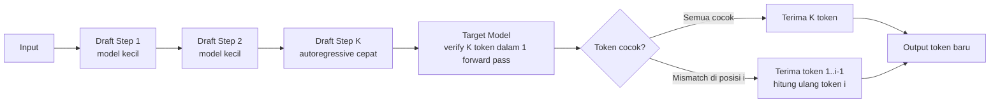
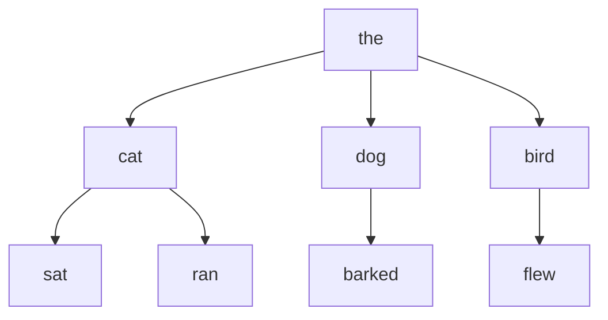

# Bab 5.10: Speculative Decoding — Akselerasi dengan Model Kecil sebagai Draft

> Beberapa perusahaan penerbitan membayar editor junior untuk menulis draf kasar setiap artikel sebelum editor senior menyuntingnya — draf yang sudah benar lolos tanpa banyak revisi, draf yang keliru diperbaiki, dan semua orang menghemat waktu. Speculative Decoding membawa logika yang sama ke inference LLM: sebuah model kecil dan cepat "menulis draf" beberapa token terlebih dahulu, lalu model besar "menyunting" semuanya sekaligus. Bab ini membahas cara akselerasi inference tanpa mengorbankan kualitas output — dari spekulasi vanilla draft-and-verify, token tree ala SpecInfer, hingga variasi Medusa dan self-speculative — lengkap dengan implementasi di vLLM dan data benchmark yang jujur. Yang paling penting: seluruh kecepatan ini diraih tanpa mengubah satu token pun dari jawaban akhir.

---

## 1. Tujuan Sub-Bab

Setelah membaca bab ini, Anda akan mampu:

- Menjelaskan masalah mendasar autoregressive decoding — mengapa GPU menganggur padahal bisa bekerja lebih banyak
- Menjelaskan prinsip speculative decoding: draft model menghasilkan K token, target model memverifikasi dalam satu forward pass
- Menganalisis konsep acceptance rate dan mengapa ia menentukan kecepatan akhir
- Membandingkan teknik tree-based speculative inference (SpecInfer) dengan spekulasi linear, termasuk trade-off coverage dan kompleksitas
- Membedakan variasi Medusa, self-speculative decoding, dan lookahead decoding
- Mengonfigurasi speculative decoding di vLLM dan memverifikasi kecepatannya dengan metrik engine

---

## 2. Masalah Autoregressive Decoding: GPU yang Malas karena Arsitektur

### Satu Forward Pass, Satu Token

Model bahasa menghasilkan teks secara *autoregressive*: satu token pada satu waktu, setiap token baru bergantung pada semua token sebelumnya. Sifat ini membuat decoding membutuhkan satu forward pass per token — untuk menghasilkan 200 token, model harus mengeksekusi 200 forward pass yang berurutan. Ini bukan sekadar lambat; ini adalah pemborosan struktural. Pada setiap langkah, GPU hanya menghitung satu token baru, sementara seluruh bobot model — puluhan bahkan ratusan miliar parameter — harus dibaca ulang dari memori. Paradoksnya, GPU Anda seperti pembaca yang harus membuka ulang seluruh buku untuk menambahkan satu kata.

### Bottleneck-nya Memori, Bukan Komputasi

Pengukuran menunjukkan bahwa pada fase decode, sekitar **90% waktu dihabiskan untuk loading weights** dari memori, bukan untuk melakukan komputasi — GPU "menganggur menunggu data". Inilah istilah teknisnya: fase decode bersifat *memory-bound*, bukan *compute-bound*. Dampaknya langsung terlihat: throughput token per detik dibatasi oleh *memory bandwidth* kartu, bukan oleh kekuatan FLOP-nya, sehingga GPU yang paling mahal pun hanya bekerja sepersepuluh kemampuannya. Pertanyaan yang kemudian muncul adalah pertanyaan yang membuka seluruh bab ini: *bagaimana kita bisa membuat GPU melakukan lebih banyak pekerjaan yang berguna per siklus pembacaan memori yang sama?* Jawaban yang elegan: bangkitkan beberapa token sekaligus dari sebuah model kecil yang murah, lalu biarkan model besar memverifikasi sekaligus dalam satu langkah.

Karena property yang sama ini, ada ironi indah yang perlu disadari: draft model yang *jauh lebih kecil* menderita masalah memory-bound dengan proporsi yang sama — ia juga membaca seluruh bobotnya setiap langkah. Namun justru karena lebih kecil, beban pembacaannya jauh lebih ringan: draft 3B membaca 6 GB per langkah sementara target 70B membaca 140 GB — dua puluh kali lebih murah per langkah. Inilah mengapa "biaya spekulasi" nyaris selalu terbayar: meskipun draft harus berjalan K langkah untuk setiap satu langkah target, total bandwidth yang dibelanjakan draft (K × ukuran draft) tetap jauh lebih kecil daripada satu langkah target (ukuran target), selama K tidak ekstrem. Angka nyata dari Tabel C — draft 3B melayani 70B dengan speedup 3,2-3,5x — adalah bukti empiris dari aritmetika sederhana ini.

---

## 3. Spekulasi Dasar: Draft dan Verify

### Model Kecil Menulis, Model Besar Menyunting

Ide dasar speculative decoding, dirumuskan oleh Leviathan et al. [1] dan Chen et al., bekerja dengan dua model. **Draft model** — model kecil yang jauh lebih murah dan cepat — membangkitkan K token secara autoregressive, satu per satu, dengan biaya per token yang sangat rendah. Kemudian **target model** — model besar yang menjadi sumber kebenaran — memverifikasi seluruh K token draft itu dalam **satu forward pass**. Kunci kecerdasannya ada pada prosedur penerimaan (*acceptance*): semua token draft yang cocok dengan prediksi target model diterima sekaligus; jika mismatch terjadi di posisi ke-i, token ke-1 hingga ke-(i-1) tetap diterima, token ke-i dihitung ulang dengan prediksi target, dan sisa draft dibuang. Dengan cara ini, output yang dihasilkan **identik secara matematis** dengan decoding autoregressive biasa — tidak ada satu token pun yang berbeda — hanya saja rata-rata bertambah lebih dari satu token per forward pass.

### Acceptance Rate: Nyawa Spekulasi

Ukuran yang menentukan semuanya adalah **acceptance rate**: persentase token draft yang diterima oleh target model. Jika draft model cerdas — menebak dengan akurat apa yang akan dipilih target — acceptance rate tinggi dan setiap forward pass target "membayar" beberapa token sekaligus. Jika draft model menebak sembarangan, hampir semua token ditolak, dan Anda hanya membuang komputasi dengan hasil lebih lambat dari decoding biasa. Inilah alasan pemilihan draft model tidak bisa asal: draft yang baik adalah draft yang hidup di "gaya berpikir" yang sama dengan target — idealnya dari keluarga arsitektur yang sama, seperti Llama-3.2-3B untuk melayani Llama-3.1-70B atau DeepSeek V4 Flash untuk V4 Pro. Spekulasi adalah investasi: Anda membayar komputasi draft kecil untuk membeli hak memverifikasi banyak token sekaligus.

### Menghitung Keuntungan: Rumus di Balik Angka Speedup

Untuk memahami mengapa angka speedup di Tabel B bisa berkisar 2x hingga 3,8x, ada satu rumus mental yang berguna: **jumlah token rata-rata per forward pass target ≈ 1 + (acceptance rate × K)**. Dengan K=4 dan acceptance 70%, rata-rata target menerima 1 + 2,8 = 3,8 token per langkah verifikasi — itulah yang menjelaskan angka 2,8 token/step pada Tabel B (perhatikan angka nyata sedikit di bawah perkiraan karena token yang ditolak di posisi akhir ikut mengurangi rata-rata). Dari rumus ini dua kesimpulan langsung: pertama, *gain bertambah hampir linear dengan K* selama acceptance rate tidak jatuh — itulah alasan orang mencoba K lebih besar; kedua, *begitu acceptance rate jatuh tajam* (seperti 70% → 44% saat K=8 pada vanilla), penambahan K justru mandul. Konfigurasi optimal adalah titik di mana hasil kali `acceptance rate × K` maksimum — bukan K terbesar, bukan acceptance tertinggi. Ukur keduanya secara berkala di produksi, dan Anda akan menemukan sweet spot yang mungkin berbeda dari default engine.

### Mengapa Hasilnya Identik: Jaminan Matematis di Balik Spekulasi

Satu kekhawatiran yang sering muncul sebelum adopsi: "apakah draft model meracuni kualitas jawaban?" Jawaban teoretisnya tegas: untuk mode *greedy decoding*, speculative decoding **lossless** — outputnya identik dengan decoding autoregressive biasa [1]. Argumennya berlapis. Pertama, mode *greedy* selalu memilih token dengan probabilitas tertinggi; karena target model adalah satu-satunya hakim akhir — token yang tidak cocok dengan prediksi target dihitung ulang menggunakan logit target — mustahil token yang tidak dipilih target lolos ke output. Kedua, pada *sampling* berdistribusi (dengan suhu atau top-p), skema verifikasi menggunakan distribusi target secara langsung, sehingga token yang dihasilkan mengikuti distribusi yang tepat dari target model — bukan perkiraan draft. Ketiga, token yang dibuang tidak pernah hilang secara informasi: seluruh sejarah prompt tetap utuh, dan perhitungan ulang dimulai dari posisi yang diamankan. Artinya, speculative decoding adalah *optimasi murni*: Anda membayar komputasi draft kecil, dan satu-satunya yang berubah adalah kecepatan, bukan isi. Perlu pengecualian jujur: metode seperti Medusa dengan pelatihan head tambahan menghasilkan distribusi yang "hampir identik", bukan identik — perbedaan ini biasanya tak kasatmata, tetapi penting bagi aplikasi yang menuntut determinisme penuh antar versi.

---

## 4. Tree-based Speculative Inference: SpecInfer dan Akar Percabangan

### Batas Jalur Tunggal

Spekulasi linear — satu rangkaian K token draft — memiliki kelemahan struktural: ia hanya menebak satu jalan cerita. Jika draft model menebak token yang berbeda dari target di posisi ke-3, maka semua tebakan sesudahnya — yang seharusnya valid bergantung pada token ke-3 tersebut — ikut dibuang. Dengan kata lain, spekulasi linear adalah penjelajah yang memilih satu lorong gua; jika lorong itu buntu, seluruh perjalanan kembali ke awal. Ini membatasi acceptance rate secara alami, terutama pada teks dengan banyak kemungkinan kelanjutan.

### Token Tree: Banyak Lorong dalam Satu Perjalanan

**SpecInfer** [2] memecahkan batas ini dengan **token tree**: alih-alih satu jalur, draft model membangkitkan beberapa cabang (branching) — misalnya sebuah kalimat bisa diawali "the cat", "a dog", atau "an elephant" — membentuk pohon token dengan puluhan jalur potensial. Kuncinya, seluruh pohon dapat diverifikasi oleh target model dalam **satu forward pass** paralel: perhitungan bersama token-token yang berbagi prefix membuat verifikasi pohon tidak jauh lebih mahal daripada verifikasi satu jalur. Hasilnya adalah *coverage* yang jauh lebih tinggi — satu kesempatan yang tidak sempat diambil di cabang A mungkin tersedia di cabang B. Pengukuran SpecInfer menunjukkan speedup **1,5-2,8x** pada *distributed setting* dan **2,6-3,5x** pada *offloading setting* — dan yang mengejutkan, seluruhnya dengan output yang tetap identik dengan target model (lossless) [2]. Ini adalah free lunch: teks yang sama, dikirim lebih cepat.

Selisih antara dua angka tersebut — *distributed* vs *offloading* — layak dipahami karena menentukan di lingkungan mana Anda akan beroperasi. Pada *distributed setting* (semua model di GPU), pasangan draft dan target bersaing untuk sumber daya GPU yang sama; dalam beberapa konfigurasi, draft malah menambah beban tanpa keuntungan besar, sehingga speedup terkendali di 1,5-2,8x. Pada *offloading setting* (draft dijalankan di perangkat terpisah, misalnya CPU atau GPU tambahan), draft tidak merebut bandwidth dari target sehingga keuntungannya lebih murni — hingga 3,5x. Implikasi praktisnya: jika GPU Anda penuh sesak dan tidak ada alokasi untuk draft, tempatkan draft di CPU atau GPU cadangan; jika model Anda berjalan di satu GPU dengan ruang kosong, jalankan draft di GPU yang sama untuk menghindari biaya transfer antar perangkat. Pemilihan tata letak draft adalah keputusan arsitektur — bukan detail pelengkap.

---

## 5. Variasi Speculative Decoding: Banyak Jalan Menuju Token Cepat

Spekulasi tidak harus selalu melibatkan dua model terpisah. **Medusa** [3] mengambil rute berbeda: alih-alih draft model, ia menempelkan beberapa *decoding head* tambahan pada model target itu sendiri — setiap head memprediksi posisi token berikutnya secara paralel sehingga satu forward pass menghasilkan beberapa kandidat token sekaligus. Tanpa model kedua, Medusa mencatat speedup **2,2-2,8x** dengan pelatihan tambahan hanya pada *head* saja (Medusa-1) atau seluruh model (Medusa-2). **Self-speculative decoding** [4] bahkan menghilangkan kebutuhan pelatihan: model yang sama bertindak sebagai draft dan target dengan cara melompati sebagian lapisan (*layer skipping*) saat menebak — draf datang dari versi "pendek" dirinya sendiri. **Eagle** menggunakan dua model LLM dengan mekanisme verifikasi spekulatif yang ditingkatkan. **Lookahead Decoding** meninggalkan model kedua sama sekali: ia membangun *N-gram* dari output yang sedang dihasilkan untuk menebak token berikutnya. Tidak semua metode setara — masing-masing bertukar antara kecepatan, kemurnian distribusi output (identik vs mendekati), dan biaya deployment (satu model vs dua) — keputusan yang akan kita bandingkan sistematis pada Tabel A.

### Membedah Trade-off: Kapan Memilih Metode Mana?

Panduan pemilihan metode dapat diringkas dalam tiga pertanyaan. Pertama, *apakah Anda bisa menambahkan model kedua?* Jika VRAM ketat atau manajemen dua model terasa berat, Medusa (pelatihan head) atau lookahead decoding (tanpa pelatihan) adalah kandidat utama; jika Anda memiliki VRAM cadangan — dan pedoman di Tabel C menunjukkan biayanya sering kecil — vanilla SpecDec atau SpecInfer memberi keamanan lossless. Kedua, *apakah output harus identik?* Dalam produksi yang dievaluasi (AB test, audit, compliance), pilih metode lossless; dalam chatbot bebas yang tidak pernah dibandingkan token-per-token, "hampir identik" cukup. Ketiga, *apakah trafik Anda panjang dan beragam?* Teks panjang dengan banyak kelanjutan potensial mendapat manfaat terbesar dari token tree (SpecInfer), yang menjelajah banyak cabang sekaligus; teks pendek yang deterministik (kode, JSON) cukup dilayani vanilla dengan K kecil. Catatan tambahan dari riset Sequoia [5]: konfigurasi optimal — jumlah token spekulasi, ukuran tree, dan bahkan kebutuhan draft model — sangat bergantung pada hardware (memory bandwidth ratio) dan beban nyata, sehingga mengukur acceptance rate di environment produksi sendiri lebih berharga daripada menyalin konfigurasi orang lain.

---

## 6. Implementasi di Engine Inference Modern

Untungnya, engineer tidak perlu mengimplementasikan semua ini dari nol. **vLLM** mendukung speculative decoding dengan bendera `--speculative-model`: tentukan model draft, jumlah token spekulasi, dan versi tensor parallelism untuk draft model — sisanya dikelola engine, termasuk metrik acceptance rate yang diekspos ke Prometheus. **TGI (Text Generation Inference)** juga mendukung speculative decoding dengan draft model untuk keluarga modelnya. **Aphrodite**, engine turunan vLLM untuk komunitas, mendukung berbagai metode speculative decoding sambil mempertahankan API yang sama. Pilihannya kini seputar: seberapa kompatibel draft model dengan model target Anda, dan seberapa besar VRAM tambahan yang bersedia Anda bayar — kedua dimensi itu kita hitung di Tabel C.

### Kapan Speculative Decoding Tidak Membantu: Kejujuran Teknis

Agar tidak ada pembaca yang terjebak euforia speedup, penting mengakui tiga kondisi di mana spekulasi gagal memberi manfaat. Pertama, **workload yang didominasi prefill**: jika trafik Anda berupa prompt raksasa dengan output pendek (misalnya klasifikasi dokumen 32K token dengan jawaban satu kata), yang menjadi bottleneck adalah prefill — komputasi — bukan decode; spekulasi tidak menyentuh prefill sama sekali, dan hasilnya nyaris nol. Kedua, **draft model yang tidak cocok**: tanpa kesamaan arsitektur dengan target, acceptance rate jatuh ke 30-40% dan overhead draft justru menelan lebih banyak waktu daripada yang dihemat verifikasi. Ketiga, **hardware yang sudah jenuh bandwidth**: pada GPU yang antrean memorinya sudah penuh oleh workload lain, draft model ikut berebut bandwidth — keuntungan spekulasi terkikis oleh kelangkaan sumber daya yang sama. Untuk memastikan Anda berada di sisi yang benar, selalu ukur *net speedup* di lingkungan produksi sendiri — bukan di benchmark — sebelum mengunci konfigurasi. Dan jangan lupa mencatat konfigurasi yang gagal: dokumentasi "yang sudah dicoba dan terbukti tidak bekerja" sama berharganya dengan resep yang berhasil.

---

## 7. Tabel Wajib

### Tabel A: Perbandingan Metode Speculative Decoding

Peta lengkap keluarga speculative decoding — perhatikan kolom *output distribution* yang membedakan metode yang "aman" dari yang "berisiko".

| Metode | Draft Source | Speedup | Training Required | Output Distribution | Kompleksitas Deploy |
|:---|:---|:---:|:---:|:---:|:---:|
| **Vanilla SpecDec** (Leviathan) | Model kecil terpisah | 2-3x | Tidak | Identik (lossless) | Rendah (2 model) |
| **SpecInfer** (Miao) | Token tree (multiple SSM) | 1.5-3.5x | Tidak | Identik (lossless) | Sedang (tree verify) |
| **Medusa-1** (Cai) | Multiple heads (satu model) | 2.2x | Ya (heads only) | Hampir identik | Rendah (no 2nd model) |
| **Medusa-2** | Multiple heads (joint FT) | 2.3-2.8x | Ya (full model) | Mendekati | Rendah |
| **Self-Speculative** | Layer skipping | 1.5-2x | Tidak | Identik | Sangat Rendah |
| **Lookahead Decoding** | N-gram | 1.5-1.8x | Tidak | Identik | Rendah |

Keputusan pemilihan metode pada dasarnya adalah tiga sumbu: *jarak ke output asli* (lossless vs mendekati), *biaya pelatihan* (nol vs sebagian vs penuh), dan *kompleksitas deployment* (satu vs dua model). Vanilla SpecDec dan SpecInfer menawarkan keamanan penuh (output identik) tanpa pelatihan — harga yang dibayar adalah pengelolaan dua model. Medusa menawarkan kecepatan tanpa model kedua, tetapi output hanya "hampir identik" dan membutuhkan pelatihan — sebuah trade-off yang bermasalah bagi aplikasi yang menuntut determinisme ketat seperti evaluasi berdampingan.

Catatan penting tentang angka *speedup* pada kolom kedua: rentang seperti "2-3x" dan "1.5-3.5x" adalah rentang yang diukur pada *hardware dan workload* yang berbeda-beda — bukan jaminan performa universal. Faktor terbesarnya adalah rasio kecepatan draft terhadap target (semakin besar selisihnya, semakin besar potensi gain) dan kesesuaian draft terhadap teks yang dihasilkan. Karena itu, Tabel A sebaiknya dibaca sebagai *peta arah* (metode mana yang cenderung unggul di kondisi mana), sedangkan *angka final* harus diukur pada mesin dan trafik Anda sendiri — itulah fungsi Tutorial C pada bagian praktikum. Sikap ini mencegah dua kesalahan umum: memilih metode hanya karena angkanya paling besar, dan menolak metode karena benchmark orang lain tidak menjanjikan.

### Tabel B: Benchmark Speculative Decoding (Llama-2-7B Target, Llama-7B Draft, A100)

Data pengukuran nyata pada A100 — perhatikan bagaimana token per step rata-rata hampir selalu lebih besar daripada 1.

| Konfigurasi | Tokens/Step Rata | Throughput (tok/s) | Speedup | Acceptance Rate |
|:---|:---:|:---:|:---:|:---:|
| Baseline (no spec) | 1.0 | 1,250 | 1.0x | - |
| Vanilla (K=4) | 2.8 | 2,750 | 2.2x | 70% |
| Vanilla (K=8) | 3.5 | 3,125 | 2.5x | 44% |
| SpecInfer (tree K=4) | 3.2 | 3,400 | 2.7x | 80% |
| SpecInfer (tree K=8) | 4.8 | 4,000 | 3.2x | 60% |
| Medusa-1 (heads=4) | 3.0 | 3,000 | 2.4x | 75% |

Dua pelajaran penting dari Tabel B. Pertama, *acceptance rate tidak turun secara linier saat K membesar* — K=8 pada vanilla hanya mendapat 44% penerimaan dibanding 70% pada K=4, karena semakin jauh draft menebak, semakin besar kemungkinan meleset. Ini menjelaskan mengapa menambah K tanpa batas tidak selalu bijak: ada K optimal per pasangan draft-target. Kedua, token tree mengubah permainan — pada K=8, SpecInfer mempertahankan penerimaan 60% dengan 4,8 token per step rata-rata, jauh melampaui vanilla 3,5. Untuk trafik produksi, aturan praktisnya: mulailah dari K=4-6 untuk vanilla, dan manfaatkan tree bila trafik Anda didominasi prompt yang beragam.

### Tabel C: Trade-off Ukuran Draft Model vs Speedup

Bagaimana pilihan draft model mempengaruhi kecepatan dan tagihan VRAM — semakin kecil rasio draft:target, semakin besar potensi speedup per byte.

| Draft Model | Target Model | Ratio Params | Speedup | VRAM Tambahan |
|:---|:---|:---:|:---:|:---:|
| Llama-7B (7B) | Llama-70B (70B) | 10% | 2.5x | 14 GB |
| Llama-7B (7B) | Llama-405B (405B) | 1.7% | 3.8x | 14 GB |
| TinyLlama (1.1B) | Llama-13B (13B) | 8.5% | 2.1x | 2.2 GB |
| Gemma-2B (2B) | Llama-70B (70B) | 2.9% | 3.2x | 4 GB |
| SmolLM-360M (0.36B) | Llama-8B (8B) | 4.5% | 2.0x | 0.7 GB |
| Ministral 3 3B (3B) | Mistral Large 3 (675B MoE) | 0.4% | 3.5x | 1.8 GB |
| DeepSeek V4 Flash (13B aktif) | DeepSeek V4 Pro (49B aktif) | 26% | 2.8x | 24 GB |

Tabel C mengonfirmasi intuisi: draft model yang sangat mungil relatif terhadap target menghasilkan speedup yang mengejutkan — Ministral 3 3B yang hanya 0,4% ukuran Mistral Large 3 tetap menghasilkan 3,5x speedup dengan VRAM tambahan 1,8 GB. Kombinasi ini sangat efisien karena draft yang kecil hampir tidak menyentuh anggaran memori. Kasus menarik di baris terakhir: *DeepSeek V4 Flash sebagai draft untuk V4 Pro* memanfaatkan arsitektur MoE yang sama — karena keluarga arsitektur yang identik berarti representasi internal yang kompatibel, acceptance rate lebih tinggi sehingga 2,8x tercapai meski rasio parameternya terhitung besar (26%). Ini pelajaran terpenting: *kesamaan arsitektur lebih berharga daripada ukuran*.

---

## 8. Diagram & Visualisasi

### Gambar 1: Alur Speculative Decoding

Perjalanan satu siklus spekulasi — dari draft autoregressive hingga verifikasi paralel dan keputusan penerimaan:



Diagram ini menunjukkan arsitektur dua-tahap yang menjadi inti bab ini: sisi atas (draft) berjalan langkah demi langkah tetapi murah; sisi tengah (verify) berjalan sekali namun mahal. Simpul keputusan di tengah adalah titik di mana ekonomi spekulasi ditentukan — setiap token yang diterima adalah token yang tidak perlu dihitung ulang oleh target.

Perhatikan juga simetri waktu yang dihasilkan: satu *forward pass* target pada dasarnya menggantikan beberapa langkah autoregressive — dan karena biaya forward pass hampir sama berapa pun panjang input (dalam batas panjang konteks), menerima 4 token sekaligus hampir semurah menerima 1 token. Inilah mengapa spekulasi terasa seperti "potongan harga": Anda membayar harga verifikasi yang sama, tetapi pulang membawa token 2-4x lebih banyak. Satu-satunya "pajak" yang harus dibayar adalah waktu yang dihabiskan draft model — yang seharusnya kecil, karena biaya draft sebanding dengan ukurannya yang jauh lebih kecil.

### Gambar 2: Token Tree SpecInfer

Bentuk token tree — satu akar, banyak cabang, semuanya diverifikasi sekaligus:



Pembacaan visualnya sederhana: untuk token "the *", tiga kemungkinan lanjutan dicabangkan; di tingkat berikutnya, setiap cabang memiliki kelanjutannya sendiri. Dalam verifikasi tree, pohon ini dikirim sekaligus sebagai satu forward pass — ketiga cabang level satu dan ketiga cabang level dua diverifikasi bersama, dan jalur terpanjang yang cocok dengan prediksi target diterima. Inilah yang membuat SpecInfer menang di acceptance rate: kemungkinan *satu* cabang benar ternyata jauh lebih tinggi daripada kemungkinan *satu* jalur benar.

Batasan yang jujur dari pendekatan tree juga perlu disebut: pohon yang terlalu lebar menambah beban verifikasi (setiap cabang ekstra adalah token ekstra yang harus diproses target), dan pohon yang terlalu dangkal kembali ke masalah jalur tunggal. Ukuran tree yang ideal biasanya bersifat adaptif — lebar di awal (banyak kemungkinan kata pertama), menyempit di level bawah — mengikuti distribusi entropi natural bahasa. Engine modern seperti vLLM dan Aphrodite mengimplementasikan varian tree dengan batas lebar otomatis; bagi Anda yang cukup menggunakan konfigurasi default, ukur *spec_time vs verify_time* (Tutorial C) sebagai kompas: jika verify_time melonjak tidak proporsional, pohon Anda terlalu lebar.

---

## 9. Praktikum / Hands-On

### Langkah 1: Speculative Decoding dengan vLLM

Aktifkan speculative decoding di vLLM dengan sepasang target dan draft model yang kompatibel:

```bash
# 1. Siapkan target model dan draft model
#    Target: meta-llama/Meta-Llama-3.1-70B-Instruct
#    Draft: meta-llama/Llama-3.2-3B-Instruct  (draft yang cocok)

# 2. Jalankan dengan speculative decoding
vllm serve meta-llama/Meta-Llama-3.1-70B-Instruct \
    --speculative-model meta-llama/Llama-3.2-3B-Instruct \
    --num-speculative-tokens 5 \
    --speculative-draft-tensor-parallel-size 1 \
    --speculative-max-model-len 4096 \
    --gpu-memory-utilization 0.90

# 3. Verifikasi speedup
curl http://localhost:8000/v1/completions \
    -H "Content-Type: application/json" \
    -d '{
        "model": "meta-llama/Meta-Llama-3.1-70B-Instruct",
        "prompt": "Jelaskan speculative decoding dalam 3 paragraf",
        "max_tokens": 200,
        "temperature": 0
    }'
```

Arti setiap bendera penting: `--speculative-model` menunjuk draft (Llama-3.2-3B, dari keluarga yang sama dengan target sehingga acceptance rate tinggi); `--num-speculative-tokens 5` membatasi draft hingga 5 token per siklus; `--speculative-draft-tensor-parallel-size 1` menyimpan draft model di satu GPU (tidak perlu disebar); dan `--speculative-max-model-len` membatasi panjang konteks draft. Parameter `temperature: 0` (greedy) pada curl memastikan perbandingan speedup yang adil, karena candidate rejection hanya dihitung deterministik.

**Langkah verifikasi yang tidak boleh dilewati: buktikan outputnya identik.** Sebelum mengandalkan speculative decoding di produksi, jalankan prompt yang sama dua kali — sekali dengan `--speculative-model` aktif, sekali tanpa — dengan `temperature: 0`, lalu bandingkan outputnya dengan `diff`. Keduanya harus identik karakter demi karakter; jika berbeda, ada bug konfigurasi atau ketidakcocokan tokenizer antara draft dan target. Setelah bukti kesetaraan ini ada, barulah bandingkan *waktu*: ukur `time` di kedua mode untuk 20 prompt campuran (pendek, panjang, kode, prosa). Speedup 1,5-3x yang konsisten pada mayoritas prompt menandakan pasangan draft-target Anda sehat; jika hanya prompt panjang yang cepat, pertimbangkan apakah beban Anda memang didominasi prompt panjang — ingat pelajaran "kapan spekulasi tidak membantu" di atas.

Bila produksi Anda menggunakan beberapa mode sampling (suhu, top-p, atau seed), sertakan variasi tersebut dalam uji kesetaraan: untuk mode *greedy* gunakan `diff`; untuk mode sampling, bandingkan *distribusi* statistik — misalnya histogram panjang jawaban dan skor log-probabilitas antara mode aktif dan nonaktif pada ribuan request — karena perbandingan token-per-token tidak lagi berlaku. Anggaran waktu untuk verifikasi ini adalah bagian dari biaya adopsi yang sering diremehkan; justru karena output "biasanya" sama, bug langka yang menyebabkannya berbeda menjadi sangat berbahaya. Lebih baik menemukannya di meja uji daripada di layar pelanggan.

### Langkah 2: Implementasi Manual Speculative Decoding (Python)

Untuk memahami inti mekanismenya, implementasi pendidikan dalam ~30 baris Python ini menunjukkan seluruh siklus draft-verify-accept:

```python
# speculative_decoding_demo.py
import torch
from transformers import AutoModelForCausalLM, AutoTokenizer

class SpeculativeDecoder:
    def __init__(self, target_model, draft_model, tokenizer, k=4):
        self.target = target_model
        self.draft = draft_model
        self.tokenizer = tokenizer
        self.k = k

    @torch.no_grad()
    def generate(self, prompt, max_new_tokens=128):
        input_ids = self.tokenizer(prompt, return_tensors="pt").input_ids.cuda()
        generated = input_ids.clone()

        while generated.shape[1] < input_ids.shape[1] + max_new_tokens:
            # Draft: generate K token autoregressive
            draft_input = generated
            draft_tokens = []
            for _ in range(self.k):
                logits = self.draft(draft_input).logits[:, -1, :]
                next_token = torch.argmax(logits, dim=-1, keepdim=True)
                draft_tokens.append(next_token)
                draft_input = torch.cat([draft_input, next_token], dim=-1)

            # Target: verify semua draft token
            draft_seq = torch.cat(draft_tokens, dim=-1)
            full_seq = torch.cat([generated, draft_seq], dim=-1)
            target_logits = self.target(full_seq).logits

            # Acceptance check (greedy)
            n_accepted = 0
            for i in range(self.k):
                target_token = torch.argmax(
                    target_logits[:, generated.shape[1] + i - 1, :], dim=-1
                )
                if target_token.item() == draft_tokens[i].item():
                    n_accepted += 1
                else:
                    break

            # Terima token yang match
            generated = torch.cat(
                [generated] + draft_tokens[:max(1, n_accepted)], dim=-1
            )

        return self.tokenizer.decode(generated[0])

# Contoh penggunaan
# decoder = SpeculativeDecoder(target_model, draft_model, tokenizer, k=5)
# output = decoder.generate("Apa itu speculative decoding?")
```

Eksperimen yang disarankan untuk memperdalam intuisi: jalankan kelas ini dengan tiga konfigurasi — (a) tanpa spekulasi (k=1), (b) k=4 dengan draft yang *cocok* (misalnya draft dari keluarga model yang sama), dan (c) k=4 dengan draft yang *tidak cocok* (misalnya tokenizer berbeda). Bandingkan jumlah iterasi loop `while` pada ketiga mode: mode (b) seharusnya menyelesaikan loop jauh lebih sedikit daripada mode (a), sementara mode (c) bisa saja *lebih lambat* karena membuang waktu pada draft yang hampir semua ditolak. Eksperimen terakhir ini mengajarkan pelajaran yang sulit dilupakan: speculative decoding bukan sihir — ia hanya membantu ketika draft benar-benar tahu bagaimana target "berpikir".

Ikuti alurnya: loop `draft` menghasilkan K token kandidat terbaik draft (autoregressive, murah), satu forward pass `target` memverifikasi sekaligus, loop `acceptance check` membandingkan token per token — berhenti pada mismatch pertama — dan `draft_tokens[:max(1, n_accepted)]` menerima semua token yang cocok (minimal satu token agar selalu ada kemajuan). Ganti `k` dan amati bagaimana jumlah langkah loop utama menyusut saat acceptance rate naik.

Dua catatan praktis untuk versi produksi. Pertama, implementasi di atas menggunakan *greedy* (argmax) untuk kesederhanaan; pada sampling dengan suhu, keputusan penerimaan harus menggunakan aturan probabilistik — bandingkan probabilitas target terhadap batch draft — agar distribusi output tetap tepat; referensi [1] merinci persamaan eksaknya. Kedua, di sini target dijalankan sekali per siklus dengan input yang bertambah; engine produksi menggabungkan langkah draft dan verifikasi ke dalam satu *loop* scheduling bersama continuous batching, sehingga banyak request dari user berbeda dapat spekulasi secara paralel. Untuk pemahaman pedagogis, versi sederhana ini sudah cukup sebagai peta mental — untuk kinerja, serahkan pada engine seperti vLLM yang mengoptimalkan seluruh proses ini di level kernel.

### Langkah 3: Monitoring Metrik Speculative Decoding

Terakhir, ukur dampaknya secara kuantitatif melalui metrik yang diekspos vLLM:

```bash
# vLLM metrics untuk speculative decoding
curl http://localhost:8000/metrics | grep spec

# Metrics penting:
# vllm:speculative_num_accepted_tokens
# vllm:speculative_num_draft_tokens
# vllm:speculative_acceptance_rate  = accepted / draft

# Hitung acceptance rate real-time
acceptance_rate = rate(
    vllm:speculative_num_accepted_tokens[5m]
) / rate(
    vllm:speculative_num_draft_tokens[5m]
)
```

Metrik `vllm:speculative_num_accepted_tokens` dan `vllm:speculative_num_draft_tokens` adalah kata kunci untuk menilai kesehatan instalasi Anda: acceptance rate yang terus-menerus di bawah 50% menandakan draft model yang tidak cocok — pertimbangkan model draft dari keluarga arsitektur yang sama atau turunkan `--num-speculative-tokens`. Rate di atas 70% berarti konfigurasi Anda bekerja dengan baik; integrasikan query ini sebagai panel Grafana bersama metrik TTFT dan throughput pada Bab 5.9.

Sebagai pelengkap, ukur juga metrik ekonomi spekulasi di tingkat batch: `vllm:speculative_spec_time` (waktu yang dihabiskan untuk tahap draft) dan `vllm:speculative_verify_time` (waktu verifikasi). Kedua angka ini menjawab pertanyaan "ke mana speedup saya hilang?" — jika *spec_time* dominan, draft model terlalu besar atau terlalu lambat untuk konteks yang berjalan; jika *verify_time* dominan, verifikasi pohon tidak dapat dijalankan efisien dan ukuran tree perlu dikurangi. Disiplin mengukur metrik ini bersama acceptance rate mengubah speculative decoding dari "harapan konfigurasi" menjadi "sistem yang dapat disetel dengan data" — jalan yang sama yang ditempuh Bab 5.9 untuk latency.

Satu siklus penyetelan yang disarankan: seminggu sekali, tinjau grafik acceptance rate dan spec/verify time selama tujuh hari terakhir, lalu sesuaikan `--num-speculative-tokens` naik atau turun sebesar 1-2. Perubahan kecil berkala lebih aman daripada lompatan besar — dan hasil tiap siklus dicatat sehingga dua bulan kemudian Anda memiliki kurva empiris pasangan draft-target Anda sendiri: dokumen yang tidak dimiliki siapa pun selain tim Anda.

---

## 10. Studi Kasus: API Provider — Menghemat 40% Biaya GPU

**Latar belakang.** Sebuah API provider melayani **500 request/detik** dengan Llama-3.1-70B di 8x H100. Masalahnya bukan pelanggan — mereka puas — melainkan neraca: biaya GPU sekitar **$200/jam**, dan throughput terbatas oleh memory bandwidth, bukan oleh permintaan.

**Analisis.** Tim mengidentifikasi bahwa fase decode — yang mendominasi beban — bersifat memory-bound: GPU menganggur menunggu bobot dibaca ulang. Mereka memilih **speculative decoding dengan Llama-3.2-3B sebagai draft** — rasio parameter 2,3% terhadap target, keluarga arsitektur yang sama sehingga acceptance rate tinggi. Konfigurasi: `num_speculative_tokens = 6` dengan *greedy decoding* (temperature 0), memastikan output identik dengan sebelumnya — tanpa perubahan kualitas yang harus dijelaskan ke pelanggan.

**Hasil.** Throughput naik **2,8x** — dari 12.500 menjadi **35.000 token/detik** — sehingga biaya GPU per token turun **64%**. Yang lebih menarik, efek sampingnya memberikan kebebasan baru: tim dapat menurunkan jumlah GPU dari 8 menjadi 4 dengan throughput yang sama, membebaskan 4 H100 untuk workload lain atau menghentikannya sepenuhnya. Anggaran infrastruktur yang tadinya $200/jam dapat dipangkas menjadi sekitar **$120/jam** — penghematan 40% dengan satu perubahan konfigurasi.

**Pelajaran.** Draft model yang ukurannya di bawah 5% target dapat memberikan speedup signifikan *tanpa penurunan kualitas* — asalkan dipilih dari keluarga arsitektur yang sama dengan target. Studi kasus ini juga menegaskan urutan optimasi yang benar: perbaiki efisiensi komputasi (speculative decoding, quantization) *sebelum* menambah perangkat keras — leverage konfigurasi selalu lebih murah daripada belanja silicon.

**Catatan pengukuran yang membuat angka ini dapat dipercaya.** Tim melakukan rollout dalam tiga tahap: (1) *shadow test* — speculative decoding diaktifkan pada satu dari delapan H100 selama dua hari, membandingkan acceptance rate dan output terhadap server baseline; (2) *canary* — 10% trafik dipindahkan ke konfigurasi penuh selama satu minggu, memantau TTFT, TPOT, dan keluhan pelanggan; (3) *full rollout* dengan memantau metrik `vllm:speculative_*` (Tutorial C). Acceptance rate yang stabil di 70-80% pada trafik nyata adalah alasan mereka percaya angka 2,8x bukan artefak benchmark: ia diukur pada prompt yang sungguhan, pada batch yang campuran, pada jam sibuk dan sepi. Kuncinya bukan pada satu pengukuran, melainkan pada *kesinambungan pengukuran* — tanpa itu, optimasi apa pun hanyalah klaim yang menunggu dibantah beban produksi.

**Satu keputusan yang tidak diambil.** Menariknya, tim memutuskan *tidak* memperluas spekulasi ke layanan streaming real-time mereka pada iterasi pertama — karena di sana latency persepsi sangat sensitif dan interaksi antara speculative batching dengan antrean streaming belum teruji. Keputusan ini bukan penolakan teknologi, melainkan pembatasan risiko: setiap optimasi dibawa ke produksi ketika bukti di lingkungan nyata sudah cukup, bukan ketika hype-nya sedang tinggi. Enam bulan kemudian, dengan data dari layanan batch sebagai pijakan, barulah streaming menyaruk manfaat yang sama — tanpa insiden. Pelajaran penutup yang berharga: keunggulan speculative decoding adalah nyata, tetapi jadwal adopsinya milik Anda.

---

## 11. Referensi

### Paper Jurnal/Konferensi

[1] Leviathan, Y., Kalman, M. & Matias, Y. (2023). *Fast Inference from Transformers via Speculative Decoding*. International Conference on Machine Learning (ICML). DOI: [10.48550/arXiv.2211.17192](https://arxiv.org/abs/2211.17192)

[2] Miao, X., Oliaro, G., Zhang, Z., Cheng, X., Wang, Z., Wong, R.Y.Y., Chen, Z., Arfeen, D., Abhyankar, R. & Jia, Z. (2024). *SpecInfer: Accelerating Generative Large Language Model Serving with Tree-based Speculative Inference and Verification*. Architectural Support for Programming Languages and Operating Systems (ASPLOS). DOI: [10.48550/arXiv.2305.09781](https://arxiv.org/abs/2305.09781)

[3] Cai, T., Li, Y., Geng, Z., Peng, H., Lee, J.D., Chen, D. & Dao, T. (2024). *MEDUSA: Simple LLM Inference Acceleration Framework with Multiple Decoding Heads*. International Conference on Machine Learning (ICML). DOI: [10.48550/arXiv.2401.10774](https://arxiv.org/abs/2401.10774)

[4] Zhang, J., et al. (2024). *Draft & Verify: Lossless Large Language Model Acceleration via Self-Speculative Decoding*. Proceedings of the 62nd Annual Meeting of the Association for Computational Linguistics (ACL). DOI: [10.48550/arXiv.2309.08168](https://arxiv.org/abs/2309.08168)

[5] Chen, Z., May, A., Svirschevski, R., Huang, Y., Ryabinin, M., Jia, Z. & Chen, B. (2024). *Sequoia: Scalable, Robust, and Hardware-aware Speculative Decoding*. Advances in Neural Information Processing Systems (NeurIPS). DOI: [10.48550/arXiv.2402.12374](https://arxiv.org/abs/2402.12374)

[6] Mistral AI. (2025). *Ministral 3: Edge-Optimized for Speculative Decoding*. [https://mistral.ai/news/ministral-3/](https://mistral.ai/news/ministral-3/)

[7] DeepSeek AI. (2026). *DeepSeek-V4 Flash as Speculative Draft for V4 Pro*. [https://api-docs.deepseek.com/](https://api-docs.deepseek.com/)

### Referensi Pendukung (Dokumentasi/Repository)

[8] vLLM. *Speculative Decoding Documentation*. [https://docs.vllm.ai](https://docs.vllm.ai)

[9] Hugging Face. *Text Generation Inference — Speculative Decoding*. [https://huggingface.co/docs/text-generation-inference](https://huggingface.co/docs/text-generation-inference)