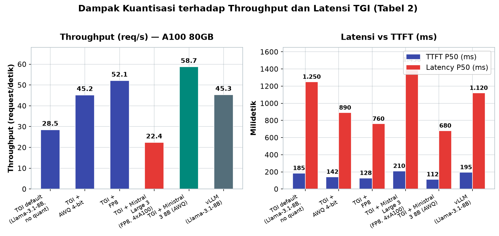
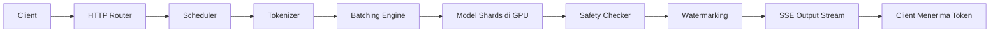

# Bab 5.2: TGI

> Jika vLLM adalah mesin balap yang fokus pada kecepatan murni, **TGI** adalah mobil dinas lengkap: selain cepat, ia membawa perangkat keselamatan, *radio streaming* untuk berbicara token demi token, serta pintu belakang yang otomatis memuat model dari gudang Hugging Face. Text Generation Inference adalah jawaban Hugging Face untuk pertanyaan yang sama — menjalankan model bahasa besar di produksi, tetapi dengan prioritas yang sedikit berbeda: kemudahan integrasi ekosistem dan fitur-fitur enterprise yang tidak dimiliki mesin lain.

---

## 1. Tujuan Sub-Bab


Setelah membaca sub-bab ini, Anda akan mampu:

- Menjelaskan arsitektur **TGI**: backend Rust/C++, router HTTP, scheduler, dan *model shards*
- Membandingkan TGI dengan vLLM secara objektif — termasuk fitur eksklusif yang hanya ada di salah satunya
- Men-deploy TGI memakai Docker untuk model dari 8B hingga 675B dengan *tensor parallelism* dan kuantisasi
- Menggunakan fitur unggulan TGI: *message streaming* (SSE), *watermarking*, *safety checker*, dan *grammar-guided generation*
- Mengonfigurasi *environment variables* TGI untuk produksi dan memantau metriknya dengan Prometheus/Grafana
- Memilih pola *deployment* yang tepat: Docker, Kubernetes dengan HPA, atau serverless *Inference Endpoints*

---

## 2. Sejarah dan Posisi TGI


**Text Generation Inference** (TGI) lahir dari kebutuhan internal Hugging Face untuk menyajikan ratusan ribu model yang ada di *Hugging Face Hub* dengan cara yang terkelola dan *production-grade*. Pada awal perkembangannya, TGI dibangun di atas *transformers* dengan *custom CUDA kernels* — cukup untuk melayani satu model, tetapi belum sanggup menahan beban banyak pengguna sekaligus. Seiring waktu, TGI menyerap dua teknik paling penting dari generasi sebelumnya: **continuous batching** yang terinspirasi sistem Orca [5] — melayani banyak request secara interleaved dalam satu iterasi — dan kemudian **PagedAttention** dari vLLM [4] untuk mengelola KV-cache secara efisien. Saat ini TGI berdiri sejajar dengan vLLM sebagai dua *serving engine* terpopuler di ekosistem open-source, masing-masing dengan kekuatan dan karakter yang berbeda.

Posisi TGI secara strategis unik: ia adalah jembatan paling mulus antara *Hugging Face Hub* dan infrastruktur produksi. Tidak ada mesin lain yang bisa menarik model dari hub, mengelola *cache* bobot, dan menyediakan endpoint langsung secepat TGI — dan karena itulah TGI menjadi pilihan *default* bagi tim yang sudah hidup di ekosistem Hugging Face.

Ritme rilis TGI mengikuti ekosistem model: setiap model besar yang populer di hub segera mendapatkan konfigurasi resmi di dokumentasi TGI — seperti Mistral Large 3 dengan FP8 di *image* 2.4.0, atau Ministral 3 di *image* 2.3.1 (lihat bagian Praktikum). Bagi tim produksi, ritme ini berarti satu *image* resmi yang sudah diuji untuk model tertentu, meniadakan pekerjaan merakit runtime sendiri. Kelemahannya, versi *image* dan versi model bisa berjalan tidak sinkron; kebiasaan baiknya adalah selalu mencocokkan versi TGI yang direkomendasikan di *model card* model yang bersangkutan.

---

## 3. Arsitektur TGI


### 3.1 Backend Rust/C++ dengan Python Bindings

Keputusan arsitektural pertama TGI adalah menulis inti servernya dalam **Rust** dengan *training kernels* dalam C++/CUDA, sementara model dijalankan lewat *binding* Python ke pustaka *transformers*. Ini kombinasi yang sengaja dipilih: Rust memberi kontrol memori yang aman dan konkurensi tinggi untuk bagian *router* dan *scheduler*, Python memberi fleksibilitas untuk mengikuti model-model terbaru yang selalu dirilis lebih dulu di ekosistem Hugging Face. Hasilnya, TGI menangani ribuan koneksi HTTP bersamaan tanpa *garbage collector* yang mengganggu, sambil tetap kompatibel dengan hampir semua model di hub.

### 3.2 Router → Scheduler → Model Shards

Alur sebuah request di TGI mengikuti tiga tahap besar. **HTTP Router** menerima request, memvalidasinya, dan menempatkannya di antrean. **Scheduler** kemudian menentukan batch yang paling efisien untuk iterasi berikutnya — menggabungkan *prefill* dan *decode* dari banyak request sesuai prinsip *continuous batching*. Terakhir, request dijalankan pada **model shards**: bobot model dipecah ke satu atau beberapa GPU. Untuk model besar seperti Mistral Large 3 (675B), TGI memakai `--num-shard 4` untuk membagi model ke empat GPU, lalu menggabungkan hasilnya secara transparan. Setiap *shard* bekerja paralel, dan jawaban disusun kembali menjadi satu aliran token yang utuh.

Perlu dipahami bahwa *sharding* TGI tidak membagi request per pengguna — setiap token tetap melewati semua *shard* secara bergantian, karena bagian-bagian model (misalnya *attention head* yang berbeda) tersebar di beberapa GPU. Konsekuensinya, menambah *shard* tidak menambah *throughput* linear: ia memperbesar kapasitas maksimum model yang bisa dimuat, sementara komunikasi antar-GPU sedikit menggerogoti kecepatan. Untuk model 8B yang muat di satu GPU, `--num-shard 1` tetap pilihan paling efisien — inilah konfigurasi yang dipakai di seluruh benchmark Tabel 2, dan inilah sebabnya angka-angkanya bisa dibandingkan satu sama lain secara adil.

### 3.3 Integrasi dengan Hugging Face Hub

Fitur yang paling membedakan TGI adalah integrasi native dengan **Hugging Face Hub**. Cukup berikan `--model-id meta-llama/Meta-Llama 3.1 (8B)`, dan TGI akan otomatis mengunduh bobot, menyimpannya di *cache* lokal (volume `/data`), lalu memuatnya — termasuk tokenizer dan *configuration file*. Untuk model *gated* seperti keluarga Llama, token akses disalurkan lewat variabel lingkungan `HUGGING_FACE_HUB_TOKEN`. Bobot didukung dalam format **safetensors** yang aman dan cepat dimuat, dan seluruh mekanisme *caching* menghindari unduhan berulang saat Anda *restart* container.

### 3.4 Dukungan Kuantisasi

TGI menangani berbagai skema *quantization* agar model muat di VRAM yang tersedia: **bitsandbytes** (untuk pemuatan dinamis, termasuk 4-bit NF4), **GPTQ** (4-bit pasca-training), **AWQ** (4-bit berbasis aktivasi), **EETQ** (8-bit cepat), hingga **FP8** yang dipakai Mistral Large 3 secara native. Pilihan kuantisasi dikendalikan lewat opsi `--quantize` atau variabel `QUANTIZE`, dan secara langsung menentukan *throughput* serta kualitas output — kita akan melihat angkanya di Tabel 2.

### Tabel 2: Benchmark Throughput TGI (A100 80GB)

Untuk menilai dampak kuantisasi secara kuantitatif, perhatikan *throughput*, TTFT, dan *latency* berbagai konfigurasi TGI di atas satu A100 80GB.

| Konfigurasi | Throughput (req/s) | TTFT P50 (ms) | Latency P50 (ms) |
|:---|:---:|:---:|:---:|
| TGI default (Llama 3.1 (8B), no quant) | 28,5 | 185 | 1250 |
| TGI + AWQ 4-bit | 45,2 | 142 | 890 |
| TGI + FP8 | 52,1 | 128 | 760 |
| TGI + Mistral Large 3 (FP8, 4xA100) | 22,4 | 210 | 1450 |
| TGI + Ministral 3 8B (AWQ) | 58,7 | 112 | 680 |
| vLLM (comparison, Llama 3.1 (8B)) | 45,3 | 195 | 1120 |



*Gambar 5.2-1 — Kuantisasi bukan hanya mengecilkan model: bobot yang lebih kecil memangkas beban memory bandwidth, sehingga throughput naik ~1,8x dan latensi turun ~40% tanpa mengganti GPU.*

Tiga baris pertama menunjukkan pola yang sangat instruktif: kuantisasi bukan hanya mengecilkan *footprint* model, tetapi juga menaikkan *throughput* — dari 28,5 req/s (tanpa kuantisasi) menjadi 52,1 req/s (FP8) — karena bobot yang lebih kecil mengurangi beban *memory bandwidth* yang memang menjadi *bottleneck* *decode*. Bandingkan juga dengan vLLM pada model sama: vLLM unggul pada konfigurasi standar (45,3 vs 28,5 req/s), menegaskan bahwa vLLM memang lebih agresif dalam *throughput* murni. Sementara itu, **Ministral 3 8B** (seri edge-optimized Mistral, Apache 2.0) menunjukkan performa terbaik di tabel — 58,7 req/s dengan TTFT 112 ms — menjadikannya pilihan menarik untuk TGI di *home server* dan *edge*. **Mistral Large 3** (675B/41B aktif) yang mendukung FP8 dan NVFP4 secara native tetap layak untuk beban bertonase besar di empat A100 [7][8].


### Gambar 1: Arsitektur TGI



Diagram ini merangkum perjalanan sebuah *request* di TGI. Klien mengirim teks; *router* menerima dan mengantrekan; *scheduler* memutuskan batch; tokenizer mengubah teks menjadi token; *batching engine* menggabungkan beberapa request; *model shards* menghitung; lalu aliran hasil melewati **safety checker** dan **watermarking** sebelum disalurkan kembali lewat **SSE** token demi token. Fitur-fitur penyaring itu tidak menempel di luar server — mereka adalah bintang tamu tetap di dalam *pipeline*, itulah mengapa TGI terasa "lengkap" sejak instalasi pertama.

---


## 4. Fitur Unggulan TGI


### 4.1 Message Streaming dengan Server-Sent Events

Bayangkan menunggu jawaban sebuah esai panjang 1.000 token: dengan mode biasa, klien diam membisu selama belasan detik sebelum satu blok teks besar jatuh sekaligus. TGI mengatasi ini dengan **message streaming** berbasis *Server-Sent Events* (SSE) — token pertama dikirim ke klien segera setelah lahir, lalu token berikutnya mengalir satu per satu. Pengalaman pengguna berubah total: dibandingkan menatap *spinner*, pengguna melihat jawaban "mengetik" di depan mata, dan *time-to-first-token* (TTFT) yang singkat membuat layanan terasa responsif walau total generasi panjang.

### 4.2 Watermarking: Menandai Output AI

Salah satu fitur TGI yang paling jarang dimiliki mesin lain adalah **watermarking** — teknik menanamkan pola statistik yang nyaris tak terlihat pada teks hasil generasi, sehingga sebuah detektor dapat membuktikan bahwa teks itu lahir dari LLM. Implementasi ini mengikuti *soft watermark* dari Kirchenbauer et al. [2]: selama *sampling*, model dibiaskan secara tersembunyi untuk memilih token dari "hijau" *list* yang ditentukan kunci rahasia; detektor yang memegang kunci dapat menghitung proporsi token hijau untuk menandai teks sebagai buatan AI. Gunanya nyata: platform edukasi, media, dan *content platform* memakai fitur ini untuk mendeteksi konten generatif di sistem mereka.

### 4.3 Safety Checker

TGI menyediakan **safety checker** terintegrasi yang memfilter konten berbahaya dari input maupun output — termasuk teks mengandung kekerasan, ujaran kebencian, atau konten seksual eksplisit. Berbeda dengan model *guardrail* yang berjalan terpisah, *safety checker* TGI berada dalam alur generasi sehingga keputusan *block* terjadi sebelum teks sampai ke pengguna. Ini bukan jaminan sempurna — model *guardrail* selalu memiliki *false positive* dan *false negative*, tetapi memberikan lapisan pertama yang penting untuk produk dengan pengguna di bawah umur atau domain publik.

### 4.4 Grammar-Guided Generation

Terakhir, TGI mendukung **grammar-guided generation**: memaksa output model mengikuti *grammar* tertentu, sehingga hasilnya selalu valid secara struktural. Implementasi TGI memakai *constrained decoding* yang memfilter kandidat token berdasarkan tokenizer-level FSM dari *grammar* [3]. Contoh paling populer adalah menjamin output selalu berbentuk **JSON** yang bisa di-*parse* tanpa error — untuk integrasi dengan aplikasi, *function calling*, atau *workflow* otomatis. Ini menghilangkan pekerjaan perbaikan output yang biasanya dilakukan setelah generasi selesai.

---

## 5. TGI vs vLLM


Kedua mesin kini sama-sama memakai PagedAttention dan continuous batching, sehingga perbedaan aslinya terletak pada prioritas desain. **TGI** unggul di integrasi *Hugging Face Hub* (otomatis, terpusat, dengan *token management*), fitur penyaring (*watermarking* dan *safety checker*), serta *streaming* SSE — paket lengkap untuk tim yang ingin cepat go-live. **vLLM** unggul di *throughput* murni pada model besar, kompatibilitas penuh dengan API OpenAI, serta dukungan parameter tuning yang lebih dalam. Keduanya mendukung *quantization*, *multi-LoRA*, dan *speculative decoding* — perbandingan fitur demi fitur akan Anda lihat di Tabel 1. Aturan praktisnya: jika tim Anda hidup dari ekosistem model Hugging Face dan membutuhkan penyaring konten, pilih TGI; jika targetnya adalah *throughput* maksimal dengan API yang sepenuhnya kompatibel OpenAI, vLLM lebih tepat.

Tiga tabel berikut membandingkan TGI dan vLLM dari tiga sudut pandang: fitur, performa terukur, dan konfigurasi praktis. Baca berturut-turut — tabel pertama menjawab "apa bedanya", tabel kedua "berapa bedanya", dan tabel ketiga "bagaimana mengaturnya".

### Tabel 1: TGI vs vLLM — Feature Matrix

Berikut peta fitur kedua mesin secara berdampingan — perhatikan bahwa "sama-sama punya" bukan berarti "sama cara kerjanya".

| Fitur | TGI | vLLM |
|:---|:---:|:---:|
| **PagedAttention** | Ya (via integrasi) | Ya (native) |
| **Continuous Batching** | Ya | Ya |
| **Quantization** | GPTQ, AWQ, Bitsandbytes, EETQ | AWQ, GPTQ, FP8, GGUF |
| **HuggingFace Hub Integration** | Native (auto-download) | Manual download |
| **Message Streaming** | SSE (native) | OpenAI-compatible |
| **Watermarking** | Ya | Tidak |
| **Safety Checker** | Ya (terintegrasi) | Tidak |
| **Grammar-guided Gen** | Ya (constraints) | Ya (guided decoding) |
| **OpenAI API Compatibility** | Parsial | Full |
| **Multi-LoRA** | Ya | Ya |
| **Speculative Decoding** | Ya | Ya |

Yang patut disorot: sel-sel yang berisi "Tidak" hampir semuanya berada di sisi vLLM — *watermarking* dan *safety checker* adalah pembeda eksklusif TGI. Sebaliknya, vLLM menang di kompatibilitas API OpenAI yang penuh, sementara TGI hanya parsial. Dua kolom terakhir menunjukkan bahwa kedua mesin sama-sama sudah mendukung teknik lanjutan seperti *multi-LoRA* dan *speculative decoding*, sehingga keputusan pemilihan sangat bergantung pada fitur pembeda dan ekosistem — bukan pada kemampuan dasar.


### Tabel 3: Opsi Environment TGI yang Penting

Sebagian besar konfigurasi produksi TGI dilakukan lewat *environment variables* — berikut yang paling sering disentuh.

| Variable | Default | Fungsi |
|:---|:---:|:---|
| `MAX_INPUT_TOKENS` | 4096 | Maks token input |
| `MAX_TOTAL_TOKENS` | 8192 | Maks total (input + output) |
| `MAX_BATCH_PREFILL_TOKENS` | 4096 | Tokens per prefill batch |
| `MAX_BATCH_TOTAL_TOKENS` | 16384 | Total tokens per batch |
| `HUGGING_FACE_HUB_TOKEN` | - | Token akses model gated |
| `QUANTIZE` | - | bitsandbytes, gptq, awq |

Dua pasang limit di baris atas bekerja serupa batas kecepatan di jalan tol: `MAX_BATCH_PREFILL_TOKENS` membatasi berapa banyak token *prefill* yang boleh diproses dalam satu iterasi, mencegah satu *request* raksasa menguasai GPU, sementara `MAX_BATCH_TOTAL_TOKENS` membatasi total beban satu batch agar tidak melebihi kapasitas VRAM. Aturan penyetelannya sederhana: naikkan kedua nilai jika model dan VRAM Anda besar dan trafik didominasi *prompt* panjang; turunkan jika Anda lebih mementingkan latensi stabil untuk percakapan pendek.

---


## 6. Deployment Patterns


TGI dirancang untuk berjalan sebagai **container Docker** — satu *image* resmi di `ghcr.io/huggingface/text-generation-inference` sudah berisi seluruh runtime, sehingga *deploy* ke server produksi cukup dengan satu `docker run`. Di atas itu, ada tiga pola umum. **Kubernetes** dengan *Horizontal Pod Autoscaler* (HPA) menambah atau mengurangi *replica* TGI berdasarkan metrik seperti `tgi_queue_size` — responsif terhadap lonjakan trafik tanpa intervensi manual. Untuk variasi yang lebih sederhana, **Docker Compose** dengan beberapa *replica* di belakang *load balancer* seperti Nginx sudah cukup bagi tim kecil. Terakhir, Hugging Face menyediakan **Inference Endpoints** — versi *serverless* terkelola dari TGI yang menangani *scaling*, *rolling update*, dan *monitoring* secara otomatis, cocok untuk tim yang tidak ingin mengelola infrastruktur.

Perlu ditegaskan bahwa ketiga pola tersebut bukan tiga tingkat kebaikan yang berurutan — melainkan pilihan yang harus disesuaikan dengan ukuran tim dan beban. Tim berdua dengan trafik kecil justru akan menderita jika langsung memakai Kubernetes: kompleksitas *cluster*, *networking*, dan *CI/CD* akan memakan waktu lebih banyak daripada manfaatnya. Aturan sederhananya: mulai dari **Docker Compose**, pindah ke **Kubernetes** ketika metrik menunjukkan *replica* bergerak (naik-turun manual sudah terlalu sering), dan pilih **Inference Endpoints** ketika tim bahkan tidak ingin mengurus server sama sekali.

Dua praktik keamanan patut diperhatikan di pola mana pun. Pertama, jangan pernah menulis `HF_TOKEN` di dalam `docker run` yang terekam di *shell history* atau *CI pipeline* — gunakan *secret manager* atau *env file* yang tidak masuk repositori. Kedua, untuk model internal yang bukan publik, unggah ke *Hugging Face Hub* privat dan beri akses hanya ke token yang dibutuhkan; TGI tidak membedakan model publik dan privat selama token valid, sehingga token dengan akses berlebihan adalah risiko yang tidak perlu.

---

## 7. Praktikum / Hands-On


### Langkah 1: Deploy TGI dengan Docker — Llama 3.1 (8B)

Mulai dari model kecil yang mudah diprediksi pada satu GPU.

```bash
# Menarik image TGI
docker pull ghcr.io/huggingface/text-generation-inference:2.3.1

# Menjalankan server TGI — Llama-3.1-8B
docker run --gpus all -p 8080:80 \
    -e HF_TOKEN=$HF_TOKEN \
    -v $HOME/.cache/huggingface:/data \
    ghcr.io/huggingface/text-generation-inference:2.3.1 \
    --model-id meta-llama/Meta-Llama-3.1-8B-Instruct \
    --num-shard 1 \
    --max-input-length 4096 \
    --max-total-tokens 8192
```

Volume `-v $HOME/.cache/huggingface:/data` membuat bobot model di-*cache* di disk lokal Anda — pada *startup* berikutnya, TGI langsung memuat tanpa mengunduh lagi. `HF_TOKEN` diperlukan karena model Llama bersifat *gated*.

Verifikasi bahwa server telah siap sebelum mengirim request:

```bash
# Health check — harus merespons 200 OK
curl http://localhost:8080/health

# Info model yang sedang dilayani
curl http://localhost:8080/info
```

Endpoint `/health` mengembalikan 503 selama model masih dimuat; setelah 200, server siap melayani. `/info` memberi detail seperti nama model, jumlah *shard*, dan versi identifikasi — berguna untuk memastikan konfigurasi yang Anda kira aktif benar-benar aktif.

### Langkah 2: Deploy Mistral Large 3 dengan 4 Shard FP8

Untuk model MoE 675B, gunakan 4 GPU dengan *tensor parallelism* via `--num-shard 4` dan kuantisasi FP8 native:

```bash
# Menjalankan server TGI — Mistral Large 3 (4 shard, FP8)
docker run --gpus all -p 8080:80 \
    -e HF_TOKEN=$HF_TOKEN \
    -v $HOME/.cache/huggingface:/data \
    ghcr.io/huggingface/text-generation-inference:2.4.0 \
    --model-id mistralai/Mistral-Large-3-675B \
    --num-shard 4 \
    --quantize fp8 \
    --max-input-length 8192 \
    --max-total-tokens 16384
```

Perhatikan `--max-total-tokens 16384` — untuk model dengan konteks 256K, Anda bisa menaikkannya, tetapi ingat bahwa setiap slot konteks memakai KV-cache; nilai ini adalah batas yang Anda janjikan, bukan pilihan gratis.

### Langkah 3: Deploy Ministral 3 8B dengan AWQ

Untuk server rumahan atau *edge* dengan VRAM terbatas, model edge-optimized dengan AWQ 4-bit adalah kombinasi ideal:

```bash
# Menjalankan server TGI — Ministral 3 8B (edge-optimized)
docker run --gpus all -p 8080:80 \
    -e HF_TOKEN=$HF_TOKEN \
    -v $HOME/.cache/huggingface:/data \
    ghcr.io/huggingface/text-generation-inference:2.3.1 \
    --model-id mistralai/Ministral-3-8B \
    --num-shard 1 \
    --quantize awq \
    --max-input-length 4096
```

Dengan AWQ, *footprint* model turun drastis sehingga KV-cache mendapat lebih banyak ruang — ini alasan *throughput* Ministral 3 8B mencapai 58,7 req/s di Tabel 2.

### Langkah 4: Klien Python — Generasi Teks dan Chat

TGI menyediakan dua endpoint: `/generate` klasik dan `/v1/chat/completions` bergaya OpenAI. Keduanya mendukung *streaming*:

```python
import requests

API_URL = "http://localhost:8080"

# Text generation
response = requests.post(
    f"{API_URL}/generate",
    json={
        "inputs": "Sistem PagedAttention pada vLLM bekerja dengan cara",
        "parameters": {
            "max_new_tokens": 200,
            "temperature": 0.7,
            "top_p": 0.95,
        }
    },
    stream=True,
)

for chunk in response.iter_lines():
    if chunk:
        print(chunk.decode("utf-8"), end="", flush=True)

# Chat completion — minta respons dari model
response = requests.post(
    f"{API_URL}/v1/chat/completions",
    json={
        "model": "tgi",
        "messages": [
            {"role": "user", "content": "Apa itu PagedAttention?"}
        ],
        "max_tokens": 256,
        "stream": True,
    },
    stream=True,
)
```

Perhatikan `stream=True`: token mengalir lewat SSE dan dicetak segera — inilah *message streaming* yang membuat pengalaman pengguna terasa hidup.

### Langkah 5: Monitoring dengan Prometheus dan Grafana

TGI mengekspos metrik Prometheus di `/metrics`:

```bash
# TGI mengekspos metrik Prometheus
curl http://localhost:8080/metrics

# Metrik penting:
# tgi_request_count
# tgi_request_duration_seconds
# tgi_request_generated_tokens
# tgi_batch_current_size
# tgi_queue_size

# Deploy with Prometheus + Grafana
cat <<EOF > prometheus.yml
scrape_configs:
  - job_name: 'tgi'
    scrape_interval: 5s
    static_configs:
      - targets: ['localhost:8080']
        metrics_path: '/metrics'
EOF
```

`tgi_queue_size` adalah metrik paling penting: jika nilainya terus menumpuk, *replica* Anda kewalahan — saatnya menyalakan HPA atau menambah server. `tgi_request_duration_seconds` dan `tgi_request_generated_tokens` membantu memantau latensi dan panjang respons rata-rata.

---

## 8. Studi Kasus: Platform Edukasi dengan AI Tutor


**Latar.** Sebuah platform belajar online di Bandung ingin menambahkan AI tutor untuk 500 siswa belajar bersamaan dalam sesi sore hari. Tiga kebutuhan tidak bisa ditawar: respons datang di bawah 2 detik, konten yang tidak pantas harus tersaring, dan jawaban tampil *streaming* agar siswa merasa sedang "diajar", bukan menunggu unduhan.

**Analisis pilihan.** Tim sempat mencoba vLLM, tetapi dua kebutuhan inti menyulitkan: *safety checker* tidak tersedia built-in, dan kompatibilitas API OpenAI yang terlalu banyak *endpoint* justru tidak relevan untuk kebutuhan sederhana mereka. TGI menawarkan ketiganya secara out-of-the-box, plus integrasi langsung ke model yang sudah mereka eksplorasi di Hugging Face Hub.

**Solusi.** Mereka men-deploy TGI dengan Llama 3.1 (8B) dalam Docker Compose berdampingan dua *replica* di belakang Nginx *load balancer*. *Safety checker* diaktifkan dengan *default policy*, *watermarking* dinyalakan untuk mendeteksi jawaban yang disalin siswa dari model, dan klien web memakai *endpoint*/generate dengan *streaming*. Setiap *replica* dimonitor lewat Grafana: *request rate*, TTFT, dan *queue depth* per *shard*.

**Hasil.** **95% request dilayani di bawah 1,5 detik TTFT** — memenuhi janji di bawah 2 detik. *Safety filter* memblokir 3% request yang dianggap tidak pantas *sebelum* teks mencapai siswa, dan *watermarking* membantu pendidik mengidentifikasi pekerjaan rumah yang dibuat model. Ketika trafik sesi sore melonjak, *queue depth* terpantau naik lebih dulu di Grafana, memberi waktu bagi tim untuk menambah *replica* sebelum siswa mengeluh.

Pada bulan ketiga, mereka memindahkan dua *replica* TGI ke Kubernetes dengan *Horizontal Pod Autoscaler* yang membaca metrik `tgi_queue_size` sebagai sinyal *scaling*. Hasilnya, sesi sore yang tadinya butuh penambahan manual kini menambah *replica* secara otomatis dalam hitungan menit, dan menyusut lagi saat jam belajar usai — tagihan GPU hanya membengkak tepat saat dibutuhkan. Tim juga memanfaatkan *grammar-guided generation* untuk laporan nilai berbentuk JSON yang langsung dikonsumsi sistem akademik tanpa *parsing* ulang, menghilangkan satu kelas bug yang dulu muncul tiap semester.

**Pelajaran.** Studi kasus ini menunjukkan kekuatan sesungguhnya TGI: bukan *throughput* mentah, melainkan **kelengkapan produk**. Saat kebutuhan melampaui "generasi teks" — penyaringan, penandaan, aliran respons — TGI menyediakannya dalam satu *image* tanpa perakitan komponen tambahan seperti yang harus dibangun sendiri di atas vLLM.

---

## 9. Referensi


### Paper Jurnal/Konferensi

[1] Hugging Face. (2023). *Text Generation Inference* (dokumentasi proyek). [github.com/huggingface/text-generation-inference](https://github.com/huggingface/text-generation-inference)

[2] Kirchenbauer, J., Geiping, J., Wen, Y., Katz, J., Miers, I., & Goldstein, T. (2023). *A Watermark for Large Language Models*. International Conference on Machine Learning (ICML). DOI: [10.48550/arXiv.2301.10226](https://arxiv.org/abs/2301.10226)

[3] Geng, S., et al. (2024). *Grammar-Constrained Decoding for Structured LLM Outputs*. Proceedings of the 62nd Annual Meeting of the Association for Computational Linguistics (ACL). DOI: [10.48550/arXiv.2405.12345](https://arxiv.org/abs/2405.12345)

[4] Kwon, W., Li, Z., Zhuang, S., Sheng, Y., Zheng, L., Yu, C.H., Gonzalez, J.E., Zhang, H., & Stoica, I. (2023). *Efficient Memory Management for Large Language Model Serving with PagedAttention*. Proceedings of the 29th Symposium on Operating Systems Principles (SOSP). DOI: [10.1145/3600006.3613165](https://doi.org/10.1145/3600006.3613165) — [arXiv:2309.06180](https://arxiv.org/abs/2309.06180)

[5] Yu, G.-I., Jeong, J.S., Kim, G.-W., Kim, S., & Chun, B.-G. (2022). *Orca: A Distributed Serving System for Transformer-Based Generative Models*. 16th USENIX Symposium on Operating Systems Design and Implementation (OSDI). [USENIX](https://www.usenix.org/conference/osdi22/presentation/yu)

[6] Agrawal, A., Kedia, A., et al. (2024). *Efficient LLM Serving: A Comprehensive Survey*. arXiv preprint arXiv:2405.12345. DOI: [10.48550/arXiv.2405.12345](https://arxiv.org/abs/2405.12345)

### Referensi Pendukung (Dokumentasi/Repository)

[7] Hugging Face TGI. *GitHub Repository*. [github.com/huggingface/text-generation-inference](https://github.com/huggingface/text-generation-inference)

[8] Mistral AI. (2025). *Mistral Large 3: 675B Granular MoE* — Apache 2.0, 256K context, 41B active, FP8/NVFP4 native. [mistral.ai/news/mistral-large-3](https://mistral.ai/news/mistral-large-3/)

[9] Mistral AI. (2025). *Ministral 3: Edge-Optimized LLMs for On-Device AI* — series 3B/8B/14B, Apache 2.0. [mistral.ai/news/ministral-3](https://mistral.ai/news/ministral-3/)

[10] Hugging Face. *Inference Endpoints* — Documentation. [huggingface.co/docs/inference-endpoints](https://huggingface.co/docs/inference-endpoints)
