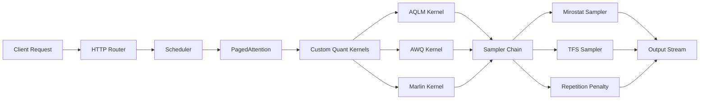
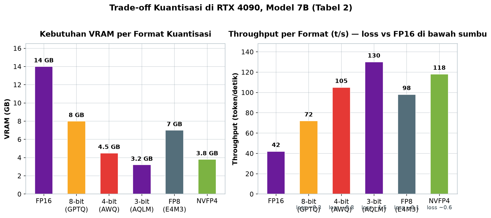

# Bab 5.3: Aphrodite Engine

> Mesin *inference* biasanya ditulis untuk data center yang dingin; Aphrodite ditulis untuk kamar kosan yang hangat oleh suara kipas kartu grafis. Lahir dari komunitas penulis kreatif dan *roleplay*, mesin ini mengambil fondasi vLLM lalu memodifikasinya habis-habisan untuk satu tujuan: membuat kartu gaming kelas konsumen — RTX 3090, RTX 4090 — menghasilkan teks sebanyak dan secepat mungkin, dengan karakter suara yang tidak dimiliki mesin lain.

---

## 1. Tujuan Sub-Bab


Setelah membaca sub-bab ini, Anda akan mampu:

- Menjelaskan asal usul **Aphrodite Engine** sebagai *fork* vLLM oleh PygmalionAI dan Ruliad yang diarahkan untuk *creative writing* dan *roleplay*
- Membedakan berbagai format *quantization* yang didukung Aphrodite (AQLM, AWQ, GPTQ, GGUF, QuIP#, SqueezeLLM, Marlin, FP2-FP12, NVFP4) beserta *trade-off* memori dan kualitas
- Menggunakan *samplers* kreatif eksklusif: Mirostat, *Tail-Free Sampling*, *Epsilon Sampling*, DRY, dan *repetition penalty*
- Membandingkan Aphrodite dengan vLLM dan Ollama secara objektif untuk beban kerja *single GPU*
- Men-deploy Aphrodite untuk model AWQ/FP8/AQLM serta model MoE besar seperti DeepSeek V4 Flash dalam konfigurasi *tensor parallelism*
- Memutuskan kapan Aphrodite adalah pilihan yang tepat — dan kapan sebaiknya memilih vLLM

---

## 2. Asal Usul Aphrodite Engine


Aphrodite Engine lahir bukan dari laboratorium riset, melainkan dari kebutuhan komunitas kreatif. **PygmalionAI** — komunitas yang mengembangkan karakter AI percakapan — bekerja sama dengan **Ruliad** untuk membuat mesin *inference* yang dioptimalkan bagi *creative writing*, *roleplay*, dan simulasi karakter. Alih-alih menulis mesin dari nol, mereka mengambil **vLLM** sebagai pondasi dan melakukan *fork*, lalu mengganti serta menambahkan komponen-komponen yang paling dibutuhkan pengguna gayanya.

Fokus pengembangan Aphrodite berorientasi pada satu kelas perangkat keras yang nyata: **kartu gaming consumer** seperti NVIDIA RTX 3090 dan RTX 4090. Tidak seperti server data center yang memakai A100/H100, kartu gaming punya VRAM 8-24 GB, *memory bandwidth* yang relatif sempit, dan — yang terpenting — harga yang terjangkau bagi individu. Segala keputusan desain Aphrodite — format kuantisasi eksotis, sampler-sampler kreatif, *UX* perintah server yang sederhana — mengalir dari kenyataan itu.

Dunia kreatif tempat Aphrodite lahir juga menjelaskan banyak pilihan teknisnya. Komunitas PygmalionAI mengelola lini model percakapan *roleplay* — termasuk keluarga model MythoMax yang populer — dan kebutuhan mereka sangat khas: percakapan panjang dengan konsistensi karakter, respons cepat untuk obrolan interaktif, serta kemampuan menukar "persona" tanpa menurunkan server. Inilah yang mendorong Aphrodite menekuni *multi-LoRA*, *sampler* eksotis, dan dukungan kuantisasi level ekstrem — bukan karena angka *benchmark* yang menjual, tetapi karena ketiganya memang diperlukan untuk menghidupkan karakter AI yang meyakinkan di atas perangkat keras rumahan. Sejak rilis publik, mesin ini tumbuh menjadi salah satu *serving engine* terpopuler bagi pengguna kartu gaming di seluruh dunia — bukti bahwa kebutuhan niche, bila dipahami betul, bisa melahirkan ekosistem yang hidup.

Tiga tabel berikut membandingkan Aphrodite dengan mesin lain dari sudut pandang yang berbeda: Tabel 1 melihat keseluruhan fitur antar engine, Tabel 2 mengisolasi efek kuantisasi pada satu kartu, dan Tabel 3 menguji beban banyak pengguna. Ketiganya memakai RTX 4090 dengan model 7B — konsisten sehingga selisih antar baris benar-benar mencerminkan variabel yang diubah.

### Tabel 1: Perbandingan Engine untuk Kartu Gaming

Mari lihat bagaimana ketiga mesin — Aphrodite, vLLM, dan Ollama — menempati posisi berbeda untuk beban kerja kartu gaming.

| Fitur | Aphrodite Engine | vLLM | Ollama |
|:---|:---:|:---:|:---:|
| **Dukungan Quantization** | AQLM, AWQ, GGUF, GPTQ, FP2-FP12, Marlin, QuIP#, NVFP4 | AWQ, GPTQ, FP8, GGUF | GGUF (internal) |
| **Samplers Kreatif** | Mirostat, TFS, Epsilon, DRY, RepPen | Standard (top-k, top-p, temp) | Standard |
| **Multi-LoRA** | Ya (dynamic loading) | Ya | Tidak |
| **Throughput RTX 4090 (7B)** | ~120 t/s | ~105 t/s | ~80 t/s |
| **DeepSeek V4 Flash Support** | Ya (2x RTX 6000 INT4) | Ya | Terbatas |
| **Roleplay Optimization** | Ya | Tidak | Minimal |
| **OpenAI API** | Full | Full | Parsial |
| **Licensing** | AGPL-3.0 | Apache 2.0 | MIT |

Tabel ini menunjukkan posisi berbeda ketiga mesin. **Ollama** adalah pilihan paling sederhana — *single command*, tanpa kernel-kernel lanjutan — tetapi menjadi yang paling lambat (~80 t/s) dan tidak mendukung *multi-LoRA*. **vLLM** adalah jembatan antara dua dunia: cepat (~105 t/s) dan berlisensi ramah, tetapi polos di sampler. **Aphrodite** memenangkan *throughput* (~120 t/s) dan kelengkapan kreatif, tetapi lisensi AGPL-3.0 menjadi harga yang harus dibayar untuk korporasi. Perhatikan pula baris DeepSeek V4 Flash: ketiga engine punya perlakuan berbeda terhadap MoE ringan 284B/13B aktif ini — Aphrodite dan vLLM mendukungnya penuh dengan INT4, sementara dukungan Ollama terbatas.

Satu lagi bacaan penting: kolom *Licensing* bukan sekadar formalitas hukum — ia menentukan siapa yang boleh membangun bisnis di atas mesin tersebut. Ollama (MIT) dan vLLM (Apache 2.0) memberikan kebebasan komersial paling besar, termasuk menutup turunan; Aphrodite (AGPL-3.0) memaksa layanan turunan yang didistribusikan membuka kode sumber. Bagi individu dan komunitas, perbedaan ini hampir tidak terasa; bagi startup yang berencana menjual layanan *inference*, konsultasi hukum sebelum memilih engine adalah langkah yang bijak — lebih murah daripada migrasi di tengah jalan.


---

## 3. Perbedaan dengan vLLM


### 3.1 Kuantisasi yang Lebih Luas

Perbedaan paling mencolok adalah kebun binatang format *quantization* yang didukung Aphrodite: selain AWQ, GPTQ, Bitsandbytes, dan GGUF, mesin ini menambahkan **AQLM** (*Additive Quantization* untuk kompresi ekstrem hingga 2-bit [3]), **QuIP#** (kuantisasi berbasis *lattice*), **SqueezeLLM** (*dense-and-sparse* untuk model langka [4]), **Marlin** (kernel FP16xINT4 berkecepatan tinggi), rentang **FP2 hingga FP12** (presisi *floating point* fleksibel), dan **NVFP4** (format 4-bit *floating point* NVIDIA). Setiap format ditopang *custom CUDA kernels* tersendiri, dan di banyak format Aphrodite bahkan lebih cepat dari vLLM karena kernelnya ditulis khusus untuk pola akses memori kartu gaming. Konsekuensinya: pengguna kartu dengan VRAM pas-pasan punya lebih banyak jalan untuk memuat model yang tadinya mustahil.

Untuk memahami setiap format, kelompokkan mereka berdasarkan strategi: **GPTQ** mengkuantisasi bobot per kolom dengan koreksi *second-order* — metode mapan yang menjadi tolok ukur semua penelitian berikutnya [6]; **AWQ** memilih bobot terpenting berdasarkan besaran aktivasi dan meninggalkannya berpresisi tinggi — favorit untuk kualitas-wajar-kecepatan-tinggi; **AQLM** memakai *additive quantization* — mendekati satu matriks bobot dengan penjumlahan beberapa kode — sehingga turun hingga 2-bit dengan degradasi yang masih masuk akal [3]; **SqueezeLLM** memisahkan bobot menjadi bagian padat (*dense*) dan langka (*sparse*), menyimpan bagian langka dengan presisi tinggi tanpa boros [4]; dan **NVFP4** adalah format 4-bit *floating point* NVIDIA yang menjadi pasangan native Mistral Large 3 [9]. Pilihan format menentukan posisi Anda di kurva yang akan terlihat di Tabel 2: semakin rendah bit, semakin kecil VRAM, semakin cepat — tetapi semakin jauh kualitas dari baseline FP16.

### 3.2 Samplers Kreatif

Mesin vLLM standar hanya menyediakan *sampling* konvensional: `top-k`, `top-p`, dan `temperature`. Aphrodite memperluas palet ini dengan **samplers kreatif** yang dirancang untuk teks naratif:

- **Mirostat** — algoritma *decoding* yang langsung mengontrol *perplexity* teks hasil generasi, menyesuaikan suhu secara adaptif agar teks tidak jatuh ke repetisi atau melompat ke kekacauan [5]
- **Tail-Free Sampling (TFS)** — memangkas distribusi probabilitas dari ekor distribusi yang datar, alternatif top-p yang lebih halus untuk prosa
- **Epsilon Sampling** — memfilter token berbasis *momentum* epsilon, menjaga pluralitas pilihan
- **DRY** (*Don't Repeat Yourself*) — penalti repetisi berbasis *sequence*, dan *repetition penalty* klasik

Bagi penulis, sampler-sampler ini bukan gimmick: kombinasi `mirostat_mode=2` dengan `repetition_penalty=1.15` sering menjadi pembeda antara dialog karakter yang hidup dan narasi yang berputar-putar. Secara intuitif, *sampling* konvensional memilih token berdasarkan probabilitas — sederhana, tetapi mudah jatuh ke contoh paling umum alias klise. Mirostat menempuh jalan berbeda: ia memantau *perplexity* teks yang sedang berjalan dan menyesuaikan suhu secara adaptif, menjaga teks pada tingkat "kejutan" yang Anda inginkan lewat parameter `tau` [5]. Hasilnya terasa seperti sutradara yang terus mengatur pencahayaan panggung agar drama tidak membosankan maupun kacau.

### 3.3 Kapan Sampler Kreatif Bekerja — dan Kapan Tidak

Perlu kejujuran: sampler-sampler ini tidak selalu dibutuhkan. Untuk tugas fungsional — menjawab pertanyaan, meringkas dokumen, menulis kode — output standar `top-k`/`top-p`/`temperature` sudah lebih dari cukup, dan Mirostat justru bisa terasa "bertele-tele". Samplers kreatif baru menunjukkan nilainya pada teks panjang dengan karakter dan gaya: narasi, dialog, cerita bersambung, simulasi percakapan. Jika beban kerja Anda adalah jenis kedua, Aphrodite memberi Anda kendali yang tidak dimiliki mesin lain; jika beban kerja Anda fungsional, kehadiran sampler eksotis tidak akan merugikan apa pun — Anda cukup mengabaikannya.

Pijakan praktis lain: kualitas sampler juga bergantung pada *base model*. Model yang dilatih untuk *roleplay* — seperti Mythomax — merespons Mirostat dan DRY dengan luar biasa; model instruksi umum lebih nyaman dengan top-p standar. Rahasia komunitas adalah menyimpan *preset sampler* per model di file konfigurasi server, sehingga setiap model berjalan dengan "kepribadian" yang paling cocok — dan pengguna biasa tidak perlu memahami perbedaan teknisnya sama sekali.

### 3.3 Multi-LoRA dengan Dynamic Loading

Aphrodite mendukung **multi-LoRA** dengan *dynamic loading*: banyak adapter kecil untuk satu *base model* dapat dimuat dan ditukar secara bergiliran tanpa menurunkan server. Ini fitur impian komunitas *roleplay* — satu base model Mistral/Llama dengan puluhan *LoRA* berbeda untuk puluhan karakter, masing-masing dengan gaya bicara sendiri, dimuat sesuai permintaan. vLLM juga memiliki *multi-LoRA*, tetapi Aphrodite menyesuaikan alur kerjanya dengan beban kerja kreatif: per karakter, per pengguna, per *persona*.

### 3.4 Optimasi VRAM
**FP2-FP12**

Salah satu inovasi paling berani Aphrodite adalah memuat model FP16 dalam rentang presisi **FP2 hingga FP12**. Jika model tidak muat dengan AWQ 4-bit dan GPU Anda hanya punya 8 GB, Aphrodite bisa menurunkan bobot ke presisi lebih rendah lagi — dengan *quantum* fleksibel, bukan kekuatan dua saja — demi *throughput* ekstrem dengan VRAM yang sangat terbatas. *Trade-off*-nya jelas: semakin rendah presisi, semakin nyata degradasi kualitas output. Ini bukan fitur untuk pekerjaan presisi, tetapi penyelamat untuk menjalankan model menengah di kartu gaming yang pas-pasan.

Rentang FP2-FP12 ini juga punya nilai pedagogis: ia membuat konsep *precision vs quality* menjadi terukur langsung, sesuatu yang sering hanya dibahas abstrak di *textbook*. Anda bisa memuat model yang sama dalam FP8, FP6, FP4, lalu membandingkan satu paragraf outputnya sendiri — cara paling efektif untuk membangun intuisi kapan sebuah format "masih bisa dibaca" dan kapan "sudah hancur". Dalam praktik komunitas, FP8 umumnya tidak terasa bedanya dengan FP16 untuk prosa, FP4 mulai terasa "datar", dan di bawah FP4 biasanya hanya dipakai untuk eksperimen.

Kebun binatang format ini bukannya tanpa risiko: semakin banyak format, semakin besar pula permukaan *bug* dan perbedaan perilaku antar kernel. Dua model yang sama-sama "4-bit" bisa menghasilkan teks yang berbeda terasa jika formatnya berbeda — misalnya AWQ versus GPTQ — sehingga *benchmark* kualitas tidak bisa disamaratakan hanya dari angka bit. Praktik terbaik komunitas: tentukan satu format andalan per model (biasanya yang direkomendasikan pembuat *quantized checkpoint*), gunakan secara konsisten di produksi, dan perlakukan format lain hanya sebagai percobaan — bukan sebagai pengganti yang setara tanpa pengujian.

---

## 4. Arsitektur


Di bagian terdalam, Aphrodite tetap setia pada fondasi vLLM: **PagedAttention** untuk manajemen KV-cache [2] dan *continuous batching* untuk *throughput* tinggi. Yang diubah adalah lapisan di sekitarnya. *Custom CUDA kernels* menggantikan kernel default untuk setiap format kuantisasi alternatif — AQLM, AWQ, Marlin, dan seterusnya — sehingga kecepatan komputasi tidak kalah dengan presisi tereduksi. Di atasnya, Aphrodite menyediakan **API yang kompatibel dengan OpenAI** sekaligus ekstensi khusus untuk fitur *roleplay*: parameter `extra_body` untuk sampler-sampler eksotis, pengendalian LoRA per *request*, dan endpoint yang ramah alur kreatif. Kombinasi ini membuat Aphrodite terasa seperti vLLM yang "dipersonalisasi": fondasi yang sama, tetapi dengan tombol-tombol tambahan yang tidak Anda temukan di mesin lain.

Karena pondasinya sama, sebagian besar keterampilan yang Anda pelajari di sub-bab 5.1 berpindah tanpa biaya: parameter seperti `--max-model-len`, `--gpu-memory-utilization`, dan `--kv-cache-dtype` memiliki semantik yang sama; metrik prometheus inti tetap ada; dan *tensor parallelism* lintas GPU bekerja dengan cara yang identik. Ini adalah keputusan desain yang bijak dari PygmalionAI dan Ruliad: daripada menciptakan ekosistem baru dari nol, mereka membangun di atas fondasi yang sudah terbukti dan hanya mengganti bagian yang memang perlu diganti untuk kebutuhan kreatif.

Pada lapisan API, kompatibilitas OpenAI berarti klien yang sudah ditulis untuk vLLM — seperti contoh `client.chat.completions.create` di sub-bab 5.1 — langsung berfungsi. Yang baru adalah *ekstensi*: parameter sampler eksotis di `extra_body`, dan penanda LoRA yang bisa disertakan per request untuk memilih karakter tertentu. Konsekuensinya menyenangkan: tim yang ingin mencoba Aphrodite cukup mengubah `base_url`, tanpa menulis ulang satu baris pun dari aplikasi yang ada — dan bisa kembali ke vLLM kapan saja dengan cara yang sama.

### Gambar 1: Arsitektur Aphrodite Engine



Diagram ini memperlihatkan dua lapisan yang membedakan Aphrodite dari vLLM. Lapisan pertama adalah **custom quant kernels**: setelah PagedAttention, komputasi disalurkan ke kernel spesifik format — AQLM, AWQ, Marlin, dan lainnya — masing-masing dioptimalkan untuk kartu gaming. Lapisan kedua adalah **sampler chain**: alih-alih satu *sampling* tunggal, output melewati rangkaian Mirostat, TFS, dan repetition penalty yang membentuk karakter suara hasil generasi. Di antara kedua lapisan inilah Aphrodite mengubah mesin *serving* biasa menjadi mesin menulis.

Perhatikan bahwa kedua lapisan ini *modular*: menambah format kuantisasi baru hanya berarti menulis satu kernel baru di tengah, dan menambah sampler baru hanya meneruskan rantai di ujung. Inilah sebabnya Aphrodite bisa mendukung format secepat perkembangan riset kuantisasi — arsitekturnya sengaja dibangun agar komponen-komponen semacam itu bisa dipasang lepas. Sebaliknya, di vLLM yang berdimensi enterprise, setiap fitur baru harus melewati proses desain yang lebih ketat — lebih aman, tetapi lebih lambat dalam menyerap eksperimen komunitas.

---


---

## 5. Kapan Memilih Aphrodite?


Tidak semua proyek membutuhkan Aphrodite; mesin ini paling bersinar dalam tiga skenario. Pertama, **creative writing dan roleplay** — jika Anda butuh sampler kompleks (Mirostat, TFS, DRY) dan multi-LoRA dinamis untuk karakter, tidak ada pilihan yang lebih matang. Kedua, **kartu gaming dengan VRAM terbatas (8-24 GB)** — dukungan format eksotis seperti AQLM dan FP2-FP12 memberi Anda lebih banyak cara memuat model di VRAM yang sempit dibandingkan vLLM. Ketiga, **kebutuhan format kuantisasi eksotis** — kerja dengan AQLM, FP4, NVFP4, atau QuIP# di kartu consumer hampir selalu berarti Aphrodite, karena kernel-kernel ini ditulis khusus untuk kelas perangkat tersebut.

Perlu ditekankan bahwa ketiga skenario itu bukan tentang "siapa yang paling cepat" semata, melainkan tentang **pilihan yang tersedia**. Di vLLM, jika AWQ 4-bit tidak cukup muat, opsi Anda hampir habis; di Aphrodite, tangga masih bisa turun ke AQLM 3-bit, FP4, atau bahkan FP2 — dengan konsekuensi kualitas yang harus Anda terima sendiri. Bagi pengguna kartu 8 GB yang ingin menjalankan model 13B, perbedaan antara "jalan lain masih ada" dan "tidak bisa sama sekali" inilah yang menentukan keputusan. (Teknik *serving* multi-adapter dibahas mendalam di sub-bab 5.7, sementara kebutuhan yang sudah melampaui satu kartu — seperti model 70B di dua GPU — dilayani oleh sub-bab 5.6.)

Sebaliknya, ada kalanya Anda harus menahan diri memakai Aphrodite — pembahasannya berikut ini.

Secara praktis, cara termudah mengambil keputusan adalah bertanya dalam urutan: (1) Apakah beban kerja Anda membutuhkan sampler di luar top-k/top-p/temperature, atau multi-LoRA dinamis untuk banyak persona? Jika ya, Aphrodite adalah pilihan terkuat. (2) Apakah model target hanya tersedia atau hanya berjalan baik di format kuantisasi eksotis seperti AQLM, QuIP#, atau NVFP4? Jika ya, vLLM dan Ollama belum tentu punya kernel yang setara. (3) Jika jawaban keduanya tidak — beban kerja fungsional dengan model mainstream — pilih vLLM untuk ekosistem dan lisensi yang lebih ramah, atau Ollama untuk kesederhanaan ekstrem. Keputusan ini tidak permanen: karena API keduanya kompatibel OpenAI, aplikasi Anda bisa pindah mesin hanya dengan mengganti *base URL*.

### Tabel 2: Benchmark Aphrodite di RTX 4090 (7B Model)

Berikut *trade-off* kuantisasi terhadap VRAM, *throughput*, konteks maksimal, dan kualitas pada satu RTX 4090.

| Quantization | VRAM | Throughput (t/s) | Max Context | Kualitas (vs FP16) |
|:---|:---:|:---:|:---:|:---:|
| FP16 | 14 GB | 42 | 8K | Baseline |
| 8-bit (GPTQ) | 8 GB | 72 | 16K | ~0.3 loss |
| 4-bit (AWQ) | 4.5 GB | 105 | 32K | ~0.8 loss |
| 3-bit (AQLM) | 3.2 GB | 130 | 48K | ~1.5 loss |
| FP8 (E4M3) | 7 GB | 98 | 16K | ~0.1 loss |
| NVFP4 (Mistral Large 3) | 3.8 GB | 118 | 24K | ~0.6 loss |



*Gambar 5.3-1 — Trade-off kuantisasi di RTX 4090: AQLM 3-bit memenangkan throughput (130 t/s) dengan VRAM terkecil (3,2 GB), tetapi kualitas turun ~1,5 loss; AWQ 4-bit menjadi titik manis (105 t/s, ~0,8 loss).*

Bacaan penting dari tabel ini: *throughput* tertinggi (130 t/s) justru diraih AQLM 3-bit, bukan FP16 — karena bobot yang lebih kecil berarti lebih sedikit data yang ditarik dari *memory bandwidth*, dan pada kartu gaming *memory bandwidth* adalah *bottleneck* utama. Namun kualitas turun ~1.5 *loss* dari baseline; untuk teks kreatif yang panjang, degradasi ini bisa terasa. Titik manis praktis adalah **AWQ 4-bit**: VRAM 4,5 GB, *throughput* 105 t/s, konteks 32K, dengan penalti kualitas yang masih terkendali (~0.8). Sementara itu **NVFP4** — format 4-bit *floating point* NVIDIA yang didukung native oleh Mistral Large 3 — menjadi opsi menarik modern: 118 t/s dengan hanya ~0.6 loss [9]. Aphrodite adalah engine pertama yang membawa NVFP4 ke kartu gaming consumer.

Perhatikan juga kolom *Max Context*: kuantisasi yang lebih kecil secara tidak langsung membuka konteks yang lebih panjang. Ini efek domino memori — model FP16 memakai 14 GB hanya untuk bobot, menyisakan sedikit ruang KV-cache, sehingga batas konteks tersendat di 8K; sebaliknya AQLM 3-bit memakan 3,2 GB dan membiarkan konteks membengkak ke 48K. Jika kebutuhan Anda adalah percakapan panjang dengan memori karakter, pilihan format kuantisasi sama pentingnya dengan pilihan model itu sendiri. Untuk konteks setara, jumlah VRAM yang tersisa setelah bobot, dibagi kebutuhan KV-cache per token, menentukan "umur" percakapan Anda.


---

## 6. Keterbatasan


Harga dari kekuatan komunitas adalah ukuran komunitas itu sendiri. *Update* Aphrodite bisa lebih lambat daripada vLLM yang digarap tim besar dan banyak kontributor, sehingga model terbaru kadang butuh waktu sebelum didukung. Dokumentasinya juga tidak selengkap vLLM — sebagian besar pengetahuan tersebar di *discord* komunitas dan *issue tracker*. Dan beberapa fitur enterprise tidak ada di Aphrodite: misalnya *batch API* bergaya OpenAI, *prefix caching* yang sepenuhnya otomatis, dan integrasi ekosistem seperti *monitoring* Prometheus siap pakai. Terakhir, lisensi **AGPL-3.0** (berbeda dengan Apache 2.0 milik vLLM) berarti turunan yang didistribusikan sebagai layanan harus membuka sumbernya — pertimbangan penting bagi perusahaan tertutup.

Perlu ditambahkan catatan tentang kestabilan: sebagai proyek komunitas dengan rilis yang digerakkan sukarelawan, *breaking change* antar versi lebih sering terjadi daripada vLLM, dan dokumentasi *upgrade path* kadang tertinggal. Praktik terbaik bagi pengguna produksi adalah *mengunci* versi Aphrodite yang sudah terbukti stabil (seperti v0.6.0 di studi kasus nanti) dan baru naik versi setelah *changelog* diperiksa. Ini bukan kelemahan yang mematikan — banyak proyek *roleplay* besar berjalan berbulan-bulan tanpa masalah — melainkan sekadar pengingat bahwa *support* Anda adalah komunitas itu sendiri.

### Tabel 3: Benchmark Multi-User Concurrent (RTX 4090, AWQ 4-bit)

Terakhir, bagaimana Aphrodite bertahan ketika beberapa pengguna memakai model yang sama sekaligus?

| Concurrent Users | Throughput (t/s) | TTFT P50 (ms) | VRAM Used |
|:---|:---:|:---:|:---:|
| 1 | 105 | 120 | 4.5 GB |
| 4 | 68 | 210 | 8.2 GB |
| 8 | 41 | 380 | 12.1 GB |
| 16 | 22 | 720 | 18.5 GB |

Pola yang terlihat sangat wajar: *throughput* per pengguna turun seiring bertambahnya pengguna (dari 105 menjadi 22 t/s), TTFT membengkak (120 → 720 ms), dan VRAM naik karena setiap percakapan membutuhkan KV-cache sendiri. Pelajaran utamanya: hingga **8 pengguna simultan**, pengalaman masih sangat layak — sekitar 41 t/s per pengguna terasa responsif untuk percakapan. Di atas itu, *throughput* per pengguna anjlok dan TTFT mendekati satu detik; saat itulah saatnya membagi beban ke GPU kedua atau menyebut "mulai dari sini Anda butuh server". Angka-angka ini juga menjelaskan mengapa komunitas *roleplay* umumnya membatasi server mereka pada 8-16 pengguna per GPU.

Kolom VRAM juga menjawab pertanyaan yang sering muncul: mengapa memakai dua kartu 24 GB jika satu saja cukup untuk model AWQ? Karena VRAM yang bertambah tidak dipakai untuk bobot model — yang hanya 4,5 GB — melainkan untuk KV-cache dari banyak percakapan paralel. Pada 16 pengguna, penggunaan VRAM sudah 18,5 GB; dengan dua GPU, Anda bisa menggandakan kapasitas pengguna tersebut, atau memberi ruang untuk konteks yang lebih panjang per percakapan. Dengan kata lain, untuk mesin kreatif, target belanja GPU selanjutnya ditentukan oleh *banyaknya pengguna*, bukan oleh ukuran model.

---


---

## 7. Praktikum / Hands-On


Praktikum ini membawa Anda dari instalasi hingga menjalankan model dengan kuantisasi eksotis — lima langkah yang saling membangun: install, server AWQ, klien kreatif, model MoE besar, dan format kuantisasi pinggiran. Semua perintah ditulis untuk antarmuka `aphrodite run` versi 0.6.x; periksa `aphrodite run --help` jika keluaran versi Anda berbeda.

### Langkah 1: Instalasi Aphrodite Engine

```bash
# Install dari PyPI
pip install aphrodite-engine

# Atau dari source (untuk custom kernels)
git clone https://github.com/aphrodite-engine/aphrodite-engine
cd aphrodite-engine
pip install -e .
```

Instalasi dari *source* disarankan jika Anda ingin mencoba kernel paling baru; pastikan CUDA toolkit yang terpasang kompatibel dengan driver GPU Anda. Setelah instalasi, verifikasi bahwa perintah `aphrodite` sudah tersedia:

```bash
# Verifikasi instalasi dan versi
aphrodite --version
python -c "import aphrodite; print(aphrodite.__version__)"
```

Jika `aphrodite --version` merespons, langkah berikutnya tinggal menjalankan server. Untuk pengguna pertama kali, mulailah dengan model kecil yang sudah populer dan didukung luas — misalnya Llama-3.1-8B — sebelum mencoba model MoE besar; ini memisahkan masalah instalasi dari masalah konfigurasi model.

### Langkah 2: Menjalankan Server dengan AWQ

```bash
# Run server
aphrodite run meta-llama/Meta-Llama-3.1-8B-Instruct \
    --quantization awq \
    --max-model-len 8192 \
    --port 8000 \
    --device cuda
```

Sama seperti vLLM, server ini membuka endpoint `/v1` yang kompatibel OpenAI. Perbedaan mulai terasa pada langkah berikutnya: parameter `extra_body` yang tidak dikenal vLLM. Verifikasi server sebelum mengirim request:

```bash
# Cek status server dan model aktif
curl http://localhost:8000/health
curl http://localhost:8000/v1/models
```

Jawaban `{"status": "ok"}` dari `/health` menandakan model sudah dimuat penuh. Pada log konsol, perhatikan baris tentang kernel kuantisasi yang digunakan (misalnya `Wq4A16` untuk AWQ) — log ini sekaligus konfirmasi bahwa *custom kernel* untuk format pilihan Anda benar-benar aktif.

### Langkah 3: Klien Python dengan Samplers Kreatif

```python
from openai import OpenAI

client = OpenAI(
    base_url="http://localhost:8000/v1",
    api_key="not-needed",
)

response = client.chat.completions.create(
    model="meta-llama/Meta-Llama-3.1-8B-Instruct",
    messages=[
        {"role": "system", "content": "Kamu adalah asisten kreatif."},
        {"role": "user", "content": "Tulis cerita pendek tentang AI."}
    ],
    max_tokens=500,
    temperature=1.2,
    # Aphrodite extra parameters
    extra_body={
        "mirostat_mode": 2,
        "mirostat_tau": 5.0,
        "repetition_penalty": 1.15,
        "top_k": 40,
    }
)
```

Perhatikan `mirostat_mode: 2` — mode ini membuat *sampling* menyesuaikan suhu secara adaptif untuk menjaga *perplexity* pada target `mirostat_tau` 5.0. Kombinasi dengan `repetition_penalty 1.15` mencegah narasi berputar di frase yang sama, dan `temperature 1.2` memberi ruang kreativitas. Silakan bereksperimen: bandingkan output tanpa `extra_body` dan dengan konfigurasi di atas — perbedaannya biasanya dramatis pada teks panjang.

Untuk menguji beberapa konfigurasi sekaligus secara adil, jalankan dua permintaan paralel — satu dengan `extra_body` dan satu tanpa — lalu bandingkan: (1) seberapa cepat teks mulai berulang; (2) keragaman struktur kalimat; (3) konsistensi "suara" narator. Hasil uji semacam ini lebih bermakna daripada membandingkan t/s murni, karena keduanya berjalan pada mesin yang sama. Jika karakter Anda sering "kehilangan kepribadian" setelah 200 token, itu biasanya tanda *tau* terlalu tinggi atau *repetition penalty* terlalu rendah — bukan tanda model yang buruk.

### Langkah 4: DeepSeek V4 Flash di 2 GPU RTX 6000

```bash
# DeepSeek V4 Flash — 284B total / 13B aktif
# Berjalan di 2x RTX 6000 (atau 1x A100 80GB) via INT4
# 1M konteks penuh, MIT License

# Setup dual GPU dengan tensor parallelism
aphrodite run deepseek-ai/DeepSeek-V4-Flash \
    --tensor-parallel-size 2 \
    --quantization int4 \
    --kv-cache-dtype fp8 \
    --max-model-len 32768 \
    --port 8000

# Benchmark: ~85 t/s di 2x RTX 6000
# Dibandingkan DeepSeek V3: hanya 27% training FLOPs untuk 1M konteks
# CPU memory: minimal 64 GB untuk weight loading
```

Model MoE 284B ini berjalan efisien karena hanya **13 miliar parameter aktif per token** — sebagian besar *experts* tidak pernah dihitung untuk tiap token [8]. Catatan penting: `max-model-len` sengaja dibatasi ke 32K pada contoh ini; konteks 1M penuh dimungkinkan oleh arsitektur CSA/HCA DeepSeek V4, tetapi tiap token konteks memakan KV-cache, jadi mulailah kecil lalu naikkan sesuai kebutuhan. Weight loading juga membutuhkan **minimal 64 GB RAM CPU**.

Perhatikan juga perbedaan istilah kuantisasi di sini: `--quantization int4` pada DeepSeek V4 Flash adalah INT4 *integer*, bukan NVFP4 *floating point* yang dibahas di Tabel 2 — keduanya 4-bit, tetapi bentuk dan distribusi nilainya berbeda, sehingga hasilnya pun tidak identik. Saat membaca dokumentasi model, selalu periksa format kuantisasi mana yang direkomendasikan penulis model; untuk seri DeepSeek V4 Flash, INT4 adalah jalur yang disetujui untuk kartu RTX kelas workstation, dan `--kv-cache-dtype fp8` diterapkan terpisah untuk menekan memori cache.

### Langkah 5: Kuantisasi Eksotis — AQLM dan FP8

```bash
# AQLM (Extreme 2-bit quantization)
aphrodite run TheBloke/Llama-2-7B-AQLM \
    --quantization aqlm \
    --max-model-len 4096

# FP8 (Native H100/RTX 4090 support)
aphrodite run meta-llama/Meta-Llama-3.1-8B-Instruct \
    --quantization fp8 \
    --kv-cache-dtype fp8
```

AQLM 2-bit adalah contoh format yang praktis mustahil dijalankan efisien di vLLM standar [3]; dengan Aphrodite, model 7B cukup muat di 3.2 GB VRAM (Tabel 2). Baris kedua menunjukkan FP8 — pada RTX 4090, dukungan FP8 berjalan di *hardware*, dan `--kv-cache-dtype fp8` memangkas memori cache hingga separuh.

Sebagai penutup praktikum, mari kaitkan semua perintah yang sudah Anda jalankan dengan teori di awal bab: PagedAttention memastikan KV-cache terkelola efisien (Gambar 1), *custom quant kernels* memastikan setiap format berjalan secepat mungkin (bagian 3.1), dan *sampler chain* menentukan warna akhir teks (bagian 3.2). Ketika Anda mengganti `--quantization`, pada dasarnya Anda hanya mengganti kernel yang aktif di tengah diagram — pilihan format memengaruhi memori dan kecepatan, sementara pengalaman menulis ditentukan oleh sampler di ujung alur. Memahami pembagian kerja inilah inti penguasaan Aphrodite.

---

## 8. Studi Kasus: Roleplay Server untuk Komunitas Kreatif


**Latar.** Sebuah komunitas *roleplay* berbahasa Indonesia dengan 500 anggota ingin membangun server AI karakter interaktif: setiap anggota bisa "berbicara" dengan tokoh fiksi yang kepribadiannya dijaga ketat. Dua GPU RTX 4090 (total 48 GB VRAM) tersedia di rumah salah satu admin, dan modalnya adalah semangat — bukan anggaran data center. Kebutuhan tambahan yang disepakati: konteks percakapan minimal 16K token agar karakter "mengingat" peristiwa lama, suhu yang bervariasi agar adegan romantis, aksi, dan misteri terasa berbeda, serta pergantian karakter tanpa *restart* server.

**Analisis pilihan.** Tim sempat mencoba vLLM untuk *base model* Mythomax-L2 (turunan Llama-2 yang populer di komunitas kreatif) dengan AWQ 4-bit. Masalahnya muncul dari keterbatasan sampler: karakter kehilangan kepribadian karena mudah jatuh ke repetisi, dan memuat LoRA per karakter yang berbeda memaksa *restart* server. Ollama tidak didiskusikan lama karena tidak mendukung multi-LoRA sama sekali. Pilihan jatuh pada **Aphrodite Engine v0.6.0**.

**Solusi.** Server dijalankan dengan Mythomax-L2-13B (AWQ 4-bit) pada satu RTX 4090 sebagai GPU utama, GPU kedua dijadikan cadangan beban saat trafik tinggi. LoRA adapters terpisah dimuat dinamis untuk puluhan karakter — satu untuk karakter samurai, satu untuk detektif, dan seterusnya. Konfigurasi sampler dibuat konsisten: **Mirostat v2 (tau=5.0), rep_penalty=1.13, top_k=40** — sebuah *preset* yang dikenal komunitas sebagai "karakter stabil".

Langkah teknis *deployment*-nya berjalan dalam empat tahap: (1) menyiapkan model AWQ dan adapter LoRA di direktori lokal; (2) menjalankan `aphrodite run` dengan `--quantization awq` dan konteks 16K; (3) menyetel *preset* sampler di klien yang digunakan angota; (4) menulis *panduan singkat* berbahasa Indonesia agar anggota baru bisa langsung mencoba. Seluruh proses memakan waktu kurang dari satu hari — jauh dari perkiraan tim yang awalnya mengira butuh proyek dua minggu.

**Hasil.** **8 pengguna simultan berjalan stabil dengan ~45 t/s per pengguna dan TTFT di bawah 300 ms** — sesuai proyeksi Tabel 3. Perbandingan langsung dengan vLLM pada hardware yang sama mencatat hanya **~30 t/s** karena sampler terbatas dan LoRA yang tidak dinamis; lebih penting lagi, kualitas karakter — parameter yang tidak terlihat di tabel mana pun — terasa lebih hidup. Anggota komunitas tidak lagi mengeluhkan jawaban yang berulang.

Beberapa detail operasional melengkapi cerita ini. LoRA per karakter disimpan di direktori adapter dan dimuat lewat parameter nama saat request; karena *loading*-nya dinamis, menambah karakter baru tidak pernah menurunkan server bahkan di tengah sesi ramai. Preset sampler disepakati bersama komunitas dan ditulis di dokumentasi server — sehingga pengalaman antar pengguna konsisten, dan keluhan "karakternya berubah sifat" bisa dilacak ke perubahan preset, bukan ke model. GPU kedua akhirnya digunakan sebagai *failover* dan untuk *batch* eksperimen menulis — bukan untuk beban utama, membuktikan bahwa satu kartu pun cukup untuk komunitas sebesar itu.

**Pelajaran.** Kasus ini menunjukkan bahwa untuk beban kerja kreatif, *throughput* bukan satu-satunya mata uang. Kemampuan memuat LoRA dinamis dan mengendalikan gaya bahasa lewat sampler mengubah pengalaman pengguna secara fundamental — nilai yang tidak bisa dihitung hanya dari t/s, dan tidak tersedia di mesin *serving* yang lebih generik. Dari sisi operasional, server ini juga mengajarkan bahwa satu GPU rumahan mampu menghidupi komunitas ratusan orang selama konfigurasi disesuaikan dengan beban — sebuah kenyataan yang semakin relevan seiring menjamurnya model efisien seperti DeepSeek V4 Flash yang bisa berjalan di workstation kelas konsumen.

---

## 9. Referensi


### Paper Jurnal/Konferensi

[1] PygmalionAI & Ruliad. (2024). *Aphrodite Engine: Large-Scale LLM Inference Engine* (dokumentasi proyek). [github.com/aphrodite-engine/aphrodite-engine](https://github.com/aphrodite-engine/aphrodite-engine)

[2] Kwon, W., Li, Z., Zhuang, S., Sheng, Y., Zheng, L., Yu, C.H., Gonzalez, J.E., Zhang, H., & Stoica, I. (2023). *Efficient Memory Management for Large Language Model Serving with PagedAttention*. Proceedings of the 29th Symposium on Operating Systems Principles (SOSP). DOI: [10.1145/3600006.3613165](https://doi.org/10.1145/3600006.3613165) — [arXiv:2309.06180](https://arxiv.org/abs/2309.06180)

[3] Egiazarian, V., et al. (2024). *Extreme Compression of Large Language Models via Additive Quantization*. International Conference on Machine Learning (ICML). DOI: [10.48550/arXiv.2401.06118](https://arxiv.org/abs/2401.06118)

[4] Kim, S., et al. (2024). *SqueezeLLM: Dense-and-Sparse Quantization*. Proceedings of Machine Learning and Systems (MLSys). DOI: [10.48550/arXiv.2306.07629](https://arxiv.org/abs/2306.07629)

[5] Basu, S., et al. (2021). *Mirostat: A Neural Text Decoding Algorithm that Directly Controls Perplexity*. International Conference on Learning Representations (ICLR). DOI: [10.48550/arXiv.2007.14966](https://arxiv.org/abs/2007.14966)

[6] Frantar, E., Ashkboos, S., Hoefler, T., & Alistarh, D. (2023). *GPTQ: Accurate Post-Training Quantization for Generative Pre-trained Transformers*. International Conference on Learning Representations (ICLR). DOI: [10.48550/arXiv.2210.17323](https://arxiv.org/abs/2210.17323)

### Referensi Pendukung (Dokumentasi/Repository)

[7] Aphrodite Engine. *GitHub Repository*. [github.com/aphrodite-engine/aphrodite-engine](https://github.com/aphrodite-engine/aphrodite-engine)

[8] DeepSeek AI. (2026). *DeepSeek-V4 Flash: 284B MoE with 13B Active Parameters* — MIT License, runs on 2xRTX 6000 via INT4. [api-docs.deepseek.com](https://api-docs.deepseek.com/)

[9] NVIDIA. (2025). *NVFP4: 4-bit Floating Point for LLM Inference*. [developer.nvidia.com/nvfp4](https://developer.nvidia.com/nvfp4)

[10] PygmalionAI. *Community & Documentation*. [pygmalion.chat](https://pygmalion.chat)
