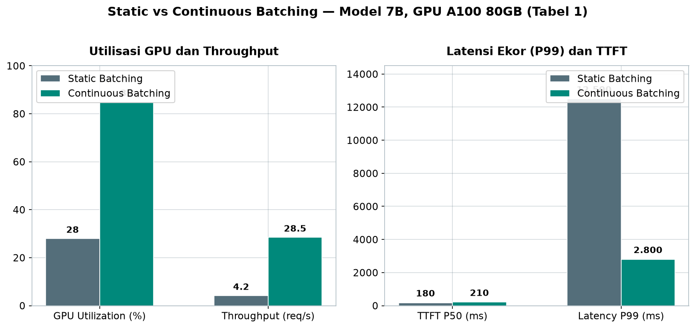
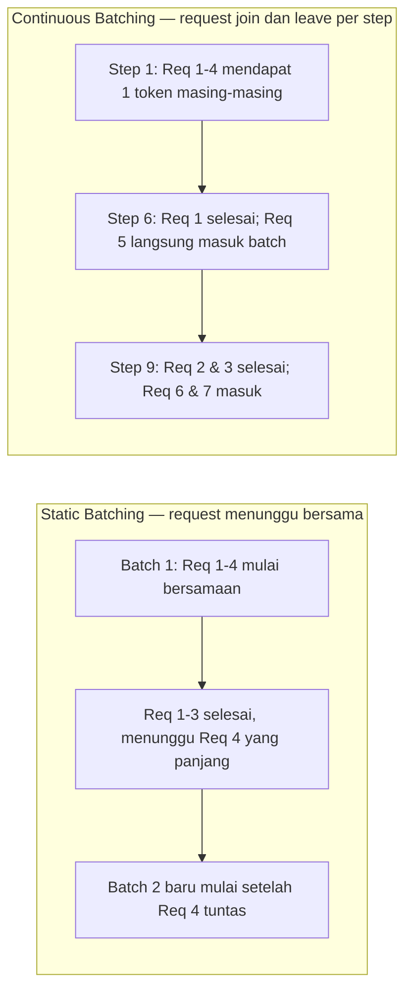
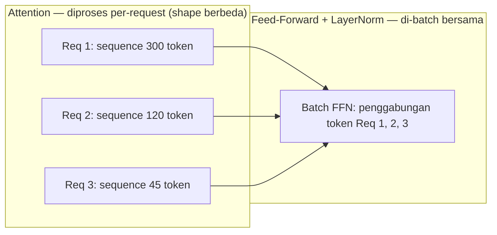
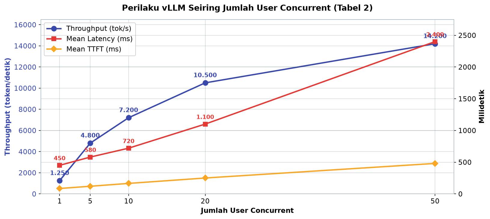

# Bab 5.4: Continuous Batching

> Bayangkan satu barisan kasir di minimarket: semua pelanggan harus menunggu pelanggan paling lambat selesai berbelanja sebelum antrean bergeser. Itulah nasib request Anda di inference engine tradisional. Continuous batching mengubah aturan mainnya — setiap pelanggan maju selangkah setiap detik, selesai kapan pun, tanpa membuat yang lain menunggu.

---

## 1. Tujuan Sub-Bab


Setelah membaca sub-bab ini, Anda akan mampu:

- Menjelaskan perbedaan mendasar antara *static batching* dan *continuous batching* (atau *iteration-level scheduling*) serta mengapa keduanya berbeda drastis dalam hal pemanfaatan GPU
- Menerangkan mekanisme *selective batching* yang dipakai untuk menangani variasi panjang *sequence* antar-request dalam satu batch
- Mengukur dampak *continuous batching* terhadap latensi dan *throughput* di berbagai *inference engine* seperti vLLM, TGI, TensorRT-LLM, Aphrodite, dan SGLang
- Mengonfigurasi parameter batching di vLLM (`--max-num-seqs`, `--max-num-batched-tokens`, `--enable-chunked-prefill`) untuk skenario multi-user nyata

---

## 2. Masalah Static Batching: Antrean Macet di Pintu GPU


### Head-of-Line Blocking: yang Pendek Menunggu yang Panjang

Sebelum *continuous batching* diperkenalkan, hampir semua *inference engine* beroperasi dengan pola yang disebut **static batching** (atau *request-level batching*). Polanya sederhana: GPU mengumpulkan beberapa request dalam satu *batch*, memproses semuanya bersama-sama, dan — inilah kata kuncinya — **batch tersebut hanya dianggap selesai ketika request terlambat selesai** juga. Satu *batch* yang berisi permintaan "tulis email singkat" (output 50 token) dan "rangkum dokumen 100 halaman" (output 2.000 token) akan berjalan selambat permintaan yang paling panjang.

Dampaknya adalah fenomena yang dalam dunia jaringan komputer dikenal sebagai **head-of-line blocking**: request pendek yang sudah selesai dikerjakan harus "membeku" menunggu request panjang di batch yang sama tuntas, padahal GPU tidak bisa memulai batch berikutnya. Bayangkan antrean empat mobil di palang pintu tol yang hanya bisa dibuka sekaligus — mobil pertama yang sudah membayar harus menunggu mobil terakhir yang masih mencari uang receh. Semakin bervariasi panjang output antar-user, semakin parah kemacetannya.

### GPU yang Menganggur di Tengah Kesibukan

Ada kesalahpahaman umum bahwa static batching berarti GPU selalu bekerja penuh. Faktanya justru sebaliknya. Karena *batch* harus menunggu request paling lambat, GPU mengalami apa yang disebut **pipeline bubble** — periode di mana unit komputasi tidak punya pekerjaan. Saat satu batch selesai dan batch berikutnya sedang disiapkan (menunggu request baru terkumpul), GPU kosong total. Saat request dalam satu batch selesai tidak bersamaan, utilisasi GPU turun drastis, membentuk pola naik-turun yang mirip gergaji.

Ukurannya mengejutkan: penelitian Yu et al. (2022) pada paper Orca menunjukkan bahwa static batching hanya mencapai **20-40% utilisasi GPU** [1]. Lebih dari setengah kemampuan komputasi—yang sudah dibayar mahal—terbuang percuma. Inilah masalah yang coba dipecahkan oleh Orca dan kemudian diadopsi oleh semua engine modern.

Ada satu fakta lanjutan yang memperparah keadaan: static batching memperbesar *batch* secara membabi buta justru merugikan. *Batch* yang lebih besar berarti waktu tunggu yang lebih lama menunggu request terlambat — *scale* tidak menyelesaikan masalah, hanya memindahkannya ke level yang lebih tinggi. Solusi sejatinya bukan memperbesar *batch*, melainkan mengubah cara *batch* itu dikelola: dari satu kesatuan yang kaku menjadi kumpulan individu yang bergerak bebas.

### Tabel 1: Static vs Continuous Batching (Model 7B, GPU A100 80 GB)

Tabel berikut membandingkan performa kedua pendekatan pada model 7B di satu GPU A100 80 GB, dirangkum dari paper Orca dan benchmark Anyscale [1][3]:

| Metrik | Static Batching | Continuous Batching | Improvement |
|:---|:---:|:---:|:---:|
| GPU Utilization | 28% | 85% | 3x |
| Throughput (req/s) | 4.2 | 28.5 | 6.8x |
| TTFT P50 (ms) | 180 | 210 | -17% |
| Latency P99 (ms) | 12.500 | 2.800 | 4.5x lebih baik |
| Max Batch Size | 8 | 64 | 8x |
| VRAM Waste | ~50% | ~4% | 12.5x lebih baik |



*Gambar 5.4-1 — Continuous batching menukar TTFT yang sedikit lebih lambat (+17%) dengan kemenangan besar di ekor latensi: P99 membaik 4,5x dan utilisasi GPU naik 3x — pola yang justru paling penting untuk pengalaman multi-user.*

Pembacaan tabel ini penuh nuansa. *Throughput* melonjak 6,8x dan utilisasi GPU naik 3x — itu kabar baik utama. Namun perhatikan **TTFT (Time To First Token) P50**: dari 180 ms menjadi 210 ms, lebih lambat 17%. Ini bukan bug, melainkan konsekuensi logis dari berbagi GPU — karena batch lebih penuh, setiap request harus mengantre sedikit lebih lama untuk slot komputasi pertama. Sementara itu, *latency* P99 — ukuran pengalaman user terburuk — membaik 4,5x dari 12,5 detik menjadi 2,8 detik. Di sinilah trade-off *continuous batching*: sedikit pengorbanan di median, kelegaan besar di ekor. Untuk pengalaman multi-user, ekor yang pendek jauh lebih penting daripada median yang super cepat.

Perlu dicatat: efisiensi KV-cache model modern memperbesar keunggulan ini. DeepSeek V4 Pro dengan hybrid CSA/HCA attention hanya membutuhkan **10% KV-cache dibandingkan generasi V3.2** — artinya dalam satu batch yang sama, *continuous batching* bisa memuat jauh lebih banyak request karena ruang cache yang tersedia jauh lebih besar.


### Gambar 1: Timeline Static vs Continuous Batching

Diagram berikut membandingkan perjalanan waktu empat request pada kedua pendekatan:



Bagian atas diagram (STATIC) menunjukkan *batch* yang kaku: request pendek (Req 1-3) terkurung oleh request panjang (Req 4), dan *batch* berikutnya baru dibuka setelah semuanya beres — GPU menganggur di sela-selanya. Bagian bawah (CONTINUOUS) memperlihatkan irama yang hidup: setiap *step* menghasilkan satu token untuk semua request, request yang selesai pergi, request baru langsung mengisi slot kosong. Tidak ada momen GPU kosong — inilah alasan mengapa jumlah *request* yang bisa dilayani per detik melonjak 6-7 kali lipat.


---

## 3. Iteration-Level Scheduling: Ide Besar dari Orca


### Mengapa Per-Request Tidak Cukup

Paper Orca yang terbit di USENIX OSDI 2022 mengajukan pertanyaan provokatif: mengapa kita mengikat nasib request yang berbeda-beda dalam satu batch yang kaku [1]? Jawaban mereka adalah mengubah unit penjadwalan dari **per-request** menjadi **per-iteration**. Dalam dunia LLM, satu *iteration* berarti satu *decoding step* — satu langkah menghasilkan satu token untuk seluruh sequence yang sedang aktif diproses. Dengan *iteration-level scheduling*, scheduler tidak lagi bertanya "request mana yang sudah selesai?", tetapi "iterasi mana yang sedang berjalan, dan request mana yang masih butuh token berikutnya?"

### Satu Step, Satu Token untuk Semua

Secara teknis, alur kerja *continuous batching* di setiap iterasi sangat sederhana namun revolusioner:

1. **Generate** satu token untuk semua *active request* yang sedang diproses.
2. **Cek** request mana yang telah mencapai panjang output yang diminta (misalnya, sudah menghasilkan token EOS atau mencapai `max_tokens`).
3. **Keluarkan** request yang selesai dari batch.
4. **Tambahkan** request baru dari antrean ke batch yang baru saja ditinggalkan.

Karena langkah 3 dan 4 terjadi di **setiap iterasi**, komposisi batch berubah terus-menerus — *request* bisa *join* dan *leave* kapan saja, tidak seperti static batching yang hanya bisa berganti komposisi di antara batch. Ini persis seperti jalur antrean di kasir cepat: setiap orang maju satu langkah setiap beberapa detik, yang selesai langsung pergi, dan orang baru langsung mengisi slot kosong. GPU tidak pernah menunggu, dan antrean tidak pernah macet.

### Komposisi Batch yang Dinamis

Konsekuensi penting dari desain ini: tidak ada lagi istilah "batch 1", "batch 2" yang terpisah kaku. Yang ada hanyalah satu **kolam aktif request** yang terus berubah ukuran. Jika 7 dari 64 request selesai dalam satu iterasi, 7 slot langsung diisi request berikutnya dalam iterasi yang sama — GPU tetap penuh bekerja pada iterasi selanjutnya. Satu-satunya batas adalah kapasitas memori dan `max batch size` yang dikonfigurasi. Desain inilah yang membuat GPU bisa dijejali request hingga 3-8 kali lebih banyak dibandingkan static batching, dan membuat utilisasi melonjak dari kisaran 28% menjadi 85% pada A100 (lihat Tabel 1).

Ada satu syarat tersembunyi yang membuat mekanisme ini bekerja tanpa menguras memori: manajemen **KV-cache** yang efisien. Jika setiap request menyimpan cache-nya secara kontigu tanpa batas, batch 64 request akan meledakkan VRAM. Di sinilah PagedAttention (Bab 5.2) memainkan peran gandeng — cache dipecah menjadi blok-blok kecil yang dialokasikan dinamis mengikuti *request* yang masuk dan keluar [2]. *Continuous batching* dan manajemen cache yang baik adalah dua sisi mata uang yang sama: yang satu menjaga GPU tetap sibuk, yang lain menjaga memori tetap muat.

---

## 4. Selective Batching: Batching yang Pilih-pilih


### Dilema Bentuk Tensor yang Berbeda

Ada satu rintangan teknis yang harus dipecahkan Orca sebelum ide iteration-level scheduling bisa dipakai: di dalam satu iterasi, setiap request memiliki panjang *sequence* yang berbeda. Request A sedang di token ke-45, request B di token ke-300, request C di token ke-1.200. Masalahnya, operasi **attention** pada GPU membutuhkan tensor dengan bentuk (shape) yang seragam untuk di-batch. Matriks *attention score* request A berukuran `45 × 45`, request C `1200 × 1200` — dua bentuk yang tidak bisa digabung dalam satu operasi matriks tanpa *padding* boros memori.

### FFN Di-Batch, Attention Diproses Per-Request

Solusi yang diajukan Orca bernama **selective batching**: bagi operasi model menjadi dua kelompok dengan perlakuan berbeda. Operasi yang tidak bergantung pada bentuk sequence — yaitu **Feed-Forward Network (FFN)** dan **LayerNorm** — tetap di-batch bersama-sama, karena operasinya bersifat element-wise per token dan tidak peduli dari sequence mana token itu berasal. Sebaliknya, operasi **attention** yang sangat sensitif terhadap bentuk sequence tidak di-batch; setiap request mengerjakan attention-nya sendiri secara terpisah.

Keputusan ini terdengar boros, tetapi Yu et al. menunjukkan bahwa dampaknya **kecil terhadap efisiensi keseluruhan** [1]. Alasannya: attention bukan lapisan yang memiliki *weight* besar — kuda beban sebenarnya adalah FFN yang menyumbang 60-70% komputasi (lihat Bab 1 Jilid 1). Dengan membatch FFN dan LayerNorm, sebagian besar komputasi tetap berjalan rapat, sementara attention yang "dilintang-lintang" per-request hanya menyumbang sebagian kecil waktu total. Selective batching adalah kompromi elegan untuk membuka pintu bagi *continuous batching* tanpa mengorbankan kecepatan eksekusi matriks.

Perlu diketahui bahwa pendekatan ini bukan tanpa biaya implementasi. Engine harus mampu memisahkan eksekusi operasi berdasarkan jenisnya — sebagian dalam mode *batched*, sebagian dalam mode *per-sequence* — yang berarti *kernel* harus dirancang fleksibel sejak awal. Inilah salah satu alasan mengapa mengimplementasikan *continuous batching* bukan sekadar mengubah satu baris konfigurasi: ia menyentuh lapisan terbawah *runtime* GPU yang mengatur bagaimana operasi dikirim ke perangkat keras.

### Gambar 2: Selective Batching — FFN Di-Batch, Attention Diproses Per-Request



Tiga request dengan panjang sequence berbeda-beda (300, 120, 45 token) mengerjakan attention-nya masing-masing karena matriks skor attention-nya tidak bisa disatukan. Setelah itu, semua token dikumpulkan dan diproses sekali jalan melalui lapisan FFN dan LayerNorm yang tidak peduli asal sequence. Hasilnya: sebagian besar komputasi tetap ter-batch rapat, sementara pengorbanan di lapisan attention hampir tidak terasa — karena lapisan itu menyumbang sedikit parameter dan sebagian kecil beban hitung.

---


---

## 5. Implementasi Continuous Batching di Berbagai Engine


### vLLM dan PagedAttention

Implementasi paling berpengaruh datang dari **vLLM**, yang sejak versi pertamanya (2023) menggabungkan *continuous batching* dengan **PagedAttention** — teknik manajemen memori KV-cache ala *virtual memory* sistem operasi yang memecah cache menjadi blok-blok kecil (lihat sub-bab 5.2) [2]. Kombinasi keduanya sederhana: *continuous batching* mengisi GPU dengan banyak request, PagedAttention memastikan memori tidak meledak. vLLM juga menambahkan *prefix caching* sehingga prompt berulang (misalnya *system prompt* perusahaan) tidak perlu dikomputasi ulang.

### TGI, TensorRT-LLM, Aphrodite, dan SGLang

Setiap engine besar berlomba mengadopsi ide yang sama dengan nama berbeda. **Text Generation Inference (TGI)** dari Hugging Face menyebutnya *dynamic batching*, dengan tambahan *safety checker* dan *watermarking* untuk deployment produksi. **TensorRT-LLM** dari NVIDIA menamakannya **in-flight batching**, dimaksimalkan dengan kernel FP8 dan *kernel fusion* maksimal. **Aphrodite**, sebuah *fork* vLLM dari komunitas, menambahkan *sampler* kreatif dan dukungan multi-kuantisasi termasuk NVFP4. **SGLang** melangkah lebih jauh dengan **RadixAttention** — cache prefix berbasis pohon (*radix tree*) yang membuat sistemnya rame di beban kerja *multi-turn conversation* [5]. Terlepas dari nama, prinsipnya satu: penjadwalan per-iterasi dengan batch dinamis.

Kesamaan prinsip ini bukan kebetulan — semuanya berpijak pada hasil eksperimen Orca dan analisis berikutnya yang membuktikan bahwa mempertahankan GPU tetap sibuk jauh lebih berharga daripada menyelesaikan satu request secepat mungkin. Perbedaan antar-engine hanya terletak pada *flavor* tambahan di sekitarnya: seberapa agresif *kernel fusion*-nya, seberapa cerdas cache-nya, dan seberapa lengkap dukungan format kuantisasi-nya. Untuk keputusan pemilihan engine, pertimbangkan ekosistem tim Anda dan beban kerja dominan — bukan sekadar nama fiturnya.

### Tabel 3: Dukungan Continuous Batching di Berbagai Engine

| Engine | Nama Internal | Tahun Adopsi | Kelebihan Spesifik |
|:---|:---|:---:|:---|
| vLLM | Continuous Batching | 2023 | +PagedAttention, prefix caching |
| TGI | Dynamic Batching | 2023 | +Safety checker, watermark |
| TensorRT-LLM | In-flight Batching | 2023 | +FP8, kernel fusions maksimal |
| Aphrodite | Continuous Batching | 2024 | +Samplers kreatif, multi-quant, NVFP4 |
| SGLang | RadixAttention + Batching | 2024 | +Prefix caching radix tree |

Ketika memilih engine untuk produksi, pertimbangkan bukan hanya ada-tidaknya *continuous batching* — sekarang semua engine besar memilikinya — tetapi apa yang ditambahkan di atasnya. vLLM unggul di ekosistem dan dukungan distribusi terluas; TensorRT-LLM unggul di kinerja GPU NVIDIA berkat *kernel fusion*; SGLang unggul di beban kerja dengan prompt berulang berkat *radix tree*; Aphrodite menarik untuk komunitas karena dukungan kuantisasi luas termasuk NVFP4. Engine terbaru seperti vLLM ≥ 0.8.0 dan TGI ≥ 2.4.0 juga telah menambahkan dukungan untuk DeepSeek V4 Pro dan Mistral Large 3 — model dengan arsitektur MoE granular yang membutuhkan *scheduling* adaptif karena pola *sparse activation*-nya.

---


---

## 6. Dampak pada Pengalaman User


Apa artinya semua ini bagi orang yang benar-benar mengetik pertanyaan? Bayangkan sebuah kantor kecil dengan 10 karyawan yang serentak menekan "Generate" pada AI assistant mereka. Dengan *service* berbasis static batching, request ke-10 harus mengantre di belakang 9 request sebelumnya — dengan total waktu generasi masing-masing beberapa detik, antrean bisa menembus **~50 detik**. Itu adalah pengalaman "AIs-nya hang nih".

Dengan *continuous batching*, *scheduler* langsung menyeret semua 10 request ke dalam GPU pada iterasi pertama. Semua user mulai menerima token pertama dalam waktu **kurang dari 2 detik**, dan token-token berikutnya mengalir bergantian. Trade-off-nya: karena GPU sekarang berbagi beban antara 10 sequence, *latency* rata-rata per-request naik sedikit — tetapi naiknya *predictable* dan proporsional, bukan melompat liar seperti antrean statis. *Throughput* total melonjak drastis: dalam Tabel 2 Anda bisa melihat, dengan 10 user konkuren, *throughput* mencapai 7.200 token/detik, hampir 6 kali lipat dari 1 user. Inilah inti janji *continuous batching*: **melayani banyak orang sekaligus, tanpa ada yang merasa dilambatkan**.

Ada dimensi psikologis yang membuat perbedaan ini semakin terasa. Manusia menilai kelambatan dari dua titik: berapa lama menunggu respons pertama (TTFT) dan seberapa cepat token mengalir setelah itu (*time to next token*). Karena *continuous batching* menjaga antrean tetap pendek, kedua titik ini bergerak bersamaan — semua user "merasa didengar" sejak detik pertama, meskipun ada sedikit jeda antar-token saat GPU bergiliran. Pada static batching, user yang antre di belakang tidak mendengar apa-apa selama puluhan detik — seolah-olah aplikasi mati total. Persepsi inilah yang membuat *continuous batching* begitu bernilai untuk produk yang dipegang banyak orang sekaligus.

### Tabel 2: Pengaruh Jumlah User Concurrent (vLLM, Llama-3.1-8B)

Bagaimana performa berubah ketika angka pengguna naik dari 1 menjadi 50? Tabel berikut memotret perilaku vLLM dengan Llama-3.1-8B [6]:

| Concurrent Users | Mean TTFT (ms) | Mean Latency (ms) | Throughput (tok/s) | Queue Time (ms) |
|:---|:---:|:---:|:---:|:---:|
| 1 | 85 | 450 | 1.250 | 0 |
| 5 | 120 | 580 | 4.800 | 35 |
| 10 | 165 | 720 | 7.200 | 95 |
| 20 | 250 | 1.100 | 10.500 | 180 |
| 50 | 480 | 2.400 | 14.200 | 380 |



*Gambar 5.4-2 — Trade-off yang "dijual" continuous batching: throughput naik jauh lebih cepat (11,4x) daripada latensi yang naik secara predictable — dari 1,250 token/detik dengan 1 user menjadi 14.200 token/detik dengan 50 user.*

Pola yang terbaca jelas: *throughput* terus naik (1.250 → 14.200 token/detik), tetapi TTFT dan latensi juga naik secara perlahan dan *predictable*. Pada 10 user, TTFT rata-rata hanya 165 ms — tidak terasa. Pada 50 user, TTFT masih 480 ms, setengah detik, masih dalam batas yang bisa diterima untuk chat interaktif. Perhatikan *queue time*: dari 0 ms menjadi 380 ms — ini "harga" dari batch penuh, tetapi tetap jauh lebih kecil dibandingkan antrean request-level pada static batching. Inilah bukti kunci bahwa *continuous batching* "menjual" *latency* yang naik perlahan demi *throughput* yang naik jauh lebih cepat.


---

## 7. Praktikum / Hands-On


### Langkah 1: Simulasi Continuous Batching dengan Python

Sebelum menyentuh engine sungguhan, mari bangun simulasi mental yang tepat. Kode berikut mensimulasikan cara kerja *iteration-level scheduling*: batch diisi sampai penuh, satu *step* menghasilkan satu token untuk semua yang aktif, dan request yang selesai langsung diganti.

```python
# simulasi_continuous_batching.py
import time
import random

class ContinuousBatchSimulator:
    """Simulasi continuous batching untuk edukasi"""
    def __init__(self, max_batch=8):
        self.max_batch = max_batch
        self.active = {}  # request_id: {remaining_tokens, ...}

    def add_request(self, req_id, num_tokens):
        self.active[req_id] = {"remaining": num_tokens}

    def step(self):
        """Satu iteration = generate 1 token untuk semua active request"""
        completed = []
        for req_id, state in list(self.active.items()):
            state["remaining"] -= 1
            if state["remaining"] <= 0:
                completed.append(req_id)

        for req_id in completed:
            del self.active[req_id]

        return completed

    def run(self, request_list):
        queue = list(request_list)
        timeline = {"batch_size": [], "completed": 0, "steps": 0}

        while queue or self.active:
            # Isi batch sampai penuh
            while len(self.active) < self.max_batch and queue:
                req_id, tokens = queue.pop(0)
                self.add_request(req_id, tokens)

            # Satu step generasi
            completed = self.step()
            timeline["steps"] += 1
            timeline["batch_size"].append(len(self.active))
            timeline["completed"] += len(completed)
            time.sleep(0.01)  # simulasi GPU time

        return timeline

# Test dengan 10 user, panjang output bervariasi
requests = [(i, random.randint(50, 500)) for i in range(10)]
sim = ContinuousBatchSimulator(max_batch=8)
result = sim.run(requests)
print(f"Steps: {result['steps']}, Avg batch: {sum(result['batch_size'])/len(result['batch_size']):.1f}")
```

Jalankan kode ini beberapa kali dan perhatikan angka *average batch size*: karena request yang selesai langsung diganti, rata-rata batch tetap tinggi mendekati `max_batch`. Bandingkan jika Anda memaksa penggantian request hanya di akhir (meniru static batching) — rata-rata batch akan anjlok, dan panggung kosong untuk *steps* yang tidak produktif.

### Langkah 2: Benchmark Engine dengan Berbagai Concurrency

Untuk mengukur perilaku engine sungguhan di bawah beban, gunakan **Locust** sebagai *load generator*. Buat file `benchmark_locust.py` berisi tugas sederhana:

```python
# benchmark_locust.py — load test untuk endpoint OpenAI /v1/chat/completions
from locust import HttpUser, task

class LLMUser(HttpUser):
    @task
    def generate(self):
        self.client.post("/v1/chat/completions", json={
            "model": "meta-llama/Meta-Llama-3.1-8B-Instruct",
            "messages": [{"role": "user", "content": "Jelaskan continuous batching singkat"}],
            "max_tokens": 256,
        })
```

```bash
# Install locust untuk load testing
pip install locust

# Test vLLM dengan concurrency berbeda
for users in 1 5 10 20; do
    locust \
        --headless \
        --users $users \
        --spawn-rate 1 \
        --host http://localhost:8000 \
        --locustfile benchmark_locust.py \
        2>&1 | grep "TTFT\|Request/sec"
done
```

Bandingkan hasilnya dengan Tabel 2: seharusnya *throughput* total naik bersama jumlah user, sementara *latency* per-request naik perlahan. Jika TTFT Anda melonjak tak proporsional di 10 user, kemungkinan GPU sudah kehabisan KV-cache — turunkan `--max-model-len` atau perkecil batch.

### Langkah 3: Konfigurasi Max Batch Size di vLLM

Tiga parameter kunci mengendalikan *continuous batching* di vLLM: `--max-num-seqs` membatasi jumlah sequence dalam satu batch, `--max-num-batched-tokens` membatasi total token per batch, dan `--enable-chunked-prefill` memecah *prefill* raksasa menjadi potongan kecil agar tidak "mencuri" GPU terlalu lama dari phase *decode*.

```bash
# Parameter penting untuk continuous batching:
# --max-num-seqs: max sequences dalam satu batch
# --max-num-batched-tokens: max token per batch
# --enable-chunked-prefill: pecah prefill besar menjadi chunk

vllm serve meta-llama/Meta-Llama-3.1-8B-Instruct \
    --max-num-seqs 256 \
    --max-num-batched-tokens 8192 \
    --enable-chunked-prefill \
    --gpu-memory-utilization 0.90
```

Mulailah dengan `--max-num-seqs` yang kecil (32-64), ukur TTFT di bawah 20 user, lalu naikkan bertahap. `--enable-chunked-prefill` sangat disarankan untuk skenario banyak user dengan prompt panjang — tanpa opsi ini, satu *prefill* 8.000 token bisa memblokir GPU selama ratusan milidetik dan membuat semua user lain "tersendat".

Aturan praktis pemilihan parameter: utamakan *chunked prefill* jika rata-rata prompt Anda panjang (dokumen, riwayat chat berlanjut); perbesar `--max-num-batched-tokens` hanya jika GPU Anda memiliki VRAM besar dan KV-cache masih longgar; dan ingat bahwa menaikkan `--max-num-seqs` tanpa beban kerja yang membutuhkannya hanya akan menambah latensi tanpa menambah *throughput*. Ukur selalu dengan skenario nyata (Langkah 2), bukan dengan *benchmark* sintetis.

---

## 8. Studi Kasus: Kantor dengan 15 Karyawan Menggunakan AI Assistant


**Skenario.** Sebuah kantor konsultan dengan 15 karyawan mulai menggunakan AI untuk tiga tugas harian: membantu menulis kode, merapikan email, dan riset singkat. Awalnya mereka menjalankan Llama-3.1-8B melalui **Ollama** di satu workstation RTX 4090. Hari pertama terasa menyenangkan — sampai ketiga belas orang itu menggunakannya secara bersamaan.

**Masalah.** *Service* Ollama menggunakan static batching. Saat jam kerja puncak, karyawan ke-5 yang mengirim request harus menunggu **30+ detik** sebelum token pertama muncul; yang ke-10 bahkan bisa menunggu hampir satu menit. Keluhan berdatangan: "AIs-nya nge-hang", "udah lama gak muncul-muncul". Utilisasi GPU di satu sisi hanya 30-40% — komputasi mahal menganggur, tetapi *speechless* untuk dilayani.

**Solusi.** Tim IT memutuskan migrasi ke **vLLM** — tetap dengan model Llama-3.1-8B yang sama — dan menyalakan *continuous batching* dengan `--max-num-seqs 128` dan `--enable-chunked-prefill`. Tidak ada perubahan model, tidak ada perubahan GPU, hanya perubahan *scheduler*.

**Hasil.** Seluruh 15 karyawan mendapat respons dalam **kurang dari 3 detik** saat digunakan serentak, dan *throughput* total naik **8x** dibandingkan sebelumnya. Ini konsisten dengan Tabel 2: pada 20 user concurrent, vLLM mencatat TTFT rata-rata hanya 250 ms — masih jauh di bawah batas "terasa lambat" manusia (~1 detik). Utilisasi GPU kini berada di kisaran 70-85%, dan yang menarik, konsumsi listrik per request justru turun karena pekerjaan selesai lebih cepat.

**Titik sesudah puncak.** Kantor ini juga belajar batas wajar penggunaan: saat tim mencoba 50 user (semua karyawan plus tamu demo), TTFT naik ke ~480 ms — masih layak, tetapi *queue time* mulai terasa pada pemakaian kontinu. Mereka menetapkan *concurrency limit* 30 user per *instance* dan menambah satu *instance* saat beban historis menunjukkan kebutuhan, alih-alih menggelontorkan GPU besar sejak awal. Pola menambah instance inilah yang dibahas di sub-bab 5.8 (load balancing), sementara penetapan batas latensi yang sehat untuk skala grup dijelaskan di sub-bab 5.9. Optimasi bertahap berbasis data ini adalah pola yang sehat untuk tim sekecil ini.

**Pelajaran.** Masalah "AI lambat di kantor" sering bukan salah model atau GPU, melainkan salah *scheduling*. *Continuous batching* mengubah pengalaman multi-user dari antrean tunggu satu menit menjadi respons yang terasa *seamless* — dengan biaya nol rupiah tambahan perangkat keras.

---

## 9. Referensi


### Paper Jurnal/Konferensi

[1] Yu, G., Jeong, J.S., Kim, G.W., Kim, S., & Chun, B.G. (2022). *Orca: A Distributed Serving System for Transformer-Based Generative Models*. 16th USENIX Symposium on Operating Systems Design and Implementation (OSDI). [https://www.usenix.org/conference/osdi22/presentation/yu](https://www.usenix.org/conference/osdi22/presentation/yu) — Paper inti *continuous batching* (*iteration-level scheduling*); sumber data Tabel 1 dan 2.

[2] Kwon, W., et al. (2023). *Efficient Memory Management for Large Language Model Serving with PagedAttention*. ACM SIGOPS Symposium on Operating Systems Principles (SOSP). DOI: [10.1145/3600006.3613165](https://doi.org/10.1145/3600006.3613165) — Fondasi vLLM: *continuous batching* + PagedAttention saling melengkapi.

[3] Daniel, C., Shen, C., Liang, E., & Liaw, R. (2023). *How Continuous Batching Enables 23x Throughput in LLM Inference*. Anyscale Blog. [https://www.anyscale.com/blog/continuous-batching-llm-inference](https://www.anyscale.com/blog/continuous-batching-llm-inference) — Benchmark komprehensif *continuous batching* di berbagai engine; sumber validasi Tabel 1.

[4] Patel, P., et al. (2024). *Splitwise: Efficient Generative LLM Inference Using Phase Splitting*. International Symposium on Computer Architecture (ISCA). DOI: [10.48550/arXiv.2311.18677](https://arxiv.org/abs/2311.18677) — Upgrade *continuous batching* dengan memisahkan fase *prefill* dan *decode*.

[5] Zheng, L., et al. (2024). *SGLang: Efficient Execution of Structured Language Model Programs*. arXiv: 2312.07104. DOI: [10.48550/arXiv.2312.07104](https://arxiv.org/abs/2312.07104) — Implementasi *batching* dengan RadixAttention (prefix caching berbasis pohon).

[6] Agrawal, A., et al. (2024). *Sarathi: Efficient LLM Inference by Piggybacking Decodes with Chunked Prefills*. arXiv: 2403.02310. DOI: [10.48550/arXiv.2403.02310](https://arxiv.org/abs/2403.02310) — Dasar *chunked prefill* pada `--enable-chunked-prefill` vLLM.

### Referensi Pendukung (Dokumentasi/Repository)

[7] vLLM Project. *Continuous Batching Documentation*. [https://docs.vllm.ai](https://docs.vllm.ai) — Dokumentasi parameter batching (`--max-num-seqs`, `--max-num-batched-tokens`, `--enable-chunked-prefill`).

[8] NVIDIA. *TensorRT-LLM: In-Flight Batching Documentation*. [https://github.com/NVIDIA/TensorRT-LLM](https://github.com/NVIDIA/TensorRT-LLM) — Implementasi NVIDIA atas prinsip *continuous batching*.

[9] SGLang Project. *RadixAttention*. [https://github.com/sgl-project/sglang](https://github.com/sgl-project/sglang) — Repository SGLang dengan *radix tree prefix caching*.
