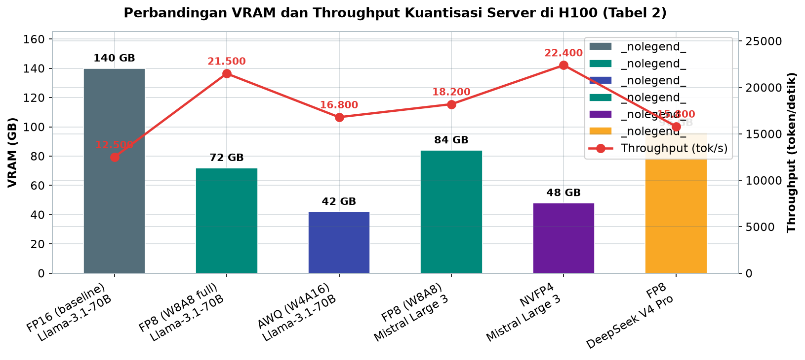
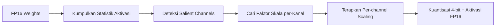
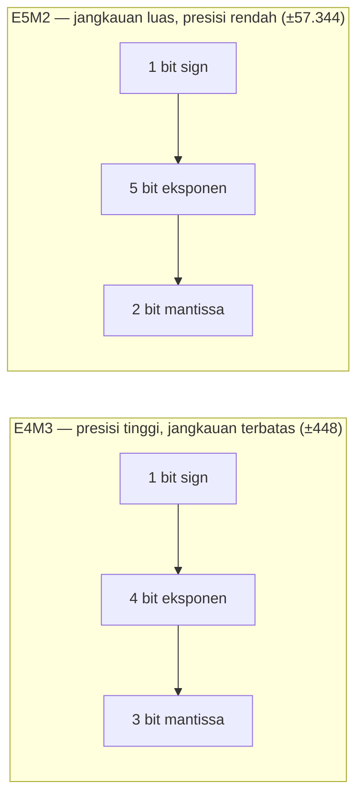
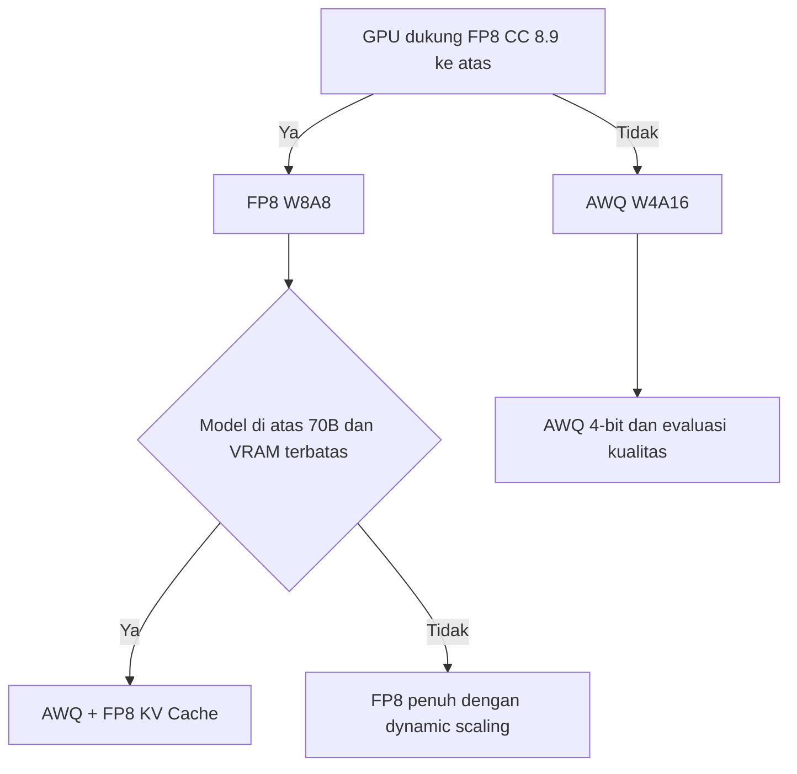

# Bab 5.5: Quantization for Servers

> Di laptop pribadi, kuantisasi 4-bit adalah soal kebahagiaan: model muat di VRAM, respons cukup cepat, dan kualitas yang sedikit berkurang bisa dimaafkan. Di server yang harus hidup 24/7 melayani ribuan permintaan, aturannya berubah total — yang paling berharga bukan kompresi maksimal, melainkan stabilitas tanpa akhir.

---

## 1. Tujuan Sub-Bab


Setelah membaca sub-bab ini, Anda akan mampu:

- Membedakan AWQ (kuantisasi *weight-only* 4-bit, W4A16) dan FP8 (kuantisasi *weight+activation* 8-bit, W8A8), termasuk dua varian format FP8 yaitu E4M3 dan E5M2
- Menimbang trade-off stabilitas, *throughput*, dan kualitas hasil untuk beban kerja server 24/7
- Memilih metode kuantisasi berdasarkan perangkat keras yang dimiliki, ukuran model, dan SLO (*service level objective*) yang dikontrakkan ke bisnis
- Menjalankan kuantisasi AWQ, FP8 *online*, dan NVFP4, serta memvalidasi kualitas pasca-kuantisasi dengan `lm-eval`

---

## 2. Mengapa Kuantisasi Server Berbeda?


### Stabilitas di Atas Throughput Puncak

Saat Anda mengkuantisasi model untuk laptop, tolok ukur keberhasilannya sederhana: apakah masih menjawab dengan baik dan cukup cepat? Di server produksi, kompleksitasnya meningkat dua lapis. **Lapisan pertama:** server melayani ribuan permintaan per hari, sehingga kebutuhan memori, latensi, dan *throughput* harus dihitung untuk kondisi puncak, bukan kondisi santai. **Lapisan kedua — dan ini yang membedakan server dari sekadar workstation:** performa tidak boleh *berdegradasi secara progresif* seiring waktu. Sebuah beban kerja 24/7 tidak bisa menerima model yang kualitasnya menurun di hari ketiga, melonjak di hari kelima, lalu melayang di hari ketujuh. Di server, **stabilitas > puncak**.

Filosofi ini mengubah cara memilih metode kuantisasi. Metode yang kompresinya paling agresif belum tentu yang terbaik; yang kompresinya "cukup" tetapi perilakunya deterministik sejak menit pertama hingga bulan berikutnya justru lebih bernilai. Inilah alasan mengapa diskusi di sub-bab ini tidak berhenti pada "mana yang lebih kecil", melainkan berlanjut ke "mana yang lebih stabil ketika dibiarkan hidup seminggu penuh".

Analogi yang sering dipakai: memilih format kuantisasi server itu seperti memilih mesin untuk generator listrik rumah sakit. Di garasi pribadi, mesin sekecil apa pun yang bisa menghidupkan TV sudah cukup; di rumah sakit, yang dicari adalah mesin yang bisa dinyalakan kapan pun, berputar stabil berhari-hari, dan tidak mengagetkan dengan mati mendadak — meskipun sedikit lebih besar dan lebih mahal. Kualitas "tidak mengagetkan" itulah yang menjadi bintang di sub-bab ini.

### Dua Dunia: Hardware-Native vs Kompatibilitas Luas

Perbedaan kedua yang membentuk peta keputusan: **dukungan perangkat keras**. FP8 adalah format yang *hardware-native* di GPU generasi Hopper dan Ada Lovelace (H100, RTX 4090, compute capability ≥ 8.9) — operasi matriks dilakukan langsung dalam FP8 di *hardware tensor core*, sehingga percepatannya nyata, bukan sekadar hemat memori. AWQ, sebaliknya, adalah kuantisasi *weight-only* 4-bit dengan *activation* tetap FP16 (W4A16): matriks di-dequantisasi ke FP16 saat dihitung, sehingga berjalan di hampir semua GPU modern termasuk Ampere (A100, RTX 3090) dan Turing (RTX 2080, compute capability 7.5). Dua dunia ini berbeda semesta masuknya: yang satu butuh GPU baru, yang lain bisa memakai yang sudah ada.

Konsekuensi dari pembagian ini menyentuh keputusan operasional harian. Tim yang mengelola server lama (A100, RTX 3090) akan menghabiskan sebagian besar energinya di *calibration*: menyiapkan dataset, membandingkan *loss*, memantau *drift* — karena mereka hidup di dunia AWQ yang statis. Tim dengan H100 bisa lebih santai: FP8 dinamis mengurangi *calibration overhead*, dan *failure mode*-nya lebih terprediksi. Sebelum memilih format, tanyakan dulu dua hal: GPU apa yang sedang dimiliki, dan seberapa besar energi tim yang siap dialokasikan untuk *monitoring* kualitas jangka panjang. Keputusan format hampir selalu mengikuti jawaban kedua pertanyaan itu, bukan sebaliknya.

Tiga tabel berikut adalah satu kesatuan: Tabel 1 membandingkan karakteristik format di atas kertas, Tabel 2 menunjukkan dampaknya pada performa server nyata di H100, dan Tabel 3 menerjemahkan semuanya menjadi rekomendasi per GPU. Baca berurutan — dari "apa bedanya" menuju "jadi pakai apa" — sebelum menyentuh perintah kuantisasi di bagian praktikum.

### Tabel 1: Perbandingan Metode Kuantisasi

Tabel berikut membandingkan tiga pendekatan — AWQ, FP8, dan NVFP4 (format 4-bit floating point NVIDIA) — pada dimensi yang paling relevan untuk server:

| Aspek | AWQ (W4A16) | FP8 (W8A8) | NVFP4 (W4A8) |
|:---|:---:|:---:|:---:|
| **Bit-width Weight** | 4-bit integer | 8-bit float (E4M3/E5M2) | 4-bit float (NVFP4) |
| **Bit-width Activation** | 16-bit float | 8-bit float | 8-bit float |
| **Kompresi Weight** | 4x | 2x | 4x |
| **Percepatan Throughput** | ~1.3x - 1.5x | ~1.6x - 2.0x | ~1.7x - 2.2x |
| **GPU Minimum** | Turing (CC 7.5) | Hopper/Ada (CC 8.9) | Blackwell (CC 10.0) |
| **MMLU Loss (7B)** | ~0.5 - 1.0% | ~0.1 - 0.3% | ~0.4 - 0.8% |
| **HumanEval Loss** | ~1 - 2% | ~0.5 - 1% | ~0.8 - 1.5% |
| **Stabilitas 24/7** | Baik (no drift) | Sangat Baik (native) | Baik |
| **Calibration Data** | 128 samples | Optional (dynamic) | Required |
| **Model Support** | Llama, Qwen, Mistral | Llama, Mistral, DeepSeek | Mistral Large 3 |

Beberapa pola penting terlihat. Pertama, **FP8 adalah yang paling ringan kerusakannya**: *loss* MMLU hanya 0,1-0,3% dan *loss* HumanEval 0,5-1% — hampir tidak terlihat oleh pengguna akhir. AWQ dan NVFP4 memang mengompresi dua kali lebih kuat (4x), tetapi membayar dengan *loss* yang lebih besar — terutama di *HumanEval* (1-2%) yang mengukur kemampuan *coding*, salah satu beban kerja yang paling sensitif terhadap kuantisasi. Kedua, perhatikan kolom *calibration*: AWQ butuh 128 sampel kalibrasi, FP8 bisa dinamis (tanpa kalibrasi), sedangkan NVFP4 *wajib* kalibrasi. Ketiga, **NVFP4** adalah pendatang baru menarik — kompresi 4x dengan *throughput* tertinggi (1.7-2.2x) berkat dukungan asli GPU Blackwell, dan didukung *natively* oleh Mistral Large 3 (rilis Apache 2.0). Namun ketersediaannya masih terbatas: hanya GPU Blackwell dan model tertentu.


### Tabel 2: Benchmark Throughput Server (H100, Model 70B-675B)

Bagaimana angka-angka ini berterjemah ke performa server nyata? Tabel berikut membandingkan enam konfigurasi kuantisasi di GPU H100:

| Quantization | Model | VRAM | Throughput (tok/s) | Batch Size Max | TTFT P50 (ms) |
|:---|:---|:---:|:---:|:---:|:---:|
| FP16 (baseline) | Llama-3.1-70B | 140 GB | 12.500 | 64 | 210 |
| FP8 (W8A8 full) | Llama-3.1-70B | 72 GB | 21.500 | 144 | 128 |
| AWQ (W4A16) | Llama-3.1-70B | 42 GB | 16.800 | 256 | 165 |
| FP8 (W8A8) | Mistral Large 3 (675B) | 84 GB | 18.200 | 128 | 195 |
| NVFP4 | Mistral Large 3 (675B) | 48 GB | 22.400 | 256 | 145 |
| FP8 | DeepSeek V4 Pro (1.6T) | 96 GB | 15.800 | 96 | 240 |



*Gambar 5.5-1 — Peta kuantisasi server di H100: AWQ menjual ruang (42 GB, batch 256), FP8 menjual kecepatan dan responsivitas (21.500 tok/s, TTFT 128 ms), dan NVFP4 memenangkan keduanya untuk Mistral Large 3 — 23% lebih cepat dari FP8 sambil hemat VRAM 43%.*

Perhatikan kontras antara FP8 dan AWQ pada Llama-3.1-70B. AWQ memakai VRAM jauh lebih sedikit (42 GB vs 72 GB) dan *batch size* maksimumnya lebih besar (256 vs 144) — unggul saat ruang memori adalah segalanya. Tetapi FP8 unggul di *throughput* (21.500 vs 16.800 token/detik, sekitar 1,3x lebih cepat) **dan** di TTFT (128 ms vs 165 ms) — unggul di dua dimensi yang dirasakan langsung oleh pengguna. Inilah inti trade-off AWQ vs FP8: AWQ menjual ruang, FP8 menjual kecepatan dan responsivitas. Sementara itu, **NVFP4 menyatukan keduanya** untuk Mistral Large 3: VRAM 48 GB (hampir separuh FP8) namun *throughput* 22.400 token/detik — 23% lebih cepat dari FP8 dan hemat VRAM 43%. DeepSeek V4 Pro menunjukkan satu pelengkap penting: karena KV-cache-nya hanya 10% dari V3.2, konteks 1M token hanya menghabiskan ~3,2 GB VRAM (bandingkan ~32 GB di V3.2) — sehingga model 1,6 triliun parameter total / 49 miliar aktif ini bisa dilayani dengan 96 GB VRAM dalam FP8.


### Gambar 1: Pipeline Kuantisasi AWQ

Berikut alur kerja AWQ dari model FP16 hingga model 4-bit siap *deploy*:



Jalur kiri ke kanan menunjukkan mengapa AWQ disebut *activation-aware*: *activation* dilihat lebih dulu (B) sebelum menentukan bobot mana yang diselamatkan (C). Tidak ada loop *backpropagation* — diagramnya linier, dan itu justru kekuatannya: cepat, deterministik, dan mudah direproduksi. Model output (F) adalah campuran *weight* 4-bit dan *activation* FP16 yang dikenal sebagai W4A16.

Perhatikan bahwa langkah E (per-channel scaling) adalah "trik" utama yang membuat semuanya bekerja tanpa pelatihan ulang: scaling tidak menambah parameter, hanya mengubah skala — dan karena operasi ini dapat dibalik (di-dequantisasi) saat *inference*, model tetap berperilaku hampir sama seperti FP16. Inilah alasan mengapa *quantizer* AWQ yang dibuat sekali bisa dipakai berulang kali di berbagai *task* tanpa perlu *re-calibration* per domain.


---

## 3. AWQ — Activation-aware Weight Quantization


AWQ mewakili satu filsafat dalam kuantisasi: alih-alih memangkas semua bobot secara seragam, kenali mana yang paling menentukan, lalu perlakukan khusus. Filsafat ini lahir dari pengamatan empiris — dan hasilnya menjadi standar de facto untuk kuantisasi 4-bit di dunia open source, dipakai di vLLM, TGI, dan engine utama lainnya.

### Hanya 1% Bobot yang Benar-Benar Penting

AWQ (*Activation-aware Weight Quantization*) lahir dari sebuah observasi yang cermat oleh Lin et al. (2024) — paper yang meraih *best paper* di MLSys 2024 [1]. Tidak semua *weight* dalam jaringan LLM sama pentingnya. Hanya sekitar **1% bobot yang bersifat "salient"** — sangat menentukan terhadap kualitas output karena terus-menerus dilewati dengan *activation* berkisar besar. Jika bobot 1% ini dikuantisasi dengan cara yang sama seperti 99% lainnya, akurasi model akan jeblok. AWQ justru melindungi 1% ini.

### Observasi Aktivasi, Bukan Bobot

Yang membedakan AWQ dari pendekatan sebelumnya adalah cara mengidentifikasi bobot penting: dengan **mengamati distribusi aktivasi**, bukan statistik bobot itu sendiri. AWQ menjalankan beberapa sampel kalibrasi (sekitar 128 sampel teks, misalnya dari *dataset Wikitext*) melalui model FP16 dan mencatat rentang nilai yang melewati setiap kanal. Kanal yang melewati *activation* besar dianggap berdampak besar terhadap hasil; kanal yang jarang dilewati *activation* besar lebih toleran terhadap kesalahan kuantisasi.

### Scaling Tanpa Backpropagation

Kuncinya di sini: AWQ tidak melakukan *backpropagation*, tidak ada *fine-tuning*, dan tidak ada *reconstruction* berbasis gradien seperti metode sebelumnya. Yang dilakukan hanya mencari **faktor skala per-kanal** — mengalikan kanal salient dengan skalar besar sebelum kuantisasi, lalu membagi aktivasi dengan skalar yang sama setelahnya. Operasi ini menjaga bobot penting tetap presisi sekaligus memaksa pembagian rentang kuantisasi yang lebih adil. Karena tidak perlu pelatihan ulang, AWQ mencapai **generalisasi tinggi**: quantizer yang dilatih untuk satu *task* tetap bekerja baik untuk *task* lain, dan prosesnya cepat — selesai dalam hitungan menit hingga jam. Output finalnya adalah **weight 4-bit + activation FP16 (W4A16)**: kompresi bobot 4x dengan kualitas yang dijaga ketat.

Sebagai konteks sejarah: sebelum AWQ, pendekatan dominan adalah **GPTQ** [5] yang menyusun kembali bobot berbasis matriks Hessian — efektif, tetapi sensitif terhadap *outlier* di aktivasi yang tidak bisa dilihat dari statistik bobot saja. AWQ menjawab kelemahan itu dengan mengamati aktivasi secara langsung, dan hasilnya lebih stabil pada model dengan distribusi aktivasi yang tidak merata — situasi yang sangat umum di LLM modern. Bagi praktisi, perbedaan ini berarti satu hal sederhana: AWQ lebih sulit "dikagetkan" oleh data yang tidak terlihat saat kalibrasi.

---

## 4. FP8 — Floating Point 8-bit


Jika AWQ adalah format "pintar tapi harus dijaga", FP8 adalah format "bawaan pabrik". Ia memanfaatkan fakta bahwa GPU modern sudah menghitung dalam FP8 secara *native* — bukan kompresi yang dipaksakan dari luar, melainkan bahasa asli *tensor core*-nya. Konsekuensinya, efisiensinya konsisten di semua lapisan: bobot, aktivasi, bahkan cache.

### E4M3 vs E5M2: Dua Dialek Satu Bahasa

FP8 bukan satu format tunggal, melainkan dua varian dengan pertukaran yang berbeda — distandarisasi dalam paper *FP8 Formats for Deep Learning* oleh Micikevicius et al. (2022) [2]. **E4M3** mengalokasikan 1 bit sign, 4 bit eksponen, dan 3 bit mantissa — presisi tinggi (mendekati FP16) tetapi jangkauan nilai terbatas (hingga ±448). **E5M2** memakai 1 bit sign, 5 bit eksponen, dan 2 bit mantissa — jangkauan nilai jauh lebih luas (hingga ±57.344, cocok menangkap nilai liar dari *gradient* atau *activation outlier*) tetapi presisinya lebih kasar. Konvensi umum: E4M3 untuk *forward pass* (inference), E5M2 untuk *backward pass* (training) — dua dialek yang saling melengkapi dalam satu bahasa 8-bit.

### W8A8: Dua Kali Hemat, Enam Puluh Persen Lebih Cepat

Dalam mode W8A8, baik *weight* maupun *activation* disimpan dalam FP8. Dampaknya dua arah: kebutuhan memori bobot turun setengah (2x kompresi) dan *throughput* meningkat — pada H100, *throughput* FP8 bisa mencapai sekitar **1.6-2.0x** dibandingkan FP16 karena tensor core Hopper beroperasi dua kali lebih cepat di FP8 dan *bandwidth* memori yang harus dilalui setengahnya. Yang penting: FP8 bukan kuantisasi "statis" yang rentan *drift* — ia bisa memakai kalibrasi dinamis (menghitung skala dari data aktual secara *online*), sehingga tidak lagi bergantung pada *calibration dataset* yang bisa usang seiring perubahan pola penggunaan. Inilah dasar klaim stabilitasnya untuk beban 24/7.

Satu catatan penting bagi yang masih ragu: FP8 bukan "FP16 yang dipotong sembarangan". Desainnya memakai *scaling* cerdas — nilai-nilai besar dinormalisasi ke rentang E4M3 sebelum dihitung, lalu hasilnya diskalakan kembali — sehingga *overflow* dan *underflow* (dua musuh kuantisasi titik-mengambang) bisa ditekan. Teknik *migration quantization difficulty* dari aktivasi ke bobot yang dipelopori **SmoothQuant** [4] menjadi dasar mengapa kuantisasi 8-bit *weight+activation* bisa mempertahankan kualitas setinggi ini: masalah *outlier* di aktivasi diserap oleh bobot yang lebih sabar terhadap skala.

### FP8 untuk KV Cache

Satu tambahan menarik: FP8 juga bisa diterapkan pada **KV-cache**, bukan hanya *weight*. KV-cache adalah memori yang tumbuh seiring panjang konteks dan jumlah request dalam batch (lihat Bab 5.2). Dengan FP8 KV cache, kebutuhan memorinya turun **hingga 50%**, sehingga server bisa menampung batch lebih besar atau konteks lebih panjang dalam GPU yang sama. Syaratnya: GPU harus punya dukungan FP8 *compute* (compute capability ≥ 8.9) — pengguna A100 dan RTX 3090 tidak bisa memanfaatkan jalur ini.

Perpaduan FP8 W8A8 + FP8 KV-cache inilah kombinasi "FP8 penuh" yang paling sering dipakai server produksi: bobot hemat setengah, cache hemat setengah, dan keduanya dihitung dalam satu bahasa perangkat keras yang sama. Efek domino kedua penghematan ini terlihat langsung pada *batch size maksimum* dan TTFT (Tabel 2) — ruang memori yang tersisa dipakai untuk melayani lebih banyak request, bukan untuk menyimpan angka yang tidak berguna.

---

## 5. AWQ vs FP8: Dua Jalur, Satu Tujuan


Perbandingan ringkas: **AWQ menang di kompresi dan kompatibilitas** — kompresi 4x (berbanding 2x FP8), berjalan di GPU Turing/Ampere lama, dan kualitas rata-rata lebih baik di model kecil karena *weight* krusialnya dirawat dengan *scaling*. **FP8 menang di throughput dan stabilitas** — kecepatan asli H100/Ada, *calibration overhead* minimal, dan perilaku jangka panjang yang lebih deterministik berkat *scaling* dinamis. Untuk model kecil di GPU lama, AWQ adalah pemenang; untuk model menengah-besar di GPU Hopper yang harus hidup 24/7, FP8 lebih masuk akal. Data kuantitatifnya dirangkum di Tabel 1 dan 2.

Ada satu dimensi yang sering terlewat dalam perdebatan "AWQ vs FP8": **biaya total kepemilikan**. AWQ memungkinkan model besar berjalan di GPU generasi sebelumnya, yang harganya kini jauh lebih murah di pasar bekas — jalur hemat yang sangat menarik bagi perusahaan dengan anggaran terbatas. FP8 menuntut investasi GPU baru tetapi membuka kapasitas yang jauh lebih besar: *throughput* lebih tinggi berarti lebih sedikit GPU untuk melayani beban yang sama, dan TTFT yang lebih rendah berarti SLO yang lebih ketat bisa dikontrakkan ke bisnis. Kedua angka itu — harga GPU bekas versus kapasitas tambahan — harus dihitung dalam mata uang yang sama sebelum memutuskan.

Yang tidak kalah penting: batas kualitas di tengahnya. Untuk model di bawah 13B, AWQ (MMLU *loss* 0,5-1,0%) biasanya masih nyaman; untuk model 30B ke atas, *loss* absolutnya bisa terlihat lebih besar pada *task* sensitif seperti *coding* (HumanEval *loss* 1-2%). Jika tim Anda tidak memiliki kapasitas *monitoring* kualitas harian, pilihan paling aman adalah FP8 — di mana margin kesalahannya sangat kecil sehingga *drift* hampir tidak mungkin terlihat oleh pengguna akhir.

### Gambar 2: Dua Format FP8 — E4M3 vs E5M2



Bandingkan dua baris bit di atas: E4M3 mengorbankan *range* demi 3 bit mantissa (presisi tinggi) — ideal untuk *forward pass*/inference; E5M2 mengorbankan presisi demi 5 bit eksponen (jangkauan hingga ±57.344) — ideal menangkap *outlier* dan *gradient* saat training. Keduanya tetap satu format 8-bit; pertukarannya terjadi di dalam 8 bit yang sama.

Implikasinya bagi server: dalam *inference*, gunakan **E4M3** untuk bobot dan aktivasi. Jika suatu *activation* di salah satu lapisan ternyata melebihi ±448 (langka, tetapi bisa terjadi pada beberapa model), angka itu akan dipotong (*clamped*) — dan di sinilah *scaling* dinamis FP8 berperan menyelamatkan: skala dihitung dari nilai maksimum aktual, sehingga hampir tidak ada nilai yang benar-benar *clamped*. Inilah alasan teknise mengapa FP8 jarang menunjukkan *drift* signifikan pada beban nyata.


---

## 6. Strategi Hybrid: Menggabungkan yang Terbaik


Keputusan tidak harus hitam-putih. Strategi campuran biasa dipakai di lapangan: **AWQ untuk model > 70B** yang harus muat di VRAM terbatas (kompresi 4x sangat bernilai), dan **FP8 untuk model di bawah 70B** di H100 (kompresi 2x sudah cukup, kecepatan lebih penting). Ada pula kombinasi menarik: **AWQ + FP8 KV-cache** — *weight* 4-bit untuk menghemat ruang, cache 8-bit untuk menghemat lalu lintas memori — asalkan GPU mendukung FP8. Panduan umum berdasarkan GPU (Tabel 3): A100/RTX 3090 → AWQ; H100/RTX 4090 → FP8; GPU Blackwell (B200) → NVFP4 untuk model yang mendukungnya. Peta ini akan Anda lihat lengkap pada tabel rekomendasi nanti.

Ingat prinsip paling sederhana dari strategi hybrid: **kompresi membeli ruang, native membeli kecepatan**. Ketika salah satu dari keduanya sudah cukup — model muat dan cepat — format paling sederhana yang memenuhi dua syarat itu adalah yang terbaik. Menumpuk kuantisasi dua lapis (misalnya AWQ + kuantisasi cache + *quantized LoRA*) jarang memberi nilai tambah, tetapi hampir selalu menambah titik kerusakan (*failure point*) baru.

### Tabel 3: Rekomendasi Berdasarkan GPU

Tabel terakhir menyajikan rekomendasi cepat — pilih baris GPU Anda, lalu ikuti kolom format dan model maksimal:

| GPU | VRAM | Format Terbaik | Model Maks | Catatan |
|:---|:---:|:---|:---:|:---|
| H100 (80GB) | 80 GB | FP8 W8A8 | Llama-3.1-70B / Mistral Large 3 | Optimal native FP8 |
| H200 (141GB) | 141 GB | FP8 W8A8 | DeepSeek V4 Pro (49B aktif) | FP8 + KV cache efisien |
| A100 (80GB) | 80 GB | AWQ 4-bit | Llama-3.1-70B | Tidak ada FP8 HW |
| A100 (40GB) | 40 GB | AWQ 4-bit | Qwen-2.5-32B | VRAM terbatas |
| RTX 4090 | 24 GB | AWQ 4-bit / FP8 | Llama-3.1-8B / DeepSeek V4 Flash | FP8 didukung |
| RTX 3090 | 24 GB | AWQ 4-bit | Llama-3.1-8B | FP8 tidak support |
| RTX 6000 (2x) | 48 GB | INT4 | DeepSeek V4 Flash (284B) | Dual GPU untuk MoE |
| L40S | 48 GB | FP8 W8A8 | Qwen-2.5-32B / Mistral Large 3 | Enterprise FP8 |
| B200 (Blackwell) | 192 GB | NVFP4 | Mistral Large 3 (675B) | NVFP4 native optimal |

Bacaan tabel ini menegaskan kembali dua tesis sub-bab ini. Pertama, **perangkat keras menentukan bahasa**: tanpa compute capability ≥ 8.9, FP8 hanyalah teori; A100 dan RTX 3090 yang masih banyak terpakai di perusahaan harus puas dengan AWQ. Kedua, semakin baru GPU, semakin lebar pilihan — H100 membuka FP8, B200 membuka NVFP4. Model MoE dengan parameter aktif kecil seperti DeepSeek V4 Flash (284B total/13B aktif) dan DeepSeek V4 Pro memungkinkan model "raksasa terdengar" berjalan di GPU yang jauh dari kata raksasa — selama orang mau memakai format yang tepat.

Ada satu pola ekonomis yang layak digarisbawahi: **kolom "Model Maks" hampir selalu didikte oleh kuantisasi**. Pada GPU yang sama, memilih AWQ alih-alih FP16 bisa menggandakan ukuran model yang bisa dilayani, dan memilih FP8 alih-alih FP16 hampir menggandakan *throughput* sekaligus. Dengan kata lain, kuantisasi adalah "GPU virtual gratis" — satu-satunya *upgrade* perangkat lunak yang menambah kapasitas tanpa menambah watt. Karena itu, sebelum membeli GPU baru, jalankan dulu simulasi Tabel 2 dengan beban kerja Anda: sering kali keputusan "beli H100" bisa ditunda hanya dengan mengganti format pada GPU yang sudah ada.

Satu hal terakhir: **jadikan kualitas sebagai gerbang, bukan formalitas**. Susun *pipeline* sederhana — kuantisasi, evaluasi (Langkah 4), lalu *canary deploy* selama beberapa hari dengan *monitoring* perplexity — sebelum mempromosikan satu format ke produksi. Kebiasaan ini terdengar berat untuk tim kecil, tetapi justru menyelamatkan dari insiden yang jauh lebih mahal: model yang diam-diam menurun kualitasnya selama berhari-hari, tepat di beban kerja paling kritis perusahaan.

---


### Gambar 3: Keputusan Pemilihan Format

Ketika meng-konfigurasi server baru, alur keputusan praktisnya sebagai berikut:



Cabang kiri (FP8) dan cabang kanan (AWQ) adalah dua dunia yang sudah kita kenal; simpul tengah (D) mengingatkan bahwa gabungan AWQ + FP8 KV-cache adalah opsi sah untuk model sangat besar. Dan di ujung semua cabang, selalu ada langkah terakhir yang tak boleh dilewatkan: **evaluasi kualitas** — tiga format di atas hanya boleh masuk produksi setelah *loss*-nya terukur pada Langkah 4.

Alur ini juga menunjukkan mengapa keputusan kuantisasi sebaiknya diambil *per deployment*, bukan sekali untuk selamanya: GPU baru masuk (H100, B200), model baru rilis, beban kerja berubah — setiap perubahan bisa menggeser cabang yang Anda ambil. Jadikan diagram ini sebagai *decision tree* yang dijalankan ulang setiap kali komponen di atas berubah.

---


---

## 7. Praktikum / Hands-On


Empat langkah berikut membawa Anda dari nol menuju produksi: kuantisasi AWQ yang bisa dijalankan di GPU lama (Langkah 1), FP8 *online* untuk GPU Hopper (Langkah 2), NVFP4 untuk Blackwell (Langkah 3), lalu gerbang terakhir — validasi kualitas (Langkah 4) yang wajib dilewati sebelum *deploy* apa pun.

### Langkah 1: Kuantisasi AWQ dan Deploy

```bash
# Install AutoAWQ
pip install autoawq

# Quantize Llama-3.1-8B ke AWQ 4-bit
python -m awq.quantize --model-path meta-llama/Meta-Llama-3.1-8B-Instruct \
    --quant-path ./models/llama-3.1-8b-awq \
    --calibration-dataset wikitext \
    --quant-config w4a16

# Deploy dengan vLLM
vllm serve ./models/llama-3.1-8b-awq \
    --quantization awq \
    --max-model-len 8192
```

Proses kuantisasi memakan waktu menit hingga jam tergantung ukuran model, dan hasilnya — folder berisi *weight* 4-bit + *scaling factors* — langsung dikenali vLLM dengan flag `--quantization awq`. Perhatikan penggunaan dataset `wikitext` sebagai kalibrasi: sampel teks umum ini adalah pilihan default yang cukup bagi AWQ karena metode ini tidak melatih ulang.

Jika Anda berurusan dengan model yang sangat besar (70B ke atas) dan ingin menjadwalkan kuantisasi di malam hari, bungkus perintah di atas dalam *script* yang bisa dijalankan di *background* server — output AWQ bersifat deterministik untuk input yang sama, sehingga proses yang terputus bisa diulang dengan hasil identik. Simpan *log* kalibrasi beserta versi model untuk melacak dari kuantisasi mana sebuah *artifact* berasal; kebiasaan kecil ini sangat membantu saat *drift* muncul berminggu-minggu kemudian.

### Langkah 2: FP8 Quantization Online dengan vLLM

```bash
# Dynamic FP8 quantization (no calibration needed)
vllm serve meta-llama/Meta-Llama-3.1-8B-Instruct \
    --quantization fp8 \
    --kv-cache-dtype fp8 \
    --gpu-memory-utilization 0.95

# Atau gunakan pre-quantized FP8 dari HuggingFace
vllm serve neuralmagic/Meta-Llama-3.1-8B-Instruct-FP8 \
    --max-model-len 8192
```

Dua baris perintah ini menunjukkan keunggulan FP8 di lapangan: **tanpa kalibrasi**. `--quantization fp8` memicu kuantisasi dinamis pada saat *load*, di mana skala dihitung dari *weight* aktual; `--kv-cache-dtype fp8` memangkas memori cache hingga setengahnya. Alternatif kedua memakai *weight* FP8 siap pakai dari Neural Magic [6] — cukup unduh dan jalankan. Pastikan GPU Anda Hopper/Ada; pada A100 perintah ini akan gagal atau berjalan di *fallback* FP16.

Yang menarik dari jalur *online*: Anda tidak perlu menyimpan artefak kuantisasi terpisah — vLLM menghitung skala di setiap *load* dan menyimpannya dalam memori. Konsekuensinya, perpindahan antar-format menjadi semudah mengganti flag, dan *rollback* ke FP16 cukup dengan menghapus flag. Fleksibilitas ini adalah salah satu alasan FP8 terasa "ringan" secara operasional bagi tim SRE.

Catatan produksi: pada H100, gabungkan opsi di atas dengan `--max-model-len` yang disesuaikan dengan beban Anda dan `--gpu-memory-utilization 0.95` untuk memanfaatkan KV-cache sebesar mungkin. Dengan `--kv-cache-dtype fp8`, konteks total yang bisa ditampung pada H100 80GB nyaris dua kali lipat dibanding FP16 — kombinasi yang membuat model 70B dengan konteks panjang tetap nyaman di satu node. Ukur dengan *load test* (Bab 5.4, Langkah 2) sebelum menetapkan SLO.

### Langkah 3: NVFP4 untuk Mistral Large 3

```bash
# NVFP4 hanya didukung di GPU Blackwell (B200) atau via Aphrodite Engine
# Mistral Large 3 mendukung NVFP4 natively

# Via vLLM (dengan dukungan NVFP4)
vllm serve mistralai/Mistral-Large-3-675B \
    --quantization nvfp4 \
    --kv-cache-dtype fp8 \
    --max-model-len 65536 \
    --tensor-parallel-size 4

# Via Aphrodite (kartu gaming, NVFP4 via custom kernel)
aphrodite run mistralai/Mistral-Large-3-675B \
    --quantization nvfp4 \
    --max-model-len 32768 \
    --tensor-parallel-size 2

# Benchmark throughput vs FP8:
# FP8: 18,200 tok/s (84 GB VRAM)
# NVFP4: 22,400 tok/s (48 GB VRAM) — 23% lebih cepat, 43% lebih hemat VRAM
```

NVFP4 adalah format 4-bit floating point NVIDIA yang memerlukan dukungan *hardware* Blackwell — atau, untuk kartu gaming, *custom kernel* dari engine Aphrodite. Keuntungannya terlihat dari benchmark komentar di atas: lebih cepat 23% dan lebih hemat VRAM 43% dibandingkan FP8 pada model yang sama. Perhatikan bahwa *tensor parallel size* 4 tetap diperlukan — model 675B harus dihamparkan ke 4 GPU apa pun formatnya.

Yang perlu dicatat: meskipun namanya "4-bit", NVFP4 berbeda dari AWQ yang *integer*. NVFP4 menyimpan *weight* dalam floating point 4-bit (dua varian: 1 bit eksponen + 2 bit mantissa, dan 0 eksponen + 3 mantissa), sehingga *range* numeriknya tetap memadai untuk bobot dengan variasi besar — salah satu alasan *loss*-nya (MMLU 0,4-0,8%) lebih rendah dari AWQ pada model yang sama. Namun dukungannya masih terbatas pada model tertentu; cek daftar model yang mendukung NVFP4 sebelum berinvestasi di GPU Blackwell.

### Langkah 4: Validasi Kualitas Pasca-Kuantisasi

```python
# validate_quant.py
from lm_eval import evaluator

models = {
    "FP16": "meta-llama/Meta-Llama-3.1-8B-Instruct",
    "AWQ": "./models/llama-3.1-8b-awq",
    "FP8": "neuralmagic/Meta-Llama-3.1-8B-Instruct-FP8",
}

for name, model in models.items():
    results = evaluator.simple_evaluate(
        model="hf",
        model_args=f"pretrained={model}",
        tasks=["mmlu", "gsm8k"],
        batch_size=8,
    )
    print(f"{name}: MMLU={results['results']['mmlu']['acc']:.3f}, "
          f"GSM8K={results['results']['gsm8k']['acc']:.3f}")
```

Skrip ini membandingkan tiga versi model yang sama — FP16 (baseline), AWQ, dan FP8 — pada dua *task* yang saling melengkapi: MMLU (pengetahuan dunia) dan GSM8K (matematika). Bandingkan hasilnya dengan Tabel 1: perbedaan MMLU sekitar 0,1-1,0% dari FP16 adalah normal; jika *loss*-nya melebihi rentang itu, periksa dataset kalibrasi atau pertimbangkan FP8. Aturan praktis produksi: *loss* MMLU < 1% dan *loss* GSM8K < 2% adalah batas aman untuk beban 24/7 — di atas itu, kualitas yang bisa dikomplain pengguna mulai terasa.

Jangan lupa menyimpan *baseline*: simpan hasil evaluasi FP16 sebagai angka acuan tetap. Seiring waktu, *library* model berubah (tokenizer, *template chat*), dan tanpa *baseline* yang stabil Anda tidak akan tahu apakah penurunan skor berasal dari kuantisasi atau dari perubahan *pipeline* lain. Satu file CSV berisi tanggal, versi model, format, MMLU, dan GSM8K sudah cukup menjadi akar *monitoring* kualitas jangka panjang tim Anda.

---

## 8. Studi Kasus: Perusahaan Fintech — Stabilitas 24/7 Prioritas Utama


**Latar belakang.** Sebuah platform *fintech* mengoperasikan Llama-3.1-70B untuk tugas kritis: menganalisis dokumen transaksi, mengekstrak klausul kontrak, dan meringkas notulen rapat investasi. Konsekuensi kesalahan kecil bukan sekadar jawaban aneh — bisa menjadi keputusan bisnis yang salah. SLO yang dikontrakkan ke manajemen: **uptime 99,9%**, **tidak ada degradasi kualitas**, dan **latensi < 2 detik**.

**Pilihan awal.** Tim infra memiliki dua GPU A100 80GB (total 160 GB VRAM). Model 70B FP16 butuh 140 GB untuk bobot saja, plus KV-cache dan *overhead* — tidak muat. Kuantisasi wajib. A100 tidak mendukung FP8 *hardware* (compute capability 8.0 < 8.9), sehingga pilihan jatuh pada **AWQ 4-bit**: 42 GB untuk bobot, sangat muat di 160 GB, kompatibel penuh. Keputusan ini sejalan dengan Tabel 3 — AWQ adalah format terbaik untuk A100.

**Masalah.** Setelah tiga hari berjalan, tim *monitoring* menangkap sesuatu yang mengganggu: **perplexity drift** terdeteksi pada sebagian dokumen keuangan — terutama yang kaya angka dan istilah terspesialisasi. Skor *certainty* model pada ekstraksi klausul turun perlahan, dan beberapa jawaban mulai kehilangan detail. Tidak ada *crash*, tetapi kualitasnya menggerogoti kepercayaan pengguna internal. Analisis menunjukkan kombinasi dua faktor: kuantisasi *weight-only* 4-bit yang agresif pada bagian sentiment-ekstrim dokumen keuangan, dan *scaling factor* hasil kalibrasi `wikitext` yang kurang mewakili distribusi teks keuangan.

Perlu ditegaskan: ini bukan kegagalan AWQ secara umum — AWQ tetap format terbaik yang tersedia untuk A100 — melainkan pelajaran tentang **kesenjangan domain**: dataset kalibrasi yang ideal harus meniru distribusi data produksi. Tim fintech itu baru menyadarinya setelah *drift* terlihat. Pengalaman ini juga menunjukkan pentingnya *monitoring* kualitas sejak hari pertama, bukan setelah ada keluhan — *drift* yang terjadi selama tiga hari tanpa terdeteksi adalah tiga hari output yang tidak bisa dikoreksi.

**Solusi akhir.** Tim meng-upgrade ke **2x H100 80GB** dan bermigrasi ke **FP8 W8A8** (72 GB untuk bobot — nyaman muat). Tidak hanya *drift* hilang — dengan *scaling* dinamis FP8, tidak ada lagi kalibrasi statis yang bisa usang — tetapi *throughput* naik **1,5x** dibandingkan AWQ (21.500 vs 16.800 token/detik per Tabel 2), dan TTFT P50 turun dari 165 ms ke 128 ms. Latensi tetap jauh di bawah SLO 2 detik bahkan di jam puncak.

**Pelajaran.** Untuk beban kerja 24/7 yang kritis, **FP8 lebih unggul karena stabilitasnya yang lebih tinggi, meskipun kompresinya lebih rendah** (2x vs 4x). Dua faktor penentu tambahan layak dicatat: (1) investasi hardware H100 terbayar karena membuka akses ke FP8 *native*; (2) latensi memori keuangan yang spesifik penting — *calibration set* yang tidak mewakili domain menjadi bom waktu. Jika anggaran belum memungkinkan H100, strategi darurat yang bisa dipertimbangkan adalah AWQ dengan *calibration set* dari data keuangan internal, ditambah *monitoring* perplexity harian (inspirasi: Gambar 3 stabilitas 7 hari) agar *drift* tertangkap sebelum merusak layanan.

**Enam bulan kemudian.** Tim menambahkan dua metrik baru ke *dashboard* mereka: skor GSM8K mingguan pada sampel dokumen transaksi, dan penghitungan *request timeout* per jam. Keduanya dijalankan otomatis setiap Minggu pagi. Saat sebuah *release* baru model tiba, mereka tidak langsung men-deploy; versi FP8 dan versi NVFP4 (setelah menguji satu node B200) dijalankan berdampingan selama seminggu, lalu yang terbaik secara *loss* dan biaya yang dipromosikan. Kebiasaan *evaluate-then-promote* ini, bukan satu pilihan format saja, yang akhirnya menjaga platform fintech tersebut tetap di atas SLO 99,9% mereka.

**Titik akhir yang patut diingat:** kuantisasi server adalah keputusan sistem, bukan keputusan satu file. Format (AWQ/FP8/NVFP4), GPU, model, dan budaya *monitoring* tim bekerja sebagai satu paket — mengubah salah satunya tanpa menyesuaikan yang lain hampir selalu berujung pada insiden. Bacalah sub-bab ini sebagai peta: Tabel 1 dan 2 memberi data, Tabel 3 memberi arah, dan studi kasus fintech memberi gambaran apa yang terjadi ketika keputusan itu keluar keseimbangan. Selamat memilih format — dan selamat membangun *monitoring*-nya sejak hari pertama.

---

## 9. Referensi


### Paper Jurnal/Konferensi

[1] Lin, J., Tang, J., Tang, H., Yang, S., Chen, W.M., Wang, W.C., Xiao, G., Dang, X., Gan, C., & Han, S. (2024). *AWQ: Activation-aware Weight Quantization for LLM Compression and Acceleration*. Proceedings of Machine Learning and Systems (MLSys). DOI: [10.48550/arXiv.2306.00978](https://arxiv.org/abs/2306.00978) — Paper inti AWQ, *best paper* MLSys 2024; sumber data Tabel 1 dan 3.

[2] Micikevicius, P., et al. (2022). *FP8 Formats for Deep Learning*. Advances in Neural Information Processing Systems (NeurIPS). DOI: [10.48550/arXiv.2209.05433](https://arxiv.org/abs/2209.05433) — Standarisasi format FP8 E4M3/E5M2 oleh NVIDIA; fundamental untuk pembahasan format FP8.

[3] Peng, H., et al. (2023). *FP8-LM: Training FP8 Large Language Models*. arXiv: 2310.18313. DOI: [10.48550/arXiv.2310.18313](https://arxiv.org/abs/2310.18313) — Framework FP8 *mixed precision*; relevan untuk implementasi FP8 *inference*.

[4] Xiao, G., Lin, J., Seznec, M., Wu, H., Demouth, J., & Han, S. (2023). *SmoothQuant: Accurate and Efficient Post-Training Quantization for Large Language Models*. International Conference on Machine Learning (ICML). DOI: [10.48550/arXiv.2211.10438](https://arxiv.org/abs/2211.10438) — Teknik memindahkan kesulitan kuantisasi dari *activation* ke *weight*; menjelaskan mengapa FP8 mampu mempertahankan kualitas.

[5] Frantar, E., et al. (2023). *GPTQ: Accurate Post-Training Quantization for Generative Pre-trained Transformers*. International Conference on Learning Representations (ICLR). DOI: [10.48550/arXiv.2210.17323](https://arxiv.org/abs/2210.17323) — *Baseline* perbandingan; fondasi AWQ dan teknik post-training lainnya.

### Referensi Pendukung (Dokumentasi/Repository)

[6] Neural Magic. *FP8 LLMs for vLLM Collection*. [https://huggingface.co/collections/neuralmagic](https://huggingface.co/collections/neuralmagic) — Koleksi model FP8 siap pakai untuk vLLM.

[7] NVIDIA. *FP8 Primer*. [https://docs.nvidia.com/deeplearning/transformer-engine/user-guide/examples/fp8_primer.html](https://docs.nvidia.com/deeplearning/transformer-engine/user-guide/examples/fp8_primer.html) — Panduan resmi format FP8 dan penggunaannya di Transformer Engine.
