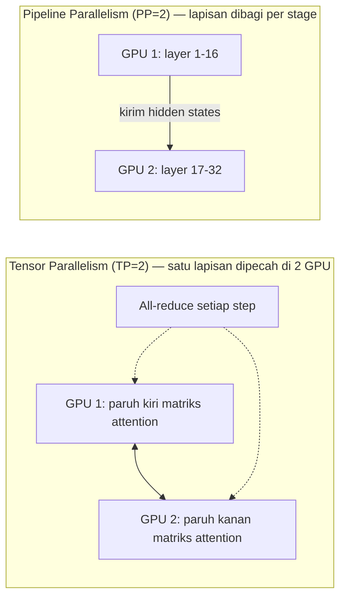
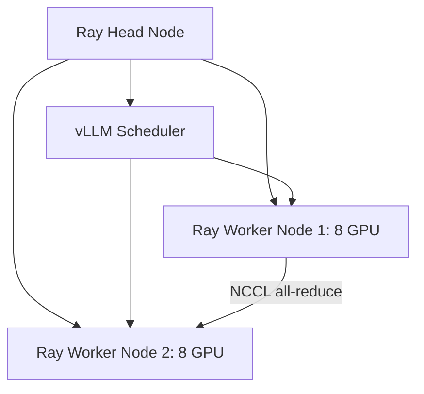

# Bab 5.6: Distributed Inference

> Sebuah lemari buku raksasa tidak bisa masuk ke dalam satu kamar kecil — ia harus dibongkar, dibawa per bagian, lalu dirakit kembali di tempat tujuan. Demikian pula model 405B: tidak muat di satu GPU mana pun, dan satu-satunya jalan adalah memecahnya dengan cerdas ke banyak GPU — bahkan ke banyak komputer sekaligus.

---

## 1. Tujuan Sub-Bab

Setelah membaca sub-bab ini, Anda akan mampu:

- Menjelaskan tiga strategi paralelisme — *tensor parallelism* (TP), *pipeline parallelism* (PP), dan *sequence parallelism* (SP) — beserta kekuatan dan keterbatasan masing-masing
- Menyusun *Ray cluster* multi-node dan menjalankan vLLM di atasnya dengan kombinasi TP dan PP yang tepat
- Mengidentifikasi kapan *SkyPilot* adalah pilihan yang lebih baik untuk *deploy* multi-cloud yang hemat biaya
- Membaca dan membedah *benchmark* efisiensi *scaling* (seperti Tabel 2 pada sub-bab ini) serta memprediksi efek perubahan kombinasi TP/PP pada *throughput*

---

## 2. Mengapa Distributed Inference?

### Memory Wall: Dinding yang Tidak Bisa Dilompati

Setiap GPU — sebesar apa pun — punya batas VRAM. H100 80GB adalah kartu yang sangat mahal, tetapi Llama-3.1-405B dalam FP16 saja membutuhkan **810 GB** — setara 10 buah H100 80GB sekaligus hanya untuk menyimpan bobot, belum termasuk KV-cache dan *overhead* runtime. Ini adalah apa yang disebut **memory wall**: pertumbuhan ukuran model melampaui pertumbuhan VRAM per GPU, dan tidak ada GPU tunggal di pasar yang bisa menampung model kelas 400B ke atas. Jalan keluarnya bukan menunggu GPU yang lebih besar, melainkan mengubah cara berpikir: **satu model, banyak GPU**.

### Jalan Keluar: Memecah, Membagi, Menggabungkan

Prinsip *distributed inference* sederhana: model tidak disalin, melainkan **dipecah** — bobot, lapisan, bahkan satu *sequence* — ke beberapa GPU, dan hasil-hasil parsialnya disatukan saat *forward pass* berjalan. GPU-GPU itu bisa berada di satu komputer (satu *node*, dihubungkan *NVLink*) atau di beberapa komputer (multi-*node*, dihubungkan Ethernet atau InfiniBand). Konsekuensi langsungnya: *bandwidth* antar-GPU menjadi mata uang kedua yang setara pentingnya dengan VRAM. Semakin sering GPU harus "berbicara" satu sama lain, semakin menentukan kualitas jaringan antar-GPU — dan inilah yang membedakan strategi paralelisme yang satu dari yang lain.

Perbedaan mendasar lain yang perlu dipahami sejak awal: *memori* terpecah, tetapi *perilaku* tetap satu model. Setiap GPU hanya memegang potongan bobot, tetapi semua GPU bekerja sama menghasilkan satu respons koheren — bukan enam belas respons parsial. Karena itu, setiap GPU yang mati atau lambat berdampak pada seluruh pipeline, dan *redundancy* bukan bagian dari desain dasar; inilah mengapa lapisan *orchestration* (Ray) dan *monitoring* (NCCL) bukan opsional, melainkan bagian tak terpisahkan dari strategi ini.

Satu pengecualian penting untuk pola "dipecah": **Cloud API**. Model seperti GPT-5.5 tidak pernah dibuka untuk dijalankan sendiri — satu-satunya cara menjangkaunya adalah memanggil API. Bagi sebagian besar tim, pertanyaan nyatanya bukan "bagaimana menjalankan 405B di kluster kami?", melainkan "jalankan sendiri (butuh distributed inference) atau sewa API?" Perhitungan sederhana: jika utilisasi tinggi dan model open-weight, kluster sendiri lebih hemat; jika sporadis atau model eksklusif, API lebih masuk akal. Sub-bab ini akan membekali Anda dengan angka untuk mengambil keputusan itu dengan kepala dingin.

---

## 3. Tensor Parallelism: Satu Lapisan, Dua Belah

### Memecah Matriks per Dimensi

**Tensor parallelism (TP)** memecah satu operasi matriks — misalnya proyeksi QKV di lapisan attention — menjadi potongan baris/kolom yang didistribusikan ke beberapa GPU. Jika TP=4 dijalankan, GPU 1 memegang seperempat matriks bobot, GPU 2 seperempat lainnya, dan seterusnya; setiap GPU menghitung bagiannya, lalu hasilnya digabungkan. Pendekatan ini mengadopsi algoritma yang dipopulerkan **Megatron-LM** [3] dan menjadi tulang punggung *model parallelism* di vLLM.

### All-Reduce Setiap Langkah: Harga yang Mahal tapi Layak

Namun ada biaya tersembunyi: setiap *forward pass* — untuk setiap token pada setiap lapisan — membutuhkan **all-reduce**, yaitu operasi menjumlahkan hasil parsial dari semua GPU yang terlibat dalam TP. Frekuensinya brutal: model 70B dengan 80 lapisan dan konteks 4096 token melakukan ribuan all-reduce per respons. Komunikasi antar-GPU ini berjalan di atas **NCCL** — pustaka NVIDIA — yang kinerjanya sangat bergantung pada kecepatan *interconnect*: **NVLink** (cepat, dalam satu node) > **PCIe** (sedang) > **Ethernet** (lambat). Karena itulah TP paling efektif dalam satu *node* yang dihubungkan NVLink; menerapkan TP besar *lintas-node* di jaringan Ethernet akan membuat GPU sibuk menunggu data, bukan menghitung.

Keuntungan TP yang jarang disebut: *bubble overhead*-nya **nol** — tidak ada GPU yang menganggur menunggu GPU lain dalam pola sinkronis, karena semua GPU mengerjakan lapisan yang sama pada waktu yang sama. *Latency* per token pun turun hampir linier terhadap jumlah GPU (sampai komunikasi mulai mendominasi), membuat TP unggul untuk beban kerja yang sensitif latensi seperti chat interaktif. Penghematan memorinya juga adil: setiap GPU hanya menyimpan 1/N bobot model — tidak ada duplikasi — sehingga model 70B yang biasanya 140 GB FP16 hanya butuh 17,5 GB per GPU saat TP=8 (Tabel 3).

---

## 4. Pipeline Parallelism: Estafet Lapisan

### Membagi Lapisan Menjadi Stage

Jika TP memecah *dalam* satu lapisan, **pipeline parallelism (PP)** memecah *antar* lapisan: GPU 1 mengerjakan layer 1-16, GPU 2 layer 17-32 — seperti estafet, hanya satu tim yang membawa tongkat pada satu waktu. Komunikasi antar-GPU hanya terjadi di *batas stage* (sekali per batch), bukan setiap token, sehingga kebutuhan *interconnect* jauh lebih rendah: Ethernet antar-node pun masih layak. Ini membuat PP menjadi pilihan alami saat model tersebar di beberapa komputer.

### Bubble Overhead dan Micro-Batching

Harga dari PP adalah **bubble overhead**: GPU di stage belakang menganggur menunggu stage depan selesai memproses batch pertama, dan sebaliknya — GPU di stage depan menganggur di akhir giliran. Idle ini bisa mencapai **10-30%** dari waktu total tergantung jumlah micro-batch. Solusi standarnya adalah **micro-batching**: satu batch besar dipecah menjadi micro-batch kecil, dan skedul **1F1B** (*one forward, one backward* — atau untuk *inference*: satu micro-batch maju, satu micro-batch baru masuk) menjaga semua stage tetap sibuk secara bergiliran. Semakin banyak micro-batch, semakin kecil bubble — tetapi semakin banyak juga sedikit overhead tambahan per *switch*. Pedoman praktis: **PP lebih unggul daripada TP ketika *interconnect* antar-node lambat**; TP lebih unggul dalam satu node ber-NVLink.

Ada dua konsekuensi PP yang sering mengejutkan praktisi. Pertama, *latency* per request justru naik — sebuah request harus melewati semua stage secara berurutan, sehingga pengeluaran respon pertama sedikit lebih lambat dibandingkan TP murni; kompensasinya ada di *throughput* total yang tetap tinggi karena banyak request mengalir bersamaan melalui pipeline. Kedua, memori per GPU tetap terbagi adil (1/N bobot), tetapi *utilisasi* satu GPU tidak selalu penuh — pada detik tertentu ia sedang menunggu. Bagi tim dengan jaringan antar-node terbatas, trade-off ini hampir selalu sepadan: sedikit latensi ekstra demi *throughput* yang hanya mungkin diraih dengan PP.

---

## 5. Sequence Parallelism: Membelah Konteks Panjang

Strategi ketiga, **sequence parallelism (SP)** , bekerja pada dimensi yang berbeda: bukan bobot dan bukan lapisan, melainkan **satu *sequence* panjang yang dipecah menjadi beberapa bagian** — setiap GPU memegang potongan token yang berbeda. Idenya: untuk konteks 128K+ token, KV-cache dan komputasi attention sebuah sequence tunggal bisa meledakkan satu GPU; dengan SP, potongan-potongan itu tersebar sehingga masing-masing GPU hanya mengelola sebagian.

Komunikasi dalam SP memakai pola **ring attention**: setiap GPU mengirim hasil parsial attention-nya ke tetangga berikutnya dalam formasi cincin, hingga semua potongan informasi bertemu. Pola ini *point-to-point* (bukan *broadcast* penuh seperti all-reduce), sehingga beban jaringannya lebih ringan — cukup *RDMA* yang baik. SP paling berguna untuk beban kerja *long-context inference* (128K+ token) yang sering muncul di analisis dokumen dan *agent* dengan riwayat percakapan panjang, dan sering dikombinasikan dengan TP agar bobot dan konteks terbagi sekaligus.

Satu catatan kritis: SP tidak mempercepat generasi token secara ajaib — ia *memungkinkan* hal yang sebelumnya mustahil (konteks yang melampaui kapasitas satu GPU) dengan biaya komunikasi cincin yang relatif ringan. Jika model Anda sudah muat dan konteksnya pendek, SP tidak diperlukan; tetapi begitu konteks panjang menjadi kebutuhan bisnis (ringkasan dokumen raksasa, *codebase* besar), SP adalah satu-satunya strategi yang mengubah "tidak muat" menjadi "muat" pada GPU yang sama.

Pendekatan ringkas untuk mengingat ketiga strategi: **TP membagi lebar lapisan, PP membagi kedalaman model, SP membagi panjang konteks.** Ketiganya memperlakukan dimensi yang berbeda, dan karena dimensi itu saling bebas, kombinasi TP+PP+SP sekaligus sah secara teknis — vLLM dan engine modern mendukungnya. Tinggal pertanyaan skala mana yang lebih dulu menjadi *bottleneck* di beban kerja Anda.

---

## 6. Ray dan SkyPilot: Manajer Kluster dan Kurir Cloud

Distribusi model hanyalah setengah cerita; yang mengelola GPU-GPU itu — menempatkan *worker*, mendeteksi GPU mati, menambah node saat beban naik — adalah lapisan *orchestration*. **Ray** adalah *distributed runtime* yang paling banyak dipakai untuk ini: ia menjaga daftar GPU di semua node, menangani *fault tolerance* (jika satu node mati, pekerjaan dialihkan), dan mendukung *auto-scaling* (memperbesar/memperkecil jumlah node sesuai beban). vLLM memakai Ray sebagai *backend* eksekusi terdistribusi — perintah `--distributed-executor-backend ray` menyerahkan semua penjadwalan GPU ke Ray.

**SkyPilot**, di sisi lain, adalah lapisan di atasnya: ia mengurus *provisioning* VM dan GPU ke **multi-cloud** (AWS, GCP, Azure), membandingkan harga antar-cloud, dan memilih *region* termurah yang punya kapasitas — lalu menempatkan *Ray cluster* di sana. Bagi tim yang ingin bereksperimen dengan model 400B tanpa menandatangani kontrak server fisik, SkyPilot mengubah *deploy* model raksasa menjadi satu perintah `sky launch`. Ray dan SkyPilot tidak bersaing — mereka bertumpuk: SkyPilot menyediakan mesin, Ray menjalankannya.

Kapan memilih yang mana? Jika GPU sudah dimiliki (server lokal, *on-premise*, atau kontrak sewa jangka panjang), cukup Ray. Jika kebutuhan *burst* — sesekali butuh 16x H100 untuk eksperimen, lalu tidak lagi — SkyPilot lebih masuk akal: bayar per jam, hapus kluster saat selesai, dan hindari modal besar. Faktor pembeda terakhir adalah *fault tolerance* dan otomatisasi: Ray menangani *crash recovery* di dalam kluster; SkyPilot menangani *provisioning* ulang node yang gagal dibuat oleh cloud provider. Tim yang sehat biasanya memiliki keduanya: Ray untuk produksi harian, SkyPilot untuk eksperimen dan *capacity burst*.

---

## 7. Tabel Wajib: Data Perbandingan dan Benchmark

### Tabel 1: Perbandingan Strategi Parallelism

Tabel berikut merangkum perbedaan tiga strategi pada delapan dimensi yang menentukan keputusan arsitektur:

| Aspek | Tensor Parallelism (TP) | Pipeline Parallelism (PP) | Sequence Parallelism (SP) |
|:---|:---:|:---:|:---:|
| **Granularitas** | Per-layer/operasi | Per-layer group | Per-sequence chunk |
| **Komunikasi** | All-reduce (setiap step) | Point-to-point (batch boundary) | Ring attention |
| **Interconnect Need** | Sangat Tinggi (NVLink) | Rendah (Ethernet OK) | Sedang (RDMA baik) |
| **Bubble Overhead** | 0% | ~10-30% (tergantung micro-batch) | 0% |
| **Efektif dalam 1 Node** | Ya (NVLink) | Tidak perlu | Ya |
| **Efektif Multi-Node** | Kurang (bottleneck network) | Ya | Ya |
| **Memory Reduction** | ~1/N per GPU | ~1/N per GPU | ~1/N untuk KV cache |

Bacaan kunci tabel ini: TP dan PP bekerja pada dimensi yang saling melengkapi, sehingga kombinasi keduanya (TP dalam node + PP antar node) adalah pola paling umum di lapangan. TP memangkas latensi tiap lapisan dengan paralelisme internal tetapi "haus" *bandwidth*; PP memangkas beban jaringan dengan estafet tetapi membayar *bubble*. SP berdiri di dimensi ketiga — tidak mengurangi bobot, hanya membagi KV-cache dan komputasi attention untuk konteks panjang. Tidak ada satu strategi yang menang semua; arsitektur nyata hampir selalu campuran.

Cara membaca cepat tabel ini: periksa dua kolom paling kiri dan paling kanan. Jika *interconnect* Anda NVLink (kiri), condong ke TP (kanan: "Ya"); jika Ethernet, condong ke PP. Jika beban kerja Anda konteks pendek, SP tidak relevan; jika konteks 128K+, SP menjadi persyaratan, bukan pilihan. Kombinasi paling umum di produksi adalah TP + PP; SP ditambahkan hanya ketika dimensi konteks menjadi *bottleneck* utama.

### Tabel 2: Benchmark Distributed — Llama-3.1-405B

Berikut dampak kombinasi TP/PP pada *throughput* dan efisiensi, diukur atas Llama-3.1-405B dengan H100:

| Konfigurasi | Total GPUs | TP | PP | Throughput (tok/s) | Speedup Efficiency |
|:---|:---:|:---:|:---:|:---:|:---:|
| 8x H100 (1 node) | 8 | 8 | 1 | 4.200 | 100% |
| 16x H100 (2 node, NVLink) | 16 | 8 | 2 | 7.800 | 93% |
| 16x H100 (2 node, Ethernet) | 16 | 4 | 4 | 6.200 | 74% |
| 32x H100 (4 node, Ethernet) | 32 | 4 | 8 | 11.500 | 68% |
| 64x H100 (8 node, Ethernet) | 64 | 4 | 16 | 18.000 | 54% |

Tidak ada baris dalam tabel ini yang memberikan 8x lipat *throughput* saat GPU dikalikan 8x — dan itu memang mustahil. Perhatikan dua pelajaran. **Pertama, *interconnect* adalah segalanya**: 16 GPU terhubung NVLink lintas node mencapai efisiensi 93%, sementara konfigurasi yang sama dengan Ethernet anjlok ke 74%. **Kedua, *diminishing returns* tak terhindarkan**: dari 8 GPU ke 16 GPU, *throughput* naik 86%; dari 32 ke 64, hanya naik 57% — efisiensi turun ke 54%. Biaya komunikasi yang tumbuh bersama jumlah GPU akhirnya memakan *speedup* linear. Proyeksi jujur untuk 64 GPU: *throughput* 18.000 token/detik mungkin, tetapi dengan efisiensi hanya sedikit di atas setengah.

Bagi perencana, tabel ini berfungsi sebagai *kalkulator cepat*: jika *throughput* target Anda 10.000 token/detik, 32 GPU Ethernet sudah mencukupi (11.500 tok/s), sedangkan 16 GPU NVLink (7.800 tok/s) belum. Selisihnya adalah perbedaan dua kali lipat biaya *hardware* — dan sering kali, jawabannya bukan membeli GPU lebih banyak, melainkan menutup *gap* jaringan dengan InfiniBand atau NVLink antar-node, yang menggeser Anda dari baris 74% ke baris 93%.

### Tabel 3: Estimasi VRAM Model Terdistribusi

Tabel terakhir memperlihatkan kebutuhan memori per GPU dari tujuh model dengan konfigurasi berbeda:

| Model | FP16 Total | TP=8 (1 node) | TP=4, PP=2 | Rekomendasi Node |
|:---|:---:|:---:|:---:|:---|
| Llama-3.1-70B | 140 GB | 17.5 GB/GPU | 35 GB/GPU | 1 node (8x H100) |
| Llama-3.1-405B | 810 GB | 101 GB/GPU | 202 GB/GPU | 2+ node (16x H100) |
| Mixtral-8x22B | 280 GB | 35 GB/GPU | 70 GB/GPU | 1 node (8x H100) |
| DeepSeek-V3 | 671 GB (FP8) | 84 GB/GPU | 168 GB/GPU | 1 node (8x H100) |
| DeepSeek V4 Pro (1.6T MoE) | 320 GB (FP8) | 40 GB/GPU | 80 GB/GPU | 1 node (8x H100) |
| Mistral Large 3 (675B MoE) | 168 GB (FP8) | 21 GB/GPU | 42 GB/GPU | 1 node (8x H100) |
| GPT-5.5 | - | Proprietary | - | Cloud API |

Tiga pola terlihat jelas. **Pertama**, model MoE modern mengejutkan ramahnya: meskipun DeepSeek V4 Pro berjumlah 1,6T parameter total, hanya 49B yang aktif per token — dan dalam FP8 seluruh model hanya 320 GB, sehingga 8x H100 dengan TP=8 hanya membutuhkan 40 GB/GPU. Mistral Large 3 (675B total / 41B aktif) bahkan lebih efisien: 21 GB/GPU. **Kedua**, KV-cache hemat juga ikut bermain: DeepSeek V4 Pro hanya memerlukan 10% KV-cache generasi V3.2 berkat hybrid CSA/HCA attention, sehingga sisa VRAM bisa dipakai untuk konteks panjang atau batch besar. **Ketiga**, model dense tetap menjadi raksasa sejati — 405B membutuhkan 2+ node bahkan setelah dibagi TP=8 (101 GB/GPU melebihi H100 80GB), dan GPT-5.5 menutup jendela dengan tetap proprietari: tidak ada cara lain selain *cloud API*.

Cara praktis memakai tabel ini: cari baris model Anda, jumlahkan kebutuhan per GPU dengan alokasi KV-cache yang direncanakan, lalu cocokkan dengan VRAM GPU yang dimiliki. Angka-angka di kolom "TP=4, PP=2" juga menunjukkan mengapa kombinasi itu populer: untuk Llama-3.1-405B kebutuhan 202 GB/GPU jelas mengharuskan H100 80GB×3 — sehingga jarang dipilih, sementara TP=8 membawanya masuk ke ambang 2 node H100.

---

## 8. Diagram & Visualisasi

### Gambar 1: Tensor Parallelism vs Pipeline Parallelism



Dua sub-bab sebelumnya direpresentasikan di sini sekaligus. Di atas: TP memecah matriks satu lapisan menjadi dua bagian yang dikerjakan paralel, lalu disatukan lewat *all-reduce* (garis putus-putus) setiap *step*. Di bawah: PP membagi *stage* lapisan — GPU 1 selesai mengerjakan layer 1-16, hasilnya dikirim ke GPU 2 untuk layer 17-32, sekali per *batch boundary*, tanpa hiruk-pikuk komunikasi per token. Inilah mengapa TP butuh NVLink (sering bicara), sementara PP cukup Ethernet (jarang bicara).

### Gambar 2: Arsitektur Ray Cluster untuk vLLM Multi-Node



Kepala (*head*) Ray mengelola dua *worker*, masing-masing memegang 8 GPU; vLLM *scheduler* berjalan di *head* dan membagi request ke *worker* sesuai strategi TP/PP. Komunikasi antar-GPU lintas node ditangani NCCL (panah bawah) — jalur yang pantauannya justru paling menentukan (Langkah 3 praktikum). Jika satu *worker* mati, Ray mendeteksi dan mengalihkan beban, sementara vLLM tetap melayani dengan GPU yang tersisa.

### Gambar 3: Efisiensi Scaling — Diminishing Returns


Visualisasi paling jujur dari Tabel 2: setiap penggandaan jumlah GPU menurunkan efisiensi *scaling* — dari 100% (definisi *baseline*) turun ke 93%, 68%, lalu 54%. Kurva imajiner yang menghubungkan titik-titik ini memberi pesan penting bagi *capacity planning*: GPU ke-17 hingga ke-64 memberikan *throughput* tambahan yang semakin mengecil per GPU-nya. Keputusan "tambah 8 GPU" harus selalu dilewatkan melalui perhitungan biaya-per-token-detik, bukan sekadar perasaan "makin banyak makin cepat".

Kesimpulan praktis dari ketiga diagram ini: **pahami dulu jalur komunikasi Anda, baru pilih strategi**. Gambar 1 menunjukkan *di mana* data bergerak (dalam lapisan vs antar stage), Gambar 2 menunjukkan *siapa* yang mengatur pergerakan itu (Ray + NCCL), dan Gambar 3 menunjukkan *berapa biaya* pergerakan itu dalam efisiensi. Insinyur yang membaca ketiganya sebelum mengkonfigurasi kluster akan menghemat berjam-jam *troubleshooting* di kemudian hari.

---

## 9. Praktikum / Hands-On

### Langkah 1: Multi-Node vLLM dengan Ray

```bash
# Install Ray dan vLLM di semua node
pip install ray vllm

# Node 1 (Head)
ray start --head --port=6379 --num-gpus=8

# Node 2 (Worker)
ray start --address=<HEAD_NODE_IP>:6379 --num-gpus=8

# Jalankan vLLM di head node dengan TP=4, PP=2
vllm serve meta-llama/Meta-Llama-3.1-405B-Instruct \
    --tensor-parallel-size 4 \
    --pipeline-parallel-size 2 \
    --distributed-executor-backend ray \
    --max-model-len 4096

# Verifikasi cluster
ray status
# Seharusnya menampilkan 16 GPU total
```

Urutan eksekusi penting: *head* dulu (ia menunggu), lalu *worker* bergabung dengan alamat *head*. Kombinasi TP=4 × PP=2 berarti empat GPU dalam satu node berbagi tensor, dua grup lagi berestafet antar stage — pola "TP di dalam node, PP di luar node" yang diulas di Tabel 1. `ray status` adalah langkah verifikasi wajib: jika hanya 8 GPU yang tampil, satu node belum bergabung dan vLLM akan gagal saat distribusi dimulai.

Jika salah satu GPU gagal digunakan (misalnya GPU 3 di node 2), Ray akan menandainya dan vLLM menolak memulai dengan jumlah GPU yang tidak sesuai (`16 GPU didapat, 8 diminta`). Untuk kesetaraan, pastikan semua node menjalankan versi driver CUDA dan vLLM yang identik — perbedaan versi adalah penyebab paling umum kegagalan kluster yang gejalanya aneh-aneh. Catat IP dan port *head* di tempat yang aman; `ray start --address=<IP>:6379` adalah baris yang akan diulang setiap kali node reboot.

### Langkah 2: Deploy Multi-Cloud dengan SkyPilot

```yaml
# skypilot.yaml
name: distributed-vllm
resources:
  accelerators: H100:8
  cloud: gcp

num_nodes: 2

setup: |
  pip install vllm ray

run: |
  if [ $SKYPILOT_NODE_RANK == 0 ]; then
    ray start --head --port=6379 --num-gpus=8
    vllm serve meta-llama/Meta-Llama-3.1-405B-Instruct \
        --tensor-parallel-size 4 \
        --pipeline-parallel-size 2 \
        --distributed-executor-backend ray
  else
    ray start --address=$SKYPILOT_NODE_IP:6379 --num-gpus=8
    sleep infinity
  fi
```

```bash
# Deploy ke cloud
sky launch -c mycluster skypilot.yaml

# Scale down saat tidak dipakai
sky down mycluster
```

Dengan SkyPilot, seluruh cerita Ray tadi dikemas menjadi satu file YAML: `accelerators: H100:8` meminta dua node berisi 8x H100 di GCP; `num_nodes: 2` mengatur jumlahnya; dan blok `run` meniru Langkah 1 — node dengan *rank* 0 menjadi *head*, node lain menjadi *worker* yang menunggu. SkyPilot mengelola pemilihan region, *billing*, dan *cleanup*: satu perintah `sky down` mengakhiri seluruh kluster dan menghentikan biaya. Ini adalah jalur paling murah untuk "menyewa" Llama-3.1-405B selama beberapa jam.

Perhatikan penggunaan variabel lingkungan SkyPilot: `SKYPILOT_NODE_RANK` memberitahu setiap node posisinya, dan `SKYPILOT_NODE_IP` memberi alamat *head* ke node lain — dua variabel ini menghilangkan kebutuhan hardcode alamat IP yang rapuh. Jika kapasitas H100 di GCP sedang penuh, SkyPilot secara otomatis mencoba *region* atau *cloud* lain yang memenuhi spesifikasi — sebuah kemampuan yang sulit ditiru dengan skrip manual.

### Langkah 3: Monitor Komunikasi NCCL

```bash
# NCCL debug untuk troubleshooting bottleneck
export NCCL_DEBUG=INFO
export NCCL_DEBUG_SUBSYS=GRAPH
export NCCL_IB_DISABLE=0  # Enable InfiniBand
export NCCL_SOCKET_IFNAME=eth0  # Interface untuk komunikasi

# Profiling komunikasi
nsys profile -o nccl_trace python -m vllm.entrypoints.openai.api_server \
    --model meta-llama/Meta-Llama-3.1-70B \
    --tensor-parallel-size 8

# Cek NCCL ring latency
python -c "
import torch
import torch.distributed as dist
dist.init_process_group('nccl')
tensor = torch.randn(1024, device='cuda')
# Benchmark all-reduce
start = torch.cuda.Event(enable_timing=True)
end = torch.cuda.Event(enable_timing=True)
start.record()
for _ in range(100):
    dist.all_reduce(tensor)
end.record()
torch.cuda.synchronize()
print(f'All-reduce 100x: {start.elapsed_time(end):.2f} ms')
"
```

Sebuah ironi yang penting diingat: di kluster terdistribusi, waktu tersibuk GPU bukan selalu menghitung — sering kali menunggu. NCCL *debug* memunculkan jalur komunikasi mana yang dipakai; `nsys profile` menghitung berapa lama *throughput* Anda hilang di all-reduce; dan skrip *benchmark* terakhir mengukur biaya latensi satu operasi all-reduce secara langsung. Jika 100x all-reduce memakan waktu mencurigakan (puluhan milidetik), kecepatan *interconnect* — bukan GPU — adalah biang keladinya, dan strategi Anda harus berbelok ke PP yang lebih banyak.

Tiga metrik yang disarankan dicatat di setiap sesi *benchmark*: waktu all-reduce 100x, persentase waktu *sync* dari profil `nsys`, dan *throughput* akhir. Tiga angka ini membentuk semacam "laporan cuaca" kluster Anda — jika throughput turun tanpa penjelasan, bandingkan tiga angka itu dengan catatan sebelumnya; penyimpangan di nomor satu dan dua hampir selalu berarti masalah jaringan, bukan model.

---

## 10. Studi Kasus: Research Lab — Menjalankan DeepSeek-V3 di Cluster 4 Node

Dua studi kasus berikut menutup sub-bab ini dari sisi nyata: yang pertama menguji strategi TP/PP klasik di atas model dense generasi sebelumnya (DeepSeek-V3), yang kedua memperlihatkan bagaimana arsitektur baru (DeepSeek V4 Pro, hybrid CSA/HCA) mengubah perhitungan yang sama. Baca keduanya berurutan — perbedaannya justru yang paling instruktif.

**Latar belakang.** Sebuah laboratorium riset NLP menerima hibah untuk mengeksplorasi DeepSeek-V3 (671B parameter dalam FP8) — model yang di masa lalu "mustahil" dijalankan sendiri. Hardware yang tersedia: 4 node, masing-masing 8x H100 80GB — total 32 GPU. *Interconnect*: InfiniBand 400 Gbps antar-node, NVLink di dalam node — kombinasi yang seimbang antara dua dunia kecepatan.

**Keputusan konfigurasi.** Tim memilih **TP=4 di dalam node, PP=4 antar node**: dalam satu node, 4 GPU bertukar data lewat NVLink yang sangat cepat; antar node, 4 stage berestafet lewat InfiniBand yang lebih lambat namun memadai untuk PP. Pilihan ini mengikuti persis logika Tabel 1 — TP butuh cepat, PP butuh jarang bicara. Beban kerja utamanya *batch* 128 dengan konteks panjang, sehingga kombinasi tersebut terasa tepat.

**Hasil.** Model dimuat dari disk dalam waktu sekitar **15 menit** dan berjalan dengan *throughput* sekitar **12.000 token/detik** untuk *batch* 128. Efisiensi *scaling* terukur **68% dari ideal** — angka yang persis sejajar dengan baris 32x H100 pada Tabel 2. Analisis menunjukkan *bottleneck* ada di komunikasi PP antar-node: *stage* yang sedang menunggu data dari InfiniBand menyumbang *bubble* terbesar. Sebagai titik acuan tim, angka 68% ini juga menjadi *baseline* untuk eksperimen berikutnya — setiap perubahan konfigurasi diukur relatif terhadapnya.

**Optimasi.** Tim mencoba **TP=8 per node + PP=2**: kini satu node penuh berbagi tensor lewat NVLink murni, dan hanya dua *stage* yang berestafet antar node. Efisiensi naik ke **78%** — peningkatan 10 poin persentase tanpa menambah satu GPU pun. Pelajarannya dua lapis: (1) geser keseimbangan sejauh mungkin ke TP selama memori masih muat, karena NVLink mengalahkan InfiniBand; (2) ukur dulu *bottleneck*-nya (Langkah 3, NCCL) sebelum mengubah konfigurasi — perubahan yang sama bisa gagal total bila jaringan antar-node Anda Ethernet, bukan InfiniBand.

---

## 11. Studi Kasus: Deploy DeepSeek V4 Pro Multi-Node dengan KV-Cache 90% Lebih Hemat

**Latar belakang.** Sebuah perusahaan ingin melayani DeepSeek V4 Pro (1,6T parameter total / 49B aktif) untuk **konteks 1 juta token** — beban kerja analisis dokumen korporat yang sangat panjang. Dengan model konvensional, konteks 1M membutuhkan KV-cache raksasa (V3.2: ~32 GB untuk 1M token) dan petak besar VRAM.

**Hardware.** 2 node, masing-masing 8x H200 141GB — total 16 GPU — terhubung NVLink dan InfiniBand. Konfigurasi dipilih: **TP=4 per node, PP=2 antar node** (total TP=8), memanfaatkan dua dimensi paralelisme sekaligus.

**Mengapa ini bisa ekonomis.** DeepSeek V4 Pro membawa tiga keunggulan bersamaan: hybrid CSA/HCA attention menekan KV-cache hingga **hanya 10% dari V3.2** (konteks 1M kini ~3,2 GB), *training FLOPs* hanya **27% dari V3.2** pada konteks 1M, dan MoE 49B aktif membuat *sparse activation* mengurangi frekuensi all-reduce. Kombinasi ini mereduksi dua biaya terbesar distributed inference sekaligus: memori untuk konteks panjang, dan komunikasi untuk sinkronisasi.

**Hasil.** Waktu *loading* model sekitar **8 menit**, dan *throughput* mencapai **15.800 token/detik** untuk *batch* 96. Efisiensi *scaling*: **85% dari ideal** — jauh lebih baik dari V3 karena *sparse MoE* memangkas lalu lintas all-reduce. **Perbandingan penutup:** dengan V3, dibutuhkan kluster 4 node untuk performa setara; V4 Pro hanya butuh 2. Dalam bahasa biaya: setengah GPU, *maintenance* setengahnya, tetapi *throughput* yang sama — itulah arti nyata dari arsitektur yang lahir untuk era *inference*.

**Pelajaran.** Dua hal yang bisa ditiru di tempat lain. Pertama, **ukuran panggung ditentukan KV-cache**: efisiensi cache 10% V3.2 mengubah keputusan arsitektur dari "butuh 4 node" menjadi "cukup 2 node" — evaluasi metrik cache model sebelum menghitung kebutuhan GPU. Kedua, **efisiensi lebih tinggi daripada menambah GPU**: daripada membeli node ekstra, penelitian arsitektur model (CSA/HCA, sparse MoE) menghasilkan penghematan komunikasi yang tidak mungkin dicapai TP/PP mana pun. Insinyur yang baik memilih strategi paralelisme yang tepat — insinyur yang lebih baik memilih model yang sudah dirancang hemat komunikasi sejak awal.

---

## 12. Referensi

### Paper Jurnal/Konferensi

[1] Zheng, L., Li, Z., Zhang, H., Zhuang, Y., Chen, Z., Huang, Y., Wang, Y., Xu, Y., Zhuo, D., Xing, E.P., Gonzalez, J.E., & Stoica, I. (2022). *Alpa: Automating Inter- and Intra-Operator Parallelism for Distributed Deep Learning*. 16th USENIX Symposium on Operating Systems Design and Implementation (OSDI). [https://www.usenix.org/conference/osdi22/presentation/zheng-lianmin](https://www.usenix.org/conference/osdi22/presentation/zheng-lianmin) — Framework otomatis *parallelism* yang mendasari strategi TP/PP di vLLM.

[2] Kwon, W., et al. (2023). *Efficient Memory Management for Large Language Model Serving with PagedAttention*. ACM SIGOPS Symposium on Operating Systems Principles (SOSP). DOI: [10.1145/3600006.3613165](https://doi.org/10.1145/3600006.3613165) — vLLM mendukung eksekusi terdistribusi dengan TP dan PP untuk model besar.

[3] Shoeybi, M., et al. (2019). *Megatron-LM: Training Multi-Billion Parameter Language Models Using Model Parallelism*. Advances in Neural Information Processing Systems (NeurIPS). DOI: [10.48550/arXiv.1909.08053](https://arxiv.org/abs/1909.08053) — Fondasi *tensor parallelism* yang diadopsi vLLM (algoritma Megatron).

[4] Sheng, Y., et al. (2023). *FlexGen: High-Throughput Generative Inference of Large Language Models with a Single GPU*. International Conference on Machine Learning (ICML). DOI: [10.48550/arXiv.2303.06865](https://arxiv.org/abs/2303.06865) — Alternatif *distributed inference*: *offloading* CPU/disk untuk GPU tunggal.

[5] Wan, Z., et al. (2024). *Efficient Large Language Models: A Survey*. arXiv: 2312.03863. DOI: [10.48550/arXiv.2312.03863](https://arxiv.org/abs/2312.03863) — Survey komprehensif teknik *parallelism* dalam ekosistem LLM.

[6] Liu, H., et al. (2023). *Ring Attention with Blockwise Transformers for Near-Infinite Context*. arXiv: 2310.06236. DOI: [10.48550/arXiv.2310.06236](https://arxiv.org/abs/2310.06236) — Fondasi *sequence parallelism* dan pola *ring attention* untuk konteks sangat panjang.

[7] DeepSeek AI. (2026). *DeepSeek-V4 Pro: Efficient MoE with Hybrid CSA/HCA Attention*. [https://api-docs.deepseek.com/](https://api-docs.deepseek.com/) — Sumber data VRAM dan *throughput* distributed inference DeepSeek V4 Pro pada Tabel 3 dan Studi Kasus B.

[8] Mistral AI. (2025). *Mistral Large 3: Distributed MoE Inference*. [https://mistral.ai/news/mistral-large-3/](https://mistral.ai/news/mistral-large-3/) — Granular MoE 41B aktif; efisiensi komunikasi all-reduce lebih baik dari model *dense*.

### Referensi Pendukung (Dokumentasi/Repository)

[9] Ray Project. *Documentation*. [https://docs.ray.io](https://docs.ray.io) — Dokumentasi resmi *distributed runtime* Ray: *cluster setup*, *fault tolerance*, *auto-scaling*.

[10] SkyPilot Project. *Documentation*. [https://skypilot.readthedocs.io](https://skypilot.readthedocs.io) — Dokumentasi resmi SkyPilot: *deploy multi-cloud* dengan optimasi biaya dan *region*.

[11] NVIDIA. *NCCL Documentation*. [https://docs.nvidia.com/deeplearning/nccl](https://docs.nvidia.com/deeplearning/nccl) — Pustaka komunikasi kolektif; variabel *debug* (`NCCL_DEBUG`, `NCCL_IB_DISABLE`) untuk *troubleshooting*.