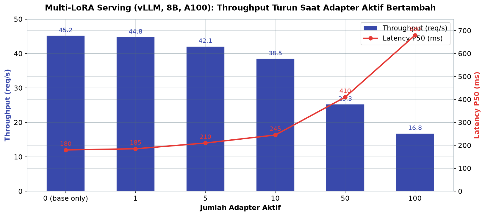
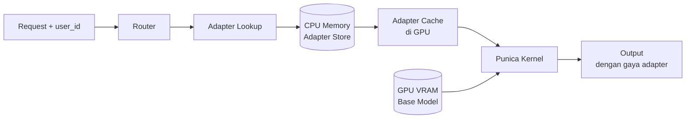
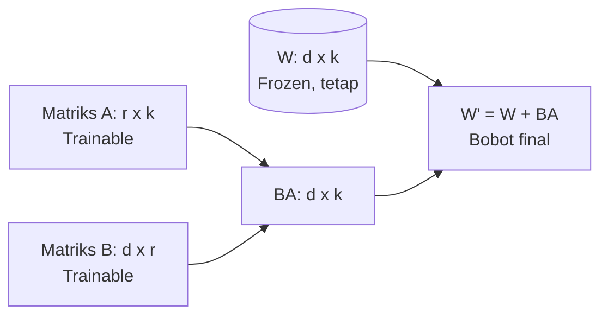

# Bab 5.7: LoRA Adapters — 10 Variasi AI dari 1 Base Model

> Bayangkan sebuah gedung perkantoran megah yang dihuni oleh seratus perusahaan berbeda — setiap perusahaan hanya menempati satu lantai yang dimodifikasi sesuai kebutuhannya, tanpa harus membangun ulang seluruh gedung. LoRA (Low-Rank Adaptation) bekerja persis seperti itu untuk model bahasa besar: satu base model yang sama melayani puluhan bahkan ratusan fine-tuned model berbeda, cukup dengan menempelkan "lapisan kecil" bernama adapter. Bab ini mengupas cara melayani banyak fine-tuned models dari satu base model tanpa perlu menduplikasi parameter, lengkap dengan implementasi nyata di vLLM dan Trade-off yang harus dikelola.

---

## 1. Tujuan Sub-Bab

Setelah membaca bab ini, Anda akan mampu:

- Menjelaskan prinsip Low-Rank Adaptation (LoRA) dan mengapa ia sangat cocok untuk *multi-tenant serving*
- Memahami mekanisme fusi LoRA saat inference — mengapa penambahan adapter tidak menambah latency
- Melayani puluhan bahkan ratusan LoRA adapters dengan satu base model menggunakan vLLM atau Text Generation Inference (TGI)
- Menjelaskan peran Punica kernel dalam membatch request dari adapter yang berbeda di satu GPU
- Menganalisis trade-off antara jumlah adapter aktif, konsumsi VRAM, dan throughput
- Memilih rank (r) yang tepat untuk berbagai jenis use case — dari persona chatbot hingga knowledge injection
- Menggabungkan multi-LoRA dengan prefix caching dan memvalidasi perilaku adapter melalui metrik server

---

## 2. Konsep LoRA: Melatih Ulang Tanpa Menyalin Otak

### Matriks Kecil dengan Efek Besar

*Fine-tuning* model raksasa secara penuh adalah pekerjaan yang boros: untuk menyesuaikan Llama-3.1-70B agar paham kontrak hukum Indonesia, Anda harus memperbarui seluruh 70 miliar parameter — menyimpan salinan baru model sebesar penuhnya, membutuhkan waktu berminggu-minggu, dan biaya GPU yang membuat tim kecil bergidik. LoRA menawarkan jalan pintas yang cerdas. Pencetusnya — Hu et al. [1] — mengamati bahwa perubahan bobot saat fine-tuning ternyata memiliki *intrinsic rank* yang rendah: meskipun matriks bobot W berukuran besar (d×k), penyesuaian yang diperlukan sebenarnya terkandung dalam ruang berdimensi kecil (r, dengan r << d). Karena itu, alih-alih memperbarui W, LoRA membekukan (*frozen*) bobot pre-trained dan menambahkan dua matriks kecil yang dapat dilatih: matriks **A** berukuran (r×k) dan matriks **B** berukuran (d×r). Perubahan bobot yang dihasilkan adalah BA — sebuah matriks (d×k) yang dibentuk dari perkalian dua matriks ramping.

Betapa kecilnya biaya tambahan ini? Untuk rank r=8, parameter yang dilatih hanya sekitar **0,1%** dari total parameter model — artinya dari model 8B Anda hanya melatih sekitar 8 juta parameter. Bandingkan dengan full fine-tuning yang harus mengoptimalkan 100% parameter. Hasilnya: training jauh lebih cepat, kebutuhan VRAM saat training anjlok (bahkan bisa dilakukan di GPU consumer lewat QLoRA dengan kuantisasi 4-bit [2]), dan hasilnya tetap setara 95-98% dengan full fine-tuning untuk tugas domain adaptation. Teknik ini menang karena tidak mengubah arsitektur model sama sekali — hanya menambahkan "tambalan tipis" yang diajarkan menyesuaikan perilaku model.

### Fusi Tanpa Biaya: W' = W + BA

Pertanyaan penting bagi engineer serving: apakah menempelkan adapter ini memperlambat inference? Jawabannya: tidak sama sekali — justru di situlah keajaiban LoRA. Saat training, bobot tambahan (A dan B) menyimpan perbedaan perilaku; saat deployment, kita bisa menghitung **W' = W + BA** dan menggabungkannya ke bobot utama, sehingga model berperilaku persis seperti hasil fine-tuning. Karena fusi terjadi sekali (saat loading) dan menghasilkan matriks dengan dimensi yang sama persis dengan W, *forward pass* berjalan dengan kecepatan yang identik — *zero additional latency*. Tidak ada lapisan ekstra yang dievaluasi per token, tidak ada overhead komputasi tambahan. Inilah alasan LoRA menjadi standar de facto untuk deployment multi-model di industri: seluruh "kecerdasan khusus" sebuah fine-tune tersimpan dalam file adapter yang ukurannya hanya puluhan megabyte, bukan puluhan gigabyte.

### Dari LoRA ke QLoRA: Menciptakan Adapter di GPU Rumahan

Satu pertanyaan wajar muncul di titik ini: kalau adapter begitu ringan, bagaimana kita melatihnya? Jawabannya kembali pada keluarga besar teknik ini. **QLoRA** [2] menggabungkan LoRA dengan kuantisasi 4-bit: base model difreeze dalam presisi NF4 yang sangat hemat memori, dan hanya matriks A dan B — yang tetap berpresisi tinggi — yang dilatih. Dengan trik ini, sebuah adapter untuk Llama-3.1-8B dapat dilatih pada GPU consumer semacam RTX 3060 12 GB yang harganya sepersepuluh dari kartu data center. Dampaknya terhadap ekosistem serving sangat besar: karena biaya pembuatan adapter anjlok, satu organisasi dapat memproduksi puluhan adapter khusus — per bahasa, per departemen, per kampanye produk — dan semuanya tetap dilayani oleh satu base model. Teknik ini juga membuka pola kerja kolaboratif yang menarik: tim yang berbeda dapat melatih adapter secara independen di laptop masing-masing, lalu menyatukannya di server produksi tanpa konflik satu sama lain, karena adapter hanyalah file kecil yang tidak menyentuh bobot bersama.

---

## 3. Tantangan LoRA Serving: Dari Sepuluh Model Menjadi Satu

### Pendekatan Naif: Satu Adapter = Satu Deployment

Sebelum memahami solusi multi-LoRA, mari kita pahami dulu masalahnya. Misalkan Anda ingin melayani sepuluh model hasil fine-tuning — katakanlah satu untuk bias bahasa hukum, satu untuk diagnosis medis, satu untuk gaya penulisan marketing, dan seterusnya. Pendekatan naif adalah men-deploy sepuluh instance model: sepuluh kali base model di-load ke VRAM. Untuk Llama-3.1-8B yang membutuhkan 16 GB dalam FP16, sepuluh instance berarti 160 GB — sekitar sepuluh kartu GPU hanya untuk memuat model yang sama berulang-ulang. Untuk Llama-3.1-70B dengan 140 GB per instance, biayanya menjadi tidak masuk akal: 1,4 TB VRAM. Sembilan puluh sembilan persen dari memori tersebut digunakan untuk menyimpan bobot yang identik — sebuah pemborosan yang menyakitkan.

### Satu Fondasi, Banyak Lantai

Solusi yang elegan: simpan **satu salinan base model** di VRAM GPU, lalu tukar adapter mengikuti siapa yang sedang dilayani. Konsep ini disebut **dynamic LoRA swapping** — GPU tidak berubah, yang berganti hanyalah adapter yang ditempelkan pada bobot model per request. Sebuah request dari user yang berlangganan persona "pengacara" akan dimuat dengan adapter `legal`, sementara request berikutnya dari user "dokter" memuat adapter `medical`. VRAM yang dibutuhkan menjadi: kebutuhan base model ditambah ukuran adapter-adapter yang sedang aktif — untuk contoh 100 adapter dengan r=16, totalnya hanya sekitar 3,4 GB tambahan di atas base model. Dari sepuluh instance model yang memakan VRAM ~10× lipat, sekarang hanya satu instance yang melayani puluhan varian. Inilah paradigma yang kini dipakai oleh platform AI SaaS modern: satu fondasi, banyak lantai, setiap tenant menyewa lantainya sendiri.

Analoginya dalam kehidupan sehari-hari: bayangkan sebuah pabrik roti yang memproduksi roti tawar, bagel, dan croissant dari adonan dasar yang sama. Membangun tiga pabrik terpisah untuk tiga produk adalah pemborosan yang konyol — adonannya identik; yang berbeda hanyalah cetakan dan lapisan tambahannya. LoRA serving adalah "cetakan" itu: base model adalah adonan (mahal untuk dibuat, murah untuk dibagikan), adapter adalah cetakan (murah untuk dibuat, mudah ditukar). Setiap pelanggan tetap mendapat roti sesuai pesanannya — bukan roti generik — tetapi dapur yang menjalankannya hanya satu. Kesederhanaan mental model ini adalah alasan mengapa arsitektur ini begitu cepat diadopsi: satu konsep, satu kalimat, seluruh tim langsung memahaminya.

---

## 4. Multi-LoRA di vLLM: Mesin Itu Satu, Adapter Banyak

### Punica Kernel: Jantung Batch Multi-Adapter

vLLM mengadopsi arsitektur dari sistem bernama **Punica** [3] — sebuah sistem *multi-tenant LoRA serving* yang memperkenalkan CUDA kernel khusus untuk menangani satu batch berisi request-request yang menggunakan adapter berbeda. Bayangkan Punica kernel sebagai mesin press yang bisa mencetak produk berbeda dalam satu siklus kerja: alih-alih memproses batch per adapter secara berurutan (yang membuang waktu), kernel ini memproses semua request dalam satu batch dengan menambahkan kontribusi matriks A dan B dari adapter masing-masing secara paralel. Setiap request membawa identitas adapter-nya sendiri, dan kernel memastikan kontribusi adapter tersebut diterapkan tepat pada baris statement-nya di dalam batch. Inilah yang membuat multi-LoRA serving tidak sekadar "bisa", tetapi juga efisien pada skala industri.

### Scheduler dan Co-Batching

Di atas kernel tersebut, scheduler vLLM menerapkan strategi cerdas: mengelompokkan (*group*) request yang menggunakan adapter yang sama untuk diproses bersama dalam satu batch. Analogi yang pas: sebuah travel agent yang mengumpulkan penumpang dengan tujuan kota yang sama ke dalam satu bus — bus tetap penuh, perjalanan tetap efisien, tidak ada kursi yang sia-sia. Kebijakan ini memaksimalkan *cache locality* matriks adapter: ketika adapter `legal` dimuat ke GPU untuk satu request, request lain yang juga memakai adapter `legal` ikut mendapat manfaat tanpa perlu memuat ulang. Konsekuensinya adalah trade-off yang menarik — semakin sedikit adapter yang aktif dalam satu waktu, semakin tinggi efisiensi batching; semakin banyak adapter yang bercampur dalam satu batch, semakin besar *batch fragmentation* yang harus dibayar.

### Adapter Store di CPU, Cache di GPU

Memori GPU adalah sumber daya paling langka, sedangkan memori CPU murah dan melimpah. Karena itu, vLLM menyimpan seluruh koleksi adapter di **CPU memory** sebagai "gudang", dan hanya memuat adapter yang sedang dibutuhkan ke **GPU memory** sebagai "etalase". Proses ini disebut *adapter loading*: saat request dengan adapter baru masuk dan adapter tersebut belum ada di GPU, GPU menjalankan swap — mengeluarkan adapter yang tidak lagi dipakai, memasukkan adapter baru. Dengan strategi ini, tidak ada batas keras pada jumlah adapter yang dapat Anda daftarkan; batasnya bergantung pada VRAM untuk menampung adapter yang aktif bersamaan. Pada praktiknya, satu GPU dapat menangani **100+ adapter** secara realistis — untuk base model 8B dengan adapter r=16, seratus adapter hanya menelan 3,4 GB di atas base model.

### Prefix Caching: Sahabat Setia di Lingkungan Multi-Adapter

Salah satu keuntungan yang sering tidak terduga dari multi-LoRA serving adalah sinerginya dengan **prefix caching**. Prefix caching bekerja dengan menyimpan hasil komputasi KV cache dari segmen prompt yang identik, sehingga segmen tersebut tidak perlu dihitung ulang. Dalam lingkungan multi-adapter, sistem prompt yang sama — misalnya instruksi sistem perusahaan, aturan keamanan, atau konteks dokumen yang dibagikan — sering menjadi awal dari semua request, apa pun adapter yang melayaninya. Karena prefix dihitung pada *base model* (bukan pada adapter), hasil cached-nya berlaku untuk semua adapter sekaligus. Efeknya dua arah yang saling menguatkan: prefix caching menekan biaya prefill yang harus dibayar setiap kali request masuk, sementara LoRA menekan biaya parameter — keduanya bekerja di lapisan berbeda dan tidak saling mengganggu. Inilah salah satu alasan mengapa kombinasi keduanya menjadi konfigurasi standar pada platform AI multi-tenant kelas industri.

### vLLM dan TGI: Dua Rute Menuju Tujuan yang Sama

Dua engine inference utama menawarkan dukungan multi-LoRA dengan filosofi yang sedikit berbeda. **vLLM**, yang mengadopsi arsitektur Punica [3], menonjol dalam hal *performance engineering*: kernel CUDA khusus, scheduling berbasis continuous batching, dan fleksibilitas konfigurasi yang tinggi — pilihan utama untuk beban tinggi di GPU data center. **TGI (Text Generation Inference)** dari Hugging Face menawarkan jalur yang lebih sederhana: dukungan adapter via parameter `--lora-modules` pada versi modern, manajemen adapter di memori CPU yang mirip, dan integrasi yang rapat dengan ekosistem Hugging Face — cocok bagi tim yang sudah hidup di ekosistem tersebut dan menginginkan startup yang cepat. Keduanya berbagi prinsip yang sama: satu base model, banyak adapter, dan swap yang dinamis. Keputusan antara keduanya lebih banyak ditentukan oleh ekosistem sekitar — observability yang sudah ada, familiaritas tim, dan kebutuhan integrasi dengan framework lain — daripada kemampuan dasar yang keduanya sama-sama ungguli.

---

## 5. Trade-off: Semakin Banyak, Semakin Terfragmentasi

Kebebasan "satu model melayani banyak" tidak datang tanpa harga. Trade-off pertama adalah **batch fragmentation**: semakin banyak adapter yang aktif bersamaan dalam batch, semakin sulit scheduler mengumpulkan request yang sehati — throughput turun, latency naik. Data pengukuran menunjukkan penurunan yang nyata: tanpa adapter throughput 45,2 request/detik; dengan 10 adapter aktif turun ke 38,5; dan dengan 100 adapter aktif tersisa 16,8 request/detik dengan latency P50 yang membengkak dari 180 ms menjadi 680 ms [4]. Trade-off kedua adalah ukuran adapter: rank r yang lebih besar memang memberi kualitas lebih baik — hingga mendekati hasil full fine-tuning — tetapi setiap kenaikan rank berarti matriks A dan B yang lebih gemuk, sehingga memory adapter bertambah dan bandwidth transfer saat swap meningkat. Trade-off ketiga justru menjadi penyelamat: **prefix caching** tetap bekerja dengan baik di lingkungan multi-LoRA, karena prefix yang sama (misalnya system prompt perusahaan) hanya perlu diproses sekali meskipun kemudian dicabang ke adapter yang berbeda.

---

## 6. Use Cases: Satu Fondasi, Puluhan Layanan

Pola ini membuka pintu bagi skenario yang sebelumnya tidak ekonomis. Pertama, **chatbot dengan persona berbeda untuk tiap user** — sebuah platform percakapan dapat menyediakan seratus persona (prospektor, sahabat, mentor, guru bahasa Jepang) hanya dari satu base model, masing-masing pengguna cukup 0,05% parameter sebagai adapter persona. Kedua, **AI code assistant per bahasa pemrograman** — satu base model dengan adapter Python, Rust, dan JavaScript terpisah, sehingga masing-masing bahasa mendapat gaya penulisan dan pola idiom yang spesifik tanpa mengganggu bahasa lainnya. Ketiga, **model dengan domain expertise berbeda** — firma hukum, klinik, dan konsultan teknik dapat berbagi satu infrastruktur sementara setiap domain berperilaku seolah-olah memiliki model khususnya sendiri, lengkap dengan vokabulari dan konvensi penulisan masing-masing. Kombinasi ini menjadikan LoRA serving fondasi utama arsitektur AI multi-tenant modern: murah, skalabel, dan tetap personal.

### Kapan LoRA Bukan Jawaban: Mengenali Batasnya

Kejujuran teknis menuntut kita membahas sisi sebaliknya. Penelitian *LoRA Learns Less and Forgets Less* [5] menunjukkan bahwa LoRA menyerap pengetahuan baru secara signifikan lebih sedikit daripada full fine-tuning — matriks low-rank yang ramping memang efisien, tetapi ia juga membatasi jumlah informasi baru yang dapat ditampung. Untuk **knowledge injection** — misalnya mengajarkan model regulasi baru yang tidak ada di data latih — LoRA seringkali kurang, dan kombinasi dengan RAG atau full fine-tuning pada subset parameter lain menjadi pilihan yang lebih tepat. Ada juga batas praktis: ketika skala tenant terlalu besar (ribuan adapter yang semuanya aktif bersamaan), *batch fragmentation* di Tabel B menjadi beban yang tidak lagi bisa ditutup oleh efisiensi memori — titik di mana solusi berubah menjadi masalah infrastruktur. Terakhir, di lingkungan yang sangat membutuhkan determinisme output (misalnya produksi keuangan yang diaudit), "hampir identik dengan full fine-tuning" tidak selalu cukup; di sana, memilih rank yang lebih besar dan mengukur gap terhadap baseline full FT secara berkala adalah disiplin yang harus dijalankan.

---

## 7. Tabel Wajib

### Tabel A: VRAM Usage — Base Model + LoRA Adapters

Berikut proyeksi kebutuhan VRAM ketika satu base model dilayani bersama sejumlah adapter ber-rank r=16 — perhatikan bagaimana penambahan adapter hanya menambah kebutuhan memori secara linear dan sangat kecil.

| Konfigurasi | Base Model (FP16) | Per Adapter (r=16) | 10 Adapters | 50 Adapters | 100 Adapters |
|:---|:---:|:---:|:---:|:---:|:---:|
| Llama-3.1-8B | 16 GB | 0.034 GB | 16.34 GB | 17.7 GB | 19.4 GB |
| Llama-3.1-70B | 140 GB | 0.26 GB | 142.6 GB | 153 GB | 166 GB |
| Qwen-2.5-32B | 64 GB | 0.12 GB | 65.2 GB | 70 GB | 76 GB |
| Mistral-7B | 14 GB | 0.028 GB | 14.28 GB | 15.4 GB | 16.8 GB |
| Mistral Large 3 (675B MoE) | 168 GB (FP8) | 0.42 GB | 172.2 GB | 189 GB | 210 GB |
| Ministral 3 8B | 16 GB | 0.030 GB | 16.3 GB | 17.5 GB | 19 GB |

Tabel A memperlihatkan keajaiban ekonomi multi-LoRA: seratus adapter untuk Llama-3.1-8B hanya menambah 3,4 GB di atas base model — dibandingkan 1.600 GB bila seratus instance terpisah di-deploy. Perhatikan juga pola menarik pada Mistral Large 3: base model granular MoE 675B dilayani dalam FP8 (168 GB), dan adapter-nya justru lebih besar per buah (0,42 GB) karena harus menyesuaikan 41B parameter aktif — namun karena *sparse activation*, hanya parameter aktif yang perlu diadaptasi per *forward pass*, sehingga biaya inference tetap terkendali.

### Tabel B: Performance Impact — Multi-LoRA Serving (vLLM, 8B, A100)

Tabel berikut menunjukkan harga yang harus dibayar dalam throughput dan latency ketika adapter aktif bertambah banyak — data diukur pada vLLM dengan base model 8B di atas A100 [4].

| Jumlah Adapter Aktif | Throughput (req/s) | Latency P50 (ms) | Batch Fragmentasi | VRAM Adapter |
|:---|:---:|:---:|:---:|:---:|
| 0 (base only) | 45.2 | 180 | 0% | 0 GB |
| 1 | 44.8 | 185 | 0% | 0.034 GB |
| 5 | 42.1 | 210 | 5% | 0.17 GB |
| 10 | 38.5 | 245 | 12% | 0.34 GB |
| 50 | 25.3 | 410 | 35% | 1.7 GB |
| 100 | 16.8 | 680 | 55% | 3.4 GB |



*Gambar 5.7-1 — VRAM adapter tetap murah (3,4 GB untuk 100 adapter r=16), tetapi batch fragmentation menaikkan P50 ke 680 ms dan memangkas throughput lebih dari separuh — biaya multi-LoRA sebenarnya ada di fragmentasi, bukan memori.*

Pola yang paling mencolok bukanlah penurunan VRAM — itu justru sangat murah — melainkan penurunan throughput yang tidak linear. Dari 0 ke 10 adapter, throughput masih terasa wajar (38,5 req/s). Namun dari 10 ke 100 adapter, throughput anjlok lebih dari separuh karena *batch fragmentation* naik ke 55%: batch-batch kecil yang pecah membuat GPU tidak pernah terisi penuh. Pelajaran operasionalnya: jangan mengukur biaya multi-LoRA dari memori saja — ukur dari persentase adapter yang aktif bersamaan. Jika trafik Anda sporadis (banyak adapter jarang dipakai), justru aman; jika trafik Anda padat dan merata di seratus adapter, pertimbangkan membagi beban ke dua GPU atau membatasi adapter yang boleh aktif per batch.

Ada juga pertimbangan yang sering terlupakan: **di mana garis pemisah antara "cukup satu instance multi-LoRA" dan "butuh multiple instance"?** Rumus sederhananya adalah membandingkan biaya total. Satu instance dengan 50 adapter membutuhkan 17,7 GB VRAM (Llama-3.1-8B) dan menelan throughput hingga 25 req/s dengan P50 410 ms; dua instance masing-masing 25 adapter akan membutuhkan 2 × 17,5 GB dan menjaga P50 di kisaran 200-250 ms dengan throughput gabungan yang lebih tinggi. Pada trafik rendah, satu instance menang mutlak; pada trafik tinggi dengan banyak adapter aktif, dua instance menang di latency sambil tetap jauh lebih murah daripada deployment per-adapter. Keputusan ini tidak pernah statis — jadwalkan peninjauan ulang setiap kali jumlah adapter aktif berkali lipat atau P50 menembus SLO.

### Memahami Pola 3.4: Fragmentasi sebagai Harga Kebebasan

Angka 55% fragmentasi pada 100 adapter perlu dipahami dengan tepat agar tidak salah menafsirkan. Fragmentasi di sini bukan berarti setengah GPU menganggur — melainkan bahwa batch yang terbentuk menjadi lebih kecil dan lebih beragam daripada jika semua request memakai satu adapter. GPU masih bekerja penuh, tetapi *compute efficiency*-nya turun: batch kecil berarti lebih sedikit token yang diproses per unit waktu, dan peralihan antar adapter (swap) menyela *pipeline* tanpa menghasilkan token. Ini menjelaskan mengapa solusi teknis terus berkembang ke arah *co-batching yang agresif*: semakna adapter yang dapat dijamin kompatibel di-load bersama dalam satu batch, semakin rendah fragmentasi. Pada praktiknya, kesimpulan yang bisa diambil adalah menyeimbangkan dua variabel yang bisa Anda kendalikan — *jumlah adapter yang didaftarkan* (bisa banyak, tidak masalah) dan *jumlah adapter yang aktif per menit* (jaga tetap kecil dengan merutekan trafik yang sama ke adapter yang sama, mirip session affinity di Bab 5.8).

### Tabel C: Rekomendasi r (Rank) per Use Case

Panduan ringkas untuk memilih rank LoRA sesuai tujuan — semakin spesifik dan dalam perubahan yang diinginkan, semakin besar rank yang dibutuhkan [5].

| Use Case | r Minimum | r Recommended | Parameter Tambahan | Kualitas vs Full FT |
|:---|:---:|:---:|:---:|:---:|
| Domain adaptation (umum) | 8 | 16 | ~0.1% | 95-98% |
| Task-specific (coding) | 16 | 32 | ~0.2% | 97-99% |
| Persona/character | 4 | 8 | ~0.05% | 90-95% |
| Multilingual | 32 | 64 | ~0.4% | 98-100% |
| Knowledge injection | 64 | 128 | ~0.8% | ~100% |

Tabel C memberi aturan praktis yang mudah diingat: tugas yang dangkal (persona, gaya bicara) cukup dengan rank kecil 4-8 — murah dan cepat dilatih; tugas yang dalam (injeksi pengetahuan baru) membutuhkan rank 64-128 agar model benar-benar "menghafal" materi baru. Namun ingat batasan yang diungkap riset LoRA Learns Less and Forgets Less [5]: LoRA menyerap pengetahuan lebih sedikit daripada full fine-tuning pada tugas yang membutuhkan pengetahuan baru, meskipun ia juga *forgets* (lupa) lebih sedikit. Karena itu, untuk tugas knowledge injection yang kritis, kombinasi LoRA dengan RAG atau fine-tuning hybrid seringkali merupakan pilihan yang lebih bijak daripada menaikkan rank tanpa batas.

Dimensi terakhir yang sering diabaikan adalah **ukuran file adapter sebagai biaya operasional**. Adapter r=16 untuk model 8B berukuran sekitar 34 MB; adapter r=128 (knowledge injection) bisa mencapai 270 MB. Pada ratusan adapter, total ini tetap kecil untuk storage, tetapi menjadi signifikan di jaringan: setiap *swap* adapter memindahkan file dari CPU memory ke GPU — makin besar rank, makin lama swap, makin lama juga *cold start* request yang memakai adapter tersebut. Konsekuensi desain yang praktis: kelompokkan adapter yang sering dipakai bersama agar dapat *pre-loaded* di GPU (cache dingin dimulai di pagi hari), dan beri label prioritas — adapter persona yang responsif (P50 < 250 ms) sebaiknya selalu berada di GPU, sementara adapter batch yang tidak dikejar waktu boleh di-swap sesuka hati.

---

## 8. Diagram & Visualisasi

### Gambar 1: Arsitektur Multi-LoRA Serving

Diagram berikut menggambarkan alur request pada sistem multi-LoRA serving: request membawa identitas user, router mencari adapter yang sesuai, adapter diambil dari gudang CPU memory, lalu Punica kernel menggabungkan kontribusinya dengan base model di GPU.



Gambar ini menunjukkan tiga lapisan memori yang bekerja bersama: **CPU memory** sebagai penyimpanan adapter yang tidak terbatas secara praktis, **GPU adapter cache** sebagai etalase untuk adapter yang sedang aktif, dan **GPU VRAM** untuk base model yang dibagikan semua tenant. Perhatikan bahwa base model tidak pernah dimuat ulang — inilah sumber penghematan VRAM hingga 300% dibandingkan deployment terpisah.

Poin desain yang perlu dicermati adalah bagaimana *lookup* dan *routing* terjadi di lapisan aplikasi, bukan di dalam engine inference. Router di depan vLLM memetakan `user_id` ke nama adapter (misalnya user dari klien hukum → `legal`), lalu meneruskannya sebagai `lora_name` pada request. Engine tidak perlu tahu bisnis Anda; ia hanya perlu tahu adapter mana yang harus diaktifkan. Pemisahan tanggung jawab ini membuat sistem mudah dirawat: daftar adapter dapat bertambah tanpa menyentuh kode engine, dan kebijakan routing (siapa berhak adapter mana) hidup di satu tempat yang bisa diaudit — sama pentingnya untuk keamanan tenant dan untuk pengujian A/B perilaku antar persona.

### Gambar 2: Visualisasi Fusi Bobot LoRA

Bagaimana W' = W + BA bekerja secara visual — bobot frozen yang besar ditambah kontribusi dua matriks ramping yang dapat dilatih:



Perhatikan dimensinya: W berukuran d×k dengan d dan k yang besar (misalnya 4096×4096), sedangkan A dan B masing-masing berukuran r×k dan d×r dengan r=8-128 — dimensi kecil yang membuatnya berpengaruh pada perilaku model namun murah untuk disimpan, dipindahkan, dan digabungkan. Karena hasil BA berdimensi persis sama dengan W, penjumlahan W' = W + BA menghasilkan model berperilaku seperti hasil fine-tuning penuh dengan biaya komputasi yang identik.

---

## 9. Praktikum / Hands-On

### Langkah 1: Menyiapkan Direktori LoRA Adapters

Mulailah dengan menata adapter-adapter hasil fine-tuning ke dalam direktori yang rapi — setiap folder menjadi satu modul LoRA yang akan didaftarkan ke vLLM.

```bash
# Struktur direktori LoRA adapters
#   /models/lora/coding-assistant/
#   /models/lora/legal-advice/
#   /models/lora/medical-consult/

mkdir -p /models/lora/{coding-assistant,legal-advice,medical-consult}

# Verifikasi struktur file adapter (harus berisi config + safetensors)
ls -la /models/lora/coding-assistant/
#   adapter_config.json
#   adapter_model.safetensors
```

### Langkah 2: Menjalankan vLLM dengan Multi-LoRA

Jalankan satu instance vLLM yang memuat base model sekaligus mendaftarkan tiga adapter, lalu panggil adapter yang berbeda pada request yang berbeda.

```bash
# Jalankan vLLM dengan multi-LoRA
vllm serve meta-llama/Meta-Llama-3.1-8B-Instruct \
    --enable-lora \
    --lora-modules coding=/models/lora/coding-assistant \
                    legal=/models/lora/legal-advice \
                    medical=/models/lora/medical-consult \
    --max-lora-rank 64 \
    --max-num-seqs 256

# Panggil dengan adapter berbeda
curl http://localhost:8000/v1/chat/completions \
    -H "Content-Type: application/json" \
    -d '{
        "model": "meta-llama/Meta-Llama-3.1-8B-Instruct",
        "messages": [{"role": "user", "content": "Buatkan kontrak sewa"}],
        "max_tokens": 256,
        "lora_name": "legal"
    }'
```

Perhatikan argumen penting di atas. `--enable-lora` mengaktifkan dukungan adapter, `--lora-modules` mendaftarkan nama dan lokasi tiap adapter, dan `--max-lora-rank 64` menentukan rank maksimum yang dapat dimuat — set lebih besar dari rank adapter Anda. Saat request dikirim, parameter `lora_name` menentukan adapter mana yang diterapkan; jika dihilangkan, base model murni yang digunakan.

Dua penyesuaian praktis untuk lingkungan nyata. Pertama, jika salah satu adapter Anda dilatih dengan rank di atas 64 (misalnya rank 128 untuk knowledge injection), naikkan `--max-lora-rank` — adapter yang rank-nya melebihi batas akan ditolak saat loading. Kedua, `--max-num-seqs 256` menentukan berapa banyak request yang boleh berbagi batch secara paralel; pada GPU dengan VRAM terbatas, turunkan angka ini agar KV cache tidak bertabrakan dengan adapter yang aktif. Bila Anda menjalankan multi-GPU, tambahkan `--tensor-parallel-size N` sesuai jumlah GPU — adapter didistribusikan secara otomatis, dan semua GPU harus memuat adapter yang sama untuk request yang sama.

### Langkah 3: Melatih dan Mengekspor LoRA dengan PEFT

Uji siklus lengkapnya: latih adapter Anda sendiri dengan library PEFT dari Hugging Face, lalu ekspor ke format yang dikenali vLLM.

```python
from peft import LoraConfig, get_peft_model
from transformers import AutoModelForCausalLM, AutoTokenizer

# Load base model
model = AutoModelForCausalLM.from_pretrained("meta-llama/Meta-Llama-3.1-8B-Instruct")

# Konfigurasi LoRA
lora_config = LoraConfig(
    r=16,
    lora_alpha=32,
    target_modules=["q_proj", "v_proj", "k_proj", "o_proj"],
    lora_dropout=0.05,
    bias="none",
    task_type="CAUSAL_LM",
)

# Apply LoRA
model = get_peft_model(model, lora_config)

# Train...
# model.train(...)

# Save adapter
model.save_pretrained("./lora-coding-assistant")
tokenizer.save_pretrained("./lora-coding-assistant")

# Export ke format vLLM
# rename adapter_config.json -> config.json
# rename adapter_model.safetensors -> model.safetensors
```

### Langkah 4: Menggunakan LoRA Secara Dinamis via API

Dari sisi klien, pilih adapter secara dinamis per request menggunakan library OpenAI resmi — contohnya seorang pasien bertanya kepada adapter `medical`:

```python
from openai import OpenAI

client = OpenAI(base_url="http://localhost:8000/v1", api_key="-")

# List available LoRA modules
modules = client.models.list()
for m in modules:
    print(m.id)  # meta-llama/Meta-Llama-3.1-8B-Instruct, coding, legal, ...

# Use specific LoRA
response = client.chat.completions.create(
    model="meta-llama/Meta-Llama-3.1-8B-Instruct",  # base model
    messages=[{"role": "user", "content": "Apa diagnosis untuk demam > 3 hari?"}],
    extra_body={"lora_name": "medical"},
)
```

Klien tidak perlu tahu detail server — endpoint `/v1/models` menampilkan adapter sebagai model terpisah, dan parameter `lora_name` di dalam `extra_body` menentukan adapter yang diterapkan. Pola ini membuat penambahan adapter baru menjadi perubahan konfigurasi yang bersih tanpa mengubah kode klien.

### Langkah 5: Menguji dan Memantau Perilaku Multi-LoRA

Setelah server berjalan, latihan verifikasi singkat ini memastikan setiap adapter benar-benar diterapkan — dan mengukur dampaknya terhadap kinerja.

```bash
# 1. Bandingkan jawaban antar adapter untuk prompt yang sama
for lora in coding legal medical; do
  echo "=== Adapter: $lora ==="
  curl -s http://localhost:8000/v1/chat/completions \
    -H "Content-Type: application/json" \
    -d "{\"model\": \"meta-llama/Meta-Llama-3.1-8B-Instruct\",
         \"messages\": [{\"role\": \"user\", \"content\": \"Tulis ulang pesan ini dengan nada formal\"}],
         \"max_tokens\": 100, \"lora_name\": \"$lora\"}" \
    | python3 -m json.tool | grep content
done

# 2. Cek metrik server: throughput & fragmentasi
curl -s http://localhost:8000/metrics | grep -E "num_requests|time_to_first_token" | head -10
```

Langkah 1 adalah *smoke test* kualitas: untuk prompt yang sama, ketiga adapter seharusnya menghasilkan jawaban dengan gaya yang berbeda — bila tidak, periksa apakah `--lora-modules` terdaftar dengan benar. Langkah 2 menghubungkan bab ini dengan bab monitoring (Bab 5.9): metrik `vllm:time_to_first_token_seconds` akan menunjukkan kenaikan latency seiring bertambahnya adapter aktif yang masuk batch — data nyata untuk memvalidasi angka fragmentasi pada Tabel B.

---

## 10. Studi Kasus: AI Coding Assistant untuk 3 Bahasa Pemrograman

**Skenario.** Sebuah platform coding education ingin menyediakan AI assistant yang memahami idiom spesifik tiga bahasa: Python, Rust, dan JavaScript. Setiap bahasa butuh gaya, pola, dan konvensi penulisan yang berbeda — jawaban Python yang baik tidak sama dengan jawaban Rust yang baik. Tim mereka telah mencoba model generalist, namun hasilnya selalu terasa "dangkal" di ketiga bahasa sekaligus.

**Analisis tanpa LoRA.** Pilihan pertama yang dipertimbangkan: mengubah tiga varian Llama-3.1-70B — satu per bahasa. Perhitungannya menyakitkan: 3 × 140 GB = 420 GB VRAM untuk model yang 99% identik isinya. Dengan harga H100 80 GB, ini berarti setidaknya enam kartu GPU hanya untuk memuat tiga salinan model yang hampir sama. Belum lagi biaya fine-tuning tiga model penuh secara terpisah. Jelas tidak layak untuk platform yang masih menumbuhkan revenue.

**Solusi dengan LoRA.** Tim mengubah strategi: satu instance Llama-3.1-70B (140 GB) + tiga adapter rank r=32. Masing-masing adapter r=32 menelan 0,26 GB — total tambahan hanya 0,78 GB. Konfigurasi hardware menjadi sangat ringkas: 2× H100 80GB dengan base model di tensor parallelism 2 (TP=2), sementara ketiga adapter disimpan di CPU memory dan dimuat ke GPU hanya saat dipakai. Total VRAM: 140,78 GB — hampir tidak terlihat bedanya dari base model saja.

**Hasil.** Dengan 3 adapter aktif, sistem melayani **38 request/detik** dengan latency P50 **280 ms** — setara pengalaman model khusus per bahasa tanpa biaya model khusus per bahasa. Penghematan VRAM mencapai **300%** dibandingkan deploy 3 instance terpisah. Pelajaran utama studi kasus ini: untuk kebutuhan multi-varian dengan base model yang sama, LoRA mengubah persoalan dari "berapa GPU yang sanggup kita beli" menjadi "berapa rank yang pas untuk tiap bahasa" — pertanyaan yang jauh lebih menyenangkan.

**Satu rintangan tak terduga.** Dalam implementasi nyata, tim menemukan bahwa adapter Rust — yang dilatih pada korpus kode yang sangat spesifik — membutuhkan rank 32 untuk mencapai kualitas yang memuaskan, sementara adapter JavaScript cukup di rank 16. Perbedaan ini tidak terlihat dari tabel rekomendasi generik; ia ditemukan lewat evaluasi berkala. Pelajaran kedua yang berharga: karena ketiga adapter berbagi satu base model di TP=2, setiap *swap* adapter harus sinkron di kedua GPU — kesalahan sinkronisasi bobot A dan B antar GPU adalah salah satu bug tersulit yang pernah mereka debug. Solusinya sederhana: selalu simpan metadata versi adapter (hash bobot) dan biarkan vLLM menangani sinkronisasi lewat mekanisme bawaan, jangan pernah mengedit file adapter saat server sedang berjalan. Detail kecil ini menyelamatkan tim dari insiden produksi yang mahal.

**Catatan evaluasi.** Untuk menjaga kualitas setiap adapter, tim membangun *eval harness* mini yang menguji 50 pertanyaan per bahasa setiap minggu dan membandingkan skor jawaban antar versi adapter — praktik yang meniru disiplin benchmarking dari paper LoRA Learns Less and Forgets Less [5]. Adapter yang kualitasnya menurun (misalnya setelah retrain dengan data baru) langsung terlihat di grafik, dan rollback dilakukan dengan menunjuk ke versi adapter sebelumnya. Dengan biaya sangat kecil (satu base model yang sama), platform ini kini menjalankan siklus hidup lengkap untuk tiga varian bahasa: traina, eval, deploy, monitoring — praktik yang biasanya hanya dimiliki tim dengan anggaran model khusus per bahasa.

---

## 11. Referensi

### Paper Jurnal/Konferensi

[1] Hu, E.J., Shen, Y., Wallis, P., Allen-Zhu, Z., Li, Y., Wang, S., Wang, L. & Chen, W. (2022). *LoRA: Low-Rank Adaptation of Large Language Models*. International Conference on Learning Representations (ICLR). DOI: [10.48550/arXiv.2106.09685](https://arxiv.org/abs/2106.09685)

[2] Dettmers, T., Pagnoni, A., Holtzman, A. & Zettlemoyer, L. (2023). *QLoRA: Efficient Finetuning of Quantized LLMs*. Advances in Neural Information Processing Systems (NeurIPS). DOI: [10.48550/arXiv.2305.14314](https://arxiv.org/abs/2305.14314)

[3] Chen, L., Ye, Z., Wu, Y., Zhuo, D. & Ceze, L. (2024). *Punica: Multi-Tenant LoRA Serving*. Proceedings of Machine Learning and Systems (MLSys). DOI: [10.48550/arXiv.2310.18547](https://arxiv.org/abs/2310.18547)

[4] Sheng, Y., Cao, S., Li, D., Hooper, C., Lee, N., Yang, S., Chou, C., Zhu, B., Zheng, L., Keeton, K., Gonzalez, J.E. & Stoica, I. (2024). *S-LoRA: Serving Thousands of Concurrent LoRA Adapters*. Proceedings of Machine Learning and Systems (MLSys). DOI: [10.48550/arXiv.2311.03285](https://arxiv.org/abs/2311.03285)

[5] Biderman, D., Ortiz, J.G., Ortiz, M., Portnoff, M. & Schoelkopf, H. (2025). *LoRA Learns Less and Forgets Less*. International Conference on Learning Representations (ICLR). DOI: [10.48550/arXiv.2405.09673](https://arxiv.org/abs/2405.09673)

### Referensi Pendukung (Dokumentasi/Repository)

[6] Hugging Face. *PEFT Documentation*. [https://huggingface.co/docs/peft](https://huggingface.co/docs/peft)

[7] vLLM. *LoRA Documentation*. [https://docs.vllm.ai](https://docs.vllm.ai)