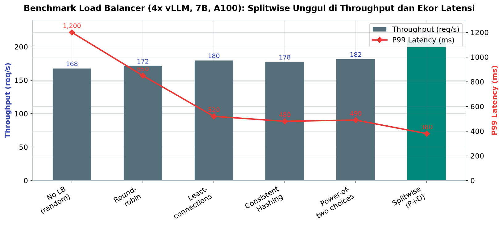
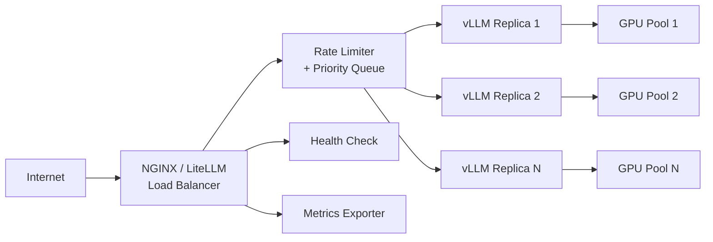
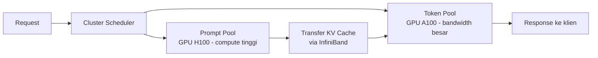

# Bab 5.8: API Load Balancing — Distribusi Request ke Beberapa GPU

> Sebuah restoran dengan satu koki hanya bisa melayani satu meja dalam satu waktu — lewati satu jam sibuk, dan antrean memanjang di luar pintu. Solusinya bukan menjejalkan koki ekstra ke meja yang sama, melainkan membangun dapur yang bisa membagi pesanan ke banyak koki secara adil. Bab ini membahas bagaimana trafik LLM didistribusikan ke banyak GPU: strategi load balancing dari round-robin hingga power-of-two choices, konfigurasi NGINX dan LiteLLM sebagai proxy, hingga teknik mutakhir *prefill-decode disaggregation* ala Splitwise yang memisahkan tahap prefill dan decode ke hardware yang berbeda. Setiap pilihan membawa harga tersendiri — tujuan bab ini adalah membuat Anda memilih dengan mata terbuka, bukan dengan lempar koin.

---

## 1. Tujuan Sub-Bab

Setelah membaca bab ini, Anda akan mampu:

- Menjelaskan mengapa satu GPU atau satu instance vLLM memiliki kapasitas terbatas dan kapan horizontal scaling diperlukan
- Membandingkan strategi load balancing: round-robin, least-connections, consistent hashing, dan power-of-two choices
- Memilih strategi yang tepat berdasarkan profil trafik — dari chat interaktif hingga batch pemrosesan
- Menyiapkan NGINX sebagai load balancer layer-7 untuk beberapa replica vLLM
- Menyiapkan LiteLLM sebagai proxy multi-model dengan rate limiting, fallback, dan cost tracking
- Menjelaskan arsitektur *prefill-decode disaggregation* (Splitwise) dan kapan ia layak diterapkan
- Mengonfigurasi auto-scaling berbasis Horizontal Pod Autoscaler di Kubernetes, termasuk mengelola cold start GPU

---

## 2. Mengapa Load Balancing Diperlukan?

Satu GPU, sehebat apa pun, tetap punya dinding. Throughput sebuah instance vLLM dibatasi oleh *memory bandwidth* GPU dan ukuran VRAM — setelah batch penuh, request berikutnya mengantre. Ini bukan kegagalan teknologi; ini hukum fisika silicon. Ketika trafik melampaui kapasitas satu kartu — katakanlah ribuan request per detik dari ribuan pengguna — satu-satunya jalan yang dapat diprediksi adalah **horizontal scaling**: menambah replica, lalu mendistribusikan request secara merata. Di sinilah *load balancer* berperan sebagai *traffic director*: ia memutuskan request mana menuju GPU mana. Namun perannya tidak berhenti di situ — dengan *health check*, ia mengeluarkan replica yang sakit dari rotasi; dengan *rate limiter*, ia melindungi backend dari lonjakan gila; dengan antrean, ia menahan arus ketika semua backend penuh. Sebuah load balancer yang baik adalah gabungan pengatur lalu lintas, dokter jaga, dan bouncer klub dalam satu tubuh.

### Satu GPU, Berapa Mampu? Anatomi Kapasitas Inference

Untuk memahami kapan harus menambah replica, kita perlu tahu dulu apa yang membatasi satu instance. Tiga dinding utama membatasi kapasitas: **VRAM** menentukan berapa banyak request yang dapat berbagi GPU sekaligus (melalui ukuran KV cache); **memory bandwidth** menentukan kecepatan generasi token (lihat Bab 5.10 — fase decode bersifat memory-bound); dan **scheduler** menentukan bagaimana batch dibentuk (continuous batching menggenjot utilisasi, tetapi tetap ada batas fisik). Ketiga dinding ini bekerja bersama: sebuah instance 7B di A100 80 GB mungkin melayani 45 request/detik dengan respons yang nyaman, tetapi menaikkan beban menjadi dua kali lipat akan melipatgandakan latency, bukan menggandakan output. Ketika kurva *throughput vs latency* mulai menikung tajam ke atas, itulah sinyal matematis bahwa satu instance sudah habis — dan pertanyaan berikutnya bukan "bagaimana mempercepat GPU ini" melainkan "di mana membeli replica kedua".

Ada pembeda penting antara scale up dan scale out yang menentukan desain load balancing. *Scale up* — mengganti satu GPU besar (A100 → H100) — menambah throughput per instance tetapi tidak menambah ketahanan: satu titik kegagalan tetap satu titik kegagalan, dan latensi antrean pada lonjakan tetap menjadi masalah statistik yang sama. *Scale out* — menambah replica — melipatgandakan kapasitas *dan* membuka ruang untuk strategi distribusi, health check, dan perawatan bergilir (replica bisa di-rolling-update satu per satu tanpa downtime). Karena itu, dalam praktik industri, pola yang umum adalah menggabungkan keduanya: replica di-resize ke ukuran yang masuk akal untuk beban rata-rata (bukan puncak), lalu jumlah replica-lah yang menyerap lonjakan. Load balancing adalah teknologi yang hanya masuk akal setelah keputusan ini diambil — ia adalah orkestra, bukan pengganti instrumen.

Catatan penting bagi pembaca yang baru memulai: jangan merancang load balancer di hari pertama. Satu replica dengan continuous batching yang baik sudah melayani ratusan pengguna dengan nyaman; kesalahan yang jauh lebih umum adalah terburu-buru membangun infrastruktur multi-replica sebelum kurva throughput-latency instance diukur. Mulailah dari satu instance yang di-*monitor* dengan metrik dari Bab 5.9, ukur titik jenuhnya secara empiris, dan bangun load balancing tepat ketika kurva itu mulai menyengat. Urutan ini — ukur dulu, distribusikan kemudian — lebih murah, lebih jujur, dan hampir selalu menyelamatkan Anda dari arsitektur yang rumit lebih awal dari yang dibutuhkan.

---

## 3. Strategi Load Balancing

### Round-robin: Sederhana tapi Tuli terhadap Beban

Strategi paling klasik: request pertama ke replica 1, request kedua ke replica 2, dan seterusnya berputar. Implementasinya sepele dan deterministik, sehingga mudah dianalogikan dengan petugas yang membagikan formulir kepada mahasiswa secara bergilir tanpa melihat siapa yang sudah sibuk. Masalahnya, round-robin **tidak sadar beban** — replica 1 bisa saja sedang memproses sepuluh request generasi panjang sementara replica 2 menganggur, tetapi request berikutnya tetap diarahkan ke replica 1. Pada LLM, ketimpangan ini berbahaya karena durasi request sangat bervariasi: satu request bisa menghasilkan 4.096 token, request lain cukup 50 token.

### Least-connections: Melihat yang Tersibuk

Varian yang lebih pintar: kirim request ke replica dengan *active request* paling sedikit. Ini adalah perbaikan instan atas round-robin — sama seperti pengantri yang memilih kasir dengan antrean terpendek, bukan kasir pertama secara bergilir. Untuk LLM, ukuran "jumlah request aktif" adalah proksi yang masuk akal atas beban sebenarnya, meski tetap ada kelemahan: dua replica dengan jumlah request sama bisa memiliki beban sangat berbeda jika satu membawa prompt raksasa 32K token dan satunya prompt pendek.

### Consistent Hashing: Setia pada Replica yang Sama

Strategi ini memetakan user (atau API key) ke replica tertentu menggunakan fungsi hash yang stabil — selama jumlah replica tidak berubah, user yang sama selalu diarahkan ke replica yang sama. Keuntungan krusial untuk LLM: **session affinity** dan *cache reuse*. Instance vLLM yang melayani prefix yang sama dapat memanfaatkan prefix caching dan KV cache; ketika user yang sama terus kembali ke replica yang sama, cache tidak perlu dibangun ulang. Untuk model MoE seperti Mistral Large 3 dan DeepSeek V4 Pro, strategi ini lebih direkomendasikan lagi karena session affinity meningkatkan *cache hit ratio* pada expert weights yang sama — setiap request yang kembali ke replica yang sama berpotensi memuat ulang lebih sedikit expert dari memori.

### Power-of-two Choices: Dua Kandidat, Satu Pemenang

Strategi yang terbukti matematis unggul untuk beban LLM: pilih dua replica secara acak, lalu kirim request ke yang lebih ringan. Keindahannya terletak pada keseimbangan — distribusi hampir merata seperti acak murni, tetapi tanpa kemungkinan "nasib buruk" mengirim semua request ke satu node. Berawal dari teori klasik Mitzenmacher [4] tentang *power of two choices* dalam randomized load balancing, strategi ini kini dianggap **optimal untuk LLM serving**: biaya implementasi sangat rendah, tidak memerlukan sesi atau hash, tetapi menyeimbangkan beban secara adaptif mendekati hasil least-connections dengan lebih sedikit state yang harus dijaga.

### Memilih Strategi Berdasarkan Profil Trafik

Keputusan strategi sebaiknya tidak dibuat di ruang kosong — ia harus mengikuti bentuk trafik Anda. Jika trafik didominasi **percakapan singkat yang berulang** (chatbot layanan pelanggan dengan jumlah pengguna terbatas), consistent hashing memberikan keunggulan ganda: session affinity menstabilkan pengalaman dan prefix caching bekerja maksimal karena prompt berulang. Jika trafik adalah **batch besar dengan durasi sangat bervariasi** (pemrosesan dokumen, embedding massal), least-connections atau power-of-two choices lebih tepat — di sini durasi request tidak bisa diprediksi, jadi penyeimbangan beban berdasarkan beban aktual lebih berharga daripada kesetiaan sesi. Jika Anda menjalankan **MoE besar seperti Mistral Large 3 atau DeepSeek V4 Pro** dengan banyak node, prioritaskan session affinity: expert weights yang dimuat ulang saat request berpindah node adalah biaya tersembunyi yang cukup besar. Dan jika trafik Anda masih kecil dan tumbuh cepat, jangan terlalu khawatir memilih — power-of-two choices adalah pilihan aman universal yang tidak akan menyesatkan Anda di tahap mana pun.

---

## 4. Pilihan Load Balancer

Tidak semua load balancer diciptakan sama — pilihannya bergantung pada kedalaman kontrol yang Anda butuhkan. **NGINX dan HAProxy** adalah workhorse layer 7: health check, SSL termination, dan retry yang tangguh — cocok jika Anda hanya butuh mendistribusikan trafik ke replica-replica inference yang sudah seragam. **LiteLLM** melangkah lebih jauh sebagai proxy khusus ekosistem LLM: routing multi-model dan multi-provider dengan satu format OpenAI, rate limiting per key, cost tracking per model, dan kebijakan fallback otomatis ke model cadangan. **Ray Serve** menawarkan pola deployment terintegrasi: load balancing dan auto-scaling bawaan untuk endpoint vLLM di dalam kerangka ekosistem Ray. Terakhir, **Kubernetes Ingress** — bagi tim yang sudah hidup dalam ekosistem Kubernetes, kombinasi Service + Horizontal Pod Autoscaler + Ingress Controller memberikan otomatisasi penuh dari penemuan replica hingga scaling otomatis berdasarkan metrik GPU itu sendiri.

Sebuah cara praktis memilih di antara keempatnya: mulailah dari *bentuk kebutuhan*, bukan dari *nama produk*. Jika tantangan Anda hanya "satu model, banyak GPU, trafik besar" — NGINX/HAProxy atau Ingress Controller sudah memadai dan paling murah perawatannya. Jika Anda harus menawarkan "banyak model, banyak backend campuran (lokal + cloud), dengan kuota per pelanggan" — LiteLLM hampir pasti pilihan yang tepat, karena fitur cost tracking dan rate limiting per key sudah built-in. Jika Anda hidup di ekosistem Ray — misalnya pipeline RAG dan inference berjalan di Ray cluster — integrasi Ray Serve menghilangkan satu lapisan infrastruktur yang harus dijaga. Dan ketika beban Anda tumbuh melewati puluhan replica dengan upgrade yang sering, Kubernetes Ingress memberi satu bahasa operasional yang sama untuk seluruh perusahaan — meskipun dengan kompleksitas yang tidak bisa diabaikan.

---

## 5. Prefill-Decode Disaggregation: Splitwise

### Insight: Dua Fase yang Bermusuhan

Setiap request LLM melewati dua fase dengan karakter hardware yang berlawanan. **Prefill** — saat prompt awal diproses dan KV cache dibangun — adalah fase *compute-intensive*: ribuan token diproses paralel dalam satu langkah, butuh FLOP tinggi dan perhitungan matriks raksasa. **Decode** — saat token output dihasilkan satu per satu — adalah fase *memory-intensive*: setiap langkah hanya memproses satu token baru tetapi harus membaca ulang seluruh bobot model, sehingga bottleneck-nya adalah *memory bandwidth*, bukan kekuatan komputasi. Pada sistem monolitik, kedua fase ini berbagi GPU yang sama — dan GPU mana pun yang Anda pilih, ia selalu terlalu kuat untuk satu sisi dan terlalu lemah untuk sisi lain.

### Splitwise: Memisah yang Berbeda

Splitwise [1] mematahkan kompromi tersebut dengan *phase disaggregation*: pisahkan kedua fase ke mesin yang berbeda. **Prompt machine** — GPU berkomputasi tinggi seperti H100 — khusus menangani prefill agar TTFT serendah mungkin. **Token machine** — GPU lebih murah seperti A100 yang hanya butuh bandwidth memori besar — khusus menangani decode dengan throughput token tinggi per dolar. Di antara keduanya, state model (KV cache dan aktivasi) ditransfer melalui *fast interconnect* — NVLink, NVSwitch, atau InfiniBand — dalam hitungan milidetik. Analogi yang pas: dapur cepat untuk menyiapkan bahan (prefill) dan panggangan terpisah untuk memanggang (decode), dengan konveyor berkecepatan tinggi di antaranya. Pengukuran nyata [1] menunjukkan peningkatan throughput hingga 2,35x dengan peningkatan power hanya 1,1x dibandingkan infrastruktur homogen — angka yang membuat setiap CFO tersenyum.

### Kapan Splitwise Belum Layak: Batasan yang Jujur

Disaggregation bukan jawaban universal — ada tiga kondisi di mana ia justru merugikan. Pertama, *beban yang didominasi prefill pendek*: jika mayoritas request Anda berupa prompt pendek dengan output singkat (chat mikro, klasifikasi), proporsi waktu prefill terhadap decode terlalu kecil sehingga keuntungan pemisahan minimal, sementara biaya transfer state tetap harus dibayar. Kedua, *infrastruktur tanpa fast interconnect*: disaggregation di atas jaringan Ethernet biasa mengubah transfer KV cache menjadi bottleneck baru — seperti disebut di Gambar 2, tanpa InfiniBand, "disaggregation" berubah menjadi sumber latency. Ketiga, *skala kecil*: pada klaster 2-8 GPU, Anda seringkali tidak punya cukup mesin untuk membuat dua pool yang efisien, dan fleksibilitas satu pool monolitik justru lebih berharga. Aturan praktisnya: evaluasi Splitwise ketika utang komputasi (prefill) dan utang bandwidth (decode) Anda sudah cukup besar untuk hidup terpisah — di bawah ambang itu, perbaiki fase yang lemah di pool tunggal dulu.

---

## 6. Rate Limiting dan QoS

Distribusi trafik hanyalah setengah dari tanggung jawab load balancer; setengah lainnya adalah menjaga *Quality of Service*. **Rate limiting per-user atau per-API-key** memastikan penggunaan yang adil (fair use) — satu pelanggan yang mengirim batch 10.000 request tidak boleh melaparkan ribuan pengguna lain. **Priority queues** membuat request premium (misalnya pelanggan berbayar atau request interaktif) dilayani sebelum request batch berprioritas rendah. **Request queuing dengan bounded capacity** menciptakan *backpressure* yang sehat: daripada mengirim request ke GPU yang sudah penuh (yang justru membuat semuanya lambat), load balancer menahan request di antrean berkapasitas terbatas dan menolak dengan sopan (HTTP 429 atau 503) ketika antrean penuh. Ketiga mekanisme ini bersama-sama mengubah sistem dari "semua orang dilayani dengan buruk" menjadi "sebagian besar dilayani dengan baik, sedikit yang menunggu giliran".

### Retry, Fallback, dan Ketahanan

Sebuah lapisan distribusi yang matang juga menangani kegagalan secara terstruktur. **Retry dengan exponential backoff** — mencoba ulang request yang gagal dengan jeda yang tumbuh — menangani kegagalan sementara tanpa membebani backend dengan gelombang ulang. **Fallback antar model** adalah fitur khas proxy seperti LiteLLM: ketika model utama sedang penuh atau bermasalah, request dialihkan ke model cadangan — bahkan ke provider cloud eksternal — sehingga pelanggan tidak pernah melihat *downtime*, hanya mungkin jawaban dari model yang sedikit berbeda. **Graceful drain** memastikan replica yang sedang di-*upgrade* berhenti menerima request baru, menyelesaikan yang sedang berjalan, baru dilepas dari rotasi — tanpa memutus koneksi streaming yang sedang aktif. Ketiga mekanisme ini bukan kemewahan: pada trafik ribuan request per detik, kegagalan adalah kepastian statistik, bukan pengecualian, dan sistem yang tidak menyiapkannya akan belajar dengan cara yang menyakitkan.

---

## 7. Tabel Wajib

### Tabel A: Perbandingan Strategi Load Balancing

Rangkuman karakter tiap strategi — perhatikan bagaimana "kecerdasan" dan "kesetiaan sesi" saling bertukar posisi pada sumbu yang berbeda.

| Strategi | Distribusi | Session Affinity | Complexity | LLM Suitability |
|:---|:---:|:---:|:---:|:---:|
| Round-robin | Merata | Tidak | Rendah | Buruk (ignore GPU load) |
| Least-connections | Adaptif | Tidak | Rendah | Baik |
| Consistent Hashing | Bergantung hash | Ya (cache reuse) | Sedang | Sangat Baik |
| Power-of-two choices | Hampir merata | Tidak | Rendah | Optimal |
| Weighted Round-robin | Berdasarkan weight | Tidak | Rendah | Baik (jika weight sesuai) |
| Random | Random | Tidak | Sangat Rendah | Cukup |

Tidak ada strategi yang menang di semua dimensi. Untuk beban yang homogen dengan sebagian besar request pendek, least-connections sudah memadai. Untuk beban yang sangat heterogen dengan proporsi request streaming besar, consistent hashing memberi keunggulan tambahan berupa cache reuse. Untuk produksi modern yang menginginkan keseimbangan terbaik tanpa kerumitan, *power-of-two choices* adalah pilihan paling bijak — dan bila replica Anda memiliki kapasitas berbeda (GPU campuran), weighted round-robin dengan bobot proporsional kapasitas adalah pilihan terhormat.

### Tabel B: Benchmark Load Balancer — 4x vLLM Instance (7B, A100)

Perbandingan kinerja pengukuran nyata di atas empat replica vLLM dengan base model 7B di GPU A100 — perhatikan bagaimana strategi yang berbeda mengubah profil latency ekor.

| Konfigurasi | Throughput (req/s) | P50 Latency (ms) | P99 Latency (ms) | GPU Utilization Rata |
|:---|:---:|:---:|:---:|:---:|
| No LB (random) | 168 | 220 | 1,200 | 65% |
| Round-robin | 172 | 215 | 850 | 68% |
| Least-connections | 180 | 195 | 520 | 72% |
| Consistent Hashing | 178 | 185 | 480 | 71% |
| Power-of-two choices | 182 | 190 | 490 | 73% |
| **Splitwise** (Prefill + Decode) | **210** | **165** | **380** | **85%** |



*Gambar 5.8-1 — Semua strategi "cerdas" memangkas P99 dramatis (dari 1.200 ms menjadi ~500 ms); Splitwise unggul mutlak dengan 210 req/s dan P99 380 ms karena pemisahan fase menghilangkan prefill yang memblokir antrean decode.*

Dua cerita terpenting tersembunyi di kolom ekor. Pertama, semua strategi "cerdas" memangkas P99 dramatis — dari 1.200 ms (random) menjadi sekitar 500 ms. Kedua, Splitwise melompat jauh dari semua strategi sebelumnya: 210 req/s dengan P99 380 ms, karena pemisahan fase menghilangkan salah satu sumber tail latency terbesar — prefill panjang yang memblokir antrean decode. Ini menjelaskan mengapa penyedia cloud besar kini beralih ke arsitektur disaggregated: perbaikan bukan di lapisan routing, melainkan di struktur komputasi itu sendiri.

Ada nuansa penting yang tidak terlihat langsung dari angka throughput: *tail latency* adalah indikator kesehatan yang lebih sensitif daripada rata-rata. Round-robin dan random memiliki P99 yang membengkak karena request dapat menumpuk di replica yang sedang sibuk — kasir yang kebetulan mendapat giliran rantai pembeli rumit. Strategi berbasis beban memecahkan masalah ini di lapisan routing dengan biaya hampir nol: P99 turun dari 850-1.200 ms ke kisaran 480-520 ms hanya dengan memilih replica yang tepat. Bagi pengalaman pengguna, perbedaan ini adalah jarak antara "lancar" dan "putus-putus". Catatan praktis: saat membaca benchmark seperti ini, pastikan kondisi pengukurannya serupa dengan beban Anda — P50 yang rendah di benchmark laboratorium seringkali tidak mewakili perilaku ekor saat trafik campuran mulai masuk.

### Tabel C: Splitwise — Perbandingan Konfigurasi Cluster

Berapa banyak komposisi prompt/token machine yang membayar tunai per data — diukur relatif terhadap baseline homogen [1].

| Konfigurasi | Prompt Machine | Token Machine | Throughput | Cost | Power |
|:---|:---|:---|:---:|:---:|:---:|
| Baseline (homogen A100) | 8x A100 | 8x A100 | 1.0x | 1.0x | 1.0x |
| Splitwise-AA (homogen) | 4x A100 (prompt) | 12x A100 (token) | 1.4x | 0.8x | 0.85x |
| Splitwise-HH (H100) | 4x H100 (prompt) | 12x H100 (token) | 2.35x | 1.2x | 1.1x |
| Splitwise-Hetero | 2x H100 (prompt) | 6x A100 (token) | 1.8x | 0.7x | 0.65x |

Bahkan tanpa mengganti hardware — hanya menata ulang rasio prompt:token machine (Splitwise-AA) — throughput naik 1,4x dengan biaya justru turun 20%. Config heterogen adalah primadona ekonomi: kedua H100 untuk prefill cepat, enam A100 untuk decode murah, menghasilkan 1,8x throughput dengan biaya 0,7x dan power 0,65x. Tabel ini menegaskan prinsip fundamental inferensi LLM: beli komputasi untuk prefill, sewa bandwidth untuk decode — jangan beli keduanya dalam satu kartu demi kompak.

Interpretasi yang lebih hati-hati juga diperlukan di sini. Rasio prompt:token machine 4:12 mencerminkan realitas beban: karena setiap request melewati prefill hanya sekali tetapi decode berulang ratusan kali, token machine hampir selalu perlu jatah GPU lebih banyak. Namun rasio yang tepat bergantung pada profil prompt Anda — platform dengan prompt sangat pendek (chat singkat) bisa berjalan optimal di rasio 2:14, sementara platform RAG dengan prompt panjang lebih cocok di 6:10. Angka di Tabel C juga mengasumsikan interkoneksi berkecepatan tinggi yang memadai; di atas jaringan 100 GbE biasa, biaya transfer state bisa menggerus keuntungan — verifikasi *bandwidth* NVLink/InfiniBand Anda sebelum menyalin konfigurasi ini. Terakhir, pertimbangkan mode kegagalan: disaggregation memperkenalkan dua pool yang bisa gagal secara independen — rencanakan *fallback* ke mode monolitik saat salah satu pool down.

---

## 8. Diagram & Visualisasi

### Gambar 1: Arsitektur Load Balancing Multi-GPU

Gambaran menyeluruh infrastruktur load balancing: internet masuk melalui load balancer tunggal, melewati komponen kebijakan (health check, rate limiter, antrean), lalu didistribusikan ke replica vLLM yang masing-masing menaungi GPU.



Perhatikan dua jalur keluar dari load balancer: jalur utama menuju replica, dan jalur pendamping menuju *health check* serta *metrics exporter*. Jalur pendamping inilah yang membuat sistem bisa sembuh sendiri — replica yang gagal health check dikeluarkan dari rotasi secara otomatis, dan metrik metrik yang diekspor menjadi bahan bakar auto-scaling yang akan kita konfigurasi di bagian praktikum.

### Gambar 2: Arsitektur Splitwise

Bagaimana request mengalir dalam arsitektur prefill-decode disaggregation — prompt machine yang cepat memproses prefill, lalu state diserahkan ke token machine untuk finish generasi.



Scheduler cluster menjadi otak yang memutuskan: prompt pendek yang butuh jawaban cepat (misalnya chat interaktif) bisa langsung dikirim ke token pool, sementara prompt raksasa dikirim ke prompt pool untuk prefill kilat. Titik kritis arsitektur ini ada pada kotak transfer KV cache — menjadi sangat tidak efisien jika tidak ada InfiniBand; tanpa interconnect cepat, biaya transfer justru meniadakan keuntungan disaggregation.

Penting juga memahami *kenapa* transfer ini murah secara prinsip: yang dipindahkan bukan seluruh model, melainkan hanya state per-request — KV cache dari prompt yang sudah diproses — yang ukurannya sebanding dengan panjang prompt (ratusan KB hingga beberapa MB), bukan ratusan GB bobot model. Dengan InfiniBand 200-400 Gb/s, transfer ini selesai dalam fraksi milidetik, sebanding dengan noise network biasa. Sebaliknya, segala upaya menghemat transfer — misalnya mengompresi atau mengirimkan ulang prefill — justru menambah kompleksitas tanpa keuntungan berarti. Kesalahan implementasi yang paling umum ditemukan di lapangan adalah menempatkan scheduler dan kedua pool di *rack* yang berbeda tanpa interconnect berkecepatan tinggi, sehingga "disaggregation" berubah menjadi sumber latency baru. Aturan emasnya: disaggregate hanya bila jaringan antar mesin layak disebut *fast interconnect*.

---

## 9. Praktikum / Hands-On

### Langkah 1: Setup NGINX Load Balancer untuk 3 vLLM Instance

Mulai dengan NGINX sebagai traffic director: tiga instance vLLM di tiga host, satu titik masuk. Perhatikan `least_conn` — strategi least-connections — dan flag yang krusial bagi streaming.

```nginx
# /etc/nginx/nginx.conf
upstream vllm_backend {
    least_conn;  # least-connections strategy
    server 10.0.0.1:8001 max_fails=3 fail_timeout=30s;
    server 10.0.0.2:8002 max_fails=3 fail_timeout=30s;
    server 10.0.0.3:8003 max_fails=3 fail_timeout=30s;
    keepalive 64;
}

server {
    listen 8080;

    location /v1/ {
        proxy_pass http://vllm_backend;
        proxy_http_version 1.1;
        proxy_set_header Connection "";
        proxy_buffering off;  # Penting untuk streaming
        proxy_cache off;
        proxy_read_timeout 300s;
    }

    location /health {
        proxy_pass http://vllm_backend;
        health_check interval=5s fails=3 passes=2;
    }
}
```

Dua baris paling mudah diabaikan padahal paling penting: `proxy_buffering off` menjaga aliran token streaming sampai ke klien tanpa menunggu seluruh respons selesai — menghidupkan pengalaman token-by-token; dan `proxy_read_timeout 300s` mencegah NGINX memutus koneksi saat model sedang berpikir panjang. `keepalive 64` menjaga koneksi TCP ke backend tetap hangat untuk reuse.

**Verifikasi konfigurasi.** Uji instalasi dengan tiga langkah mudah: (1) jalankan `nginx -t` untuk memvalidasi sintaks; (2) akses `http://localhost:8080/health` dan pastikan jawaban 200 dari setiap replica — matikan salah satu replica secara sengaja dan perhatikan bahwa health check mengeluarkannya dari rotasi dalam `fail_timeout`; (3) kirim sepuluh request berurutan dan amati di log akses `nginx` bahwa alamat `10.0.0.x` terdistribusi — dengan `least_conn`, distribusi akan mengikuti beban, bukan urutan giliran. Untuk memastikan streaming berfungsi, kirim request dengan `"stream": true` sedangkan respons dibaca bertahap dengan curl `-N`; jika token keluar langsung tanpa menunggu selesai, konfigurasi buffering sudah benar.

### Langkah 2: Setup LiteLLM sebagai Proxy

Tingkatkan ke LiteLLM untuk kemampuan multi-model, fallback, dan rate limiting:

```bash
# Install LiteLLM
pip install litellm litellm[proxy]

# config.yaml
model_list:
  - model_name: llama-3.1-8b
    litellm_params:
      model: openai/meta-llama/Meta-Llama-3.1-8B-Instruct
      api_base: http://worker1:8000/v1
      api_key: dummy
    model_info:
      mode: completion
  - model_name: llama-3.1-8b
    litellm_params:
      model: openai/meta-llama/Meta-Llama-3.1-8B-Instruct
      api_base: http://worker2:8000/v1
      api_key: dummy

litellm_settings:
  drop_params: true
  set_verbose: false
  num_retries: 2
  request_timeout: 120
  fallbacks:
    llama-3.1-8b: [llama-3.1-8b]  # fallback ke worker lain
```

```bash
# Start LiteLLM
litellm --config config.yaml --port 4000 --num_workers 4

# Akses via LiteLLM
curl http://localhost:4000/v1/chat/completions \
    -H "Content-Type: application/json" \
    -d '{"model": "llama-3.1-8b", "messages": [{"role": "user", "content": "hello"}]}'
```

Perhatikan struktur `model_list`: dua entri dengan `model_name` yang sama tetapi `api_base` berbeda berarti "dua backend untuk satu nama model" — LiteLLM otomatis melakukan load balancing di antara keduanya. `fallbacks` menyediakan cadangan: bila worker1 gagal, request diarahkan ke worker2. Klien yang sebelumnya menulis `model: llama-3.1-8b` kini menikmati ketahanan infrastruktur tanpa mengubah satu baris kode pun.

Untuk menutup siklus governance, tambahkan blok rate limiting dan tracking di `config.yaml` yang sama: entri `max_requests_per_minute` di bawah `litellm_params` per model membatasi konsumsi per API key (nilai awal yang wajar untuk beban campuran adalah 60-120), dan LiteLLM mencatat setiap request — model, key, token, dan biaya — ke database, sehingga Anda bisa menjawab dua pertanyaan yang selalu datang dari manajemen: *siapa pengguna terbanyak* dan *berapa biaya per model*. Keduanya bukan fitur pelengkap; mereka adalah alasan utama memilih proxy khusus LLM dibandingkan load balancer generik.

### Langkah 3: Auto-scaling dengan Horizontal Pod Autoscaler

Terakhir, buat infrastruktur yang menumbuhkan dirinya sendiri di Kubernetes — HPA memantau dua metrik vLLM yang diekspos oleh metrics adapter:

```yaml
# k8s-hpa.yaml
apiVersion: autoscaling/v2
kind: HorizontalPodAutoscaler
metadata:
  name: vllm-hpa
spec:
  scaleTargetRef:
    apiVersion: apps/v1
    kind: Deployment
    name: vllm-deployment
  minReplicas: 2
  maxReplicas: 10
  metrics:
  - type: Pods
    pods:
      metric:
        name: vllm_gpu_cache_usage
      target:
        type: AverageValue
        averageValue: 0.85
  - type: Pods
    pods:
      metric:
        name: vllm_num_requests_waiting
      target:
        type: AverageValue
        averageValue: 10
```

Logika scaling-nya sederhana namun tepat: ketika KV cache GPU terisi lebih dari 85% (replica mulai "sesak") atau jumlah request yang mengantre rata-rata di atas 10 (antrean mulai panjang), HPA menambah replica baru hingga batas 10. Ini menjawab pertanyaan yang di bab sebelumnya masih dijawab manual — sekarang kapasitas tumbuh mengikuti tekanan trafik sungguhan, bukan tebakan.

**Verifikasi:** jalankan `kubectl get hpa vllm-hpa` beberapa menit setelah beban naik — kolom `REPLICAS` harus naik mendekati batas `maxReplicas`; saat beban turun, replica menyusut kembali ke `minReplicas`. Catatan penting untuk auto-scaling GPU: **cold start** instance vLLM baru membutuhkan waktu — model harus di-load ke VRAM — sehingga HPA konvensional yang reaktif sering terlambat. Solusi yang umum digunakan: *proactive scaling* berbasis jadwal (misalnya naikkan replica pukul 08.00 WIB setiap hari) atau *buffer replica* yang sudah siap tetapi belum menerima trafik. Kombinasi keduanya — HPA reaktif untuk kejutan + buffer untuk lonjakan terjadwal — adalah praktik terbaik yang menjaga P99 tetap stabil saat jam sibuk.

---

## 10. Studi Kasus: SaaS AI — 1.000 Request/detik di 16 GPU

**Latar belakang.** Sebuah platform SaaS AI menyediakan asisten berbasis Llama-3.1-70B untuk ratusan klien korporat. Pada jam sibuk, trafik mencapai **1.000 request/detik**, dan keluhan pelanggan meningkat: timeout, jawaban macet, dan pengalaman yang tidak konsisten.

**Diagnosis.** Infrastruktur awal berupa dua node, masing-masing 8x H100 (total 16 GPU), di mana setiap node menjalankan vLLM dengan tensor parallelism 8. Tanpa load balancer, trafik masuk acak ke salah satu node — dan alam tidak pernah adil: satu node bisa tenggelam dalam request batch pelanggan tertentu sementara node lain menganggur. Efeknya terukur: P99 latency 4,2 detik, jauh di atas SLO.

**Solusi iterasi 1 — load balancing.** Dipasang NGINX dengan strategi least-connections di depan kedua node. Hasilnya langsung terasa: P99 latency turun dari 4,2 detik ke **1,8 detik**, throughput naik **40%**, karena kini beban terbagi sesuai kapasitas aktual, bukan undian.

**Iterasi 2 — governance trafik.** Tim kemudian menyadari distribusi tidak cukup; perlu perlindungan. Implementasi **LiteLLM + rate limiting per API key** mencegah satu pelanggan mengirimkan batch raksasa yang memonopoli seluruh cluster — setiap key mendapat jatah request yang adil.

**Iterasi 3 — disaggregation.** Langkah terakhir paling berdampak pada biaya: migrasi ke **Splitwise** dengan 4 GPU H100 sebagai prompt machine dan 12 GPU A100 sebagai token machine. Biaya operasional turun **20%** dengan throughput yang justru naik, karena trafik decode yang dominan kini dilayani oleh hardware yang bandwidth-nya murah. Pelajaran utama dari SaaS ini: perbaikan latency dimulai di lapisan routing, tetapi penghematan uang dimenangkan di lapisan arsitektur.

**Biaya yang tidak terlihat dalam cerita ini.** Sebelum menyalin pola arsitektur ini, tim SaaS mencatat tiga biaya yang sering disembunyikan angka keberhasilan. Pertama, *waktu engineering*: dua minggu kerja untuk migrasi NGINX → LiteLLM → Splitwise, termasuk penulisan ulang mekanisme retry karena sumber error berubah lapisan. Kedua, *downtime migrasi*: cutover dilakukan dua kali — sekali dengan traffic shadow (duplikasi live ke infrastruktur baru untuk validasi), sekali dengan cutover penuh — sehingga klien tidak pernah merasakan degradasi. Ketiga, *biaya monitoring*: arsitektur baru menuntut dashboard baru (per-pool health, per-phase latency) yang perawatannya berkelanjutan. Pelajaran yang lebih dalam: setiap lapisan yang Anda tambahkan (load balancer, proxy, disaggregation) menambah titik kegagalan dan biaya operasional; nilai akhirnya harus dihitung sebagai *net*, bukan angka throughput semata.

**Perhitungan ROI singkat.** Sebelum iterasi, 16 GPU H100 berjalan 24/7 dengan utilisasi rata-rata 65% (lihat Tabel B tanpa LB). Setelah tiga iterasi — least-connections, rate limiting, dan Splitwise hetero — utilisasi naik ke 85%, P99 turun dari 4,2 s ke 1,8 s, dan biaya per request turun sekitar 40% (dengan asumsi sewa H100 dua kali lipat A100, komposisi 4+12 mengurangi biaya per jam sekitar 25%, ditambah throughput naik). Waktu balik modal seluruh migrasi: kurang dari dua bulan. Angka-angka ini bukan prediksi universal — komponen terbesarnya (harga GPU regional) sangat berfluktuasi — tetapi pola perhitungannya bisa direplikasi: hitung delta utilisasi, delta throughput, dan delta harga sewa per GPU, lalu kombinasikan. Disiplin ROI seperti inilah yang membuat proposal arsitektur Anda didengar manajemen, bukan sekadar dibaca.

**Batas yang jujur dari hasil ini.** Keberhasilan studi kasus tidak berarti semua SaaS AI harus meniru persis urutan tiga iterasi tersebut. NGINX dipilih karena tim sudah familier; tim lain dengan kendala multi-vendor akan mulai dari LiteLLM. Splitwise baru menguntungkan setelah beban melewati ambang tertentu — pada trafik di bawah 100 req/s, kompleksitas dan biaya monitoring dua pool justru merugikan. Keputusan terbaik selalu kontekstual: gunakan studi kasus ini sebagai *urutan berpikir* (ukur → distribusikan → kendalikan → disagregasi), bukan sebagai resep yang harus ditelan bulat-bulat. Yang universal hanyalah prinsipnya: ukur dulu ketimpangan, perbaiki di lapisan termurah, dan naikkan kompleksitas hanya ketika datanya mendukung.

---

## 11. Referensi

### Paper Jurnal/Konferensi

[1] Patel, P., Choukse, E., Zhang, C., Shah, A., Goiri, Í., Maleki, S. & Bianchini, R. (2024). *Splitwise: Efficient Generative LLM Inference Using Phase Splitting*. International Symposium on Computer Architecture (ISCA). DOI: [10.1109/ISCA59077.2024.00019](https://doi.org/10.1109/ISCA59077.2024.00019)

[2] Amini, H., et al. (2024). *A Survey on Efficient Inference for Large Language Models*. arXiv preprint. DOI: [10.48550/arXiv.2404.14294](https://arxiv.org/abs/2404.14294)

[3] BerriAI. (2024). *LiteLLM: Call all LLM APIs using the OpenAI format*. GitHub Repository. [https://github.com/BerriAI/litellm](https://github.com/BerriAI/litellm)

[4] Mitzenmacher, M. (2001). *The Power of Two Choices in Randomized Load Balancing*. IEEE Transactions on Parallel and Distributed Systems. DOI: [10.1109/71.963420](https://doi.org/10.1109/71.963420)

[5] Yu, G.-I., Jeong, J.S., Kim, G.-W., Kim, S. & Chun, B.-G. (2022). *Orca: A Distributed Serving System for Transformer-Based Generative Models*. 16th USENIX Symposium on Operating Systems Design and Implementation (OSDI). [https://www.usenix.org/conference/osdi22/presentation/yu](https://www.usenix.org/conference/osdi22/presentation/yu)

[6] Kwon, W., et al. (2023). *Efficient Memory Management for Large Language Model Serving with PagedAttention*. 29th Symposium on Operating Systems Principles (SOSP). DOI: [10.48550/arXiv.2309.06180](https://arxiv.org/abs/2309.06180) — landasan *block-level memory management* yang memungkinkan GPU memproses banyak *request* bersamaan, dasar arsitektur vLLM yang dipakai sebagai backend load balancer pada bab ini.

[7] Zheng, L., et al. (2024). *SGLang: Efficient Execution of Structured Language Model Programs*. 38th Conference on Neural Information Processing Systems (NeurIPS). DOI: [10.48550/arXiv.2312.07104](https://arxiv.org/abs/2312.07104) — engine yang mengoptimalkan eksekusi *request* paralel dan *prefix sharing*, menjadi contoh bagaimana backend inference menentukan efektivitas strategi load balancing.

### Referensi Pendukung (Dokumentasi/Repository)

[8] LiteLLM. *GitHub Repository*. [https://github.com/BerriAI/litellm](https://github.com/BerriAI/litellm)

[9] NGINX. *Load Balancing Documentation*. [https://docs.nginx.com](https://docs.nginx.com)

[10] Kubernetes. *Horizontal Pod Autoscaling Documentation*. [https://kubernetes.io/docs/tasks/run-application/horizontal-pod-autoscale](https://kubernetes.io/docs/tasks/run-application/horizontal-pod-autoscale)