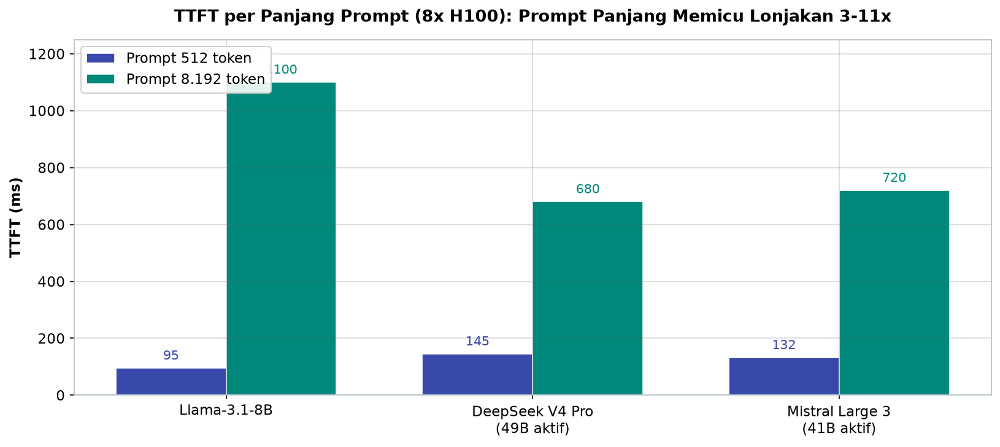
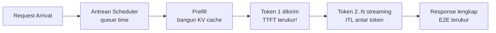
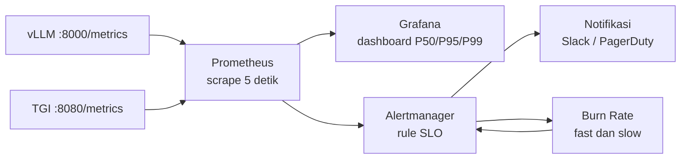

# Bab 5.9: Monitoring Latency — Time to First Token (TTFT) Skala Grup

> Seorang kapten kapal tidak bertanya "apakah kita berlayar?" — ia bertanya "berapa knot sekarang, berapa arus di depan, dan kapan kita harus membelok?" Analogi yang sama berlaku untuk inference LLM di skala produksi: pertanyaan yang tepat bukan "apakah sistem berjalan?" melainkan "berapa milidetik hingga token pertama, berapa milidetik antar token, dan kapan alarm berbunyi sebelum pengguna merasakan lambatnya?" Bab ini membahas metrik-metrik kunci serving LLM, kerangka SLO yang realistis, tumpukan monitoring dengan Prometheus dan Grafana, serta seni memecahkan masalah latency sebelum menjadi insiden. Pada akhirnya, tujuan bab ini sederhana: menjadikan kelambatan sebagai angka yang terukur, bukan keluhan yang terlambat.

---

## 1. Tujuan Sub-Bab

Setelah membaca bab ini, Anda akan mampu:

- Menjelaskan metrik kunci LLM serving: TTFT, TPOT, ITL, E2E Latency, dan throughput
- Menyusun Service Level Objectives (SLO) yang realistis untuk berbagai use case — dari chatbot real-time hingga batch processing
- Menyiapkan tumpukan monitoring Prometheus + Grafana untuk vLLM dan TGI
- Membuat alert rules yang menangkap degradasi latency sejak dini: P99 TTFT, kedalaman antrean, dan okupansi KV cache
- Melakukan troubleshooting sistematis ketika TTFT, TPOT, atau E2E latency bermasalah, termasuk protokol triase insiden
- Menggunakan metrik internal dan probe eksternal secara saling melengkapi untuk memvalidasi SLO dari sudut pandang pengguna
- Menggunakan per-tenant metrics untuk menghindari blind spot dalam multi-tenant serving

---

## 2. Metrik Fundamental LLM Serving

### TTFT: Detak Pertama Tanggapan

**TTFT (*Time to First Token*)** adalah metrik yang paling dirasakan pengguna: waktu dari request masuk hingga token pertama diterima. Ketika Anda menekan Enter pada chatbot dan baris pertama jawaban mulai mengetik, itulah TTFT yang Anda rasakan secara langsung. Secara teknis, TTFT terdiri dari tiga komponen: **queue time** (menunggu giliran di scheduler), **prefill time** (proses prompt awal dan pembangunan KV cache), dan **network latency** (perjalanan bolak-balik ke server). Pedoman industri: untuk *interactive* use case, targetkan TTFT di bawah **200 ms**; untuk *batch processing*, toleransi hingga **2 detik** masih wajar.

Perlu ditegaskan sejak awal bahwa TTFT bukanlah angka tunggal yang stabil — ia adalah distribusi yang berubah sepanjang hari. TTFT pada tengah malam ketika server sepi bisa 80 ms; TTFT pada jam sibuk 14.00 WIB dengan antrean panjang bisa menembus 800 ms. Karena itu, semua pembahasan metrik di bab ini akan selalu menyebut *persentil* (P50, P95, P99), bukan rata-rata tunggal — sebuah disiplin yang akan menjadi kebiasaan setelah Anda membaca bagian SLO di bawah.

### TPOT, ITL, dan E2E

Setelah token pertama, kecepatan generasi diukur dengan **TPOT (*Time Per Output Token*)** — rata-rata waktu yang dibutuhkan model untuk menghasilkan satu token — dan **ITL (*Inter-Token Latency*)**, jeda antar token individual yang menggambarkan kelancaran streaming: ITL yang stabil dan rendah berarti teks mengalir mulus tanpa tersendat-sendat. Dua metrik ini berhubungan erat dengan *memory bandwidth* GPU: karena bobot model harus dibaca ulang setiap langkah decode, TPOT rendah hanya bisa dicapai dengan bandwidth memori yang besar. Terakhir, **E2E Latency** adalah jumlah seluruhnya — dari request masuk hingga respons lengkap — yang merupakan hasil kali TTFT dan TPOT dikali jumlah output token. Dan di belakang semua itu, **throughput** (token per detik atau request per detik) menjadi metrik kapasitas yang menentukan seberapa banyak pengguna dapat dilayani sekaligus.

Persepsi pengguna terhadap kualitas streaming ternyata lebih dekat ke ITL daripada ke TPOT. Dua sistem dengan TPOT rata-rata 15 ms yang sama bisa terasa sangat berbeda: satu dengan ITL yang stabil (semua token tiba dengan jeda seragam) terasa mulus, satu lagi dengan ITL yang berombak (kadang 5 ms, kadang 40 ms) terasa pincang — karenanya, metrik ITL biasanya dipantau dengan persentil ekor sendiri (P95/P99) sebagai indikator "jank" atau guncangan. Bagian Monitoring (Tutorial A) menunjukkan bagaimana mengisolasi kedua metrik ini dari histogram yang sama. Kebiasaan yang baik sejak awal: pantau ITL P99 dan TPOT P50 berdampingan — pasangan ini adalah paket lengkap untuk menilai pengalaman streaming.

---

## 3. SLO Framework: Janji yang Bisa Diukur

### Threshold yang Menjadi Kontrak

SLO mengubah perasaan subjektif ("sepertinya lambat") menjadi kontrak yang terukur. Untuk LLM serving, praktik terbaik [1][5] menetapkan target berlapis: **P50 TTFT < 200 ms, P95 < 500 ms, P99 < 2 detik**; **P50 TPOT < 15 ms, P95 < 30 ms**; dan **error rate < 0,1%** (timeout dan 5xx). Angka-angka ini bukan plafon — batch processing boleh lebih longgar, voice assistant harus lebih ketat (lihat Tabel A) — tetapi menjadi *bahasa bersama* antara tim engineering dan manajemen: bila P99 TTFT menembus 2 detik selama lima menit, alarm berbunyi, bukan perdebatan.

### Goodput dan Multi-Percentile

Mengapa harus membicarakan tiga persentil sekaligus, bukannya satu rata-rata? Karena rata-rata berbohong: median 180 ms yang tampak sehat bisa menyembunyikan ekor 10% pengguna yang menunggu 3 detik. Monitoring multi-percentile — median (P50), ekor tengah (P95), dan ekor paling ujung (P99) — menceritakan pengalaman pengguna sesungguhnya: P50 adalah perasaan pengguna biasa, P99 adalah kesabaran pengguna yang paling tidak beruntung. Dari situ lahir konsep **SLO-based goodput**: persentase request yang berhasil memenuhi *semua* threshold SLO sekaligus. Sebuah request yang selesai dalam 3 detik dengan TTFT 2,5 detik dihitung sebagai *bad work* meski tidak error — karena pengguna sudah merasakan kelambatan.

Perluasan penting dari konsep goodput adalah **menghitung setiap request terhadap SLO yang bersangkutan, bukan satu SLO global**. Request yang datang dari endpoint batch (misalnya `/v1/embeddings`) seharusnya dinilai terhadap SLO batch (TTFT < 5s), bukan SLO interaktif — angka 2 detik di Tabel A untuk batch adalah bukti bahwa penilaian tunggal akan membanjiri dashboard dengan false alarm. Implementasinya di Prometheus: label `endpoint` atau `model_name` pada metrik menjadi pemisah dimensi penilaian, dan setiap aturan alert menargetkan satu kombinasi label — pola yang terlihat pada semua contoh query di bagian praktikum. Menilai semua traffic dengan satu penggaris adalah kesalahan desain monitoring yang paling umum kedua setelah melupakan per-tenant metrics.

---

## 4. Tumpukan Monitoring: Prometheus, Grafana, dan Sahabatnya

Setiap engine inference modern berbicara bahasa Prometheus secara gratis. **vLLM** mengekspos metrik di `:8000/metrics` dan **TGI** di `:8080/metrics` — keduanya dalam format Prometheus yang bisa langsung di-*scrape*. Dari data mentah ini, **Grafana** merangkainya menjadi *dashboard* hidup: histogram TTFT, garis throughput, gauge KV cache, dan antrean request dalam satu layar. Ketika angka melampaui ambang, **Alertmanager** mengambil alih: mengirim notifikasi ke Slack, email, atau PagerDuty sebelum pengguna sempat mengeluh. Dan untuk kasus yang butuh tingkat detail lebih dalam — menemukan request mana yang lambat, trace antar service — **distributed tracing dengan OpenTelemetry** menyediakan lensa per-request yang menelusuri setiap hop dari gateway hingga GPU.

Tiga dashboard yang layak dibangun sejak awal menutup hampir semua kasus insiden harian. **Dashboard operasional** — panel TTFT/TPOT histogram, request rate, dan queue depth per model — adalah ruang triase pertama setiap kali alarm berbunyi. **Dashboard GPU** — utilisasi, suhu, VRAM terpakai, dan KV cache — menjawab pertanyaan "apakah hardware yang bermasalah, bukan software". **Dashboard per-tenant** — TTFT dan jatah resource per API key — menyingkap ketidakadilan yang tidak terlihat pada agregat (bahan studi kasus di akhir bab). Ketiganya dibangun dari metrik yang sama hanya dengan memutar label `model_name` atau menambahkan label tenant di layer proxy. Jangan menunda membangun dashboard ketiga menunggu "sistem besar dulu" — metrik per-tenant jauh lebih murah dibangun sejak awal daripada ditambalkan belakangan pada sistem yang sudah hidup.

---

## 5. Troubleshooting Latency: Membaca Gejala, Menemukan Akar

### TTFT Tinggi: Tiga Tersangka Utama

Ketika token pertama datang terlambat, selidiki tiga kemungkinan. **Queue depth besar** — antrean request menumpuk, tanda kapasitas kurang: replica perlu ditambah atau batch dibatasi. **Prefill lambat** — prompt terlalu panjang sehingga pembangunan KV cache memakan waktu: perpendek prompt, gunakan summarization, atau pindahkan prefill ke prompt machine yang compute-nya tinggi (lihat Bab 5.8). **GPU memory penuh** — KV cache thrashing, yaitu saat cache dipaksa keluar-masuk memori berulang kali: kurangi beban atau naikkan kapasitas. Urutan diagnosisnya: lihat queue depth dulu (metrik paling mudah), baru prefill, lalu memori.

### ITL/TPOT Tinggi: Pembunuh Kelancaran

Token yang tersendat-sendat biasanya berasal dari tiga sumber. **Memory bandwidth bottleneck** — GPU Anda telat karena bobot model terlalu besar untuk bandwidth yang ada: ini masalah hardware, solusinya upgrade GPU atau turunkan presisi (quantization). **Batch terlalu besar** — terlalu banyak request diproses paralel sehingga setiap token kehilangan kecepatan: kurangi `max-num-seqs`. **KV cache swap ke CPU** — cache dibuang ke memori utama karena VRAM penuh lalu diambil lagi: nonaktifkan swap pada konfigurasi engine bila perlu. Urutan ini juga urutan biaya: mulai dari perubahan konfigurasi yang gratis, baru keputusan belanja hardware.

### E2E Latency Tinggi: Menelusuri ke Hulu dan Hilir

Ketika total waktu membengkak, pisahkan dulu kontributornya. Jika **output generation lambat**, akar masalahnya adalah TPOT — bawa kembali ke diagnosis di atas. Jika output normal tetapi total tetap besar, curigai **network latency**: server terlalu jauh dari pengguna — pindahkan ke region yang lebih dekat, pasang CDN untuk aset statis, atau gunakan edge gateway. E2E adalah metrik jemputan: ia tidak memberitahu *di mana* masalah, hanya bahwa masalah itu ada; tugas Anda adalah memecahnya ke TTFT + TPOT + network.

### Protokol Triase: Lima Menit Pertama Insiden

Ketika alarm berbunyi, waktu adalah satu-satunya sumber daya yang tidak bisa dibeli. Protokol triase berikut mengubah kepanikan menjadi prosedur — kerjakan berurutan dan hentikan di langkah yang menemukan akar masalah. **Langkah 1 — konfirmasi bentuk:** periksa dashboard — apakah yang membengkak TTFT, TPOT, atau keduanya? Ini menentukan cabang diagnosis selanjutnya. **Langkah 2 — cek queue:** lihat `vllm:num_requests_waiting`. Antrean menumpuk berarti masalah kapasitas (replica kurang) atau monopoli tenant — periksa per-tenant. **Langkah 3 — cek resource:** lihat `vllm:gpu_cache_usage_perc` dan `avg_gpu_utilization`. Cache mendekati penuh berarti KV cache thrashing; utilisasi GPU rendah dengan latency tinggi berarti prefill atau jaringan. **Langkah 4 — cek model input:** periksa distribusi `vllm:request_prompt_tokens` — lonjakan prompt panjang menjelaskan TTFT naik tanpa perubahan kapasitas. **Langkah 5 — tindakan:** terapkan perbaikan paling murah yang didukung bukti (rate limit, batas prompt, scale out), lalu amati dashboard selama 5-10 menit sebelum menyimpulkan. Disiplin ini memastikan insiden diselesaikan dengan data, bukan tebakan — dan dokumentasinya menjadi materi *post-mortem* yang berharga.

---

## 6. Capacity Planning: Meramal dari Riwayat

Monitoring bukan hanya lensa untuk masa kini — ia juga bola kristal untuk masa depan. **Capacity planning** dimulai dari *historical traffic*: gunakan data permintaan minggu-minggu sebelumnya untuk memprediksi kebutuhan GPU hours, lalu siapkan aturan *auto-scaling* yang dipicu oleh dua sinyal paling jujur: queue depth dan TTFT. Ketika keduanya menanjak, sistem menumbuhkan dirinya sendiri sebelum pengguna mengeluh. Di sisi keuangan, hitung **cost per token** dan **cost per request** — dua angka yang mengubah diskusi infrastruktur dari "berapa GPU" menjadi "berapa harga seekor token" — sehingga keputusan scaling selalu berbasis unit ekonomi, bukan intuisi.

### Dari Metrik Menuju Anggaran: Tiga Formula Kunci

Tiga perhitungan sederhana mengubah data mentah menjadi keputusan anggaran. Pertama, **GPU hours per hari**: kalikan jumlah total token yang dilayani dengan perkiraan throughput per GPU — hasilnya memberitahu berapa GPU yang harus selalu menyala, dan berapa yang cukup di-*spin up* saat puncak. Kedua, **cost per token**: bagi biaya total infrastruktur (GPU + listrik + jaringan) dengan jumlah token yang berhasil dilayani — ini angka yang paling jujur untuk mengevaluasi optimasi: jika speculative decoding menaikkan throughput 2,8x, cost per token turun drastis meski perangkat kerasnya sama. Ketiga, **error budget**: kalikan SLO availability dengan jumlah request per bulan — misalnya availability 99,9% dari 10 juta request berarti Anda hanya boleh gagal 10.000 request; setiap insiden mengurangi sisa anggaran, dan *burn rate* menentukan seberapa cepat peringatan harus berbunyi. Ketiga formula ini menghubungkan layer metrik (Tabel B) dengan layer keputusan bisnis — dan menjadikan monitoring sebagai alat negosiasi anggaran, bukan sekadar papan skor.

Semua keputusan di bagian ini — SLO, alert, scaling, anggaran — hanya bermakna bila data yang mendasarinya dipercaya semua pihak. Karena itu, tutup setiap diskusi kapasitas dengan pertanyaan yang sama: *metrik mana yang menjadi bukti, dan siapa yang bertanggung jawab memastikannya akurat?* Jawaban yang baik biasanya bermuara pada satu komitmen teknis: semua metrik kunci dicatat, diberi label yang konsisten, dan diarsipkan lebih lama dari masa mengeluh pengguna. Data yang hilang sama buruknya dengan data yang bohong.

---

## 7. Tabel Wajib

### Tabel A: SLO Matrix untuk Berbagai Use Case

Matriks SLO yang berbeda per use case — perhatikan bagaimana persyaratan berlaku untuk satu domain tidak berarti untuk domain lain.

| Use Case | TTFT P50 | TTFT P99 | TPOT P50 | E2E P95 | Availability |
|:---|:---:|:---:|:---:|:---:|:---:|
| Chatbot real-time | < 200ms | < 1s | < 15ms | < 5s | 99.9% |
| AI Coding Assistant | < 300ms | < 1.5s | < 20ms | < 8s | 99.5% |
| Batch Processing | < 5s | < 30s | < 50ms | < 5m | 99.0% |
| Voice Assistant | < 100ms | < 500ms | < 10ms | < 2s | 99.95% |
| RAG Pipeline | < 500ms | < 2s | < 25ms | < 10s | 99.5% |

Ada hierarki halus di tabel ini. *Availability* menurun ketika TTFT dilonggarkan — batch processing hanya menuntut 99,0% availability karena retry jauh lebih murah daripada antrean interaktif. Sebaliknya, voice assistant menuntut kombinasi paling ketat (TTFT P50 100 ms, TPOT 10 ms, availability 99,95%) karena keterlambatan 300 ms dalam percakapan suara langsung terdengar tidak wajar. Ketika dua use case berbagi infrastruktur, SLO termahal yang menang — dan perbedaan harga inilah yang memberitahu Anda mengapa voice assistant sebaiknya mendapat dedicated resource.

Satu hal yang tidak terlihat di tabel namun tak kalah penting: **SLO adalah angka yang hidup, bukan plak tembok**. Ia harus ditinjau ulang seiring pertumbuhan produk — SLO yang terlalu ketat membuat tim mengejar angka yang tidak menyenangkan pengguna (boros resource), sedangkan SLO yang terlalu longgar membuat degradasi tidak terdengar. Praktik yang disarankan Google SRE [5]: mulai dari target yang optimistis, ukur selama sebulan, lalu sesuaikan berdasarkan data dan prioritas bisnis — bukan berdasarkan keinginan marketing. Proses ini juga menghasilkan dokumentasi keputusan: siapa yang menyetujui, mengapa angkanya begitu, dan kapan akan ditinjau kembali — agar perdebatan "SLO ini siapa yang buat?" tidak pernah terulang.

### Tabel B: Metrik Prometheus — vLLM Key Metrics

Kamus metrik yang diekspos vLLM di endpoint `/metrics` — masing-masing siap di-*scrape* Prometheus beserta labelnya.

| Metric Name | Type | Labels | Description |
|:---|:---:|:---|:---|
| `vllm:time_to_first_token_seconds` | Histogram | model_name, pod | TTFT distribution |
| `vllm:inter_token_latency_seconds` | Histogram | model_name | Per-token latency |
| `vllm:request_prompt_tokens` | Histogram | model_name | Input token count |
| `vllm:request_generation_tokens` | Histogram | model_name | Output token count |
| `vllm:num_requests_running` | Gauge | model_name | Active requests |
| `vllm:num_requests_waiting` | Gauge | model_name | Queued requests |
| `vllm:gpu_cache_usage_perc` | Gauge | model_name | KV-cache utilisation |
| `vllm:avg_gpu_utilization` | Gauge | model_name, pod | GPU compute util |

Tiga hal patut diperhatikan. Pertama, metrik histogram (TTFT, ITL) adalah bahan baku untuk menghitung persentil dengan `histogram_quantile` — inilah yang menggerakkan seluruh SLO kita. Kedua, pasangan `num_requests_running` dan `num_requests_waiting` membentuk sinyal kapasitas yang sangat jujur: waiting yang terus bertambah berarti replica kewalahan. Ketiga, perhatikan label `model_name` pada hampir semua metrik — ini fondasi untuk pemantauan per-tenant yang akan menyelamatkan Anda di studi kasus bab ini.

Satu catatan metodologis tentang metrik histogram yang penting dipahami sebelum menurunkan SLO: **kualitas persentil bergantung pada kualitas bucket**. Bucket default metrik vLLM memberi resolusi yang terbatas pada rentang di bawah 100 ms; jika SLO Anda menuntut presisi di bawah sana (seperti voice assistant pada Tabel A), pertimbangkan untuk memperkaya bucket atau menggabungkan dengan probe khusus yang menggunakan bucket eksponensial. Demikian pula, jangan membandingkan persentil dari dua sistem yang dihitung dengan bucket berbeda — perbandingan P99 hanya adil bila granularitas histogramnya sebanding. Ini detail teknis yang jarang dibahas, tetapi sering menjadi sumber "misteri" ketika dua dashboard menunjukkan angka yang berbeda untuk metrik yang sama.

### Tabel C: Reference Latency Numbers (H100, 8x)

Acuan angka latency yang diukur pada 8x H100 — jadikan tabel ini kertas ukur sebelum menyimpulkan sistem Anda "lambat".

| Model | Prompt Length | Output Tokens | TTFT (ms) | TPOT (ms/tok) | E2E (s) | Throughput (tok/s) |
|:---|:---:|:---:|:---:|:---:|:---:|:---:|
| Llama-3.1-8B | 512 | 128 | 95 | 8.5 | 1.2 | 107 |
| Llama-3.1-8B | 8192 | 1024 | 1,100 | 15.8 | 17.3 | 59 |
| DeepSeek V4 Pro (49B aktif) | 512 | 128 | 145 | 12.2 | 1.7 | 78 |
| DeepSeek V4 Pro (49B aktif) | 8192 | 1024 | 680 | 18.5 | 20.1 | 51 |
| Mistral Large 3 (41B aktif) | 512 | 128 | 132 | 11.8 | 1.6 | 83 |
| Mistral Large 3 (41B aktif) | 8192 | 1024 | 720 | 19.2 | 20.8 | 49 |
| Ministral 3 8B | 512 | 128 | 78 | 7.1 | 1.0 | 128 |
| Gemini 2.5 Pro (via API) | 512 | 128 | 210 | 15.0 | 2.1 | 62 |



*Gambar 5.9-1 — Panjang prompt adalah musuh TTFT (Llama-3.1-8B melonjak >10x); pada konteks 8K, DeepSeek V4 Pro justru mengungguli model kecil karena efisiensi KV-cache mengalahkan ukuran model.*

Tabel ini mengajarkan dua pelajaran. Pertama, **panjang prompt adalah musuh TTFT**: melanjutkan Llama-3.1-8B dari prompt 512 ke 8.192 token menaikkan TTFT lebih dari 10x lipat (95 → 1.100 ms). Kedua, efisiensi KV cache nyata terlihat pada DeepSeek V4 Pro: dengan 8.192 token konteks, TTFT-nya hanya 680 ms — bandingkan estimasi 6+ detik pada DeepSeek V3.2 untuk panjang yang sama, karena KV cache V4 Pro hanya 10% ukuran V3.2. Ini menjelaskan mengapa penyedia API dapat menjual konteks panjang dengan harga yang masuk akal — strukturnya memang murah.

Ada satu pola lagi yang tidak boleh terlewat: **jarak antara model kecil dan model besar menyempit saat konteks memanjang**. Pada prompt 512 token, Llama-3.1-8B unggul jauh dalam TTFT (95 ms vs 145 ms DeepSeek V4 Pro). Namun pada 8K token, DeepSeek V4 Pro justru lebih cepat (680 ms vs 1.100 ms) meskipun parameter aktifnya 6x lebih besar — karena efisiensi KV cache mengalahkan ukuran model. Implikasinya praktis: jika mayoritas trafik Anda ber-*konteks panjang*, memilih model dengan arsitektur KV cache efisien lebih berdampak pada latency daripada memilih model kecil. Ketika membandingkan angka sistem Anda sendiri dengan Tabel C, ingat juga bahwa angka ini diukur pada 8x H100 — pada GPU yang lebih lemah, skala perbedaannya tetap (proporsional), tetapi absolutnya bisa jauh berbeda. Gunakan tabel ini sebagai *sanity check*, bukan kitab suci.

---

## 8. Diagram & Visualisasi

### Gambar 1: Anatomi Latency LLM Request

Linimasa perjalanan sebuah request — dari kedatangan hingga respons lengkap — dengan titik pengukuran setiap fase:



Gambar ini adalah peta pembedahan E2E: dari kiri ke kanan, setiap panah adalah ruas yang bisa diukur terpisah. Ketika ada insiden latency, Anda tidak perlu menebak — cukup cek ruas mana yang membengkak: antrean (queue time), prefill (TTFT minus queue), atau generasi (TPOT/ITL). Tanpa peta ini, "sistem lambat" hanyalah frase; dengannya, ia menjadi daftar tersangka yang terukur.

Ada satu detail penting yang tidak terlihat di diagram: titik pengukuran TTFT di sisi klien *tidak persis sama* dengan di sisi server. vLLM mengukur TTFT dari saat request diterima engine hingga token pertama keluar — angka yang bersih dari jaringan. Namun pengguna Anda mengukur dari saat tombol kirim ditekan — termasuk waktu perjalanan ke server, antrean di load balancer, dan perjalanan kembali. Perbedaan keduanya bisa puluhan hingga ratusan milidetik pada koneksi lintas benua. Karena itu, praktik terbaiknya adalah memantau *keduanya*: TTFT internal (vLLM) untuk diagnosis teknis, dan TTFT end-to-end (lewat synthetic probe seperti pada Tutorial B) untuk validasi SLO dari sudut pandang pengguna. SLO yang ditetapkan pada Tabel A merujuk pada pengalaman pengguna — pastikan metrik yang Anda pantau memang mengukurnya.

### Gambar 2: Alur SLO dan Burn Rate

Bagaimana pemantauan SLO bekerja sebagai sistem peringatan dini — dari pengumpulan metrik hingga keputusan alerting:



Aliran ini menunjukkan dua jalur konsumsi data: Grafana untuk mata manusia (dashboard) dan Alertmanager untuk mata mesin (rules otomatis). Hubungan dua arah antara Alertmanager dan Burn Rate penting: *burn rate* — seberapa cepat error budget SLO Anda terbakar — menentukan kapan alert berkekuatan penuh berbunyi (fast burn) dan kapan peringatan dini yang tenang (slow burn). Sistem yang sehat tidak menunggu SLO dilanggar selama satu jam; ia memantau kecepatan pembakaran budget sejak menit pertama.

Contoh konkret kapan burn rate memicu peringatan: misalkan SLO P99 TTFT < 2 detik dengan budget 99,9% selama 30 hari — Anda boleh "gagal" 0,1% request, sekitar 0,1% × 1 juta request per hari ≈ 1.000 request per hari. Jika hari ini burn rate menyentuh 2 (dua kali lebih cepat dari yang dianggarkan), maka error budget yang tersisa akan habis dalam 15 hari, bukan 30 — itu sinyal *slow burn* untuk perencanaan, bukan panik. Burn rate 14,4 adalah pemicu alert `critical` — budget habis dalam 2 jam. Angka-angka ini memberi tim bahasa yang sama: bukan "kenapa ini lambat?", melainkan "error budget kita tinggal 45%, burn rate 1,8 — eskalasi ke pager hari ini atau besok?"

---

## 9. Praktikum / Hands-On

### Langkah 1: Setup Monitoring vLLM dengan Prometheus + Grafana

Mulai dari konfigurasi Prometheus untuk men-*scrape* tiga instance vLLM:

```yaml
# prometheus.yml
scrape_configs:
  - job_name: 'vllm'
    scrape_interval: 5s
    metrics_path: /metrics
    static_configs:
      - targets:
        - 'vllm-server-1:8000'
        - 'vllm-server-2:8000'
        - 'vllm-server-3:8000'
```

```bash
# Run Prometheus + Grafana
docker compose up -d prometheus grafana

# Query contoh:
# Histogram TTFT P50
histogram_quantile(0.50,
  sum(rate(vllm:time_to_first_token_seconds_bucket[5m]))
  by (le, model_name))

# Cache usage per GPU
avg(vllm:gpu_cache_usage_perc) by (model_name)
```

`scrape_interval: 5s` berarti setiap instance di-sampling 12 kali per menit — cukup rapat untuk menangkap lonjakan, cukup hemat untuk tidak membebani server. Query `histogram_quantile` adalah jantung analisis persentil: ia mengonversi histogram kumulatif mentah menjadi persentil yang bisa dibaca manusia. Simpan kedua query ini sebagai panel pertama dashboard Grafana Anda — mereka adalah termometer dasar seluruh sistem.

### Langkah 2: Custom Python Monitoring Script

Ketika engine Anda bukan vLLM/TGI atau Anda membutuhkan proksi tingkat aplikasi, script Python dengan prometheus_client ini melakukan probing langsung ke API:

```python
# monitor_ttft.py
import requests
import time
from prometheus_client import start_http_server, Histogram, Gauge
import threading

TTFT = Histogram('llm_ttft_seconds', 'Time to first token',
                 buckets=[0.01, 0.05, 0.1, 0.2, 0.5, 1.0, 2.0, 5.0])
QUEUE = Gauge('llm_queue_depth', 'Current queue depth')
THROUGHPUT = Gauge('llm_throughput_tok_s', 'Output tokens per second')

def probe_vllm():
    while True:
        start = time.time()
        try:
            response = requests.post(
                "http://localhost:8000/v1/completions",
                json={"model": "default", "prompt": "test", "max_tokens": 1},
                timeout=10,
            )
            ttft = time.time() - start
            TTFT.observe(ttft)
        except Exception as e:
            print(f"Error: {e}")
        time.sleep(1)

start_http_server(8001)
threading.Thread(target=probe_vllm, daemon=True).start()
input("Monitoring running...")
```

Perhatikan trik `max_tokens: 1` — dengan meminta hanya satu token, `ttft` yang diukur adalah TTFT murni tanpa kebisingan generasi. Histogram dengan buckets eksponensial (0,01 hingga 5,0 detik) sengaja memusatkan resolusi pada rentang SLO interaktif, tempat deteksi perubahan paling penting.

**Refleksi desain script di atas** membantu memahami pola pikir *synthetic probe* secara umum. Script ini mengukur sistem dari luar (black-box) — berbeda dari metrik internal vLLM yang melihat ke dalam engine. Keduanya saling melengkapi: metrik internal akurat tetapi mungkin tidak mewakili apa yang dirasakan pengguna (yang melewati jaringan, gateway, dan antrean aplikasi); probe eksternal mengukur pengalaman nyata tetapi menambah beban sintetis dan tidak dapat membedakan komponen mana yang lambat. Di produksi, jalankan keduanya: metrik internal (`:8000/metrics`) untuk pembedahan akar masalah, probe eksternal (script di atas) untuk validasi SLO dari sudut pandang pengguna — termasuk rute yang melewati load balancer dari Bab 5.8. Perhatikan bahwa probe dengan `max_tokens: 1` hanya mengukur TTFT dan jaringan; untuk memantau TPOT, ubah `max_tokens` menjadi 50-100 dan bagi total waktu dengan jumlah token yang diterima — persis seperti pengukuran yang dilakukan vendor model pada Tabel C.

### Langkah 3: Alert Rules untuk P99 TTFT

Akhirnya, aturan alarm yang menjaga SLO — tiga aturan, tiga lapisan peringatan:

```yaml
# alert-rules.yml
groups:
  - name: llm_slo
    rules:
      - alert: HighTTFT
        expr: |
          histogram_quantile(0.99,
            sum(rate(vllm:time_to_first_token_seconds_bucket[5m]))
            by (le, model_name)
          ) > 2.0
        for: 5m
        labels:
          severity: critical
        annotations:
          summary: "P99 TTFT > 2s untuk {{ $labels.model_name }}"

      - alert: QueueGrowing
        expr: |
          avg(vllm:num_requests_waiting) by (model_name)
          > 50
        for: 2m
        labels:
          severity: warning
        annotations:
          summary: "Queue > 50 untuk {{ $labels.model_name }}"

      - alert: KVCacheNearFull
        expr: |
          avg(vllm:gpu_cache_usage_perc) by (model_name)
          > 0.95
        for: 1m
        labels:
          severity: warning
```

Tiga aturan ini membentuk piramida peringatan dini. `KVCacheNearFull` (warning, 1 menit) memberitahu Anda lebih awal bahwa memori sedang penuh; `QueueGrowing` (warning, 2 menit) menunjukkan tekanan sudah merambat ke antrean; `HighTTFT` (critical, 5 menit) adalah bukti pengalaman pengguna sudah rusak. Klausa `for: 5m` mencegah alert palsu dari lonjakan sesaat — hanya degradasi yang bertahan yang dihukum. Template `{{ $labels.model_name }}` membuat setiap alert informatif saat dikirim ke Slack.

Dua disiplin operasional melengkapi alert rules ini. Pertama, **jalankan piket triase segera setelah alert**: SLO-*based* monitoring hanya berarti jika ada pemilik yang jelas untuk setiap peringatan — tentukan on-call engineer dan runbook (protokol triase pada sub-bab di atas) sebelum insiden terjadi, bukan saat alarm berbunyi. Kedua, **audit false positive secara berkala**: alert yang sering berbunyi tanpa aksi akan diabaikan orang — kematian bisu sebuah alerting system. Jika `QueueGrowing` sering trigger padahal sistem sehat, naikkan ambangnya; sebaliknya, jika P99 TTFT memburuk tanpa alert, periksa kembali durasi `for` dan cakupan bucket histogram. Alerting yang baik adalah sistem yang *jarang* berbunyi tetapi selalu benar ketika berbunyi.

---

## 10. Studi Kasus: Platform Chatbot — Debug Lonjakan Latency

**Insiden.** Sebuah platform chatbot melayani ratusan ribu percakapan harian tiba-tiba mengalami degradasi: **P99 TTFT naik dari 400 ms ke 4,2 detik dalam 10 menit** — pengguna mengeluh, tim panik, dan tidak ada yang tahu dari mana mulainya.

**Deteksi.** Sistem yang telah dipasang sesuai bab ini bekerja sesuai rancangannya: Alertmanager memicu alarm HighTTFT lebih dulu dari keluhan pengguna, dan dashboard menunjukkan **queue depth 200+** — antrean request menumpuk jauh di atas ambang normal.

**Root cause.** Penelusuran menunjukkan satu pelanggan mengirim **10.000 request batch dengan prompt 32K token** sekaligus. Setiap request raksasa itu menelan waktu prefill yang lama dan menempati porsi besar KV cache, sehingga seluruh slot GPU habis terisi dan request-request interaktif pengguna lain mengantre tanpa harapan. Satu pelanggan — meskipun tidak berniat jahat — menjadi penguasa kartel atas seluruh infrastruktur.

**Solusi langsung.** Dua langkah segera: *rate limit per API key* untuk menghentikan lonjakan tunggal, dan **max prompt length 8K** untuk membatasi ukuran request yang boleh masuk. Lonjakan itu berhenti dalam hitungan menit, dan P99 TTFT kembali ke garis dasar.

**Solusi jangka panjang.** Tim belajar bahwa pembatas global tidak cukup. Mereka mengimplementasikan *priority queue* — request interaktif didahulukan dari request batch — dan **resource isolation per tenant**: jatah slot dan KV cache per pelanggan, sehingga tenant mana pun tidak bisa lagi memonopoli cluster.

**Monitoring baru.** Dashboard ditambah pemantauan **per-tenant TTFT** dan alert khusus: jika satu tenant memonopoli lebih dari 50% GPU cache, alarm berbunyi. Pelajaran yang dipetik — *monitoring tanpa per-tenant metrics adalah blind spot dalam multi-tenant serving*: sistem dapat terlihat sehat secara agregat sementara satu pengguna korban kelaparan (starvation) di balik yang lain. Metrik agregat menyembunyikan ketidakadilan; metrik per-tenant menyingkapkannya.

**Post-mortem dalam satu halaman.** Dokumentasi insiden menyimpulkan tiga hal yang bisa ditiru tim lain. Pertama, *deteksi yang baik adalah deteksi yang lebih cepat dari keluhan*: alarm HighTTFT berbunyi 4 menit sebelum laporan pengguna masuk — investasi pada alert berbasis SLO (Tutorial C) terbukti membayar sendiri pada insiden pertama. Kedua, *perbaikan sementara yang baik selalu disertai batas waktu*: rate limit 8K dan batas prompt panjang dipasang sebagai solusi jangka pendek, dengan jadwal tinjauan dua minggu — bukan sebagai peraturan permanen yang tak pernah dievaluasi. Ketiga, *setiap blind spot yang ditemukan harus menghasilkan metrik baru*: insiden ini melahirkan dua metrik baru (per-tenant TTFT dan per-tenant cache share) yang kemudian menyingkap dua insiden minor berikutnya lebih awal. Insiden yang didokumentasikan dengan disiplin seperti ini berubah dari "hari buruk" menjadi investasi pengetahuan kolektif.

---

## 11. Referensi

### Paper Jurnal/Konferensi

[1] Sheng, Y., Cao, S., Li, D., Zhu, B., Li, Z., Zhuo, D., Gonzalez, J.E. & Stoica, I. (2024). *Fairness in Serving Large Language Models*. 18th USENIX Symposium on Operating Systems Design and Implementation (OSDI). [https://www.usenix.org/conference/osdi24/presentation/sheng-ying](https://www.usenix.org/conference/osdi24/presentation/sheng-ying)

[2] Wu, B., Zhong, Y., Zhang, Z., Shen, G., Liu, W., Chen, Y., Zhang, X. & Wu, X. (2024). *Efficient Interactive LLM Serving with Proxy Model-based Sequence Length Prediction*. Proceedings of Machine Learning and Systems (MLSys). DOI: [10.48550/arXiv.2404.08509](https://arxiv.org/abs/2404.08509)

[3] Patel, P., Choukse, E., Zhang, C., Shah, A., Goiri, Í., Maleki, S. & Bianchini, R. (2024). *Splitwise: Efficient Generative LLM Inference Using Phase Splitting*. International Symposium on Computer Architecture (ISCA). DOI: [10.1109/ISCA59077.2024.00019](https://doi.org/10.1109/ISCA59077.2024.00019)

[4] Kwon, W., et al. (2023). *Efficient Memory Management for Large Language Model Serving with PagedAttention*. 29th Symposium on Operating Systems Principles (SOSP). DOI: [10.48550/arXiv.2309.06180](https://arxiv.org/abs/2309.06180) — menjelaskan mengapa *memory management* menentukan TTFT dan stabilitas latensi saat banyak *request* dilayani bersamaan, fondasi metrik *Time to First Token* pada bab ini.

[5] Zheng, L., et al. (2024). *SGLang: Efficient Execution of Structured Language Model Programs*. 38th Conference on Neural Information Processing Systems (NeurIPS). DOI: [10.48550/arXiv.2312.07104](https://arxiv.org/abs/2312.07104) — menunjukkan pengaruh *radix attention* dan *API speculation* terhadap *latency* dan TTFT pada server multiuser.

[6] Databricks. (2024). *LLM Inference Performance Engineering: Best Practices*. Databricks Engineering Blog. [https://www.databricks.com/blog/llm-inference-performance-engineering-best-practices](https://www.databricks.com/blog/llm-inference-performance-engineering-best-practices)

[7] Hughes, A., et al. (2024). *SLOs for Large Language Model Serving*. Google SRE Blog. [https://sre.google/resources/sre-llm](https://sre.google/resources/sre-llm)

[8] DeepSeek AI. (2026). *DeepSeek-V4: System Card and Latency Benchmarks*. [https://api-docs.deepseek.com/](https://api-docs.deepseek.com/)

[9] Mistral AI. (2025). *Mistral Large 3: Performance and Latency*. [https://mistral.ai/news/mistral-large-3/](https://mistral.ai/news/mistral-large-3/)

### Referensi Pendukung (Dokumentasi/Repository)

[10] Google SRE. *Service Level Objectives*. [https://sre.google](https://sre.google)

[9] Prometheus. *Documentation*. [https://prometheus.io/docs](https://prometheus.io/docs)

[10] vLLM. *Metrics Official Documentation*. [https://docs.vllm.ai](https://docs.vllm.ai)