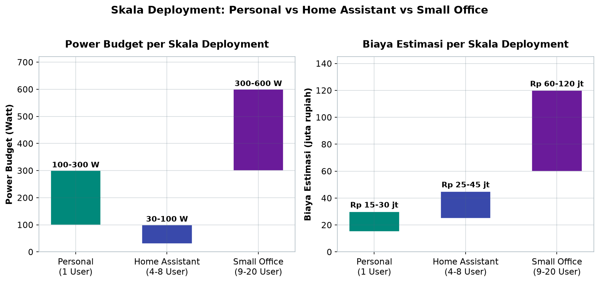
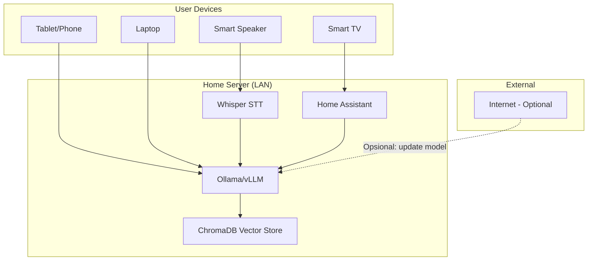
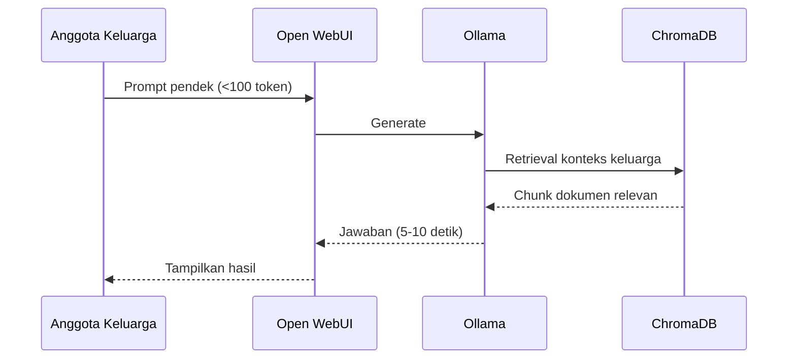

# Bab 6.1: Karakteristik Sistem

> Bayangkan dapur rumah Anda: bukan kafe yang melayani ratusan pelanggan, juga bukan sekadar dapur untuk satu orang yang memasak sendiri. Dapur keluarga — dengan empat sampai delapan orang yang silih berganti masuk, meminta ini-itu, dan kadang tiga orang bertanya bersamaan saat jam makan malam. Itulah esensi *Home AI Assistant*: sebuah sistem LLM lokal yang melayani kebutuhan keluarga, bukan melayani perusahaan. Bab ini membuka Jilid 2 dengan mendesain sistem seperti itu dari nol — dari pilar desain hingga SLA yang realistis.

---

## 1. Tujuan Sub-Bab


Setelah membaca sub-bab ini, Anda akan mampu:

- Membedakan secara fundamental antara sistem LLM *personal* (1 user), *Home Assistant* (4-8 user), dan *small office* (9-20 user) — dari sisi concurrency, uptime, daya, hingga biaya
- Merancang trade-off arsitektur antara **low power**, **availability**, dan **privacy** untuk konteks rumah tangga
- Menganalisis pola beban harian keluarga (*load pattern*) dan menerjemahkannya ke target SLA yang realistis, bukan target *enterprise* yang berlebihan
- Mengidentifikasi komponen sistem standar: LLM server, RAG pipeline, *smart home bridge*, dan *voice interface* — serta kapan setiap komponen layak dipasang
- Membuat keputusan arsitektur jaringan *local-first*: akses lewat LAN dan mDNS, tanpa *port forwarding* ke internet
- Memperkirakan kebutuhan hardware dan biaya total sesuai skenario keluarga, serta menghitung *payback period* dibandingkan langganan AI komersial

---

## 2. Definisi Home AI Assistant


**Home AI Assistant** bukan sekadar "LLM di rumah". Ia adalah sistem inferensi lokal yang melayani 4-8 anggota keluarga secara simultan — dengan karakter operasional yang sangat berbeda dari server kantor. Ini penting dipahami sejak awal: persis seperti tidak mungkin mengelola keluarga dengan SOP perusahaan, sistem LLM rumahan juga tidak boleh dirancang dengan mentalitas *datacenter*.

Karakteristik unik sistem ini mudah diingat melalui tiga kata kunci. Pertama, **concurrency rendah** — meskipun rumah dihuni delapan orang, sangat jarang delapan orang melakukan *prompt* secara bersamaan; lonjakan paling realistis hanya 2-3 pengguna pada jam sibuk. Kedua, **prioritas latensi sedang** — respons 5-10 detik masih sangat bisa diterima untuk pertanyaan PR, resep masak, atau ringkasan dokumen; keluarga bukan bursa saham. Ketiga, **kebutuhan uptime yang fleksibel** — tidak ada alasan sistem menyala 24/7 saat seluruh penghuni tidur; uptime 99,999% adalah jawaban untuk masalah yang tidak dimiliki rumah tangga.

Akibatnya, banyak fasilitas yang wajib di kantor justru tidak perlu ada di rumah: **tidak perlu SSO** (*single sign-on*) dengan *identity provider*, **tidak perlu audit log** yang *tamper-evident*, dan **tidak perlu auto-scaling** untuk menaik-turunkan kapasitas. Justru yang dibutuhkan adalah kesederhanaan, efisiensi daya, dan kemudahan perawatan oleh anggota keluarga yang bukan *IT professional*. Sistem yang dirancang berlebihan akan mati pelan-pelan karena tidak ada yang sanggup memeliharanya.

Ada sebuah uji sederhana untuk menguji mentalitas desain ini: tanyakan, "siapa yang mematikan server ini?" Jika jawabannya adalah ayah yang harus membuka terminal untuk me-restart setiap kali lampu indikator berkedip, sistem itu milik seorang *engineer* — bukan keluarga. Sistem rumahan yang sehat berjalan di latar belakang kehidupan rumah: menyala saat dibutuhkan, tidur saat semua tidur, dan tidak pernah menuntut perhatian pada jam-jam tersibuk rumah tangga — yang justru biasanya merupakan puncak pemakaian asisten.

Analoginya bisa didekatkan dengan mesin fotokopi: di kantor, mesin fotokopi dioperasikan petugas khusus, dihitung per lembar, dan dirawat kontrak servis. Di rumah, mesin fotokopi itu cukup diletakkan di pojok ruang kerja — semua orang tahu cara memakainya, tidak ada yang menghitung, dan siapa pun bisa mengganti tinta. Home AI Assistant dirancang untuk jadi mesin fotokopi itu: cukup berguna sehingga dipakai setiap hari, cukup sederhana sehingga tidak pernah menjadi "pekerjaan" bagi penghuninya.

### Tabel 1: Perbandingan Skala Deployment

Tabel berikut membandingkan tiga skala deployment secara berdampingan — dari sistem personal, *Home Assistant*, hingga *small office* — agar pembaca melihat bahwa setiap kolom berubah drastis ketika konteksnya berubah.

| Karakteristik | Personal (1 User) | Home Assistant (4-8 User) | Small Office (9-20 User) |
|:---|:---|:---|:---|
| **Concurrency** | 1 sequential | 2-3 peak | 5-10 peak |
| **Uptime Target** | Saat dipakai | ~16 jam/hari | 24/7 |
| **Power Budget** | ~100-300W (saat running) | ~30-100W (idle rendah) | ~300-600W |
| **Storage (Vector DB)** | Tidak perlu | ~100-500 GB | ~1-5 TB |
| **Backup** | Tidak perlu | Backup mingguan manual | Backup otomatis + redundancy |
| **IAM** | Single user | Family account (sederhana) | SSO/OAuth |
| **Cooling** | Fan standar | Silent/low noise | Rack cooling |
| **Biaya Estimasi** | ~Rp 15-30jt | ~Rp 25-45jt | ~Rp 60-120jt |

Rentang daya dan biaya ketiga skala ini lebih mudah dibaca sebagai batang — perhatikan bagaimana *Home Assistant* justru duduk di tengah, jauh lebih ringan dari *Small Office* namun lebih besar dari sistem personal.



*Gambar 6.1-1 — Rentang power budget dan biaya estimasi Personal, Home Assistant, dan Small Office. Home Assistant menuntut idle serendah 30-100W dan biaya ~Rp 25-45jt — jauh di bawah beban dan anggaran kantor, tetapi lebih besar dari sistem satu pengguna.*

Perhatikan dua kolom yang paling sering salah dikelola. Pertama, **power budget**: dari ~100-300W saat *running* pada sistem personal, *Home Assistant* menuntut idle rendah 30-100W — tuntutan yang tidak pernah ada di kantor 300-600W. Kedua, **IAM**: keluarga cukup dengan *family account* sederhana, sementara kantor butuh SSO/OAuth. Artinya, membeli solusi kantor lalu "mengecilkannya" untuk rumah adalah kesalahan arah — yang benar adalah mendesain dari kebutuhan rumah itu sendiri. Studi *Small Language Models: Survey, Measurements, and Insights* [3] menegaskan bahwa karakterisasi beban kerja yang tepat (token/s, *memory footprint*, konsumsi energi) menentukan kelayakan *edge deployment* — dan keluarga adalah kasus penggunaan *edge* paling jujur.


### Gambar 1: Arsitektur Home AI Assistant

Berikut peta lengkap sistem yang sedang kita rancang — perangkat keluarga di kiri, server rumah di tengah, dan internet hanya sebagai aksesori opsional.



Yang langsung terlihat dari diagram ini adalah prinsip *local-first*: garis putus-putus menuju internet hanyalah aksesori — untuk *update* model atau pembaruan sistem — bukan jalur utama. Tablet, laptop, dan *smart speaker* berkomunikasi langsung dengan **Ollama/vLLM** di dalam LAN; TV dan perangkat rumah berkolaborasi lewat **Home Assistant**; dan seluruh percakapan berpotongan di vector store **ChromaDB** saat jawaban membutuhkan konteks dokumen keluarga. Tidak ada satu pun busur yang keluar rumah — tepat seperti yang dijanjikan pilar *High Privacy*.

Dari sudut pandang pengguna, diagram ini bisa disederhanakan menjadi satu kalimat: apa pun perangkatnya, keluarga selalu "berbicara" dengan satu pintu yang sama di dalam rumah. Konsistensi ini bukan kebetulan — ia lahir dari keputusan desain bahwa semua *user device* berbicara dalam satu protokol (HTTP/WebSocket ke Open WebUI atau REST API lokal), sehingga menambah perangkat baru (smartwatch anak, tablet kedua) tidak pernah menuntut perubahan arsitektur. Sistem yang dirancang baik adalah sistem yang membuat pengguna tidak perlu tahu cara kerjanya.


---

## 3. Pilar Desain Sistem


Lima pilar berikut adalah konstitusi dari setiap Home AI Assistant yang sehat. Jika satu pilar dilanggar, sistem akan terasa "salah" — seperti resep masakan yang bahannya benar, tetapi takarannya keliru.

### Low Power: 15-30W saat Idle

Server kantor diam-diam menyedot 300W selama 24 jam — sekitar 7,2 kWh per hari hanya untuk "berpikir kosong". Di rumah, server seperti itu akan tampak begitu menyakitkan di tagihan listrik bulanan. Karena itu pilar pertama menuntut konsumsi **15-30W saat idle**, dengan GPU tidur (*sleep*) di malam hari. Dampak praktisnya: arsitektur hardware harus hemat daya sejak awal, dan *auto shutdown* GPU pada jam tidur keluarga adalah fitur wajib, bukan kemewahan.

### High Privacy: Semua Data Tinggal di Rumah

Pilar kedua adalah **privasi tinggi**: data keluarga — percakapan anak, catatan medis, dokumen pajak, jadwal kerja orang tua — tidak boleh meninggalkan rumah. Inilah pembeda paling kontras dengan asisten cloud: risiko *data leakage* bukan lagi tanggung jawab vendor di luar sana, melainkan sepenuhnya menjadi keunggulan arsitektur. Dengan inference lokal, tidak ada yang "mendengarkan" percakapan dapur, karena gelombang suara hanya berubah jadi tensor di dalam server keluarga.

### Local-first Networking: Tidak Bergantung Internet

Pilar ketiga: **jaringan local-first** — DNS lokal, akses *LAN-only*. LLM server harus tetap bisa melayani keluarga meski koneksi internet rumah mati. Ini bukan sekadar preferensi: jika sistem bergantung pada *cloud*, maka *outage* ISP menjadi *outage* asisten keluarga. Desain ini juga yang membuat sistem tetap cepat: tidak ada *round-trip* keluar rumah, tidak ada antrean di server orang lain.

### Intermiten Availability: Boleh Mati Malam Hari

Pilar keempat adalah paradoks yang paling sulit dipahami orang *enterprise*: **ketersediaan intermiten** justru diinginkan. Sistem boleh mati tengah malam saat semua tidur, dan menyala kembali saat keluarga bangun. Tidak hanya menghemat listrik — jadwal mati-hidup ini juga memperpanjang umur komponen dan memberi "waktu istirahat" bagi perangkat yang sebenarnya tidak dirancang untuk berputar tanpa henti.

### Ease of Maintenance: Bisa Diurus oleh Non-IT

Pilar kelima menutup rangkaian: **kemudahan perawatan**. Yang mengurus server ini bukan administrator sistem, melainkan anggota keluarga yang mungkin sehari-harinya guru atau dokter. Artinya: pembaruan harus otomatis atau satu-klik, *backup* harus terjadwal tanpa perintah manual, dan dokumentasi harus bisa dipahami orang awam. Sistem yang membutuhkan *troubleshooting* SSH setiap minggu akan segera ditinggalkan — bukan karena rusak, tetapi karena lelah.

Praktik perawatan yang paling sering dilupakan adalah **backup mingguan manual** — justru karena di konteks keluarga tidak ada tim IT yang mengingatkannya. Pilihannya sederhana: *cron job* yang menyalin folder model penting dan vector store ke HDD eksternal setiap Minggu malam, atau *snapshot* otomatis di NAS rumah. Data yang paling berharga bukan modelnya — model bisa diunduh ulang — melainkan dokumen keluarga di ChromaDB dan konfigurasi server. Backup mingguan adalah asuransi termurah yang bisa dibeli keluarga ini.

Kelima pilar ini juga menjadi lensa evaluasi yang berguna: sebelum menambah komponen apa pun (GPU kedua, RAG baru, perangkat suara), tanyakan lima pertanyaan — berapa watt ekstra? data siapa yang terlibat? bergantung internetkah? boleh mati kapan? siapa yang memeliharanya? Jika jawaban salah satu pertanyaan membuat gelisah, komponen itu layak ditunda. Inilah yang membedakan *Home Assistant* yang tumbuh sehat dari *homelab* yang menumpuk perangkat tanpa arah.

---

## 4. Load Pattern Analysis


Sebelum menentukan hardware dan SLA, kita harus membaca ritme harian keluarga. Sama seperti arsitek membaca pola lalu lintas sebelum mendesain jalan, perancang Home AI Assistant harus membaca **pola beban** sebelum mendesain sistem.

Faktanya sederhana namun menentukan: *peak hours* terjadi pada **18:00-21:00** — saat semua anggota pulang, anak-anak minta bantuan PR, dan orang tua menanyakan resep masak atau mengecek jadwal keluarga. Sementara itu, *low traffic* mutlak terjadi pada **00:00-06:00** ketika seluruh rumah tertidur — inilah jendela emas untuk *auto-shutdown* GPU. Di luar dua jendela itu, beban mengalun rendah: pagi hari sibuk singkat untuk tugas sekolah, siang nyaris sepi, sore mulai berangsur naik.

Yang sering disalahpahami adalah angka *concurrent users*: meskipun rumah berisi 8 orang, pada puncaknya pun hanya **maksimal 2-3 orang** yang mengetik pertanyaan di saat bersamaan. Ini karena interaksi asisten di rumah bersifat *interleaved* — bergantian, bukan serempak — berbeda dengan kantor yang melempar 10 *request* sekaligus dari dashboard tim. Dengan kata lain, sistem yang mampu melayani 3 sesi paralel dengan nyaman sudah memasok *buffer* yang aman bagi seluruh penghuni rumah.

Jenis query juga berpola. Sebagian besar permintaan keluarga adalah **pendek** — *prompt* di bawah 100 token — dan bersifat **instruksional**: "buatkan daftar belanja", "jelaskan fotosintesis untuk kelas 6", "resep ayam goreng". Sangat jarang anggota keluarga menulis *creative writing* panjang lebar. Implikasinya: *prefill* (pemrosesan prompt) ringan, sedangkan *generation* mendominasi — pola yang sangat cocok untuk model 7-14B dengan kuantisasi, yang justru unggul pada *throughput* bertoken pendek-sedang. Temuan *Demystifying SLM for Edge Deployment* [4] menunjukkan bahwa model kecil di *edge* mengalami keterbatasan *in-context learning* pada tugas kompleks, tetapi untuk query instruksional keluarga, model kelas 7-14B berada jauh di dalam zona nyamannya.

Pola ini sekaligus menjawab pertanyaan abadi: apakah *Home Assistant* butuh GPU kelas atas? Dengan *prompt* pendek dan *KV-cache* kecil, model 7-14B di GPU 12-24 GB akan menyelesaikan sebagian besar *prefill* dalam hitungan milidetik. Beban GPU yang sesungguhnya baru terasa saat 2-3 sesi *streaming* berjalan bersamaan di jam makan malam — artinya, investasi yang paling tepat bukan pada kartu tercepat, melainkan pada kapasitas *KV-cache* yang cukup untuk tiga sesi paralel, plus jadwal tidur GPU yang tegas pada jam-jam sepi (00:00-06:00). Seluruh perhitungan ini, dari *memory footprint* hingga konsumsi energi per *request*, dirangkum dengan baik oleh survei SLM di [3].

### Tabel 2: Rekomendasi Hardware per Skenario Keluarga

Setelah memahami skala, tabel berikut membantu memilih titik awal hardware berdasarkan komposisi keluarga dan prioritas.

| Skenario | Rekomendasi | Model Ideal | Total Estimasi |
|:---|:---|:---|:---:|
| **Keluarga kecil (4 org), budget hemat** | Mac Mini M4 24GB + Ollama | Llama 3.1 (8B) Q4_K_M | ~Rp 20jt |
| **Keluarga besar (6-8 org), performa** | PC RTX 4090 24GB + vLLM | Llama 3.1 (70B) Q3_K_M | ~Rp 45jt |
| **Keluarga dengan smart home** | Homelab: Mini PC + RTX 3090 used + Home Assistant | Qwen 2.5 (14B) Q4_K_M | ~Rp 30jt |
| **Lowest power (24/7 on)** | Mac Mini M4 Pro 48GB + Ollama | Llama 3.1 (8B) Q5_K_M | ~Rp 35jt |

Pola yang muncul: ukuran keluarga menentukan model, dan model menentukan hardware. Empat orang dengan anggaran ketat dapat diselesaikan Mac Mini M4 24GB; enam sampai delapan orang yang ingin kualitas tertinggi butuh RTX 4090 untuk menampung Llama 3.1 (70B) dalam Q3_K_M. Skenario ketiga adalah jalan tengah yang paling populer di Indonesia — *homelab* dengan *used* RTX 3090 yang juga menjadi tulang punggung Home Assistant. Skenario keempat, 24/7, menyerahkan segalanya pada efisiensi Apple Silicon. Tidak ada jawaban universal; yang ada adalah jawaban yang cocok dengan keluarga Anda.

Praktik terbaik dari ketiga pilihan pertama: jangan membeli hardware "untuk masa depan". Keluarga yang memulai dengan Mac Mini 24GB untuk model 8B lalu berencana naik ke 70B setahun kemudian akan membayar dua kali — jauh lebih baik menetapkan ukuran keluarga dan model maksimum yang masuk akal sejak awal, lalu memilih skenario tepat di atasnya. Hardware rumah tunduk pada aturan rumah: beli sesuai kebutuhan hari ini, bukan sesuai khayalan setahun lagi.


---

## 5. Komponen Sistem


Setiap sistem tersusun dari empat lini komponen yang bekerja seperti dapur yang terorganisir: ada yang memasak, yang menyimpan bahan, yang menjadi kurir, dan yang mencatat pesanan.

**LLM Server** — jantung sistem, diisi oleh **Ollama** atau **vLLM**. Untuk skala keluarga, Ollama cukup karena concurrency rendah; vLLM masuk akal jika nanti ada rencana skala naik atau banyak pengguna *power*. **RAG Pipeline** — rak buku keluarga berbentuk vektor, memakai **ChromaDB** lokal yang menyimpan dokumen keluarga: buku pelajaran, jurnal medis, dokumentasi proyek, hingga kumpulan resep. **Smart Home Bridge** — jika keluarga menggunakan otomasi rumah, **Home Assistant** dengan *custom integration* HACS menjadi penghubung antara perintah bahasa alami dan perangkat fisik. **Voice Interface** — bersifat opsional: **Whisper** untuk *speech-to-text* dan **Piper** untuk *text-to-speech*, memberi keluarga antarmuka yang paling alami: bicara.

Peran setiap komponen perlu dilihat relatif terhadap arsitektur modular-agent yang diusulkan *Harmony* [2]: bukan satu model raksasa yang melakukan segalanya, melainkan LLM pusat yang mengarahkan tugas—deteksi maksud, pencarian konteks, pemilihan aksi—ke modul-modul khusus.

Bagi keluarga yang baru pindah dari asisten cloud, ada godaan untuk memasang semuanya sekaligus dalam satu akhir pekan. Resist. Urutan adopsi yang bijak adalah bertahap: mulai dari LLM server plus Open WebUI selama satu-dua minggu (keluarga terbiasa, model dipilih), lalu tambahkan RAG ketika keluarga mulai bertanya tentang dokumen pribadi, dan pasang Home Assistant hanya bila rumah sudah memiliki perangkat pintar yang benar-benar dipakai tiap hari. Setiap lapisan menambah nilai, tetapi juga menambah satu titik yang harus dipelihara, dan setiap lapisan yang dipasang terlalu dini biasanya yang pertama ditinggalkan.

### Tabel 3: Komponen Sistem Home Assistant

| Komponen | Peran | Teknologi Pilihan | Kapan Dibutuhkan |
|:---|:---|:---|:---|
| **LLM Server** | Inferensi utama, melayani semua user | Ollama / vLLM | Selalu |
| **RAG Pipeline** | Menyimpan & mencari dokumen keluarga | ChromaDB lokal | Ada dokumen privat yang perlu dirujuk |
| **Smart Home Bridge** | Kontrol perangkat fisik via bahasa alami | Home Assistant + HACS | Keluarga punya lampu/AC/IR smart |
| **Voice Interface** | Input suara & respons lisan | Whisper (STT) + Piper (TTS) | Opsional — untuk anak dan dapur |

---

## 6. Topologi Jaringan yang Sehat


Topologi jaringan adalah "denah rumah" bagi sistem ini: semuanya berada dalam satu atap — **LAN**. LLM server tinggal di jaringan lokal (misalnya `192.168.1.100`), diakses lewat **mDNS** (misalnya `raspberrypi.local` atau `llm-server.local`) atau *static DHCP reservation* agar IP tidak berubah. Setiap perangkat — TV, tablet, laptop, *smart speaker* — mengakses server melalui **Open WebUI** atau *REST API* lokal, tanpa melewati internet sama sekali.

Aturan emasnya satu kalimat: **tidak ada *port forwarding*** ke WAN. Jika keluarga membutuhkan akses dari luar rumah (ayah berpergian, anak di sekolah), gunakan **Tailscale** atau **WireGuard** — terowongan pribadi yang menembus internet tanpa membuka satu pun lubang di router. Ini bukan pembatasan, melainkan pembebasan: jaringan keluarga bisa dijangkau dari mana pun tanpa mengundang dunia luar masuk.

Sebuah catatan praktis untuk rumah yang baru pindah ISP: pastikan router modem ISP tidak "menabrak" subnet internal. Banyak ISP Indonesia memberi modem dengan subnet `192.168.100.0/24` yang berkonflik dengan LAN rumah — akibatnya beberapa perangkat kartu bergantian *online-offline*. Solusi yang tenang: set modem ISP ke mode *bridge*, dan biarkan router keluarga (OpenWrt/pfSense) yang mengelola seluruh subnet dan VLAN. Detail kecil ini mencegah salah satu *troubleshooting* paling membingungkan di jaringan rumahan.

### Tabel 4: Service SLA Target

Terakhir, kita menetapkan kontrak kinerja — angka-angka ini adalah "janji" sistem terhadap keluarga, dan menjadi acuan verifikasi saat *stress test* pada praktikum di akhir sub-bab ini.

| Metrik | Target | Notes |
|:---|:---:|:---|
| **Time to First Token** | < 2 detik | Untuk model 7-14B |
| **Peak Response Time** | < 8 detik | Saat 3 user bersamaan |
| **Uptime Harian** | 16 jam (06:00-22:00) | Mati otomatis malam hari |
| **Max Concurrent Sessions** | 3 | Buffer untuk 8 anggota |
| **Power Consumption (idle)** | < 30W | GPU dalam keadaan sleep |

Target di atas selaras dengan studi kelayakan *On-Device LLM for Home Assistant* [1], yang mengukur bahwa LLM 8-bit di perangkat 8GB RAM CPU-only mampu menjalankan *intent detection* dan *response generation* dalam seekor rumah tanpa GPU dedikasi. Bedanya: di sana *budget* latensinya dipaksa sekecil mungkin karena keterbatasan perangkat; di sini target <2 detik TTFT dan <8 detik *peak response* adalah kompromi yang manusiawi — cukup cepat agar anak tidak kehilangan sabar, cukup longgar agar hardware tidak perlu mahal. Inilah SLA yang lahir dari dinamika keluarga, bukan dari kontrak *enterprise*.

---


### Gambar 2: Alur Satu Percakapan Keluarga

Untuk memahami mengapa SLA di atas realistis, lihatlah perjalanan satu pertanyaan sederhana dari anak kelas 6 SD.



Perhatikan bahwa *retrieval* hanya terjadi bila pertanyaan menuntut konteks dokumen (misalnya "rumus apa saja yang ada di bab 4 buku matematikaku?"). Untuk pertanyaan umum, Ollama menjawab langsung — inilah alasan TTFT <2 detik tetap terjaga meski di tengah beban puncak. Jika nanti keluarga menambah antarmuka suara, Whisper akan berdiri tepat di depan alur ini, mengubah ucapan menjadi teks sebelum masuk ke Ollama [6].

Bagi pembaca yang ingin mengamati alur ini secara langsung, buka saja *Dashboard* Open WebUI di server keluarga: profil "Ayah", "Ibu", "Anak 1", dan "Anak 2" mencerminkan simpul *user* yang sama, dan *history* per pengguna menunjukkan rantai percakapan yang hampir selalu memuncak di jam 18:00-21:00. Dashboard itu adalah "jendela dapur" dari seluruh arsitektur yang kita rancang — tempat keluarga melihat, dalam bentuk paling sederhana, siapa bertanya apa dan kapan.

---


---

## 7. Praktikum / Hands-On


### Langkah 1: Setup VLAN Keluarga untuk Isolasi Anak

Sebelum mengaktifkan asisten untuk anak-anak, pilahkan dulu jaringan: port tak terlihat untuk orang tua, dan lorong berpagar untuk anak.

```bash
# Contoh konfigurasi pfSense/OpenWrt VLAN
# VLAN 10: Orang Tua (full access)
# VLAN 20: Anak (filtered, parental control)

# 1. Buat interface VLAN di OpenWrt
uci set network.vlan10=interface
uci set network.vlan10.ifname="eth0.10"
uci set network.vlan10.proto="static"
uci set network.vlan10.ipaddr="192.168.10.1"
uci set network.vlan10.netmask="255.255.255.0"

# 2. Firewall rule: blokir akses VLAN 20 ke situs dewasa
# (tambahkan aturan iptables/nftables)
```

Praktik ini bukan sekadar keamanan anak — VLAN 10 juga membebaskan orang tua bekerja tanpa khawatir perangkat anak tertular *malware* yang kemudian mengintai dokumen kerja.

### Langkah 2: Setup Power Schedule (Auto Shutdown GPU)

Karena pilar desain kita membolehkan sistem "tidur", jadwalkan GPU untuk beristirahat bersama keluarga.

```bash
#!/bin/bash
# Cron job: matikan GPU 23:00, hidupkan 06:00

# Di /etc/crontab:
# 0 23 * * * root /usr/local/bin/gpu-off.sh
# 0 6  * * * root /usr/local/bin/gpu-on.sh

# gpu-off.sh:
echo 1 > /sys/bus/pci/devices/0000:01:00.0/remove

# gpu-on.sh:
echo 1 > /sys/bus/pci/rescan
nvidia-smi -pm 1
```

Verifikasi dengan `nvidia-smi` setelah jam 23:00 — GPU tidak lagi terdaftar, dan *power draw* server turun drastis. Untuk Mac Mini, jadwal ini digantikan *energy schedule* bawaan macOS atau *power nap* yang dikelola sistem.

### Langkah 3: Simulasi Beban 4 User Bersamaan

Uji janji SLA kita: jalankan empat "anggota keluarga" sekaligus dan hitung waktu respons masing-masing.

```python
# stress_test.py — uji concurrency keluarga
import requests
import threading
import time

model = "http://192.168.1.100:11434/api/generate"
payloads = [
    {"model": "llama3.1:8b", "prompt": "Buatkan resep nasi goreng"},
    {"model": "llama3.1:8b", "prompt": "Jelaskan fotosintesis", "stream": False},
    {"model": "llama3.1:8b", "prompt": "Tulis puisi tentang hujan"},
    {"model": "llama3.1:8b", "prompt": "Hitung 25 * 37 = ?", "stream": False},
]

def send_request(idx, payload):
    start = time.time()
    r = requests.post(model, json=payload)
    elapsed = time.time() - start
    print(f"[User {idx+1}] {elapsed:.2f}s — {len(r.text)} chars")

threads = []
for i, p in enumerate(payloads):
    t = threading.Thread(target=send_request, args=(i, p))
    threads.append(t)

for t in threads: t.start()
for t in threads: t.join()
print("Selesai — semua user terlayani")
```

Jika waktu respons semua sesi tetap di bawah 8 detik, sistem lolos SLA Tabel 4. Jika ada yang melewatinya, indikatornya jelas: model terlalu besar untuk hardware, atau *kv-cache* tidak mencukupi untuk 3-4 sesi paralel — keduanya bisa didiagnosis dari percobaan ini tanpa alat monitoring mahal.

---

## 8. Studi Kasus: Keluarga Pratama (5 Anggota)


**Profil.** Keluarga Pratama beranggotakan lima orang: Ayah seorang *engineer* yang butuh *coding assistant*, Ibu seorang dokter yang butuh transkrip rekam medis, dan tiga anak usia SD-SMP yang rutin minta bantuan PR. Permintaan mereka tidak bisa dilayani satu model universal dengan jawaban generik — perlu konteks pribadi, dan itu berarti RAG.

**Hardware.** Mac Mini M4 Pro 48GB dengan 2TB SSD — *fanless*, 0 dB, dan muat ditaruh di rak ruang keluarga tanpa mengganggu suasana.

**Software.** Ollama menjalankan **Llama 3.1 (8B)** (percakapan umum) dan **Qwen 2.5 (7B)** (tugas konkret seperti coding dan resep), dipajang lewat **Open WebUI** dengan akun per anggota keluarga; **ChromaDB** menjadi gudang dokumen; **Home Assistant** menunggu di pinggir jika nanti otomasi rumah ditambahkan.

**RAG Setup.** Setiap anggota punya "lemari" sendiri di vector store: Ayah memiliki folder `/rag/code/` berisi dokumentasi proyek; Ibu memiliki folder `/rag/medical/` berisi jurnal dan catatan pasien — **dienkripsi**; anak-anak memiliki folder `/rag/school/` berisi buku pelajaran Kurikulum Merdeka.

**Hasil.** Anak bisa menanyakan PR matematika malam hari tanpa menunggu orang tua pulang. Ayah mendapat bantuan *debugging* kode hingga pukul 22.00. Ibu memanfaatkan **Whisper** untuk transkrip rekam medis yang langsung tersimpan di folder terenkripsi — tidak pernah menyentuh internet.

**Biaya.** Sekali keluar ~Rp 35jt, tanpa biaya bulanan. Dibandingkan langganan ChatGPT Team sebesar $25/orang/bulan x 5 = $125/bulan (sekitar Rp 2jt/bulan), penghematan mengalir setiap bulan — **balik modal dalam 18 bulan**, dan setelah itu sistem ini "berbayar" ke keluarga alih-alih ke vendor.

**Pelajaran.** Keberhasilan sistem ini tidak ditentukan oleh model terbesar, melainkan oleh tiga keputusan kecil: memisahkan konteks per anggota keluarga, menjaga data sensitif tetap di rumah, dan memilih hardware yang tidak menuntut perawatan. Itulah karakteristik sistem yang benar-benar melayani rumah tangga, bukan sebaliknya.

**Kendala yang paling nyata justru non-teknis: jam pemakaian.** Karena server tidur pukul 23:00, anak yang mengerjakan PR lewat tengah malam sering mendapati asisten "tidak ada". Solusinya ditemukan bersama: jadwal tidur digeser ke pukul 01:00 pada malam menjelang ujian, tetapi tetap disiplin 23:00 pada hari biasa — kompromi kecil yang justru menyehatkan jam tidur semua orang. Ini pelajaran paling hidup dari sub-bab ini: SLA sistem keluarga tidak ditetapkan di rapat teknis, melainkan dinegosiasikan dengan irama rumah itu sendiri.

---

## 9. Referensi


### Paper Jurnal/Konferensi

[1] Lang, M., et al. (2025). *On-Device LLMs for Home Assistant: Dual Role in Intent Detection and Response Generation*. arXiv: [2502.12923](https://arxiv.org/abs/2502.12923). DOI: [10.48550/arXiv.2502.12923](https://doi.org/10.48550/arXiv.2502.12923)

[2] Chen, Y., et al. (2024). *Harmony: A Privacy-Preserving and Robust Smart Home Assistant Powered by Locally Deployable Llama3-8B*. arXiv: [2410.14252](https://arxiv.org/abs/2410.14252). DOI: [10.48550/arXiv.2410.14252](https://doi.org/10.48550/arXiv.2410.14252)

[3] Lu, Z., Li, X., Cai, D., Yi, R., Liu, F., Lan, W., Luan, J., Zhang, X., Lane, N.D., & Xu, M. (2024). *Small Language Models: Survey, Measurements, and Insights*. arXiv: [2409.15790](https://arxiv.org/abs/2409.15790). DOI: [10.48550/arXiv.2409.15790](https://doi.org/10.48550/arXiv.2409.15790)

[4] Lu, Z., Li, X., Cai, D., Yi, R., Liu, F., Liu, W., Luan, J., Zhang, X., Lane, N.D., & Xu, M. (2025). *Demystifying Small Language Models for Edge Deployment*. Proceedings of the 63rd Annual Meeting of the Association for Computational Linguistics (ACL). DOI: [10.18653/v1/2025.acl-long.718](https://doi.org/10.18653/v1/2025.acl-long.718)

[5] Qu, Z., et al. (2024). *A Review on Edge Large Language Models: Design, Execution, and Applications*. arXiv: [2410.11845](https://arxiv.org/abs/2410.11845). DOI: [10.48550/arXiv.2410.11845](https://doi.org/10.48550/arXiv.2410.11845)

### Referensi Pendukung (Dokumentasi/Repository)

[6] Home Assistant. *Official Documentation*. [https://www.home-assistant.io](https://www.home-assistant.io)

[7] Ollama. *GitHub Repository*. [https://github.com/ollama/ollama](https://github.com/ollama/ollama)

[8] Tailscale. *Zero-config VPN for homelab*. [https://tailscale.com](https://tailscale.com)

[9] Open WebUI. *GitHub Repository*. [https://github.com/open-webui/open-webui](https://github.com/open-webui/open-webui)

[10] ChromaDB. *Vector Database Documentation*. [https://www.trychroma.com](https://www.trychroma.com)

[11] Piper TTS. *GitHub Repository*. [https://github.com/rhasspy/piper](https://github.com/rhasspy/piper)

[12] OpenAI Whisper. *GitHub Repository*. [https://github.com/openai/whisper](https://github.com/openai/whisper)

[13] WireGuard. *Official Documentation*. [https://www.wireguard.com](https://www.wireguard.com)

[14] OpenWrt VLAN. *Documentation*. [https://openwrt.org/docs/guide-user/network/vlan](https://openwrt.org/docs/guide-user/network/vlan)
