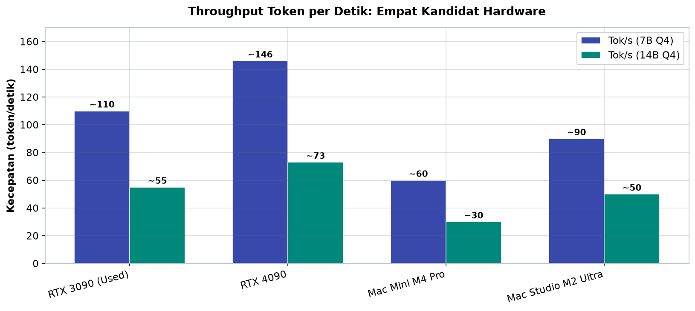
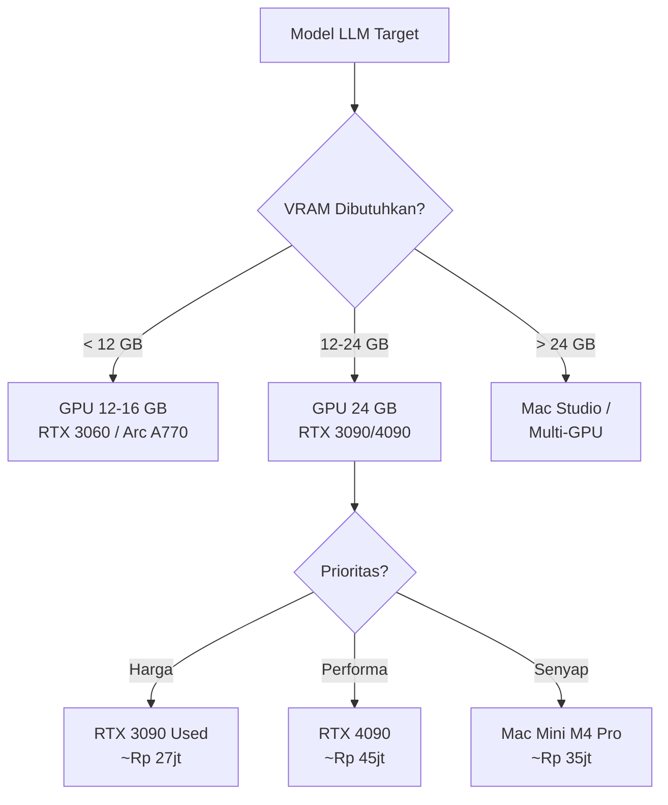
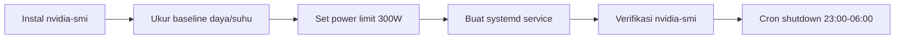

# Bab 6.2: Hardware

> Memilih hardware untuk server LLM rumah mirip memilih dapur untuk keluarga: terlalu mewah berarti ada uang yang menganggur dan ruang yang terbuang, terlalu sederhana berarti selalu antre saat semua orang lapar bersamaan. Bab ini memandu Anda memilih antara **RTX 3090 bekas**, **RTX 4090**, atau **Mac Studio/Mac Mini** — dengan angka nyata: VRAM, token per detik, watt, desibel, dan rupiah.

---

## 1. Tujuan Sub-Bab

Setelah membaca sub-bab ini, Anda akan mampu:

- Menghitung kebutuhan **VRAM** sebuah model LLM dari jumlah parameter dan kuantisasi, termasuk overhead *KV-cache*
- Membandingkan secara kuantitatif RTX 3090, RTX 4090, Mac Mini M4 Pro, dan Mac Studio M2 Ultra — dari *throughput*, daya, hingga kebisingan
- Memilih hardware sesuai model target dan jumlah pengguna rumah (4-8 orang), bukan sekadar mengikuti tren
- Menyusun *bill of materials* lengkap dengan estimasi biaya IDR yang realistis untuk pasar Indonesia, termasuk komponen pendukung (CPU, RAM, storage, PSU, case)
- Menerapkan optimasi daya 24/7: *undervolt*, *power limit*, dan *auto shutdown* GPU malam hari
- Memahami trade-off antara tiga pendekatan: *build* PC GPU, Mac Mini, dan Mac Studio — kapan masing-masing menang dan kapan kalah

---

## 2. Kebutuhan VRAM untuk Model LLM

Sebelum membeli apa pun, hitung dulu kebutuhan **VRAM** — ini seperti mengukur tinggi pintu sebelum membeli lemari. Rumus dasarnya sederhana: **VRAM = (parameter × bit per weight) / 8 + overhead KV-cache**. Model 8 miliar parameter dalam Q4 membutuhkan kira-kira 8B × 4 bit dibagi 8 = ~4 GB untuk bobot; ditambah KV-cache maka totalnya terkendali.

Contoh nyata: **Llama-3.1-8B Q4_K_M** membutuhkan ~4,5 GB untuk model plus ~2 GB *KV-cache*, total sekitar **6,5 GB** — nyaman di GPU 8-12 GB. Pola praktis yang bisa dipegang: model **7-8B nyaman di 12-16 GB**, model **13-14B membutuhkan 24 GB**, dan model **30-33B membutuhkan 32-48 GB**. Jika target Anda model kelas 70B, maka 24 GB saja tidak cukup — bahkan Q3_K_M yang terpangkas tetap menuntut skema *CPU offload*.

Kabar baiknya, lanskap model 2025-2026 menghadirkan tiga bintang baru yang mengubah perhitungan ini. Pertama, **Ministral 3 3B** (lisensi Apache 2.0) yang hanya ~1,8 GB dalam Q4 — cukup ringan untuk berjalan di Raspberry Pi atau NUC, bahkan *CPU-only*. Kedua, **Ministral 3 8B** dengan ~4,8 GB Q4 — *edge-optimized* dan nyaman di 8 GB VRAM, dirancang persis untuk *home server*. Ketiga, **DeepSeek V4 Flash** (284B total, **13B aktif**) yang hanya membutuhkan ~18 GB dalam INT4 — masih butuh 2x RTX 3090/4090, tetapi karena hanya 13 miliar parameter aktif per *forward pass*, *throughput*-nya luar biasa tinggi untuk ukurannya.

Satu lagi hal yang sering luput: *KV-cache* pada model generasi baru sudah sangat efisien. **DeepSeek V4 Pro** misalnya memiliki *KV-cache* hanya 10% dari V3.2 — untuk konteks 32K, ia hanya butuh ~1,6 GB dibandingkan ~16 GB pada model konvensional. Artinya, efisiensi arsitektur kini sama pentingnya dengan ukuran VRAM: dua kartu yang sama secara fisik bisa berbeda jauh secara praktis.

Berapa kebutuhan VRAM yang masuk akal untuk keluarga 4-8 orang? Dengan pola beban dari sub-bab 6.1 — puncak hanya 2-3 sesi paralel dengan *prompt* pendek — yang menjadi pembatas bukanlah ukuran model semata, melainkan *KV-cache* bersama dari sesi-sesi paralel itu. Model 8B Q4 dengan tiga sesi aktif membutuhkan sekitar 6,5 GB model ditambah beberapa GB *KV-cache* — masih longgar di 24 GB. Bahkan keluarga yang menginginkan *headroom* berlipat (model 14B Q4 plus sesi paralel) tetap nyaman di GPU 24 GB. Kesimpulannya: untuk skala rumah tangga, 24 GB adalah titik manis; yang menyusul hanyalah keputusan bijak memilih model.

Keputusan bijak yang dimaksud dimulai dari *quantization*. Keluarga yang baru mulai sering mengambil Q4_K_M sebagai standar — dan itu keputusan yang benar untuk 95% kasus. Q5_K_M menambah beberapa persen kualitas dengan biaya VRAM lebih tinggi; Q3_K_M dipakai hanya bila model terlalu besar untuk kartu yang tersedia (misalnya 70B di 24 GB). Aturan praktisnya: pilih kuantisasi tertinggi yang masih meninggalkan ruang *KV-cache* untuk sesi paralel keluarga — karena model yang "hampir muat" selalu lebih buruk daripada model yang "muat dengan nyaman". Data perbandingan kualitas antar kuantisasi untuk berbagai arsitektur dapat dilihat di benchmark publik yang dirangkum pada [2][3].

---

## 3. RTX 3090 vs RTX 4090 untuk Server Rumah

Jika keluarga memutuskan jalur PC, pertarungan sesungguhnya adalah antara dua kartu NVIDIA 24 GB: **RTX 3090** dan **RTX 4090**. Keduanya mampu menjalankan Llama-3.1-8B, Qwen-2.5-14B, hingga Llama-3.1-70B dalam Q3_K_M — perbedaannya ada pada kecepatan, daya, harga, dan kebisingan.

**RTX 3090 bekas** adalah raja *value*: 24 GB VRAM, sekitar **~250W**, dengan harga pasar Indonesia sekitar **Rp 10-14jt** untuk unit *used*. Ia menawarkan *throughput* ~110 token/detik untuk model 7B Q4 — kecepatan yang lebih dari cukup untuk 4-8 pengguna rumah tangga yang hanya memuncak 2-3 sesi bersamaan. Kelemahannya: *second-hand*, sehingga perlu uji ketat (suhu, *thermal pad*, kipas), dan konsumsi dayanya tetap butuh PSU yang jujur.

Pasar *used* di Indonesia memiliki ritmenya sendiri yang perlu dipahami: kartu bekas *mining* dan bekas kantor adalah dua kategori yang sangat berbeda. Kartu bekas kantor biasanya dirawat baik dan harganya lebih tinggi sedikit; kartu bekas *mining* murah tetapi sering membawa *thermal pad* yang aus. Aturan di lapangan: minta screenshot `nvidia-smi -q` (suhu, *power limit*, *memory usage*), uji *burn-in* 15 menit dengan llama.cpp atau benchmark, dan jangan pernah membayar penuh sebelum GPU terbukti stabil di *load*.

**RTX 4090** adalah pilihan performa puncak: 24 GB VRAM, ~146 token/detik untuk 7B Q4, tetapi konsumsi daya puncak **~350W** (bisa di-*undervolt* ke ~300W dengan performa 95%). Di ruang keluarga, TDP dan *noise* bukan detail kecil: kartu ini butuh *case* besar dengan *airflow* baik dan kipas yang terdengar saat beban penuh. Ia baru masuk akal jika keluarga benar-benar membutuhkan model besar (70B Q3) atau mengejar latensi paling rendah di beban puncak.

Secara teknis, perbandingan ini selaras dengan data benchmark SLM di *Hardware Corner* [3] dan *Small Language Models survey* [2]: pada model 7B Q4, RTX 4090 mencatat ~146 tok/s versus ~110 tok/s RTX 3090, dan pada 14B Q4 rasionya serupa. Perbedaan ~30% itu nyata, tetapi pertanyaannya tetap: apakah 30% kecepatan lebih penting daripada selisih puluhan juta rupiah dan suara kipas di ruang keluarga?

---

## 4. Mac Studio dan Mac Mini: Alternatif Senyap

Di sisi Apple, ada dua senjata dengan filosofi berbeda — **unified memory**: RAM dan VRAM menjadi satu kolam, sehingga tidak ada transfer CPU-GPU yang membuang waktu dan daya.

**Mac Studio M2 Ultra** membawa **192 GB unified memory** — satu-satunya opsi dalam daftar ini yang bisa menjalankan model **70B dalam FP16 tanpa kuantisasi**. Untuk keluarga yang mengutamakan kualitas jawaban *lossless*, ini kartu truf: tidak ada penurunan presisi, tidak ada *CPU offload*, dan kipasnya nyaris tidak terdengar. Harganya pun di kelasnya sendiri.

**Mac Mini M4 Pro 48GB** adalah kuda kerja sehari-hari: cukup untuk model **8-14B Q4_K_M**, *idle* hanya **7W**, dan *fanless* alias **0 dB** — dapat ditaruh di meja ruang keluarga tanpa siapa pun menyadarinya. Kelebihan utamanya justru pada karakter operasional: konsumsi 7W saat idle membuatnya layak menyala 24 jam, sesuatu yang mustahil untuk rig GPU.

Untuk keluarga dengan basis dokumen besar (RAG keluarga: foto, dokumen pajak, resep, jurnal), Mac Studio M2 Ultra punya keunggulan kedua yang jarang disebut: 192 GB unified memory tidak hanya memuat model besar, tetapi juga memungkinkan *embedding* dan *vector search* berjalan di memori yang sama tanpa menyentuh disk. Praktisnya, *indexing* puluhan ribu dokumen keluarga yang di Mac Mini memakan menit bisa selesai dalam detik — kelebihan yang baru terasa setelah keluarga benar-benar memakai RAG, bukan saat membeli.

Keduanya berbagi keunggulan struktural — *zero-copy inference* karena memori terpadu. Kekurangan yang sama: harga premium dan ekosistem terbatas pada Ollama/llama.cpp (tidak ada vLLM dengan dukungan penuh), sehingga pilihan model kuantisasi agak lebih sempit dibandingkan ekosistem CUDA.

Ada satu pertanyaan yang patut diajukan sebelum memilih antara rig GPU dan Mac: **di mana server itu akan tinggal?** Jika jawabannya ruang keluarga atau dekat kamar tidur, Mac Mini M4 Pro hampir selalu menang — 0 dB dan 7W idle adalah kemewahan yang tidak bisa dibeli di rig GPU mana pun. Jika jawabannya ruang kerja khusus atau garasi yang direnovasi, rig RTX 3090/4090 memberikan nilai jauh lebih besar per rupiah. Perhatikan bahwa ini bukan pertanyaan teknis, melainkan pertanyaan arsitektur rumah — dan jawabannya menentukan mana yang "lebih baik" bagi keluarga Anda.

Bagi keluarga yang berencana menambah antarmuka suara (Whisper + Piper, dibahas di sub-bab 6.4), dua pilihan ini juga berbeda sikap. Rig GPU menyediakan daya untuk menjalankan Whisper dan LLM sekaligus di kartu yang sama — satu GPU, dua beban. Mac Mini M4 Pro dengan 48 GB unified memory juga sanggup, tetapi *throughput* token/s-nya lebih rendah sehingga model besar terasa lebih lambat. Jika *voice* adalah prioritas keluarga, masukkan beban Whisper ke dalam perhitungan sebelum memilih — bukan hanya beban LLM-nya saja.

---

## 5. Komponen Pendukung: Membangun Rig yang Jujur

Memilih GPU hanyalah separuh cerita; separuh lainnya adalah komponen yang mengelilinginya. Empat aturan praktis: **motherboard + CPU** minimal mendukung *PCIe 4.0 x16* dengan prosesor 8+ core (Ryzen 7 atau Core i7) — inference tidak "terjebak" di jalur data; **RAM sistem 32-64 GB DDR5** untuk *KV-cache* dan OS; **storage** berupa NVMe 1-2 TB untuk model dan SATA 2-4 TB untuk data RAG keluarga; **PSU 850W Gold+** untuk RTX 4090 dan **750W** untuk RTX 3090; serta **case mid-tower** dengan *airflow* baik dan ruang untuk GPU panjang (>320mm) — kartu kelas ini panjang, dan memaksanya masuk case kecil berarti *thermal throttle*.

### Tabel Komponen Pendukung

| Komponen | Spesifikasi Minimum | Catatan |
|:---|:---|:---|
| **Motherboard + CPU** | PCIe 4.0 x16, CPU 8+ core (Ryzen 7 / Core i7) | Jalur data PCIe 4.0 wajib untuk 24 GB VRAM |
| **RAM sistem** | 32-64 GB DDR5 | Untuk KV-cache dan OS |
| **Storage** | NVMe 1-2 TB (model) + SATA 2-4 TB (RAG) | Model di NVMe, dokumen keluarga di SATA |
| **Power Supply** | 850W Gold+ (4090), 750W (3090) | *Headroom* 20% untuk *transient spike* |
| **Case** | Mid-tower, airflow baik, dukungan GPU >320mm | Kebisingan di ruang keluarga = kualitas hidup |

Urutan merakit juga berpengaruh pada hasil akhir. Praktik terbaik: pasang PSU dan manajemen kabel terlebih dahulu, dan pasang GPU paling akhir setelah seluruh *standoff* dan konektor terpasang. Kartu 24 GB umumnya panjang (>320mm) dan tebal tiga *slot* — siapkan penyangga anti-*sag* karena papan GPU kelas ini berat. Kesalahan paling umum perakit pemula di Indonesia adalah lupa memperhitungkan tinggi *heatsink* CPU terhadap ruang slot GPU — ukur jarak bebas terlebih dahulu, baru satukan semuanya. Satu jam ekstra di meja perakitan menyelamatkan keluarga dari satu hari pembongkaran ulang.

---

## 6. Optimasi Daya untuk Penggunaan 24/7

Server keluarga menyala lebih lama daripada server kantor rata-rata — maka setiap watt adalah keputusan desain. Tiga teknik utama: **undervolt** (RTX 4090 dapat dibatasi ke **300W** dengan kehilangan hanya ~5% performa), **auto shutdown GPU malam hari** lewat cron (*00:00-06:00*), yang menghemat sekitar **2-3 kWh per hari**, dan **fan curve senyap** — menjaga kipas GPU di kisaran 30-40% selama suhu di bawah 60°C. Langkah pertama saja hampir menghapus perbedaan biaya operasional antara rig GPU dan Mac Mini; langkah kedua menghapus sisanya.

Jangan lupakan dimensi kebisingan dalam perhitungan daya. Watt yang sama terasa sangat berbeda: 350W dari kipas tiga *fan* yang menderu di ruang kerja lebih mengganggu daripada 450W yang senyap. Bagi keluarga yang meletakkan server di ruang keluarga, kurva kipas bukan pengaturan kosmetik — membatasi putaran di 30-40% sampai suhu 60°C menjaga percakapan keluarga tetap terdengar. Ketika dua pilihan sama-sama "cukup", keputusan antara RTX 4090 dan Mac Mini sering jatuh pada hal yang tidak tertulis di lembar spesifikasi: apakah dengung kipas bisa diterima di ruang tengah rumah Anda.

---

## 7. Tabel Wajib

Tiga tabel berikut merangkum seluruh pembahasan teknis di atas dalam bentuk yang bisa dibawa ke toko komputer — spesifikasi, kesesuaian model, dan rupiah. Baca ketiganya sebagai satu kesatuan: Tabel 1 menjawab "seberapa cepat", Tabel 2 menjawab "model apa yang muat", dan Tabel 3 menjawab "berapa totalnya". Keputusan akhir lahir dari irisan ketiganya.

### Tabel 1: Perbandingan GPU/Mac untuk Home LLM Server

Empat kandidat utama berdampingan — perhatikan bahwa 'tercepat' tidak selalu 'terbaik' untuk rumah tangga.

| Spesifikasi | RTX 3090 (Used) | RTX 4090 | Mac Mini M4 Pro | Mac Studio M2 Ultra |
|:---|:---:|:---:|:---:|:---:|
| **VRAM / Unified Memory** | 24 GB GDDR6X | 24 GB GDDR6X | 48 GB | 192 GB |
| **Bandwidth** | 936 GB/s | 1,008 GB/s | ~400 GB/s | ~800 GB/s |
| **Tok/s (7B Q4)** | ~110 | ~146 | ~60 | ~90 |
| **Tok/s (14B Q4)** | ~55 | ~73 | ~30 | ~50 |
| **TDP Idle / Load** | 30W / 350W | 35W / 450W | 7W / 65W | 15W / 120W |
| **Noise** | 2 fan (30 dB) | 3 fan (35 dB) | Fanless (0 dB) | Fanless (0 dB) |
| **Harga Baru** | ~Rp 14jt (used) | ~Rp 28-30jt | ~Rp 30-35jt | ~Rp 60-70jt |
| **Total Build** | ~Rp 25-30jt | ~Rp 40-45jt | ~Rp 32-37jt | ~Rp 62-72jt |

Selisih kecepatan antar kandidat langsung terlihat ketika digambar — RTX 4090 memimpin di kedua ukuran model, tetapi RTX 3090 hanya tertinggal sekitar 25%.



*Gambar 6.2-1 — Throughput model 7B dan 14B Q4 pada empat hardware. RTX 4090 tercepat (~146 tok/s), tetapi RTX 3090 memberi 75% performanya dengan harga sekitar setengahnya — lebih dari cukup untuk puncak 2-3 sesi paralel keluarga.*

Ada dua bacaan penting dari tabel ini. Pertama, RTX 3090 membuktikan diri sebagai *value king*: performa 75% dari RTX 4090, TDP lebih rendah, harga sekitar setengahnya — dan untuk SLA keluarga (TTFT <2 detik, 3 sesi paralel), 110 tok/s sudah melebihi kebutuhan. Kedua, Mac Mini M4 Pro hanya menghasilkan ~60 tok/s untuk 7B, tetapi dengan 0 dB dan 7W idle, ia adalah satu-satunya kandidat yang boleh menyala 24 jam tanpa rasa bersalah. Jawabannya bukan "yang tercepat", melainkan "yang paling cocok dengan jadwal keluarga".

Ada pula dimensi berkelanjutan yang tidak muncul di lembar spesifikasi: nilai jual kembali. RTX 3090 yang dibeli bekas akan dijual kembali sebagai bekas dengan penyusutan relatif halus, sementara Mac Mini M4 Pro cenderung mempertahankan nilainya lebih baik di pasar Apple Indonesia. Faktor ini tidak mengubah keputusan teknis, tetapi ikut menentukan biaya kepemilikan nyata setelah 2-3 tahun — saat keluarga memutuskan naik kelas.

### Tabel 2: Kesesuaian Model per Hardware

Tabel ini menjawab pertanyaan paling praktis: model mana yang "muat" di mana?

| Model | Ukuran (Q4) | RTX 3090/4090 | Mac Mini M4 Pro | Mac Studio M2 Ultra |
|:---|:---:|:---:|:---:|:---:|
| Llama-3.2-3B | ~2 GB | Sangat Cepat | Cepat | Sangat Cepat |
| Llama-3.1-8B | ~5 GB | Sangat Cepat | Cepat | Sangat Cepat |
| Qwen-2.5-14B | ~8 GB | Cepat | Mampu | Cepat |
| Llama-3.1-70B Q3 | ~27 GB | Mampu (CPU offload) | Tidak muat | Cepat |
| DeepSeek-R1-32B | ~18 GB | Cepat | Tidak muat | Sangat Cepat |
| **Ministral 3 3B** | ~1.8 GB | Sangat Cepat | Sangat Cepat | Sangat Cepat |
| **Ministral 3 8B** | ~4.8 GB | Sangat Cepat | Cepat | Sangat Cepat |
| **Ministral 3 14B** | ~8.5 GB | Cepat | Mampu | Cepat |
| **DeepSeek V4 Flash (INT4)** | ~18 GB | Cepat (2x GPU) | Tidak muat | Cepat |

Ministral 3 (Apache 2.0, Desember 2025) adalah keluarga model *edge-optimized* dari Mistral AI: varian 3B ideal untuk server rumah berdaya rendah — bahkan berjalan sangat cepat di Mac Mini M4 Pro — sementara DeepSeek V4 Flash (284B total, 13B aktif) membutuhkan 2x RTX 3090/4090 dalam INT4. Pola yang muncul: untuk skala 4-8 user, kisaran 3B-14B adalah zona nyaman; model 30B+ barulah masuk akal bila keluarga punya kebutuhan khusus (misalnya *reasoning* DeepSeek-R1-32B), dan itu pun hanya di Mac Studio atau rig GPU.

Jika keluarga memilih jalur Mac dan suatu hari kebutuhan naik ke kelas 30B+, Mac Mini M4 Pro menyerah pada DeepSeek-R1-32B dan Llama-3.1-70B — itulah saat Mac Studio M2 Ultra baru masuk akal. Jalur migrasi yang wajar: mulai dari Mac Mini (8-14B), lalu naik ke Mac Studio hanya jika kebutuhan *reasoning* telah membuktikan diri, bukan sekadar rasa penasaran. Migrasi ini lebih mulus daripada pindah rig GPU, karena ekosistem Ollama dan lokasi folder model identik di kedua mesin.

### Tabel 3: Estimasi Biaya Build dalam IDR (Juni 2026)

Akhirnya, hitungan rupiah — estimasi pasar Indonesia per Juni 2026.

| Komponen | Build RTX 3090 (Hemat) | Build RTX 4090 (Performa) | Mac Mini M4 Pro |
|:---|:---:|:---:|:---:|
| **GPU / Unit** | RTX 3090 used ~14jt | RTX 4090 ~29jt | Built-in |
| **CPU** | Ryzen 7 5700X ~2.5jt | Ryzen 7 7800X3D ~5jt | M4 Pro |
| **Motherboard** | B550 ~1.5jt | X670E ~3.5jt | Built-in |
| **RAM** | 32 GB DDR4 ~1jt | 64 GB DDR5 ~3jt | 48 GB Unified |
| **Storage** | 1 TB NVMe ~1.2jt + 2 TB HDD ~1jt | 2 TB NVMe ~2jt + 4 TB SSD ~3jt | 2 TB SSD ~3jt |
| **PSU** | 750W Gold ~1.2jt | 1000W Gold ~2jt | Built-in |
| **Case + Cooling** | Mid-tower ~800rb | Mid-tower + AIO ~2jt | Built-in |
| **Total** | **~Rp 27.2jt** | **~Rp 48.5jt** | **~Rp 35jt** |

Perhatikan di mana uang mengalir: pada build RTX 3090, GPU mengambil 51% dari total; pada build 4090, GPU mengambil 60% dan baru dipasok CPU X3D kelas atas. Mac Mini M4 Pro menunjukkan daya tarik strukturalnya — semua komponen "sembunyi" dan harga total 35jt menempatkannya di tengah, dengan keunggulan 0 dB dan 7W idle yang tidak terlihat di kolom harga. Harga GPU retail dapat ditekan dengan memilih unit non-OC; begitu pula build 4090 dapat dihemat beberapa juta dengan komponen yang lebih bersahaja.

Kesimpulan biaya yang bisa dibawa pulang: ketiga jalur menawarkan *payback period* yang hampir sama terhadap langganan komersial (18 bulan untuk kasus Pak Rudi di akhir bab), sehingga keputusan tidak lagi soal "mana yang lebih murah" melainkan "mana yang lebih cocok". Jika keluarga bertanya dengan jujur — apakah mereka lebih butuh kesenyapan ruang keluarga atau kecepatan pada jam makan malam — jawabannya akan memilih sendiri. Angka di tabel ini juga menjadi acuan yang baik untuk negosiasi dengan *toko komputer*: komponen-komponennya publik, dan siapa pun bisa membandingkan [9].

---

## 8. Diagram & Visualisasi

### Gambar 1: Pipeline Pemilihan Hardware

Mulai dari satu pertanyaan — "model LLM apa yang ingin keluarga jalankan?" — dan biarkan diagram ini memandu hingga keputusan akhir.



Diagram ini merangkum seluruh bab dalam satu halaman: kebutuhan VRAM menentukan jenjang (di bawah 12 GB → GPU kelas menengah; 12-24 GB → 3090/4090; di atas → Mac Studio atau multi-GPU), lalu prioritas keluarga — **harga**, **performa**, atau **kesenyapan** — menentukan pemenangnya. Perhatikan bahwa Mac Mini M4 Pro muncul bahkan di cabang 12-24 GB: ia adalah jawaban untuk mereka yang memilih ketenangan di atas kecepatan.

Bagi keluarga yang berniat menelusuri diagram ini lebih jauh, ada satu pertanyaan lanjutan yang sering diajukan: "bagaimana jika kebutuhan model berubah di tengah jalan?" Jawaban diagram ini cukup jujur — jalur migrasi selalu lebih murah dari jalur pertama: mulai dengan Mac Mini atau RTX 3090 used (keduanya di bawah Rp 35jt), dan hanya naik kelas ketika kebutuhan benar-benar terbukti. Tidak ada diagram yang bisa menjawab rasa penasaran teknologi; yang bisa dilakukan diagram hanyalah menahan keinginan itu tetap di bawah ambang anggaran keluarga.

### Gambar 2: Alur Optimasi Daya Server Rumahan

Ketika keputusan hardware sudah bulat, urutan optimasi daya berikut menjaga tagihan listrik tetap wajar.



Langkah-langkah ini berurutan dan saling mengunci: tanpa *baseline* yang diukur, Anda tidak tahu berapa yang bisa dihemat; tanpa systemd service, *power limit* hilang setiap reboot; dan tanpa cron malam, penghematan 2-3 kWh/hari hanya tinggal janji [5].

Diagram ini sekaligus mengingatkan bahwa optimasi daya bukan aktivitas satu kali. *Power limit* yang dipasang hari ini bisa lenyap setelah pembaruan driver; *baseline* yang diukur saat cuaca dingin akan berbeda di musim panas. Kebiasaan yang benar adalah menjadikan pemeriksaan `nvidia-smi -q -d POWER` bagian dari rutinitas bulanan server — selayaknya keluarga mengecek tagihan listrik, bukan hanya menunggu kejutan di akhir bulan.

---

## 9. Praktikum / Hands-On

### Langkah 1: Undervolt RTX 4090 untuk Pemakaian 24/7

Turunkan konsumsi daya RTX 4090 dari 450W menjadi 300W — dengan kehilangan performa sekitar 5% dan penghematan yang bertahan seumur bangun.

```bash
# 1. Install nvidia-smi dan tools
sudo apt install nvidia-smi nvidia-settings

# 2. Cek suhu dan power baseline
nvidia-smi -q -d POWER,TEMPERATURE

# 3. Set power limit ke 300W (turun dari 450W)
sudo nvidia-smi -pl 300

# 4. Buat systemd service agar otomatis saat boot
cat << 'EOF' | sudo tee /etc/systemd/system/gpu-powerlimit.service
[Unit]
Description=Set GPU Power Limit
After=nvidia-persistenced.service

[Service]
Type=oneshot
ExecStart=/usr/bin/nvidia-smi -pl 300
RemainAfterExit=yes

[Install]
WantedBy=multi-user.target
EOF

sudo systemctl enable gpu-powerlimit.service
sudo systemctl start gpu-powerlimit.service

# 5. Verifikasi: nvidia-smi harus menunjukkan Power Limit 300W
nvidia-smi -q -d POWER | grep "Power Limit"
```

Jika `Power Limit` tidak berubah menjadi 300W, periksa apakah kartu Anda adalah varian dengan *custom BIOS* atau sedang dalam mode OC — sebagian kartu kelas atas menolak *power limit* di bawah nilai bawaan pabrik.

Jangan lupa mengukur dampaknya di tagihan: catat pembacaan `nvidia-smi -q -d POWER` sebelum dan sesudah *undervolt* saat beban yang sama. Selisihnya, dikalikan jam pemakaian bulanan, adalah angka yang harus dibandingkan dengan biaya listrik rumah (tarif rumahan sekitar Rp 1.400-1.700/kWh) — bagi keluarga yang server-nya menyala 16 jam sehari, teknologi ini saja bisa menghemat puluhan ribu rupiah per bulan tanpa mengurangi kepuasan pengguna.

### Langkah 2: Benchmark Model di Hardware Baru

Jangan percaya angka orang lain — ukur *hardware* Anda sendiri dengan script benchmark sederhana ini.

```bash
#!/bin/bash
# benchmark.sh — uji tok/s untuk berbagai model

MODELS=(
  "llama3.2:3b"
  "llama3.1:8b"
  "qwen2.5:14b"
)

for model in "${MODELS[@]}"; do
  echo "=== Benchmark: $model ==="
  ollama pull "$model" 2>/dev/null

  # Ukur prompt processing + token generation speed
  start=$(date +%s%N)
  output=$(ollama run "$model" --nowordwrap \
    "Hitung 25 * 37 dan jelaskan langkahnya dalam 3 kalimat." 2>/dev/null)
  end=$(date +%s%N)

  elapsed_ms=$(( (end - start) / 1000000 ))
  char_count=${#output}
  approx_tokens=$(( char_count / 4 ))
  tok_per_sec=$(( approx_tokens * 1000 / elapsed_ms ))

  echo "Waktu: ${elapsed_ms}ms | Output: ${char_count} chars | ~${tok_per_sec} tok/s"
  echo ""
done
```

Bandingkan hasil Anda dengan Tabel 1: jika `llama3.1:8b` Anda berada jauh di bawah ~110 tok/s (RTX 3090) atau ~146 tok/s (RTX 4090), periksa apakah GPU berjalan di PCIe gen 3, atau apakah prosesor menahan (`CPU bottleneck`). Angka perbandingan ini juga yang dipakai untuk memvalidasi kebutuhan VRAM di Tabel 2 [2][3].

Penting untuk diingat bahwa script ini mengukur *end-to-end* — termasuk waktu *prefill*, pemuatan model pertama kali, dan bahkan jaringan lokal. Lakukan setiap pengukuran tiga kali dan ambil median, karena GPU modern melakukan *boosting* yang membuat angka pertama dan kedua sering berbeda. Simpan hasilnya dalam catatan sederhana (misalnya file `benchmark-results.txt`); ketika keluarga menambah model atau mengganti kuantisasi, catatan ini menjadi dasar perbandingan yang jujur tentang apakah "peningkatan" itu nyata atau hanya perasaan.

### Langkah 3: Cron Job Auto Shutdown GPU Malam Hari

Terakhir, jadwalkan tidur bagi GPU — sama seperti anak-anak, perangkat pun butuh jam malam.

```bash
# /etc/cron.d/gpu-schedule
# Matikan GPU pukul 23:00, hidupkan pukul 06:00
0 23 * * * root /usr/local/bin/gpu-off.sh
0 6  * * * root /usr/local/bin/gpu-on.sh

# gpu-off.sh — unbind GPU driver untuk hemat daya
echo "0000:01:00.0" > /sys/bus/pci/drivers/nvidia/unbind
nvidia-smi -pm 0

# gpu-on.sh — bind kembali GPU
echo "0000:01:00.0" > /sys/bus/pci/drivers/nvidia/bind
nvidia-smi -pm 1
nvidia-smi -pl 300
```

Perhatikan bahwa `gpu-on.sh` juga memanggil `nvidia-smi -pl 300` — memastikan *power limit* yang Anda pasang di Langkah 1 tetap berlaku setiap pagi. Ganti `0000:01:00.0` dengan alamat PCIe GPU Anda (`lspci | grep -i nvidia`). Jika keluarga jarang bangun sebelum 06:00, geser jam nyalanya sesuai ritme rumah.

Dua catatan keamanan untuk praktik ini. Pertama, pastikan tidak ada proses *training* atau *fine-tuning* yang berjalan semalaman sebelum mengaktifkan *unbind* — GPU yang dilepas saat dipakai bisa menyebabkan data rusak. Kedua, untuk pemula, alternatif yang lebih aman daripada *unbind* adalah `nvidia-smi -pm 0` ditambah *idle timeout* di level sistem operasi (misalnya *suspend* penuh sistem via `systemd-suspend`): efeknya serupa secara daya, tetapi tanpa risiko terhadap sesi yang masih aktif. Keselamatan data keluarga selalu lebih berharga daripada hemat 2-3 kWh.

---

## 10. Studi Kasus: Pak Rudi (6 Anggota Keluarga, Budget Rp 30jt)

**Profil.** Pak Rudi bekerja kantoran, Ibu adalah guru, dan empat anaknya duduk di SD sampai SMA. Kebutuhan LLM keluarga: bantuan PR, resep masak, dan *smart home* — bukan riset ilmiah.

**Hardware.** PC rakitan dengan **RTX 3090 used (Rp 14jt)** + Ryzen 7 5700X + 32 GB DDR4 + 1 TB NVMe + 2 TB HDD, total sekitar **Rp 27jt** — menyisakan anggaran untuk *microphone array* dan *smart plug*.

**Model.** **Llama-3.1-8B Q4_K_M** untuk percakapan harian dan PR, plus **Qwen-2.5-7B** untuk tugas coding dan resep — keduanya muat nyaman di 24 GB, bahkan menyisakan ruang untuk model cadangan.

**Setup.** Ollama + Open WebUI + Home Assistant. GPU dijadwalkan *auto-shutdown* 23:00-06:00, dan *power limit* dipasang via systemd agar tidak pernah melampaui batas.

**Hasil.** Empat anak bisa bertanya PR bersamaan saat jam makan malam — puncak yang diprediksi di sub-bab 6.1 — dengan latensi rata-rata **2-3 detik**. Beban listrik tambahan hanya sekitar **Rp 150rb/bulan**.

**Penghematan.** Dibandingkan ChatGPT Team ($25/orang/bulan × 6 = $150/bulan), keluarga ini menghemat sekitar Rp 2,4jt/bulan — **balik modal dalam 18 bulan**, sementara rig tetap milik keluarga.

**Pengalaman penggunaan.** Yang menarik dari kasus ini bukan angka, melainkan perilaku: awalnya hanya Pak Rudi yang memakai asisten; dalam sebulan, anak-anak ikut — mula-mula untuk PR, lalu untuk bertanya hal-hal yang dulu mereka tanyakan ke Google. Ketika sekolah anak mengumumkan *home learning*, rig ini menjadi "perpustakaan tutor" yang melayani empat anak sekaligus tanpa antre. Sistem mulai tidak terlihat, dan itulah tanda keberhasilannya.

**Pelajaran.** Kuncinya bukan pada kartu termahal, melainkan pada kesesuaian: satu RTX 3090 bekas cukup untuk puncak 2-3 user, dan optimasi daya membuatnya layak tinggal di rumah. Pak Rudi mendapatkan 95% manfaat rig 4090 dengan 60% biaya — dan tidur nyenyak karena kipasnya tidak mengaum di kamar sebelah.

**Kendala di lapangan.** Pak Rudi sempat hampir membatalkan proyek ketika menemukan RTX 3090 bekas dengan suhu idle 55°C — tanda *thermal pad* yang sudah mengering. Solusinya sederhana: ganti *thermal pad* dan pasta termal (biaya sekitar Rp 300-500rb), dan suhu turun ke 38°C. Pelajaran penting bagi siapa pun yang membeli GPU bekas: anggarkan biaya perawatan awal sekitar Rp 500rb, dan jadikan uji suhu saat beban (misalnya 10 menit *burn-in* benchmark) sebagai syarat mutlak sebelum uang berpindah tangan.

Kendala kedua muncul dari hal yang lebih membosankan: kabel. PSU 750W yang dipakainya awalnya ternyata generasi lama dengan kabel PCIe yang longgar — listrik *gugup* membuat GPU sesekali *crash* saat beban penuh. Setelah mengganti dengan PSU modular modern dan satu kabel 12-pin yang solid, masalah hilang. Untuk build RTX 3090/4090, jangan hemat pada PSU: komponen ini yang menentukan apakah keluarga menikmati server selama bertahun-tahun atau berdamai dengan *restart* misterius setiap pekan.

---

## 11. Referensi

### Paper Jurnal/Konferensi

[1] Qu, Z., et al. (2024). *A Review on Edge Large Language Models: Design, Execution, and Applications*. arXiv: [2410.11845](https://arxiv.org/abs/2410.11845). DOI: [10.48550/arXiv.2410.11845](https://doi.org/10.48550/arXiv.2410.11845)

[2] Lu, Z., Li, X., Cai, D., Yi, R., Liu, F., Lan, W., Luan, J., Zhang, X., Lane, N.D., & Xu, M. (2024). *Small Language Models: Survey, Measurements, and Insights*. arXiv: [2409.15790](https://arxiv.org/abs/2409.15790). DOI: [10.48550/arXiv.2409.15790](https://doi.org/10.48550/arXiv.2409.15790)

[3] Levi, C. (2025). *RTX 4090 Local LLM Benchmarks, Context Scaling and Supported Models*. Hardware Corner. [https://www.hardware-corner.net/rtx-4090-llm-benchmarks/](https://www.hardware-corner.net/rtx-4090-llm-benchmarks/)

[4] Lang, M., et al. (2025). *On-Device LLMs for Home Assistant: Dual Role in Intent Detection and Response Generation*. arXiv: [2502.12923](https://arxiv.org/abs/2502.12923). DOI: [10.48550/arXiv.2502.12923](https://doi.org/10.48550/arXiv.2502.12923)

[5] Andreoletti, D., Rudi, A., Carpanzano, E., Lelli, F., & Leidi, T. (2026). *Privacy-Preserving LLM Inference in Practice: A Comparative Survey of Techniques, Trade-Offs, and Deployability*. Cryptology ePrint Archive, Paper 2026/105. [https://eprint.iacr.org/2026/105](https://eprint.iacr.org/2026/105)

### Referensi Pendukung

[6] Ollama. *GitHub Repository*. [https://github.com/ollama/ollama](https://github.com/ollama/ollama)

[7] NVIDIA. *nvidia-smi Documentation*. [https://developer.nvidia.com/nvidia-system-management-interface](https://developer.nvidia.com/nvidia-system-management-interface)

[8] ggerganov. *llama.cpp*. [https://github.com/ggerganov/llama.cpp](https://github.com/ggerganov/llama.cpp)

[9] PC Part Picker Indonesia. [https://pcpartpicker.com](https://pcpartpicker.com)

[10] Argmax Inc. *WhisperKit: On-Device Real-Time ASR*. [https://github.com/argmaxinc/WhisperKit](https://github.com/argmaxinc/WhisperKit)