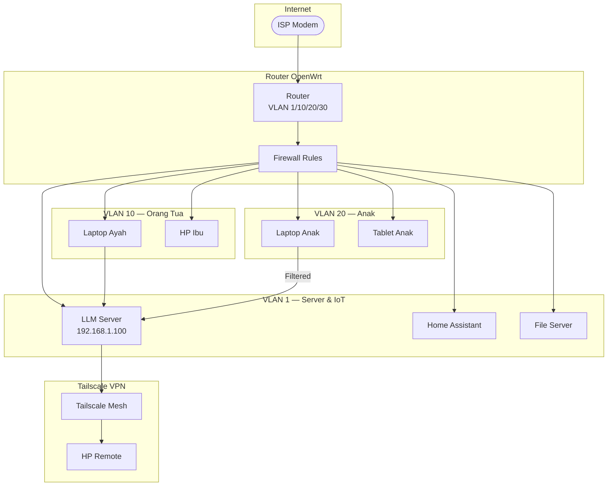
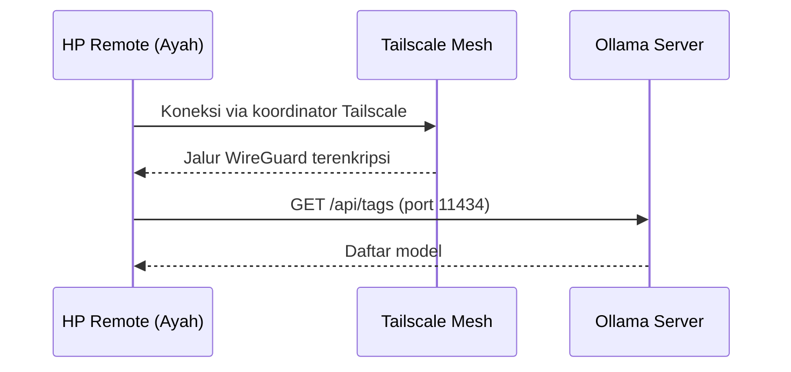

# Bab 6.3: Networking

> Sebuah rumah tangga membutuhkan pagar, bukan tembok benteng. Pagar yang bagus membuat penghuni bebas keluar-masuk, tetapi orang asing tetap di luar. Begitulah jaringan LLM rumahan seharusnya: seluruh keluarga menikmati akses cepat dari dalam, sementara dunia luar — dan internet — tidak pernah melihat satu pun celah masuk. Sub-bab ini mengajarkan cara membangun "pagar" itu: topologi LAN, mDNS, VPN mesh ala Tailscale, segmentasi VLAN, hingga enkripsi HTTPS lokal.

---

## 1. Tujuan Sub-Bab

Setelah membaca sub-bab ini, Anda akan mampu:

- Mendesain topologi jaringan rumah di mana LLM server menjadi *node* LAN yang tenang — bukan perangkat yang terpapar ke internet
- Mengonfigurasi akses lokal melalui **mDNS** (`llm-server.local`) dan *static DHCP reservation* sehingga semua perangkat selalu menemukan server
- Mengimplementasikan akses remote aman dengan **Tailscale** (dan memahami WireGuard sebagai alternatif *power user*) tanpa *port forwarding*
- Memisahkan lalu lintas keluarga dewasa dan anak melalui **VLAN** dengan aturan *firewall* yang membatasi jangkauan anak
- Mengelola **QoS** dan memahami mengapa inference LLM hampir tidak membebani bandwidth Wi-Fi rumah
- Menerapkan keamanan dasar: API key, HTTPS lokal dengan mkcert, dan *reverse proxy* dengan *logging*

---

## 2. Topologi Jaringan Home AI

Letakkan LLM server sebagaimana Anda meletakkan lemari dapur: **di dalam rumah**. Server tinggal sebagai satu *node* di LAN (misalnya `192.168.x.x`), bukan di DMZ dan bukan di *cloud*. Semua perangkat — TV, tablet, laptop, *smart speaker* — berkomunikasi dalam subnet yang sama, sehingga tidak ada lompatan jaringan, tidak ada *NAT traversal*, dan tidak ada pihak ketiga yang ikut membaca percakapan.

Model mentalnya: *local-first networking*. Doktrin ini juga menjadi justifikasi teknis di balik arsitektur *Harmony* [1], yang menempatkan seluruh pipeline — dari *intent detection* hingga kontrol perangkat — di dalam jaringan rumah dan hanya memanfaatkan internet untuk hal-hal yang benar-benar membutuhkannya (misalnya pembaruan model). Dengan demikian, *outage* ISP tidak pernah berarti *outage* asisten keluarga.

Sebagai analogi, bayangkan rumah dengan sumur sendiri: air minum tidak pernah bergantung pada PDAM, dan mati listriknya PDAM hanya berarti Anda tidak bisa mencuci mobil — bukan tidak bisa minum. Begitu pula arsitektur ini: padamnya internet tidak menghentikan pekerjaan rumah yang paling sering — PR anak, resep, ringkasan dokumen — karena semuanya diproses di sumur (server) yang ada di halaman sendiri.

Dua mekanisme membuat akses ini nyaman. Pertama, **mDNS** (multicast DNS, di Linux dikenal sebagai **Avahi**) memungkinkan perangkat menemukan server lewat nama seperti `http://llm-server.local:11434` tanpa menghafal IP. Kedua, **static DHCP reservation** di router memastikan IP server tidak berubah-ubah — pasangan ideal untuk mDNS, karena semua perangkat tahu ke mana harus berbicara. Router yang menyediakan kedua fitur ini adalah syarat minimal dari seluruh desain bab ini.

Pilihan IP untuk server juga bukan detail kecil. Hindari menempatkan server di luar rentang DHCP router tanpa alasan yang jelas: ketika *lease* berakhir di tengah malam, semua perangkat keluarga bisa kehilangan jejak. Praktik yang paling mudah dipelihara: tetapkan IP statis di dalam rentang DHCP (misalnya `192.168.1.100`, di atas rentang perangkat otomatis), kunci dengan reservasi DHCP di router, dan catat di tempat yang bisa dilihat oleh siapa pun yang mengurus server — lembar catatan tempel di rak server cukup.

---

## 3. DNS Lokal dan mDNS

Tanpa DNS lokal, setiap kali router me-*restart*, semua perangkat bisa kehilangan jejak server. mDNS menyelesaikan masalah ini dengan cara yang elegan: perangkat bertanya di jaringan lokal, "siapa `llm-server.local`?" dan server menjawab sendiri — tanpa membutuhkan server DNS pusat.

Bagi keluarga yang ingin kontrol lebih ketat, **Pi-hole** adalah peningkatan yang layak: selain menjadi *DNS server* lokal dengan *custom record* (misalnya memetakan `llm.internal` ke IP server), Pi-hole sekaligus memblokir *tracker* dan iklan di seluruh jaringan — manfaat yang langsung dirasakan semua perangkat keluarga. Kombinasi mDNS untuk kenyamanan dan DNS lokal untuk kontrol adalah standar emas jaringan rumah.

Satu catatan teknis untuk *record* kustom: pastikan nama yang dipilih tidak bertabrakan dengan nama mDNS, karena dua mekanisme berbeda ini bisa saling "memperebutkan" jawaban. Pakailah domain yang jelas berbeda, misalnya `llm.internal` untuk DNS dan `llm-server.local` untuk mDNS — dua nama, dua jalur, satu server. Jika suatu hari kedua mekanisme memberi jawaban berbeda, perangkat tertentu akan mengikuti yang pertama kali dijawab; konsistensi nama menghindari kebingungan yang sulit dideteksi ini.

---

## 4. Zero-Trust Remote Access via Tailscale

Suatu sore, Ayah yang sedang dinas luar kota perlu mengakses LLM server — mungkin untuk mengambil dokumen, atau hanya memastikan server hidup. Inilah saatnya keunggulan **Tailscale** bekerja: *mesh VPN* berbasis **WireGuard** yang membangun terowongan terenkripsi *end-to-end* antar perangkat Anda, tanpa *port forwarding*, tanpa DDNS, tanpa IP statis publik.

Cara kerjanya menyerupai grup keluarga tertutup: setiap perangkat yang di-*login* ke akun Tailscale yang sama menjadi anggota "jaringan pribadi" yang saling bisa menemukan — bahkan di balik NAT rumah, hotel, atau jaringan kantor. Yang membuat Tailscale unggul untuk keluarga adalah **ACL** (Access Control List): Anda bisa membatasi perangkat anak hanya boleh mengakses `llm-server:11434`, sementara perangkat orang tua menikmati akses penuh. *Parental control* pun berpindah dari level aplikasi ke level jaringan.

WireGuard, sebagai protokol fondasinya, tetap relevan bagi *power user* yang ingin membangun situs-ke-situs sendiri tanpa perantara koordinasi Tailscale — tetapi biaya administrasinya jauh lebih tinggi, dan untuk kebutuhan keluarga, Tailscale hampir selalu pilihan yang lebih bijak.

Pilihan antara Tailscale dan WireGuard murni WireGuard sebenarnya bukan pertarungan teknologi, melainkan pertarungan waktu luang keluarga: WireGuard menuntut Anda mengelola *key* per perangkat, memastikan *NAT traversal*, dan menulis konfigurasi di tiap ujung — pekerjaan yang mengasyikkan bagi *enthusiast*, tetapi menjadi *tech debt* bagi keluarga yang pengurusnya sibuk. Ukurannya sederhana: jika Anda menikmati menulis konfigurasi di akhir pekan, WireGuard adalah taman bermain Anda; jika tidak, Tailscale memberikan 90% manfaat dengan 10% pekerjaan.

---

## 5. Segmentasi VLAN untuk Parental Control

Sebuah rumah hanya punya satu pintu depan, tetapi kamar-kamar di dalamnya bisa dikunci masing-masing. **VLAN** adalah pembatas tak terlihat itu: segmen jaringan yang terisolasi secara logis di router OpenWrt, pfSense, atau MikroTik.

Desain standar untuk keluarga: **VLAN 10** untuk orang tua — akses penuh ke LLM server dan internet tanpa filter; **VLAN 20** untuk anak — akses terbatas, DNS terfilter (misalnya AdGuard), dan tidak bisa SSH ke server; serta **VLAN 30** untuk tamu — isolasi total, internet saja. Aturan *firewall*-nya sederhana namun tegas: *allow* akses VLAN 20 ke server LLM hanya melalui port tertentu (misalnya port Open WebUI), blokir sisanya.

Konteks keamanannya harus dibaca jujur: sistem *privacy-preserving* seperti HomeLLaMA [2] menekankan bahwa ancaman terbesar smart home bukan *hacker* luar, melainkan kebocoran akses dari perangkat keluarga sendiri — tablet anak yang kena *malware*, atau perangkat IoT dengan kredensial lemah. Segmentasi VLAN adalah cara terstruktur untuk membatasi "radius ledakan" insiden semacam itu: *malware* di VLAN 20 tidak akan pernah melihat laptop kerja orang tua di VLAN 10.

Perlu dicatat bahwa VLAN bukan pengganti kontrol di tingkat aplikasi, melainkan fondasi yang membawahinya. Ketika sub-bab 6.6 membahas *parental control* pada konten LLM, kebijakan itu bekerja di atas jaringan yang sudah disegmentasi ini — anak tidak bisa "lompat" ke VLAN 10 hanya dengan berpindah perangkat. Inilah prinsip pertahanan berlapis: setiap lapisan menutup kelemahan lapisan sebelumnya, dan segmen jaringan adalah lapisan paling bawah yang menopang semuanya.

---

## 6. QoS dan Bandwidth Management

Kabar baiknya: **LLM inference hampir tidak membebani jaringan rumah**. Satu *request* hanya membawa kurang dari 10 KB, dan *response* kurang dari 50 KB — jauh lebih kecil daripada satu foto WhatsApp. Dengan Wi-Fi rumah 100-300 Mbps, bahkan 20 pengguna sekaligus tidak akan membuat *bandwidth* menangis. Analisis *network constraints* pada SLM *edge deployment* [5] menegaskan hal yang sama: untuk beban keluarga, *bandwidth* bukanlah hambatan — latensi-lah yang perlu dijaga.

Tetap ada dua aturan praktis. Pertama, utamakan *traffic* ke port **11434** (Ollama) melalui aturan QoS di router, terutama jika jaringan sedang dipenuhi *streaming* anak-anak — memastikan respons asisten tidak ikut tersendat. Kedua, untuk *voice pipeline* (Whisper), jaga latensi di bawah **200 ms** pada Wi-Fi 5 GHz; angka ini nyaman untuk komunikasi suara dua arah.

Untuk rumah dengan banyak pemutar video, aturan QoS pada port 11434 juga punya efek samping yang tidak terduga: *streaming* 4K dari tiga perangkat sekaligus bisa membuat router kelas menengah kewalahan memproses paket — bukan karena *bandwidth* habis, melainkan karena CPU router pusing. Jika keluarga merasakan asisten "menggantung" saat anak menonton di kamar, coba bertahap: aktifkan *hardware acceleration* atau *flow offloading* di router, pastikan server terhubung kabel ke *bridge port* yang tidak melewati NAT *software*, baru kemudian mempertimbangkan penggantian router. Diagnostik bertahap lebih murah daripada membeli perangkat baru yang ternyata tidak menyelesaikan masalah.

Ada dua kasus menarik yang perlu dipahami arsitek keluarga. **Ministral 3 3B** dapat di-*deploy* sebagai *edge node* di perangkat berbeda, dan komunikasi antar *node* untuk *speculative decoding* terdistribusi menuntut latensi LAN **di bawah 5 ms** — masih sangat aman di jaringan kabel rumah. Sementara itu, **DeepSeek V4 Flash** dengan arsitektur MoE *sparse* hanya mengaktifkan 13B parameter per *request* — mengurangi *traffic all-reduce* dalam *distributed serving*, sebuah efisiensi yang membuat multi-GPU tetap masuk akal di jaringan rumah.

---

## 7. Keamanan Dasar

Lima aturan yang menutup bab ini bersifat non-negotiable. **Jangan pernah *expose* port Ollama/vLLM ke WAN** — port 11434 yang terbuka ke internet setara meninggalkan pintu rumah terbuka. Gunakan **API key** untuk akses ke Open WebUI sehingga hanya perangkat keluarga yang terautentikasi yang bisa bertanya. Pasang **HTTPS via mkcert** (local CA) untuk mengenkripsi *traffic* di dalam LAN — melindungi percakapan dari perangkat IoT yang mungkin "mendengarkan" di jaringan yang sama. Letakkan **nginx *reverse proxy*** di depan layanan sebagai titik masuk tunggal. Dan yang terakhir, aktifkan **logging akses** di proxy tersebut — bukan untuk memata-matai keluarga, melainkan untuk mengetahui ketika ada yang aneh.

*Logging* yang dimaksud cukup sederhana: nginx mencatat alamat IP klien, waktu, dan jalur yang diminta ke file log yang ditulis *append-only*. Kebiasaan baiknya, periksa log sekali sebulan sambil minum kopi — cari anomali seperti permintaan dari IP yang tidak dikenal atau *probe* ke jalur admin. Keluarga yang disiplin membaca log bulanannya jarang menjadi korban kejutan yang sebenarnya bisa dicegah sejak dini; ini adalah "melihat kamera CCTV" untuk jaringan rumah.

---

## 8. Tabel Wajib

### Tabel 1: Skema Subnet dan VLAN untuk Keluarga

Denah jaringan lengkap yang akan kita bangun di tutorial — empat segmen dengan peran berbeda.

| VLAN | Nama | IP Range | Pengguna | Akses LLM | Internet Filter | Catatan |
|:---|:---|:---|:---|:---|:---|:---|
| **1** | Native LAN | 192.168.1.0/24 | Semua perangkat IoT | Langsung | Tidak | Smart TV, speaker |
| **10** | Orang Tua | 192.168.10.0/24 | Ayah + Ibu | Full | Tidak | Laptop, HP kerja |
| **20** | Anak | 192.168.20.0/24 | 3 Anak | Terbatas | Ya (AdGuard) | Hanya via Open WebUI |
| **30** | Guest | 192.168.30.0/24 | Tamu | Tidak | Ya | Isolasi total |

Perhatikan dua keputusan desain. Pertama, perangkat IoT sengaja berada di VLAN 1 bersama server — bukan untuk memudahkan *hacker*, melainkan karena sebagian besar *smart plug* dan TV tidak bisa dikonfigurasi dengan baik di VLAN terpisah; kompensasinya, jaringan ini tidak pernah menerima tamu atau anak-anak. Kedua, anak tidak dilarang menggunakan LLM — aksesnya *terbatas*: hanya lewat Open WebUI, di mana kontrol orang tua (sub-bab 6.6) bekerja di atas jaringan ini. Larangan total justru lebih berbahaya, karena memaksa anak mencari jalan lain tanpa pengawasan.

### Tabel 2: Metode Akses ke LLM Server

Berbagai jalur menuju server — dari yang termudah hingga yang paling terkunci.

| Metode | Kecepatan | Keamanan | Setup | Ideal Untuk |
|:---|:---:|:---:|:---:|:---|
| **LAN langsung (HTTP)** | Sangat Cepat | Rendah | Mudah | Perangkat di rumah |
| **mDNS (hostname.local)** | Cepat | Rendah | Mudah | Akses lokal tanpa IP |
| **Tailscale (mesh VPN)** | Sedang | Sangat Tinggi | Sedang | Akses remote aman |
| **WireGuard (site-to-site)** | Tinggi | Tinggi | Sulit | Power user |
| **Cloudflare Tunnel** | Lambat | Tinggi | Sedang | Tidak direkomendasikan |

Bacaan pentingnya adalah pertukaran kecepatan versus keamanan. Untuk perangkat di rumah, *LAN langsung* dan *mDNS* adalah raja — tetapi keamanannya rendah karena apa pun di jaringan yang sama dapat berbicara langsung ke port. Tailscale menawarkan kompromi terbaik untuk akses remote: keamanan *sangat tinggi* dengan setup hanya *sedang*. Cloudflare Tunnel ditempatkan di daftar ini sebagai peringatan: meski teknisnya berfungsi, rute yang membawa *traffic* keluarga keluar ke *edge* pihak ketiga bertentangan dengan pilar *privacy* yang kita bangun di sub-bab 6.1.

Satu pertanyaan yang sering muncul: bolehkah menggabungkan beberapa metode? Justru dianjurkan — inilah *defense in depth*. Rumah yang sehat memakai LAN langsung untuk TV dan *speaker* (perangkat yang tidak menyimpan data), Open WebUI dengan API key untuk laptop anak, dan Tailscale untuk perangkat orang tua di luar rumah. Campuran ini bukan kebocoran desain, melainkan penerjemahan langsung dari tingkat kepercayaan yang berbeda-beda terhadap setiap perangkat: semakin pribadi datanya, semakin ketat jalannya.

### Tabel 3: Estimasi Biaya Komponen Jaringan

Kabar baiknya: jaringan ini murah. Seluruh "pagar" keluarga bisa dibangun di bawah Rp 3,5jt.

| Komponen | Fungsi | Harga (IDR) |
|:---|:---|:---:|
| Router OpenWrt (MikroTik hAP ax2) | VLAN, QoS, firewall | ~Rp 1.2jt |
| Access Point Wi-Fi 6 (TP-Link EAP610) | Cakupan 4-8 user | ~Rp 800rb |
| Switch managed 8-port (TP-Link TL-SG105E) | VLAN tagging | ~Rp 400rb |
| Pi-hole / Raspberry Pi 4 | DNS filtering + AdGuard | ~Rp 700rb |
| Kabel UTP Cat6 10m | Koneksi server ke switch | ~Rp 100rb |

Perbandingan yang jujur: kurang dari sepersepuluh biaya server LLM (Rp 25-45jt), tetapi komponen ini menentukan apakah seluruh sistem aman dan nyaman digunakan. Prioritas anggaran yang masuk akal: router dulu (otak dari semua kebijakan), lalu AP (jangkauan menentukan pengalaman), baru Pi-hole dan switch. Untuk rumah kecil, Pi-hole bahkan bisa diganti *container* di server LLM — menghemat satu perangkat lagi.

---

## 9. Diagram & Visualisasi

### Gambar 1: Topologi Jaringan Home AI

Ini adalah peta seluruh desain jaringan keluarga — perhatikan bahwa internet hanya menyentuh tepi diagram, dan keluarga berkomunikasi dengan server di dalam.



Dua hal yang perlu dibaca dari diagram ini. Pertama, alur internet berhenti di router: *WAN* hanya memberi internet, tidak pernah membuka jalan menuju server — tidak ada panah dari internet langsung ke LLM. Kedua, perhatikan perbedaan dua jalur menuju server: Laptop Ayah terhubung langsung (panah polos, akses penuh), sementara Laptop Anak terhubung dengan label *Filtered* — hanya lewat port Open WebUI. Di ujung kanan, HP Remote Ayah masuk melalui Tailscale Mesh — jalur terenkripsi yang menembus internet tanpa membuka port apa pun [3].

### Gambar 2: Alur Koneksi Remote via Tailscale

Untuk memahami "keajaiban" Tailscale, ikuti perjalanan satu permintaan dari HP di luar kota:



Perhatikan bahwa koordinator Tailscale hanya mempertemukan kedua perangkat — data tidak pernah mengalir melalui server Tailscale. Setelah *handshake*, Ayah dan server rumah berbicara langsung melalui terowongan WireGuard, dengan enkripsi *end-to-end*. Ini adalah pola *zero-trust*: tidak ada satu pun pihak ketiga yang bisa membaca percakapan, dan tidak ada satu pun port router yang terbuka [4].

Satu kebiasaan keluarga yang harus dipupuk sejak dini: jangan pernah berbagi akun Tailscale antar anggota keluarga. Buat akun terpisah per orang dewasa, dan beri *tag* perangkat anak (`tag:kids`) pada hari pertama. Berbagi akun mungkin terasa nyaman di awal, tetapi setiap perangkat yang login berarti satu pintu lagi menuju jaringan pribadi — kebiasaan ini jauh lebih mudah ditanamkan saat jaringan masih kecil daripada dibereskan setelah tumbuh besar.

---

## 10. Praktikum / Hands-On

### Langkah 1: Setup Tailscale untuk Akses Remote Aman

Mulai dari server LLM: jadikan ia anggota jaringan pribadi keluarga.

```bash
# 1. Install Tailscale di server LLM
curl -fsSL https://tailscale.com/install.sh | sh
sudo tailscale up --accept-routes --advertise-routes=192.168.1.0/24

# 2. Install di device klien (phone/laptop)
# Download dari https://tailscale.com/download

# 3. Konfigurasi ACL (tailscale-acl.yaml)
# Di admin console Tailscale, buat ACL:
# {
#   "acls": [
#     {"action": "accept", "src": ["tag:parents"], "dst": ["*:*"]},
#     {"action": "accept", "src": ["tag:kids"], "dst": ["llm-server:11434"]}
#   ],
#   "tagOwners": {
#     "tag:parents": ["email@example.com"],
#     "tag:kids":    ["email@example.com"]
#   }
# }

# 4. Verifikasi koneksi
tailscale status
ping 192.168.1.100  # Harus reachable dari remote
curl http://192.168.1.100:11434/api/tags
```

ACL di atas menerjemahkan kebijakan keluarga ke dalam kode: perangkat bertag `kids` hanya diizinkan mengakses port 11434 di `llm-server`, sedangkan `parents` menikmati akses penuh. Jika langkah verifikasi `curl` berhasil dari luar rumah, Anda sudah memiliki *remote access* yang aman tanpa satu pun perubahan di router.

Jika keluarga memiliki banyak perangkat, aktifkan juga *MagicDNS* Tailscale (default): setiap perangkat mendapat nama seperti `llm-server.tailnet-name.ts.net` yang bisa dipakai dari mana pun. Verifikasi final sebaiknya dilakukan dari jaringan *hotspot* HP (paket data), bukan dari Wi-Fi rumah — jika hanya diuji dari dalam rumah, Anda tidak benar-benar menguji *remote access*.

### Langkah 2: Konfigurasi VLAN di OpenWrt

Sekarang bangun tembok dalam rumah: tiga VLAN yang terisolasi namun tetap saling terhubung secara terkontrol.

```bash
# 1. Buat interface VLAN
# Di LuCI → Network → Interfaces, tambah:
# VLAN 10 (Orang Tua): eth0.10 — 192.168.10.1/24
# VLAN 20 (Anak): eth0.20 — 192.168.20.1/24

uci set network.vlan10=interface
uci set network.vlan10.ifname="eth0.10"
uci set network.vlan10.proto="static"
uci set network.vlan10.ipaddr="192.168.10.1"
uci set network.vlan10.netmask="255.255.255.0"

uci set network.vlan20=interface
uci set network.vlan20.ifname="eth0.20"
uci set network.vlan20.proto="static"
uci set network.vlan20.ipaddr="192.168.20.1"
uci set network.vlan20.netmask="255.255.255.0"

uci commit network
/etc/init.d/network restart

# 2. Firewall rule: VLAN 20 hanya bisa akses port 11434 ke server
uci add firewall rule
uci set firewall.@rule[-1].name="Allow-Kids-to-LLM"
uci set firewall.@rule[-1].src="vlan20"
uci set firewall.@rule[-1].dest="lan"
uci set firewall.@rule[-1].dest_ip="192.168.1.100"
uci set firewall.@rule[-1].dest_port="11434"
uci set firewall.@rule[-1].target="ACCEPT"
uci commit firewall
/etc/init.d/firewall restart
```

Setelah kedua aturan ini aktif, verifikasi dari perangkat di VLAN 20: `curl http://192.168.1.100:11434/api/tags` harus sukses, tetapi `ssh 192.168.1.100` harus ditolak. Itulah perbedaan antara "pagar" dan "tembok": anak tetap bisa bertanya pada asisten, tetapi tidak bisa masuk ke *server room*.

### Langkah 3: Setup HTTPS Lokal dengan mkcert

Terakhir, enkripsi *traffic* dalam LAN — sehingga percakapan keluarga dengan asisten tidak lagi "polos" bagi perangkat IoT yang berbagi jaringan yang sama.

```bash
# 1. Install mkcert
brew install mkcert  # macOS
sudo apt install mkcert  # Linux

# 2. Buat local CA dan trust
mkcert -install

# 3. Generate sertifikat untuk LLM server
mkcert llm-server.local 192.168.1.100

# 4. Config nginx reverse proxy dengan HTTPS
cat << 'EOF' | sudo tee /etc/nginx/sites-available/llm-proxy
server {
    listen 443 ssl;
    server_name llm-server.local;
    ssl_certificate /etc/ssl/certs/llm-server.local.pem;
    ssl_certificate_key /etc/ssl/private/llm-server.local-key.pem;

    location / {
        proxy_pass http://localhost:11434;
        proxy_set_header Host $host;
    }
}
EOF
```

Setelah `mkcert -install` di setiap perangkat keluarga, browser akan mempercayai sertifikat lokal dan ikon gembok muncul di bilah alamat — pertanda *traffic* antara perangkat dan server kini terenkripsi, meski keduanya berada dalam satu rumah.

---

## 11. Studi Kasus: Keluarga Wijaya (5 Anggota, Jaringan 2 Lantai)

**Profil.** Rumah dua lantai dengan lima anggota keluarga. Server LLM berada di ruang kerja lantai 1, dan internet ISP 100 Mbps. Tantangannya: rumah bertingkat dengan kebutuhan akses berbeda-beda di setiap lantai.

**Jaringan.** Router **MikroTik hAP ax2** + dua **AP TP-Link EAP610** (satu per lantai), disambung *switch managed* TP-Link TL-SG105E. Total investasi jaringan sekitar Rp 3,2jt — termasuk router ~Rp 1,2jt, dua AP ~Rp 1,6jt, dan switch ~Rp 400rb.

**Segmentasi.** VLAN 10 untuk orang tua: Ayah (pekerja IT) dan Ibu (dokter) menikmati akses penuh. VLAN 20 untuk tiga anak SD-SMP: akses LLM hanya melalui Open WebUI, dengan DNS terfilter AdGuard. VLAN 30 untuk IoT — Smart TV, kamera, *smart plug* — diisolasi penuh dari perangkat pribadi keluarga.

**Remote Access.** Tailscale terpasang di HP Ayah, sehingga ia bisa mengakses server LLM saat dinas luar kota — tanpa satu pun port router dibuka.

**Hasil.** Anak-anak hanya bisa bertanya lewat Open WebUI, tidak pernah menyentuh API langsung — *parental control* tingkat jaringan yang berjalan bahkan tanpa bergantung pada pengaturan aplikasi. DNS filtering memblokir situs dewasa di seluruh perangkat VLAN 20. Ibu dan Ayah bekerja dari lantai dua dengan latensi <5 ms ke server lantai satu. Dan ketika Ayah berada di luar kota, ia tetap masuk ke server lewat Tailscale dalam beberapa detik.

**Pelajaran.** Keamanan jaringan keluarga adalah lapisan, bukan satu kunci: VLAN membatasi radius ledakan, DNS filter menyaring konten, Tailscale menembus jarak, dan HTTPS lokal melindungi dari perangkat yang berbagi kabel yang sama. Totalnya — di bawah Rp 3,5jt — adalah harga termurah untuk ketenangan pikiran yang dibeli keluarga Wijaya setiap malam.

**Kendala yang paling mengesankan justru datang dari lantai dua.** Anak-anak sering mengeluh asisten "lambat" padahal server nyaris idle. Investigasi menemukan tablet mereka terhubung ke AP lantai dua dengan sinyal dua baris — masalah *coverage*, bukan *throughput*. Setelah *roaming* diaktifkan dan satu AP dipindah dua meter, keluhan hilang sama sekali. Pelajaran terakhir dari bab ini: dalam jaringan keluarga, kualitas Wi-Fi adalah 80% dari pengalaman pengguna — tidak peduli seberapa cepat GPU di ruang kerjanya.

---

## 12. Referensi

### Paper Jurnal/Konferensi

[1] Chen, Y., et al. (2024). *Harmony: A Privacy-Preserving and Robust Smart Home Assistant Powered by Locally Deployable Llama3-8B*. arXiv: [2410.14252](https://arxiv.org/abs/2410.14252). DOI: [10.48550/arXiv.2410.14252](https://doi.org/10.48550/arXiv.2410.14252)

[2] Huang, X., Shen, L., Ma, Z., & Zheng, Y. (2025). *Towards Privacy-Preserving and Personalized Smart Homes via Tailored Small Language Models*. IEEE Transactions on Mobile Computing. arXiv: [2507.08878](https://arxiv.org/abs/2507.08878). DOI: [10.48550/arXiv.2507.08878](https://doi.org/10.48550/arXiv.2507.08878)

[3] Andreoletti, D., Rudi, A., Carpanzano, E., Lelli, F., & Leidi, T. (2026). *Privacy-Preserving LLM Inference in Practice: A Comparative Survey of Techniques, Trade-Offs, and Deployability*. Cryptology ePrint Archive, Paper 2026/105. [https://eprint.iacr.org/2026/105](https://eprint.iacr.org/2026/105)

[4] Qu, Z., et al. (2024). *A Review on Edge Large Language Models: Design, Execution, and Applications*. arXiv: [2410.11845](https://arxiv.org/abs/2410.11845). DOI: [10.48550/arXiv.2410.11845](https://doi.org/10.48550/arXiv.2410.11845)

[5] Lu, Z., Li, X., Cai, D., Yi, R., Liu, F., Liu, W., Luan, J., Zhang, X., Lane, N.D., & Xu, M. (2025). *Demystifying Small Language Models for Edge Deployment*. Proceedings of the 63rd Annual Meeting of the ACL. DOI: [10.18653/v1/2025.acl-long.718](https://doi.org/10.18653/v1/2025.acl-long.718)

### Referensi Pendukung

[6] Tailscale. *Zero-config VPN*. [https://tailscale.com](https://tailscale.com)

[7] OpenWrt. *VLAN Documentation*. [https://openwrt.org/docs/guide-user/network/vlan](https://openwrt.org/docs/guide-user/network/vlan)

[8] WireGuard. *Official Documentation*. [https://www.wireguard.com](https://www.wireguard.com)

[9] Pi-hole. *Network-wide Ad Blocking*. [https://pi-hole.net](https://pi-hole.net)

[10] mkcert. *Local HTTPS*. [https://github.com/FiloSottile/mkcert](https://github.com/FiloSottile/mkcert)